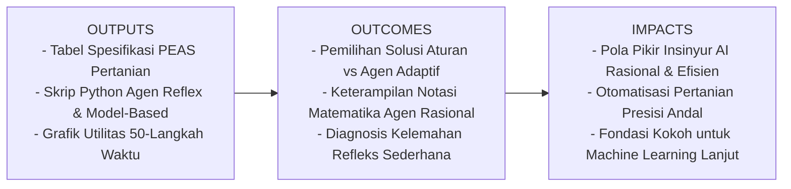
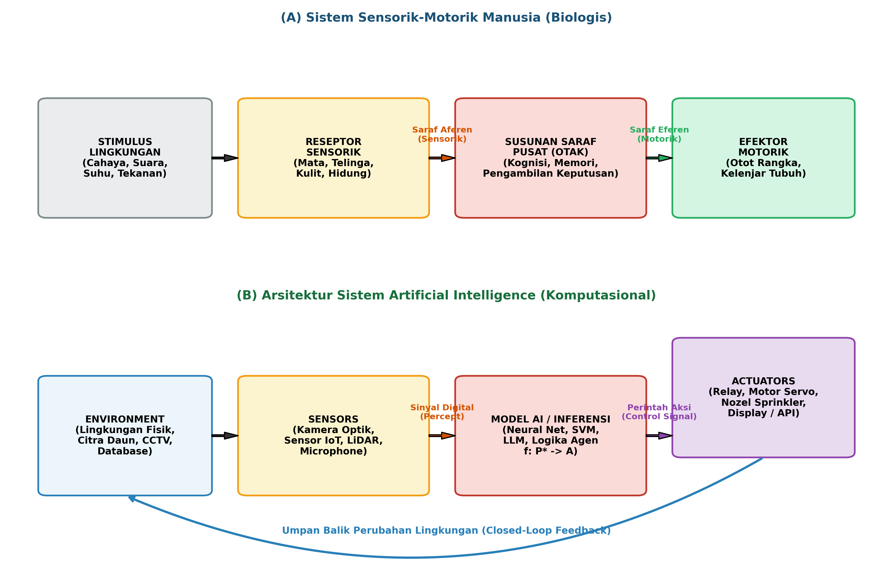
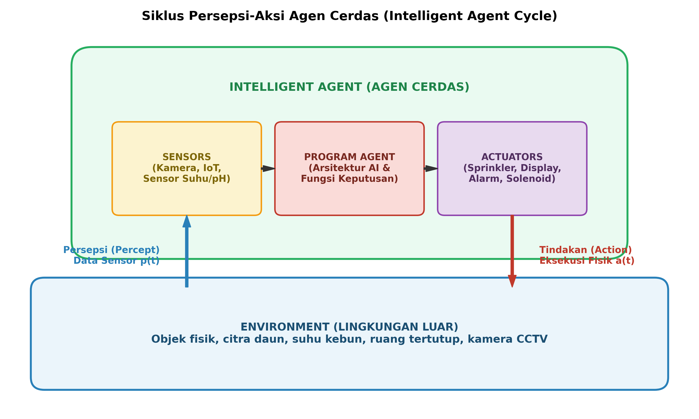
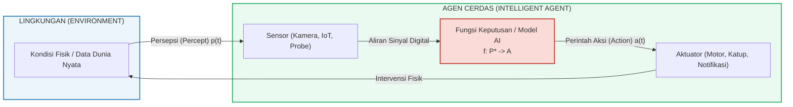
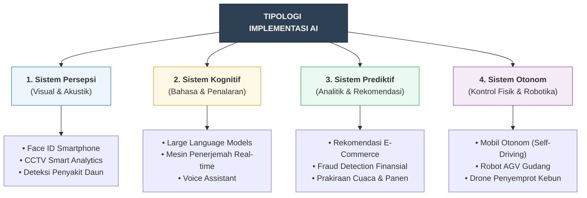
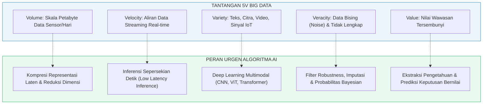
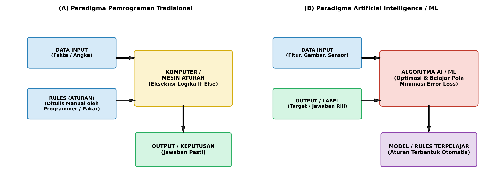
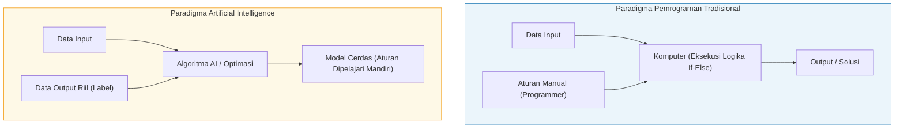

# AI Modul 1.1: Konsep Dasar Artificial Intelligence

---

## 1. Identitas & Kerangka Capaian Pembelajaran (Sub-CPMK)

* **Kode Modul**        : AI Modul 1.1
* **Mata Kuliah**       : Kecerdasan Buatan dan Sains Data Pertanian Presisi
* **Alokasi Waktu**     : 2 x 50 Menit (Kajian Teori & Diskusi) + 2 x 50 Menit (Eksplorasi Praktikum Mandiri)
* **Beban SKS**         : 3 SKS
* **Prasyarat**         : Pengantar Logika Matematika / Pemikiran Komputasional Dasar
* **Level Kognitif**    : C2 (Memahami), C3 (Menerapkan), C4 (Menganalisis)



### 1.1 Capaian Pembelajaran Khusus (Sub-CPMK)
Setelah menyelesaikan modul ini, mahasiswa dan pembelajar diharapkan mampu:
1. **Menguraikan (C2)** definisi formal dan fondasi filosofis *Artificial Intelligence* (Simbolik vs Koneksionisme, *Weak* vs *Strong AI*, serta empat kuadran Russell & Norvig).
2. **Menganalisis (C4)** korelasi analogi sistem sensorik-motorik biologis manusia terhadap blok arsitektur komputasi AI (*Sensors, Inference Engine, Actuators, Feedback Loop*).
3. **Mengklasifikasikan (C3)** tipologi implementasi AI dalam kehidupan sehari-hari (persepsi visual, kognitif NLP, prediktif analitis, kontrol otonom).
4. **Mengevaluasi (C4)** urgensi dan relevansi algoritma AI dalam mengurai kompleksitas fenomena *Big Data* (kerangka kerja 5V) dan mengatasi limitasi kognitif manusia.
5. **Merumuskan (C3)** kerangka kerja PEAS (*Performance, Environment, Actuators, Sensors*) dan menginterpretasikan notasi matematis fungsi rasionalitas agen ($f: \mathcal{P}^* \to \mathcal{A}$) tanpa bias simbolik.

### 1.2 Kerangka Hasil Pembelajaran (Outputs, Outcomes, & Impacts)
* **Outputs (Keluaran Berwujud Langsung)**:
  * Dokumen rancangan tabel spesifikasi PEAS (*Performance, Environment, Actuators, Sensors*) untuk skenario sistem cerdas nyata (studi kasus perkebunan atau pengawasan CCTV).
  * Berkas kode program simulasi Python mandiri yang mengimplementasikan siklus persepsi-tindakan pada tiga arsitektur agen (*Random*, *Simple Reflex*, *Model-Based*).
  * Grafik visual komparasi akumulasi skor utilitas antar-agen hasil simulasi empiris 50 langkah waktu.
* **Outcomes (Hasil Capaian & Perubahan Kompetensi)**:
  * Mahasiswa memiliki kemampuan analitis dalam memilih kapan harus menggunakan pendekatan aturan deterministik vs pendekatan agen adaptif berbasis AI pada problem rekayasa.
  * Mahasiswa mampu membaca, melafalkan, dan mengoperasikan notasi formal matematika AI ($f: \mathcal{P}^* \to \mathcal{A}$ dan fungsi $\mathcal{L}$) tanpa bias kebingungan simbolik.
  * Mahasiswa terampil mendiagnosis kelemahan agen refleks sederhana (*infinite loops*, ketiadaan memori) dan merancang model berbasis kondisi dunia (*world state*).
* **Impacts (Dampak Jangka Panjang & Nilai Guna Luas)**:
  * Terbentuknya pola pikir insinyur AI (*AI Engineering Mindset*) yang mengedepankan rasionalitas objektif, efisiensi sumber daya (hemat komputasi dan energi), serta kebermanfaatan nyata bagi pemecahan masalah sektor strategis (seperti otomatisasi pertanian presisi dan sistem keamanan cerdas).
  * Menjadi fondasi kokoh untuk melangkah ke modul-modul machine learning, deep learning, dan computer vision tingkat lanjut tanpa hambatan konseptual.

---

## 2. Pengantar & Motivasi (*Real-World Hook*)

Pernahkah Anda memperhatikan bagaimana seorang mandor perkebunan berpengalaman mampu membedakan daun kelapa sawit yang terserang hama ulat api hanya dengan melihat sekilas pola bercak dan lekukan daun di bawah terik matahari? Mandor tersebut tidak membuka buku tebal berisi 10.000 baris instruksi `if-else`. Sebaliknya, otaknya telah memproses ribuan pengalaman visual masa lalu, mengabstraksikan fitur-fitur penting, dan membuat inferensi cepat dengan ketepatan tinggi.

Tantangan terbesar peradaban komputasi modern adalah: **Bagaimana kita menanamkan kemampuan bernalar, mempersepsi lingkungan, dan mengambil tindakan adaptif tersebut ke dalam mesin silikon?**

Kecerdasan Buatan (*Artificial Intelligence* / AI) bukanlah entitas komputasi mistis (*opaque black-box*). AI adalah disiplin ilmu rekayasa dan matematika yang bertujuan merancang sistem komputasi yang mampu meniru, memperluas, dan mengotomatisasi tugas-tugas kognitif yang sebelumnya hanya bisa diselesaikan oleh kecerdasan hayati.

---

## 3. Definisi Konseptual Kecerdasan Buatan (Artificial Intelligence)

### 3.1. Paradigma dan Definisi AI
Secara etimologis dan historis, istilah *Artificial Intelligence* pertama kali dicanangkan secara resmi oleh **John McCarthy** pada *Dartmouth Summer Research Project on Artificial Intelligence* (1956) dengan definisi:
> *"The science and engineering of making intelligent machines, especially intelligent computer programs. It is related to the similar task of using computers to understand human intelligence, but AI does not have to confine itself to methods that are biologically observable."* (McCarthy, 1956).

Dalam perkembangannya, ranah AI melahirkan dua **aliran pemikiran fundamental**:

1. **Paradigma Simbolik (*Good Old-Fashioned AI* / GOFAI)**:
   * **Tokoh Pelopor**: Allen Newell, Herbert Simon, Marvin Minsky (era 1960–1980-an).
   * **Premis**: Pikiran cerdas bekerja melalui manipulasi simbol-simbol logis formal (*Physical Symbol System Hypothesis*). Menurut paradigma ini, kecerdasan dapat direkayasa sepenuhnya jika manusia berhasil mengodekan semua aturan dunia ke dalam representasi logika proposisional atau predikat orde pertama (`IF-THEN rules`, *knowledge base*).
   * **Kelemahan**: Kerapuhan (*brittleness*) saat menghadapi ketidakpastian dunia nyata dan ketidakmampuan memproses data kontinu (seperti piksel gambar atau gelombang audio).

2. **Paradigma Koneksionisme (*Connectionism / Sub-symbolic AI*)**:
   * **Tokoh Pelopor**: Warren McCulloch, Walter Pitts (1943), Frank Rosenblatt (1958), Geoffrey Hinton (1986).
   * **Premis**: Kecerdasan tidak muncul dari aturan logis terpusat, melainkan muncul secara alami (*emergent property*) dari jaringan komputasi terdistribusi yang terdiri atas unit-unit sederhana (neuron tiruan) yang saling terhubung dan memiliki bobot sinapsis yang dapat dilatih (*plasticity*). Paradigma inilah yang menjadi landasan utama revolusi *Machine Learning* dan *Deep Learning* modern saat ini.

3. **Perdebatan Filosofis: *Weak AI* vs. *Strong AI***:
   * **Weak AI (AI Sempit / Terapan)**: Mesin dirancang untuk mensimulasikan pemecahan masalah spesifik (misal: bermain catur, mendeteksi penyakit tanaman, mengenali wajah) tanpa memiliki kesadaran sejati (*sentience*).
   * **Strong AI / Artificial General Intelligence (AGI)**: Mesin hipotetis yang memiliki kesadaran diri (*consciousness*), pemahaman semantik sejati, dan kecerdasan setara atau melebihi manusia di seluruh domain intelektual.
   * **Argumen Kamar Cina (*Chinese Room Argument* - John Searle, 1980)**: Searle mendemonstrasikan bahwa manipulasi sintaksis aturan (mesin menerjemahkan karakter mandarin berdasarkan buku panduan aturan) bukanlah bukti bahwa mesin tersebut benar-benar *memahami* makna (semantik) dari karakter tersebut. Oleh sebab itu, AI modern berfokus pada **rekayasa utilitas rasional**, bukan klaim kesadaran subjektif.

#### Empat Kuadran Definisi AI (Russell & Norvig Framework)
Stuart Russell dan Peter Norvig mensintesiskan paradigma-paradigma pemikiran di atas ke dalam matriks dua sumbu: dimensi **proses penalaran vs. perilaku tampak**, dan dimensi **meniru manusia vs. mencapai rasionalitas ideal**.

| Dimensi | Fokus pada Manusia (*Human-Centered*) | Fokus pada Rasionalitas (*Ideal Rationality*) |
| :--- | :--- | :--- |
| **Proses Berpikir (*Thought / Reasoning*)** | **Thinking Humanly (Berpikir Seperti Manusia)**<br>Memodelkan cara kerja saraf kognitif manusia (*Cognitive Science* & fMRI). | **Thinking Rationally (Berpikir Rasional)**<br>Menegakkan hukum logika deduktif formal (*Laws of Thought* / Logika Aristoteles). |
| **Perilaku Tampak (*Action / Behavior*)** | **Acting Humanly (Bertindak Seperti Manusia)**<br>Lolos uji Turing (*Turing Test*), NLP, penalaran otomatis. | **Acting Rationally (Bertindak Rasional)**<br>**Pendekatan Agen Cerdas (*Rational Agent*)**: Bertindak untuk memaksimalkan utilitas capaian. |

> [!NOTE]
> **Konsensus Akademik Modern**: Meniru manusia (*Human-centered*) sering kali membawa irasionalitas biologis, bias kognitif, dan keterbatasan kecepatan transmisi saraf (maksimal ~120 m/detik). Rekayasa AI modern berfokus pada pilar **Acting Rationally**: agen memilih tindakan terbaik yang memaksimalkan peluang keberhasilan berdasarkan informasi sensorik dan batasan sumber daya komputasi.

---

### 3.2. Korelasi Analogi Sensorik-Motorik Manusia terhadap Arsitektur AI
Arsitektur kecerdasan buatan merupakan bentuk **biomimikri komputasional** dari sistem biologis manusia. Tubuh manusia beroperasi melalui loop tertutup (*closed-loop system*) sensorik-motorik yang memiliki ekuivalensi langsung dengan blok arsitektur agen AI:



| Komponen Fisiologis Manusia | Ekuivalensi Arsitektur AI | Karakteristik & Fungsi Komputasi |
| :--- | :--- | :--- |
| **Reseptor Sensorik**<br>(Retina mata, koklea telinga, sel saraf taktil kulit, sel olfaktori) | **Sensors / Data Ingestion**<br>(Kamera optik/RGB, sensor kelembaban tanah, mikrofon digital, LiDAR, accelerometer) | Mengubah fenomena fisik analog (cahaya, suhu, suara, getaran) menjadi representasi digital berupa matriks angka (array biner / floating point). |
| **Saraf Aferen (Jalur Sensorik)**<br>(Serat saraf pembawa sinyal elektrokimia dari reseptor menuju otak) | **Bus Data / I/O Pipeline**<br>(Protokol MQTT, RTSP video stream, REST API, serial buffer USB/I2C) | Mentransmisikan paket data mentah dari sensor ke unit pemrosesan tanpa distorsi atau latensi tinggi. |
| **Susunan Saraf Pusat (Otak & Medula Spinalis)**<br>(Miliaran neuron otak yang melakukan asosiasi memori, penalaran, dan kognisi) | **Model AI / Inference Engine**<br>(Jaringan syaraf tiruan deep learning, SVM, matriks bobot tensor, algoritma $f: \mathcal{P}^* \to \mathcal{A}$) | Melakukan ekstraksi fitur (*feature representation*), inferensi pola tersembunyi, komputasi probabilitas, dan memutuskan tindakan optimal. |
| **Saraf Eferen (Jalur Motorik)**<br>(Serat saraf pembawa perintah dari otak menuju organ pelaksana) | **Control Bus / Driver Sinyal**<br>(GPIO microcontroller, driver PWM motor, sinyal kendali relay industri) | Menyalurkan instruksi numerik hasil komputasi menjadi sinyal tegangan pemicu perangkat keras. |
| **Efektor Motorik**<br>(Otot lurik tangan/kaki, kelenjar keringat, pita suara) | **Actuators / End Effectors**<br>(Motor servo robotik, katup solenoid sprinkler, layar antarmuka/dashboard, buzzer alarm) | Mengeksekusi perubahan nyata pada lingkungan fisik (menyemprot air, menggeser kamera, menghentikan mesin). |
| **Lengkung Refleks (*Reflex Arc*)**<br>(Respon cepat sumsum tulang belakang tanpa menunggu otak sadar) | **Simple Reflex Agent**<br>(Logika proteksi threshold darurat, sakelar otomatis jika suhu melewati batas bahaya) | Aksi instan berlatensi rendah untuk keselamatan kritis tanpa kalkulasi model mendalam. |

---

### 3.3. Arsitektur Agen Cerdas & Kerangka Analisis PEAS

Agen cerdas didefinisikan sebagai entitas yang berinteraksi dengan lingkungan fisik secara terus-menerus melalui siklus *Sense $\to$ Think $\to$ Act*.





Sebelum merancang agen, kita menyusun spesifikasi formal **PEAS**:
* **P - Performance Measure**: Kriteria kuantitatif penentu keberhasilan agen.
* **E - Environment**: Medan operasi tempat agen bertindak.
* **A - Actuators**: Perangkat pengubah kondisi lingkungan.
* **S - Sensors**: Perangkat pembaca kondisi lingkungan.

#### Contoh Matriks PEAS pada Sistem Pemantauan Kebun Cerdas:
| Komponen | Spesifikasi Teknis |
| :--- | :--- |
| **Performance** | Akurasi deteksi daun sakit $\ge 95\%$, pemborosan air $\le 5\%$, respon peringatan $\le 1$ detik. |
| **Environment** | Lahan terbuka/greenhouse, fluktuasi intensitas matahari $0-100.000$ lux, suhu dinamis, debu dan cipratan air. |
| **Actuators** | Pompa irigasi tetes (solenoid valve), drone sprayer, modul alarm GSM/Telegram, layar monitoring LCD. |
| **Sensors** | Kamera optik spektral/RGB, probe kelembaban tanah kapasitif, termometer inframerah daun, anemometer angin. |

---

### 3.4. Tipologi Implementasi AI dalam Kehidupan Sehari-hari
Dalam ranah implementasi nyata, AI tidak muncul sebagai sosok tunggal yang monolitik, melainkan terdistribusi ke dalam empat tipologi fungsional utama:



1. **Sistem Persepsi Visual dan Akustik (*Perception Systems*)**:
   * **Karakteristik**: Memodelkan indra penglihatan dan pendengaran untuk mengubah sinyal mentah tak terstruktur menjadi pemahaman semantik.
   * **Contoh Riil**: Pengenalan wajah (*Face ID*) pada gawai, kamera CCTV pintar yang mendeteksi intrusi atau pergerakan mencurigakan secara *real-time*, dan pemindaian citra daun tanaman menggunakan gawai untuk mendiagnosis defisiensi hara secara instan.
2. **Sistem Kognitif dan Bahasa Alami (*Cognitive & NLP Systems*)**:
   * **Karakteristik**: Memahami sintaksis, semantik, serta konteks bahasa manusia lisan maupun tulisan.
   * **Contoh Riil**: *Large Language Models* (seperti GPT, Gemini, Claude) yang bertindak sebagai asisten riset, peringkas dokumen hukum, *auto-complete* kode pemrograman, serta agen layanan pelanggan 24/7.
3. **Sistem Analitik Prediktif dan Rekomendasi (*Predictive & Recommender Systems*)**:
   * **Karakteristik**: Menganalisis pola multidimensi dari data tabular masif masa lalu untuk memproyeksikan kejadian masa depan.
   * **Contoh Riil**: Algoritma kurasi konten media sosial (TikTok, Instagram) dan platform belanja (*e-commerce*), sistem perbankan yang mendeteksi transaksi penipuan (*fraud detection*) dalam hitungan milidetik, serta estimasi curah hujan dan produktivitas panen berbasis data historis satelit.
4. **Sistem Kontrol Fisik dan Robotika Otonom (*Autonomous Control Systems*)**:
   * **Karakteristik**: Mengintegrasikan sistem persepsi dan aktuasi mekanik untuk bernavigasi dan mengambil keputusan di dunia nyata tanpa campur tangan operator manusia.
   * **Contoh Riil**: Mobil otonom (*self-driving cars*), robot pemindah barang otomatis di gudang logistik, serta drone pintar perkebunan yang mengatur pola terbang mandiri untuk menyemprot pupuk secara presisi.

---

### 3.5. Urgensi dan Relevansi AI di Era Big Data
Mengapa riset dan implementasi AI mengalami ledakan masif justru pada dekade ini? Jawabannya terletak pada **hubungan simbiotik mutualisme** antara Kecerdasan Buatan dan Fenomena *Big Data*. 

> **Aksioma Komputasi Modern:**  
> *"Big Data tanpa AI adalah beban penyimpanan (liability) tanpa makna; AI tanpa Big Data adalah mesin bertenaga besar tanpa bahan bakar."*

Karakteristik data modern dirangkum dalam prinsip **5V Big Data**, di mana setiap aspek menuntut keterlibatan algoritma AI sebagai solusi:



1. **Mengatasi Batas Kognitif Manusia (*Mitigating Cognitive Overload*)**:
   * Seorang manusia rata-rata hanya mampu mempertahankan konsentrasi pengawasan pada maksimal 4–6 monitor CCTV selama 20 menit sebelum kewaspadaannya merosot hingga 90%. Dalam era smart city dan industri modern yang mengoperasikan ribuan kamera secara simultan, hanya model AI visi komputer yang mampu memantau seluruh saluran video selama 24 jam sehari tanpa mengenal kelelahan fisik maupun penurunan atensi.
2. **Menemukan Pola Tak Kasat Mata (*High-Dimensional Pattern Recognition*)**:
   * Data sensor agronomi di lahan perkebunan melibatkan puluhan variabel: kelembaban mikro, pH tanah, suhu kanopi, intensitas radiasi matahari, kecepatan angin, hingga kelembaban daun. Manusia hanya mampu memvisualisasikan data hingga 3 dimensi secara intuitif. Model AI mampu mengekstraksi korelasi linier maupun non-linier pada ruang vektor berdimensi ratusan (*high-dimensional manifold*) untuk memberikan peringatan dini defisiensi tanaman sebelum gejala fisik tampak oleh mata telanjang.
3. **Otomatisasi Keputusan Berkecepatan Ultra (*Real-Time Autonomous Action*)**:
   * Pada kasus penutupan katup pipa darurat, sistem pengereman kendaraan otonom, atau deteksi anomali jaringan listrik, waktu jeda keputusan yang dibutuhkan adalah dalam skala milidetik. Algoritma AI yang dioptimasi (*quantized edge model*) memungkinkan pengambilan keputusan lokal secara instan tepat di tepi jaringan (*edge*), melampaui batas kecepatan refleks motorik manusia.

---

## 4. Formulasi Matematis: Fungsi Rasionalitas Agen

Sistem kecerdasan buatan bukanlah mistis, melainkan fungsi matematika deterministik maupun probabilistik.

### 4.1. Pemetaan Persepsi ke Tindakan (*Agent Function*)

$$f: \mathcal{P}^* \to \mathcal{A}$$

#### 📖 Panduan Membaca Lambang Matematika:
* $f$ : Dibaca **"fungsi agen f"**. Merupakan fungsi pemetaan matematis internal yang diterapkan oleh program AI.
* $:$ : Dibaca **"memetakan dari ... menuju ..."**.
* $\mathcal{P}$ : Dibaca **"himpunan ruang persepsi (Percept Space)"**, yaitu kumpulan semua kemungkinan nilai bacaan yang dapat diterima oleh sensor pada suatu detik waktu.
* $*$ : Dibaca **"Klenee Star (bintang)"**. Menunjukkan bahwa inputnya bukan hanya persepsi saat ini ($p_t$), melainkan deretan/riwayat seluruh persepsi dari awal waktu ($t_0$) hingga saat ini ($t$): $(p_0, p_1, p_2, \dots, p_t)$.
* $\mathcal{P}^*$ : Dibaca **"himpunan riwayat deret persepsi (*Percept History Sequence*)"**.
* $\to$ : Simbol tanda panah, dibaca **"menghasilkan nilai dalam ruang"**.
* $\mathcal{A}$ : Dibaca **"ruang himpunan tindakan (*Action Space*)"**, yakni semua kemungkinan tindakan fisik yang mampu dijalankan oleh aktuator.

> 💡 **Analogi Dunia Nyata:**
> Bayangkan seorang **Dokter Spesialis Tanaman**. 
> * Jika dokter hanya melihat selembar daun menguning hari ini ($p_t$), ia belum tentu berani memvonis infeksi jamur.
> * Namun jika ia membuka riwayat rekam medis tanaman ($\mathcal{P}^*$) bahwa 3 hari lalu curah hujan ekstrem dan pemupukan nitrogen rendah, fungsi kognitif otaknya ($f$) langsung merekomendasikan tindakan penyemprotan fungisida spesifik ($\mathcal{A}$).

---

### 4.2. Pengukuran Kinerja (*Utility / Performance Measure*) & Fungsi Rugi (*Loss Function*)

Agen yang rasional memilih tindakan yang memaksimalkan nilai utilitas ekspektasi $\mathbb{E}[U]$ atau meminimalkan kerugian (*Loss* $\mathcal{L}$).

$$\mathcal{L}(y, \hat{y}) = \frac{1}{2} (y - \hat{y})^2$$

#### 📖 Panduan Membaca Lambang Matematika:
* $\mathcal{L}$ : Simbol huruf kaligrafi L, dibaca **"Loss"** atau fungsi kerugian/biaya penalti kesalahan.
* $(y, \hat{y})$ : Parameter masukan fungsi.
  * $y$ : Dibaca **"y aktual / ground truth"**, yaitu kondisi nyata yang sebenarnya di lapangan.
  * $\hat{y}$ : Dibaca **"y topi (y-hat) / prediksi"**, yaitu taksiran nilai yang dikeluarkan oleh model agen AI.
* $\frac{1}{2}$ : Faktor pengali skalar untuk mempermudah perhitungan turunan (*differensial*) saat kalkulus backpropagation.
* $(y - \hat{y})^2$ : Kuadrat dari selisih error (kesalahan). Tanda kuadrat memastikan nilai pinalti selalu bernilai positif dan memberikan hukuman sangat berat untuk kesalahan yang besar.

#### 🔢 Contoh Perhitungan Numerik Langkah-demi-Langkah:
Misalkan sebuah agen pemantau suhu rumah kaca (*greenhouse*) mendeteksi suhu daun tanaman:
1. Target suhu optimal yang harus dijaga ($y$) = $25.0^\circ\text{C}$.
2. Sensor membaca estimasi suhu saat ini ($\hat{y}$) = $29.0^\circ\text{C}$.
3. **Langkah 1**: Hitung selisih galat (error):
   $$e = y - \hat{y} = 25.0 - 29.0 = -4.0$$
4. **Langkah 2**: Kuadratkan nilai galat:
   $$e^2 = (-4.0)^2 = 16.0$$
5. **Langkah 3**: Kalikan dengan faktor skala $\frac{1}{2}$:
   $$\mathcal{L} = \frac{1}{2} \times 16.0 = 8.0$$

Nilai $\mathcal{L} = 8.0$ ini menjadi sinyal numerik bagi agen untuk menggerakkan aktuator pendingin dengan intensitas sebanding dengan pinalti kesalahan tersebut hingga $\mathcal{L} \to 0$.

---

## 5. Komparasi: Pemrograman Konvensional vs. Kecerdasan Buatan

Perbedaan hakiki antara rekayasa perangkat lunak konvensional dengan AI digambarkan pada bagan perbandingan berikut:





| Parameter Pembeda | Pemrograman Konvensional | Sistem Kecerdasan Buatan (AI) |
| :--- | :--- | :--- |
| **Sumber Aturan (*Logic Source*)** | Ditulis tangan secara manual oleh programmer baris demi baris menggunakan operator logika. | Dipelajari dan diinduksi secara otomatis oleh model melalui optimasi data historis. |
| **Kemampuan Adaptasi** | Statis dan kaku. Jika ada kasus tak terduga (*edge case*), program mengalami *crash* atau salah logika. | Adaptif. Mampu mengekstrapolasi data baru berdasarkan kemiripan pola probabilistik. |
| **Penanganan Kompleksitas Data** | Sangat payah menangani data tak terstruktur (piksel gambar, spektrum audio, bahasa alami). | Sangat unggul mengekstraksi representasi laten dari citra, teks, dan sinyal waktu nyata. |
| **Keterjelasan (*Explainability*)** | 100% transparan (*white box*), tiap percabangan kondisi mudah diaudit secara kasat mata. | Bervariasi, dari pohon keputusan (*white box*) hingga jaringan syaraf tiruan mendalam (*black box*). |

---

## 6. Konteks Teknologi Terkini (*State-of-the-Art Perspective*)

Memasuki era kecerdasan modern, paradigma agen cerdas mengalami lonjakan eksponensial melalui tiga gelombang:
1. **Rule-based & Expert Systems (1960-1980an)**: Mengandalkan inferensi deduktif basis pengetahuan pakar (misal: MYCIN, Prolog).
2. **Statistical Machine Learning (1990-2010an)**: Pendekatan induktif parametrik/non-parametrik (SVM, Random Forest) yang fokus pada ekstraksi fitur manual.
3. **Deep Learning & Foundation Agentic Systems (2012-Sekarang)**: 
   * **Large Multimodal Models (LMMs)**: Agen kini tidak hanya memproses angka sensor tunggal, melainkan memahami streaming video kamera secara utuh menggunakan Vision-Language-Action Models (VLA).
   * **Edge AI & Autonomous Agents**: Model yang dioptimasi (kuantisasi INT8, ONNX, TensorRT) dijalankan langsung pada mikrokontroler/kamera industri di lapangan tanpa bergantung internet.

---

## 7. Walkthrough Implementasi: Agen Reflex Cerdas Berbasis Rasionalitas

Berikut adalah implementasi Python mandiri yang memodelkan interaksi tertutup (*closed-loop interaction*) antara lingkungan rumah kaca (*greenhouse*) dengan agen irigasi cerdas. Setiap baris kode telah dilengkapi komentar instruksional yang menjelaskan fungsi operasionalnya.

### 7.1. Kode Program Lengkap dengan Komentar Per Baris

```python
# ==============================================================================
# AI Modul 1.1: Simulasi Agen Cerdas Pemantau Irigasi Tanaman (Smart Irrigation)
# Arsitektur: Sensor -> Percept (P*) -> Fungsi Keputusan (f) -> Actuator -> Lingkungan
# ==============================================================================

# Mengimpor tipe data Dict dan List dari pustaka typing untuk dokumentasi tipe data eksplisit (type hints)
from typing import Dict, List, Any


class GreenhouseEnvironment:
    """Kelas pemodelan lingkungan fisik rumah kaca (Environment)."""
    
    def __init__(self, soil_moisture: float, air_temperature: float):
        # Menyimpan nilai kelembaban tanah awal dalam satuan persen (%)
        self.soil_moisture: float = soil_moisture
        # Menyimpan nilai suhu udara awal dalam satuan derajat Celsius (°C)
        self.air_temperature: float = air_temperature

    def apply_action(self, action: str) -> None:
        """Menerima sinyal tindakan dari aktuator agen dan memperbarui status fisik lingkungan."""
        # Memeriksa apakah tindakan yang diperintahkan agen adalah menyemprotkan air
        if action == "AKTIFKAN_SPRINKLER":
            # Menaikkan kelembaban tanah sebesar 8.0% akibat penetrasi air siraman
            self.soil_moisture += 8.0
            # Menurunkan suhu mikro daun sebesar 1.5°C akibat efek pendinginan evaporatif
            self.air_temperature -= 1.5
            # Menampilkan laporan perubahan fisik lingkungan ke konsol
            print("  [Aktuator Fisik] -> Katup sprinkler terbuka! Kelembaban meningkat, suhu mikro turun.")
            
        # Memeriksa apakah agen memilih tindakan siaga (tidak menyiram)
        elif action == "SIAGA_PANTAU":
            # Mensimulasikan evaporasi alami lingkungan: air menguap sebesar 1.0% per siklus waktu
            self.soil_moisture = max(0.0, self.soil_moisture - 1.0)
            # Menampilkan status siaga aktuator ke konsol
            print("  [Aktuator Fisik] -> Sistem dalam status siaga. Tidak ada irigasi yang dikeluarkan.")

    def get_state(self) -> Dict[str, float]:
        """Menyediakan antarmuka bagi sensor untuk membaca kondisi fisik terkini lingkungan."""
        # Mengembalikan data lingkungan dalam bentuk kamus (dictionary) berisi kelembaban dan suhu
        return {
            "kelembaban": self.soil_moisture,
            "suhu": self.air_temperature
        }


class IrrigationAgent:
    """Kelas representasi fungsi agen cerdas rasional: f: P* -> A."""
    
    def __init__(self, target_moisture: float = 60.0, temp_limit: float = 32.0):
        # Menetapkan nilai ambang batas kelembaban tanah optimal yang diinginkan tanaman (%)
        self.target_moisture: float = target_moisture
        # Menetapkan nilai batas toleransi suhu maksimum sebelum tanaman mengalami stres panas (°C)
        self.temp_limit: float = temp_limit
        # Menginisialisasi list kosong untuk mencatat seluruh riwayat deret persepsi (P*)
        self.percept_history: List[Dict[str, float]] = []

    def perceive(self, sensor_reading: Dict[str, float]) -> None:
        """Menerima dan merekam paket data sensor terkini ke dalam riwayat memori agen (P*)."""
        # Menambahkan data persepsi sensor saat ini ke dalam riwayat rekaman persepsi
        self.percept_history.append(sensor_reading)

    def decide_action(self) -> str:
        """Mengevaluasi fungsi rasionalitas keputusan untuk memilih tindakan terbaik (A)."""
        # Mengambil data persepsi paling mutakhir (elemen terakhir dari riwayat deret persepsi)
        current_percept: Dict[str, float] = self.percept_history[-1]
        # Mengekstrak nilai kelembaban tanah dari data persepsi terkini
        moisture: float = current_percept["kelembaban"]
        # Mengekstrak nilai suhu udara dari data persepsi terkini
        temp: float = current_percept["suhu"]

        # Menguji rasionalitas: jika tanah terlalu kering ATAU suhu udara terlalu panas melampaui batas
        if moisture < self.target_moisture or temp > self.temp_limit:
            # Memilih aksi penyiraman untuk mencegah layu permanen pada tanaman
            return "AKTIFKAN_SPRINKLER"
        else:
            # Memilih aksi siaga untuk menghemat kuota air dan menghindari pembusukan akar
            return "SIAGA_PANTAU"


# ==============================================================================
# Blok Utama: Menjalankan Siklus Persepsi-Aksi Waktu Nyata
# ==============================================================================
if __name__ == "__main__":
    # 1. Menginisialisasi lingkungan awal (tanah kering 45% dan suhu udara panas 34°C)
    env = GreenhouseEnvironment(soil_moisture=45.0, air_temperature=34.0)
    
    # 2. Menginisialisasi agen cerdas dengan target kelembaban 60% dan batas suhu 32°C
    agent = IrrigationAgent(target_moisture=60.0, temp_limit=32.0)

    # Menampilkan judul simulasi ke layar terminal
    print("=========================================================")
    print("  SIMULASI CLOSED-LOOP AGEN CERDAS IRIGASI PERKEBUNAN")
    print("=========================================================")

    # 3. Menjalankan siklus keputusan loop tertutup selama 3 iterasi waktu
    for cycle in range(1, 4):
        # Mencetak pemisah visual nomor siklus
        print(f"\n--- [SIKLUS WAKTU KE-{cycle}] ---")
        
        # SENSOR: Membaca status riil dari lingkungan
        sensor_data = env.get_state()
        # Menampilkan hasil tangkapan sensor ke konsol
        print(f"  [Sensor] Membaca: Kelembaban = {sensor_data['kelembaban']:.1f}%, Suhu = {sensor_data['suhu']:.1f}°C")

        # PERSEPSI: Agen menyerap data bacaan sensor ke dalam memorinya
        agent.perceive(sensor_data)

        # FUNGSI AGENT (f): Agen menganalisis kondisi dan menentukan tindakan rasional
        action = agent.decide_action()
        # Menampilkan keputusan agen ke konsol
        print(f"  [Fungsi Agen] Menghasilkan Keputusan Aksi: '{action}'")

        # AKTUATOR: Menjalankan tindakan fisik yang mengubah status lingkungan
        env.apply_action(action)
```

---

### 7.2. Pembahasan Keterangan Penggunaan Kode (*Operational Breakdown*)

Untuk memahami secara tuntas bagaimana kode di atas merealisasikan konsep kecerdasan buatan, berikut adalah bedah mekanisme teknis per blok:

#### 1. Blok Pemodelan Lingkungan (`GreenhouseEnvironment`)
* **Tujuan Penggunaan**: Di dunia nyata, agen AI berhadapan dengan alam fisik (kebun, ruang server, lalu lintas jalan). Dalam simulasi, kelas ini berperan sebagai sistem dinamik (*state machine*) yang memiliki hukum fisika sendiri.
* **Metode `apply_action`**: Menunjukkan sifat lingkungan yang **dinamis dan reaktif**. Ketika menerima perintah `"AKTIFKAN_SPRINKLER"`, lingkungan secara deterministik meningkatkan kelembaban (`+8.0%`) dan menurunkan suhu (`-1.5°C`). Sebaliknya, saat status `"SIAGA_PANTAU"`, kelembaban menurun (`-1.0%`) akibat hukum penguapan alam. Fungsi `max(0.0, ...)` digunakan untuk mencegah nilai kelembaban tanah turun ke angka negatif yang tidak realistis secara fisika.
* **Metode `get_state`**: Berperan sebagai antarmuka fisik (*transducer*) yang mentransmisikan keadaan lingkungan ke sensor dalam representasi struktur data `dictionary`.

#### 2. Blok Agen Cerdas (`IrrigationAgent`)
* **Tujuan Penggunaan**: Mengimplementasikan formula matematika $f: \mathcal{P}^* \to \mathcal{A}$. Agen tidak boleh memanipulasi variabel lingkungan secara langsung; agen hanya boleh "melihat" melalui persepsi dan "menyentuh" melalui aktuator.
* **Atribut `self.percept_history`**: Berfungsi sebagai penyimpanan deret persepsi ($\mathcal{P}^*$). Hal ini membedakan agen cerdas dengan fungsi statis biasa, karena agen memiliki jejak rekam historis dari apa yang telah dialaminya sejak siklus pertama.
* **Metode `perceive(sensor_reading)`**: Merefleksikan jalur saraf aferen, di mana sinyal eksternal masuk dan disimpan ke dalam memori kerja agen.
* **Metode `decide_action()`**: Merupakan inti dari kecerdasan (*Agent Brain*). Di sinilah rasionalitas ditegakkan. Agen membandingkan kondisi riil dengan parameter batas tanaman (`target_moisture` dan `temp_limit`). Jika tanaman berada dalam ancaman stres kekeringan atau panas, agen memilih tindakan intervensi aktif `"AKTIFKAN_SPRINKLER"`. Jika kondisi sudah optimal, agen secara rasional memilih `"SIAGA_PANTAU"` untuk mencegah *waterlogging* (akar membusuk karena kelebihan air) dan pemborosan energi pompa listrik.

#### 3. Blok Siklus Interaksi Tertutup (`if __name__ == "__main__":`)
* **Tujuan Penggunaan**: Menjalankan siklus diskrit waktu nyata (*discrete time-step loop*).
* **Alur Eksekusi**:
  1. **Langkah 1 (Sense)**: Sensor membaca kondisi lingkungan via `env.get_state()`.
  2. **Langkah 2 (Absorb)**: Agen menyerap informasi tersebut via `agent.perceive(sensor_data)`.
  3. **Langkah 3 (Think)**: Agen mengevaluasi fungsi keputusan via `agent.decide_action()`.
  4. **Langkah 4 (Act)**: Perintah diteruskan ke aktuator lingkungan via `env.apply_action(action)`.
  5. **Langkah 5 (Feedback Loop)**: Tindakan pada siklus ke-$t$ mengubah status lingkungan, yang kemudian menjadi stimulus baru bagi sensor pada siklus ke-$t+1$. Inilah hakikat sistem kendali cerdas lingkar tertutup (*closed-loop intelligent control*).

---

## 8. Latihan, Evaluasi & Diskusi Kritis

### 8.1. Pertanyaan Analitis (HOTS)
1. **Evaluasi Rasionalitas**: Apakah agen yang rasional selalu merupakan agen yang *mahatahu* (*omniscient*) dan tidak pernah melakukan kesalahan? Jelaskan perbedaan tegas antara *rasionalitas* dan *kemahatahuan* dengan studi kasus prediksi serangan hama tanaman.
2. **Keterbatasan Reflex Agent**: Mengapa agen refleks sederhana (*simple reflex agent*) mudah terjebak dalam *infinite loop* (siklus tak berujung) pada lingkungan yang *partially observable* (hanya teramati sebagian)? Berikan solusi struktural untuk mengatasinya.
3. **Argumen Kamar Cina (*Chinese Room Argument*)**: Menurut John Searle, komputer yang mampu menerjemahkan bahasa manusia dengan sempurna belum tentu "memahami" bahasa tersebut. Bagaimana pandangan ini mempengaruhi cara kita menilai kemampuan Large Language Model (LLM) modern saat ini?
4. **Sinergi Big Data dan AI**: Mengapa pengumpulan data sensor pertanian dalam skala terabyte menjadi sia-sia jika tidak diintegrasikan dengan algoritma inferensi cerdas? Kaitkan dengan prinsip *Cognitive Overload* manusia.

### 8.2. Tugas Mandiri (Eksplorasi di Notebook Pendamping)
* Buka berkas [AI_Modul_1.1_Praktikum_Konsep_Dasar_AI.ipynb](../../notebooks/part-01/AI_Modul_1.1_Praktikum_Konsep_Dasar_AI.ipynb).
* Jalankan eksperimen perbandingan performa agen acak (*random agent*), agen refleks sederhana (*simple reflex*), dan agen berbasis model (*model-based reflex*) pada studi kasus simulasi pembersihan lahan otomatis.

---

## 9. Rangkuman & Glosarium

### Rangkuman Butir Inti:
1. **Evolusi Paradigma AI**: Berkembang dari pendekatan simbolik deduktif (*GOFAI*) menuju koneksionisme induktif berbasis data (*Machine Learning & Deep Learning*), dengan konsensus modern berpusat pada pencapaian **Acting Rationally**.
2. **Biomimikri Sensorik-Motorik**: Blok sistem AI merefleksikan biologi manusia: Sensor merepresentasikan reseptor indra, bus data sebagai saraf aferen, model inferensi sebagai otak/SSP, dan aktuator sebagai efektor otot/motorik.
3. **Empat Tipologi Nyata**: AI teraplikasikan ke dalam sistem persepsi visual/akustik, kognitif NLP, analitik prediktif/rekomendasi, dan sistem kontrol fisik otonom.
4. **Simbiosis Big Data**: AI merupakan instrumen wajib untuk mengonversi data bervolume dan berkecepatan tinggi (prinsip 5V) menjadi wawasan tindakan (*actionable insights*) guna mengatasi keterbatasan biologis manusia.
5. **Siklus Rasionalitas**: Siklus agen AI selalu berputar pada: **Lingkungan $\to$ Sensor (Persepsi) $\to$ Program Agen (Fungsi Keputusan $f: \mathcal{P}^* \to \mathcal{A}$) $\to$ Aktuator (Aksi) $\to$ Lingkungan**.

### Glosarium:
* **Connectionism**: Paradigma komputasi AI yang memodelkan kecerdasan melalui jaringan unit-unit pemroses sederhana (neuron tiruan) yang saling terhubung dan adaptif.
* **Good Old-Fashioned AI (GOFAI)**: Paradigma AI klasik yang bertumpu pada manipulasi simbol-simbol eksplisit dan aturan logika formal (`if-then`).
* **Afferent & Efferent Pathway**: Jalur transmisi biologis sinyal masukan sensorik menuju otak (aferen) dan sinyal keluaran perintah motorik menuju organ (eferen).
* **Percept & Percept Sequence ($\mathcal{P}^*$)**: Rangsangan sensorik sesaat ($p$) dan riwayat lengkap urutan persepsi yang terekam sejak awal masa operasional agen.
* **Cognitive Overload**: Batas saturasi kapasitas kognitif manusia dalam memproses volume informasi masif dalam satu satuan waktu.
* **Loss Function ($\mathcal{L}$)**: Formulasi matematis yang menghitung besaran pinalti atau deviasi antara estimasi sistem dengan kondisi riil objektif.

---

## 10. Jembatan Menuju Modul Berikutnya (Bridge to AI Modul 1.2)

Di modul ini, kita telah meletakkan fondasi konseptual yang kokoh mengenai hakikat kecerdasan buatan, biomimikri sensorik-motorik, serta dua kutub paradigma utama: **Simbolik (GOFAI)** dan **Koneksionisme**. 

Namun, sebuah pertanyaan historis yang mendalam muncul:
> *Jika gagasan mengenai jaringan syaraf tiruan dan logika komputasi cerdas telah digagas sejak dekade 1940–1950-an, mengapa dunia sempat menyaksikan kegagalan besar dan masa pembekuan dana riset yang dikenal sebagai **AI Winter**? Faktor teknologi apa yang melahirkan kembali optimisme AI hingga memicu ledakan revolusi industri modern saat ini?*

Seluruh dinamika pasang-surut, kronologi penemuan seminal para tokoh pionir, kegagalan ekspektasi masa lalu, hingga era kebangkitan komputasi grafis (GPU) dan *Deep Learning* akan kita eksplorasi secara kronologis dan kritis pada **AI Modul 1.2: Sejarah dan Perkembangan Artificial Intelligence**.

---

## 11. Daftar Pustaka dan Referensi Akademik

1. Russell, S., & Norvig, P. (2020). *Artificial Intelligence: A Modern Approach (4th Edition)*. Pearson.
2. McCarthy, J., Minsky, M. L., Rochester, N., & Shannon, C. E. (1956). *A Proposal for the Dartmouth Summer Research Project on Artificial Intelligence*. AI Magazine, 27(4), 12.
3. Turing, A. M. (1950). *Computing Machinery and Intelligence*. Mind, 59(236), 433-460.
4. Searle, J. R. (1980). *Minds, brains, and programs*. Behavioral and Brain Sciences, 3(3), 417-424.
5. Newell, A., & Simon, H. A. (1976). *Computer science as empirical inquiry: Symbols and search*. Communications of the ACM, 19(3), 113-126.
6. Géron, A. (2022). *Hands-On Machine Learning with Scikit-Learn, Keras, and TensorFlow (3rd Edition)*. O'Reilly Media. *(Tersedia di folder `src`)*.
7. Mitchell, T. M. (1997). *Machine Learning*. McGraw-Hill Education.
