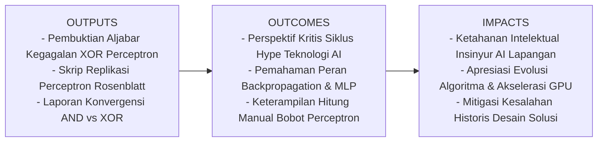
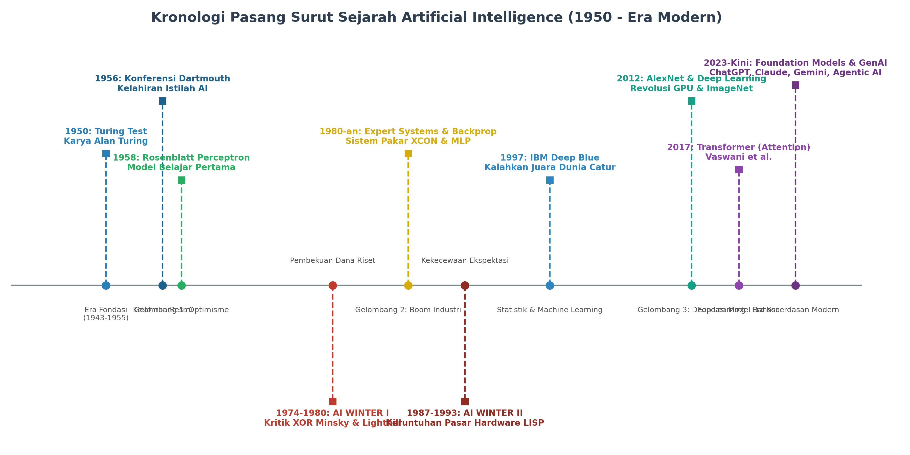
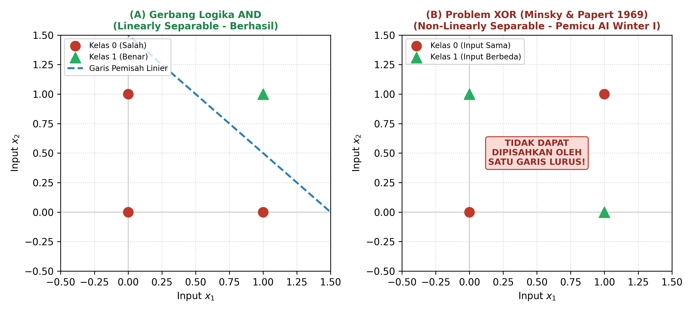

# AI Modul 1.2: Sejarah dan Perkembangan Artificial Intelligence

---

## 1. Identitas & Kerangka Capaian Pembelajaran (Sub-CPMK)

* **Kode Modul**        : AI Modul 1.2
* **Mata Kuliah**       : Kecerdasan Buatan dan Sains Data Pertanian Presisi
* **Alokasi Waktu**     : 2 x 50 Menit (Kajian Teori & Diskusi) + 2 x 50 Menit (Eksplorasi Praktikum Mandiri)
* **Beban SKS**         : 3 SKS
* **Prasyarat**         : AI Modul 1.1 (Konsep Dasar Artificial Intelligence)
* **Level Kognitif**    : C2 (Memahami), C3 (Menerapkan), C4 (Menganalisis)



### 1.1 Capaian Pembelajaran Khusus (Sub-CPMK)
Setelah menyelesaikan modul ini, mahasiswa dan pembelajar diharapkan mampu:
1. **Menguraikan (C2)** periodisasi kronologis sejarah perkembangan AI dari era embrio (1943) hingga era *Foundation Models* dan *Generative AI* modern.
2. **Menganalisis (C4)** faktor teknologi, ekonomi, dan batasan teoretis yang memicu terjadinya dua kali periode pembekuan riset (*First AI Winter* 1974–1980 dan *Second AI Winter* 1987–1993).
3. **Membuktikan secara matematis dan geometris (C4)** keterbatasan pemisahan linier pada model Perceptron Rosenblatt (1958) untuk gerbang logika XOR yang dirumuskan oleh Minsky & Papert (1969).
4. **Mengimplementasikan (C3)** algoritma pelatihan Perceptron klasik dari nol menggunakan bahasa Python dengan dokumentasi komentar per baris yang komprehensif.

### 1.2 Kerangka Hasil Pembelajaran (Outputs, Outcomes, & Impacts)
* **Outputs (Keluaran Berwujud Langsung)**:
  * Dokumen pembuktian aljabar matematis mengenai ketidakmungkinan fungsi linier memisahkan problem non-linier XOR.
  * Berkas kode program Python mandiri yang mereplikasi model *Rosenblatt Perceptron* klasik lengkap dengan visualisasi batas keputusan (*decision boundary*).
  * Laporan komparasi konvergensi pelatihan Perceptron pada gerbang AND (berhasil dalam beberapa iterasi) vs gerbang XOR (osilasi tanpa batas / gagal konvergen).
* **Outcomes (Hasil Capaian & Perubahan Kompetensi)**:
  * Mahasiswa memiliki perspektif kritis terhadap kurva sensasi (*hype curve*) teknologi AI sehingga mampu membedakan antara ekspektasi yang realistis dengan janji berlebihan (*overpromising*).
  * Mahasiswa memahami secara mendalam peran penting algoritma *Backpropagation* dan arsitektur *Multi-Layer Perceptron (MLP)* sebagai penyelamat kebuntuan sejarah AI.
  * Mahasiswa terampil membaca notasi pembaharuan bobot $\Delta w_i = \eta (y - \hat{y}) x_i$ dan menghitung pergeseran bobot secara manual langkah-demi-langkah.
* **Impacts (Dampak Jangka Panjang & Nilai Guna Luas)**:
  * Membangun ketahanan intelektual bagi calon insinyur AI agar tidak mengulangi kesalahan fatal di masa lalu dalam merancang solusi industri.
  * Menumbuhkan kesadaran bahwa kemajuan AI mutakhir saat ini bukanlah fenomena instan, melainkan sintesis dari evolusi matematika selama 8 dekade yang dipicu oleh ketersediaan Big Data dan akselerasi perangkat keras grafis (GPU).

---

## 2. Pengantar & Motivasi (*Real-World Hook*)

> *"Mereka yang tidak mempelajari sejarah komputasi ditakdirkan untuk mengulangi kegagalannya."* — Adaptasi dari George Santayana.

Saat ini peradaban berada di tengah perkembangan pesat teknologi *Generative AI*: sistem komputasi yang mampu menghasilkan sintesis citra realistis, menghasilkan kode perangkat lunak fungsional, hingga mendukung penalaran klinis medis secara otomatis. Bagi publik awam, kecerdasan buatan kerap dipersepsikan sebagai terobosan yang mendadak muncul tanpa preseden historis.

Namun, bagi akademisi dan praktisi rekayasa kecerdasan buatan, pandangan reduksionis tersebut tidak mencerminkan fakta saintifik.

Perjalanan keilmuan AI merupakan lintasan dinamika saintifik selama lebih dari delapan dekade yang diwarnai oleh **siklus gelombang optimisme teoretis, disusul oleh periode stagnasi pendanaan riset (*AI Winter*)**. Proyek penelitian berskala besar pernah dihentikan, alokasi anggaran komputasi pernah dibatasi, dan paradigma kecerdasan buatan pernah mengalami masa evaluasi kritis dalam forum-forum ilmiah.

Mengapa sistem yang begitu menjanjikan pada tahun 1960-an runtuh pada tahun 1974? Mengapa sistem pakar bernilai industri pada tahun 1980-an ditinggalkan pada tahun 1990-an? Dan faktor konkret apa yang akhirnya memicu ledakan *Deep Learning* modern yang kita nikmati hari ini? Memahami lintasan historis ini adalah syarat mutlak untuk menjadi perancang teknologi AI yang bijak, kritis, dan berakar kuat pada realitas sains.

---

## 3. Garis Waktu & Periodisasi Kronologis Perkembangan AI

Evolusi AI dapat dibagi menjadi delapan era transformasional:

```mermaid
flowchart TD
    E1["<b>1. Era Embrio & Fondasi Filosofis (1943–1955)</b><br>• Model Neuron McCulloch-Pitts (1943)<br>• Turing Test oleh Alan Turing (1950)"]
    E2["<b>2. Kelahiran Resmi AI (1956)</b><br>• Konferensi Musim Panas Dartmouth<br>• Pencetusan istilah 'Artificial Intelligence'"]
    E3["<b>3. Gelombang I: Antusiasme Awal (1956–1974)</b><br>• Logic Theorist & General Problem Solver<br>• Frank Rosenblatt Perceptron Mark I (1958)"]
    E4["<b>4. AI Winter Pertama (1974–1980)</b><br>• Buku Perceptrons karya Minsky & Papert (1969)<br>• Limitasi XOR & Pembekuan Dana Lighthill Report"]
    E5["<b>5. Gelombang II: Ledakan Sistem Pakar (1980–1987)</b><br>• Sistem Pakar Industri (XCON/R1)<br>• Penemuan Kembali Algoritma Backpropagation (1986)"]
    E6["<b>6. AI Winter Kedua (1987–1993)</b><br>• Keruntuhan Pasar Hardware Komputer LISP<br>• Knowledge Acquisition Bottleneck"]
    E7["<b>7. Era Statistik, Data & Kembalinya Optimisme (1993–2011)</b><br>• IBM Deep Blue kalahkan Garry Kasparov (1997)<br>• Support Vector Machine (SVM) & Jaringan Bayesian"]
    E8["<b>8. Revolusi Deep Learning & Generative AI (2012–Kini)</b><br>• AlexNet (2012), AlphaGo (2016)<br>• Transformer (2017), LLM, & Agentic AI (2020-an)"]

    E1 --> E2 --> E3 --> E4 --> E5 --> E6 --> E7 --> E8

    style E1 fill:#ebf5fb,stroke:#2980b9
    style E2 fill:#d4efdf,stroke:#27ae60
    style E3 fill:#fef9e7,stroke:#f39c12
    style E4 fill:#fadbd8,stroke:#c0392b
    style E5 fill:#fef9e7,stroke:#f39c12
    style E6 fill:#fadbd8,stroke:#c0392b
    style E7 fill:#ebf5fb,stroke:#2980b9
    style E8 fill:#e8daef,stroke:#8e44ad
```





---

### 3.1. Era Embrio & Fondasi Filosofis (1943–1955)
* **Warren McCulloch & Walter Pitts (1943)**: Mempublikasikan paper seminal *"A Logical Calculus of the Ideas Immanent in Nervous Activity"*. Mereka merumuskan model komputasi matematis pertama dari neuron biologis, membuktikan bahwa kombinasi neuron sederhana dengan fungsi ambang batas biner mampu menghitung fungsi logika proposisional apa pun (*AND, OR, NOT*).
* **Donald Hebb (1949)**: Mengusulkan hukum pembelajaran neurofisiologis (*Hebbian Learning Rule*): *"Neurons that fire together, wire together"*. Hubungan sinapsis antar dua sel saraf menguat jika keduanya aktif pada saat bersamaan.
* **Alan Mathison Turing (1950)**: Dalam karya monumentalnya *"Computing Machinery and Intelligence"*, Turing mengajukan pertanyaan radikal: *"Dapatkah mesin berpikir?"*. Untuk menghindari debat semantik mengenai definisi "berpikir", ia merancang uji operasional praktis yang dikenal sebagai **Turing Test** (*Imitation Game*).

---

### 3.2. Kelahiran Resmi Istilah AI di Dartmouth (1956)
Pada musim panas tahun 1956, bertempat di Dartmouth College (New Hampshire, AS), **John McCarthy** menginisiasi *Dartmouth Summer Research Project on Artificial Intelligence*. Konferensi yang didanai Rockefeller Foundation ini dihadiri oleh para pionir utama dunia:
* **Marvin Minsky** (MIT)
* **Claude Shannon** (Bell Labs, penemu Teori Informasi)
* **Arthur Samuel** (IBM, pencetus istilah *Machine Learning*)
* **Allen Newell & Herbert Simon** (Carnegie Mellon University)

Dalam proposal inilah istilah **"Artificial Intelligence"** pertama kali disahkan sebagai nama resmi cabang ilmu baru, terpisah dari sibernetika (*cybernetics*) dan matematika murni. Pada pertemuan ini pula, Newell dan Simon memamerkan program perangkat lunak cerdas pertama di dunia: **Logic Theorist**, yang berhasil membuktikan 38 dari 52 teorema logika dalam buku *Principia Mathematica* karya Russell dan Whitehead.

---

### 3.3. Gelombang Pertama Optimisme & Lahirnya Perceptron (1956–1974)
Dekade 1960-an dipenuhi keyakinan bahwa AI tingkat manusia akan tercipta dalam kurun waktu kurang dari 20 tahun.
* **Arthur Samuel (1959)**: Mengembangkan program permainan dam (*checkers player*) yang mampu belajar secara mandiri mengalahkan pembuatnya melalui metode evaluasi minimax sederhana.
* **Frank Rosenblatt (1958)**: Di Cornell Aeronautical Laboratory, Rosenblatt menciptakan **Perceptron**, perangkat keras dan model jaringan syaraf tiruan pertama yang mampu belajar membedakan pola gambar optik melalui penyesuaian bobot otomatis. Media massa saat itu menyambut Perceptron sebagai *"embrio komputer elektronik yang akan mampu berjalan, berbicara, melihat, menulis, dan mereproduksi dirinya sendiri"*.

---

### 3.4. Badai AI Winter Pertama (*The First AI Winter*, 1974–1980)
Kekecewaan melanda ketika sistem AI generasi awal terbukti gagal ketika diterapkan di luar laboratorium mainan (*microworlds*). Dua faktor utama memicu krisis ini:

1. **Buku "Perceptrons" oleh Marvin Minsky & Seymour Papert (1969)**:
   Minsky dan Papert membuktikan secara matematis bahwa Perceptron lapis tunggal (*single-layer perceptron*) memiliki keterbatasan struktural mutlak: **tidak mampu menyelesaikan fungsi logika XOR (Exclusive-OR)** dan fungsi-fungsi yang tidak dapat dipisahkan secara linier (*non-linearly separable*). Meskipun mereka menyatakan bahwa jaringan multi-lapis (*multi-layer networks*) secara teoritis dapat menyelesaikannya, saat itu belum ada algoritma matematika yang efisien untuk melatih bobot pada lapisan tersembunyi (*hidden layers*). Buku ini membunuh antusiasme riset jaringan saraf tiruan selama lebih dari satu dekade.
2. **Lighthill Report (Inggris, 1973) & Mansfield Amendment (AS)**:
   Profesor James Lighthill merilis laporan evaluasi independen untuk pemerintah Inggris yang menyatakan bahwa penelitian AI gagal mencapai janji-janji muluknya. Akibatnya, Science Research Council (Inggris) dan DARPA (AS) secara drastis memangkas dana hibah riset universitas. Masa pembekuan dana dan hilangnya kredibilitas inilah yang dikenang sebagai **The First AI Winter**.

---

### 3.5. Gelombang Kedua: Ledakan Sistem Pakar & Backpropagation (1980–1987)
AI bangkit kembali dengan meninggalkan pendekatan umum (*general intelligence*) dan beralih ke ranah domain pengetahuan spesifik melalui **Sistem Pakar (*Expert Systems*)**:
* **Komersialisasi XCON/R1 (1980)**: Perusahaan Digital Equipment Corporation (DEC) mengoperasikan sistem pakar berbasis aturan (*rule-based*) untuk mengonfigurasi pesanan sistem komputer VAX secara otomatis, menghemat biaya operasional hingga puluhan juta dolar per tahun.
* **Proyek Komputer Generasi Kelima (*Fifth Generation Computer Project*, 1981)**: Pemerintah Jepang mengucurkan dana sebesar 850 juta dolar untuk membangun komputer berbasis kecerdasan buatan dan pemrosesan logika paralel (Prolog).
* **Kebangkitan Jaringan Syaraf Tiruan (1986)**: **David Rumelhart, Geoffrey Hinton, dan Ronald Williams** mempopulerkan penemuan kembali algoritma **Backpropagation** dalam paper bersejarah mereka di jurnal *Nature*: *"Learning representations by back-propagating errors"*. Algoritma ini memecahkan kebuntuan Minsky tahun 1969 dengan menyediakan formula kalkulus gradien rantai (*chain rule*) untuk melatih jaringan saraf banyak lapis (*Multi-Layer Perceptron / MLP*).

---

### 3.6. AI Winter Kedua (*The Second AI Winter*, 1987–1993)
Ledakan industri sistem pakar tidak bertahan lama akibat keterbatasan arsitektur:
1. **Runtuhnya Pasar Mesin Hardware LISP (1987)**: Komputer workstation komersial berbasis mikroprosesor standar (Intel x86) berkembang pesat dan melampaui performa mesin komputer mahal yang didesain khusus untuk bahasa LISP (seperti Symbolics dan LMI). Industri hardware AI kolaps seketika.
2. **Knowledge Acquisition Bottleneck**: Menulis aturan manual `if-then` dari pakar manusia terbukti sangat mahal, rapuh (*brittle*), sulit diperbarui, dan tidak mampu menangani kasus yang bertentangan (*inconsistent facts*). Dana penelitian kembali ditarik secara masif.

---

### 3.7. Era Statistik, Data & Kembalinya Optimisme (1993–2011)
AI bangkit kembali dengan mengadopsi metodologi sains formal: matematika probabilitas, teori informasi statistik, dan optimasi numerik.
* **11 Mei 1997**: Komputer catur super **IBM Deep Blue** menorehkan sejarah dunia dengan mengalahkan Juara Catur Dunia bertahan, **Garry Kasparov**, dalam pertandingan 6 babak berstandar turnamen resmi.
* **Revolusi Machine Learning Statistik**: Algoritma probabilistik seperti *Support Vector Machines* (Vladimir Vapnik, 1995), *Random Forest* (Leo Breiman, 2001), dan *Bayesian Networks* (Judea Pearl) menjadi standar emas industri karena memiliki bukti konvergensi matematis yang solid.
* **DARPA Grand Challenge (2005)**: Mobil otonom "Stanley" karya Stanford University berhasil menyelesaikan rute gurun sejauh 212 km tanpa campur tangan manusia.

---

### 3.8. Revolusi Deep Learning hingga Era Generative AI Modern (2012–Kini)
Kebangkitan modern AI didorong oleh konvergensi sempurna tiga pilar: **Algoritma Jaringan Syaraf Mendalam**, **Ketersediaan Big Data (Internet/IoT)**, dan **Akselerator Grafis Paralel (GPU)**:
* **Tahun 2012 (Titik Balik AlexNet)**: Alex Krizhevsky, Ilya Sutskever, dan Geoffrey Hinton memenangkan kompetisi klasifikasi citra dunia *ImageNet* menggunakan **AlexNet** (Convolutional Neural Network 8-lapis yang dilatih pada GPU NVIDIA). AlexNet memangkas tingkat error dari $26\%$ menjadi $15.3\%$, memicu migrasi massal komunitas ilmuwan komputer ke ranah *Deep Learning*.
* **Tahun 2016 (Kemenangan AlphaGo)**: Google DeepMind menciptakan **AlphaGo** yang mengalahkan legenda dunia Lee Sedol dalam permainan papan paling kompleks di dunia, Go (4–1), menggunakan kombinasi *Deep Reinforcement Learning* dan *Monte Carlo Tree Search*.
* **Tahun 2017 (Kelahiran Arsitektur Transformer)**: Vaswani et al. dari Google Research menerbitkan paper revolusioner *"Attention Is All You Need"*, menggantikan arsitektur rekuren (RNN/LSTM) dengan mekanisme atensi mandiri (*self-attention*). Arsitektur inilah yang menjadi fondasi seluruh model bahasa besar saat ini.
* **Era 2020–2026 (Foundation Models & Agentic AI)**: Munculnya model skala raksasa (GPT-4, Gemini, Claude) yang berkemampuan multimodal (teks, gambar, audio, video) serta agen cerdas otonom (*Agentic AI*) yang mampu menjalankan instruksi kompleks di dunia nyata.

---

## 4. Formulasi Matematis: Model Perceptron Rosenblatt & Limitasi XOR

Untuk memahami secara saintifik mengapa sejarah AI mengalami masa beku (*AI Winter*), kita wajib menelaah matematika di balik model pembelajaran terawal: **Perceptron**.



### 4.1. Formulasi Forward Perceptron (Rosenblatt, 1958)

Keluaran prediksi $\hat{y}$ dari Perceptron biner dihitung melalui kombinasi linier masukan bobot yang diteruskan ke fungsi aktivasi undak biner (*Heaviside step function*):

$$z = \sum_{i=1}^{n} w_i x_i + b = \mathbf{w}^T \mathbf{x} + b$$

$$\hat{y} = f(z) = \begin{cases} 1, & \text{jika } z \ge 0 \\ 0, & \text{jika } z < 0 \end{cases}$$

#### 📖 Panduan Membaca Lambang Matematika:
* $z$ : Simbol variabel skalar, dibaca **"net input (kombinasi linier)"**, yaitu akumulasi total sinyal masukan yang telah diboboti sebelum melewati fungsi aktivasi.
* $\sum$ : Simbol huruf kapital Yunani **Sigma**, dibaca **"penjumlahan dari ... sampai ..."**.
* $i=1$ : Indeks batas bawah iterasi, dibaca **"mulai dari fitur ke-1"**.
* $n$ : Jumlah total fitur masukan (dimensi vektor masukan).
* $w_i$ : Dibaca **"bobot ke-i (weight)"**. Merefleksikan kekuatan sinapsis sambungan untuk fitur masukan ke-$i$.
* $x_i$ : Dibaca **"fitur masukan ke-i (input feature)"**. Nilai variabel data yang dibaca oleh sensor.
* $b$ : Simbol bias, dibaca **"bias"**. Merupakan ambang geser (*threshold*) yang memungkinkan garis pemisah tidak harus melewati titik koordinat asal $(0,0)$.
* $\mathbf{w}^T \mathbf{x}$ : Notasi aljabar linier, dibaca **"w transpose kali x"** (perkalian titik / *dot product* antara vektor bobot dan vektor fitur).
* $\hat{y}$ : Dibaca **"y topi (y-hat)"**. Nilai prediksi akhir yang dikeluarkan oleh neuron tiruan (bernilai diskrit 0 atau 1).
* $f(z)$ : Fungsi aktivasi undak (*unit step activation function*).

---

### 4.2. Aturan Pembaharuan Bobot (*Perceptron Learning Rule*)

Jika prediksi $\hat{y}$ tidak sama dengan nilai target riil $y$, bobot disesuaikan menggunakan formula:

$$w_i^{(t+1)} = w_i^{(t)} + \Delta w_i$$

$$\Delta w_i = \eta \cdot (y - \hat{y}) \cdot x_i$$

$$b^{(t+1)} = b^{(t)} + \eta \cdot (y - \hat{y})$$

#### 📖 Panduan Membaca Lambang Matematika:
* $w_i^{(t)}$ : Nilai bobot ke-$i$ pada langkah waktu atau iterasi ke-$t$.
* $w_i^{(t+1)}$ : Nilai bobot baru ke-$i$ yang telah diperbarui untuk digunakan pada iterasi berikutnya ($t+1$).
* $\Delta$ : Huruf kapital Yunani **Delta**, dibaca **"delta w"** atau selisih perubahan besaran bobot.
* $\eta$ : Huruf kecil Yunani **Eta**, dibaca **"learning rate (laju pembelajaran)"**. Konstanta skalar positif kecil (misal $0.1$ atau $0.01$) penentu kecepatan adaptasi bobot.
* $(y - \hat{y})$ : Sinyal galat (error), yaitu selisih target aktual dikurangi prediksi model.

---

### 4.3. Contoh Perhitungan Angka Konkret: Pelatihan Gerbang AND

Mari kita simulasikan satu langkah pembaruan bobot pada Gerbang Logika AND:
* **Fitur Masukan**: $x_1 = 1.0, x_2 = 1.0$ (kondisi di mana AND harus menghasilkan output 1).
* **Target Aktual**: $y = 1$.
* **Kondisi Awal Bobot**: $w_1 = 0.2, w_2 = -0.4, b = -0.5$.
* **Learning Rate**: $\eta = 0.1$.

**Langkah 1: Hitung Net Input ($z$)**
$$z = (w_1 \cdot x_1) + (w_2 \cdot x_2) + b$$
$$z = (0.2 \times 1.0) + (-0.4 \times 1.0) + (-0.5) = 0.2 - 0.4 - 0.5 = -0.7$$

**Langkah 2: Evaluasi Prediksi ($\hat{y}$)**
Karena $z = -0.7 < 0$, maka berdasarkan fungsi undak:
$$\hat{y} = 0 \quad (\text{Salah, target seharusnya } y = 1)$$

**Langkah 3: Hitung Sinyal Galat (Error)**
$$\text{Error} = (y - \hat{y}) = (1 - 0) = +1$$

**Langkah 4: Perbarui Bobot dan Bias**
* Pembaruan $w_1$:
  $$\Delta w_1 = \eta \cdot \text{Error} \cdot x_1 = 0.1 \times (+1) \times 1.0 = +0.1$$
  $$w_1^{\text{baru}} = 0.2 + 0.1 = 0.3$$
* Pembaruan $w_2$:
  $$\Delta w_2 = \eta \cdot \text{Error} \cdot x_2 = 0.1 \times (+1) \times 1.0 = +0.1$$
  $$w_2^{\text{baru}} = -0.4 + 0.1 = -0.3$$
* Pembaruan Bias $b$:
  $$\Delta b = \eta \cdot \text{Error} = 0.1 \times (+1) = +0.1$$
  $$b^{\text{baru}} = -0.5 + 0.1 = -0.4$$

*Hasil*: Bobot terkoreksi ke arah positif untuk memperbesar peluang aktivasi $z \ge 0$ pada sampel serupa berikutnya.

---

### 4.4. Pembuktian Matematis Limitasi XOR (Minsky & Papert, 1969)

Gerbang logika XOR (*Exclusive-OR*) didefinisikan oleh tabel kebenaran berikut:

| $x_1$ | $x_2$ | Target $y$ | Syarat Persamaan Linier ($z = w_1 x_1 + w_2 x_2 + b$) |
| :---: | :---: | :---: | :--- |
| $0$ | $0$ | **$0$** | $(1) \quad w_1(0) + w_2(0) + b < 0 \implies \mathbf{b < 0}$ |
| $1$ | $0$ | **$1$** | $(2) \quad w_1(1) + w_2(0) + b \ge 0 \implies \mathbf{w_1 + b \ge 0}$ |
| $0$ | $1$ | **$1$** | $(3) \quad w_1(0) + w_2(1) + b \ge 0 \implies \mathbf{w_2 + b \ge 0}$ |
| $1$ | $1$ | **$0$** | $(4) \quad w_1(1) + w_2(1) + b < 0 \implies \mathbf{w_1 + w_2 + b < 0}$ |

#### Analisis Kontradiksi Aljabar:
1. Jumlahkan Persamaan (2) dan Persamaan (3):
   $$(w_1 + b) + (w_2 + b) \ge 0$$
   $$w_1 + w_2 + 2b \ge 0 \quad \text{--- (Persamaan A)}$$
2. Substitusikan Persamaan (4) ($w_1 + w_2 + b < 0$) ke dalam Persamaan A:
   $$(w_1 + w_2 + b) + b \ge 0$$
   Karena $(w_1 + w_2 + b)$ bernilai negatif ($<0$) dan dari Persamaan (1) diketahui $b < 0$, maka penjumlahan dua bilangan negatif **pasti menghasilkan bilangan negatif**:
   $$(w_1 + w_2 + b) + b < 0$$
3. Timbul **kontradiksi matematis**:
   $$\text{Pernyataan mensyaratkan: } w_1 + w_2 + 2b \ge 0 \quad \text{tetapi secara aljabar terbukti: } w_1 + w_2 + 2b < 0$$

> ⚠️ **Kesimpulan Teoretis Minsky & Papert:**
> Tidak ada kombinasi bobot bilangan riil $(w_1, w_2, b)$ mana pun di alam semesta yang mampu memenuhi keempat pertidaksamaan tersebut secara simultan. Garis lurus linier mustahil memisahkan problem XOR. Diperlukan minimal **dua garis pemisah** yang hanya dapat diwujudkan oleh lapisan tersembunyi (*Hidden Layer*) pada *Multi-Layer Perceptron (MLP)*.

---

## 5. Walkthrough Implementasi: Simulasi Perceptron Klasik (AND vs XOR)

Berikut adalah kode Python murni tanpa pustaka eksternal rumit untuk membuktikan secara empiris konvergensi gerbang AND dan kegagalan gerbang XOR.

### 5.1. Kode Program Lengkap dengan Komentar Per Baris

```python
# ==============================================================================
# AI Modul 1.2: Replikasi Historis Algoritma Pembelajaran Perceptron Rosenblatt (1958)
# Pembuktian Empiris: Konvergensi Gerbang Logika AND vs Kegagalan Gerbang Non-Linier XOR
# ==============================================================================

# Mengimpor modul List dan Tuple untuk anotasi tipe data statis
from typing import List, Tuple


class RosenblattPerceptron:
    """Implementasi model neuron tiruan lapis tunggal Perceptron klasik."""

    def __init__(self, input_dim: int, learning_rate: float = 0.1, max_epochs: int = 20):
        # Menyimpan jumlah fitur masukan yang akan diproses
        self.input_dim: int = input_dim
        # Menyimpan nilai laju pembelajaran (eta) untuk mengontrol besaran koreksi bobot
        self.learning_rate: float = learning_rate
        # Menyimpan batas maksimum putaran pelatihan (epoch) untuk mencegah infinite loop
        self.max_epochs: int = max_epochs
        # Menginisialisasi vektor bobot awal dengan nilai nol sepanjang dimensi masukan
        self.weights: List[float] = [0.0] * input_dim
        # Menginisialisasi nilai bias awal dengan nilai nol
        self.bias: float = 0.0

    def predict(self, x: List[float]) -> int:
        """Menghitung output aktivasi biner (0 atau 1) dari masukan x: y = f(w^T x + b)."""
        # Menghitung kombinasi linier (dot product) antara vektor bobot dan vektor masukan
        linear_combination: float = sum(w * xi for w, xi in zip(self.weights, x)) + self.bias
        # Menerapkan fungsi aktivasi undak Heaviside: return 1 jika net input >= 0, selainnya return 0
        return 1 if linear_combination >= 0.0 else 0

    def train(self, training_data: List[Tuple[List[float], int]]) -> Tuple[bool, int]:
        """Melatih bobot Perceptron menggunakan Perceptron Learning Rule."""
        # Melakukan perulangan iterasi pelatihan dari epoch ke-1 hingga max_epochs
        for epoch in range(1, self.max_epochs + 1):
            # Melacak jumlah kesalahan klasifikasi pada epoch yang sedang berjalan
            total_errors: int = 0
            
            # Melakukan iterasi untuk setiap pasangan sampel data masukan (x) dan target riil (y)
            for x, y_target in training_data:
                # Menghitung prediksi keluaran model saat ini
                y_pred: int = self.predict(x)
                # Menghitung sinyal galat kesalahan: error = y_target - y_pred
                error: int = y_target - y_pred
                
                # Memeriksa apakah terjadi kesalahan prediksi pada sampel ini
                if error != 0:
                    # Menambahkan pencatat kesalahan total
                    total_errors += 1
                    # Menghitung faktor pengali adaptasi bobot: delta = learning_rate * error
                    update: float = self.learning_rate * error
                    
                    # Memperbarui setiap elemen bobot w_i = w_i + eta * error * x_i
                    for i in range(self.input_dim):
                        self.weights[i] += update * x[i]
                        
                    # Memperbarui nilai skalar bias: b = b + eta * error
                    self.bias += update

            # Jika dalam satu putaran penuh tidak ada satu pun kesalahan (total_errors == 0)
            if total_errors == 0:
                # Pelatihan dinyatakan sukses konvergen sempurna
                return True, epoch

        # Jika hingga batas maksimum epoch masih terdapat kesalahan, pelatihan gagal konvergen
        return False, self.max_epochs


# ==============================================================================
# Blok Pengujian Komparatif: Gerbang AND (Linear) vs Gerbang XOR (Non-Linear)
# ==============================================================================
if __name__ == "__main__":
    print("==================================================================")
    print("  SIMULASI HISTORIS KONTROVERSI PERCEPTRON (MINSKY & PAPERT 1969)")
    print("==================================================================")

    # 1. Definisi Dataset Gerbang Logika AND (Dapat dipisahkan secara linier)
    and_dataset: List[Tuple[List[float], int]] = [
        ([0.0, 0.0], 0),
        ([0.0, 1.0], 0),
        ([1.0, 0.0], 0),
        ([1.0, 1.0], 1)
    ]

    # Menginisialisasi objek Perceptron untuk Gerbang AND
    p_and = RosenblattPerceptron(input_dim=2, learning_rate=0.1, max_epochs=20)
    # Melatih Perceptron pada data AND
    success_and, epochs_and = p_and.train(and_dataset)

    # Menampilkan hasil eksperimen gerbang AND
    print(f"\n[Eksperimen 1: Gerbang Logika AND]")
    print(f"  Status Konvergensi : {'BERHASIL KONVERGEN (Linear Separable)' if success_and else 'GAGAL'}")
    print(f"  Epoch Dibutuhkan   : {epochs_and} iterasi")
    print(f"  Bobot Terpelajar   : w1 = {p_and.weights[0]:.2f}, w2 = {p_and.weights[1]:.2f}, b = {p_and.bias:.2f}")

    # 2. Definisi Dataset Gerbang Logika XOR (Tidak dapat dipisahkan secara linier)
    xor_dataset: List[Tuple[List[float], int]] = [
        ([0.0, 0.0], 0),
        ([0.0, 1.0], 1),
        ([1.0, 0.0], 1),
        ([1.0, 1.0], 0)
    ]

    # Menginisialisasi objek Perceptron untuk Gerbang XOR
    p_xor = RosenblattPerceptron(input_dim=2, learning_rate=0.1, max_epochs=20)
    # Melatih Perceptron pada data XOR
    success_xor, epochs_xor = p_xor.train(xor_dataset)

    # Menampilkan hasil eksperimen gerbang XOR
    print(f"\n[Eksperimen 2: Gerbang Logika XOR]")
    print(f"  Status Konvergensi : {'BERHASIL' if success_xor else 'GAGAL KONVERGEN (Non-Linear Separable)'}")
    print(f"  Keterangan         : Perceptron mengalami osilasi bobot tanpa henti (AI Winter I trigger)")
    print(f"  Bobot Akhir (Stuck): w1 = {p_xor.weights[0]:.2f}, w2 = {p_xor.weights[1]:.2f}, b = {p_xor.bias:.2f}")
```

---

### 5.2. Pembahasan Keterangan Penggunaan Kode (*Operational Breakdown*)

1. **Struktur Inisialisasi (`__init__`)**:
   * Model menginisialisasi `self.weights` dengan nilai awal `0.0`. Pada model linier sederhana seperti Perceptron, inisialisasi bobot nol tidak menimbulkan masalah simetri (berbeda dengan *Multi-Layer Neural Network* yang membutuhkan inisialisasi acak seperti Xavier/He).
2. **Kalkulasi Linier & Aktivasi Undak (`predict`)**:
   * Operasi `sum(w * xi for w, xi in zip(self.weights, x)) + self.bias` memodelkan persamaan hiperbidang pemisah (*separating hyperplane*) $\mathbf{w}^T \mathbf{x} + b = 0$.
   * Fungsi aktivasi biner `1 if linear_combination >= 0.0 else 0` bertindak sebagai gerbang keputusan tanpa kompromi (*hard threshold*).
3. **Mekanisme Koreksi Bobot (`train`)**:
   * Nilai `error = y_target - y_pred` hanya dapat menghasilkan tiga kemungkinan:
     * `0`: Prediksi sudah benar, bobot tidak berubah ($\Delta w = 0$).
     * `+1`: Prediksi bernilai $0$ padahal seharusnya $1$. Bobot ditambah ($\Delta w > 0$) agar nilai $z$ bergeser ke arah positif.
     * `-1`: Prediksi bernilai $1$ padahal seharusnya $0$. Bobot dikurangi ($\Delta w < 0$) agar nilai $z$ bergeser ke arah negatif.
4. **Analisis Komparatif Output**:
   * **Pada Gerbang AND**: Pelatihan konvergen dalam waktu singkat (~6 epoch). Begitu konvergen, `total_errors == 0`, loop berhenti seketika, dan bobot terkunci.
   * **Pada Gerbang XOR**: Pelatihan terus berjalan hingga mencapai `max_epochs = 20` tanpa pernah mencapai kondisi `total_errors == 0`. Bobot terus berayun (*oscillating*) maju-mundur karena memperbaiki satu sampel XOR akan secara otomatis merusak prediksi sampel XOR lainnya.

---

## 6. Latihan, Evaluasi & Diskusi Kritis

### 6.1. Pertanyaan Analitis (HOTS)
1. **Analisis Kegagalan AI Winter I**: Mengapa komunitas AI era 1970-an begitu mudah menyerah setelah publikasi buku *Perceptrons* karya Minsky & Papert, padahal solusi konseptual berupa penambahan lapisan tersembunyi (*hidden layer*) sudah diketahui secara teoretis? Kendala matematika dan komputasi apa yang menjadi penghalang saat itu?
2. **Komparasi Resiliensi Teknologi**: Mengapa revolusi *Deep Learning* tahun 2012 (AlexNet) tidak mengalami keruntuhan (*AI Winter*) sebagaimana yang dialami era Sistem Pakar tahun 1987? Analisis peran ketersediaan dataset publik berskala besar (ImageNet) dan ketersediaan komputasi paralel GPU.
3. **Relevansi Hukum Hebb**: Bagaimana prinsip pembelajaran biologis Hebbian (*"neurons that fire together, wire together"*) direfleksikan secara matematis dalam formula pembaruan bobot Perceptron $\Delta w_i = \eta \cdot \text{error} \cdot x_i$?

### 6.2. Tugas Mandiri (Eksplorasi di Notebook Pendamping)
* Buka berkas [AI_Modul_1.2_Praktikum_Sejarah_dan_Perkembangan.ipynb](../../notebooks/part-01/AI_Modul_1.2_Praktikum_Sejarah_dan_Perkembangan.ipynb).
* Jalankan visualisasi batas keputusan linier (*decision boundary plot*) untuk mengamati secara visual bagaimana garis lurus Perceptron berhasil memotong ruang sampel pada gerbang OR dan AND, namun terbelah tak berdaya pada gerbang XOR.

---

## 7. Rangkuman & Glosarium

### Rangkuman Butir Inti:
1. Sejarah AI adalah siklus dinamis antara antusiasme berlebihan (*hype*) dan kekecewaan rasional (*AI Winter*), yang berakar dari jurang pemisah antara klaim filosofis dengan keterbatasan matematika dan komputasi pada zamannya.
2. *First AI Winter* (1974) dipicu oleh pembuktian matematis Minsky & Papert mengenai ketidakmampuan Perceptron lapis tunggal menyelesaikan problem XOR non-linier.
3. Penemuan kembali algoritma *Backpropagation* (1986) oleh Rumelhart, Hinton, dan Williams membuktikan bahwa jaringan multi-lapis (MLP) mampu memecahkan problem non-linier melalui kalkulus aturan rantai (*chain rule*).
4. Ledakan modern AI pasca-2012 bukan sekadar hasil kebetulan, melainkan sinergi tiga pilar: **Kedalaman Algoritma (*Deep Learning*) + Skala Data Masif (*Big Data*) + Daya Komputasi Paralel Ekstrem (*GPU/TPU*)**.

### Glosarium:
* **Perceptron**: Model neuron tiruan paling awal yang dipublikasikan oleh Frank Rosenblatt (1958) yang memetakan masukan berbobot ke fungsi undak biner.
* **Linearly Separable**: Karakteristik himpunan data di mana dua kelas titik data dapat dipisahkan secara sempurna oleh satu garis lurus (pada dimensi 2D) atau hiperbidang datar (pada dimensi tinggi).
* **AI Winter**: Periode penurunan drastis pendanaan riset, publikasi, dan antusiasme komersial terhadap kecerdasan buatan akibat kegagalan teknologi memenuhi ekspektasi publik yang digelembungkan.
* **Backpropagation**: Algoritma pembelajaran berbasis kalkulus diferensial yang menghitung gradien kerugian fungsi terhadap setiap bobot dalam jaringan saraf berlapis majemuk secara mundur (*backward pass*).
* **Transformer**: Arsitektur jaringan saraf berbasis mekanisme *Self-Attention* (Vaswani et al., 2017) yang menggantikan ketergantungan sekuensial rekuren dan menjadi tulang punggung seluruh model AI generatif modern.

---

## 8. Jembatan Menuju Modul Berikutnya (Bridge to AI Modul 1.3)

Di modul ini, kita telah menyaksikan bagaimana revolusi AI bergerak dari manipulasi simbol logika kaku, melewati masa-masa kelam *AI Winter*, hingga akhirnya meledak berkat *Machine Learning* dan *Deep Learning*.

Namun, di tengah banjir istilah teknologi saat ini, sering kali terjadi kerancuan terminologi yang fatal:
> *Apakah Machine Learning sama dengan Artificial Intelligence? Di mana letak batas tegas yang memisahkan antara algoritma Machine Learning tradisional (seperti regresi atau SVM) dengan Deep Learning berbasis miliaran parameter? Dan bagaimana kita menentukan pendekatan mana yang paling tepat untuk proyek komputasi riil kita?*

Perbedaan hierarkis, sistematika struktur, serta komparasi karakteristik computational workflow antara **AI, Machine Learning, dan Deep Learning** akan kita kupas tuntas pada modul berikutnya: **AI Modul 1.3: Perbedaan AI, Machine Learning, dan Deep Learning**.

---

## 9. Daftar Pustaka dan Referensi Akademik

1. McCulloch, W. S., & Pitts, W. (1943). *A logical calculus of the ideas immanent in nervous activity*. The Bulletin of Mathematical Biophysics, 5(4), 115-133.
2. Turing, A. M. (1950). *Computing Machinery and Intelligence*. Mind, 59(236), 433-460.
3. McCarthy, J., Minsky, M. L., Rochester, N., & Shannon, C. E. (1956). *A Proposal for the Dartmouth Summer Research Project on Artificial Intelligence*. AI Magazine, 27(4), 12.
4. Rosenblatt, F. (1958). *The perceptron: A probabilistic model for information storage and organization in the brain*. Psychological Review, 65(6), 386-408.
5. Minsky, M., & Papert, S. (1969). *Perceptrons: An Introduction to Computational Geometry*. MIT Press.
6. Rumelhart, D. E., Hinton, G. E., & Williams, R. J. (1986). *Learning representations by back-propagating errors*. Nature, 323(6088), 533-536.
7. Krizhevsky, A., Sutskever, I., & Hinton, G. E. (2012). *ImageNet classification with deep convolutional neural networks*. Advances in Neural Information Processing Systems (NeurIPS), 25, 1097-1105.
8. Vaswani, A., Shazeer, N., Parmar, N., Uszkoreit, J., Jones, L., Gomez, A. N., Kaiser, Ł., & Polosukhin, I. (2017). *Attention is all you need*. Advances in Neural Information Processing Systems (NeurIPS), 30, 5998-6008.
9. Russell, S., & Norvig, P. (2020). *Artificial Intelligence: A Modern Approach (4th Edition)*. Pearson.
