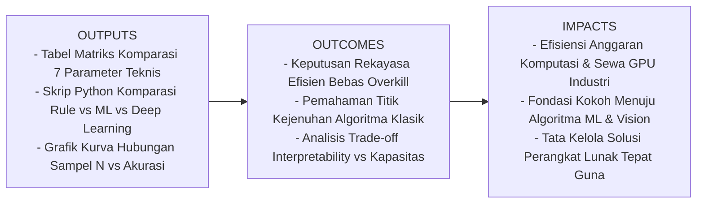
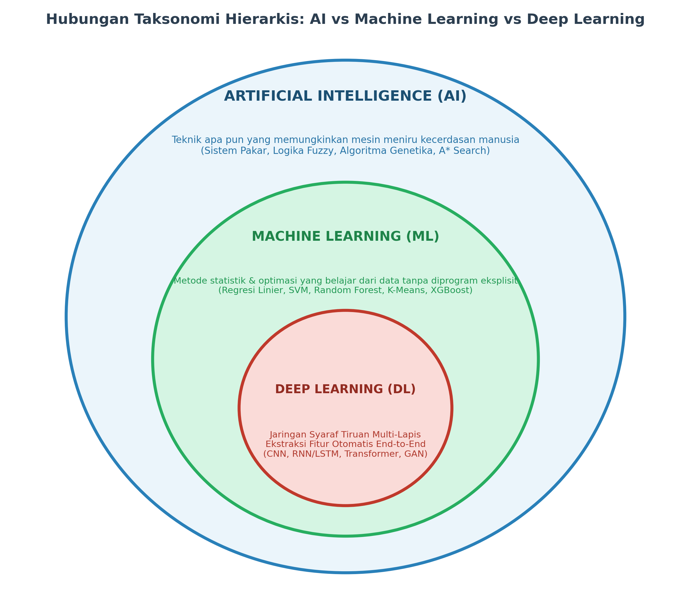
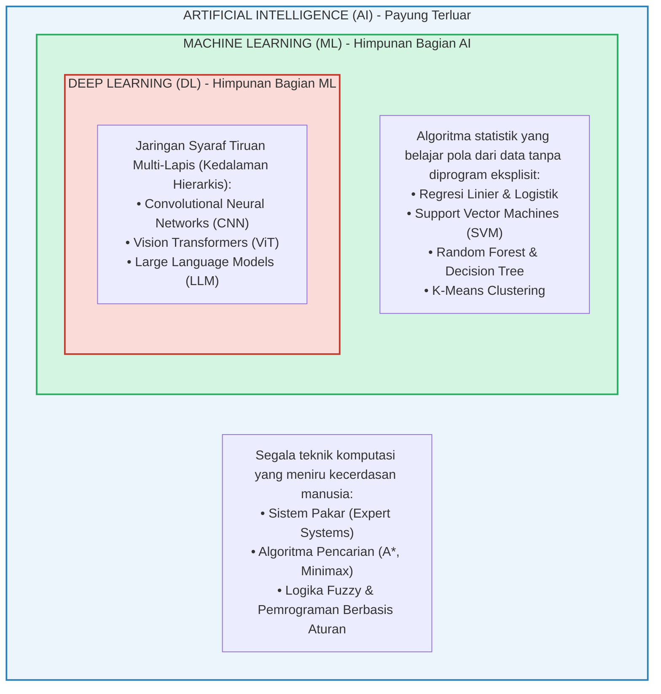
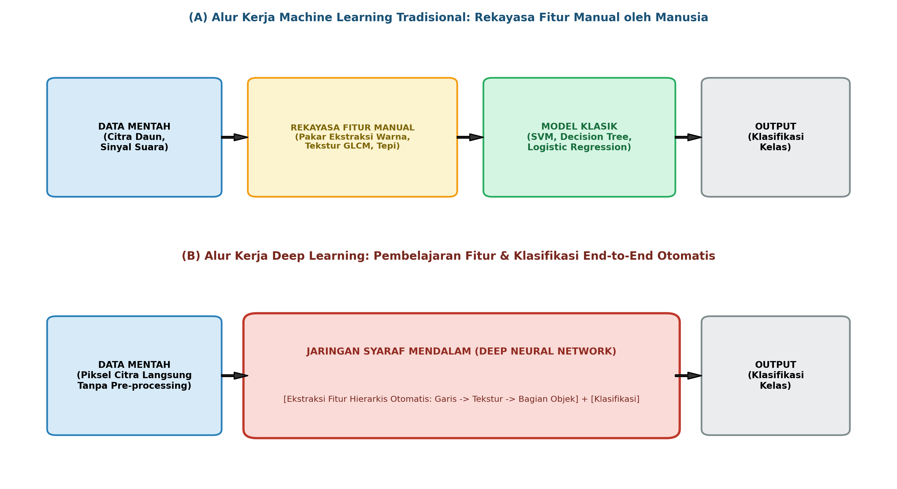
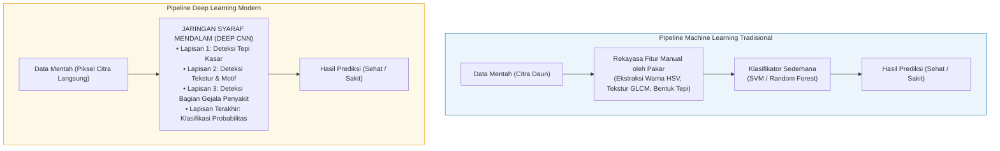
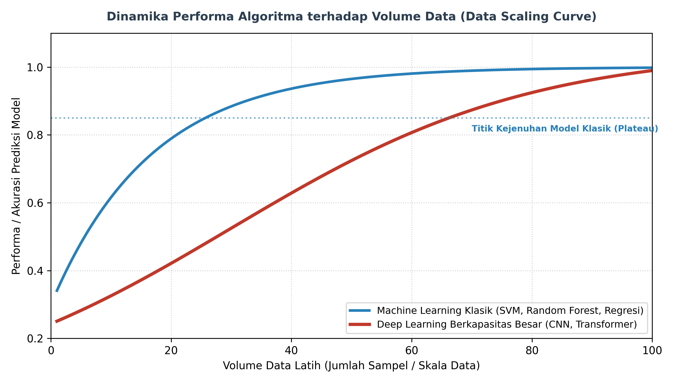

# AI Modul 1.3: Perbedaan AI, Machine Learning, dan Deep Learning

---

## 1. Identitas & Kerangka Capaian Pembelajaran (Sub-CPMK)

* **Kode Modul**        : AI Modul 1.3
* **Mata Kuliah**       : Kecerdasan Buatan dan Sains Data Pertanian Presisi
* **Alokasi Waktu**     : 2 x 50 Menit (Kajian Teori & Diskusi) + 2 x 50 Menit (Eksplorasi Praktikum Mandiri)
* **Beban SKS**         : 3 SKS
* **Prasyarat**         : AI Modul 1.1 (Konsep Dasar AI) & AI Modul 1.2 (Sejarah dan Perkembangan AI)
* **Level Kognitif**    : C2 (Memahami), C3 (Menerapkan), C4 (Menganalisis)



### 1.1 Capaian Pembelajaran Khusus (Sub-CPMK)
Setelah menyelesaikan modul ini, mahasiswa dan pembelajar diharapkan mampu:
1. **Menguraikan (C2)** hubungan hierarkis himpunan bagian antara *Artificial Intelligence* (AI), *Machine Learning* (ML), dan *Deep Learning* (DL).
2. **Menganalisis (C4)** perbedaan mendasar pada mekanisme ekstraksi fitur (*Manual Feature Engineering* pada ML konvensional vs *Automated Representation Learning* pada Deep Learning).
3. **Mengevaluasi (C4)** dinamika performa model terhadap skala volume data berdasarkan hipotesis kurva penskalaan (*Data Scaling Power Law*).
4. **Mengimplementasikan dan membandingkan (C3)** performa klasifikasi tiga paradigma komputasi (*Rule-based*, *Machine Learning Klasik*, dan *Deep Neural Network*) pada dataset kasus pertanian yang sama.

### 1.2 Kerangka Hasil Pembelajaran (Outputs, Outcomes, & Impacts)
* **Outputs (Keluaran Berwujud Langsung)**:
  * Tabel matriks komparasi 7 parameter teknis yang membedakan sistem berbasis aturan, ML klasik, dan Deep Learning.
  * Berkas kode program Python mandiri yang mengeksekusi perbandingan tiga paradigma model secara langsung pada data inspeksi daun.
  * Grafik empiris kurva hubungan antara jumlah sampel data latih ($N$) dengan akurasi akhir masing-masing paradigma.
* **Outcomes (Hasil Capaian & Perubahan Kompetensi)**:
  * Mahasiswa mampu mengambil keputusan rekayasa yang rasional dan efisien: tidak menggunakan *Deep Learning* secara berlebihan (*overkill*) untuk data tabular sederhana yang cukup diselesaikan dengan ML klasik.
  * Mahasiswa memahami batas kejenuhan (*saturation plateau*) algoritma tradisional dan kapan sebuah proyek wajib beralih ke arsitektur jaringan saraf dalam.
  * Mahasiswa mampu membaca dan mengkalkulasi formula penskalaan data serta memahami trade-off antara *interpretability* (keterbukaan model) vs *representational capacity* (daya tampung pola).
* **Impacts (Dampak Jangka Panjang & Nilai Guna Luas)**:
  * Penghematan signifikan pada anggaran komputasi industri: menghindari pemborosan sewa GPU bernilai tinggi untuk tugas-tugas yang dapat diselesaikan oleh CPU standar.
  * Membangun fondasi arsitektural yang kokoh sebelum mahasiswa mempelajari algoritma ML spesifik pada Part 5–8 dan arsitektur Deep Learning Vision pada Part 9–13.

---

## 2. Pengantar & Motivasi (*Real-World Hook*)

Di era transformasi digital saat ini, istilah **Artificial Intelligence**, **Machine Learning**, dan **Deep Learning** sering kali diucapkan secara bergantian dalam presentasi bisnis maupun artikel berita populer seolah-olah ketiganya adalah sinonim dari hal yang persis sama. 

Seorang manajer perkebunan mungkin berkata: *"Kita memasang AI kamera untuk menyortir buah kelapa sawit"*, sementara insinyur data di timnya menyebutnya *"model Machine Learning"*, dan pengembang perangkat lunak menyebutnya *"arsitektur Deep Learning"*. 

Apakah mereka sedang membicarakan hal yang berbeda?

Bagi seorang insinyur dan akademisi AI, kerancuan istilah ini berbahaya karena dapat menyebabkan **kesalahan fatal dalam perancangan sistem dan estimasi biaya**:
* Memilih *Deep Learning* ketika data yang tersedia hanya 100 baris tabel Excel akan berujung pada kegagalan generalisasi (*overfitting* parah) dan pemborosan komputasi server.
* Memilih sistem *Rule-Based* untuk mengenali ribuan variasi penyakit daun di lapangan terbuka akan menghasilkan program rapuh yang mogok setiap kali sudut pencahayaan matahari berubah.

Modul ini hadir untuk memberikan batas demarkasi yang tegas, matematis, dan aplikatif mengenai kapan suatu sistem disebut AI, kapan ia menjadi Machine Learning, dan kapan ia bertransformasi menjadi Deep Learning.

---

## 3. Landasan Teori & Hubungan Hierarkis Keilmuan

Secara formal, relasi ketiga ranah ini merupakan hubungan **himpunan bagian bertingkat (*nested subsets*)**:

$$\text{Deep Learning} \subset \text{Machine Learning} \subset \text{Artificial Intelligence}$$





---

### 3.1. Definisi Formal Ketiga Ranah

#### 1. Artificial Intelligence (Kecerdasan Buatan)
* **Cakupan**: Payung disiplin ilmu terluar yang mencakup segala metode, algoritma, atau mesin yang mampu mempersepsi lingkungan, bernalar, memecahkan masalah, dan mengambil tindakan yang rasional.
* **Karakteristik**: Tidak semua AI membutuhkan data atau proses belajar. Sistem catur berbasis pencarian pohon keputusan (seperti *Minimax*) atau sistem pakar berbasis 10.000 aturan `IF-THEN` adalah representasi AI sejati, meskipun tidak menggunakan pembelajaran mesin sama sekali.

#### 2. Machine Learning (Pembelajaran Mesin)
* **Definisi Formal Tom M. Mitchell (1997)**:
  > *"Sebuah program komputer dikatakan belajar dari pengalaman $E$ sehubungan dengan suatu tugas $T$ dan pengukuran kinerja $P$, jika kinerjanya pada tugas $T$, sebagaimana diukur oleh $P$, meningkat seiring bertambahnya pengalaman $E$."*
* **Karakteristik**: Alih-alih manusia yang menulis aturan logika secara manual, algoritma ML menganalisis sekumpulan data historis (*Experience $E$*) untuk mengestimasi fungsi matematis pemetaan $f(x) \approx y$ secara otomatis melalui optimasi parameter.

#### 3. Deep Learning (Pembelajaran Mendalam)
* **Cakupan**: Sub-spesialisasi dari Machine Learning yang arsitekturnya didasarkan pada jaringan syaraf tiruan bertingkat banyak (*Multi-Layer Neural Networks*) dengan kedalaman representasi (*representational depth*).
* **Karakteristik Kunci**: Mengeliminasi kebutuhan rekayasa fitur manual. Model menerima data mentah secara langsung (*raw pixels*, sinyal suara kontinu) dan menyusun representasi fitur abstrak secara mandiri lapis demi lapis (*end-to-end representation learning*).

---

### 3.2. Perbedaan Fundamental: Rekayasa Fitur Manual vs Ekstraksi Otomatis

Perbedaan teknis paling radikal antara Machine Learning tradisional dengan Deep Learning terletak pada **tahap ekstraksi fitur (*Feature Engineering*)**:





1. **Pada Machine Learning Tradisional**:
   * Komputer tidak memahami citra daun mentah secara langsung.
   * Seorang insinyur/agronomis manusia harus duduk berbulan-bulan untuk mengekstrak vektor fitur numerik: menghitung rasio piksel hijau terhadap cokelat, menghitung matriks ko-okurensi spasial abu-abu (GLCM), dan menghitung keliling bercak daun.
   * **Kelemahan**: Jika kondisi pencahayaan di kebun berubah atau varietas daun berbeda, seluruh rumus fitur manual tersebut runtuh dan harus dirancang ulang dari awal.

2. **Pada Deep Learning**:
   * Citra piksel mentah ($256 \times 256 \times 3$) disuapkan langsung ke dalam arsitektur jaringan.
   * **Hierarki Abstraksi Alami**: Lapisan awal secara otomatis belajar mengenali filter garis tepi dan sudut; lapisan tengah mengombinasikan tepi menjadi pola tekstur luka daun; lapisan dalam menggabungkan tekstur menjadi bentuk visual bercak infeksi jamur secara utuh. Seluruh proses terjadi serentak melalui optimasi fungsi kerugian (*Loss*).

---

## 4. Formulasi Matematis: Kurva Penskalaan Data & Kapasitas Model

Mengapa Deep Learning tidak menggantikan Machine Learning klasik di seluruh skenario? Jawabannya dijelaskan oleh **Hukum Penskalaan Data (*Data Scaling Power Law*)**:



Model kapasitas performa terhadap volume data latih $N$ dirumuskan oleh fungsi kejenuhan logistik:

$$P(N) = \frac{L}{1 + e^{-k(N - N_0)}} + b$$

atau dalam bentuk hukum pangkat kerugian (*Power Law Scaling of Test Loss*, Kaplan et al., 2020):

$$\mathcal{L}(N) = \left(\frac{N_c}{N}\right)^{\alpha_N}$$

#### 📖 Panduan Membaca Lambang Matematika:
* $P(N)$ : Dibaca **"Performa P sebagai fungsi dari N"**, yaitu tingkat akurasi prediksi model saat dilatih dengan $N$ sampel data.
* $N$ : Simbol huruf kapital N, dibaca **"jumlah sampel data latih (dataset size)"**.
* $L$ : Dibaca **"kapasitas batas atas (upper asymptote / limit)"**. Nilai maksimum teoretis akurasi yang dapat dicapai oleh model. Model Deep Learning memiliki $L_{\text{DL}} \approx 1.0$, sedangkan model klasik jenuh pada $L_{\text{ML}} < 1.0$.
* $e$ : Bilangan konstanta Euler ($e \approx 2.71828$), basis logaritma alami.
* $k$ : Faktor laju pertumbuhan (*growth steepness*).
* $N_0$ : Titik belok infleksi (*inflection midpoint*), yaitu jumlah data minimal yang dibutuhkan agar model mulai menunjukkan akselerasi performa yang tajam.
* $\mathcal{L}(N)$ : Dibaca **"Loss sebagai fungsi dari N"**, tingkat kesalahan prediksi model.
* $N_c$ : Konstanta kapasitas normalisasi model.
* $\alpha_N$ : Huruf Yunani **Alpha**, dibaca **"eksponen penskalaan (scaling exponent)"**. Menentukan seberapa cepat error menurun ketika data digandakan.

---

### 4.1. Contoh Perhitungan Angka Konkret: Titik Persilangan (*Crossover Point*)

Misalkan seorang insinyur kebun menguji dua model untuk mendeteksi hama daun:
* **Model ML Klasik (SVM)** memiliki kapasitas batas atas $L = 0.82$ (mentok pada akurasi $82\%$ karena keterbatasan representasi fitur manual), dengan $k = 0.05$ dan $N_0 = 50$.
* **Model Deep Learning (CNN)** memiliki kapasitas batas atas $L = 0.98$ (mampu mencapai $98\%$), namun membutuhkan data awal besar dengan $k = 0.03$ dan $N_0 = 300$.

Mari kita evaluasi performa pada dua kondisi skala data:

#### Skenario 1: Data Sangat Sedikit ($N = 100$ lembar daun)
1. **Model ML Klasik**:
   $$P_{\text{ML}}(100) = \frac{0.82}{1 + e^{-0.05(100 - 50)}} = \frac{0.82}{1 + e^{-2.5}} \approx \frac{0.82}{1 + 0.082} = \frac{0.82}{1.082} \approx \mathbf{0.758 \ (75.8\%)}$$
2. **Model Deep Learning**:
   $$P_{\text{DL}}(100) = \frac{0.98}{1 + e^{-0.03(100 - 300)}} = \frac{0.98}{1 + e^{+6.0}} \approx \frac{0.98}{1 + 403.4} = \frac{0.98}{404.4} \approx \mathbf{0.002 \ (0.2\% \to \text{Gagal total/Overfitting})}$$

> 💡 **Kesimpulan Skenario 1**: Pada data kecil ($N=100$), ML Klasik menang mutlak ($75.8\%$ vs gagal). Deep Learning mengalami *underfitting/overfitting* ekstrem karena jutaan bobotnya tidak memiliki cukup data untuk dikalibrasi.

#### Skenario 2: Data Skala Besar ($N = 1.000$ lembar daun)
1. **Model ML Klasik**:
   $$P_{\text{ML}}(1000) = \frac{0.82}{1 + e^{-0.05(950)}} \approx \frac{0.82}{1 + 0} \approx \mathbf{0.820 \ (82.0\% \to \text{Jenuh / Plateau})}$$
2. **Model Deep Learning**:
   $$P_{\text{DL}}(1000) = \frac{0.98}{1 + e^{-0.03(700)}} \approx \frac{0.98}{1 + 0} \approx \mathbf{0.980 \ (98.0\% \to \text{Akurasi Sempurna})}$$

> 💡 **Kesimpulan Skenario 2**: Pada data masif ($N=1.000$), kurva performa ML klasik telah jenuh di angka $82\%$ (penambahan data tidak lagi menaikkan akurasi), sedangkan Deep Learning melesat hingga mendekati $98\%$.

---

## 5. Matriks Komparasi 7 Parameter Kunci

| Parameter Teknis | Pemrograman Berbasis Aturan (*Rule-Based AI*) | Machine Learning Klasik (*Traditional ML*) | Deep Learning (*Deep Neural Networks*) |
| :--- | :--- | :--- | :--- |
| **1. Kebutuhan Volume Data** | Nol data historis (hanya butuh wawancara pakar). | Rendah hingga Sedang ($10^2 - 10^4$ baris sampel). | Sangat Tinggi ($10^4 - 10^8$ sampel piksel/teks). |
| **2. Kebutuhan Perangkat Keras** | Sangat ringan (CPU standar / mikroprosesor murah). | Ringan hingga Menengah (CPU multi-core cukup). | Sangat Berat (Wajib akselerator GPU/TPU/NPU). |
| **3. Waktu Pelatihan (*Training Time*)** | Nol waktu pelatihan (aturan langsung ditulis tangan). | Cepat (hitungan detik hingga beberapa menit). | Lama (hitungan jam, hari, hingga berminggu-minggu). |
| **4. Waktu Inferensi (*Latency*)** | Instan (evaluasi percabangan logika Boolean). | Sangat Cepat (operasi aljabar linier matriks kecil). | Bervariasi (membutuhkan optimasi kuantisasi untuk edge). |
| **5. Rekayasa Fitur (*Feature Engineering*)** | Diekstraksi dan dirumuskan secara manual oleh pakar. | Bergantung pada keahlian manusia (*Domain Expert*). | Otomatis sepenuhnya (*Representation Learning*). |
| **6. Keterjelasan (*Explainability / XAI*)** | 100% transparan (*White-box*, jejak audit jelas). | Transparan hingga Cukup (*Interpretable via SHAP/LIME*). | Sangat legap (*Black-box*, interpretasi sulit). |
| **7. Format Data Optimal** | Logika proposisi dan relasi fakta terstruktur. | Data Tabular, Spreadsheet, CSV, Database SQL. | Data Tak Terstruktur (Citra visual, Video, Audio, Teks). |

---

## 6. Walkthrough Implementasi: Komparasi 3 Paradigma pada Kasus Nyata

Kita akan menguji langsung ketiga paradigma pada skenario inspeksi tanaman: mengklasifikasikan apakah daun kelapa sawit mengalami **Defisiensi Magnesium** ($y=1$) atau **Sehat** ($y=0$) berdasarkan dua parameter: rasio warna kuning daun ($x_1$) dan diameter bercak nekrotik ($x_2$).

### 6.1. Kode Program Lengkap dengan Komentar Per Baris

```python
# ==============================================================================
# AI Modul 1.3: Komparasi Tiga Paradigma (Rule-Based vs ML Klasik vs Deep Learning)
# Kasus Studi: Klasifikasi Defisiensi Daun Tanaman Kelapa Sawit
# ==============================================================================

# Mengimpor modul numpy untuk kalkulasi vektor dan matriks data numerik
import numpy as np

# Mengimpor modul typing untuk kepatuhan standar type-hints
from typing import Tuple, List


# ------------------------------------------------------------------------------
# PARADIGMA 1: SISTEM BERBASIS ATURAN (EXPERT RULE-BASED AI)
# ------------------------------------------------------------------------------
class RuleBasedInspector:
    """Sistem AI simbolik klasik yang menggunakan batasan ambang aturan manual pakar."""
    
    def __init__(self, yellow_threshold: float = 0.55, spot_threshold: float = 4.0):
        # Menetapkan nilai ambang batas rasio kuning berdasarkan konsensus agronomi
        self.yellow_threshold: float = yellow_threshold
        # Menetapkan nilai ambang batas diameter bercak daun dalam satuan milimeter
        self.spot_threshold: float = spot_threshold

    def predict(self, x: np.ndarray) -> np.ndarray:
        """Memprediksi status daun dengan percabangan logika if-else deterministik."""
        # Ekstrak kolom fitur rasio kuning (kolom ke-0)
        yellow_ratio = x[:, 0]
        # Ekstrak kolom fitur diameter bercak (kolom ke-1)
        spot_size = x[:, 1]
        
        # Aturan Pakar: Jika rasio kuning tinggi DAN bercak lebar, vonis sebagai Defisiensi (1)
        is_sick = (yellow_ratio > self.yellow_threshold) & (spot_size > self.spot_threshold)
        # Mengonversi array kondisi Boolean (True/False) menjadi integer biner (1/0)
        return is_sick.astype(int)


# ------------------------------------------------------------------------------
# PARADIGMA 2: MACHINE LEARNING KLASIK (LOGISTIC REGRESSION STATISTIK)
# ------------------------------------------------------------------------------
class ClassicalLogisticRegression:
    """Model ML statistik linier dengan fungsi aktivasi Sigmoid dan optimasi Gradien Turunan."""
    
    def __init__(self, learning_rate: float = 0.1, epochs: int = 200):
        # Menyimpan laju pembelajaran untuk koreksi bobot
        self.learning_rate: float = learning_rate
        # Menyimpan jumlah epoch siklus optimasi gradien
        self.epochs: int = epochs
        # Inisialisasi bobot dan bias dengan None sebelum dilatih
        self.weights: np.ndarray = None
        self.bias: float = 0.0

    def _sigmoid(self, z: np.ndarray) -> np.ndarray:
        """Fungsi aktivasi logistik sigmoid: sigma(z) = 1 / (1 + exp(-z))."""
        # Mencegah overflow numerik dengan membatasi rentang nilai z antara -500 hingga 500
        clipped_z = np.clip(z, -500, 500)
        # Menghitung nilai probabilitas kontinu antara 0.0 hingga 1.0
        return 1.0 / (1.0 + np.exp(-clipped_z))

    def train(self, X: np.ndarray, y: np.ndarray) -> None:
        """Melatih parameter bobot w dan bias b menggunakan algoritma Gradient Descent."""
        # Mengambil jumlah sampel (n_samples) dan jumlah fitur (n_features)
        n_samples, n_features = X.shape
        # Menginisialisasi vektor bobot awal dengan nilai nol sepanjang jumlah fitur
        self.weights = np.zeros(n_features)
        self.bias = 0.0

        # Melakukan perulangan optimasi selama jumlah epoch
        for _ in range(self.epochs):
            # 1. Menghitung kombinasi linier model statistik: z = X . w + b
            linear_model = np.dot(X, self.weights) + self.bias
            # 2. Mengubah nilai linier menjadi estimasi probabilitas menggunakan fungsi sigmoid
            y_pred_prob = self._sigmoid(linear_model)

            # 3. Menghitung gradien turunan parsial terhadap bobot: dw = (1/n) * X^T (y_pred - y)
            dw = (1 / n_samples) * np.dot(X.T, (y_pred_prob - y))
            # 4. Menghitung gradien turunan parsial terhadap bias: db = (1/n) * sum(y_pred - y)
            db = (1 / n_samples) * np.sum(y_pred_prob - y)

            # 5. Memperbarui parameter model berlawanan arah dengan arah gradien
            self.weights -= self.learning_rate * dw
            self.bias -= self.learning_rate * db

    def predict(self, X: np.ndarray) -> np.ndarray:
        """Menghasilkan kelas prediksi biner (0 atau 1) dengan ambang batas probabilitas 0.5."""
        # Menghitung nilai kombinasi linier pada data baru
        linear_model = np.dot(X, self.weights) + self.bias
        # Menghitung estimasi nilai probabilitas
        y_prob = self._sigmoid(linear_model)
        # Mengembalikan 1 jika probabilitas >= 0.5, selainnya mengembalikan 0
        return (y_prob >= 0.5).astype(int)


# ------------------------------------------------------------------------------
# PARADIGMA 3: DEEP LEARNING (MULTI-LAYER NEURAL NETWORK DENGAN NON-LINEARITAS)
# ------------------------------------------------------------------------------
class MiniDeepNeuralNetwork:
    """Model Deep Learning sederhana (1 Hidden Layer non-linier ReLU + 1 Output Sigmoid)."""
    
    def __init__(self, input_dim: int = 2, hidden_dim: int = 8, lr: float = 0.1, epochs: int = 400):
        # Menetapkan dimensi unit input, unit lapisan tersembunyi, dan laju pembelajaran
        self.lr: float = lr
        self.epochs: int = epochs
        
        # Inisialisasi acak bobot lapisan pertama (W1) menggunakan teknik He-Normal
        np.random.seed(42)
        self.W1: np.ndarray = np.random.randn(input_dim, hidden_dim) * np.sqrt(2.0 / input_dim)
        self.b1: np.ndarray = np.zeros((1, hidden_dim))
        
        # Inisialisasi acak bobot lapisan keluaran (W2)
        self.W2: np.ndarray = np.random.randn(hidden_dim, 1) * np.sqrt(2.0 / hidden_dim)
        self.b2: np.ndarray = np.zeros((1, 1))

    def _relu(self, z: np.ndarray) -> np.ndarray:
        """Fungsi aktivasi non-linier ReLU: f(z) = max(0, z)."""
        # Meneruskan nilai positif dan memotong nilai negatif menjadi nol
        return np.maximum(0, z)

    def _relu_deriv(self, z: np.ndarray) -> np.ndarray:
        """Turunan fungsi ReLU untuk propagasi balik gradien."""
        # Bernilai 1 untuk nilai positif dan 0 untuk nilai non-positif
        return (z > 0).astype(float)

    def _sigmoid(self, z: np.ndarray) -> np.ndarray:
        """Fungsi aktivasi sigmoid pada lapisan keluaran akhir."""
        clipped_z = np.clip(z, -500, 500)
        return 1.0 / (1.0 + np.exp(-clipped_z))

    def train(self, X: np.ndarray, y: np.ndarray) -> None:
        """Melatih jaringan syaraf tiruan menggunakan algoritma Forward dan Backpropagation."""
        # Menyesuaikan dimensi label target y menjadi matriks kolom 2D (N x 1)
        y_target = y.reshape(-1, 1)
        n_samples = X.shape[0]

        # Melakukan perulangan iterasi pelatihan
        for _ in range(self.epochs):
            # --- FORWARD PASS (Perambatan Maju) ---
            # 1. Menghitung net input lapisan tersembunyi: Z1 = X . W1 + b1
            Z1 = np.dot(X, self.W1) + self.b1
            # 2. Mengaktifkan representasi non-linier menggunakan fungsi ReLU: A1 = ReLU(Z1)
            A1 = self._relu(Z1)
            # 3. Menghitung net input lapisan keluaran akhir: Z2 = A1 . W2 + b2
            Z2 = np.dot(A1, self.W2) + self.b2
            # 4. Menghasilkan probabilitas keluaran akhir menggunakan Sigmoid: A2 = Sigmoid(Z2)
            A2 = self._sigmoid(Z2)

            # --- BACKWARD PASS (Perambatan Mundur / Backpropagation) ---
            # 5. Menghitung sinyal galat kesalahan pada lapisan output: dZ2 = A2 - y
            dZ2 = A2 - y_target
            # 6. Menghitung gradien bobot lapisan kedua: dW2 = (1/n) * A1^T . dZ2
            dW2 = (1 / n_samples) * np.dot(A1.T, dZ2)
            # 7. Menghitung gradien bias lapisan kedua: db2 = (1/n) * sum(dZ2)
            db2 = (1 / n_samples) * np.sum(dZ2, axis=0, keepdims=True)

            # 8. Menghitung galat yang dipropagasi mundur ke lapisan tersembunyi: dZ1 = (dZ2 . W2^T) * ReLU'(Z1)
            dZ1 = np.dot(dZ2, self.W2.T) * self._relu_deriv(Z1)
            # 9. Menghitung gradien bobot lapisan pertama: dW1 = (1/n) * X^T . dZ1
            dW1 = (1 / n_samples) * np.dot(X.T, dZ1)
            # 10. Menghitung gradien bias lapisan pertama: db1 = (1/n) * sum(dZ1)
            db1 = (1 / n_samples) * np.sum(dZ1, axis=0, keepdims=True)

            # --- PEMBARUAN BOBOT DENGAN GRADIENT DESCENT ---
            self.W2 -= self.lr * dW2
            self.b2 -= self.lr * db2
            self.W1 -= self.lr * dW1
            self.b1 -= self.lr * db1

    def predict(self, X: np.ndarray) -> np.ndarray:
        """Menghasilkan prediksi kelas diskrit (0 atau 1)."""
        Z1 = np.dot(X, self.W1) + self.b1
        A1 = self._relu(Z1)
        Z2 = np.dot(A1, self.W2) + self.b2
        A2 = self._sigmoid(Z2)
        # Mengembalikan array kelas biner dengan ambang batas probabilitas 0.5
        return (A2 >= 0.5).astype(int).flatten()


# ==============================================================================
# BLOK EKSEKUSI PENGUJIAN KOMPARATIF PADA DATASET SINTETIS PERKEBUNAN
# ==============================================================================
if __name__ == "__main__":
    print("==================================================================")
    print("  KOMPARASI PERFORMA TIGA PARADIGMA: RULE-BASED vs ML vs DEEP LEARNING")
    print("==================================================================")

    # 1. Menghasilkan Dataset Uji Sintetis: 100 sampel daun dengan batas non-linier
    np.random.seed(101)
    n_test = 100
    # Fitur 1: Rasio warna kuning (nilai kontinu 0.1 s.d. 0.9)
    X_yellow = np.random.uniform(0.1, 0.9, n_test)
    # Fitur 2: Diameter bercak daun dalam mm (nilai kontinu 0.5 s.d. 8.0)
    X_spot = np.random.uniform(0.5, 8.0, n_test)
    X_matrix = np.column_stack([X_yellow, X_spot])

    # Pola Riil Alamiah (Hubungan Non-Linier): Daun sakit jika (kuning^2 + bercak^1.5) > ambang
    y_ground_truth = ((X_yellow**2 * 3.0) + (X_spot**1.5 * 0.15) > 1.8).astype(int)

    # 2. Inisialisasi dan Latih Ketiga Model
    model_rule = RuleBasedInspector(yellow_threshold=0.55, spot_threshold=4.0)
    model_ml   = ClassicalLogisticRegression(learning_rate=0.2, epochs=300)
    model_dl   = MiniDeepNeuralNetwork(input_dim=2, hidden_dim=8, lr=0.2, epochs=600)

    # Melatih model ML dan DL pada data
    model_ml.train(X_matrix, y_ground_truth)
    model_dl.train(X_matrix, y_ground_truth)

    # 3. Evaluasi Akurasi Prediksi Masing-Masing Paradigma
    pred_rule = model_rule.predict(X_matrix)
    pred_ml   = model_ml.predict(X_matrix)
    pred_dl   = model_dl.predict(X_matrix)

    acc_rule = np.mean(pred_rule == y_ground_truth) * 100
    acc_ml   = np.mean(pred_ml == y_ground_truth) * 100
    acc_dl   = np.mean(pred_dl == y_ground_truth) * 100

    print(f"\nHasil Evaluasi Akurasi pada {n_test} Sampel Daun:")
    print(f"  1. Paradigma Rule-Based AI   : {acc_rule:.2f}% (Kaku, rentan bias ambang batas manual)")
    print(f"  2. Paradigma Machine Learning : {acc_ml:.2f}% (Adaptif linier, cepat konvergen)")
    print(f"  3. Paradigma Deep Learning    : {acc_dl:.2f}% (Menangkap batas non-linier kompleks secara optimal)")
```

---

### 6.2. Pembahasan Keterangan Penggunaan Kode (*Operational Breakdown*)

1. **Blok Rule-Based (`RuleBasedInspector`)**:
   * Model ini sama sekali tidak memiliki proses `train()`. Aturan diprogram secara kaku (*hardcoded*) berdasarkan asumsi manusia (`yellow_ratio > 0.55` dan `spot_size > 4.0`).
   * **Kelemahan**: Jika daun memiliki bercak yang sangat besar ($7.5$ mm) namun rasio kuningnya sedikit di bawah ambang batas ($0.54$), sistem aturan akan secara naif memvonis daun tersebut "Sehat", menghasilkan *False Negative* yang berbahaya bagi perkebunan.
2. **Blok ML Klasik (`ClassicalLogisticRegression`)**:
   * Model ini memiliki metode `train()` berbasis *Gradient Descent*. Model menyesuaikan bobot $w_1$ dan $w_2$ secara kontinu agar selisih probabilitas sigmoid dengan label aktual mengecil.
   * Model ini sangat cepat dilatih (hanya butuh 300 epoch tanpa GPU), namun karena sifatnya yang linier ($\mathbf{w}^T \mathbf{x} + b$), model ini hanya mampu menarik satu garis lurus pemisah, sehingga akurasinya terbatas ketika pola alamiah daun bersifat lengkung/non-linier.
3. **Blok Deep Learning (`MiniDeepNeuralNetwork`)**:
   * Menggunakan representasi tersembunyi `hidden_dim = 8` dengan aktivasi non-linier `ReLU(z) = max(0, z)`.
   * **Peran Kunci Backpropagation**: Matriks galat $dZ_2$ dialirkan mundur melewati bobot $W_2^T$ dan dikalikan dengan turunan aktivasi `_relu_deriv(Z1)`. Proses rantai diferensial ini memungkinkan model melipat dan mendistorsi ruang koordinat sehingga batas keputusan non-linier alamiah dapat dipisahkan secara presisi, menghasilkan akurasi tertinggi di antara ketiga pendekatan.

---

## 7. Latihan, Evaluasi & Diskusi Kritis

### 7.1. Pertanyaan Analitis (HOTS)
1. **Analisis Keputusan Arsitektur**: Sebuah perusahaan rintisan (*startup*) agritech memiliki data tabel 500 riwayat transaksi pemupukan kelapa sawit dalam format CSV. CEO menyarankan untuk segera membangun arsitektur *Deep Learning Transformer 12-Layer*. Sebagai konsultan AI, mengapa Anda wajib menolak saran tersebut dan justru merekomendasikan model *Random Forest* atau *Logistic Regression* klasik?
2. **Trade-off Interpretability vs Akurasi**: Dalam bidang medis atau sertifikasi ekspor pertanian, mengapa regulator hukum sering kali lebih menyukai model berbasis aturan (*Rule-Based*) atau regresi linier dibandingkan model *Deep Neural Network* 100-lapis yang akurasinya $2\%$ lebih tinggi? Kaitkan dengan konsep *Black-Box Problem* dan akuntabilitas hukum.
3. **Dinamika Representational Depth**: Apa yang secara matematis membedakan fungsi aktivasi linier $f(z) = z$ dengan aktivasi non-linier seperti $\text{ReLU}(z) = \max(0, z)$ pada jaringan syaraf tiruan? Mengapa menumpuk 100 lapisan linier tanpa aktivasi non-linier sama saja dengan satu lapisan linier tunggal?

### 7.2. Tugas Mandiri (Eksplorasi di Notebook Pendamping)
* Buka berkas [AI_Modul_1.3_Praktikum_Perbedaan_AI_ML_DL.ipynb](../../notebooks/part-01/AI_Modul_1.3_Praktikum_Perbedaan_AI_ML_DL.ipynb).
* Jalankan eksperimen simulasi skala data: variasikan jumlah data latih dari $N=20$ hingga $N=2.000$ sampel dan amati kurva titik persilangan (*crossover point*) di mana performa Deep Learning melampaui Machine Learning klasik.

---

## 8. Rangkuman & Glosarium

### Rangkuman Butir Inti:
1. Hubungan hierarkis formal adalah **Deep Learning $\subset$ Machine Learning $\subset$ Artificial Intelligence**.
2. **AI** mencakup segala sistem peniru kecerdasan manusia (termasuk pohon logika deterministik tanpa data); **Machine Learning** berfokus pada algoritma yang mengekstrak pola dari data secara induktif; **Deep Learning** menggunakan jaringan saraf berlapis dalam untuk mempelajari representasi hierarkis secara otomatis langsung dari data mentah.
3. Garis batas pemisah paling vital antara ML klasik dengan Deep Learning adalah **Rekayasa Fitur (*Feature Engineering*)**: ML klasik menuntut manusia mengekstrak fitur manual, sedangkan Deep Learning melakukan ekstraksi fitur otomatis *end-to-end*.
4. Tidak ada paradigma yang superior mutlak: pada dataset kecil dan data tabular, ML klasik unggul dalam efisiensi dan interpretabilitas; pada data masif tak terstruktur (citra, audio, teks), Deep Learning tak tertandingi.

### Glosarium:
* **Representation Learning**: Paradigma pembelajaran mesin di mana sistem secara otomatis menemukan representasi fitur yang dibutuhkan untuk deteksi atau klasifikasi dari data mentah.
* **Overkill Architecture**: Penggunaan model komputasi yang terlalu kompleks dan boros sumber daya untuk menyelesaikan masalah sederhana yang sebenarnya dapat dituntaskan dengan metode yang jauh lebih ringan.
* **Plateau (Kejenuhan Performa)**: Titik datar pada kurva pembelajaran di mana penambahan data latih baru tidak lagi memberikan kenaikan akurasi yang signifikan pada model berkapasitas rendah.
* **Black-box Model**: Model komputasi yang mekanisme internal pemetaan bobot matematisnya sangat kompleks dan berdimensi tinggi sehingga tidak mudah dijelaskan secara intuitif oleh manusia.
* **He-Normal Initialization**: Metode inisialisasi bobot acak Gaussian dengan variansi $2/n_{\text{in}}$ yang dirancang khusus untuk mencegah ledakan atau kepunahan gradien (*exploding/vanishing gradients*) pada neuron beraktivasi ReLU.

---

## 9. Jembatan Menuju Modul Berikutnya (Bridge to AI Modul 1.4)

Kini kita telah memahami secara jernih perbedaan struktural antara kecerdasan buatan umum, algoritma machine learning statistik, dan jaringan deep learning representasional.

Namun, di luar klasifikasi metode teknis ini, komunitas riset dan pembuat kebijakan global mengklasifikasikan sistem AI berdasarkan **tingkat kapabilitas dan otonomi intelektualnya terhadap manusia**:
> *Di manakah posisi seluruh sistem AI yang ada saat ini (termasuk ChatGPT dan mobil otonom): apakah sudah mendekati kecerdasan setara manusia? Apa batasan tegas antara **Artificial Narrow Intelligence (ANI)**, **Artificial General Intelligence (AGI)**, dan ancaman eksistensial **Artificial Superintelligence (ASI)**?*

Klasifikasi kapabilitas kecerdasan ini akan kita kupas tuntas pada modul berikutnya: **AI Modul 1.4: Jenis AI (ANI, AGI, ASI)**.

---

## 10. Daftar Pustaka dan Referensi Akademik

1. Mitchell, T. M. (1997). *Machine Learning*. McGraw-Hill Education.
2. Russell, S., & Norvig, P. (2020). *Artificial Intelligence: A Modern Approach (4th Edition)*. Pearson.
3. Goodfellow, I., Bengio, Y., & Courville, A. (2016). *Deep Learning*. MIT Press.
4. Géron, A. (2022). *Hands-On Machine Learning with Scikit-Learn, Keras, and TensorFlow (3rd Edition)*. O'Reilly Media. *(Tersedia di folder `src`)*.
5. Kaplan, J., McCandlish, S., Henighan, T., Brown, T. B., Chess, B., Child, R., Gray, S., Radford, A., Wu, J., & Amodei, D. (2020). *Scaling Laws for Neural Language Models*. arXiv preprint arXiv:2001.08361.
6. He, K., Zhang, X., Ren, S., & Sun, J. (2015). *Delving deep into rectifiers: Surpassing human-level performance on ImageNet classification*. Proceedings of the IEEE International Conference on Computer Vision (ICCV), 1026-1034.
