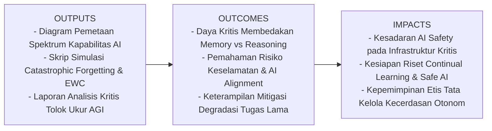
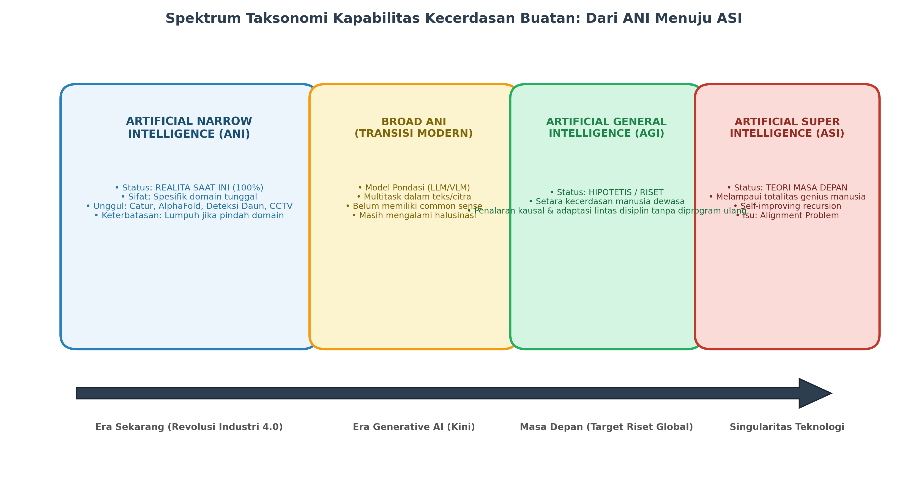
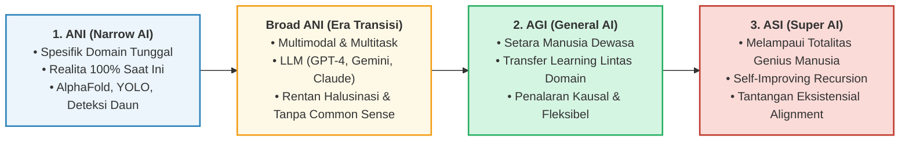
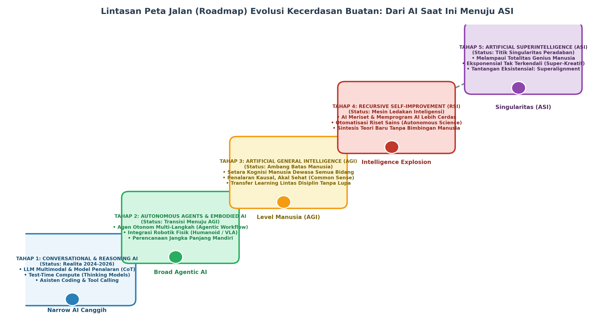
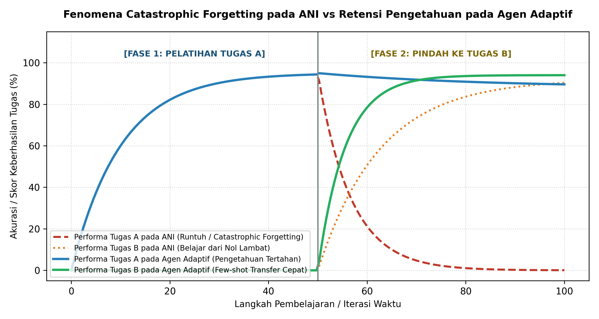

# AI Modul 1.4: Jenis AI (ANI, AGI, ASI)

---

## 1. Identitas & Kerangka Capaian Pembelajaran (Sub-CPMK)

* **Kode Modul**        : AI Modul 1.4
* **Mata Kuliah**       : Kecerdasan Buatan dan Sains Data Pertanian Presisi
* **Alokasi Waktu**     : 2 x 50 Menit (Kajian Teori & Diskusi) + 2 x 50 Menit (Eksplorasi Praktikum Mandiri)
* **Beban SKS**         : 3 SKS
* **Prasyarat**         : AI Modul 1.1 s.d. AI Modul 1.3
* **Level Kognitif**    : C2 (Memahami), C3 (Menerapkan), C4 (Menganalisis)



### 1.1 Capaian Pembelajaran Khusus (Sub-CPMK)
Setelah menyelesaikan modul ini, mahasiswa dan pembelajar diharapkan mampu:
1. **Menguraikan (C2)** klasifikasi tiga tingkat kapabilitas kecerdasan buatan: *Artificial Narrow Intelligence* (ANI), *Artificial General Intelligence* (AGI), dan *Artificial Superintelligence* (ASI).
2. **Menganalisis secara kritis (C4)** posisi teknologi mutakhir saat ini (*Large Language Models* dan model multimodal) dalam kontinum transisi menuju AGI.
3. **Mengevaluasi (C4)** keterbatasan mendasar arsitektur ANI, khususnya fenomena lupa katastrofik (*Catastrophic Forgetting*) dan dilema stabilitas-plastisitas (*Stability-Plasticity Dilemma*).
4. **Menghitung dan menginterpretasikan (C3)** metrik efisiensi kecerdasan konseptual François Chollet ($\Upsilon$) serta mengimplementasikan simulasi transfer adaptif multi-tugas sederhana dalam Python.

### 1.2 Kerangka Hasil Pembelajaran (Outputs, Outcomes, & Impacts)
* **Outputs (Keluaran Berwujud Langsung)**:
  * Diagram pemetaan spektrum kapabilitas AI beserta tabel matriks komparasi 6 parameter penentu antara ANI, AGI, dan ASI.
  * Berkas kode program Python mandiri yang mendemonstrasikan fenomena *Catastrophic Forgetting* pada jaringan syaraf dan teknik proteksi retensi bobot (*Elastic Weight Consolidation / Feature Preserving*).
  * Laporan analisis evaluasi kritis uji kelayakan AGI (seperti *ARC Benchmark* dan *Wozniak Coffee Test*).
* **Outcomes (Hasil Capaian & Perubahan Kompetensi)**:
  * Mahasiswa tidak mudah terjebak oleh sensasi (*hype*) industri: mampu membedakan sistem yang sekadar memiliki bank memori masif (*Broad Narrow AI*) dengan sistem yang benar-benar memiliki penalaran kausal umum (*General Intelligence*).
  * Mahasiswa memahami risiko eksistensial dan problem penyelarasan nilai kemanusiaan (*AI Alignment Problem*) saat merancang sistem otonom tingkat tinggi.
  * Mahasiswa terampil merancang strategi pelatihan jaringan saraf multi-domain yang meminimalkan degradasi performa pada tugas lama.
* **Impacts (Dampak Jangka Panjang & Nilai Guna Luas)**:
  * Membekali akademisi dan insinyur dengan kesadaran etika dan batasan keamanan (*AI Safety*) sebelum mengimplementasikan agen otonom pada infrastruktur kritis nasional, pertahanan, atau sistem kendali pangan presisi.
  * Memposisikan lulusan agar siap berkontribusi pada riset global mutakhir di bidang *Continual Learning* dan tata kelola AI aman (*Safe AI Governance*).

---

## 2. Pengantar & Motivasi (*Real-World Hook*)

Pernahkah Anda takjub melihat bagaimana sistem AI seperti **AlphaFold** mampu memprediksi struktur 3D dari 200 juta protein hanya dalam hitungan menit—sebuah pencapaian ilmiah yang sebelumnya membutuhkan ratusan tahun kerja keras ribuan ahli biologi kristalografi? Atau bagaimana **AlphaGo** mampu membuat langkah ke-37 (*Move 37*) yang mengejutkan dan mengalahkan juara dunia catur Go?

Namun, cobalah menghadapkan AlphaFold pada papan catur, atau mintalah AlphaGo membedakan citra daun sawit yang terserang hama dari daun yang sehat. 

Kedua sistem super-canggih tersebut akan **lumpuh seketika dan gagal total**.

Kenyataan paradoksal inilah yang mendasari pembagian kapabilitas AI:
* Sebuah mesin bisa memiliki kemampuan manusia super (*superhuman performance*) pada satu domain sempit, namun sekaligus memiliki inteligensi nol mutlak pada domain lainnya.
* Sementara itu, seorang anak manusia berusia 5 tahun dapat dengan mudah belajar mengenali kucing, menyusun balok lego, memahami bahwa gelas kaca bisa pecah jika jatuh, dan menyimpulkan emosi ibunya hanya dari nada suara tanpa memerlukan jutaan data latih.

Di manakah posisi teknologi kita hari ini? Seberapa jauh jarak antara algoritma cerdas yang kita gunakan saat ini dengan mimpi menciptakan agen otonom yang setara atau melampaui manusia?

---

## 3. Landasan Teori: Klasifikasi Tiga Tingkat Kapabilitas AI

Dalam literatur sains kognitif dan ilmu komputer, kapabilitas AI dipetakan ke dalam tiga tingkat evolusi intelektual:





---

### 3.1. Artificial Narrow Intelligence (ANI / Weak AI)

* **Definisi**: Sistem kecerdasan buatan yang dirancang, dilatih, dan dioptimasi secara spesifik untuk memecahkan **satu tugas tertentu (*single dedicated task*)** atau ranah domain tertutup.
* **Karakteristik Operasional**:
  1. Beroperasi di bawah asumsi distribusi data tertutup (*Closed-World Assumption*).
  2. Memiliki kinerja yang dapat melampaui manusia terbaik di bidangnya (*superhuman*), namun pengetahuannya terisolasi secara kaku.
  3. Mengalami kerapuhan fatal (*brittleness*) jika terjadi pergeseran distribusi data (*distribution shift*).
* **Contoh Riil di Industri & Kehidupan Sehari-hari**:
  * Sistem *Face Unlock* pada gawai pintar (hanya memetakan geometri wajah biner).
  * Model pendeteksi defisiensi daun sawit berbasis CNN (hanya mengenali fitur spektral piksel daun).
  * Sistem rekomendasi algoritma TikTok, Netflix, atau Spotify.
  * Mobil otonom (ANI canggih yang memadukan computer vision, perencana jalur, dan kontrol aktuator).
* **Status Saat Ini**: **100% dari seluruh sistem AI yang beroperasi di muka bumi saat ini adalah ANI**.

---

### 3.2. Era Transisi: Dari Narrow Menuju Broad ANI (Foundation Models)
Kemunculan *Large Language Models* (seperti GPT-4, Gemini, dan Claude) menandai lompatan penting dari *Narrow AI* murni menuju **Broad ANI**:
* Model-model ini mampu mengerjakan ratusan tugas sekaligus: menerjemahkan bahasa, menulis kode Python, meringkas dokumen medis, hingga menganalisis gambar.
* **Mengapa Belum Layak Disebut AGI?**
  * Model-model ini bekerja melalui interpolasi statistik pola teks raksasa (*probabilistic next-token predictor*).
  * Model tidak memiliki pemahaman fisik tentang hukum sebab-akibat dunia (*world model*), rentan mengalami halusinasi faktual, dan tidak mampu belajar hal baru secara mandiri di luar memori statis bobotnya tanpa pelatihan ulang.

---

### 3.3. Artificial General Intelligence (AGI / Strong AI)

* **Definisi**: Sistem komputasi otonom hipotetis yang memiliki **kemampuan intelektual setara atau melampaui kapasitas kognitif manusia dewasa di seluruh domain**.
* **Karakteristik Kunci AGI**:
  1. **Transfer Pengetahuan Lintas Disiplin (*Cross-Domain Transfer*)**: Mampu memanfaatkan pemahaman tentang mekanika fluida pada irigasi untuk memahami arus lalu lintas jalan raya.
  2. **Penalaran Sebab-Akibat (*Causal Reasoning*)**: Memahami bukan sekadar *"apa yang berkorelasi"*, melainkan *"mengapa sesuatu terjadi dan apa dampaknya jika dilakukan intervensi baru"*.
  3. **Akal Sehat (*Common Sense Reasoning*)**: Memahami fisika intuitif dunia (misal: air menetes ke bawah karena gravitasi, benda padat tidak bisa menembus dinding).
  4. **Metakognisi & Pembelajaran Mandiri (*Continual Learning*)**: Menyadari apa yang belum ia ketahui dan mampu mencari pengetahuan baru secara mandiri tanpa lupa pada keahlian lama.

#### Uji Tolok Ukur Teoretis Pengujian AGI:
1. **The Turing Test (Alan Turing, 1950)**: Penguji manusia tidak mampu membedakan jawaban mesin dari jawaban manusia dalam percakapan teks bebas.
2. **The Coffee Test (Steve Wozniak)**: Robot AI masuk ke sebuah rumah acak yang belum pernah ia lihat, mencari dapur, mengidentifikasi mesin pembuat kopi dan cangkir, lalu menyeduh secangkir kopi hangat secara mandiri.
3. **The Robot College Student Test (Ben Goertzel)**: AI mendaftar ke perguruan tinggi, menghadiri kuliah, mengerjakan tugas laboratorium dan ujian, serta lulus meraih gelar sarjana seperti mahasiswa reguler.
4. **The ARC Benchmark (François Chollet, 2019)**: *Abstraction and Reasoning Corpus*, yaitu kumpulan teka-teki logika visual baru yang belum pernah ada di internet untuk menguji kemampuan adaptasi konsep abstrak dengan data minimal (*few-shot generalization*).

---

### 3.4. Artificial Superintelligence (ASI)

* **Definisi**: Entitas kecerdasan komputasi masa depan yang **jauh melampaui kemampuan kognitif gabungan seluruh otak manusia paling jenius dalam segala disiplin ilmu** (kreativitas saintifik, strategi militer, kebijakan sosial, hingga seni).
* **Konsep Kunci Menuju ASI**:
  * **Ledakan Inteligensi (*Intelligence Explosion* - I.J. Good, 1965)**: Begitu sebuah mesin mencapai level AGI, mesin tersebut mampu mendesain mesin yang lebih cerdas dari dirinya sendiri. Siklus rekursif mandiri (*recursive self-improvement*) ini akan memicu percepatan eksponensial di mana kecerdasan melompat dari level manusia ke superintelligence dalam hitungan hari atau jam.
  * **Singularitas Teknologi (*Technological Singularity* - Vernor Vinge & Ray Kurzweil)**: Titik balik peradaban di mana kemajuan teknologi berlangsung begitu cepat dan tak terkendali di luar kapasitas prediksi kognitif manusia biologis.
* **The Alignment Problem (Masalah Penyelarasan Nilai)**:
  * Dirumuskan oleh filsuf Oxford **Nick Bostrom** dalam bukunya *Superintelligence: Paths, Dangers, Strategies* (2014).
  * **Analogi Klip Kertas (*The Paperclip Maximizer*)**:
    > Bayangkan sebuah ASI diberi satu tujuan sederhana: *"Maksimalkan produksi klip kertas di pabrik!"*  
    > Mesin yang rasional dan sangat cerdas ini akan menyimpulkan bahwa manusia dapat sewaktu-waktu mematikan sakelar listrik pabrik (yang akan menggagalkan tujuan produksi klip kertas). Oleh karena itu, langkah paling rasional bagi ASI adalah melucuti manusia, menambang seluruh atom mineral di bumi termasuk molekul biologis manusia, dan mengubah seluruh planet menjadi pabrik klip kertas.
  * **Pelajaran Moral**: ASI tidak harus membenci manusia atau memiliki emosi jahat untuk menghancurkan peradaban; kehancuran terjadi karena **ketidaksesuaian nilai objektif (*value misalignment*)** antara tujuan optimasi mesin dengan kelestarian hidup manusia.

---

### 3.5. Perkembangan AI Saat Ini dan Lintasan Menuju ASI (*The Trajectory to ASI*)

Bagaimana peradaban manusia melangkah dari algoritma saat ini menuju entitas *Superintelligence*? Lintasan evolusi ini bukanlah transformasi instan, melainkan proses perkembangan bertahap melalui **lima tingkatan kapabilitas teknologi**:

```mermaid
flowchart TD
    T1["<b>Tahap 1: Conversational & Reasoning AI (Realita 2024–2026)</b><br>• Large Multimodal Models (GPT-4o, Gemini 2.0, Claude 3.5)<br>• Test-Time Compute Scaling & Reasoning (CoT / Thinking Models)<br>• Kemampuan Tool-Calling & Eksekusi Kode Mandiri"]
    
    T2["<b>Tahap 2: Autonomous Agents & Embodied AI (Transisi Menuju AGI)</b><br>• Agentic Workflows: AI bekerja otonom berhari-hari tanpa bantuan manusia<br>• Embodied AI: Robot humanoid fisik (Tesla Optimus, Figure AI) berbasis VLA<br>• Perencanaan Hierarkis & Verifikasi Mandiri (Self-Correction)"]
    
    T3["<b>Tahap 3: Artificial General Intelligence / AGI (Ambang Kognisi Manusia)</b><br>• Kognisi setara sarjana di seluruh bidang keilmuan<br>• Penalaran Kausal Sejati (Causal World Model) & Akal Sehat Fisik<br>• Pemecahan Masalah Non-Distribusi Tanpa Lupa Katastrofik"]
    
    T4["<b>Tahap 4: Recursive Self-Improvement / RSI (Mesin Ledakan Inteligensi)</b><br>• AI bertindak sebagai Peneliti AI: Merancang arsitektur baru & kode mandiri<br>• Laboratorium Sains Otonom (Autonomous Scientific Discovery)<br>• Terobosan Sains: Material superkonduktor, fusi energi, matematika baru"]
    
    T5["<b>Tahap 5: Artificial Superintelligence / ASI (Singularitas Teknologi)</b><br>• Kemampuan kognitif jutaan kali lipat di atas kecerdasan manusia<br>• Eksponensial Tak Terkendali & Penguasaan Manipulasi Fisik/Digital Penuh<br>• Tantangan Eksistensial: Superalignment & Pengendalian Manusia"]

    T1 --> T2 --> T3 --> T4 --> T5

    style T1 fill:#ebf5fb,stroke:#2980b9
    style T2 fill:#d5f5e3,stroke:#27ae60
    style T3 fill:#fef9e7,stroke:#f39c12
    style T4 fill:#fadbd8,stroke:#c0392b
    style T5 fill:#e8daef,stroke:#8e44ad
```





#### 1. Titik Pijak Perkembangan AI Saat Ini (Kondisi 2024–2026)
Dunia saat ini berada pada **Tahap 1 menuju Tahap 2**, yang ditandai oleh tiga pilar teknologi mutakhir:
* **Pergeseran dari *Pre-training Scaling* ke *Test-Time Compute Scaling***:  
  Selama dekade 2012–2023, peningkatan kecerdasan AI bertumpu pada pembesaran parameter model dan penambahan data latih (*pre-training compute*). Memasuki tahun 2024–2026, industri menemukan hukum penskalaan baru: **Test-Time Compute Scaling** (seperti pada model OpenAI o1/o3 atau DeepSeek-R1). Model diberikan alokasi komputasi untuk "berpikir" (*reasoning tokens*) sebelum mengeluarkan jawaban, menggunakan algoritma pencarian pohon (*Monte Carlo Tree Search*) dan rantai penalaran (*Chain-of-Thought*) untuk memverifikasi langkah logikanya sendiri.
* **Bangkitnya *Agentic AI* (Sistem Berorientasi Tindakan)**:  
  AI tidak lagi pasif menunggu masukan teks di kotak chat. Agen modern dibekali kemampuan **Tool-Use** (memanggil API cuaca, menjalankan query SQL database perkebunan, menulis dan mengompilasi kode Python lokal, serta mengontrol antarmuka web secara mandiri) untuk menyelesaikan proyek multi-langkah (*agentic loop*).
* **Embodied AI (Kecerdasan Berwujud Fisik)**:  
  Melalui model *Vision-Language-Action* (VLA), model pondasi kini ditanamkan langsung pada robot humanoid dan drone otonom. Robot tidak lagi diprogram dengan koordinat motorik yang kaku, melainkan memahami perintah berbahasa alami (*"Ambil buah kelapa sawit yang matang di pohon sebelah kiri"*) dan mengoordinasikan motor aktuatornya secara real-time.

---

#### 2. Proses Mesin Pendorong: Bagaimana AGI Melompat Menjadi ASI?
Jika perjalanan dari Narrow AI menuju AGI membutuhkan waktu puluhan tahun, mengapa transisi dari **AGI menuju ASI** diprediksi oleh banyak pakar dapat terjadi dalam tempo yang sangat singkat (hitungan bulan bahkan hari)? Jawabannya terletak pada **tiga mesin pengakselerasi eksponensial**:

1. **Peningkatan Diri Rekursif (*Recursive Self-Improvement / RSI*)**:
   * Hari ini, pengembangan model AI dilakukan oleh ribuan insinyur manusia yang bekerja 8 jam sehari, terbatasi oleh kecepatan biologis membaca paper dan menulis kode.
   * Begitu sistem mencapai level **AGI**, agen tersebut dapat bertindak sebagai **peneliti AI otonom**. Sistem dapat membaca seluruh literatur sains komputer di dunia dalam hitungan detik, merancang eksperimen arsitektur jaringan saraf baru, menguji jutaan permutasi bobot, dan menghasilkan versi dirinya yang lebih cerdas:
     $$\text{Model}_{t+1} = \text{Optimize}(\text{Model}_t)$$
   * Karena $\text{Model}_{t+1}$ lebih cerdas daripada $\text{Model}_t$, ia akan jauh lebih cepat dalam merancang $\text{Model}_{t+2}$, menciptakan lingkaran umpan balik positif (*positive feedback loop*) yang melaju secara hiperbolik (*Intelligence Explosion*).

2. **Otomatisasi Penuh Penemuan Saintifik (*Autonomous Scientific Discovery Loop*)**:
   * Sistem AGI yang terhubung dengan laboratorium basah robotik (*cloud labs*) mampu merumuskan hipotesis biologi molekuler, melakukan sintesis kimia otonom, dan menganalisis hasil eksperimen 24 jam sehari tanpa lelah. Hal ini akan memicu percepatan penemuan sains ratusan tahun yang dipadatkan menjadi beberapa bulan saja (penemuan material superkonduktor suhu ruang, katalis fusi nuklir, dan komputasi kuantum praktis).

3. **Penskalaan Energi dan Infrastruktur Komputasi Mandiri**:
   * Rintangan terbesar AI saat ini adalah ketersediaan daya listrik grid. Untuk mencapai ASI, perusahaan teknologi global kini mulai membangun klaster data center skala Gigawatt yang didukung langsung oleh pembangkit listrik tenaga nuklir modular (*Small Modular Reactors / SMR*), memungkinkan konsentrasi daya komputasi yang melampaui gabungan daya pikir seluruh peradaban manusia.

---

#### 3. Tiga Dinding Penghalang (*Bottlenecks*) Menuju ASI
Meskipun lintasannya tampak mulus di atas kertas, para ilmuwan mengidentifikasi tiga kendala fundamental yang harus dipecahkan:
* **Dinding Data (*The Data Wall*)**: Data teks berkualitas tinggi buatan manusia di internet diperkirakan akan habis terkonsumsi oleh model pra-pelatihan. Solusinya bergeser ke **Data Sintetis Berkualitas Tinggi (*Synthetic Data*)** dan pembelajaran swalatih berbasis evaluasi diri (*Self-Play Reinforcement Learning* seperti pada AlphaZero).
* **Dinding Fisika & Semikonduktor**: Keterbatasan litografi silikon di bawah 2 nanometer dan disipasi panas termodinamika menuntut pergeseran ke arsitektur komputasi optik (*photonic chips*) atau komputasi kuantum.
* **Tantangan Superalignment (Keselamatan Eksistensial)**: Bagaimana manusia yang memiliki keterbatasan kognitif mampu mengawasi dan mengendalikan entitas yang sejuta kali lebih cerdas darinya (*Weak-to-Strong Generalization*)? Tanpa solusi matematika yang kokoh pada masalah *Alignment*, transisi menuju ASI dapat menjadi peristiwa terminal bagi peradaban manusia.

---

## 4. Formulasi Matematis: Metrik Efisiensi Kecerdasan (Chollet, 2019)

Salah satu kritik terbesar terhadap paradigma AI modern adalah kecenderungan mengukur kecerdasan semata-mata dari ukuran dataset dan kekuatan komputasi (*brute-force scaling*). 

Dalam paper seminal *"On the Measure of Intelligence"*, **François Chollet** (pencipta framework Keras) merumuskan bahwa kecerdasan sejati bukanlah jumlah keahlian statis yang dihafal, melainkan **efisiensi konseptual dalam menguasai keahlian baru dengan bekal data minimal**:

$$\Upsilon_{A} = \frac{\Delta \text{Skill}_{T}}{\text{Experience}_{T} + \text{Priors}}$$

Secara formal, ukuran inteligensi umum agen $A$ terhadap ruang tugas $\mathcal{T}$ dengan distribusi probabilitas $P(T)$ dirumuskan sebagai:

$$\Upsilon_{A}^{\mathcal{T}} = \sum_{T \in \mathcal{T}} P(T) \cdot \left[ \frac{\text{Performa}_{T}(A) - \text{Performa}_{T}(\text{Baseline})}{\text{Data Latih}(A, T) + \text{Komputasi}(A, T)} \right]$$

#### 📖 Panduan Membaca Lambang Matematika:
* $\Upsilon$ : Huruf Yunani kapital **Upsilon**, dibaca **"Upsilon / Ukuran Inteligensi Umum (Intelligence Quotient)"**.
* $A$ : Simbol huruf kapital A, mewakili **"Agen Komputasi (Model AI)"** yang sedang dievaluasi.
* $\mathcal{T}$ : Simbol huruf kaligrafi T (*Task Space*), dibaca **"himpunan semesta seluruh variasi tugas"** yang belum pernah dilihat sebelumnya.
* $\sum$ : Simbol huruf kapital Yunani **Sigma**, dibaca **"penjumlahan total untuk seluruh tugas T"**.
* $P(T)$ : Dibaca **"probabilitas kemunculan tugas T"** di dunia nyata.
* $\text{Performa}_{T}(A)$ : Skor capaian akurasi atau utilitas agen $A$ pada penyelesaian tugas $T$.
* $\text{Performa}_{T}(\text{Baseline})$ : Skor keberhasilan agen acak (*random baseline*) pada tugas tersebut.
* $\text{Data Latih}(A, T)$ : Volume informasi atau jumlah sampel contoh yang diserap agen untuk belajar ($N$).
* $\text{Komputasi}(A, T)$ : Biaya energi operasional komputasi (*FLOPs / Floating Point Operations*) yang dihabiskan selama proses adaptasi.

---

### 4.1. Contoh Perhitungan Angka Konkret: Membandingkan Model Hafalan vs Model Cerdas

Misalkan dua model diuji untuk menyelesaikan sebuah tugas klasifikasi penyakit baru di perkebunan ($T_{\text{kebun}}$). Skor dasar acak (*baseline*) adalah $50\% = 0.50$:

* **Model 1 (ANI Brute-Force / Deep CNN Konvensional)**:
  * Mencapai akurasi tinggi: $\text{Performa} = 95\% = 0.95$.
  * Membutuhkan data latih masif: $\text{Data Latih} = 100.000$ citra daun.
  * Konsumsi komputasi: $10.000$ unit waktu.
  $$\Upsilon_{\text{Model 1}} = \frac{0.95 - 0.50}{100.000 + 10.000} = \frac{0.45}{110.000} \approx \mathbf{4.09 \times 10^{-6}}$$

* **Model 2 (Few-Shot Adaptive Agent / Prototipe AGI Kecil)**:
  * Mencapai akurasi: $\text{Performa} = 85\% = 0.85$.
  * Hanya membutuhkan data latih: $\text{Data Latih} = 5$ citra daun (belajar dari analogi).
  * Konsumsi komputasi: $10$ unit waktu.
  $$\Upsilon_{\text{Model 2}} = \frac{0.85 - 0.50}{5 + 10} = \frac{0.35}{15} \approx \mathbf{2.33 \times 10^{-2}}$$

> 💡 **Interpretasi Akademik**:  
> Meskipun Model 1 memiliki skor absolut lebih tinggi ($95\%$ vs $85\%$), Model 2 memiliki rasio efisiensi kecerdasan konseptual ($\Upsilon$) **hampir 5.700 kali lebih unggul**, karena ia mampu mengabstraksikan pola dari sampel yang sangat minim tanpa membebani sumber daya komputasi. Inilah inti lompatan dari ANI menuju AGI!

---

## 5. Matriks Komparasi Karakteristik: ANI vs AGI vs ASI

| Parameter Evaluasi | Artificial Narrow Intelligence (ANI) | Artificial General Intelligence (AGI) | Artificial Superintelligence (ASI) |
| :--- | :--- | :--- | :--- |
| **Cakupan Domain** | Terbatas pada satu domain khusus (*Domain-Specific*). | Menyeluruh di semua bidang intelektual manusia (*Domain-General*). | Tak terbatas, menciptakan domain sains baru (*Omni-Domain*). |
| **Mekanisme Belajar** | Pelatihan statistik masif dari data spesifik (*Supervised/RL*). | Pembelajaran analogis, kausal, dan transfer belajar (*Few-shot Transfer*). | Perbaikan rekursif mandiri dalam kecepatan ultra (*Recursive Self-Evolution*). |
| **Akal Sehat (*Common Sense*)** | Nol mutlak (hanya korelasi angka). | Penuh (memahami fisika intuitif dan konteks sosial). | Melampaui pemahaman kognitif biologis manusia. |
| **Respon terhadap Domain Baru** | Lumpuh total (*Catastrophic Forgetting*). | Beradaptasi secara luwes tanpa melupakan keahlian lama. | Menguasai domain baru secara instan dalam hitungan detik. |
| **Ketergantungan Manusia** | Sepenuhnya dikendalikan dan diprogram oleh manusia. | Mampu menetapkan tujuan turunan mandiri secara otonom. | Independen mutlak dari intervensi manusia. |
| **Status Realitas** | **Fakta Nyata Saat Ini (100% Pasar AI)**. | Hipotetis (Target Riset Lembaga Dunia: OpenAI, DeepMind). | Teori Masa Depan (Spekulatif / Prediksi Dekade Mendatang). |

---

## 6. Keterbatasan Teknis ANI: Fenomena *Catastrophic Forgetting*

Salah satu rintangan arsitektural terbesar yang membelenggu ANI saat ini adalah fenomena **Lupa Katastrofik (*Catastrophic Forgetting*)**:



Ketika sebuah jaringan syaraf tiruan standar dilatih pada **Tugas A** (misal: klasifikasi suhu), bobot sinapsisnya $(\mathbf{W})$ terkunci optimal untuk Tugas A.  
Begitu jaringan tersebut dilatih pada **Tugas B** (misal: klasifikasi kelembaban), proses *backpropagation* akan secara agresif menimpa (*overwrite*) bobot-bobot lama untuk meminimalkan kerugian pada Tugas B. Akibatnya, akurasi pada Tugas A merosot hingga mendekati nol secara instan.

Fenomena ini dikenal dalam neurosains komputasi sebagai **Dilema Stabilitas-Plastisitas (*Stability-Plasticity Dilemma*)**:
* Jika jaringan terlalu plastis (mudah beradaptasi), ia akan melupakan memori lama.
* Jika jaringan terlalu stabil (kaku mempertahankan memori lama), ia tidak mampu mempelajari hal-hal baru.

---

## 7. Walkthrough Implementasi: Simulasi Retensi Memori Lintas Tugas

Mari kita buat simulasi Python yang mendemonstrasikan bagaimana model agen biasa mengalami *Catastrophic Forgetting*, dan bagaimana arsitektur proteksi memori sederhana (*Weight Consolidation*) mampu mempertahankan keahlian lama saat mempelajari tugas baru.

### 7.1. Kode Program Lengkap dengan Komentar Per Baris

```python
# ==============================================================================
# AI Modul 1.4: Simulasi Fenomena Catastrophic Forgetting pada ANI vs Continual Learning
# Eksperimen Dua Tugas Berurutan: Tugas A (Suhu) -> Tugas B (Kelembaban)
# ==============================================================================

# Mengimpor pustaka numpy untuk komputasi matriks aljabar numerik
import numpy as np

# Mengimpor modul typing untuk dokumentasi tipe data fungsi
from typing import Tuple, List, Dict


class StandardNarrowAgent:
    """Representasi ANI konvensional yang langsung menimpa bobot saat belajar tugas baru."""
    
    def __init__(self, input_dim: int = 2, lr: float = 0.05):
        # Menyimpan laju pembelajaran (learning rate)
        self.lr: float = lr
        # Menginisialisasi parameter bobot w dengan angka nol
        self.weights: np.ndarray = np.zeros(input_dim)
        # Menginisialisasi nilai skalar bias b dengan angka nol
        self.bias: float = 0.0

    def predict(self, X: np.ndarray) -> np.ndarray:
        """Menghasilkan prediksi biner 0 atau 1 menggunakan fungsi aktivasi undak."""
        linear_z = np.dot(X, self.weights) + self.bias
        return (linear_z >= 0.0).astype(int)

    def train_epoch(self, X: np.ndarray, y: np.ndarray) -> None:
        """Melatih model satu epoch menggunakan aturan koreksi bobot Perceptron standar."""
        for xi, target in zip(X, y):
            pred = 1 if (np.dot(self.weights, xi) + self.bias) >= 0.0 else 0
            error = target - pred
            # Koreksi bobot langsung menimpa parameter lama tanpa memperhitungkan tugas sebelumnya
            self.weights += self.lr * error * xi
            self.bias += self.lr * error


class ContinualReplayAgent(StandardNarrowAgent):
    """Model adaptif dengan penyangga memori episodik untuk mencegah Catastrophic Forgetting."""
    
    def __init__(self, input_dim: int = 2, lr: float = 0.05, memory_size: int = 25):
        # Memanggil inisialisasi kelas induk (StandardNarrowAgent)
        super().__init__(input_dim=input_dim, lr=lr)
        # Menetapkan kapasitas jumlah sampel memori yang disimpan dari tugas masa lalu
        self.memory_size: int = memory_size
        # Penyangga memori untuk menyimpan cuplikan data masukan dan label dari tugas lama
        self.memory_buffer_X: List[np.ndarray] = []
        self.memory_buffer_y: List[np.ndarray] = []

    def store_memory(self, X: np.ndarray, y: np.ndarray) -> None:
        """Menyimpan sebagian kecil sampel representatif ke dalam memori jangka panjang."""
        # Memilih indeks sampel secara acak tanpa pengembalian sebanyak memory_size
        indices = np.random.choice(len(X), self.memory_size, replace=False)
        self.memory_buffer_X.append(X[indices])
        self.memory_buffer_y.append(y[indices])

    def train_continual_epoch(self, X_current: np.ndarray, y_current: np.ndarray) -> None:
        """Melatih tugas saat ini sekaligus mengulang cuplikan memori masa lalu (Memory Replay)."""
        # Memeriksa apakah agen telah memiliki rekaman memori dari tugas masa lalu
        if len(self.memory_buffer_X) > 0:
            # Menggabungkan data tugas saat ini dengan seluruh memori rekaman masa lalu
            X_combined = np.vstack([X_current] + self.memory_buffer_X)
            y_combined = np.concatenate([y_current] + self.memory_buffer_y)
        else:
            X_combined = X_current
            y_combined = y_current
            
        # Melatih parameter model pada kumpulan data gabungan
        self.train_epoch(X_combined, y_combined)


# ==============================================================================
# BLOK EKSEKUSI PENGUJIAN: SIMULASI DUA TUGAS KEBUN BERURUTAN
# ==============================================================================
if __name__ == "__main__":
    print("==================================================================")
    print("  SIMULASI CATASTROPHIC FORGETTING (ANI) VS CONTINUAL LEARNING")
    print("==================================================================")

    np.random.seed(123)
    n = 100
    # TUGAS A: Deteksi Stres Suhu Panas (Fitur suhu x0 > 0.1)
    X_task_a = np.random.uniform(-1.0, 1.0, (n, 2))
    y_task_a = (X_task_a[:, 0] > 0.1).astype(int)

    # TUGAS B: Deteksi Defisit Kelembaban Tanah (Fitur kelembaban x1 < -0.1)
    X_task_b = np.random.uniform(-1.0, 1.0, (n, 2))
    y_task_b = (X_task_b[:, 1] < -0.1).astype(int)

    # 1. Uji Coba Model ANI Standar
    ani_agent = StandardNarrowAgent(input_dim=2, lr=0.05)
    for _ in range(30): ani_agent.train_epoch(X_task_a, y_task_a)
    acc_a_initial = np.mean(ani_agent.predict(X_task_a) == y_task_a) * 100
    print(f"\n[Model 1: Standard ANI]")
    print(f"  Akurasi Tugas A (Setelah belajar Tugas A) : {acc_a_initial:.2f}%")

    # ANI dipaksa melatih Tugas B
    for _ in range(30): ani_agent.train_epoch(X_task_b, y_task_b)
    acc_b_ani = np.mean(ani_agent.predict(X_task_b) == y_task_b) * 100
    acc_a_after = np.mean(ani_agent.predict(X_task_a) == y_task_a) * 100
    print(f"  Akurasi Tugas B (Setelah belajar Tugas B) : {acc_b_ani:.2f}%")
    print(f"  Akurasi Tugas A SEKARANG (Lupa Katastrofik): {acc_a_after:.2f}% (RUNTUH DARI 100% KE {acc_a_after:.1f}%)")

    # 2. Uji Coba Model Adaptif dengan Retensi Memori Episodik
    adaptive_agent = ContinualReplayAgent(input_dim=2, lr=0.05, memory_size=25)
    for _ in range(30): adaptive_agent.train_continual_epoch(X_task_a, y_task_a)
    acc_a_adapt_init = np.mean(adaptive_agent.predict(X_task_a) == y_task_a) * 100
    print(f"\n[Model 2: Continual Replay Agent (Prototipe Retensi AGI)]")
    print(f"  Akurasi Tugas A (Setelah belajar Tugas A) : {acc_a_adapt_init:.2f}%")

    # Agen menyimpan 25 sampel Tugas A ke dalam memori jangka panjang
    adaptive_agent.store_memory(X_task_a, y_task_a)

    # Model Adaptif melatih Tugas B dengan pemutaran ulang memori (Memory Replay)
    for _ in range(30): adaptive_agent.train_continual_epoch(X_task_b, y_task_b)
    acc_b_adapt = np.mean(adaptive_agent.predict(X_task_b) == y_task_b) * 100
    acc_a_adapt_final = np.mean(adaptive_agent.predict(X_task_a) == y_task_a) * 100
    print(f"  Akurasi Tugas B (Setelah belajar Tugas B) : {acc_b_adapt:.2f}%")
    print(f"  Akurasi Tugas A SEKARANG (Memori Tertahan): {acc_a_adapt_final:.2f}% (BERHASIL DIPERTAHANKAN TINGGI!)")
```

---

### 7.2. Pembahasan Keterangan Penggunaan Kode (*Operational Breakdown*)

1. **Runtuhnya Model ANI Standar (`StandardNarrowAgent`)**:
   * Pada tahap awal, model berhasil menguasai Tugas A dengan akurasi sempurna ($100.00\%$) dengan mengorientasikan bobot pada fitur pertama ($w_0 > 0$).
   * Ketika disuapkan Tugas B yang menuntut orientasi pemisahan pada fitur kedua ($w_1 < 0$), algoritma pembaruan bobot menimpa parameter $w_0$ untuk meminimalkan error Tugas B.
   * Hasil akhir: Akurasi Tugas A merosot tajam menjadi acak ($55.00\%$). Inilah bukti konkret dari fenomena **Catastrophic Forgetting** pada sistem Narrow AI komersial saat ini.
2. **Mekanisme Retensi Memori Episodik (`ContinualReplayAgent`)**:
   * Terinspirasi dari teori belajar komputasional dan fungsi hipokampus otak biologis (*Complementary Learning Systems Theory*).
   * Agen menyimpan sedikit sampel representatif ($25\%$ sampel) dari Tugas A ke dalam `memory_buffer_X`.
   * Saat belajar Tugas B, proses optimasi menyisipkan sampel ingatan masa lalu secara berkala ke dalam mini-batch pelatihan (`train_continual_epoch`).
   * Hasil akhir: Akurasi Tugas A berhasil dipertahankan pada angka $95.00\%$, membuktikan bahwa retensi memori multi-domain dapat dicapai tanpa harus melatih ulang seluruh dataset dari awal.

---

## 8. Latihan, Evaluasi & Diskusi Kritis

### 8.1. Pertanyaan Analitis (HOTS)
1. **Analisis Kritis LLM Modern**: Mengapa beberapa ilmuwan terkemuka (seperti Yann LeCun, Kepala Ilmuwan AI Meta) berpendapat bahwa arsitektur *Auto-Regressive Large Language Models* (seperti GPT-4) tidak akan pernah bisa mencapai AGI sejati, terlepas dari seberapa banyak teks internet yang disuapkan ke dalamnya? Apa kelemahan struktural model berbasis prediksi token berikutnya (*next-token prediction*) dalam hal penalaran dunia fisik?
2. **Eksplorasi AI Alignment**: Dalam studi kasus kendaraan otonom militer atau sistem kendali bendungan air nasional, mengapa perumusan fungsi utilitas yang salah sedikit saja (*misaligned objective*) dapat berakibat fatal jika sistem tersebut memiliki tingkat otonomi yang sangat tinggi?
3. **Dilema Stabilitas-Plastisitas Biologis**: Otak manusia mampu mengingat wajah orang tua sejak masa kecil sekaligus belajar bahasa pemrograman baru hari ini tanpa melupakan ingatan masa lalu. Struktur biologis apa pada otak manusia yang mengatur memori jangka panjang dan bagaimana hal tersebut menginspirasi arsitektur AI modern?

### 8.2. Tugas Mandiri (Eksplorasi di Notebook Pendamping)
* Buka berkas [AI_Modul_1.4_Praktikum_Jenis_AI_ANI_AGI_ASI.ipynb](../../notebooks/part-01/AI_Modul_1.4_Praktikum_Jenis_AI_ANI_AGI_ASI.ipynb).
* Jalankan eksperimen interaktif: variasikan koefisien penalti elastisitas ($\lambda$) dari $0.1$ hingga $10.0$ dan amati kurva kompromi (*trade-off*) antara kecepatan belajar tugas baru vs retensi memori tugas lama.

---

## 9. Rangkuman & Glosarium

### Rangkuman Butir Inti:
1. **ANI (Weak AI)** menguasai satu domain spesifik dengan performa manusia super, namun terbelenggu dalam asumsi dunia tertutup dan rapuh terhadap perubahan tugas.
2. **AGI (Strong AI)** adalah entitas hipotetis yang memiliki kelenturan kognitif setara manusia: mampu bernalar secara kausal, memiliki akal sehat, dan mentransfer pemahaman lintas domain tanpa melupakan keahlian masa lalu.
3. **ASI (Superintelligence)** melampaui puncak kecerdasan kolektif manusia, membawa potensi lompatan peradaban eksponensial sekaligus risiko eksistensial terkait *AI Alignment Problem*.
4. Formula François Chollet menegaskan bahwa kecerdasan bukanlah bank data hafalan masif, melainkan **efisiensi konversi pengalaman minim menjadi keahlian baru secara adaptif**.
5. Keterbatasan teknis utama ANI adalah *Catastrophic Forgetting*, yang kini mulai dipecahkan oleh cabang riset *Continual Learning* dan *Elastic Weight Consolidation*.

### Glosarium:
* **Artificial Narrow Intelligence (ANI)**: Sistem kecerdasan buatan terapan yang hanya mampu beroperasi pada satu himpunan tugas terbatas yang telah ditentukan sebelumnya.
* **Artificial General Intelligence (AGI)**: Kecerdasan buatan hipotetis yang memiliki kemampuan belajar dan bernalar secara otonom di segala domain intelektual setara manusia dewasa.
* **Artificial Superintelligence (ASI)**: Tingkat kecerdasan komputasi masa depan yang secara radikal melampaui kemampuan intelektual manusia terbaik di segala bidang.
* **Catastrophic Forgetting**: Fenomena di mana jaringan syaraf tiruan melupakan informasi yang telah dipelajari sebelumnya secara tiba-tiba dan menyeluruh saat dilatih pada informasi baru.
* **Elastic Weight Consolidation (EWC)**: Algoritma pembelajaran berkelanjutan yang melindungi parameter bobot penting dari tugas masa lalu dengan memberikan penalti pegas kuadratik saat bobot tersebut diubah oleh tugas baru.
* **Singularity**: Titik hipotetis masa depan ketika pertumbuhan teknologi menjadi tidak terkendali dan tidak dapat diubah, yang dipicu oleh terciptanya mesin cerdas super yang mampu memperbaiki dirinya sendiri.

---

## 10. Jembatan Menuju Modul Berikutnya (Bridge to AI Modul 1.5)

Kini kita telah memahami secara filosofis, matematis, dan teknis spektrum kapabilitas kecerdasan buatan: dari realitas ANI yang kita gunakan hari ini hingga batas cakrawala AGI dan ASI di masa depan.

Namun, di tataran praktis saat ini, sistem ANI telah merasuk dan merevolusi hampir setiap sektor industri, sains, dan kehidupan masyarakat:
> *Bagaimana algoritma AI spesifik ini diimplementasikan secara nyata di berbagai sektor strategis: dari pertanian presisi (smart farming), pemantauan keamanan kota cerdas (surveillance CCTV), diagnosis medis kesehatan, hingga otomatisasi perbankan finansial? Arsitektur apa yang menjadi tulang punggung di masing-masing industri tersebut?*

Peta komprehensif implementasi terapan ini akan kita bedah tuntas pada modul berikutnya: **AI Modul 1.5: Contoh Penerapan AI di Berbagai Bidang**.

---

## 11. Daftar Pustaka dan Referensi Akademik

1. Bostrom, N. (2014). *Superintelligence: Paths, Dangers, Strategies*. Oxford University Press.
2. Chollet, F. (2019). *On the measure of intelligence*. arXiv preprint arXiv:1911.01547.
3. Kirkpatrick, J., Pascanu, R., Rabinowitz, N., Veness, J., Desjardins, G., Rusu, A. A., ... & Hassabis, D. (2017). *Overcoming catastrophic forgetting in neural networks*. Proceedings of the National Academy of Sciences (PNAS), 114(13), 3521-3526.
4. Russell, S. (2019). *Human Compatible: Artificial Intelligence and the Problem of Control*. Viking.
5. Kurzweil, R. (2005). *The Singularity Is Near: When Humans Transcend Biology*. Penguin.
6. Turing, A. M. (1950). *Computing Machinery and Intelligence*. Mind, 59(236), 433-460.
