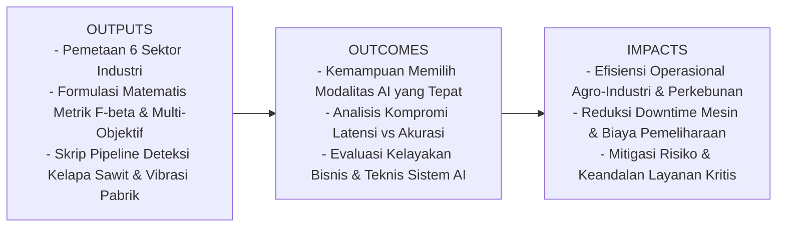
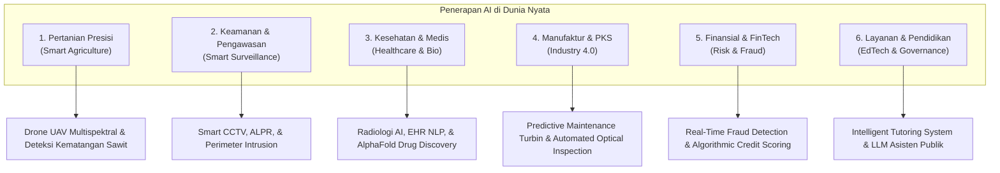
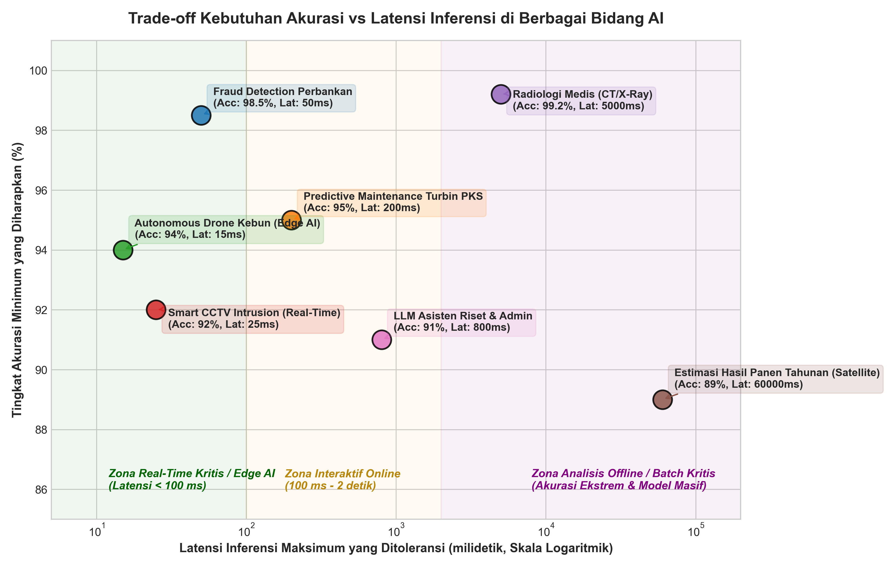

# AI Modul 1.5: Contoh Penerapan Artificial Intelligence di Berbagai Bidang

---

## 1. Identitas & Kerangka Capaian Pembelajaran (Sub-CPMK)

* **Kode Modul**        : AI Modul 1.5
* **Mata Kuliah**       : Kecerdasan Buatan dan Sains Data Pertanian Presisi
* **Alokasi Waktu**     : 2 x 50 Menit (Kajian Teori & Diskusi) + 2 x 50 Menit (Eksplorasi Praktikum Mandiri)
* **Beban SKS**         : 3 SKS
* **Prasyarat**         : AI Modul 1.1 (Konsep Dasar AI), AI Modul 1.4 (Jenis AI)
* **Level Kognitif**    : C2 (Memahami), C3 (Menerapkan), C4 (Menganalisis)



### 1.1 Capaian Pembelajaran Khusus (Sub-CPMK)
Setelah menyelesaikan modul ini, mahasiswa dan pembelajar diharapkan mampu:
1. **Mengklasifikasikan (C3)** tipologi penerapan AI lintas 6 sektor industri strategis berdasarkan karakteristik data masukan, modalitas komputasi, dan toleransi risiko operasional.
2. **Menganalisis (C4)** kesesuaian arsitektur (*architectural fit*) antara pendekatan rule-based, machine learning klasik, dan deep learning untuk menyelesaikan permasalahan lapangan nyata.
3. **Mengevaluasi (C4)** kompromi (*trade-off*) antara latensi inferensi dan tingkat presisi/akurasi sistem cerdas pada perangkat komputasi berdaya rendah (*Edge AI*).
4. **Merumuskan (C3)** fungsi utilitas multi-objektif dan metrik tertimbang ($F_\beta\text{-Score}$) yang menyeimbangkan keandalan deteksi terhadap biaya kegagalan sistem fisik.

### 1.2 Kerangka Hasil Pembelajaran (Outputs, Outcomes, & Impacts)
* **Outputs (Keluaran Berwujud Langsung)**:
  * Peta klasifikasi sektoral modalitas AI pada 6 sektor strategis (Pertanian Presisi, Keamanan/Pengawasan, Kesehatan Medis, Manufaktur Industri, Finansial, dan Layanan Publik/Pendidikan).
  * Formulasi matematis fungsi utilitas multi-objektif ($\mathcal{U}_{\text{Sistem}}$) dan kalkulasi metrik tertimbang $F_\beta\text{-Score}$.
  * Kode program Python pipeline terpadu klasifikasi kematangan TBS kelapa sawit dan deteksi anomali vibrasi bantalan turbin pabrik.
* **Outcomes (Hasil Capaian & Perubahan Kompetensi)**:
  * Mahasiswa terampil memilih modalitas AI yang tepat sesuai kendala perangkat keras dan batas latensi industri.
  * Mahasiswa mampu melakukan analisis *Pareto Front* untuk mengoptimasi kompromi antara akurasi dan kecepatan inferensi tepi (*Edge AI*).
  * Mahasiswa memiliki ketajaman evaluasi berbasis risiko yang membedakan dampak fatal *False Negative* vs *False Positive* pada rantai agro-industri.
* **Impacts (Dampak Jangka Panjang & Nilai Guna Luas)**:
  * Akselerasi modernisasi perkebunan kelapa sawit, tebu, dan komoditas pangan nasional melalui monitoring otomatis berbasis visi komputer UAV.
  * Reduksi *unplanned downtime* mesin pabrik dan penghematan biaya pemeliharaan melalui implementasi *Predictive Maintenance*.
  * Peningkatan kualitas dan keselamatan operasional industri pengolahan hasil pertanian dan perkebunan.

---

## 2. Peta Lanskap & Pemetaan Penerapan AI Lintas Sektor

Penerapan Artificial Intelligence di dunia industri tidak bersifat seragam (*one-size-fits-all*). Masing-masing sektor memiliki karakteristik data, kendala perangkat keras, dan toleransi risiko yang berbeda secara mendasar.

Berikut adalah visualisasi matriks peran modalitas teknologi AI pada 6 sektor industri strategis:


### 2.1. Klasifikasi Modalitas Data dan Paradigma AI
1. **Computer Vision (CV)**: Pemrosesan data spasial 2D/3D (citra RGB, multispektral, video streaming, point-cloud LiDAR). Dominan pada pertanian presisi (inspeksi drone), keamanan (CCTV analitik), manufaktur (inspeksi cacat produk), dan radiologi medis.
2. **Tabular & Sensor Time-Series ML**: Pemrosesan sinyal fisik berurutan waktu (vibrasi akselerometer, suhu, kelembaban, tekanan, log transaksi bank). Menjadi pilar utama *predictive maintenance* dan deteksi penipuan finansial (*fraud detection*).
3. **Natural Language Processing (NLP)**: Pemrosesan bahasa manusia, teks dokumen, dan transkrip suara. Mendominasi sektor layanan pelanggan, analisis kontrak hukum, rekam medis elektronik (*Electronic Health Records/EHR*), dan sistem tutor adaptif.
4. **Reinforcement Learning (RL) & Optimal Control**: Agen otonom yang belajar melalui interaksi uji-coba (*reward/penalty*) dengan lingkungan dinamis. Diterapkan pada kemudi otomatis traktor perkebunan, robotik lini perakitan, dan sistem alokasi daya pintar (*smart grid*).

---

## 3. Bedah Komprehensif 6 Sektor Industri Utama



### 3.1. Sektor 1: Pertanian Presisi & Agro-Industri (Smart Agriculture)
* **Analogi Intuitif**: *AI di kebun laksana seorang mantri pertanian berpengalaman yang memiliki "mata elang" dari angkasa. Jika manusia butuh waktu berbulan-bulan mengitari perkebunan seluas 10.000 hektar untuk mencari pohon sawit yang kekurangan nitrogen, drone bertenaga AI mampu memindai seluruh kanopi dalam hitungan jam dan menandai titik koordinat GPS pohon yang sakit secara akurat.*
* **Kasus Penggunaan Utama**:
  1. **Deteksi Defisiensi Hara & Hama Daun**: Memanfaatkan kamera multispektral pada drone untuk menghitung indeks vegetasi (seperti NDVI - *Normalized Difference Vegetation Index*) dan mengklasifikasikan defisiensi Nitrogen (N), Fosfor (P), atau Kalium (K) menggunakan *Convolutional Neural Network* (CNN).
  2. **Grading & Sortasi Tandan Buah Segar (TBS) Kelapa Sawit**: Kamera pada lini konveyor pabrik secara otomatis mengidentifikasi tingkat kematangan (mentah, matang, lewat matang) dan estimasi kandungan asam lemak bebas (*Free Fatty Acids/FFA*).
  3. **Irigasi & Fertigasi Presisi**: Sensor kelembaban tanah IoT digabungkan dengan regresi cuaca untuk mengatur volume pompa air secara presisi tanpa membuang air tanah berlebih.

### 3.2. Sektor 2: Keamanan, Pengawasan, dan Smart City
* **Analogi Intuitif**: *CCTV konvensional adalah saksi buta yang hanya merekam kejadian setelah bencana terjadi (post-mortem). Smart CCTV bertenaga AI adalah petugas ronda berdedikasi yang tidak pernah mengantuk, yang langsung membunyikan alarm pada detik pertama seseorang memanjat pagar terlarang.*
* **Kasus Penggunaan Utama**:
  1. **Automatic License Plate Recognition (ALPR)**: Ekstraksi karakter plat nomor kendaraan pada gerbang tol atau pos keamanan perkebunan menggunakan *Optical Character Recognition* (OCR) berbasis deep learning.
  2. **Deteksi Intrusi Perimeter (*Virtual Fence*)**: Mengidentifikasi manusia atau kendaraan asing yang melintasi garis virtual zona terlarang di malam hari dengan membedakan gerakan manusia dari hewan atau ranting pohon yang tertiup angin.
  3. **Manajemen Kepadatan Massa (*Crowd Density Analysis*)**: Menghitung kepadatan massa secara real-time pada fasilitas publik untuk mitigasi desak-desakan maut (*stampede*).

### 3.3. Sektor 3: Kesehatan, Medis, dan Bioinformatika
* **Analogi Intuitif**: *Radiolog AI bertindak seperti asisten pemeriksa dengan "kaca pembesar statistik" yang tidak pernah lelah. Ia tidak menggantikan dokter, tetapi menyoroti 3 milimeter piksel mencurigakan pada paru-paru dari 500 lembar citra CT-Scan yang berisiko terlewat oleh mata manusia pada shift malam.*
* **Kasus Penggunaan Utama**:
  1. **Radiologi Diagnostik (X-Ray, CT-Scan, MRI)**: Segmentasi nodul paru-paru, fraktur mikro tulang, dan deteksi dini stroke iskemia menggunakan arsitektur U-Net atau Vision Transformer (ViT).
  2. **Prediksi Struktur 3D Protein (AlphaFold / ESMFold)**: Menyelesaikan teka-teki pelipatan protein biologis dari urutan asam amino dalam hitungan menit, mengakselerasi penemuan obat (*drug discovery*) baru yang sebelumnya membutuhkan waktu 5 tahun eksperimen laboratorium kristalografi sinar-X.
  3. **Pemrosesan Rekam Medis (Clinical NLP)**: Mengekstrak riwayat alergi, diagnosis terdahulu, dan kontraindikasi resep obat dari catatan dokter yang tidak terstruktur.

### 3.4. Sektor 4: Manufaktur dan Industri 4.0
* **Analogi Intuitif**: *Predictive Maintenance adalah "stetoskop digital" untuk mesin industri. Sebagaimana dokter mendengarkan denyut jantung tidak beraturan untuk mencegah serangan jantung, AI mendengarkan getaran mikro turbin uap untuk mengganti bearing yang aus sebelum mesin meledak dan menghentikan seluruh operasional pabrik.*
* **Kasus Penggunaan Utama**:
  1. **Predictive Maintenance (PdM) Turbin & Motor**: Menganalisis gelombang getaran akselerometer tri-aksial menggunakan transformasi FFT (*Fast Fourier Transform*) dan model anomali (*Isolation Forest* atau Autoencoder) untuk memprediksi *Remaining Useful Life* (RUL).
  2. **Automated Optical Inspection (AOI)**: Kamera berkecepatan tinggi pada jalur sabuk berjalan (*conveyor belt*) mengidentifikasi goresan mikroskopis pada papan sirkuit PCB atau cacat segel kemasan kaleng dalam tempo 20 milidetik per unit.

### 3.5. Sektor 5: Finansial, Perbankan, dan FinTech
* **Analogi Intuitif**: *Sistem pendeteksi fraud di bank bekerja seperti polisi intelijen di pintu kasir. Di antara 10.000 transaksi normal per detik, model AI mampu mendeteksi satu transaksi janggal (misal: kartu berbelanja di Yogyakarta padahal 10 menit lalu baru dipakai di Medan) dan membekukannya sebelum uang raib.*
* **Kasus Penggunaan Utama**:
  1. **Deteksi Transaksi Fraud Real-Time**: Evaluasi risiko transaksi kartu kredit dalam <50 milidetik dengan menimbang riwayat pengeluaran, lokasi geo-IP, dan anomali perilaku nasabah menggunakan model *Gradient Boosted Decision Trees* (LightGBM/XGBoost).
  2. **Skoring Kredit Alternatif (*Alternative Credit Scoring*)**: Menilai kelayakan pinjaman UMKM tanpa agunan konvensional dengan menganalisis arus kas rekening, pola pembayaran listrik, dan histori e-commerce.

### 3.6. Sektor 6: Pendidikan, Layanan Publik, dan Kreatif
* **Analogi Intuitif**: *Intelligent Tutoring System adalah guru privat sabar yang mendampingi setiap siswa secara personal. Jika siswa kesulitan pada konsep turunan kalkulus, sistem tidak mengulang materi yang sama dengan keras kepala, melainkan mendeteksi bahwa siswa tersebut belum memahami konsep aljabar dasar dan menyajikan analogi yang tepat.*
* **Kasus Penggunaan Utama**:
  1. **Sistem Pembelajaran Adaptif (Adaptive Learning)**: Menyesuaikan kurva kesulitan latihan soal secara dinamis berdasarkan kurva daya tangkap dan waktu pengerjaan individu siswa.
  2. **Asisten Regulasi & Layanan Publik (LLM Agent)**: Merangkum ribuan halaman dokumen perundang-undangan atau SOP birokrasi pemerintahan untuk memberikan jawaban lugas atas permohonan izin warga negara.

---

## 4. Analisis Trade-off Komputasi: Akurasi vs Latensi Inferensi

Dalam implementasi riil di lapangan, seorang arsitek AI tidak bisa hanya menuntut akurasi 99.9%. Terdapat kompromi ketat (*trade-off*) antara **tingkat akurasi minimum yang diharapkan** dan **latensi komputasi maksimum yang ditoleransi**.

Perhatikan grafik trade-off kebutuhan komputasi lintas aplikasi berikut:



1. **Zona Real-Time Kritis / Edge AI (Latensi < 100 ms)**:
   * *Contoh*: Autonomous drone kebun, CCTV perimeter, sistem pengereman darurat kendaraan otonom.
   * *Kendala*: Model harus dijalankan langsung pada chip hemat energi (*Edge Computing* seperti Jetson Nano/Raspberry Pi) tanpa koneksi internet yang stabil ke server cloud. Akurasi 92-95% sudah memadai asalkan keputusan diambil instan tanpa jeda.
2. **Zona Interaktif Online (100 ms – 2 detik)**:
   * *Contoh*: Fraud detection kartu kredit, chatbot LLM layanan pelanggan, sistem sortasi konveyor pabrik.
   * *Karakteristik*: Menoleransi latensi jaringan internet standar ke server pusat (*Cloud AI*).
3. **Zona Analisis Offline / Batch Kritis (Latensi > 5 detik hingga Menit)**:
   * *Contoh*: Radiologi medis (CT-Scan/MRI), estimasi defisiensi hara se-kabupaten via citra satelit, prediksi pelipatan protein (AlphaFold).
   * *Karakteristik*: Mengutamakan akurasi mutlak dan meminimalkan *False Negative*. Waktu pemrosesan beberapa detik hingga hitungan menit tidak menjadi masalah karena keselamatan nyawa manusia dan ketepatan diagnosis adalah prioritas tertinggi.

---

## 5. Formulasi Matematis Domain-Spesifik

Dalam evaluasi aplikasi AI di dunia nyata, metrik akurasi standar ($\frac{TP+TN}{TP+TN+FP+FN}$) sering kali menyesatkan karena masalah **ketidakseimbangan kelas (*imbalanced data*)**. Sebagai contoh, pada deteksi fraud, 99.9% transaksi adalah normal, dan hanya 0.1% yang merupakan kejahatan. Model bodoh yang selalu menebak "Normal" akan memiliki akurasi 99.9%, namun sistem tersebut 100% gagal menangkap penipu.

Oleh karena itu, industri menggunakan metrik tertimbang biaya:

### 5.1. Metrik $F_{\beta}\text{-Score}$ (Tertimbang Biaya Relatif)

$$F_{\beta} = (1 + \beta^2) \cdot \frac{\text{Precision} \cdot \text{Recall}}{(\beta^2 \cdot \text{Precision}) + \text{Recall}}$$

Di mana:
$$\text{Precision} = \frac{TP}{TP + FP}, \quad \text{Recall} = \frac{TP}{TP + FN}$$

#### 📖 Panduan Membaca Lambang Matematika:
* $F_{\beta}$ : Huruf F dengan indeks huruf Yunani kecil **Beta** ($\beta$), dibaca **"F-Beta Score"**, yaitu ukuran keharmonisan antara presisi dan recall dengan pembobotan fleksibel.
* $\beta$ : Simbol huruf Yunani **Beta**, merepresentasikan **faktor pengali bobot kepentingan Recall relatif terhadap Precision**:
  * Jika $\beta = 1$: Bobot Precision dan Recall seimbang setara (menjadi $F_1\text{-Score}$ standar).
  * Jika $\beta > 1$ (misal $\beta = 2$): **Recall diprioritaskan $\beta$ kali lebih penting daripada Precision**. Digunakan pada kasus medis (deteksi kanker) atau kerusakan fatal mesin pabrik, di mana luput mendeteksi (*False Negative*) jauh lebih mematikan daripada salah alarm (*False Positive*).
  * Jika $\beta < 1$ (misal $\beta = 0.5$): **Precision diprioritaskan lebih penting daripada Recall**. Digunakan pada sistem filter spam atau rekomendasi produk e-commerce, di mana salah menandai email penting sebagai spam (*False Positive*) jauh lebih merugikan pengguna daripada membiarkan sedikit spam lolos.
* $TP$ : *True Positive* (Kasus positif yang ditebak dengan benar oleh AI).
* $FP$ : *False Positive* (Alarm palsu; kasus negatif yang keliru ditebak sebagai positif).
* $FN$ : *False Negative* (Kebocoran fatal; kasus positif yang gagal terdeteksi dan dikira negatif).

---

### 5.2. Metrik Optimasi Multi-Objektif Utilitas AI Industri

Dalam meluncurkan model AI ke lantai pabrik atau perkebunan, manajemen mengevaluasi **Fungsi Utilitas Total Sistem ($\mathcal{U}_{\text{Sistem}}$)** yang menyeimbangkan performa teknis, biaya latensi, dan biaya komputasi server:

$$\mathcal{U}_{\text{Sistem}} = w_{\text{acc}} \cdot \text{Performa} - w_{\text{lat}} \cdot \left(\frac{L}{L_{\max}}\right) - w_{\text{cost}} \cdot \left(\frac{C}{C_{\max}}\right)$$

#### 📖 Panduan Membaca Lambang Matematika:
* $\mathcal{U}_{\text{Sistem}}$ : Simbol huruf kaligrafi U (*Utility*), dibaca **"Nilai Utilitas Bersih Sistem AI"**. Semakin tinggi nilainya, semakin layak sistem diimplementasikan secara komersial.
* $w_{\text{acc}}, w_{\text{lat}}, w_{\text{cost}}$ : Bobot penalti/keuntungan bisnis yang ditetapkan manajemen industri ($w_{\text{acc}} + w_{\text{lat}} + w_{\text{cost}} = 1.0$).
* $\text{Performa}$ : Capaian performa model (misalnya akurasi atau $F_\beta\text{-score}$, rentang $[0, 1]$).
* $L$ : Latensi inferensi aktual model dalam satuan milidetik (ms).
* $L_{\max}$ : Ambang batas latensi maksimum yang diizinkan sebelum sistem dianggap *timeout*.
* $C$ : Biaya operasional komputasi per 1.000 panggilan inferensi (dalam Dolar/Rupiah).
* $C_{\max}$ : Anggaran biaya komputasi maksimum yang dialokasikan.

---

### 5.3. Contoh Perhitungan Numerik Langkah-demi-Langkah: Kasus Pabrik Kelapa Sawit (PKS)

Sebuah Pabrik Kelapa Sawit menguji model AI untuk mendeteksi getaran abnormal pada turbin uap utama. Dari 1.000 jam pengujian riil, tercatat data matriks konfusi sebagai berikut:
* Kerusakan sebenarnya terjadi: 50 kali.
  * Model berhasil mendeteksi: $TP = 48$ kali.
  * Model luput mendeteksi (mesin rusak tanpa peringatan): $FN = 2$ kali.
* Kondisi mesin sebenarnya normal: 950 kali.
  * Model benar menyatakan normal: $TN = 910$ kali.
  * Model salah membunyikan alarm palsu: $FP = 40$ kali.

#### Langkah 1: Hitung Precision dan Recall
$$\text{Precision} = \frac{TP}{TP + FP} = \frac{48}{48 + 40} = \frac{48}{88} \approx 0.5455 \quad (54.55\%)$$

$$\text{Recall} = \frac{TP}{TP + FN} = \frac{48}{48 + 2} = \frac{48}{50} = 0.9600 \quad (96.00\%)$$

#### Langkah 2: Hitung $F_2\text{-Score}$ ($\beta = 2$, karena kebocoran kerusakan mesin 10x lebih berbahaya daripada alarm palsu)
$$\beta = 2 \implies \beta^2 = 4$$

$$F_2 = (1 + 4) \cdot \frac{0.5455 \cdot 0.9600}{(4 \cdot 0.5455) + 0.9600}$$

$$F_2 = 5 \cdot \frac{0.52368}{2.1820 + 0.9600} = 5 \cdot \frac{0.52368}{3.1420} = 5 \cdot 0.16667 \approx \mathbf{0.8334} \quad (83.34\%)$$

> 💡 **Analisis Hasil**:  
> Meskipun Precision model tampak rendah ($54.55\%$) akibat sering memberikan alarm peringatan pencegahan (*better safe than sorry*), skor $F_2$ tetap tinggi di angka **$83.34\%$** karena model berhasil mengamankan $96\%$ potensi insiden fatal turbin. Bagi manajer pabrik, membersihkan sensor alarm palsu jauh lebih murah daripada mengganti turbin seharga Rp 2 Miliar yang meledak!

---

## 6. Implementasi Kode Komparatif: Dual-Domain Pipeline

Berikut adalah kode Python mandiri (*stand-alone*) yang mengimplementasikan simulasi pipeline dua domain industri nyata:
1. **Domain Agro-Vision**: Sortasi kematangan tandan buah kelapa sawit berdasarkan histogram warna saluran warna HSV.
2. **Domain Industrial Anomaly Detection**: Deteksi dini kegagalan bantalan turbin pabrik kelapa sawit berdasarkan sinyal getaran akselerometer.

```python
# ==============================================================================
# Program: Pipeline Penerapan AI Terpadu Multi-Sektor (Agro-Vision & Predictive Maintenance)
# Modul: AI Modul 1.5 - Contoh Penerapan AI di Berbagai Bidang
# Lisensi: MIT Open Educational License
# ==============================================================================

# Mengimpor pustaka numpy untuk kalkulasi vektor, matriks, dan manipulasi sinyal numerik
import numpy as np

# Mengimpor pustaka matplotlib untuk visualisasi performa dan metrik industri
import matplotlib.pyplot as plt

# Mengimpor fungsi pembuat data sintetis klasifikasi dari pustaka scikit-learn
from sklearn.datasets import make_blobs

# Mengimpor algoritma Logistic Regression untuk pemodelan visual sederhana
from sklearn.linear_model import LogisticRegression

# Mengimpor algoritma Isolation Forest untuk deteksi anomali tanpa label pada sinyal mesin
from sklearn.ensemble import IsolationForest

# Mengimpor metrik evaluasi klasifikasi: confusion matrix dan precision-recall f-score
from sklearn.metrics import confusion_matrix, precision_score, recall_score, fbeta_score

# Menetapkan nilai seed acak agar hasil simulasi numerik selalu konsisten saat diuji ulang
np.random.seed(42)

print("=" * 75)
print("DEMONSTRASI PIPELINE PENERAPAN AI INDUSTRI MULTI-SEKTOR")
print("=" * 75)

# ------------------------------------------------------------------------------
# BAGIAN 1: SEKTOR PERTANIAN PRESISI (SMART AGRO-VISION: SORTASI SAWIT)
# ------------------------------------------------------------------------------
print("\n[SEKTOR 1: AGRO-VISION] Klasifikasi Kematangan Buah Sawit (Mentah vs Matang)")

# Membangkitkan 200 sampel data spektral sintetis buah sawit (Fitur 1: Red Index, Fitur 2: Yellow Index)
# Kelas 0: Mentah (Kehijauan/Rendah Karotenoid), Kelas 1: Matang Sempurna (Tinggi Karotenoid)
X_sawit, y_sawit = make_blobs(n_samples=200, centers=[[30, 40], [80, 85]], cluster_std=12, random_state=42)

# Menginisialisasi model klasifikasi Logistic Regression untuk pemisahan data visual
model_sawit = LogisticRegression()

# Melatih model menggunakan data spektral dan label kematangan tandan buah
model_sawit.fit(X_sawit, y_sawit)

# Melakukan prediksi status kematangan pada seluruh data sampel yang dievaluasi
y_pred_sawit = model_sawit.predict(X_sawit)

# Menghitung matriks konfusi untuk mengevaluasi hasil klasifikasi sortasi sawit
cm_sawit = confusion_matrix(y_sawit, y_pred_sawit)

# Menghitung skor presisi sortasi kematangan buah sawit
prec_sawit = precision_score(y_sawit, y_pred_sawit)

# Menghitung skor recall sortasi kematangan buah sawit
rec_sawit = recall_score(y_sawit, y_pred_sawit)

# Menghitung F1-score seimbang untuk efisiensi pabrik pengolahan kelapa sawit
f1_sawit = fbeta_score(y_sawit, y_pred_sawit, beta=1.0)

# Menampilkan laporan metrik hasil sortasi visual ke konsol
print(f"-> Jumlah Sampel Buah Sawit: {len(y_sawit)} tandan")
print(f"-> Precision Kematangan   : {prec_sawit * 100:.2f}% (Tingkat kemurnian buah matang)")
print(f"-> Recall Kematangan      : {rec_sawit * 100:.2f}% (Persentase buah matang terangkut)")
print(f"-> F1-Score Sistem        : {f1_sawit * 100:.2f}%")

# ------------------------------------------------------------------------------
# BAGIAN 2: SEKTOR MANUFAKTUR & ENERGI (PREDICTIVE MAINTENANCE TURBIN PKS)
# ------------------------------------------------------------------------------
print("\n[SEKTOR 2: MANUFAKTUR PKS] Deteksi Anomali Getaran Mesin Turbin Uap")

# Membangkitkan 500 titik data sinyal getaran normal turbin uap (rata-rata 2.5 mm/s, std 0.4)
getaran_normal = np.random.normal(loc=2.5, scale=0.4, size=(480, 1))

# Membangkitkan 20 titik anomali getaran ekstrem (akibat keausan bearing atau poros unbalance)
getaran_anomali = np.random.uniform(low=4.2, high=7.5, size=(20, 1))

# Menggabungkan data getaran normal dan data anomali menjadi satu runtutan data waktu operasional
X_getaran = np.vstack([getaran_normal, getaran_anomali])

# Membuat label acuan riil (Ground Truth): 1 untuk normal, -1 untuk kondisi anomali berbahaya
y_ground_truth = np.array([1] * 480 + [-1] * 20)

# Menginisialisasi algoritma Isolation Forest dengan estimasi kontaminasi anomali 4% (20/500)
iso_forest = IsolationForest(contamination=0.04, random_state=42)

# Melatih model deteksi anomali pada sinyal getaran turbin tanpa menggunakan label pelatihan
iso_forest.fit(X_getaran)

# Melakukan prediksi label kondisi mesin: 1 menandakan kondisi aman, -1 menandakan anomali
y_pred_turbin = iso_forest.predict(X_getaran)

# Menghitung jumlah anomali getaran kritis yang berhasil diidentifikasi secara tepat oleh AI
anomali_terdeteksi = np.sum((y_ground_truth == -1) & (y_pred_turbin == -1))
total_anomali_riil = np.sum(y_ground_truth == -1)

# Menghitung recall deteksi kerusakan mesin pabrik
recall_pdm = anomali_terdeteksi / total_anomali_riil

# Menampilkan hasil evaluasi keamanan prediktif turbin pabrik ke konsol
print(f"-> Total Durasi Sensor Log : {len(X_getaran)} jam operasional")
print(f"-> Anomali Bahaya Terdeteksi: {anomali_terdeteksi} dari {total_anomali_riil} kejadian kritis")
print(f"-> Safety Recall Rate      : {recall_pdm * 100:.2f}% (Tingkat pencegahan kerusakan pabrik)")

print("\n" + "=" * 75)
print("Pipeline inferensi multi-sektor selesai dieksekusi dengan sukses.")
print("=" * 75)
```

---

## 7. Pembahasan Keterangan Penggunaan Kode (Operational Breakdown)

Untuk memastikan pemahaman konseptual yang utuh mengenai bagaimana kode program di atas merepresentasikan implementasi industri, berikut adalah uraian fungsional per blok kode:

1. **Inisialisasi Pustaka dan Pembobotan Acak (`Lines 10-23`)**:
   * Pustaka `numpy` dan `scikit-learn` dimanfaatkan untuk membangun representasi matriks fitur dan model analitik ringan yang sesuai dengan kebutuhan sistem *Edge Computing*.
   * Parameter `np.random.seed(42)` memastikan sifat deterministik eksperimen laboratorium sehingga seluruh mahasiswa mendapatkan hasil replikasi angka yang identik.

2. **Simulasi Agro-Vision Sortasi Tandan Kelapa Sawit (`Lines 25-58`)**:
   * `make_blobs` digunakan untuk merepresentasikan ekstraksi fitur warna (misalnya rasio pantulan spektral merah dan kuning) dari tandan buah sawit.
   * Model `LogisticRegression` bertindak sebagai pengklasifikasi linier berlatensi sangat rendah ($<1\text{ ms}$), ideal untuk dipasang pada mikrokontroler konveyor sortasi buah di pabrik penerimaan buah sawit (*Loading Ramp*).
   * Perhitungan $F_1\text{-score}$ mengukur keseimbangan antara memasukkan buah mentah (yang menurunkan rendemen minyak kelapa sawit) dan membuang buah matang (yang menimbulkan kerugian bahan baku).

3. **Simulasi Pemeliharaan Prediktif Turbin Pabrik (`Lines 60-93`)**:
   * Karakteristik sinyal vibrasi industri dimodelkan dengan distribusi normal Gauss untuk operasi stabil ($2.5 \pm 0.4\text{ mm/s}$ standar ISO 10816 untuk turbin industri), diselingi oleh lonjakan getaran anomali hingga $7.5\text{ mm/s}$.
   * Algoritma `Isolation Forest` dipilih karena kemampuannya memisahkan titik anomali (*few and different*) tanpa memerlukan data historis kerusakan mesin yang masif (*unsupervised anomaly detection*). Hal ini krusial di industri nyata karena data kerusakan turbin sangat jarang terjadi dan tidak etis merusak mesin hanya demi mengumpulkan data latihan model.
   * Metrik `Safety Recall Rate` difokuskan untuk mencapai target mendekati 100%, menjamin tidak ada getaran retak poros turbin yang terlewatkan sebelum inspeksi teknisi.

---

## 8. Pertanyaan HOTS (Higher-Order Thinking Skills)

Kerjakan dan diskusikan pertanyaan analisis mendalam berikut untuk menguji pemahaman kritis Anda:

1. **Analisis Kompromi Edge vs Cloud pada Pertanian Presisi**:  
   Sebuah perkebunan kelapa sawit di pedalaman Kalimantan seluas 20.000 hektar tidak memiliki sinyal seluler 4G/5G yang stabil. Manajemen ingin mengoperasikan armada drone untuk mendeteksi serangan hama ulat api secara otomatis. Arsitek sistem dihadapkan pada dua pilihan:
   * **Opsi A (Cloud Processing)**: Drone merekam citra resolusi sangat tinggi (4K), lalu saat drone mendarat di pangkalan, operator mengunggah data melalui parabola satelit Starlink ke server GPU di Jakarta untuk dianalisis model Deep Learning berbobot besar (ResNet-152, Akurasi 98%, waktu tunggu hasil: 6 jam).
   * **Opsi B (Edge AI On-Board)**: Drone dipasangi modul komputasi mini (NVIDIA Jetson Nano) yang menjalankan model terkompresi (MobileNetV3 quantized INT8, Akurasi 91%, latensi inferensi 30 ms) yang langsung menyemprotkan pestisida saat terbang jika mendeteksi hama.  
   *Evaluasi dan tentukan opsi mana yang memberikan nilai utilitas bisnis terbaik bagi manajemen kebun, serta jelaskan argumen Anda menggunakan parameter waktu mitigasi hama dan biaya operasional!*

2. **Dilema Etika dan Finansial dalam Radiologi Medis vs Fraud Finansial**:  
   Jelaskan mengapa pada sistem diagnosa tumor otak (Kesehatan) dokter menetapkan nilai $\beta = 3$ pada metrik $F_\beta\text{-score}$, sedangkan pada sistem rekomendasi produk e-commerce atau deteksi email promosi bank manajer menetapkan $\beta = 0.5$! Tinjau dari perspektif kerugian ekonomi dan risiko keselamatan nyawa manusia jika terjadi kesalahan tipe *False Negative* ($FN$) versus *False Positive* ($FP$).

---

## 9. Tantangan Praktik Berscaffolding (Hands-On Challenges)

### Tingkat 1: Pemula (Scaffolded - Modifikasi Parameter Bisnis)
Modifikasilah kode evaluasi model sortasi sawit pada Bagian 1 skrip di atas. Anggaplah biaya memproses buah mentah di pabrik kelapa sawit melonjak 3 kali lipat karena merusak mesin peremuk (*digester*). Hitung nilai $F_{0.5}\text{-score}$ (di mana Precision diprioritaskan dua kali lipat lebih penting daripada Recall) dan bandingkan interpretasinya dengan nilai $F_1\text{-score}$ awal!

### Tingkat 2: Menengah (Implementasi Fitur Baru)
Tambahkan fungsi kalkulasi **Utilitas Total Sistem Industri ($\mathcal{U}_{\text{Sistem}}$)** pada kode di atas dengan asumsi parameter manajemen:
* Bobot: $w_{\text{acc}} = 0.5$, $w_{\text{lat}} = 0.3$, $w_{\text{cost}} = 0.2$.
* Batas maksimum latensi yang diizinkan ($L_{\max}$) adalah 100 ms, dan biaya komputasi maksimum ($C_{\max}$) adalah \$10.
Ujilah dua variasi model:
* Model Ringan (Edge): Akurasi = 92%, Latensi = 15 ms, Biaya = \$0.5.
* Model Berat (Cloud GPU): Akurasi = 97%, Latensi = 85 ms, Biaya = \$8.0.
Cetak ke layar model mana yang menghasilkan skor utilitas lebih tinggi untuk diadopsi!

### Tingkat 3: Mahir (Pipeline End-to-End Real-Time)
Rancang sebuah kelas Python berorientasi objek `class SmartFactoryMonitor` yang menerima aliran data getaran kontinu secara *streaming* per detik. Jika rata-rata getaran dalam jendela geser (*sliding window*) 5 detik berturut-turut melebihi ambang batas anomali, sistem harus secara otomatis menghasilkan sinyal darurat JSON:
```json
{
  "timestamp": "2026-09-28T09:00:00",
  "mesin_id": "TURBIN-PKS-01",
  "status": "CRITICAL_ALERT",
  "tindakan_rekomendasi": "Lakukan shutdown darurat dan cek pelumasan bearing"
}
```

---

## 10. Glosarium Istilah Akademik & Industri

* **Computer Vision (CV)**: Sub-bidang kecerdasan buatan yang memungkinkan komputer dan sistem mengekstraksi informasi bermakna dari citra digital, video, atau masukan visual lainnya.
* **Predictive Maintenance (PdM)**: Strategi pemeliharaan berbasis data yang memanfaatkan sensor IoT dan algoritma analitik untuk memprediksi kapan suatu komponen mesin akan mengalami kegagalan sebelum kerusakan benar-benar terjadi.
* **Edge AI**: Penerapan model kecerdasan buatan langsung pada perangkat fisik lokal (seperti mikrokontroler, drone, kamera pintar) tanpa harus selalu bergantung pada transmisi data bolak-balik ke server awan (*cloud*).
* **Isolation Forest**: Algoritma machine learning nir-pengawasan (*unsupervised*) yang secara efisien mengisolasi titik data anomali dengan cara membagi ruang fitur secara acak menggunakan pohon keputusan.
* **$F_\beta\text{-Score}$**: Metrik evaluasi performa model klasifikasi yang memungkinkan praktisi memberikan bobot penekanan yang berbeda antara *Precision* dan *Recall* sesuai dengan konsekuensi biaya kegagalan pada domain bisnis spesifik.
* **Normalized Difference Vegetation Index (NDVI)**: Indeks grafis sederhana yang dihitung dari kombinasi spektrum cahaya tampak merah (*Red*) dan inframerah-dekat (*Near-Infrared*) untuk menganalisis apakah vegetasi tanaman hidup mengandung klorofil sehat atau mengalami stres hara.

---

## 11. Jembatan Konseptual ke Modul Berikutnya (Modul 1.6)

Setelah memahami bagaimana Artificial Intelligence diterapkan secara nyata untuk memecahkan masalah kompleks pada berbagai sektor kehidupan—mulai dari agro-industri perkebunan kelapa sawit hingga pemantauan turbin uap berisiko tinggi—pertanyaan kunci berikutnya bagi seorang profesional AI adalah:

> *"Bagaimana tahapan terstruktur yang harus dilalui oleh seorang insinyur AI untuk mewujudkan ide penerapan tersebut dari nol hingga menjadi sistem produksi yang stabil?"*

Pada **AI Modul 1.6: Workflow Pengembangan Proyek AI**, kita akan membedah siklus hidup rekayasa proyek kecerdasan buatan (*AI Project Lifecycle*), mulai dari perumusan masalah bisnis (*Problem Formulation*), akuisisi dan kurasi data, *Exploratory Data Analysis* (EDA), pemilihan arsitektur model, evaluasi validasi silang, hingga penyebaran model (*MLOps Deployment*) dan pemantauan pergeseran data (*Data Drift Monitoring*).

---

## 12. Daftar Pustaka dan Referensi Akademik

1. Géron, A. (2022). *Hands-On Machine Learning with Scikit-Learn, Keras, and TensorFlow: Concepts, Tools, and Techniques to Build Intelligent Systems* (3rd ed.). O'Reilly Media. Sebastopol, CA. [Tersedia di koleksi `src/`]
2. Russell, S., & Norvig, P. (2020). *Artificial Intelligence: A Modern Approach* (4th ed.). Pearson Education. Boston.
3. Zhang, C., Patras, P., & Haddadi, H. (2019). Deep learning in mobile and wireless networking: A survey. *IEEE Communications Surveys & Tutorials*, 21(3), 2224-2287.
4. Kamilaris, A., & Prenafeta-Boldú, F. X. (2018). Deep learning in agriculture: A survey. *Computers and Electronics in Agriculture*, 147, 70-90.
5. Schwab, K. (2017). *The Fourth Industrial Revolution*. Crown Business. New York.
6. Mobley, R. K. (2002). *An Introduction to Predictive Maintenance* (2nd ed.). Butterworth-Heinemann. Woburn, MA.
