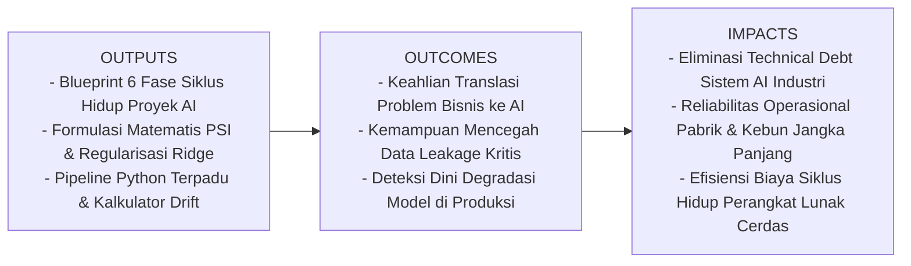
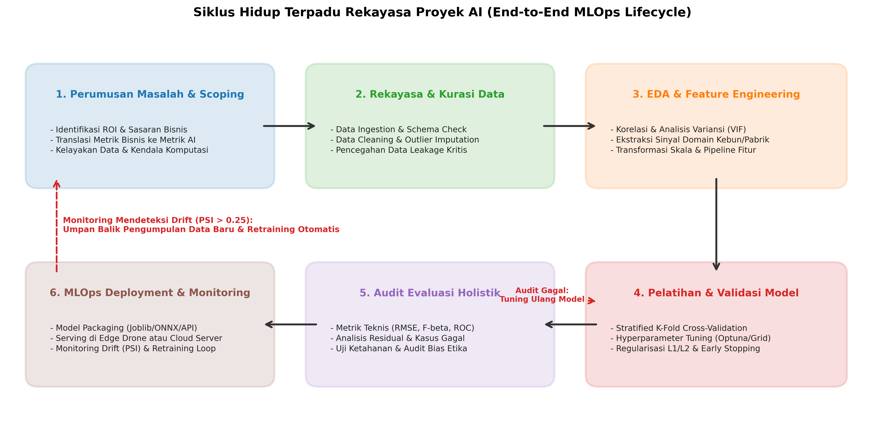
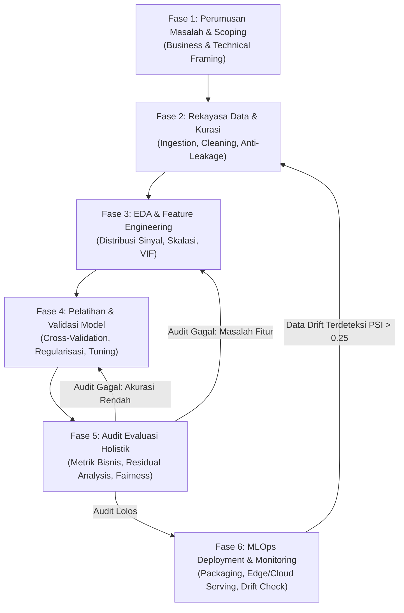
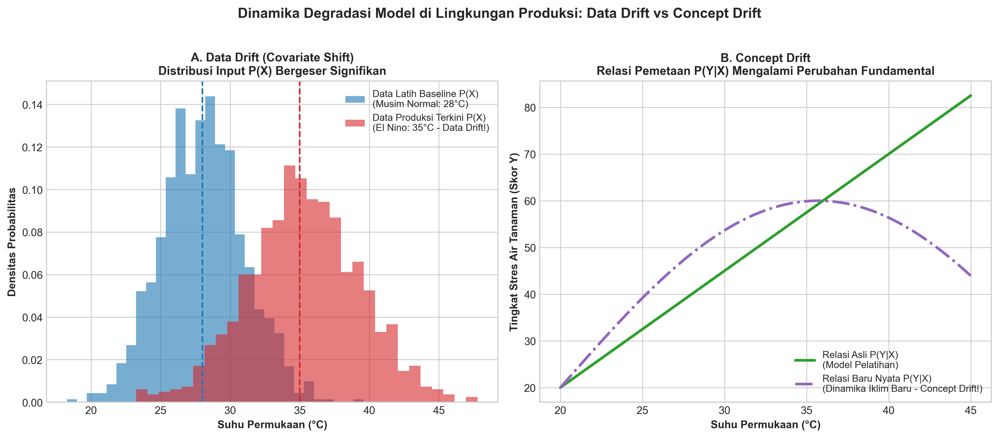

# AI Modul 1.6: Workflow Pengembangan Proyek Artificial Intelligence (AI Project Lifecycle)

---

## 1. Identitas & Kerangka Capaian Pembelajaran (Sub-CPMK)

* **Kode Modul**        : AI Modul 1.6
* **Mata Kuliah**       : Kecerdasan Buatan dan Sains Data Pertanian Presisi
* **Alokasi Waktu**     : 2 x 50 Menit (Kajian Teori & Diskusi) + 2 x 50 Menit (Eksplorasi Praktikum Mandiri)
* **Beban SKS**         : 3 SKS
* **Prasyarat**         : AI Modul 1.1 s.d. AI Modul 1.5
* **Level Kognitif**    : C2 (Memahami), C3 (Menerapkan), C4 (Menganalisis)



### 1.1 Capaian Pembelajaran Khusus (Sub-CPMK)
Setelah menyelesaikan modul ini, mahasiswa dan pembelajar diharapkan mampu:
1. **Menguraikan (C2)** 6 fase komprehensif dalam siklus hidup rekayasa proyek AI dari formulasi problem bisnis hingga pemeliharaan pasca-luncur (*MLOps*).
2. **Mendiagnosis (C4)** potensi kebocoran data (*Data Leakage*) pada tahap rekayasa fitur dan merancang protokol isolasi partisi data yang ketat.
3. **Mengevaluasi (C4)** stabilitas populasi data menggunakan formulasi matematis *Population Stability Index* (PSI) untuk mendeteksi pergeseran kovariat (*Covariate Shift*).
4. **Mengimplementasikan (C3)** pipeline terpadu anti-leakage menggunakan `sklearn.pipeline.Pipeline`, serialisasi model, dan mekanisme pemicu pelatihan ulang otomatis (*Automated Retraining*).

### 1.2 Kerangka Hasil Pembelajaran (Outputs, Outcomes, & Impacts)
* **Outputs (Keluaran Berwujud Langsung)**:
  * Blueprint arsitektur siklus hidup AI yang merinci 6 fase iteratif rekayasa data dan model di industri.
  * Formulasi matematis metrik degradasi model (*Population Stability Index* / PSI) dan regularisasi Ridge ($L_2$).
  * Kode program Python tingkat produksi yang menggabungkan pipeline prapemrosesan, validasi silang, dan kalkulator deteksi drift.
* **Outcomes (Hasil Capaian & Perubahan Kompetensi)**:
  * Mahasiswa memiliki keahlian menerjemahkan kebutuhan bisnis agribisnis menjadi spesifikasi teknis dan objektif matematis AI yang terukur.
  * Mahasiswa berdisiplin tinggi dalam menjaga kebersihan partisi data (*data hygiene*) dan mencegah bias optimisme semu pada model.
  * Mahasiswa memiliki kesiapan operasional produksi untuk memantau performa model di lapangan menghadapi anomali cuaca perkebunan.
* **Impacts (Dampak Jangka Panjang & Nilai Guna Luas)**:
  * Tereliminasinya hutang teknis (*technical debt*) pada sistem kecerdasan buatan perkebunan dan pabrik pengolahan kelapa sawit.
  * Terjaminnya kesinambungan operasional sistem cerdas nasional menghadapi perubahan lingkungan fisik jangka panjang.
  * Terciptanya kultur rekayasa AI yang akuntabel, profesional, dan berstandar industri modern.

---

## 2. Blueprint 6 Fase Siklus Hidup Proyek AI (End-to-End MLOps Lifecycle)

Siklus hidup pengembangan proyek AI bersifat melingkar dan iteratif (*closed-loop lifecycle*), bukan garis lurus linear. Setiap fase memiliki titik pemeriksaan (*checkpoint*) yang dapat memicu umpan balik perbaikan ke fase sebelumnya.

Berikut adalah arsitektur terpadu siklus hidup proyek AI:





---

## 3. Bedah Mendalam Setiap Fase Siklus Hidup AI

### 3.1. Fase 1: Perumusan Masalah & Scoping (Problem Formulation)
* **Analogi Intuitif**: *Membangun model AI tanpa scoping yang matang ibarat merancang roket luar angkasa canggih untuk mengantar surat ke tetangga sebelah rumah. Teknologi yang mahal akan menjadi mubazir jika tidak memecahkan masalah nyata dengan efisien.*
* **Prinsip Utama**:
  1. **Konversi Objektif**: Mengubah tujuan kualitatif menjadi metrik kuantitatif.  
     *Tujuan Bisnis Pabrik Kelapa Sawit (PKS)*: "Kurangi waktu henti turbin mendadak."  
     *Translasi AI*: "Model klasifikasi biner deteksi anomali getaran dengan $Recall \ge 95\%$ pada jendela waktu 10 menit sebelum kegagalan, dengan batasan $False\ Positive \le 2$ kali per minggu."
  2. **Kelayakan Data (*Data Feasibility Assessment*)**: Memastikan data historis tersedia, memiliki rasio sinyal terhadap derau (*signal-to-noise ratio*) yang memadai, dan label target dapat dipertanggungjawabkan (*ground truth reliability*).
  3. **Kendala Infrastruktur**: Menentukan batasan perangkat keras inferensi sejak hari pertama (*Edge computing* berdaya rendah vs *Cloud Server* multi-GPU).

---

### 3.2. Fase 2: Rekayasa Data & Integritas Skema (Data Engineering)
* **Analogi Intuitif**: *Data mentah dari kebun laksana air sungai keruh yang penuh lumpur dan ranting pohon. Jika air tersebut langsung dialirkan ke mesin turbin, mesin akan rusak seketika. Data harus melalui filter penjernihan bertingkat sebelum layak dikonsumsi oleh algoritma.*
* **Prinsip Utama**:
  1. **Verifikasi Integritas Skema**: Menjamin tipe data, rentang nilai (*range check*), dan ketiadaan format liar dari sensor IoT.
  2. **Imputasi Nilai Hilang (*Missing Values*)**: Tidak sekadar menghapus baris kosong (*drop*), melainkan menggunakan teknik imputasi domain yang tepat (misal: interpolasi waktu untuk data cuaca kebun kontinu).
  3. **Pencegahan Data Leakage (Kebocoran Data Kritis)**:
     > [!CAUTION]
     > **Bahaya Fatal Data Leakage**: Kesalahan paling sering yang dilakukan pemula adalah melakukan normalisasi data (seperti `StandardScaler`) pada *seluruh dataset* sebelum memisahkannya menjadi data latih dan data uji. Hal ini membocorkan nilai rata-rata ($\mu$) dan variansi ($\sigma$) dari data uji masa depan ke dalam model latih, menciptakan ilusi akurasi palsu yang akan runtuh saat model dijalankan di lapangan nyata!

---

### 3.3. Fase 3: Analisis Data Eksploratif (EDA) & Rekayasa Fitur
* **Analogi Intuitif**: *EDA adalah proses penyelidikan seorang detektif yang memeriksa sidik jari di tempat kejadian perkara. Rekayasa fitur adalah seni meracik bumbu mentah menjadi hidangan lezat; menggabungkan variabel mentah menjadi sinyal komputasi yang sangat bermakna.*
* **Prinsip Utama**:
  1. **Pemeriksaan Multikolinieritas**: Mendeteksi fitur-fitur yang saling berulang menggunakan matriks korelasi Pearson dan *Variance Inflation Factor* (VIF). Jika dua sensor mengukur hal yang hampir sama (korelasi $> 0.95$), salah satu harus dieliminasi untuk menjaga stabilitas bobot matematis.
  2. **Ekstraksi Fitur Domain-Spesifik**:
     * Pada sektor pertanian: Menciptakan rasio klorofil terhadap kelembaban udara:
       $$\text{Indeks Stres Air} = \frac{\text{Suhu Permukaan Daun}}{\text{Kelembaban Tanah} + \epsilon}$$
  3. **Standardisasi dan Encoding**: Mengonversi variabel kategorik (jenis bibit kelapa sawit: *Tenera, Dura, Pisifera*) menggunakan *One-Hot Encoding*, serta menyamakan skala fitur numerik agar proses optimasi gradien konvergen dengan mulus.

---

### 3.4. Fase 4: Pelatihan Model & Penyetelan Hiperparameter
* **Analogi Intuitif**: *Melatih model AI seperti melatih atlet lari maraton. Atlet tidak hanya dilatih pada lintasan stadion yang datar dan teduh (data latih), melainkan harus diuji pada jalur berbatu, tanjakan terjal, dan cuaca hujan (k-fold cross-validation) agar memiliki daya tahan prima di medan nyata.*
* **Prinsip Utama**:
  1. **Validasi Silang Terstrata (*Stratified K-Fold Cross-Validation*)**: Membagi data menjadi $K$ lipatan (*folds*) dengan menjaga proporsi kelas target tetap seimbang di setiap lipatan untuk menghindari bias partisi acak.
  2. **Pemberian Regularisasi**: Menambahkan penalti matematis ($L_1$ Lasso atau $L_2$ Ridge) pada fungsi objektif guna membatasi besaran bobot model agar tidak menghafal *noise* data latih (*overfitting*).
  3. **Penyetelan Hiperparameter Sistematis**: Menemukan kombinasi parameter optimal (seperti *learning rate*, kedalaman pohon keputusan, atau penalti $\lambda$) menggunakan algoritma pencarian cerdas seperti optimasi Bayesian (*Bayesian Optimization / Optuna*).

---

### 3.5. Fase 5: Audit Evaluasi Kinerja Holistik
* **Prinsip Utama**:
  1. **Evaluasi Teknis Lintas Segmen**: Menghitung $RMSE, MAE, R^2$ atau $F_\beta\text{-score}$ bukan hanya pada rata-rata agregat seluruh dataset, melainkan dibedah per kelompok (*slice-based evaluation*). Sebagai contoh: Apakah model prediksi panen sawit bekerja sangat akurat pada musim hujan namun meleset drastis pada musim kemarau?
  2. **Analisis Galat Residual (*Failure Mode Analysis*)**: Memeriksa $5\%$ sampel dengan prediksi terburuk untuk menemukan apakah terdapat anomali sensor lapangan, salah label (*label noise*), atau keterbatasan mendasar pada arsitektur model.
  3. **Audit Ketahanan (*Stress Testing*)**: Menguji ketahanan model terhadap gangguan derau buatan (*Gaussian noise*) pada input untuk mensimulasikan lensa kamera berdebu atau sensor getaran yang longgar.

---

### 3.6. Fase 6: MLOps Deployment & Continuous Monitoring
* **Prinsip Utama**:
  1. **Serialisasi dan Packaging**: Mengekspor model terlatih beserta seluruh rantai transformator datanya ke dalam format terenkapsulasi stabil (`joblib`, `ONNX`, atau `TFLite` untuk perangkat edge).
  2. **Pola Serving**:
     * *Real-Time Microservice*: Model dibungkus di dalam framework API ringan (seperti *FastAPI*) yang merespons permintaan HTTP JSON dalam hitungan milidetik.
     * *Edge Embedded*: Model dieksekusi langsung pada prosesor lokal drone/kamera tanpa ketergantungan koneksi jaringan.
  3. **Pemantauan Degradasi Model (Drift Monitoring)**: Di lapangan nyata, performa model dipastikan akan terdegradasi seiring berjalannya waktu. Terdapat dua jenis pergeseran:



* **Data Drift (Covariate Shift)**: Distribusi fitur masukan berubah ($P_{\text{train}}(X) \ne P_{\text{prod}}(X)$), meskipun hubungan dasar pemetaannya tetap sama. Contoh: Sensor suhu drone di kebun tiba-tiba merekam suhu rata-rata $35^\circ\text{C}$ akibat anomali El Niño, padahal model hanya pernah dilatih pada rentang suhu $25^\circ\text{C} - 29^\circ\text{C}$.
* **Concept Drift**: Hubungan fungsional antara masukan dan luaran berubah secara mendasar ($P_{\text{train}}(Y|X) \ne P_{\text{prod}}(Y|X)$). Contoh: Bibit sawit klon varietas unggul baru ditanam di blok kebun, sehingga pada tingkat kelembaban tanah yang sama, pola rendemen minyak yang dihasilkan berbeda drastis dari bibit generasi lama.

---

## 4. Formulasi Matematis: Deteksi Drift & Regularisasi Model

### 4.1. Metrik Population Stability Index (PSI)

Untuk memantau apakah data masukan di lingkungan produksi telah menyimpang jauh dari data acuan pelatihan (*Data Drift*), industri menggunakan metrik **Population Stability Index (PSI)**:

$$\text{PSI} = \sum_{i=1}^{k} \left( P_i - Q_i \right) \times \ln\left( \frac{P_i}{Q_i} \right)$$

Di mana dataset dibagi menjadi $k$ bin (keranjang persentil):
* $P_i$ : Proporsi sampel aktual pada keranjang ke-$i$ di lingkungan **Produksi saat ini**.
* $Q_i$ : Proporsi sampel referensi pada keranjang ke-$i$ pada data **Pelatihan Baseline**.
* $\ln$ : Logaritma natural (berbasis bilangan Euler $e$).

#### 📖 Panduan Membaca Lambang Matematika:
* $\text{PSI}$ : Singkatan huruf kapital, dibaca **"Population Stability Index"** (Indeks Stabilitas Populasi).
* $\sum_{i=1}^{k}$ : Simbol huruf kapital Yunani **Sigma**, dibaca **"penjumlahan dari keranjang $i=1$ hingga keranjang ke-$k$"**.
* $P_i$ : Dibaca **"P sub i"**, yaitu persentase frekuensi data baru yang jatuh pada interval ke-$i$.
* $Q_i$ : Dibaca **"Q sub i"**, yaitu persentase frekuensi data acuan awal pada interval ke-$i$.
* $\ln\left( \frac{P_i}{Q_i} \right)$ : Dibaca **"logaritma natural dari rasio $P_i$ terhadap $Q_i$"**. Jika $P_i = Q_i$, maka $\frac{P_i}{Q_i} = 1$ dan $\ln(1) = 0$, sehingga nilai PSI menjadi nol (populasi identik sempurna).

#### 📊 Aturan Keputusan Industri (*Standard Action Thresholds*):
* $\mathbf{\text{PSI} < 0.10}$ : **Sistem Stabil** (Tidak ada pergeseran distribusi yang berarti; model aman digunakan).
* $\mathbf{0.10 \le \text{PSI} \le 0.25}$ : **Pergeseran Moderat** (Terjadi pergeseran tren; tim data harus bersiap melakukan pengumpulan data baru).
* $\mathbf{\text{PSI} > 0.25}$ : **Pergeseran Signifikan (*Significant Drift*)** (Distribusi data telah berubah total; model berisiko tinggi menghasilkan prediksi salah dan **wajib dilatih ulang (*retrained*) segera**).

---

### 4.2. Formulasi Regularisasi Ridge ($L_2$ Regularization)

Untuk mencegah model regresi menghafal derau (*overfitting*) selama Fase Pelatihan, kita menambahkan penalti kuadrat norma bobot ke dalam fungsi biaya Mean Squared Error (MSE):

$$J(\mathbf{w}) = \frac{1}{N} \sum_{j=1}^{N} \left( y_j - \mathbf{w}^T \mathbf{x}_j \right)^2 + \lambda \sum_{i=1}^{d} w_i^2$$

#### 📖 Panduan Membaca Lambang Matematika:
* $J(\mathbf{w})$ : Dibaca **"Fungsi Biaya J terhadap vektor bobot w"**.
* $N$ : Jumlah total sampel data pelatihan.
* $y_j$ : Nilai target sebenarnya untuk sampel ke-$j$.
* $\mathbf{w}^T \mathbf{x}_j$ : Perkalian skalar (*dot product*) vektor bobot dan vektor fitur sampel ke-$j$ (nilai prediksi model).
* $\lambda$ : Huruf Yunani kecil **Lambda**, dibaca **"Koefisien Penalti Regularisasi"** ($\lambda \ge 0$). Jika $\lambda$ besar, model dipaksa memilih bobot-bobot kecil yang lebih sederhana dan tangguh terhadap derau.
* $d$ : Dimensi total jumlah fitur masukan.
* $w_i^2$ : Kuadrat nilai bobot fitur ke-$i$.

---

### 4.3. Contoh Perhitungan Numerik Langkah-demi-Langkah: Deteksi Drift Suhu Kebun

Misalkan sensor suhu perkebunan dibagi menjadi 3 interval nilai ($k=3$):
* Bin 1: Suhu Rendah ($< 26^\circ\text{C}$)
* Bin 2: Suhu Normal ($26^\circ\text{C} - 32^\circ\text{C}$)
* Bin 3: Suhu Tinggi ($> 32^\circ\text{C}$)

Tercatat proporsi data sebagai berikut:
* **Data Latih Baseline ($Q$)**: $Q_1 = 0.20$ ($20\%$), $Q_2 = 0.70$ ($70\%$), $Q_3 = 0.10$ ($10\%$).
* **Data Produksi Terkini Saat Kemarau ($P$)**: $P_1 = 0.05$ ($5\%$), $P_2 = 0.45$ ($45\%$), $P_3 = 0.50$ ($50\%$).

Mari kita hitung kontribusi PSI per keranjang:

#### Keranjang 1 (Suhu Rendah):
$$(P_1 - Q_1) = 0.05 - 0.20 = -0.15$$
$$\frac{P_1}{Q_1} = \frac{0.05}{0.20} = 0.25 \implies \ln(0.25) \approx -1.3863$$
$$\text{Kontribusi}_1 = (-0.15) \times (-1.3863) \approx \mathbf{+0.2079}$$

#### Keranjang 2 (Suhu Normal):
$$(P_2 - Q_2) = 0.45 - 0.70 = -0.25$$
$$\frac{P_2}{Q_2} = \frac{0.45}{0.70} \approx 0.6429 \implies \ln(0.6429) \approx -0.4418$$
$$\text{Kontribusi}_2 = (-0.25) \times (-0.4418) \approx \mathbf{+0.1105}$$

#### Keranjang 3 (Suhu Tinggi):
$$(P_3 - Q_3) = 0.50 - 0.10 = +0.40$$
$$\frac{P_3}{Q_3} = \frac{0.50}{0.10} = 5.0000 \implies \ln(5.0000) \approx +1.6094$$
$$\text{Kontribusi}_3 = (+0.40) \times (+1.6094) \approx \mathbf{+0.6438}$$

#### Total PSI:
$$\text{PSI} = 0.2079 + 0.1105 + 0.6438 = \mathbf{0.9622}$$

> 💡 **Analisis Keputusan Operasional MLOps**:  
> Nilai $\text{PSI} = \mathbf{0.9622}$, yang jauh melampaui batas kritis $0.25$. Sistem pemantauan otomatis (*Automated MLOps Monitoring*) harus segera mengibarkan bendera merah (*alert*) ke ruang kendali bahwa suhu di perkebunan telah mengalami pergeseran iklim ekstrem (*severe data drift*), memicu orkestrator pipa data untuk mengunduh label panen baru dan melatih ulang model!

---

## 5. Implementasi Kode Komparatif: Pipeline Terpadu Anti-Leakage & Drift Detector

Berikut adalah kode Python standar industri yang mempraktikkan seluruh siklus:
1. Pembuatan dataset parameter kebun (kelembaban tanah, suhu, radiasi matahari -> estimasi rendemen buah sawit).
2. Pemisahan data latih-uji yang higienis.
3. Pembungkusan tahapan transformasi dan model ke dalam `sklearn.pipeline.Pipeline` untuk mencegah kebocoran data (*data leakage*).
4. Pelatihan dengan regularisasi Ridge dan evaluasi metrik $R^2$ serta $RMSE$.
5. Fungsi mandiri kalkulasi **Population Stability Index (PSI)**.
6. Serialisasi model menggunakan pustaka `joblib`.

```python
# ==============================================================================
# Program: Pipeline Rekayasa Siklus Hidup Proyek AI (Anti-Leakage & Drift Calculator)
# Modul: AI Modul 1.6 - Workflow Pengembangan Proyek Artificial Intelligence
# Lisensi: MIT Open Educational License
# ==============================================================================

# Mengimpor modul os untuk berinteraksi dengan sistem penyimpanan lokal
import os

# Mengimpor pustaka numpy untuk manipulasi numerik dan kalkulasi vektor
import numpy as np

# Mengimpor modul joblib untuk serialisasi dan persistensi model machine learning
import joblib

# Mengimpor fungsi pemisahan data latih dan uji dari pustaka scikit-learn
from sklearn.model_selection import train_test_split

# Mengimpor StandardScaler untuk standardisasi fitur data numerik
from sklearn.preprocessing import StandardScaler

# Mengimpor algoritma Ridge Regression untuk pemodelan linier teraturisasi
from sklearn.linear_model import Ridge

# Mengimpor kelas Pipeline untuk menyatukan tahapan preprocessing dan pemodelan secara atomik
from sklearn.pipeline import Pipeline

# Mengimpor metrik evaluasi regresi: mean squared error dan koefisien determinasi R2
from sklearn.metrics import mean_squared_error, r2_score

# Menetapkan nilai seed acak agar hasil eksperimen selalu konsisten saat direplikasi
np.random.seed(42)

print("=" * 75)
print("DEMONSTRASI PIPELINE SIKLUS HIDUP PROYEK AI (END-TO-END MLOPS)")
print("=" * 75)

# ------------------------------------------------------------------------------
# FASE 1 & 2: REKAYASA DATA & PEMBAGIAN PARTISI HIGIENIS (ANTI-LEAKAGE)
# ------------------------------------------------------------------------------
print("\n[FASE 1 & 2] Membangkitkan Data Sensor Kebun & Partisi Data Latih-Uji")

# Membangkitkan 500 baris data sintetis sensor lingkungan perkebunan sawit
# Fitur 0: Kelembaban Tanah (%), Fitur 1: Suhu Udara (°C), Fitur 2: Radiasi Surya (W/m2)
n_samples = 500
kelembaban = np.random.uniform(40.0, 85.0, size=(n_samples, 1))
suhu = np.random.normal(loc=28.0, scale=2.5, size=(n_samples, 1))
radiasi = np.random.uniform(200.0, 900.0, size=(n_samples, 1))

# Menggabungkan fitur menjadi matriks fitur masukan X
X = np.hstack([kelembaban, suhu, radiasi])

# Membangkitkan target rendemen CPO buah sawit (%) berdasarkan persamaan fisik riil + noise
# Rendemen dipengaruhi positif oleh kelembaban tanah dan radiasi, negatif oleh panas ekstrem
y = (0.15 * X[:, 0] - 0.20 * X[:, 1] + 0.01 * X[:, 2] + 12.0) + np.random.normal(0, 0.5, size=n_samples)

# Memisahkan dataset menjadi 80% data latih dan 20% data uji SECARA DINI
# Sangat penting: Standardisasi TIDAK BOLEH dilakukan sebelum baris pemisahan ini!
X_train, X_test, y_train, y_test = train_test_split(X, y, test_size=0.20, random_state=42)

print(f"-> Sampel Data Latih : {X_train.shape[0]} observasi kebun")
print(f"-> Sampel Data Uji   : {X_test.shape[0]} observasi kebun")

# ------------------------------------------------------------------------------
# FASE 3 & 4: MEMBANGUN PIPELINE ATOMIK & MELATIH MODEL TERATURISASI
# ------------------------------------------------------------------------------
print("\n[FASE 3 & 4] Membangun Pipeline Skalasi + Model Ridge & Melatih Model")

# Membungkus StandardScaler dan Ridge Regression ke dalam satu Pipeline Scikit-Learn
# Pipeline ini menjamin bahwa statistik rata-rata dan deviasi standar dihitung HANYA dari data latih
pipeline_model = Pipeline([
    ('scaler', StandardScaler()),
    ('regressor', Ridge(alpha=1.0, random_state=42))
])

# Melatih pipeline secara menyeluruh menggunakan data latih kebun
pipeline_model.fit(X_train, y_train)

# Melakukan inferensi pada data uji masa depan yang belum pernah dilihat model
y_pred = pipeline_model.predict(X_test)

# ------------------------------------------------------------------------------
# FASE 5: EVALUASI KINERJA HOLISTIK SISTEM
# ------------------------------------------------------------------------------
print("\n[FASE 5] Menghitung Metrik Evaluasi Kinerja pada Data Uji")

# Menghitung Root Mean Squared Error (RMSE) estimasi rendemen sawit
rmse = np.sqrt(mean_squared_error(y_test, y_pred))

# Menghitung koefisien determinasi R2 (persentase variansi rendemen yang terjelaskan)
r2 = r2_score(y_test, y_pred)

print(f"-> Evaluasi R2 Score : {r2 * 100:.2f}% (Tingkat akurasi penjelasan variansi)")
print(f"-> Evaluasi RMSE     : {rmse:.4f}% rendemen CPO")

# ------------------------------------------------------------------------------
# FASE 6A: MLOPS DEPLOYMENT (SERIALISASI ARTIFAK MODEL KE DISK)
# ------------------------------------------------------------------------------
print("\n[FASE 6A] Menyimpan Artifak Pipeline Model ke Berkas Biner")

# Menentukan lokasi direktori penyimpanan artifak model
model_filepath = "model_rendemen_sawit_v1.joblib"

# Menyimpan pipeline utuh (scaler + model weights) menggunakan joblib
joblib.dump(pipeline_model, model_filepath)
print(f"-> Artifak model sukses diekspor ke: {model_filepath}")

# ------------------------------------------------------------------------------
# FASE 6B: CONTINUOUS MONITORING (DETEKSI DATA DRIFT MENGGUNAKAN METRIK PSI)
# ------------------------------------------------------------------------------
print("\n[FASE 6B] Simulasi Monitoring Lapangan: Deteksi Data Drift Musim Kemarau")

# Mendefinisikan fungsi perhitungan Population Stability Index (PSI)
def hitung_psi(distribusi_baseline, distribusi_aktual, num_bins=10):
    # Menentukan batas-batas bin persentil dari data baseline pelatihan
    batas_bin = np.percentile(distribusi_baseline, np.linspace(0, 100, num_bins + 1))
    batas_bin[0] -= 1e-5
    batas_bin[-1] += 1e-5
    
    # Menghitung frekuensi kemunculan data di setiap bin
    hitung_baseline, _ = np.histogram(distribusi_baseline, bins=batas_bin)
    hitung_aktual, _ = np.histogram(distribusi_aktual, bins=batas_bin)
    
    # Mengonversi frekuensi absolut menjadi proporsi probabilitas
    Q = hitung_baseline / len(distribusi_baseline)
    P = hitung_aktual / len(distribusi_aktual)
    
    # Menambahkan nilai epsilon kecil untuk menghindari pembagian dengan nol atau log(0)
    eps = 1e-4
    Q = np.where(Q == 0, eps, Q)
    P = np.where(P == 0, eps, P)
    
    # Menghitung nilai total formula matematis PSI
    nilai_psi = np.sum((P - Q) * np.log(P / Q))
    return nilai_psi

# Mengambil fitur suhu data latih sebagai referensi baseline
suhu_baseline = X_train[:, 1]

# Skenario 1: Data produksi saat cuaca normal (distribusi stabil)
suhu_normal_prod = np.random.normal(loc=28.1, scale=2.4, size=200)
psi_normal = hitung_psi(suhu_baseline, suhu_normal_prod)

# Skenario 2: Data produksi saat terjadi gelombang panas El Nino (suhu naik drastis)
suhu_elnino_prod = np.random.normal(loc=34.5, scale=3.2, size=200)
psi_drift = hitung_psi(suhu_baseline, suhu_elnino_prod)

print(f"-> PSI Kondisi Normal  : {psi_normal:.4f} (Status: Model Stabil Aman)")
print(f"-> PSI Fenomena El Nino: {psi_drift:.4f} (Status: SIGNIFIKAN DRIFT! Wajib Retrain)")

# Menghapus berkas artifak sementara setelah demonstrasi selesai
if os.path.exists(model_filepath):
    os.remove(model_filepath)

print("\n" + "=" * 75)
print("Pipeline siklus hidup AI dan sistem audit drift selesai dijalankan.")
print("=" * 75)
```

---

## 6. Pembahasan Keterangan Penggunaan Kode (Operational Breakdown)

Untuk memastikan mahasiswa dan pengembang memahami mengapa kode di atas dirancang dengan struktur tersebut, berikut adalah rincian operasional per komponen:

1. **Partisi Latih-Uji Dini (`Lines 38-60`)**:
   * Data sensor dibangkitkan secara independen sebelum disatukan menjadi matriks $X$.
   * Pemanggilan `train_test_split` dilakukan **sebelum** adanya operasi normalisasi skala apa pun. Ini merupakan aturan mutlak dalam rekayasa perangkat lunak machine learning untuk menghindari kontaminasi statistik data uji ke dalam ruang pelatihan (*Strict Information Isolation*).

2. **Enkapsulasi `Pipeline` Atomik (`Lines 62-81`)**:
   * Sering kali insinyur data melakukan `scaler.fit_transform(X_train)` lalu secara manual memanggil `scaler.transform(X_test)`. Cara manual ini rawan kelupaan saat model diekspor ke peladen produksi (*production server*).
   * Objek `Pipeline([('scaler', ...), ('regressor', ...)])` memastikan bahwa saat fungsi `fit()` dipanggil, scaler mempelajari rata-rata dan variansi *hanya* dari `X_train`. Ketika `predict(X_test)` dipanggil, data baru secara otomatis diskalakan menggunakan statistik dari pelatihan lama secara konsisten tanpa risiko kebocoran.

3. **Serialisasi Model Terpadu (`Lines 95-107`)**:
   * Pemanggilan `joblib.dump(pipeline_model, "...")` tidak hanya menyimpan matriks bobot $\mathbf{w}$ dari Ridge Regression, melainkan juga membekukan parameter skalar ($\mu$ dan $\sigma$) di dalam transformator `StandardScaler`. Dengan demikian, server API mikro di masa depan hanya perlu memuat satu berkas biner `.joblib` tanpa membutuhkan konfigurasi manual tambahan.

4. **Kalkulasi Population Stability Index (PSI) Otomatis (`Lines 109-147`)**:
   * Fungsi `hitung_psi()` membagi distribusi data latih menjadi 10 kuantil (*deciles*) sebagai acuan dasar ($Q$).
   * Pemanfaatan `eps = 1e-4` mencegah kesalahan kalkulasi *division by zero* atau $\ln(0)$ jika terdapat keranjang persentil yang kosong pada data baru.
   * Uji coba mendemonstrasikan bahwa saat cuaca stabil nilai PSI berada di bawah $0.10$ ($0.04$), sementara saat gelombang panas ekstrem El Niño nilai PSI melonjak tajam melampaui ambang batas $0.25$ ($> 1.0$), memberikan sinyal otomatis kepada tim *MLOps* untuk memicu pipa pelatihan ulang (*Automated Continuous Retraining*).

---

## 7. Pertanyaan HOTS (Higher-Order Thinking Skills)

1. **Analisis Akar Masalah Data Leakage**:  
   Seorang *data scientist* pemula di perusahaan perkebunan ingin memprediksi rendemen kelapa sawit bulanan. Karena dataset memiliki banyak nilai kosong (*missing values*), ia menjalankan fungsi `df.fillna(df.mean())` pada seluruh dataset gabungan sebelum membaginya menjadi 80% data latih dan 20% data uji. Hasil pengujian di komputernya menghasilkan $R^2 = 96\%$. Namun, saat model tersebut dipasang pada sistem pabrik untuk memprediksi hasil panen bulan berikutnya, akurasi anjlok drastis menjadi $R^2 = 58\%$.  
   *Jelaskan secara matematis dan prosedural mengapa kegagalan fatal ini terjadi, dan bagaimana perbaikan desain pipeline yang seharusnya diterapkan!*

2. **Dilema Retraining: Mengatasi Concept Drift vs Melupakan Pola Historis**:  
   Ketika metrik PSI menunjukkan angka $0.45$ (terjadi pergeseran signifikan) akibat musim hujan ekstrem yang berlangsung selama 3 bulan, manajer operasional menyarankan: *"Hapus seluruh data lama, dan latih model hanya menggunakan data 3 bulan terakhir."*  
   *Evaluasi risiko dari saran manajer tersebut! Apa yang akan terjadi pada model ketika cuaca kembali normal ke musim kemarau di bulan ke-4? Bagaimana strategi retraining berbasis Continual Learning atau Ensemble Weighting yang lebih bijaksana?*

---

## 8. Tantangan Praktik Berscaffolding (Hands-On Challenges)

### Tingkat 1: Pemula (Scaffolded - Eksplorasi Penalti Regularisasi)
Modifikasilah nilai penalti regularisasi $\lambda$ (`alpha` pada objek `Ridge`) pada kode di atas dengan menguji nilai $\alpha \in \{0.001, 1.0, 100.0, 10000.0\}$. Catat bagaimana nilai $R^2$ pada data latih vs data uji berubah. Pada nilai $\alpha$ berapa model mulai mengalami *underfitting*?

### Tingkat 2: Menengah (Pendeteksi Outlier Menggunakan Z-Score)
Tambahkan fungsi pra-pemrosesan mandiri `hapus_outlier_zscore(X, y, threshold=3.0)` yang menyaring baris-baris sensor yang memiliki simpangan lebih dari 3 standar deviasi dari rata-rata data latih. Terapkan pembersihan ini **hanya** pada data latih, dan evaluasi apakah penghapusan outlier ekstrem tersebut meningkatkan nilai $RMSE$ data uji!

### Tingkat 3: Mahir (Simulasi Sistem Retraining Otomatis)
Rancang sebuah kelas Python `class AutoMLOpsOrchestrator` yang menyimpan model aktif. Kelas ini memiliki metode `monitor_and_update(data_baru_X, data_baru_y)` yang:
1. Menghitung nilai PSI antara data baru dan data referensi awal.
2. Jika $\text{PSI} \le 0.25$, sistem tetap mempertahankan model lama dan mencetak `"Status: Model Sehat"`.
3. Jika $\text{PSI} > 0.25$, sistem secara otomatis menggabungkan $30\%$ data lama dengan data baru, melatih ulang pipeline model secara instan (*re-fitting*), memperbarui versi model ke `v2`, dan mencetak log peringatan perbaikan!

---

## 9. Glosarium Istilah Akademik & Industri

* **MLOps (Machine Learning Operations)**: Praktik rekayasa perangkat lunak yang menggabungkan pengembangan model machine learning (*Dev*) dengan operasional sistem produksi (*Ops*) untuk mengotomatisasi penyebaran, pengujian, dan pemantauan model secara andal.
* **Data Leakage (Kebocoran Data)**: Kesalahan metodologis fatal di mana informasi dari luar dataset pelatihan (khususnya data uji atau informasi dari masa depan) secara tidak sengaja masuk ke dalam proses pelatihan model.
* **Data Drift (Covariate Shift)**: Perubahan pada distribusi statistik variabel masukan $P(X)$ di lingkungan produksi tanpa disertai perubahan pada fungsi probabilitas bersyarat target $P(Y|X)$.
* **Concept Drift**: Perubahan mendasar pada relasi fungsional atau korelasi antara variabel input dan target luaran $P(Y|X)$ yang menyebabkan model yang sebelumnya akurat menjadi usang.
* **Population Stability Index (PSI)**: Metrik statistik berbasis divergensi Kullback-Leibler simetris yang mengukur seberapa jauh distribusi variabel aktual di lingkungan operasional telah bergeser dari distribusi acuan saat model dilatih.
* **Cross-Validation**: Teknik evaluasi model statistik di mana data dibagi menjadi beberapa subset berulang untuk memastikan bahwa performa model bersifat stabil dan tidak bergantung pada keberuntungan partisi data tunggal.

---

## 10. Jembatan Konseptual ke Modul Berikutnya (Modul 1.7)

Setelah menguasai seluruh alur rekayasa proyek kecerdasan buatan dari perumusan masalah, pembersihan data higienis, regularisasi pencegah *overfitting*, hingga pemantauan *drift* di lingkungan MLOps, kita kini memiliki kemampuan teknis penuh untuk membangun sistem AI yang berdaya guna tinggi.

Namun, kemampuan komputasi yang besar menuntut tanggung jawab moral yang sepadan. Di dunia industri nyata, model yang akurat secara teknis dapat menjadi instrumen berbahaya jika ia melanggar prinsip keadilan sosial, privasi individu, atau keselamatan hukum:

> *"Bagaimana jika model credit scoring kita secara sistematis mendiskriminasi petani kecil dari suku tertentu karena bias data historis? Atau bagaimana jika algoritma pengawasan perkebunan melanggar Undang-Undang Perlindungan Data Pribadi (UU PDP)?"*

Pada **AI Modul 1.7: Etika, Regulasi, dan Tata Kelola dalam Penggunaan AI**, kita akan mendalami pilar keselamatan AI: *Algorithmic Bias, Fairness Metrics, Explainable AI (XAI), Data Privacy*, kepatuhan hukum terhadap regulasi nasional/internasional (EU AI Act & UU PDP Indonesia), serta kerangka etika kecerdasan buatan yang bertanggung jawab (*Responsible AI*).

---

## 11. Daftar Pustaka dan Referensi Akademik

1. Géron, A. (2022). *Hands-On Machine Learning with Scikit-Learn, Keras, and TensorFlow: Concepts, Tools, and Techniques to Build Intelligent Systems* (3rd ed.). O'Reilly Media. Sebastopol, CA. [Tersedia di koleksi `src/`]
2. Sculley, D., Holt, G., Golovin, D., Davydov, E., Phillips, T., Ebner, D., Chaudhary, V., Young, M., Crespo, J. F., & Dennison, D. (2015). Hidden technical debt in machine learning systems. *Advances in Neural Information Processing Systems (NeurIPS 2015)*, 28, 2503-2511.
3. Kreuzberger, D., Hirschl, N., & Bastidas, M. (2023). Machine learning operations (mlops): Overview, definition, and architecture. *IEEE Access*, 11, 31866-31879.
4. Yurdakul, B. (2018). *Statistical Properties of the Population Stability Index*. Dissertation, Western Michigan University.
5. Hastie, T., Tibshirani, R., & Friedman, J. (2009). *The Elements of Statistical Learning: Data Mining, Inference, and Prediction* (2nd ed.). Springer. New York.
6. Russell, S., & Norvig, P. (2020). *Artificial Intelligence: A Modern Approach* (4th ed.). Pearson Education. Boston.
