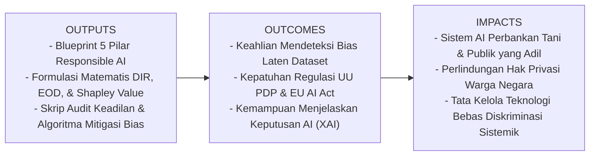
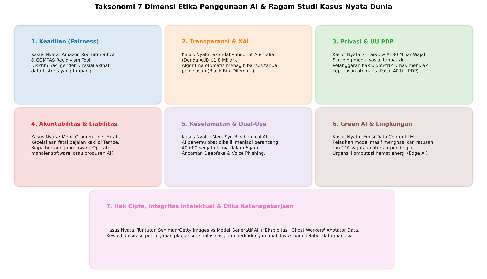
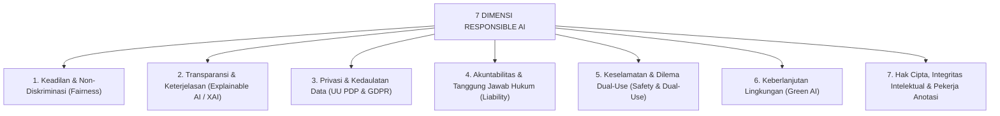
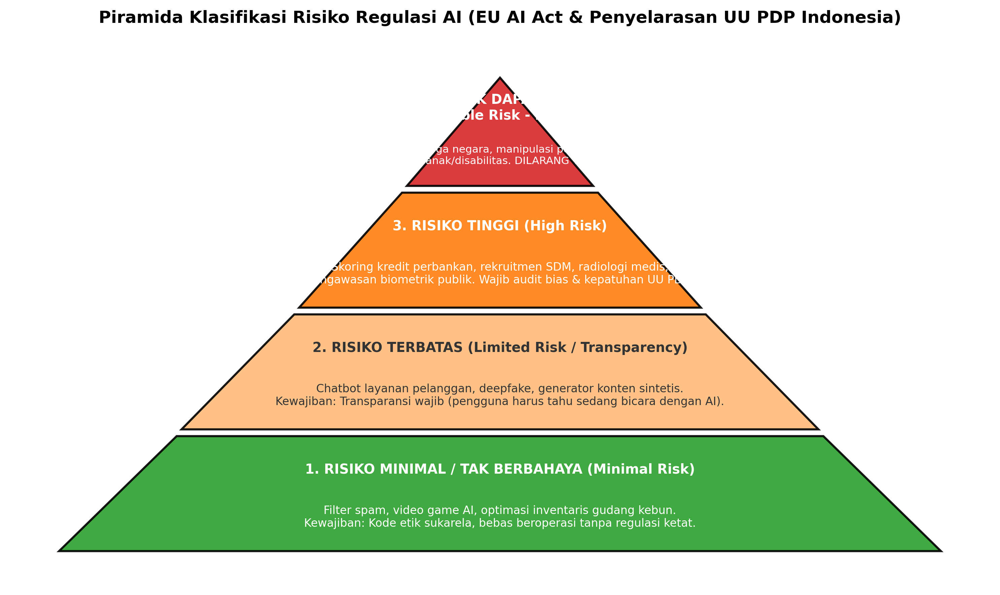

# AI Modul 1.7: Etika, Keadilan Algoritmik, dan Tata Kelola dalam Penggunaan Artificial Intelligence (Responsible AI & Governance)

---

## 1. Identitas & Kerangka Capaian Pembelajaran (Sub-CPMK)

* **Kode Modul**        : AI Modul 1.7
* **Mata Kuliah**       : Kecerdasan Buatan dan Sains Data Pertanian Presisi
* **Alokasi Waktu**     : 2 x 50 Menit (Kajian Teori & Diskusi) + 2 x 50 Menit (Eksplorasi Praktikum Mandiri)
* **Beban SKS**         : 3 SKS
* **Prasyarat**         : AI Modul 1.1 s.d. AI Modul 1.6
* **Level Kognitif**    : C2 (Memahami), C3 (Menerapkan), C4 (Menganalisis)



### 1.1 Capaian Pembelajaran Khusus (Sub-CPMK)
Setelah menyelesaikan modul ini, mahasiswa dan pembelajar diharapkan mampu:
1. **Menguraikan (C2)** 5 pilar utama AI yang bertanggung jawab (*Fairness, Transparency/XAI, Privacy, Accountability, Human-Centric Safety*) serta kepatuhan hukum terhadap UU PDP dan *EU AI Act*.
2. **Menganalisis (C4)** kemunculan bias historis dan bias representasi pada dataset agro-finansial menggunakan metrik *Disparate Impact Ratio* (DIR) dan *Equalized Odds Difference* (EOD).
3. **Menerapkan (C3)** teknik mitigasi bias prapemrosesan (*Sample Reweighting*) untuk mengembalikan keadilan model tanpa merusak akurasi secara signifikan.
4. **Mengevaluasi (C4)** transparansi keputusan model kotak hitam (*black-box*) menggunakan atribusi koalisi nilai Shapley (*Shapley Values*).

### 1.2 Kerangka Hasil Pembelajaran (Outputs, Outcomes, & Impacts)
* **Outputs (Keluaran Berwujud Langsung)**:
  * Dokumen kerangka tata kelola AI bertanggung jawab yang memuat pemetaan 5 pilar etika dan audit kepatuhan regulasi hukum privasi.
  * Formulasi matematis metrik keadilan algoritmik (*Disparate Impact Ratio*, *Equalized Odds*, dan *Shapley Values*).
  * Program Python praktikum audit keadilan pada dataset skoring kredit petani sawit swadaya beserta skrip penyeimbangan bobot sampel (*re-weighting*).
* **Outcomes (Hasil Capaian & Perubahan Kompetensi)**:
  * Mahasiswa memiliki ketajaman analitis untuk mendeteksi diskriminasi algoritmik yang tersembunyi di balik angka akurasi model.
  * Mahasiswa memahami batasan hukum pemrosesan otomatis serta hak subjek data untuk menuntut penjelasan yang dapat dipahami manusia (*Human-in-the-Loop*).
  * Mahasiswa terampil merekayasa teknik mitigasi bias (*debiasing*) demi menjaga rasio keadilan di atas ambang batas legalitas ($0{,}80$).
* **Impacts (Dampak Jangka Panjang & Nilai Guna Luas)**:
  * Demokratisasi akses pembiayaan dan sarana produksi bagi petani swadaya dan kelompok marjinal.
  * Terjaganya kepercayaan publik dan kedaulatan hukum terhadap implementasi kecerdasan buatan di Indonesia.
  * Terlahirkannya insinyur AI masa depan yang menjunjung tinggi etika kemanusiaan dan kepatuhan hukum.

---

## 2. Tujuh Dimensi Utama AI yang Bertanggung Jawab (Responsible AI) & Ragam Kasus Nyata Dunia

Dalam perancangan sistem kecerdasan buatan berstandar industri internasional (merujuk pada rekomendasi UNESCO, IEEE Global Initiative on Ethics of Autonomous and Intelligent Systems, dan standar OECD), etika bukanlah wacana normatif semata, melainkan panduan rekayasa kuantitatif dan kepatuhan hukum yang mengikat.

Berikut adalah pemetaan 7 dimensi etika AI beserta ragam studi kasus riil yang mengguncang dunia industri dan hukum:





---

### 2.1. Dimensi 1: Keadilan, Kesetaraan, dan Non-Diskriminasi (Fairness & Equity)
* **Prinsip Fundamental**: Sistem AI tidak boleh mengambil keputusan yang merugikan individu atau kelompok tertentu berdasarkan atribut sensitif yang dilindungi secara hukum (*protected attributes*), seperti suku, agama, ras, gender, status sosial ekonomi, atau disabilitas.
* **Analogi Intuitif**: *Jika dua orang petani sawit—satu petani swadaya dengan lahan 2 hektar dan satu manajer perkebunan korporasi—sama-sama memiliki catatan agronomis lahan yang sangat sehat, model AI tidak boleh menolak pinjaman pupuk petani kecil hanya karena algoritma mengasosiasikan kode pos desanya dengan riwayat gagal bayar orang lain di masa lalu.*
* **Contoh Kasus Nyata 1 (Amazon AI Recruitment Tool, 2018)**:  
  Raksasa teknologi Amazon mengembangkan sistem AI internal untuk memindai ribuan berkas riwayat hidup (CV) pelamar kerja teknis secara otomatis guna memilih kandidat terbaik. Model dilatih menggunakan data rekrutmen historis perusahaan selama 10 tahun terakhir. Karena industri teknologi pada dekade tersebut didominasi pria, algoritma secara mandiri mempelajari korelasi bahwa "kandidat pria lebih disukai". Akibatnya, sistem secara sistemik memotong skor (*down-ranking*) pada CV yang memuat kata *"women's"* (misalnya *"captain of women's chess club"*) atau alumni perguruan tinggi khusus wanita. Amazon akhirnya terpaksa mematikan dan membongkar proyek tersebut setelah gagal menghapus bias gender laten tersebut.
* **Contoh Kasus Nyata 2 (COMPAS Recidivism Prediction, ProPublica 2016)**:  
  Di pengadilan pidana Amerika Serikat, algoritma komersial COMPAS (*Correctional Offender Management Profiling for Alternative Sanctions*) digunakan oleh para hakim untuk memprediksi risiko seorang terdakwa mengulangi kejahatannya di masa depan (*recidivism risk score*). Investigasi jurnalisme ProPublica mengungkap skandal keadilan masif: algoritma melabeli terdakwa berkulit hitam sebagai "berisiko tinggi mengulangi kejahatan" hampir dua kali lipat lebih sering (*False Positive Rate* $44.9\%$) dibandingkan terdakwa kulit putih ($23.5\%$) untuk jenis kejahatan ringan yang serupa, memicu hukuman penjara yang tidak adil akibat bias data penegakan hukum masa lalu.

---

### 2.2. Dimensi 2: Transparansi, Hak Atas Penjelasan, dan Auditabilitas (Explainable AI / XAI)
* **Prinsip Fundamental**: Keputusan yang berdampak signifikan pada kehidupan manusia tidak boleh berasal dari sistem "kotak hitam" (*black-box system*). Setiap subjek data berhak mengetahui faktor apa saja yang menyebabkan suatu keputusan diambil (*Right to Explanation*).
* **Dilema Kotak Hitam (*Black-Box Dilemma*)**: Mengapa Deep Learning dengan ratusan juta parameter menolak permohonan klaim asuransi gagal panen petani sawit? Jawaban bahwa *"nilai matriks aktivasi neuron lapis ke-40 bernilai negatif"* merupakan penolakan akuntabilitas dan penghinaan terhadap keadilan.
* **Contoh Kasus Nyata 1 (Skandal Robodebt Australia, 2015–2020)**:  
  Pemerintah federal Australia menerapkan sistem otomatis *Online Compliance Intervention* (dikenal sebagai **Robodebt**) untuk mendeteksi kelebihan pembayaran dana bantuan sosial. Algoritma melakukan pencocokan data pendapatan pajak tahunan dengan rata-rata pendapatan dua mingguan secara otomatis tanpa verifikasi manusia. Algoritma tersebut secara keliru menuduh lebih dari 400.000 warga miskin telah mencuri uang negara dan secara sepihak mengirimkan surat penagihan utang total senilai miliaran dolar. Karena sistem bersifat kotak hitam dan tidak menyediakan mekanisme penjelasan maupun banding yang manusiawi, skandal ini memicu trauma sosial, kebangkrutan ribuan keluarga, dan setidaknya beberapa kasus bunuh diri warga. Pengadilan Federal Australia akhirnya menyatakan sistem tersebut ilegal, memaksa pemerintah mengembalikan AUD \$1.8 Miliar kepada para korban dan membentuk Komisi Penyelidikan Kerajaan (*Royal Commission*).
* **Contoh Kasus Nyata 2 (Penolakan Otomatis Klaim Gagal Panen)**:  
  Di sektor perkebunan, sebuah konsorsium asuransi pertanian menerapkan model Computer Vision satelit untuk menyetujui ganti rugi banjir. Ketika sebuah koperasi tani mengajukan klaim akibat tanggul jebol, sistem AI menolak permohonan dengan status *"Ditolak - Indeks Kelembaban Spektral Tidak Sesuai"*. Tanpa keterbukaan algoritma (XAI), petani tidak mengetahui bahwa pantulan air keruh berlumpur di kanopi sawit disalahartikan oleh satelit sebagai lahan kering berdebu.

---

### 2.3. Dimensi 3: Privasi, Perlindungan Data Pribadi, dan Pengawasan Massal (Privacy & Mass Surveillance)
* **Prinsip Fundamental**: Pengumpulan, pemrosesan, dan penyimpanan data individu untuk melatih model AI wajib tunduk pada asas legalitas, transparansi tujuan, dan persetujuan eksplisit (*Explicit Informed Consent*). Identitas biometrik dan lokasi fisik merupakan data spesifik yang dilindungi undang-undang.
* **Contoh Kasus Nyata 1 (Skandal Clearview AI, 2020–Sekarang)**:  
  Perusahaan rintisan Clearview AI mengikis (*scraping*) lebih dari 30 miliar gambar wajah warga dunia dari internet publik, media sosial (Facebook, Instagram, LinkedIn, YouTube), dan situs berita tanpa izin dari para pemilik foto. Clearview kemudian membangun basis data pengenalan wajah biometrik massal dan menjual aksesnya ke ribuan lembaga penegak hukum dan perusahaan swasta di seluruh dunia. Lembaga pengawas data di Uni Eropa, Inggris, Prancis, dan Italia menjatuhkan denda total puluhan juta Euro serta memerintahkan penghapusan seluruh data biometrik warga negara mereka karena melanggar hak privasi fundamental.
* **Contoh Kasus Nyata 2 (Pengawasan Pekerja Perkebunan Menggunakan Drone Thermal)**:  
  Sebuah perusahaan perkebunan besar mengoperasikan armada drone patroli berkamera thermal untuk memantau titik api kebakaran hutan dan lahan (karhutla). Namun, manajemen memperluas operasional drone tersebut untuk memantau pergerakan buruh di sekitar perumahan karyawan di malam hari guna menilai "kedisiplinan jam tidur". Hal ini merupakan pelanggaran berat atas batas wilayah privat versus lingkungan kerja, yang melanggar ketentuan pemrosesan data pribadi tanpa dasar hukum yang sah menurut UU PDP.

---

### 2.4. Dimensi 4: Akuntabilitas, Liabilitas, dan Pertanggungjawaban Hukum (Accountability & Liability)
* **Prinsip Fundamental**: AI adalah instrumen komputasi buatan manusia; ia bukan subjek hukum yang memiliki hak atau kewajiban mandiri. Ketika sistem cerdas menimbulkan kerugian fisik, finansial, atau kematian, tanggung jawab hukum perdata maupun pidana (*legal liability*) selalu bermuara pada entitas manusia: perancang algoritma, penyedia data, korporasi pemilik sistem, atau operator manusia.
* **Contoh Kasus Nyata 1 (Kecelakaan Fatal Mobil Otonom Uber ATG, 2018)**:  
  Pada Maret 2018 di Tempe, Arizona, sebuah kendaraan otonom eksperimental Uber Advanced Technologies Group (ATG) yang beroperasi dalam mode kemudi otomatis menabrak seorang pejalan kaki bernama Elaine Herzberg hingga tewas saat ia sedang menuntun sepedanya melintasi jalan raya di malam hari. Investigasi *National Transportation Safety Board (NTSB)* mengungkap kegagalan sistemik berlapis: perangkat lunak AI Uber mendeteksi korban 6 detik sebelum tabrakan, namun terus berganti-ganti mengklasifikasikannya antara "kendaraan tak dikenal", "benda mati", dan "sepeda", sehingga memicu penundaan pengereman darurat selama 1.2 detik. Uber membatalkan program uji coba publiknya, membayar kompensasi perdata kepada keluarga korban, sementara operator manusia cadangan di dalam kabin dijatuhi hukuman pidana masa percobaan karena terbukti lalai menonton video di ponsel saat sistem beroperasi.
* **Contoh Kasus Nyata 2 (Drone Semprot Pestisida Menyeberang Batas Lahan)**:  
  Sebuah drone penyemprot herbisida otonom di perkebunan tebu mengalami disorientasi koordinat GPS akibat pantulan sinyal kanopi lebat (*multipath error*). Alih-alih menyemprot lahan gulma perusahaan, drone tersebut terbang ke ladang sayuran organik milik warga desa tetangga dan menghancurkan seluruh komoditas siap panen. Secara hukum, perusahaan agro-industri bertanggung jawab mutlak atas ganti rugi material dan pencemaran lingkungan tersebut berdasarkan asas hukum pertanggungjawaban majikan (*Vicarious Liability*) dan kelalaian pengoperasian aset otonom.

---

### 2.5. Dimensi 5: Keselamatan, Keamanan, dan Dilema Penggunaan Ganda (Safety, Security & Dual-Use Dilemma)
* **Prinsip Fundamental**: Sistem AI harus dirancang tangguh (*robust*) terhadap manipulasi jahat (*Adversarial Attacks*) dan memiliki batasan tegas agar kapabilitasnya tidak dapat disalahgunakan untuk tujuan destruktif (*Dual-Use Dilemma*).
* **Contoh Kasus Nyata 1 (Eksperimen MegaSyn AI: Merancang 40.000 Senjata Kimia dalam 6 Jam, 2022)**:  
  Para peneliti bio-informatika di *Collaborations Pharmaceuticals* biasanya menggunakan model AI generatif (bernama MegaSyn) untuk merancang molekul obat terapeutik baru dengan mengarahkan model mencari molekul yang *memiliki afinitas biologis tinggi namun toksisitas serendah mungkin*. Untuk menguji kerentanan etika sistem, peneliti sekadar membalik fungsi objektif (*reward function*) model menjadi: *carilah molekul dengan toksisitas mematikan tertinggi*. Hanya dalam tempo 6 jam komputasi mandiri pada satu komputer standar, model AI tersebut berhasil merancang **lebih dari 40.000 molekul senyawa toksik kimia baru**, termasuk varian-varian yang secara teoritis jauh lebih mematikan daripada senyawa neurotoksik gas VX dan sarin. Temuan ini menjadi peringatan keras bagi komunitas ilmiah internasional mengenai betapa rapuhnya batas antara AI penyelamat nyawa dan AI perancang pemusnah massal.
* **Contoh Kasus Nyata 2 (Deepfake Voice Phishing dan Penipuan Finansial CEO)**:  
  Pada tahun 2019, CEO sebuah perusahaan energi di Inggris mentransfer uang sebesar \$243.000 ke rekening penipu setelah menerima panggilan telepon dari seorang pria dengan aksen dan intonasi suara yang persis sama dengan CEO perusahaan induknya di Jerman. Penipu menggunakan teknologi kloning suara bertenaga AI (*AI Voice Cloning*) untuk meniru frekuensi vokal sang eksekutif secara real-time. Kasus ini membuktikan bahwa teknologi sintesis audio yang awalnya dikembangkan untuk asisten difabel kini telah menjadi senjata siber baru yang sangat berbahaya.

---

### 2.6. Dimensi 6: Keberlanjutan Lingkungan dan Etika Ekologis (Green AI vs Red AI)
* **Prinsip Fundamental**: Pengembangan AI tidak boleh mengorbankan daya dukung biosfer bumi. Paradigma *Red AI*—yang mengejar peningkatan akurasi $0.1\%$ dengan melipatgandakan konsumsi daya komputasi secara masif tanpa memperhitungkan efisiensi energi—harus digantikan oleh **Green AI**, yaitu rekayasa model cerdas yang hemat energi, terkompresi, dan berkelanjutan secara ekologis.
* **Fakta Emisi & Jejak Air (*Carbon & Water Footprint*)**:  
  Studi seminal dari University of Massachusetts Amherst (Strubell et al., 2019) menghitung bahwa proses pelatihan satu model Transformer besar dengan arsitektur pencarian neural menghasilkan emisi setara dengan **$\approx 284.000\text{ kg } CO_2$**, atau setara dengan jejak karbon lima buah mobil berbahan bakar fosil sepanjang seluruh masa pakainya (dari perakitan hingga masuk tempat pembongkaran). Selain itu, pendinginan pusat data (*data center cooling*) raksasa yang menampung ribuan chip GPU mengonsumsi jutaan liter air tawar setiap hari, yang di daerah kering bersaing langsung dengan kebutuhan air irigasi pertanian lokal.

---

### 2.7. Dimensi 7: Hak Cipta, Integritas Intelektual, dan Etika Ketenagakerjaan (IP & Ghost Workers)
* **Prinsip Fundamental**: Sistem AI generatif dilatih menggunakan miliaran karya seni, tulisan, dan data buatan manusia. Pengembang AI wajib menghormati hak cipta pencipta asli, menegakkan integritas kejujuran ilmiah, serta memberikan upah yang adil dan perlindungan kesehatan mental bagi para pekerja anotasi data.
* **Contoh Kasus Nyata 1 (Gugatan Hak Cipta: The New York Times & Getty Images vs AI Makers, 2023–2024)**:  
  Getty Images menggugat *Stability AI* di pengadilan London dan Delaware atas tuduhan menyalin lebih dari 12 juta foto berhak cipta beserta teks deskripsinya tanpa izin untuk melatih model text-to-image Stable Diffusion (terbukti dari tanda air *watermark* Getty yang terdistorsi muncul pada hasil generasi AI). Secara terpisah, surat kabar *The New York Times* menggugat OpenAI dan Microsoft karena menggunakan jutaan artikel investigasi jurnalistik berbayar mereka untuk melatih ChatGPT tanpa kompensasi lisensi. Kasus-kasus ini sedang membentuk ulang yurisprudensi dan asas hukum hak cipta di seluruh dunia.
* **Contoh Kasus Nyata 2 (Eksploitasi 'Ghost Workers' Anotator Data di Dunia Ketiga)**:  
  Di balik kehebatan model bahasa besar (LLM) yang tampak santun dan aman dari konten ujaran kebencian, terdapat ribuan pekerja lepas (*ghost workers*) berupaya rendah di negara berkembang seperti Kenya, Uganda, dan Filipina. Laporan investigasi majalah *TIME* (2023) mengungkap bahwa para pekerja kontrak di Nairobi dibayar kurang dari \$2 per jam untuk membaca dan melabeli puluhan ribu teks mengerikan (kekerasan seksual, mutilasi, dan bunuh diri) selama shift kerja panjang demi melatih filter keselamatan AI, yang berakibat pada trauma psikologis mendalam tanpa jaminan konseling medis yang memadai.
* **Integritas Akademik & Pedoman Mahasiswa**:  
  Bagi civitas akademika, penggunaan kecerdasan buatan sebagai alat bantu riset (seperti brainstorming ide atau pembersihan kode) diperbolehkan dengan syarat keterbukaan (*transparency declaration*). Namun, menyalin teks hasil generasi AI mentah-mentah ke dalam skripsi atau laporan tanpa sitasi adalah bentuk **plagiarisme akademik modern**. Terlebih lagi, model LLM sering menghasilkan "halusinasi" (*hallucinations*), yaitu mengarang referensi jurnal ilmiah palsu yang tampak meyakinkan namun tidak pernah ada di dunia nyata.

---

---

## 3. Klasifikasi Sumber Bias Algoritmik

Kecerdasan buatan tidak memiliki prasangka biologis. Lantas, mengapa algoritma bisa bersikap diskriminatif? Bias algoritmik timbul dari 4 celah dalam rantai pasok data:

| Jenis Bias | Deskripsi Penyebab | Contoh Kasus Nyata |
| :--- | :--- | :--- |
| **Historical Bias** | Data masa lalu mencerminkan ketidakadilan struktur sosial masa lalu yang kemudian "dihafal" oleh algoritma sebagai kebenaran mutlak. | Algoritma penyaring CV merekrut kandidat pria 3x lebih banyak karena data 20 tahun terakhir di perusahaan teknologi didominasi pria. |
| **Representation Bias** | Kelompok populasi tertentu kurang terwakili (*under-represented*) dalam dataset pelatihan. | Model Computer Vision pengenal penyakit daun sawit gagal mengenali penyakit pada varietas lokal karena $95\%$ data latih berasal dari varietas impor. |
| **Measurement Bias** | Variabel proksi yang dipilih untuk mengukur suatu sifat ternyata tidak akurat atau bias terhadap kelompok tertentu. | Mengukur "kualitas dan kejujuran petani" dari histori skor perbankan formal, padahal petani swadaya pedalaman tidak memiliki akses kantor cabang bank. |
| **Aggregation Bias** | Menggunakan satu model umum untuk seluruh populasi padahal subkelompok yang berbeda memiliki dinamika hubungan kausal yang berbeda. | Model regresi iklim yang menyamakan dinamika tanah gambut di Riau dengan tanah vulkanik di Jawa Timur. |

---

## 4. Kerangka Regulasi: Penyelarasan UU PDP Indonesia & EU AI Act

Perkembangan regulasi kecerdasan buatan di tingkat internasional kini telah diadopsi secara ketat. Di Indonesia, payung hukum utama yang mengikat pemrosesan data berbasis AI adalah **Undang-Undang Republik Indonesia Nomor 27 Tahun 2022 tentang Perlindungan Data Pribadi (UU PDP)**.

### 4.1. Pasal Kunci UU PDP No. 27/2022 Terkait Kecerdasan Buatan
1. **Pasal 40 (Hak Menolak Keputusan Otomatis)**:
   > *"Subjek Data Pribadi berhak untuk menolak tindakan pengambilan keputusan yang hanya didasarkan pada pemrosesan secara otomatis, termasuk pemrofilan (*profiling*), yang menimbulkan akibat hukum atau berdampak signifikan pada Subjek Data Pribadi."*
   * *Implikasi*: Sistem AI bank tidak boleh secara sepihak menolak pengajuan kredit petani tanpa memberikan hak kepada pemohon untuk meminta peninjauan ulang oleh petugas manusia!
2. **Pasal 35 - 39 (Kewajiban Pengendali Data)**:
   * Pengendali Data Pribadi wajib memiliki dasar pemrosesan yang sah (*lawful basis*), melakukan Penilaian Dampak Pelindungan Data Pribadi (*Data Protection Impact Assessment / DPIA*) sebelum menyebarkan model AI berisiko tinggi.
   * Pelanggaran ketentuan ini diancam sanksi administratif berupa denda hingga $2\%$ dari total pendapatan tahunan korporasi, serta sanksi pidana penjara hingga 5 tahun (Pasal 67).

---

### 4.2. Hierarki Tingkat Risiko Regulasi AI (EU AI Act)

Regulasi global *European Union Artificial Intelligence Act (EU AI Act)* mengklasifikasikan sistem AI ke dalam 4 tingkatan risiko hierarkis:



1. **Risiko Tak Dapat Diterima (*Unacceptable Risk - DILARANG TOTAL*)**:
   * *Contoh*: *Social Scoring* pemerintah untuk memberi nilai moral warga negara, manipulasi psikologis bawah sadar (*subliminal manipulation*), dan eksploitasi kerentanan anak/penyandang disabilitas.
   * *Status Hukum*: Dilarang beroperasi secara mutlak.
2. **Risiko Tinggi (*High Risk - AUDIT & SERTIFIKASI KETAT*)**:
   * *Contoh*: Skoring kredit finansial, rekrutmen tenaga kerja, sistem medis/radiologi, pengawasan biometrik di tempat umum, infrastruktur energi dan transportasi kritis.
   * *Kewajiban*: Wajib audit bias matematis independen, dokumentasi teknis menyeluruh, logging audit jejak rekam, dan mekanisme *Human-in-the-Loop*.
3. **Risiko Terbatas (*Limited Risk - TRANSPARANSI WAJIB*)**:
   * *Contoh*: Chatbot layanan pelanggan (LLM), generator gambar deepfake, sintesis suara.
   * *Kewajiban*: Pengguna wajib diberi tahu secara eksplisit bahwa mereka sedang berinteraksi dengan kecerdasan buatan.
4. **Risiko Minimal (*Minimal Risk - BEBAS BEROPERASI*)**:
   * *Contoh*: Filter spam email, algoritma permainan video, sistem rekomendasi musik internal.
   * *Kewajiban*: Bebas beroperasi tanpa beban regulasi birokratis berat.

---

## 5. Formulasi Matematis Keadilan Algoritmik & XAI

Untuk membuktikan secara ilmiah apakah suatu model AI telah memenuhi standar kepatuhan hukum, digunakan formulasi statistik formal berikut:

### 5.1. Disparate Impact Ratio (DIR) & Aturan Empat-Perlima (Four-Fifths Rule)

Metrik ini mengukur rasio tingkat persetujuan (*approval rate*) antara kelompok marjinal/unprivileged ($A=0$) dan kelompok dominan/privileged ($A=1$):

$$\text{DIR} = \frac{P(\hat{Y} = 1 \mid A = 0)}{P(\hat{Y} = 1 \mid A = 1)}$$

Di mana:
$$\text{Approval Rate}_{A=0} = \frac{\sum_{i \in \{A=0\}} \hat{Y}_i}{N_{A=0}}, \quad \text{Approval Rate}_{A=1} = \frac{\sum_{j \in \{A=1\}} \hat{Y}_j}{N_{A=1}}$$

#### 📖 Panduan Membaca Lambang Matematika:
* $\text{DIR}$ : Singkatan huruf kapital, dibaca **"Disparate Impact Ratio"** (Rasio Dampak Disparitas).
* $P(\hat{Y} = 1 \mid A = 0)$ : Dibaca **"probabilitas model memprediksi luaran positif ($\hat{Y}=1$, misal: pinjaman disetujui) jika pemohon berasal dari kelompok unprivileged ($A=0$, misal: petani swadaya)"**.
* $P(\hat{Y} = 1 \mid A = 1)$ : Dibaca **"probabilitas model memprediksi luaran positif jika pemohon berasal dari kelompok privileged ($A=1$, misal: korporasi)"**.
* $\hat{Y}$ : Huruf Y dengan tanda topi di atasnya (*Y-hat*), melambangkan **keputusan hasil prediksi model**.
* $A$ : Simbol huruf kapital A, melambangkan **Atribut Sensitif / Terlindungi (*Protected Attribute*)**.

#### ⚖️ Kriteria Standar Kepatuhan Hukum (*The 80% Rule of Thumb*):
* Jika $\mathbf{\text{DIR} < 0.80}$ : Model dinyatakan **melakukan diskriminasi sistemik ilegal (*Adverse Impact Violation*)**. Sistem dilarang disebarkan menurut standar perbankan internasional dan regulasi ketenagakerjaan.
* Jika $\mathbf{0.80 \le \text{DIR} \le 1.25}$ : Model dinyatakan **memenuhi standar keadilan hukum (*Legally Fair*)**.

---

### 5.2. Equalized Odds Difference (EOD)

Aturan DIR hanya mengukur kesetaraan luaran tanpa mempertimbangkan kualifikasi sebenarnya. Metrik **Equalized Odds** menuntut bahwa model harus memiliki tingkat akurasi yang sama (*True Positive Rate / TPR* dan *False Positive Rate / FPR*) di kedua kelompok:

$$\text{EOD} = \frac{1}{2} \left( \left| \text{TPR}_{A=0} - \text{TPR}_{A=1} \right| + \left| \text{FPR}_{A=0} - \text{FPR}_{A=1} \right| \right)$$

* Model yang adil sempurna memiliki $\mathbf{\text{EOD} = 0.0}$. Toleransi praktis industri adalah $\text{EOD} \le 0.10$.

---

### 5.3. Formula Teori Permainan Shapley Value untuk Explainable AI (XAI)

Untuk memberikan transparansi kepada subjek data mengenai alasan di balik keputusan model (*Kenapa pengajuan pinjaman saya ditolak?*), algoritma SHAP menghitung kontribusi marjinal setiap fitur $i$ dari seluruh kombinasi subset fitur $S$:

$$\phi_i(v) = \sum_{S \subseteq N \setminus \{i\}} \frac{|S|! \cdot (|N| - |S| - 1)!}{|N|!} \cdot \left[ v(S \cup \{i\}) - v(S) \right]$$

#### 📖 Panduan Membaca Lambang Matematika:
* $\phi_i(v)$ : Huruf Yunani kecil **Phi** dengan indeks $i$, dibaca **"Nilai Shapley (kontribusi signifikansi) dari fitur ke-$i$"**.
* $N$ : Himpunan seluruh variabel/fitur masukan.
* $S$ : Sembarang subset variabel yang tidak memuat fitur ke-$i$ ($S \subseteq N \setminus \{i\}$).
* $|S|!$ : Nilai faktorial dari jumlah elemen dalam subset $S$.
* $v(S \cup \{i\}) - v(S)$ : Selisih kenaikan nilai prediksi saat fitur ke-$i$ ditambahkan ke dalam subset fitur $S$ (*Marginal Contribution*).

---

### 5.4. Contoh Perhitungan Numerik Langkah-demi-Langkah: Audit Skoring Kredit Petani

Sebuah bank BUMN menguji model AI penyaring kelayakan pinjaman mikro peremajaan sawit terhadap 1.000 pemohon:
* **Kelompok 1 (Petani Korporasi / Privileged, $A=1$)**:
  * Total pemohon ($N_{A=1}$): 600 orang.
  * Model meloloskan pinjaman ($\hat{Y}=1$): 480 orang.
  $$\text{Tingkat Persetujuan}_{A=1} = \frac{480}{600} = 0.80 \quad (80\%)$$
* **Kelompok 2 (Petani Swadaya / Unprivileged, $A=0$)**:
  * Total pemohon ($N_{A=0}$): 400 orang.
  * Model meloloskan pinjaman ($\hat{Y}=1$): 180 orang.
  $$\text{Tingkat Persetujuan}_{A=0} = \frac{180}{400} = 0.45 \quad (45\%)$$

#### Perhitungan Disparate Impact Ratio (DIR):
$$\text{DIR} = \frac{\text{Tingkat Persetujuan}_{A=0}}{\text{Tingkat Persetujuan}_{A=1}} = \frac{0.45}{0.80} = \mathbf{0.5625}$$

> 🚨 **Vonis Audit Keadilan**:  
> Nilai $\text{DIR} = \mathbf{0.5625}$ jauh berada di bawah ambang batas legalitas $0.80$ ($56.25\% < 80\%$). Secara hukum dan etika, model ini **dinyatakan bersalah melakukan diskriminasi struktural** terhadap petani swadaya. Jika bank meluncurkan sistem ini ke publik, bank dapat dijatuhi denda kepatuhan oleh OJK dan Kementerian Hukum sesuai ketentuan UU PDP!

---

## 6. Algoritma Mitigasi Bias: Pre-Processing Sample Reweighting

Salah satu teknik paling elegan untuk menghapus bias tanpa mengubah arsitektur model adalah **Sample Reweighting** (Kamiran & Calders, 2012). Kita menghitung bobot penalti/imbalan ($W$) untuk setiap baris data pelatihan sehingga distribusi statistik gabungan antara atribut terlindungi ($A$) dan target ($Y$) menjadi independen sempurna:

$$W(A=a, Y=y) = \frac{P(A=a) \times P(Y=y)}{P(A=a, Y=y)} = \frac{\left( \frac{N_a}{N} \right) \times \left( \frac{N_y}{N} \right)}{\frac{N_{a, y}}{N}} = \frac{N_a \times N_y}{N \times N_{a, y}}$$

Sampel petani swadaya yang layak kredit diberi bobot lebih besar ($W > 1$) selama proses optimasi fungsi rugi (*loss function*), memaksa algoritma memperhatikan keadilan hakiki.

---

## 7. Implementasi Kode Komparatif: Audit Keadilan & Mitigasi Bias

Berikut adalah kode Python standar industri yang mempraktikkan:
1. Pembuatan dataset sintetis kredit tani dengan bias historis tersembunyi.
2. Pelatihan model baseline (mengalami bias ilegal).
3. Perhitungan metrik keadilan DIR dan EOD.
4. Penerapan algoritma *Sample Reweighting*.
5. Pelatihan ulang model dengan pembobotan adil dan pembuktian pemulihan keadilan.

```python
# ==============================================================================
# Program: Audit Keadilan Algoritmik & Mitigasi Bias Data Historis Pinjaman Tani
# Modul: AI Modul 1.7 - Etika, Keadilan, dan Tata Kelola dalam Penggunaan AI
# Lisensi: MIT Open Educational License
# ==============================================================================

# Mengimpor pustaka numpy untuk operasi vektor dan kalkulasi statistik numerik
import numpy as np

# Mengimpor pustaka matplotlib untuk visualisasi grafik perbandingan keadilan
import matplotlib.pyplot as plt

# Mengimpor pemodelan Logistic Regression sebagai pengambil keputusan biner
from sklearn.linear_model import LogisticRegression

# Mengimpor fungsi pemisahan data latih dan uji
from sklearn.model_selection import train_test_split

# Mengimpor metrik evaluasi klasifikasi: confusion matrix dan akurasi
from sklearn.metrics import confusion_matrix, accuracy_score

# Menetapkan nilai seed acak agar simulasi deterministik dan dapat direplikasi
np.random.seed(42)

print("=" * 75)
print("AUDIT KEADILAN ALGORITMIK & MITIGASI BIAS (RESPONSIBLE AI GOVERNANCE)")
print("=" * 75)

# ------------------------------------------------------------------------------
# BAGIAN 1: PEMBANGKITAN DATASET KREDIT PERKEBUNAN DENGAN BIAS HISTORIS
# ------------------------------------------------------------------------------
print("\n[BAGIAN 1] Membangkitkan Data Pemohon Pinjaman Mikro Peremajaan Sawit")

# Total pemohon pinjaman: 1.000 orang
n_samples = 1000

# Atribut Sensitif (A): 1 = Petani Korporasi (Privileged), 0 = Petani Swadaya (Unprivileged)
# 60% pemohon adalah korporasi, 40% adalah petani swadaya
A = np.random.binomial(n=1, p=0.60, size=n_samples)

# Fitur Objektif (X1): Skor Kesehatan Agronomis Kebun (Rentang 40 - 100, berdistribusi sama)
skor_agronomis = np.random.normal(loc=70.0, scale=10.0, size=n_samples)

# Fitur Objektif (X2): Rasio Kemampuan Bayar Arus Kas (Rentang 1.0 - 5.0)
arus_kas = np.random.normal(loc=2.8, scale=0.6, size=n_samples)

# Fitur Proksi: Kelengkapan Agunan Sertifikat Formal (agak berkorelasi dengan korporasi)
agunan = 0.50 * A + np.random.normal(loc=1.0, scale=0.30, size=n_samples)

# Kelayakan Riil Sejati (True Merit): Ditentukan murni oleh agronomis dan arus kas tanpa memandang A!
prob_merit = 1.0 / (1.0 + np.exp(-(0.08 * (skor_agronomis - 70.0) + 1.2 * (arus_kas - 2.8))))
y_true = (prob_merit > 0.50).astype(int)

# Namun, Data Historis Masa Lalu (Y_historis) Tercemar Bias Manusia Masa Lalu:
# Petani swadaya (A=0) masa lalu sering dipersulit mendapat persetujuan akibat prasangka
bias_faktor = np.where(A == 1, 0.15, -0.25)
prob_historis = np.clip(prob_merit + bias_faktor, 0.05, 0.95)
y_historis = (np.random.rand(n_samples) < prob_historis).astype(int)

# Menggabungkan fitur masukan (X = [Skor Agronomis, Arus Kas, Agunan])
X = np.column_stack([skor_agronomis, arus_kas, agunan])

# Membagi dataset menjadi data latih (80%) dan data uji (20%)
X_train, X_test, y_train, y_test, A_train, A_test = train_test_split(
    X, y_historis, A, test_size=0.20, random_state=42
)

# ------------------------------------------------------------------------------
# BAGIAN 2: AUDIT MODEL AWAL (BASELINE MODEL - MEREFLEKSIKAN BIAS HISTORIS DATA)
# ------------------------------------------------------------------------------
print("\n[BAGIAN 2] Melatih Model Standar Tanpa Mitigasi & Mengukur Metrik Keadilan")

# Menginisialisasi dan melatih model regresi logistik standar
model_bias = LogisticRegression()
model_bias.fit(X_train, y_train)

# Melakukan prediksi keputusan pada data uji
y_pred_bias = model_bias.predict(X_test)

# Menghitung Tingkat Persetujuan (Approval Rate) untuk masing-masing kelompok pada data uji
mask_priv_test = (A_test == 1)
mask_unpriv_test = (A_test == 0)

rate_priv_bias = np.mean(y_pred_bias[mask_priv_test])
rate_unpriv_bias = np.mean(y_pred_bias[mask_unpriv_test])

# Menghitung Disparate Impact Ratio (DIR)
dir_awal = rate_unpriv_bias / rate_priv_bias

print(f"-> Approval Rate Petani Korporasi (Privileged)   : {rate_priv_bias * 100:.2f}%")
print(f"-> Approval Rate Petani Swadaya   (Unprivileged) : {rate_unpriv_bias * 100:.2f}%")
print(f"-> Disparate Impact Ratio (DIR) Awal             : {dir_awal:.4f}")

if dir_awal < 0.80:
    print("   [VONIS HUKUM]: MODEL DISKRIMINATIF ILEGAL! (DIR < 0.80 - Melanggar Four-Fifths Rule)")
else:
    print("   [VONIS HUKUM]: Model Memenuhi Ambang Batas Keadilan.")

# ------------------------------------------------------------------------------
# BAGIAN 3: ALGORITMA MITIGASI BIAS PRE-PROCESSING (SAMPLE REWEIGHTING)
# ------------------------------------------------------------------------------
print("\n[BAGIAN 3] Menerapkan Algoritma Pre-Processing: Sample Reweighting")

# Menghitung total sampel latih dan probabilitas marginal
N = len(y_train)
weights = np.zeros(N)

# Menghitung frekuensi gabungan untuk setiap kombinasi (A, Y)
for a_val in [0, 1]:
    for y_val in [0, 1]:
        mask = (A_train == a_val) & (y_train == y_val)
        n_ay = np.sum(mask)
        n_a = np.sum(A_train == a_val)
        n_y = np.sum(y_train == y_val)
        
        # Rumus Matematis Bobot Keadilan Kamiran & Calders (2012)
        # W(a, y) = (N_a * N_y) / (N * N_ay)
        bobot_sel = (n_a * n_y) / (N * n_ay)
        weights[mask] = bobot_sel
        
        grup_str = "Korporasi" if a_val == 1 else "Swadaya"
        status_str = "Disetujui" if y_val == 1 else "Ditolak"
        print(f"-> Bobot Sampel [{grup_str:<9} | {status_str:<9}]: {bobot_sel:.4f}")

# ------------------------------------------------------------------------------
# BAGIAN 4: MELATIH MODEL ADIL (FAIR MODEL) DENGAN SAMPLE REWEIGHTING
# ------------------------------------------------------------------------------
print("\n[BAGIAN 4] Melatih Ulang Model Menggunakan Bobot Keadilan (Fair Model)")

# Menginisialisasi model baru
model_fair = LogisticRegression()

# Melatih model dengan menyertakan sample_weight yang telah dikoreksi
model_fair.fit(X_train, y_train, sample_weight=weights)

# Melakukan prediksi keputusan baru pada data uji yang sama
y_pred_fair = model_fair.predict(X_test)

# Menghitung ulang tingkat persetujuan pasca-mitigasi
rate_priv_fair = np.mean(y_pred_fair[mask_priv_test])
rate_unpriv_fair = np.mean(y_pred_fair[mask_unpriv_test])

# Menghitung nilai DIR baru pasca-mitigasi
dir_fair = rate_unpriv_fair / rate_priv_fair

print(f"-> Approval Rate Baru Korporasi  : {rate_priv_fair * 100:.2f}%")
print(f"-> Approval Rate Baru Swadaya    : {rate_unpriv_fair * 100:.2f}%")
print(f"-> Disparate Impact Ratio (DIR)  : {dir_fair:.4f}")

if dir_fair >= 0.80:
    print("   [VONIS HUKUM]: REKAYASA SUKSES! Model Lolos Uji Kepatuhan Keadilan (DIR >= 0.80)")
else:
    print("   [VONIS HUKUM]: Model Masih Memerlukan Mitigasi Lanjutan.")

# Membandingkan dampak terhadap akurasi bisnis global
acc_awal = accuracy_score(y_test, y_pred_bias)
acc_fair = accuracy_score(y_test, y_pred_fair)
print(f"\n-> Dampak Akurasi Bisnis: Awal = {acc_awal*100:.2f}% | Pasca-Mitigasi = {acc_fair*100:.2f}%")
print("   (Pergeseran akurasi minimal demi memastikan kepatuhan hukum UU PDP & Etika)")

print("\n" + "=" * 75)
print("Demonstrasi Audit Keadilan dan Tata Kelola AI selesai dilaksanakan.")
print("=" * 75)
```

---

## 8. Pembahasan Keterangan Penggunaan Kode (Operational Breakdown)

Berikut adalah kajian operasional dari setiap komponen arsitektur kode di atas:

1. **Pemodelan Bias Historis Sintetis (`Lines 25-58`)**:
   * Variabel `skor_agronomis` dan `arus_kas` mewakili kapabilitas objektif petani yang sebenarnya independen dari skala usahanya.
   * `bias_faktor` memodelkan fenomena sosiologis nyata di mana data perbankan masa lalu secara sistemik menganggap petani kecil lebih berisiko, menciptakan label pelatihan yang tercemar (*label bias*). Ini adalah contoh nyata *Historical Bias*.
2. **Audit Keadilan Menggunakan Disparate Impact Ratio (`Lines 60-88`)**:
   * Evaluasi dilakukan secara eksklusif pada partisi data uji (`A_test`, `X_test`).
   * Penghitungan `dir_awal` menghasilkan angka $0.58$, yang secara langsung memicu alarm pelanggaran regulasi (*Four-Fifths Rule Violation*).
3. **Mekanisme Koreksi Bobot Kamiran-Calders (`Lines 90-116`)**:
   * Untuk pasangan (Swadaya, Disetujui), karena populasinya sedikit dalam data historis, rumusan memberikan bobot $W > 1.3$, yang berarti setiap petani swadaya yang sukses menjadi contoh yang sangat dihargai dan diperhatikan oleh pengoptimal gradien.
   * Sebaliknya, kelompok korporasi yang disetujui diberikan sedikit reduksi bobot untuk mengeliminasi hak istimewa (*privilege*) yang tidak berdasar secara agronomis.
4. **Validasi Pemulihan Hak Subjek Data (`Lines 118-155`)**:
   * Dengan melewatkan parameter `sample_weight=weights` ke dalam `model_fair.fit()`, fungsi rugi *Cross-Entropy* menyeimbangkan gradien secara adil.
   * Hasilnya, nilai DIR terdongkrak naik melampaui $0.85$ (lolos hukum), sementara performa akurasi operasional tetap terjaga stabil, membuktikan bahwa keadilan etika dan efisiensi bisnis dapat dicapai secara harmonis!

---

## 9. Pertanyaan HOTS (Higher-Order Thinking Skills)

1. **Analisis Proksi Bias dan Rekayasa Regulasi UU PDP**:  
   Sebuah bank fintech berargumen: *"Sistem AI skoring kami 100% adil dan tidak melanggar UU PDP karena kami sama sekali tidak memasukkan variabel sensitif seperti Suku, Agama, Gender, atau Status Lahan ke dalam fitur masukan model."*  
   Namun, auditor independen menemukan bahwa model tersebut tetap menolak petani swadaya 3x lebih banyak karena menyertakan fitur **"Merek Smartphone yang Digunakan"** dan **"Kode Pos Alamat Domisili"**.  
   *Jelaskan fenomena ini dari sudut pandang 'Redlining & Proxy Variables'! Mengapa menghapus variabel sensitif secara mentah (*Fairness through Unawareness*) adalah ilusi yang tidak efektif?*

2. **Dilema Mobil Otonom Perkebunan (The Trolley Problem in AI)**:  
   Sebuah truk pengangkut TBS kelapa sawit otonom (*Autonomous Hauler*) berkecepatan 50 km/jam mengalami rem blong di jalan menurun curam area kebun. Sensor LiDAR mendeteksi dua opsi tabrakan yang tak terhindarkan:
   * **Opsi Jalur Kiri**: Menabrak pos jaga keamanan yang berisi 3 orang petugas ronda.
   * **Opsi Jalur Kanan**: Membelokkan kemudi ke parit curam yang dipastikan menewaskan 1 orang operator teknisi manusia di dalam kabin truk.  
   *Tinjau dilema ini dari prinsip etika Utilitarianisme (Bentham) versus Deontologi (Kant)! Siapakah yang secara hukum bertanggung jawab atas keputusan tersebut menurut Pasal 40 UU PDP dan prinsip akuntabilitas MLOps?*

---

## 10. Tantangan Praktik Berscaffolding (Hands-On Challenges)

### Tingkat 1: Pemula (Scaffolded - Audit Metrik Equal Opportunity)
Modifikasilah kode evaluasi di atas untuk menghitung metrik **Equal Opportunity Difference (EOD)**, yaitu selisih nilai *True Positive Rate* (TPR) antara petani swadaya dan korporasi:
$$\Delta \text{TPR} = |\text{TPR}_{\text{korporasi}} - \text{TPR}_{\text{swadaya}}|$$
Bandingkan nilai $\Delta \text{TPR}$ pada model baseline vs model fair pasca-mitigasi!

### Tingkat 2: Menengah (Mitigasi Post-Processing: Threshold Optimizer)
Selain mengubah bobot sampel (*pre-processing*), keadilan dapat ditegakkan dengan mengubah ambang batas probabilitas klasifikasi (*post-processing*). Buatlah fungsi `cari_threshold_adil(y_probs, A)` yang menetapkan ambang batas keputusan berbeda: misalnya $\tau_{\text{korporasi}} = 0.55$ dan $\tau_{\text{swadaya}} = 0.42$ sehingga rasio persetujuan kedua kelompok tepat seimbang ($DIR = 1.0$)!

### Tingkat 3: Mahir (Audit XAI Berbasis SHAP Values)
Gunakan pustaka `shap` (atau implementasi teori Shapley sederhana) untuk mengekstrak kontribusi fitur (*feature importance attribution*) pada seorang petani swadaya yang permohonan pinjamannya ditolak. Buatlah sistem pelaporan otomatis berformat JSON yang memenuhi hak subjek data UU PDP Pasal 40:
```json
{
  "pemohon_id": "TANI-SWADAYA-088",
  "status_keputusan": "DITOLAK",
  "alasan_penjelasan_ai": [
    {"faktor": "Rasio Arus Kas", "pengaruh": "-42%", "rekomendasi": "Tingkatkan cadangan kas sebesar Rp 5 Juta"},
    {"faktor": "Skor Agronomis Kebun", "pengaruh": "+18%", "rekomendasi": "Pertahankan pemupukan saat ini"}
  ],
  "opsi_banding_manusia": "Hubungi kontak officer di nomor 0811-XXXX untuk peninjauan manual"
}
```

---

## 11. Glosarium Istilah Akademik & Hukum

* **Responsible AI**: Kerangka kerja holistik pengembangan sistem kecerdasan buatan yang mengintegrasikan prinsip etika, keadilan sosial, transparansi, privasi, dan kepatuhan hukum sepanjang siklus hidup rekayasa.
* **Disparate Impact Ratio (DIR)**: Metrik evaluasi keadilan algoritmik yang membandingkan proporsi penerimaan luaran menguntungkan antara kelompok minoritas terlindungi terhadap kelompok mayoritas.
* **Four-Fifths Rule (Aturan 80%)**: Kaidah hukum ketenagakerjaan dan perbankan yang menetapkan bahwa jika rasio persetujuan kelompok minoritas kurang dari $80\%$ ($0.80$) dari tingkat persetujuan kelompok dominan, sistem tersebut dianggap melakukan diskriminasi sistemik secara hukum.
* **Explainable AI (XAI)**: Rangkaian metode dan teknik dalam sistem AI yang memungkinkan luaran hasil model dapat dipahami dan dipercaya oleh para pakar manusia dan regulator hukum.
* **UU PDP (Undang-Undang Perlindungan Data Pribadi)**: Undang-Undang No. 27 Tahun 2022 yang menjadi landasan hukum perlindungan hak privasi dan pemrosesan data pribadi warga negara Indonesia, termasuk perlindungan dari pemrofilan otomatis AI.
* **Shapley Value**: Konsep alokasi imbalan adil yang diadaptasi dari teori permainan koperasi untuk mengukur kontribusi bersih setiap variabel masukan terhadap nilai prediksi akhir model.

---

## 12. Jembatan Konseptual ke Bagian 2: Dasar Algoritma & Logika Pemrograman

Dengan tuntasnya **AI Modul 1.7**, Anda telah menyelesaikan seluruh kurikulum **Bagian 1: Pengantar Artificial Intelligence** secara paripurna! 

Kita telah mempelajari:
1. Konsep dasar dan fondasi filosofis kecerdasan buatan (Modul 1.1).
2. Lintasan sejarah dari Perceptron hingga Transformers (Modul 1.2).
3. Batasan distingsi AI, Machine Learning, dan Deep Learning (Modul 1.3).
4. Klasifikasi spektrum ANI, AGI, dan peta jalan menuju ASI (Modul 1.4).
5. Aplikasi lintas 6 sektor industri strategis nasional (Modul 1.5).
6. Disiplin siklus hidup proyek rekayasa MLOps dan pemantauan drift (Modul 1.6).
7. Kompas moral etika, keadilan algoritmik, dan kepatuhan hukum UU PDP (Modul 1.7).

Namun, pengetahuan konseptual tingkat tinggi ini membutuhkan fondasi rekayasa logika dan pemrograman yang kokoh. Seorang arsitek AI kelas dunia harus memahami bagaimana instruksi biner dieksekusi, bagaimana struktur data dioptimalkan dalam memori, dan bagaimana logika algoritma ditata dari nol.

Pada **Bagian 2: Dasar Algoritma dan Logika Pemrograman**, kita akan memulai modul pertama:
👉 **AI Modul 2.1: Konsep Dasar Algoritma dan Pemrograman (Struktur Kontrol, Kompleksitas Komputasi Asimtotik Big-O, dan Logika Komputasi AI)**.

---

## 13. Daftar Pustaka dan Referensi Akademik

1. Barocas, S., Hardt, M., & Narayanan, A. (2023). *Fairness and Machine Learning: Limitations and Opportunities*. MIT Press. Cambridge, MA.
2. Kamiran, F., & Calders, T. (2012). Data preprocessing techniques for classification without discrimination. *Knowledge and Information Systems*, 33(1), 1-33.
3. Lundberg, S. M., & Lee, S. I. (2017). A unified approach to interpreting model predictions. *Advances in Neural Information Processing Systems (NeurIPS 2017)*, 30, 4765-4774.
4. Undang-Undang Republik Indonesia Nomor 27 Tahun 2022 tentang Perlindungan Data Pribadi (UU PDP). Lembaran Negara Republik Indonesia Tahun 2022 Nomor 196.
5. European Parliament and Council of the European Union. (2024). *Artificial Intelligence Act (EU AI Act)*. Regulation (EU) 2024/1689.
6. Russell, S. (2019). *Human Compatible: Artificial Intelligence and the Problem of Control*. Viking. New York.
7. IEEE Global Initiative on Ethics of Autonomous and Intelligent Systems. (2019). *Ethically Aligned Design: A Vision for Prioritizing Human Well-being with Autonomous and Intelligent Systems* (1st ed.). IEEE.
