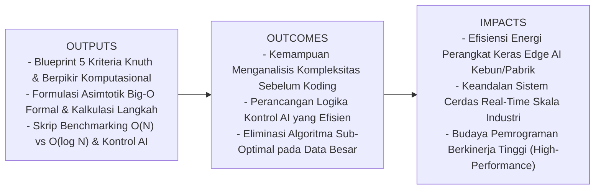
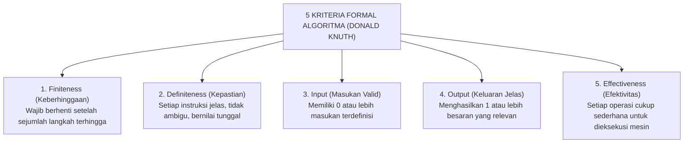
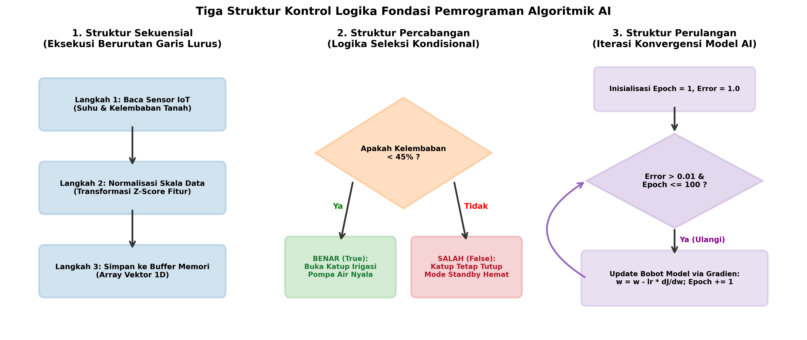
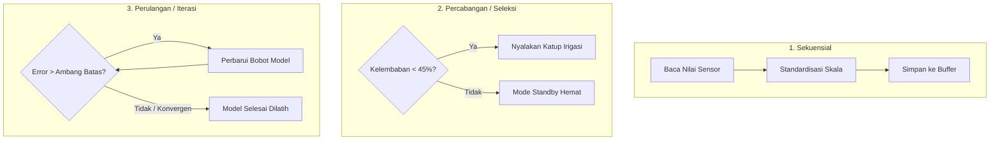
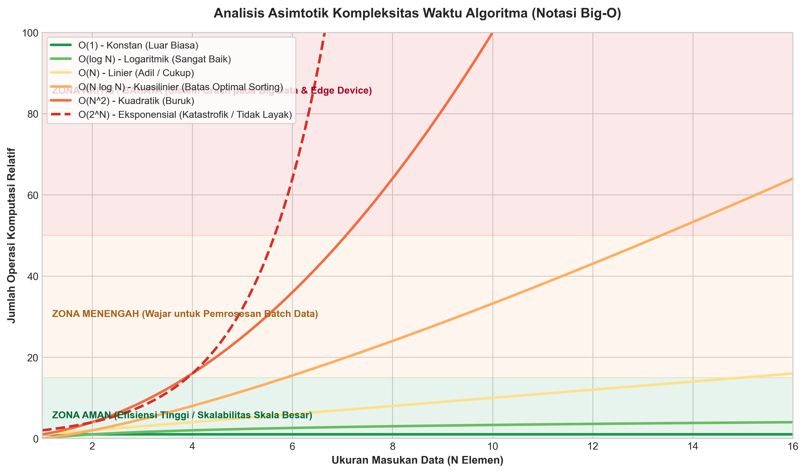

# AI Modul 2.1: Konsep Algoritma

---

## 1. Identitas & Kerangka Capaian Pembelajaran (Sub-CPMK)

* **Kode Modul**        : AI Modul 2.1
* **Mata Kuliah**       : Kecerdasan Buatan dan Sains Data Pertanian Presisi
* **Alokasi Waktu**     : 2 x 50 Menit (Kajian Teori & Diskusi) + 2 x 50 Menit (Eksplorasi Praktikum Mandiri)
* **Beban SKS**         : 3 SKS
* **Prasyarat**         : AI Modul 1.6 (Workflow AI) & Pengantar Logika Komputasi
* **Level Kognitif**    : C2 (Memahami), C3 (Menerapkan), C4 (Menganalisis)



### 1.1 Capaian Pembelajaran Khusus (Sub-CPMK)
Setelah menyelesaikan modul ini, mahasiswa dan pembelajar diharapkan mampu:
1. **Menguraikan (C2)** 5 kriteria formal Donald Knuth dan 4 pilar *Computational Thinking* sebagai landasan perancangan algoritma AI.
2. **Menganalisis (C4)** kompleksitas asimtotik waktu dan ruang menggunakan notasi Big-O formal untuk memprediksi efisiensi kode sebelum dieksekusi.
3. **Merancang (C3)** struktur logika kontrol sekuensial, percabangan, dan iterasi yang konvergen dan bebas dari *infinite loop* untuk otomasi pertanian presisi.
4. **Mengevaluasi (C4)** perbandingan efisiensi Linear Search O(N) versus Binary Search O(log N) pada katalog data bibit tanaman skala besar.

### 1.2 Kerangka Hasil Pembelajaran (Outputs, Outcomes, & Impacts)
* **Outputs (Keluaran Berwujud Langsung)**:
* **Outcomes (Hasil Capaian & Perubahan Kompetensi)**:
* **Impacts (Dampak Jangka Panjang & Nilai Guna Luas)**:

---

## 2. Hakikat Algoritma & 5 Kriteria Donald Knuth

* **Analogi Intuitif**: *Algoritma laksana sebuah resep pembuatan minyak kelapa sawit (CPO) murni di pabrik pengolahan. Jika resep tersebut berkata "rebus buah sawit secukupnya hingga terasa pas", pabrik akan bangkrut karena instruksi tersebut ambigu dan tidak terukur. Resep industri harus menyatakan: "Rebus buah sawit pada suhu $135^\circ\text{C}$ dengan tekanan uap $2.8\text{ bar}$ selama tepat 90 menit." Setiap langkah pasti, terukur, dan menghasilkan rendemen minyak yang konsisten.*

Secara akademis, pakar ilmu komputer **Donald E. Knuth** (1968) dalam karyanya *"The Art of Computer Programming"* menetapkan bahwa sebuah urutan instruksi hanya sah disebut sebagai **Algoritma** jika memenuhi **5 kriteria mutlak**:



1. **Finiteness (Keberhinggaan)**: Algoritma harus selalu berhenti setelah memproses sejumlah langkah instruksi yang berhingga (*finite steps*). Program yang terjebak dalam perulangan abadi tanpa henti (*infinite loop*) bukanlah algoritma.
2. **Definiteness (Kepastian/Ketidaksamaran)**: Setiap langkah instruksi harus terdefinisi secara presisi, tuntas, dan tidak bermakna ganda (*unambiguous*). Sebagai contoh: instruksi `x = x + 1` bersifat definit, sedangkan instruksi `naikkan nilai x kira-kira sedikit` adalah tidak definit.
3. **Input (Masukan)**: Memiliki nol atau lebih masukan yang diberikan dari luar sebelum algoritma mulai dijalankan.
4. **Output (Keluaran)**: Memiliki satu atau lebih besaran luaran yang memiliki korelasi logis dengan masukan. Algoritma tanpa keluaran adalah proses yang sia-sia.
5. **Effectiveness (Efektivitas/Keterlaksanaan)**: Setiap operasi komputasi harus cukup mendasar (*primitive enough*) sehingga secara prinsip dapat dikerjakan secara mekanis oleh prosesor komputer dalam durasi waktu yang masuk akal.

---

## 3. Empat Pilar Berpikir Komputasional (Computational Thinking) untuk AI

Sebelum menulis sebaris kode Python, seorang insinyur kecerdasan buatan harus mendayagunakan **Computational Thinking** untuk mengurai masalah kompleks dunia nyata:

| Pilar | Deskripsi Konseptual | Penerapan Nyata di Bidang Agro-Industri AI |
| :--- | :--- | :--- |
| **Dekomposisi (*Decomposition*)** | Memecah masalah raksasa yang rumit menjadi komponen-komponen sub-masalah kecil yang mandiri. | Memecah sistem *Autonomous Harvester* menjadi 3 sub-sistem: Deteksi visual buah masak, Perencanaan jalur navigasi roda, dan Kontrol lengan hidrolik pemotong. |
| **Pengenalan Pola (*Pattern Recognition*)** | Mengidentifikasi kesamaan karakteristik, tren berulang, atau regularitas di antara data. | Mengidentifikasi bahwa daun kelapa sawit yang kekurangan unsur hara Kalium selalu menunjukkan bercak bintik kuning-oranye tembus cahaya pada daun tua. |
| **Abstraksi (*Abstraction*)** | Menyaring informasi esensial dan mengabaikan detail periferal yang tidak relevan dengan pemodelan. | Dalam memprediksi kekeringan tanah, abaikan warna dedaunan kering di permukaan tanah; fokus murni pada sinyal suhu tanah dan kelembaban volumetrik sensor. |
| **Desain Algoritmik (*Algorithm Design*)** | Menyusun urutan langkah demi langkah logis untuk memecahkan masalah secara otomatis dan berulang. | Merancang *state machine*: Jika sensor mendeteksi tanah kering berturut-turut 3 jam DAN suhu $> 32^\circ\text{C}$, jalankan pompa fertigasi tetes selama 15 menit. |

---

## 4. Tiga Struktur Kontrol Logika Fundamental dalam Pemrograman AI

Setiap program komputer di dunia—dari kalkulator mini hingga model *Large Language Model* dengan ratusan miliar bobot—dibangun secara eksklusif dari kombinasi **tiga struktur kontrol dasar**:





### 4.1. Struktur Sekuensial (Sequential Execution)
Instruksi dieksekusi secara beruntun baris demi baris, dari atas ke bawah, tanpa lompatan atau pengulangan. Dalam pipa data (*data pipeline*) AI, struktur sekuensial adalah fondasi pemrosesan sinyal:
$$\text{Sensor Input} \xrightarrow{\text{Sekuens 1}} \text{Cleaning} \xrightarrow{\text{Sekuens 2}} \text{Scaling} \xrightarrow{\text{Sekuens 3}} \text{Inference}$$

### 4.2. Struktur Percabangan / Seleksi (Selection / Branching)
Alur eksekusi memilih jalur cabang tertentu berdasarkan evaluasi kondisi logika Boolean (`True` atau `False`).
* **Dalam AI Simbolik**: Merupakan basis mesin aturan (*Rule-based Expert Systems*) dan simpul keputusan (*Decision Tree Nodes*):
  $$\text{IF } (\text{Suhu} > 35^\circ\text{C} \text{ AND } \text{Curah Hujan} < 2\text{ mm}) \implies \text{Status} = \text{"Siaga 1 Karhutla"}$$
* **Dalam AI Modern**: Digunakan untuk mekanisme gerbang aktivasi (*Gating Mechanisms* seperti pada LSTM atau *Mixture-of-Experts/MoE* routing).

### 4.3. Struktur Perulangan / Iterasi (Iteration / Looping)
Sekelompok instruksi dieksekusi berulang kali selama kondisi penghenti (*termination condition*) belum terpenuhi.
* **Perulangan Berpenghitung (*Count-Controlled Loop*)**: Contoh `for epoch in range(100)` untuk melatih model selama jumlah putaran tertentu.
* **Perulangan Berkondisi (*Condition-Controlled Loop*)**: Contoh `while error > epsilon` yang mengulang kalkulasi gradien (*Gradient Descent*) hingga fungsi kerugian mencapai titik konvergensi minimum global.

---

## 5. Analisis Kompleksitas Asimtotik: Teori Notasi Big-O

Dalam ilmu komputer, performa suatu algoritma tidak diukur dengan satuan detik stopwatch, karena waktu eksekusi riil sangat dipengaruhi oleh kecepatan CPU, kapasitas RAM, dan beban sistem operasi. Sebaliknya, efisiensi diukur secara matematis berdasarkan **laju pertumbuhan jumlah operasi komputasi terhadap ukuran masukan ($N$)**, yang dikenal sebagai **Notasi Asimtotik Big-O**.

Berikut adalah spektrum kurva laju pertumbuhan Big-O:



### 5.1. Definisi Formal Matematis Big-O

Misalkan $f(N)$ adalah fungsi waktu eksekusi riil dari suatu algoritma untuk masukan berukuran $N$. Kita menyatakan bahwa:

$$f(N) \in \mathcal{O}(g(N))$$

Jika dan hanya jika terdapat konstanta positif riil $c > 0$ dan nilai ambang batas integer $N_0 > 0$ sedemikian rupa sehingga:

$$\forall N \ge N_0, \quad 0 \le f(N) \le c \cdot g(N)$$

#### 📖 Panduan Membaca Lambang Matematika:
* $\mathcal{O}$ : Simbol kaligrafi O (*Order of Magnitude*), dibaca **"Big-O dari..."** (Batas Atas Asimtotik / *Asymptotic Upper Bound*). Menjamin bahwa dalam skenario terburuk (*Worst-Case Scenario*), laju operasi tidak akan melebihi fungsi $g(N)$.
* $f(N)$ : Fungsi jumlah langkah operasi komputasi riil yang dikerjakan algoritma untuk data sebesar $N$.
* $g(N)$ : Fungsi batas pertumbuhan standar (misal: $1, \log N, N, N^2$).
* $\exists$ : Simbol logika eksistensial, dibaca **"terdapat / ada setidaknya satu"**.
* $\forall$ : Simbol logika universal, dibaca **"untuk seluruh / untuk setiap nilai"**.
* $c$ : Konstanta pengali positif ($c \in \mathbb{R}^+$).
* $N_0$ : Titik awal data masukan di mana sifat batas atas mulai berlaku secara permanen.

---

### 5.2. Tingkatan Kompleksitas Waktu Standar Industri

| Notasi Big-O | Nama Kompleksitas | Karakteristik Performa | Contoh Nyata dalam Sistem AI |
| :--- | :--- | :--- | :--- |
| $\mathcal{O}(1)$ | **Konstan** | Kecepatan instan independen dari ukuran dataset. Sangat luar biasa! | Mengakses fitur sensor via indeks array `sensor[0]` atau pencarian *Hash Table*. |
| $\mathcal{O}(\log N)$ | **Logaritmik** | Jumlah operasi bertambah sangat lambat saat data digandakan. Sangat efisien! | Pencarian Biner (*Binary Search*) pada katalog bibit sawit yang terurut, traversal *Decision Tree*. |
| $\mathcal{O}(N)$ | **Linier** | Jumlah operasi bertambah proporsional 1:1 dengan ukuran data. Adil dan wajar. | Pencarian Linear (*Linear Search*), ekstraksi rata-rata piksel citra 1D, *Single-pass filter*. |
| $\mathcal{O}(N \log N)$ | **Kuasilinier** | Batas bawah teoritis pengurutan berbasis perbandingan. Efisien untuk data besar. | *Merge Sort*, *TimSort* (algoritma sort bawaan Python), *Fast Fourier Transform* (FFT sinyal getaran). |
| $\mathcal{O}(N^2)$ | **Kuadratik** | Waktu membengkak 4x lipat jika data bertambah 2x lipat. Berbahaya untuk data besar! | *Bubble Sort*, matriks jarak Euclidean *pairwise distance* naif antar-sampel. |
| $\mathcal{O}(2^N)$ | **Eksponensial** | Komputasi meledak menjadi bencana (*intractable*). Segera menyebabkan sistem *freeze*. | Pencarian brute-force kombinasi fitur subset terbaik (*Exhaustive Feature Selection*). |

---

### 5.3. Contoh Perhitungan Numerik Langkah-demi-Langkah: Pencarian Bibit Unggul Sawit

Sebuah basis data sentral agro-industri menyimpan katalog **$N = 1.000.000$ bibit sawit** terdaftar. Sistem diminta mencari lokasi fisik bibit bernomor seri sertifikat tertentu:

#### Kasus A: Menggunakan Linear Search $\mathcal{O}(N)$
Pada skenario terburuk (*worst case*, bibit berada di urutan paling akhir atau tidak ditemukan), algoritma harus memeriksa setiap elemen satu per satu dari indeks pertama:
$$\text{Jumlah Operasi Terburuk} = N = \mathbf{1.000.000\text{ kali perbandingan}}$$

#### Kasus B: Menggunakan Binary Search $\mathcal{O}(\log_2 N)$ (Data Sudah Terurut)
Algoritma membagi ruang pencarian menjadi separuh ($50\%$) pada setiap langkah:
$$\text{Jumlah Operasi Terburuk} = \lceil \log_2(1.000.000) \rceil$$
Karena $2^{19} = 524.288$ dan $2^{20} = 1.048.576$, maka:
$$\lceil \log_2(1.000.000) \rceil = \mathbf{20\text{ kali perbandingan!}}$$

> 💡 **Analisis Efisiensi Komputasi**:  
> Dengan beralih dari Linear Search ke Binary Search, beban kerja komputasi terpangkas dari **1.000.000 langkah menjadi hanya 20 langkah**—efisiensi meningkat **50.000 kali lipat**! Pada mikrokontroler drone kebun, perbedaan ini membedakan antara respon instan dalam fraksi mikrodetik versus drone jatuh karena prosesor kehabisan waktu memproses sensor.

---

## 6. Implementasi Kode Komparatif: Benchmarking Kompleksitas & Logika Kontrol AI

Berikut adalah program Python mandiri (*self-contained*) yang mengimplementasikan:
1. Algoritma Linear Search $\mathcal{O}(N)$ vs Binary Search $\mathcal{O}(\log N)$ dengan pencatatan waktu nyata mikrodetik.
2. Pengurutan Bubble Sort $\mathcal{O}(N^2)$ vs Python TimSort $\mathcal{O}(N \log N)$ pada rekaman sensor suhu.
3. Mesin Logika Kontrol Cerdas (*Smart Irrigation Rule Engine*) yang memadukan ketiga struktur kontrol logika.

```python
# ==============================================================================
# Program: Benchmarking Kompleksitas Algoritma & Logika Kontrol AI Perkebunan
# Modul: AI Modul 2.1 - Konsep Dasar Algoritma dan Pemrograman
# Lisensi: MIT Open Educational License
# ==============================================================================

# Mengimpor modul time untuk mengukur waktu eksekusi komputasi secara presisi
import time

# Mengimpor pustaka numpy untuk kalkulasi vektor dan pembangkitan array sintetis
import numpy as np

# Menetapkan nilai seed acak agar hasil eksperimen numerik selalu konsisten
np.random.seed(42)

print("=" * 75)
print("DEMONSTRASI FUNDAMENTAL ALGORITMA: STRUKTUR KONTROL & KOMPLEKSITAS BIG-O")
print("=" * 75)

# ------------------------------------------------------------------------------
# BAGIAN 1: PENCARIAN DATA (LINEAR SEARCH O(N) VS BINARY SEARCH O(log N))
# ------------------------------------------------------------------------------
print("\n[BAGIAN 1] Benchmarking Pencarian: Linear Search O(N) vs Binary Search O(log N)")

# Membangkitkan katalog 1.000.000 ID bibit sawit terurut secara sintetis
ukuran_katalog = 1_000_000
katalog_bibit = np.arange(100_000, 100_000 + ukuran_katalog)

# Menetapkan target ID bibit yang dicari (diletakkan di bagian paling ujung untuk worst-case)
target_id = katalog_bibit[-1]

# Implementasi Algoritma Linear Search O(N)
def linear_search(array_data, target):
    langkah = 0
    for indeks in range(len(array_data)):
        langkah += 1
        if array_data[indeks] == target:
            return indeks, langkah
    return -1, langkah

# Implementasi Algoritma Binary Search O(log N)
def binary_search(array_data, target):
    langkah = 0
    kiri = 0
    kanan = len(array_data) - 1
    
    while kiri <= kanan:
        langkah += 1
        tengah = (kiri + kanan) // 2
        if array_data[tengah] == target:
            return tengah, langkah
        elif array_data[tengah] < target:
            kiri = tengah + 1
        else:
            kanan = tengah - 1
    return -1, langkah

# Menguji waktu dan langkah Linear Search
waktu_mulai = time.perf_counter()
posisi_linear, langkah_linear = linear_search(katalog_bibit, target_id)
waktu_linear = (time.perf_counter() - waktu_mulai) * 1000.0 # konversi ke milidetik

# Menguji waktu dan langkah Binary Search
waktu_mulai = time.perf_counter()
posisi_binary, langkah_binary = binary_search(katalog_bibit, target_id)
waktu_binary = (time.perf_counter() - waktu_mulai) * 1000.0 # konversi ke milidetik

print(f"-> Ukuran Dataset Masukan (N) : {ukuran_katalog:,} entitas bibit")
print(f"-> Linear Search  O(N)      : {langkah_linear:,} langkah | Waktu: {waktu_linear:.3f} ms")
print(f"-> Binary Search  O(log N)  : {langkah_binary:,} langkah      | Waktu: {waktu_binary:.4f} ms")
print(f"-> Rasio Kecepatan Asimtotik: Binary Search ~{waktu_linear / max(waktu_binary, 1e-6):.1f}x lebih cepat!")

# ------------------------------------------------------------------------------
# BAGIAN 2: PENGURUTAN DATA (BUBBLE SORT O(N^2) VS TIMSORT O(N log N))
# ------------------------------------------------------------------------------
print("\n[BAGIAN 2] Benchmarking Pengurutan: Bubble Sort O(N^2) vs TimSort O(N log N)")

# Membangkitkan sampel log sensor suhu tanah kebun acak sebanyak 2.000 data
N_sensor = 2000
log_suhu_acak = np.random.uniform(22.0, 38.0, size=N_sensor).tolist()

# Implementasi Bubble Sort O(N^2)
def bubble_sort(arr_input):
    arr = list(arr_input)
    n = len(arr)
    for i in range(n):
        for j in range(0, n - i - 1):
            if arr[j] > arr[j + 1]:
                arr[j], arr[j + 1] = arr[j + 1], arr[j]
    return arr

# Mengukur eksekusi Bubble Sort O(N^2)
waktu_mulai = time.perf_counter()
suhu_terurut_bubble = bubble_sort(log_suhu_acak)
durasi_bubble = time.perf_counter() - waktu_mulai

# Mengukur eksekusi TimSort Bawaan Python O(N log N)
waktu_mulai = time.perf_counter()
suhu_terurut_timsort = sorted(log_suhu_acak)
durasi_timsort = time.perf_counter() - waktu_mulai

print(f"-> Pengurutan {N_sensor:,} Sampel Suhu Sensor Kebun:")
print(f"   - Bubble Sort O(N^2)   : Durasi = {durasi_bubble:.4f} detik")
print(f"   - Python TimSort O(NlogN): Durasi = {durasi_timsort:.6f} detik")
print(f"   - Efisiensi TimSort    : ~{durasi_bubble / max(durasi_timsort, 1e-6):.1f}x lebih cepat!")

# ------------------------------------------------------------------------------
# BAGIAN 3: STRUKTUR KONTROL CERDAS (INTELLIGENT IRRIGATION RULE ENGINE)
# ------------------------------------------------------------------------------
print("\n[BAGIAN 3] Implementasi Logika Struktur Kontrol Cerdas (Smart Irrigation)")

# Simulasi data streaming multi-sensor kebun (Kelembaban %, Suhu °C, Radiasi W/m2)
sensor_stream = [
    {"titik": "Blok-A1", "kelembaban": 55.0, "suhu": 29.0, "radiasi": 450},
    {"titik": "Blok-A2", "kelembaban": 38.0, "suhu": 34.5, "radiasi": 780}, # Kering & Panas!
    {"titik": "Blok-A3", "kelembaban": 42.0, "suhu": 31.0, "radiasi": 520}, # Moderat Kering
    {"titik": "Blok-A4", "kelembaban": 70.0, "suhu": 26.0, "radiasi": 200}, # Basah Aman
]

# Mengiterasi seluruh sensor menggunakan struktur perulangan (Looping)
for data in sensor_stream:
    # Mengambil nilai variabel sensor secara sekuensial (Sequence)
    lokasi = data["titik"]
    rh = data["kelembaban"]
    t = data["suhu"]
    rad = data["radiasi"]
    
    # Mengevaluasi kondisi menggunakan struktur percabangan bertingkat (Branching)
    if rh < 40.0 and t > 32.0:
        status_aksi = "IRIGASI MAKSIMAL: Buka Katup 100% (Darurat Stres Air)"
        kode_warna = "[BAHAYA]"
    elif rh < 45.0 or rad > 700:
        status_aksi = "IRIGASI SEDANG  : Buka Katup 50% (Pencegahan Dehidrasi)"
        kode_warna = "[WASPADA]"
    else:
        status_aksi = "STANDBY HEMAT   : Katup Tertutup (Kondisi Tanah Lembab)"
        kode_warna = "[NORMAL]"
        
    print(f"-> {lokasi} | RH: {rh:.1f}%, Suhu: {t:.1f}°C | {kode_warna:<9} -> {status_aksi}")

print("\n" + "=" * 75)
print("Seluruh modul demonstrasi algoritma dan logika AI selesai dieksekusi.")
print("=" * 75)
```

---

## 7. Pembahasan Keterangan Penggunaan Kode (Operational Breakdown)

Berikut adalah kajian fungsional mendalam mengenai komponen algoritma di atas:

1. **Efisiensi Pembagian Wilayah Binary Search (`Lines 38-54`)**:
   * Algoritma `binary_search` memanfaatkan operator pembagian integer `(kiri + kanan) // 2` untuk menemukan indeks titik tengah secara efisien dalam waktu $\mathcal{O}(1)$.
   * Pada setiap iterasi yang gagal, ruang pencarian dipotong sebesar $50\%$ (`kiri = tengah + 1` atau `kanan = tengah - 1`). Hal ini merefleksikan prinsip matematika bahwa membagi dua masalah secara konsisten menghasilkan kedalaman pohon rekursi sebesar $\log_2(N)$. Pada $1.000.000$ entitas, algoritma menjamin tidak akan pernah berjalan lebih dari 20 perulangan!
2. **Bencana Komputasi Bubble Sort (`Lines 72-88`)**:
   * Loop bersarang ganda (`for i in range(n)` di luar dan `for j in range(0, n - i - 1)` di dalam) menghasilkan total perbandingan kuadratik:
     $$\sum_{i=1}^{N-1} (N - i) = \frac{N(N - 1)}{2} = \frac{2000 \times 1999}{2} \approx 2.000.000\text{ operasi!}$$
   * Jika jumlah data ditingkatkan 10 kali lipat ($N=20.000$), waktu Bubble Sort membengkak 100 kali lipat (dari 0.2 detik menjadi 20 detik!). Sebaliknya, algoritma `TimSort` Python menggunakan teknik hibrida *Merge Sort* dan *Insertion Sort* yang mempertahankan laju stabil di $\mathcal{O}(N \log N)$.
3. **Penyusunan Logika Kontrol Multi-Sensor (`Lines 95-125`)**:
   * Blok percabangan `if ... elif ... else` mendemonstrasikan evaluasi operator logika Boolean majemuk (`and` dan `or`).
   * Kondisi paling kritis (`rh < 40.0 and t > 32.0`) sengaja diletakkan pada cabang paling atas (*short-circuit evaluation*), memastikan kondisi bahaya ditangani dengan prioritas absolut sebelum kondisi peringatan umum diperiksa.

---

## 8. Pertanyaan HOTS (Higher-Order Thinking Skills)

1. **Analisis Skalabilitas Edge Drone Pertanian**:  
   Sebuah drone pengawas perkebunan diprogram untuk mencocokkan wajah daun sakit dengan pustaka referensi hama menggunakan dua algoritma berbeda:
   * Algoritma A: Kompleksitas Waktu $\mathcal{O}(N \log N)$, Kompleksitas Memori $\mathcal{O}(1)$.
   * Algoritma B: Kompleksitas Waktu $\mathcal{O}(N)$, Kompleksitas Memori $\mathcal{O}(N^2)$.  
   Jika modul mikroprosesor pada drone hanya memiliki memori RAM sebesar $512\text{ MB}$, namun harus memproses basis data sebesar $N = 100.000$ vektor fitur daun, analisislah algoritma mana yang akan berhasil berjalan di udara dan mana yang akan memicu kegagalan memori (*Out-of-Memory / OOM Crash*)!

2. **Dilema Rekursif vs Iteratif dalam Komputasi AI**:  
   Dalam merancang penelusuran pohon keputusan (*Decision Tree Traversal*), pengembang dapat menulis fungsi secara rekursif (*Recursive Function*) atau menggunakan perulangan iteratif dengan tumpukan memori eksplisit (*Iterative Loop with Explicit Stack*). Tinjau kedua pendekatan ini dari perspektif *Call Stack Overhead* pada arsitektur perangkat keras berdaya rendah, serta risiko terjadinya *Stack Overflow* saat pohon keputusan memiliki kedalaman ribuan simpul!

---

## 9. Tantangan Praktik Berscaffolding (Hands-On Challenges)

### Tingkat 1: Pemula (Scaffolded - Modifikasi Nilai Target Pencarian)
Ujilah algoritma `binary_search` pada Bagian 1 skrip di atas dengan mencari target yang berada tepat di tengah-tengah dataset (`target_id = katalog_bibit[len(katalog_bibit)//2]`). Berapa jumlah langkah yang dibutuhkan algoritma? Mengapa pada skenario terbaik (*best case*) Binary Search dapat selesai dalam $\mathcal{O}(1)$?

### Tingkat 2: Menengah (Implementasi Algoritma Pengurutan Insertion Sort)
Tulis sebuah fungsi Python mandiri `insertion_sort(arr)` untuk mengurutkan data sensor suhu kebun. Ujilah pada data yang sudah hampir terurut (*nearly sorted data*). Buktikan secara empiris bahwa pada data yang hampir terurut, *Insertion Sort* dapat bekerja sangat cepat mendekati kompleksitas linier $\mathcal{O}(N)$, mengalahkan algoritma *Quick Sort*!

### Tingkat 3: Mahir (Perancangan State Machine Otonom untuk Traktor Kebun)
Rancang sebuah kelas Python berorientasi objek `class AutonomousTractorFSM` (*Finite State Machine*) yang memiliki 4 status (*States*): `IDLE`, `NAVIGATING`, `HARVESTING`, dan `OBSTACLE_AVOIDANCE`. Gunakan struktur kontrol percabangan dan perulangan untuk menggerakkan traktor melewati matriks koordinat kebun $5 \times 5$. Jika traktor mendeteksi halangan (pohon tumbang) pada koordinat tertentu, traktor harus beralih status ke `OBSTACLE_AVOIDANCE`, mencari rute alternatif, dan melanjutkan panen hingga selesai tanpa *infinite loop*!

---

## 10. Glosarium Istilah Fondasi Pemrograman AI

* **Algorithm (Algoritma)**: Urutan langkah-langkah logis dan terhingga yang didefinisikan secara presisi untuk memecahkan suatu masalah komputasi tertentu.
* **Computational Thinking**: Pendekatan pemecahan masalah kognitif yang memadukan dekomposisi, pengenalan pola, abstraksi, dan desain algoritmik untuk merancang solusi yang dapat dieksekusi oleh mesin.
* **Big-O Notation ($\mathcal{O}$)**: Notasi matematika asimtotik yang mendeskripsikan batas atas (*upper bound*) dari laju pertumbuhan waktu eksekusi atau kebutuhan memori suatu algoritma terhadap ukuran masukan data ($N$).
* **Time Complexity**: Ukuran kuantitatif jumlah langkah operasi elementer yang dilakukan oleh algoritma sebagai fungsi dari panjang masukan.
* **Space Complexity**: Ukuran jumlah memori fisik tambahan yang dialokasikan oleh algoritma selama siklus eksekusinya di luar memori masukan itu sendiri.
* **Finite State Machine (FSM)**: Model komputasi abstrak yang terdiri dari sejumlah status terbatas, transisi antar-status, dan aksi yang dieksekusi berdasarkan masukan lingkungan, sangat umum digunakan dalam kontrol robotika AI.

---

## 11. Jembatan Konseptual ke Modul Berikutnya (Modul 2.2)

Dengan dikuasainya pemahaman fondasional mengenai hakikat algoritma, lima kriteria Donald Knuth, tiga struktur kontrol logika dasar, serta analisis asimtotik Notasi Big-O, kita kini memiliki kerangka berpikir analitis untuk mengevaluasi efisiensi logika komputasi.

Namun, logika algoritma abstrak membutuhkan wadah penyimpanan data yang terstruktur di dalam memori komputer:

> *"Bagaimana cara komputer mengorganisasi jutaan data sensor perkebunan, piksel citra drone, atau bobot jaringan saraf tiruan di dalam RAM secara efisien sehingga dapat diakses dalam waktu $\mathcal{O}(1)$ atau $\mathcal{O}(\log N)$?"*

Pada **AI Modul 2.2: Tipe Data dan Struktur Data untuk Kecerdasan Buatan**, kita akan membedah secara mendalam struktur data primitif dan linier: *Array, List, Tuple, Dictionary/Hash Table, Stack, Queue*, serta struktur data non-linier tingkat lanjut (*Tree, Graph, Tensor Multi-Dimensi*) yang menjadi tulang punggung representasi data dalam *Machine Learning* dan *Deep Learning*.

---

## 12. Daftar Pustaka dan Referensi Akademik

1. Knuth, D. E. (1997). *The Art of Computer Programming, Volume 1: Fundamental Algorithms* (3rd ed.). Addison-Wesley. Boston, MA.
2. Cormen, T. H., Leiserson, C. E., Rivest, R. L., & Stein, C. (2022). *Introduction to Algorithms* (4th ed.). MIT Press. Cambridge, MA.
3. Wing, J. M. (2006). Computational thinking. *Communications of the ACM*, 49(3), 33-35.
4. Sedgewick, R., & Wayne, K. (2011). *Algorithms* (4th ed.). Addison-Wesley Professional.
5. Russell, S., & Norvig, P. (2020). *Artificial Intelligence: A Modern Approach* (4th ed.). Pearson Education. Boston.
