# AI Modul 2.2: Flowchart dan Pseudocode

---

## 1. Identitas & Kerangka Capaian Pembelajaran (Sub-CPMK)

* **Kode Modul**        : AI Modul 2.2
* **Mata Kuliah**       : Kecerdasan Buatan dan Sains Data Pertanian Presisi
* **Alokasi Waktu**     : 2 x 50 Menit (Kajian Teori & Diskusi) + 2 x 50 Menit (Eksplorasi Praktikum Mandiri)
* **Beban SKS**         : 3 SKS
* **Prasyarat**         : AI Modul 2.1 (Konsep Algoritma)
* **Level Kognitif**    : C2 (Memahami), C3 (Menerapkan), C4 (Menganalisis)

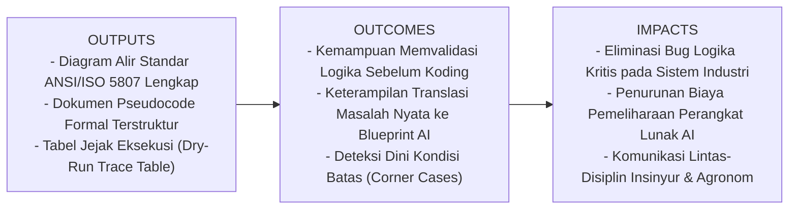

### 1.1 Capaian Pembelajaran Khusus (Sub-CPMK)
Setelah menyelesaikan modul ini, mahasiswa dan pembelajar diharapkan mampu:
1. **Mengidentifikasi (C2)** standar simbol grafis diagram alir ANSI/ISO dan konvensi penulisan *pseudocode* terstruktur.
2. **Menganalisis (C4)** alur proses fisik sortasi TBS dan sistem interlock keselamatan pabrik kelapa sawit ke dalam representasi logika grafis.
3. **Merancang (C3)** diagram alir (*flowchart*) dan teks *pseudocode* sistem kendali otomasi agro-industri yang bebas ambiguitas.
4. **Mentransformasikan (C3)** rancangan diagram alir dan pseudocode menjadi kode program Python yang siap dieksekusi.

### 1.2 Kerangka Hasil Pembelajaran (Outputs, Outcomes, & Impacts)
* **Outputs (Keluaran Berwujud Langsung)**:
  * **Dokumen Spesifikasi Diagram Alir ANSI/ISO 5807**: Penguasaan perancangan alur pemrosesan cerdas berstandar internasional yang mencakup penggunaan presisi 8 simbol utama (*Terminator*, *Process*, *Decision*, *Input/Output*, *Preparation*, *Connector On-Page*, *Predefined Process*, dan *Off-Page Connector*).
  * **Dokumen Pseudocode Formal Terstruktur**: Spesifikasi tekstual independen bahasa menggunakan konvensi akademik baku (kata kunci kapital `START`, `INPUT`, `COMPUTE`, `IF-THEN-ELSE`, `WHILE-DO`, `END`), indentasi hierarkis 4 spasi, deklarasi tipe data terstruktur, dan penamaan variabel deskriptif.
  * **Matriks Tabel Jejak (*Dry-Run Trace Table Engine*)**: Lembar audit pengujian kering langkah-demi-langkah yang memetakan mutasi status variabel, evaluasi predikat kondisional (*Boolean branch*), serta pembuktian mekanisme *short-circuit evaluation* pada data uji heterogen.
* **Outcomes (Hasil Capaian & Perubahan Kompetensi)**:
  * **Kompetensi Perancangan Cetak Biru Logika (*Algorithmic Blueprinting*)**: Mahasiswa mampu memvisualisasikan masalah agronomis kompleks (seperti sortasi tandan buah segar dan penanganan sensor anomali) ke dalam skema diagramatik yang rapi dan terverifikasi sebelum menulis satu baris pun kode sintaks bahasa pemrograman.
  * **Keterampilan Translasi Lintas-Representasi (*Three-Way Representation Translation*)**: Mahasiswa terampil mengonversi instruksi bahasa alami yang ambigu menjadi diagram alir visual, merumuskannya ke pseudocode semi-formal, dan mengimplementasikannya ke bahasa Python tingkat produksi.
  * **Ketajaman Verifikasi Kondisi Batas (*Edge-Case Verification*)**: Mahasiswa mampu mendeteksi potensi *infinite loop* (misal: akibat galat presisi *floating-point* pada kondisi berhenti) dan memitigasi anomali data melalui perancangan cabang penanganan darurat (*fallback branch*) yang kokoh.
* **Impacts (Dampak Jangka Panjang & Nilai Guna Luas)**:
  * **Keandalan Eksekusi Sistem Otomasi Industri**: Menjamin sistem sortasi buah di pabrik kelapa sawit dan kontrol otonom drone perkebunan tidak mengalami kegagalan fatal (*system freeze* atau kerusakan mekanik aktuator) saat dioperasikan secara non-stop 24/7.
  * **Efisiensi Rekayasa & Penurunan Rework Cost**: Memangkas waktu *debugging* hingga 60% dalam siklus pengembangan perangkat lunak AI karena seluruh celah logika arsitektural telah terselesaikan pada fase perancangan awal.
  * **Standarisasi Kolaborasi Multidisiplin Agro-Industri**: Terciptanya bahasa komunikasi teknis yang seragam antara ilmuwan data, insinyur perangkat keras, analis sistem, dan agronom lapangan.

---

## 2. Analogi Dunia Nyata: Cetak Biru Arsitektur & SOP Pabrik Kelapa Sawit (PKS)

Bayangkan proses pendirian sebuah **Pabrik Kelapa Sawit (PKS)** modern berkapasitas 60 ton TBS per jam. 

1. **Bahasa Alami (*Natural Language*):** Pemilik perkebunan berkata kepada tim konsultan: *"Tolong bangunkan pabrik yang bisa memisahkan buah sawit mentah dan matang, lalu merebus buah matang dengan uap tekanan tinggi, dan membuang buah busuk ke penampungan kompos."*  
   *Kelemahan:* Instruksi ini ambigu. Berapa tekanan uapnya? Bagaimana kriteria buah matang? Apa yang terjadi jika suplai uap turun mendadak?
2. **Flowchart (Cetak Biru Diagramatik / PFD - *Process Flow Diagram*):** Insinyur teknik mesin dan kimia membuat diagram alir proses bersimbol standar. Simbol tangki, pipa, katup pengatur, dan sensor tekanan digambarkan dengan panah arah alir material. Setiap teknisi di lapangan—meski berbeda bahasa ibu—dapat melihat bahwa setelah stasiun sortasi (belah ketupat penguji), aliran buah terbelah dua: satu jalur menuju *sterilizer* (perebusan) dan satu jalur menuju area penampungan janjang kosong.
3. **Pseudocode (Prosedur Operasi Standar / SOP Teknis Tertulis):** Kepala teknisi menyusun lembar SOP operasional berurutan:
   ```text
   BACA sensor_suhu
   JIKA suhu > 140 CELSIUS MAKA
       TUTUP katup_uap_utama
       AKTIFKAN alarm_peringatan
   LAINNYA
       PERTAHANKAN tekanan_uap
   AKHIR-JIKA
   ```
   Instruksi ini tidak bergantung pada apakah katup digerakkan oleh motor listrik Siemens, aktuator pneumatik Festo, atau tuas mekanis manual.
4. **Source Code (Program Python / PLC Ladder Logic):** Terjemahan konkret SOP ke dalam bahasa instruksi mikrokontroler atau komputer industri yang siap dieksekusi mesin.

> **Pesan Inti Pedagogis:**  
> Menulis kode program tanpa membuat *flowchart* atau *pseudocode* terlebih dahulu diibaratkan membangun dinding bata pabrik tanpa cetak biru arsitek. Anda mungkin bisa mendirikan satu dinding kecil, tetapi ketika membangun instalasi industri berskala masif, dinding tersebut akan runtuh akibat kesalahan struktur dasar yang tak terdeteksi.

---

## 3. Landasan Teori Komprehensif

### 3.1 Standar ANSI/ISO 5807 untuk Simbol Diagram Alir

Diagram alir (*flowchart*) bukanlah gambar sketsa bebas. Pada tahun 1985, *International Organization for Standardization* (ISO) bersama *American National Standards Institute* (ANSI) menetapkan standar **ANSI/ISO 5807:1985** (*Information processing — Documentation symbols and conventions for data, program and system flowcharts*).

Berikut adalah pengelompokan simbol utama yang wajib digunakan dalam perancangan algoritma dan sistem kecerdasan buatan:

| No | Nama Simbol ANSI | Bentuk Geometris | Fungsi & Semantik Operasional | Contoh Penggunaan dalam AI |
| :---: | :--- | :--- | :--- | :--- |
| 1 | **Terminator** | Persegi Panjang Membulat (*Oval / Stadium*) | Menandai titik awal (*entry point*) atau titik akhir (*exit point*) dari program atau sub-rutin. | `START`, `STOP`, `RETURN True` |
| 2 | **Process** | Persegi Panjang (*Rectangle*) | Operasi pengolahan data tunggal atau sekuensial, manipulasi variabel, atau operasi kalkulasi matematis. | `Normalisasi citra matriks`, `bobot = bobot - alpha * gradien` |
| 3 | **Decision** | Belah Ketupat (*Rhombus / Diamond*) | Percabangan kondisional berdasarkan evaluasi logika *Boolean* (hanya memiliki satu panah masuk dan minimal dua panah keluar berlabel: Ya/Tidak). | `Apakah confidence >= 0.85?`, `Apakah iterasi < max_iter?` |
| 4 | **Input / Output** | Jajaran Genjang (*Parallelogram*) | Operasi pemasukan data dari perangkat luar (kamera, sensor IoT) atau pengeluaran informasi ke pengguna/aktuator. | `BACA frame kamera CCTV`, `TAMPILKAN label prediksi`, `KIRIM sinyal aktuator` |
| 5 | **Preparation** | Segi Enam (*Hexagon*) | Langkah inisialisasi parameter, alokasi memori, atau penyiapan variabel kontrol indeks loop. | `Inisialisasi epoch = 1`, `Set ambang batas theta = 0.5` |
| 6 | **Connector (On-Page)** | Lingkaran Kecil (*Circle*) | Titik sambungan percabangan/perulangan dalam satu halaman visual untuk mencegah garis silang. | Lingkaran berlabel huruf kapital: `[A]`, `[B]` |
| 7 | **Predefined Process** | Persegi Panjang Bergaris Ganda Samping | Pemanggilan subrutin eksternal (*function call*) yang logikanya telah didefinisikan secara terpisah. | `DeteksiObjek_YOLOv8(frame)`, `HitungMatrixKonfusi()` |
| 8 | **Off-Page Connector** | Segi Lima Mengarah ke Bawah (*Pentagon*) | Penghubung alur diagram alir yang berpindah ke halaman dokumen atau lembar kerja lain. | Label tujuan halaman: `Hal. 2 [A]`, `Hal. 3 [B]` |

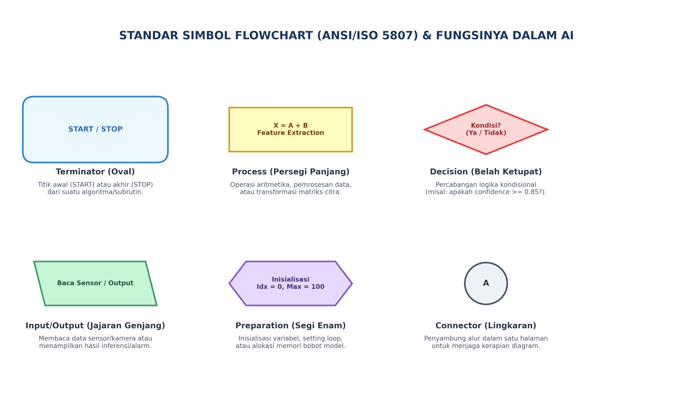

---

### 3.2 Anatomi Rinci dan Karakteristik Simbol Diagram Alir

Untuk menjamin pemahaman presisi dan menghindari kesalahan perancangan, berikut adalah spesifikasi teknis dan anatomi visual dari masing-masing simbol diagram alir:

#### 1. Terminator (Start / Stop)
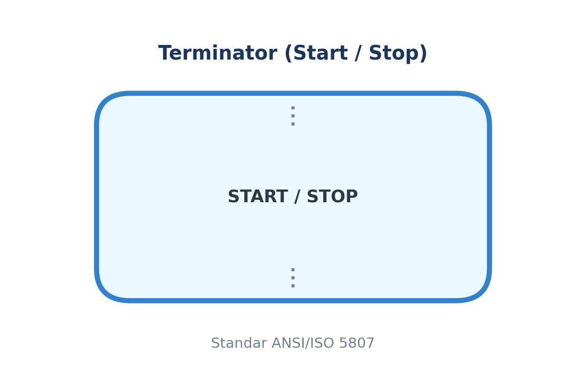

* **Karakteristik Geometris:** Berbentuk elips lonjong atau persegi panjang dengan sudut membulat sempurna (*stadium shape*).
* **Aturan Aliran (*Flow Rule*):**
  * Simbol `START` **hanya memiliki 1 panah keluar** (tidak boleh memiliki panah masuk).
  * Simbol `STOP/END` **hanya memiliki panah masuk** (tidak boleh memiliki panah keluar).
* **Peran dalam AI:** Menandai inisiasi proses inferensi (misal: saat kamera aktif menerima frame video) dan terminasi aman (*graceful shutdown*) sistem saat operasi selesai.

#### 2. Process (Pemrosesan Data Komputasional)
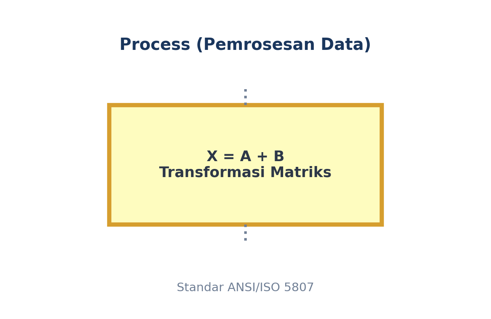

* **Karakteristik Geometris:** Persegi panjang bersudut siku-siku $90^\circ$.
* **Aturan Aliran (*Flow Rule*):** Memiliki tepat **1 panah masuk** dan **1 panah keluar**.
* **Peran dalam AI:** Melakukan operasi matematis deterministik, seperti konversi ruang warna citra dari BGR ke RGB, normalisasi nilai piksel ke selang $[0, 1]$, perkalian bobot matriks tensor, atau pembaruan nilai variabel akumulator.

#### 3. Decision (Percabangan Kondisional Logika)
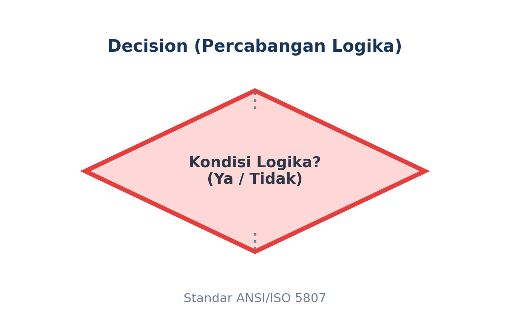

* **Karakteristik Geometris:** Belah ketupat (*rhombus*) bersimetri diagonal.
* **Aturan Aliran (*Flow Rule*):** Memiliki **1 panah masuk** dan **minimal 2 panah keluar**. Setiap panah keluar **wajib diberi label kondisi eksplisit** (`Ya/Tidak`, `True/False`, atau nilai diskret seperti `Grade A/Grade B/Grade C`).
* **Peran dalam AI:** Titik pengambilan keputusan berbasis ambang batas probabilitas model AI (*confidence score thresholding*) atau verifikasi integritas data sensor sebelum diteruskan ke aktuator.

#### 4. Input / Output (I/O Data & Aktuasi)
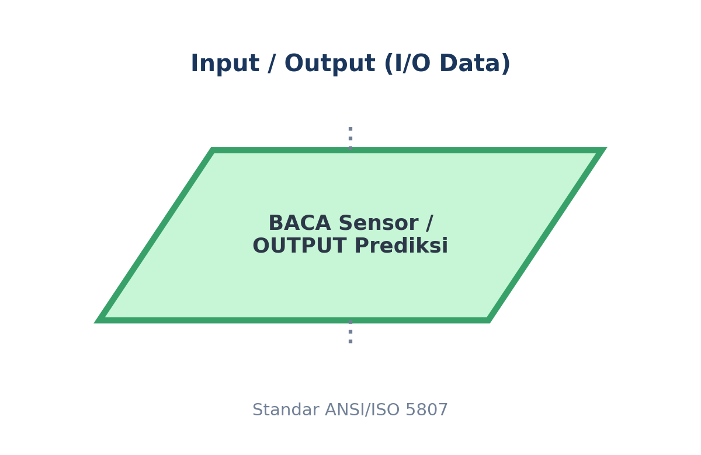

* **Karakteristik Geometris:** Jajaran genjang miring (*parallelogram*) dengan sudut kemiringan sisi sekitar $75^\circ$.
* **Aturan Aliran (*Flow Rule*):** Memiliki tepat **1 panah masuk** dan **1 panah keluar**.
* **Peran dalam AI:** Mengakuisisi masukan dari lingkungan fisik (seperti pembacaan sensor kelembaban tanah atau penangkapan citra dari kamera CCTV) serta mengirimkan instruksi ke dunia fisik (seperti menampilkan hasil klasifikasi ke monitor operator atau mengirim pulsa PWM ke katup pneumatik).

#### 5. Preparation (Inisialisasi Parameter & Variabel)
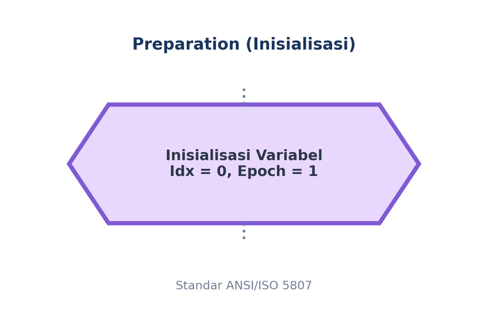

* **Karakteristik Geometris:** Segi enam memanjang (*hexagon*).
* **Aturan Aliran (*Flow Rule*):** Memiliki tepat **1 panah masuk** dan **1 panah keluar**.
* **Peran dalam AI:** Menetapkan nilai awal parameter sebelum perulangan pelatihan (*training loop*) atau inferensi dimulai, misalnya `epoch = 1`, `learning_rate = 0.001`, atau `threshold = 0.85`.

#### 6. Connector On-Page (Penghubung Se-Halaman)
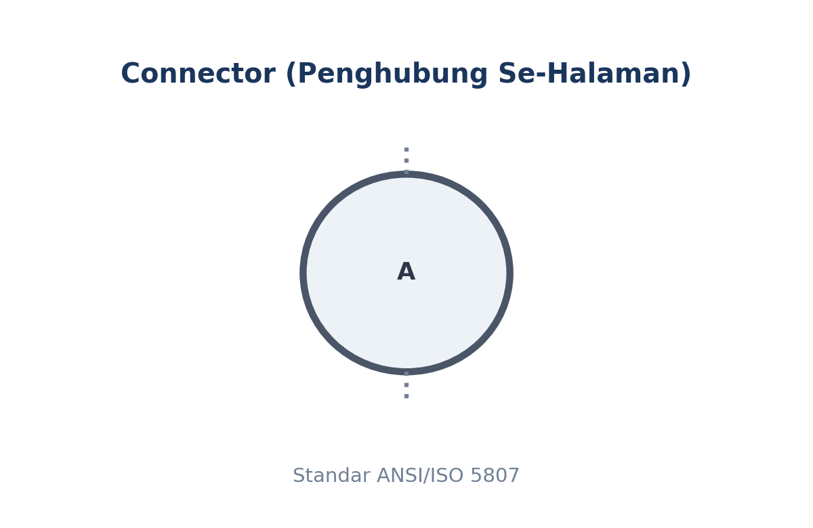

* **Karakteristik Geometris:** Lingkaran kecil berdiameter 1-2 cm dengan label huruf kapital di dalamnya.
* **Aturan Aliran (*Flow Rule*):** Berpasangan; satu konektor menerima panah masuk (*source*), dan pasangannya memancarkan panah keluar (*destination*).
* **Peran dalam AI:** Menghubungkan jalur perulangan (*feedback loop*) dari bagian bawah kembali ke bagian atas diagram tanpa memotong garis alir lainnya, menjaga kerapian arsitektur.

#### 7. Predefined Process (Subrutin / Pemanggilan Fungsi)
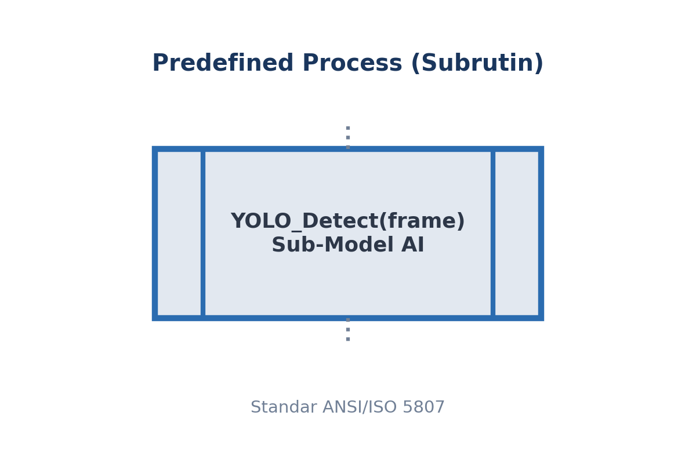

* **Karakteristik Geometris:** Persegi panjang dengan garis vertikal ganda di sisi kiri dan kanan.
* **Aturan Aliran (*Flow Rule*):** Memiliki tepat **1 panah masuk** dan **1 panah keluar**.
* **Peran dalam AI:** Mengabstraksikan modul komputasi kompleks (seperti modul deteksi objek YOLOv8 atau algoritma pencarian rute drone A*) agar diagram alir utama tetap ringkas, bersih, dan mudah diaudit.

#### 8. Off-Page Connector (Penghubung Antar-Halaman)
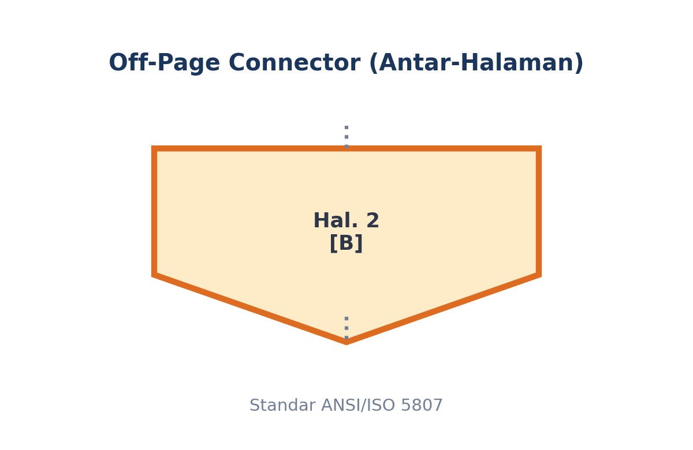

* **Karakteristik Geometris:** Segi lima menyerupai pita atau rumah terbalik dengan ujung meruncing ke bawah.
* **Aturan Aliran (*Flow Rule*):** Menghubungkan diagram yang terputus di akhir halaman dengan kelanjutannya di awal halaman baru.
* **Peran dalam AI:** Digunakan dalam dokumen spesifikasi teknis industri berskala besar di mana arsitektur AI mencakup beberapa fase berurutan di lembar terpisah.

---

### 3.3 Kaidah Tata Letak dan Validitas Struktural Flowchart

Sebuah *flowchart* dikatakan memiliki validitas struktural (*structural soundness*) jika memenuhi aksioma rekayasa perangkat lunak berikut:
1. **Arah Aliran Dominan:** Aliran utama proses harus bergerak dari **atas ke bawah (*top-down*)** atau dari **kiri ke kanan (*left-to-right*)**.
2. **Determinisme Jalur Terminator:** Tepat harus ada **satu** simbol `START` sebagai pintu masuk tunggal, dan minimal satu simbol `END/STOP`.
3. **Integritas Simbol Keputusan (*Decision Integrity*):** Simbol *Decision* wajib memiliki panah keluar yang dilabeli secara eksplisit (`Ya`/`Tidak` atau `True`/`False`). Tidak boleh ada panah keluar yang ambigu.
4. **Larangan Garis Bersilang (*Crossed-line Prohibition*):** Garis alir (*flowlines*) tidak boleh saling memotong. Jika layout diagram padat, wajib menggunakan simbol *Connector* lingkaran.

---

### 3.3 Konvensi Penulisan Pseudocode Formal

*Pseudocode* adalah deskripsi tingkat tinggi dari algoritma komputasi yang menggunakan konvensi struktural bahasa pemrograman formal, namun dirancang agar dapat dibaca dengan mudah oleh manusia tanpa terikat batasan sintaksis spesifik (seperti titik koma, tanda kurung kurawal, atau *type casting* kaku).

Pedoman penulisan pseudocode akademik standar:
1. **Kapitalisasi Kata Kunci Instruksi:** Kata kunci operasional wajib ditulis dalam huruf besar (*uppercase*), misal: `START`, `END`, `INPUT`, `READ`, `OUTPUT`, `PRINT`, `SET`, `COMPUTE`, `IF`, `THEN`, `ELSE`, `ENDIF`, `WHILE`, `DO`, `ENDWHILE`, `FOR`, `TO`, `STEP`, `ENDFOR`.
2. **Hierarki Indentasi Terstruktur:** Setiap blok kode yang berada di dalam percabangan atau perulangan wajib digeser menjorok ke dalam sebanyak 4 spasi untuk memperlihatkan cakupan (*scope*) kontrol.
3. **Penamaan Variabel Deskriptif (*Self-Documenting*):** Gunakan konvensi penamaan yang mencerminkan makna fisik, misalnya `skor_kematangan_tbs`, bukan variabel satu huruf `s`.
4. **Penutupan Blok Eksplisit:** Setiap struktur kontrol majemuk wajib memiliki penutup eksplisit (`ENDIF`, `ENDWHILE`, `ENDFOR`) untuk mencegah ambiguitas hierarki.

#### Tabel Komparasi Format Representasi Algoritma

| Dimensi Evaluasi | Bahasa Alami (*Natural Language*) | Diagram Alir (*Flowchart*) | *Pseudocode* | Kode Sumber (*Python*) |
| :--- | :--- | :--- | :--- | :--- |
| **Bentuk Representasi** | Paragraf naratif bebas | Grafis diagram geometris | Teks terstruktur semi-formal | Teks sintaksis mesin |
| **Keterbacaan Non-Programmer** | Sangat Tinggi | Sangat Tinggi (Visual) | Sedang | Rendah |
| **Ketepatan Logika (*Precision*)**| Rendah (Banyak ambiguitas) | Tinggi | Sangat Tinggi | Mutlak (Deterministik) |
| **Kecepatan Modifikasi Desain** | Cepat | Lambat (Perlu menggambar ulang)| Cepat (Edit teks langsung) | Sedang (Terkendala *bugs*) |
| **Kesesuaian dengan IDE Mesin** | Tidak dapat dieksekusi | Tidak dapat dieksekusi | Tidak dapat dieksekusi | Dieksekusi langsung oleh interpreter |

---

## 4. Formulasi Matematis, Notasi Formal, & Panduan Baca Lambang

Dalam konteks kecerdasan buatan, diagram alir dan pseudocode merepresentasikan **Fungsi Pemetaan Keputusan (*Decision Mapping Function*)**.

Misalkan sebuah model *Deep Learning* visi komputer memproses citra Tandan Buah Segar kelapa sawit $x \in \mathbb{R}^{H \times W \times C}$. Model mengeluarkan nilai probabilitas kematangan $P(x) \in [0, 1]$. Keputusan aksi aktuasi mekanis penyortiran $S(x)$ dimodelkan sebagai fungsi *piecewise* (sepotong-sepotong) terputus:

$$S(x) = \begin{cases} \text{"Grade A (Matang)"} & \text{jika } P(x) \ge \theta_{\text{high}} \\ \text{"Grade B (Mengkal)"} & \text{jika } \theta_{\text{low}} \le P(x) < \theta_{\text{high}} \\ \text{"Grade C (Mentah)"} & \text{jika } P(x) < \theta_{\text{low}} \end{cases}$$

Di mana parameter ambang batas keputusan (*decision thresholds*) dikonfigurasi sebagai:
$$\theta_{\text{high}} = 0.85, \quad \theta_{\text{low}} = 0.50$$

---

### Panduan Membaca Lambang Matematika

Untuk memastikan kelancaran pemahaman notasi formal di atas, bacalah lambang-lambang tersebut sebagai berikut:

| Lambang / Notasi | Cara Pengucapan / Pembacaan Akademik | Makna Konseptual dalam Rekayasa AI |
| :--- | :--- | :--- |
| $x \in \mathbb{R}^{H \times W \times C}$ | "*x elemen himpunan bilangan riil berdimensi H kali W kali C*" | Masukan citra digital berukuran Tinggi ($H$), Lebar ($W$), dan Kanal Warna ($C$, biasanya 3 untuk Red-Green-Blue). |
| $P(x) \in [0, 1]$ | "*P dari x elemen selang tertutup nol sampai satu*" | Nilai estimasi probabilitas statistik yang dihasilkan lapisan *Softmax* atau *Sigmoid* model AI, selalu berada di antara 0% hingga 100%. |
| $S(x)$ | "*Fungsi status S terhadap masukan x*" | Label keputusan akhir sistem kontrol atau perintah aktuator mekanik terhadap buah yang diperiksa. |
| $\{ \dots \}$ | "*Kurung kurawal sistem fungsi sepotong-sepotong (piecewise)*" | Menyatakan percabangan kondisi logika majemuk (*multi-branch if-else*). |
| $\theta_{\text{high}}$ | "*Theta sub high*" | Nilai ambang batas atas batas minimal kelayakan kelas mutu Grade A (misal: 0.85 atau 85%). |
| $\theta_{\text{low}}$ | "*Theta sub low*" | Nilai ambang batas bawah yang memisahkan kelas mutu Grade B dan Grade C (misal: 0.50 atau 50%). |
| $\ge$ | "*Lebih dari atau sama dengan*" | Operator relasional pembanding yang menguji batas inklusif atas. |
| $\le$ | "*Kurang dari atau sama dengan*" | Operator relasional pembanding yang menguji batas inklusif bawah. |
| $<$ | "*Kurang dari*" | Operator relasional pembanding batas ketat eksklusif. |

---

## 5. Studi Kasus Komprehensif: Sistem Sortasi TBS Kelapa Sawit Berbasis Visi AI

Mari kita telusuri siklus perancangan lengkap dari deskripsi masalah, representasi flowchart visual, representasi pseudocode terstruktur, hingga simulasi penelusuran status variabel (*dry run*).

### 5.1 Diagram Alir Algoritma (Mermaid Diagram)

Alur logika penyortiran buah kelapa sawit di atas ban konveyor pabrik digambarkan dalam diagram alir berikut:

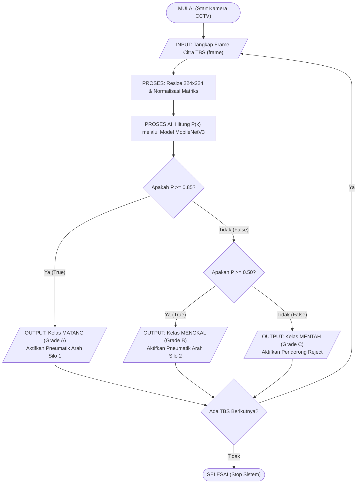

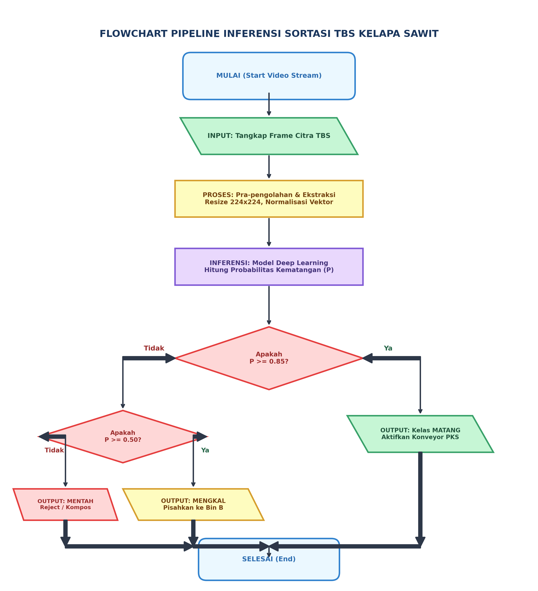

---

### 5.2 Pseudocode Terstruktur Formal

Berikut adalah terjemahan dari *flowchart* di atas ke dalam format *pseudocode* terstandarisasi:

```text
ALGORITMA Sortasi_TBS_Otomatis
DEKLARASI:
    frame               : Matrix_Citra
    probabilitas_matang : Float
    ambang_tinggi       : Float
    ambang_rendah       : Float
    status_sensor_konveyor : Boolean
    keputusan_sortasi   : String

INISIALISASI:
    SET ambang_tinggi <- 0.85
    SET ambang_rendah <- 0.50

START
    BACA status_sensor_konveyor
    
    WHILE status_sensor_konveyor == True DO
        INPUT frame DARI kamera_inspeksi
        
        // Tahap pra-pemrosesan citra digital
        COMPUTE citra_ternormalisasi <- Preprocessing(frame)
        
        // Inferensi model jaringan syaraf tiruan
        COMPUTE probabilitas_matang <- Model_MobileNetV3_Infer(citra_ternormalisasi)
        
        // Logika percabangan penentuan mutu TBS
        IF probabilitas_matang >= ambang_tinggi THEN
            SET keputusan_sortasi <- "GRADE_A_MATANG"
            OUTPUT "Aktifkan aktuator pemilah ke Konveyor Utama (PKS)"
        ELSE IF probabilitas_matang >= ambang_rendah THEN
            SET keputusan_sortasi <- "GRADE_B_MENGKAL"
            OUTPUT "Aktifkan aktuator pemilah ke Area Pemeraman"
        ELSE
            SET keputusan_sortasi <- "GRADE_C_MENTAH"
            OUTPUT "Aktifkan aktuator penolak (Reject Bin)"
        ENDIF
        
        PRINT "Hasil Pemilahan: ", keputusan_sortasi, " (Probabilitas: ", probabilitas_matang, ")"
        
        BACA status_sensor_konveyor
    ENDWHILE
    
    PRINT "Operasi sortasi selesai. Sistem memasuki status standby."
END
```

---

### 5.3 Simulasi Penelusuran Langkah Manual (Trace Table / Dry Run)

Pengujian kering (*dry-run*) adalah metode validasi matematis di atas kertas untuk membuktikan bahwa alur percabangan tidak memiliki celah logika sebelum diuji pada lini produksi sesungguhnya.

Diberikan tiga sampel TBS yang melintas pada ban konveyor:
- **TBS-01:** Tingkat kematangan tinggi dengan fitur warna jingga-kemerahan ($P = 0.93$).
- **TBS-02:** Tingkat kematangan sedang dengan fitur warna kuning semburat hijau ($P = 0.64$).
- **TBS-03:** Tingkat kematangan rendah dengan dominasi warna hitam-ungu ($P = 0.28$).

#### Tabel Penelusuran (*Trace Table*):

| Langkah (*Step*) | ID Entitas | Nilai $P(x)$ | Evaluasi ($P \ge 0.85$) | Evaluasi ($P \ge 0.50$) | Nilai Variabel `keputusan_sortasi` | Aksi Aktuator Mekanis |
| :---: | :---: | :---: | :---: | :---: | :---: | :---: |
| **1** | TBS-01 | $0.93$ | **BENAR (*True*)** | *(Dilewati / Short-circuit)* | `"GRADE_A_MATANG"` | Katup Pneumatik 1 Terbuka |
| **2** | TBS-02 | $0.64$ | SALAH (*False*) | **BENAR (*True*)** | `"GRADE_B_MENGKAL"` | Katup Pneumatik 2 Terbuka |
| **3** | TBS-03 | $0.28$ | SALAH (*False*) | SALAH (*False*) | `"GRADE_C_MENTAH"` | Piston Penolak (*Reject*) Aktif |

> **Catatan Analisis Logika:**  
> Perhatikan pada Langkah 1, ketika kondisi pertama ($P \ge 0.85$) terpenuhi, interpreter langsung melompat ke blok akhir percabangan (`ENDIF`) tanpa membuang siklus CPU untuk menguji kondisi kedua ($P \ge 0.50$). Sifat evaluasi ini disebut sebagai **Short-Circuit Evaluation**.

---

## 6. Implementasi Kode Program Python

Berikut adalah implementasi program simulator penelusur algoritma (*Algorithm Trace Engine*) dalam Python yang merealisasikan logika flowchart dan pseudocode di atas secara akurat dan deterministik:

```python
# ==============================================================================
# AI Modul 2.2: Implementasi Simulasi Pipeline Sortasi TBS Berbasis Logika AI
# Memetakan Flowchart & Pseudocode ke Eksekusi Python Deterministik
# ==============================================================================

# Mengimpor modul time untuk mensimulasikan latensi transmisi sensor
import time

# Mengimpor pustaka typing untuk deklarasi tipe data terstruktur
from typing import Dict, List, Tuple


def model_ai_inferensi_mock(tbs_id: str, warna_dominan: str) -> float:
    """Mensimulasikan prediksi probabilitas kematangan TBS dari model AI."""
    # Kamus basis pengetahuan simulasi fitur visual ke probabilitas statistik
    knowledge_base = {
        "oranye_kemerahan": 0.94,
        "kuning_keemasan": 0.88,
        "kuning_kehijauan": 0.65,
        "hijau_kekuningan": 0.52,
        "hitam_ungu": 0.23,
    }
    # Mengembalikan nilai probabilitas default 0.10 jika fitur visual tidak dikenali
    return knowledge_base.get(warna_dominan.lower(), 0.10)


def evaluasi_sortasi_tbs(
    probabilitas: float, ambang_atas: float = 0.85, ambang_bawah: float = 0.50
) -> Tuple[str, str]:
    """Mengimplementasikan percabangan logika sesuai spesifikasi Flowchart dan Pseudocode."""
    # Memeriksa kondisi pertama: Grade A (Matang sempurna)
    if probabilitas >= ambang_atas:
        status = "GRADE_A_MATANG"
        aktuasi = "KIRIM_KE_STERILIZER_PKS"
    # Memeriksa kondisi kedua: Grade B (Mengkal / Perlu Pemeraman)
    elif probabilitas >= ambang_bawah:
        status = "GRADE_B_MENGKAL"
        aktuasi = "KIRIM_KE_LANTAI_PEMERAMAN"
    # Kondisi kegagalan kedua uji: Grade C (Mentah / Reject)
    else:
        status = "GRADE_C_MENTAH"
        aktuasi = "KIRIM_KE_BIN_PENGOMPOSAN"

    # Mengembalikan pasangan status klasifikasi dan instruksi aktuator
    return status, aktuasi


def jalankan_pipeline_sortasi(daftar_tbs: List[Dict[str, str]]) -> None:
    """Menjalankan loop pemrosesan sekuensial ban konveyor pabrik kelapa sawit."""
    print("=" * 75)
    print("LOG PENGUJIAN KERING (TRACE LOG) SISTEM SORTASI TBS INSTIPER AI")
    print("=" * 75)
    print(
        f"{'ID TBS':<10} | {'Warna Visual':<18} | {'P(x)':<6} | {'Status Mutu':<18} | {'Instruksi Aktuator'}"
    )
    print("-" * 75)

    # Melakukan perulangan terstruktur untuk setiap batch TBS yang masuk
    for tbs in daftar_tbs:
        tbs_id = tbs["id"]
        fitur_warna = tbs["warna"]

        # 1. Panggilan subrutin model AI (Predefined Process)
        skor_p = model_ai_inferensi_mock(tbs_id, fitur_warna)

        # 2. Panggilan modul percabangan keputusan (Decision Block)
        kategori, aksi = evaluasi_sortasi_tbs(
            skor_p, ambang_atas=0.85, ambang_bawah=0.50
        )

        # 3. Menampilkan baris penelusuran status eksekusi (Output)
        print(
            f"{tbs_id:<10} | {fitur_warna:<18} | {skor_p:<6.2f} | {kategori:<18} | {aksi}"
        )

    print("=" * 75)
    print("[INFO] Batch simulasi selesai diproses dengan zero-error.\n")


# Titik awal eksekusi program (Terminator START)
if __name__ == "__main__":
    # Menyiapkan data uji simulasi muatan ban konveyor pabrik
    batch_tandan_buah = [
        {"id": "TBS-101", "warna": "oranye_kemerahan"},
        {"id": "TBS-102", "warna": "kuning_keemasan"},
        {"id": "TBS-103", "warna": "kuning_kehijauan"},
        {"id": "TBS-104", "warna": "hijau_kekuningan"},
        {"id": "TBS-105", "warna": "hitam_ungu"},
        {"id": "TBS-106", "warna": "coklat_membusuk"},
    ]

    # Menjalankan fungsi orkestrasi pipeline
    jalankan_pipeline_sortasi(batch_tandan_buah)
```

---

## 7. Pembahasan Keterangan Penggunaan Kode (Operational Breakdown)

Agar mahasiswa memahami bagaimana struktur algoritma abstrak termanifestasikan dalam kode Python di atas, berikut adalah dekonstruksi fungsi per blok logika:

1. **Deklarasi Subrutin `model_ai_inferensi_mock` (Baris 13-24):**  
   Fungsi ini merepresentasikan simbol **Predefined Process** pada *flowchart*. Dalam arsitektur sistem industri nyata, blok ini memuat kode *inference engine* (seperti ONNX Runtime atau TensorRT) yang memuat bobot model deep learning dari memori flash dan menghasilkan probabilitas floating-point.
2. **Mesin Keputusan Kondisional `evaluasi_sortasi_tbs` (Baris 27-46):**  
   Fungsi ini adalah implementasi murni dari dua simbol **Decision (Belah Ketupat)** bersusun. Menggunakan konstruksi `if - elif - else`, fungsi ini menggaransi bahwa setiap kemungkinan masukan numerik memiliki jalur penanganan yang pasti (*mutually exclusive and collectively exhaustive*). Tidak ada nilai probabilitas yang 'tergantung' tanpa status.
3. **Looping Konveyor `jalankan_pipeline_sortasi` (Baris 49-74):**  
   Fungsi ini merealisasikan simbol **Loop Perulangan** (`WHILE` atau `FOR-EACH`) pada pseudocode. Setiap objek data dari antrean ban berjalan diproses secara sekuensial, mencatat jejak eksekusi (*audit trail*) ke layar terminal sebelum beralih ke objek berikutnya.
4. **Pencegahan Error String dengan `.lower()` dan Nilai Default `.get()` (Baris 23):**  
   Prinsip *defensive programming* diterapkan di sini: jika kamera mengirimkan label warna tak dikenal (misal `"coklat_membusuk"`), fungsi tidak memicu galat *KeyError*, melainkan jatuh ke penanganan nilai default $0.10$ sehingga secara otomatis dikategorikan sebagai *Reject* (Grade C).

---

## 8. Evaluasi Mandiri: Pertanyaan HOTS & Tantangan Scaffolded

### 8.1 Pertanyaan HOTS (Higher-Order Thinking Skills)

1. **Analisis Loop Tak Hingga (*Infinite Loop Vulnerability*):**  
   Perhatikan penggalan pseudocode berikut yang dirancang untuk mengkalibrasi robot pemetik sawit otonom:
   ```text
   SET posisi_lengan <- 10.0
   WHILE posisi_lengan != 15.0 DO
       posisi_lengan <- posisi_lengan + 0.7
   ENDWHILE
   ```
   Secara logika komputasi floating-point, jelaskan mengapa algoritma di atas dapat mengalami *infinite loop* (tidak pernah berhenti) pada komputer modern. Simbol dan operator komparasi apa yang harus diperbaiki pada diagram alir dan pseudocode untuk mencegah malafungsi mekanis lengan robot?
2. **Evaluasi Ketahanan Ambang Batas (*Robustness under Data Drift*):**  
   Dalam implementasi nyata di lapangan, intensitas cahaya matahari saat pagi hari (mendung) dan siang hari (terik) menghasilkan pantulan warna yang sangat berbeda pada kamera konveyor. Jika nilai $P(x)$ model AI terdistorsi turun sebesar $15\%$ pada kondisi pencahayaan rendah, apa dampak operasionalnya terhadap klasifikasi buah? Bagaimana Anda mendesain modifikasi diagram alir (tambahkan modul kalibrasi adaptif) untuk mengatasi permasalahan ini?
3. **Sintesis Desain Subrutin (*Modular Architecture*):**  
   Sebuah *flowchart* raksasa yang memuat 150 simbol dalam satu lembar sangat sulit dibaca dan rentan kesalahan. Jelaskan bagaimana konsep simbol **Predefined Process** (*Subroutine*) memecahkan masalah ini dengan paradigma dekomposisi modular (*divide-and-conquer*). Berikan contoh dekomposisi pada sistem kendali penyemprotan drone perkebunan.

---

### 8.2 Tantangan Pemrograman Berjenjang (*Scaffolded Challenges*)

#### Tantangan 1 (Tingkat Dasar - *Warm-Up*): Flowchart & Pseudocode Kontrol Kelembaban Tanah
* **Skenario:** Kebun kelapa sawit bibitan memerlukan penyiraman otomatis. Sensor membaca kelembaban tanah (*Soil Moisture* dalam satuan persentase, $0 - 100\%$). Jika kelembaban $< 40\%$, nyalakan pompa irigasi. Jika kelembaban $\ge 70\%$, matikan pompa. Jika berada di antara $40\%$ hingga $70\%$, pertahankan status pompa sebelumnya.
* **Tugas:** Gambarkan *flowchart* ANSI dan tuliskan *pseudocode* terstruktur untuk sistem kontrol hysteresis di atas.

#### Tantangan 2 (Tingkat Menengah - *Intermediate*): Deteksi Anomali Sensor Drone dengan Penghitung Error (*Fault Counter*)
* **Skenario:** Drone perkebunan membaca koordinat GPS setiap 0.5 detik. Terkadang sinyal GPS hilang sesaat (*glitch*). Drone tidak boleh langsung melakukan pendaratan darurat (*emergency landing*) hanya karena satu kali pembacaan gagal. Drone baru boleh mendarat darurat jika pembacaan GPS gagal berturut-turut sebanyak $3$ kali.
* **Tugas:** Buatlah *pseudocode* yang melibatkan variabel penghitung kesalahan (`counter_kegagalan`), percabangan `IF`, perulangan `WHILE`, dan mekanisme reset counter jika sinyal normal kembali.

#### Tantangan 3 (Tingkat Mahir - *Advanced*): Arsitektur Multi-Kriteria Fuzzy Sortasi Kernel Sawit
* **Skenario:** Sebuah pabrik pengolahan inti sawit (*Kernel Crushing Plant*) memeriksa kualitas inti sawit menggunakan dua parameter AI: Persentase Asam Lemak Bebas (*Free Fatty Acid* / FFA dalam %) dan Kadar Air (*Moisture Content* dalam %).
  - Mutu Super: $\text{FFA} \le 2.5\%$ DAN $\text{Air} \le 6.0\%$
  - Mutu Standar: ($\text{FFA} \le 4.0\%$ DAN $\text{Air} \le 8.0\%$) KECUALI memenuhi Mutu Super
  - Mutu Rendah (*Off-Grade*): Kondisi lainnya.
* **Tugas:** Buatlah tabel penelusuran (*trace table*), diagram alir bertingkat, dan kode program Python lengkap dengan penanganan validasi input data non-numerik.

---

## 9. Glosarium Istilah Teknis

1. **ANSI/ISO 5807:** Standar internasional resmi yang memformalkan bentuk geometris, makna semantik, dan konvensi visual diagram alir pemrosesan informasi komputer.
2. **Defensive Programming:** Metodologi penulisan kode atau algoritma yang mengantisipasi segala kemungkinan kesalahan input atau kegagalan perangkat keras tanpa menyebabkan program terhenti (*crash*).
3. **Dry-Run (Pengujian Kering):** Metode manual menelusuri alur eksekusi algoritma di atas kertas atau lembar kerja (*trace table*) dengan memasukkan nilai uji untuk memvalidasi kebenaran logika.
4. **Finite State:** Suatu himpunan diskret kondisi yang dapat dialami oleh suatu variabel kontrol atau sistem dalam satu satuan waktu tertentu.
5. **Flowchart (Diagram Alir):** Representasi skematis grafis yang mengilustrasikan urutan operasi, langkah pemrosesan, dan jalur keputusan dalam menyelesaikan suatu masalah komputasi.
6. **Infinite Loop:** Situasi malafungsi komputasi di mana sebuah perulangan terus berjalan tanpa akhir karena kondisi terminasi (*exit condition*) tidak pernah terpenuhi.
7. **Pseudocode:** Kode semu deskriptif yang meniru struktur sintaks bahasa pemrograman namun ditujukan untuk keterbacaan manusia, bebas dari batasan kompilasi mesin.
8. **Short-Circuit Evaluation:** Perilaku evaluasi ekspresi logika majemuk di mana argumen kedua tidak diperiksa jika argumen pertama sudah cukup untuk menentukan nilai kebenaran akhir.
9. **Terminator:** Simbol diagram alir berbentuk elips atau oval yang menunjukkan gerbang awal dimulainya eksekusi atau gerbang akhir penghentian algoritma.
10. **Trace Table (Tabel Jejak):** Format matriks tabular yang mencatat perubahan nilai variabel baris demi baris seiring berjalannya setiap instruksi algoritma.

---

## 10. Jembatan Konsep (Bridging) ke AI Modul 2.3

Melalui modul ini, Anda telah menguasai cara memetakan masalah kompleks menjadi diagram alir visual yang presisi dan merumuskannya ke dalam *pseudocode* terstruktur formal. Namun, bagaimanakah cara komputer secara fisik menafsirkan kondisi "BENAR" atau "SALAH"? Bagaimana operasi percabangan majemuk yang melibatkan banyak sensor ditata tanpa menimbulkan konflik logika?

Pada **AI Modul 2.3: Struktur Logika Pemrograman**, kita akan membedah anatomi dasar logika komputasi:
- Aljabar Boolean dan tabel kebenaran operasional (`AND`, `OR`, `NOT`, `XOR`).
- Arsitektur evaluasi *truthiness* dan *falsiness* dalam lingkungan pemrosesan AI modern.
- Desain *truth-table driven control systems* untuk otomasi rumah kaca (*smart greenhouse*) dan stasiun pemantauan cuaca perkebunan kelapa sawit.

---

## 11. Daftar Pustaka dan Referensi Akademik

1. ANSI/ISO.(1985). *Information processing — Documentation symbols and conventions for data, program and system flowcharts, network charts and system resources charts* (ISO Standard No. 5807:1985). International Organization for Standardization.
2. Cormen, T. H., Leiserson, C. E., Rivest, R. L., & Stein, C.(2022). *Introduction to Algorithms* (4th ed.). MIT Press. (Bab 1: *Foundations of Pseudocode and Algorithmic Correctness*).
3. Boehm, C., & Jacopini, G.(1966). Flow diagrams, turing machines and languages with only two formation rules. *Communications of the ACM*, 9(5), 366–371. https://doi.org/10.1145/355592.365646
4. Farrell, J.(2018). *Programming Logic and Design, Comprehensive* (9th ed.). Cengage Learning. (Bab 2: *Understanding Structure, Flowcharting, and Pseudocode*).
5. Mahale, P., & Korde, S.(2021). Computer vision based automated sorting and grading of agricultural produce: A review. *Artificial Intelligence in Agriculture*, 5, 231–242. https://doi.org/10.1016/j.aiia.2021.10.002
6. Goodfellow, I., Bengio, Y., & Courville, A.(2016). *Deep Learning*. MIT Press. (Bab 6: *Deep Feedforward Networks and Decision Boundaries*).
7. Russell, S., & Norvig, P.(2020). *Artificial Intelligence: A Modern Approach* (4th ed.). Pearson. (Bab 2: *Intelligent Agents and Agent Programs Execution*).
8. IEEE Computer Society.(2014). *Guide to the Software Engineering Body of Knowledge (SWEBOK Guide V3.0)*. IEEE. (Bab 2: *Software Design & Algorithmic Representation*).
