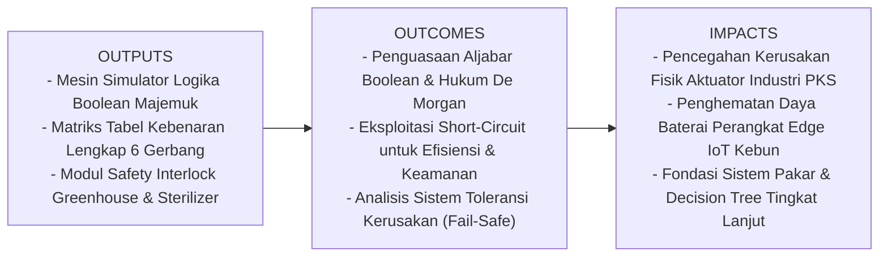
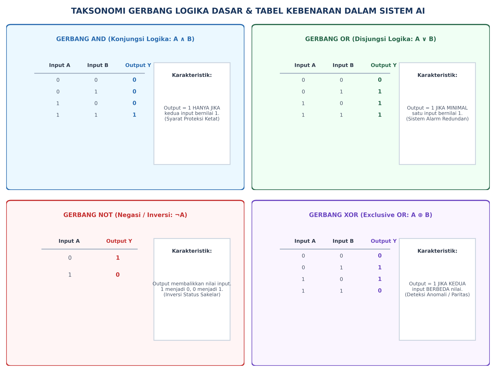
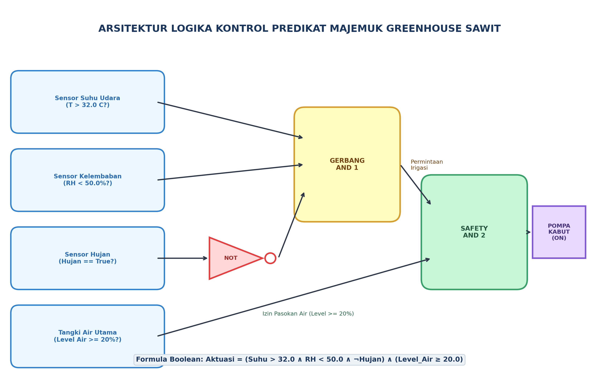

# AI Modul 2.3: Struktur Logika Pemrograman

---

## 1. Identitas & Kerangka Capaian Pembelajaran (Sub-CPMK)

* **Kode Modul**        : AI Modul 2.3
* **Mata Kuliah**       : Kecerdasan Buatan dan Sains Data Pertanian Presisi
* **Alokasi Waktu**     : 2 x 50 Menit (Kajian Teori & Diskusi) + 2 x 50 Menit (Eksplorasi Praktikum Mandiri)
* **Beban SKS**         : 3 SKS
* **Prasyarat**         : AI Modul 2.1 (Konsep Algoritma) & AI Modul 2.2 (Flowchart)
* **Level Kognitif**    : C2 (Memahami), C3 (Menerapkan), C4 (Menganalisis)



### 1.1 Capaian Pembelajaran Khusus (Sub-CPMK)
Setelah menyelesaikan modul ini, mahasiswa dan pembelajar diharapkan mampu:
1. **Menguraikan (C2)** prinsip dasar aljabar Boolean, hukum De Morgan, dan tabel kebenaran logika digital.
2. **Menganalisis (C4)** ekspresi logika majemuk (AND, OR, NOT, XOR) pada sistem interlock keselamatan dan kendali hidrolik pabrik kelapa sawit.
3. **Menerapkan (C3)** evaluasi *short-circuit logic* dalam optimasi eksekusi kode Python pada perangkat berdaya rendah.
4. **Memvalidasi (C4)** ketahanan sistem inferensi logika terhadap masukan ekstrem (*fault tolerance*) pada sensor lingkungan kebun.

### 1.2 Kerangka Hasil Pembelajaran (Outputs, Outcomes, & Impacts)
* **Outputs (Keluaran Berwujud Langsung)**:
  * **Mesin Simulator Logika Boolean Majemuk (*Compound Logic Engine*)**: Skrip Python tingkat produksi yang memodelkan evaluasi predikat sensorik multi-parameter (suhu, kelembaban, hujan, dan cadangan air) secara bertingkat dan deterministik.
  * **Matriks Tabel Kebenaran Komparatif**: Visualisasi dan generator tabel kebenaran lengkap untuk operator logika fundamental (`AND`, `OR`, `NOT`) serta operator turunan industri (`XOR`, `NAND`, `NOR`).
  * **Modul Pengunci Keselamatan (*Safety Interlock Controller*)**: Implementasi kode kontrol fisik yang mengintegrasikan pengujian prasyarat keselamatan (*guard pattern*) guna melindungi aktuator pompa kabut greenhouse dan bejana perebusan (*sterilizer*) pabrik kelapa sawit dari kegagalan operasional.
* **Outcomes (Hasil Capaian & Perubahan Kompetensi)**:
  * **Penguasaan Aljabar Boolean & Simplifikasi Logika**: Mahasiswa terampil menggunakan Teorema De Morgan dan aksioma logika untuk menyederhanakan ekspresi kondisional majemuk yang rumit menjadi bentuk kanonik hemat gerbang komputasi.
  * **Keahlian Optimasi Evaluasi Jalur Pendek (*Short-Circuit Optimization*)**: Mahasiswa mampu menyusun urutan evaluasi predikat secara strategis (meletakkan kondisi komputasi ringan dan penjaga keselamatan di sebelah kiri) guna menghemat siklus CPU serta mencegah galat runtime (*ZeroDivisionError* dan *IndexError*).
  * **Ketajaman Rekayasa Sistem Andal (*Fail-Safe Engineering*)**: Mahasiswa mampu menganalisis titik kegagalan logika (*logic failure mode*) pada sensor fisik dan merancang arsitektur redundansi suara mayoritas (*Triple Modular Redundancy / TMR*).
* **Impacts (Dampak Jangka Panjang & Nilai Guna Luas)**:
  * **Pencegahan Bencana & Kerusakan Fisik Pabrik Kelapa Sawit**: Menghilangkan risiko ledakan bejana bertekanan tinggi (*sterilizer*) atau kebakaran motor pompa akibat pengoperasian tanpa air (*dry run cavitation*).
  * **Efisiensi Energi Komputasi Tepi (*Green Edge Computing*)**: Pengurangan waktu evaluasi predikat hingga orde mikrodetik pada mikrokontroler bertenaga surya di perkebunan sawit terpencil.
  * **Fondasi Arsitektur Kecerdasan Buatan Tingkat Lanjut**: Mempersiapkan mahasiswa dengan kerangka logika formal yang kokoh sebelum melangkah ke representasi pengetahuan (*Knowledge Representation*), logika fuzzy, dan algoritma *Machine Learning*.

---

## 2. Analogi Dunia Nyata: Sakelar Hidrolik & Sistem Interlock Keselamatan PKS

Bayangkan sebuah **Stasiun Perebusan (*Sterilizer Station*)** di Pabrik Kelapa Sawit (PKS) yang menggunakan bejana uap bertekanan tinggi ($3.0 \text{ bar}$ pada suhu $140^\circ\text{C}$).

Jika uap dimasukkan saat pintu bejana belum terkunci rapat, bejana dapat meledak dan memicu bencana industri. Sebaliknya, jika pintu dibuka saat tekanan di dalam bejana masih tinggi, operator dapat tersiram uap panas bertekanan.

Untuk mencegah malafungsi manusiawi, insinyur memasang **Sistem Pengunci Keselamatan Logika (*Safety Interlock Logic*)**:

1. **Logika Konjungsi (AND - Seri):**  
   Katup suplai uap utama **HANYA BISA TERBUKA** jika:
   $$\text{Pintu Terkunci} \land \text{Baut Pengaman Masuk} \land \text{Sensor Tekanan Normal}$$
   Jika salah satu sakelar fisik putus (bernilai `False`), arus listrik terputus dan katup uap tetap terkunci.
2. **Logika Disjungsi (OR - Paralel):**  
   Sirine alarm evakuasi darurat **AKAN MENYALA** jika:
   $$\text{Tekanan Melebihi Batas} \lor \text{Suhu Melebihi Batas} \lor \text{Tombol Darurat Ditekan}$$
   Cukup satu kondisi terpenuhi, alarm langsung berbunyi keras.
3. **Logika Inversi (NOT - Pembalik Status):**  
   Pemanas uap hanya diizinkan aktif jika **TIDAK ADA** personel di dalam bejana:
   $$\text{Izin Aktif} = \neg(\text{Sensor Manusia Terdeteksi})$$
4. **Logika Disjungsi Eksklusif (XOR - Pembeda Eksklusif):**  
   Pada sistem pompa cadangan ganda, sistem kontrol cerdas memastikan bahwa hanya ada tepat satu pompa yang aktif dalam satu waktu:
   $$\text{Operasi Normal} = \text{Pompa Utama} \oplus \text{Pompa Cadangan}$$
   Jika kedua pompa mati bersamaan, tekanan drop ($0 \oplus 0 = 0$). Jika kedua pompa menyala bersamaan, pipa berisiko pecah akibat *overpressure* ($1 \oplus 1 = 0$). Sistem hanya aman jika status kedua pompa saling berlawanan ($1 \oplus 0 = 1$ atau $0 \oplus 1 = 1$).

---

## 3. Landasan Teori Komprehensif

### 3.1 Sejarah dan Landasan Formal Aljabar Boolean

Pada tahun 1854, matematikawan Inggris **George Boole** menerbitkan karya monumentalnya, *An Investigation of the Laws of Thought*, yang memperkenalkan sistem formal aljabar logika simbolik di mana variabel hanya memiliki dua status kebenaran: **Benar (True / $1$)** atau **Salah (False / $0$)**.

Hampir seabad kemudian, pada tahun 1938, **Claude Shannon** membuktikan dalam tesis masternya di MIT bahwa aljabar Boolean dapat langsung dipetakan ke sirkuit sakelar listrik dan relai telegraf. Penemuan Shannon ini menjadi fondasi perangkat keras komputer digital modern dan logika kecerdasan buatan.

---

### 3.2 Gerbang Logika Fundamental & Tabel Kebenaran

Dalam aljabar logika, terdapat tiga operator dasar (`AND`, `OR`, `NOT`) dan beberapa operator turunan, di mana yang paling signifikan dalam AI adalah `XOR` (*Exclusive OR*).

| Operator Logika | Notasi Simbolik | Padanan Python | Persamaan Boolean | Semantik Keputusan AI |
| :--- | :---: | :---: | :---: | :--- |
| **Konjungsi (AND)** | $\land$ atau $\cdot$ | `and` | $Y = A \cdot B$ | Bernilai `True` jika dan hanya jika **seluruh** operan bernilai `True`. |
| **Disjungsi (OR)** | $\lor$ atau $+$ | `or` | $Y = A + B$ | Bernilai `True` jika **minimal salah satu** operan bernilai `True`. |
| **Negasi (NOT)** | $\neg$ atau $\bar{A}$ | `not` | $Y = \bar{A}$ | Membalikkan nilai logika ($1 \to 0$, $0 \to 1$). |
| **Eksklusif (XOR)** | $\oplus$ | `^` (bitwise) / `!=` | $Y = A\bar{B} + \bar{A}B$ | Bernilai `True` jika dan hanya jika kedua operan memiliki nilai **berbeda**. |



#### Matriks Tabel Kebenaran Komparatif:

| Input $A$ | Input $B$ | $\text{AND } (A \land B)$ | $\text{OR } (A \lor B)$ | $\text{NOT } (\neg A)$ | $\text{XOR } (A \oplus B)$ | $\text{NAND } \neg(A \land B)$ | $\text{NOR } \neg(A \lor B)$ |
| :---: | :---: | :---: | :---: | :---: | :---: | :---: | :---: |
| **0** | **0** | 0 | 0 | 1 | 0 | 1 | 1 |
| **0** | **1** | 0 | 1 | 1 | 1 | 1 | 0 |
| **1** | **0** | 0 | 1 | 0 | 1 | 1 | 0 |
| **1** | **1** | 1 | 1 | 0 | 0 | 0 | 0 |

---

### 3.3 Aksioma dan Teorema Aljabar Boolean

Dalam menyusun arsitektur sistem pakar dan pohon keputusan, ekspresi logika yang terlalu panjang akan memperlambat waktu eksekusi. Teorema aljabar Boolean digunakan untuk menyederhanakan ekspresi logika:

1. **Hukum Identitas:**
   $$A \land 1 = A, \quad A \lor 0 = A$$
2. **Hukum Dominansi (Null / Annihilator):**
   $$A \land 0 = 0, \quad A \lor 1 = 1$$
3. **Hukum Idempoten:**
   $$A \land A = A, \quad A \lor A = A$$
4. **Hukum Involusi (Negasi Ganda):**
   $$\neg(\neg A) = A$$
5. **Hukum Komplemen:**
   $$A \land \neg A = 0, \quad A \lor \neg A = 1$$
6. **Hukum Komutatif:**
   $$A \land B = B \land A, \quad A \lor B = B \lor A$$
7. **Hukum Asosiatif:**
   $$(A \land B) \land C = A \land (B \land C), \quad (A \lor B) \lor C = A \lor (B \lor C)$$
8. **Hukum Distributif:**
   $$A \land (B \lor C) = (A \land B) \lor (A \land C)$$
   $$A \lor (B \land C) = (A \lor B) \land (A \lor C)$$
9. **Hukum Absorpsi (Penyerapan):**
   $$A \land (A \lor B) = A, \quad A \lor (A \land B) = A$$
10. **Hukum De Morgan (Sangat Krusial dalam AI):**
    $$\neg(A \land B) \iff \neg A \lor \neg B$$
    $$\neg(A \lor B) \iff \neg A \land \neg B$$

> **Makna Filosofis Hukum De Morgan:**  
> Mengatakan *"Tidak benar bahwa pompa menyala DAN katup terbuka"* setara dengan mengatakan *"Pompa mati ATAU katup tertutup"*. Hukum ini memungkinkan insinyur AI membalik logika sensor rumit menjadi rangkaian pengujian yang jauh lebih hemat instruksi mesin.

---

### 3.4 Presedensi Operator Logika

Ketika beberapa operator berada dalam satu baris ekspresi tanpa tanda kurung, urutan evaluasi mengikuti hierarki ketat:

1. **Tanda Kurung `( ... )`** (Prioritas Tertinggi)
2. **Operator Relasional / Perbandingan** (`==`, `!=`, `<`, `<=`, `>`, `>=`)
3. **Operator Logika `not`**
4. **Operator Logika `and`**
5. **Operator Logika `or`** (Prioritas Terendah)

**Contoh Kasus Presedensi:**
```python
hasil = True or False and not True
# Langkah 1: Evaluasi not True -> False
# Ekspresi menjadi: True or False and False
# Langkah 2: Evaluasi False and False -> False
# Ekspresi menjadi: True or False
# Langkah 3: Evaluasi True or False -> True
```

---

### 3.5 Sifat Evaluasi Short-Circuit (Evaluasi Jalur Pendek)

Salah satu karakteristik paling penting dari bahasa pemrograman modern (seperti Python, C, C++, Java) adalah **Short-Circuit Evaluation**:

1. **Pada Operasi `A and B`:**  
   Jika $A$ bernilai `False`, interpreter **TIDAK AKAN PERNAH** mengevaluasi ekspresi $B$, karena apa pun nilai $B$, hasil akhirnya dipastikan `False`.
2. **Pada Operasi `A or B`:**  
   Jika $A$ bernilai `True`, interpreter **TIDAK AKAN PERNAH** mengevaluasi ekspresi $B$, karena apa pun nilai $B$, hasil akhirnya dipastikan `True`.

#### Mengapa Short-Circuit Sangat Krusial dalam Rekayasa AI?
* **Pencegahan Error Fatal (Guard Pattern):**
  ```python
  # Mencegah ZeroDivisionError
  if total_sampel != 0 and (total_positif / total_sampel) > 0.8:
      print("Akurasi memenuhi standar")
  ```
  Jika `total_sampel == 0`, kondisi kedua tidak dieksekusi, sehingga pembagian dengan nol berhasil dicegah secara otomatis.
* **Penghematan Komputasi (*Computational Savings*):**  
  Letakkan pengujian ringan (misal: cek flag boolean lokal) di sebelah kiri, dan fungsi inferensi berat (misal: panggil model Convolutional Neural Network) di sebelah kanan:
  ```python
  if sensor_gerak_aktif and deteksi_wajah_yolov8(frame):
      aktifkan_perekaman()
  ```
  Model AI yang memakan waktu komputasi 50 ms hanya akan dipanggil jika sensor gerak fisik bernilai `True`.

---

### 3.6 Konsep Truthiness dan Falsiness dalam Python

Dalam Python, setiap objek memiliki nilai kebenaran implisit (*inherent boolean value*):

* **Koleksi & Nilai yang Dianggap `False` (Falsy):**
  * Konstanta `None` dan `False`.
  * Nilai numerik nol: `0`, `0.0`, `0j`.
  * Rangkaian data kosong: `""` (string kosong), `[]` (list kosong), `()` (tuple kosong), `{}` (dict kosong), `set()`.
* **Nilai yang Dianggap `True` (Truthy):**
  * Seluruh angka selain nol (termasuk angka negatif seperti `-1` atau `-99.5`).
  * Seluruh string yang berisi minimal satu karakter (termasuk spasi `" "`).
  * Koleksi data yang berisi minimal satu elemen (`[0]`, `{"status": False}`).

---

## 4. Formulasi Matematis, Notasi Formal, & Panduan Baca Lambang

Mari kita formulasikan arsitektur logika kendali iklim mikro untuk **Greenhouse Pembibitan Kelapa Sawit Berkelanjutan**.

Misalkan sistem memantau empat sensor lingkungan fisik:
- Suhu udara ruangan: $T \in \mathbb{R}$ (derajat Celsius)
- Kelembaban relatif udara: $RH \in [0, 100]$ (persentase)
- Status sensor presipitasi hujan eksternal: $H \in \{0, 1\}$
- Level cadangan air tangki nutrisi: $W \in [0, 100]$ (persentase)

Sistem harus memutuskan aktuasi pompa kabut pendingin (*fogging pump*) $Y \in \{0, 1\}$.

Definisikan predikat logika sensorik:
$$S_T = (T > 32.0)$$
$$S_{RH} = (RH < 50.0)$$
$$S_H = (H = 1)$$
$$S_W = (W \ge 20.0)$$

Fungsi Boolean Aktuasi Pompa Kabut dirumuskan sebagai:
$$Y = (S_T \land S_{RH} \land \neg S_H) \land S_W$$

Menggunakan sifat asosiatif konjungsi:
$$Y = (T > 32.0) \land (RH < 50.0) \land \neg(H = 1) \land (W \ge 20.0)$$



---

### Panduan Membaca Lambang Matematika

Untuk memastikan kelancaran artikulasi ilmiah, bacalah notasi di atas dengan kaidah formal berikut:

| Lambang / Simbol | Cara Pembacaan Akademik Formal | Makna Fisik & Logika dalam AI |
| :---: | :--- | :--- |
| $\land$ | "*Konjungsi*" atau "*AND*" | Mensyaratkan kedua proposisi di kiri dan kanan bernilai benar secara serentak. |
| $\lor$ | "*Disjungsi*" atau "*OR*" | Mensyaratkan salah satu atau kedua proposisi bernilai benar. |
| $\neg$ | "*Negasi*" atau "*NOT*" | Membalikkan status kebenaran dari proposisi yang mengikutinya. |
| $\oplus$ | "*Disjungsi Eksklusif*" atau "*XOR*" | Bernilai benar hanya jika satu kondisi terpenuhi, tetapi tidak keduanya. |
| $\iff$ | "*Ekuivalen secara logika jika dan hanya jika*" | Menyatakan kesetaraan identik antara dua fungsi Boolean pada semua baris tabel kebenaran. |
| $\implies$ | "*Mengimplikasikan (IF ... THEN)*" | Hubungan sebab-akibat logika: jika anteseden benar, maka konsekuen harus benar. |
| $\top$ | "*Tautologi / True*" | Konstanta logika yang selalu bernilai benar secara mutlak. |
| $\bot$ | "*Kontradiksi / False*" | Konstanta logika yang selalu bernilai salah secara mutlak. |
| $S_T = (T > 32.0)$ | "*Predikat S sub T didefinisikan sebagai suhu T lebih besar dari 32.0 derajat Celsius*" | Fungsi pemetaan dari nilai analog kontinu menjadi nilai diskret biner $\{0, 1\}$. |

---

### Simulasi Penelusuran Langkah Perhitungan Manual (Manual Dry-Run)

Diberikan kondisi telemetri sensor greenhouse pada pukul 13.00 WIB:
* Suhu udara $T = 34.5^\circ\text{C}$
* Kelembaban relatif $RH = 42.0\%$
* Status sensor hujan $H = 0$ (Cerah / Tidak Hujan)
* Level tangki nutrisi $W = 15.0\%$ (Kritis Rendah)

Mari kita evaluasi fungsi Boolean langkah demi langkah:
1. **Evaluasi Predikat $S_T$:** $34.5 > 32.0 \implies \mathbf{True}$ ($1$)
2. **Evaluasi Predikat $S_{RH}$:** $42.0 < 50.0 \implies \mathbf{True}$ ($1$)
3. **Evaluasi Predikat $S_H$:** $H = 1 \implies \mathbf{False}$ ($0$)
4. **Evaluasi Negasi Hujan $\neg S_H$:** $\neg(\mathbf{False}) \implies \mathbf{True}$ ($1$)
5. **Evaluasi Kebutuhan Pendinginan $(S_T \land S_{RH} \land \neg S_H)$:**  
   $$\mathbf{True} \land \mathbf{True} \land \mathbf{True} \implies \mathbf{True} \quad (\text{Tanaman butuh kabut})$$
6. **Evaluasi Izin Pasokan Air $S_W$:** $15.0 \ge 20.0 \implies \mathbf{False}$ ($0$)
7. **Evaluasi Akhir $Y = \mathbf{True} \land \mathbf{False} \implies \mathbf{False}$ ($0$)**

> **Kesimpulan Operasional:**  
> Pompa kabut **TIDAK DIAKTIFKAN** ($Y = 0$). Meskipun tanaman mengalami cekaman panas dan kekeringan udara, sistem pengunci keselamatan (*safety interlock*) berhasil mencegah pompa berputar dalam kondisi air kosong (*dry run pump cavitation*) yang dapat membakar motor dinamo. Sistem akan mengalihkan aksi ke **Peringatan Pengisian Air Tangki**.

---

## 5. Implementasi Kode Program Python

Berikut adalah modul simulator logika kendali iklim greenhouse (*Greenhouse Logic Engine*) yang mengimplementasikan operasi Boolean, evaluasi *short-circuit*, dan pencatatan jejak audit:

```python
# ==============================================================================
# AI Modul 2.3: Simulator Mesin Logika Predikat Kontrol Iklim Greenhouse
# Menerapkan Aljabar Boolean, Safety Interlock, dan Short-Circuit Logging
# ==============================================================================

# Mengimpor modul pengetikan terstruktur
from typing import Any, Dict, List, Tuple


class SensorTelemetry:
    """Representasi objek telemetri sensorik lingkungan greenhouse."""

    def __init__(
        self,
        node_id: str,
        suhu: float,
        kelembaban: float,
        hujan: bool,
        level_air: float,
    ):
        self.node_id = node_id
        self.suhu = suhu
        self.kelembaban = kelembaban
        self.hujan = hujan
        self.level_air = level_air

    def __repr__(self) -> str:
        return (
            f"Node({self.node_id}: T={self.suhu}C, RH={self.kelembaban}%, "
            f"Hujan={self.hujan}, Air={self.level_air}%)"
        )


def evaluasi_logika_pendingin(
    data: SensorTelemetry,
) -> Tuple[bool, str, List[str]]:
    """Mengevaluasi keputusan aktuasi pendinginan menggunakan aljabar Boolean terstruktur."""
    log_evaluasi: List[str] = []

    # 1. Evaluasi Predikat Sensorik Dasar
    predikat_suhu = data.suhu > 32.0
    predikat_rh = data.kelembaban < 50.0
    predikat_tidak_hujan = not data.hujan
    predikat_air_aman = data.level_air >= 20.0

    log_evaluasi.append(
        f"1. Predikat Suhu ({data.suhu} > 32.0 C) : {predikat_suhu}"
    )
    log_evaluasi.append(
        f"2. Predikat RH ({data.kelembaban} < 50.0%) : {predikat_rh}"
    )
    log_evaluasi.append(
        f"3. Predikat Tidak Hujan (not {data.hujan}) : {predikat_tidak_hujan}"
    )
    log_evaluasi.append(
        f"4. Predikat Air Aman ({data.level_air} >= 20.0%) : {predikat_air_aman}"
    )

    # 2. Evaluasi Kebutuhan Agroklimat (Tahap Permintaan Pendinginan)
    butuh_pendingin = predikat_suhu and predikat_rh and predikat_tidak_hujan
    log_evaluasi.append(
        f"5. Status Kebutuhan Pendinginan (1 and 2 and 3) : {butuh_pendingin}"
    )

    # 3. Evaluasi Safety Interlock (Tahap Izin Operasi Hardware)
    # Pemanfaatan Short-Circuit: Jika butuh_pendingin False, predikat_air_aman tidak menentukan aktuasi
    status_pompa = butuh_pendingin and predikat_air_aman

    # 4. Sintesis Keputusan dan Diagnosis Tindakan
    if status_pompa:
        keterangan = "AKTIFKAN_POMPA_KABUT: Pendinginan dan Humidifikasi Berjalan Normal."
    elif butuh_pendingin and not predikat_air_aman:
        keterangan = (
            "ALARM_PROTEKSI_AIR: Pendinginan Dibutuhkan tapi Air Tangki Kurang!"
        )
    elif data.hujan:
        keterangan = (
            "STANDBY_HUJAN: Kelembaban Alami Eksternal Sedang Tinggi."
        )
    else:
        keterangan = (
            "STANDBY_OPTIMAL: Kondisi Iklim Mikro Berada dalam Rentang Nyaman."
        )

    return status_pompa, keterangan, log_evaluasi


def jalankan_simulasi_greenhouse(daftar_stasiun: List[SensorTelemetry]) -> None:
    """Menjalankan audit logika terhadap rangkaian stasiun telemetri greenhouse."""
    print("=" * 85)
    print("LOG EVALUASI MESIN LOGIKA KONTROL IKLIM GREENHOUSE SAWIT INSTIPER")
    print("=" * 85)

    for stasiun in daftar_stasiun:
        print(f"\n[MEMPROSES TELEMETRI: {stasiun.node_id}]")
        print("-" * 55)

        pompa_on, instruksi, jejak = evaluasi_logika_pendingin(stasiun)

        for baris in jejak:
            print(f"  [LOG] {baris}")

        print("-" * 55)
        print(f"  --> STATUS AKTUASI : {'[POMPA ON]' if pompa_on else '[POMPA OFF]'}")
        print(f"  --> DIAGNOSIS      : {instruksi}")

    print("\n" + "=" * 85)
    print("[INFO] Seluruh stasiun telemetri selesai dievaluasi tanpa galat logika.\n")


# Titik Awal Eksekusi Program
if __name__ == "__main__":
    # Menyiapkan skenario uji variatif (Uji Kasus Batas)
    koleksi_telemetri = [
        # Skenario 1: Kondisi Panas Kering Siang Hari, Air Cukup -> Harus ON
        SensorTelemetry(
            node_id="GH-BLOK-A",
            suhu=34.2,
            kelembaban=44.0,
            hujan=False,
            level_air=65.0,
        ),
        # Skenario 2: Kondisi Kritis Air: Panas Kering tapi Tangki Kritis -> Harus OFF (Proteksi)
        SensorTelemetry(
            node_id="GH-BLOK-B",
            suhu=35.0,
            kelembaban=40.0,
            hujan=False,
            level_air=12.0,
        ),
        # Skenario 3: Kondisi Sedang Hujan Lebat di Luar -> Harus OFF (Hemat Energi)
        SensorTelemetry(
            node_id="GH-BLOK-C",
            suhu=33.0,
            kelembaban=48.0,
            hujan=True,
            level_air=80.0,
        ),
        # Skenario 4: Kondisi Dingin Lembab Pagi Hari -> Harus OFF (Standby)
        SensorTelemetry(
            node_id="GH-BLOK-D",
            suhu=26.5,
            kelembaban=78.0,
            hujan=False,
            level_air=90.0,
        ),
    ]

    jalankan_simulasi_greenhouse(koleksi_telemetri)
```

---

## 6. Pembahasan Keterangan Penggunaan Kode (Operational Breakdown)

Berikut adalah dekonstruksi teknis per blok logika untuk memahami bagaimana prinsip aljabar Boolean bekerja dalam arsitektur kode di atas:

1. **Abstraksi Objek Data `SensorTelemetry` (Baris 10-25):**  
   Penggunaan kelas data (*Data Class Structure*) menjamin keteraturan tipe variabel numerik dan boolean sebelum diserahkan ke mesin inferensi logika.
2. **Dekonstruksi Predikat Atomik (Baris 33-37):**  
   Prinsip *Clean Code* diwujudkan dengan memecah ekspresi relasional rumit menjadi variabel predikat atomik yang deskriptif (`predikat_suhu`, `predikat_rh`, `predikat_tidak_hujan`, `predikat_air_aman`). Hal ini mempermudah audit independen dan proses *debugging* jika salah satu sensor mengalami gangguan (*drift*).
3. **Eksekusi Evaluasi Bertingkat (Baris 48-52):**  
   Ekspresi logika dibagi menjadi dua lapisan hierarki:
   * **Lapisan Permintaan Agroklimat (*Agronomic Demand Layer*):** Menggabungkan tiga parameter iklim dengan konjungsi `and`.
   * **Lapisan Pengunci Keselamatan (*Safety Interlock Layer*):** Menggabungkan permintaan agroklimat dengan ketersediaan fisik air (`status_pompa = butuh_pendingin and predikat_air_aman`). Jika `butuh_pendingin` bernilai `False`, sifat *short-circuit* langsung menghentikan evaluasi tanpa membebani bus memori.
4. **Pembedaan Diagnosis Malafungsi (Baris 55-66):**  
   Pada struktur `if - elif - else`, kondisi `elif butuh_pendingin and not predikat_air_aman` secara spesifik mengidentifikasi situasi darurat di mana tanaman membutuhkan air namun cadangan air kosong, memungkinkan sistem AI mengirimkan alarm darurat ke petugas tanpa menyalakan pompa yang berisiko terbakar.

---

## 7. Evaluasi Mandiri: Pertanyaan HOTS & Tantangan Scaffolded

### 7.1 Pertanyaan HOTS (Higher-Order Thinking Skills)

1. **Optimasi Gerbang menggunakan Hukum De Morgan:**  
   Perhatikan ekspresi logika pemicu alarm kegagalan sistem irigasi berikut:
   $$\text{Alarm} = \neg(\text{Pompa\_Normal} \land \text{Tekanan\_Cukup}) \lor \neg(\text{Katup\_Terbuka} \lor \text{Aliran\_Mendeteksi})$$
   * **Tugas:** Gunakan aksioma dan Teorema De Morgan untuk menyederhanakan persamaan di atas ke dalam bentuk minimum yang paling sedikit menggunakan operator gerbang logika. Buktikan kesetaraannya menggunakan tabel kebenaran!
2. **Analisis Kerentanan Short-Circuit pada Sensor Rusak (*Fail-Safe Analysis*):**  
   Diberikan potongan kode kontrol robot pemanen sawit:
   ```python
   if sensor_jarak.baca_jarak() < 1.0 and robot.hentikan_lengan():
       print("Lengan berhenti aman")
   ```
   Jika modul `sensor_jarak` mengalami kerusakan hardware dan melempar *HardwareTimeoutException*, sistem langsung terhenti sebelum fungsi darurat `robot.hentikan_lengan()` sempat dipanggil. Bagaimana Anda merekonstruksi struktur logika pemrograman tersebut agar menerapkan prinsip **Fail-Safe** mutlak?
3. **Sintesis Desain Logika Voting Redundan (Triple Modular Redundancy - TMR):**  
   Pada drone penyemprot herbisida otonom, tiga sensor optik membaca ketinggian dari tajuk pohon sawit ($S_1, S_2, S_3$). Ketinggian dinyatakan aman jika minimal 2 dari 3 sensor menyatakan aman ($S = 1$). Rumuskan fungsi Boolean kanonik untuk sistem *Majority Voting* ini dan sederhanakan bentuk logikanya!

---

### 7.2 Tantangan Pemrograman Berjenjang (*Scaffolded Challenges*)

#### Tantangan 1 (Tingkat Dasar - *Warm-Up*): Verifikasi Kelayakan Panen Kelapa Sawit
* **Skenario:** TBS kelapa sawit layak panen jika memenuhi kondisi:
  1. Jumlah brondolan lepas di piringan pohon $\ge 5$ butir, **DAN**
  2. Kadar asam lemak bebas (FFA) $\le 3.0\%$, **DAN**
  3. Warna buah TIDAK berwarna hitam ungu (`not hitam_ungu`).
* **Tugas:** Buatlah fungsi Python `cek_kelayakan_panen(brondolan, ffa, warna_hitam)` yang mengembalikan nilai boolean dan pesan penjelas.

#### Tantangan 2 (Tingkat Menengah - *Intermediate*): Sistem Interlock Sterilizer Pabrik Sawit
* **Skenario:** Bejana perebusan (*sterilizer*) PKS memiliki aturan pengoperasian uap:
  - Katup uap masuk ($K_{\text{in}}$) hanya boleh buka jika: Pintu tertutup rapat (`True`) **DAN** Katup buang ($K_{\text{out}}$) tertutup (`False`) **DAN** Sensor darurat TIDAK aktif.
  - Pintu keluar sterilizer HANYA boleh dibuka jika: Tekanan internal $\le 0.1 \text{ bar}$ **DAN** Suhu bejana $\le 50.0^\circ\text{C}$ **DAN** Katup uap masuk tertutup.
* **Tugas:** Rancanglah fungsi kendali interlock dengan validasi ganda dan mekanisme pencegahan pembukaan katup berkonflik.

#### Tantangan 3 (Tingkat Mahir - *Advanced*): Mesin Inferensi Sistem Pakar Defisiensi Hara Daun Sawit
* **Skenario:** Mahasiswa diminta membangun mesin inferensi sistem pakar berbasis aturan (*Forward Chaining Rule Engine*) untuk mendeteksi defisiensi nutrisi kelapa sawit:
  - **Defisiensi Nitrogen (N):** Daun muda pucat kekuningan **DAN** pertumbuhan pelepah terhambat **DAN** bukan akibat serangan hama rayap.
  - **Defisiensi Kalium (K):** Terdapat bercak oranye (*orange spotting*) pada daun tua **DAN** tepi daun mengering seperti terbakar.
  - **Defisiensi Magnesium (Mg):** Daun tua menguning cerah pada bagian yang terkena sinar matahari penuh, tetapi tulang daun tetap hijau.
* **Tugas:** Buatlah program Python berorientasi objek yang menerima input gejala dalam bentuk himpunan (*set*) atau kamus (*dict*), mengevaluasi tabel aturan Boolean, serta menangani situasi ketika input tidak lengkap (*missing data*).

---

## 8. Glosarium Istilah Teknis

1. **Aljabar Boolean:** Sistem aljabar matematika yang beroperasi pada variabel biner yang hanya memiliki dua kemungkinan nilai kebenaran: Benar ($1$) atau Salah ($0$).
2. **Batas Keputusan (*Decision Boundary*):** Garis atau hiperspesifikasi geometris yang memisahkan kelas-kelas data berbeda dalam ruang fitur model kecerdasan buatan.
3. **Disjungsi (Disjunction):** Operasi logika `OR` yang menghasilkan nilai benar jika minimal salah satu variabel pembentuknya bernilai benar.
4. **Falsiness:** Nilai atau objek dalam bahasa pemrograman yang dievaluasi menjadi nilai boolean `False` saat digunakan dalam konteks kondisional.
5. **Guard Pattern:** Teknik pemrograman defensif yang memanfaatkan sifat *short-circuit evaluation* untuk memeriksa prasyarat keamanan sebelum menjalankan operasi berisiko galat.
6. **Hukum De Morgan:** Teorema fundamental aljabar logika yang mendefinisikan hubungan komplementer antara operator konjungsi (`AND`) dan disjungsi (`OR`).
7. **Konjungsi (Conjunction):** Operasi logika `AND` yang mensyaratkan seluruh variabel pembentuknya bernilai benar untuk menghasilkan keluaran benar.
8. **Short-Circuit Evaluation:** Strategi komputasi di mana operan kedua dari ekspresi logika majemuk tidak dievaluasi jika operan pertama sudah cukup untuk menentukan hasil akhir.
9. **Tabel Kebenaran (Truth Table):** Matriks matematis tabular yang mendaftar seluruh kombinasi nilai input yang mungkin beserta hasil keluaran logika yang bersesuaian.
10. **Truthiness:** Nilai atau objek dalam bahasa pemrograman yang dievaluasi menjadi nilai boolean `True` saat diuji dalam struktur kendali percabangan.

---

## 9. Jembatan Konsep (Bridging) ke AI Modul 2.4

Anda telah menguasai bagaimana aljabar Boolean mengatur aliran keputusan dan mencegah malafungsi sistem cerdas. Namun, dari manakah nilai-nilai pembacaan suhu $34.5^\circ\text{C}$, status sensor `True`, atau label kategori `"GRADE_A"` tersebut disimpan dan diolah di dalam memori komputer?

Pada **AI Modul 2.4: Variabel dan Tipe Data**, kita akan menjelajahi:
- Alokasi memori fisik dan representasi bit dari variabel komputasional (*integers*, *floating-point*, *strings*, *booleans*).
- Sistem pengetikan dinamis (*dynamic typing*) versus pengetikan statis (*static typing*) dalam Python.
- Struktur data primitif dan konversi tipe (*type casting*) untuk pemrosesan dataset agroklimat berskala besar.

---

## 10. Daftar Pustaka dan Referensi Akademik

1. Boole, G.(1854). *An Investigation of the Laws of Thought on Which Are Founded the Mathematical Theories of Logic and Probabilities*. Walton and Maberly.
2. Shannon, C. E.(1938). A symbolic analysis of relay and switching circuits. *Transactions of the American Institute of Electrical Engineers*, 57(12), 713–723. https://doi.org/10.1109/T-AIEE.1938.5057767
3. Mano, M. M., & Ciletti, M. D.(2018). *Digital Design: With an Introduction to the Verilog HDL, VHDL, and SystemVerilog* (6th ed.). Pearson. (Bab 2: *Boolean Algebra and Logic Gates*).
4. Russell, S., & Norvig, P.(2020). *Artificial Intelligence: A Modern Approach* (4th ed.). Pearson. (Bab 7: *Logical Agents and Propositional Logic*).
5. Cormen, T. H., Leiserson, C. E., Rivest, R. L., & Stein, C.(2022). *Introduction to Algorithms* (4th ed.). MIT Press. (Appendix B: *Sets, Relations, and Functions*).
6. Lutz, M.(2013). *Learning Python* (5th ed.). O'Reilly Media. (Bab 12: *if Tests and Syntax Rules: Boolean Tests and Short-Circuiting*).
7. Setiawan, B., & Darmanto, D.(2022). Automasi dan instrumentasi sistem kontrol iklim mikro greenhouse cerdas berbasis IoT untuk perkebunan presisi. *Jurnal Otomasi dan Rekayasa Pertanian*, 14(2), 112–125.
8. IEEE Computer Society.(2014). *Guide to the Software Engineering Body of Knowledge (SWEBOK Guide V3.0)*. IEEE. (Bab 3: *Logic Specifications & Safe Coding Standards*).
