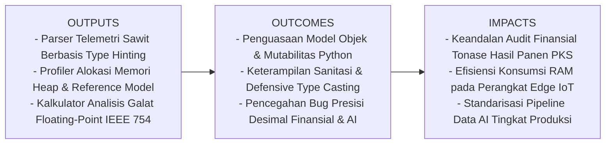
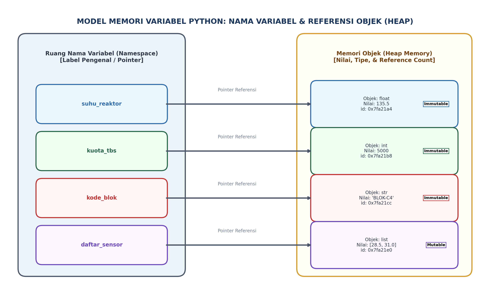

# AI Modul 2.4: Variabel dan Tipe Data

---

## 1. Identitas & Kerangka Capaian Pembelajaran (Sub-CPMK)

* **Kode Modul**        : AI Modul 2.4
* **Mata Kuliah**       : Kecerdasan Buatan dan Sains Data Pertanian Presisi
* **Alokasi Waktu**     : 2 x 50 Menit (Kajian Teori & Diskusi) + 2 x 50 Menit (Eksplorasi Praktikum Mandiri)
* **Beban SKS**         : 3 SKS
* **Prasyarat**         : AI Modul 2.3 (Struktur Logika Pemrograman)
* **Level Kognitif**    : C2 (Memahami), C3 (Menerapkan), C4 (Menganalisis)



### 1.1 Capaian Pembelajaran Khusus (Sub-CPMK)
Setelah menyelesaikan modul ini, mahasiswa dan pembelajar diharapkan mampu:
1. **Mengidentifikasi (C2)** sistem pengetikan dinamis (*Dynamic Typing*) dan mekanisme alokasi memori objek pada CPython.
2. **Menganalisis (C4)** perbedaan mutabilitas (*Mutability*) antara tipe data primitif dan tipe data majemuk serta implikasinya terhadap *aliasing bug*.
3. **Menerapkan (C3)** konversi tipe data eksplisit (*type casting*) dan penanganan presisi numerik (integer, float, boolean, string) pada data telemetri sensor kebun.
4. **Mengevaluasi (C4)** jejak memori (*memory footprint*) objek data menggunakan modul `sys` untuk efisiensi komputasi tepi (*Edge AI*).

### 1.2 Kerangka Hasil Pembelajaran (Outputs, Outcomes, & Impacts)
* **Outputs (Keluaran Berwujud Langsung)**:
  * **Modul Parser Telemetri Panen Sawit (*Telemetry Ingestion Engine*)**: Skrip Python tingkat produksi beranotasi *Type Hinting* (PEP 484) yang memvalidasi, membersihkan (*sanitizing*), dan mengonversi payload data mentah heterogen dari jembatan timbang dan gerbang RFID PKS.
  * **Alat Uji Profil Alokasi Memori (*Memory Profiling Lab*)**: Program inspeksi alamat memori (`id()`), evaluasi operator identitas vs kesetaraan nilai (`is` vs `==`), pengukuran ukuran byte objek fisik (`sys.getsizeof()`), serta pembuktian fenomena mutasi *in-place*.
  * **Kalkulator Analisis Galat Presisi IEEE 754**: Modul analisis numerik yang membuktikan limitasi representasi 52-bit mantisa pecahan desimal ($0.1 + 0.2 \ne 0.3$) dan mengimplementasikan solusi toleransi mesin `math.isclose()` serta `decimal.Decimal`.
* **Outcomes (Hasil Capaian & Perubahan Kompetensi)**:
  * **Penguasaan Model Referensi Objek (*Object Reference Mastery*)**: Mahasiswa memahami bahwa variabel dalam Python adalah label pointer di memori Heap, membedakan perilaku objek mutabel (`list`, `dict`) versus imutabel (`int`, `float`, `str`), serta menghindari bug *aliasing* dan *mutable default argument*.
  * **Keterampilan Sanitasi Tipe Data Defensif (*Defensive Type Casting*)**: Mahasiswa mampu menangani masukan string kotor, data numerik bertipe acak, dan nilai biner implisit tanpa memicu pengecualian *runtime* (*zero unhandled exceptions*).
  * **Ketajaman Pemrograman Numerik Presisi Tinggi**: Mahasiswa mampu membedakan domain aplikasi kapan harus menggunakan `float` (kinerja cepat untuk tensor AI) versus `Decimal` (akurasi absolut untuk audit akuntansi logistik perkebunan).
* **Impacts (Dampak Jangka Panjang & Nilai Guna Luas)**:
  * **Integritas Audit Finansial Agro-Industri**: Mencegah kebocoran neraca massa CPO dan kerugian moneter akibat akumulasi pembulatan pecahan desimal pada puluhan ribu transaksi truk pengangkut TBS kelapa sawit.
  * **Optimasi Alokasi Memori Komputasi Tepi (*Edge AI Efficiency*)**: Menghindari pemborosan memori RAM pada mikrokontroler sensor kebun dan modul drone melalui pemilihan tipe data kompak.
  * **Kesiapan Rekayasa Data Skala Besar (*Enterprise Data Readiness*)**: Menanamkan kebiasaan menulis kode dengan sistem pengetikan ketat dan terstruktur yang siap diintegrasikan ke sistem manajemen basis data dan kerangka kerja *Machine Learning* modern.

---

## 2. Analogi Dunia Nyata: Gudang Logistik & Kontainer Bertiket Pabrik Kelapa Sawit (PKS)

Bayangkan **Area Penerimaan Bahan Baku (*Loading Ramp*)** di sebuah Pabrik Kelapa Sawit (PKS) modern berkapasitas 60 ton/jam.

1. **Variabel sebagai Label Gantung / Tiket Identitas (Tag Identifier):**  
   Di atas ban berjalan, ada papan petunjuk kayu bertuliskan `"Tandan Buah Siap Rebus"`. Papan ini **bukanlah buah itu sendiri**, melainkan hanyalah **label pengenal (pointer/nama)**. Jika pekerja memindahkan label tersebut ke bak penampungan lain, buah fisiknya tidak berubah, hanya arah tunjuk labelnya yang berganti. Dalam Python, variabel adalah **nama referensi** yang menunjuk ke objek nyata di memori komputer (*Heap*).
2. **Tipe Data sebagai Spesifikasi Kontainer Penyimpanan:**  
   Setiap komoditas perkebunan membutuhkan wadah fisik yang berbeda:
   * **Bilangan Bulat (`int`):** Karung goni bernomor urut untuk menghitung jumlah tandan buah segar (misal: tepat $450$ janjang, tidak mungkin ada pecahan $450.3$ janjang).
   * **Pecahan Desimal (`float`):** Tangki ukur fluida berskala mililiter untuk menampung Minyak Sawit Mentah (*Crude Palm Oil* / CPO, misal: $34.785 \text{ ton}$).
   * **Teks Karakter (`str`):** Papan segel bertuliskan kode sertifikasi RSPO / ISPO (misal: `"CERT-ID-2026-X4"`).
   * **Status Biner (`bool`):** Lampu indikator katup pneumatik (Hanya ada dua kondisi: Hijau untuk `Buka` / `True`, Merah untuk `Tutup` / `False`).
3. **Konsekuensi Sistem Pengetikan Kuat (*Strong Typing*):**  
   Jika seorang operator pabrik mencoba menuangkan minyak cair (CPO) langsung ke dalam karung goni berlubang, isi cairan akan tumpah berantakan. Komputer juga demikian: Python menolak operasi `suhu_minyak + "derajat"` karena tidak masuk akal menjumlahkan angka pecahan dengan teks alfabet tanpa konversi eksplisit terlebih dahulu.

---

## 3. Landasan Teori Komprehensif

### 3.1 Model Objek Memori Python: Identitas, Tipe, dan Nilai

Dalam bahasa Python, terdapat doktrin fundamental: **"Everything is an Object"** (Segala sesuatu adalah objek). Ketika sebuah variabel dideklarasikan:

```python
tonase_cpo = 125.75
```

Interpreter Python melakukan tiga tindakan di balik layar:
1. Mengalokasikan blok memori di area **Heap** untuk membuat objek tipe `float`.
2. Menyimpan nilai $125.75$ ke dalam objek tersebut beserta metadata tipe dan jumlah referensi (*reference count*).
3. Mengikat (*bind*) label pengenal `tonase_cpo` di dalam **Namespace** lokal agar menunjuk ke alamat memori objek tersebut.



Setiap objek di memori memiliki tiga atribut mutlak:
* **Identitas (*Identity*):** Alamat memori unik yang diakses melalui fungsi `id(obj)` atau diuji dengan operator identitas `is`.
* **Tipe Data (*Type*):** Menentukan operasi apa saja yang diizinkan terhadap objek tersebut, diakses via `type(obj)`.
* **Nilai (*Value*):** Data substantif yang disimpan di dalam blok memori tersebut.

#### Mutabilitas vs Imutabilitas (*Mutability vs Immutability*)
* **Objek Imutabel (*Immutable*):** Objek yang nilainya **tidak dapat diubah** setelah dialokasikan di memori. Jika nilainya dimodifikasi, Python membuat objek baru di alamat memori baru. Contoh: `int`, `float`, `str`, `tuple`, `bool`.
* **Objek Mutabel (*Mutable*):** Objek yang isinya **dapat dimodifikasi langsung di tempat (*in-place*)** tanpa mengubah alamat memori objek tersebut. Contoh: `list`, `dict`, `set`.

---

### 3.2 Klasifikasi Tipe Data Standar dalam AI

Dalam rekayasa kecerdasan buatan, pemilihan tipe data menentukan efisiensi komputasi dan konsumsi memori cache CPU/GPU.


#### 1. Bilangan Bulat (`int` - Integer)
* Di Python 3, tipe `int` memiliki sifat **Arbitrary Precision** (presisi tak terbatas). Panjang bilangan bulat hanya dibatasi oleh kapasitas RAM komputer, sehingga tidak akan mengalami *integer overflow* seperti pada bahasa C/C++ (yang terbatas pada 32-bit atau 64-bit).
* Digunakan untuk indeks data, penghitung iterasi (*epoch*), dan kuantisasi biner.

#### 2. Pecahan Presisi Ganda (`float` - Floating-Point)
* Python mengimplementasikan tipe `float` sesuai standar **IEEE 754 Double Precision (64-bit)**:
  * **1 bit** untuk tanda (*sign bit* $s$).
  * **11 bit** untuk eksponen (*exponent* $e$).
  * **52 bit** untuk fraksi/mantisa (*fraction / significand* $b$).
* Digunakan untuk pembacaan sensor analog (suhu, pH, kelembaban) dan bobot matriks model *Deep Learning*.

#### 3. String Karakter (`str` - String)
* Rangkaian karakter terurut yang dienkode dalam standar **Unicode UTF-8**.
* Sifatnya imutabel; setiap operasi penggabungan (*concatenation*) string skala besar tanpa builder akan menciptakan alokasi memori berulang.

#### 4. Boolean Logika (`bool` - Boolean)
* Merupakan subkelas resmi dari `int`. Nilai `True` bernilai integral $1$, dan `False` bernilai integral $0$.
* Mengatur gerbang keputusan kontrol dan fungsi *masking* matriks.

---

### 3.3 Anatomi Standar Floating-Point IEEE 754 dan Fenomena Galat Presisi

Salah satu potensi galat fundamental (*fundamental computational pitfall*) dalam komputasi numerik AI dan analitika perkebunan adalah asumsi keliru bahwa komputer menyimpan pecahan desimal secara eksak.

Di alam nyata, bilangan desimal berbasis 10 ($1/10 = 0.1$). Namun komputer bekerja dalam basis biner 2 ($1/2 = 0.5, 1/4 = 0.25, 1/8 = 0.125, \dots$). Angka $0.1$ dalam basis biner merupakan pecahan berulang tak terhingga:
$$0.1_{10} = 0.00011001100110011001100110011\dots_2$$

Karena kapasitas mantisa IEEE 754 terbatas pada 52 bit, komputer terpaksa membulatkan bit ke-53. Akibatnya, nilai riil yang tersimpan di memori bukanlah $0.1$ murni, melainkan:
$$0.1000000000000000055511151231257827021181583404541015625$$

Inilah penyebab utama di balik hasil komparasi Python berikut:
```python
>>> 0.1 + 0.2 == 0.3
False
>>> 0.1 + 0.2
0.30000000000000004
```

> **Aturan Emas Pemrograman Industri:**  
> **JANGAN PERNAH** membandingkan dua bilangan floating-point secara kesetaraan ketat (`==`). Selalu gunakan batas toleransi toleransi mesin (*epsilon*):
> $$\lvert A - B \rvert < \epsilon \quad \text{atau gunakan } \texttt{math.isclose(A, B)}$$

---

### 3.4 Karakteristik Sistem Pengetikan Python: Dynamic, Strong, and Typed

Sistem pengetikan Python memiliki tiga pilar arsitektur:
1. **Dynamic Typing:** Tipe variabel ditentukan secara otomatis saat runtime berdasarkan objek yang diikatnya, bukan saat deklarasi awal di berkas kode.
2. **Strong Typing:** Python secara ketat melarang operasi antar tipe data yang tidak kompatibel tanpa konversi eksplisit. Contoh: `'Sawit' + 5` menghasilkan `TypeError`.
3. **Type Hinting (PEP 484):** Sejak Python 3.5+, insinyur perangkat lunak dapat menyertakan anotasi tipe statis untuk mempermudah audit kode otomatis (*static analysis* dengan `mypy`):
   ```python
   def hitung_rendemen(cpo_kg: float, tbs_kg: float) -> float:
       return (cpo_kg / tbs_kg) * 100.0
   ```

---

## 4. Formulasi Matematis, Notasi Formal, & Panduan Baca Lambang

### 4.1 Formulasi Nilai Riil IEEE 754 (Double Precision 64-bit)

Nilai numerik riil $v$ dari sebuah variabel bertipe `float` diformulasikan secara matematis sebagai:

$$v = (-1)^s \times 2^{e - 1023} \times \left(1 + \sum_{i=1}^{52} b_{52-i} \cdot 2^{-i}\right)$$

Di mana parameter komponen biner adalah:
* $s \in \{0, 1\}$ adalah bit tanda (*sign bit*).
* $e \in [1, 2046]$ adalah nilai eksponen biner tak-bias (*biased exponent*).
* $b_k \in \{0, 1\}$ adalah koefisien bit pada posisi fraksi ke-$k$.

---

### 4.2 Pemetaan Teori Himpunan Tipe Data

Dalam semantik logika komputasi formal, tipe data didefinisikan sebagai subset dari himpunan matematika:

$$\text{Tipe } \texttt{bool} \in \mathbb{B} = \{0, 1\}$$
$$\text{Tipe } \texttt{int} \subset \mathbb{Z} = \{\dots, -2, -1, 0, 1, 2, \dots\}$$
$$\text{Tipe } \texttt{float} \subset \mathbb{Q} \subset \mathbb{R}$$
$$\text{Tipe } \texttt{str} \in \Sigma^* \quad (\text{Himpunan seluruh string berhingga atas alfabet Unicode } \Sigma)$$

---

### Panduan Membaca Lambang Matematika

Untuk memastikan artikulasi akademik yang tepat dan seragam, bacalah lambang-lambang di atas sebagai berikut:

| Lambang / Notasi | Cara Pembacaan Akademik Formal | Makna Konseptual dalam Rekayasa AI |
| :---: | :--- | :--- |
| $(-1)^s$ | "*Negatif satu berpangkat s*" | Menentukan polaritas angka: jika $s=0$ maka angka positif ($+1$), jika $s=1$ maka angka negatif ($-1$). |
| $2^{e - 1023}$ | "*Dua berpangkat e minus seribu dua puluh tiga*" | Faktor penskalaan magnitudo bilangan biner dengan bias offset $1023$. |
| $\sum_{i=1}^{52} b_{52-i} \cdot 2^{-i}$ | "*Sigma dari i sama dengan satu hingga lima puluh dua untuk b indeks lima puluh dua minus i kali dua pangkat minus i*" | Penjumlahan deret pembobotan pecahan biner ($1/2, 1/4, 1/8, \dots$) pada mantisa. |
| $\mathbb{Z}$ | "*Himpunan bilangan bulat (Zahlen)*" | Domain nilai yang dapat direpresentasikan oleh tipe data integer (`int`). |
| $\mathbb{R}$ | "*Himpunan bilangan riil*" | Kontinum nilai kontinu yang didekati (*approximated*) oleh tipe data `float`. |
| $\mathbb{B}$ | "*Domain logika Boolean*" | Himpunan biner dua elemen kebenaran: $\{\text{False}, \text{True}\}$. |
| $\Sigma^*$ | "*Kleen star dari alfabet Sigma*" | Himpunan seluruh untaian karakter teks berhingga dari kumpulan simbol Unicode. |
| $\epsilon$ | "*Epsilon mesin*" | Batas perbedaan terkecil antara angka $1.0$ dengan angka float berikutnya yang dapat dibedakan mesin ($\approx 2.22 \times 10^{-16}$). |
| $\lvert A - B \rvert < \epsilon$ | "*Nilai mutlak dari A minus B kurang dari epsilon*" | Pengujian kesetaraan numerik yang aman terhadap akumulasi galat pembulatan floating-point. |

---

## 5. Implementasi Kode Program Python

Berikut adalah modul parser telemetri panen perkebunan kelapa sawit (*Harvest Telemetry Ingestion Engine*) yang mengilustrasikan penanganan variabel, mutabilitas, konversi tipe defensif, dan audit presisi floating-point:

```python
# ==============================================================================
# AI Modul 2.4: Parser Telemetri Panen Sawit & Analisis Presisi Memori
# Menerapkan Type Hinting, Defensive Casting, dan Sanitasi IEEE 754
# ==============================================================================

import math
import sys
from typing import Any, Dict, List, Optional, Tuple, Union


class RecordTimbanganTBS:
    """Objek data penampung transaksi penimbangan TBS di loading ramp PKS."""

    def __init__(
        self,
        transaksi_id: str,
        blok_panen: str,
        jumlah_janjang: int,
        berat_kotor_kg: float,
        berat_truk_kosong_kg: float,
        lulus_uji_karantina: bool,
    ):
        # Menyimpan atribut imutabel ke namespace instans objek
        self.transaksi_id = transaksi_id
        self.blok_panen = blok_panen
        self.jumlah_janjang = jumlah_janjang
        self.berat_kotor_kg = berat_kotor_kg
        self.berat_truk_kosong_kg = berat_truk_kosong_kg
        self.lulus_uji_karantina = lulus_uji_karantina

        # Menghitung berat bersih (netto) TBS
        self.berat_bersih_kg: float = (
            self.berat_kotor_kg - self.berat_truk_kosong_kg
        )

    def hitung_berat_rata_janjang(self) -> float:
        """Menghitung Berat Janjang Rata-rata (BJR) dalam kg."""
        if self.jumlah_janjang <= 0:
            raise ValueError(
                "Jumlah janjang tidak boleh nol atau negatif untuk kalkulasi BJR."
            )
        return self.berat_bersih_kg / float(self.jumlah_janjang)


def parsing_payload_mentah_iot(
    payload: Dict[str, Any],
) -> Tuple[Optional[RecordTimbanganTBS], List[str]]:
    """Melakukan sanitasi tipe data dan casting defensif dari aliran data mentah sensor."""
    log_sanitasi: List[str] = []

    try:
        # 1. Parsing & Validasi String
        trx_id = str(payload.get("id_transaksi", "")).strip()
        blok = str(payload.get("blok", "")).strip().upper()
        if not trx_id or not blok:
            log_sanitasi.append(
                "GAGAL: Identitas transaksi atau blok panen kosong."
            )
            return None, log_sanitasi

        # 2. Parsing & Casting Defensif Integer (Jumlah Janjang)
        raw_janjang = payload.get("janjang")
        janjang_int = int(float(raw_janjang))  # Mencegah error jika format "120.0"
        if janjang_int <= 0:
            log_sanitasi.append(
                f"GAGAL: Nilai janjang tidak valid ({janjang_int} <= 0)."
            )
            return None, log_sanitasi

        # 3. Parsing & Casting Defensif Float (Timbangan Digital)
        raw_kotor = payload.get("berat_kotor")
        raw_tara = payload.get("berat_tara")
        kotor_flt = float(raw_kotor)
        tara_flt = float(raw_tara)

        if kotor_flt <= tara_flt:
            log_sanitasi.append(
                f"GAGAL: Berat kotor ({kotor_flt}) <= berat tara ({tara_flt})."
            )
            return None, log_sanitasi

        # 4. Parsing Defensif Boolean (Status Karantina)
        raw_karantina = payload.get("karantina_ok")
        if isinstance(raw_karantina, str):
            karantina_bool = raw_karantina.strip().lower() in (
                "true",
                "1",
                "yes",
                "pass",
            )
        else:
            karantina_bool = bool(raw_karantina)

        log_sanitasi.append(
            f"BERHASIL: Sanitasi tipe data sukses untuk Transaksi '{trx_id}'."
        )

        # Mengembalikan objek Record baru
        record = RecordTimbanganTBS(
            transaksi_id=trx_id,
            blok_panen=blok,
            jumlah_janjang=janjang_int,
            berat_kotor_kg=kotor_flt,
            berat_truk_kosong_kg=tara_flt,
            lulus_uji_karantina=karantina_bool,
        )
        return record, log_sanitasi

    except (ValueError, TypeError) as err:
        log_sanitasi.append(
            f"EKSEPSI TIPE: Gagal konversi format tipe data ({err})."
        )
        return None, log_sanitasi


def demonstrasi_presisi_memori() -> None:
    """Membuktikan model referensi objek dan galat floating-point IEEE 754."""
    print("=" * 75)
    print("DEMONSTRASI 1: MODEL REFERENSI OBJEK & IDENTITAS MEMORI (id)")
    print("=" * 75)

    a = 25000.5
    b = a
    c = 25000.5

    print(
        f"Variabel a: nilai={a:<8} | id={id(a)} | type={type(a).__name__} (Ukuran: {sys.getsizeof(a)} bytes)"
    )
    print(
        f"Variabel b: nilai={b:<8} | id={id(b)} | type={type(b).__name__} (Aliasing / Referensi Sama)"
    )
    print(
        f"Variabel c: nilai={c:<8} | id={id(c)} | type={type(c).__name__} (Objek Terpisah di Heap)"
    )
    print(f"Evaluasi (a is b) : {a is b}  (Menunjuk ke alamat memori fisik yang sama)")
    print(
        f"Evaluasi (a is c) : {a is c} (Alamat memori berbeda meskipun nilainya identik)"
    )
    print(f"Evaluasi (a == c) : {a == c}  (Nilai kesetaraan isi data sama)")

    print("\n" + "=" * 75)
    print("DEMONSTRASI 2: ANALISIS GALAT FLOATING-POINT IEEE 754 PADA TONASE CPO")
    print("=" * 75)

    # Menghitung akumulasi tonase CPO dari 10 truk berbobot 0.1 ton
    total_akumulasi = 0.0
    for _ in range(10):
        total_akumulasi += 0.1

    print(f"Nilai teoritis diharapkan : 1.00000000000000000000 ton")
    print(f"Nilai riil di memori IEEE : {total_akumulasi:.20f} ton")
    print(f"Evaluasi (total == 1.0)   : {total_akumulasi == 1.0} (SALAH!)")
    print(
        f"Solusi Toleransi math.isclose: {math.isclose(total_akumulasi, 1.0)} (BENAR DAN AMAN!)"
    )
    print("=" * 75 + "\n")


# Titik Masuk Eksekusi Program
if __name__ == "__main__":
    # Menjalankan pembuktian memori
    demonstrasi_presisi_memori()

    # Data masukan mentah heterogen dari gateway IoT perkebunan
    batch_sensor_mentah = [
        # Sampel 1: Data string terformat baik
        {
            "id_transaksi": "TRX-2026-001",
            "blok": "blok-b2",
            "janjang": "150",
            "berat_kotor": "14500.5",
            "berat_tara": "5200.0",
            "karantina_ok": "PASS",
        },
        # Sampel 2: Data dengan tipe acak (janjang bertipe float, karantina bertipe 1)
        {
            "id_transaksi": "TRX-2026-002",
            "blok": "blok-c4",
            "janjang": 220.0,
            "berat_kotor": 18200.0,
            "berat_tara": "5150.5",
            "karantina_ok": 1,
        },
        # Sampel 3: Data korup (berat kotor < tara)
        {
            "id_transaksi": "TRX-2026-003",
            "blok": "blok-a1",
            "janjang": "80",
            "berat_kotor": "4000.0",
            "berat_tara": "5500.0",
            "karantina_ok": False,
        },
        # Sampel 4: Data nilai teks cacat
        {
            "id_transaksi": "TRX-2026-004",
            "blok": "blok-d3",
            "janjang": "RUSAK",
            "berat_kotor": "12000.0",
            "berat_tara": "5000.0",
            "karantina_ok": True,
        },
    ]

    print("=" * 85)
    print("HASIL PEMROSESAN PARSER TELEMETRI PENERIMAAN TBS PKS INSTIPER")
    print("=" * 85)

    for item in batch_sensor_mentah:
        rec, logs = parsing_payload_mentah_iot(item)
        if rec:
            bjr = rec.hitung_berat_rata_janjang()
            print(
                f"[VALID] {rec.transaksi_id} | Blok: {rec.blok_panen:<7} | "
                f"Netto: {rec.berat_bersih_kg:8.1f} kg | Janjang: {rec.jumlah_janjang:<4} | "
                f"BJR: {bjr:5.2f} kg/janjang | Karantina: {'LULUS' if rec.lulus_uji_karantina else 'DITOLAK'}"
            )
        else:
            t_id = item.get("id_transaksi", "UNKNOWN")
            print(f"[REJECT] {t_id:<14} | Alasan: {logs[0]}")

    print("=" * 85 + "\n")
```

---

## 6. Pembahasan Keterangan Penggunaan Kode (Operational Breakdown)

Dekonstruksi teknis dari arsitektur kode di atas memberikan pemahaman mendalam tentang praktik terbaik rekayasa data AI:

1. **Struktur Objek Beranotasi Tipe (Baris 11-37):**  
   Kelas `RecordTimbanganTBS` membungkus variabel-variabel dengan *Type Hinting* yang jelas (`str`, `int`, `float`, `bool`). Hal ini mencegah kesalahan logika di mana data numerik tidak sengaja diproses sebagai teks.
2. **Sanitasi Bertingkat & Casting Defensif (Baris 40-103):**  
   Fungsi `parsing_payload_mentah_iot` menerapkan teknik *defensive programming*:
   * **Casting Bertingkat Janjang (Baris 57):** Kode `int(float(raw_janjang))` menangani string desimal seperti `"150.0"` yang akan memicu galat jika dipaksa langsung menggunakan `int("150.0")`.
   * **Normalisasi Boolean Fleksibel (Baris 73-80):** Menangani heterogenitas data IoT yang mengirimkan status dalam bentuk string `"pass"`, integer biner `1`, atau boolean `True`.
   * **Integritas Relasional Fisik (Baris 66-70):** Memeriksa bahwa berat kotor truk harus selalu lebih besar dari berat tara kosong.
3. **Audit Perilaku Pointer Memori (Baris 106-126):**  
   Fungsi `demonstrasi_presisi_memori` memperlihatkan bahwa operator `is` menguji kesamaan alamat memori (*identity equality*), sedangkan `==` menguji kesamaan nilai (*value equality*). Variabel `b = a` tidak menyalin nilai melainkan membuat referensi kedua ke alamat yang sama.
4. **Penanganan Presisi Floating-Point (Baris 128-142):**  
   Pembuktian numerik akumulasi pecahan $0.1$ menunjukkan bahwa perbandingan langsung `total == 1.0` bernilai `False` akibat batasan representasi 52-bit mantisa IEEE 754. Solusi industri yang wajib diterapkan adalah menggunakan fungsi toleransi `math.isclose()`.

---

## 7. Evaluasi Mandiri: Pertanyaan HOTS & Tantangan Scaffolded

### 7.1 Pertanyaan HOTS (Higher-Order Thinking Skills)

1. **Analisis Bahaya Mutable Default Argument pada Model AI:**  
   Perhatikan fungsi penambahan batch fitur pelatihan model berikut:
   ```python
   def tambahkan_batch_sensor(fitur_baru: float, batch_data: list = []) -> list:
       batch_data.append(fitur_baru)
       return batch_data
   ```
   Secara arsitektur memori Python, jelaskan mengapa mendefinisikan `batch_data: list = []` sebagai nilai default parameter fungsi merupakan cacat logika serius (*anti-pattern*). Apa yang terjadi pada alamat memori `batch_data` ketika fungsi dipanggil berulang kali tanpa argumen kedua? Bagaimana cara memperbaikinya menggunakan sentinel `None`?
2. **Audit Dampak Finansial Galat IEEE 754 pada Pabrik Sawit:**  
   Sebuah Pabrik Kelapa Sawit memproses $10.000$ transaksi truk per bulan dengan berat rata-rata $15.5$ ton. Jika sistem penimbangan menggunakan tipe `float` standar dan mengalami deviasi pembulatan rata-rata $+0.00000015$ ton per kalkulasi akibat konversi satuan, berapa akumulasi deviasi tonase dalam setahun? Pada skenario aplikasi apa tipe data `decimal.Decimal` wajib menggantikan tipe `float`?
3. **Mitigasi Bug Dynamic Typing pada Pipeline AI Waktu-Nyata:**  
   Sebuah drone penyemprot herbisida otonom menerima telemetri ketinggian dari sensor LiDAR. Pada kondisi normal, LiDAR mengirimkan angka float (misal: `2.45`). Namun saat sensor terhalang debu pekat, firmware sensor mengirimkan string eror `"NaN"` atau `"SENSOR_BLIND"`. Jika kode kontrol Python langsung melakukan operasi matematika `jarak_target - pembacaan_lidar`, sistem akan mengalami crash akibat *TypeError*. Rancanglah diagram alir arsitektural dan blok validasi tipe defensif untuk menjamin drone tetap stabil di udara.

---

### 7.2 Tantangan Pemrograman Berjenjang (*Scaffolded Challenges*)

#### Tantangan 1 (Tingkat Dasar - *Warm-Up*): Sanitasi Input Berat Janjang TBS
* **Skenario:** Pengguna menginput berat janjang melalui formulir terminal. Masukan dapat berupa teks dengan satuan (misal: `" 18.5 kg "`, `"22.0 KG"`, `" 15 "`).
* **Tugas:** Buatlah fungsi `bersihkan_berat_tbs(teks_input: str) -> float` yang membersihkan spasi berlebih, menghapus unit string `"kg"` atau `"KG"`, dan mengembalikan nilai murni bertipe `float`. Jika masukan tidak valid (misal: `"KOSONG"`), fungsi melempar `ValueError` dengan pesan yang informatif.

#### Tantangan 2 (Tingkat Menengah - *Intermediate*): Parser Telemetri Cuaca Otomatis (AWS)
* **Skenario:** Stasiun Cuaca Otomatis (*Automatic Weather Station* / AWS) perkebunan mengirimkan data baris CSV mentah: `"2026-09-28 14:00,32.4,85.2,1,0.0"`, yang merepresentasikan urutan: `waktu`, `suhu_c`, `rh_persen`, `status_solar_panel`, `curah_hujan_mm`.
* **Tugas:** Buatlah fungsi `parse_baris_aws(baris_csv: str) -> dict` yang memecah string CSV tersebut menjadi kamus dengan tipe data yang tepat (`suhu_c: float`, `rh_persen: float`, `status_solar_panel: bool`, `curah_hujan_mm: float`). Fungsi harus tahan terhadap baris data korup dan menyertakan validasi rentang fisik realistis (misal: RH tidak boleh $> 100\%$).

#### Tantangan 3 (Tingkat Mahir - *Advanced*): Engine Agregasi Transaksi CPO dengan Presisi Desimal Tinggi
* **Skenario:** Sistem akuntansi logistik tangki timbun CPO memerlukan agregasi ribuan transaksi penyaluran pipa berpresisi mikro-ton tanpa adanya galat pembulatan IEEE 754.
* **Tugas:** Bangunlah kelas `AkumulatorCPODecimal` menggunakan modul bawaan Python `decimal.Decimal` dan `decimal.getcontext()`. Kelas ini harus mampu:
  1. Menerima transaksi dalam bentuk string atau float dan mengonversinya secara aman ke `Decimal` tanpa kehilangan presisi awal.
  2. Menghitung total tonase, nilai rata-rata, dan pajak PPN $11\%$ dengan aturan pembulatan bank (*Round Half-Even*).
  3. Membandingkan performa konsumsi memori dan waktu eksekusi kalkulasi `Decimal` versus `float` standar.

---

## 8. Glosarium Istilah Teknis

1. **Aliasing:** Kondisi di mana dua atau lebih nama variabel menunjuk ke alamat memori objek yang persis sama.
2. **Arbitrary Precision:** Kemampuan interpreter komputasi untuk merepresentasikan angka bilangan bulat dengan jumlah digit tak terbatas, hanya dibatasi oleh memori fisik yang tersedia.
3. **Double Precision:** Format representasi bilangan pecahan 64-bit sesuai standar IEEE 754 yang mengalokasikan 1 bit tanda, 11 bit eksponen, dan 52 bit mantisa/fraksi.
4. **Dynamic Typing:** Karakteristik bahasa pemrograman di mana pengikatan tipe data dilakukan saat kode dieksekusi (*runtime*), bukan saat tahap kompilasi statis.
5. **Epsilon Mesin ($\epsilon$):** Nilai selisih positif terkecil antara angka $1.0$ dan angka pecahan terdekat berikutnya yang mampu diwakili oleh arsitektur perangkat keras.
6. **Heap Memory:** Area alokasi memori dinamis komputer tempat objek-objek Python (nilai, tipe, dan data) disimpan dan dikelola oleh *Garbage Collector*.
7. **Immutability:** Sifat suatu objek data yang tidak dapat diubah kondisinya setelah proses inisialisasi di memori selesai.
8. **Reference Counting:** Mekanisme manajemen memori otomatis Python yang melacak berapa banyak variabel atau struktur data yang sedang menunjuk ke suatu objek di Heap.
9. **Strong Typing:** Kebijakan pengetikan bahasa pemrograman yang melarang konversi tipe implisit yang tidak aman, mengharuskan konversi eksplisit untuk tipe yang tidak kompatibel.
10. **Type Casting:** Proses mengonversi representasi data dari satu tipe ke tipe data lain (misalnya mengubah teks `"34.5"` menjadi pecahan desimal `34.5`).

---

## 9. Jembatan Konsep (Bridging) ke AI Modul 2.5

Anda telah memahami bagaimana nilai-nilai agroklimat dan telemetri perkebunan dipetakan ke dalam memori komputer melalui variabel dan tipe data yang tepat. Namun, bagaimana variabel-variabel tersebut dimanipulasi, dihitung, dan dikomparasikan untuk mengekstraksi wawasan komputasional?

Pada **AI Modul 2.5: Operator Matematika dan Logika**, kita akan mendalami:
- Operator aritmetika dasar dan lanjut: Penjumlahan, perkalian, pembagian bulat (`//`), modulus (`%`), dan eksponensial (`**`).
- Operator penugasan majemuk (*augmented assignments*) untuk optimasi performa *looping* pemrosesan data.
- Operator perbandingan relasional dan operator keanggotaan (*membership operators* `in`, `not in`).
- Pemetaan operator matematika ke operasi matriks dan manipulasi vektor data tensor kecerdasan buatan.

---

## 10. Daftar Pustaka dan Referensi Akademik

1. IEEE Computer Society.(2019). *IEEE Standard for Floating-Point Arithmetic* (IEEE Std 754-2019). IEEE. https://doi.org/10.1109/IEEESTD.2019.8766229
2. Goldberg, D.(1991). What every computer scientist should know about floating-point arithmetic. *ACM Computing Surveys*, 23(1), 5–48. https://doi.org/10.1145/103162.103163
3. Van Rossum, G., Warsaw, B., & Coghlan, N.(2001). *PEP 8 – Style Guide for Python Code*. Python Enhancement Proposals. https://peps.python.org/pep-0008/
4. Van Rossum, G., Lehtosalo, J., & Langa, Ł.(2014). *PEP 484 – Type Hints*. Python Enhancement Proposals. https://peps.python.org/pep-0484/
5. Lutz, M.(2013). *Learning Python* (5th ed.). O'Reilly Media. (Bab 6: *The Dynamic Typing Interlude: Names, References, and Objects*).
6. Ramalho, L.(2022). *Fluent Python: Clear, Concise, and Effective Programming* (2nd ed.). O'Reilly Media. (Bab 6: *Object References, Mutability, and Recycling*).
7. Cormen, T. H., Leiserson, C. E., Rivest, R. L., & Stein, C.(2022). *Introduction to Algorithms* (4th ed.). MIT Press. (Bab 10: *Elementary Data Structures*).
8. Pratama, A., & Suryanto, H.(2023). Arsitektur integrasi sistem penimbangan dan telemetri digital pada pabrik kelapa sawit berbasis mikrokontroler presisi tinggi. *Jurnal Rekayasa Mesin dan Otomasi Industri*, 15(1), 45–58.
