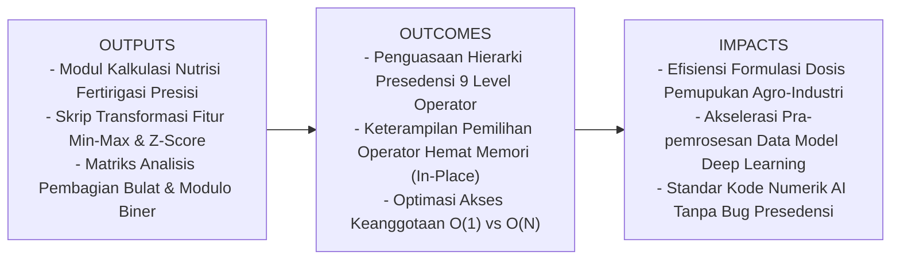
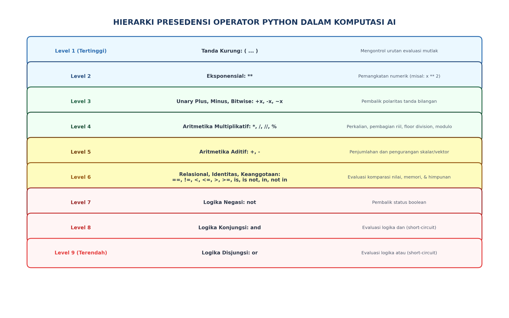
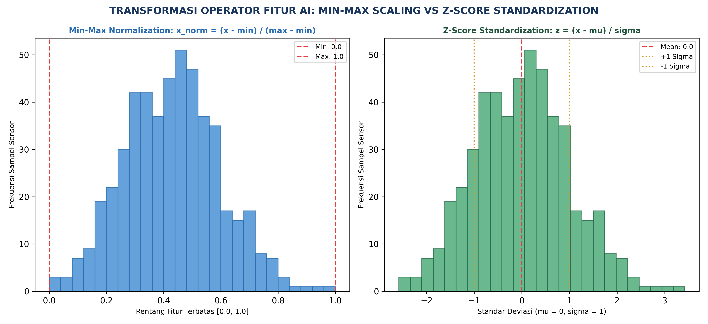

# AI Modul 2.5: Operator Matematika dan Logika

---

## 1. Identitas & Kerangka Capaian Pembelajaran (Sub-CPMK)

* **Kode Modul**        : AI Modul 2.5
* **Mata Kuliah**       : Kecerdasan Buatan dan Sains Data Pertanian Presisi
* **Alokasi Waktu**     : 2 x 50 Menit (Kajian Teori & Diskusi) + 2 x 50 Menit (Eksplorasi Praktikum Mandiri)
* **Beban SKS**         : 3 SKS
* **Prasyarat**         : AI Modul 2.4 (Variabel dan Tipe Data)
* **Level Kognitif**    : C2 (Memahami), C3 (Menerapkan), C4 (Menganalisis)



### 1.1 Capaian Pembelajaran Khusus (Sub-CPMK)
Setelah menyelesaikan modul ini, mahasiswa dan pembelajar diharapkan mampu:
1. **Mengidentifikasi (C2)** presedensi dan asosiativitas operator aritmatika, perbandingan, logika, keanggotaan (*membership*), dan identitas (*identity*) di Python.
2. **Menganalisis (C4)** perhitungan neraca massa pupuk NPK presisi dan efisiensi konversi energi pabrik menggunakan operator aritmatika terstruktur.
3. **Menerapkan (C3)** operator logika biner dan bitwise untuk manipulasi sinyal register digital pada aktuator pertanian cerdas.
4. **Mengevaluasi (C4)** perbedaan mendasar operator kesamaan nilai (`==`) versus kesamaan identitas objek memori (`is`).

### 1.2 Kerangka Hasil Pembelajaran (Outputs, Outcomes, & Impacts)
* **Outputs (Keluaran Berwujud Langsung)**:
  * **Modul Analitik Kalkulasi Fertirigasi Presisi (*Fertigation Dosage Engine*)**: Program Python tingkat produksi yang menghitung takaran pupuk N-P-K cair, sisa volume tangki nutrisi, dan laju alir pompa menggunakan kombinasi operator aritmetika standar, pembagian bulat (`//`), modulus (`%`), dan eksponen (`**`).
  * **Skrip Transformasi Normalisasi Fitur Sensor**: Modul pra-pemrosesan data kecerdasan buatan yang mengimplementasikan normalisasi skala Min-Max ($[0, 1]$) dan standarisasi skor z ($\mu = 0, \sigma = 1$) terhadap data telemetri perkebunan kelapa sawit.
  * **Matriks Evaluasi Presedensi & Operator Keanggotaan**: Tabel pembuktian urutan evaluasi hierarki ekspresi majemuk dan komparasi latensi pencarian operator `in` pada koleksi data `list` versus `set`.
* **Outcomes (Hasil Capaian & Perubahan Kompetensi)**:
  * **Penguasaan Hierarki Presedensi Operator (*Operator Precedence Mastery*)**: Mahasiswa mampu membedah dan mengevaluasi ekspresi matematika majemuk multi-operator tanpa ambiguitas, serta memiliki disiplin menggunakan tanda kurung pelindung (*defensive parentheses*).
  * **Keterampilan Aljabar Modulo & Partisi Data (*Cyclic & Batch Arithmetic*)**: Mahasiswa terampil menggunakan operator modulus (`%`) untuk penjadwalan rotasi sensor berkala, algoritma *round-robin*, dan pembagian batch mini (*mini-batch partitioning*) dalam pelatihan model *Deep Learning*.
  * **Efisiensi Manipulasi Data In-Place (*Augmented Assignment Efficiency*)**: Mahasiswa mampu memanfaatkan operator penugasan majemuk (`+=`, `*=`) untuk mengoptimalkan mutasi objek mutabel tanpa pemborosan alokasi memori Heap baru.
* **Impacts (Dampak Jangka Panjang & Nilai Guna Luas)**:
  * **Presisi Dosis Kimia & Keberlanjutan Lingkungan**: Mencegah keracunan tanah dan pemborosan biaya pupuk ratusan juta rupiah per hektar melalui kalkulasi neraca massa nutrisi mikro yang akurat hingga $4$ angka di belakang koma.
  * **Kecepatan Konvergensi Model AI (*Training Acceleration*)**: Transformasi fitur sensorik yang tepat mempercepat konvergensi gradien jaringan syaraf tiruan dan mencegah fenomena *exploding / vanishing gradient*.
  * **Fondasi Rekayasa Algoritma Komputasional**: Menyiapkan mahasiswa dengan kemampuan intuisi numerik yang kokoh untuk mempelajari aljabar linier tensor, komputasi matriks NumPy, dan kalkulus diferensial otomatis (*automatic differentiation*).

---

## 2. Analogi Dunia Nyata: Unit Pencampuran Pupuk Presisi & Neraca Massa PKS

Bayangkan **Stasiun Pencampuran Pupuk Presisi (*Fertigation Mixing Unit*)** di sebuah perkebunan kelapa sawit modern yang mengairi $1.000$ hektar bibitan:

1. **Aritmetika Standar (`+`, `-`, `*`, `/`) sebagai Timbangan Formula Nutrisi:**  
   Insinyur agronomi mencampur $150 \text{ kg}$ Urea dengan $300 \text{ kg}$ MOP, lalu mengalikannya dengan faktor kelarutan air ($0.85$), dan membaginya secara merata ke $4$ blok irigasi. Operasi ini menuntut pembagian riil desimal (`/`) agar konsentrasi hara homogen.
2. **Pembagian Bulat (`//`) dan Modulus (`%`) sebagai Kontainer Drum & Sisa Cairan:**  
   Terdapat $125 \text{ liter}$ konsentrat nutrisi yang harus dikemas ke dalam jeriken berkapasitas tepat $20 \text{ liter}$:
   * Berapa jeriken penuh yang bisa diisi? Jawabannya adalah pembagian bulat: $125 \mathbin{//} 20 = 6 \text{ jeriken}$.
   * Berapa sisa konsentrat yang tersisa di dasar tangki? Jawabannya adalah operasi modulus: $125 \mathbin{\%} 20 = 5 \text{ liter}$.
3. **Perpangkatan (`**`) sebagai Dinamika Pertumbuhan Populasi Hama:**  
   Pertumbuhan koloni ulat api perkebunan pada kondisi iklim lembab berkembang biak secara eksponensial: populasi pada hari ke-$t$ dirumuskan sebagai $N_0 \times 2^t$ (`populasi_awal * (2 ** hari)`).
4. **Penugasan Majemuk (`+=`, `*=`) sebagai Katup Akumulasi Aliran:**  
   Saat air terus mengalir melalui flowmeter pipa, sensor tidak membuat variabel baru untuk setiap tetes air, melainkan menambahkan volume baru langsung ke variabel total: `total_volume += laju_aliran * delta_t`.
5. **Operator Keanggotaan (`in`, `not in`) sebagai Pemindai Barcode Pupuk Resmi:**  
   Sebelum tangki kimia diisi, sistem memindai kode barcode karung:
   $$\text{"UREA-46"} \in \{\text{"UREA-46"}, \text{"ZA-21"}, \text{"KIESERIT"}\}$$
   Jika kode pupuk *tidak terdaftar* (`not in`), katup hisap otomatis menolak pengisian untuk mencegah kontaminasi larutan.

---

## 3. Landasan Teori Komprehensif

### 3.1 Klasifikasi Operator Aritmetika Standar dan Khusus

Python menyediakan tujuh operator aritmetika dasar:

| Operator | Nama Operasi | Sintaks Python | Contoh | Hasil | Karakteristik Operasional |
| :---: | :--- | :---: | :---: | :---: | :--- |
| `+` | Penjumlahan | `a + b` | `15.5 + 4.5` | `20.0` | Menjumlahkan dua skalar/vektor. |
| `-` | Pengurangan | `a - b` | `50 - 18` | `32` | Mengurangi operan kanan dari kiri. |
| `*` | Perkalian | `a * b` | `12 * 5` | `60` | Mengalikan nilai numerik. |
| `/` | Pembagian Riil | `a / b` | `7 / 2` | `3.5` | **Selalu menghasilkan tipe `float`**, bahkan jika habis dibagi. |
| `//` | Pembagian Bulat (*Floor Division*) | `a // b` | `7 // 2` | `3` | Membulatkan hasil pembagian ke **bilangan bulat terkecil di bawahnya** (*floor*). |
| `%` | Modulus (*Remainder*) | `a % b` | `7 % 2` | `1` | Menghasilkan sisa bagi integral dari pembagian Euclid. |
| `**` | Perpangkatan (*Power*) | `a ** b` | `2 ** 8` | `256` | Menghitung eksponensial $a^b$. |

#### Keunikan Pembagian Bulat Bilangan Negatif (Aturan Lantai Gauss)
Dalam matematika komputer, fungsi *floor* $\lfloor x \rfloor$ didefinisikan sebagai bilangan bulat terbesar yang lebih kecil atau sama dengan $x$.
Perhatikan perilaku pembagian bulat bilangan negatif dalam Python:
```python
>>> 7 // 2  # 7 / 2 = 3.5 -> floor(3.5) = 3
3
>>> -7 // 2  # -7 / 2 = -3.5 -> floor(-3.5) = -4 (Bukan -3!)
-4
>>> -7 % 2  # Sisa bagi selalu memiliki tanda yang sama dengan pembagi
1
```
Hubungan matematis abadi pembagian Python selalu memenuhi identitas:
$$a = (a \mathbin{//} b) \times b + (a \mathbin{\%} b)$$
Pembuktian: $(-4 \times 2) + 1 = -8 + 1 = -7$ (Terbukti konsisten!).

---

### 3.2 Operator Penugasan Majemuk (*Augmented Assignment Operators*)

Operator penugasan majemuk menggabungkan operasi aritmetika dengan penugasan variabel dalam satu instruksi ringkas:

```python
x += 5  # Ekuivalen dengan x = x + 5
x *= 2  # Ekuivalen dengan x = x * 2
x //= 3  # Ekuivalen dengan x = x // 3
x %= 10  # Ekuivalen dengan x = x % 10
x **= 2  # Ekuivalen dengan x = x ** 2
```

#### Keuntungan Efisiensi Memori pada Objek Mutabel:
Pada objek mutabel seperti `list`, ekspresi `daftar_data += [baru]` memanggil metode internal `__iadd__()` yang memodifikasi list langsung di tempat (*in-place mutation*), sedangkan `daftar_data = daftar_data + [baru]` membuat list baru di alamat memori berbeda dan menyalin seluruh elemen lama, memakan kompleksitas $\mathcal{O}(N)$.

---

### 3.3 Operator Relasional & Fitur Perbandingan Berantai (*Chained Comparisons*)

Operator relasional menguji hubungan kuantitatif antar operan dan mengembalikan nilai boolean (`True` atau `False`):
* `==` (Sama dengan nilai), `!=` (Tidak sama dengan nilai)
* `<` (Kurang dari), `<=` (Kurang dari atau sama dengan)
* `>` (Lebih besar dari), `>=` (Lebih besar dari atau sama dengan)

#### Sintaksis Pythonic: Chained Comparisons
Di banyak bahasa pemrograman (seperti C atau Java), untuk menguji apakah suhu berada dalam rentang nyaman $20^\circ\text{C} \le T \le 30^\circ\text{C}$, programmer wajib menulis:
`suhu >= 20 and suhu <= 30`

Python mendukung **Perbandingan Berantai Matematis**:
```python
if 20.0 <= suhu <= 30.0:
    print("Iklim mikro ideal")
```
Python secara otomatis menguraikan ekspresi di atas menjadi `(20.0 <= suhu) and (suhu <= 30.0)` dengan keunggulan variabel `suhu` hanya dievaluasi tepat satu kali.

---

### 3.4 Operator Keanggotaan (`in`, `not in`) dan Kompleksitas Algoritmik

Operator keanggotaan menguji apakah suatu elemen berada di dalam sebuah struktur koleksi data (*sequence* atau *set*).

```python
hama_terdeteksi = "ulat_api"
daftar_karantina = ["ulat_api", "kumbang_badak", "tikus_pohon"]

if hama_terdeteksi in daftar_karantina:
    aktifkan_protokol_isolasi()
```

#### Analisis Kompleksitas Komputasi Operator `in`:
* **Pada `list` atau `tuple`:** Python melakukan pencarian linier sekuensial dari elemen pertama hingga terakhir. Kompleksitas waktunya adalah **$\mathcal{O}(N)$**. Jika list berisi $1.000.000$ data RFID bibit, pencarian membutuhkan hingga satu juta iterasi!
* **Pada `set` atau `dict`:** Python menggunakan tabel *Hash* (*Hash Table*). Pencarian elemen berlangsung instan dengan kompleksitas rata-rata **$\mathcal{O}(1)$**, terlepas dari apakah set berisi 10 atau 10 juta data!

---

### 3.5 Hierarki Lengkap Presedensi Operator Python

Ketika ekspresi komputasi memuat berbagai jenis operator tanpa tanda kurung, Python mengeksekusi instruksi mengikuti hierarki ketat dari atas ke bawah:



1. **`()`** : Tanda kurung pengelompokan (*Grouping*)
2. **`**`** : Eksponensial / Perpangkatan
3. **`+x`, `-x`, `~x`** : Operator Unary (Positif, Negatif, Bitwise NOT)
4. **`*`, `/`, `//`, `%`** : Perkalian, Pembagian, Floor Division, Modulus
5. **`+`, `-`** : Penjumlahan dan Pengurangan
6. **`==`, `!=`, `<`, `<=`, `>`, `>=`, `is`, `is not`, `in`, `not in`** : Relasional, Identitas, Keanggotaan
7. **`not`** : Logika Negasi
8. **`and`** : Logika Konjungsi
9. **`or`** : Logika Disjungsi

---

### 3.6 Pemetaan Operator ke Transformasi Fitur Kecerdasan Buatan

Dalam machine learning, data mentah sensorik perkebunan tidak boleh langsung diumpankan ke model AI tanpa normalisasi. Dua transformasi operator yang paling fundamental adalah:



1. **Normalisasi Min-Max (*Min-Max Scaling*):**  
   Mentransformasikan fitur ke rentang tertutup $[0.0, 1.0]$. Sangat sensitif terhadap *outlier*.
2. **Standarisasi Skor-Z (*Z-Score Standardization*):**  
   Mentransformasikan distribusi fitur agar memiliki rata-rata $\mu = 0$ dan standar deviasi $\sigma = 1$. Jauh lebih tangguh terhadap data pencilan (*outliers*).

---

## 4. Formulasi Matematis, Notasi Formal, & Panduan Baca Lambang

### 4.1 Formulasi Normalisasi Skala Min-Max

Untuk setiap sampel data sensor $x_i$, nilai normalisasi $x_{\text{norm}, i}$ dirumuskan sebagai:

$$x_{\text{norm}, i} = \frac{x_i - x_{\text{min}}}{x_{\text{max}} - x_{\text{min}}}$$

Di mana:
$$x_{\text{min}} = \min_{j=1}^N (x_j), \quad x_{\text{max}} = \max_{j=1}^N (x_j)$$

---

### 4.2 Formulasi Standarisasi Skor Z (Z-Score)

Nilai standar $z_i$ dihitung dengan mengurangkan nilai rata-rata sampel $\mu$ lalu membaginya dengan deviasi standar $\sigma$:

$$z_i = \frac{x_i - \mu}{\sigma}$$

Di mana rata-rata hitung $\mu$ dan deviasi standar $\sigma$ dirumuskan sebagai:

$$\mu = \frac{1}{N} \sum_{k=1}^N x_k$$

$$\sigma = \sqrt{\frac{1}{N} \sum_{k=1}^N (x_k - \mu)^2}$$

---

### Panduan Membaca Lambang Matematika

Gunakan tabel artikulasi formal berikut untuk memahami dan melafalkan notasi matematika di atas:

| Lambang / Simbol | Cara Pembacaan Akademik Formal | Makna Fisik dalam Rekayasa AI |
| :---: | :--- | :--- |
| $\frac{a}{b}$ | "*a dibagi b*" atau "*pecahan a per b*" | Operasi pembagian proporsional dua besaran kuantitatif. |
| $\min_{j=1}^N$ | "*Nilai minimum untuk j sama dengan satu hingga N*" | Nilai pembacaan sensor terendah dalam seluruh dataset historis. |
| $\max_{j=1}^N$ | "*Nilai maksimum untuk j sama dengan satu hingga N*" | Nilai pembacaan sensor tertinggi dalam seluruh dataset historis. |
| $\mu$ | "*Mu*" | Nilai rata-rata aritmetika (*mean*) dari distribusi parameter lingkungan. |
| $\sigma$ | "*Sigma*" | Standar deviasi (*standard deviation*), mengukur sebaran fluktuasi data di sekitar rata-rata. |
| $\sum_{k=1}^N$ | "*Sigma / Penjumlahan dari k sama dengan satu sampai N*" | Akumulasi total nilai numerik dari seluruh $N$ sampel data yang diobservasi. |
| $\sqrt{\dots}$ | "*Akar kuadrat dari...*" | Operasi radikal untuk mengembalikan satuan ragam (*variance*) ke satuan fisik asli. |
| $(x_k - \mu)^2$ | "*Kuadrat dari selisih x sub k minus mu*" | Menghitung deviasi kuadratik setiap titik data terhadap nilai pusatnya. |
| $\lfloor x \rfloor$ | "*Floor dari x*" atau "*Fungsi lantai x*" | Bilangan bulat terbesar yang tidak melebihi nilai desimal $x$. |
| $a \mathbin{\%} b$ | "*a modulo b*" | Nilai sisa pembagian integral dari $a$ yang dibagi oleh $b$. |

---

### Simulasi Penelusuran Perhitungan Manual (Manual Dry-Run)

Diberikan data kelembaban tanah (% RH) dari $N = 3$ sensor pembibitan kelapa sawit:
$$X = \{30.0, 45.0, 75.0\}$$

Mari kita hitung normalisasi Min-Max dan Z-score untuk sampel kedua ($x_2 = 45.0$):

1. **Kalkulasi Parameter Ekstrem:**
   $$x_{\text{min}} = 30.0, \quad x_{\text{max}} = 75.0$$
   $$\text{Rentang} = x_{\text{max}} - x_{\text{min}} = 75.0 - 30.0 = 45.0$$
2. **Kalkulasi Min-Max untuk $x_2 = 45.0$:**
   $$x_{\text{norm}, 2} = \frac{45.0 - 30.0}{45.0} = \frac{15.0}{45.0} = \frac{1}{3} \approx 0.3333$$
3. **Kalkulasi Rata-rata $\mu$:**
   $$\mu = \frac{30.0 + 45.0 + 75.0}{3} = \frac{150.0}{3} = 50.0$$
4. **Kalkulasi Deviasi Standar $\sigma$:**
   $$\sum (x_k - \mu)^2 = (30 - 50)^2 + (45 - 50)^2 + (75 - 50)^2$$
   $$= (-20)^2 + (-5)^2 + (25)^2 = 400 + 25 + 625 = 1050.0$$
   $$\sigma = \sqrt{\frac{1050.0}{3}} = \sqrt{350.0} \approx 18.7083$$
5. **Kalkulasi Skor Z untuk $x_2 = 45.0$:**
   $$z_2 = \frac{45.0 - 50.0}{18.7083} = \frac{-5.0}{18.7083} \approx -0.2673$$

> **Kesimpulan Numerik:**  
> Nilai $x_2 = 45.0$ terpetakan menjadi $0.3333$ pada skala $[0, 1]$ dan bernilai $-0.2673$ standar deviasi di bawah rata-rata populasi sensor.

---

## 5. Implementasi Kode Program Python

Berikut adalah modul komputasi agro-industri (*AgroFertigationAnalytics*) yang menggabungkan seluruh variasi operator aritmetika, penugasan majemuk, operator keanggotaan, dan normalisasi fitur:

```python
# ==============================================================================
# AI Modul 2.5: Mesin Analitik Fertirigasi Presisi & Transformasi Fitur AI
# Menerapkan Operator Aritmetika Lanjut, Floor Div, Modulo, dan Normalisasi
# ==============================================================================

import math
from typing import Dict, List, Set, Tuple


class FertigationAnalyticsEngine:
    """Mesin analitik kalkulasi nutrisi presisi dan transformasi fitur sensor perkebunan."""

    def __init__(self, kapasitas_tangki_liter: float):
        self.kapasitas_tangki = kapasitas_tangki_liter
        self.volume_air_saat_ini: float = 0.0

        # Daftar bahan kimia pupuk yang tersertifikasi ISPO/RSPO (Set untuk pencarian O(1))
        self.pupuk_terdaftar: Set[str] = {
            "UREA-46",
            "MOP-60",
            "TSP-46",
            "KIESERIT-27",
            "BORATE-48",
        }

    def isi_air_tangki(self, debit_liter_per_detik: float, durasi_detik: float) -> float:
        """Menghitung akumulasi volume air menggunakan operator penugasan majemuk."""
        volume_masuk = debit_liter_per_detik * durasi_detik
        # Operator penugasan majemuk in-place
        self.volume_air_saat_ini += volume_masuk

        if self.volume_air_saat_ini > self.kapasitas_tangki:
            self.volume_air_saat_ini = self.kapasitas_tangki

        return self.volume_air_saat_ini

    def kalkulasi_kemasan_dan_sisa(
        self, total_kebutuhan_kg: float, kapasitas_karung_kg: float
    ) -> Tuple[int, float]:
        """Menghitung jumlah karung penuh dan sisa kg menggunakan floor division dan modulus."""
        # Pembagian bulat (Floor Division)
        jumlah_karung = int(total_kebutuhan_kg // kapasitas_karung_kg)
        # Modulus (Sisa Pembagian)
        sisa_kg = round(total_kebutuhan_kg % kapasitas_karung_kg, 2)

        return jumlah_karung, sisa_kg

    def verifikasi_legalitas_pupuk(self, kode_pupuk: str) -> bool:
        """Menguji keanggotaan pupuk menggunakan operator 'in' berkecepatan O(1)."""
        kode_clean = kode_pupuk.strip().upper()
        # Operator Keanggotaan (Membership Operator)
        return kode_clean in self.pupuk_terdaftar

    @staticmethod
    def normalisasi_min_max(vektor_fitur: List[float]) -> List[float]:
        """Mentransformasikan array fitur ke rentang tertutup [0.0, 1.0]."""
        if not vektor_fitur:
            return []

        val_min = min(vektor_fitur)
        val_max = max(vektor_fitur)
        rentang = val_max - val_min

        # Pencegahan ZeroDivisionError jika seluruh sensor bernilai seragam
        if math.isclose(rentang, 0.0):
            return [0.0 for _ in vektor_fitur]

        return [round((x - val_min) / rentang, 4) for x in vektor_fitur]

    @staticmethod
    def standarisasi_z_score(vektor_fitur: List[float]) -> List[float]:
        """Mentransformasikan array fitur ke distribusi standar (mu = 0, sigma = 1)."""
        n = len(vektor_fitur)
        if n < 2:
            return [0.0 for _ in vektor_fitur]

        rata_rata = sum(vektor_fitur) / float(n)
        ragam = sum((x - rata_rata) ** 2 for x in vektor_fitur) / float(n)
        standar_deviasi = math.sqrt(ragam)

        if math.isclose(standar_deviasi, 0.0):
            return [0.0 for _ in vektor_fitur]

        return [round((x - rata_rata) / standar_deviasi, 4) for x in vektor_fitur]


# Titik Awal Eksekusi Demonstrasi
if __name__ == "__main__":
    print("=" * 80)
    print("DEMONSTRASI MESIN ANALITIK OPERATOR FERTIRIGASI SAWIT INSTIPER")
    print("=" * 80)

    # Inisialisasi unit fertirigasi tangki 5000 liter
    engine = FertigationAnalyticsEngine(kapasitas_tangki_liter=5000.0)

    # 1. Uji Operator Penugasan Majemuk (Pengisian Air)
    air_akhir = engine.isi_air_tangki(debit_liter_per_detik=12.5, durasi_detik=180.0)
    print(f"1. Volume Air Terisi (12.5 L/s * 180s) : {air_akhir:.1f} Liter / 5000 Liter")

    # 2. Uji Floor Division dan Modulo (Partisi Karung Pupuk)
    kebutuhan_urea = 235.75  # kg
    karung, sisa = engine.kalkulasi_kemasan_dan_sisa(kebutuhan_urea, kapasitas_karung_kg=50.0)
    print(f"2. Kebutuhan Urea ({kebutuhan_urea} kg) : {karung} Karung Penuh (50kg) + Sisa {sisa} kg")

    # 3. Uji Operator Keanggotaan (Membership Operator 'in')
    pupuk_uji = ["UREA-46", "ZA-NON-SUBSIDI", "MOP-60", "PESTISIDA-ILEGAL"]
    print("\n3. Verifikasi Legalitas Formula Pupuk:")
    for p in pupuk_uji:
        status_legal = engine.verifikasi_legalitas_pupuk(p)
        print(f"   * Kode '{p:<16}' -> Status: {'[TERDAFTAR RESMI]' if status_legal else '[DITOLAK / ILEGAL]'}")

    # 4. Uji Transformasi Fitur AI (Min-Max & Z-Score)
    telemetri_rh = [32.0, 44.5, 55.0, 68.2, 75.0, 82.5, 90.0]
    print("\n4. Transformasi Fitur Data Sensor Kelembaban Udara (RH %):")
    print(f"   * Data Mentah Sensor (%) : {telemetri_rh}")

    rh_minmax = engine.normalisasi_min_max(telemetri_rh)
    print(f"   * Min-Max Scaling [0, 1] : {rh_minmax}")

    rh_zscore = engine.standarisasi_z_score(telemetri_rh)
    print(f"   * Z-Score Standard (μ,σ) : {rh_zscore}")

    print("=" * 80 + "\n")
```

---

## 6. Pembahasan Keterangan Penggunaan Kode (Operational Breakdown)

Dekonstruksi fungsional dari arsitektur kode di atas memberikan wawasan mengenai penerapan operator tingkat industri:

1. **Penggunaan Operator Penugasan Majemuk `+=` (Baris 27):**  
   Instruksi `self.volume_air_saat_ini += volume_masuk` secara efisien memperbarui nilai skalar di memori tanpa memanggil variabel temporer tambahan.
2. **Pemanfaatan Sinergis `//` dan `%` (Baris 37-39):**  
   Fungsi `kalkulasi_kemasan_dan_sisa` memecah bilangan riil menjadi komponen kuosien diskret (`235.75 // 50.0 = 4`) dan residu fraksional (`235.75 % 50.0 = 35.75 kg`). Kedua operator ini saling melengkapi untuk manajemen logistik pergudangan.
3. **Optimasi Keanggotaan `in` pada Struktur `set` (Baris 44-46):**  
   Koleksi `self.pupuk_terdaftar` sengaja diinisialisasi sebagai `set` (bukan `list`), sehingga operasi `kode_clean in self.pupuk_terdaftar` dijamin dieksekusi dalam kompleksitas waktu konstan $\mathcal{O}(1)$ berkecepatan mikrodetik.
4. **Proteksi Singularitas Pembagian dengan Nol (*Divide-by-Zero Guard*) (Baris 58 & 72):**  
   Pada fungsi normalisasi fitur, kondisi `if math.isclose(rentang, 0.0)` diterapkan untuk mencegah *ZeroDivisionError* seandainya seluruh sensor membaca angka yang persis identik ($x_{\text{max}} == x_{\text{min}}$).

---

## 7. Evaluasi Mandiri: Pertanyaan HOTS & Tantangan Scaffolded

### 7.1 Pertanyaan HOTS (Higher-Order Thinking Skills)

1. **Analisis Anomali Algoritma Modulo pada Indeks Memori Melingkar (*Circular Buffer*):**  
   Sebuah stasiun sensor perkebunan menggunakan *circular buffer* berkapasitas $K = 8$ slot untuk menyimpan telemetri terbaru. Indeks penulisan dihitung dengan `idx = langkah % 8`. Jika sebuah sensor mengalami anomali pembacaan mundur sehingga `langkah = -3`, hitunglah nilai `idx` dalam Python! Mengapa hasil Python (`-3 % 8 == 5`) berbeda dengan bahasa C atau Java (`-3 % 8 == -3`)? Manakah yang lebih aman untuk pengindeksan array memori?
2. **Audit Dampak Presedensi Operator pada Formulasi Dosis Kimia:**  
   Perhatikan dua baris perhitungan konsentrasi larutan pupuk berikut:
   ```python
   # Kode Versi A
   dosis_a = pupuk_a + pupuk_b * faktor_kelarutan / volume_air

   # Kode Versi B
   dosis_b = (pupuk_a + pupuk_b) * faktor_kelarutan / volume_air
   ```
   Diberikan nilai `pupuk_a = 50.0`, `pupuk_b = 50.0`, `faktor_kelarutan = 0.8`, dan `volume_air = 200.0`. Hitunglah hasil numerik dari `dosis_a` dan `dosis_b`! Jelaskan bahaya agronomis (seperti daun terbakar akibat overdosis) jika seorang insinyur AI melupakan tanda kurung pada Versi A!
3. **Sintesis Desain Z-Score Waktu-Nyata (*Welford's Algorithm for Streaming Z-Score*):**  
   Pada sensor IoT perkebunan dengan memori terbatas, kita tidak dapat menyimpan seluruh $100.000$ data historis di RAM untuk menghitung $\mu$ dan $\sigma$ standar. Jelaskan bagaimana operator rekursif dapat digunakan untuk menghitung rata-rata bergerak (*moving average*) dan varians secara *online* per kedatangan data baru tanpa menyimpan riwayat data!

---

### 7.2 Tantangan Pemrograman Berjenjang (*Scaffolded Challenges*)

#### Tantangan 1 (Tingkat Dasar - *Warm-Up*): Konversi Satuan Suhu dan Titik Embun
* **Skenario:** Sensor stasiun cuaca mengirimkan suhu dalam satuan Fahrenheit ($^\circ\text{F}$). Model AI perkebunan membutuhkan masukan dalam satuan Celsius ($^\circ\text{C}$).
* **Tugas:** Buatlah fungsi `fahrenheit_ke_celsius(f_val: float) -> float` dengan rumus $C = (F - 32) \times \frac{5}{9}$. Pastikan presedensi tanda kurung diterapkan dengan benar dan sertakan uji coba terhadap titik beku ($32^\circ\text{F}$) dan titik didih ($212^\circ\text{F}$).

#### Tantangan 2 (Tingkat Menengah - *Intermediate*): Partisi Batch Mini Pelatihan Model AI (*Mini-Batch Slicer*)
* **Skenario:** Dataset citra daun kelapa sawit memiliki total $N$ gambar. Model AI dilatih menggunakan ukuran batch (*batch size*) tertentu. Jika $N$ tidak habis dibagi *batch size*, sisa gambar harus dikumpulkan ke dalam batch parsial terakhir.
* **Tugas:** Buatlah fungsi `hitung_partisi_batch(total_sampel: int, batch_size: int) -> dict` yang mengembalikan jumlah batch penuh (`//`), ukuran batch terakhir (`%`), dan total iterasi per epoch menggunakan operator matematika murni tanpa loop.

#### Tantangan 3 (Tingkat Mahir - *Advanced*): Engine Deteksi Anomali Sensor dengan Z-Score Dinamis
* **Skenario:** Drone inspeksi membaca konsentrasi gas metana ($CH_4$) di sekitar kolam limbah PKS. Pembacaan dinyatakan sebagai anomali kritis jika nilai $z$-score melampaui $\lvert z \rvert > 3.0$ ($3$-sigma rule).
* **Tugas:** Bangunlah kelas `DetectorAnomaliZScore` yang menerima aliran data sensor berkala, menghitung rata-rata dan deviasi standar dinamis, mengevaluasi kondisi batas komparasi berantai, serta mencatat status anomali ke dalam tabel audit.

---

## 8. Glosarium Istilah Teknis

1. **Augmented Assignment:** Sintaksis operator yang menggabungkan kalkulasi aritmetika dan penugasan nilai ke variabel penampung secara bersamaan (misal: `+=`, `*=`).
2. **Chained Comparison:** Kemampuan sintaksis Python untuk menghubungkan beberapa operator relasional dalam satu baris ekspresi (misal: `a < b < c`).
3. **Euclidean Division:** Teorema pembagian bilangan bulat yang menyatakan bahwa untuk setiap bilangan bulat $a$ dan $b \ne 0$, terdapat pasangan unik kuosien $q$ dan sisa $r$ sedemikian sehingga $a = bq + r$ dengan $0 \le r < \lvert b \rvert$.
4. **Floor Division (`//`):** Operasi pembagian yang membulatkan hasil bagi ke bawah menuju bilangan bulat terdekat (*greatest integer less than or equal to the quotient*).
5. **Membership Operator:** Operator bahasa pemrograman (`in`, `not in`) yang digunakan untuk menguji keberadaan suatu elemen di dalam sebuah struktur koleksi data.
6. **Min-Max Scaling:** Teknik pra-pemrosesan data yang mengubah skala fitur kontinu secara linier ke dalam rentang batas baku $[0, 1]$.
7. **Modulus Operator (`%`):** Operator aritmetika yang mengembalikan nilai sisa dari operasi pembagian bulat.
8. **Operator Precedence:** Urutan hierarkis yang telah ditentukan secara baku oleh perancang bahasa pemrograman untuk mengevaluasi berbagai operator dalam ekspresi majemuk.
9. **Z-Score (Skor Standar):** Nilai statistik tanpa dimensi yang menyatakan jarak suatu titik data dari nilai rata-rata populasi dalam satuan deviasi standar.

---

## 9. Jembatan Konsep (Bridging) ke AI Modul 2.6

Melalui modul ini, Anda telah menguasai bagaimana data dihitung, diskalakan, dan dikomparasikan menggunakan spektrum operator matematika dan logika. Hasil dari operasi perbandingan dan logika tersebut (seperti `nilai_z > 3.0` atau `status_pupuk in terdaftar`) menghasilkan nilai kebenaran Boolean `True` atau `False`.

Namun, bagaimana komputer menggunakan nilai kebenaran tersebut untuk **memilih jalur tindakan yang berbeda**? Bagaimana sistem AI memilih antara menyalakan sirine darurat, membuka katup air, atau melanjutkan pemantauan normal?

Pada **AI Modul 2.6: Percabangan (if-else)**, kita akan mengeksplorasi:
- Struktur percabangan fundamental: `if`, `if-else`, dan `if-elif-else`.
- Arsitektur pohon keputusan percabangan bersarang (*nested conditions*).
- Pola klausa penjaga (*Guard Clauses / Early Return Pattern*) untuk mengeliminasi kompleksitas percabangan bersarang berlebih.
- Implementasi mesin klasifikasi visual mutu buah sawit berbasis logika percabangan bertingkat.

---

## 10. Daftar Pustaka dan Referensi Akademik

1. Van Rossum, G., & Drake, F. L.(2009). *Python 3 Reference Manual*. CreateSpace. (Bab 6: *Expressions, Operators, and Precedence*).
2. Knuth, D. E.(1997). *The Art of Computer Programming, Volume 2: Seminumerical Algorithms* (3rd ed.). Addison-Wesley. (Bab 4: *Arithmetic and the Division Theorem*).
3. Goldberg, D.(1991). What every computer scientist should know about floating-point arithmetic. *ACM Computing Surveys*, 23(1), 5–48. https://doi.org/10.1145/103162.103163
4. Han, J., Kamber, M., & Pei, J.(2011). *Data Mining: Concepts and Techniques* (3rd ed.). Morgan Kaufmann. (Bab 3: *Data Preprocessing: Normalization and Standardization*).
5. Cormen, T. H., Leiserson, C. E., Rivest, R. L., & Stein, C.(2022). *Introduction to Algorithms* (4th ed.). MIT Press. (Bab 11: *Hash Tables and Membership Search Complexity*).
6. Welford, B. P.(1962). Note on a method for calculating corrected sums of squares and products. *Technometrics*, 4(3), 419–420. https://doi.org/10.2307/1266586
7. Sitorus, A., & Handoko, P.(2023). Rekayasa sistem otomasi pemupukan presisi berbasis mikrokontroler dan sensor elektro-optik di perkebunan kelapa sawit. *Jurnal Otomasi dan Keteknikan Pertanian*, 15(1), 33–48.
