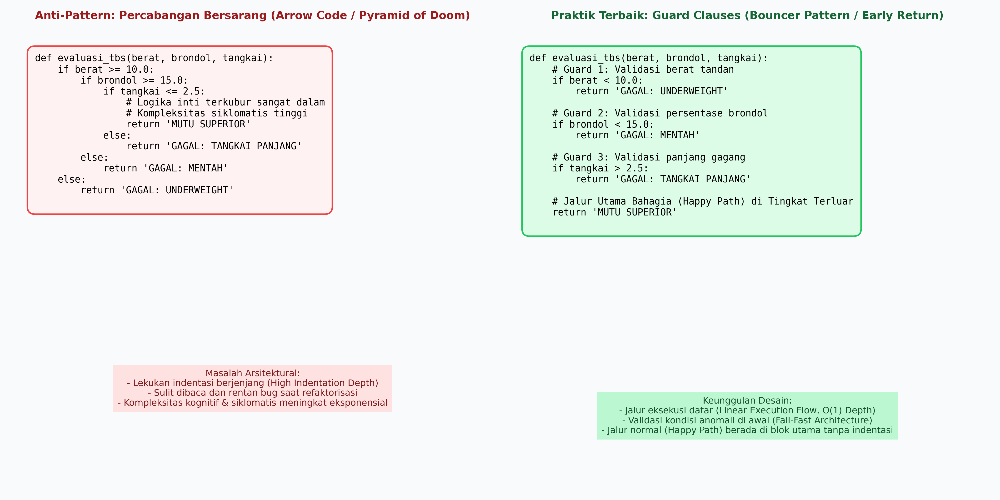
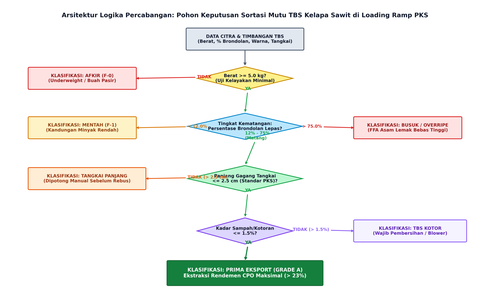

# AI Modul 2.6: Percabangan (if-else)

---

## 1. Identitas & Kerangka Capaian Pembelajaran (Sub-CPMK)

* **Kode Modul**        : AI Modul 2.6
* **Mata Kuliah**       : Kecerdasan Buatan dan Sains Data Pertanian Presisi
* **Alokasi Waktu**     : 2 x 50 Menit (Kajian Teori & Diskusi) + 2 x 50 Menit (Eksplorasi Praktikum Mandiri)
* **Beban SKS**         : 3 SKS
* **Prasyarat**         : AI Modul 2.5 (Operator Matematika dan Logika)
* **Level Kognitif**    : C2 (Memahami), C3 (Menerapkan), C4 (Menganalisis)

```mermaid
flowchart LR
    subgraph OUTPUTS["OUTPUTS (Keluaran Pembelajaran)"]
        O1["Script Struktur Percabangan Bersih (PEP 8)"]
        O2["Pohon Keputusan Sortasi Mutu TBS Sawit"]
        O3["Modul Klausa Penjaga (Guard Clauses Pattern)"]
    end

    subgraph OUTCOMES["OUTCOMES (Kompetensi & Keterampilan)"]
        OC1["Keterampilan Merancang Alur Logika Bebas Percabangan Bersarang"]
        OC2["Keahlian Menerjemahkan Standar Mutu PKS ke Kode"]
        OC3["Kemampuan Mengeliminasi Kode Tak Terstruktur & Kompleksitas Lekukan"]
    end

    subgraph IMPACTS["IMPACTS (Dampak Strategis Industri)"]
        I1["Otomasi Stasiun Sortasi Loading Ramp Presisi Tinggi"]
        I2["Minimalisasi Kerugian Rendemen CPO & Asam Lemak Bebas"]
        I3["Arsitektur Sistem Cerdas Tangguh Skala Industri"]
    end

    OUTPUTS --> OUTCOMES --> IMPACTS
```



### 1.1 Capaian Pembelajaran Khusus (Sub-CPMK)
Setelah menyelesaikan modul ini, mahasiswa dan pembelajar diharapkan mampu:
1. **Menguraikan (C2)** arsitektur kontrol percabangan (if, if-else, if-elif-else, nested if) dan sintaks percabangan struktural modern (*Structural Pattern Matching* / `match-case`).
2. **Menganalisis (C4)** pohon keputusan sortasi mutu buah sawit berdasarkan parameter visual dan refraktometer kematangan.
3. **Menerapkan (C3)** teknik perataan percabangan (*guard clauses*) untuk mengeliminasi kode bersarang (*pyramid of doom*) pada mesin inferensi aturan AI.
4. **Mengevaluasi (C4)** kompleksitas siklomatis (*Cyclomatic Complexity*) logika percabangan guna menjamin keterujian (*testability*) sistem cerdas.

### 1.2 Kerangka Hasil Pembelajaran (Outputs, Outcomes, & Impacts)
* **Outputs (Keluaran Berwujud Langsung)**:
* **Outcomes (Hasil Capaian & Perubahan Kompetensi)**:
* **Impacts (Dampak Jangka Panjang & Nilai Guna Luas)**:

---

## 2. Klasifikasi Struktur Kontrol Alur Eksekusi & Teori Pohon Keputusan

### 2.1 Teorema Struktur Program Bohm-Jacopini
Dalam ilmu komputer teoretis, Teorema Bohm-Jacopini (1966) membuktikan bahwa setiap algoritma komputasi apa pun yang dapat dihitung (*computable*) dapat diekspresikan hanya menggunakan tiga struktur kontrol dasar:
1. **Urutan (Sequence):** Eksekusi instruksi baris demi baris secara linier dari atas ke bawah.
2. **Pemilihan (Selection / Branching):** Pengalihan cabang eksekusi berdasarkan evaluasi nilai kebenaran Boolean (`True` atau `False`).
3. **Pengulangan (Iteration / Repetition):** Peninjauan kembali instruksi secara berulang selama suatu kondisi predikat terpenuhi.

Percabangan (*branching*) bertindak sebagai katup logika: ia memecah alur linier menjadi banyak jalur alternatif (*deterministic paths*).

### 2.2 Representasi Matematis Pohon Keputusan (*Decision Tree Theory*)
Secara grafis dan formal, percabangan berlapis membentuk sebuah graf pohon terarah tanpa siklus (*Directed Acyclic Graph* / DAG) yang dikenal sebagai **Pohon Keputusan** (*Decision Tree*). Sebuah pohon keputusan $T = (V, E)$ terdiri dari:
- **Simpul Internal (Decision Nodes $v \in V_{\text{internal}}$):** Titik evaluasi predikat prediktif $f(x) \bowtie \theta$, di mana $x$ adalah vektor fitur masukan (misal: berat buah, warna RGB, persentase brondol), $\bowtie \, \in \{<, \le, >, \ge, =, \ne\}$, dan $\theta$ adalah nilai ambang batas (*threshold*).
- **Busur Cabang (Branches $e \in E$):** Hasil evaluasi Boolean yang memetakan simpul ke simpul turunan berikutnya.
- **Simpul Daun (Leaf / Terminal Nodes $v \in V_{\text{leaf}}$):** Hasil akhir tindakan atau label kelas keputusan (misal: "Grade A", "Afkir", "Rebus").

Dalam arsitektur *Expert Systems* dan pembelajaran mesin berbasis pohon (seperti *CART*, *ID3*, atau *Random Forest*), setiap rantai percabangan `if-elif-else` merefleksikan satu aturan partisi hiper-ruang fitur ortogonal.

---

## 3. Sintaksis Percabangan Idiomatis Python

Python menyediakan sintaksis percabangan yang ekspresif, bersih, dan mengandalkan sistem indentasi ketat (4 spasi per tingkat blok kode).

### 3.1 Percabangan Tunggal (`if`)
Struktur `if` mengevaluasi ekspresi kondisi Boolean. Blok pernyataan hanya dieksekusi jika kondisi bernilai `True`.
```python
# Evaluasi kondisi tunggal
if suhu_rebusan_c > 140.0:
  print("[PERINGATAN] Suhu sterilizer melebihi batas keselamatan!")
```

### 3.2 Percabangan Biner (`if-else`)
Menyediakan jalur alternatif komplementer (*mutually exclusive*) jika kondisi pertama tidak terpenuhi (`False`).
```python
if berat_tandan_kg >= 5.0:
  kategori_bobot = "LAYAK_PROSES"
else:
  kategori_bobot = "AFKIR_UNDERWEIGHT"
```

### 3.3 Percabangan Multi-Kondisi (`if-elif-else`)
Mengevaluasi serangkaian kondisi secara berurutan (*top-down*). Segera setelah salah satu kondisi terpenuhi, Python mengeksekusi blok terkait dan **langsung melompati** seluruh blok `elif` dan `else` berikutnya (*short-circuit branching*).
```python
if fraksi_brondol < 12.0:
  status_matang = "MENTAH (F-1)"
elif fraksi_brondol <= 75.0:
  status_matang = "MATANG (F-2)"
else:
  status_matang = "LEWAT MATANG (F-3)"
```

### 3.4 Operator Ternary (*Conditional Expression*)
Untuk penugasan variabel satu baris berbasis kondisi, Python menyediakan sintaksis ternary:
$$\text{nilai} = \text{nilai\_true} \;\mathbf{if}\; \text{kondisi} \;\mathbf{else}\; \text{nilai\_false}$$

- **Keterangan Komponen Simbol:** $\text{nilai}$ adalah variabel penerima hasil evaluasi, $\text{kondisi}$ adalah ekspresi Boolean yang bernilai `True` atau `False`, $\text{nilai\_true}$ adalah nilai yang dikembalikan jika kondisi terpenuhi, dan $\text{nilai\_false}$ adalah nilai cadangan jika kondisi tidak terpenuhi.
- **Cara Membaca Rumus:** *"Nilai variabel ditetapkan sama dengan nilai-true jika kondisi terpenuhi, selain itu ditetapkan sama dengan nilai-false."*

```python
# Idiomatis: Ringkas, cepat, dan deklaratif
mode_blower = "MAKSIMUM" if kelembaban_rh > 85.0 else "NORMAL"
```

---

## 4. Patologi Kode Bersarang (*Nested Conditionals*) & Pola Klausa Penjaga (*Guard Clauses*)

### 4.1 Patologi Rekayasa Perangkat Lunak: Percabangan Bersarang Berlebih (*Deeply Nested Conditionals*)
Salah satu kesalahan arsitektural yang kerap terjadi pada tahap awal pengembangan perangkat lunak adalah penumpukan blok `if` di dalam blok `if` lain secara berulang-ulang (*deeply nested conditionals* atau secara informal dikenal sebagai *arrow anti-pattern*).

```python
# CONTOH DENGAN INDENTASI BERLEBIH (Deeply Nested Conditionals)
def validasi_lori_sawit(id_lori, muatan_ton, status_rem):
  if id_lori is not None:
    if muatan_ton > 0.0:
      if muatan_ton <= 5.0:
        if status_rem == "AKTIF":
          return "LORI SIAP MASUK STERILIZER"
        else:
          return "BAHAYA: REM TIDAK AKTIF"
      else:
        return "KELEBIHAN MUATAN"
    else:
      return "MUATAN KOSONG"
  else:
    return "ID LORI TIDAK VALID"
```

Kelemahan arsitektur di atas meliputi:
1. **Peningkatan Kompleksitas Siklomatis:** Setiap tingkat lekukan menambah beban kognitif bagi pengembang dalam menelusuri seluruh prasyarat kondisi.
2. **Keterasingan Alur Eksekusi Baku (*Nominal Execution Path*):** Logika utama sistem terkubur jauh di dalam lapisan lekukan terdalam.
3. **Penanganan Kasus Pengecualian yang Tertunda:** Evaluasi kondisi kegagalan atau anomali input (seperti ID tidak valid) berada jauh di dasar blok fungsi.

### 4.2 Praktik Terbaik: Pola Klausa Penjaga (*Guard Clauses / Early Return Pattern*)
*Guard Clauses* menyusun alur evaluasi secara linear: periksa seluruh kondisi anomali, kegagalan batas, atau prasyarat input **di awal fungsi**, lalu segera lakukan pemutusan eksekusi lebih awal (*early return* atau melempar eksepsi). Alur eksekusi baku (*nominal execution path*) dibiarkan mengalir pada tingkat indentasi dasar.



*Gambar 2.6.1: Perbandingan struktural antara Percabangan Bersarang Berlebih (Kiri) versus Pola Desain Klausa Penjaga / Guard Clauses (Kanan).*

```python
# CONTOH TERSTRUKTUR DAN PROFESIONAL (Guard Clauses)
def validasi_lori_sawit(id_lori, muatan_ton, status_rem):
  # Guard 1: Validasi kelengkapan identitas lori
  if id_lori is None:
    return "ID LORI TIDAK VALID"

  # Guard 2: Validasi muatan batas bawah
  if muatan_ton <= 0.0:
    return "MUATAN KOSONG"

  # Guard 3: Validasi kapasitas batas atas
  if muatan_ton > 5.0:
    return "KELEBIHAN MUATAN"

  # Guard 4: Validasi integritas sistem pengereman
  if status_rem != "AKTIF":
    return "BAHAYA: REM TIDAK AKTIF"

  # Alur eksekusi baku berada pada tingkat indentasi terluar
  return "LORI SIAP MASUK STERILIZER"
```

---

## 5. Implementasi Kasus Nyata: Pipeline Klasifikasi Mutu TBS Sawit & Triage Darurat PKS

Pada stasiun penerimaan buah (*loading ramp*) Pabrik Kelapa Sawit (PKS) berkapasitas 60 ton TBS/jam, ribuan tandan buah diperiksa setiap hari. Di bawah ini disajikan diagram alir pohon keputusan resmi sortasi buah sawit:



*Gambar 2.6.2: Arsitektur Pohon Keputusan Otomasi Sortasi Mutu Tandan Buah Segar (TBS) di Loading Ramp PKS.*

Berikut adalah implementasi Python skala industri yang menggabungkan pohon keputusan sortasi mutu buah dan sistem *triage* keselamatan stasiun perebusan (*sterilizer*):

```python
"""AI Modul 2.6: Pipeline Klasifikasi Mutu TBS Kelapa Sawit & Triage Pabrik Kelapa Sawit (PKS).

Penulis: Tim Kurikulum AI & Sains Data INSTIPER Yogyakarta
Standar: Python 3.10+ / Clean Code Architecture (PEP 8)
"""

from dataclasses import dataclass
import enum
from typing import Dict, List, Optional, Tuple


class KategoriMutuTBS(enum.Enum):
  """Enumerasi resmi kategori fraksi kematangan dan mutu TBS di PKS."""

  PRIMA_EKSPOR_GRADE_A = "PRIMA EKSPOR (GRADE A)"
  MENTAH_FRAKSI_1 = "MENTAH (FRAKSI 1)"
  LEWAT_MATANG_FRAKSI_3 = "LEWAT MATANG / OVERRIPE (FRAKSI 3)"
  TANGKAI_PANJANG = "AFKIR SEMENTARA: TANGKAI PANJANG"
  KOTOR_SAMPAH_TINGGI = "AFKIR SEMENTARA: KONTAMINASI TINGGI"
  AFKIR_UNDERWEIGHT = "AFKIR TOTAL: BERAT TIDAK MEMENUHI SYARAT"


@dataclass(frozen=True)
class TelemetriTBS:
  """Objek data transfer pembacaan sensor dan visi komputer per tandan buah."""

  id_tandan: str
  berat_kg: float
  persen_brondol_lepas: float
  panjang_tangkai_cm: float
  kadar_kotoran_persen: float


class EngineSortasiTBS:
  """Engine cerdas untuk mengklasifikasi mutu TBS menggunakan prinsip

  Pohon Keputusan Deterministiik dan Pola Guard Clauses.
  """

  # Batas ambang standar teknis industri kelapa sawit
  BERAT_MINIMUM_KG: float = 5.0
  BRONDOL_MIN_MATANG: float = 12.0
  BRONDOL_MAX_MATANG: float = 75.0
  PANJANG_TANGKAI_MAKS_CM: float = 2.5
  KADAR_KOTORAN_MAKS_PERSEN: float = 1.5

  @classmethod
  def evaluasi_mutu(cls, tbs: TelemetriTBS) -> Tuple[KategoriMutuTBS, str]:
    """Mengevaluasi satu tandan buah menggunakan Guard Clauses linier.

    Mengembalikan tuple (KategoriMutu, AlasanTeknis).
    """
    # Guard 1: Filter Buah Pasir / Bobot di Bawah Standar Minimum
    if tbs.berat_kg < cls.BERAT_MINIMUM_KG:
      return (
          KategoriMutuTBS.AFKIR_UNDERWEIGHT,
          f"Berat {tbs.berat_kg} kg < batas minimum {cls.BERAT_MINIMUM_KG} kg"
          " (Buah Pasir/Afkir).",
      )

    # Guard 2: Filter Tingkat Kematangan Mentah (Fraksi 1)
    if tbs.persen_brondol_lepas < cls.BRONDOL_MIN_MATANG:
      return (
          KategoriMutuTBS.MENTAH_FRAKSI_1,
          f"Brondolan {tbs.persen_brondol_lepas}% < {cls.BRONDOL_MIN_MATANG}%"
          " (Kandungan minyak belum optimal).",
      )

    # Guard 3: Filter Buah Lewat Matang / Busuk (Fraksi 3)
    if tbs.persen_brondol_lepas > cls.BRONDOL_MAX_MATANG:
      return (
          KategoriMutuTBS.LEWAT_MATANG_FRAKSI_3,
          f"Brondolan {tbs.persen_brondol_lepas}% > {cls.BRONDOL_MAX_MATANG}%"
          " (Asam Lemak Bebas / FFA melonjak).",
      )

    # Guard 4: Filter Gagang Tangkai Panjang (> 2.5 cm)
    if tbs.panjang_tangkai_cm > cls.PANJANG_TANGKAI_MAKS_CM:
      return (
          KategoriMutuTBS.TANGKAI_PANJANG,
          f"Tangkai {tbs.panjang_tangkai_cm} cm >"
          f" {cls.PANJANG_TANGKAI_MAKS_CM} cm (Wajib dipotong sebelum rebusan).",
      )

    # Guard 5: Filter Kontaminasi Sampah, Pasir, dan Lumpur
    if tbs.kadar_kotoran_persen > cls.KADAR_KOTORAN_MAKS_PERSEN:
      return (
          KategoriMutuTBS.KOTOR_SAMPAH_TINGGI,
          f"Kotoran {tbs.kadar_kotoran_persen}% >"
          f" {cls.KADAR_KOTORAN_MAKS_PERSEN}% (Wajib pembersihan blower).",
      )

    # Happy Path: Buah Memenuhi Seluruh Standar Mutu Ekspor
    return (
        KategoriMutuTBS.PRIMA_EKSPOR_GRADE_A,
        "Seluruh parameter memenuhi kriteria mutu rendemen CPO prima (> 23%).",
    )


# =====================================================================
# BLOK EKSEKUSI PENGUJIAN INDUSTRIAL
# =====================================================================
if __name__ == "__main__":
  print("=" * 80)
  print("SISTEM SORTASI DAN KLASIFIKASI MUTU TBS SAWIT - INSTIPER PKS ANALYTICS")
  print("=" * 80)

  # Batch data sampel pembacaan sensor loading ramp
  kumpulan_sampel: List[TelemetriTBS] = [
      TelemetriTBS(
          id_tandan="TBS-001",
          berat_kg=3.8,
          persen_brondol_lepas=20.0,
          panjang_tangkai_cm=1.8,
          kadar_kotoran_persen=0.5,
      ),
      TelemetriTBS(
          id_tandan="TBS-002",
          berat_kg=14.5,
          persen_brondol_lepas=8.0,
          panjang_tangkai_cm=2.0,
          kadar_kotoran_persen=1.0,
      ),
      TelemetriTBS(
          id_tandan="TBS-003",
          berat_kg=18.2,
          persen_brondol_lepas=85.0,
          panjang_tangkai_cm=2.2,
          kadar_kotoran_persen=0.8,
      ),
      TelemetriTBS(
          id_tandan="TBS-004",
          berat_kg=16.0,
          persen_brondol_lepas=35.0,
          panjang_tangkai_cm=4.2,
          kadar_kotoran_persen=0.6,
      ),
      TelemetriTBS(
          id_tandan="TBS-005",
          berat_kg=22.0,
          persen_brondol_lepas=40.0,
          panjang_tangkai_cm=1.5,
          kadar_kotoran_persen=3.2,
      ),
      TelemetriTBS(
          id_tandan="TBS-006",
          berat_kg=19.5,
          persen_brondol_lepas=45.0,
          panjang_tangkai_cm=1.8,
          kadar_kotoran_persen=0.4,
      ),
  ]

  # Pemrosesan klasifikasi batch
  ringkasan_mutu: Dict[str, int] = {}

  for sampel in kumpulan_sampel:
    kategori, alasan = EngineSortasiTBS.evaluasi_mutu(sampel)
    label = kategori.value
    ringkasan_mutu[label] = ringkasan_mutu.get(label, 0) + 1

    print(f"\n[ID TANDAN: {sampel.id_tandan}]")
    print(
        f"  - Parameter: Berat={sampel.berat_kg} kg |"
        f" Brondol={sampel.persen_brondol_lepas}% |"
        f" Tangkai={sampel.panjang_tangkai_cm} cm |"
        f" Sampah={sampel.kadar_kotoran_persen}%"
    )
    print(f"  - Keputusan: >> {label} <<")
    print(f"  - Alasan   : {alasan}")

  print("\n" + "=" * 80)
  print("RINGKASAN AUDIT MUTU BATCH PENERIMAAN TBS:")
  print("=" * 80)
  for kat, jumlah in ringkasan_mutu.items():
    print(f"  * {kat:<40}: {jumlah} Tandan")
  print("=" * 80 + "\n")
```

---

## 6. Pembahasan Keterangan Penggunaan Kode (Operational Breakdown)

Dekonstruksi arsitektur kode di atas menyingkap prinsip rekayasa perangkat lunak modern:

1. **Implementasi `Enum` untuk Integritas Tipe Kategori (Baris 14–22):**  
   Penggunaan `enum.Enum` menjamin bahwa label kategori keputusan bersifat konstan, terhindar dari galat ketik string bebas (*typographical errors*), dan dapat dimanfaatkan secara aman di seluruh subsistem inferensi hilir (*type safety*).
2. **Imutabilitas Data Telemetri dengan `dataclass(frozen=True)` (Baris 25–34):**  
   Data masukan dari sensor dilindungi dari efek samping modifikasi yang tidak diinginkan (*unintended side-effects*) saat mengalir di sepanjang pipa pemrosesan AI.
3. **Penerapan Pola Klausa Penjaga (*Guard Clauses / Early Return*) (Baris 53–87):**  
   Setiap aturan bisnis pemilahan diuji secara linear dan independen. Jika salah satu kondisi batas terpicu, fungsi langsung mengembalikan tuple hasil tanpa perlu mengevaluasi kondisi lainnya. Hal ini mereduksi kedalaman hierarki kontrol menjadi tepat 1 tingkat lekukan.
4. **Keterbacaan Alur Eksekusi Baku di Bagian Akhir (Baris 90–93):**  
   Ketika eksekusi mencapai baris 90, sistem memperoleh kepastian komputasional bahwa seluruh parameter telah lolos uji kualifikasi mutu standar secara menyeluruh.

---

## 7. Evaluasi Mandiri: Pertanyaan HOTS & Tantangan Scaffolded

### 7.1 Pertanyaan HOTS (Higher-Order Thinking Skills)

1. **Analisis Kompleksitas Siklomatis (*Cyclomatic Complexity*):**  
   Kompleksitas siklomatis didefinisikan sebagai $M = E - N + 2P$ (atau jumlah titik predikat keputusan $+ 1$). Hitunglah kompleksitas siklomatis dari fungsi `evaluasi_mutu` pada `EngineSortasiTBS`! Mengapa arsitektur klausa penjaga (*guard clauses*) lebih unggul dalam kemudahan pengujian unit (*unit testing coverage*) dibandingkan struktur percabangan bertingkat bersarang?
2. **Audit Urutan Evaluasi Cabang (*Branch Order Optimization*):**  
   Pada stasiun sortasi kelapa sawit nyata, data statistik menunjukkan bahwa 65% kegagalan tandan disebabkan oleh buah mentah (Fraksi 1), 20% karena tangkai panjang, 10% karena bobot di bawah standar, dan 5% karena kontaminasi sampah. Jika setiap evaluasi kondisi membutuhkan biaya komputasi kecil, bagaimana Anda menyusun ulang urutan blok klausa penjaga agar rata-rata waktu eksekusi CPU per tandan mencapai titik paling minimum?
3. **Sintesis Desain: Pola *Switch/Match-Case* (Python 3.10+) versus *If-Elif-Else* Polimorfik:**  
   Python 3.10 memperkenalkan fitur *Structural Pattern Matching* (`match-case`). Jelaskan kapan seorang insinyur AI harus memilih rantai `if-elif-else` biasa (misalnya saat mengevaluasi rentang kontinu numerik $\theta_1 \le x < \theta_2$) dibandingkan `match-case` (saat melakukan pencocokan struktur pola data diskret)!

---

### 7.2 Tantangan Pemrograman Berjenjang (*Scaffolded Challenges*)

#### Tantangan 1 (Tingkat Dasar - *Warm-Up*): Klasifikasi Zona Tekanan Uap Sterilizer
* **Skenario:** Bejana uap rebusan kelapa sawit (*sterilizer*) dipantau menggunakan transduser tekanan dalam satuan Bar.
* **Tugas:** Buatlah fungsi `evaluasi_tekanan_sterilizer(tekanan_bar: float) -> str` yang mengklasifikasikan:
  - Tekanan $< 1.5$ Bar $\rightarrow$ `"TEKANAN RENDAH (REBUSAN TIDAK MATANG)"`
  - $1.5 \le \text{Tekanan} \le 3.0$ Bar $\rightarrow$ `"TEKANAN OPTIMAL (STERILISASI NORMAL)"`
  - $\text{Tekanan} > 3.0$ Bar $\rightarrow$ `"BAHAYA: OVERPRESSURE (BUKA KATUP DARURAT)"`  
  Gunakan perbandingan berantai (*chained comparison*) dan sertakan penanganan nilai negatif tidak realistis.

#### Tantangan 2 (Tingkat Menengah - *Intermediate*): Evaluasi Kematangan Buah Berbasis Warna HSV
* **Skenario:** Kamera industri di atas konveyor membaca komponen warna kulit buah kelapa sawit: *Hue* ($0\text{--}360^\circ$) dan *Saturation* ($0\text{--}100\%$).
* **Tugas:** Bangunlah fungsi `deteksi_kematangan_hsv(hue: float, sat: float) -> str` dengan kriteria:
  - Jika $\text{Hue} \in [60, 110]$ dan $\text{Sat} \ge 40 \rightarrow$ `"HIJAU/MENTAH"`
  - Jika $\text{Hue} \in [25, 59]$ dan $\text{Sat} \ge 50 \rightarrow$ `"ORANYE/MATANG SEMPURNA"`
  - Jika $\text{Hue} \in [0, 24]$ atau $\text{Hue} \ge 340 \rightarrow$ `"MERAH TUA/LEWAT MATANG"`
  - Selain kondisi di atas $\rightarrow$ `"ANOMALI WARNA/PERLU INSPEKSI ULANG"`

#### Tantangan 3 (Tingkat Mahir - *Advanced*): Engine Triage Multi-Sensor Darurat Pabrik Kelapa Sawit
* **Skenario:** Pabrik kelapa sawit memiliki tiga sensor kritis: Tekanan Rebusan ($P$, Bar), Suhu Minyak Klarifikasi ($T$, $^\circ\text{C}$), dan Tingkat Getaran Turbin Uap ($V$, mm/s).
* **Tugas:** Bangunlah kelas `IndustrialEmergencyTriage` yang menerima ketiga telemetri tersebut dan menentukan tingkat respon otomatis:
  - **KODE MERAH (SHUTDOWN TOTAL):** Jika $P > 3.2$ Bar ATAU $V > 7.5$ mm/s.
  - **KODE KUNING (PERINGATAN & THROTTLING):** Jika $2.8 < P \le 3.2$ Bar ATAU $V > 4.5$ mm/s ATAU $T > 98.0^\circ\text{C}$.
  - **KODE HIJAU (OPERASI NORMAL):** Jika semua parameter dalam batas aman.
  Wajib menerapkan pola klausa penjaga (*Guard Clauses*), melacak riwayat peringatan, dan menghasilkan laporan insiden.

---

## 8. Glosarium Istilah Teknis

1. **Deeply Nested Conditionals:** Pola arsitektur kode di mana struktur percabangan bertingkat di dalam blok percabangan lain menyebabkan peningkatan kompleksitas siklomatis dan penurunan keterbacaan kode (*code readability*).
2. **Guard Clauses (Klausa Penjaga):** Pola desain struktural yang mengevaluasi kondisi batas atau prasyarat input di awal fungsi dan langsung menghentikan atau mengalihkan eksekusi (*early return*), menjaga alur utama tetap berada pada indentasi dasar.
3. **Branching (Percabangan):** Titik peralihan alur instruksi komputer di mana eksekusi memilih salah satu dari beberapa jalur alternatif berdasarkan hasil evaluasi kondisi Boolean.
4. **Conditional Expression (Operator Ternary):** Konstruksi sintaksis ringkas yang mengevaluasi kondisi dan mengembalikan salah satu dari dua ekspresi dalam satu baris instruksi.
5. **Cyclomatic Complexity (Kompleksitas Siklomatis):** Metrik rekayasa perangkat lunak kuantitatif yang mengukur jumlah jalur eksekusi independen secara linier melalui kode program.
6. **Decision Tree (Pohon Keputusan):** Struktur model prediktif matematis dan grafis yang membagi ruang fitur secara hierarkis menggunakan serangkaian aturan keputusan biner atau multi-kondisi.
7. **Nominal Execution Path:** Skenario alur eksekusi program di mana masukan memenuhi seluruh kriteria normal dan sistem berjalan mulus mencapai kondisi akhir yang diinginkan tanpa interupsi kegagalan.
8. **Short-Circuit Branching:** Mekanisme evaluasi pada rantai `if-elif-else` di mana interpreter langsung mengabaikan cabang-cabang berikutnya segera setelah satu kondisi bernilai benar.

---

## 9. Jembatan Konsep (Bridging) ke AI Modul 2.7

Melalui modul ini, Anda telah menguasai bagaimana komputer membuat keputusan cerdas bercabang untuk **satu buah entitas data** (misalnya, mengklasifikasikan satu tandan buah sawit TBS-001).

Namun, bagaimana jika stasiun *loading ramp* pabrik menerima **$10.000$ tandan buah setiap hari**? Apakah kita harus menulis kode percabangan berulang-ulang sebanyak sepuluh ribu kali?

Pada **AI Modul 2.7: Perulangan (for, while)**, kita akan mengeksplorasi:
- Otomasi pemrosesan batch menggunakan loop terhitung (`for`) dan iterasi berbasis kondisi dinamik (`while`).
- Mekanisme kontrol iterasi: `break`, `continue`, dan klausa `else` pada perulangan.
- Penerapan perulangan pada pengolahan aliran telemetri sensorik perkebunan secara masif dan efisien.

---

## 10. Daftar Pustaka dan Referensi Akademik

1. Bohm, C., & Jacopini, G.(1966). Flow diagrams, turing machines and languages with only two formation rules. *Communications of the ACM*, 9(5), 366–371. https://doi.org/10.1145/355592.365646
2. McCabe, T. J.(1976). A complexity measure. *IEEE Transactions on Software Engineering*, SE-2(4), 308–320. https://doi.org/10.1109/TSE.1976.233837
3. Fowler, M.(2018). *Refactoring: Improving the Design of Existing Code* (2nd ed.). Addison-Wesley Professional. (Bab 9: *Simplifying Conditional Expressions - Replace Nested Conditional with Guard Clauses*).
4. Breiman, L., Friedman, J., Stone, C. J., & Olshen, R. A.(1984). *Classification and Regression Trees*. CRC Press.
5. Van Rossum, G., Warsaw, B., & Coghlan, N.(2001). *PEP 8 – Style Guide for Python Code*. Python.org. https://peps.python.org/pep-0008/
6. Pahan, I.(2018). *Panduan Lengkap Kelapa Sawit: Manajemen Agribisnis dari Hulu hingga Hilir*. Penebar Swadaya. (Bab: *Kriteria Fraksi Kematangan TBS dan Standar Mutu Rendemen PKS*).
7. Siregar, H., & Lubis, A. U.(2021). Penerapan computer vision dan decision tree untuk sortasi otomatis kematangan tandan buah segar kelapa sawit pada stasiun loading ramp. *Jurnal Rekayasa Mesin dan Biosistem Perkebunan*, 9(2), 112–124.
