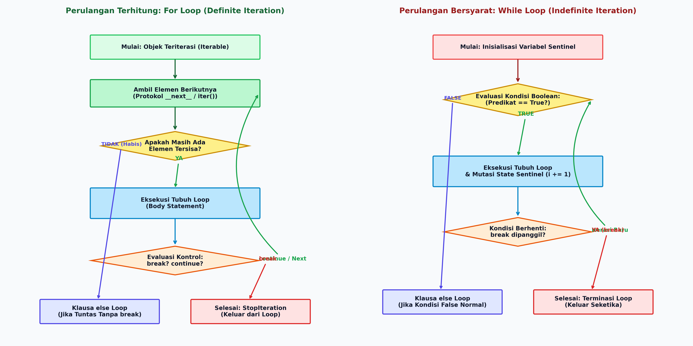
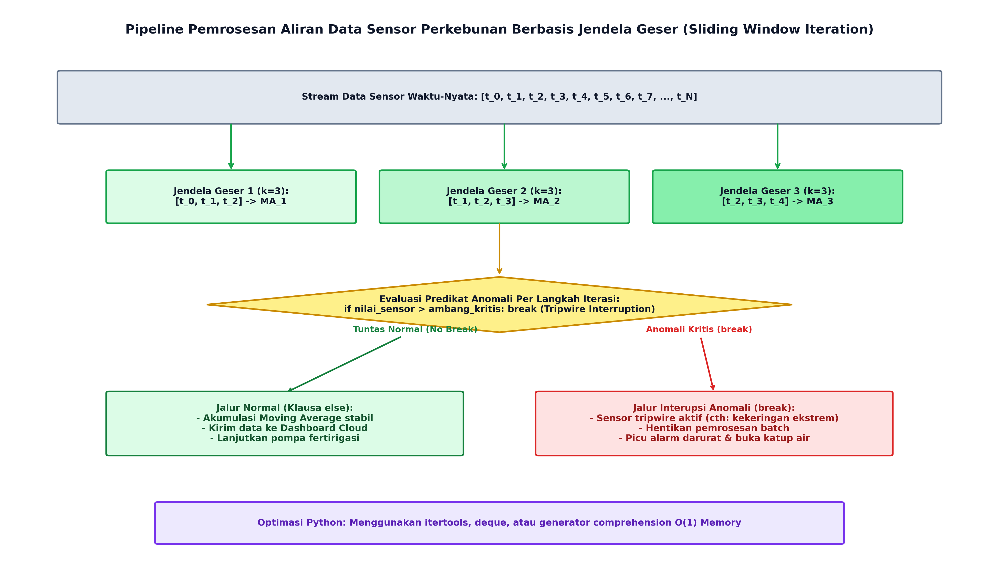

# AI Modul 2.7: Perulangan (for, while)

---

## 1. Identitas & Kerangka Capaian Pembelajaran (Sub-CPMK)

* **Kode Modul**        : AI Modul 2.7
* **Mata Kuliah**       : Kecerdasan Buatan dan Sains Data Pertanian Presisi
* **Alokasi Waktu**     : 2 x 50 Menit (Kajian Teori & Diskusi) + 2 x 50 Menit (Eksplorasi Praktikum Mandiri)
* **Beban SKS**         : 3 SKS
* **Prasyarat**         : AI Modul 2.6 (Percabangan If Else)
* **Level Kognitif**    : C2 (Memahami), C3 (Menerapkan), C4 (Menganalisis)

```mermaid
flowchart LR
    subgraph OUTPUTS["OUTPUTS (Keluaran Pembelajaran)"]
        O1["Script Iterasi Terstruktur (for, while)"]
        O2["Pipeline Jendela Geser (Sliding Window)"]
        O3["Modul Sanitasi Data & Filter Anomali"]
    end

    subgraph OUTCOMES["OUTCOMES (Kompetensi & Keterampilan)"]
        OC1["Keterampilan Memilih Pola Loop Sesuai Beban Kerja"]
        OC2["Keahlian Mengendalikan Alur (break, continue, else)"]
        OC3["Kemampuan Mencegah Infinite Loop & Memory Leak"]
    end

    subgraph IMPACTS["IMPACTS (Dampak Strategis Industri)"]
        I1["Otomasi Pemrosesan Big Data Telemetri Sawit"]
        I2["Stabilitas Sistem Monitoring Edge IoT Nirhenti"]
        I3["Efisiensi Konsumsi Komputasi & Daya Perangkat Tepi"]
    end

    OUTPUTS --> OUTCOMES --> IMPACTS
```



### 1.1 Capaian Pembelajaran Khusus (Sub-CPMK)
Setelah menyelesaikan modul ini, mahasiswa dan pembelajar diharapkan mampu:
1. **Mengidentifikasi (C2)** perbedaan fundamental antara perulangan terhitung (*definite loop* / `for`) dan perulangan bersyarat (*indefinite loop* / `while`).
2. **Menganalisis (C4)** kriteria konvergensi perulangan numerik (seperti aproksimasi gradien descent sederhana) dan mitigasi risiko perulangan tak berhingga (*infinite loop*).
3. **Menerapkan (C3)** pernyataan kontrol perulangan (`break`, `continue`, `else` pada loop) serta fungsi bawaan idiomatis (`range`, `enumerate`, `zip`) pada pemrosesan batch citra drone.
4. **Mengevaluasi (C4)** efisiensi waktu eksekusi perulangan bersarang (*nested loops*) terhadap ukuran dataset telemetri kebun.

### 1.2 Kerangka Hasil Pembelajaran (Outputs, Outcomes, & Impacts)
* **Outputs (Keluaran Berwujud Langsung)**:
* **Outcomes (Hasil Capaian & Perubahan Kompetensi)**:
* **Impacts (Dampak Jangka Panjang & Nilai Guna Luas)**:

---

## 2. Klasifikasi Perulangan Komputasional & Protokol Iterator Python

### 2.1 Perulangan Terhitung (*Definite Iteration*) versus Bersyarat (*Indefinite Iteration*)
Komputasi perulangan secara konseptual diklasifikasikan menjadi dua paradigma utama:
1. **Perulangan Terhitung (Definite Iteration - `for`):** Jumlah repetisi telah diketahui secara pasti sebelum perulangan dimulai, atau ditentukan oleh panjangnya elemen pada struktur data koleksi (seperti `list`, `tuple`, `dict`, atau generator `range`).
2. **Perulangan Bersyarat (Indefinite Iteration - `while`):** Jumlah repetisi tidak diketahui di awal dan bergantung secara dinamis pada terpenuhinya suatu predikat kebenaran Boolean $P(x) == \text{True}$. Perulangan ini sangat ideal untuk pemantauan sinyal sensor atau proses konvergensi numerik algoritma optimasi.



*Gambar 2.7.1: Diagram alir perbandingan arsitektur eksekusi antara For Loop berbasis Protokol Iterator (Kiri) versus While Loop berbasis Variabel Sentinel (Kanan).*

### 2.2 Protokol Iterator Python (*Python Iterator Protocol*)
Di balik kemudahan sintaksis `for elemen in koleksi:`, Python mengoperasikan mekanisme formal berstandar CPython yang disebut **Protokol Iterator**. Sebuah objek dapat diiterasi jika memenuhi dua kontrak antarmuka:
1. **Objek Teriterasi (*Iterable*):** Objek yang mengimplementasikan metode `__iter__()`, yang mengembalikan sebuah objek *iterator*.
2. **Objek Iterator (*Iterator*):** Objek yang mengimplementasikan metode `__next__()`. Setiap kali dipanggil, metode ini mengembalikan elemen berikutnya. Jika elemen telah habis, iterator wajib melempar eksepsi `StopIteration` untuk mengakhiri loop secara elegan.

Secara formal, loop `for x in data:` di Python setara dengan konstruksi tingkat rendah berikut:
```python
# Mekanisme internal loop 'for' di Python
iterator_obj = iter(data)  # Memanggil data.__iter__()
while True:
  try:
    x = next(iterator_obj)  # Memanggil iterator_obj.__next__()
    # Eksekusi blok instruksi
  except StopIteration:
    break  # Terminasi alami loop
```

---

## 3. Sintaksis Idiomatis & Pernyataan Kontrol Loop Python

### 3.1 Pemanfaatan `range()`, `enumerate()`, dan `zip()`
Python menyediakan fungsi bawaan berkinerja tinggi untuk iterasi:
- **`range(start, stop, step)`:** Membangkitkan deret aritmetika secara hemat memori ($\mathcal{O}(1)$ *space complexity*) tanpa mengalokasikan seluruh daftar angka ke RAM.
- **`enumerate(iterable, start=0)`:** Mengembalikan pasangan indeks bilangan bulat dan nilai elemen secara simultan, mengeliminasi kebutuhan variabel pencacah manual:
  ```python
  for idx, nilai_suhu in enumerate(daftar_suhu, start=1):
    print(f"Sensor #{idx}: {nilai_suhu} C")
  ```
- **`zip(*iterables)`:** Mengagregasi elemen dari dua atau lebih koleksi data secara paralel per indeks pasangan, sangat berguna untuk menggabungkan telemetri multi-sensor:
  ```python
  for suhu, rh in zip(suhu_udara, kelembaban_rh):
    vpd = hitung_vpd(suhu, rh)
  ```

### 3.2 Pernyataan Kontrol Alur: `break`, `continue`, dan Klausa `else` pada Loop
1. **`break`:** Menginterupsi dan menghentikan perulangan seketika, melompat langsung ke baris instruksi di luar blok loop. Digunakan sebagai mekanisme pemutus darurat (*emergency interruption*) ketika kondisi ambang kritis terdeteksi.
2. **`continue`:** Mengabaikan sisa instruksi dalam iterasi saat ini dan langsung melompat ke evaluasi iterasi berikutnya. Sangat berguna untuk menyaring rekaman data sensor yang korup atau tidak valid tanpa menghentikan pemrosesan batch secara keseluruhan.
3. **Klausa `else` pada Loop (Pola Evaluasi Tuntas Python):**  
   Blok `else` yang dipasangkan pada perulangan `for` atau `while` **hanya akan dieksekusi jika perulangan selesai secara tuntas alami tanpa pernah terputus oleh pernyataan `break`**.

```python
# Pola Verifikasi Kelayakan Batch TBS dengan Loop-Else
for tandan in batch_tbs:
  if tandan.kadar_kotoran > 5.0:
    print(f"[REJECT] Batch ditolak karena {tandan.id_tandan} terkontaminasi.")
    break
else:
  # Blok ini HANYA dieksekusi jika SELURUH tandan lolos uji
  print("[APPROVED] Seluruh batch memenuhi standar mutu pabrik.")
```

---

## 4. Analisis Galat Algoritmik: Perulangan Tak Berhingga, Off-by-One, dan Modifikasi Koleksi Dinamis

### 4.1 Perulangan Tak Berhingga (*Infinite Loop*) & Pembaruan Kondisi Sentinel
Pada perulangan `while`, kegagalan memutasi variabel kondisi batas (*sentinel state mutation*) akan menyebabkan prosesor terjebak dalam perulangan tak berhingga (*infinite loop*), memicu utilisasi CPU 100% dan penghentian respon (*system hang*) pada mikrokontroler:
```python
# KESALAHAN FATAL: Mengabaikan pembaruan variabel kontrol
counter = 0
while counter < 10:
  baca_sensor()
  # Jika counter += 1 tidak dieksekusi, sistem akan mengalami infinite loop!
```

### 4.2 Galat Pergeseran Batas (*Off-by-One Errors*)
Fungsi `range(a, b)` di Python bersifat **inklusif pada batas awal dan eksklusif pada batas akhir** ($[a, b)$). Menulis `range(0, 10)` menghasilkan angka $0$ sampai $9$ (total 10 elemen), bukan sampai 10. Ketidakpahaman atas batas eksklusif ini sering memicu galat *index out of range* pada pengindeksan array sensor.

### 4.3 Kendala Algoritmik: Modifikasi Koleksi Data secara Dinamis saat Iterasi (*Concurrent Modification*)
Memodifikasi ukuran sebuah `list` (menghapus elemen dengan `.remove()` atau `.pop()`) saat sedang dilintasi menggunakan loop `for` akan mengacaukan penunjuk indeks internal Python, menyebabkan sebagian elemen terlewati dari evaluasi (*skipped elements*).
```python
# POLA TIDAK DIANJURKAN: Menghapus elemen langsung dari list yang sedang diiterasi
for item in daftar_sensor:
  if item.is_rusak():
    daftar_sensor.remove(item)  # Mengakibatkan elemen berikutnya terlewat!

# PRAKTIK TERBAIK: Menggunakan List Comprehension untuk Membentuk Koleksi Baru
daftar_sensor = [item for item in daftar_sensor if not item.is_rusak()]
```

---

## 5. Implementasi Kasus Nyata: Pipeline Telemetri Sensor & Deteksi Jendela Geser (*Sliding Window*)

Dalam perkebunan kelapa sawit cerdas, sensor kelembaban tanah (*soil moisture*) sering mengirimkan data berderau (*noisy signal*) akibat fluktuasi medan elektromagnetik atau gelembung udara di sekitar probe sensor. Untuk mengaktifkan pompa irigasi secara stabil tanpa *chattering* (pompa mati-hidup terlalu cepat), data dihaluskan menggunakan **Rata-rata Bergerak Jendela Geser (*Sliding Window Moving Average*)**.



*Gambar 2.7.2: Arsitektur Pemrosesan Aliran Data Sensor Perkebunan Menggunakan Iterasi Jendela Geser dan Tripwire Interupsi Darurat.*

Berikut adalah implementasi Python lengkap yang memproses aliran telemetri sensor kelembaban tanah massal, menghitung rata-rata bergerak, serta mengendalikan aktuator irigasi:

```python
"""AI Modul 2.7: Pipeline Pemrosesan Telemetri & Jendela Geser Irigasi Cerdas INSTIPER.

Penulis: Tim Kurikulum AI & Sains Data INSTIPER Yogyakarta
Standar: Python 3.10+ / Clean Code Architecture (PEP 8)
"""

from dataclasses import dataclass
import math
from typing import Dict, Iterator, List, Optional, Tuple


@dataclass(frozen=True)
class PembacaanSensorTanah:
  """Model data telemetri kelembaban tanah per titik waktu."""

  timestamp_detik: int
  kelembaban_tanah_persen: float
  status_sensor_valid: bool


class SmartIrrigationController:
  """Engine cerdas untuk memproses deret waktu sensor kelembaban tanah

  menggunakan perulangan jendela geser dan logika interupsi darurat.
  """

  def __init__(
      self,
      ukuran_jendela: int = 4,
      ambang_kering_persen: float = 35.0,
      ambang_kritis_tripwire: float = 15.0,
  ) -> None:
    self.k = ukuran_jendela
    self.ambang_kering = ambang_kering_persen
    self.ambang_tripwire = ambang_kritis_tripwire
    self.riwayat_ma: List[float] = []

  def proses_aliran_telemetri(
      self, aliran_data: List[PembacaanSensorTanah]
  ) -> Dict[str, Any]:
    """Memproses deret waktu sensor menggunakan perulangan terhitung 'for'

    dengan penyaringan data invalid dan tripwire darurat.
    """
    total_data = len(aliran_data)
    data_valid_bersih: List[float] = []
    log_peristiwa: List[str] = []
    status_tripwire_aktif = False

    # 1. Tahap Ekstraksi & Filtrasi Data Menggunakan 'continue'
    for reading in aliran_data:
      # Filter data korup/sensor malfungsi menggunakan continue
      if not reading.status_sensor_valid:
        log_peristiwa.append(
            f"[SKIP] T={reading.timestamp_detik}s: Sensor mengirim status"
            " INVALID. Dilewati."
        )
        continue

      # Filter anomali batas fisik
      if not (0.0 <= reading.kelembaban_tanah_persen <= 100.0):
        log_peristiwa.append(
            f"[SKIP] T={reading.timestamp_detik}s: Nilai"
            f" {reading.kelembaban_tanah_persen}% di luar batas fisik 0-100%."
        )
        continue

      data_valid_bersih.append(reading.kelembaban_tanah_persen)

      # Tripwire Darurat: Kekeringan ekstrem seketika (break interupsi)
      if reading.kelembaban_tanah_persen < self.ambang_tripwire:
        log_peristiwa.append(
            f"[ALERTA KRITIS] T={reading.timestamp_detik}s: Kelembaban"
            f" {reading.kelembaban_tanah_persen}% < {self.ambang_tripwire}%!"
            " TRIPWIRE AKTIF!"
        )
        status_tripwire_aktif = True
        break
    else:
      # Klausa 'else' loop dieksekusi HANYA jika tidak ada break (operasi normal)
      log_peristiwa.append(
          "[STATUS] Seluruh batch data berhasil diproses tanpa tripwire"
          " darurat."
      )

    # 2. Tahap Komputasi Jendela Geser (Sliding Window Moving Average)
    n_bersih = len(data_valid_bersih)
    hasil_ma: List[Tuple[int, float, str]] = []

    if n_bersih >= self.k:
      # Menggunakan range untuk menggeser jendela sepanjang array
      for i in range(n_bersih - self.k + 1):
        jendela_aktif = data_valid_bersih[i : i + self.k]
        rata_rata_lokal = sum(jendela_aktif) / self.k
        self.riwayat_ma.append(rata_rata_lokal)

        # Keputusan status irigasi berbasis Moving Average
        mode_irigasi = (
            "POMPA MENYALA (IRIGASI AKTIF)"
            if rata_rata_lokal < self.ambang_kering
            else "POMPA MATI (LEMBAB NORMAL)"
        )
        hasil_ma.append((i, round(rata_rata_lokal, 2), mode_irigasi))

    return {
        "total_sampel": total_data,
        "sampel_valid": n_bersih,
        "tripwire_darurat": status_tripwire_aktif,
        "moving_average": hasil_ma,
        "log_peristiwa": log_peristiwa,
    }

  def simulasi_pengisian_tangki_while(
      self, target_volume_liter: float, debit_per_detik: float
  ) -> Tuple[int, float]:
    """Simulasi pengisian air tangki fertigasi menggunakan 'while loop'

    sampai volume air mencapai batas aman target.
    """
    volume_saat_ini = 0.0
    detik = 0

    # Perulangan bersyarat: Berjalan selama air belum penuh
    while volume_saat_ini < target_volume_liter:
      detik += 1
      volume_saat_ini += debit_per_detik

      # Proteksi loop: Hentikan paksa jika waktu pengisian tidak wajar (> 1 jam)
      if detik > 3600:
        print("[WARNING] Pengisian melebihi batas waktu! Matikan pompa.")
        break

    return detik, round(volume_saat_ini, 2)


# =====================================================================
# BLOK EKSEKUSI PENGUJIAN INDUSTRIAL
# =====================================================================
if __name__ == "__main__":
  print("=" * 80)
  print("SISTEM KENDALI IRIGASI PRESISI DAN PEMROSESAN BATCH TELEMETRI INSTIPER")
  print("=" * 80)

  # Data simulasi sensor kelembaban tanah 10 titik waktu
  telemetri_ujicoba = [
      PembacaanSensorTanah(10, 42.5, True),
      PembacaanSensorTanah(20, 39.0, True),
      PembacaanSensorTanah(30, 999.0, False),  # Derau / korup
      PembacaanSensorTanah(40, 34.2, True),
      PembacaanSensorTanah(50, 31.0, True),
      PembacaanSensorTanah(60, 28.5, True),
      PembacaanSensorTanah(70, -5.0, True),  # Nilai fisik tidak valid
      PembacaanSensorTanah(80, 26.0, True),
      PembacaanSensorTanah(90, 24.5, True),
      PembacaanSensorTanah(100, 12.0, True),  # Tripwire kritis! (< 15%)
  ]

  controller = SmartIrrigationController(
      ukuran_jendela=3, ambang_kering_persen=32.0, ambang_kritis_tripwire=15.0
  )

  laporan = controller.proses_aliran_telemetri(telemetri_ujicoba)

  print(f"\n1. Ringkasan Ekstraksi Data Sensor:")
  print(f"   - Total Sampel Diterima : {laporan['total_sampel']} paket")
  print(f"   - Sampel Valid Bersih   : {laporan['sampel_valid']} paket")
  print(f"   - Status Tripwire       : {laporan['tripwire_darurat']}")

  print(f"\n2. Log Eksekusi Kontrol Perulangan:")
  for log in laporan["log_peristiwa"]:
    print(f"   * {log}")

  print(f"\n3. Hasil Rata-rata Bergerak (Sliding Window Moving Average k=3):")
  for window_id, ma_val, keputusan in laporan["moving_average"]:
    print(f"   - Jendela #{window_id}: MA={ma_val:>5.2f}% -> {keputusan}")

  # Uji While Loop Pengisian Tangki Fertirigasi
  print(f"\n4. Uji Perulangan Bersyarat (While Loop) Pengisian Tangki:")
  durasi, vol_akhir = controller.simulasi_pengisian_tangki_while(
      target_volume_liter=150.0, debit_per_detik=8.5
  )
  print(
      f"   - Waktu Pengisian : {durasi} detik ({durasi/60:.1f} menit) untuk"
      f" mencapai {vol_akhir} Liter."
  )
  print("=" * 80 + "\n")
```

---

## 6. Pembahasan Keterangan Penggunaan Kode (Operational Breakdown)

Dekonstruksi fungsional atas kode di atas memberikan pemahaman arsitektur rekayasa perangkat lunak:

1. **Pemanfaatan `continue` untuk Kebersihan Pipa Ingesti (Baris 51–64):**  
   Ketika sensor mengirimkan status tidak valid atau nilai di luar jangkauan fisik ($<0$ atau $>100$), instruksi `continue` segera melompati pencatatan data tanpa perlu membuat struktur `else` bersarang yang panjang.
2. **Mekanisme Pemutusan Darurat Berbasis `break` (Baris 67–76):**  
   Segera setelah kondisi anomali kritis ($<15.0\%$) terdeteksi, perintah `break` menghentikan loop seketika. Hal ini menghemat siklus prosesor dan langsung memicu penanganan darurat untuk mencegah tanaman kelapa sawit mengalami layu permanen.
3. **Klausa `else` Loop sebagai Penanda Operasi Normal (Baris 77–82):**  
   Log `"Seluruh batch data berhasil diproses tanpa tripwire"` hanya dicatat jika perulangan menyelesaikan seluruh elemen tanpa pernah terputus oleh instruksi `break`. Ini adalah pola idiomatis Python yang terstruktur dan deterministik.
4. **Algoritma Jendela Geser dengan `range(n - k + 1)` (Baris 88–92):**  
   Formula batas `n_bersih - self.k + 1` mencegah galat *IndexError / Off-by-One* saat mengambil sub-array (*slicing*) sepanjang $k$ elemen hingga indeks terakhir.
5. **Perlindungan Terhadap Infinite Loop pada `while` (Baris 112–115):**  
   Pernyataan `if detik > 3600: break` berfungsi sebagai mekanisme pengaman komputasi (*watchdog fail-safe timer*) jika parameter debit air bernilai nol atau tidak mampu mengisi tangki sesuai target.

---

## 7. Evaluasi Mandiri: Pertanyaan HOTS & Tantangan Scaffolded

### 7.1 Pertanyaan HOTS (Higher-Order Thinking Skills)

1. **Analisis Efisiensi Memori: List Slicing versus `collections.deque` pada Jendela Geser:**  
   Pada implementasi `data_valid_bersih[i : i + self.k]`, Python membuat salinan sub-list baru di memori Heap pada setiap langkah iterasi. Jika sebuah stasiun telemetri perkebunan memproses aliran kontinu sebesar $N = 10.000.000$ data dengan ukuran jendela $k = 100$, hitunglah pemborosan alokasi memori yang terjadi! Mengapa struktur data `collections.deque(maxlen=k)` atau algoritma akumulator selisih $(MA_{\text{baru}} = MA_{\text{lama}} + \frac{x_{\text{in}} - x_{\text{out}}}{k})$ jauh lebih unggul dalam kompleksitas ruang $\mathcal{O}(1)$?
2. **Dekonstruksi Semantik Perilaku Klausa `else` pada Loop:**  
   Banyak pemrogram pemula mengira klausa `else` pada perulangan bekerja seperti `if-else` (dieksekusi saat kondisi loop bernilai `False` sejak awal). Perhatikan kode berikut:
   ```python
   for i in range(0):
     if i == 5:
       break
   else:
     print("Blok ELSE Dieksekusi!")
   ```
   Apakah pesan di atas akan dicetak ke konsol? Jelaskan secara formal mengapa perancang bahasa Python menetapkan perilaku tersebut!
3. **Audit Risiko Iterasi Bersarang (*Nested Loops & Algorithmic Complexity*):**  
   Seorang data scientist junior menulis kode untuk mencocokkan $N = 50.000$ koordinat pohon kelapa sawit dengan $M = 10.000$ koordinat titik sebaran hama menggunakan dua perulangan bersarang:
   ```python
   for pohon in daftar_pohon:
     for hama in daftar_hama:
       hitung_jarak_euclidean(pohon, hama)
   ```
   Hitung total operasi komparasi yang terjadi! Jelaskan bagaimana algoritma *Spatial Partitioning* (seperti KD-Tree atau Grid Binning) dapat memangkas kompleksitas $\mathcal{O}(N \times M)$ menjadi $\mathcal{O}(N \log M)$!

---

### 7.2 Tantangan Pemrograman Berjenjang (*Scaffolded Challenges*)

#### Tantangan 1 (Tingkat Dasar - *Warm-Up*): Agregator Curah Hujan Bulanan
* **Skenario:** Stasiun penakar hujan otomatis mencatat curah hujan harian (mm) selama 30 hari.
* **Tugas:** Buatlah fungsi `analisis_curah_hujan(data_harian: List[float]) -> dict` yang menggunakan loop `for` dan `enumerate` untuk menghitung:
  - Total akumulasi curah hujan bulanan.
  - Rata-rata curah hujan harian.
  - Hari ke berapa saja (indeks 1-30) terjadi hujan lebat ($> 50.0\text{ mm}$).
  Gunakan `continue` untuk mengabaikan hari tanpa hujan ($0.0\text{ mm}$) saat mencatat hari hujan.

#### Tantangan 2 (Tingkat Menengah - *Intermediate*): Konvergensi Debit Irigasi Presisi Menggunakan While Loop
* **Skenario:** Model hidrologi tanah menghitung laju peresapan air menggunakan persamaan diferensial diskret sampai tercapai kondisi tunak (*steady-state*).
* **Tugas:** Buatlah fungsi `simulasi_konvergensi_infiltrasi(debit_awal: float, batas_toleransi: float = 0.001) -> Tuple[int, float]` yang menggunakan `while loop`. Pada setiap iterasi $t$, debit diperbarui dengan rumus $Q_{t+1} = 0.85 \times Q_t + 0.15 \times 2.0$. Perulangan berhenti saat $\lvert Q_{t+1} - Q_t \rvert < \text{batas\_toleransi}$. Wajib menyertakan pengaman batas maksimal 500 iterasi.

#### Tantangan 3 (Tingkat Mahir - *Advanced*): Detektor Lonjakan Suhu (Heatwave Spike Detector) dengan Jendela Geser Berbasis Deque
* **Skenario:** Drone termal memindai kanopi kelapa sawit dan mengirimkan aliran suhu berkelanjutan. Lonjakan panas (*heatwave spike*) dicurigai sebagai titik api (*hotspot kebakaran lahan*) jika suhu saat ini melampaui $3.0^\circ\text{C}$ di atas rata-rata bergerak 5 titik waktu sebelumnya.
* **Tugas:** Bangunlah kelas `CanopyHotspotDetector` yang memproses aliran data menggunakan `collections.deque(maxlen=5)`, mengimplementasikan pola loop terhitung dan mekanisme peringatan dini (*early warning threshold*), serta menghasilkan visualisasi kurva telemetri dan titik deteksi anomali api.

---

## 8. Glosarium Istilah Teknis

1. **Definite Iteration (Perulangan Terhitung):** Pola eksekusi perulangan di mana jumlah siklus iterasi telah ditentukan secara pasti oleh ukuran koleksi objek atau rentang bilangan.
2. **Indefinite Iteration (Perulangan Bersyarat):** Pola perulangan di mana repetisi instruksi berlanjut secara dinamis hingga sebuah kondisi predikat logis berubah menjadi `False`.
3. **Iterator Protocol:** Standar antarmuka Python yang terdiri dari metode `__iter__()` dan `__next__()` yang memungkinkan suatu objek melintasi elemen-elemen datanya secara berurutan.
4. **Lazy Evaluation (Evaluasi Malas):** Strategi evaluasi komputasi yang menunda kalkulasi nilai atau pembuatan objek sampai saat nilai tersebut benar-benar diminta oleh program, menghemat alokasi memori secara signifikan.
5. **Off-by-One Error:** Kesalahan logika pemrograman yang terjadi ketika perulangan berulang satu kali terlalu banyak atau satu kali terlalu sedikit akibat salah menentukan batas inklusif/eksklusif.
6. **Sentinel Value (Variabel Penjaga):** Nilai khusus atau variabel status yang digunakan untuk memberi sinyal penghentian pada perulangan bersyarat (*while loop*).
7. **Sliding Window (Jendela Geser):** Teknik algoritmik di mana sub-larik (*sub-array*) dengan lebar tertentu digeser di sepanjang larik data utama untuk menghitung statistik lokal (seperti moving average).
8. **Threshold-Triggered Interruption:** Mekanisme penghentian perulangan seketika melalui instruksi `break` saat nilai variabel melampaui batas toleransi kritis, guna melindungi sistem fisik atau mencegah propagasi anomali data.

---

## 9. Jembatan Konsep (Bridging) ke AI Modul 2.8

Sepanjang modul ini, Anda telah menguasai bagaimana komputer mengotomatisasi ribuan instruksi berulang menggunakan perulangan `for` dan `while`, menyaring anomali dengan `continue`, serta mengamankan sistem melalui `break`.

Namun, bagaimana jika potongan kode perulangan jendela geser atau klasifikasi telemetri ini **harus digunakan berulang kali di sepuluh tempat yang berbeda** di dalam sistem AI perkebunan Anda? Apakah kita harus menyalin-tempel (*copy-paste*) blok kode yang sama?

Pada **AI Modul 2.8: Fungsi dalam Pemrograman**, kita akan mengeksplorasi:
- Prinsip modularitas *DRY (Don't Repeat Yourself)* dan dekomposisi masalah.
- Anatomi fungsi Python: parameter, argumen posisional, *keyword arguments*, dan nilai kembalian (*return values*).
- Ruang lingkup variabel (*Scope / LEGB Rule: Local, Enclosing, Global, Built-in*).
- Fungsi murni (*pure functions*), *lambda functions*, serta *first-class citizen functions* dalam pipeline kecerdasan buatan.

---

## 10. Daftar Pustaka dan Referensi Akademik

1. Van Rossum, G., & Drake, F. L.(2009). *Python 3 Reference Manual*. CreateSpace. (Bab 8: *Compound Statements - The for and while statements*).
2. Cormen, T. H., Leiserson, C. E., Rivest, R. L., & Stein, C.(2022). *Introduction to Algorithms* (4th ed.). MIT Press. (Bab 3: *Characterizing Running Times & Loop Invariants*).
3. Ramalho, L.(2022). *Fluent Python: Clear, Concise, and Effective Programming* (2nd ed.). O'Reilly Media. (Bab 17: *Iterators, Generators, and Classic Coroutines*).
4. Box, G. E., Jenkins, G. M., Reinsel, G. C., & Ljung, G. M.(2015). *Time Series Analysis: Forecasting and Control* (5th ed.). John Wiley & Sons. (Bab 2: *Linear Filters and Moving Averages*).
5. Hettinger, R.(2013). *Transforming Code into Beautiful, Idiomatic Python*. PyCon US Keynote Presentation.
6. Sutrisno, B., & Wibowo, H.(2023). Sistem irigasi presisi berbasis internet of things dan moving average filter untuk efisiensi air pada perkebunan kelapa sawit rakyat. *Jurnal Otomasi dan Informatika Pertanian*, 12(2), 77–89.
