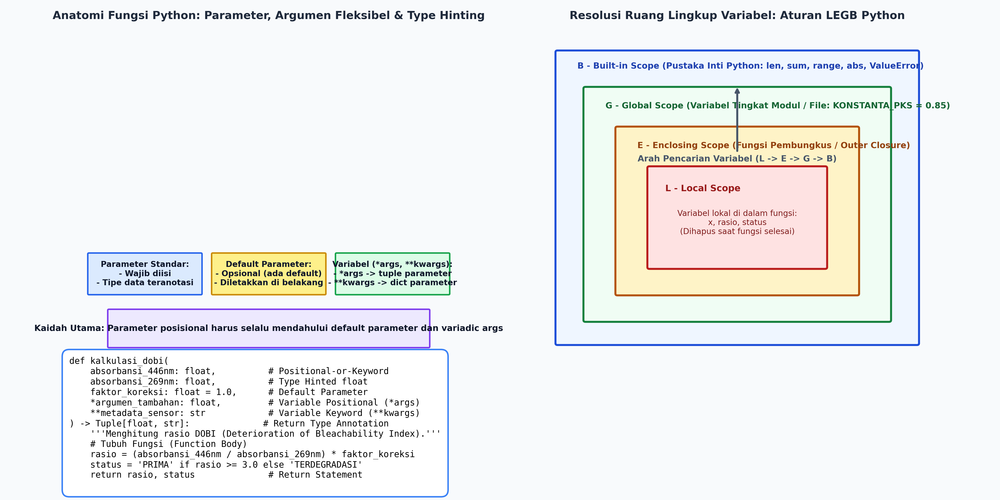
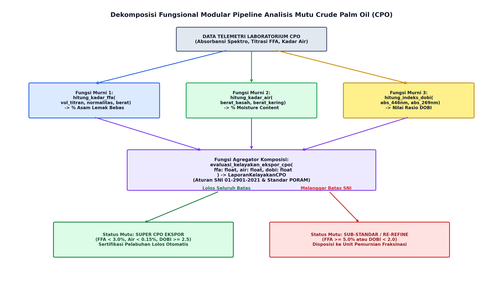

# AI Modul 2.8: Fungsi dalam Pemrograman

---

## 1. Identitas & Kerangka Capaian Pembelajaran (Sub-CPMK)

* **Kode Modul**        : AI Modul 2.8
* **Mata Kuliah**       : Kecerdasan Buatan dan Sains Data Pertanian Presisi
* **Alokasi Waktu**     : 2 x 50 Menit (Kajian Teori & Diskusi) + 2 x 50 Menit (Eksplorasi Praktikum Mandiri)
* **Beban SKS**         : 3 SKS
* **Prasyarat**         : AI Modul 2.7 (Perulangan For While)
* **Level Kognitif**    : C2 (Memahami), C3 (Menerapkan), C4 (Menganalisis)


### 1.1 Capaian Pembelajaran Khusus (Sub-CPMK)
Setelah menyelesaikan modul ini, mahasiswa dan pembelajar diharapkan mampu:
1. **Menguraikan (C2)** prinsip modularisasi kode, abstraksi fungsional, dan paradigma *Don't Repeat Yourself* (DRY).
2. **Menganalisis (C4)** ruang lingkup variabel (*Variable Scoping* / aturan LEGB: Local, Enclosing, Global, Built-in) dan mekanisme tumpukan panggilan (*call stack*).
3. **Menerapkan (C3)** berbagai variasi parameter fungsi (posisional, kata kunci, nilai baku, `*args`, `**kwargs`) serta fungsi anonim (*lambda expression*) untuk transformasi data kanopi.
4. **Merancang (C3)** pustaka fungsi mandiri (*reusable functions*) berdokumentasi *docstring* standar Google/NumPy untuk kalkulasi indeks vegetasi kebun.

### 1.2 Kerangka Hasil Pembelajaran (Outputs, Outcomes, & Impacts)
* **Outputs (Keluaran Berwujud Langsung)**:
* **Outcomes (Hasil Capaian & Perubahan Kompetensi)**:
* **Impacts (Dampak Jangka Panjang & Nilai Guna Luas)**:

---

## 2. Paradigma Dekomposisi Fungsional & Prinsip DRY

### 2.1 Dekomposisi Masalah (Algorithmic Decomposition)
Dalam ilmu komputer, **dekomposisi fungsional** adalah metode pemecahan masalah komputasi besar menjadi kumpulan sub-masalah yang lebih kecil, mandiri, dan dapat dikelola (*divide and conquer*). Sebuah program kecerdasan buatan yang dibangun tanpa dekomposisi fungsional akan berkembang menjadi bentuk **prosedur monolitik**—blok kode panjang tanpa batas konseptual yang sangat rentan terhadap kegagalan, sulit diuji (*untestable*), dan mustahil dikerjakan secara kolaboratif oleh tim pengembang.

### 2.2 Prinsip DRY (*Don't Repeat Yourself*)
Dirumuskan oleh Andy Hunt dan Dave Thomas (1999), prinsip DRY menetapkan:
> *"Setiap potong pengetahuan atau logika komputasi harus memiliki representasi tunggal, tegas, dan otoritatif di dalam sistem perangkat lunak."*

Penerapan prinsip DRY melalui fungsi memberikan keuntungan strategis:
1. **Reduksi Redundansi Kode:** Satu algoritma perbaikan baseline sensor hanya ditulis satu kali di dalam fungsi dan dipanggil dari berbagai modul analitika.
2. **Kemudahan Pemeliharaan (*Maintainability*):** Jika standar deviasi kalibrasi berubah dari $0.05$ menjadi $0.03$, perubahan cukup dilakukan pada satu blok fungsi tanpa perlu memodifikasi ratusan baris kode tersebar.
3. **Isolasi Galat (*Fault Isolation*):** Kegagalan numerik terisolasi di dalam fungsi terkait, sehingga proses pelacakan jejak kesalahan (*stack trace debugging*) dapat diselesaikan dengan cepat.

---

## 3. Anatomi Fungsi Python & Fleksibilitas Parameter

Python menyediakan sintaksis deklarasi fungsi yang sangat ekspresif melalui kata kunci `def`, disertai dukungan pengetikan statis teranotasi (*Type Annotations*) dan berbagai modalitas penerimaan argumen.



*Gambar 2.8.1: Anatomi Tanda Tangan Fungsi Python Modern (Kiri) dan Hierarki Resolusi Ruang Lingkup LEGB (Kanan).*

### 3.1 Parameter Posisional versus Argumen Bernama (*Keyword Arguments*)
Parameter adalah variabel yang dideklarasikan pada tanda tangan fungsi (*function signature*), sedangkan argumen adalah nilai riil yang dilewatkan saat pemanggilan:
- **Argumen Posisional (*Positional Arguments*):** Dilewatkan berdasarkan urutan deklarasi parameter dari kiri ke kanan.
- **Argumen Bernama (*Keyword Arguments*):** Dilewatkan dengan menyebutkan nama parameter secara eksplisit (`nama_parameter=nilai`), sehingga urutan pemanggilan dapat diubah tanpa mempengaruhi hasil komputasi.

### 3.2 Parameter Bernilai Baku (*Default Parameters*)
Parameter default memungkinkan suatu argumen bersifat opsional saat pemanggilan:
```python
def kalibrasi_sensor_optik(
    sinyal_mentah: float, faktor_koreksi: float = 1.0
) -> float:
  """Mengalibrasi sinyal fotometrik sensor dengan faktor koreksi opsional."""
  return sinyal_mentah * faktor_koreksi
```
> [!IMPORTANT]
> **Kaidah Parameter Default:** Seluruh parameter posisional wajib diletakkan di depan. Parameter bernilai baku (*default parameters*) **harus selalu ditempatkan setelah parameter non-default**. Kegagalan mematuhi aturan ini akan memicu *SyntaxError: non-default argument follows default argument*.

### 3.3 Argumen Dinamis Berjumlah Fleksibel: `*args` dan `**kwargs`
Dalam pemrosesan data AI, fungsi kerap kali harus menerima jumlah masukan yang tidak pasti:
1. **`*args` (Variadic Positional Arguments):** Menangkap kelebihan argumen posisional dan mengemasnya ke dalam sebuah struktur data `tuple` imutabel.
2. **`**kwargs` (Variadic Keyword Arguments):** Menangkap kelebihan argumen bernama dan mengemasnya ke dalam sebuah struktur data `dict`.

```python
def catat_audit_mutu_cpo(
    id_sampel: str, *nilai_parameter: float, **metadata_lingkungan: str
) -> None:
  """Mencatat uji laboratorium CPO dengan parameter numerik dan metadata dinamis."""
  print(f"[AUDIT] ID Sampel: {id_sampel}")
  print(f"  - Nilai Metrik : {nilai_parameter} (Tipe: {type(nilai_parameter)})")
  print(
      f"  - Metadata     : {metadata_lingkungan} (Tipe:"
      f" {type(metadata_lingkungan)})"
  )
```

---

## 4. Model Memori Pemanggilan Fungsi & Resolusi Ruang Lingkup LEGB

### 4.1 Mekanisme *Call Stack* & *Activation Records (Frame Objects)*
Setiap kali sebuah fungsi dipanggil, sistem runtime CPython mengalokasikan sebuah struktur data internal bernama **Frame Object** (atau *Activation Record*) ke dalam tumpukan memori eksekusi (*Call Stack*). Frame ini menyimpan:
- Tabel simbol variabel lokal (*Local Symbol Table*).
- Penunjuk instruksi baris kode (*Bytecode Instruction Pointer*).
- Alamat memori pengembalian (*Return Address*).

Ketika fungsi selesai mengeksekusi perintah `return`, frame tersebut dikeluarkan dari Call Stack (*popped from stack*) dan seluruh variabel lokal di dalamnya otomatis dideligasikan ke *Garbage Collector* untuk dibersihkan dari memori.

### 4.2 Aturan Resolusi Ruang Lingkup LEGB (*Local, Enclosing, Global, Built-in*)
Ketika interpreter Python menemukan nama sebuah variabel di dalam fungsi, pencarian referensi dilakukan secara hierarkis bertingkat dari dalam ke luar (**Aturan LEGB**):
1. **Local (L):** Variabel yang didefinisikan secara langsung di dalam tubuh fungsi saat ini.
2. **Enclosing (E):** Variabel pada fungsi pembungkus terluar (berlaku pada fungsi bersarang atau *nested functions/closures*).
3. **Global (G):** Variabel tingkat modul yang dideklarasikan di luar seluruh definisi fungsi atau kelas pada berkas `.py` terkait.
4. **Built-in (B):** Ruang nama terluar Python yang memuat fungsi dan tipe bawaan sistem (seperti `len()`, `range()`, `abs()`, `ValueError`).

Jika variabel tidak ditemukan pada keempat lapisan tersebut, Python akan melempar eksepsi `NameError: name 'x' is not defined`.

```python
# Demonstrasi Resolusi LEGB
AMBANG_GLOBAL = 5.0  # (G) Global Scope


def fungsi_luar():
  faktor_enclosing = 1.2  # (E) Enclosing Scope

  def fungsi_dalam(nilai_sensor):
    faktor_lokal = 0.5  # (L) Local Scope
    # Resolusi variabel bertingkat:
    # nilai_sensor & faktor_lokal -> Local (L)
    # faktor_enclosing           -> Enclosing (E)
    # AMBANG_GLOBAL              -> Global (G)
    # round & sum                -> Built-in (B)
    return round((nilai_sensor * faktor_lokal * faktor_enclosing), 2)

  return fungsi_dalam
```

---

## 5. Paradigma Pemrograman Fungsional dalam Kecerdasan Buatan

### 5.1 Fungsi Murni (*Pure Functions*) & Determinisme
Sebuah fungsi diklasifikasikan sebagai **Fungsi Murni** (*Pure Function*) jika memenuhi dua kriteria formal:
1. **Determinisme Matematis:** Untuk argumen masukan yang identik, fungsi selalu menghasilkan nilai kembalian yang persis sama, kapan pun dan di lingkungan mana pun fungsi dieksekusi ($f(x) = y$).
2. **Bebas Efek Samping (*Side-Effect Free*):** Fungsi tidak memodifikasi keadaan (*state*) di luar cakupannya—tidak mengubah variabel global, tidak memutasi koleksi data argumen masukan, tidak menulis ke disk, dan tidak memicu komunikasi jaringan.

Fungsi murni merupakan fondasi rekayasa data AI modern karena bersifat *taraf paralelisasi tinggi* (*thread-safe*), mudah diuji (*deterministic unit testing*), dan hasilnya dapat disimpan dalam tembolok (*memoization / caching*).

### 5.2 Fungsi sebagai Entitas Kelas Satu (*First-Class Citizens*)
Di Python, fungsi diperlakukan sebagai entitas kelas satu (*first-class citizens*), yang berarti fungsi dapat:
- Disimpan ke dalam variabel data.
- Dilewatkan sebagai argumen ke fungsi lain (*Higher-Order Functions*).
- Dikembalikan sebagai nilai keluaran dari fungsi lain (*Closures / Decorators*).

### 5.3 Fungsi Anonim (*Lambda Expressions*)
Ekspresi lambda adalah konstruksi fungsi tanpa nama (*anonymous function*) yang diekspresikan dalam satu baris instruksi:
$$\mathbf{lambda} \;\; \text{argumen}_1, \text{argumen}_2, \dots : \text{ekspresi\_kembalian}$$

- **Keterangan Komponen Simbol:** Kata kunci `lambda` mengawali deklarasi fungsi anonim, $\text{argumen}_1, \text{argumen}_2, \dots$ adalah parameter masukan tanpa tanda kurung, tanda titik dua (`:`) memisahkan parameter dengan ekspresi tubuh fungsi, dan $\text{ekspresi\_kembalian}$ adalah ekspresi tunggal yang langsung dievaluasi dan dikembalikan secara implisit tanpa kata kunci `return`.
- **Cara Membaca Rumus:** *"Fungsi lambda menerima argumen satu, argumen dua, dan seterusnya, yang menghasilkan nilai kembalian berupa hasil evaluasi ekspresi."*

```python
# Transformasi data telemetri menggunakan lambda dan map()
derajat_kelvin = [298.15, 301.20, 295.40, 305.00]
derajat_celsius = list(map(lambda k: round(k - 273.15, 2), derajat_kelvin))
# Hasil: [25.0, 28.05, 22.25, 31.85]
```

---

## 6. Implementasi Kasus Nyata: Pipeline Analisis Mutu Crude Palm Oil (CPO)

Laboratorium Pabrik Kelapa Sawit (PKS) melakukan pengujian kualitas minyak mentah kelapa sawit (*Crude Palm Oil* / CPO) untuk menentukan kelayakan ekspor berdasarkan kriteria standar nasional SNI 01-2901-2021 dan standar internasional PORAM. Parameter penentu meliputi:
1. **Kadar Asam Lemak Bebas (Free Fatty Acid / FFA):** Maksimal $5.0\%$ (Mutu Ekspor Prima $\le 3.0\%$).
2. **Kadar Air dan Kotoran (Moisture & Impurities):** Maksimal $0.25\%$ (Mutu Ekspor Prima $\le 0.15\%$).
3. **Indeks Daya Pemucatan (Deterioration of Bleachability Index / DOBI):** Minimal $2.3$ (Mutu Ekspor Prima $\ge 2.8$).



*Gambar 2.8.2: Arsitektur Dekomposisi Fungsional Modular Pipeline Analisis Mutu Crude Palm Oil (CPO).*

Berikut adalah implementasi Python skala industri berbasis dekomposisi fungsi murni yang modular, teranotasi tipe ketat, dan bebas efek samping:

```python
"""AI Modul 2.8: Pipeline Analisis Laboratorium Mutu CPO Berbasis Dekomposisi Fungsional Modular.

Penulis: Tim Kurikulum AI & Sains Data INSTIPER Yogyakarta
Standar: Python 3.10+ / Clean Code Architecture (PEP 8 & PEP 484)
"""

from dataclasses import dataclass
import enum
import math
from typing import Callable, Dict, List, Optional, Tuple


class PredikatMutuCPO(enum.Enum):
  """Klasifikasi resmi mutu komersial CPO di pelabuhan ekspor."""

  SUPER_EXPORT_GRADE = "SUPER CPO EKSPOR (PRIMA)"
  STANDAR_DOMESTIK = "CPO STANDAR INDUSTRI (SNI)"
  SUB_STANDAR = "SUB-STANDAR (WAJIB RE-REFINE)"


@dataclass(frozen=True)
class HasilUjiSampelCPO:
  """Objek luaran analisis laboratorium yang bersifat imutabel."""

  id_sampel: str
  kadar_ffa_persen: float
  kadar_air_persen: float
  indeks_dobi: float
  predikat_mutu: PredikatMutuCPO
  keterangan_teknis: str


# =====================================================================
# 1. KUMPULAN FUNGSI MURNI ATOMIK (ATOMIC PURE FUNCTIONS)
# =====================================================================


def hitung_kadar_ffa(
    volume_titran_ml: float,
    normalitas_naoh: float = 0.1,
    berat_sampel_gram: float = 10.0,
    berat_molekul_palmitat: float = 25.6,
) -> float:
  """Menghitung persentase Asam Lemak Bebas (Free Fatty Acid / FFA)

  dihitung sebagai asam palmitat menggunakan metode titrasi asam-basa.
  Rumus: FFA (%) = (V * N * 25.6) / Berat Sampel
  """
  if berat_sampel_gram <= 0.0:
    raise ValueError("Berat sampel laboratorium harus bernilai positif.")

  kadar_ffa = (
      volume_titran_ml * normalitas_naoh * berat_molekul_palmitat
  ) / berat_sampel_gram
  return round(kadar_ffa, 3)


def hitung_kadar_air(
    berat_cawan_isi_awal_gram: float,
    berat_cawan_isi_kering_gram: float,
    berat_cawan_kosong_gram: float,
) -> float:
  """Menghitung kadar air minyak CPO menggunakan metode gravimetri oven (105 C).

  Rumus: Kadar Air (%) = ((Berat Awal - Berat Kering) / Berat Sampel Awal) *
  100%
  """
  berat_sampel_awal = berat_cawan_isi_awal_gram - berat_cawan_kosong_gram
  if berat_sampel_awal <= 0.0:
    raise ValueError(
        "Kalkulasi berat sampel awal menghasilkan nilai tak valid."
    )

  kehilangan_air = berat_cawan_isi_awal_gram - berat_cawan_isi_kering_gram
  if kehilangan_air < 0.0:
    kehilangan_air = 0.0  # Proteksi anomali timbangan analitik

  persentase_air = (kehilangan_air / berat_sampel_awal) * 100.0
  return round(persentase_air, 3)


def hitung_indeks_dobi(
    absorbansi_446nm: float, absorbansi_269nm: float
) -> float:
  """Menghitung Deterioration of Bleachability Index (DOBI) spektrofotometri UV-Vis.

  DOBI = Absorbansi 446 nm (Karotenoid) / Absorbansi 269 nm (Produk Oksidasi)
  """
  if absorbansi_269nm <= 0.0 or math.isclose(absorbansi_269nm, 0.0):
    raise ZeroDivisionError(
        "Absorbansi 269 nm mendekati nol, indeks DOBI tak terdefinisi."
    )

  rasio_dobi = absorbansi_446nm / absorbansi_269nm
  return round(rasio_dobi, 2)


# =====================================================================
# 2. FUNGSI AGREGATOR KOMPOSISI (FUNCTION COMPOSITION)
# =====================================================================


def evaluasi_kelayakan_ekspor_cpo(
    id_sampel: str, ffa_persen: float, air_persen: float, dobi_val: float
) -> HasilUjiSampelCPO:
  """Mengevaluasi kelayakan mutu komersial CPO berdasarkan standar industri.

  Standar Ekspor Prima: FFA <= 3.0%, Air <= 0.15%, DOBI >= 2.8
  Standar SNI Domestik: FFA <= 5.0%, Air <= 0.25%, DOBI >= 2.3
  """
  # Guard 1: Uji Standar Ekspor Prima (PORAM Grade 1)
  if ffa_persen <= 3.0 and air_persen <= 0.15 and dobi_val >= 2.8:
    return HasilUjiSampelCPO(
        id_sampel=id_sampel,
        kadar_ffa_persen=ffa_persen,
        kadar_air_persen=air_persen,
        indeks_dobi=dobi_val,
        predikat_mutu=PredikatMutuCPO.SUPER_EXPORT_GRADE,
        keterangan_teknis=(
            "Memenuhi spesifikasi ekspor prima. Kemudahan pemucatan tinggi."
        ),
    )

  # Guard 2: Uji Standar Domestik Normal (SNI 01-2901-2021)
  if ffa_persen <= 5.0 and air_persen <= 0.25 and dobi_val >= 2.3:
    return HasilUjiSampelCPO(
        id_sampel=id_sampel,
        kadar_ffa_persen=ffa_persen,
        kadar_air_persen=air_persen,
        indeks_dobi=dobi_val,
        predikat_mutu=PredikatMutuCPO.STANDAR_DOMESTIK,
        keterangan_teknis=(
            "Lolos ambang batas SNI reguler. Memerlukan penyesuaian adsorben."
        ),
    )

  # Alur Sub-Standar: Salah satu metrik kritis melanggar batas
  catatan_defisit = []
  if ffa_persen > 5.0:
    catatan_defisit.append(f"FFA tinggi ({ffa_persen}% > 5.0%)")
  if air_persen > 0.25:
    catatan_defisit.append(f"Kadar air berlebih ({air_persen}% > 0.25%)")
  if dobi_val < 2.3:
    catatan_defisit.append(f"DOBI terdegradasi ({dobi_val} < 2.3)")

  return HasilUjiSampelCPO(
      id_sampel=id_sampel,
      kadar_ffa_persen=ffa_persen,
      kadar_air_persen=air_persen,
      indeks_dobi=dobi_val,
      predikat_mutu=PredikatMutuCPO.SUB_STANDAR,
      keterangan_teknis="; ".join(catatan_defisit),
  )


# =====================================================================
# BLOK EKSEKUSI PENGUJIAN INDUSTRIAL
# =====================================================================
if __name__ == "__main__":
  print("=" * 80)
  print("PIPELINE PENGUJIAN MUTU CPO LABORATORIUM PKS - INSTIPER ANALYTICS")
  print("=" * 80)

  # Data mentah pengujian 3 tangki timbun CPO di pelabuhan
  kumpulan_data_laboratorium = [
      {
          "id": "TANGKI-CPO-01",
          "vol_titran": 8.5,  # mL NaOH
          "n_naoh": 0.1,
          "berat_titrasi": 10.0,
          "cawan_isi_awal": 45.820,  # gram
          "cawan_isi_kering": 45.808,
          "cawan_kosong": 35.820,
          "abs_446": 1.250,
          "abs_269": 0.410,
      },
      {
          "id": "TANGKI-CPO-02",
          "vol_titran": 16.2,
          "n_naoh": 0.1,
          "berat_titrasi": 10.0,
          "cawan_isi_awal": 48.150,
          "cawan_isi_kering": 48.128,
          "cawan_kosong": 38.150,
          "abs_446": 0.980,
          "abs_269": 0.400,
      },
      {
          "id": "TANGKI-CPO-03",
          "vol_titran": 24.5,
          "n_naoh": 0.1,
          "berat_titrasi": 10.0,
          "cawan_isi_awal": 46.500,
          "cawan_isi_kering": 46.460,
          "cawan_kosong": 36.500,
          "abs_446": 0.720,
          "abs_269": 0.450,
      },
  ]

  laporan_evaluasi: List[HasilUjiSampelCPO] = []

  for sampel in kumpulan_data_laboratorium:
    # 1. Eksekusi fungsi murni secara modular
    ffa = hitung_kadar_ffa(
        sampel["vol_titran"], sampel["n_naoh"], sampel["berat_titrasi"]
    )
    air = hitung_kadar_air(
        sampel["cawan_isi_awal"],
        sampel["cawan_isi_kering"],
        sampel["cawan_kosong"],
    )
    dobi = hitung_indeks_dobi(sampel["abs_446"], sampel["abs_269"])

    # 2. Eksekusi fungsi agregator komposisi
    laporan = evaluasi_kelayakan_ekspor_cpo(sampel["id"], ffa, air, dobi)
    laporan_evaluasi.append(laporan)

    print(f"\n[HASIL ANALISIS: {laporan.id_sampel}]")
    print(
        f"  - Parameter Kimiawi : FFA={laporan.kadar_ffa_persen}% |"
        f" Air={laporan.kadar_air_persen}% | DOBI={laporan.indeks_dobi}"
    )
    print(f"  - Keputusan Mutu    : >> {laporan.predikat_mutu.value} <<")
    print(f"  - Catatan Regulasi  : {laporan.keterangan_teknis}")

  print("\n" + "=" * 80)
  print("RINGKASAN AUDIT KOMERSIAL PENGAPALAN CPO:")
  print("=" * 80)
  for r in laporan_evaluasi:
    print(f"  * {r.id_sampel:<16} -> {r.predikat_mutu.value}")
  print("=" * 80 + "\n")
```

---

## 7. Pembahasan Keterangan Penggunaan Kode (Operational Breakdown)

Dekonstruksi fungsional atas kode di atas menyingkap prinsip rekayasa perangkat lunak akademik:

1. **Modularitas Atomik Murni (Baris 38–92):**  
   Fungsi `hitung_kadar_ffa`, `hitung_kadar_air`, dan `hitung_indeks_dobi` beroperasi sebagai unit kalkulasi independen. Fungsi-fungsi ini tidak membaca variabel global apa pun dan tidak memodifikasi objek di luar tubuhnya. Sifat deterministik ini memungkinkan setiap rumus diuji secara individual melalui *Unit Testing* tanpa ketergantungan konteks.
2. **Penanganan Validasi Batas (*Defensive Boundary Validation*) (Baris 48, 64, 86):**  
   Setiap fungsi murni dilengkapi dengan klausa pertahanan input. Misalnya, pelemparan `ZeroDivisionError` saat absorbansi pembagi mendekati nol melindungi sistem dari hasil komputasi *infinity / NaN*.
3. **Penyusunan Hasil Imutabel Berbasis Dataclass (Baris 23–32):**  
   Kelas `HasilUjiSampelCPO` dihiasi dengan `@dataclass(frozen=True)`, menjamin bahwa data hasil uji mutu yang telah diterbitkan oleh laboratorium tidak dapat diubah secara tidak sengaja oleh proses komputasi lain di hilir (*audit immutability*).
4. **Komposisi Fungsi Tingkat Lanjut (Baris 97–152):**  
   Fungsi `evaluasi_kelayakan_ekspor_cpo` bertindak sebagai orkestrator yang menerima hasil evaluasi fungsi-fungsi atomik, menerapkan aturan bisnis perdagangan komoditas kelapa sawit, dan memetakan keputusan akhir secara deterministik.

---

## 8. Evaluasi Mandiri: Pertanyaan HOTS & Tantangan Scaffolded

### 8.1 Pertanyaan HOTS (Higher-Order Thinking Skills)

1. **Analisis Bahaya Efek Samping pada Pemrosesan Aliran Data Sensor:**  
   Seorang insinyur perangkat lunak pemula menulis fungsi normalisasi data sensor telemetri perkebunan sebagai berikut:
   ```python
   def normalisasi_lapangan(data_sensor: list) -> list:
     for i in range(len(data_sensor)):
       data_sensor[i] = (data_sensor[i] - 10.0) / 50.0  # Mutasi in-place
     return data_sensor
   ```
   Jelaskan mengapa fungsi di atas **bukan fungsi murni (*impure function*)**! Uraikan bahaya sistemik yang dapat terjadi pada modul visualisasi dasbor jika fungsi tersebut dipanggil dua kali pada variabel data mentah yang sama! Tuliskan refaktorisasi fungsinya agar menjadi fungsi murni.
2. **Dekonstruksi Mekanisme Penutupan Leksikal (*Closures*) & Factory Functions:**  
   Dalam pelatihan model kecerdasan buatan, kita sering membutuhkan fungsi pembuat fungsi kalibrasi (*multiplier factory*). Jelaskan bagaimana fungsi berikut memanfaatkan *Enclosing Scope* untuk menyimpan status variabel tanpa menggunakan variabel global:
   ```python
   def buat_kalibrator_sensor(faktor_gain: float) -> Callable[[float], float]:
     def kalibrasi(sinyal_mentah: float) -> float:
       return sinyal_mentah * faktor_gain  # Mengakses faktor_gain dari Enclosing

     return kalibrasi
   ```
   Jelaskan struktur memori *Closure Object* saat variabel `kalibrator_blok_a = buat_kalibrator_sensor(1.15)` diinisialisasi dan fungsi luar telah selesai dieksekusi!
3. **Audit Dampak Penggunaan Kata Kunci `global` pada Arsitektur Komputasi Paralel:**  
   Mengapa penggunaan pernyataan `global variabel_x` di dalam tubuh fungsi sangat dilarang dalam arsitektur rekayasa kecerdasan buatan modern? Jelaskan fenomena *Race Condition* yang dapat terjadi jika sepuluh *worker threads* membaca dan memutasi variabel global yang sama secara konkuren saat memproses telemetri citra satelit!

---

### 8.2 Tantangan Pemrograman Berjenjang (*Scaffolded Challenges*)

#### Tantangan 1 (Tingkat Dasar - *Warm-Up*): Kalkulator Indeks Vegetasi NDVI Berbasis Fungsi Murni
* **Skenario:** Citra multispektral drone perkebunan menyediakan kanal pantulan inframerah dekat (*Near-Infrared* / NIR) dan kanal merah (*Red* / RED).
* **Tugas:** Buatlah fungsi murni `hitung_ndvi(nir: float, red: float) -> float` dengan rumus:
  $$\text{NDVI} = \frac{\text{NIR} - \text{RED}}{\text{NIR} + \text{RED}}$$
  - **Keterangan Komponen Simbol:** $\text{NDVI}$ adalah *Normalized Difference Vegetation Index*, $\text{NIR}$ adalah reflektansi spektral inframerah dekat (panjang gelombang ~840 nm), dan $\text{RED}$ adalah reflektansi spektral cahaya merah tampak (~660 nm). Nilai berkisar antara $-1.0$ (air/bukan tanaman) hingga $+1.0$ (kanopi daun sangat lebat dan sehat).
  - **Cara Membaca Rumus:** *"NDVI sama dengan selisih antara nilai pantulan NIR dan RED, dibagi dengan penjumlahan nilai NIR dan RED."*
  Fungsi wajib memiliki *type hints*, validasi pembagian nol jika $\text{NIR} + \text{RED} == 0$, membatasi nilai keluaran dalam interval baku $[-1.0, 1.0]$, dan menyertakan *docstring* berstandar PEP 257.

#### Tantangan 2 (Tingkat Menengah - *Intermediate*): Pipeline Modular Penaksir Kebutuhan Dosis Pupuk NPK
* **Skenario:** Dosis pupuk per hektar bergantung pada hasil uji tanah (kandungan Nitrogen, Fosfor, dan Kalium) serta target produksi tandan buah segar (TBS, ton/ha).
* **Tugas:** Bangunlah tiga fungsi atomik independen:
  1. `hitung_defisit_hara(kadar_tanah: float, kebutuhan_standar: float) -> float`
  2. `hitung_kebutuhan_pupuk(defisit_hara: float, efisiensi_serapan: float = 0.6) -> float`
  3. `agregator_rekomendasi_pemupukan(id_blok: str, target_ton_ha: float, data_tanah: dict) -> dict`  
  Semua fungsi harus murni, memanfaatkan parameter default, dan menyusun laporan terpadu tanpa memodifikasi dictionary masukan.

#### Tantangan 3 (Tingkat Mahir - *Advanced*): Sistem Pipa Transformasi Fitur (*Feature Transformation Pipeline*) Berbasis Higher-Order Functions
* **Skenario:** Sebelum telemetri sensor iklim mikro perkebunan dimasukkan ke model machine learning regresi, data mentah harus melalui serangkaian transformasi linier: Pembersihan Derau $\rightarrow$ Penskalaan Rentang $\rightarrow$ Pembulatan Presisi.
* **Tugas:** Bangunlah fungsi tingkat tinggi (*Higher-Order Function*) bernama `buat_pipeline_transformasi(*tahapan_fungsi: Callable[[float], float]) -> Callable[[List[float]], List[float]]` yang menerima sejumlah fungsi transformasi atomik bebas, lalu mengembalikan sebuah fungsi baru yang mengeksekusi seluruh transformasi tersebut secara berantai (*function composition*) terhadap sekumpulan data telemetri.

---

## 9. Glosarium Istilah Teknis

1. **Activation Record (Frame Object):** Struktur data memori pada Call Stack yang dialokasikan saat sebuah fungsi dipanggil untuk menyimpan variabel lokal, argumen, dan alamat instruksi kembali.
2. **Call Stack:** Struktur data tumpukan berorientasi LIFO (*Last-In, First-Out*) yang digunakan oleh sistem operasi dan interpreter untuk mengelola hierarki eksekusi sub-rutin fungsi.
3. **Closure (Penutupan Leksikal):** Objek fungsi yang mempertahankan referensi ke variabel-variabel di ruang lingkup pembungkusnya (*Enclosing Scope*) meskipun fungsi pembungkus tersebut telah selesai dieksekusi.
4. **First-Class Citizens:** Entitas bahasa pemrograman yang mendukung semua operasi standar, termasuk dilewatkan sebagai argumen, dikembalikan dari fungsi, dan disimpan ke dalam variabel data.
5. **Function Signature (Tanda Tangan Fungsi):** Deklarasi formal antarmuka fungsi yang memuat nama fungsi, daftar tipe parameter, dan tipe nilai kembalian.
6. **Higher-Order Function:** Fungsi yang menerima satu atau lebih fungsi lain sebagai argumen masukan, atau mengembalikan sebuah fungsi sebagai hasil keluarannya.
7. **LEGB Rule:** Aturan hierarki resolusi pencarian variabel di Python yang bergerak secara bertingkat dari *Local*, *Enclosing*, *Global*, hingga *Built-in*.
8. **Pure Function (Fungsi Murni):** Fungsi yang bersifat deterministik penuh (masukan sama selalu menghasilkan keluaran sama) dan tidak menimbulkan efek samping modifikasi pada status memori di luar cakupannya.
9. **Side Effect (Efek Samping):** Modifikasi apa pun terhadap keadaan status memori atau lingkungan sistem yang terjadi di luar tubuh fungsi selain pengembalian nilai secara langsung.
10. **Variadic Arguments (`*args`, `**kwargs`):** Mekanisme sintaksis yang memungkinkan suatu fungsi menerima sejumlah argumen posisional atau argumen bernama secara dinamis tanpa batas jumlah yang kaku.

---

## 10. Jembatan Konsep (Bridging) ke AI Modul 2.9

Sepanjang modul ini, Anda telah menguasai bagaimana menstrukturkan alur logika program ke dalam unit-unit fungsi murni yang terisolasi, modular, dan dapat diuji secara independen.

Namun, perhatikan parameter masukan fungsi yang telah kita bangun: sebuah fungsi analisis CPO membutuhkan $8$ hingga $10$ nilai masukan sekaligus (berat cawan, absorbansi berbagai panjang gelombang, suhu, normalitas titran). Jika data tersebut hanya dilewatkan sebagai variabel-variabel skalar tunggal, kode akan menjadi rapuh dan sulit dikelola ketika kita harus menangani ribuan sampel laboratorium secara simultan.

Bagaimana cara **mengelompokkan, mengorganisasi, dan memanipulasi ratusan data heterogen tersebut ke dalam wadah kolektif berkinerja tinggi**?

Pada **AI Modul 2.9: Struktur Data Dasar**, kita akan mengeksplorasi:
- Struktur data fundamental Python: `list`, `tuple`, `dict`, dan `set`.
- Analisis kompleksitas memori dan waktu operasi ($\mathcal{O}(1)$ versus $\mathcal{O}(N)$).
- Representasi data telemetri perkebunan multi-dimensi dan tabel fitur pelatihan kecerdasan buatan.

---

## 11. Daftar Pustaka dan Referensi Akademik

1. Van Rossum, G., Warsaw, B., & Coghlan, N.(2001). *PEP 8 – Style Guide for Python Code*. Python.org. https://peps.python.org/pep-0008/
2. Van Rossum, G., Lehtosalo, J., & Langa, Ł.(2014). *PEP 484 – Type Hints*. Python.org. https://peps.python.org/pep-0484/
3. Goodger, D., & Van Rossum, G.(2001). *PEP 257 – Docstring Conventions*. Python.org. https://peps.python.org/pep-0257/
4. Hunt, A., & Thomas, D.(1999). *The Pragmatic Programmer: From Journeyman to Master*. Addison-Wesley. (Bab 2: *A Pragmatic Approach - The Evils of Duplication*).
5. Martin, R. C.(2008). *Clean Code: A Handbook of Agile Software Craftsmanship*. Prentice Hall. (Bab 3: *Functions*).
6. Abelson, H., Sussman, G. J., & Sussman, J.(1996). *Structure and Interpretation of Computer Programs* (2nd ed.). MIT Press. (Bab 1: *Building Abstractions with Procedures*).
7. Badan Standardisasi Nasional.(2021). *SNI 01-2901-2021: Minyak Kelapa Sawit Mentah (Crude Palm Oil)*. BSN Indonesia.
8. Palm Oil Refiners Association of Malaysia.(2020). *PORAM Standard Specifications for Processed Palm Oil*. PORAM Malaysia.
