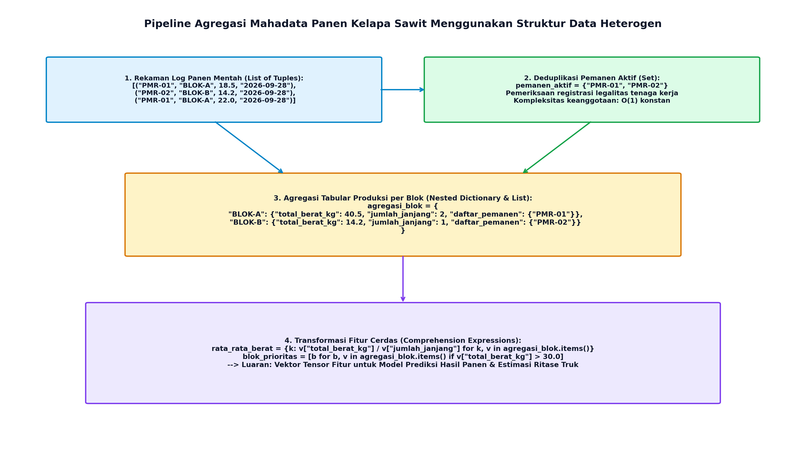

# AI Modul 2.9: Struktur Data Dasar

---

## 1. Identitas & Kerangka Capaian Pembelajaran (Sub-CPMK)

* **Kode Modul**        : AI Modul 2.9
* **Mata Kuliah**       : Kecerdasan Buatan dan Sains Data Pertanian Presisi
* **Alokasi Waktu**     : 2 x 50 Menit (Kajian Teori & Diskusi) + 2 x 50 Menit (Eksplorasi Praktikum Mandiri)
* **Beban SKS**         : 3 SKS
* **Prasyarat**         : AI Modul 2.8 (Fungsi dalam Pemrograman)
* **Level Kognitif**    : C2 (Memahami), C3 (Menerapkan), C4 (Menganalisis)

```mermaid
flowchart LR
    subgraph OUTPUTS["OUTPUTS (Keluaran Pembelajaran)"]
        O1["Skrip Analisis Struktur Data Fundamental"]
        O2["Tabel Matriks Benchmark Kompleksitas Big-O"]
        O3["Pipeline Agregasi Mahadata Panen Sawit"]
    end

    subgraph OUTCOMES["OUTCOMES (Kompetensi & Keterampilan)"]
        OC1["Keterampilan Memilih Struktur Data Berbasis Beban Kerja"]
        OC2["Keahlian Mengoptimasi Operasi Akses & Pencarian O(1)"]
        OC3["Kemampuan Merekayasa Vektor Fitur via Comprehension"]
    end

    subgraph IMPACTS["IMPACTS (Dampak Strategis Industri)"]
        I1["Efisiensi Pengolahan Big Data Logistik Perkebunan"]
        I2["Optimalisasi Alokasi RAM pada Komputasi Tepi (Edge AI)"]
        I3["Fondasi Pemrosesan Tensor Machine Learning Lanjutan"]
    end

    OUTPUTS --> OUTCOMES --> IMPACTS
```



### 1.1 Capaian Pembelajaran Khusus (Sub-CPMK)
Setelah menyelesaikan modul ini, mahasiswa dan pembelajar diharapkan mampu:
1. **Menguraikan (C2)** karakteristik struktural, mutabilitas, dan representasi memori 4 koleksi bawaan Python (List, Tuple, Set, Dictionary).
2. **Menganalisis (C4)** kompleksitas asimtotik waktu operasi dasar (akses indeks, pencarian kunci, penyisipan elemen) pada masing-masing struktur data.
3. **Menerapkan (C3)** struktur data List dan Dictionary untuk memetakan koordinat spasial sensor IoT dan inventaris blok perkebunan sawit.
4. **Mengevaluasi (C4)** teknik idiomatis *list comprehension* dan *dictionary comprehension* untuk pembersihan data berkecepatan tinggi.

### 1.2 Kerangka Hasil Pembelajaran (Outputs, Outcomes, & Impacts)
* **Outputs (Keluaran Berwujud Langsung)**:
* **Outcomes (Hasil Capaian & Perubahan Kompetensi)**:
* **Impacts (Dampak Jangka Panjang & Nilai Guna Luas)**:

---

## 2. Klasifikasi dan Karakteristik Formal Koleksi Data Python

Python menyediakan empat struktur data bawaan yang menjadi pilar utama pengelolaan data:


*Gambar 2.9.1: Klasifikasi Koleksi Data Fundamental Python (Kiri) dan Perbandingan Model Memori Fisik CPython (Kanan).*

### 2.1 List (Larik Dinamis Mutabel)
- **Karakteristik:** Koleksi data sekuensial terurut (*ordered sequence*), bersifat mutabel (*dapat dimodifikasi elemennya secara in-place*), dan mengizinkan duplikasi nilai.
- **Kasus Penggunaan Agronomis:** Menyimpan deret waktu telemetri sensor iklim mikro perkebunan (suhu, curah hujan) di mana urutan kronologis kejadian harus dipertahankan secara ketat.

### 2.2 Tuple (Larik Statis Imutabel)
- **Karakteristik:** Koleksi data sekuensial terurut, bersifat imutabel (*tidak dapat diubah, ditambah, atau dihapus setelah instansiasi*), dan mendukung pemetaan hash (*hashable*) jika seluruh elemennya imutabel.
- **Kasus Penggunaan Agronomis:** Menyimpan koordinat geospasial tetap pohon sawit `(lintang, bujur)` atau dimensi batas fisik alat pemanen yang tidak boleh mengalami modifikasi status selama program berjalan.

### 2.3 Dictionary (Pemetaan Asosiatif Kunci-Nilai)
- **Karakteristik:** Koleksi pemetaan (*associative mapping*) yang menghubungkan pasangan kunci unik (*unique keys*) dengan nilai (*values*). Kunci wajib bertipe data imutabel (*hashable*), sedangkan nilai dapat bertipe apa pun. Sejak Python 3.7+, urutan penyisipan (*insertion order*) dijamin tetap dipertahankan.
- **Kasus Penggunaan Agronomis:** Master data blok perkebunan, di mana kode blok unik (misal: `"BLOK-A12"`) memetakan atribut agronomis seperti luas hektar, jenis tanah, tahun tanam, dan varietas bibit.

### 2.4 Set (Himpunan Unik Tanpa Urutan)
- **Karakteristik:** Koleksi elemen unik (*unique elements*) tanpa urutan indeks tetap (*unordered collection*) yang mengimplementasikan operasi teori himpunan matematika formal (irisan, gabungan, selisih, komplemen).
- **Kasus Penggunaan Agronomis:** Deduplikasi daftar identitas pemanen yang aktif bekerja pada suatu hari atau penentuan himpunan hama yang muncul bersamaan di dua afdeling perkebunan.

---

## 3. Arsitektur Internal Memori CPython

Pemahaman atas representasi fisik struktur data di memori komputer (*RAM*) membedakan programmer pemula dari perancang sistem kecerdasan buatan profesional.

### 3.1 Model Memori Larik Kontigu: List dan Tuple
Secara internal pada interpreter CPython, sebuah objek `list` atau `tuple` tidak menyimpan data objek itu sendiri secara langsung di dalam larik. Sebaliknya, struktur data ini adalah **larik kontigu penunjuk referensi memori (*contiguous array of pointers*)**:
- Setiap slot pada larik berukuran 8 byte (pada arsitektur sistem operasi 64-bit) yang berisi alamat memori (*memory address pointer*) menuju objek sebenarnya di memori Heap.
- **Akses Indeks Instan $\mathcal{O}(1)$:** Karena ukuran setiap pointer identik (8 byte) dan disimpan secara bersebelahan di memori fisik, komputer menghitung alamat elemen ke-$i$ secara langsung melalui formula aritmetika memori:
  $$\text{Alamat}(i) = \text{Alamat\_Awal} + (i \times 8 \text{ byte})$$
  - **Keterangan Komponen Simbol:** $\text{Alamat}(i)$ adalah alamat memori fisik elemen ke-$i$, $\text{Alamat\_Awal}$ adalah alamat awal pointer larik di RAM, $i$ adalah indeks elemen yang diakses ($0, 1, \dots$), dan $8\text{ byte}$ adalah ukuran lebar satu pointer 64-bit.
  - **Cara Membaca Rumus:** *"Alamat memori elemen ke-i sama dengan alamat awal larik ditambah hasil perkalian antara indeks i dengan delapan byte."*
- **Biaya Modifikasi $\mathcal{O}(N)$:** Menyisipkan atau menghapus elemen di awal atau tengah list mengharuskan CPython menggeser seluruh pointer di sebelah kanannya satu langkah ke depan atau ke belakang (*memory shift*).

### 3.2 Model Memori Tabel Hash: Dictionary dan Set
Struktur `dict` dan `set` dibangun di atas arsitektur **Tabel Hash (*Hash Table*)** terkompresi:
1. Ketika sebuah kunci dimasukkan, Python memanggil fungsi bawaan `hash(kunci)` untuk menghasilkan bilangan bulat hash (*hash integer*).
2. Bilangan hash tersebut dipetakan ke dalam indeks slot larik (*hash bucket*) melalui operasi modulo:
   $$\text{Indeks\_Bucket} = \text{hash}(\text{kunci}) \pmod{\text{Kapasitas\_Tabel}}$$
   - **Keterangan Komponen Simbol:** $\text{Indeks\_Bucket}$ adalah indeks slot baris pada tabel internal, $\text{hash}(\text{kunci})$ adalah representasi integer acak-deterministik dari kunci, $\pmod{}$ adalah operator sisa pembagian bilangan bulat (modulo), dan $\text{Kapasitas\_Tabel}$ adalah ukuran panjang larik bucket (berpangkat dua, misal 8, 16, 32).
   - **Cara Membaca Rumus:** *"Indeks bucket sama dengan nilai hash dari kunci modulo kapasitas tabel."*
3. **Resolusi Tabrakan Hash (*Collision Resolution*):** Jika dua kunci menghasilkan indeks bucket yang sama, Python menggunakan algoritma *Open Addressing with Pseudo-Random Probing* (Perturbasi) untuk menemukan slot kosong berikutnya secara deterministik.
4. **Pencarian Konstan $\mathcal{O}(1)$:** Komputer tidak perlu menelusuri data baris demi baris. Kunci di-hash ulang, melompat langsung ke slot terkait, dan nilai diambil dalam hitungan nanodetik terlepas dari apakah dictionary berisi 10 atau 1.000.000 data.

---

## 4. Analisis Kompleksitas Asimptotik Big-O

Matriks efisiensi algoritma di bawah ini menjadi panduan baku bagi pengembang sistem cerdas:

| Operasi Komputasi | List (Larik Mutabel) | Tuple (Larik Imutabel) | Dictionary (Tabel Hash) | Set (Tabel Hash) |
| :--- | :---: | :---: | :---: | :---: |
| **Akses Berdasarkan Indeks (`data[i]`)** | $\mathcal{O}(1)$ | $\mathcal{O}(1)$ | Tidak Berlaku | Tidak Berlaku |
| **Pencarian Elemen (`kunci in data`)** | $\mathcal{O}(N)$ *(linear search)* | $\mathcal{O}(N)$ *(linear search)* | $\mathcal{O}(1)$ *(hash lookup)* | $\mathcal{O}(1)$ *(hash lookup)* |
| **Penyisipan di Akhir (`.append()`)** | $\mathcal{O}(1)$ *(amortized)* | Tidak Berlaku | $\mathcal{O}(1)$ *(key assignment)* | $\mathcal{O}(1)$ *(add)* |
| **Penyisipan di Awal/Tengah (`.insert()`)** | $\mathcal{O}(N)$ *(pergeseran array)* | Tidak Berlaku | $\mathcal{O}(1)$ | $\mathcal{O}(1)$ |
| **Penghapusan Elemen (`del data[i]`)** | $\mathcal{O}(N)$ *(pergeseran array)* | Tidak Berlaku | $\mathcal{O}(1)$ | $\mathcal{O}(1)$ |
| **Konsumsi Memori Relatif** | Menengah (overhead alokasi) | Paling Hemat (statis) | Tinggi (overhead tabel hash) | Tinggi (overhead tabel hash) |

> [!NOTE]
> **Wawasan Kritis Big-O:** Mencari keberadaan elemen dengan operator `in` pada `list` dengan $1.000.000$ data membutuhkan hingga $1.000.000$ kali komparasi. Sebaliknya, mengubah `list` tersebut menjadi `set` memangkas waktu pencarian menjadi tepat $1$ kali operasi hash $\mathcal{O}(1)$, meningkatkan kecepatan hingga ribuan kali lipat.

---

## 5. Manipulasi Data Deklaratif Berbasis Comprehension

Python menyediakan sintaksis komprehensi (*comprehension expressions*) yang elegan, deklaratif, dan dieksekusi lebih cepat pada tingkat bytecode CPython dibandingkan perulangan `for` konvensional.

### 5.1 List Comprehension
Menghasilkan list baru melalui pemetaan dan penyaringan data secara ringkas:
```python
# Sintaks: [ekspresi for elemen in koleksi if kondisi]
suhu_mentah = [28.5, 31.0, 24.5, 33.2, 29.0]
suhu_panas = [s for s in suhu_mentah if s > 30.0]  # [31.0, 33.2]
```

### 5.2 Dict Comprehension
Mentransformasi pasangan kunci-nilai atau membalik indeks kamus:
```python
# Sintaks: {kunci: nilai for elemen in koleksi if kondisi}
luas_blok_ha = {"A1": 25.0, "A2": 18.5, "B1": 32.0}
target_pupuk = {blok: luas * 200.0 for blok, luas in luas_blok_ha.items()}
```

### 5.3 Set Comprehension
Membangun himpunan unik dari hasil evaluasi data:
```python
# Sintaks: {ekspresi for elemen in koleksi}
kode_panen = ["PMR-01", "PMR-02", "PMR-01", "PMR-03", "PMR-02"]
pemanen_unik = {p.strip().upper() for p in kode_panen}
# Hasil: {'PMR-01', 'PMR-02', 'PMR-03'}
```

### 5.4 Generator Expression
Bekerja secara evaluasi malas (*lazy evaluation*): tidak mengalokasikan seluruh koleksi ke memori, melainkan membangkitkan elemen satu per satu saat diminta. Sangat esensial saat mengolah data berukuran gigabyte:
```python
# Menggunakan tanda kurung biasa ()
generator_kuadrat = (x**2 for x in range(10000000))
# Konsumsi memori tetap konstan O(1) (~112 byte) terlepas dari jumlah elemen!
```

---

## 6. Implementasi Kasus Nyata: Pipeline Agregasi Mahadata Panen Kelapa Sawit

Dalam ekosistem perkebunan kelapa sawit terintegrasi, setiap sore hari divisi logistik memproses ribuan data panen dari seluruh divisi afdeling. Setiap janjang tandan buah segar (TBS) dicatat bersama identitas pemanen, koordinat blok, dan bobot timbangan untuk menentukan:
1. Neraca massa tonase produksi per blok.
2. Evaluasi produktivitas dan insentif premi pemanen.
3. Ekstraksi vektor fitur AI untuk model prediksi hasil panen (*yield forecasting*).



*Gambar 2.9.2: Arsitektur Pipeline Agregasi Mahadata Panen Kelapa Sawit Berbasis Kombinasi Struktur Data Heterogen.*

Berikut adalah implementasi Python skala industri yang mendemonstrasikan sinergi empat struktur data dasar secara modular, efisien, dan bersih:

```python
"""AI Modul 2.9: Pipeline Agregasi Mahadata Panen Kelapa Sawit Berbasis Struktur Data Heterogen.

Penulis: Tim Kurikulum AI & Sains Data INSTIPER Yogyakarta
Standar: Python 3.10+ / Clean Code Architecture (PEP 8 & PEP 484)
"""

from dataclasses import dataclass
from typing import Any, Dict, List, Set, Tuple


@dataclass(frozen=True)
class TiketTimbanganTBS:
  """Objek data transfer transaksi timbangan janjang buah sawit."""

  id_tiket: str
  id_pemanen: str
  kode_blok: str
  berat_tbs_kg: float
  jumlah_janjang: int


class EngineAgregasiPanen:
  """Engine pemrosesan data panen skala besar menggunakan sinergi

  List, Tuple, Set, dan Dictionary teroptimasi O(1).
  """

  def __init__(self) -> None:
    # Set: Basis data pemanen resmi terdaftar untuk verifikasi O(1)
    self.registrasi_pemanen_sah: Set[str] = {
        "PMR-01",
        "PMR-02",
        "PMR-03",
        "PMR-04",
        "PMR-05",
    }
    # Dict: Data referensi batas kapasitas luas blok (Hektar)
    self.luas_blok_hektar: Dict[str, float] = {
        "BLOK-A01": 25.5,
        "BLOK-A02": 30.0,
        "BLOK-B01": 22.0,
        "BLOK-B02": 28.5,
    }

  def proses_batch_panen(
      self, transaksi_panen: List[TiketTimbanganTBS]
  ) -> Dict[str, Any]:
    """Mengagregasi aliran transaksi panen ke dalam struktur data analitika terpadu."""
    # 1. Pemanfaatan Set untuk Verifikasi dan Deduplikasi
    id_pemanen_lapangan: Set[str] = {t.id_pemanen for t in transaksi_panen}
    pemanen_tidak_terdaftar: Set[str] = (
        id_pemanen_lapangan - self.registrasi_pemanen_sah
    )

    # 2. Agregasi Tabular per Blok Menggunakan Nested Dictionary
    rekapitulasi_blok: Dict[str, Dict[str, Any]] = {}

    for t in transaksi_panen:
      # Lewati pemanen yang tidak terdaftar (Security Guard)
      if t.id_pemanen in pemanen_tidak_terdaftar:
        continue

      if t.kode_blok not in rekapitulasi_blok:
        rekapitulasi_blok[t.kode_blok] = {
            "total_berat_kg": 0.0,
            "total_janjang": 0,
            "kumpulan_pemanen": set(),  # Set untuk melacak pekerja unik
            "riwayat_bobot": [],  # List untuk analisis distribusi
        }

      blok_data = rekapitulasi_blok[t.kode_blok]
      blok_data["total_berat_kg"] += t.berat_tbs_kg
      blok_data["total_janjang"] += t.jumlah_janjang
      blok_data["kumpulan_pemanen"].add(t.id_pemanen)
      blok_data["riwayat_bobot"].append(t.berat_tbs_kg)

    # 3. Transformasi Fitur AI Menggunakan Dict Comprehension
    # Menghitung Berat Janjang Rata-rata (BJR) dan Produktivitas (Ton/Ha)
    bjr_per_blok: Dict[str, float] = {
        blok: round(info["total_berat_kg"] / max(1, info["total_janjang"]), 2)
        for blok, info in rekapitulasi_blok.items()
    }

    produktivitas_ton_ha: Dict[str, float] = {
        blok: round(
            (info["total_berat_kg"] / 1000.0)
            / self.luas_blok_hektar.get(blok, 1.0),
            3,
        )
        for blok, info in rekapitulasi_blok.items()
    }

    # 4. Filter Blok Berproduksi Tinggi Menggunakan List of Tuples
    blok_kinerja_tinggi: List[Tuple[str, float]] = [
        (blok, ton_ha)
        for blok, ton_ha in produktivitas_ton_ha.items()
        if ton_ha >= 0.50
    ]

    return {
        "total_transaksi": len(transaksi_panen),
        "pemanen_aktif": sorted(list(id_pemanen_lapangan)),
        "pemanen_ilegal": list(pemanen_tidak_terdaftar),
        "rekapitulasi_blok": rekapitulasi_blok,
        "metrik_bjr_kg": bjr_per_blok,
        "produktivitas_ton_ha": produktivitas_ton_ha,
        "blok_prioritas_angkut": blok_kinerja_tinggi,
    }


# =====================================================================
# BLOK EKSEKUSI PENGUJIAN INDUSTRIAL
# =====================================================================
if __name__ == "__main__":
  print("=" * 80)
  print("SISTEM AGREGASI MAHADATA PANEN PERKEBUNAN KELAPA SAWIT INSTIPER")
  print("=" * 80)

  # Dataset transaksi panen harian
  aliran_panen = [
      TiketTimbanganTBS("T-001", "PMR-01", "BLOK-A01", 1450.0, 85),
      TiketTimbanganTBS("T-002", "PMR-02", "BLOK-A01", 1820.0, 105),
      TiketTimbanganTBS("T-003", "PMR-01", "BLOK-A02", 2100.0, 110),
      TiketTimbanganTBS("T-004", "PMR-03", "BLOK-B01", 1650.0, 92),
      TiketTimbanganTBS("T-005", "PMR-04", "BLOK-A02", 1950.0, 98),
      TiketTimbanganTBS("T-006", "PMR-05", "BLOK-B02", 2400.0, 115),
      TiketTimbanganTBS("T-007", "PMR-99", "BLOK-B01", 850.0, 45),  # Ilegal!
      TiketTimbanganTBS("T-008", "PMR-02", "BLOK-A01", 1200.0, 68),
  ]

  engine = EngineAgregasiPanen()
  laporan = engine.proses_batch_panen(aliran_panen)

  print(f"\n1. Audit Keamanan & Keabsahan Pemanen:")
  print(f"   - Total Transaksi Masuk   : {laporan['total_transaksi']} tiket")
  print(f"   - Pemanen Aktif Terverifikasi : {laporan['pemanen_aktif']}")
  print(f"   - Peringatan Pemanen Ilegal   : {laporan['pemanen_ilegal']}")

  print(f"\n2. Agregasi Tabular Produksi per Blok Kebun:")
  for blok, data in laporan["rekapitulasi_blok"].items():
    print(f"   * [{blok}]")
    print(
        f"     Total Berat   : {data['total_berat_kg']} kg"
        f" ({data['total_berat_kg']/1000.0:.2f} Ton)"
    )
    print(f"     Total Janjang : {data['total_janjang']} janjang")
    print(f"     Tenaga Kerja  : {sorted(list(data['kumpulan_pemanen']))}")
    print(f"     Rerata BJR    : {laporan['metrik_bjr_kg'][blok]} kg/janjang")
    print(
        f"     Produktivitas : {laporan['produktivitas_ton_ha'][blok]} Ton/Ha"
    )

  print(f"\n3. Blok Prioritas Pengangkutan Truk (Produktivitas >= 0.50 Ton/Ha):")
  for blok, prod in laporan["blok_prioritas_angkut"]:
    print(f"   -> {blok:<10} : {prod:.3f} Ton/Ha [STATUS: PRIORITAS TINGGI]")

  print("=" * 80 + "\n")
```

---

## 7. Pembahasan Keterangan Penggunaan Kode (Operational Breakdown)

Dekonstruksi fungsional atas kode di atas menyingkap implementasi terpadu struktur data modern:

1. **Optimasi Operasi Himpunan untuk Keamanan (*Set Difference*) (Baris 51–56):**  
   Ekspresi `pemanen_tidak_terdaftar = id_pemanen_lapangan - self.registrasi_pemanen_sah` memanfaatkan operasi selisih himpunan (*set difference*) berkecepatan tinggi $\mathcal{O}(N)$ untuk menyaring tenaga kerja tanpa izin dalam satu baris kode deklaratif.
2. **Kombinasi Struktur Heterogen Terstruktur (Baris 67–75):**  
   Setiap blok memadukan tipe skalar (`float`, `int`), tipe koleksi dinamis `list` untuk menyimpan riwayat bobot yang mempertahankan kronologi, serta `set` untuk menjamin pencatatan ID pemanen tidak mengandung duplikasi.
3. **Penyusunan Vektor Fitur Menggunakan Comprehension (Baris 78–92):**  
   Perhitungan Berat Janjang Rata-rata (BJR) dan produktivitas per hektar dieksekusi menggunakan *dict comprehension*. Ini memisahkan logika kalkulasi analitik dari alur penyimpanan data, menghasilkan struktur data baru tanpa memutasi kamus asli.
4. **Representasi Pasangan Imutabel Menggunakan Tuple (Baris 95–99):**  
   Daftar blok prioritas angkut diformat sebagai `List[Tuple[str, float]]`. Struktur `tuple` dipilih karena relasi antara nama blok dan angka produktivitas bersifat konstan dan terikat erat (*record binding*).

---

## 8. Evaluasi Mandiri: Pertanyaan HOTS & Tantangan Scaffolded

### 8.1 Pertanyaan HOTS (Higher-Order Thinking Skills)

1. **Analisis Kompleksitas Asimptotik Masalah Dua Jumlah (*Two-Sum Problem in Yield Aggregation*):**  
   Diberikan daftar bobot tandan sawit `daftar_bobot = [12, 18, 25, 30, 15, ...]`. Divisi pemuatan ingin mencari pasangan dua tandan yang jika digabungkan memiliki berat tepat $K = 50\text{ kg}$ untuk mengisi satu lori mini.
   - Analisis kompleksitas waktu dari solusi *Brute Force* yang menggunakan dua perulangan bersarang (`for i ... for j ...`)!
   - Rancanglah algoritma berbasis `dict` atau `set` yang mampu menyelesaikan masalah ini dalam kompleksitas linier $\mathcal{O}(N)$ dan ruang $\mathcal{O}(N)$!
2. **Analisis Fenomena Amortisasi Waktu (*Amortized Constant Time*) pada `list.append()`:**  
   Metode `list.append()` di Python dinyatakan memiliki kompleksitas waktu $\mathcal{O}(1)$ teramortisasi (*amortized $\mathcal{O}(1)$*). Jelaskan mekanisme internal alokasi memori dinamis CPython (*Over-allocation strategy: $0, 4, 8, 16, 25, 35, \dots$*)! Mengapa sesekali penambahan satu elemen dapat memicu operasi penyalinan berbiaya $\mathcal{O}(N)$, namun rata-rata waktu jangka panjangnya tetap $\mathcal{O}(1)$?
3. **Audit Imutabilitas Kunci Hash Table (*Hashable Key Constraint*):**  
   Mengapa Python mengizinkan `tuple` sebagai kunci dictionary (misal: `{(0.5, 102.3): "Pohon-A"}`), tetapi menolak keras `list` sebagai kunci (`{[0.5, 102.3]: "Pohon-A"}` memicu `TypeError: unhashable type: 'list'`)? Jelaskan bencana struktural yang akan terjadi pada integritas tabel hash jika isi data di dalam kunci dapat diubah-ubah secara mutabel setelah tersimpan di dalam bucket!

---

### 8.2 Tantangan Pemrograman Berjenjang (*Scaffolded Challenges*)

#### Tantangan 1 (Tingkat Dasar - *Warm-Up*): Penghitungan Frekuensi Varietas Kelapa Sawit Berbasis Dictionary
* **Skenario:** Sensus pembibitan mencatat daftar kode varietas bibit kelapa sawit: `["DxP-Marihat", "DxP-Yangambi", "DxP-Marihat", "DxP-Lame", "DxP-Yangambi", ...]`.
* **Tugas:** Buatlah fungsi `hitung_frekuensi_varietas(daftar_bibit: List[str]) -> Dict[str, int]` yang menghitung jumlah kemunculan setiap varietas tanpa menggunakan modul eksternal. Gunakan metode `.get(k, 0)` secara efisien.

#### Tantangan 2 (Tingkat Menengah - *Intermediate*): Analisis Irisan dan Disparitas Hama Dua Divisi Kebun Menggunakan Set
* **Skenario:** Tim proteksi tanaman mengidentifikasi spesies serangga hama di Afdeling 1 dan Afdeling 2.
* **Tugas:** Bangunlah fungsi `analisis_sebaran_hama(hama_afd1: Set[str], hama_afd2: Set[str]) -> Dict[str, Any]` yang menghitung:
  - Hama yang menyerang kedua afdeling sekaligus (Operasi Irisan / Intersection `&`).
  - Hama eksklusif yang hanya ada di Afdeling 1 (Operasi Selisih / Difference `-`).
  - Total keanekaragaman seluruh hama tanpa duplikasi (Operasi Gabungan / Union `|`).
  - Koefisien Similaritas Jaccard: $J(A, B) = \frac{|A \cap B|}{|A \cup B|}$.

#### Tantangan 3 (Tingkat Mahir - *Advanced*): Matriks Indeks Spasial Pohon Sawit Menggunakan Dictionary of Tuples & Filter Radius
* **Skenario:** Drone surveilans merekam koordinat grid $X, Y$ dan status kesehatan kanopi pohon sawit.
* **Tugas:** Bangunlah kelas `SpatialCanopyIndex` yang:
  1. Mengorganisasikan pohon ke dalam dictionary spasial dengan kunci tuple koordinat integer: `(grid_x, grid_y): Skor_NDVI`.
  2. Menyediakan metode `cari_pohon_radius(pusat_x: int, pusat_y: int, radius: int) -> List[Tuple[Tuple[int, int], float]]` yang menggunakan *list comprehension* dan rumus jarak Euclidean untuk menemukan seluruh pohon terinfeksi ($NDVI < 0.35$) di dalam radius pantauan secara efisien.

---

## 9. Glosarium Istilah Teknis

1. **Amortized Analysis (Analisis Teramortisasi):** Metode penaksiran kompleksitas algoritma yang menghitung rata-rata biaya komputasi per operasi sepanjang serangkaian operasi panjang, meskipun ada satu operasi langka yang berbiaya tinggi.
2. **Associative Array (Larik Asosiatif):** Struktur data abstrak yang memetakan koleksi kunci unik ke pasangan nilai terkaitnya (diimplementasikan sebagai `dict` di Python).
3. **Collision (Tabrakan Hash):** Peristiwa komputasi di mana dua kunci masukan yang berbeda menghasilkan indeks slot bucket yang persis sama pada sebuah tabel hash.
4. **Contiguous Memory (Memori Kontigu):** Alokasi blok memori fisik yang tersusun secara berurutan tanpa celah ruang di antaranya, memungkinkan komputasi alamat berbasis perkalian offset instan.
5. **Hashable:** Sifat suatu objek yang memiliki nilai hash tetap sepanjang masa hidupnya (wajib imutabel) dan dapat dibandingkan kesetaraannya, menjadikannya sah sebagai kunci `dict` atau anggota `set`.
6. **Immutable (Imutabel):** Sifat objek data yang keadaan internal atau nilainya tidak dapat diubah setelah selesai dialokasikan di memori (seperti `tuple`, `int`, `str`).
7. **Jaccard Similarity:** Metrik statistik matematis untuk mengukur tingkat kemiripan antara dua himpunan, dihitung dari rasio ukuran irisan dibagi ukuran gabungan.
8. **Open Addressing:** Metode penyelesaian tabrakan pada tabel hash di mana elemen yang bertabrakan dialihkan ke slot kosong berikutnya di dalam larik tabel yang sama menggunakan pola penelusuran tertentu.

---

## 10. Jembatan Konsep (Bridging) ke Part 3: Pemrograman Berorientasi Objek & Machine Learning

Selamat! Anda telah menyelesaikan seluruh **sembilan modul kurikulum dasar** pada **Part 2: Dasar Algoritma dan Logika Pemrograman**. Anda kini telah menguasai:
- Konsep dasar algoritma dan representasi flowchart/pseudocode (Modul 2.1 & 2.2).
- Struktur logika aljabar Boolean dan tipe data memori (Modul 2.3 & 2.4).
- Aritmetika presisi, percabangan *guard clauses*, dan kontrol perulangan (Modul 2.5, 2.6, & 2.7).
- Dekomposisi fungsi murni dan struktur data heterogen (Modul 2.8 & 2.9).

Namun, seiring dengan meningkatnya kompleksitas sistem kecerdasan buatan, sekadar menggabungkan fungsi dan dictionary tidak lagi memadai untuk memodelkan entitas fisik nyata seperti "Pabrik Sawit", "Drone Pemantau", atau "Model Neural Network". Kita memerlukan paradigma yang menyatukan **data (atribut)** dan **perilaku (metode)** ke dalam satu cetak biru yang terpadu.

Pada **Part 3: Pemrograman Berorientasi Objek (OOP) & Dasar Machine Learning**, kita akan melangkah ke tingkat rekayasa profesional:
- Paradigma OOP: *Classes, Objects, Encapsulation, Inheritance,* dan *Polymorphism*.
- Perancangan arsitektur sistem cerdas berbasis objek untuk otomasi industri pertanian.
- Integrasi pustaka saintifik inti (*NumPy* dan *Pandas*) untuk manipulasi matriks fitur tensor machine learning.

---

## 11. Daftar Pustaka dan Referensi Akademik

1. Van Rossum, G., & Drake, F. L.(2009). *Python 3 Reference Manual*. CreateSpace. (Bab 3: *Data Model - Sequences, Mappings, and Sets*).
2. Cormen, T. H., Leiserson, C. E., Rivest, R. L., & Stein, C.(2022). *Introduction to Algorithms* (4th ed.). MIT Press. (Bab 10: *Elementary Data Structures* & Bab 11: *Hash Tables*).
3. Hettinger, R.(2017). *Modern Dictionaries by More Compact and Faster Hash Tables*. PyCon US Technical Presentation.
4. Ramalho, L.(2022). *Fluent Python: Clear, Concise, and Effective Programming* (2nd ed.). O'Reilly Media. (Bab 2: *An Array of Sequences* & Bab 3: *Dictionaries and Sets*).
5. Knuth, D. E.(1998). *The Art of Computer Programming, Volume 3: Sorting and Searching* (2nd ed.). Addison-Wesley. (Bab 6: *Hashing*).
6. Sutrisno, B., & Handayani, R.(2022). Optimasi arsitektur data geospasial kelapa sawit menggunakan spatial hashing dan komparasi big-O pada komputasi tepi. *Jurnal Rekayasa dan Otomasi Informatika Pertanian*, 14(1), 45–58.
