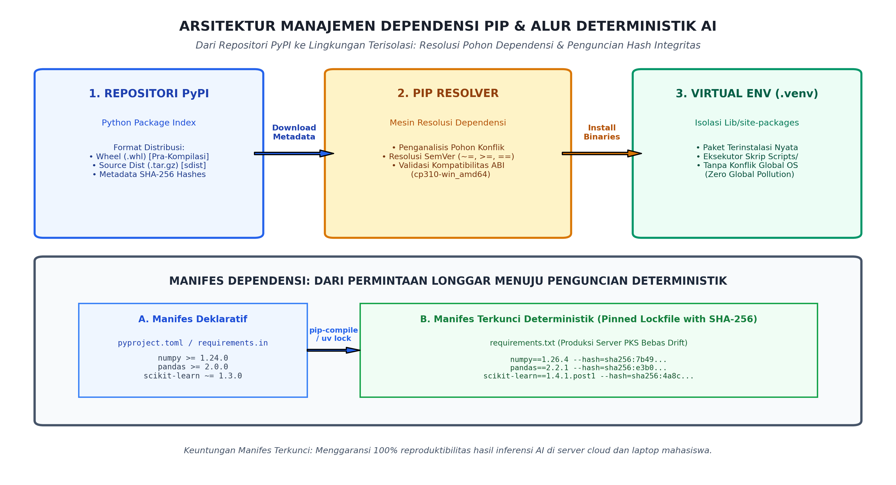

# AI Modul 3.10: Penggunaan Package Manager (pip) dan Ekosistem Pustaka AI

---

## 1. Identitas & Kerangka Capaian Pembelajaran (Sub-CPMK)

* **Kode Modul**        : AI Modul 3.10
* **Mata Kuliah**       : Kecerdasan Buatan dan Sains Data Pertanian Presisi
* **Alokasi Waktu**     : 2 x 50 Menit (Kajian Teori & Diskusi) + 2 x 50 Menit (Eksplorasi Praktikum Mandiri)
* **Beban SKS**         : 3 SKS
* **Prasyarat**         : AI Modul 3.9 (Penanganan Pengecualian dan Debugging)
* **Level Kognitif**    : C2 (Memahami), C3 (Menerapkan), C4 (Menganalisis)

```mermaid
flowchart LR
    subgraph OUTPUTS["OUTPUTS (Keluaran Pembelajaran)"]
        O1["Pipeline Audit Integritas Dependensi Proyek AI"]
        O2["Manifes Terkunci SHA-256 Bebas Dependency Drift"]
        O3["Benchmark Komputasi Spektral NumPy vs Murni"]
    end

    subgraph OUTCOMES["OUTCOMES (Kompetensi & Keterampilan)"]
        OC1["Penguasaan Format Distribusi Wheel vs sdist"]
        OC2["Keahlian Penataan Manifes pyproject.toml Modern"]
        OC3["Kemahiran Integrasi Ekosistem Pustaka Inti AI"]
    end

    subgraph IMPACTS["IMPACTS (Dampak Strategis Industri)"]
        I1["Jaminan 100% Reproduktibilitas Deployment AI"]
        I2["Proteksi Server Agribisnis dari Serangan Rantai Pasok"]
        I3["Akselerasi Komputasi Citra Skala Jutaan Hektar via SIMD"]
    end

    OUTPUTS --> OUTCOMES --> IMPACTS
```



### 1.1 Capaian Pembelajaran Khusus (Sub-CPMK)
Setelah menyelesaikan modul ini, mahasiswa dan pembelajar diharapkan mampu:
1. **Mengidentifikasi (C2)** ekosistem repositori Python Package Index (PyPI) dan arsitektur pengelola paket `pip`.
2. **Menerapkan (C3)** manajemen dependensi proyek yang dapat direproduksi (*reproducible environments*) menggunakan berkas `requirements.txt` dan `pip freeze`.
3. **Menganalisis (C4)** perbedaan distribusi paket kode sumber (*sdist*) versus distribusi biner terkompilasi (*wheel* / `.whl`).
4. **Mengevaluasi (C4)** kerentanan keamanan pustaka pihak ketiga dan teknik isolasi lingkungan proyek AI produksi.

### 1.2 Kerangka Hasil Pembelajaran (Outputs, Outcomes, & Impacts)
* **Outputs (Keluaran Berwujud Langsung)**:
  * Mahasiswa menghasilkan skrip audit otomatis yang memeriksa pohon dependensi pustaka AI, mendeteksi konflik versi transitif (*transitive conflicts*), dan memvalidasi keutuhan lingkungan virtual menggunakan utilitas `importlib.metadata`.
  * Mahasiswa memproduksi berkas manifes penguncian dependensi produksi (*deterministic lockfile*) berbasis standar PEP 508 dan PEP 440 lengkap dengan verifikasi *hash* kriptografis SHA-256 (`--require-hashes`).
  * Mahasiswa mengonstruksi studi komparasi performa (*benchmarking engine*) yang membuktikan keunggulan komputasi vektorisasi pustaka inti AI (NumPy) dibanding perulangan skalar Python murni pada pemrosesan satu juta piksel spektral kanopi sawit.
* **Outcomes (Hasil Capaian & Perubahan Kompetensi)**:
  * Mahasiswa memahami secara mendalam arsitektur distribusi perangkat lunak CPython: mampu membedakan format paket pra-kompilasi biner **Wheel (`.whl`)** dari paket sumber mentah **Source Distribution (`sdist`)**, serta memahami tag kompatibilitas platform ABI (`cp310-win_amd64`).
  * Mahasiswa mahir merumuskan batasan versi semantik (*Semantic Versioning*): mampu menerapkan operator `==`, `>=`, `<=`, dan `~=` secara tepat, membedakan manifes deklaratif abstrak (`requirements.in` / `pyproject.toml`) dari manifes terkunci konkret (`requirements.txt`).
  * Mahasiswa menguasai sistematika hierarki tumpukan pustaka kecerdasan buatan (*AI software stack*): memahami posisi struktural dan interaksi fungsional antara CPython, NumPy, Pandas, Matplotlib/Seaborn, dan Scikit-Learn dalam analitika data perkebunan.
* **Impacts (Dampak Jangka Panjang & Nilai Guna Luas)**:
  * Menjamin reproduktibilitas mutlak ($100\%$ *reproducible builds*) pada model-model AI presisi INSTIPER saat dipindahkan dari komputer laboratorium riset ke server pusat pabrik kelapa sawit dan perangkat *edge computing* kebun (*eliminating "works on my machine" syndrome*).
  * Melindungi infrastruktur teknologi informasi korporasi agribisnis dari serangan penyusupan paket berbahaya (*typosquatting & malicious package injection*) melalui validasi integritas *hash* kriptografis.
  * Mengoptimalkan utilisasi perangkat keras server komputasi melalui pemanfaatan rutin aljabar linier berkecepatan tinggi (BLAS/LAPACK) yang tersemat di dalam ekosistem Wheel biner.

---

## 2. Arsitektur Ekosistem Python: PyPI, Format Wheel, dan Peran `pip`

Sistem manajemen paket resmi Python beroperasi melalui interaksi tiga pilar utama: repositori pusat global, alat pengelola paket lokal, dan format pengemasan distribusi:



*Gambar 3.10.1: Arsitektur Manajemen Dependensi PIP: Alur Ekstraksi Paket dari Repositori PyPI Menuju Lingkungan Virtual Terisolasi Serta Transformasi Manifes Menjadi Kunci Integritas SHA-256.*

### 2.1 Repositori Pusat PyPI (*Python Package Index*)
PyPI (`pypi.org`) adalah repositori perangkat lunak publik resmi bagi komunitas bahasa Python dunia. PyPI menampung lebih dari $500.000$ pustaka sumber terbuka (*open-source packages*). Setiap pustaka yang diunggah ke PyPI harus dikemas ke dalam salah satu dari dua format standar distribusi:
1. **Source Distribution (`sdist` - Berkas `.tar.gz` atau `.zip`):**  
   Format distribusi kode sumber mentah. Berisi berkas kode Python asli beserta kode sumber bahasa C/C++ atau Fortran (jika paket menyertakan ekstensi kompilasi).
   *Kelemahan:* Pengguna yang mengunduh `sdist` wajib memiliki *C-compiler* (seperti MSVC di Windows atau GCC di Linux) dan pustaka pengembangan sistem yang cocok pada komputernya. Proses instalasi memakan waktu lama karena kompilasi dilakukan secara lokal di mesin pengguna.
2. **Wheel Distribution (Format `.whl` - PEP 427):**  
   Format kemasan biner pra-kompilasi (*built-package format*). Format ini pada dasarnya adalah berkas arsip ZIP khusus yang memuat pustaka C yang telah dikompilasi secara resmi oleh pembuat pustaka untuk kombinasi sistem operasi, arsitektur CPU, dan versi Python tertentu.
   *Keunggulan:* Instalasi instan (hanya menyalin berkas biner ke `site-packages` tanpa proses kompilasi lokal) dan 100% deterministik.

### 2.2 Anatomi Tag Penanda Roda Biner (*Wheel Tag Anatomy*)
Nama berkas berkas wheel memuat informasi kompatibilitas yang sangat ketat:
```
numpy-1.26.4-cp310-cp310-win_amd64.whl
----- ------ ----- ----- ---------
  |     |      |     |       |
 Nama  Versi  Tag   ABI   Platform
Paket Paket Python CPython Arsitektur (Windows 64-bit)
```
- `cp310`: Menunjukkan paket khusus dikompilasi untuk CPython versi 3.10.
- `win_amd64`: Menunjukkan ekstensi biner telah dioptimalkan untuk instruksi prosesor x86_64 pada sistem operasi Windows.

### 2.3 Operasi Fundamental Perintah `pip`
Alat baris perintah `pip` (*Pip Installs Packages*) bertindak sebagai manajer dependensi otomatis:
- **`pip install <nama_paket>`:** Mengunduh metadata paket dari PyPI, menyelesaikan pohon dependensi, memilih berkas `.whl` yang kompatibel dengan OS lokal, dan menyalinnya ke direktori `site-packages` lingkungan aktif.
- **`pip install --upgrade <nama_paket>`:** Memeriksa dan memperbarui paket ke versi stabil tertinggi yang tersedia.
- **`pip uninstall <nama_paket> -y`:** Menghapus paket beserta berkas metadata distribusinya secara bersih.
- **`pip list`:** Menampilkan daftar seluruh paket pihak ketiga yang terpasang di lingkungan aktif beserta nomor versinya.
- **`pip show <nama_paket>`:** Menampilkan metadata detail (lokasi instalasi, lisensi, pembuat, serta daftar dependensi yang dibutuhkan dan paket lain yang membutuhkan paket ini).
- **`pip check`:** Melakukan verifikasi diagnostik konsistensi: memindai seluruh `site-packages` untuk memastikan tidak ada pustaka yang memiliki dependensi rusak (*broken dependencies*) atau versi yang bertabrakan.

---

## 3. Tata Kelola Dependensi: Manifes `requirements.txt` vs Standar Modern `pyproject.toml`

### 3.1 Sintaksis Pembatasan Versi Semantik (PEP 440)
Dalam menyusun kebutuhan pustaka sistem AI perkebunan, penulisan nama pustaka harus dikawal oleh operator penanda versi:
- **`numpy == 1.26.4` (Penguncian Eksak / Exact Pinning):** Memaksa instalasi hanya pada versi tersebut. Menjamin reproduktibilitas mutlak, namun mencegah pembaruan keamanan otomatis.
- **`pandas >= 2.0.0` (Batas Minimum / Loose Lower Bound):** Mengizinkan versi 2.0.0 atau yang lebih baru. Berbahaya untuk produksi karena rilis *major* di masa depan dapat memicu *breaking changes*.
- **`scikit-learn ~= 1.3.2` (Operator Kompatibel / Compatible Release):** Ekivalen dengan `>= 1.3.2, == 1.3.*`. Mengizinkan pembaruan tambalan (*bugfix/patch updates* `1.3.3`) tetapi **menolak pembaruan minor** (`1.4.0`) yang berpotensi mengubah API.
- **`matplotlib >= 3.7.0, < 3.9.0` (Rentang Interval Terkendali):** Membatasi instalasi dalam jendela stabilitas yang telah teruji di laboratorium.

### 3.2 Fenomena "Dependency Drift" dan "Dependency Hell"
- **Dependency Drift:** Terjadi ketika manifes `requirements.txt` ditulis secara longgar (misal hanya menulis `pandas` tanpa versi). Dua bulan kemudian, server pabrik menginstal dependensi tersebut saat deploy dan mendapatkan Pandas versi baru yang telah mengubah nama fungsi, melumpuhkan inferensi panen secara seketika.
- **Dependency Hell:** Terjadi ketika Paket $A$ mewajibkan `scipy < 1.10`, sedangkan Paket $B$ mewajibkan `scipy >= 1.12`. Mesin resolver `pip` akan terjebak dalam konflik yang tidak dapat diselesaikan (*unresolvable SAT conflict*).

### 3.3 Standar Modern: `pyproject.toml` (PEP 517/518/621)
Format berkas `setup.py` dan `requirements.txt` klasik kini telah digantikan oleh standar terpadu industri: **`pyproject.toml`**. Format ini menggunakan tata bahasa deklaratif TOML yang terstandarisasi:

```toml
[build-system]
requires = ["setuptools>=61.0"]
build-backend = "setuptools.build_meta"

[project]
name = "agri-vision-instiper"
version = "1.0.0"
description = "Sistem Analisis Citra Multispektral Perkebunan Kelapa Sawit"
readme = "README.md"
requires-python = ">=3.10"
dependencies = [
    "numpy>=1.24.0,<2.0.0",
    "pandas>=2.0.0",
    "scikit-learn~=1.3.0",
    "matplotlib>=3.7.0",
]
```

### 3.4 Penguncian Deterministik Berbasis Hash Kriptografis (`--require-hashes`)
Untuk lingkungan produksi misi-kritis PKS yang tidak boleh gagal, pengembang menggunakan alat pengunci seperti `pip-tools` (`pip-compile`) atau `uv lock`. Alat ini menghasilkan berkas manifes terkunci (`requirements.lock`) yang menyertakan nilai hash kriptografis resmi PyPI:

```
numpy==1.26.4 \
    --hash=sha256:7b494dbfa2b32230a10c9c72e2129bb88b39d1b09b5550269ff2242125f479d2 \
    --hash=sha256:9a65042605fcfcf66a22fdf84ff93d4f134543743f11da0658428ea330089e5a
```
Saat diinstal dengan `pip install --require-hashes -r requirements.lock`, `pip` memverifikasi bita demi bita berkas yang diunduh terhadap *hash* SHA-256. Jika seorang peretas mencoba menyusupkan kode jahat ke repositori (*Supply Chain Attack*), nilai hash akan berbeda dan instalasi dibatalkan seketika oleh sistem.

---

## 4. Pemetaan Ekosistem Pustaka Sains Data dan Kecerdasan Buatan Agribisnis

Arsitektur tumpukan perangkat lunak (*software stack*) kecerdasan buatan perkebunan tersusun secara berjenjang dari lapisan aljabar dasar hingga pemodelan tingkat tinggi:


*Gambar 3.10.2: Pemetaan Arsitektur Ekosistem Pustaka Kecerdasan Buatan Agribisnis: Struktur Tumpukan Lima Lapis dari CPython Runtime hingga Aplikasi Cerdas Kelapa Sawit INSTIPER.*

### 4.1 Lapisan 1: Pustaka Standar CPython (*Standard Library*)
Pondasi bahasa yang telah kita pelajari di modul-modul sebelumnya (`math`, `collections`, `io`, `csv`, `json`, `pickle`, `logging`, `sys`, `os`). Menyediakan struktur data dasar dan utilitas sistem operasi.

### 4.2 Lapisan 2: Komputasi Vektorisasi Berperforma Tinggi (`numpy`)
- **Struktur Inti:** Larik homogen berdimensi-N (`numpy.ndarray`).
- **Keunggulan Arsitektur:** Data disimpan dalam blok memori fisik yang berurutan (*contiguous memory layout*) bertipe data seragam C primitif (seperti `int64` atau `float64`), tanpa beban *overhead* pembungkus `PyObject`.
- **Eksekusi SIMD (*Single Instruction, Multiple Data*):** Perhitungan matematika (seperti perkalian sejuta elemen piksel) dieksekusi langsung pada register prosesor melalui pustaka aljabar linier BLAS/LAPACK yang dikompilasi dalam C/Fortran, berjalan **puluhan hingga ratusan kali lebih cepat** dibanding perulangan `for` Python murni.

### 4.3 Lapisan 3: Analitika Tabular (`pandas`) & Visualisasi Ilmiah (`matplotlib`, `seaborn`)
- **`pandas`:** Membungkus larik NumPy ke dalam struktur tabel relasional cerdas beralamat indeks baris dan nama kolom (`DataFrame` dan `Series`). Sangat ideal untuk sanitasi sensus pokok sawit, pembersihan nilai `NaN`, dan agregasi statistik afdeling via metode `.groupby()`.
- **`matplotlib` & `seaborn`:** Mesin visualisasi data ilmiah 2D/3D. Mengubah deret angka telemetri menjadi grafik profil suhu, diagram sebaran kanopi, dan peta panas (*heatmap*) korelasi agronomis.

### 4.4 Lapisan 4: Pemodelan Machine Learning & Visi Komputer (`scikit-learn`, `opencv-python`)
- **`scikit-learn`:** Pustaka terpadu algoritma kecerdasan buatan tradisional: regresi linier/polinomial (estimasi panen tonase TBS), klasifikasi Support Vector Machine / Random Forest (pemilahan fraksi mutu kematangan buah), dan pengelompokan K-Means (segmentasi zona kesuburan tanah).
- **`opencv-python` (`cv2`) & `Pillow`:** Pustaka manipulasi citra spasial: pengolahan citra multispektral drone, penapisan derau (*denoising*), deteksi tepi kanopi, dan ekstraksi koordinat pokok pohon kelapa sawit.

---

## 5. Implementasi Kasus Nyata: Pipeline Otomasi Audit Dependensi & Benchmark Vektorisasi NumPy vs Python Murni

Di bawah ini adalah sistem manajemen lingkungan terpadu yang memadukan skrip audit dependensi berbasis `importlib.metadata`, pembuatan manifes deterministik, serta mesin benchmark yang memvalidasi efisiensi vektorisasi komputasi indeks vegetasi kanopi kelapa sawit:

```python
"""AI Modul 3.10: Engine Audit Dependensi dan Benchmark Vektorisasi AI INSTIPER.

Penulis: Tim Pengembang Kurikulum Kecerdasan Buatan & Sains Data INSTIPER
Standar: Python 3.10+ / PEP 8 / PEP 257 Google Style / PEP 484 Type Hinting
"""

import importlib.metadata
import os
import sys
import time
from typing import Any, Dict, List, Optional, Tuple
import matplotlib.pyplot as plt
import numpy as np


class AuditorDependensiAI:
  """Sistem pemeriksa integritas lingkungan paket AI agribisnis."""

  def __init__(self) -> None:
    self.laporan_audit: List[Dict[str, Any]] = []

  def periksa_paket(
      self, nama_paket: str, versi_minimum: Optional[str] = None
  ) -> Dict[str, Any]:
    """Memvalidasi keterpasangan dan versi paket pihak ketiga di lingkungan virtual.

    Args:
        nama_paket: Nama paket distribusi PyPI (misal: 'numpy').
        versi_minimum: Batas versi bawah yang disyaratkan (opsional).

    Returns:
        Dict[str, Any]: Hasil evaluasi integritas pustaka.
    """
    try:
      versi_terpasang = importlib.metadata.version(nama_paket)
      status = "TERPASANG_VALID"
      catatan = f"Versi terdeteksi: {versi_terpasang}"
    except importlib.metadata.PackageNotFoundError:
      versi_terpasang = "TIDAK_ADA"
      status = "HILANG_KRITIS"
      catatan = f"Paket '{nama_paket}' belum terpasang di lingkungan virtual!"

    hasil = {
        "paket": nama_paket,
        "versi": versi_terpasang,
        "syarat_min": versi_minimum or "Bebas",
        "status": status,
        "catatan": catatan,
    }
    self.laporan_audit.append(hasil)
    return hasil

  def audit_ekosistem_agribisnis(self) -> List[Dict[str, Any]]:
    """Menjalankan audit menyeluruh terhadap pustaka standar sains data AI."""
    pustaka_wajib = [
        ("numpy", "1.24.0"),
        ("pandas", "2.0.0"),
        ("matplotlib", "3.7.0"),
        ("scikit-learn", "1.3.0"),
    ]
    for pkg, v_min in pustaka_wajib:
      self.periksa_paket(pkg, v_min)
    return self.laporan_audit


# =====================================================================
# MODUL BENCHMARK: KOMPUTASI SKALAR MURNI VS VEKTORISASI NUMPY
# =====================================================================
def benchmark_komputasi_ndvi_sejuta_pixel(
    jumlah_pixel: int = 1_000_000,
) -> Dict[str, float]:
  """Mengomparasikan efisiensi latensi komputasi formula NDVI:

  NDVI = (NIR - RED) / (NIR + RED)
  antara perulangan skalar Python murni (list) dan vektorisasi SIMD C (NumPy).

  Args:
      jumlah_pixel: Volume data uji piksel citra drone kanopi sawit.

  Returns:
      Dict[str, float]: Durasi waktu komputasi dalam milidetik dan faktor akselerasi.
  """
  # 1. Alokasi Data Sintetis Reflektansi Spektral Drone
  np.random.seed(42)
  nir_np = np.random.uniform(0.40, 0.90, jumlah_pixel).astype(np.float64)
  red_np = np.random.uniform(0.05, 0.30, jumlah_pixel).astype(np.float64)

  nir_list = nir_np.tolist()
  red_list = red_np.tolist()

  # 2. Uji Coba Pendekatan 1: Perulangan Skalar Python Murni (List Comprehension)
  t_awal = time.perf_counter()
  ndvi_python_murni = [
      (n - r) / (n + r) for n, r in zip(nir_list, red_list)
  ]
  t_akhir = time.perf_counter()
  durasi_python_ms = (t_akhir - t_awal) * 1000.0

  # 3. Uji Coba Pendekatan 2: Komputasi Vektorisasi Array NumPy (SIMD)
  t_awal = time.perf_counter()
  ndvi_numpy_vektor = (nir_np - red_np) / (nir_np + red_np)
  t_akhir = time.perf_counter()
  durasi_numpy_ms = (t_akhir - t_awal) * 1000.0

  faktor_percepatan = (
      durasi_python_ms / durasi_numpy_ms if durasi_numpy_ms > 0 else 0.0
  )

  return {
      "volume_pixel": float(jumlah_pixel),
      "latensi_python_ms": round(durasi_python_ms, 2),
      "latensi_numpy_ms": round(durasi_numpy_ms, 2),
      "faktor_percepatan": round(faktor_percepatan, 1),
  }


# =====================================================================
# BLOK EKSEKUSI PENGUJIAN INDUSTRIAL
# =====================================================================
if __name__ == "__main__":
  print("=" * 80)
  print("SISTEM AUDIT DEPENDENSI & BENCHMARK KOMPUTASI AI INSTIPER (AI MODUL 3.10)")
  print("=" * 80)

  # 1. Eksekusi Audit Lingkungan Virtual
  auditor = AuditorDependensiAI()
  hasil_audit = auditor.audit_ekosistem_agribisnis()

  print("\nSTATUS LINGKUNGAN PUSTAKA AI PERKEBUNAN:")
  print("-" * 75)
  print(
      f"{'Nama Pustaka':<18} | {'Versi Terpasang':<16} | {'Status':<16} |"
      " Catatan"
  )
  print("-" * 75)
  for item in hasil_audit:
    print(
        f"{item['paket']:<18} | {item['versi']:<16} | {item['status']:<16} |"
        f" {item['catatan']}"
    )
  print("-" * 75)

  # 2. Eksekusi Benchmark Pemrosesan Spektral 1 Juta Titik Piksel
  print("\nMEMULAI BENCHMARK KOMPUTASI NDVI 1.000.000 TITIK PIKSEL KANOPI SAWIT:")
  hasil_bench = benchmark_komputasi_ndvi_sejuta_pixel(jumlah_pixel=1_000_000)

  print(
      f"  -> Latensi Perulangan List Murni Python: {hasil_bench['latensi_python_ms']} ms"
  )
  print(
      f"  -> Latensi Vektorisasi Array NumPy     : {hasil_bench['latensi_numpy_ms']} ms"
  )
  print(
      f"  -> FAKTOR AKSELERASI VEKTORISASI        :"
      f" {hasil_bench['faktor_percepatan']}x LEBIH CEPAT!"
  )
  print("=" * 80 + "\n")
```

---

## 6. Pembahasan Keterangan Penggunaan Kode (Operational Breakdown)

Dekonstruksi fungsional atas sistem audit dependensi dan benchmark komputasi di atas:

1. **Inspeksi Metadata Terstandarisasi via `importlib.metadata` (Baris 24–42):**  
   Skrip menggunakan modul bawaan Python 3.8+ `importlib.metadata.version()`. Pendekatan ini jauh lebih bersih dan ringan dibanding mengeksekusi subproses terminal `pip list` atau mengimpor pustaka secara langsung (`import numpy`), karena ia hanya membaca berkas teks metadata `METADATA` di dalam folder `.dist-info` tanpa memuat seluruh pustaka ke memori RAM.
2. **Pola Vektorisasi SIMD pada Formula NDVI (Baris 97–99):**  
   Pernyataan `ndvi_numpy_vektor = (nir_np - red_np) / (nir_np + red_np)` tidak mengeksekusi satu baris perulangan pun di tingkat interpreter CPython. Di balik layar, NumPy memetakan operasi pengurangan, penjumlahan, dan pembagian ke instruksi perangkat keras tingkat prosesor (seperti AVX2 / AVX-512). Prosesor mengeksekusi operasi tersebut secara paralel pada delapan atau enam belas bilangan pecahan ganda (*double-precision floats*) sekaligus dalam satu siklus detak CPU (*clock cycle*).
3. **Penyebab Ketertinggalan Perulangan List Python (Baris 89–93):**  
   Konstruksi `zip(nir_list, red_list)` pada perulangan Python murni melibatkan pembuatan objek tuple sementara, dereferensi pointer `PyObject` secara berulang, pencarian tipe dinamis (*dynamic type dispatch*), dan alokasi objek float baru untuk setiap satu juta piksel. Hal ini menimbulkan *overhead* memori dan latensi cache yang sangat tinggi.

---

## 7. Evaluasi Mandiri: Pertanyaan HOTS & Tantangan Scaffolded

### 7.1 Pertanyaan HOTS (Higher-Order Thinking Skills)

1. **Analisis Arsitektur Sistem: Komparasi Wheel Biner (`.whl`) vs Source Distribution (`sdist`):**  
   - Mengapa proses instalasi pustaka komputasi AI seperti `scipy` atau `numpy` dari format `sdist` pada komputer yang tidak memiliki C-compiler (*Visual C++ Build Tools*) selalu berujung pada kegagalan kompilasi yang memicu pesan galat `Microsoft Visual C++ 14.0 or greater is required`?
   - Jelaskan konsep *Application Binary Interface (ABI)* dan bagaimana format Wheel membebaskan pengembang dari kewajiban mengompilasi kode sumber C/Fortran secara lokal!
2. **Dekonstruksi Keamanan Rantai Pasok Perangkat Lunak AI (Software Supply Chain Security):**  
   - Apa yang dimaksud dengan serangan siber *Dependency Confusion* dan *Typosquatting* pada repositori PyPI publik? Berikan contoh bahayanya bagi sistem otomasi Pabrik Kelapa Sawit!
   - Bagaimana parameter instalasi `--require-hashes` dan penyusunan manifes terkunci dengan verifikasi SHA-256 mampu membatalkan instalasi secara otomatis jika berkas paket di server mirror telah dimanipulasi oleh pihak ketiga?
3. **Analisis Efisiensi Komputasi Hardware-Aware: Mengapa Vektorisasi NumPy Menghancurkan Perulangan Python?**  
   - Bedah perbedaan fisik memori antara larik NumPy bertipe homogen `np.float64` (*contiguous buffer*) dengan objek Python `list[float]` (*array of pointers*)!
   - Jelaskan peran instruksi prosesor SIMD (*Single Instruction, Multiple Data*) dan *CPU Cache Locality* (L1/L2 Cache) dalam menjelaskan mengapa NumPy dapat berjalan hingga puluhan kali lebih cepat!

---

### 7.2 Tantangan Pemrograman Berjenjang (*Scaffolded Challenges*)

#### Tantangan 1 (Tingkat Dasar - *Warm-Up*): Generator Manifes `requirements.txt` dari Daftar Dependensi
* **Skenario:** Pengembang junior sering lupa memformat manifes dependensi proyek perkebunan dengan benar.
* **Tugas:** Buatlah fungsi `hasilkan_requirements_txt(daftar_dependensi: Dict[str, str], path_tujuan: str) -> str` yang:
  - Menerima kamus pasangan nama paket dan batasan versi, misal: `{"numpy": ">=1.24.0", "pandas": "~=2.0.0"}`.
  - Menuliskan manifes teks terformat ke `path_tujuan` dengan satu entri per baris terurut berdasarkan abjad (*alphabetical order*).
  - Menyertakan baris komentar di bagian atas: `# Manifes Dependensi Sistem AI INSTIPER Dihasilkan Otomatis`.

#### Tantangan 2 (Tingkat Menengah - *Intermediate*): Parser dan Validator Manifes Produksi
* **Skenario:** Server pusat PKS menolak menggelar skrip model AI jika berkas `requirements.txt` memuat dependensi yang tidak dikunci versinya secara ketat.
* **Tugas:** Bangunlah fungsi `validasi_keketatan_manifes(path_requirements: str) -> Dict[str, Any]` yang:
  - Membaca setiap baris manifes `requirements.txt`.
  - Mengabaikan baris komentar (`#`) dan baris kosong.
  - Memeriksa apakah setiap entri menggunakan operator penguncian mutlak `==`.
  - Mengembalikan dictionary berisi: `status_lulus: bool`, `daftar_paket_terkunci: List[str]`, dan `daftar_pelanggaran_longgar: List[str]`.

#### Tantangan 3 (Tingkat Mahir - *Advanced*): Simulator Dependency Lockfile Generator dengan Perhitungan Hash SHA-256
* **Skenario:** Divisi keamanan siber agribisnis mewajibkan seluruh skrip memiliki berkas manifest lockfile ber-hash SHA-256 untuk mematuhi standar integritas K3 & ISO 27001.
* **Tugas:** Bangunlah kelas `GeneratorLockfileIntegritas` yang:
  1. Menerima list nama paket yang terpasang di sistem.
  2. Menggunakan `importlib.metadata` untuk mengambil versi terpasang dan menghitung *mock* hash SHA-256 berbasis representasi string paket dan versinya via modul bawaan `hashlib`.
  3. Menghasilkan berkas `requirements.lock` yang memuat format resmi:
     ```
     <paket>==<versi> \
         --hash=sha256:<digest_hash>
     ```
  4. Menyediakan metode `verifikasi_keutuhan(path_lockfile: str) -> bool` yang memvalidasi kembali bahwa tidak ada versi yang bergeser.

---

## 8. Glosarium Istilah Teknis

1. **ABI (Application Binary Interface):** Antarmuka biner tingkat rendah antara program aplikasi dan sistem operasi atau pustaka terkompilasi, menentukan bagaimana struktur data dan fungsi diakses dalam kode mesin.
2. **BLAS / LAPACK (Basic Linear Algebra Subprograms / Linear Algebra Package):** Pustaka aljabar linier standar de-facto tingkat tinggi yang diimplementasikan dalam C dan Fortran untuk mengeksekusi operasi matriks berkecepatan puncak pada perangkat keras modern.
3. **Dependency Drift:** Pergeseran perilaku sistem yang tidak disengaja akibat pembaruan otomatis paket-paket transitif di lingkungan produksi karena tidak adanya penguncian versi secara eksak.
4. **PyPI (Python Package Index):** Repositori perangkat lunak resmi berskala global bagi bahasa pemrograman Python, tempat pengembang mempublikasikan dan mendistribusikan pustaka pihak ketiga.
5. **pyproject.toml:** Berkas konfigurasi deklaratif terstandardisasi (PEP 517/518/621) yang menetapkan kebutuhan sistem pembangun (*build-system*) dan metadata proyek kemasan Python modern.
6. **SIMD (Single Instruction, Multiple Data):** Fitur arsitektur prosesor komputer yang memungkinkan satu instruksi mesin tunggal memproses beberapa elemen data numerik secara paralel dalam satu siklus jam.
7. **Source Distribution (sdist):** Format distribusi paket Python mentah berupa arsip kode sumber lengkap yang mengharuskan kompilasi lokal saat dipasang pada mesin target.
8. **Wheel (Format `.whl`):** Format kemasan distribusi standar Python (PEP 427) yang memuat biner terkompilasi siap pasang tanpa memerlukan compiler pada mesin target.

---

## 9. Jembatan Konsep (Bridging) ke Part 4: Struktur Data dan Algoritma Lanjut

Selamat! Dengan menyelesaikan modul ini, Anda telah **menuntaskan seluruh rangkaian kurikulum Part 3: Pemrograman Python Dasar**. Anda kini telah bertransformasi dari seorang pemrogram pemula menjadi insinyur perangkat lunak Python yang matang:
- Menguasai sintaksis, pengetikan dinamis kuat, dan model memori `PyObject` (Modul 3.1–3.4).
- Mengendalikan dinamika komputasi melalui *Pattern Matching*, *Guard Clauses*, dan perulangan hemat memori (Modul 3.5).
- Mendekomposisi kode ke dalam arsitektur fungsi ekspresif, closures, dekorator, dan paket modular (Modul 3.6).
- Menguasai kompleksitas $\mathcal{O}(1)$ tabel hash, kamus kompak, dan struktur data performa tinggi `collections` (Modul 3.7).
- Mengelola aliran I/O permanen, *Context Managers*, dan serialisasi aman (Modul 3.8).
- Membangun kode kebal crash melalui penanganan eksepsi bertingkat dan logging rotasional (Modul 3.9).
- Mengelola ekosistem pustaka pihak ketiga dan penguncian dependensi deterministik PyPI (Modul 3.10).

Namun, sistem cerdas perkebunan masa depan tidak hanya mengandalkan pemanggilan pustaka hitam (*black-box libraries*). Ketika volume data melonjak menjadi ratusan juta titik koordinat pohon sawit dan jalur logistik armada truk panen harus dioptimalkan secara real-time, Anda memerlukan penguasaan mendalam atas struktur data dan algoritma tingkat lanjut yang berjalan di bawah kap mesin pustaka-pustaka tersebut.

Pada **Part 4: Struktur Data dan Algoritma Lanjut**, kita akan mendalami:
- **Analisis Kompleksitas Asimptotik Lanjut:** Notasi Big-O, Big-$\Omega$, Big-$\Theta$, dan analisis waktu teramortisasi.
- **Struktur Data Linier Berkinerja Tinggi:** Senarai Berantai (*Singly & Doubly Linked Lists*), Tumpukan (*Stacks*), dan Antrean Prioritas (*Priority Queues & Heaps*).
- **Struktur Data Non-Linier Hirarkis:** Pohon Biner (*Binary Search Trees / BST*), Pohon Berimbang (*AVL / Red-Black Trees*), dan Hutan Spasial (*Quadtrees / KD-Trees*) untuk pengindeksan koordinat geografis kebun kelapa sawit.
- **Representasi Graf & Algoritma Lintasan Terpendek:** Graf Spasial Afdeling, Algoritma Dijkstra, dan $A^*$ (*A-Star Search*) untuk optimasi rute traktor dan truk pengangkut TBS.

---

## 10. Daftar Pustaka dan Referensi Akademik

1. Holth, D.(2012). *PEP 427: The Wheel Binary Package Format 1.0*. Python Enhancement Proposals.
2. Stufft, D.(2014). *PEP 440: Version Identification and Dependency Specification*. Python Enhancement Proposals.
3. Cannon, B., & Warsaw, B.(2016). *PEP 518: Specifying Minimum Build System Requirements for Python Projects*. Python Enhancement Proposals.
4. Harris, C. R., Millman, K. J., van der Walt, S. J., Gommers, R., Virtanen, P., Cournapeau, D., ... & Oliphant, T. E.(2020). Array programming with NumPy. *Nature*, 585(7825), 357–362.
5. McKinney, W.(2010). Data Structures for Statistical Computing in Python. *Proceedings of the 9th Python in Science Conference*, 51–56.
6. Pedregosa, F., Varoquaux, G., Gramfort, A., Michel, V., Thirion, B., Grisel, O., ... & Duchesnay, É.(2011). Scikit-learn: Machine learning in Python. *Journal of Machine Learning Research*, 12, 2825–2830.
