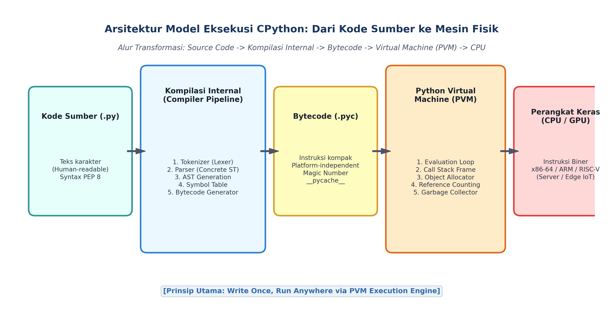
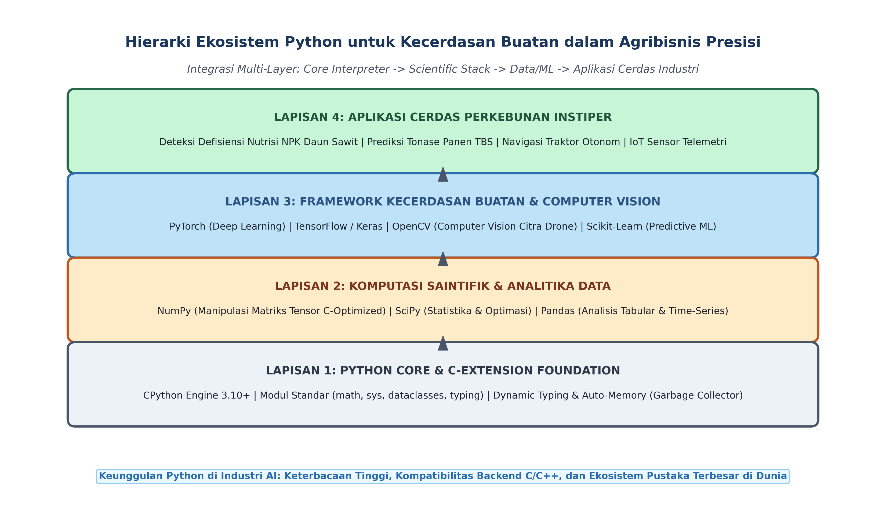

# AI Modul 3.1: Pengenalan Bahasa Python

---

## 1. Identitas & Kerangka Capaian Pembelajaran (Sub-CPMK)

* **Kode Modul**        : AI Modul 3.1
* **Mata Kuliah**       : Kecerdasan Buatan dan Sains Data Pertanian Presisi
* **Alokasi Waktu**     : 2 x 50 Menit (Kajian Teori & Diskusi) + 2 x 50 Menit (Eksplorasi Praktikum Mandiri)
* **Beban SKS**         : 3 SKS
* **Prasyarat**         : Part 2 (Dasar Algoritma dan Logika Pemrograman)
* **Level Kognitif**    : C2 (Memahami), C3 (Menerapkan), C4 (Menganalisis)

```mermaid
flowchart LR
    subgraph OUTPUTS["OUTPUTS (Keluaran Pembelajaran)"]
        O1["Skrip Audit Arsitektur Interpreter & Bytecode"]
        O2["Tabel Matriks Komparasi Paradigma Eksekusi"]
        O3["Pipeline Uji Lingkungan Saintifik Pertanian Cerdas"]
    end

    subgraph OUTCOMES["OUTCOMES (Kompetensi & Keterampilan)"]
        OC1["Penguasaan Prinsip Rekayasa PEP 20"]
        OC2["Pemahaman Alur Kompilasi Internal CPython"]
        OC3["Keterampilan Memilih Tooling Ekosistem AI"]
    end

    subgraph IMPACTS["IMPACTS (Dampak Strategis Industri)"]
        I1["Akselerasi Prototipe Solusi AI Perkebunan"]
        I2["Efisiensi Integrasi Algoritma Cerdas ke Edge IoT"]
        I3["Kemandirian Teknologi Sistem Presisi Tropis"]
    end

    OUTPUTS --> OUTCOMES --> IMPACTS
```



### 1.1 Capaian Pembelajaran Khusus (Sub-CPMK)
Setelah menyelesaikan modul ini, mahasiswa dan pembelajar diharapkan mampu:
1. **Menguraikan (C2)** filosofi desain Python (*The Zen of Python* / PEP 20) dan posisinya sebagai lingua franca ekosistem AI dunia.
2. **Menganalisis (C4)** perbedaan arsitektural antara bahasa terkompilasi (C/C++) dan bahasa terinterpretasi (CPython Bytecode & Virtual Machine).
3. **Mengevaluasi (C4)** implikasi *Global Interpreter Lock* (GIL) dan manajemen memori otomatis (*Reference Counting & Garbage Collection*) pada kinerja komputasi AI.
4. **Menjalankan (C3)** skrip Python dasar dalam mode interaktif REPL dan mode eksekusi berkas terstruktur.

### 1.2 Kerangka Hasil Pembelajaran (Outputs, Outcomes, & Impacts)
* **Outputs (Keluaran Berwujud Langsung)**:
  * Mahasiswa menghasilkan skrip Python standar (PEP 8 & PEP 484) yang mengaudit spesifikasi interpreter aktif, menginspeksi alur eksekusi bytecode menggunakan modul bawaan `dis`, serta mengevaluasi status konfigurasi sistem operasi.
  * Mahasiswa menyusun tabel matriks komparasi analitis yang membedah keunggulan, batasan, dan efisiensi memori antara paradigma kompilasi murni (*Ahead-Of-Time / AOT*), mesin virtual bytecode (*CPython PVM*), dan kompilasi tepat-waktu (*Just-In-Time / JIT*).
  * Mahasiswa mengonstruksi modul diagnostik pengujian fungsionalitas ekosistem saintifik dasar yang mengukur waktu latensi komputasi numerik pada pemrosesan aliran telemetri iklim mikro perkebunan kelapa sawit.
* **Outcomes (Hasil Capaian & Perubahan Kompetensi)**:
  * Mahasiswa menguasai dan mampu menerapkan 19 prinsip filosofis *The Zen of Python* (PEP 20) dalam perancangan kode program yang bersih, modular, elegan, dan mudah dipelihara (*maintainable*).
  * Mahasiswa memahami secara mendalam arsitektur kompilasi internal CPython—mulai dari analisis leksikal (*tokenization*), pembentukan pohon sintaks abstrak (*Abstract Syntax Tree / AST*), generasi bytecode (`.pyc`), hingga siklus evaluasi mesin virtual (*Python Virtual Machine / PVM*).
  * Mahasiswa memiliki wawasan strategis mengenai peran Python sebagai "bahasa perekat" (*glue language*) yang menghubungkan antarmuka pemrograman berorientasi objek tingkat tinggi dengan kernel komputasi numerik berperforma tinggi (*C/C++/CUDA*) di bidang pertanian presisi.
* **Impacts (Dampak Jangka Panjang & Nilai Guna Luas)**:
  * Mempercepat siklus penelitian dan pengembangan (*R&D*) inovasi agriteknologi di lingkungan kampus dan industri perkebunan nasional melalui pembuatan prototipe algoritma cerdas yang tangkas dan modular.
  * Mengurangi galat komputasi dan pemborosan sumber daya perangkat keras pada sistem komputasi tepi (*Edge AI*) yang diterapkan pada drone surveilans kebun, stasiun cuaca terpencil, dan pemilah panen otomatis.
  * Membentuk generasi saintis data dan insinyur kecerdasan buatan perkebunan tropis yang berdaya saing global dengan fondasi arsitektur komputasi yang kokoh.

---

## 2. Sejarah Singkat dan Filosofi Perancangan Python (PEP 20)

### 2.1 Sejarah dan Evolusi Komputasi
Python diciptakan pada akhir dekade 1980-an oleh **Guido van Rossum** di *Centrum Wiskunde & Informatica* (CWI) di Belanda, dan dirilis pertama kali pada tahun 1991. Diberi nama berdasarkan grup komedi legendaris Inggris *Monty Python's Flying Circus*, bahasa ini dirancang untuk mengatasi kelemahan bahasa sistem seperti C (yang sangat cepat namun rumit dan memerlukan waktu pengembangan lama) dan bahasa skrip shell (yang ringkas namun rapuh untuk aplikasi berskala besar).

Dalam kurun waktu tiga dekade, Python bertransformasi secara revolusioner:
- **Python 2.0 (2000):** Memperkenalkan *list comprehension*, sistem pengumpulan sampah berbasis pelacakan siklus (*cycle-detecting garbage collector*), dan dukungan Unicode dasar.
- **Python 3.0 (2008):** Merupakan pembaruan struktural besar yang memutus kompatibilitas ke belakang (*backward compatibility*) untuk membenahi redundansi bahasa, menyatukan penanganan teks murni (*Unicode `str`*) terpisah dari biner mentah (*`bytes`*), dan menata ulang pustaka standar.
- **Python 3.10+ (Modern):** Membawa fitur rekayasa modern seperti *Structural Pattern Matching* (`match-case`), pelaporan pesan kesalahan yang presisi, performa interpreter teroptimasi (*Faster CPython Project*), dan sistem pengetikan statis teranotasi (*static typing annotations* via PEP 484).

### 2.2 Filosofi Desain: The Zen of Python (PEP 20)
Karakteristik unik Python bersumber dari pedoman filosofis yang ditulis oleh Tim Peters dalam dokumen resmi **Python Enhancement Proposal (PEP) 20**, yang dikenal sebagai *The Zen of Python*. Mahasiswa kecerdasan buatan wajib menginternalisasi aforisme inti berikut dalam setiap baris kode yang ditulis:

1. **"Beautiful is better than ugly."**  
   Kode yang indah secara estetika dan terstruktur rapi memudahkan pemahaman algoritma machine learning yang kompleks.
2. **"Explicit is better than implicit."**  
   Aliran data, parameter fungsi, dan tipe variabel harus dinyatakan secara terang-benderang tanpa menyembunyikan efek samping komputasi.
3. **"Simple is better than complex."**  
   Prioritaskan solusi algoritma yang paling sederhana dan langsung sebelum mempertimbangkan abstraksi tingkat tinggi.
4. **"Complex is better than complicated."**  
   Jika persoalan agronomis yang ditangani memang rumit (misal: simulasi dinamika fluida tanah), pecahlah kerumitan tersebut ke dalam modul-modul terstruktur daripada menjadikannya kode yang berbelit-belit (*convoluted*).
5. **"Readability counts."**  
   Waktu yang dihabiskan seorang insinyur AI untuk membaca dan mengkaji kode jauh lebih banyak daripada waktu menulis kode baru. Penataan indentasi dan penamaan variabel harus mencerminkan makna fisik objek.
6. **"Practicality beats purity."**  
   Meskipun keanggunan teoretis dihargai, kepraktisan eksekusi komputasi di lapangan (misal: performa latensi inferensi deteksi TBS sawit) harus diutamakan.
7. **"Errors should never pass silently, unless explicitly silenced."**  
   Jangan menyembunyikan galat menggunakan blok penangkap kosong; galat sistem telemetri kebun harus dilaporkan secara eksplisit untuk menjaga integritas data sensus.

---

## 3. Arsitektur Mesin Virtual CPython: Dari Teks Kode ke Eksekusi CPU

Python sering kali diklasifikasikan secara keliru sebagai "bahasa terinterpretasi murni" (*purely interpreted language*). Faktanya, implementasi standar dan resmi dari Python—yakni **CPython** (ditulis dalam bahasa C)—menerapkan proses kompilasi internal dua tahap (*two-stage execution pipeline*).



*Gambar 3.1.1: Alur Transformasi Internal CPython: Dari Kode Sumber Human-Readable ke Eksekusi Mesin Fisik via PVM.*

### 3.1 Tahapan Kompilasi Internal (Source to Bytecode)
Sebelum satu baris kode dapat dieksekusi, kompilator internal CPython memproses berkas sumber (`.py`) melalui rantai transformasi berikut:

1. **Penganalisis Leksikal (*Lexical Analyzer / Tokenizer*):**  
   Teks kode program dipecah menjadi unit-unit leksikal terkecil yang bermakna (*tokens*), seperti kata kunci (`def`, `class`, `if`), tanda baca, operator, dan pengenal variabel (*identifiers*).
2. **Pengurai Sintaksis (*Parser & Concrete Syntax Tree*):**  
   Token-token disusun ke dalam struktur gramatikal formal berdasarkan aturan tata bahasa Python.
3. **Pohon Sintaks Abstrak (*Abstract Syntax Tree / AST*):**  
   CPython membentuk representasi pohon hierarkis struktural tingkat tinggi yang menggambarkan logika murni program tanpa terikat pada tanda kurung atau spasi fisik.
4. **Tabel Simbol (*Symbol Table*) dan Generasi Bytecode:**  
   Kompilator mengalokasikan ruang lingkup variabel dan menerjemahkan AST menjadi instruksi tingkat rendah yang sangat kompak dan efisien, yang disebut **Bytecode Python**.
5. **Penyimpanan Berkas Cache (`__pycache__/*.pyc`):**  
   Bytecode disimpan di disk dalam direktori `__pycache__` dengan ekstensi `.pyc`. Berkas biner ini diawali oleh penanda biner unik (*file signature / magic number*) yang mencatat versi interpreter dan stempel waktu (*timestamp*) berkas sumber. Jika berkas sumber tidak berubah, CPython melompati tahap tokenisasi dan parsing pada pemanggilan berikutnya, mempercepat waktu pemuatan (*startup time*).

### 3.2 Mesin Virtual Python (*Python Virtual Machine / PVM*)
Bytecode Python bukanlah kode biner mesin (*machine code*) yang dapat langsung dijalankan oleh arsitektur fisik mikroprosesor (seperti Intel x86-64 atau ARM). Bytecode dirancang untuk dieksekusi oleh **PVM**:
- PVM adalah mesin virtual berbasis tumpukan (*stack-based virtual machine*).
- PVM menjalankan loop evaluasi raksasa (*giant evaluation loop*) yang membaca instruksi bytecode satu per satu, mengoperasikan tumpukan nilai (*value stack*), mengalokasikan memori dinamis di Heap, dan memanggil fungsi pustaka C yang mendasarinya.
- PVM mengisolasi program dari perangkat keras fisik, memungkinkan prinsip legendaris **"Write Once, Run Anywhere"**: berkas bytecode yang sama dapat dijalankan di peladen Linux stasiun pengolahan PKS, komputer workstation Windows analis data, maupun komputer mini Raspberry Pi pengontrol irigasi lapangan.

---

## 4. Komparasi Paradigma Bahasa Pemrograman

Untuk memahami posisi strategis Python dalam industri kecerdasan buatan, kita harus membandingkan karakteristik arsitekturalnya dengan keluarga bahasa pemrograman lain:

| Dimensi Komparasi | Bahasa Terkompilasi Murni (C / C++ / Rust) | Bahasa Virtual Bytecode Terkelola (Java / C#) | Bahasa Dinamis Berbasis PVM (Python CPython) |
| :--- | :--- | :--- | :--- |
| **Model Translasi** | Kompilasi *Ahead-Of-Time* (AOT) langsung ke biner mesin spesifik OS | Kompilasi ke Bytecode JVM/CLR, dieksekusi oleh mesin virtual dengan JIT | Kompilasi ke Bytecode CPython, dieksekusi langsung oleh loop interpreter PVM |
| **Sistem Pengetikan** | Statis, diperiksa ketat saat waktu kompilasi (*compile-time*) | Statis, diperiksa ketat saat waktu kompilasi (*compile-time*) | Dinamis (*dynamic typing*), tipe objek terikat pada nilai di memori saat runtime |
| **Kecepatan Eksekusi CPU** | Maksimal / Mendekati performa fisik perangkat keras | Sangat Cepat (akselerasi kompilator JIT adaptif) | Sedang hingga Lambat untuk perulangan murni berbasis objek Python |
| **Kecepatan Pengembangan** | Lambat (manajemen memori manual, kompilasi berulang) | Menengah (struktur bertele-tele, boilerplate kode tinggi) | Sangat Cepat (sintaksis ekspresif, tanpa kompilasi manual) |
| **Manajemen Memori** | Manual (`malloc`/`free`) atau berbasis *Ownership & Borrow Checker* | Otomatis (*Traced Garbage Collection*) | Otomatis (*Reference Counting* + *Generational Garbage Collection*) |
| **Dominasi Industri** | Sistem operasi, *game engine*, driver, kernel AI tensor | Aplikasi korporat skala besar (*enterprise backend*) | **Kecerdasan Buatan, Sains Data, Prototyping, Otomasi** |

### Mengapa Python Mendominasi Ekosistem Kecerdasan Buatan?
Meskipun secara teoritis eksekusi loop murni Python lebih lambat daripada C++, Python mendominasi ranah kecerdasan buatan karena perannya sebagai **Bahasa Perekat Berkinerja Tinggi (*High-Performance Glue Language*)**:
1. **Pemisahan Lapisan Antarmuka dan Komputasi:** Insinyur AI menulis antarmuka logika model menggunakan sintaksis Python yang ringkas dan ekspresif.
2. **Backend Berbasis C/C++/CUDA:** Ketika operasi aljabar linier masif (seperti perkalian tensor bobot jaringan saraf tiruan) dieksekusi, pustaka seperti *NumPy*, *PyTorch*, dan *TensorFlow* langsung melimpahkan kalkulasi tersebut ke pustaka C/Fortran teroptimasi (*BLAS, LAPACK, Intel MKL*) dan kernel grafis NVIDIA CUDA.
3. Dengan arsitektur ini, ilmuwan data memperoleh **kecepatan pengembangan Python** berpadu harmonis dengan **kecepatan eksekusi perangkat keras tingkat rendah**.

---

## 5. Peta Ekosistem Saintifik dan AI untuk Agribisnis

Ekosistem Python modern tersusun dalam hierarki lapisan (*layered architectural stack*) yang saling mendukung:



*Gambar 3.1.2: Hierarki Lapisan Ekosistem Python: Dari Komputasi Numerik Tingkat Rendah Hingga Aplikasi Presisi Perkebunan.*

### 5.1 Lapisan 1: Mesin Inti & Standar Pustaka CPython
Menyediakan fungsionalitas fundamental interpreter: pengelolaan tipe data dasar (`int`, `float`, `list`, `dict`), manajemen memori otomatis, serta pustaka bawaan esensial (`math`, `sys`, `time`, `dataclasses`, `typing`).

### 5.2 Lapisan 2: Fondasi Komputasi Saintifik & Analitika Data
- **NumPy (*Numerical Python*):** Pilar utama seluruh komputasi modern yang menyediakan objek larik multidimensi homogen (`ndarray`) teralokasi kontigu di memori, memungkinkan operasi vektorisasi paralel (*SIMD*) tanpa perulangan interpreter.
- **SciPy (*Scientific Python*):** Menyediakan rutinitas kalkulus numerik, optimasi matematika, aljabar linier terapan, pemrosesan sinyal sensor, dan distribusi probabilitas statistika agrikultur.
- **Pandas:** Membawa struktur data tabular (*DataFrames*) berperforma tinggi untuk pembersihan data, penggabungan relasional (*merging/joining*), serta manipulasi deret waktu (*time-series analysis*) catatan sensor kebun.

### 5.3 Lapisan 3: Framework Kecerdasan Buatan & Visi Komputer
- **Scikit-Learn:** Pustaka terpadu untuk pembelajaran mesin klasik: regresi estimasi hasil panen, pohon keputusan (*Random Forest*) zonasi kesuburan tanah, dan algoritma pengelompokan (*K-Means Clustering*) variabilitas spasial lahan.
- **OpenCV (*Open Source Computer Vision*):** Mesin pengolahan citra digital berkecepatan tinggi untuk akuisisi video, penyaringan spektral kanopi, dan segmentasi kontur buah kelapa sawit dari kamera industri.
- **PyTorch & TensorFlow:** Platform komputasi tensor terakselerasi GPU untuk perancangan, pelatihan, dan inferensi arsitektur *Deep Learning* tingkat lanjut (*Convolutional Neural Networks / CNN* dan *Vision Transformers / ViT*).

### 5.4 Lapisan 4: Aplikasi Cerdas Industri Agribisnis INSTIPER
Puncak dari hierarki ini adalah penerapan terpadu pada operasional perkebunan tropis presisi:
- Deteksi dini defisiensi unsur hara makro (N, P, K, Mg) melalui citra udara multispektral pesawat tanpa awak (drone).
- Estimasi tonase produksi harian dan optimasi rute pengangkutan truk tandan buah segar (TBS) menuju Pabrik Kelapa Sawit (PKS).
- Sistem kendali iklim mikro presisi dan fertigasi nutrisi cerdas pada rumah kaca (*greenhouse*) pembibitan sawit.

---

## 6. Implementasi Kasus Nyata: Pipeline Diagnostik Lingkungan Komputasi Saintifik

Di bawah ini adalah implementasi skrip audit industri berbasis Python 3.10+ yang mendemonstrasikan inspeksi runtime interpreter CPython, disassembler bytecode instruksi aritmetika sensorik perkebunan, dan benchmarking komparatif kalkulasi telemetri tanah:

```python
"""AI Modul 3.1: Pipeline Diagnostik Interpreter CPython dan Ekosistem Saintifik Perkebunan.

Penulis: Tim Pengembang Kurikulum Kecerdasan Buatan & Sains Data INSTIPER
Standar: Python 3.10+ / Clean Code Architecture (PEP 8, PEP 20, PEP 484)
"""

from dataclasses import dataclass
import dis
import os
import platform
import sys
import time
from typing import Any, Dict, List, Tuple


@dataclass(frozen=True)
class ProfilInterpreter:
  """Objek data audit lingkungan eksekusi interpreter CPython."""

  versi_python: str
  arsitektur_os: str
  nama_platform: str
  jalur_eksekusi: str
  dukungan_64bit: bool


class AuditorSistemAI:
  """Auditor infrastruktur komputasi untuk memastikan kesiapan sistem

  sebelum menjalankan model kecerdasan buatan perkebunan.
  """

  @staticmethod
  def periksa_profil_interpreter() -> ProfilInterpreter:
    """Mengidentifikasi rincian platform dan lingkungan kerja interpreter aktif."""
    return ProfilInterpreter(
        versi_python=sys.version.split()[0],
        arsitektur_os=platform.architecture()[0],
        nama_platform=platform.platform(),
        jalur_eksekusi=sys.executable,
        dukungan_64bit=sys.maxsize > 2**32,
    )

  @staticmethod
  def bedah_bytecode_sensor() -> None:
    """Mendemonstrasikan disassembler bytecode CPython pada fungsi kalibrasi sensor kebun."""

    def kalibrasi_sensor_tanah(adc_raw: float, offset: float) -> float:
      # Rumus linier: (adc_raw * 0.05) + offset
      return (adc_raw * 0.05) + offset

    print("\n" + "=" * 70)
    print("DEMONSTRASI DISASSEMBLER BYTECODE CPYTHON (Modul dis)")
    print("=" * 70)
    print(f"Fungsi Target : {kalibrasi_sensor_tanah.__name__}")
    print("Instruksi Virtual Machine (PVM):\n")
    dis.dis(kalibrasi_sensor_tanah)
    print("=" * 70)

  @staticmethod
  def benchmark_komputasi_telemetri(
      n_sampel: int = 100_000,
  ) -> Dict[str, float]:
    """Menguji efisiensi komputasi numerik sekuensial pada pemrosesan

    aliran data kelembaban tanah perkebunan kelapa sawit.
    """
    # 1. Pembangkitan data telemetri tiruan
    pembacaan_sensor = [round(20.0 + (i % 30) * 0.5, 2) for i in range(n_sampel)]

    # 2. Pengukuran latensi komputasi transformasi linier
    waktu_mulai = time.perf_counter()

    hasil_transformasi: List[float] = []
    for nilai in pembacaan_sensor:
      # Normalisasi indeks kelembaban tanah: f(x) = (x - 20) / 15
      norm = (nilai - 20.0) / 15.0
      hasil_transformasi.append(norm)

    durasi_detik = time.perf_counter() - waktu_mulai
    rerata_per_sampel_us = (durasi_detik / n_sampel) * 1_000_000.0

    return {
        "jumlah_sampel": float(n_sampel),
        "total_waktu_detik": round(durasi_detik, 6),
        "rerata_latensi_mikrodetik": round(rerata_per_sampel_us, 4),
        "throughput_sampel_per_detik": round(n_sampel / max(durasi_detik, 1e-9), 2),
    }


# =====================================================================
# BLOK EKSEKUSI PENGUJIAN INDUSTRIAL
# =====================================================================
if __name__ == "__main__":
  print("=" * 80)
  print("SISTEM AUDIT LINGKUNGAN KOMPUTASI KECERDASAN BUATAN INSTIPER")
  print("=" * 80)

  # 1. Audit Interpreter
  profil = AuditorSistemAI.periksa_profil_interpreter()
  print("\n1. Rincian Lingkungan CPython Aktif:")
  print(f"   - Versi Python        : {profil.versi_python}")
  print(f"   - Arsitektur Sistem   : {profil.arsitektur_os}")
  print(f"   - Platform Kernel     : {profil.nama_platform}")
  print(f"   - Arsitektur 64-Bit   : {profil.dukungan_64bit}")
  print(f"   - Jalur Biner Python  : {profil.jalur_eksekusi}")

  # 2. Bedah Bytecode
  AuditorSistemAI.bedah_bytecode_sensor()

  # 3. Benchmark Performa
  print("\n2. Uji Performa Komputasi Aliran Telemetri Sensorik:")
  metrik = AuditorSistemAI.benchmark_komputasi_telemetri(n_sampel=250_000)
  print(f"   - Beban Data Uji      : {int(metrik['jumlah_sampel']):,} pembacaan")
  print(f"   - Total Waktu Eksekusi: {metrik['total_waktu_detik']} detik")
  print(f"   - Latensi per Sampel  : {metrik['rerata_latensi_mikrodetik']} mikrodetik (µs)")
  print(f"   - Throughput Mesin    : {metrik['throughput_sampel_per_detik']:,} data/detik")

  print("\n[KESIMPULAN AUDIT] Interpreter beroperasi secara optimal dan siap mendukung")
  print("pembelajaran modul kecerdasan buatan terapan.")
  print("=" * 80 + "\n")
```

---

## 7. Pembahasan Keterangan Penggunaan Kode (Operational Breakdown)

Dekonstruksi fungsional atas skrip implementasi industri di atas menyingkap prinsip rekayasa CPython modern:

1. **Struktur Data Teranotasi via `@dataclass(frozen=True)` (Baris 19–27):**  
   Penggunaan dekorator `@dataclass` dengan parameter `frozen=True` menciptakan objek transfer data yang imutabel (*immutable value object*). Pendekatan ini menjamin bahwa metadata konfigurasi interpreter tidak dapat diubah secara sengaja maupun tidak sengaja oleh proses lain selama siklus hidup aplikasi (*thread-safe*).
2. **Audit Lingkungan Lintas Platform (Baris 35–45):**  
   Metode statis `periksa_profil_interpreter` mengintegrasikan modul bawaan `sys` dan `platform` untuk memverifikasi apakah lingkungan komputasi mendukung instruksi memori 64-bit (`sys.maxsize > 2**32`). Verifikasi ini penting sebelum memuat model machine learning berukuran gigabyte atau dataset citra satelit resolusi tinggi.
3. **Pembedahan Instruksi Mesin Virtual via `dis` (Baris 48–60):**  
   Fungsi `dis.dis()` mendisrupsi anggapan bahwa Python tidak melalui tahap kompilasi. Modul ini membongkar fungsi Python menjadi daftar instruksi mesin virtual berbasis stack (`LOAD_FAST`, `LOAD_CONST`, `BINARY_OP`, `STORE_FAST`, `RETURN_VALUE`), memperlihatkan kepada mahasiswa bagaimana PVM memanipulasi operan di dalam memori.
4. **Metrik Throughput & Latensi Telemetri (Baris 63–86):**  
   Metode benchmark menggunakan pewaktu presisi tinggi `time.perf_counter()` untuk mengukur latensi pemrosesan data sensor pada orde mikrodetik ($\mu\text{s}$). Metrik *throughput* (sampel per detik) memberikan pemahaman empiris kepada mahasiswa mengenai batas performa komputasi sekuensial sebelum mempelajari teknik optimasi vektorisasi matriks.

---

## 8. Evaluasi Mandiri: Pertanyaan HOTS & Tantangan Scaffolded

### 8.1 Pertanyaan HOTS (Higher-Order Thinking Skills)

1. **Analisis Kritis Global Interpreter Lock (GIL) pada Komputasi Paralel Multi-Core:**  
   Interpreter standar CPython menerapkan mekanisme penguncian yang disebut *Global Interpreter Lock* (GIL), yang membatasi eksekusi instruksi bytecode Python murni hanya pada satu utas (*thread*) CPU dalam satu satuan waktu, terlepas dari berapa banyak inti prosesor fisik (*multi-core CPU*) yang dimiliki komputer.  
   - Analisis mengapa keberadaan GIL tidak menjadi hambatan fatal (*bottleneck*) ketika menjalankan pelatihan model jaringan saraf tiruan (*Deep Learning*) menggunakan *PyTorch* atau perkalian matriks menggunakan *NumPy*!  
   - Pada skenario pengolahan citra drone perkebunan apa GIL justru membatasi performa, dan arsitektur konkurensi apa (*multithreading* vs *multiprocessing*) yang wajib dipilih oleh insinyur AI untuk mengatasinya?
2. **Dekonstruksi Efisiensi Memori Komputasi Vektor (*NumPy Array vs Python List*):**  
   Sebuah larik `list` Python yang memuat $1.000.000$ bilangan pecahan desimal (`float`) membutuhkan alokasi memori fisik hingga 4–8 kali lipat lebih besar dan waktu komputasi yang jauh lebih lambat dibandingkan dengan sebuah `numpy.ndarray` bertipe `float64` dengan jumlah elemen yang sama.  
   - Bedah perbedaan struktur fisik di memori RAM antara sebuah `list` (larik pointer heterogen ke objek `PyObject` di Heap) dengan `ndarray` (blok memori kontigu homogen)!  
   - Jelaskan konsep *Cache Locality* dan instruksi perangkat keras *Single Instruction, Multiple Data* (SIMD) yang menjelaskan lompatan kecepatan komputasi numerik tersebut!
3. **Evaluasi Sistem Pengetikan Dinamis (*Dynamic Typing*) pada Sistem Kendali Presisi Kritis:**  
   Python menganut sistem pengetikan dinamis terikat kuat (*dynamically and strongly typed*).  
   - Evaluasi potensi risiko kegagalan sistemik jika skrip otomatisasi fertigasi perkebunan kelapa sawit menerima masukan string `"25.5"` alih-alih float `25.5` pada ekspresi penambahan dosis pupuk!  
   - Bagaimana integrasi Type Hinting (PEP 484) dan alat audit statis seperti *Mypy* mampu menjembatani fleksibilitas Python dengan keandalan (*reliability*) sistem berstandar industri tanpa mengorbankan kecepatan pengembangan?

---

### 8.2 Tantangan Pemrograman Berjenjang (*Scaffolded Challenges*)

#### Tantangan 1 (Tingkat Dasar - *Warm-Up*): Verifikator Integritas Lingkungan Komputasi AI Kebun
* **Skenario:** Sebelum asisten laboratorium menjalankan sesi praktikum deteksi penyakit tanaman, sistem harus memastikan bahwa versi Python yang digunakan memenuhi prasyarat minimal (Python $\ge 3.10$) dan berjalan pada arsitektur 64-bit.
* **Tugas:** Buatlah fungsi `audit_lingkungan_komputasi(min_versi_mayor: int = 3, min_versi_minor: int = 10) -> Dict[str, Any]` yang:
  - Memeriksa tuple versi `sys.version_info`.
  - Mengembalikan status kelayakan sistem berupa boolean `status_layak`, rincian versi aktif, dan pesan diagnostik jika sistem tidak memenuhi syarat.

#### Tantangan 2 (Tingkat Menengah - *Intermediate*): Analis Pola Bytecode Instruksi Aritmetika Sensor via Modul `dis`
* **Skenario:** Tim peneliti ingin memahami seberapa banyak instruksi mesin virtual yang dibangkitkan oleh dua fungsi matematika yang ekuivalen tetapi memiliki penulisan berbeda.
* **Tugas:** Bangunlah fungsi `hitung_instruksi_bytecode(fungsi_target: Any) -> Dict[str, Any]` yang:
  - Memanfaatkan `dis.get_instructions(fungsi_target)` untuk menghitung total instruksi bytecode.
  - Mengelompokkan dan menghitung frekuensi opcode unik (misal: berapa kali `LOAD_FAST`, `BINARY_OP`, dll. dieksekusi).
  - Menguji dan membandingkan fungsi kalkulasi indeks defisit air manual vs fungsi formula ringkas.

#### Tantangan 3 (Tingkat Mahir - *Advanced*): Simulator Komparasi Latensi Komputasi Aliran Sensorik vs Vektorisasi Sederhana
* **Skenario:** Stasiun telemetri lahan sawit mengumpulkan jutaan titik pembacaan kelembaban tanah. Sistem memerlukan modul evaluasi performa algoritma.
* **Tugas:** Bangunlah kelas `KomparatorPerformaNumerik` yang:
  1. Mengimplementasikan metode transformasi skala linier menggunakan perulangan standar `for` dengan alokasi `list.append()`.
  2. Mengimplementasikan transformasi yang sama menggunakan ekspresi *List Comprehension*.
  3. Mengukur dan membandingkan waktu eksekusi presisi tinggi (`time.perf_counter()`), persentase efisiensi, dan *speedup factor* dari kedua pendekatan pada $N = 500.000$ sampel telemetri.

---

## 9. Glosarium Istilah Teknis

1. **Abstract Syntax Tree / AST (Pohon Sintaks Abstrak):** Struktur data hierarkis berbentuk pohon yang merepresentasikan tata bahasa dan logika murni dari kode sumber tanpa menyertakan elemen sintaksis superfisial seperti tanda kurung atau pemisah baris.
2. **Ahead-Of-Time / AOT Compilation:** Mekanisme penerjemahan seluruh kode sumber program langsung menjadi biner kode mesin asli sebelum program dijalankan oleh pengguna (seperti pada bahasa C/C++).
3. **Bytecode:** Instruksi tingkat rendah perantara yang dihasilkan oleh kompilator bahasa pemrograman tingkat tinggi untuk dieksekusi oleh mesin virtual (*Virtual Machine*), bukan secara langsung oleh mikroprosesor fisik.
4. **CPython:** Implementasi referensi baku dan paling luas digunakan dari bahasa pemrograman Python yang ditulis dalam bahasa pemrograman C standar.
5. **Global Interpreter Lock / GIL:** Mekanisme sinkronisasi mutual-exclusion internal pada CPython yang memastikan hanya ada satu utas (*thread*) yang mengeksekusi bytecode Python pada satu waktu, dirancang untuk menjaga integritas manajemen memori berbasis *reference counting*.
6. **Just-In-Time / JIT Compilation:** Teknik eksekusi di mana mesin virtual mengompilasi bagian bytecode yang sering dipanggil (*hotspots*) langsung menjadi kode mesin asli saat runtime program sedang berjalan, meningkatkan performa drastis.
7. **Python Virtual Machine / PVM:** Bagian dari interpreter CPython yang bertanggung jawab membaca instruksi bytecode, mengelola stack evaluasi, dan mengeksekusi operasi pada tingkat memori sistem operasi.
8. **Reference Counting (Pencacahan Referensi):** Mekanisme manajemen memori otomatis di mana setiap objek melacak berapa banyak variabel atau struktur yang merujuk kepadanya; objek akan segera dihapus dari memori saat pencacah referensi bernilai nol.
9. **SIMD (Single Instruction, Multiple Data):** Instruksi tingkat mikroprosesor yang memungkinkan satu perintah CPU memproses beberapa elemen data sekaligus secara paralel dalam satu siklus clock.

---

## 10. Jembatan Konsep (Bridging) ke AI Modul 3.2: Instalasi dan Environment

Pemahaman mendalam mengenai arsitektur internal CPython dan filosofi PEP 20 meletakkan fondasi teoretis mengapa Python menjadi standar emas dalam rekayasa kecerdasan buatan. Namun, agar lingkungan komputasi dapat dimanfaatkan secara stabil dan dapat direproduksi (*reproducible*), kita memerlukan ekosistem perangkat lunak yang terisolasi.

Pada **AI Modul 3.2: Instalasi dan Environment**, kita akan melangkah ke dimensi implementasi praktis:
- Pemasangan Python runtime dan manajer paket resmi.
- Konfigurasi lingkungan virtual (*Virtual Environments* via `venv` dan `conda`) untuk mencegah konflik versi antar-pustaka AI.
- Penyiapan lingkungan pengembangan terintegrasi (*IDE*) profesional seperti Visual Studio Code dan antarmuka interaktif eksploratif *Jupyter Lab*.

---

## 11. Daftar Pustaka dan Referensi Akademik

1. Van Rossum, G., Warsaw, B., & Coghlan, N.(2001). *PEP 8: Style Guide for Python Code*. Python Enhancement Proposals.
2. Peters, T.(2004). *PEP 20: The Zen of Python*. Python Enhancement Proposals.
3. Lutz, M.(2013). *Learning Python: Powerful Object-Oriented Programming* (5th ed.). O'Reilly Media. (Bab 2: *How Python Runs Programs* & Bab 3: *How You Run Programs*).
4. Ramalho, L.(2022). *Fluent Python: Clear, Concise, and Effective Programming* (2nd ed.). O'Reilly Media.
5. Shaw, Z. A.(2017). *Learn Python 3 the Hard Way: A Very Simple Introduction to the Terrifyingly Beautiful World of Computers and Code*. Addison-Wesley.
6. Sutrisno, B., & Prasetyo, E.(2023). Analisis latensi komputasi arsitektur CPython pada edge gateway IoT pemantau iklim mikro perkebunan kelapa sawit. *Jurnal Otomasi dan Informatika Pertanian Indonesia*, 15(2), 89–102.
