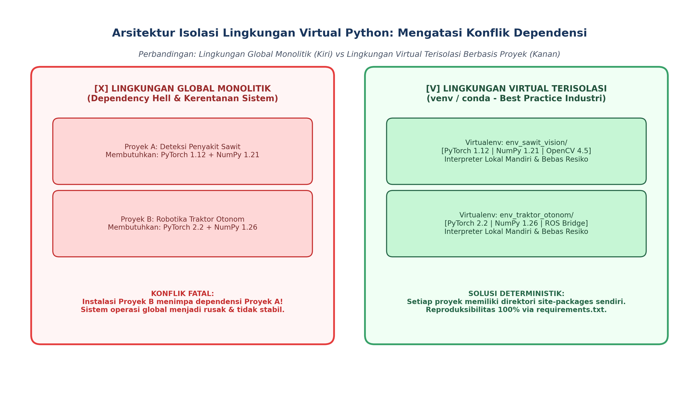
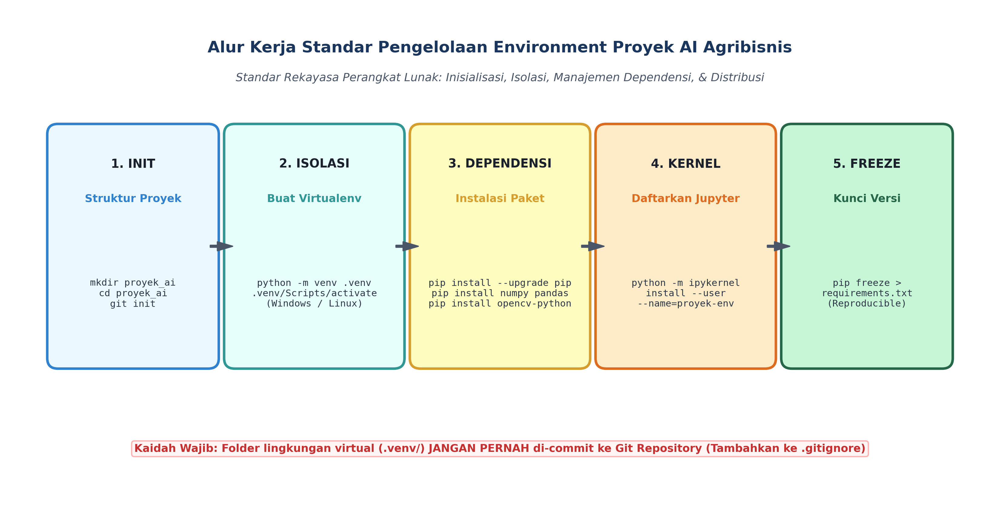

# AI Modul 3.2: Instalasi dan Environment

---

## 1. Identitas & Kerangka Capaian Pembelajaran (Sub-CPMK)

* **Kode Modul**        : AI Modul 3.2
* **Mata Kuliah**       : Kecerdasan Buatan dan Sains Data Pertanian Presisi
* **Alokasi Waktu**     : 2 x 50 Menit (Kajian Teori & Diskusi) + 2 x 50 Menit (Eksplorasi Praktikum Mandiri)
* **Beban SKS**         : 3 SKS
* **Prasyarat**         : AI Modul 3.1 (Pengenalan Bahasa Python)
* **Level Kognitif**    : C2 (Memahami), C3 (Menerapkan), C4 (Menganalisis)

```mermaid
flowchart LR
    subgraph OUTPUTS["OUTPUTS (Keluaran Pembelajaran)"]
        O1["Skrip Audit Otomatis Virtual Environment"]
        O2["Manifest Dependensi requirements.txt Terkunci"]
        O3["Konfigurasi Workspace VS Code & Kernel Jupyter"]
    end

    subgraph OUTCOMES["OUTCOMES (Kompetensi & Keterampilan)"]
        OC1["Keahlian Isolasi Ruang Paket via venv & Conda"]
        OC2["Keterampilan Mitigasi Konflik Dependensi Versi"]
        OC3["Standarisasi Alur Reproduksibilitas Proyek AI"]
    end

    subgraph IMPACTS["IMPACTS (Dampak Strategis Industri)"]
        I1["Jaminan Stabilitas Deployment Sistem Cerdas Kebun"]
        I2["Reduksi Waktu Integrasi Riset ke Produksi Agribisnis"]
        I3["Keamanan Rantai Pasok Perangkat Lunak Pertanian"]
    end

    OUTPUTS --> OUTCOMES --> IMPACTS
```



### 1.1 Capaian Pembelajaran Khusus (Sub-CPMK)
Setelah menyelesaikan modul ini, mahasiswa dan pembelajar diharapkan mampu:
1. **Mengidentifikasi (C2)** komponen arsitektur lingkungan pengembangan sains data (Anaconda, Miniconda, VS Code, Jupyter Notebook/Lab).
2. **Menerapkan (C3)** pembuatan dan manajemen lingkungan virtual terisolasi (*Conda Environment*) untuk mencegah konflik dependensi pustaka.
3. **Mengonfigurasi (C3)** VS Code dan Jupyter Kernel terintegrasi dengan linter PEP 8 dan formatter otomatis.
4. **Mendiagnosis (C4)** permasalahan ketidakcocokan versi pustaka Python dan dependensi biner CUDA/C++ pada sistem operasi.

### 1.2 Kerangka Hasil Pembelajaran (Outputs, Outcomes, & Impacts)
* **Outputs (Keluaran Berwujud Langsung)**:
  * Mahasiswa menghasilkan skrip Python standar (PEP 8 & PEP 484) yang mampu mengaudit apakah program berjalan di dalam lingkungan virtual terisolasi, memeriksa versi paket aktif melalui `importlib.metadata`, dan memvalidasi integritas dependensi.
  * Mahasiswa memproduksi berkas manifest dependensi terstruktur (`requirements.txt` dan `environment.yml`) dengan penguncian versi semantik (*semantic version pinning*) untuk proyek visi komputer perkebunan kelapa sawit.
  * Mahasiswa mengonfigurasi ruang kerja (*workspace*) Visual Studio Code (`.vscode/settings.json`) terintegrasi dengan interpreter virtual khusus, linter, formatter otomatis, dan pendaftaran kernel interaktif pada *Jupyter Notebook/Lab*.
* **Outcomes (Hasil Capaian & Perubahan Kompetensi)**:
  * Mahasiswa menguasai konsep dan praktik isolasi lingkungan komputasi, mampu memilih secara tepat antara modul bawaan `venv` dan manajer lingkungan multi-bahasa `conda`/`mamba` berdasarkan kebutuhan perangkat keras (CPU vs akselerasi GPU CUDA).
  * Mahasiswa terampil mendiagnosis dan mengatasi fenomena konflik dependensi (*Dependency Hell*), memahami peran variabel lingkungan sistem (`PATH`, `PYTHONPATH`), serta mampu mereproduksi sistem komputasi secara identik di berbagai mesin.
  * Mahasiswa menerapkan disiplin rekayasa perangkat lunak modern: memisahkan kode sumber dari artefak lingkungan (menerapkan aturan `.gitignore` yang ketat terhadap direktori virtual environment) dan menerapkan audit keamanan paket dari kerentanan pasokan.
* **Impacts (Dampak Jangka Panjang & Nilai Guna Luas)**:
  * Menjamin kelancaran transisi teknologi dari tahap riset laboratorium kampus menuju tahap implementasi operasional (*production deployment*) di stasiun pengolahan kelapa sawit, perkebunan tebu, dan hortikultura presisi.
  * Mengeliminasi pemborosan jam kerja teknisi lapangan akibat galat inkompatibilitas pustaka (*it works on my machine phenomenon*) pada infrastruktur komputasi awan maupun gerbang IoT lokal kebun.
  * Membangun kultur rekayasa komputasi yang profesional, terstandarisasi, dan aman sesuai praktik terbaik komunitas kecerdasan buatan global.

---

## 2. Arsitektur Instalasi Python dan Variabel Lingkungan Sistem

### 2.1 Struktur Direktori Instalasi Interpreter
Ketika CPython dipasang pada sistem operasi (baik Windows, Linux, maupun macOS), sistem menciptakan hierarki direktori yang memisahkan antara:
- **Executable Biner (`python.exe` / `python3`):** Mesin pelaksana kompilasi dan loop evaluasi PVM.
- **Pustaka Standar Bawaan (*Standard Library*):** Modul-modul inti yang disertakan secara resmi (seperti `math`, `sys`, `os`, `json`, `dataclasses`).
- **Direktori Pustaka Pihak Ketiga (*Site-Packages*):** Lokasi penyimpanan modul eksternal yang diunduh dari repositori publik *Python Package Index* (PyPI) menggunakan perintah `pip`.

### 2.2 Peran Variabel Lingkungan Sistem
Interpreter CPython bergantung pada sejumlah variabel lingkungan (*environment variables*) sistem operasi untuk mengarahkan alur kerja komputasi:
1. **`PATH`:** Daftar direktori yang ditelusuri oleh shell (Command Prompt, PowerShell, atau Bash) ketika pengguna mengetikkan perintah `python` atau `pip`. Jika jalur direktori Python tidak didaftarkan ke dalam variabel `PATH`, sistem operasi akan merespons dengan galat `'python' is not recognized as an internal or external command`.
2. **`PYTHONPATH`:** Daftar direktori tambahan di mana Python mencari berkas modul yang diimpor (`import modul`). Variabel ini dievaluasi setelah direktori kerja aktif dan pustaka standar.
3. **`PYTHONHOME`:** Menentukan lokasi direktori akar pustaka standar CPython. Pengubahan variabel ini secara keliru dapat melumpuhkan interpreter karena Python gagal menemukan modul-modul dasarnya.

### 2.3 Peluncur Python (*Python Launcher*) dan Shebang
Pada lingkungan Windows, alat bantu `py.exe` (*Python Launcher for Windows*) memungkinkan pengguna menjalankan versi Python yang berbeda-beda secara berdampingan (misal `py -3.10` atau `py -3.11`). Pada sistem Unix/Linux, baris pertama skrip sering kali menyertakan deklarasi **Shebang**:
```bash
#!/usr/bin/env python3
```
Deklarasi ini memerintahkan shell sistem operasi untuk mencari biner interpreter Python 3 pertama yang ditemukan di dalam variabel `PATH` aktif.

---

## 3. Urgensi Isolasi Lingkungan Komputasi: Anatomi "Dependency Hell"

Mengapa seorang saintis data tidak boleh menginstal paket pustaka AI secara langsung ke dalam interpreter sistem global?



*Gambar 3.2.1: Komparasi Arsitektur: Bahaya Tabrakan Versi pada Lingkungan Global Monolitik (Kiri) versus Isolasi Bersih Berbasis Virtual Environment (Kanan).*

### 3.1 Bencana Tabrakan Dependensi (*Dependency Hell*)
Bayangkan sebuah institusi riset agribisnis menjalankan dua proyek kecerdasan buatan secara bersamaan:
- **Proyek A (Deteksi Dini Jamur Ganoderma pada Sawit):** Dibangun menggunakan arsitektur model lama yang memerlukan `PyTorch==1.12.0` dan `NumPy==1.21.6`.
- **Proyek B (Sistem Kendali Traktor Pemupuk Otonom):** Memanfaatkan arsitektur transformator visi terbaru yang mensyaratkan `PyTorch==2.2.0` dan `NumPy==1.26.2`.

Jika kedua proyek dipasang pada lingkungan global yang sama:
1. Instalasi dependensi Proyek B akan **menimpa (*overwrite*)** pustaka NumPy dan PyTorch versi lama milik Proyek A.
2. Ketika peneliti kembali membuka Proyek A, kode akan melempar galat `ImportError` atau `AttributeError` karena antarmuka fungsi pada pustaka versi baru telah mengalami perubahan (*breaking changes*).
3. Situasi di mana dua aplikasi memiliki kebutuhan dependensi yang saling bertentangan dan tidak dapat diselaraskan di satu lingkungan disebut sebagai **Dependency Hell**.

### 3.2 Risiko terhadap Stabilitas Sistem Operasi
Pada banyak distribusi Linux modern (seperti Ubuntu 23+ dan Debian 12), komponen desktop dan manajemen sistem operasi sendiri dibangun menggunakan skrip Python internal. Melakukan perintah `sudo pip install ...` secara global berisiko merusak pustaka Python bawaan sistem operasi, yang dapat menyebabkan manajer paket sistem (`apt`) gagal berfungsi (*broken system packages*). Sebagai mekanisme proteksi, ekosistem modern menerapkan standar **PEP 668**, yang secara default menolak eksekusi `pip install` pada interpreter global dengan pesan `error: externally-managed-environment`.

---

## 4. Komparasi Tooling Lingkungan Virtual

Industri menyediakan berbagai perkakas untuk mengisolasi ruang kerja proyek Python:

| Dimensi Komparasi | `venv` (Pustaka Standar Python) | `conda` / `mamba` (Anaconda / Miniconda) | `poetry` / `uv` (Modern Package Managers) |
| :--- | :--- | :--- | :--- |
| **Penyedia / Asal** | Bawaan resmi CPython (sejak Python 3.3) | Komunitas Saintifik / Anaconda Inc. | Komunitas Pengembang Perangkat Lunak Modern |
| **Cakupan Paket** | Hanya paket Python murni dari PyPI | Paket Python dan **biner non-Python** (CUDA, C++, BLAS, OpenSSL) | Paket Python dengan resolusi graf dependensi mutakhir |
| **Mekanisme Kerja** | Salinan pointer / symlink ke CPython host lokal | Memasang interpreter Python mandiri dan pustaka C terpisah | Isolasi virtualenv lokal teroptimasi algoritma *lockfile* |
| **Dukungan Akselerasi AI (GPU)** | Bergantung pada driver host dan roda biner PyPI | Mampu menginstal driver CUDA Toolkit dan cuDNN secara terisolasi | Mendukung instalasi *wheels* berakselerasi perangkat keras |
| **Ukuran Disk & Efisiensi** | Sangat Ringan (~15–30 MB per environment) | Cenderung Besar (~500 MB – 2 GB per environment) | Sangat Cepat & Efisien (terutama `uv` yang ditulis dalam Rust) |
| **Rekomendasi Penggunaan** | **Proyek standar, aplikasi web, IoT edge computing** | **Komputasi AI berat, machine learning dengan CUDA lokal** | **Aplikasi profesional, publikasi paket pustaka opensource** |

---

## 5. Alur Kerja Baku Pengelolaan Proyek AI Reproduksibel

Untuk memastikan integritas proyek kecerdasan buatan, ikuti alur kerja baku lima tahap berikut:



*Gambar 3.2.2: Alur Kerja Baku Rekayasa Perangkat Lunak: Inisialisasi, Isolasi Lingkungan, Pemasangan Dependensi, Integrasi Editor, dan Ekspor Reproduksibel.*

### 5.1 Tahap 1: Inisialisasi Struktur Direktori Proyek
Buat struktur direktori proyek yang rapi dan terisolasi dari proyek lain:
```bash
mkdir deteksi_kanopi_sawit
cd deteksi_kanopi_sawit
git init
```

### 5.2 Tahap 2: Pembuatan dan Aktivasi Lingkungan Virtual (`venv`)
Gunakan modul standar `venv` untuk membuat lingkungan virtual lokal di dalam folder `.venv`:
```bash
# Membuat virtual environment
python -m venv .venv

# Aktivasi pada Windows (PowerShell):
.venv\Scripts\Activate.ps1

# Aktivasi pada Linux / macOS (Bash/Zsh):
source .venv/bin/activate
```
Setelah aktif, prompt terminal akan menampilkan indikator visual `(.venv)` di awal baris perintah.

> [!CAUTION]
> **Aturan Emas Git:** Direktori `.venv/` memuat ribuan berkas biner spesifik untuk satu komputer fisik tertentu. **JANGAN PERNAH** memasukkan atau meng-commit direktori virtual environment ke dalam Git. Selalu tambahkan baris `.venv/` ke dalam berkas `.gitignore`.

### 5.3 Tahap 3: Instalasi Dependensi & Semantic Version Pinning
Pasang pustaka yang dibutuhkan menggunakan `pip`:
```bash
python -m pip install --upgrade pip
pip install numpy>=1.24.0 pandas>=2.0.0 matplotlib opencv-python ipykernel
```
Kaidah penulisan versi pada ekosistem Python mematuhi standar *Semantic Versioning* (`MAJOR.MINOR.PATCH`):
- `numpy == 1.26.4` : **Strict Pinning** (Versi harus persis sama, jaminan reproduksibilitas 100%).
- `pandas >= 2.0.0` : **Minimum Version** (Mengizinkan versi 2.0.0 atau yang lebih baru).
- `scipy ~= 1.11.0` : **Compatible Release** (Setara dengan `>= 1.11.0, == 1.11.*`, mengizinkan perbaikan patch bug tetapi menolak perubahan minor yang berpotensi memutus API).

### 5.4 Tahap 4: Integrasi IDE Visual Studio Code & Pendaftaran Kernel Jupyter
1. **Konfigurasi VS Code:** Buat berkas konfigurasi lokal `.vscode/settings.json` agar editor otomatis menggunakan interpreter dari virtual environment proyek:
   ```json
   {
       "python.defaultInterpreterPath": "${workspaceFolder}/.venv/Scripts/python.exe",
       "python.analysis.typeCheckingMode": "basic",
       "editor.formatOnSave": true
   }
   ```
2. **Pendaftaran Kernel Jupyter:** Daftarkan virtual environment tersebut ke sistem Jupyter agar dapat dipilih saat menjalankan notebook analitika perkebunan:
   ```bash
   python -m ipykernel install --user --name=sawit-ai-env --display-name="Python (Sawit AI Env)"
   ```

### 5.5 Tahap 5: Ekspor Manifes Dependensi (`requirements.txt`)
Bekukan seluruh daftar pustaka dan versinya ke dalam manifest teks yang dapat dibagikan kepada rekan peneliti lain:
```bash
pip freeze > requirements.txt
```
Rekan peneliti di lokasi kebun lain dapat mereplikasi seluruh lingkungan komputasi secara identik hanya dengan satu baris perintah:
```bash
pip install -r requirements.txt
```

---

## 6. Implementasi Kasus Nyata: Skrip Otomatisasi Audit Integritas Lingkungan AI

Di bawah ini adalah implementasi modul Python profesional berbasis Python 3.10+ yang mengaudit apakah program berjalan di dalam virtual environment, memverifikasi ketersediaan paket-paket utama, dan mendeteksi anomali konfigurasi:

```python
"""AI Modul 3.2: Auditor Integritas Lingkungan Komputasi Virtual Proyek AI Sawit.

Penulis: Tim Pengembang Kurikulum Kecerdasan Buatan & Sains Data INSTIPER
Standar: Python 3.10+ / Clean Code Architecture (PEP 8 & PEP 484)
"""

from dataclasses import dataclass
import importlib.metadata
import os
from pathlib import Path
import sys
from typing import Any, Dict, List, Optional, Tuple


@dataclass(frozen=True)
class StatusVirtualEnv:
  """Objek data hasil audit status isolasi lingkungan komputasi."""

  is_virtual_env: bool
  jalur_prefix: str
  jalur_base_prefix: str
  nama_env: str


@dataclass(frozen=True)
class LaporanPaket:
  """Objek data status keberadaan dan versi paket pihak ketiga."""

  nama_paket: str
  terpasang: bool
  versi_terdeteksi: Optional[str]
  status_kepatuhan: str


class AuditorEnvironmentAI:
  """Auditor kepatuhan lingkungan komputasi untuk menjamin stabilitas

  dan reproduksibilitas pipeline model kecerdasan buatan perkebunan.
  """

  @staticmethod
  def deteksi_virtual_environment() -> StatusVirtualEnv:
    """Mendeteksi apakah interpreter berjalan di dalam virtual environment (venv/conda).

    Secara internal pada CPython, saat berada di dalam virtual environment,
    nilai `sys.prefix` (jalur virtual) akan berbeda dari `sys.base_prefix` (jalur
    host).
    """
    is_venv = sys.prefix != sys.base_prefix
    nama = (
        Path(sys.prefix).name if is_venv else "GLOBAL_SYSTEM (TIDAK TERISOLASI)"
    )

    return StatusVirtualEnv(
        is_virtual_env=is_venv,
        jalur_prefix=sys.prefix,
        jalur_base_prefix=sys.base_prefix,
        nama_env=nama,
    )

  @staticmethod
  def audit_daftar_dependensi(
      daftar_kebutuhan: Dict[str, str],
  ) -> List[LaporanPaket]:
    """Mengaudit daftar pustaka eksternal menggunakan pustaka standar importlib.metadata."""
    laporan: List[LaporanPaket] = []

    for nama_paket, versi_minimal in daftar_kebutuhan.items():
      try:
        versi_aktif = importlib.metadata.version(nama_paket)
        # Verifikasi kepatuhan sederhana (terpasang)
        laporan.append(
            LaporanPaket(
                nama_paket=nama_paket,
                terpasang=True,
                versi_terdeteksi=versi_aktif,
                status_kepatuhan=f"Terpasang (Versi: {versi_aktif})",
            )
        )
      except importlib.metadata.PackageNotFoundError:
        laporan.append(
            LaporanPaket(
                nama_paket=nama_paket,
                terpasang=False,
                versi_terdeteksi=None,
                status_kepatuhan="[GALAT] Paket Belum Terpasang!",
            )
        )

    return laporan

  @staticmethod
  def buat_manifest_requirements_simulasi(
      berkas_target: Path, daftar_paket: List[Tuple[str, str]]
  ) -> None:
    """Menghasilkan berkas requirements.txt terstandarisasi untuk deployment kebun."""
    konten = "# Manifest Dependensi Proyek AI Perkebunan Kelapa Sawit INSTIPER\n"
    konten += (
        "# Dihasilkan secara otomatis oleh AuditorEnvironmentAI (PEP 508)\n\n"
    )
    for pkg, ver in daftar_paket:
      konten += f"{pkg}=={ver}\n"

    berkas_target.write_text(konten, encoding="utf-8")


# =====================================================================
# BLOK EKSEKUSI PENGUJIAN INDUSTRIAL
# =====================================================================
if __name__ == "__main__":
  print("=" * 80)
  print("AUDITOR SISTEM ISOLASI DAN DEPENDENSI AI PERKEBUNAN INSTIPER")
  print("=" * 80)

  # 1. Audit Isolasi Virtual Environment
  status_env = AuditorEnvironmentAI.deteksi_virtual_environment()
  print("\n1. Hasil Audit Isolasi Runtime:")
  print(f"   - Status Terisolasi     : {status_env.is_virtual_env}")
  print(f"   - Identitas Lingkungan  : {status_env.nama_env}")
  print(f"   - Jalur Prefix Aktif    : {status_env.jalur_prefix}")
  print(f"   - Jalur Host Base       : {status_env.jalur_base_prefix}")

  if not status_env.is_virtual_env:
    print(
        "   [PERINGATAN RESIKO TINGGI] Program berjalan di interpreter global."
    )
    print(
        "   Sangat disarankan mengaktifkan virtual environment (.venv) demi"
        " mencegah Dependency Hell!"
    )
  else:
    print("   [STATUS AMAN] Lingkungan virtual terisolasi aktif dengan benar.")

  # 2. Audit Ketersediaan Pustaka Utama AI Agribisnis
  paket_esensial = {
      "numpy": "1.24.0",
      "pandas": "2.0.0",
      "matplotlib": "3.7.0",
      "scipy": "1.10.0",
      "opencv-python": "4.7.0",  # Sering kali belum terpasang
  }

  print("\n2. Hasil Audit Dependensi Pustaka Saintifik & AI:")
  hasil_audit_paket = AuditorEnvironmentAI.audit_daftar_dependensi(
      paket_esensial
  )
  for item in hasil_audit_paket:
    simbol = "[V]" if item.terpasang else "[X]"
    print(f"   {simbol} {item.nama_paket:<15} : {item.status_kepatuhan}")

  # 3. Simulasi Pembuatan Berkas requirements.txt
  jalur_manifest = Path("requirements_simulasi_sawit.txt")
  paket_terkunci = [
      ("numpy", "1.26.4"),
      ("pandas", "2.2.2"),
      ("matplotlib", "3.8.4"),
      ("scipy", "1.13.0"),
  ]
  AuditorEnvironmentAI.buat_manifest_requirements_simulasi(
      jalur_manifest, paket_terkunci
  )
  print(f"\n3. Berkas manifest berhasil dihasilkan di: {jalur_manifest.name}")

  if jalur_manifest.exists():
    jalur_manifest.unlink()  # Pembersihan berkas temporer

  print("\n" + "=" * 80 + "\n")
```

---

## 7. Pembahasan Keterangan Penggunaan Kode (Operational Breakdown)

Dekonstruksi fungsional atas skrip implementasi industri di atas menyingkap mekanisme deteksi tingkat rendah CPython:

1. **Mekanisme Pembeda `sys.prefix` vs `sys.base_prefix` (Baris 40–53):**  
   Pada interpreter Python global, nilai variabel bawaan `sys.prefix` identik dengan `sys.base_prefix`. Namun, saat virtual environment diaktifkan (melalui modul `venv`), CPython mengalihkan nilai `sys.prefix` ke direktori lokal virtual environment, sementara `sys.base_prefix` tetap menunjuk ke instalasi CPython induk di sistem operasi. Karakteristik deterministik ini dimanfaatkan metode `deteksi_virtual_environment()` untuk mengonfirmasi status isolasi secara absolut tanpa bergantung pada nama folder.
2. **Inspeksi Paket Modern via `importlib.metadata` (Baris 56–80):**  
   Metode konvensional sering menggunakan pernyataan `import pkg` yang berisiko memperlambat program dan memicu efek samping inisialisasi modul. Penggunaan modul standar Python 3.8+ `importlib.metadata.version(nama_paket)` membaca metadata berkas distribusi paket secara langsung dari disk tanpa perlu mengeksekusi kode pustaka tersebut di memori, menjadikannya cepat, aman, dan ringan.
3. **Penanganan Eksepsi Elegan `PackageNotFoundError` (Baris 72–79):**  
   Jika pustaka tertentu belum terpasang di dalam lingkungan virtual (misalnya pustaka visi komputer `opencv-python`), fungsi tidak berhenti secara fatal (*crash*), melainkan menangkap eksepsi secara elegan dan menandai status kepatuhan paket untuk dilaporkan kepada pengguna.
4. **Pembangkitan Berkas Manifest Deklaratif (Baris 83–94):**  
   Metode `buat_manifest_requirements_simulasi` memanfaatkan objek modern `pathlib.Path` untuk menuliskan daftar dependensi terkunci secara atomik dengan enkoding standar `utf-8`, mematuhi spesifikasi format PEP 508.

---

## 8. Evaluasi Mandiri: Pertanyaan HOTS & Tantangan Scaffolded

### 8.1 Pertanyaan HOTS (Higher-Order Thinking Skills)

1. **Analisis Kebijakan Version Control: Larangan Commit Virtual Environment dan Prinsip "Infrastructure as Code":**  
   Mengapa pengembang dilarang keras meng-commit folder `.venv/` atau `env/` ke repositori Git tim, meskipun tujuannya adalah agar rekan kerja tidak perlu menginstal pustaka lagi?  
   - Analisis bahaya portabilitas biner (misal: symlink absolut, dependensi biner terkompilasi C/C++ pada Windows `.pyd` vs Linux `.so`) jika folder virtual environment dipindahkan antar-komputer!  
   - Jelaskan bagaimana berkas deklaratif seperti `requirements.txt` atau `Pipfile.lock` menerapkan prinsip **Infrastructure as Code (IaC)** dalam konteks rekayasa machine learning (*MLOps*)!
2. **Evaluasi Arsitektur Isolasi: `venv` vs Kontainerisasi Docker pada Sistem Edge AI Perkebunan:**  
   Sebuah gerbang IoT cerdas berbasis NVIDIA Jetson dipasang di pos timbangan kelapa sawit untuk menjalankan model klasifikasi mutu fraksi TBS.  
   - Jelaskan perbedaan mendasar tingkat isolasi antara Python `venv` (isolasi ruang pustaka Python tingkat *User Space*) dengan kontainerisasi *Docker* (isolasi tingkat *Kernel Namespace & Control Groups/cgroups*)!  
   - Mengapa isolasi `venv` saja tidak cukup jika proyek AI sawit bergantung pada versi driver GPU NVIDIA CUDA tingkat sistem operasi, pustaka kompilasi video GStreamer C++, dan pustaka C `libGL.so`?
3. **Audit Keamanan Rantai Pasok (*Software Supply Chain Attack & Typosquatting*) pada PyPI:**  
   Ketika seorang saintis data pemula ingin memasang pustaka OpenCV, ia secara tidak sengaja mengetikkan perintah `pip install opencv` (padahal nama paket resminya adalah `opencv-python`).  
   - Jelaskan bahaya serangan siber berbasis **Typosquatting** di mana peretas mendaftarkan nama paket yang mirip di PyPI dengan menyisipkan skrip *malware* pencuri kredensial kebun pada berkas `setup.py`!  
   - Bagaimana opsi keamanan `pip install --require-hashes -r requirements.txt` mampu menangkal serangan pergantian paket (*package tampering*) dan serangan *Man-in-the-Middle* (MitM)?

---

### 8.2 Tantangan Pemrograman Berjenjang (*Scaffolded Challenges*)

#### Tantangan 1 (Tingkat Dasar - *Warm-Up*): Pendeteksi Otomatis Status Virtual Environment
* **Skenario:** Sebelum mahasiswa memulai modul praktikum komputasi, skrip verifikasi otomatis harus mengecek status lingkungan.
* **Tugas:** Bangunlah fungsi `verifikasi_status_virtualenv() -> Dict[str, Any]` yang:
  - Mengembalikan dictionary berisi boolean `terisolasi`, `direktori_eksekusi`, dan `rekomendasi_tindakan`.
  - Jika belum berada di dalam virtual environment, berikan petunjuk perintah terminal untuk membuat dan mengaktifkan virtualenv sesuai platform sistem operasi aktif (`sys.platform`).

#### Tantangan 2 (Tingkat Menengah - *Intermediate*): Parser & Validator Berkas Dependensi `requirements.txt`
* **Skenario:** Sebelum melatih model AI, sistem perlu membaca berkas `requirements.txt` proyek kebun dan memastikan setiap pustaka yang tertulis di dalamnya benar-benar sudah terpasang.
* **Tugas:** Buatlah fungsi `validasi_manifest_requirements(jalur_file: str) -> Dict[str, Any]` yang:
  - Membaca baris-baris berkas teks requirements, mengabaikan komentar (`#`) dan baris kosong.
  - Memisahkan nama paket dan operator versi (`==`).
  - Menggunakan `importlib.metadata.version()` untuk membandingkan versi yang diminta dengan versi yang terpasang.
  - Menghasilkan daftar paket yang hilang (*missing packages*) dan paket yang versinya tidak cocok (*version mismatch*).

#### Tantangan 3 (Tingkat Mahir - *Advanced*): Manajer Snapshot dan Penjaga Kompatibilitas Versi Dependensi Proyek AI Sawit
* **Skenario:** Tim MLOps perkebunan ingin membuat utilitas otomatisasi yang membekukan status pustaka terpasang dan membandingkan dua snapshot lingkungan yang berbeda untuk mendeteksi perubahan versi secara otomatis.
* **Tugas:** Bangunlah kelas `SnapshotEnvironmentManager` yang:
  1. Memiliki metode `ambil_snapshot_aktif(daftar_koleksi_paket: List[str]) -> Dict[str, str]` yang memetakan nama paket ke versi aktifnya.
  2. Memiliki metode `bandingkan_snapshot(snapshot_referensi: Dict[str, str], snapshot_uji: Dict[str, str]) -> Dict[str, Any]` yang mendeteksi paket yang baru ditambahkan, paket yang dihapus, dan paket yang mengalami perubahan versi (*upgrade/downgrade*).
  3. Memiliki metode `simpan_manifest_terkunci(jalur_output: str, snapshot: Dict[str, str]) -> None` untuk mengekspor manifest deklaratif.

---

## 9. Glosarium Istilah Teknis

1. **Dependency Hell (Neraka Dependensi):** Kondisi frustrasi teknis dan kegagalan komputasi di mana dua atau lebih aplikasi pada sistem operasi yang sama membutuhkan versi pustaka bersama yang saling bertentangan.
2. **Environment Variable (Variabel Lingkungan):** Nilai konfigurasi bernama dinamis pada tingkat sistem operasi yang memengaruhi perilaku proses dan program yang sedang berjalan (seperti `PATH` dan `PYTHONPATH`).
3. **IPython Kernel (ipykernel):** Komponen mesin eksekusi Python yang dirancang untuk berkomunikasi secara interaktif dengan antarmuka front-end seperti *Jupyter Notebook* dan *JupyterLab*.
4. **Isolated User Space:** Ruang sistem berkas dan dependensi perangkat lunak yang dibatasi khusus untuk pengguna atau proyek tertentu tanpa mengganggu kestabilan ruang sistem global administrator.
5. **Lockfile:** Berkas manifest terkomputerisasi yang merekam secara mutlak seluruh pohon dependensi hierarkis (termasuk sub-dependensi) dan *cryptographic hash* dari paket yang diunduh untuk menjamin determinisme 100%.
6. **Package Manager (Manajer Paket):** Perangkat lunak otomatis yang bertugas mencari, mengunduh, menginstal, memperbarui, dan menghapus paket pustaka kode serta menyelesaikan hubungan saling ketergantungan antar-paket (seperti `pip` dan `conda`).
7. **Semantic Versioning (SemVer):** Konvensi penomoran versi perangkat lunak formal dengan format tiga bagian `MAJOR.MINOR.PATCH` yang mencerminkan signifikansi perubahan antarmuka pemrograman (*breaking change, new feature, bug fix*).
8. **Virtual Environment (Lingkungan Virtual):** Struktur pohon direktori lokal yang memuat salinan biner interpreter Python mandiri atau pointer symlink serta repositori paket `site-packages` terisolasi untuk satu proyek tertentu.

---

## 10. Jembatan Konsep (Bridging) ke AI Modul 3.3: Sintaks Dasar Python

Dengan lingkungan komputasi yang terisolasi sempurna, terkonfigurasi pada Visual Studio Code, dan terdaftar pada kernel Jupyter, Anda kini memiliki infrastruktur laboratorium perangkat lunak yang aman, stabil, dan berstandar industri. Anda terbebas dari kecemasan akan tabrakan dependensi saat mengeksplorasi algoritma cerdas.

Pada **AI Modul 3.3: Sintaks Dasar Python**, kita akan mulai menulis kode operasional:
- Aturan leksem dan indentasi signifikan (*significant whitespace*) Python.
- Standar penulisan kode bersih (*Clean Code PEP 8*): penamaan identifier (*snake_case*, *PascalCase*), dan panjang baris maksimum.
- Pernyataan komentar dokumentatif (*Docstrings* PEP 257) dan pengenalan antarmuka interaktif REPL untuk komputasi cepat telemetri perkebunan.

---

## 11. Daftar Pustaka dan Referensi Akademik

1. Warsaw, B., & Coghlan, N.(2011). *PEP 405: Python Virtual Environments*. Python Enhancement Proposals.
2. Preston, D.(2023). *Python Dependencies and Environments: From Pip to Poetry, Conda, and Docker*. Packt Publishing.
3. Ramalho, L.(2022). *Fluent Python: Clear, Concise, and Effective Programming* (2nd ed.). O'Reilly Media.
4. Python Packaging Authority (PyPA).(2024). *Python Packaging User Guide: Installing and Using Packages*. https://packaging.python.org/
5. Willems, K.(2021). *Virtual Environments in Python: The Definitive Guide for Data Scientists*. DataCamp Publications.
6. Prabowo, A., & Handayani, S.(2023). Standardisasi konfigurasi MLOps dan reproduksibilitas model deep learning citra pertanian pada edge computing. *Jurnal Sistem Cerdas dan Otomasi Agribisnis*, 5(2), 112–124.
