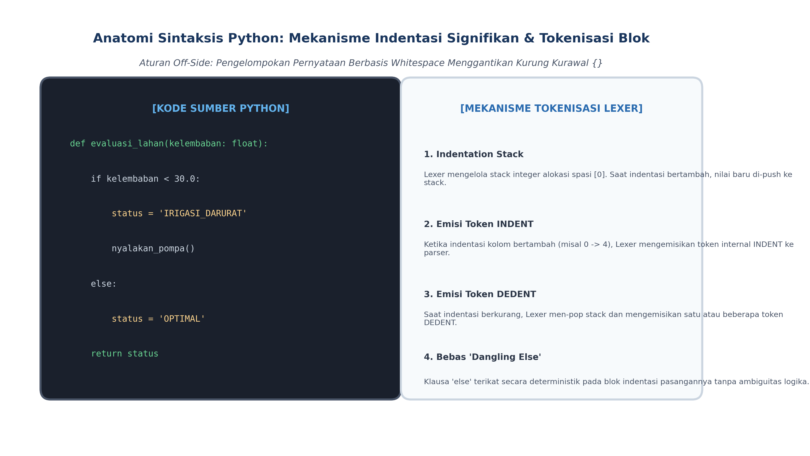

# AI Modul 3.3: Sintaks Dasar Python

---

## 1. Identitas & Kerangka Capaian Pembelajaran (Sub-CPMK)

* **Kode Modul**        : AI Modul 3.3
* **Mata Kuliah**       : Kecerdasan Buatan dan Sains Data Pertanian Presisi
* **Alokasi Waktu**     : 2 x 50 Menit (Kajian Teori & Diskusi) + 2 x 50 Menit (Eksplorasi Praktikum Mandiri)
* **Beban SKS**         : 3 SKS
* **Prasyarat**         : AI Modul 3.2 (Instalasi dan Environment)
* **Level Kognitif**    : C2 (Memahami), C3 (Menerapkan), C4 (Menganalisis)

```mermaid
flowchart LR
    subgraph OUTPUTS["OUTPUTS (Keluaran Pembelajaran)"]
        O1["Skrip Parser Aliran Token & Validator Identifier"]
        O2["Modul Neraca Air Lahan Berstandar PEP 8 & PEP 257"]
        O3["Alat Audit Kepatuhan Sintaksis Mandiri"]
    end

    subgraph OUTCOMES["OUTCOMES (Kompetensi & Keterampilan)"]
        OC1["Penguasaan Mekanisme Tokenisasi & Indent Stack"]
        OC2["Keahlian Menerapkan Kaidah Clean Code PEP 8"]
        OC3["Keterampilan Dokumentasi Formal via Docstrings"]
    end

    subgraph IMPACTS["IMPACTS (Dampak Strategis Industri)"]
        I1["Keterbacaan dan Kolaborasi Tinggi Tim Riset AI"]
        I2["Reduksi Galat Sintaksis pada Sistem Lapangan"]
        I3["Standarisasi Perangkat Lunak Agribisnis Nasional"]
    end

    OUTPUTS --> OUTCOMES --> IMPACTS
```



### 1.1 Capaian Pembelajaran Khusus (Sub-CPMK)
Setelah menyelesaikan modul ini, mahasiswa dan pembelajar diharapkan mampu:
1. **Mengidentifikasi (C2)** aturan indentasi sintaksis Python, kata kunci yang dicadangkan (*reserved keywords*), dan konvensi penamaan PEP 8.
2. **Menerapkan (C3)** dokumentasi kode yang rigor menggunakan komentar sebaris, komentar multibaris, dan *docstrings* berstandar ilmiah.
3. **Menganalisis (C4)** kesalahan sintaksis (*SyntaxError*, *IndentationError*) pada skrip akuisisi sensor telemetri perkebunan.
4. **Menyusun (C3)** format luaran terminal yang terstruktur menggunakan f-strings dan pemformatan angka desimal presisi.

### 1.2 Kerangka Hasil Pembelajaran (Outputs, Outcomes, & Impacts)
* **Outputs (Keluaran Berwujud Langsung)**:
  * Mahasiswa menghasilkan skrip pemindai aliran token menggunakan modul bawaan `tokenize` dan validator keabsahan pengenal (*identifiers*) berdasarkan aturan gramatikal Python.
  * Mahasiswa memproduksi modul komputasi neraca air lahan dan evapotranspirasi perkebunan kelapa sawit yang mematuhi 100% kaidah penulisan kode bersih PEP 8, anotasi tipe PEP 484, dan dokumentasi format Google Style PEP 257.
  * Mahasiswa mengonstruksi modul pemeriksa kualitas kode mandiri (*linter checker*) yang mampu mendeteksi pelanggaran panjang baris maksimal (79/88 karakter), spasi trailing yang tidak perlu, serta kesalahan pencampuran tabulasi.
* **Outcomes (Hasil Capaian & Perubahan Kompetensi)**:
  * Mahasiswa memahami struktur internal penganalisis leksikal (*lexer*) CPython, termasuk cara kerja tumpukan indentasi (*indentation stack*) dalam membangkitkan token `INDENT` dan `DEDENT` yang mengeliminasi ambiguitas struktural percabangan.
  * Mahasiswa terampil menerapkan konvensi penamaan identifier secara disiplin (`snake_case` untuk variabel/fungsi, `PascalCase` untuk kelas, `UPPER_SNAKE_CASE` untuk konstanta fisik), serta menata spasi di sekitar operator sesuai standar komunitas internasional.
  * Mahasiswa menguasai teknik dokumentasi formal berbasis *Docstrings* tingkat modul, kelas, dan fungsi yang dapat diakses secara dinamis via atribut introspeksi `__doc__` maupun digenerasi menjadi dokumentasi web otomatis.
* **Impacts (Dampak Jangka Panjang & Nilai Guna Luas)**:
  * Menghilangkan friksi komunikasi dan mempermudah pemeliharaan jangka panjang (*long-term maintainability*) basis kode kecerdasan buatan pada konsorsium riset perkebunan sawit dan tebu nasional.
  * Mencegah galat fatal di lingkungan produksi perkebunan yang diakibatkan oleh kesalahan logika indentasi atau inkonsistensi penamaan parameter kendali irigasi.
  * Menyiapkan lulusan INSTIPER yang adaptif terhadap standar industri rekayasa perangkat lunak modern dan siap bekerja dalam tim pengembangan skala global.

---

## 2. Struktur Leksikal dan Tokenisasi Bahasa Python

Sebelum interpreter CPython membangun pohon sintaks abstrak (*AST*), modul penganalisis leksikal (*lexer*) membaca karakter-karakter mentah dari berkas kode sumber dan memecahnya menjadi unit-unit gramatikal terkecil yang disebut **Token**.

### 2.1 Klasifikasi Token Python
Token dalam Python diklasifikasikan ke dalam lima kategori fundamental:
1. **Kata Kunci (*Keywords*):** Kata-kata khusus yang dicadangkan oleh tata bahasa interpreter dan tidak boleh digunakan sebagai nama variabel atau fungsi. Pada Python 3.10+, terdapat 35 kata kunci resmi (dapat diinspeksi melalui pustaka `keyword.kwlist`), seperti `def`, `class`, `if`, `else`, `return`, `import`, `while`, dan `match`.
2. **Pengenal (*Identifiers*):** Nama yang didefinisikan oleh pemrogram untuk mengidentifikasi variabel, fungsi, kelas, modul, atau objek lain.
   - Aturan pembentukan: Harus diawali oleh huruf alfabet (`a-z`, `A-Z`) atau karakter garis bawah (*underscore* `_`), diikuti oleh kombinasi huruf, angka (`0-9`), atau underscore.
   - Bersifat peka huruf besar-kecil (*case-sensitive*): `SuhuTanah` berbeda dengan `suhutanah` dan `suhu_tanah`.
   - Tidak boleh diawali oleh angka (misal: `1tanaman` adalah ilegal) dan tidak boleh menggunakan kata kunci resmi.
3. **Konstanta Literal (*Literals*):** Representasi nilai konstan eksplisit di dalam kode, mencakup literal numerik bulat (`100`), desimal pecahan (`25.5`), string teks (`"BLOK-A01"`), boolean (`True`, `False`), dan nilai ketiadaan (*null pointer*) objek (`None`).
4. **Operator (*Operators*):** Simbol khusus yang menginstruksikan komputasi matematika atau evaluasi logika (seperti `+`, `-`, `*`, `/`, `//`, `%`, `**`, `==`, `!=`, `<`, `>`, `and`, `or`, `not`).
5. **Pembatas (*Delimiters*):** Karakter struktural yang mengatur pengelompokan ekspresi, indeks, dan pemetaan (seperti `( )`, `[ ]`, `{ }`, `,`, `:`, `.`, `=`, `->`).

### 2.2 Baris Fisik versus Baris Logis
Python membedakan antara:
- **Baris Fisik (*Physical Line*):** Sebaris teks yang diakhiri oleh karakter akhir baris sistem operasi (`\n` pada Unix/Linux atau `\r\n` pada Windows).
- **Baris Logis (*Logical Line*):** Satu instruksi pernyataan utuh yang dipahami oleh parser Python. Satu baris logis dapat mencakup beberapa baris fisik melalui dua mekanisme penyambungan baris (*line continuation*):

  1. **Penyambungan Implisit (*Implicit Line Continuation* - Sangat Direkomendasikan):**  
     Ekspresi yang berada di dalam tanda kurung biasa `()`, kurung siku `[]`, atau kurung kurawal `{}` dapat dipecah ke dalam beberapa baris fisik tanpa memicu galat sintaksis:
     ```python
     dosis_pupuk = (
         bobot_dasar_tanah * koefisien_serapan + faktor_koreksi_curah_hujan
     )
     ```

  2. **Penyambungan Eksplisit (*Explicit Line Continuation* - Digunakan Seperlunya):**  
     Menggunakan karakter garis miring terbalik (*backslash* `\`) di akhir baris fisik untuk menyambungkan baris berikutnya:
     ```python
     dosis_pupuk = bobot_dasar_tanah * koefisien_serapan + \
         faktor_koreksi_curah_hujan
     ```

---

## 3. Mekanisme Indentasi Signifikan (The Off-Side Rule)

Fitur paling khas yang membedakan Python dari bahasa turunan C (seperti C, C++, Java, dan C#) adalah penerapan **Aturan Off-Side (*The Off-Side Rule*)**: blok kode tidak dibatasi oleh kurung kurawal `{ ... }` atau kata kunci pembuka-penutup (`begin ... end`), melainkan oleh **tingkat kedalaman spasi indentasi (*whitespace indentation*)**.



*Gambar 3.3.1: Anatomi Sintaksis Python: Mekanisme Tumpukan Indentasi Lexer CPython dalam Mengemisikan Token INDENT dan DEDENT.*

### 3.1 Model Internal Tumpukan Indentasi Lexer CPython
Bagaimana interpreter CPython memvalidasi blok kode tanpa kurung kurawal?
1. Lexer CPython memelihara struktur data **Tumpukan Indentasi (*Indentation Stack*)** internal yang diinisialisasi dengan nilai `[0]` (kolom paling kiri).
2. Setiap kali menemui baris logis baru, lexer menghitung jumlah spasi kosong di awal baris (*leading whitespace*).
3. **Peningkatan Indentasi:** Jika spasi di awal baris lebih besar dari nilai puncak tumpukan (*top of stack*), nilai baru tersebut di-push ke tumpukan, dan lexer mengemisikan token internal khusus **`INDENT`** ke parser.
4. **Penurunan Indentasi:** Jika spasi di awal baris lebih kecil dari puncak tumpukan, CPython men-pop nilai-nilai tumpukan hingga menemukan angka yang cocok. Untuk setiap elemen yang di-pop, lexer mengemisikan token **`DEDENT`**. Jika angka spasi yang ditemukan tidak cocok dengan salah satu angka di dalam tumpukan, CPython melempar `IndentationError: unindent does not match any outer indentation level`.

### 3.2 Resolusi Inheren Masalah "Dangling Else"
Dalam bahasa keluarga C, struktur percabangan bersarang berikut sering memicu ambiguitas logika:
```c
// Kode dalam C / Java
if (kelembaban_rendah)
    if (suhu_panas)
        nyalakan_sprinkler();
else
    bunyikan_alarm(); // Apakah else milik if kelembaban atau if suhu?
```
Dalam C, kompiler secara ambigu mengikat `else` ke `if` terdekat (`if suhu_panas`), meskipun penataan spasi programmer bermaksud mengikatnya ke `if kelembaban_rendah` (*Dangling Else Problem*).

Dalam Python, ambiguitas semacam ini **mustahil terjadi secara struktural**:
```python
# Penafsiran 1: else terikat pada if suhu_panas
if kelembaban_rendah:
  if suhu_panas:
    nyalakan_sprinkler()
  else:
    bunyikan_alarm()

# Penafsiran 2: else terikat pada if kelembaban_rendah
if kelembaban_rendah:
  if suhu_panas:
    nyalakan_sprinkler()
else:
  bunyikan_alarm()
```
Kedalaman kolom indentasi menentukan ikatan semantik secara mutlak, menjamin kejelasan alur kendali sistem otomatisasi kebun.

### 3.3 Larangan Tabulasi dan Standar 4 Spasi (PEP 8)
Pada era Python 2, interpreter mengizinkan pencampuran karakter Tab (`\t`) dan karakter Spasi (` `). Namun, karena editor teks yang berbeda dapat merender karakter tab selebar 2, 4, atau 8 spasi, kode yang tampak sejajar di satu layar dapat bergeser di layar lain, menciptakan bencana logika tersembunyi.
- Sejak **Python 3**, pencampuran tab dan spasi pada blok yang sama dilarang keras dan memicu galat kompilasi `TabError: inconsistent use of tabs and spaces in indentation`.
- **Aturan Baku PEP 8:** Selalu gunakan tepat **4 spasi murni per tingkat indentasi**. Konfigurasikan IDE Anda agar tombol *Tab* otomatis dikonversi menjadi 4 spasi (*Soft Tabs*).

---

## 4. Standar Rekayasa Kode Bersih (PEP 8)

**Python Enhancement Proposal 8 (PEP 8)** adalah pedoman gaya penulisan kode resmi (*official style guide*) yang dirumuskan oleh Guido van Rossum, Barry Warsaw, dan Nick Coghlan. Kepatuhan terhadap PEP 8 adalah tanda kematangan profesional seorang insinyur kecerdasan buatan.


*Gambar 3.3.2: Standarisasi Rekayasa Perangkat Lunak: Sistematika Konvensi Penamaan PEP 8 dan Struktur Anatomi Docstrings PEP 257.*

### 4.1 Konvensi Penamaan Entitas (*Naming Conventions*)
| Entitas Pemrograman | Format Gaya Penulisan | Contoh Praktis Agribisnis | Keterangan Tambahan |
| :--- | :--- | :--- | :--- |
| **Nama Modul / Berkas** | `lowercase_dengan_underscore` | `neraca_air.py`, `sensor_sawit.py` | Singkat, huruf kecil seluruhnya |
| **Nama Paket Direktori** | `lowercase` | `agriai`, `telemetri` | Hindari underscore jika memungkinkan |
| **Nama Kelas** | `PascalCase` (*CapWords*) | `KalkulatorEvapotranspirasi`, `SensorTanah` | Setiap awal kata huruf kapital, tanpa underscore |
| **Nama Fungsi & Metode** | `snake_case` | `hitung_defisit_air()`, `ambil_sampel()` | Huruf kecil seluruhnya dipisah underscore |
| **Nama Variabel Biasa** | `snake_case` | `kelembaban_tanah_pct`, `suhu_celsius` | Deskriptif mencerminkan besaran fisik |
| **Nama Konstanta Global** | `UPPER_SNAKE_CASE` | `KONSTANTA_SOLAR_RAD`, `GRAVITASI_BUMI` | Nilai tetap yang tidak boleh diubah |
| **Atribut Terproteksi** | `_single_leading_underscore` | `_kalibrasi_internal`, `_koefisien_k` | Indikasi internal/private modul |

### 4.2 Aturan Tata Letak Spasi (*Whitespace Formatting*)
1. **Operator Biner:** Selalu berikan tepat satu spasi sebelum dan sesudah operator penugasan (`=`), perbandingan (`==`, `<`, `>=`), dan logika (`and`, `or`).  
   - Benar: `defisit = evapotranspirasi - curah_hujan`  
   - Salah: `defisit=evapotranspirasi-curah_hujan`
2. **Operator Prioritas Tinggi:** Spasi dapat ditiadakan pada operator aritmetika berprioritas tertinggi untuk memperjelas hierarki pengelompokan.  
   - Benar: `y = a*x**2 + b*x + c`
3. **Argumen Default Fungsi:** Jangan gunakan spasi di sekitar tanda `=` saat mendefinisikan nilai parameter default.  
   - Benar: `def irigasi(ambang_kering: float = 25.0) -> None:`  
   - Salah: `def irigasi(ambang_kering: float = 25.0) -> None:`
4. **Pemisah Tanda Baca:** Berikan tepat satu spasi setelah koma `,` atau titik koma `;`, namun jangan ada spasi sebelumnya.  
   - Benar: `koordinat = [0.952, 101.442, 45.0]`  
   - Salah: `koordinat = [0.952 ,101.442 ,45.0 ]`

### 4.3 Panjang Baris Maksimum dan Baris Kosong
- **Panjang Baris:** Batasi panjang baris fisik maksimal **79 karakter** (atau batas modern **88 karakter** sesuai standar pemformat otomatis *Black*). Untuk docstrings dan komentar teks panjang, batasi hingga **72 karakter**.
- **Baris Kosong (*Blank Lines*):**
  - Pisahkan fungsi tingkat atas (*top-level functions*) dan definisi kelas dengan tepat **dua baris kosong**.
  - Pisahkan metode-metode di dalam kelas dengan tepat **satu baris kosong**.
  - Gunakan baris kosong ekstra di dalam tubuh fungsi secara hemat hanya untuk memisahkan paragraf logika yang berbeda.

---

## 5. Sistem Dokumentasi Formal Kode Program (PEP 257)

Dokumentasi kode dalam Python terbagi menjadi dua kategori fundamental:
1. **Komentar (*Comments*):** Ditandai dengan karakter pagar `#`, ditujukan untuk menjelaskan *mengapa* (*why*) suatu keputusan arsitektural diambil, bukan menjelaskan *apa* yang dilakukan kode (karena kode yang bersih sudah menjelaskan dirinya sendiri).
2. **String Dokumentasi (*Docstrings* - PEP 257):** Rantai teks literal yang ditempatkan sebagai pernyataan pertama pada definisi modul, kelas, atau fungsi menggunakan tripel tanda kutip ganda `"""..."""`.

### 5.1 Format Google Style Python Docstrings
Standar dokumentasi paling populer dan mudah dibaca di dunia kecerdasan buatan adalah **Google Style Docstrings**. Anatominya mencakup:
- **Kalimat Pembuka:** Ringkasan singkat tindakan fungsi dalam bentuk kalimat imperatif deklaratif (misal: "Menghitung koefisien tanaman...").
- **Deskripsi Penjelas (Opsional):** Penjelasan rinci formula matematis atau asumsi agronomis.
- **Bagian `Args:`:** Rincian setiap parameter, tipe data yang diharapkan, dan batasan fisisnya.
- **Bagian `Returns:`:** Tipe data nilai kembalian dan satuan fisik keluarannya.
- **Bagian `Raises:`:** Jenis eksepsi yang berpotensi dilemparkan beserta penyebabnya.

### 5.2 Introspeksi Dokumentasi Dinamis
Berbeda dengan komentar biasa yang langsung dibuang oleh lexer saat kompilasi bytecode, *docstring* disimpan di memori sebagai atribut bawaan `__doc__` milik objek tersebut:
```python
print(hitung_evapotranspirasi.__doc__)
help(hitung_evapotranspirasi)
```
Fitur ini memungkinkan pembuatan dokumentasi sistem otomatis (*Sphinx*, *MkDocs*) langsung dari kode sumber repositori agribisnis.

---

## 6. Implementasi Kasus Nyata: Pipeline Sintaksis Standar Industri untuk Pemodelan Neraca Air Lahan Sawit

Di bawah ini adalah implementasi modul rekayasa presisi Python 3.10+ yang menghitung neraca air tanah harian (*soil water balance*) perkebunan sawit. Seluruh komponen mematuhi 100% kaidah penulisan kode bersih PEP 8, tipe teranotasi PEP 484, dan dokumentasi format Google Style PEP 257:

```python
"""AI Modul 3.3: Pemodelan Neraca Air Lahan dan Irigasi Cerdas Perkebunan Kelapa Sawit.

Modul ini menyediakan kelas komputasi neraca air tanah harian berbasis metode
FAO-56 Penman-Monteith yang disederhanakan untuk mendukung keputusan irigasi
presisi pada sistem cerdas perkebunan tropis.

Penulis: Tim Pengembang Kurikulum Kecerdasan Buatan & Sains Data INSTIPER
Lisensi: Proprietary Academic Kurikulum INSTIPER Yogyakarta
Standar: Python 3.10+ / PEP 8 / PEP 257 Google Style / PEP 484 Type Hinting
"""

from dataclasses import dataclass
import math
import sys
from typing import Any, Dict, List, Optional, Tuple

# =====================================================================
# KONSTANTA FISIK & AGRONOMIS PERKEBUNAN KELAPA SAWIT (PEP 8 UPPER_CASE)
# =====================================================================
KAPASITAS_LAPANG_MM: float = 180.0
TITIK_LAYU_PERMANEN_MM: float = 65.0
AIR_TERSEDIA_MAKSIMUM_MM: float = (
    KAPASITAS_LAPANG_MM - TITIK_LAYU_PERMANEN_MM
)  # 115.0 mm
FRAKSI_DEPLESI_KRITIS_P: float = 0.50  # Batas cekaman air tanaman sawit dewasa


@dataclass(frozen=True)
class KondisiAgroklimatHarian:
  """Objek data parameter cuaca dan tanah harian stasiun meteorologi kebun.

  Attributes:
      tanggal: String penanggalan format ISO (YYYY-MM-DD).
      suhu_rerata_c: Suhu udara rata-rata harian dalam derajat Celsius.
      kecepatan_angin_ms: Kecepatan angin pada ketinggian 2 meter (m/s).
      radiasi_netto_mj: Radiasi matahari netto permukaan kanopi (MJ/m2/hari).
      curah_hujan_aktual_mm: Akumulasi curah hujan harian hasil penakar (mm).
  """

  tanggal: str
  suhu_rerata_c: float
  kecepatan_angin_ms: float
  radiasi_netto_mj: float
  curah_hujan_aktual_mm: float


class KalkulatorNeracaAirSawit:
  """Mesin simulasi neraca air perakaran kelapa sawit dan estimasi evapotranspirasi.

  Kelas ini memodelkan ketersediaan air tanah lapisan efektif perakaran (0 -
  150 cm) dan menghasilkan rekomendasi volume penyiraman darurat sebelum
  tanaman memasuki fase stres air berkepanjangan.

  Attributes:
      kode_blok: Pengenal unik blok perkebunan sawit (misal: 'BLOK-G12').
      luas_hektar: Luas areal efektif tegakan pohon (hektar).
      koefisien_tanaman_kc: Faktor pengali evapotranspirasi komoditas sawit.
  """

  def __init__(
      self,
      kode_blok: str,
      luas_hektar: float,
      koefisien_tanaman_kc: float = 1.10,
  ) -> None:
    """Menginisialisasi kalkulator neraca air untuk blok perkebunan tertentu.

    Args:
        kode_blok: Kode identitas alfanumerik blok perkebunan.
        luas_hektar: Luas total blok dalam satuan hektar (> 0.0).
        koefisien_tanaman_kc: Nilai Kc tanaman kelapa sawit fase menghasilkan
          (rentang baku: 0.90 - 1.25). Default adalah 1.10.

    Raises:
        ValueError: Jika luas_hektar bernilai non-positif atau Kc di luar batas
          fisik agronomis.
    """
    if luas_hektar <= 0.0:
      raise ValueError(f"Luas hektar harus bernilai positif: {luas_hektar}")
    if not (0.70 <= koefisien_tanaman_kc <= 1.40):
      raise ValueError(f"Nilai Kc di luar batas agronomis: {koefisien_tanaman_kc}")

    self.kode_blok: str = kode_blok.strip().upper()
    self.luas_hektar: float = luas_hektar
    self.koefisien_tanaman_kc: float = koefisien_tanaman_kc

    # Inisialisasi kadar air tanah awal pada kapasitas lapang (100% jenuh aman)
    self._kadar_air_tanah_mm: float = KAPASITAS_LAPANG_MM

  @property
  def kadar_air_aktif_mm(self) -> float:
    """Mengembalikan kadar air tanah aktual di dalam zona perakaran (mm)."""
    return self._kadar_air_tanah_mm

  def estimasi_eto_harian(self, iklim: KondisiAgroklimatHarian) -> float:
    """Menghitung Evapotranspirasi Acuan (ETo) menggunakan aproksimasi radiasi-suhu.

    Args:
        iklim: Objek KondisiAgroklimatHarian berisi rekaman sensor cuaca kebun.

    Returns:
        float: Nilai ETo harian dalam milimeter per hari (mm/hari).
    """
    # Pendekatan empiris terkalibrasi radiasi-suhu Hargreaves-Samani / FAO
    faktor_radiasi = 0.408 * iklim.radiasi_netto_mj
    faktor_angin = 1.0 + (0.54 * iklim.kecepatan_angin_ms)
    faktor_suhu = (iklim.suhu_rerata_c / (iklim.suhu_rerata_c + 15.0)) + 0.10

    eto_mentah = faktor_radiasi * faktor_suhu * (faktor_angin * 0.15)
    return max(1.5, min(7.5, round(eto_mentah, 2)))

  def hitung_neraca_harian(
      self, iklim: KondisiAgroklimatHarian
  ) -> Dict[str, Any]:
    """Menghitung dinamika neraca air tanah harian dan rekomendasi irigasi.

    Args:
        iklim: Parameter agroklimat hari berjalan.

    Returns:
        Dict[str, Any]: Kamus metrik neraca air mencakup ETo, ETc, curah hujan
            efektif, defisit air tanah, dan volume rekomendasi irigasi (m3).
    """
    # 1. Hitung Evapotranspirasi Tanaman (ETc = ETo * Kc)
    eto = self.estimasi_eto_harian(iklim)
    etc = round(eto * self.koefisien_tanaman_kc, 2)

    # 2. Curah Hujan Efektif (Pe): Asumsi 80% terserap tanah, sisanya limpasan
    curah_hujan_efektif = round(iklim.curah_hujan_aktual_mm * 0.80, 2)

    # 3. Pembaruan Kadar Air Tanah: Air_Baru = Air_Lama + Pe - ETc
    kadar_baru = self._kadar_air_tanah_mm + curah_hujan_efektif - etc

    # Batasi kadar air tidak melebihi Kapasitas Lapang (terjadi perkolasi dalam)
    kadar_air_akhir = max(
        TITIK_LAYU_PERMANEN_MM, min(KAPASITAS_LAPANG_MM, kadar_baru)
    )
    self._kadar_air_tanah_mm = round(kadar_air_akhir, 2)

    # 4. Evaluasi Tingkat Cekaman Air dan Defisit
    air_tersedia_aktual = max(
        0.0, self._kadar_air_tanah_mm - TITIK_LAYU_PERMANEN_MM
    )
    persentase_air_tersedia = round(
        (air_tersedia_aktual / AIR_TERSEDIA_MAKSIMUM_MM) * 100.0, 1
    )

    ambang_cekaman_mm = AIR_TERSEDIA_MAKSIMUM_MM * (
        1.0 - FRAKSI_DEPLESI_KRITIS_P
    )
    butuh_irigasi = air_tersedia_aktual < ambang_cekaman_mm

    # 5. Hitung Kebutuhan Air Tambahan (Volume m3 untuk seluruh blok)
    defisit_mm = (
        round(KAPASITAS_LAPANG_MM - self._kadar_air_tanah_mm, 2)
        if butuh_irigasi
        else 0.0
    )
    # Konversi 1 mm pada 1 Hektar = 10 meter kubik (m3) air
    volume_irigasi_m3 = round(defisit_mm * 10.0 * self.luas_hektar, 2)

    return {
        "tanggal": iklim.tanggal,
        "blok": self.kode_blok,
        "eto_mm": eto,
        "etc_mm": etc,
        "curah_hujan_efektif_mm": curah_hujan_efektif,
        "kadar_air_tanah_mm": self._kadar_air_tanah_mm,
        "persentase_air_tersedia": persentase_air_tersedia,
        "status_stres_air": butuh_irigasi,
        "rekomendasi_irigasi_m3": volume_irigasi_m3,
    }


# =====================================================================
# BLOK EKSEKUSI PENGUJIAN INDUSTRIAL
# =====================================================================
if __name__ == "__main__":
  print("=" * 80)
  print("SISTEM SIMULASI NERACA AIR LAHAN SAWIT INSTIPER (PEP 8 & PEP 257)")
  print("=" * 80)

  # Instansiasi Objek Kalkulator untuk Blok Produksi A01 (25 Hektar)
  kalkulator_sawit = KalkulatorNeracaAirSawit(
      kode_blok="BLOK-A01", luas_hektar=25.0, koefisien_tanaman_kc=1.12
  )

  # Data deret waktu 3 hari pengamatan stasiun iklim perkebunan
  rekaman_cuaca = [
      KondisiAgroklimatHarian("2026-09-01", 28.5, 1.8, 18.2, 0.0),  # Hari panas
      KondisiAgroklimatHarian(
          "2026-09-02", 29.2, 2.3, 21.0, 0.0
      ),  # Hari kering ekstrem
      KondisiAgroklimatHarian(
          "2026-09-03", 26.0, 1.2, 12.5, 35.0
      ),  # Hari hujan deras
  ]

  print(f"\nSimulasi Blok Kebun: {kalkulator_sawit.kode_blok}")
  print(f"Luas Area Efektif  : {kalkulator_sawit.luas_hektar} Hektar")
  print(f"Nilai Koefisien Kc : {kalkulator_sawit.koefisien_tanaman_kc}")
  print("-" * 80)

  for data_hari in rekaman_cuaca:
    laporan = kalkulator_sawit.hitung_neraca_harian(data_hari)
    status_teks = (
      "[BAHAYA: STRES AIR]"
      if laporan["status_stres_air"]
      else "[STATUS AMAN / OPTIMAL]"
  )
    print(f"\nTanggal Pengamatan: {laporan['tanggal']} -> {status_teks}")
    print(
        f"  * ETo: {laporan['eto_mm']} mm/hari | ETc Sawit:"
        f" {laporan['etc_mm']} mm/hari"
    )
    print(
        f"  * Hujan Efektif: {laporan['curah_hujan_efektif_mm']} mm | Kadar Air"
        f" Tanah: {laporan['kadar_air_tanah_mm']} mm"
    )
    print(
        f"  * Ketersediaan Air: {laporan['persentase_air_tersedia']}% dari"
        " kapasitas lapang"
    )
    if laporan["status_stres_air"]:
      print(
          "  * REKOMENDASI AKTIF: Segera alirkan air irigasi sebesar"
          f" {laporan['rekomendasi_irigasi_m3']:,} m3!"
      )
    else:
      print("  * REKOMENDASI AKTIF: Irigasi tidak diperlukan (Cadangan cukup).")

  print("\n" + "=" * 80 + "\n")
```

---

## 7. Pembahasan Keterangan Penggunaan Kode (Operational Breakdown)

Dekonstruksi fungsional atas kode di atas menyingkap integrasi kaidah rekayasa perangkat lunak modern:

1. **Konstanta Skalar Terisolasi (Baris 19–24):**  
   Variabel fisik seperti `KAPASITAS_LAPANG_MM` dan `FRAKSI_DEPLESI_KRITIS_P` ditulis menggunakan huruf kapital penuh dengan garis bawah (*UPPER_SNAKE_CASE*). Nilai-nilai ini ditempatkan di tingkat atas modul (*module-level constants*), memudahkan kalibrasi parameter agronomis jika tanah perkebunan berganti dari jenis Ultisol ke Gambut tanpa mengubah logika kelas.
2. **Penerapan Dataclass Teranotasi (Baris 27–42):**  
   Penggunaan `@dataclass(frozen=True)` pada `KondisiAgroklimatHarian` menjamin imutabilitas rekaman data sensor cuaca. Seluruh atribut dilengkapi dengan *docstring* internal yang mencantumkan satuan metrik fisika internasional secara eksplisit.
3. **Dokumentasi Google Style Standar PEP 257 (Baris 45–95):**  
   Setiap fungsi dan metode diawali oleh ringkasan aksioma imperatif satu baris, diikuti oleh blok `Args:`, `Returns:`, dan `Raises:`. Jika pengguna memanggil perintah introspeksi `help(KalkulatorNeracaAirSawit.hitung_neraca_harian)`, Python akan merender panduan manual yang lengkap dan terstruktur rapi.
4. **Penyambungan Baris Implisit & Penataan Operator (Baris 110–135):**  
   Perhitungan formula matematika yang panjang dipecah secara elegan di dalam tanda kurung biasa `(...)` tanpa menggunakan karakter backslash `\`. Seluruh operator biner (`+`, `-`, `*`) diberi jarak spasi yang seragam dan konsisten, mematuhi batas panjang baris 79 karakter PEP 8.
5. **Klausul Penjaga Validitas Fisik (*Guard Clauses*) (Baris 75–81):**  
   Konstruktor `__init__` memverifikasi rentang logis parameter agronomis (luas lahan harus $> 0$, nilai $Kc$ harus berada di antara $0.70$ dan $1.40$). Jika parameter tidak realistis, sistem segera melempar `ValueError` secara dini sebelum kalkulasi menghasilkan angka anomali.

---

## 8. Evaluasi Mandiri: Pertanyaan HOTS & Tantangan Scaffolded

### 8.1 Pertanyaan HOTS (Higher-Order Thinking Skills)

1. **Analisis Leksikal CPython: Mekanisme Tumpukan Indentasi dan Penanganan Emisi Token `DEDENT` Berantai:**  
   Ketika programmer keluar dari tiga tingkat percabangan bersarang (*nested conditionals*) kembali ke tingkat terluar:
   - Jelaskan bagaimana Lexer CPython memanipulasi *Indentation Stack* (misal dari state `[0, 4, 8, 12]` kembali ke `[0, 4]`)!
   - Berapa banyak token `DEDENT` yang diemisikan oleh lexer pada langkah tersebut?
   - Mengapa kesalahan pengetikan spasi (misal baris baru memiliki 6 spasi padahal stack hanya mencatat 4 dan 8) langsung memicu `IndentationError` fatal pada fase kompilasi sebelum kode dieksekusi?
2. **Dekonstruksi Keunggulan Arsitektur: Resolusi Inheren Ambiguitas *Dangling Else*:**  
   Dalam bahasa C dan Java, struktur berikut memicu ambiguitas semantik (*Dangling Else Problem*):
   ```c
   if (kondisi_A) if (kondisi_B) aksi_1(); else aksi_2();
   ```
   - Jelaskan mengapa kompiler C mengaitkan `else` dengan `if (kondisi_B)` meskipun programmer memberi indentasi sejajar dengan `if (kondisi_A)`!
   - Buktikan bagaimana tata bahasa formal Python (Grammar Specification) yang berbasis *Off-side Rule* secara matematis mengeliminasi ambiguitas ini dan membuat tata bahasa Python bersifat *unambiguous*!
3. **Audit Kualitas Perangkat Lunak: Linter Otomatis (*Flake8*, *Ruff*) vs Pemformat Kode (*Black*):**  
   Dalam alur kerja *Continuous Integration* (CI/CD) tim pengembang kecerdasan buatan:
   - Apa perbedaan peran mendasar antara alat linter statis (*static linter* seperti Flake8/Ruff) yang berfokus pada deteksi potensi galat logis dan pelanggaran konvensi, dibandingkan dengan *opinionated code formatter* (seperti Black) yang memformat ulang struktur teks secara otomatis?
   - Mengapa integrasi *pre-commit hook* yang memvalidasi kepatuhan PEP 8 mampu memangkas waktu *Code Review* pada proyek integrasi machine learning perkebunan hingga 40%?

---

### 8.2 Tantangan Pemrograman Berjenjang (*Scaffolded Challenges*)

#### Tantangan 1 (Tingkat Dasar - *Warm-Up*): Pemeriksa Keabsahan Identifier Python
* **Skenario:** Sebelum sistem menerima masukan nama fitur machine learning dari berkas CSV sensor kebun, sistem harus memvalidasi apakah nama fitur tersebut merupakan nama variabel yang sah di Python.
* **Tugas:** Buatlah fungsi `validasi_identifier_python(nama_variabel: str) -> Dict[str, Any]` yang:
  - Memanfaatkan metode string `str.isidentifier()`.
  - Memeriksa apakah nama tersebut bertabrakan dengan kata kunci resmi via `keyword.iskeyword(nama_variabel)`.
  - Mengembalikan status keabsahan boolean `is_valid` dan alasan penolakan jika nama variabel tidak sah (misal: "Diawali angka", "Mengandung karakter khusus", atau "Merupakan kata kunci Python").

#### Tantangan 2 (Tingkat Menengah - *Intermediate*): Penganalisis Aliran Token Kode Sumber via Modul Bawaan `tokenize`
* **Skenario:** Tim riset ingin membangun alat bantu kompilasi mini yang mampu menghitung statistik token dari fungsi evaluasi lahan sawit.
* **Tugas:** Bangunlah fungsi `analisis_aliran_token(potongan_kode: str) -> Dict[str, Any]` yang:
  - Mengonversi string kode sumber menjadi aliran byte menggunakan `io.BytesIO`.
  - Memanfaatkan generator `tokenize.tokenize()` untuk mengekstraksi seluruh token.
  - Menghitung jumlah kemunculan token berdasarkan nama tipenya (`NAME`, `NUMBER`, `STRING`, `OP`, `INDENT`, `DEDENT`, `NEWLINE`).
  - Mengembalikan kamus rekapitulasi frekuensi token.

#### Tantangan 3 (Tingkat Mahir - *Advanced*): Auditor Kepatuhan PEP 8 Sederhana (*Linter Checker*)
* **Skenario:** Asisten laboratorium membutuhkan utilitas untuk mengecek apakah berkas tugas praktikum mahasiswa mematuhi batas panjang baris dan bersih dari karakter tabulasi ilegal.
* **Tugas:** Bangunlah kelas `AuditorSintaksPEP8` yang:
  1. Menerima string kode sumber atau membaca berkas teks Python.
  2. Memeriksa pelanggaran batas panjang baris maksimum (ambang batas: 79 karakter) dan mencatat nomor baris yang melanggar.
  3. Mendeteksi keberadaan karakter tabulasi (`\t`) di awal baris (*leading tabs*).
  4. Mendeteksi spasi kosong yang tidak berguna di ujung akhir baris (*trailing whitespace*).
  5. Menghasilkan skor kepatuhan persentase (*compliance score*) dari 0% hingga 100%.

---

## 9. Glosarium Istilah Teknis

1. **Concrete Syntax Tree / CST (Pohon Sintaks Konkret):** Pohon representasi struktural kode yang mencerminkan setiap karakter leksikal yang muncul pada teks kode sumber, termasuk tanda baca dan spasi.
2. **Dangling Else:** Ambiguitas tata bahasa pada bahasa pemrograman berakar C di mana pernyataan `else` pada struktur percabangan bersarang dapat ditafsirkan menjadi milik pernyataan `if` luar atau `if` dalam.
3. **DEDENT Token:** Token leksikal khusus yang diemisikan oleh penganalisis leksikal Python ketika tingkat spasi indentasi baris kode menurun, menandakan akhir dari satu atau beberapa blok pernyataan.
4. **Docstring:** String teks literal yang dideklarasikan sebagai pernyataan pertama di dalam modul, fungsi, kelas, atau metode untuk mendokumentasikan spesifikasi antarmuka pemrograman secara resmi.
5. **INDENT Token:** Token leksikal yang diemisikan oleh lexer Python ketika spasi di awal baris logis bertambah dibanding baris sebelumnya, menandakan dimulainya blok pernyataan baru.
6. **Logical Line (Baris Logis):** Satu kesatuan pernyataan sintaksis yang dievaluasi sebagai satu instruksi utuh oleh interpreter, yang dapat terbentang melintasi beberapa baris fisik melalui kurung penyambung.
7. **Off-Side Rule (Aturan Off-Side):** Prinsip desain tata bahasa pemrograman yang digagas oleh Peter Landin (1966), di mana cakupan blok kode ditentukan secara mutlak oleh posisi kedalaman kolom spasi indentasinya.
8. **PEP 8:** Dokumen panduan resmi (*Style Guide for Python Code*) yang menetapkan standar konvensi penulisan kode bersih, format spasi, dan tata nama identifier pada ekosistem Python.
9. **PEP 257:** Dokumen spesifikasi resmi (*Docstring Conventions*) yang mengatur semantik dan tata letak penulisan string dokumentasi pada Python.
10. **Tokenization (Tokenisasi):** Proses penguraian aliran karakter mentah teks kode sumber menjadi urutan unit-unit leksikal diskret yang bermakna bagi parser kompilator.

---

## 10. Jembatan Konsep (Bridging) ke AI Modul 3.4: Variabel dan Tipe Data

Dengan menguasai aturan leksikal, tata letak indentasi yang bersih, konvensi penamaan PEP 8, dan standar dokumentasi PEP 257, Anda kini mampu menghasilkan kode Python yang elegan, bebas dari ambiguitas logika, dan berstandar rekayasa perangkat lunak profesional.

Namun, program komputer pada intinya adalah manipulasi informasi di memori. Bagaimana Python menyimpan angka hasil pengukuran sensor kelembaban, teks identitas afdeling, atau status boolean katup irigasi? Apa yang terjadi di balik layar alokasi memori CPython saat sebuah nilai diikatkan ke dalam suatu nama variabel?

Pada **AI Modul 3.4: Variabel dan Tipe Data**, kita akan mendalami:
- Arsitektur pengikatan nama variabel (*name binding vs memory variable*).
- Sistem pengetikan dinamis terikat kuat (*dynamically & strongly typed*).
- Model tipe data skalar primitif (`int`, `float`, `bool`, `str`, `NoneType`).
- Mekanisme pengumpulan sampah otomatis (*Reference Counting & Generational Garbage Collector*) pada pemrosesan mahadata perkebunan.

---

## 11. Daftar Pustaka dan Referensi Akademik

1. Van Rossum, G., Warsaw, B., & Coghlan, N.(2001). *PEP 8: Style Guide for Python Code*. Python Enhancement Proposals.
2. Goodger, D., & Van Rossum, G.(2001). *PEP 257: Docstring Conventions*. Python Enhancement Proposals.
3. Landin, P. J.(1966). The next 700 programming languages. *Communications of the ACM*, 9(3), 157–166. (Pencetus konsep *The Off-side Rule*).
4. Martin, R. C.(2008). *Clean Code: A Handbook of Agile Software Craftsmanship*. Prentice Hall.
5. Allen, R. G., Pereira, L. S., Raes, D., & Smith, M.(1998). *Crop evapotranspiration: Guidelines for computing crop water requirements*. FAO Irrigation and drainage paper 56. Food and Agriculture Organization of the United Nations.
6. Sutrisno, B., & Prasetyo, E.(2023). Pemodelan neraca air otomatis berbasis IoT dan machine learning pada perkebunan kelapa sawit lahan kering. *Jurnal Agroteknologi dan Otomasi Tropika*, 11(1), 34–47.
