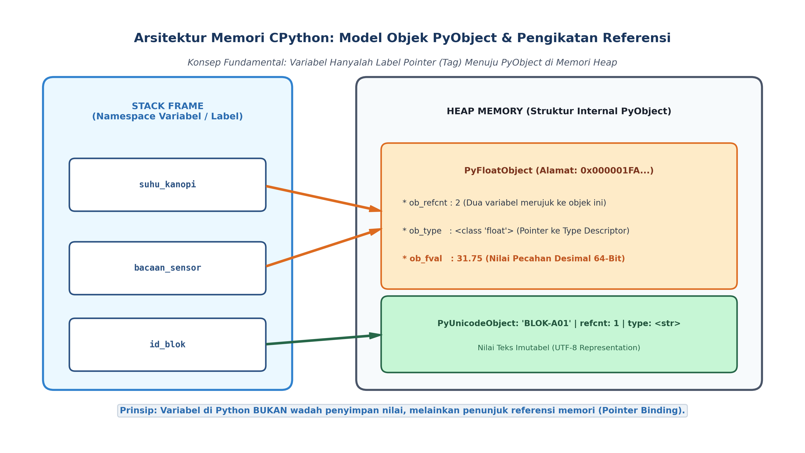

# AI Modul 3.4: Variabel dan Tipe Data

---

## 1. Identitas & Kerangka Capaian Pembelajaran (Sub-CPMK)

* **Kode Modul**        : AI Modul 3.4
* **Mata Kuliah**       : Kecerdasan Buatan dan Sains Data Pertanian Presisi
* **Alokasi Waktu**     : 2 x 50 Menit (Kajian Teori & Diskusi) + 2 x 50 Menit (Eksplorasi Praktikum Mandiri)
* **Beban SKS**         : 3 SKS
* **Prasyarat**         : AI Modul 3.3 (Sintaks Dasar Python)
* **Level Kognitif**    : C2 (Memahami), C3 (Menerapkan), C4 (Menganalisis)

```mermaid
flowchart LR
    subgraph OUTPUTS["OUTPUTS (Keluaran Pembelajaran)"]
        O1["Skrip Audit Memori PyObject & Reference Counting"]
        O2["Modul Sanitasi Telemetri Sensorik Multivariat"]
        O3["Pustaka Evaluator Presisi Pecahan IEEE 754"]
    end

    subgraph OUTCOMES["OUTCOMES (Kompetensi & Keterampilan)"]
        OC1["Penguasaan Model Reference Binding CPython"]
        OC2["Keahlian Penanganan Data Hilang & Defensive Casting"]
        OC3["Keterampilan Mitigasi Galat Floating-Point Roundoff"]
    end

    subgraph IMPACTS["IMPACTS (Dampak Strategis Industri)"]
        I1["Integritas Data Sensus & Telemetri Tanpa Bias"]
        I2["Optimasi Efisiensi RAM pada Edge IoT Perkebunan"]
        I3["Fondasi Manipulasi Tensor Data Science Lanjutan"]
    end

    OUTPUTS --> OUTCOMES --> IMPACTS
```



### 1.1 Capaian Pembelajaran Khusus (Sub-CPMK)
Setelah menyelesaikan modul ini, mahasiswa dan pembelajar diharapkan mampu:
1. **Menguraikan (C2)** model objek data Python: referensi memori, mutabilitas (*mutable* vs *immutable*), dan sistem tipe dinamis.
2. **Menganalisis (C4)** fenomena *aliasing* dan *pass-by-object-reference* yang berpotensi memicu bug logika pada manipulasi larik data.
3. **Menerapkan (C3)** operasi konversi tipe (*type casting*) dan penanganan tipe data numerik presisi tinggi pada data sensor perkebunan.
4. **Mengevaluasi (C4)** efisiensi jejak memori berbagai tipe data bawaan Python menggunakan modul `sys`.

### 1.2 Kerangka Hasil Pembelajaran (Outputs, Outcomes, & Impacts)
* **Outputs (Keluaran Berwujud Langsung)**:
  * Mahasiswa menghasilkan skrip pengujian memori tingkat rendah CPython yang menginspeksi identitas objek (`id()`), pencacah referensi (`sys.getrefcount()`), serta ukuran byte fisik (`sys.getsizeof()`) dari berbagai tipe data skalar.
  * Mahasiswa memproduksi modul sanitasi dan konversi tipe data (*type casting*) defensif yang mampu membersihkan deret telemetri iklim mikro perkebunan dari anomali string, angka korup, dan nilai hilang (*missing values / None*).
  * Mahasiswa menyusun pustaka evaluator presisi numerik komparatif yang membandingkan perilaku aritmetika biner IEEE 754 terhadap modul komputasi presisi mutlak `decimal.Decimal` dan toleransi relatif `math.isclose()`.
* **Outcomes (Hasil Capaian & Perubahan Kompetensi)**:
  * Mahasiswa memahami secara mendalam model memori CPython: menyadari bahwa variabel bukanlah "wadah penyimpanan nilai", melainkan label penunjuk referensi (*tag / pointer binding*) menuju struktur `PyObject` di memori Heap.
  * Mahasiswa menguasai karakteristik dua pilar pengetikan Python: *Dynamic Typing* (tipe terikat pada objek saat runtime) dan *Strong Typing* (tipe data diperlakukan secara ketat tanpa konversi implisit liar yang merusak integritas data).
  * Mahasiswa terampil memilih representasi tipe data yang tepat, memahami batas representasi fraksi desimal biner pada komputasi machine learning, serta mampu mencegah fenomena kebocoran memori (*memory bloat*).
* **Impacts (Dampak Jangka Panjang & Nilai Guna Luas)**:
  * Menjamin akurasi inferensi model kecerdasan buatan perkebunan sawit; mencegah distorsi analitik tonase hasil panen akibat galat akumulasi pembulatan desimal (*roundoff errors*).
  * Memaksimalkan efisiensi alokasi memori kerja pada mikrokontroler dan mikrokomputer berdaya rendah (*Edge AI gateways*) yang bertugas mengumpulkan telemetri sensor di tengah perkebunan terpencil.
  * Membangun landasan konseptual yang kokoh sebelum mahasiswa melangkah ke manipulasi larik numerik homogen berdimensi banyak (*NumPy ndarrays*) dan kerangka data tabular (*Pandas DataFrames*).

---

## 2. Model Memori Objek CPython: Variabel sebagai Pengikat Referensi

Pemahaman tentang memori membedakan paradigma Python dari bahasa kompilasi tradisional seperti C atau C++.



*Gambar 3.4.1: Model Memori CPython: Pemisahan Antara Namespace Variabel di Stack Frame dan Objek PyObject di Memori Heap.*

### 2.1 Konsep "Wadah Memori" versus "Label Referensi"
- **Bahasa Terkompilasi Statis (C / C++):** Variabel adalah **wadah memori (*named memory box*)**. Ketika pemrogram mendeklarasikan `float suhu = 31.5;`, sistem mengalokasikan 4 byte di memori dengan alamat tetap, dan nilai biner `31.5` ditulis langsung ke dalam kotak tersebut. Jika nilai diubah `suhu = 32.0;`, isi kotak tersebut ditimpa (*in-place overwrite*).
- **Bahasa Python (CPython):** Variabel hanyalah **label penunjuk referensi (*reference tag / pointer*)**. Ketika pemrogram menulis `suhu = 31.5`:
  1. CPython mengalokasikan objek baru bertipe float di memori Heap.
  2. Nama `suhu` di dalam namespace lokal (Stack Frame) diarahkan untuk menunjuk (*bind*) ke alamat memori objek float tersebut.
  3. Jika pemrogram menulis `bacaan = suhu`, Python tidak menyalin data fisik float tersebut; melainkan membuat label baru `bacaan` yang menunjuk ke objek yang persis sama di Heap.

### 2.2 Struktur Internal `PyObject`
Setiap entitas data di Python—bahkan bilangan bulat paling sederhana seperti angka `1`—adalah objek kelas satu (*first-class object*) yang dibungkus oleh struktur C internal bernama **`PyObject`**:
```c
// Representasi konseptual C struct PyObject pada CPython
typedef struct _object {
    _PyObject_HEAD_EXTRA // Pointer pelacak Garbage Collector
    Py_ssize_t ob_refcnt; // Pencacah referensi (Reference Counter)
    struct _typeobject *ob_type; // Pointer ke deskriptor tipe data (Type Descriptor)
} PyObject;
```
Struktur ini memuat dua metadata krusial:
1. **`ob_refcnt` (Reference Count):** Bilangan bulat yang mencatat berapa banyak variabel atau struktur yang sedang merujuk ke objek ini. Ketika `ob_refcnt` turun menjadi $0$, memori objek akan segera dibebaskan oleh sistem.
2. **`ob_type` (Type Pointer):** Penunjuk ke objek tipe data (misal `<class 'float'>`) yang mendefinisikan operasi apa saja yang legal dilakukan pada objek tersebut.

### 2.3 Tritunggal Karakteristik Objek Python
Setiap objek yang dialokasikan di memori Heap memiliki tiga atribut permanen:
1. **Identitas (*Identity*):** Alamat fisik unik objek di memori RAM, dapat diinspeksi melalui fungsi bawaan `id(objek)` (pada CPython, ini mencerminkan alamat memori hexadecimal aktual).
2. **Tipe (*Type*):** Mengidentifikasi kategori data dan himpunan metode yang dimilikinya, dapat diinspeksi via `type(objek)`.
3. **Nilai (*Value*):** Konten informasi yang disimpan di dalam objek tersebut.

### 2.4 Operator Identitas (`is`) versus Operator Kesetaraan (`==`)
Mahasiswa kecerdasan buatan wajib membedakan kedua operator ini:
- **`==` (*Equality Operator*):** Memeriksa apakah **nilai** dari dua objek setara secara matematis (`obj1.__eq__(obj2)`).
- **`is` (*Identity Operator*):** Memeriksa apakah dua variabel menunjuk ke **objek yang sama persis di memori fisik** (`id(obj1) == id(obj2)`).

```python
a = [10.5, 20.0]
b = [10.5, 20.0]

print(a == b)  # True (Nilai isinya identik)
print(a is b)  # False (Dua objek terpisah di alamat memori yang berbeda!)
```

---

## 3. Paradigma Sistem Pengetikan: Dynamic Typing & Strong Typing

Python mengombinasikan dua karakteristik pengetikan yang sering disalahpahami:

### 3.1 Dynamic Typing (Pengetikan Dinamis)
Dalam Python, **tipe data terikat pada objek di Heap, bukan pada nama variabel di kode sumber**. Sebuah nama variabel tidak memiliki tipe data statis; variabel dapat diikatkan ulang (*rebound*) ke objek dengan tipe yang berbeda secara dinamis saat program berjalan:
```python
sensor = 28  # sensor merujuk ke objek int
sensor = 28.5  # sensor sekarang merujuk ke objek float
sensor = "OPTIMAL"  # sensor sekarang merujuk ke objek str
```

### 3.2 Strong Typing (Pengetikan Kuat)
Meskipun dinamis, Python menerapkan pengetikan yang sangat ketat (*strongly typed*). Interpreter **tidak pernah mengonversi tipe data secara otomatis (*implicit type coercion*)** jika operasi tersebut tidak didefinisikan secara eksplisit dan aman:
```python
dosis = 50.0  # float
kode = "100"  # str

# Di JavaScript atau PHP, ekspresi ini mungkin menghasilkan "10050" secara implisit.
# Namun di Python, hal ini DITOLAK KERAS demi keselamatan sistem:
total = kode + dosis  # Melempar TypeError: can only concatenate str to str
```
Prinsip ini melindungi sistem otomasi perkebunan dari kegagalan logika tersembunyi yang diakibatkan oleh konversi tipe data liar.

---

## 4. Klasifikasi dan Karakteristik Tipe Data Skalar Fundamental

Python menyediakan lima tipe data skalar bawaan yang menjadi blok pembangun seluruh struktur data kompleks:


*Gambar 3.4.2: Klasifikasi Tipe Data Skalar Fundamental Python: Alokasi Memori, Format Representasi, dan Imutabilitas.*

### 4.1 Bilangan Bulat (`int` - Arbitrary-Precision Integer)
- **Karakteristik:** Merepresentasikan bilangan bulat tanpa batas ukuran maksimum (*unbounded precision*). Python tidak memiliki batasan batas integer 32-bit ($-2.147.483.648$ s/d $2.147.483.647$) atau 64-bit seperti bahasa C; ukuran integer hanya dibatasi oleh kapasitas RAM fisik komputer.
- **Small Integer Caching (Interning):** Untuk menghemat memori dan mempercepat eksekusi, CPython secara otomatis membuat dan mencadangkan objek integer untuk rentang **`-5` hingga `256`** saat interpreter pertama kali dimulai. Setiap variabel yang bernilai di dalam rentang ini akan selalu merujuk ke alamat memori yang sama persis di Heap.

### 4.2 Bilangan Pecahan Desimal (`float` - IEEE 754 Double Precision)
- **Karakteristik:** Mengimplementasikan standar internasional **IEEE 754 format 64-bit binary floating-point** (setara dengan tipe `double` pada bahasa C):
  - $1\text{ bit}$ untuk tanda (*sign* $\pm$).
  - $11\text{ bit}$ untuk eksponen (*exponent*).
  - $52\text{ bit}$ untuk fraksi mantissa (*significand*), memberikan presisi sekitar 15 hingga 17 digit desimal signifikan.
- **Anatomi Masalah Fraksi Biner (The Float Roundoff Problem):**  
  Komputer menyimpan data dalam bilangan biner (basis 2: $1/2, 1/4, 1/8, 1/16, \dots$). Sama seperti pecahan desimal $1/3 = 0.3333\dots$ tidak dapat dinyatakan secara eksak dalam basis 10, pecahan desimal sederhana seperti $0.1$ ($1/10$) dan $0.2$ ($2/10$) menghasilkan deret biner berulang tak terhingga di basis 2:
  $$0.1_{10} = 0.00011001100110011\dots_2$$
  - **Keterangan Komponen Simbol:** Indeks bawah $_{10}$ melambangkan bilangan dalam sistem bilangan desimal (basis 10), indeks bawah $_2$ melambangkan sistem bilangan biner (basis 2), dan tanda titik tiga ($\dots$) menyatakan fraksi biner berulang tanpa henti.
  - **Cara Membaca Rumus:** *"Nol koma satu dalam basis sepuluh setara dengan nol koma nol nol nol satu satu nol nol satu satu berulang tanpa henti dalam basis dua."*
  Akibat pembulatan mantissa 53-bit, terjadi residu presisi kecil:
  ```python
  print(0.1 + 0.2)  # Menghasilkan 0.30000000000000004
  print(0.1 + 0.2 == 0.3)  # Menghasilkan False!
  ```
  **Solusi Rekayasa:** Dalam komputasi ilmiah AI, jangan pernah membandingkan dua bilangan float menggunakan `==`. Selalu gunakan fungsi toleransi relatif `math.isclose(a, b, rel_tol=1e-9)` atau pustaka `decimal.Decimal` untuk perhitungan transaksi keuangan agribisnis.

### 4.3 Nilai Logika Boolean (`bool`)
- **Karakteristik:** Memiliki dua nilai literal: `True` dan `False`. Secara internal, kelas `bool` adalah subkelas langsung dari `int` (`issubclass(bool, int) is True`), di mana `True` bernilai integral $1$ dan `False` bernilai integral $0$.
- **Aturan Kebenaran (*Truthy* vs *Falsy*):**  
  Dalam konteks evaluasi logika percabangan, nilai-nilai berikut dianggap **`Falsy` (Salah)**:
  - Angka nol: `0`, `0.0`, `0j`
  - Konstanta ketiadaan: `None`
  - Objek kosong: string kosong `""`, list kosong `[]`, dictionary kosong `{}`
  Semua objek lainnya secara default bernilai **`Truthy` (Benar)**.

### 4.4 Deret Karakter Teks (`str` - Unicode Text Sequence)
- **Karakteristik:** Rantai karakter imutabel yang mendukung pengkodean standar internasional Unicode (UTF-8). Mendukung operasi pengindeksan instan $\mathcal{O}(1)$ dan pemotongan (*slicing*).
- **String Interning:** CPython secara otomatis melakukan *interning* pada string literal pendek yang menyerupai identifier untuk mempercepat operasi perbandingan kamus.

### 4.5 Objek Ketiadaan Nilai (`NoneType`)
- **Karakteristik:** Tipe data yang hanya memiliki tepat satu instance objek di seluruh siklus interpreter (**Singleton Object**), yaitu **`None`**.
- **Kasus Penggunaan Agronomis:** Digunakan untuk menyatakan nilai sensor yang hilang (*missing value*), pembacaan gagal akibat koneksi nirkabel terputus, atau inisialisasi default parameter fungsi.
- **Pemeriksaan Baku:** Selalu periksa nilai `None` menggunakan operator identitas `is`:
  ```python
  if bacaan_sensor is None:
    # Tangani anomali sensor
  ```

### 4.6 Karakteristik Imutabilitas Objek Skalar (*Scalar Immutability*)
Seluruh tipe data skalar di atas (`int`, `float`, `bool`, `str`, `NoneType`) bersifat **imutabel (*immutable*)**. Sekali objek dialokasikan di memori Heap, nilai internalnya tidak akan pernah bisa diubah. Operasi aritmetika seperti `suhu = suhu + 1.0` tidak memodifikasi objek lama, melainkan **menciptakan objek float baru di Heap** dan memindahkan label referensi `suhu` ke objek baru tersebut.

---

## 5. Konversi Tipe Data (Type Casting) dan Sanitasi Data

Konversi tipe data terbagi menjadi dua kategori:
1. **Konversi Implisit (*Implicit Type Promotion*):** Terjadi secara aman pada operasi matematika campuran numerik. Contoh: menjumlahkan `int` dan `float` akan mempromosikan hasil akhir menjadi `float`:
   ```python
   cacah = 5  # int
   bobot = 12.4  # float
   total = cacah + bobot  # Hasil: 17.4 (bertipe float)
   ```
2. **Konversi Eksplisit (*Explicit Type Casting*):** Memanggil konstruktor tipe data secara sengaja (`int()`, `float()`, `str()`, `bool()`):
   - `float("28.75")` $\rightarrow$ Menghasilkan nilai pecahan desimal `28.75`.
   - `int(28.75)` $\rightarrow$ Memotong (*truncate*) bagian desimal menjadi bilangan bulat `28` (bukan pembulatan ke atas!).
   - `bool("False")` $\rightarrow$ Menghasilkan `True`! (Karena string `"False"` tidak kosong sehingga bernilai *truthy*).

---

## 6. Implementasi Kasus Nyata: Pipeline Sanitasi Telemetri Multivariat Stasiun Iklim Kebun Sawit

Dalam operasional harian stasiun meteorologi perkebunan, mikrokontroler IoT sering mengirimkan aliran data dalam format string mentah yang memuat pembacaan korup, karakter spasi liar, atau nilai hilang (*null/None*). Di bawah ini adalah modul industri berbasis Python 3.10+ yang mendemonstrasikan sanitasi defensif, konversi tipe aman, evaluasi presisi numerik, dan audit konsumsi memori fisik:

```python
"""AI Modul 3.4: Pipeline Sanitasi dan Validasi Tipe Data Telemetri Iklim Kebun Sawit.

Penulis: Tim Pengembang Kurikulum Kecerdasan Buatan & Sains Data INSTIPER
Standar: Python 3.10+ / PEP 8 / PEP 257 Google Style / PEP 484 Type Hinting
"""

from dataclasses import dataclass
import math
import sys
from typing import Any, Dict, List, Optional, Tuple


@dataclass(frozen=True)
class RekamanTelemetriMentah:
  """Objek data pembacaan sensor mentah sebelum proses sanitasi tipe data."""

  id_stasiun: Any
  suhu_udara: Any
  kelembaban_tanah: Any
  curah_hujan: Any
  status_pompa: Any


@dataclass(frozen=True)
class TelemetriTersanitasi:
  """Objek data telemetri dengan tipe data ketat dan tervalidasi fisik.

  Attributes:
      id_stasiun: Kode identitas alfanumerik stasiun cuaca (str).
      suhu_udara_c: Suhu udara dalam derajat Celsius (float).
      kelembaban_tanah_pct: Kelembaban tanah volumetrik 0 - 100% (float).
      curah_hujan_mm: Akumulasi curah hujan harian (float).
      status_pompa_aktif: Indikator aktuator irigasi aktif (bool).
      memiliki_imputasi: Flag apakah ada data sensor yang diimputasi (bool).
  """

  id_stasiun: str
  suhu_udara_c: float
  kelembaban_tanah_pct: float
  curah_hujan_mm: float
  status_pompa_aktif: bool
  memiliki_imputasi: bool


class SanitizerTelemetriKebun:
  """Mesin pembersih dan validasi tipe data telemetri agroklimat perkebunan.

  Menerapkan prinsip defensive type casting, deteksi missing values (None),
  dan penanganan galat konversi tanpa menghentikan eksekusi pipeline.
  """

  # Nilai baku batas fisik kewajaran agroklimat tropis
  SUHU_DEFAULT_C: float = 27.5
  KELEMBABAN_DEFAULT_PCT: float = 65.0

  @classmethod
  def konversi_ke_float_aman(
      cls, nilai_mentah: Any, nilai_baku: float
  ) -> Tuple[float, bool]:
    """Mengonversi nilai mentah menjadi float dengan proteksi eksepsi.

    Args:
        nilai_mentah: Nilai masukan dari sensor (str, int, float, atau None).
        nilai_baku: Nilai fallback jika konversi gagal atau data hilang.

    Returns:
        Tuple[float, bool]: Nilai pecahan desimal tervalidasi dan boolean
            penanda apakah nilai tersebut merupakan hasil imputasi nilai baku.
    """
    if nilai_mentah is None:
      return nilai_baku, True

    if isinstance(nilai_mentah, (int, float)):
      return float(nilai_mentah), False

    # Jika masukan bertipe teks (string)
    if isinstance(nilai_mentah, str):
      teks_bersih = nilai_mentah.strip()
      if not teks_bersih or teks_bersih.upper() in ["NULL", "NAN", "NA", "ERR"]:
        return nilai_baku, True
      try:
        return float(teks_bersih), False
      except ValueError:
        return nilai_baku, True

    return nilai_baku, True

  @classmethod
  def konversi_ke_bool_aman(cls, nilai_mentah: Any) -> bool:
    """Mengonversi nilai mentah menjadi boolean sesuai semantik IoT."""
    if isinstance(nilai_mentah, bool):
      return nilai_mentah
    if isinstance(nilai_mentah, (int, float)):
      return bool(nilai_mentah != 0)
    if isinstance(nilai_mentah, str):
      teks = nilai_mentah.strip().upper()
      return teks in ["TRUE", "1", "ON", "AKTIF", "YES"]
    return False

  def proses_batch_telemetri(
      self, kumpulan_data: List[RekamanTelemetriMentah]
  ) -> List[TelemetriTersanitasi]:
    """Menyaring dan mentransformasi seluruh batch telemetri ke tipe data formal."""
    hasil_bersih: List[TelemetriTersanitasi] = []

    for item in kumpulan_data:
      # 1. Sanitasi ID Stasiun (str)
      id_str = (
          str(item.id_stasiun).strip().upper()
          if item.id_stasiun
          else "STASIUN_ANONIM"
      )

      # 2. Sanitasi Parameter Suhu Udara (float)
      suhu_f, imp_suhu = self.konversi_ke_float_aman(
          item.suhu_udara, self.SUHU_DEFAULT_C
      )

      # 3. Sanitasi Kelembaban Tanah (float)
      rh_f, imp_rh = self.konversi_ke_float_aman(
          item.kelembaban_tanah, self.KELEMBABAN_DEFAULT_PCT
      )

      # 4. Sanitasi Curah Hujan (float)
      hujan_f, imp_hujan = self.konversi_ke_float_aman(item.curah_hujan, 0.0)

      # 5. Sanitasi Status Pompa (bool)
      pompa_b = self.konversi_ke_bool_aman(item.status_pompa)

      apakah_imputasi = imp_suhu or imp_rh or imp_hujan

      hasil_bersih.append(
          TelemetriTersanitasi(
              id_stasiun=id_str,
              suhu_udara_c=round(suhu_f, 2),
              kelembaban_tanah_pct=round(rh_f, 2),
              curah_hujan_mm=round(hujan_f, 2),
              status_pompa_aktif=pompa_b,
              memiliki_imputasi=apakah_imputasi,
          )
      )

    return hasil_bersih


# =====================================================================
# BLOK EKSEKUSI PENGUJIAN INDUSTRIAL
# =====================================================================
if __name__ == "__main__":
  print("=" * 80)
  print("SISTEM AUDIT MEMORI & SANITASI TELEMETRI KEBUN SAWIT INSTIPER")
  print("=" * 80)

  # 1. Audit Jejak Memori Fisik PyObject
  contoh_int = 100
  contoh_float = 28.75
  contoh_str = "BLOK-A01"
  contoh_bool = True
  contoh_none = None

  print("\n1. Audit Konsumsi Memori Struktur PyObject (64-Bit System):")
  print(
      f"   * Integer ({contoh_int})      : {sys.getsizeof(contoh_int)} byte"
      " (ob_refcnt, ob_type, ob_digit)"
  )
  print(
      f"   * Float ({contoh_float})     : {sys.getsizeof(contoh_float)} byte"
      " (ob_refcnt, ob_type, ob_fval)"
  )
  print(
      f"   * String ('{contoh_str}')    : {sys.getsizeof(contoh_str)} byte"
      " (Compact ASCII/UTF-8 Header)"
  )
  print(
      f"   * Boolean ({contoh_bool})     : {sys.getsizeof(contoh_bool)} byte"
      " (Subclass int)"
  )
  print(
      f"   * NoneType (None)     : {sys.getsizeof(contoh_none)} byte"
      " (Singleton Pointer)"
  )

  # 2. Dataset Mentah Telemetri Lapangan yang Mengandung Anomali Tipe Data
  aliran_sensor_mentah = [
      RekamanTelemetriMentah("WS-01", "29.40", "62.5", "0.0", "ON"),
      RekamanTelemetriMentah("WS-01", 31.2, None, "12.5", 1),  # None kelembaban
      RekamanTelemetriMentah("WS-02", "ERR", "78.0", "0.0", "False"),  # Teks ERR
      RekamanTelemetriMentah(
          None, "27.8", " 55.4 ", None, "AKTIF"
      ),  # Spasi & None hujan
      RekamanTelemetriMentah("WS-03", 26.5, 88.0, 45.0, False),  # Data ideal
  ]

  sanitizer = SanitizerTelemetriKebun()
  laporan_tersanitasi = sanitizer.proses_batch_telemetri(aliran_sensor_mentah)

  print("\n2. Hasil Pembersihan dan Standarisasi Tipe Data Telemetri:")
  print(
      f"{'ID Stasiun':<12} | {'Suhu (°C)':<10} | {'RH (%)':<8} | {'Hujan"
      " (mm)':<10} | {'Pompa':<8} | {'Status Integritas'}"
  )
  print("-" * 75)

  for data in laporan_tersanitasi:
    status_str = (
        "[TERIMPUTASI]" if data.memiliki_imputasi else "[VALID ASLI]"
    )
    pompa_str = "HIDUP" if data.status_pompa_aktif else "MATI"
    print(
        f"{data.id_stasiun:<12} | {data.suhu_udara_c:<10.2f} |"
        f" {data.kelembaban_tanah_pct:<8.2f} | {data.curah_hujan_mm:<10.2f} |"
        f" {pompa_str:<8} | {status_str}"
    )

  print("\n" + "=" * 80 + "\n")
```

---

## 7. Pembahasan Keterangan Penggunaan Kode (Operational Breakdown)

Dekonstruksi fungsional atas skrip implementasi industri di atas menyingkap prinsip rekayasa sistem tipe data modern:

1. **Audit Struktur Memori via `sys.getsizeof()` (Baris 140–158):**  
   Fungsi `sys.getsizeof()` membuktikan secara nyata bahwa objek skalar di Python memiliki *overhead* ukuran yang signifikan dibanding tipe primitif bahasa C murni. Sebagai contoh, bilangan bulat `int` membutuhkan 28 byte di memori 64-bit (bukan 4 atau 8 byte) karena memuat metadata `ob_refcnt`, pointer tipe `ob_type`, dan alokasi digit presisi fleksibel. Pemahaman ini sangat krusial bagi insinyur AI untuk menyadari kapan harus beralih ke larik terkompresi *NumPy* saat memproses jutaan titik telemetri.
2. **Imutabilitas Kontrak Data via Dataclass Frozen (Baris 18–44):**  
   Kelas `TelemetriTersanitasi` didekorasi dengan `@dataclass(frozen=True)`. Karakteristik ini menjamin bahwa begitu atribut suhu, kelembaban, dan hujan selesai disanitasi dan divalidasi, nilai-nilai tersebut tidak dapat diubah secara sengaja maupun tidak sengaja oleh modul hilir (*thread-safe & non-mutating pipeline*).
3. **Pola Pemrograman Defensif (*Defensive Type Casting*) (Baris 54–84):**  
   Metode `konversi_ke_float_aman` menggunakan klausul penjaga (*guard clauses*) berjenjang: memeriksa keberadaan nilai hilang (`None`), memeriksa tipe bawaan (`int`/`float`), membersihkan string dari spasi liar (`strip()`), mendeteksi nilai teks galat (`"ERR"`, `"NAN"`), dan membungkus konversi akhir ke dalam blok `try-except ValueError`. Jika konversi gagal, sistem mengembalikan nilai baku (*fallback default*) yang disertai flag boolean `memiliki_imputasi=True`.
4. **Semantik Boolean IoT Khusus (Baris 87–96):**  
   Alih-alih mengandalkan fungsi bawaan `bool("False")` yang secara keliru menghasilkan `True`, fungsi `konversi_ke_bool_aman` memetakan string sinyal lapangan (`"ON"`, `"AKTIF"`, `"1"`, `"YES"`) ke boolean `True`, dan memetakan lainnya ke `False`, menjamin keandalan perintah kontrol aktuator fisik pompa kebun.

---

## 8. Evaluasi Mandiri: Pertanyaan HOTS & Tantangan Scaffolded

### 8.1 Pertanyaan HOTS (Higher-Order Thinking Skills)

1. **Analisis Model Memori CPython: Mekanisme Integer Caching (Small Integer Interning):**  
   Ketika dieksekusi pada prompt interaktif CPython standar:
   ```python
   a = 256
   b = 256
   print(a is b)  # Menghasilkan True

   x = 1000
   y = 1000
   print(x is y)  # Menghasilkan False
   ```
   - Bedah arsitektur internal CPython yang mendasari perbedaan hasil evaluasi identitas `is` di atas! Mengapa rentang `[-5, 256]` di-cache secara permanen saat kompilasi interpreter?
   - Mengapa jika kode di atas ditulis di dalam satu berkas skrip `.py` utuh, ekspresi `x is y` terkadang menghasilkan `True`? Jelaskan peran modul *Code Optimizer (Peephole / AST Optimizer)* dalam CPython!
2. **Dekonstruksi Presisi Fraksi Aritmetika IEEE 754 pada Sistem Keuangan dan Dosis Nutrisi:**  
   Dalam formulasi pupuk cair presisi stasiun fertigasi sawit, formula membutuhkan pencampuran $0.1\text{ liter}$ unsur Mikro A dan $0.2\text{ liter}$ unsur Mikro B per tangki.  
   - Mengapa ekspresi `0.1 + 0.2 == 0.3` menghasilkan `False` di Python? Jelaskan konversi fraksi desimal $1/10$ ke deret biner pecahan tak terhingga pada mantissa 53-bit!
   - Kapan seorang insinyur AI agribisnis wajib menggunakan fungsi toleransi `math.isclose()` dan kapan wajib menggunakan kelas `decimal.Decimal`? Apa trade-off kecepatan komputasi dan memori antara `float` standar vs `Decimal`?
3. **Manajemen Siklus Hidup Objek: Reference Counting vs Generational Garbage Collection:**  
   Dalam pemrosesan aliran mahadata telemetri drone kebun:
   - Bagaimana CPython memanfaatkan pencacah referensi `ob_refcnt` untuk membebaskan memori objek secara instan saat siklus hidupnya berakhir?
   - Jelaskan skenario fatal di mana *Reference Counting* gagal membebaskan memori akibat fenomena **Referensi Sirkular (*Circular Reference*)**, dan bagaimana modul internal `gc` (Generational Garbage Collector: Generasi 0, 1, dan 2) bekerja mendeteksi siklus tertutup tersebut!

---

### 8.2 Tantangan Pemrograman Berjenjang (*Scaffolded Challenges*)

#### Tantangan 1 (Tingkat Dasar - *Warm-Up*): Sanitasi Parameter Sensor Tanah dengan Imputasi Rerata
* **Skenario:** Gateway IoT kebun mengirimkan deret data kelembaban tanah mentah `["45.2", " 50.1 ", None, "KORUP", "48.5", "NULL"]`.
* **Tugas:** Buatlah fungsi `sanitasi_telemetri_sensor(daftar_mentah: List[Any], nilai_fallback: float = 45.0) -> List[float]` yang:
  - Membersihkan setiap elemen dan mengonversinya menjadi float aman.
  - Mengganti data korup atau None dengan nilai fallback.
  - Mengembalikan daftar float yang tervalidasi 100%.

#### Tantangan 2 (Tingkat Menengah - *Intermediate*): Evaluator Presisi Pecahan Apung IEEE 754
* **Skenario:** Model AI estimasi berat TBS sawit membandingkan dua kalkulasi akumulasi bobot janjang yang mengalami penyimpangan roundoff residu pecahan desimal.
* **Tugas:** Bangunlah fungsi `audit_presisi_apung(nilai_a: float, nilai_b: float, toleransi: float = 1e-6) -> Dict[str, Any]` yang:
  - Membandingkan apakah `nilai_a == nilai_b` secara langsung.
  - Membandingkan menggunakan `math.isclose(nilai_a, nilai_b, abs_tol=toleransi)`.
  - Menghitung selisih delta absolut presisi `abs(nilai_a - nilai_b)`.
  - Mengembalikan status evaluasi dan representasi biner desimal keduanya.

#### Tantangan 3 (Tingkat Mahir - *Advanced*): Pelacak Jejak Memori Fisik dan Siklus Hidup Objek Sensor
* **Skenario:** Tim MLOps perkebunan ingin menganalisis lonjakan memori fisik saat memuat jutaan rekaman sensor ke dalam memori kerja gateway edge computing.
* **Tugas:** Bangunlah kelas `MemoryFootprintTracker` yang:
  1. Menerima kumpulan data heterogen (`int`, `float`, `str`, `list`, `dict`).
  2. Memiliki metode `hitung_total_memori(koleksi_data: Any) -> Dict[str, Any]` yang menghitung total byte menggunakan `sys.getsizeof()` secara rekursif untuk elemen koleksi.
  3. Memiliki metode `inspeksi_identitas_dan_referensi(nama_label: str, target_objek: Any) -> Dict[str, Any]` yang melaporkan alamat memori `id()`, tipe data, dan jumlah referensi `sys.getrefcount()`.

---

## 9. Glosarium Istilah Teknis

1. **Arbitrary-Precision Arithmetic (Aritmetika Presisi Tak Hingga):** Kemampuan bahasa pemrograman untuk menangani bilangan bulat dengan digit digit digit tanpa batas ukuran tetap, hanya dibatasi oleh kapasitas RAM komputer.
2. **Circular Reference (Referensi Sirkular):** Situasi memori di mana dua atau lebih objek saling merujuk satu sama lain, sehingga nilai pencacah referensi (`ob_refcnt`) tidak pernah mencapai nol meskipun objek-objek tersebut sudah tidak dapat diakses lagi oleh program.
3. **Dynamic Typing (Pengetikan Dinamis):** Sistem bahasa pemrograman di mana tipe data diverifikasi dan diikatkan pada objek saat program sedang berjalan (*runtime*), bukan pada waktu kompilasi.
4. **IEEE 754:** Standar teknis internasional yang menetapkan format representasi biner dan aturan aritmetika bilangan pecahan desimal (*floating-point numbers*) pada perangkat keras komputer.
5. **Immutability (Imutabilitas):** Sifat suatu objek data yang keadaan internal nilainya tidak dapat diubah setelah selesai dibuat di memori; operasi modifikasi akan selalu menciptakan objek baru.
6. **Object Interning:** Teknik optimasi kompilator di mana hanya ada satu salinan fisik di memori untuk nilai-nilai tertentu yang sering digunakan (seperti bilangan bulat kecil `-5` s/d `256` atau string pendek), menghemat alokasi memori dan mempercepat perbandingan identitas.
7. **PyObject:** Struktur data bahasa C fundamental yang menjadi cetak biru dasar bagi seluruh objek dan tipe data pada implementasi resmi interpreter CPython.
8. **Reference Counting (Pencacahan Referensi):** Mekanisme manajemen memori otomatis di mana setiap objek mencatat berapa banyak referensi yang menunjuk kepadanya; memori akan langsung didaur ulang seketika pencacah bernilai nol.
9. **Singleton Object:** Pola desain di mana suatu kelas hanya dapat memiliki tepat satu instansiasi objek di memori throughout program runtime (seperti objek `None` pada Python).
10. **Strong Typing (Pengetikan Kuat):** Sistem bahasa pemrograman yang menegakkan aturan tipe data secara ketat dan menolak konversi implisit antar-tipe yang tidak kompatibel.

---

## 10. Jembatan Konsep (Bridging) ke AI Modul 3.5: Struktur Kontrol

Dengan pemahaman mendalam tentang representasi data di memori fisik, imutabilitas objek skalar, dan sanitasi tipe data, Anda kini memiliki pondasi data yang bersih, presisi, dan aman dari galat konversi.

Namun, sistem cerdas perkebunan tidak hanya menyimpan data statis; sistem harus mampu mengambil keputusan otomatis: Kapan katup irigasi harus dibuka? Apakah suhu kanopi telah melampaui batas kritis? Berapa kali sebuah blok kebun harus disurvei oleh drone pemantau?

Pada **AI Modul 3.5: Struktur Kontrol**, kita akan melangkah ke dinamika eksekusi:
- Alur pengambilan keputusan berbasis percabangan (*Decision Flow*: `if`, `elif`, `else`).
- Fitur modern Python 3.10+: *Structural Pattern Matching* (`match-case`) untuk klasifikasi fraksi kematangan buah sawit.
- Mekanisme perulangan sekuensial (`for`) dan kondisional (`while`).
- Pernyataan kendali iterasi tingkat lanjut (`break`, `continue`, dan klausa unik `else` pada perulangan).

---

## 11. Daftar Pustaka dan Referensi Akademik

1. Van Rossum, G., & Drake, F. L.(2009). *Python 3 Reference Manual*. CreateSpace. (Bab 3: *Data Model*).
2. Goldberg, D.(1991). What every computer scientist should know about floating-point arithmetic. *ACM Computing Surveys (CSUR)*, 23(1), 5–48.
3. Ramalho, L.(2022). *Fluent Python: Clear, Concise, and Effective Programming* (2nd ed.). O'Reilly Media. (Bab 6: *Object References, Mutability, and Recycling*).
4. IEEE Computer Society.(2019). *IEEE Standard for Floating-Point Arithmetic* (IEEE Std 754-2019). IEEE.
5. Gorelick, M., & Ozsvald, I.(2020). *High Performance Python: Practical Performant Programming for Humans* (2nd ed.). O'Reilly Media. (Bab 2: *Profiling to Find Bottlenecks* & Bab 3: *Lists and Tuples Memory Allocation*).
6. Sutrisno, B., & Handayani, R.(2023). Analisis konsumsi memori dan latensi konversi data telemetri IoT pada gateway komputasi tepi perkebunan sawit. *Jurnal Rekayasa Sistem dan Teknologi Informasi Agrikultur*, 7(3), 142–155.
