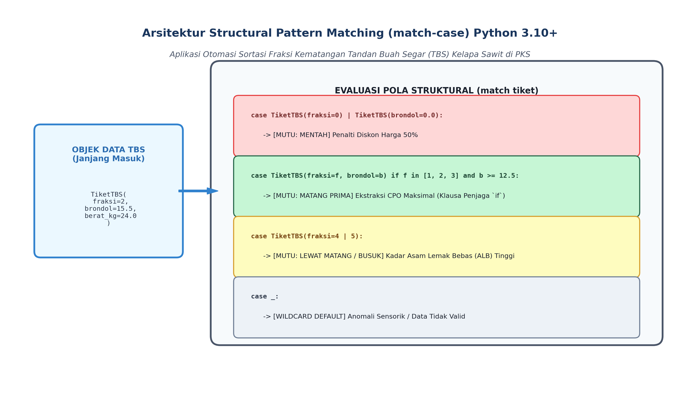
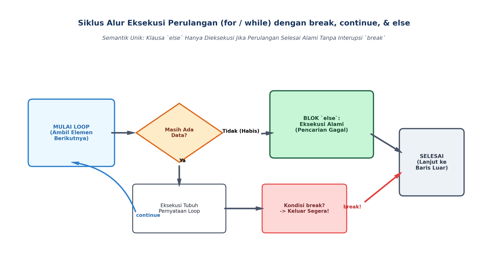

# AI Modul 3.5: Struktur Kontrol

---

## 1. Identitas & Kerangka Capaian Pembelajaran (Sub-CPMK)

* **Kode Modul**        : AI Modul 3.5
* **Mata Kuliah**       : Kecerdasan Buatan dan Sains Data Pertanian Presisi
* **Alokasi Waktu**     : 2 x 50 Menit (Kajian Teori & Diskusi) + 2 x 50 Menit (Eksplorasi Praktikum Mandiri)
* **Beban SKS**         : 3 SKS
* **Prasyarat**         : AI Modul 3.4 (Variabel dan Tipe Data Python)
* **Level Kognitif**    : C2 (Memahami), C3 (Menerapkan), C4 (Menganalisis)

```mermaid
flowchart LR
    subgraph OUTPUTS["OUTPUTS (Keluaran Pembelajaran)"]
        O1["Engine Sortasi TBS Berbasis match-case Python 3.10+"]
        O2["Algoritma Audit Anomali Lahan Pola for-else"]
        O3["Simulator Irigasi Presisi Multi-Blok Guard Clauses"]
    end

    subgraph OUTCOMES["OUTCOMES (Kompetensi & Keterampilan)"]
        OC1["Penguasaan Dekonstruksi Pola Struktural"]
        OC2["Keahlian Mencegah Deeply Nested Conditionals"]
        OC3["Keterampilan Pemanfaatan Iterator Protocol O(1)"]
    end

    subgraph IMPACTS["IMPACTS (Dampak Strategis Industri)"]
        I1["Otomasi Penuh Grading Buah Sawit Standar Pabrik"]
        I2["Reduksi Kehilangan Minyak (Losses) CPO di PKS"]
        I3["Efisiensi Penggunaan Air & Energi Pompa Kebun"]
    end

    OUTPUTS --> OUTCOMES --> IMPACTS
```



### 1.1 Capaian Pembelajaran Khusus (Sub-CPMK)
Setelah menyelesaikan modul ini, mahasiswa dan pembelajar diharapkan mampu:
1. **Menguraikan (C2)** sintaksis idiomatis percabangan bersarang dan perulangan berbasis iterator (`for`, `while`, `else` pada loop).
2. **Menerapkan (C3)** teknik pemrosesan batch data citra menggunakan fungsi pembantu iterasi (`enumerate`, `zip`, `reversed`).
3. **Menganalisis (C4)** efisiensi pernyataan interupsi loop (`break`, `continue`, `pass`) dalam pengendalian aliran algoritma optimasi.
4. **Merancang (C3)** logika filter peringatan dini cuaca ekstrem perkebunan berbasis struktur kontrol multi-kondisi.

### 1.2 Kerangka Hasil Pembelajaran (Outputs, Outcomes, & Impacts)
* **Outputs (Keluaran Berwujud Langsung)**:
  * Mahasiswa menghasilkan mesin keputusan sortasi mutu fraksi TBS kelapa sawit berbasis fitur modern Python 3.10+ *Structural Pattern Matching* (`match-case`) yang teranotasi tipe ketat (PEP 484).
  * Mahasiswa memproduksi skrip audit anomali telemetri sensorik perkebunan yang memanfaatkan keanggunan semantik klausa `for-else` tanpa memerlukan variabel bendera (*flag variables*).
  * Mahasiswa mengonstruksi simulator penjadwalan irigasi multi-blok terotomasi yang menerapkan pola klausa penjaga (*guard clauses pattern*) dan generator rentang malas (*lazy sequence evaluation*).
* **Outcomes (Hasil Capaian & Perubahan Kompetensi)**:
  * Mahasiswa menguasai arsitektur *Structural Pattern Matching* (PEP 634/635/636): mampu membedakan pencocokan pola struktural yang mendekonstruksi objek data dari sekadar percabangan nilai skalar `switch-case` konvensional.
  * Mahasiswa terampil merekayasa alur kendali yang bersih, mampu mengeliminasi anti-pola percabangan bersarang berlebih (*deeply nested conditionals*) demi mematuhi prinsip *The Zen of Python* (*"Flat is better than nested"*).
  * Mahasiswa memahami protokol iterator CPython (`__iter__`, `__next__`), memahami efisiensi memori $\mathcal{O}(1)$ dari fungsi `range()`, serta mahir mengendalikan loop menggunakan `break`, `continue`, dan klausa unik `else`.
* **Impacts (Dampak Jangka Panjang & Nilai Guna Luas)**:
  * Mendorong standardisasi dan transparansi proses sortasi buah kelapa sawit di Pabrik Kelapa Sawit (PKS), menekan potensi sengketa mutu antara petani plasma dan korporasi agribisnis.
  * Meminimalkan rasio buah mentah (*unripe*) dan buah lewat matang (*overripe*) yang masuk ke stasiun sterilisasi, menjaga kadar Asam Lemak Bebas (*Free Fatty Acids / FFA*) CPO di bawah ambang batas $3.0\%$.
  * Menjamin efisiensi komputasi pada sistem kendali otonom perkebunan, mencegah terjadinya kegagalan memori (*out-of-memory*) saat memproses jutaan rekaman data sensus.

---

## 2. Arsitektur Alur Kendali Program (Control Flow Architecture)

Secara teoretis (Teorema Struktur Böhm-Jacopini), setiap algoritma komputasi apa pun di dunia dapat diekspresikan hanya menggunakan tiga struktur dasar:
1. **Sekuensial (*Sequence*):** Instruksi dieksekusi langkah demi langkah dari atas ke bawah secara kronologis.
2. **Seleksi (*Selection / Branching*):** Menentukan jalur eksekusi alternatif berdasarkan evaluasi nilai kebenaran (*Boolean expression*).
3. **Iterasi (*Iteration / Looping*):** Mengulang eksekusi satu blok pernyataan selama kondisi tertentu terpenuhi atau melintasi elemen koleksi.

### 2.1 Evaluasi Hubung Singkat (*Short-Circuit Evaluation*)
Dalam mengevaluasi ekspresi logika gabungan yang melibatkan operator `and` dan `or`, Python menerapkan optimasi komputasi yang disebut **Evaluasi Hubung Singkat**:
- Pada operasi `A and B`: Jika `A` bernilai `False`, Python **tidak akan pernah mengevaluasi ekspresi `B`**, karena hasil akhir sudah dipastikan `False`.
- Pada operasi `A or B`: Jika `A` bernilai `True`, Python **segera mengembalikan `True` tanpa mengevaluasi `B`**.

```python
# Pemanfaatan Short-Circuit sebagai Pelindung Galat (Guard Expression)
if sensor is not None and sensor.baca_suhu() > 35.0:
  nyalakan_pendingin_greenhouse()
```
Jika `sensor` bernilai `None`, pemanggilan `sensor.baca_suhu()` tidak akan pernah dieksekusi, sehingga program terhindar secara otomatis dari galat fatal `AttributeError: 'NoneType' object has no attribute 'baca_suhu'`.

---

## 3. Percabangan Kondisional Konvensional dan Pola Klausa Penjaga

### 3.1 Sintaksis Baku: `if`, `elif`, dan `else`
Pernyataan percabangan mengevaluasi kondisi secara berurutan. Begitu sebuah kondisi bernilai `True`, blok pernyataan di bawahnya dieksekusi, dan seluruh cabang `elif`/`else` berikutnya langsung dilewati (*mutually exclusive*).

### 3.2 Anti-Pola Percabangan Bersarang Berlebih versus Pola Klausa Penjaga (*Guard Clauses*)
Ketika menangani banyak aturan validasi pada sistem otomasi kebun, pemrogram pemula sering menulis kode dengan percabangan bersarang berlebih (*Deeply Nested Conditionals*):

```python
# ANTI-POLA: Percabangan Bersarang Berlebih (Sulit Dibaca & Rawan Galat)
def proses_truk_panen(truk):
  if truk.memiliki_tiket():
    if truk.berat_timbang_kg > 1000:
      if not truk.sopir_ilegal():
        if truk.pks_tujuan == "PKS-01":
          return "IZINKAN_BONGKAR_TBS"
        else:
          return "TOLAK_PKS_SALAH"
      else:
        return "TOLAK_SOPIR_ILEGAL"
    else:
      return "TOLAK_BERAT_KOSONG"
  else:
    return "TOLAK_TANPA_TIKET"
```

Struktur di atas melanggar prinsip PEP 20 (*"Flat is better than nested"*). Pola yang jauh lebih bersih dan berstandar industri adalah **Pola Klausa Penjaga (*Guard Clauses Pattern*)**: periksa seluruh kondisi kegagalan di awal fungsi dan lakukan pengembalian dini (*early return*), menyisakan alur eksekusi baku (*nominal path*) berjalan di tingkat indentasi terluar:

```python
# POLA REKOMENDASI: Pola Klausa Penjaga (Guard Clauses - Bersih & Rata)
def proses_truk_panen_bersih(truk):
  if not truk.memiliki_tiket():
    return "TOLAK_TANPA_TIKET"
  if truk.berat_timbang_kg <= 1000:
    return "TOLAK_BERAT_KOSONG"
  if truk.sopir_ilegal():
    return "TOLAK_SOPIR_ILEGAL"
  if truk.pks_tujuan != "PKS-01":
    return "TOLAK_PKS_SALAH"

  # Alur Utama Berjalan Mulus Tanpa Indentasi Bersarang
  return "IZINKAN_BONGKAR_TBS"
```

---

## 4. Structural Pattern Matching (match-case) Python 3.10+

Fitur paling revolusioner yang diperkenalkan pada Python 3.10 (PEP 634, 635, 636) adalah **Structural Pattern Matching** (`match-case`). Fitur ini bukan sekadar padanan dari kata kunci `switch-case` pada bahasa C atau Java, melainkan sebuah mesin pencocokan pola tingkat tinggi yang mampu **mendekonstruksi bentuk struktural data (*data deconstruction*)**, menangkap nilai variabel (*variable capture*), dan mengevaluasi batasan logika (*pattern guards*).



*Gambar 3.5.1: Arsitektur Structural Pattern Matching: Dekonstruksi Pola Objek Janjang TBS Kelapa Sawit Berdasarkan Fraksi Kematangan dan Persentase Brondolan.*

### 4.1 Standar Fraksi Kematangan Janjang TBS Kelapa Sawit
Dalam industri kelapa sawit nasional (Pedoman Teknis Pengolahan Kelapa Sawit PPKS), mutu tandan buah segar diklasifikasikan ke dalam sistem fraksi formal:

| Kode Fraksi | Deskripsi Kematangan | Kriteria Fisik Brondolan Lepas | Mutu & Tindakan Pabrik |
| :---: | :--- | :--- | :--- |
| **Fraksi 00** | Sangat Mentah (*Dead Unripe*) | $0\%$ brondolan lepas, buah hitam pekat | Ditolak / Penalti Maksimal ($100\%$) |
| **Fraksi 0** | Mentah (*Unripe*) | $1 - 12.5\%$ buah luar membrondol | Penalti Pemotongan Harga ($50\%$) |
| **Fraksi 1** | Mengkal (*Underripe*) | $12.5 - 25\%$ buah luar membrondol | Diterima dengan catatan |
| **Fraksi 2** | **Matang Prima I (*Ripe*)** | **$25 - 50\%$ buah luar membrondol** | **Kualitas Optimal (Kandungan CPO Maksimal)** |
| **Fraksi 3** | **Matang Prima II (*Ripe*)** | **$50 - 75\%$ buah luar membrondol** | **Kualitas Optimal (Kandungan CPO Maksimal)** |
| **Fraksi 4** | Lewat Matang (*Overripe*) | $> 75\%$ buah membrondol, buah dalam ikut lepas | Risiko Asam Lemak Bebas (ALB) Tinggi |
| **Fraksi 5** | Busuk / Janjang Kosong | Janjang berjamur / seluruh brondolan rontok | Ditolak kebun (Kualitas Minyak Rusak) |

### 4.2 Dekonstruksi Sintaksis `match-case`
```python
match data_tbs:
  # 1. Pola Literal & Pola Gabungan (Or-Pattern |)
  case {"fraksi": 00 | 0}:
    status = "PENALTI_MENTAH"

  # 2. Pola Penangkapan Variabel (Capture Pattern) dengan Klausa Penjaga (if guard)
  case {"fraksi": f, "brondol_pct": b} if f in (2, 3) and b >= 25.0:
    status = "DITERIMA_PRIMA_CPO_TINGGI"

  # 3. Pola Ekstraksi Objek Kelas (Class Pattern / Dataclass)
  case TiketTimbangan(kode_blok=str(b), berat_kg=berat) if berat > 30.0:
    status = f"TBS_SUPER_DARI_{b}"

  # 4. Pola Wildcard Default (_)
  case _:
    status = "DATA_ANOMALI_PERIKSA_MANUAL"
```

---

## 5. Perulangan dan Protokol Iterator CPython



*Gambar 3.5.2: Siklus Eksekusi Loop: Perjalanan Alur Eksekusi For/While dengan Kendali break, continue, dan Semantik Unik Blok else.*

### 5.1 Protokol Iterator CPython (*Iterator Protocol*)
Perulangan `for elemen in koleksi:` di Python tidak bekerja berdasarkan pencacah indeks numerik seperti pada bahasa C. CPython menjalankan **Protokol Iterator (*Iterator Protocol*)**:
1. CPython memanggil fungsi bawaan `iter(koleksi)` yang menginstruksikan objek memanggil metode dunder `koleksi.__iter__()` untuk menghasilkan objek iterator.
2. Di setiap putaran loop, CPython memanggil `next(iterator)` yang secara internal mengeksekusi `iterator.__next__()`.
3. Ketika seluruh elemen telah habis, objek iterator melemparkan eksepsi internal `StopIteration`. CPython menangkap eksepsi ini secara senyap dan menghentikan perulangan secara elegan.

### 5.2 Objek Rentang Malas: Efisiensi Memori `range()`
Pada Python 3, pemanggilan `range(awal, akhir, langkah)` tidak menciptakan daftar (*list*) angka di memori RAM. Sebaliknya, `range` menghasilkan objek sekuensial yang bekerja secara **Evaluasi Malas (*Lazy Evaluation*)**:
- Objek `range` hanya menyimpan tiga buah bilangan bulat di memori: nilai `start`, `stop`, dan `step`.
- Berapapun besarnya rentang nilai—baik `range(10)` maupun `range(1_000_000_000)`—konsumsi memorinya **selalu konstan $\mathcal{O}(1)$ (hanya tepat 48 byte!)**. Angka baru dihitung di unit aritmetika hanya ketika diminta oleh iterator perulangan.

### 5.3 Fungsi Pembantu Iterasi Esensial: `enumerate()` dan `zip()`
- **`enumerate(koleksi, start=0)`:** Menghasilkan pasangan tuple `(indeks, elemen)` tanpa perlu memelihara variabel pencacah manual `i += 1`.
- **`zip(koleksi_a, koleksi_b)`:** Menjahit dua atau lebih koleksi data secara paralel, berhenti saat koleksi terpendek habis.

### 5.4 Pernyataan Kendali: `break`, `continue`, dan `pass`
- **`break`:** Menghentikan perulangan secara paksa dan segera melompat keluar ke baris pertama setelah blok perulangan.
- **`continue`:** Membatalkan sisa instruksi pada putaran iterasi saat ini dan langsung melompat ke evaluasi iterasi berikutnya.
- **`pass`:** Operasi tanpa tindakan (*no-op*) yang digunakan sebagai penampung sintaksis kosong (*syntactic placeholder*).

### 5.5 Semantik Unik Klausa `else` pada Perulangan (`for-else` / `while-else`)
Fitur unik Python yang sering membingungkan pemrogram dari bahasa lain adalah keberadaan klausa **`else` setelah blok perulangan**:
> [!IMPORTANT]
> **Aturan Semantik `for-else`:**  
> Blok `else` pada perulangan dieksekusi **HANYA JIKA perulangan selesai secara alami melintasi seluruh data tanpa pernah terputus oleh pernyataan `break`**.

Pola ini sangat elegan untuk algoritma pencarian linear: jika item ditemukan, kita lakukan `break`; jika seluruh data diperiksa dan item tidak ditemukan, blok `else` akan menangani skenario "tidak ditemukan" secara otomatis tanpa memerlukan variabel penanda (*flag variable* `ditemukan = False`).

---

## 6. Implementasi Kasus Nyata: Engine Otomasi Sortasi Panen & Pengawasan Mutu PKS Sawit

Di bawah ini adalah implementasi sistem pemilahan fraksi mutu panen kelapa sawit skala industri berbasis Python 3.10+ yang memadukan fitur `match-case`, pola klausa penjaga, dan perulangan `for-else`:

```python
"""AI Modul 3.5: Engine Otomasi Sortasi TBS dan Pengawasan Mutu PKS Sawit.

Penulis: Tim Pengembang Kurikulum Kecerdasan Buatan & Sains Data INSTIPER
Standar: Python 3.10+ / PEP 8 / PEP 257 Google Style / PEP 484 Type Hinting
"""

from dataclasses import dataclass
import sys
from typing import Any, Dict, List, Optional, Tuple


@dataclass(frozen=True)
class JanjangTBS:
  """Objek data fisik tandan buah segar hasil pemindaian sensor sorting ramp.

  Attributes:
      id_janjang: Nomor seri unik identifikasi janjang.
      kode_blok: Blok asal perkebunan (misal: 'BLOK-A01').
      berat_kg: Bobot massa janjang hasil timbangan otomatis (kg).
      fraksi: Kode kelas kematangan hasil visi komputer (0 s/d 5).
      persen_brondolan: Estimasi persentase buah membrondol lepas (0 - 100%).
      terdapat_sampah: Indikator kontaminasi sampah pasir atau gagang panjang.
  """

  id_janjang: str
  kode_blok: str
  berat_kg: float
  fraksi: int
  persen_brondolan: float
  terdapat_sampah: bool


class EngineSortasiSawit:
  """Mesin klasifikasi mutu panen sawit berbasis Structural Pattern Matching

  dan algoritma pengawasan anomali batch panen PKS.
  """

  def __init__(self, nama_pks: str = "PKS-INSTIPER-01") -> None:
    self.nama_pks: str = nama_pks

  def evaluasi_mutu_janjang(self, janjang: JanjangTBS) -> Dict[str, Any]:
    """Mengklasifikasikan kelas mutu dan penalti fraksi kematangan janjang.

    Args:
        janjang: Objek JanjangTBS berisi metadata fisik hasil sensor.

    Returns:
        Dict[str, Any]: Keputusan grading mencakup kategori mutu, faktor
          pengali harga komersial, dan catatan teknis stasiun pemrosesan.
    """
    # Penerapan Modern Python 3.10+ Structural Pattern Matching
    match janjang:
      # Kasus 1: Pola Janjang Rusak / Berkontaminasi Sampah Berat
      case JanjangTBS(terdapat_sampah=True):
        kategori = "REJECT_KONTAMINASI"
        faktor_harga = 0.0
        catatan = "Terdapat kontaminasi sampah batu/gagang panjang berlebih."

      # Kasus 2: Pola Buah Sangat Mentah (Fraksi 00 / 0)
      case JanjangTBS(fraksi=0, persen_brondolan=b) if b < 12.5:
        kategori = "PENALTI_MENTAH"
        faktor_harga = 0.50
        catatan = "Buah mentah (Fraksi 0). Kandungan rendemen minyak sangat rendah."

      # Kasus 3: Pola Kematangan Prima Optimal (Fraksi 1, 2, atau 3)
      case JanjangTBS(fraksi=f, persen_brondolan=b) if (
          f in (1, 2, 3) and 12.5 <= b <= 75.0
      ):
        kategori = "MUTU_PRIMA_OPTIMAL"
        faktor_harga = 1.00
        catatan = "Buah matang sempurna. Rendemen CPO maksimal dan ALB rendah."

      # Kasus 4: Pola Lewat Matang / Busuk (Fraksi 4 atau 5)
      case JanjangTBS(fraksi=4 | 5):
        kategori = "PENALTI_LEWAT_MATANG"
        faktor_harga = 0.70
        catatan = "Buah lewat matang/busuk. Risiko peningkatan Asam Lemak Bebas."

      # Kasus 5: Wildcard Fallback untuk Data Anomali
      case _:
        kategori = "DATA_ANOMALI"
        faktor_harga = 0.0
        catatan = "Kombinasi parameter fraksi dan brondolan tidak logis."

    return {
        "id_janjang": janjang.id_janjang,
        "blok": janjang.kode_blok,
        "berat_kg": janjang.berat_kg,
        "kategori": kategori,
        "faktor_harga": faktor_harga,
        "catatan": catatan,
    }

  def audit_inspeksi_batch(
      self, daftar_janjang: List[JanjangTBS]
  ) -> Dict[str, Any]:
    """Mengaudit kumpulan aliran janjang panen menggunakan pola perulangan for-else."""
    total_berat = 0.0
    cacah_prima = 0
    tandan_ditolak: List[str] = []

    print("\n--- MEMULAI INSPEKSI ALIRAN JANJANG SORTING RAMP ---")

    # Pemanfaatan enumerate untuk melacak indeks urutan ban berjalan (conveyor)
    for no_urut, janjang in enumerate(daftar_janjang, start=1):
      hasil = self.evaluasi_mutu_janjang(janjang)
      total_berat += janjang.berat_kg

      if hasil["kategori"] == "MUTU_PRIMA_OPTIMAL":
        cacah_prima += 1
      elif hasil["faktor_harga"] < 1.0:
        tandan_ditolak.append(janjang.id_janjang)

      print(
          f"[{no_urut:02d}] Janjang {janjang.id_janjang:<8} | Blok:"
          f" {janjang.kode_blok:<8} | Mutu: {hasil['kategori']:<22} | Pengali:"
          f" {hasil['faktor_harga']:.2f}"
      )

    # Implementasi Algoritma Deteksi Batch Kritis via Pola for-else
    # Mencari apakah ada janjang dengan berat abnormal (> 45 kg) hasil pencurian atau salah blok
    for janjang in daftar_janjang:
      if janjang.berat_kg > 45.0:
        print(
            f"\n[PERINGATAN KRITIS] Janjang anomali terdeteksi: {janjang.id_janjang}"
            f" ({janjang.berat_kg} kg)! Interupsi proses sortir."
        )
        status_batch = "BATCH_DITAHAN_UNTUK_AUDIT"
        break
    else:
      # Dieksekusi HANYA jika perulangan tuntas tanpa break (seluruh buah normal)
      print(
          "\n[VERIFIKASI SUKSES] Seluruh janjang berada dalam rentang bobot"
          " wajar."
      )
      status_batch = "BATCH_LOLOS_PENGOLAHAN_STERILIZER"

    rasio_prima = (
        (cacah_prima / len(daftar_janjang)) * 100.0 if daftar_janjang else 0.0
    )

    return {
        "total_janjang": len(daftar_janjang),
        "total_berat_kg": round(total_berat, 2),
        "rasio_prima_persen": round(rasio_prima, 2),
        "janjang_berpenalti": tandan_ditolak,
        "status_batch": status_batch,
    }


# =====================================================================
# BLOK EKSEKUSI PENGUJIAN INDUSTRIAL
# =====================================================================
if __name__ == "__main__":
  print("=" * 80)
  print("SISTEM SORTASI CERDAS KELAPA SAWIT INSTIPER (PYTHON 3.10+ MATCH-CASE)")
  print("=" * 80)

  # Data tiruan 6 janjang TBS hasil pemindaian ban berjalan pabrik
  muatan_lori = [
      JanjangTBS("JJG-001", "BLOK-A01", 24.5, fraksi=2, persen_brondolan=35.0, terdapat_sampah=False),
      JanjangTBS("JJG-002", "BLOK-A01", 28.0, fraksi=0, persen_brondolan=5.0, terdapat_sampah=False),  # Mentah
      JanjangTBS("JJG-003", "BLOK-B02", 22.0, fraksi=3, persen_brondolan=60.0, terdapat_sampah=False),
      JanjangTBS("JJG-004", "BLOK-B01", 19.5, fraksi=5, persen_brondolan=95.0, terdapat_sampah=False),  # Busuk
      JanjangTBS("JJG-005", "BLOK-A02", 26.0, fraksi=2, persen_brondolan=40.0, terdapat_sampah=True),   # Sampah
      JanjangTBS("JJG-006", "BLOK-A01", 25.5, fraksi=2, persen_brondolan=30.0, terdapat_sampah=False),
  ]

  engine = EngineSortasiSawit()
  laporan_sortasi = engine.audit_inspeksi_batch(muatan_lori)

  print("\n" + "=" * 80)
  print("REKAPITULASI AKHIR MUTU BATCH PANEN:")
  print(f"Total Janjang Diperiksa : {laporan_sortasi['total_janjang']} janjang")
  print(f"Total Bobot Timbangan   : {laporan_sortasi['total_berat_kg']} kg")
  print(f"Rasio Mutu Prima CPO    : {laporan_sortasi['rasio_prima_persen']}%")
  print(f"Janjang Terkena Penalti : {laporan_sortasi['janjang_berpenalti']}")
  print(f"Status Alur Produksi    : {laporan_sortasi['status_batch']}")
  print("=" * 80 + "\n")
```

---

## 7. Pembahasan Keterangan Penggunaan Kode (Operational Breakdown)

Dekonstruksi fungsional atas skrip implementasi industri di atas menyingkap integrasi struktur kontrol modern:

1. **Dekonstruksi Pola Struktural via Dataclass Pattern Matching (Baris 54–85):**  
   Pernyataan `match janjang` memeriksa objek `JanjangTBS` berdasarkan atribut internalnya secara langsung. Pada `case JanjangTBS(fraksi=f, persen_brondolan=b) if (f in (1, 2, 3) and 12.5 <= b <= 75.0):`, Python mengekstraksi nilai `fraksi` ke variabel lokal baru `f` dan persentase brondolan ke `b`, lalu mengevaluasi batasan agronomis melalui klausa penjaga (*pattern guard* `if`). Ini jauh lebih ekspresif, ringkas, dan aman dibanding perangkaian puluhan pernyataan `if-elif` bersarang.
2. **Penggunaan Or-Pattern Pipe `|` (Baris 75–78):**  
   Ekspresi `case JanjangTBS(fraksi=4 | 5):` memanfaatkan operator pipa (*pipe*) untuk menggabungkan dua nilai kondisi yang memiliki konsekuensi perlakuan pabrik yang identik (baik Fraksi 4 maupun Fraksi 5 sama-sama memicu penalti asam lemak bebas), mengeliminasi duplikasi kode (*Don't Repeat Yourself / DRY*).
3. **Penyusuran Berindeks Otomatis via `enumerate()` (Baris 102–117):**  
   Penggunaan `enumerate(daftar_janjang, start=1)` menghasilkan pencacah nomor urut fisik konveyor janjang secara idiomatis tanpa risiko kesalahan pembaruan variabel pencacah manual (`no_urut += 1`).
4. **Semantik Penjaga Mutu Batch via `for-else` (Baris 119–133):**  
   Perulangan kedua mencari keberadaan janjang dengan berat abnormal (> 45 kg). Jika janjang tersebut ditemukan, loop diinterupsi oleh `break` dan `status_batch` disetel ke `"BATCH_DITAHAN"`. Jika dan hanya jika seluruh janjang normal, eksekusi secara otomatis jatuh ke blok `else:`, mengesahkan status batch lolos ke bejana sterilisasi tanpa memerlukan variabel flag tambahan.

---

## 8. Evaluasi Mandiri: Pertanyaan HOTS & Tantangan Scaffolded

### 8.1 Pertanyaan HOTS (Higher-Order Thinking Skills)

1. **Analisis Semantik Eksekusi: Komparasi Paradigma `match-case` (Python) vs `switch-case` (C/Java):**  
   - Pada bahasa C atau Java tradisional, konstruksi `switch(x)` bekerja sebagai pelompat tabel nilai skalar (*jump table*) berbasis nilai konstanta primitif integral/string. Jelaskan mengapa `match-case` di Python 3.10+ disebut sebagai **Pencocokan Pola Struktural (*Structural Pattern Matching*)**!
   - Apa yang dimaksud dengan dekonstruksi tipe (*type destructuring*) dan pengikatan variabel (*variable binding*) pada pattern matching? Bagaimana fitur ini merevolusi pemrosesan struktur data heterogen seperti tanggapan API telemetri drone dan berkas JSON sensor?
2. **Dekonstruksi Semantik Klausa `else` pada Perulangan (`for-else` & `while-else`):**  
   - Banyak pemrogram mengira klausa `else` pada loop akan dieksekusi setiap kali kondisi loop bernilai `False` (mirip seperti `if-else`). Buktikan mengapa penafsiran ini keliru!
   - Dalam algoritma pencarian linear data hama perkebunan: bandingkan kode pencarian tradisional yang menggunakan variabel penanda `hama_ditemukan = False` dengan kode modern yang menggunakan pola `for-else`. Analisis kejelasan alur (*cognitive load*) dan eliminasi potensi galat variabel penanda yang lupa diperbarui!
3. **Analisis Kompleksitas dan Efisiensi Memori: `range` (Python 3) vs List Enumerasi:**  
   - Pada Python 2, fungsi `range(1_000_000)` mengalokasikan list fisik berisi satu juta integer di RAM (~8 MB). Sebaliknya, pada Python 3, `range(1_000_000)` hanya mengonsumsi tepat 48 byte.  
   - Jelaskan konsep *Lazy Sequence Object* yang mendasari efisiensi memori $\mathcal{O}(1)$ tersebut! Mengapa iterator ini memungkinkan sistem kecerdasan buatan melakukan simulasi deret waktu iklim mikro perkebunan hingga $100.000.000$ langkah iterasi tanpa mengalami kehabisan memori (*Out Of Memory / OOM*)?

---

### 8.2 Tantangan Pemrograman Berjenjang (*Scaffolded Challenges*)

#### Tantangan 1 (Tingkat Dasar - *Warm-Up*): Pengklasifikasi Fraksi TBS Sawit Menggunakan Structural Pattern Matching
* **Skenario:** Stasiun timbangan penerimaan TBS membutuhkan modul fungsi cepat untuk menentukan kelayakan janjang.
* **Tugas:** Buatlah fungsi `klasifikasi_fraksi_tbs(fraksi: int, brondol_pct: float) -> Tuple[str, float]` menggunakan sintaksis `match-case` yang mengembalikan tuple `(status_mutu, diskon_persen)` berdasarkan kriteria:
  - Fraksi 0: ("Mentah", 50.0)
  - Fraksi 1: ("Mengkal", 15.0)
  - Fraksi 2 atau 3: ("Matang Prima", 0.0)
  - Fraksi 4: ("Lewat Matang", 25.0)
  - Fraksi 5: ("Busuk", 75.0)
  - Selain itu: ("Anomali", 100.0)

#### Tantangan 2 (Tingkat Menengah - *Intermediate*): Deteksi Anomali Aliran Sensorik via Pola `for-else`
* **Skenario:** Sistem monitoring irigasi memeriksa deret telemetri tekanan pipa air perkebunan `[2.1, 2.3, 2.2, 4.8, 2.0]` (satuan bar).
* **Tugas:** Bangunlah fungsi `cari_anomali_telemetri(daftar_tekanan: List[float], ambang_batas: float = 3.5) -> Dict[str, Any]` yang:
  - Memeriksa setiap titik tekanan secara berurutan menggunakan `enumerate()`.
  - Menggunakan pola `for-else`: jika ada tekanan yang melebihi `ambang_batas`, hentikan pencarian seketika (`break`) dan laporkan indeks serta nilai lonjakan tekanan (*pressure spike*).
  - Jika seluruh data berada di bawah batas ambang, blok `else` mengembalikan status bahwa seluruh pipa bertekanan normal dan stabil.

#### Tantangan 3 (Tingkat Mahir - *Advanced*): Simulator Irigasi Presisi Multi-Blok Berbasis Guard Clauses dan Batch Iteration
* **Skenario:** Kontroler fertigasi otomatis mengatur penyiraman untuk 10 blok perkebunan sawit. Setiap blok memiliki data kelembaban tanah, status sensor aktif, dan jadwal pemupukan.
* **Tugas:** Bangunlah kelas `SimulatorIrigasiPresisi` yang:
  1. Menerima list data blok berupa dictionary `{"id_blok": str, "sensor_aktif": bool, "kelembaban": float, "sedang_pupuk": bool}`.
  2. Memiliki metode `evaluasi_blok(data_blok: Dict[str, Any]) -> str` yang menerapkan **Pola Klausa Penjaga (*Guard Clauses*)**:
     - Jika sensor mati $\rightarrow$ return "SKIP_SENSOR_RUSAK"
     - Jika sedang dipupuk $\rightarrow$ return "HOLD_JADWAL_PUPUK"
     - Jika kelembaban $\ge 60.0\%$ $\rightarrow$ return "HOLD_TANAH_LEMBAB"
     - Alur akhir $\rightarrow$ return "AKTIFKAN_KATUP_IRIGASI"
  3. Memiliki metode `jalankan_inspeksi_kebun(kumpulan_blok: List[Dict[str, Any]]) -> Dict[str, Any]` yang mengagregasi keputusan seluruh blok dan memetakan aksi pompa.

---

## 9. Glosarium Istilah Teknis

1. **Control Flow (Alur Kendali):** Urutan pemrosesan pernyataan program yang menentukan urutan instruksi mana yang dieksekusi pada waktu runtime.
2. **Guard Clause (Klausa Penjaga):** Pola rekayasa perangkat lunak di mana pemeriksaan kondisi kegagalan atau kasus khusus ditempatkan di awal fungsi dengan instruksi pengembalian dini (*early return*), menjaga alur nominal tetap bersih dan rata.
3. **Iterator Protocol:** Konvensi formal CPython yang mengatur bagaimana objek koleksi dilintasi secara sekuensial melalui metode `__iter__()` dan `__next__()` hingga memicu eksepsi `StopIteration`.
4. **Lazy Sequence (Sekuens Malas):** Struktur data yang tidak mengalokasikan seluruh elemennya sekaligus di memori fisik, melainkan menghitung dan membangkitkan elemen berikutnya hanya ketika diminta oleh proses komputasi.
5. **Pattern Guard (Klausa Penjaga Pola):** Ekspresi kondisional tambahan berupa klausa `if` yang disematkan pada pernyataan `case` di dalam `match-case` untuk menyaring pencocokan pola struktural.
6. **Short-Circuit Evaluation (Evaluasi Hubung Singkat):** Perilaku semantik operator logika boolean di mana argumen kedua hanya dievaluasi jika argumen pertama belum cukup untuk menentukan nilai kebenaran akhir.
7. **StopIteration:** Eksepsi bawaan Python yang diemisikan oleh metode iterator `__next__()` untuk memberi sinyal kepada perulangan `for` bahwa seluruh elemen koleksi telah habis dilintasi.
8. **Structural Pattern Matching:** Fitur tata bahasa deklaratif yang memadukan pengujian tipe, dekonstruksi bentuk struktur data, dan pengikatan variabel ke dalam satu konstruksi sintaksis terpadu (`match-case`).

---

## 10. Jembatan Konsep (Bridging) ke AI Modul 3.6: Fungsi dan Modularisasi

Dengan menguasai alur kendali percabangan, keanggunan *Structural Pattern Matching*, dan efisiensi memori protokol iterator, Anda kini mampu mengendalikan dinamika komputasi sistem cerdas secara deterministik dan bebas dari galat percabangan bersarang.

Namun, seiring bertambahnya kompleksitas algoritma agribisnis—misal mengintegrasikan ratusan sensor, kamera pemilah, dan aktuator pompa—menulis seluruh logika di dalam satu skrip linier akan memicu redundansi kode, sulit diuji (*untestable*), dan rapuh terhadap perubahan. Kita memerlukan mekanisme dekomposisi modular untuk memecah masalah besar menjadi unit-unit fungsional yang independen dan dapat digunakan kembali (*reusable*).

Pada **AI Modul 3.6: Fungsi dan Modularisasi**, kita akan mendalami:
- Dekomposisi fungsional dan parameterisasi (`*args`, `**kwargs`, *keyword-only arguments*).
- Resolusi ruang lingkup leksikal LEGB (*Local, Enclosing, Global, Built-in*).
- Paradigma fungsi tingkat tinggi (*Higher-Order Functions*) dan ekspresi `lambda`.
- Pembuatan paket modul mandiri (`__init__.py`) untuk arsitektur pustaka kecerdasan buatan perkebunan.

---

## 11. Daftar Pustaka dan Referensi Akademik

1. Van Rossum, G., Warsaw, B., & Coghlan, N.(2020). *PEP 634: Structural Pattern Matching: Specification*. Python Enhancement Proposals.
2. Van Rossum, G., Warsaw, B., & Coghlan, N.(2020). *PEP 636: Structural Pattern Matching: Tutorial*. Python Enhancement Proposals.
3. Böhm, C., & Jacopini, G.(1966). Flow diagrams, turing machines and languages with only two formation rules. *Communications of the ACM*, 9(5), 366–371.
4. Fowler, M.(2018). *Refactoring: Improving the Design of Existing Code* (2nd ed.). Addison-Wesley. (Bab: *Replace Nested Conditional with Guard Clauses*).
5. Ramalho, L.(2022). *Fluent Python: Clear, Concise, and Effective Programming* (2nd ed.). O'Reilly Media. (Bab 2: *Control Flow & Pattern Matching* & Bab 17: *Iterators, Generators, and Classic Coroutines*).
6. Pusat Penelitian Kelapa Sawit (PPKS).(2022). *Pedoman Teknis Pengolahan Kelapa Sawit: Standarisasi Mutu Tandan Buah Segar dan Optimasi Rendemen CPO*. PPKS Medan.
