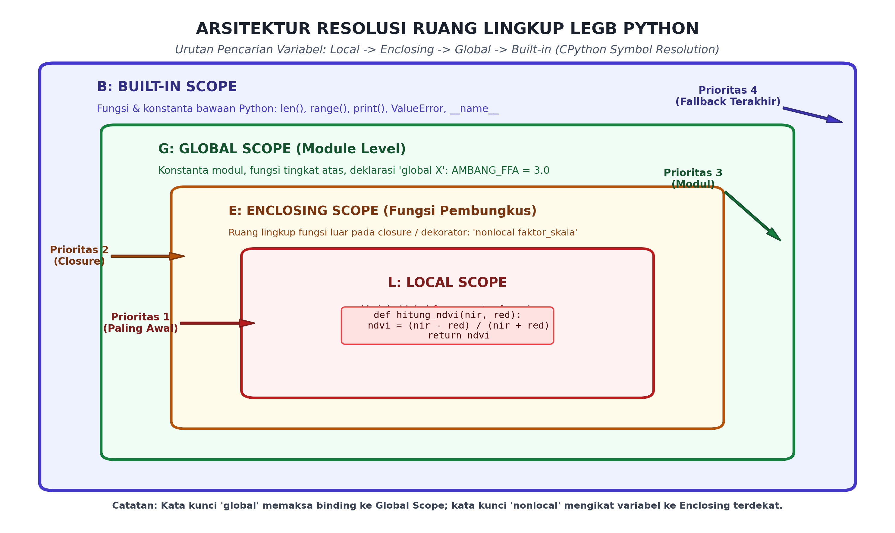
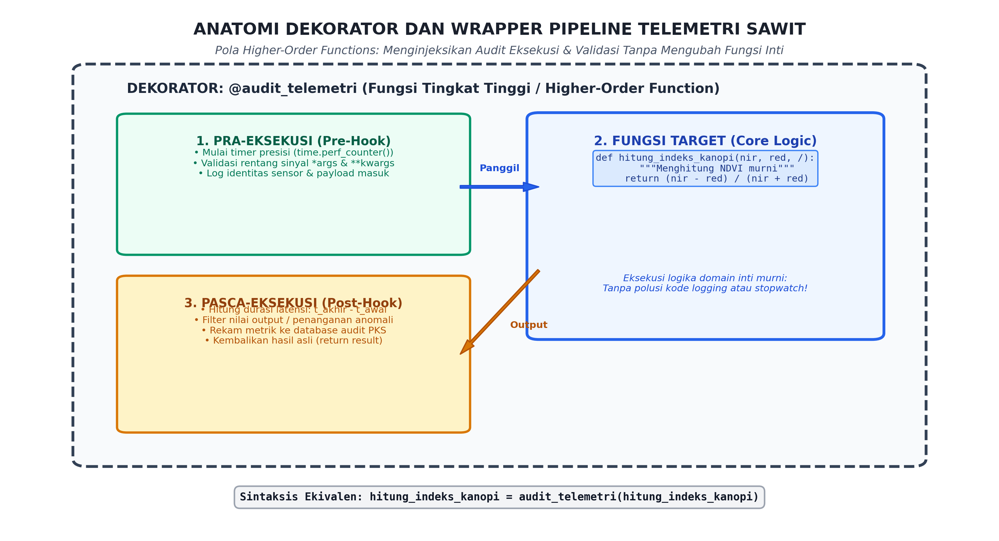

# AI Modul 3.6: Fungsi dan Modularisasi

---

## 1. Identitas & Kerangka Capaian Pembelajaran (Sub-CPMK)

* **Kode Modul**        : AI Modul 3.6
* **Mata Kuliah**       : Kecerdasan Buatan dan Sains Data Pertanian Presisi
* **Alokasi Waktu**     : 2 x 50 Menit (Kajian Teori & Diskusi) + 2 x 50 Menit (Eksplorasi Praktikum Mandiri)
* **Beban SKS**         : 3 SKS
* **Prasyarat**         : AI Modul 3.5 (Struktur Kontrol Python)
* **Level Kognitif**    : C2 (Memahami), C3 (Menerapkan), C4 (Menganalisis)


### 1.1 Capaian Pembelajaran Khusus (Sub-CPMK)
Setelah menyelesaikan modul ini, mahasiswa dan pembelajar diharapkan mampu:
1. **Menguraikan (C2)** anatomi fungsi Python, aturan pelingkupan variabel LEGB, dan siklus hidup objek pada *stack frame*.
2. **Menerapkan (C3)** fleksibilitas parameter (*positional*, *keyword-only*, `*args`, `**kwargs`) untuk membangun fungsi transformasi data yang adaptif.
3. **Merancang (C3)** modul dan paket mandiri dengan struktur direktori `__init__.py` untuk pemrosesan citra UAV kebun.
4. **Mengevaluasi (C4)** keterbacaan dan pemeliharaan kode fungsional melalui penerapan anotasi tipe (*Type Hints* / PEP 484).

### 1.2 Kerangka Hasil Pembelajaran (Outputs, Outcomes, & Impacts)
* **Outputs (Keluaran Berwujud Langsung)**:
  * Mahasiswa menghasilkan modul analisis spektral citra vegetasi kelapa sawit (NDVI, EVI, SAVI) yang mengimplementasikan parameterisasi modern Python 3.8+ *positional-only* (`/`) dan Python 3.0+ *keyword-only* (`*`) dengan anotasi tipe ketat (PEP 484/570/3102).
  * Mahasiswa memproduksi rantai dekorator produksi (*production decorators*) untuk pengawasan latensi inferensi model dan sanitasi rentang sinyal telemetri sensorik berbasis `@functools.wraps`.
  * Mahasiswa menyusun arsitektur paket modular agribisnis presisi (`agri_vision`) lengkap dengan titik masuk antarmuka eksplisit (`__all__`), resolusi impor relatif terstruktur, dan pemisahan logika domain inti dari infrastruktur penunjang.
* **Outcomes (Hasil Capaian & Perubahan Kompetensi)**:
  * Mahasiswa menguasai mekanisme resolusi simbol CPython leksikal LEGB (*Local, Enclosing, Global, Built-in*): mampu mengidentifikasi ruang lingkup variabel dan mengeliminasi efek samping (*side effects*) destruktif dari penyalahgunaan variabel global.
  * Mahasiswa mahir merancang tanda tangan fungsi ekspresif: mampu mendefinisikan antarmuka API fungsional yang tahan salah (*foolproof*), membedakan parameter posisional ketat untuk efisiensi matematis dan parameter kata kunci untuk kejelasan semantik komputasi.
  * Mahasiswa terampil merekayasa paradigma pemrograman fungsional (*Functional Programming*): mampu merancang *closures* untuk enkapsulasi status dinamis dan memanfaatkan *higher-order functions* untuk menginjeksi fungsionalitas lintas-sektoral (*cross-cutting concerns*) secara elegan tanpa memodifikasi kode domain inti.
* **Impacts (Dampak Jangka Panjang & Nilai Guna Luas)**:
  * Menghindari timbulan utang teknis (*technical debt*) dan kerapuhan kode pada sistem analitika kecerdasan buatan perkebunan skala luas, memastikan kontinuitas pengembangan perangkat lunak lintas generasi insinyur.
  * Mempercepat siklus riset dan penggelaran (*research-to-production deployment*) model kecerdasan buatan INSTIPER ke unit-unit operasional perkebunan dan pabrik kelapa sawit mitra industri.
  * Menjamin keterandalan, reproduktibilitas hasil kalkulasi agronomis, serta kemudahan audit logis terhadap algoritma penentuan dosis pupuk dan estimasi panen nasional.

---

## 2. Paradigma Dekomposisi Fungsional dan First-Class Citizens

### 2.1 Dekomposisi Fungsional (*Functional Decomposition*)
Dekomposisi fungsional adalah metodologi pemecahan masalah komputasi kompleks menjadi serangkaian sub-masalah yang lebih kecil, terisolasi, dan berfokus pada satu tanggung jawab tunggal (*Single Responsibility Principle / SRP*). Dalam konteks rekayasa kecerdasan buatan agribisnis:
- **Fungsi Murni (*Pure Function*):** Fungsi yang keluarannya ditentukan secara deterministik hanya oleh nilai masukan parameter tanpa bergantung pada atau memodifikasi status eksternal sistem (*referential transparency*).
- **Efek Samping (*Side Effects*):** Modifikasi terhadap variabel global, manipulasi parameter mutabel di luar fungsi, penulisan ke disk, atau interaksi I/O jaringan. Dalam arsitektur analitika data, efek samping harus diisolasi pada lapisan terluar, sedangkan inti kalkulasi matematika wajib berupa fungsi murni.

### 2.2 Fungsi sebagai Entitas Kelas Utama (*First-Class Citizens*)
Dalam bahasa Python, fungsi diperlakukan sebagai **First-Class Citizens** (Warga Kelas Satu). Ini berarti fungsi memiliki kedudukan yang setara dengan tipe data skalar lainnya (`int`, `float`, `str`):
1. **Dapat disimpan dalam variabel atau struktur data:**
   ```python
   def hitung_ndvi(nir: float, red: float) -> float:
       return (nir - red) / (nir + red)

   algoritma_spektral = hitung_ndvi
   hasil = algoritma_spektral(0.85, 0.15)
   ```
2. **Dapat dilewatkan sebagai argumen ke fungsi lain:**
   ```python
   def transformasikan_pixel(nilai_pixel: float, fungsi_koreksi: callable) -> float:
       return fungsi_koreksi(nilai_pixel)
   ```
3. **Dapat dikembalikan (*return*) sebagai nilai dari fungsi lain:**
   Mekanisme ini merupakan landasan matematis dari pembentukan *closure* dan dekorator.

---

## 3. Parameterisasi Lanjut dan Tata Bahasa Tanda Tangan Fungsi

Python modern menyediakan tata bahasa yang sangat kaya untuk merancang tanda tangan fungsi (*function signatures*) yang presisi dan tahan salah, sebagaimana distandardisasi dalam PEP 3102 dan PEP 570.

```
       def fungsi(pos_only1, pos_only2, /, standar_arg, *, kw_only1, kw_only2):
                  -------------------     -----------     ------------------
                           |                   |                  |
                    Positional-Only     Posisional atau      Keyword-Only
                   (Dilarang sebut     Kata Kunci Bebas     (Wajib sertakan
                     nama argumen)                            nama argumen)
```

### 3.1 Parameter Posisional Saja (*Positional-Only Parameters* - PEP 570)
Karakter garis miring miring (`/`) pada daftar parameter menegaskan bahwa seluruh parameter di sebelah kirinya **hanya dapat dilewatkan berdasarkan urutan posisi fisik, dan dilarang keras dilewatkan menggunakan nama kata kunci**:
```python
def hitung_rasio_cpo(berat_mesokarp: float, berat_tandan: float, /) -> float:
    return berat_mesokarp / berat_tandan

# Pemanggilan Legal:
rasio = hitung_rasio_cpo(12.5, 25.0)

# Pemanggilan Ilegal (Akan Memicu TypeError):
# rasio = hitung_rasio_cpo(berat_mesokarp=12.5, berat_tandan=25.0)
```
*Tujuan Rekayasa:* Menegaskan bahwa nama parameter adalah detail implementasi internal yang dapat diubah di masa depan tanpa merusak API publik, serta mengoptimalkan kecepatan pemanggilan fungsi di tingkat CPython bytecode.

### 3.2 Parameter Kata Kunci Saja (*Keyword-Only Parameters* - PEP 3102)
Karakter bintang tunggal (`*`) menandai batas di mana seluruh parameter di sebelah kanannya **wajib dilewatkan menggunakan pasangan nama kata kunci eksplisit (`kunci=nilai`)**:
```python
def kalibrasi_sensor_optik(sinyal_raw: float, *, faktor_kalibrasi: float = 1.0, terapkan_filter_derau: bool = True) -> float:
    # Logika kalibrasi...
    pass

# Pemanggilan Legal:
hasil = kalibrasi_sensor_optik(0.45, faktor_kalibrasi=1.05, terapkan_filter_derau=False)

# Pemanggilan Ilegal (Akan Memicu TypeError):
# hasil = kalibrasi_sensor_optik(0.45, 1.05, False)
```
*Tujuan Rekayasa:* Mencegah kekeliruan fatal penukaran argumen bertipe sejenis (*boolean trap*) pada fungsi kecerdasan buatan yang memiliki puluhan hiperparameter konfigurasi.

### 3.3 Variadic Arguments: `*args` dan `**kwargs`
- **`*args` (Arbitrary Positional Arguments):** Mengemas sisa argumen posisional yang tidak tertampung ke dalam sebuah **`tuple`** imutabel di memori.
- **`**kwargs` (Arbitrary Keyword Arguments):** Mengemas seluruh argumen kata kunci tambahan ke dalam sebuah **`dict`** pasangan nama-nilai.

---

## 4. Resolusi Ruang Lingkup Leksikal LEGB (Local, Enclosing, Global, Built-in)

Saat sebuah pengidentifikasi (*identifier*) atau variabel dipanggil di dalam fungsi, CPython tidak melakukan pencarian acak di memori, melainkan menerapkan algoritma pencarian deterministik berjenjang yang disebut **Aturan LEGB**:



*Gambar 3.6.1: Arsitektur Resolusi Ruang Lingkup LEGB CPython: Urutan Pencarian Simbol Memori dari Lingkup Lokal Tersempit hingga Ruang Lingkup Bawaan Interpreter.*

### 4.1 Hierarki Empat Ruang Lingkup (LEGB Rule)
1. **L - Local (Lingkup Lokal):** Variabel yang didefinisikan dan diikatkan (*bound*) di dalam blok tubuh fungsi saat ini (termasuk parameter formal). Diinisialisasi saat fungsi dipanggil dan dihancurkan dari bingkai tumpukan (*stack frame*) saat fungsi selesai (*return*).
2. **E - Enclosing (Lingkup Pembungkus / Nonlocal):** Variabel yang berada di dalam fungsi luar yang membungkus fungsi saat ini (dalam struktur fungsi bersarang / *nested functions* atau *closures*).
3. **G - Global (Lingkup Modul):** Variabel yang dideklarasikan pada tingkat teratas berkas modul skrip `.py` saat ini atau variabel yang secara eksplisit diikatkan menggunakan kata kunci `global`.
4. **B - Built-in (Lingkup Bawaan):** Ruang lingkup terluar yang disediakan secara otomatis oleh modul bawaan Python `builtins`, mencakup fungsi-fungsi standar seperti `len()`, `range()`, `print()`, dan tipe eksepsi standar `ValueError`.

### 4.2 Bahaya Modifikasi State Eksternal: Kata Kunci `global` vs `nonlocal`
- **Kata Kunci `global`:** Menginstruksikan CPython bahwa assignment di dalam fungsi menargetkan variabel tingkat modul, bukan menciptakan variabel lokal baru.
  > [!WARNING]
  > **Pedoman Arsitektur AI:** Penggunaan `global` sangat tidak disarankan dalam kode produksi. Modifikasi variabel global menyebabkan fungsi kehilangan sifat deterministiknya (*impure*), memicu kondisi balapan (*race condition*) dalam pemrosesan paralel multi-threading, dan menyulitkan pengujian unit (*unit testing*).
- **Kata Kunci `nonlocal` (PEP 3104):** Mengikat variabel ke ruang lingkup pembungkus (*Enclosing*) terdekat tanpa menyentuh ruang lingkup modul (*Global*). Sangat vital dalam pembuatan generator status dinamis pada *closure*.

```python
def pembuat_akumulator_panen(target_ton: float):
    total_saat_ini = 0.0  # Enclosing scope

    def tambah_muatan(berat_truk: float) -> float:
        nonlocal total_saat_ini  # Mengikat ke enclosing, bukan local baru
        total_saat_ini += berat_truk
        return total_saat_ini

    return tambah_muatan
```

---

## 5. Fungsi Tingkat Tinggi (Higher-Order Functions), Closures, dan Dekorator

### 5.1 Definisi Fungsi Tingkat Tinggi (*Higher-Order Functions*)
Fungsi Tingkat Tinggi adalah fungsi yang memenuhi setidaknya satu dari dua kriteria matematis:
1. Menerima satu atau lebih fungsi lain sebagai argumen masukan.
2. Mengembalikan fungsi lain sebagai nilai luaran.

### 5.2 Hakikat Matematis Closure
**Closure** adalah fungsi bersarang (*inner function*) yang mengingat dan memiliki akses terhadap variabel-variabel di ruang lingkup leksikal pembungkusnya (*enclosing scope*), bahkan setelah fungsi pembungkus tersebut selesai dieksekusi dan keluar dari call-stack memori. Dalam CPython, variabel yang tertangkap disimpan di dalam atribut dunder objek fungsi `__closure__` dalam bentuk sel memori (*cell objects*).

### 5.3 Dekorator Python: Desain Pola Wrapper
Dekorator adalah implementasi elegan dari *Higher-Order Functions* yang memungkinkan pengembang menambahkan atau memodifikasi perilaku sebuah fungsi atau metode secara deklaratif tanpa mengubah struktur kode sumber internal fungsi tersebut (*Open/Closed Principle*).



*Gambar 3.6.2: Arsitektur Eksekusi Dekorator: Penginjeksian Logika Pra-Eksekusi dan Pasca-Eksekusi Mengelilingi Fungsi Domain Inti Menggunakan Wrapper.*

Secara sintaksis, notasi pie `@dekorator` di atas definisi fungsi:
```python
@audit_telemetri
def hitung_indeks_kanopi(nir, red):
    return (nir - red) / (nir + red)
```
Secara semantik ekivalen murni dengan pemanggilan fungsi tingkat tinggi:
```python
hitung_indeks_kanopi = audit_telemetri(hitung_indeks_kanopi)
```

### 5.4 Anatomi Dekorator Produksi dengan `@functools.wraps`
Ketika sebuah fungsi dibungkus oleh fungsi lain, metadata intrinsik seperti nama fungsi (`__name__`) dan teks dokumentasi (`__doc__`) akan tertimpa oleh nama pembungkus (`wrapper`). Untuk menjaga integritas dokumentasi, introspeksi reflektif, dan modul debugging, pustaka standar Python menyediakan utilitas esensial **`functools.wraps`**:

```python
import functools
import time
from typing import Callable, Any

def audit_latensi(func: Callable[..., Any]) -> Callable[..., Any]:
    """Dekorator standar industri untuk mengaudit waktu komputasi fungsi."""
    @functools.wraps(func)
    def wrapper(*args: Any, **kwargs: Any) -> Any:
        t_awal = time.perf_counter()
        hasil = func(*args, **kwargs)
        t_akhir = time.perf_counter()
        durasi_ms = (t_akhir - t_awal) * 1000.0
        print(f"[AUDIT KINERJA] Fungsi '{func.__name__}' dieksekusi dalam {durasi_ms:.4f} ms")
        return hasil
    return wrapper
```

---

## 6. Arsitektur Paket dan Modularisasi Skala Industri

Dalam merancang perangkat lunak kecerdasan buatan pertanian presisi yang terdiri dari puluhan modul, Python mengorganisasikan kode ke dalam hierarki **Modul** dan **Paket (*Packages*)**.

### 6.1 Anatomi Struktur Paket Modern
Sebuah direktori diperlakukan sebagai paket Python jika memuat berkas inisialisasi `__init__.py`:

```
agri_vision/
│
├── __init__.py                 # Titik masuk publik paket & penetapan __all__
├── core/
│   ├── __init__.py
│   ├── spectral.py             # Fungsi matematika vegetasi (NDVI, EVI, SAVI)
│   └── calibration.py          # Kalibrasi radiometrik sensor drone
│
├── telemetry/
│   ├── __init__.py
│   ├── validators.py           # Dekorator inspeksi batas sinyal IoT
│   └── gateway.py              # Handler koneksi protokol MQTT/HTTP
│
└── utils/
    ├── __init__.py
    └── profiling.py            # Dekorator benchmarking memori dan latensi
```

### 6.2 Peran Krusial `__init__.py` dan Penetapan `__all__`
1. **Penyederhanaan Antarmuka Publik (*Facade Pattern*):**  
   Pengguna pustaka tidak perlu mengetahui struktur folder internal yang rumit. Berkas `__init__.py` mengekspos fungsi utama secara langsung ke tingkat paket:
   ```python
   # Di dalam agri_vision/__init__.py
   from .core.spectral import hitung_ndvi, hitung_evi
   from .telemetry.validators import validasi_rentang_sinyal

   __all__ = ["hitung_ndvi", "hitung_evi", "validasi_rentang_sinyal"]
   ```
   Sehingga pengguna cukup mengimpor:
   ```python
   from agri_vision import hitung_ndvi
   ```
2. **Pengendalian Wildcard Import (`from package import *`):**  
   Daftar string di dalam `__all__` membatasi simbol apa saja yang diekspor saat pengguna menjalankan `from modul import *`, mencegah polusi ruang lingkup global (*namespace pollution*).

---

## 7. Implementasi Kasus Nyata: Engine Kalibrasi Citra Multiband Kanopi Sawit

Di bawah ini adalah implementasi sistem modular pengolahan indeks vegetasi spektroskopi kelapa sawit skala industri. Sistem ini menggabungkan dekorator audit latensi, validasi domain rentang spektral, parameter posisional murni (`/`), dan parameter kata kunci murni (`*`):

```python
"""AI Modul 3.6: Engine Analisis Spektroskopi dan Kalibrasi Kanopi Sawit.

Penulis: Tim Pengembang Kurikulum Kecerdasan Buatan & Sains Data INSTIPER
Standar: Python 3.10+ / PEP 8 / PEP 257 Google Style / PEP 484 Type Hinting
"""

import functools
import math
import time
from typing import Any, Callable, Dict, List, Optional, Tuple


# =====================================================================
# LAPISAN DEKORATOR & HIGHER-ORDER FUNCTIONS
# =====================================================================
def validasi_pantulan_optik(func: Callable[..., float]) -> Callable[..., float]:
  """Dekorator inspeksi nilai pantulan reflektansi multispektral (0.0 s/d 1.0).

  Args:
      func: Fungsi matematika spektral yang menerima kanal optik float.

  Returns:
      Callable[..., float]: Fungsi pembungkus teranotasi.

  Raises:
      ValueError: Jika ada nilai kanal spektral di luar batas fisik [0.0, 1.0].
  """

  @functools.wraps(func)
  def wrapper(*args: Any, **kwargs: Any) -> float:
    # Periksa seluruh argumen posisional
    for i, val in enumerate(args):
      if isinstance(val, (int, float)) and not (0.0 <= val <= 1.0):
        raise ValueError(
            f"Anomali Reflektansi: Argumen posisional #{i} bernilai {val} "
            "(Di luar rentang fisik pantulan optik [0.0, 1.0])"
        )
    # Periksa seluruh argumen kata kunci
    for key, val in kwargs.items():
      if isinstance(val, (int, float)) and not (0.0 <= val <= 1.0):
        raise ValueError(
            f"Anomali Reflektansi: Parameter '{key}' bernilai {val} "
            "(Di luar rentang fisik pantulan optik [0.0, 1.0])"
        )
    return func(*args, **kwargs)

  return wrapper


def audit_eksekusi_telemetri(
    unit_waktu: str = "ms",
) -> Callable[[Callable[..., Any]], Callable[..., Any]]:
  """Pabrik dekorator berparameter untuk mengaudit latensi komputasi algoritma AI.

  Args:
      unit_waktu: Satuan waktu audit ('ms' untuk milidetik, 'us' untuk
        mikrodetik).

  Returns:
      Callable: Dekorator aktif yang disesuaikan dengan konfigurasi waktu.
  """

  def dekorator(func: Callable[..., Any]) -> Callable[..., Any]:
    @functools.wraps(func)
    def wrapper(*args: Any, **kwargs: Any) -> Any:
      t_awal = time.perf_counter()
      hasil = func(*args, **kwargs)
      t_akhir = time.perf_counter()
      durasi = t_akhir - t_awal

      skala = 1000.0 if unit_waktu == "ms" else 1000000.0
      durasi_skala = durasi * skala

      print(
          f"[AUDIT TELEMETRI] Fungsi '{func.__name__}' selesai dalam"
          f" {durasi_skala:.3f} {unit_waktu}"
      )
      return hasil

    return wrapper

  return dekorator


# =====================================================================
# LAPISAN DOMAIN INTI: KALKULASI INDEKS VEGETASI PERKEBUNAN
# =====================================================================
@audit_eksekusi_telemetri(unit_waktu="us")
@validasi_pantulan_optik
def hitung_ndvi(nir: float, red: float, /) -> float:
  """Menghitung Normalized Difference Vegetation Index (NDVI) Kanopi Kelapa Sawit.

  Formula: NDVI = (NIR - RED) / (NIR + RED)
  Rentang: -1.0 (Air / Tanah Terbuka) hingga +1.0 (Kanopi Rimbun Sehat).

  Args:
      nir: Reflektansi Near-Infrared (Positional-Only, 0.0 s/d 1.0).
      red: Reflektansi Kanal Merah (Positional-Only, 0.0 s/d 1.0).

  Returns:
      float: Skor indeks kehijauan kanopi ternormalisasi (-1.0 s/d 1.0).
  """
  penyebut = nir + red
  if math.isclose(penyebut, 0.0, abs_tol=1e-6):
    return 0.0
  return (nir - red) / penyebut


@audit_eksekusi_telemetri(unit_waktu="us")
@validasi_pantulan_optik
def hitung_evi(
    nir: float,
    red: float,
    blue: float,
    /,
    *,
    faktor_penguat: float = 2.5,
    c1: float = 6.0,
    c2: float = 7.5,
    l: float = 1.0,
) -> float:
  """Menghitung Enhanced Vegetation Index (EVI) untuk Mengatasi Saturasi Kanopi Rimbun.

  Formula: EVI = G * ((NIR - RED) / (NIR + C1*RED - C2*BLUE + L))
  Parameter fisis (G, C1, C2, L) wajib dilewatkan secara Keyword-Only.

  Args:
      nir: Kanal Near-Infrared (Positional-Only).
      red: Kanal Merah (Positional-Only).
      blue: Kanal Biru untuk koreksi hamburan aerosol atmosfer
        (Positional-Only).
      faktor_penguat: Faktor pengali gain (Keyword-Only, default: 2.5).
      c1: Koefisien aerosol pita merah (Keyword-Only, default: 6.0).
      c2: Koefisien aerosol pita biru (Keyword-Only, default: 7.5).
      l: Faktor penyesuaian latar belakang tanah kanopi (Keyword-Only, default:
        1.0).

  Returns:
      float: Nilai EVI presisi tinggi terkoreksi atmosfer.
  """
  penyebut = nir + (c1 * red) - (c2 * blue) + l
  if math.isclose(penyebut, 0.0, abs_tol=1e-6):
    return 0.0
  return faktor_penguat * ((nir - red) / penyebut)


# =====================================================================
# LAPISAN CLOSURE: PABRIK KALIBRASI RADIOMETRIK DINAMIS
# =====================================================================
def ciptakan_kalibrator_sensor(
    faktor_gain: float, bias_offset: float
) -> Callable[[float], float]:
  """Menghasilkan closure yang mengemas koefisien kalibrasi sensor drone spesifik.

  Args:
      faktor_gain: Gradien pengali kalibrasi radiometrik sensor.
      bias_offset: Nilai offset derau gelap (dark current offset).

  Returns:
      Callable[[float], float]: Fungsi kalibrasi instan berbasis closure.
  """
  # Ruang lingkup Enclosing menyimpan (faktor_gain, bias_offset)

  def kalibrasi_nilai_digital(digital_number: float) -> float:
    # Memanfaatkan variabel enclosing tanpa menyentuh modul global
    reflektansi_terkalibrasi = (digital_number * faktor_gain) + bias_offset
    # Penjepit batas matematis [0.0, 1.0]
    return max(0.0, min(1.0, reflektansi_terkalibrasi))

  return kalibrasi_nilai_digital


# =====================================================================
# BLOK EKSEKUSI PENGUJIAN INDUSTRIAL
# =====================================================================
if __name__ == "__main__":
  print("=" * 80)
  print("SISTEM ANALISIS SPEKTROSKOPI KANOPI SAWIT INSTIPER (AI MODUL 3.6)")
  print("=" * 80)

  # 1. Inisialisasi Closure Kalibrator Sensor Multispektral Drone DJI M300
  kalibrator_mika = ciptakan_kalibrator_sensor(
      faktor_gain=0.0001, bias_offset=-0.02
  )

  raw_nir = 8800.0  # Digital Number kanal NIR dari sensor CMOS
  raw_red = 1450.0  # Digital Number kanal Red
  raw_blue = 950.0  # Digital Number kanal Blue

  # Transformasi nilai digital ke nilai reflektansi fisis
  nir_refl = kalibrator_mika(raw_nir)
  red_refl = kalibrator_mika(raw_red)
  blue_refl = kalibrator_mika(raw_blue)

  print(f"\nHasil Kalibrasi Sinyal Sensor Optik:")
  print(f"  Reflektansi NIR   : {nir_refl:.4f}")
  print(f"  Reflektansi Merah : {red_refl:.4f}")
  print(f"  Reflektansi Biru  : {blue_refl:.4f}")

  print("\n" + "-" * 60)
  print("Perhitungan Indeks Vegetasi Melalui Pipeline Terdekorasi:")
  print("-" * 60)

  # 2. Perhitungan NDVI (Hanya menerima argumen posisi murni /)
  skor_ndvi = hitung_ndvi(nir_refl, red_refl)

  # 3. Perhitungan EVI (Positional-only untuk kanal, Keyword-only untuk koefisien)
  skor_evi = hitung_evi(
      nir_refl, red_refl, blue_refl, faktor_penguat=2.5, c1=6.0, c2=7.5, l=1.0
  )

  print(f"\nRekapitulasi Skor Kanopi Pokok Sawit:")
  print(
      f"  Skor NDVI Kanopi : {skor_ndvi:.4f} (Status: Kanopi Sangat Rimbun"
      " Hijau)"
  )
  print(
      f"  Skor EVI Kanopi  : {skor_evi:.4f} (Status: Terbebas dari Masalah"
      " Saturasi)"
  )

  # 4. Pengujian Keandalan Dekorator: Uji Sinyal Anomali (> 1.0)
  print("\n" + "-" * 60)
  print("Uji Ketahanan Sistem Terhadap Sinyal Anomali (Reflektansi > 1.0):")
  print("-" * 60)
  try:
    # Memasukkan nilai 1.5 yang menyalahi batas optik fisik
    hitung_ndvi(1.5, 0.2)
  except ValueError as err:
    print(f"Proteksi Berhasil! Tertangkap Pengecualian:\n  -> {err}")
  print("=" * 80 + "\n")
```

---

## 8. Pembahasan Keterangan Penggunaan Kode (Operational Breakdown)

Dekonstruksi fungsional atas sistem analisis spektroskopi kanopi sawit di atas menyingkap integrasi arsitektur fungsional modern:

1. **Rantai Dekorator Berlapis (*Stacked Decorators* - Baris 83–84 & 104–105):**  
   Fungsi `hitung_ndvi` dan `hitung_evi` didekorasi secara ganda oleh `@audit_eksekusi_telemetri` dan `@validasi_pantulan_optik`. Sesuai aturan evaluasi CPython, dekorator dievaluasi dari bawah ke atas pada waktu deklarasi (*inside-out execution*): fungsi target terlebih dahulu dibungkus oleh validasi optik, lalu seluruh paket dibungkus oleh audit stopwatch latensi. Saat dipanggil, validasi dijalankan lebih dulu; jika nilai melanggar hukum optik fisika, eksepsi dilemparkan seketika sebelum timer dihentikan.
2. **Pabrik Dekorator Berparameter (*Decorator Factory* - Baris 45–80):**  
   Fungsi `audit_eksekusi_telemetri(unit_waktu="ms")` bertindak sebagai pabrik dekorator (*three-tier nested functions*): ia menerima argumen konfigurasi string satuan waktu, mengembalikan fungsi dekorator aktif, yang pada gilirannya menghasilkan fungsi *wrapper*. Ini memberikan fleksibilitas tanpa batas bagi pengembang untuk mengkonfigurasi perilaku audit pada ribuan titik telemetri.
3. **Penegakan Tanda Tangan Positional & Keyword-Only (Baris 85 & 106–117):**  
   Pada fungsi `hitung_evi(nir, red, blue, /, *, faktor_penguat=2.5, ...)`:
   - Sisi sebelum `/`: Tiga kanal reflektansi wajib dikirimkan secara urutan posisional. Ini menyamakan sintaksis Python dengan pemanggilan fungsi aljabar matematika $f(\text{nir}, \text{red}, \text{blue})$.
   - Sisi setelah `*`: Seluruh koefisien model empiris wajib disebutkan namanya secara eksplisit (`c1=6.0, c2=7.5`). Ini mengeliminasi risiko kesalahan peneliti memasukkan nilai $c_1$ ke posisi $c_2$ yang dapat merusak perhitungan serapan karbon fotosintesis kebun secara fatal.
4. **Pemanfaatan Closure untuk Enkapsulasi Status Sensor (Baris 136–152):**  
   Fungsi `ciptakan_kalibrator_sensor` bertindak sebagai pabrik fungsi (*function factory*). Nilai `faktor_gain` dan `bias_offset` dipertahankan di memori Heap di dalam sel closure objek `kalibrator_mika`, memungkinkan pembuatan puluhan instans kalibrator untuk berbagai merek kamera drone tanpa perlu merancang kelas (*object-oriented*) yang berlebihan (*lightweight functional pattern*).

---

## 9. Evaluasi Mandiri: Pertanyaan HOTS & Tantangan Scaffolded

### 9.1 Pertanyaan HOTS (Higher-Order Thinking Skills)

1. **Analisis Mekanisme Resolusi Simbol CPython: Evaluasi Waktu Kompilasi Ruang Lingkup Lokal:**  
   Perhatikan galat klasik berikut:
   ```python
   target_panen = 100.0

   def perbarui_target():
       print(target_panen)
       target_panen = 150.0

   perbarui_target()
   ```
   - Mengapa kode di atas menghasilkan galat fatal `UnboundLocalError: local variable 'target_panen' referenced before assignment` pada baris `print(target_panen)`, padahal variabel global `target_panen = 100.0` sudah terdefinisi secara jelas di baris pertama?
   - Bedah bagaimana kompiler CPython mengklasifikasikan variabel ke dalam instruksi bytecode `LOAD_FAST` vs `LOAD_GLOBAL` pada fase parsing AST (*Abstract Syntax Tree*)!
2. **Dekonstruksi Arsitektur Dekorator: Mengapa `@functools.wraps` Mutlak Diperlukan:**  
   - Apa yang terjadi pada atribut refleksi objek (`__name__`, `__doc__`, `__annotations__`, dan `__module__`) dari sebuah fungsi jika didekorasi oleh fungsi wrapper tanpa menyertakan `@functools.wraps`?
   - Mengapa ketiadaan `@functools.wraps` dapat melumpuhkan generator dokumentasi otomatis (seperti Sphinx), sistem registrasi rute API (seperti FastAPI/Flask), serta modul pengujian unit (*pytest*) dalam proyek kecerdasan buatan enterprise?
3. **Analisis Rekayasa API: Kapan Menggunakan Positional-Only (`/`) vs Keyword-Only (`*`):**  
   - Dalam konteks perancangan pustaka kecerdasan buatan perkebunan berskala besar: rumuskan pedoman arsitektur kapan sebuah parameter **wajib** dirancang sebagai *Positional-Only*, kapan sebagai *Keyword-Only*, dan kapan dibiarkan *Positional-or-Keyword*!
   - Analisis trade-off antara kecepatan eksekusi tumpukan argumen CPython (*positional vectorcall optimization*) dan kejelasan pemeliharaan kode (*cognitive maintainability*)!

---

### 9.2 Tantangan Pemrograman Berjenjang (*Scaffolded Challenges*)

#### Tantangan 1 (Tingkat Dasar - *Warm-Up*): Kalkulator Pupuk NPK dengan Keyword-Only Parameters
* **Skenario:** Agronomis kebun membutuhkan modul fungsi untuk menghitung kebutuhan pupuk Urea, TSP, dan MOP berdasarkan luas petak dan dosis anjuran.
* **Tugas:** Buatlah fungsi `hitung_kebutuhan_pupuk(luas_hektar: float, /, *, dosis_urea: float = 2.0, dosis_tsp: float = 1.5, dosis_mop: float = 1.75) -> Dict[str, float]` yang:
  - Mewajibkan parameter `luas_hektar` dilewatkan secara posisional murni (`/`).
  - Mewajibkan parameter dosis pupuk dilewatkan secara kata kunci murni (`*`).
  - Mengembalikan dictionary berisi total tonase masing-masing pupuk yang dibutuhkan kebun (dosis dalam kuintal/ha $\times$ luas ha $\div 10$).

#### Tantangan 2 (Tingkat Menengah - *Intermediate*): Generator Pelacak Rata-Rata Bergerak Sinyal Suhu via Closure
* **Skenario:** Stasiun cuaca perkebunan membutuhkan filter peredam derau (*moving average filter*) untuk pembacaan suhu tanah per jam.
* **Tugas:** Bangunlah fungsi tingkat tinggi `ciptakan_pelacak_suhu(ukuran_jendela: int = 5) -> Callable[[float], float]` yang:
  - Menggunakan paradigma **Closure** dan kata kunci `nonlocal` untuk mengelola riwayat pembacaan suhu di memori pembungkus (*enclosing scope*).
  - Setiap kali fungsi dalam dipanggil dengan satu nilai suhu float baru, simpan nilai tersebut, pertahankan ukuran riwayat maksimum sebesar `ukuran_jendela`, dan kembalikan rata-rata hitung (*arithmetic mean*) dari jendela pembacaan terkini.

#### Tantangan 3 (Tingkat Mahir - *Advanced*): Pembangunan Pipeline Dekorator Validasi Matriks dan Pengaman Eksepsi Model AI
* **Skenario:** Model visi komputer pendeteksi penyakit daun kelapa sawit menerima input array spektral dan rentan gagal jika menerima data korup (*NaN/Infinite*).
* **Tugas:** Bangunlah dua buah dekorator produksi:
  1. `@validasi_vektor_spektral(panjang_wajib: int = 4)`: Memvalidasi bahwa argumen pertama fungsi adalah list numerik dengan panjang tepat `panjang_wajib` dan tidak mengandung nilai `math.isnan` atau `math.isinf`. Jika tidak valid, lemparkan `ValueError`.
  2. `@fallback_pada_eksepsi(nilai_default: float = 0.0)`: Membungkus fungsi sehingga jika terjadi eksepsi apa pun (seperti `ZeroDivisionError` atau `ValueError`), cetak pesan peringatan log, dan kembalikan nilai aman `nilai_default` tanpa menghentikan alur operasional sistem.
  - Terapkan kedua dekorator tersebut pada fungsi inferensi kanopi sawit `prediksi_indeks_klorofil(vektor_band: List[float], /) -> float`.

---

## 10. Glosarium Istilah Teknis

1. **Closure:** Fungsi tingkat dalam (*inner function*) yang mempertahankan referensi ke variabel-variabel dalam ruang lingkup leksikal pembungkusnya (*enclosing scope*), bahkan setelah fungsi luar menyelesaikan eksekusinya.
2. **Decorator (Dekorator):** Konstruksi sintaksis berbasis *Higher-Order Functions* yang menerima fungsi sebagai masukan dan mengembalikan fungsi yang telah dimodifikasi atau diperluas perilakunya tanpa menyentuh kode sumber aslinya.
3. **First-Class Citizen:** Kedudukan fungsional entitas program dalam bahasa pemrograman yang dapat disimpan dalam variabel, dilewatkan sebagai argumen fungsi, dan dikembalikan sebagai nilai fungsi.
4. **Higher-Order Function:** Fungsi matematis atau komputasi yang menerima satu atau lebih fungsi sebagai argumennya, atau mengembalikan fungsi sebagai hasilnya.
5. **Keyword-Only Parameter:** Parameter fungsi yang secara sintaksis diwajibkan untuk dipanggil secara eksplisit menggunakan format `nama_parameter=nilai`, dideklarasikan setelah tanda bintang tunggal `*`.
6. **LEGB Rule:** Algoritma resolusi cakupan simbol CPython yang mencari variabel secara sekuensial melalui urutan *Local*, *Enclosing*, *Global*, dan *Built-in*.
7. **Positional-Only Parameter:** Parameter fungsi yang hanya diizinkan dilewatkan berdasarkan urutan posisi fisiknya di dalam pemanggilan, dideklarasikan sebelum tanda garis miring `/`.
8. **Pure Function (Fungsi Murni):** Fungsi yang keluarannya sepenuhnya ditentukan oleh argumen masukannya secara deterministik tanpa menimbulkan efek samping (*side effects*) pada status eksternal sistem.

---

## 11. Jembatan Konsep (Bridging) ke AI Modul 3.7: Struktur Data Lanjut: List, Tuple, Dictionary, dan Set

Pada modul ini, kita telah menguasai dekomposisi modular, penegakan tanda tangan fungsi berstandar industri, dan abstraksi *Higher-Order Functions*. Fungsi-fungsi yang kita bangun kini siap menjadi blok pembangun (*building blocks*) sistem kecerdasan buatan perkebunan yang bersih dan modular.

Namun, dalam aplikasi analitika skala riil, fungsi-fungsi tersebut tidak hanya beroperasi pada variabel skalar tunggal (`float`, `int`). Sebuah drone pemetaan kebun kelapa sawit menghasilkan jutaan piksel multispektral, dan jaringan sensor IoT kebun menghasilkan ribuan baris data telemetri berkala. Untuk menampung, menyaring, mengurutkan, dan mengagregasi volume data heterogen tersebut secara berkinerja tinggi, kita membutuhkan pemahaman mendalam atas struktur data majemuk Python.

Pada **AI Modul 3.7: Struktur Data Lanjut (List, Tuple, Dictionary, dan Set)**, kita akan membedah:
- Arsitektur memori larik dinamis (*dynamic arrays*) pada `list` vs imutabilitas hemat memori pada `tuple`.
- Mekanisme tabel cincang (*Hash Table / Open Addressing*) pada `dict` dan `set` dengan akses $\mathcal{O}(1)$.
- Teknik komprehensi mutakhir (*List, Dict, & Set Comprehensions*) untuk transformasi data vektor satu baris.
- Penggunaan modul pustaka standar performa tinggi `collections` (`namedtuple`, `deque`, `Counter`, `defaultdict`).

---

## 12. Daftar Pustaka dan Referensi Akademik

1. Van Rossum, G., Warsaw, B., & Hastings, L.(2006). *PEP 3102: Keyword-Only Arguments*. Python Enhancement Proposals.
2. Holden, P., & Van Rossum, G.(2019). *PEP 570: Python Positional-Only Parameters*. Python Enhancement Proposals.
3. Warsaw, B.(2006). *PEP 3104: Access to Names in Outer Scopes (nonlocal)*. Python Enhancement Proposals.
4. Ramalho, L.(2022). *Fluent Python: Clear, Concise, and Effective Programming* (2nd ed.). O'Reilly Media. (Bab 7: *Functions as First-Class Objects*, Bab 8: *Type Hints in Functions*, & Bab 9: *Decorators and Closures*).
5. Huete, A. R., Didan, K., Miura, T., Rodriguez, E. P., Gao, X., & Ferreira, L. G.(2002). Overview of the radiometric and biophysical performance of the MODIS vegetation indices. *Remote Sensing of Environment*, 83(1-2), 195–213.
6. Rouse, J. W., Haas, R. H., Schell, J. A., & Deering, D. W.(1974). Monitoring the vernal advancement and retrogradation (Green wave effect) of natural vegetation. *NASA/GSFC Type III Final Report*, Greenbelt, MD.
