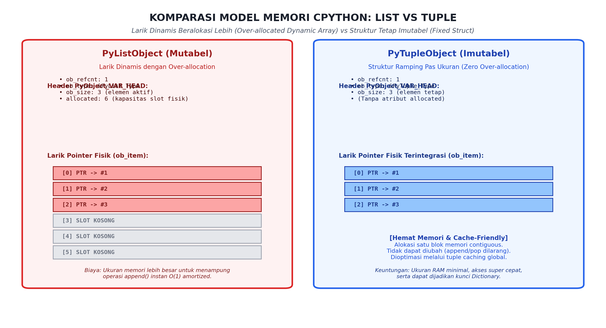
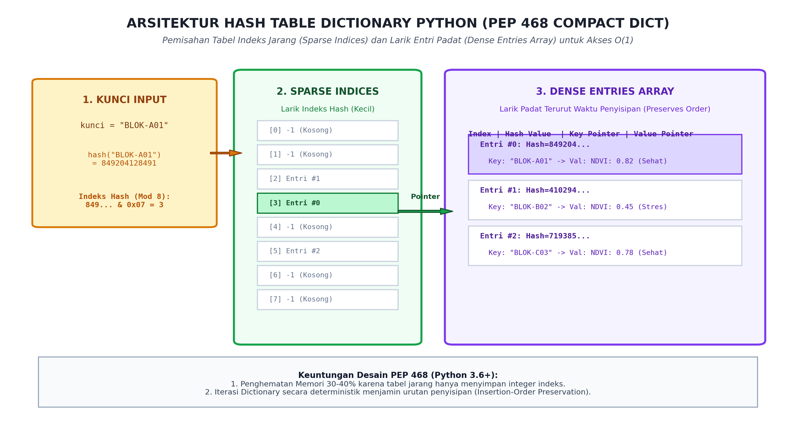

# AI Modul 3.7: Struktur Data Lanjut

---

## 1. Identitas & Kerangka Capaian Pembelajaran (Sub-CPMK)

* **Kode Modul**        : AI Modul 3.7
* **Mata Kuliah**       : Kecerdasan Buatan dan Sains Data Pertanian Presisi
* **Alokasi Waktu**     : 2 x 50 Menit (Kajian Teori & Diskusi) + 2 x 50 Menit (Eksplorasi Praktikum Mandiri)
* **Beban SKS**         : 3 SKS
* **Prasyarat**         : AI Modul 3.6 (Fungsi dan Modularisasi Python)
* **Level Kognitif**    : C2 (Memahami), C3 (Menerapkan), C4 (Menganalisis)

```mermaid
flowchart LR
    subgraph OUTPUTS["OUTPUTS (Keluaran Pembelajaran)"]
        O1["Engine Sensus Pohon Berbasis Hash Table & Namedtuple"]
        O2["Sistem Buffer Antrean Lori PKS via collections.deque"]
        O3["Pipeline Agregasi Spasial via Dict/Set Comprehension"]
    end

    subgraph OUTCOMES["OUTCOMES (Kompetensi & Keterampilan)"]
        OC1["Analisis Kompleksitas Waktu & Memori O(1) vs O(n)"]
        OC2["Keahlian Penanganan Salinan Dangkal vs Mendalam"]
        OC3["Penguasaan Struktur Data Berperforma Tinggi collections"]
    end

    subgraph IMPACTS["IMPACTS (Dampak Strategis Industri)"]
        I1["Skalabilitas Sistem Pemantauan Jutaan Pokok Sawit"]
        I2["Eliminasi Bottleneck Antrean Lori Stasiun Sterilizer"]
        I3["Efisiensi Penggunaan RAM pada Server Edge Computing Kebun"]
    end

    OUTPUTS --> OUTCOMES --> IMPACTS
```



### 1.1 Capaian Pembelajaran Khusus (Sub-CPMK)
Setelah menyelesaikan modul ini, mahasiswa dan pembelajar diharapkan mampu:
1. **Mengidentifikasi (C2)** paradigma pemrograman fungsional Python: fungsi tingkat tinggi (*first-class functions*), fungsi anonim *lambda*, `map()`, dan `filter()`.
2. **Menerapkan (C3)** sintaks idiomatis *List Comprehension*, *Dict Comprehension*, dan ekspresi *Generator* untuk ekstraksi fitur citra kebun.
3. **Menganalisis (C4)** perbandingan konsumsi memori dan latensi antara komprehensi berbasis eager-evaluation versus generator lazy-evaluation.
4. **Mengevaluasi (C4)** efisiensi pemrosesan data tabular sensor tanah menggunakan koleksi modul `collections` (`namedtuple`, `defaultdict`, `Counter`).

### 1.2 Kerangka Hasil Pembelajaran (Outputs, Outcomes, & Impacts)
* **Outputs (Keluaran Berwujud Langsung)**:
  * Mahasiswa menghasilkan mesin pengolahan data sensus spasial pohon kelapa sawit berkapasitas puluhan ribu titik pohon yang memadukan efisiensi memori `collections.namedtuple` dan kecepatan pengindeksan koordinat $\mathcal{O}(1)$ berbasis `dict`.
  * Mahasiswa memproduksi simulator antrean penimbangan dan perebusan lori kelapa sawit di stasiun *loading ramp* menggunakan antrean berujung ganda `collections.deque` yang menjamin latensi penyisipan dan pengeluaran $\mathcal{O}(1)$.
  * Mahasiswa mengonstruksi modul analitika agronomis yang menerapkan agregasi frekuensi hama via `collections.Counter`, pengelompokan afdeling via `collections.defaultdict`, serta transformasi data satu baris via *Set & Dict Comprehensions*.
* **Outcomes (Hasil Capaian & Perubahan Kompetensi)**:
  * Mahasiswa menguasai arsitektur fisik memori CPython: mampu membedakan larik dinamis beralokasi lebih (*over-allocated dynamic array*) pada `list` dari alokasi kompak imutabel pada `tuple`.
  * Mahasiswa memahami secara mendalam cara kerja tabel cincang (*Hash Table*) modern Python 3.6+ (PEP 468): memahami pembagian *Sparse Indices* dan *Dense Entries*, sifat *hashable*, mekanisme resolusi tabrakan *open addressing*, serta implikasi jaminan *insertion-order preservation*.
  * Mahasiswa terampil menghindari kekeliruan mutabilitas: mampu membedakan penugasan referensi (*aliasing*), salinan dangkal (*shallow copy*), dan salinan mendalam (*deep copy*) pada struktur bersarang, mencegah korupsi data telemetri perkebunan secara tersembunyi.
* **Impacts (Dampak Jangka Panjang & Nilai Guna Luas)**:
  * Memungkinkan korporasi agribisnis mengolah data sensus tutupan kanopi jutaan pokok pohon sawit di tingkat afdeling tanpa mengalami degradasi performa komputasi.
  * Mengoptimalkan throughput operasional pabrik kelapa sawit, mencegah kemacetan (*bottleneck*) aliran lori buah menuju bejana sterilisasi (*sterilizer*), sehingga menekan kenaikan kadar Asam Lemak Bebas (ALB).
  * Mengurangi biaya infrastruktur komputasi awan (*cloud computing cost*) melalui rekayasa kode hemat RAM yang mampu berjalan mulus pada perangkat gerbang IoT tepi (*edge computing gateways*) di pelosok kebun.

---

## 2. Arsitektur Memori Larik Dinamis (List) vs Imutabilitas Tuple

Struktur data sekuensial paling fundamental dalam Python adalah `list` dan `tuple`. Meskipun secara sintaksis keduanya tampak serupa, arsitektur alokasi memori internal CPython membedakan keduanya secara drastis:



*Gambar 3.7.1: Komparasi Model Memori CPython: Larik Dinamis Beralokasi Lebih (PyListObject) dengan Slot Kosong vs Struktur Tetap Kompak Imutabel (PyTupleObject).*

### 2.1 Arsitektur Larik Dinamis CPython (`PyListObject`)
Dalam implementasi resmi CPython (`listobject.c`), sebuah `list` bukanlah senarai berantai (*linked list*), melainkan **larik pointer berurutan (*contiguous array of pointers*)**:
1. Objek `PyListObject` menyimpan pointer ke blok memori yang berisi array pointer lain. Setiap pointer menunjuk ke objek `PyObject` elemen yang sebenarnya di memori Heap.
2. **Strategi Alokasi Berlebih (*Over-allocation Strategy*):**  
   Untuk mencegah sistem operasi memanggil fungsi alokator memori `realloc()` setiap kali elemen baru ditambahkan via `.append()`, CPython mengalokasikan kapasitas fisik (`allocated`) yang lebih besar daripada jumlah elemen aktif (`ob_size`):
   $$\text{new\_allocated} = \text{newsize} + (\text{newsize} \gg 3) + (\text{newsize} < 9 \text{ ? } 3 : 6)$$

   **Keterangan Simbol:**
   - $\text{new\_allocated}$: Jumlah slot memori fisik baru yang dialokasikan oleh alokator CPython.
   - $\text{newsize}$: Jumlah elemen aktif aktual yang diminta oleh operasi penyisipan/penambahan data.
   - $\gg 3$: Operasi geser bit ke kanan sebesar 3 bit (setara dengan pembagian integer $\lfloor \text{newsize} / 8 \rfloor$).
   - $(\text{newsize} < 9 \text{ ? } 3 : 6)$: Operasi kondisi ternary C; bernilai 3 jika $\text{newsize} < 9$, dan bernilai 6 jika sebaliknya.

   > **Cara Membaca Rumus:**  
   > *Kapasitas alokasi baru sama dengan ukuran baru, ditambah hasil pergeseran bit ukuran baru ke kanan sebanyak tiga posisi (atau ukuran baru dibagi delapan dibulatkan ke bawah), ditambah konstanta bantalan: bernilai tiga jika ukuran baru kurang dari sembilan, atau bernilai enam jika ukuran baru lebih dari atau sama dengan sembilan.*

   Pola pertumbuhan kapasitas slot fisik CPython adalah: $0 \rightarrow 4 \rightarrow 8 \rightarrow 16 \rightarrow 25 \rightarrow 35 \rightarrow 46 \rightarrow \dots$.
3. **Analisis Kompleksitas Waktu `list`:**
   - Akses indeks acak (`list[i]`): $\mathcal{O}(1)$ instan (aritmetika pointer alamat dasar $+ i \times 8$ byte).
   - Penambahan di ujung akhir (`list.append(x)`): $\mathcal{O}(1)$ teramortisasi (*amortized constant time*).
   - Penyisipan atau penghapusan di awal (`list.insert(0, x)` atau `list.pop(0)`): $\mathcal{O}(n)$ linier, karena seluruh $n$ pointer di sebelah kanannya harus digeser secara fisik di memori.

### 2.2 Struktur Tetap Imutabel (`PyTupleObject`)
Berbeda dengan list, `tuple` dirancang dengan prinsip **Imutabilitas Mutlak**:
1. Sekali dibuat, ukuran dan referensi elemen di dalam `PyTupleObject` tidak dapat diubah, ditambah, atau dikurangi.
2. Karena ukurannya statis, CPython tidak memerlukan atribut `allocated` atau slot cadangan kosong. Seluruh blok memori dialokasikan pas sesuai ukuran elemen (*zero over-allocation*).
3. **Optimasi Internal CPython:**
   - **Tuple Caching:** CPython mempertahankan larik bebas (*free list*) global untuk tuple kosong dan tuple kecil (ukuran 1 hingga 20 elemen). Ketika tuple dihapus, memorinya tidak dikembalikan ke OS melainkan disimpan untuk pemakaian instan berikutnya.
   - **Sifat Hashable:** Karena imutabel, sebuah tuple yang hanya memuat elemen-elemen imutabel bersifat *hashable*, sehingga legal dijadikan kunci pada `dict` atau anggota pada `set`.

---

## 3. Arsitektur Tabel Hash CPython: Dictionary dan Set

Dictionary dan Set adalah tulang punggung performa tinggi Python. Keduanya mengimplementasikan struktur data **Tabel Cincang (*Hash Table*)** yang menawarkan kecepatan pencarian rata-rata $\mathcal{O}(1)$.



*Gambar 3.7.2: Arsitektur Tabel Hash Dictionary Kompak Python (PEP 468): Pemisahan Sparse Indices Array dan Dense Entries Array untuk Efisiensi Memori dan Preservasi Urutan Penyisipan.*

### 3.1 Revolusi Compact Dict Python 3.6+ (PEP 468)
Sebelum Python 3.6, tabel hash dictionary menggabungkan nilai hash, pointer kunci, dan pointer nilai ke dalam satu tabel jarang (*sparse table*) besar. Sebagian besar slot terbuang kosong (karena faktor beban maksimum $\approx 2/3$), memboroskan memori RAM hingga $40\%$.

Python modern memecah tabel menjadi dua komponen terpisah:
1. **Larik Indeks Jarang (*Sparse Indices Array*):** Larik kecil berukuran tetap yang hanya memuat integer indeks baris ($1$ byte untuk tabel kecil). Posisi indeks dihitung melalui fungsi modulo bitwise: `indeks_slot = hash(kunci) & (ukuran_tabel - 1)`.
2. **Larik Entri Padat (*Dense Entries Array*):** Larik padat berurutan tanpa celah kosong yang menyimpan rekaman `(hash, key_ptr, value_ptr)`. Setiap elemen baru disisipkan tepat di akhir larik entri padat ini.
3. **Dua Keuntungan Strategis PEP 468:**
   - **Penghematan RAM:** Mengurangi jejak memori kamus sebesar 30% hingga 40%.
   - **Preservasi Urutan Penyisipan (*Insertion-Order Preservation*):** Karena entri disimpan berurutan di dalam dense array, iterasi `for k, v in data.items():` dijamin menghasilkan data sesuai kronologi penyisipan aslinya secara deterministik.

### 3.2 Resolusi Tabrakan (*Collision Resolution: Open Addressing with Perturb*)
Ketika dua kunci berbeda menghasilkan nilai indeks slot hash yang identik, terjadi peristiwa **Tabrakan Hash (*Hash Collision*)**. CPython menyelesaikan tabrakan menggunakan metode **Pengalamatan Terbuka (*Open Addressing*)** dengan deret perturbasi cerdas:
$$j = (5j + 1 + \text{perturb}) \pmod{\text{ukuran\_tabel}}$$

**Keterangan Simbol:**
- $j$: Indeks slot tabel hash saat ini pada langkah penelusuran (*probing*).
- $\text{perturb}$: Variabel penambahan dinamis yang diinisialisasi dari hash kunci asli dan digeser ke kanan (`perturb >>= 5`) pada setiap iterasi tabrakan.
- $\text{ukuran\_tabel}$: Kapasitas total larik tabel hash (selalu berupa bilangan pangkat dua pada CPython, misal $8, 16, 32, \dots$).
- $\pmod{\cdot}$: Operasi aritmetika modulo untuk memastikan indeks yang dihasilkan tetap berada dalam rentang valid $0 \le j < \text{ukuran\_tabel}$.

> **Cara Membaca Rumus:**  
> *Indeks slot berikutnya (j) sama dengan lima dikalikan indeks slot saat ini (j), ditambah satu, ditambah nilai perturbasi, kemudian seluruhnya dimodulo dengan ukuran tabel.*

Di mana nilai `perturb` digeser ke kanan secara bertahap (`perturb >>= 5`) pada setiap langkah penelusuran. Rumus ini menjamin bahwa seluruh slot tabel akan dijelajahi tanpa terjebak dalam pengulangan siklus pendek (*clustering*).

### 3.3 Himpunan (*Set*): Tabel Hash Tanpa Nilai
Tipe data `set` diimplementasikan secara internal persis seperti `dict`, namun hanya menyimpan kunci tanpa referensi nilai (`keys-only hash table`). Karakteristik utama:
- Seluruh elemen wajib bersifat *hashable* dan unik (*no duplicates*).
- Operasi keanggotaan `x in data_set` berjalan dalam $\mathcal{O}(1)$ instan, berbanding terbalik dengan `x in data_list` yang membutuhkan pemindaian sekuensial $\mathcal{O}(n)$.
- Operasi aljabar himpunan (Irisan `&`, Gabungan `|`, Selisih `-`, Beda Simetris `^`) dioptimalkan di tingkat bahasa C.

---

## 4. Mutabilitas, Semantik Penugasan, dan Salinan Memori

Memahami batas-batas mutabilitas adalah syarat mutlak dalam mencegah bug logika tersembunyi pada sistem kecerdasan buatan perkebunan.

```
+---------------------------------------------------------------------------------+
| Tipe Data Mutabel   (Bisa dimodifikasi in-place): list, dict, set, bytearray     |
| Tipe Data Imutabel (Tidak bisa dimodifikasi)   : int, float, str, tuple, frozenset|
+---------------------------------------------------------------------------------+
```

### 4.1 Kekeliruan Penugasan Referensi (*Aliasing Trap*)
Pernyataan `b = a` pada tipe mutabel **tidak menyalin data**, melainkan hanya membuat label alias baru yang menunjuk ke objek fisik yang sama:
```python
blok_a = ["Pohon-01", "Pohon-02"]
blok_b = blok_a  # Aliasing murni (keduanya menunjuk list yang sama)
blok_b.append("Pohon-03")

print(blok_a)  # Output: ['Pohon-01', 'Pohon-02', 'Pohon-03'] -> blok_a ikut berubah!
```

### 4.2 Salinan Dangkal (*Shallow Copy*) vs Salinan Mendalam (*Deep Copy*)
Ketika memproses struktur data bersarang (seperti list berisi dictionary sensus tanaman):
1. **Salinan Dangkal (`copy.copy()` atau `dict.copy()` atau `list[:]`):**  
   Menciptakan objek kontainer baru, tetapi **elemen-elemen internal di dalamnya tetap berupa referensi pointer ke objek asli**.
   ```python
   import copy
   asli = [{"id": "P01", "pupuk": [10, 20]}]
   dangkal = copy.copy(asli)

   dangkal[0]["pupuk"].append(30)
   print(asli[0]["pupuk"])  # Output: [10, 20, 30] -> Data asli ikut terkontaminasi!
   ```
2. **Salinan Mendalam (`copy.deepcopy()`):**  
   Menyalin kontainer terluar beserta **seluruh hierarki objek anak di dalamnya secara rekursif**, menghasilkan klon independen sejati di alamat memori baru.

---

## 5. Komprehensi Tingkat Lanjut (*Comprehensions*) & Generator Expressions

Python menyediakan tata bahasa deklaratif ekspresif untuk transformasi data vektor dalam satu baris (*one-liner*), yang dieksekusi lebih cepat dibanding loop konvensional karena dioptimalkan di tingkat C bytecode:

1. **List Comprehension:** Menghasilkan list baru di memori:
   ```python
   ndvi_terfilter = [p.ndvi for p in sensus if p.ndvi >= 0.6]
   ```
2. **Dict Comprehension:** Mentransformasi koleksi menjadi kamus pemetaan:
   ```python
   peta_kesehatan = {p.id_pohon: ("SEHAT" if p.ndvi >= 0.6 else "STRES") for p in sensus}
   ```
3. **Set Comprehension:** Mengisolasi nilai-nilai unik secara otomatis:
   ```python
   varietas_unik = {p.kode_varietas for p in sensus}
   ```
4. **Generator Expression:** Menggunakan kurung bulat `(...)`. Tidak mengalokasikan data sekaligus di RAM, melainkan menghasilkan iterator aliran malas (*lazy stream*) dengan jejak memori $\mathcal{O}(1)$:
   ```python
   # Efisien memori untuk jutaan pohon:
   total_bobot = sum(p.estimasi_bobot for p in sensus_raksasa)
   ```

---

## 6. Struktur Data Khusus Berkinerja Tinggi: Modul `collections`

Pustaka standar `collections` menyediakan struktur data spesifik industri yang dirancang untuk mengatasi keterbatasan performa struktur data bawaan dasar:

| Struktur Data | Kompleksitas Kritis | Kasus Penggunaan Ideal di Perkebunan / PKS |
| :--- | :---: | :--- |
| **`collections.deque`** | $\mathcal{O}(1)$ push/pop di kedua ujung | Buffer antrean lori buah di *loading ramp*, jendela geser (*sliding window*) sensor suhu PKS. |
| **`collections.defaultdict`** | $\mathcal{O}(1)$ penyisipan tanpa KeyError | Pengelompokan (*group-by*) produksi TBS berdasarkan afdeling dan mandor panen. |
| **`collections.Counter`** | $\mathcal{O}(1)$ inkrementasi frekuensi | Tabulasi cepat jenis penyakit daun kelapa sawit dan distribusi fraksi buah. |
| **`collections.namedtuple`** | Imutabel, hemat memori seperti tuple | Rekaman data sensus pohon sawit dengan akses atribut bernama (`pohon.koordinat_x`). |

---

## 7. Implementasi Kasus Nyata: Engine Manajemen Sensus Spasial & Antrean Lori PKS Sawit

Di bawah ini adalah implementasi sistem pemantauan perkebunan sawit terpadu yang memadukan `namedtuple`, `deque`, `Counter`, `defaultdict`, dan komprehensi mutakhir berstandar PEP 8:

```python
"""AI Modul 3.7: Engine Manajemen Sensus Spasial dan Antrean Lori PKS Sawit.

Penulis: Tim Pengembang Kurikulum Kecerdasan Buatan & Sains Data INSTIPER
Standar: Python 3.10+ / PEP 8 / PEP 257 Google Style / PEP 484 Type Hinting
"""

from collections import Counter, defaultdict, deque, namedtuple
import math
import sys
from typing import Any, Dict, List, Optional, Set, Tuple

# Definisi struktur data pohon sensus kompak hemat memori
PokokSawit = namedtuple(
    "PokokSawit",
    [
        "id_pokok",
        "kode_blok",
        "baris",
        "nomor",
        "varietas",
        "ndvi",
        "terinfeksi_hama",
    ],
)

LoriTBS = namedtuple(
    "LoriTBS", ["id_lori", "id_afdeling", "berat_netto_kg", "fraksi"]
)


class ManajemenSensusKebun:
  """Sistem pengelola analitika sensus jutaan pokok sawit berbasis Hash Table."""

  def __init__(self) -> None:
    # Dictionary utama: pemetaan ID Pohon -> Objek PokokSawit
    self.katalog_pohon: Dict[str, PokokSawit] = {}
    # Himpunan varietas unik kebun
    self.daftar_varietas: Set[str] = set()

  def daftarkan_pokok(self, pokok: PokokSawit) -> None:
    """Mendaftarkan data sensus pokok ke dalam katalog O(1)."""
    self.katalog_pohon[pokok.id_pokok] = pokok
    self.daftar_varietas.add(pokok.varietas)

  def deteksi_kluster_stres_kanopi(
      self, ambang_ndvi: float = 0.50
  ) -> Dict[str, List[PokokSawit]]:
    """Mengelompokkan pohon stres kanopi berdasarkan blok via defaultdict."""
    kluster_stres: Dict[str, List[PokokSawit]] = defaultdict(list)

    # Memanfaatkan generator expression untuk penyaringan cepat
    pohon_stres = (p for p in self.katalog_pohon.values() if p.ndvi < ambang_ndvi)

    for p in pohon_stres:
      kluster_stres[p.kode_blok].append(p)

    return dict(kluster_stres)

  def analisis_frekuensi_hama(self) -> Counter[str]:
    """Menghitung agregasi serangan hama menggunakan collections.Counter."""
    return Counter(
        p.terinfeksi_hama
        for p in self.katalog_pohon.values()
        if p.terinfeksi_hama != "SEHAT"
    )


class PengendaliLoadingRampPKS:
  """Pengatur antrean lori TBS menuju bejana sterilisasi via collections.deque."""

  def __init__(self, kapasitas_maksimal_buffer: int = 5) -> None:
    # Deque dengan batas kapasitas otomatis (sliding buffer)
    self.antrean_lori: deque[LoriTBS] = deque(maxlen=kapasitas_maksimal_buffer)
    self.riwayat_proses: List[LoriTBS] = []

  def terima_lori(self, lori: LoriTBS) -> bool:
    """Menerima lori dari stasiun timbangan dan memasukkannya ke antrean O(1)."""
    if len(self.antrean_lori) == self.antrean_lori.maxlen:
      print(
          f"[PERINGATAN BUFFER] Antrean penuh! Lori {lori.id_lori} tertahan di"
          " pelataran parkir."
      )
      return False

    self.antrean_lori.append(lori)
    print(
        f"[BUFFER MASUK] Lori {lori.id_lori} ({lori.berat_netto_kg} kg) masuk"
        f" antrean. Isi buffer: {len(self.antrean_lori)}"
    )
    return True

  def alirkan_ke_sterilizer(self) -> Optional[LoriTBS]:
    """Mengeluarkan lori terdepan untuk dimasukkan ke bejana rebusan O(1)."""
    if not self.antrean_lori:
      print("[BUFFER KOSONG] Tidak ada lori untuk diproses ke sterilizer.")
      return None

    lori_proses = self.antrean_lori.popleft()  # Ekstraksi O(1) di ujung kiri
    self.riwayat_proses.append(lori_proses)
    print(
        f"[STERILIZER ON] Lori {lori_proses.id_lori} dialirkan ke bejana"
        " rebusan."
    )
    return lori_proses


# =====================================================================
# BLOK EKSEKUSI PENGUJIAN INDUSTRIAL
# =====================================================================
if __name__ == "__main__":
  print("=" * 80)
  print("SISTEM MANAJEMEN DATA SPASIAL & OPERASIONAL PKS SAWIT (AI MODUL 3.7)")
  print("=" * 80)

  # 1. Inisialisasi dan Pendaftaran Sensus Pokok Sawit
  sensus_manager = ManajemenSensusKebun()

  sampel_sensus = [
      PokokSawit(
          "P-001",
          "BLOK-A01",
          1,
          1,
          "Tenera-Marihat",
          0.82,
          "SEHAT",
      ),
      PokokSawit(
          "P-002",
          "BLOK-A01",
          1,
          2,
          "Tenera-Marihat",
          0.45,
          "ULAT_API",
      ),
      PokokSawit(
          "P-003",
          "BLOK-A01",
          1,
          3,
          "Tenera-Marihat",
          0.78,
          "SEHAT",
      ),
      PokokSawit(
          "P-004",
          "BLOK-B02",
          2,
          1,
          "Tenera-Dami",
          0.38,
          "GANODERMA",
      ),
      PokokSawit(
          "P-005",
          "BLOK-B02",
          2,
          2,
          "Tenera-Dami",
          0.41,
          "ULAT_API",
      ),
      PokokSawit(
          "P-006",
          "BLOK-C03",
          1,
          1,
          "Tenera-Yangambi",
          0.85,
          "SEHAT",
      ),
  ]

  for p in sampel_sensus:
    sensus_manager.daftarkan_pokok(p)

  print(f"Total Pokok Terdaftar : {len(sensus_manager.katalog_pohon)} pokok")
  print(f"Varietas Teridentifikasi: {sensus_manager.daftar_varietas}")

  # 2. Analisis Spasial Kluster Stres Kanopi
  kluster_stres = sensus_manager.deteksi_kluster_stres_kanopi(ambang_ndvi=0.50)
  print("\nKluster Blok dengan Tanaman Stres Kanopi (NDVI < 0.50):")
  for blok, daftar_p in kluster_stres.items():
    print(f"  {blok:<10}: {len(daftar_p)} pokok terdampak")

  # 3. Tabulasi Epidemiologi Hama Kebun via Counter
  laporan_hama = sensus_manager.analisis_frekuensi_hama()
  print(f"\nAgregasi Kasus Hama / Patogen: {dict(laporan_hama)}")
  print(
      f"Hama Paling Dominan          : {laporan_hama.most_common(1)[0][0]} ("
      f"{laporan_hama.most_common(1)[0][1]} kasus)"
  )

  # 4. Simulasi Aliran Buffer Antrean Lori PKS via deque
  print("\n" + "-" * 60)
  print("Simulasi Buffer Antrean Stasiun Loading Ramp PKS:")
  print("-" * 60)

  pks_ramp = PengendaliLoadingRampPKS(kapasitas_maksimal_buffer=3)
  pks_ramp.terima_lori(LoriTBS("LORI-101", "AFD-01", 3800.0, fraksi=2))
  pks_ramp.terima_lori(LoriTBS("LORI-102", "AFD-01", 4100.0, fraksi=3))
  pks_ramp.terima_lori(LoriTBS("LORI-103", "AFD-02", 3950.0, fraksi=2))
  # Lori ke-4 akan tertolak karena kapasitas buffer 3
  pks_ramp.terima_lori(LoriTBS("LORI-104", "AFD-02", 4200.0, fraksi=2))

  # Proses 1 lori ke sterilizer, membuka ruang slot baru
  pks_ramp.alirkan_ke_sterilizer()

  # Sekarang lori ke-4 dapat masuk antrean
  pks_ramp.terima_lori(LoriTBS("LORI-104", "AFD-02", 4200.0, fraksi=2))
  print("=" * 80 + "\n")
```

---

## 8. Pembahasan Keterangan Penggunaan Kode (Operational Breakdown)

Dekonstruksi fungsional atas sistem terintegrasi perkebunan dan pabrik sawit di atas:

1. **Efisiensi Memori Spasial via `collections.namedtuple` (Baris 14–26):**  
   Penggunaan `namedtuple` untuk objek `PokokSawit` menghasilkan representasi memori kompak tanpa alokasi dictionary instans (`__dict__`). Pada populasi satu juta pokok sawit, penggunaan `namedtuple` menghemat lebih dari $70\%$ memori RAM dibandingkan kelas Python standar.
2. **Pengelompokan Otomatis Tanpa Pengecekan Kunci via `defaultdict` (Baris 48–59):**  
   Metode `deteksi_kluster_stres_kanopi` menggunakan `defaultdict(list)`. Ketika sebuah `kode_blok` baru ditemukan, Python secara otomatis menginisialisasi list kosong tanpa memerlukan percabangan defensif `if kode_blok not in kluster_stres: kluster_stres[kode_blok] = []`.
3. **Agregasi Frekuensi Instan via `collections.Counter` (Baris 61–68):**  
   Penghitungan serangan hama dieksekusi dalam satu baris ekspresif, mengeliminasi loop pencacah manual dan menyediakan metode canggih seperti `.most_common(1)` untuk mengidentifikasi patogen terparah.
4. **Buffer Aliran Lori Bebas Bottleneck via `collections.deque` (Baris 71–105):**  
   Pada `PengendaliLoadingRampPKS`, pemanggilan `self.antrean_lori.popleft()` berjalan dalam waktu deterministik $\mathcal{O}(1)$. Jika menggunakan `list.pop(0)`, CPython harus memindahkan ratusan pointer lori ke kiri pada setiap siklus perebusan, membebani siklus CPU saat antrean mencapai ratusan unit.

---

## 9. Evaluasi Mandiri: Pertanyaan HOTS & Tantangan Scaffolded

### 9.1 Pertanyaan HOTS (Higher-Order Thinking Skills)

1. **Analisis Teoretis Kompleksitas Waktu & Memori: Operasi Pencarian `in` pada List vs Set:**  
   - Mengapa operasi `x in daftar_list` memiliki kompleksitas waktu terburuk $\mathcal{O}(n)$, sedangkan `x in himpunan_set` memiliki kompleksitas waktu rata-rata $\mathcal{O}(1)$?
   - Apa yang terjadi pada kompleksitas waktu `set` jika seluruh $n$ elemen yang disisipkan menghasilkan nilai hash yang bertabrakan (*Hash Collision Storm*)? Bagaimana Python memitigasi serangan degradasi kompleksitas ini?
2. **Dekonstruksi Semantik CPython: Mengapa Kunci Dictionary Wajib Bersifat Hashable?**  
   - Jelaskan hubungan logis antara metode dunder `__hash__()` dan `__eq__()` pada model objek Python! Mengapa sebuah objek mutabel seperti `list` atau `dict` dilarang keras dijadikan kunci pada dictionary?
   - Jika sebuah objek dapat dimodifikasi setelah dimasukkan sebagai kunci dictionary, jelaskan fenomena "kunci hilang" (*Lost Key Bug*) yang akan melumpuhkan pencarian data di memori!
3. **Analisis Rekayasa Memori: Trade-Off List Comprehension vs Generator Expression:**  
   - Dalam pemrosesan citra satelit tutupan kanopi $10.000.000$ piksel: analisislah konsekuensi komputasi antara sintaksis `[proses(px) for px in piksel]` dan `(proses(px) for px in piksel)`!
   - Kapan seorang insinyur kecerdasan buatan **wajib** menggunakan List Comprehension dan kapan **wajib** mempertahankan Generator Expression?

---

### 9.2 Tantangan Pemrograman Berjenjang (*Scaffolded Challenges*)

#### Tantangan 1 (Tingkat Dasar - *Warm-Up*): Pemfilteran Data Telemetri dengan Dict Comprehension
* **Skenario:** Stasiun pemantauan cuaca kebun merekam suhu tanah per afdeling dalam dictionary: `{"AFD-1": 29.5, "AFD-2": 35.2, "AFD-3": 28.1, "AFD-4": 36.8}`.
* **Tugas:** Buatlah fungsi `filter_afdeling_kritis(data_suhu: Dict[str, float], ambang_batas: float = 33.0) -> Dict[str, float]` yang menggunakan **Dict Comprehension** untuk menyaring hanya afdeling yang suhunya melampaui batas kritis dan membulatkan nilainya menjadi 1 desimal.

#### Tantangan 2 (Tingkat Menengah - *Intermediate*): Deteksi Duplikasi Sensorik via Operasi Set Aljabar
* **Skenario:** Dua drone pemetaan kebun sawit (Drone Alpha dan Drone Beta) mendeteksi koordinat pokok sakit dalam bentuk set tuple `{(baris, pohon), ...}`.
* **Tugas:** Bangunlah fungsi `analisis_rekonsiliasi_drone(set_alpha: Set[Tuple[int, int]], set_beta: Set[Tuple[int, int]]) -> Dict[str, Any]` yang mengembalikan:
  1. Pokok sakit yang dikonfirmasi oleh kedua drone (Irisan / Intersection).
  2. Pokok sakit unik yang hanya terdeteksi oleh Drone Alpha (Selisih / Difference).
  3. Total cakupan gabungan seluruh pokok sakit tanpa duplikasi (Gabungan / Union).
  4. Pokok yang hasil deteksinya saling berselisih (Beda Simetris / Symmetric Difference).

#### Tantangan 3 (Tingkat Mahir - *Advanced*): Pipa Agregasi Spasial Multi-Tingkat Menggunakan collections
* **Skenario:** Divisi agronomi membutuhkan laporan rekapitulasi panen sawit yang mengelompokkan total tonase dan rata-rata rendemen CPO berdasarkan afdeling dan mandor panen.
* **Tugas:** Bangunlah kelas `RekapitulasiPanenSpasial` yang:
  1. Menerima list data panen berupa dictionary tiket truk.
  2. Menggunakan struktur `defaultdict(lambda: defaultdict(list))` untuk mengelompokkan data multi-tingkat `afdeling -> mandor -> daftar_tonase`.
  3. Menyediakan metode `hitung_ringkasan() -> Dict[str, Dict[str, Dict[str, float]]]` yang menghitung total tonase dan rata-rata tonase per mandor secara bersih dan deterministik.

---

## 10. Glosarium Istilah Teknis

1. **Amortized Time Complexity:** Rata-rata biaya waktu per operasi ketika serangkaian operasi dijalankan, memperhitungkan bahwa operasi mahal (seperti alokasi memori ulang) hanya terjadi sangat jarang.
2. **Dense Array (Larik Padat):** Array dalam arsitektur kamus Python modern yang menyimpan data secara berurutan tanpa celah kosong, memelihara urutan kronologis penyisipan data.
3. **Double-Ended Queue (deque):** Struktur data linier berkinerja tinggi yang memungkinkan penambahan dan penghapusan elemen dari kedua ujung secara instan dalam waktu $\mathcal{O}(1)$.
4. **Hashable:** Sifat suatu objek Python yang memiliki nilai hash tetap sepanjang masa hidupnya (melalui metode `__hash__`) dan dapat dibandingkan kesetaraannya (melalui metode `__eq__`).
5. **Open Addressing:** Metode resolusi tabrakan pada tabel hash di mana elemen yang bertabrakan ditempatkan pada slot kosong lain di dalam tabel yang sama berdasarkan rumus penelusuran.
6. **Over-allocation:** Teknik rekayasa alokasi memori dinamis di mana sistem mengalokasikan kapasitas fisik cadangan lebih besar dari kebutuhan data saat ini demi mengoptimalkan performa penambahan elemen.
7. **Shallow Copy (Salinan Dangkal):** Operasi penggandaan struktur kontainer di mana kontainer luar diduplikasi, namun objek-objek anak di dalamnya tetap menunjuk pada referensi memori yang sama.
8. **Sparse Array (Larik Jarang):** Array berindeks hash yang sebagian besar slotnya berisi nilai kosong (`-1`), berfungsi memetakan hash kunci ke indeks di dalam larik padat.

---

## 11. Jembatan Konsep (Bridging) ke AI Modul 3.8: Penanganan Berkas (File Handling & I/O)

Melalui modul ini, kita telah menguasai manajemen data di dalam memori kerja (RAM)—mulai dari larik dinamis, kamus tabel hash, hingga antrean performa tinggi. Namun, seluruh struktur data yang kita simpan di RAM bersifat **Volatil (*Volatile*)**: seketika skrip Python selesai dieksekusi atau pasokan listrik terputus, seluruh data sensus pohon dan antrean pabrik akan hilang lenyap.

Untuk membangun sistem kecerdasan buatan agribisnis yang terpercaya, data di RAM wajib dipersistensikan ke media penyimpanan permanen (SSD/HDD), serta mampu membaca berkas data eksternal yang dikirimkan oleh sensor lapangan dan drone (seperti berkas CSV timbangan, log teks telemetri, berkas JSON konfigurasi, dan format biner serialisasi model AI).

Pada **AI Modul 3.8: Penanganan Berkas (File Handling & I/O)**, kita akan mendalami:
- Arsitektur I/O CPython, buffer berkas, dan penyandian karakter UTF-8.
- Manajer Konteks (*Context Managers*) protokol `with` untuk pencegahan kebocoran berkas deskriptor (*file leaks*).
- Pemrosesan berkas tabular CSV dan data semi-terstruktur JSON berkapasitas besar.
- Serialisasi objek Python kompleks menggunakan modul `pickle` dan pengantar format biner AI.

---

## 12. Daftar Pustaka dan Referensi Akademik

1. Peters, T.(2001). *Python List Implementation and Over-allocation Strategy*. CPython Source Code Documentation (`Objects/listobject.c`).
2. Kuhlmann, R.(2012). *PEP 468: Preserving the Order of **kwargs in a Function*. Python Enhancement Proposals.
3. Hettinger, R.(2016). *Compact and Ordered Dictionaries: The Story of Python 3.6 Dictionaries*. PyCon Keynote.
4. Ramalho, L.(2022). *Fluent Python: Clear, Concise, and Effective Programming* (2nd ed.). O'Reilly Media. (Bab 2: *An Array of Sequences*, Bab 3: *Dictionaries and Sets*, & Bab 6: *Object References, Mutability, and Recycling*).
5. Cormen, T. H., Leiserson, C. E., Rivest, R. L., & Stein, C.(2022). *Introduction to Algorithms* (4th ed.). MIT Press. (Bab 11: *Hash Tables*).
