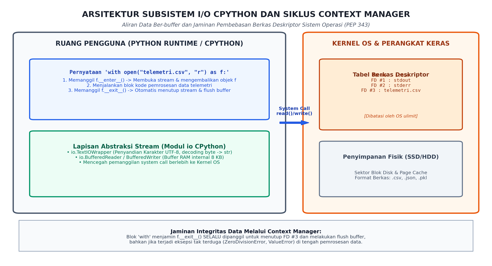

# AI Modul 3.8: Penanganan Berkas (File Handling & I/O)

---

## 1. Identitas & Kerangka Capaian Pembelajaran (Sub-CPMK)

* **Kode Modul**        : AI Modul 3.8
* **Mata Kuliah**       : Kecerdasan Buatan dan Sains Data Pertanian Presisi
* **Alokasi Waktu**     : 2 x 50 Menit (Kajian Teori & Diskusi) + 2 x 50 Menit (Eksplorasi Praktikum Mandiri)
* **Beban SKS**         : 3 SKS
* **Prasyarat**         : AI Modul 3.7 (Struktur Data Lanjut Python)
* **Level Kognitif**    : C2 (Memahami), C3 (Menerapkan), C4 (Menganalisis)

```mermaid
flowchart LR
    subgraph OUTPUTS["OUTPUTS (Keluaran Pembelajaran)"]
        O1["Pipeline Transaksi Log & CSV Telemetri Cuaca Streaming"]
        O2["Generator Batas Blok Spasial Agribisnis Format GeoJSON"]
        O3["Modul Persistensi Model Regresi Pupuk Berbasis Pickle"]
    end

    subgraph OUTCOMES["OUTCOMES (Kompetensi & Keterampilan)"]
        OC1["Penguasaan Protokol Context Manager __enter__ & __exit__"]
        OC2["Keahlian Pemrosesan Berkas Raksasa Memori Konstan O(1)"]
        OC3["Keterampilan Audit Keamanan Format Serialisasi AI"]
    end

    subgraph IMPACTS["IMPACTS (Dampak Strategis Industri)"]
        I1["Integritas Data Transaksi Penimbangan TBS Bebas Korupsi"]
        I2["Ketahanan Server AI IoT terhadap File Descriptor Exhaustion"]
        I3["Interoperabilitas Data Spasial Kebun Standar GIS Nasional"]
    end

    OUTPUTS --> OUTCOMES --> IMPACTS
```



### 1.1 Capaian Pembelajaran Khusus (Sub-CPMK)
Setelah menyelesaikan modul ini, mahasiswa dan pembelajar diharapkan mampu:
1. **Menguraikan (C2)** mekanisme *File I/O* pada sistem operasi, mode akses berkas (`r`, `w`, `a`, `b`), dan pengkodean teks (UTF-8 vs ASCII).
2. **Menerapkan (C3)** pengelolaan konteks (*Context Manager* / `with` statement) untuk menjamin penutupan berkas yang aman dari kebocoran memori.
3. **Menganalisis (C4)** pembacaan dan penulisan berkas data tabular terstruktur (CSV, TSV) dan pertukaran data semi-terstruktur (JSON) telemetri kebun.
4. **Mengevaluasi (C4)** teknik pemrosesan berkas berukuran gigabyte (*streaming chunk-by-chunk*) untuk mencegah kehabisan memori RAM (*Out-Of-Memory*).

### 1.2 Kerangka Hasil Pembelajaran (Outputs, Outcomes, & Impacts)
* **Outputs (Keluaran Berwujud Langsung)**:
  * Mahasiswa menghasilkan pipeline pemrosesan berkas telemetri cuaca perkebunan format tabular CSV berskala jutaan baris menggunakan metode pembacaan aliran malas (*lazy streaming iterator*) yang menjaga jejak memori tetap konstan $\mathcal{O}(1)$.
  * Mahasiswa memproduksi generator berkas hierarkis GeoJSON beranotasi tipe ketat untuk memetakan koordinat poligon batas blok kebun kelapa sawit dan metadata tutupan vegetasi kanopi.
  * Mahasiswa mengonstruksi modul persistensi biner untuk menyimpan dan memuat kembali objek model kalibrasi pupuk menggunakan modul `pickle`, lengkap dengan lapisan audit keamanan deserialisasi.
* **Outcomes (Hasil Capaian & Perubahan Kompetensi)**:
  * Mahasiswa menguasai arsitektur I/O CPython berlapis: mampu membedakan lapisan biner mentah (`FileIO`), lapisan buffer RAM (`BufferedReader`/`BufferedWriter`), dan lapisan penyandian teks (`TextIOWrapper`), serta memahami peran mutlak penyandian UTF-8.
  * Mahasiswa memahami protokol Manajer Konteks (*Context Manager Protocol* - PEP 343): memahami secara mendalam siklus hidup metode dunder `__enter__()` dan `__exit__()`, serta menjamin penutupan berkas deskriptor dan *flushing* buffer secara deterministik bahkan saat terjadi interupsi galat fatal.
  * Mahasiswa memiliki kesadaran kritis atas keamanan siber data AI: mampu mengevaluasi risiko eksekusi kode berbahaya jarak jauh (*Remote Code Execution / RCE*) pada pemuatan berkas biner `pickle` dan mampu memilih format serialisasi yang tepat berdasarkan kebutuhan interoperabilitas.
* **Impacts (Dampak Jangka Panjang & Nilai Guna Luas)**:
  * Mencegah kegagalan sistemik (*system crash*) pada server pusat PKS akibat kehabisan kuota berkas deskriptor (*file descriptor exhaustion*), menjamin keandalan pencatatan timbangan buah sawit 24/7.
  * Menjamin transparansi dan validitas hukum audit keuangan transaksi TBS melalui pencatatan log transaksi yang kebal terhadap kehilangan data akibat kegagalan listrik (*crash-resilient transaction logging*).
  * Mempercepat integrasi data spasial dan analitika kanopi drone INSTIPER dengan sistem informasi geografis (SIG) korporasi perkebunan nasional dan kementerian pertanian.

---

## 2. Arsitektur Subsistem I/O CPython dan Manajer Konteks

Ketika fungsi bawaan `open()` dipanggil, Python tidak langsung berinteraksi dengan piringan fisik SSD/HDD secara mentah. CPython mengoperasikan arsitektur aliran bertingkat (*layered stream architecture*):



*Gambar 3.8.1: Arsitektur Subsistem I/O CPython: Aliran Data Melalui Lapisan TextIOWrapper, Buffer RAM 8 KB, System Call Kernel OS, dan Jaminan Penutupan File Descriptor via Context Manager.*

### 2.1 Tiga Lapisan Arsitektur I/O CPython (Modul `io`)
1. **Lapisan Biner Mentah (`io.FileIO`):**  
   Lapisan tingkat terendah yang berinteraksi langsung dengan kernel sistem operasi melalui pemanggilan sistem (*system calls*) `read()` dan `write()`. Mengirimkan dan menerima data dalam bentuk larik bita mentah (*raw bytes*).
2. **Lapisan Buffer Memori (`io.BufferedReader` / `io.BufferedWriter`):**  
   Lapisan penyangga perantara di RAM (berukuran default 8 KB / 8192 byte). Setiap kali program meminta karakter baru, CPython membaca satu blok besar bita dari disk ke buffer RAM. Ini mencegah CPU melakukan ratusan ribu *system calls* yang sangat mahal, meningkatkan kecepatan I/O hingga puluhan kali lipat.
3. **Lapisan Pembungkus Teks (`io.TextIOWrapper`):**  
   Lapisan konversi yang menerjemahkan deretan bita di buffer menjadi string karakter Python (`str`) menggunakan skema penyandian (*encoding*) tertentu, serta menangani translasi karakter akhir baris (*newline translation*: `\r\n` pada Windows menjadi `\n` standar).

> [!IMPORTANT]
> **Standar Mutlak Encoding:** Selalu nyatakan `encoding="utf-8"` secara eksplisit pada setiap pemanggilan `open()`. Mengabaikan parameter ini menyebabkan CPython menggunakan penyandian default sistem operasi (seperti `cp1252` pada Windows berbahasa Indonesia), yang akan memicu galat fatal `UnicodeDecodeError` saat berkas dibaca di server Linux atau cloud.

### 2.2 Bahaya Kebocoran Berkas Deskriptor (*File Descriptor Leaks*)
Setiap berkas yang dibuka oleh proses Python mengonsumsi satu slot **Berkas Deskriptor (*File Descriptor / FD*)** di tabel kernel sistem operasi. Sistem operasi membatasi jumlah maksimum berkas deskriptor yang dapat dibuka secara bersamaan oleh sebuah proses (biasanya 1024 pada Linux default atau 512 pada Windows C-runtime).

Jika pengembang membuka berkas tanpa menutupnya:
```python
# ANTI-POLA: Rawan kebocoran sumber daya!
f = open("telemetri_sensor.csv", "r", encoding="utf-8")
data = f.read()
# Jika baris di bawah memicu ZeroDivisionError, f.close() TIDAK AKAN PERNAH DIJALANKAN!
proses_kalkulasi(data)
f.close()
```
Dalam loop telemetri yang berjalan terus-menerus, kebocoran ini akan menghabiskan seluruh kuota berkas deskriptor sistem operasi, memicu kegagalan fatal: `OSError: [Errno 24] Too many open files`.

### 2.3 Protokol Manajer Konteks (*Context Manager Protocol* - PEP 343)
Solusi standar industri untuk menjamin keamanan sumber daya I/O adalah blok pernyataan **`with`**:
```python
with open("telemetri_sensor.csv", "r", encoding="utf-8") as f:
    data = f.read()
```
Secara mekanis, konstruksi `with` mengimplementasikan protokol dua metode dunder:
1. **`__enter__()`:** Dieksekusi sebelum blok kode di dalam `with` berjalan. Metode ini membuka stream, mengalokasikan buffer, dan mengembalikan objek berkas ke variabel setelah kata kunci `as`.
2. **`__exit__(exc_type, exc_val, exc_tb)`:** **Dijamin selalu dieksekusi**, baik blok kode selesai secara normal maupun terputus oleh eksepsi apa pun. Metode ini secara otomatis memanggil `f.flush()` (mendorong sisa buffer ke disk) dan `f.close()` (mengembalikan berkas deskriptor ke kernel OS).

---

## 3. Pemrosesan Berkas Teks Datar & Data Tabular CSV

### 3.1 Pola Pembacaan: `read()`, `readlines()`, vs Streaming `for line in f:`
Memahami cara memuat isi berkas ke RAM menentukan viabilitas sistem analitika kecerdasan buatan:

| Metode | Mekanisme Pembacaan | Kompleksitas Memori | Kelayakan untuk Data AI Skala Besar |
| :--- | :--- | :---: | :--- |
| **`f.read()`** | Membaca seluruh isi berkas ke dalam satu objek string tunggal. | $\mathcal{O}(n)$ RAM | **Sangat Berbahaya** jika ukuran berkas > RAM. |
| **`f.readlines()`** | Membaca seluruh baris dan memecahnya ke dalam `list[str]`. | $\mathcal{O}(n)$ RAM | **Berbahaya**: overhead PyObject pointer list tinggi. |
| **`for line in f:`** | **Generator Aliran Malas (*Lazy Streaming*)**: membaca satu baris saat diminta. | **$\mathcal{O}(1)$ RAM** | **Sangat Dianjurkan (Standar Industri)**. |

```python
# Pola Streaming O(1) RAM: Mampu memproses berkas log 100 GB pada perangkat RAM 1 GB!
with open("log_timbangan_pks_raksasa.csv", "r", encoding="utf-8") as f:
    for baris in f:
        proses_baris_secara_instan(baris)
```

### 3.2 Modul Bawaan `csv`: DictReader dan DictWriter
Format *Comma-Separated Values* (CSV) adalah format de-facto pertukaran data tabular di sektor agribisnis. Hindari mem-parsing CSV menggunakan manipulasi string manual (`line.split(",")`) karena akan gagal total saat menghadapi koma di dalam teks bertanda kutip (`"Blok A, Zona 1"`).

Python menyediakan modul `csv` berperforma tinggi:
- **`csv.DictReader`:** Membaca setiap baris CSV langsung ke dalam bentuk dictionary, di mana kunci kamus diambil secara otomatis dari baris *header*.
- **`csv.DictWriter`:** Menulis baris kamus ke berkas CSV dengan pemetaan kolom yang ketat sesuai urutan `fieldnames`.

```python
import csv

# Menulis data sensus ke CSV secara aman
fieldnames = ["id_pokok", "kode_blok", "ndvi", "status"]
with open("sensus_kebun.csv", "w", newline="", encoding="utf-8") as f:
    writer = csv.DictWriter(f, fieldnames=fieldnames)
    writer.writeheader()
    writer.writerow({"id_pokok": "P-01", "kode_blok": "A01", "ndvi": 0.82, "status": "PRIMA"})
```
*Catatan:* Parameter `newline=""` wajib disertakan pada penulisan berkas CSV di Windows untuk mencegah modul `csv` menghasilkan baris kosong ganda (`\r\r\n`).

---

## 4. Serialisasi Data Terstruktur JSON dan Format Spasial GeoJSON

### 4.1 Modul Bawaan `json`: Stream vs String
*JavaScript Object Notation* (JSON) adalah standar global pertukaran data semi-terstruktur berbasis teks:
- **Operasi Aliran Berkas Langsung (*Stream-based*):**
  - **`json.dump(obj, berkas_handle, indent=2)`:** Melakukan serialisasi objek Python dan menuliskannya langsung ke berkas stream.
  - **`json.load(berkas_handle)`:** Membaca berkas stream dan merekonstruksinya menjadi objek Python.
- **Operasi String di Memori (*In-Memory String-based*):**
  - **`json.dumps(obj)`:** Mengonversi objek Python menjadi string teks JSON di RAM.
  - **`json.loads(string_json)`:** Mengonversi string teks JSON menjadi objek Python.

### 4.2 Pemetaan Tipe Data Python $\leftrightarrow$ JSON
| Tipe Data Python | Tipe Ekivalen JSON | Catatan Teknis |
| :---: | :---: | :--- |
| `dict` | `object` | Kunci JSON wajib berupa string. |
| `list`, `tuple` | `array` | Tuple otomatis dikonversi menjadi array JSON. |
| `str` | `string` | Teks terenkripsi UTF-8 dengan escape sequence. |
| `int`, `float` | `number` | Tidak ada pembedaan integral vs pecahan di JSON. |
| `True` / `False` | `true` / `false` | Ditulis dalam huruf kecil di JSON. |
| `None` | `null` | Representasi objek ketiadaan nilai. |

### 4.3 Format Spasial Perkebunan: GeoJSON (RFC 7946)
Dalam pemetaan digital perkebunan kelapa sawit, GeoJSON adalah dialek JSON khusus untuk merepresentasikan fitur geografis (seperti batas poligon afdeling atau titik koordinat pohon sawit):

```json
{
  "type": "FeatureCollection",
  "features": [
    {
      "type": "Feature",
      "geometry": {
        "type": "Polygon",
        "coordinates": [[[101.42, 0.53], [101.43, 0.53], [101.43, 0.52], [101.42, 0.52], [101.42, 0.53]]]
      },
      "properties": {
        "kode_blok": "BLOK-A01",
        "luas_hektar": 25.4,
        "varietas": "Tenera"
      }
    }
  ]
}
```

---

## 5. Serialisasi Objek Python Kompleks: Modul `pickle` & Audit Keamanan


*Gambar 3.8.2: Klasifikasi Format Serialisasi Data Kecerdasan Buatan: Komparasi Plain Text, Tabular CSV, Hirarki JSON, dan Serialisasi Biner Pickle Berdasarkan Portabilitas, Kecepatan, dan Keamanan.*

### 5.1 Hakikat Serialisasi Biner `pickle`
Format JSON hanya mampu menyimpan tipe data primitif bawaan. Bagaimana jika kita ingin menyimpan objek kelas kustom kecerdasan buatan, seperti model regresi kalibrasi pupuk yang memuat bobot matriks, intercept, dan metode prediksi?

Modul bawaan **`pickle`** mengonversi hierarki objek Python arbitrer apa pun menjadi aliran bita biner (*byte stream*) melalui mesin virtual biner (*Pickle Virtual Machine / PVM*):
```python
import pickle

# Serialisasi (Pickling): Objek Python -> Berkas Biner
with open("model_pupuk.pkl", "wb") as f:
    pickle.dump(model_kalibrasi, f, protocol=pickle.HIGHEST_PROTOCOL)

# Deserialisasi (Unpickling): Berkas Biner -> Objek Python
with open("model_pupuk.pkl", "rb") as f:
    model_terpulihkan = pickle.load(f)
```

### 5.2 Kerentanan Keamanan Kritis: Eksekusi Kode Jarak Jauh (*Remote Code Execution / RCE*)
> [!CAUTION]
> **BAHAYA KEAMANAN TINGKAT TINGGI:**  
> Modul `pickle` **TIDAK AMAN SECARA DESAIN (*inherently insecure*)**. Jangan pernah memuat (*unpickle*) berkas `.pkl` yang diterima dari jaringan publik atau sumber tak dikenal!

Proses *unpickling* dapat mengeksekusi kode Python arbitrer di sistem operasi target melalui metode dunder **`__reduce__()`**. Seorang penyerang dapat menyusupkan perintah jahat (seperti memformat hard disk atau mencuri data sensitif PKS):

```python
# Demonstrasi Muatan Berbahaya Pickle (Eksploitasi RCE)
class EksploitasiJahat:
    def __reduce__(self):
        import os
        # Perintah ini akan langsung dieksekusi oleh OS saat pickle.load() dipanggil!
        return (os.system, ("echo [BAHAYA] Server Teretas via Pickle Deserialization!",))
```
*Mitigasi Industri:* Untuk penyimpanan model kecerdasan buatan skala produksi, gunakan format biner modern yang aman dan bebas eksekusi kode seperti **ONNX (*Open Neural Network Exchange*)** atau **Safetensors**.

---

## 6. Implementasi Kasus Nyata: Pipeline Persistensi Terpadu Log Timbangan, Telemetri CSV, GeoJSON, dan Model AI PKS

Di bawah ini adalah sistem persistensi data pabrik dan perkebunan kelapa sawit terpadu yang memadukan logging teks transaksional, penulisan tabular CSV ber-header, ekspor spasial GeoJSON, dan serialisasi biner model regresi:

```python
"""AI Modul 3.8: Engine Persistensi Terpadu Pabrik dan Perkebunan Kelapa Sawit.

Penulis: Tim Pengembang Kurikulum Kecerdasan Buatan & Sains Data INSTIPER
Standar: Python 3.10+ / PEP 8 / PEP 257 Google Style / PEP 484 Type Hinting
"""

import csv
import json
import os
import pickle
import time
from typing import Any, Dict, List, Optional, Tuple


class ModelRegresiPupuk:
  """Model regresi linier sederhana untuk estimasi kebutuhan pupuk NPK."""

  def __init__(self, bobot_nitrogen: float, bias_intercept: float) -> None:
    self.bobot_n: float = bobot_nitrogen
    self.bias: float = bias_intercept
    self.tanggal_latih: str = time.strftime("%Y-%m-%d %H:%M:%S")

  def prediksi(self, defisit_klorofil: float) -> float:
    """Menghitung rekomendasi pupuk Urea (kg/pokok)."""
    return (self.bobot_n * defisit_klorofil) + self.bias


class EnginePersistensiPKS:
  """Manajer I/O terpadu pengelola berkas log, CSV, JSON, dan model biner."""

  def __init__(self, direktori_dasar: str = "data_pks") -> None:
    self.base_dir = direktori_dasar
    os.makedirs(self.base_dir, exist_ok=True)

  def catat_log_timbangan(
      self, id_truk: str, berat_timbang_kg: float, status: str
  ) -> str:
    """Mencatat transaksi timbangan lori ke berkas log teks (append mode)."""
    path_log = os.path.join(self.base_dir, "transaksi_timbangan.log")
    timestamp = time.strftime("%Y-%m-%d %H:%M:%S")
    baris_log = f"[{timestamp}] TRUK:{id_truk} | BERAT:{berat_timbang_kg:.1f} kg | STATUS:{status}\n"

    # Context Manager menjamin penutupan stream dan flush seketika
    with open(path_log, mode="a", encoding="utf-8") as f:
      f.write(baris_log)

    return path_log

  def ekspor_telemetri_csv(
      self, daftar_sensor: List[Dict[str, Any]], nama_berkas: str = "iklim.csv"
  ) -> str:
    """Mengekspor rekaman deret waktu sensor ke berkas tabular CSV."""
    if not daftar_sensor:
      raise ValueError("Daftar sensor tidak boleh kosong!")

    path_csv = os.path.join(self.base_dir, nama_berkas)
    fieldnames = list(daftar_sensor[0].keys())

    with open(path_csv, mode="w", newline="", encoding="utf-8") as f:
      writer = csv.DictWriter(f, fieldnames=fieldnames)
      writer.writeheader()
      writer.writerows(daftar_sensor)

    return path_csv

  def simpan_spasial_geojson(
      self, data_geojson: Dict[str, Any], nama_berkas: str = "kebun.geojson"
  ) -> str:
    """Menyimpan batas poligon blok afdeling ke berkas GeoJSON terformat."""
    path_geojson = os.path.join(self.base_dir, nama_berkas)

    with open(path_geojson, mode="w", encoding="utf-8") as f:
      json.dump(data_geojson, f, indent=2, ensure_ascii=False)

    return path_geojson

  def simpan_model_biner(
      self, model: ModelRegresiPupuk, nama_berkas: str = "model_pupuk.pkl"
  ) -> str:
    """Menyimpan objek model AI ke format biner pickle berkecepatan tinggi."""
    path_pickle = os.path.join(self.base_dir, nama_berkas)

    with open(path_pickle, mode="wb") as f:
      pickle.dump(model, f, protocol=pickle.HIGHEST_PROTOCOL)

    return path_pickle

  def muat_model_biner(
      self, nama_berkas: str = "model_pupuk.pkl"
  ) -> ModelRegresiPupuk:
    """Memulihkan objek model AI dari berkas serialisasi biner."""
    path_pickle = os.path.join(self.base_dir, nama_berkas)
    if not os.path.exists(path_pickle):
      raise FileNotFoundError(f"Berkas model tidak ditemukan: {path_pickle}")

    with open(path_pickle, mode="rb") as f:
      model: ModelRegresiPupuk = pickle.load(f)

    return model


# =====================================================================
# BLOK EKSEKUSI PENGUJIAN INDUSTRIAL
# =====================================================================
if __name__ == "__main__":
  print("=" * 80)
  print("SISTEM MANAJEMEN PERSISTENSI DATA PKS & PERKEBUNAN INSTIPER (AI MODUL 3.8)")
  print("=" * 80)

  engine = EnginePersistensiPKS(direktori_dasar="sandbox_pks")

  # 1. Pengujian Logging Transaksional Teks
  path_log = engine.catat_log_timbangan(
      "BK-8821-XX", 12450.0, "DITERIMA_BONGKAR"
  )
  path_log = engine.catat_log_timbangan("BM-1234-YY", 850.0, "DITOLAK_KOSONG")
  print(f"[OK] Berkas Log Transaksi berhasil dicatat di: {path_log}")

  # 2. Pengujian Ekspor Data Tabular CSV
  data_stasiun_cuaca = [
      {
          "stasiun_id": "WS-01",
          "suhu_c": 31.4,
          "kelembaban_pct": 78.5,
          "radiasi_wm2": 820.0,
      },
      {
          "stasiun_id": "WS-02",
          "suhu_c": 32.1,
          "kelembaban_pct": 74.0,
          "radiasi_wm2": 850.5,
      },
      {
          "stasiun_id": "WS-03",
          "suhu_c": 29.8,
          "kelembaban_pct": 82.2,
          "radiasi_wm2": 710.0,
      },
  ]
  path_csv = engine.ekspor_telemetri_csv(
      data_stasiun_cuaca, "stasiun_iklim.csv"
  )
  print(f"[OK] Berkas Tabular CSV berhasil ditulis di: {path_csv}")

  # 3. Pengujian Ekspor Data Spasial GeoJSON Poligon Blok Kebun
  geojson_blok_sawit = {
      "type": "FeatureCollection",
      "features": [{
          "type": "Feature",
          "geometry": {
              "type": "Polygon",
              "coordinates": [[[101.42, 0.53], [101.43, 0.53], [
                  101.43,
                  0.52,
              ], [101.42, 0.52], [101.42, 0.53]]],
          },
          "properties": {
              "kode_blok": "BLOK-INTI-A01",
              "luas_ha": 30.0,
              "tahun_tanam": 2018,
              "varietas": "Tenera Dami",
          },
      }],
  }
  path_geo = engine.simpan_spasial_geojson(
      geojson_blok_sawit, "polygon_blok_a01.geojson"
  )
  print(f"[OK] Berkas Spasial GeoJSON berhasil diekspor di: {path_geo}")

  # 4. Pengujian Serialisasi dan Deserialisasi Biner Model AI
  model_asli = ModelRegresiPupuk(bobot_nitrogen=1.75, bias_intercept=0.25)
  path_model = engine.simpan_model_biner(model_asli, "model_rekomendasi_n.pkl")
  print(f"[OK] Objek Model AI berhasil diserialisasi ke biner di: {path_model}")

  # Pemulihan Model dari Berkas Biner
  model_pulih = engine.muat_model_biner("model_rekomendasi_n.pkl")
  prediksi_pupuk = model_pulih.prediksi(defisit_klorofil=2.4)
  print(f"  -> Model Terpulihkan Dilatih Pada: {model_pulih.tanggal_latih}")
  print(
      f"  -> Hasil Inferensi Model Pulih  : {prediksi_pupuk:.2f} kg Urea/pokok"
  )
  print("=" * 80 + "\n")
```

---

## 7. Pembahasan Keterangan Penggunaan Kode (Operational Breakdown)

Dekonstruksi fungsional atas sistem persistensi data pabrik kelapa sawit di atas:

1. **Jaminan Ketahanan Transaksi via Mode Append `mode="a"` (Baris 44–50):**  
   Metode `catat_log_timbangan` membuka berkas dengan mode append. Setiap entri ditambahkan tepat di akhir berkas tanpa membaca seluruh isi log ke memori. Blok `with` memastikan buffer langsung di-flush ke disk secara teratur, sehingga riwayat timbangan aman dari kehilangan data jika terjadi pemadaman listrik mendadak di stasiun jembatan timbang.
2. **Standardisasi Tabular via `csv.DictWriter` (Baris 54–66):**  
   Penggunaan `DictWriter` mengotomasi ekstraksi *header* dari kunci dictionary data pertama (`list(daftar_sensor[0].keys())`). Parameter `newline=""` secara ketat disertakan untuk mencegah munculnya baris kosong ganda yang merusak pembacaan saat berkas dibuka di Microsoft Excel atau diimpor ke Pandas.
3. **Representasi Spasial Standar via `json.dump` (Baris 70–77):**  
   Metode `simpan_spasial_geojson` menggunakan `json.dump` dengan parameter `indent=2` dan `ensure_ascii=False`. Ini menghasilkan berkas teks terformat rapi yang mematuhi spesifikasi RFC 7946 GeoJSON dan dapat langsung divisualisasikan pada perangkat lunak GIS seperti QGIS atau ArcGIS tanpa galat karakter non-ASCII.
4. **Preservasi Status Objek Python Utuh via `pickle` (Baris 81–101):**  
   Penyimpanan model AI menggunakan protokol `pickle.HIGHEST_PROTOCOL` yang menghasilkan berkas biner kompak berkecepatan baca-tulis optimal. Saat dimuat kembali via `pickle.load()`, seluruh atribut objek (seperti nilai koefisien `bobot_n`, `bias`, dan string tanggal) terpulihkan secara presisi dengan tipe data aslinya tanpa perlu proses parsing manual.

---

## 8. Evaluasi Mandiri: Pertanyaan HOTS & Tantangan Scaffolded

### 8.1 Pertanyaan HOTS (Higher-Order Thinking Skills)

1. **Analisis Teoretis Subsistem I/O: Mengapa `io.BufferedReader` Jauh Lebih Cepat Dibanding Direct I/O?**  
   - Jelaskan konsep *System Call Overhead* dan peralihan konteks (*Context Switching*) antara User Space dan Kernel Space pada sistem operasi modern!
   - Mengapa membaca berkas 100 MB karakter per karakter (`f.read(1)`) dalam perulangan membutuhkan waktu puluhan detik, sedangkan membaca blok 8 KB (`f.read(8192)`) selesai dalam sepersekian detik?
2. **Dekonstruksi Protokol Manajer Konteks: Analisis Parameter `__exit__`:**  
   - Metode dunder `__exit__(self, exc_type, exc_val, exc_tb)` menerima tiga argumen saat terjadi kegagalan di dalam blok `with`. Jelaskan fungsi masing-masing dari ketiga parameter tersebut!
   - Apa yang terjadi jika metode `__exit__` mengembalikan nilai boolean `True` versus `False` atau `None`? Bagaimana mekanisme ini digunakan untuk "menelan" (*suppress*) eksepsi tertentu pada pustaka AI industri?
3. **Analisis Keamanan Siber AI: Mengapa Format `pickle` Berbahaya untuk Model Deployment Terbuka?**  
   - Bedah mekanisme kerja metode dunder `__reduce__()` pada mesin virtual *unpickling* CPython! Bagaimana penyerang dapat menyematkan kode eksekusi `os.system('curl ... | sh')` di dalam berkas model `.pkl`?
   - Mengapa perusahaan AI modern beralih ke format serialisasi biner seperti **Safetensors** (Hugging Face) atau **ONNX** untuk model-model visi komputer dan LLM?

---

### 8.2 Tantangan Pemrograman Berjenjang (*Scaffolded Challenges*)

#### Tantangan 1 (Tingkat Dasar - *Warm-Up*): Penghitung Baris Berkas Log Streaming Hemat Memori
* **Skenario:** Stasiun server PKS memiliki berkas log operasional boiler raksasa dan perlu menghitung jumlah baris peringatan (*WARNING*).
* **Tugas:** Buatlah fungsi `hitung_peringatan_streaming(path_berkas: str, kata_kunci: str = "WARNING") -> int` yang:
  - Membuka berkas menggunakan *context manager* `with`.
  - Melintasi baris berkas secara streaming (`for baris in f:`) tanpa memanggil `.read()` atau `.readlines()`.
  - Menghitung dan mengembalikan total baris yang memuat teks `kata_kunci`.

#### Tantangan 2 (Tingkat Menengah - *Intermediate*): Sanitasi dan Agregasi CSV Telemetri Sensorik
* **Skenario:** Berkas CSV sensor stasiun cuaca kebun kadang memuat data korup bertanda `"NULL"` atau `"-999"`.
* **Tugas:** Bangunlah fungsi `sanitasi_dan_rekap_suhu_csv(path_input: str, path_output: str) -> Dict[str, float]` yang:
  - Membaca `path_input` menggunakan `csv.DictReader`.
  - Menyaring baris yang valid: kolom `suhu_c` harus berupa angka desimal positif $> 0.0$ (abaikan baris korup).
  - Menuliskan data yang telah bersih ke `path_output` menggunakan `csv.DictWriter`.
  - Mengembalikan dictionary berisi nilai `suhu_rata_rata`, `suhu_maksimum`, dan `total_baris_valid`.

#### Tantangan 3 (Tingkat Mahir - *Advanced*): Manajer Konteks Kustom Pengukur Waktu I/O Berkas & Auto-Backup
* **Skenario:** Divisi analitika membutuhkan manajer konteks khusus yang tidak hanya membuka berkas, tetapi juga mengukur durasi I/O dan secara otomatis membuat berkas cadangan (*backup copy*) jika proses penulisan berhasil.
* **Tugas:** Bangunlah kelas manajer konteks `PencatatDanCadanganAman` yang:
  1. Menerima `path_berkas: str` dan `mode: str`.
  2. Mengimplementasikan `__enter__()` yang mencatat waktu awal dan mengembalikan objek berkas stream.
  3. Mengimplementasikan `__exit__()` yang menutup berkas, mencatat durasi I/O ke konsol, dan jika mode adalah penulisan (`"w"` atau `"a"`) serta tidak terjadi eksepsi, menduplikasi berkas tersebut ke `path_berkas + ".bak"`.

---

## 9. Glosarium Istilah Teknis

1. **Buffered I/O (I/O Berpenyangga):** Mekanisme transfer data antara aplikasi dan media penyimpanan fisik melalui perantara blok memori RAM sementara untuk meminimalkan interaksi langsung *system calls* ke kernel sistem operasi.
2. **Context Manager (Manajer Konteks):** Objek Python yang mengatur alokasi dan pembebasan sumber daya sistem melalui metode dunder `__enter__()` dan `__exit__()`, dipicu secara formal oleh pernyataan `with`.
3. **File Descriptor (Berkas Deskriptor):** Indeks integer bertanda tangan yang dikelola oleh tabel kernel sistem operasi untuk melacak berkas atau socket jaringan yang sedang dibuka oleh suatu proses.
4. **GeoJSON:** Format pertukaran data geografis terbuka berbasis standar JSON (RFC 7946) yang merepresentasikan objek titik, garis, dan poligon beserta atribut deskriptifnya.
5. **Lazy Streaming (Aliran Malas):** Pola pemrosesan berkas di mana baris demi baris dibaca ke memori hanya pada saat diminta oleh perulangan, mempertahankan efisiensi memori $\mathcal{O}(1)$.
6. **Pickle:** Modul serialisasi biner bawaan Python yang mengonversi grafik objek Python arbitrer menjadi aliran bita biner untuk keperluan persistensi atau transmisi.
7. **Remote Code Execution (RCE):** Kerentanan keamanan siber kritis di mana pihak penyerang mampu mengeksekusi perintah biner arbitrer pada sistem komputer korban melalui payload data berbahaya (seperti eksploitasi deserialisasi pickle).
8. **UTF-8 (Unicode Transformation Format 8-bit):** Standar penyandian karakter variabel (1 hingga 4 bita) universal yang mampu merepresentasikan seluruh karakter alfabet, aksara, dan simbol di dunia secara konsisten.

---

## 10. Jembatan Konsep (Bridging) ke AI Modul 3.9: Penanganan Pengecualian dan Debugging (Exception Handling)

Melalui modul ini, kita telah menguasai manajemen aliran data permanen—mulai dari berkas teks, tabular CSV, hierarki GeoJSON, hingga serialisasi biner. Namun, operasi I/O berkas adalah salah satu operasi komputasi yang paling rawan terhadap kegagalan runtime eksternal di dunia nyata: berkas CSV sensor yang tiba-tiba hilang (`FileNotFoundError`), disk sistem yang penuh saat menulis log (`IOError`), data suhu yang tidak dapat dikonversi ke float (`ValueError`), atau kegagalan izin akses sistem operasi (`PermissionError`).

Jika program kecerdasan buatan kita tidak dirancang untuk menangani kegagalan-kegagalan tersebut secara tangguh, sebuah anomali pembacaan berkas pada satu sensor dapat meruntuhkan seluruh pipeline analitika perkebunan yang sedang berjalan.

Pada **AI Modul 3.9: Penanganan Pengecualian dan Debugging (Exception Handling)**, kita akan mendalami:
- Hierarki pohon kelas eksepsi bawaan CPython (`BaseException`, `Exception`, `StandardError`).
- Blok penanganan eksepsi komprehensif: `try`, `except`, `else`, dan `finally`.
- Pembuatan kelas eksepsi domain kustom agribisnis (`class AnomaliSensorError(Exception)`).
- Teknik introspeksi tumpukan panggilan (*traceback*), penggunaan modul `logging` terstruktur, dan debugging interaktif via `pdb` / breakpoint.

---

## 11. Daftar Pustaka dan Referensi Akademik

1. Van Rossum, G., & Eby, P. J.(2006). *PEP 343: The "with" Statement*. Python Enhancement Proposals.
2. Kupries, A.(2000). *RFC 4180: Common Format and MIME Type for Comma-Separated Values (CSV) Files*. Internet Engineering Task Force (IETF).
3. Butler, H., Daly, M., Doyle, A., Gillies, S., Hagen, S., & Schaub, T.(2016). *RFC 7946: The GeoJSON Format*. Internet Engineering Task Force (IETF).
4. Ramalho, L.(2022). *Fluent Python: Clear, Concise, and Effective Programming* (2nd ed.). O'Reilly Media. (Bab 18: *with, match, and else Blocks*, & Bab 4: *Unicode Text versus Bytes*).
5. Love, R.(2013). *Linux System Programming: Talking Directly to the Kernel and C Library* (2nd ed.). O'Reilly Media. (Bab 2: *File I/O* & Bab 3: *Buffered I/O*).
