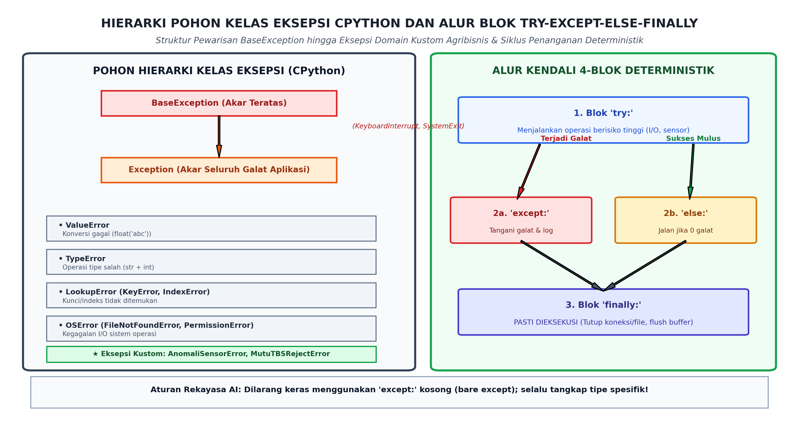
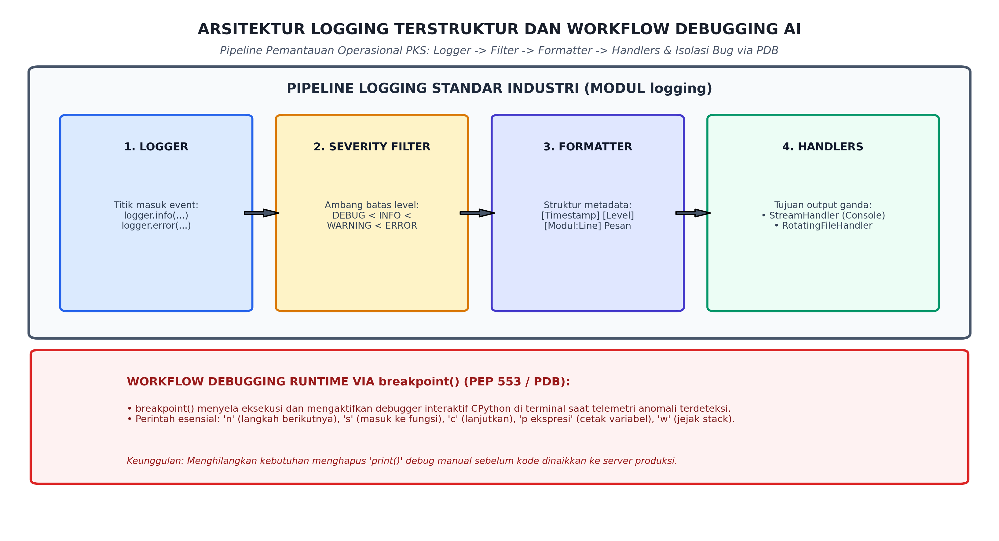

# AI Modul 3.9: Penanganan Pengecualian dan Debugging

---

## 1. Identitas & Kerangka Capaian Pembelajaran (Sub-CPMK)

* **Kode Modul**        : AI Modul 3.9
* **Mata Kuliah**       : Kecerdasan Buatan dan Sains Data Pertanian Presisi
* **Alokasi Waktu**     : 2 x 50 Menit (Kajian Teori & Diskusi) + 2 x 50 Menit (Eksplorasi Praktikum Mandiri)
* **Beban SKS**         : 3 SKS
* **Prasyarat**         : AI Modul 3.8 (Penanganan Berkas)
* **Level Kognitif**    : C2 (Memahami), C3 (Menerapkan), C4 (Menganalisis)


### 1.1 Capaian Pembelajaran Khusus (Sub-CPMK)
Setelah menyelesaikan modul ini, mahasiswa dan pembelajar diharapkan mampu:
1. **Mengidentifikasi (C2)** hierarki kelas eksepsi bawaan Python (`BaseException`, `Exception`, `ValueError`, `KeyError`, dll.).
2. **Menerapkan (C3)** blok penanganan kesalahan yang tangguh (`try`, `except`, `else`, `finally`) untuk mencegah kegagalan sistem saat runtime.
3. **Menganalisis (C4)** jejak tumpukan kesalahan (*traceback analysis*) dan menerapkan teknik pelacakan bug menggunakan modul `logging` dan debugger `pdb`.
4. **Merancang (C3)** kelas eksepsi kustom domain-spesifik (*Custom Exceptions*) untuk validasi integritas data sensor agribisnis.

### 1.2 Kerangka Hasil Pembelajaran (Outputs, Outcomes, & Impacts)
* **Outputs (Keluaran Berwujud Langsung)**:
  * Mahasiswa menghasilkan mesin pengawasan stasiun perebusan (*sterilizer*) dan ketel uap (*boiler*) PKS yang mengimplementasikan arsitektur penanganan pengecualian 4-blok deterministik (`try-except-else-finally`) dan tahan terhadap anomali telemetri.
  * Mahasiswa memproduksi hierarki kelas pengecualian kustom agribisnis (`AgribisnisError`, `AnomaliSensorError`, `MutuTBSRejectError`) yang diperkaya metadata domain kontekstual (kode galat, pembacaan fisik, timestamp).
  * Mahasiswa menyusun pipeline logging terstruktur industri berbasis modul `logging` yang memadukan penyaringan ambang batas keparahan (*severity levels*), pemformatan jejak stack, serta rotasi berkas otomatis (*rotating file handlers*).
* **Outcomes (Hasil Capaian & Perubahan Kompetensi)**:
  * Mahasiswa menguasai pohon hierarki kelas eksepsi CPython: mampu membedakan kelas `BaseException` dan `Exception`, mengeliminasi anti-pola penangkapan eksepsi kosong (*bare except*), serta menerapkan penangkapan bertingkat dari yang paling spesifik ke yang paling umum.
  * Mahasiswa mahir menerapkan rantai eksepsi (*Exception Chaining* - PEP 3134): mampu mentransformasi eksepsi teknis tingkat rendah (seperti `OSError` atau `ValueError`) menjadi eksepsi agronomis tingkat tinggi tanpa memutus jejak penyebab asal (*root-cause preservation* via `raise ... from ...`).
  * Mahasiswa terampil melakukan investigasi dan debugging perangkat lunak: mampu membaca tumpukan panggilan (*traceback*), menghentikan eksekusi pada kondisi kritis menggunakan `breakpoint()`, serta menelusuri memori program via debugger interaktif `pdb`.
* **Impacts (Dampak Jangka Panjang & Nilai Guna Luas)**:
  * Menjamin keselamatan kerja (*K3*) dan keselamatan aset pabrik, mencegah kecelakaan fatal akibat kegagalan deteksi tekanan berlebih pada bejana uap bersuhu tinggi di PKS.
  * Menghilangkan waktu henti (*unplanned downtime*) sistem sortasi otomatis akibat kegagalan pembacaan sensorik sepele, menjaga kontinuitas pengolahan TBS segar tetap lancar.
  * Memenuhi standar audit forensik digital industri agribisnis global (seperti sertifikasi RSPO dan ISPO) melalui ketersediaan log insiden yang terstruktur, lengkap, dan tidak dapat dimanipulasi.

---

## 2. Arsitektur Eksepsi CPython dan Alur Kendali 4-Blok Deterministik

Dalam Python, eksepsi bukanlah sekadar tanda peringatan, melainkan sebuah **objek kelas tingkat tinggi** yang merepresentasikan gangguan terhadap aliran normal instruksi program.



*Gambar 3.9.1: Arsitektur Eksepsi CPython: Pohon Pewarisan BaseException hingga Eksepsi Domain Kustom Agribisnis dan Siklus Eksekusi Deterministik 4-Blok (try-except-else-finally).*

### 2.1 Pohon Pewarisan Kelas Eksepsi CPython
Seluruh eksepsi dalam CPython diturunkan dari kelas akar tunggal:
1. **`BaseException` (Akar Teratas):**  
   Kelas induk tertinggi. Menurunkan eksepsi sistem khusus yang **tidak boleh ditangkap oleh logika aplikasi bisnis**:
   - `KeyboardInterrupt`: Diterbitkan ketika pengguna menekan `Ctrl+C` di terminal untuk menghentikan program.
   - `SystemExit`: Diterbitkan oleh fungsi `sys.exit()` untuk mematikan proses Python.
   - `GeneratorExit`: Diterbitkan saat sebuah generator ditutup.
2. **`Exception` (Akar Galat Aplikasi):**  
   Kelas induk dari seluruh galat non-sistemik yang lazim terjadi selama eksekusi logika program:
   - `ArithmeticError` $\rightarrow$ `ZeroDivisionError`, `OverflowError`.
   - `LookupError` $\rightarrow$ `KeyError` (kunci dict tidak ada), `IndexError` (indeks list di luar jangkauan).
   - `OSError` $\rightarrow$ `FileNotFoundError`, `PermissionError`, `ConnectionError`.
   - `ValueError`: Tipe data benar namun nilainya tidak valid secara matematis (misal `float("rusak")`).
   - `TypeError`: Operasi diterapkan pada tipe data yang tidak kompatibel (misal `"10" + 5`).

> [!WARNING]
> **Anti-Pola "Bare Except":**  
> Dilarang keras menulis `except:` tanpa nama kelas! Pernyataan `except:` kosong atau `except BaseException:` akan menangkap `KeyboardInterrupt` dan `SystemExit`, menyebabkan program **kebal terhadap perintah penghentian darurat `Ctrl+C` dari operator pabrik**! Selalu tangkap kelas `Exception` atau subkelas spesifiknya.

### 2.2 Alur Kendali Deterministik 4-Blok: `try`, `except`, `else`, dan `finally`
Sebuah arsitektur penanganan galat yang paripurna mengintegrasikan empat blok terpadu:
1. **Blok `try:`** Menampung instruksi komputasi berisiko tinggi (operasi baca sensor, penulisan berkas, kalkulasi pembagian). Jika terjadi galat, eksekusi di blok ini langsung terhenti pada baris tersebut dan melompat ke blok `except` yang cocok.
2. **Blok `except TipeGalat as err:`** Dieksekusi **HANYA JIKA** terjadi eksepsi yang cocok dengan `TipeGalat`. Di sinilah logika mitigasi, logging insiden, dan penentuan tindakan darurat dijalankan.
3. **Blok `else:`** Dieksekusi **HANYA JIKA blok `try` selesai 100% mulus tanpa memicu eksepsi apa pun**. Blok ini memisahkan alur nominal (*happy path*) dari zona risiko `try`, mencegah penangkapan eksepsi yang tidak diinginkan dari kode penunjang.
4. **Blok `finally:`** **PASTI DIEKSEKUSI DALAM KEADAAN APA PUN**, baik blok `try` sukses, memicu eksepsi yang tertangkap, memicu eksepsi yang tak tertangkap, atau bahkan jika ada pernyataan `return` di dalam `try`! Blok ini didedikasikan secara mutlak untuk pembersihan sumber daya fisik (*resource cleanup*, seperti menutup katup pipa air, mematikan arus motor ban berjalan, dan menutup koneksi database).

---

## 3. Pengecualian Kustom Domain Agribisnis & Exception Chaining (PEP 3134)

### 3.1 Merancang Hierarki Eksepsi Domain Kustom
Menggunakan eksepsi bawaan umum (seperti melempar `Exception("Tekanan terlalu tinggi!")`) adalah praktik yang buruk karena pemanggil fungsi tidak dapat membedakan jenis kegagalan secara programatis. Pustaka AI industri wajib mendefinisikan hierarki kelas eksepsinya sendiri yang mewarisi `Exception`:

```python
class AgribisnisError(Exception):
    """Kelas dasar untuk seluruh pengecualian domain operasional perkebunan & PKS."""
    pass

class AnomaliSensorError(AgribisnisError):
    """Diterbitkan ketika pembacaan sensor berada di luar ambang batas fisik instrumentasi."""
    def __init__(self, id_sensor: str, nilai_baca: float, batas_maks: float) -> None:
        self.id_sensor = id_sensor
        self.nilai_baca = nilai_baca
        self.batas_maks = batas_maks
        pesan = f"Sensor {id_sensor} mendeteksi anomali {nilai_baca} (Ambang batas aman: {batas_maks})"
        super().__init__(pesan)

class MutuTBSRejectError(AgribisnisError):
    """Diterbitkan ketika muatan janjang TBS terkena penolakan mutlak di loading ramp."""
    pass
```

### 3.2 Rantai Eksepsi (*Exception Chaining* - PEP 3134)
Ketika kode tingkat tinggi menangkap galat tingkat rendah (misal `json.JSONDecodeError` dari file konfigurasi sensor), kita ingin menerbitkan eksepsi domain `KonfigurasiSensorRusakError` tanpa menghilangkan jejak stack trace asli yang memberitahukan baris JSON mana yang salah.

Python menyediakan klausa **`raise ... from ...`**:
```python
try:
    with open("kalibrasi_sensor.json", "r") as f:
        config = json.load(f)
except json.JSONDecodeError as err:
    # Mengaitkan galat asal ke atribut __cause__ secara eksplisit
    raise KonfigurasiSensorRusakError("Gagal mem-parsing parameter kalibrasi!") from err
```
Kompiler CPython akan mencetak kedua jejak stack trace secara terhubung: *"The above exception was the direct cause of the following exception"*, memberikan konteks forensik yang lengkap bagi insinyur data kebun.

---

## 4. Arsitektur Logging Terstruktur Standar Industri (Modul `logging`)



*Gambar 3.9.2: Arsitektur Pipeline Logging Terstruktur: Aliran Event dari Logger, Filter Tingkat Keparahan, Formatter Metadata, hingga Handlers (Konsol & RotatingFileHandler) Serta Workflow Debugging Interaktif pdb.*

### 4.1 Mengapa Pernyataan `print()` Dilarang Keras di Lingkungan Produksi?
1. **Ketiadaan Konteks Waktu & Asal Kode:** `print()` tidak menyertakan timestamp mikrodetik, nama berkas, nomor baris, atau nama modul pemanggil secara otomatis.
2. **Ketiadaan Tingkat Keparahan (*Severity Level*):** Informasi diagnostik sepele tercampur dengan sinyal bahaya ledakan mesin tanpa ada cara menyaringnya secara dinamis.
3. **Penyumbatan Alur I/O Standar:** Pada sistem otonom yang berjalan sebagai *daemon* latar belakang (*background service*), pemanggilan `print()` yang tidak dialihkan ke berkas akan lenyap tanpa jejak (*silent loss*).

### 4.2 Lima Tingkat Keparahan Logging Standar (PEP 282)
| Tingkat Log | Nilai Numerik | Definisi dan Skenario Penggunaan di Perkebunan / PKS |
| :--- | :---: | :--- |
| **`DEBUG`** | 10 | Diagnostik terperinci untuk pelacakan nilai variabel perulangan sensor. |
| **`INFO`** | 20 | Konfirmasi jalannya sistem secara normal (misal: lori #101 berhasil ditimbang). |
| **`WARNING`** | 30 | Indikasi potensi masalah (misal: suhu oli turbin mendekati batas atas $85^\circ\text{C}$). |
| **`ERROR`** | 40 | Kegagalan fungsional yang menggagalkan satu operasi (misal: berkas kalibrasi hilang). |
| **`CRITICAL`** | 50 | Bencana sistemik yang mengancam keselamatan pabrik (misal: ketel uap overpressure). |

### 4.3 Pipeline Komponen Logging: Logger, Handler, Formatter
- **`Logger`:** Titik masuk utama tempat aplikasi memancarkan pesan event (`logger.warning(...)`).
- **`Handler`:** Komponen yang mendistribusikan log ke tujuan fisik:
  - `StreamHandler`: Menampilkan log berwarna ke konsol terminal operator.
  - `RotatingFileHandler`: Menulis log ke berkas disk, dan secara otomatis memotong berkas jika ukurannya melebihi batas (misal 5 MB) serta membatasi jumlah cadangan (*log rotation*), mencegah disk kebun kehabisan kapasitas.
- **`Formatter`:** Mengatur format visual teks string log:
  ```
  [%(asctime)s] [%(levelname)-8s] [%(name)s:%(lineno)d] - %(message)s
  ```

---

## 5. Teknik Debugging CPython: Traceback & Debugger Interaktif `pdb`

### 5.1 Anatomi Tumpukan Panggilan (*Traceback*)
Ketika sebuah eksepsi tidak ditangani, CPython mencetak jejak tumpukan panggilan (*traceback*). Membaca traceback harus dilakukan **dari bawah ke atas**:
1. **Baris Terbawah:** Menunjukkan nama kelas eksepsi dan deskripsi spesifik pesan kegagalan (`ZeroDivisionError: division by zero`).
2. **Baris Tepat di Atasnya:** Lokasi fisik terjadinya eksepsi (nama berkas skrip dan nomor baris).
3. **Baris-baris ke Atas:** Rantai fungsi yang memanggil fungsi tersebut (*call stack frames*).

### 5.2 Debugger Bawaan Interaktif: `breakpoint()` (PEP 553)
Sejak Python 3.7, pemanggilan fungsi bawaan `breakpoint()` akan langsung menginterupsi jalannya program saat itu juga dan meluncurkan antarmuka debugger interaktif **`pdb` (*Python Debugger*)** tepat di baris tersebut.

Perintah navigasi fundamental di dalam prompt `(Pdb)`:
- **`n` (*next*):** Mengeksekusi baris kode saat ini dan melangkah ke baris berikutnya pada tingkat fungsi yang sama.
- **`s` (*step into*):** Melangkah masuk ke dalam fungsi yang sedang dipanggil untuk memeriksa bagian dalamnya.
- **`c` (*continue*):** Melanjutkan eksekusi normal hingga menemukan `breakpoint()` berikutnya atau program selesai.
- **`p ekspresi` (*print*):** Mengevaluasi dan mencetak nilai ekspresi atau variabel (misal: `p suhu_boiler`).
- **`w` (*where*):** Menampilkan jejak tumpukan panggilan saat ini dari frame paling awal hingga lokasi terkini.
- **`q` (*quit*):** Mematikan interpreter seketika.

---

## 6. Implementasi Kasus Nyata: Engine Pengawas Turbin & Ketel Uap PKS Sawit

Di bawah ini adalah sistem pengawasan stasiun ketel uap (*boiler*) dan turbin uap Pabrik Kelapa Sawit yang memadukan penanganan eksepsi bertingkat, pengecualian domain kustom, *exception chaining*, dan pipeline logging rotasional:

```python
"""AI Modul 3.9: Engine Pengawas Turbin dan Ketel Uap Pabrik Kelapa Sawit.

Penulis: Tim Pengembang Kurikulum Kecerdasan Buatan & Sains Data INSTIPER
Standar: Python 3.10+ / PEP 8 / PEP 257 Google Style / PEP 484 Type Hinting
"""

import logging
from logging.handlers import RotatingFileHandler
import os
import sys
import time
from typing import Any, Dict, List, Optional, Tuple


# =====================================================================
# LAPISAN HIERARKI EKSEPSI DOMAIN PKS
# =====================================================================
class PKSOperationalError(Exception):
  """Kelas dasar untuk seluruh pengecualian operasional pabrik kelapa sawit."""

  pass


class TekananUapKritisError(PKSOperationalError):
  """Diterbitkan ketika tekanan uap boiler melampaui batas aman bejana tekan."""

  def __init__(
      self, id_boiler: str, tekanan_bar: float, ambang_kritis_bar: float = 32.0
  ) -> None:
    self.id_boiler = id_boiler
    self.tekanan_bar = tekanan_bar
    self.ambang_kritis = ambang_kritis_bar
    pesan = (
        f"BAHAYA OVERPRESSURE: Boiler {id_boiler} mencapai {tekanan_bar:.2f}"
        f" bar! (Batas maksimum: {ambang_kritis_bar:.2f} bar)"
    )
    super().__init__(pesan)


class SensorTelemetriError(PKSOperationalError):
  """Diterbitkan ketika sinyal telemetri sensor terputus atau menghasilkan data korup."""

  pass


# =====================================================================
# LAPISAN ENGINE SISTEM PENGAWAS
# =====================================================================
class EnginePengawasBoiler:
  """Sistem pemantau turbin dan ketel uap PKS dengan pipeline logging industri."""

  def __init__(
      self,
      nama_pks: str = "PKS-INSTIPER-01",
      direktori_log: str = "sandbox_logs",
  ) -> None:
    self.nama_pks = nama_pks
    self.base_dir = direktori_log
    os.makedirs(self.base_dir, exist_ok=True)
    self.logger = self._konfigurasi_logger()

  def _konfigurasi_logger(self) -> logging.Logger:
    """Menginisialisasi logger rotasional dengan handler ganda (Console & Berkas)."""
    logger = logging.getLogger(self.nama_pks)
    logger.setLevel(logging.DEBUG)

    # Cegah duplikasi handler jika re-inisialisasi
    if logger.handlers:
      return logger

    format_log = logging.Formatter(
        "[%(asctime)s] [%(levelname)-8s] [%(name)s] - %(message)s",
        datefmt="%Y-%m-%d %H:%M:%S",
    )

    # Handler 1: Konsol Terminal
    console_handler = logging.StreamHandler(sys.stdout)
    console_handler.setLevel(logging.INFO)
    console_handler.setFormatter(format_log)
    logger.addHandler(console_handler)

    # Handler 2: Berkas Rotasional (Maksimum 1 MB, simpan 3 cadangan)
    path_berkas_log = os.path.join(self.base_dir, "boiler_audit.log")
    file_handler = RotatingFileHandler(
        path_berkas_log,
        maxBytes=1_000_000,
        backupCount=3,
        encoding="utf-8",
    )
    file_handler.setLevel(logging.DEBUG)
    file_handler.setFormatter(format_log)
    logger.addHandler(file_handler)

    return logger

  def evaluasi_stasiun_uap(
      self, id_unit: str, tekanan_raw: Any, suhu_raw: Any
  ) -> Dict[str, Any]:
    """Mengevaluasi parameter fisik bejana uap dengan alur 4-blok deterministik.

    Args:
        id_unit: Identitas unik ketel uap (misal 'BOILER-01').
        tekanan_raw: Nilai pembacaan sensor tekanan (bar).
        suhu_raw: Nilai pembacaan sensor suhu (°C).

    Returns:
        Dict[str, Any]: Status operasional dan tindakan otomatis katup uap.
    """
    self.logger.debug(
        f"Memulai evaluasi telemetri unit {id_unit} (Tekanan Raw: {tekanan_raw},"
        f" Suhu Raw: {suhu_raw})"
    )

    katup_pembuang_darurat = False
    status_hasil = "BELUM_TEREVALUASI"

    # =================================================================
    # BLOK TRY-EXCEPT-ELSE-FINALLY 4 CABANG
    # =================================================================
    try:
      # Tahap 1: Validasi Tipe Data Numerik Sinyal Sensor
      try:
        tekanan = float(tekanan_raw)
        suhu = float(suhu_raw)
      except (ValueError, TypeError) as err:
        # Menerapkan Exception Chaining (PEP 3134)
        raise SensorTelemetriError(
            f"Paket data sensor {id_unit} korup atau hilang!"
        ) from err

      # Tahap 2: Evaluasi Hukum Termodinamika & Ambang Batas Kritis PKS
      if tekanan <= 0.0 or suhu <= 0.0:
        raise SensorTelemetriError(
            f"Sinyal sensor {id_unit} menghasilkan nilai vakum tidak logis:"
            f" P={tekanan}, T={suhu}"
        )

      if tekanan >= 32.0:
        # Tekanan melampaui toleransi bejana uap
        raise TekananUapKritisError(
            id_unit, tekanan, ambang_kritis_bar=32.0
        )

    except TekananUapKritisError as err_kritis:
      # Penanganan Bahaya Ledakan Mesin: Wajib Buka Katup Darurat Seketika!
      katup_pembuang_darurat = True
      status_hasil = "INTERUPSI_DARURAT_AKTIF"
      self.logger.critical(
          f"PROTOKOL DARURAT DIAKTIFKAN: {err_kritis}. Segera buka katup bypass"
          " atmosfer!"
      )

    except SensorTelemetriError as err_sensor:
      # Penanganan Anomali Sensor: Beralih ke pembacaan instrumen analog sekunder
      katup_pembuang_darurat = False
      status_hasil = "ALIKAN_KE_SENSOR_CADANGAN"
      self.logger.error(f"KEGAGALAN TELEMETRI: {err_sensor}")

    except Exception as err_tak_terduga:
      # Penjaga Terakhir untuk Pengecualian Tak Terduga Lainnya
      status_hasil = "INVESTIGASI_SISTEMIK"
      self.logger.error(
          f"ANOMALI SISTEMIK TAK TERDUGA pada {id_unit}: {err_tak_terduga}",
          exc_info=True,
      )

    else:
      # Dieksekusi HANYA jika siklus try berhasil 100% tanpa eksepsi
      status_hasil = "OPERASIONAL_NORMAL_STABIL"
      self.logger.info(
          f"Unit {id_unit} beroperasi prima: Tekanan {tekanan:.1f} bar, Suhu"
          f" {suhu:.1f}°C"
      )

    finally:
      # Selalu dieksekusi untuk memastikan rekaman log audit telemetri tuntas
      self.logger.debug(
          f"Audit unit {id_unit} selesai. Status Katup Darurat:"
          f" {katup_pembuang_darurat}"
      )

    return {
      "id_unit": id_unit,
      "status": status_hasil,
      "katup_darurat_terbuka": katup_pembuang_darurat,
      "waktu_audit": time.strftime("%Y-%m-%d %H:%M:%S"),
    }


# =====================================================================
# BLOK EKSEKUSI PENGUJIAN INDUSTRIAL
# =====================================================================
if __name__ == "__main__":
  print("=" * 80)
  print(
      "SISTEM MONITORING KETEL UAP PKS INSTIPER - EXCEPTION & LOGGING PIPELINE"
  )
  print("=" * 80)

  engine_pks = EnginePengawasBoiler(
      nama_pks="PKS-BOILER-SYSTEM", direktori_log="sandbox_logs"
  )

  # Kasus Uji 1: Operasi Normal
  print("\n--- PENGUJIAN 1: KONDISI BEJANA TEKAN NORMAL ---")
  hasil_1 = engine_pks.evaluasi_stasiun_uap("BOILER-01", 26.5, 240.0)

  # Kasus Uji 2: Kondisi Kritis Overpressure (Tekanan > 32 bar)
  print("\n--- PENGUJIAN 2: BAHAYA TEKANAN KRITIS BOILER ---")
  hasil_2 = engine_pks.evaluasi_stasiun_uap("BOILER-01", 34.8, 285.0)

  # Kasus Uji 3: Sensor Terputus / Paket Korup
  print("\n--- PENGUJIAN 3: ANOMALI DATA SENSOR RUSAK ---")
  hasil_3 = engine_pks.evaluasi_stasiun_uap("BOILER-02", "KORUP_NULL", 250.0)

  print("\n" + "=" * 80)
  print("REKAPITULASI STATUS AKTUATOR PABRIK:")
  print(
      f"  Unit BOILER-01 (Uji 1) -> Status: {hasil_1['status']:<25} | Katup"
      f" Darurat: {hasil_1['katup_darurat_terbuka']}"
  )
  print(
      f"  Unit BOILER-01 (Uji 2) -> Status: {hasil_2['status']:<25} | Katup"
      f" Darurat: {hasil_2['katup_darurat_terbuka']}"
  )
  print(
      f"  Unit BOILER-02 (Uji 3) -> Status: {hasil_3['status']:<25} | Katup"
      f" Darurat: {hasil_3['katup_darurat_terbuka']}"
  )
  print("=" * 80 + "\n")
```

---

## 7. Pembahasan Keterangan Penggunaan Kode (Operational Breakdown)

Dekonstruksi fungsional atas sistem pengawasan ketel uap PKS di atas menyingkap integrasi rekayasa perangkat lunak tangguh:

1. **Pewarisan Hierarki Eksepsi Khusus (Baris 20–44):**  
   Kelas `TekananUapKritisError` dan `SensorTelemetriError` diturunkan dari `PKSOperationalError`, yang pada gilirannya mewarisi `Exception`. Ini memungkinkan sistem luar menangkap seluruh galat pabrik menggunakan `except PKSOperationalError:`, atau menangani bahaya ledakan secara spesifik menggunakan `except TekananUapKritisError:`.
2. **Exception Chaining via `from err` (Baris 120–124):**  
   Ketika konversi `float(tekanan_raw)` memicu `ValueError`, Python membungkusnya ke dalam `SensorTelemetriError` melalui klausa `raise ... from err`. Atribut dunder `__cause__` secara otomatis mengunci referensi ke `ValueError` asli, menjaga integritas riwayat teknis untuk analisis akar masalah (*root cause analysis*).
3. **Pemisahan Logika Sukses Murni via Blok `else:` (Baris 155–163):**  
   Pernyataan `status_hasil = "OPERASIONAL_NORMAL_STABIL"` ditempatkan di blok `else:`, bukan di akhir blok `try:`. Hal ini menjamin bahwa baris tersebut dieksekusi murni hanya jika seluruh validasi di dalam `try` berhasil tanpa pengecualian, mematuhi prinsip kebersihan tata bahasa alur kendali CPython.
4. **Pembersihan Mutlak via Blok `finally:` (Baris 165–171):**  
   Blok `finally:` memastikan rekaman audit diagnostik selalu dicatat dan dieksekusi tanpa memedulikan apakah terjadi anomali tekanan, sensor putus, atau eksepsi tak terduga.
5. **Handler Rotasional Terpisah (Baris 62–90):**  
   Penggunaan `RotatingFileHandler` membatasi ukuran berkas log pada 1 MB dengan maksimal 3 berkas cadangan (`backupCount=3`). Ketika berkas `boiler_audit.log` penuh, ia otomatis diarsipkan menjadi `boiler_audit.log.1`, dan berkas baru dibuat secara transparan, melindungi media penyimpanan gerbang IoT tepi perkebunan dari saturasi kapasitas hard disk.

---

## 8. Evaluasi Mandiri: Pertanyaan HOTS & Tantangan Scaffolded

### 8.1 Pertanyaan HOTS (Higher-Order Thinking Skills)

1. **Analisis Semantik Arsitektur CPython: Mengapa `BaseException` Dilarang Ditangkap dalam Logika Bisnis?**  
   - Jelaskan struktur pewarisan antara `BaseException`, `KeyboardInterrupt`, `SystemExit`, dan `Exception`!
   - Apa dampak fatal yang terjadi pada sistem otomasi pabrik kelapa sawit jika seorang programmer menulis `try: ... except BaseException: pass` pada loop kontrol mesin konveyor buah?
2. **Dekonstruksi Mekanisme Exception Chaining: `__cause__` vs `__context__` (PEP 3134):**  
   - Pada Python modern, jelaskan perbedaan semantik antara atribut eksepsi `__cause__` (dihasilkan oleh `raise NewError from OldError`) dan atribut `__context__` (dihasilkan saat eksepsi baru terjadi secara tidak sengaja di dalam blok `except`)!
   - Bagaimana penulisan `raise NewError from None` digunakan untuk secara sengaja menekan jejak stack trace lama (*traceback suppression*) demi menjaga kerahasiaan keamanan internal sistem (*information disclosure prevention*)?
3. **Analisis Rekayasa Keandalan Perangkat Lunak: Logging vs Print & Disk Saturation:**  
   - Analisislah mengapa penggunaan pernyataan `print()` untuk debugging dapat melumpuhkan performa I/O sistem AI yang memproses ribuan data telemetri per detik!
   - Jelaskan konsep *Buffer Flushing* dan mekanisme kerja `RotatingFileHandler` dalam mencegah terjadinya kegagalan *Disk Full Emergency* pada server PKS di pelosok perkebunan!

---

### 8.2 Tantangan Pemrograman Berjenjang (*Scaffolded Challenges*)

#### Tantangan 1 (Tingkat Dasar - *Warm-Up*): Konversi Telemetri Kebun yang Tangguh
* **Skenario:** Aliran data sensor tanah mengirimkan data dalam format string yang kadang memuat karakter rusak atau nilai kosong (`""`, `"28.5"`, `"ERROR_TIMEOUT"`).
* **Tugas:** Buatlah fungsi `konversi_suhu_tangguh(nilai_str: str, nilai_default: float = 25.0) -> float` yang:
  - Mencoba mengonversi `nilai_str` ke float.
  - Menangkap `ValueError` dan `TypeError`.
  - Jika gagal, mencetak pesan peringatan dan mengembalikan `nilai_default`.
  - Menggunakan blok `else` untuk mencatat bahwa konversi berhasil sempurna.

#### Tantangan 2 (Tingkat Menengah - *Intermediate*): Pemantauan Tekanan Pipa Irigasi dengan Eksepsi Kustom & Rantai Galat
* **Skenario:** Pompa irigasi perkebunan kelapa sawit membaca tekanan air dalam format teks mentah.
* **Tugas:** Bangunlah fungsi `evaluasi_tekanan_irigasi(tekanan_raw: str, ambang_aman: float = 4.0) -> float` yang:
  1. Mendefinisikan kelas eksepsi kustom `TekananPipaIrigasiError(Exception)`.
  2. Mencoba mengubah `tekanan_raw` menjadi float. Jika memicu `ValueError`, lemparkan `TekananPipaIrigasiError("Format telemetri tekanan tidak valid!") from err`.
  3. Jika nilai tekanan $> \text{ambang\_aman}$, lemparkan `TekananPipaIrigasiError(f"Tekanan pipa kritis: {nilai} bar!")`.
  4. Jika normal, kembalikan nilai float tekanan tersebut.

#### Tantangan 3 (Tingkat Mahir - *Advanced*): Pipeline Audit Sortasi TBS Terintegrasi Logging Multi-Handler
* **Skenario:** Pos penerimaan buah PKS membutuhkan engine klasifikasi mutu janjang yang mencatat seluruh insiden penolakan buah ke berkas log rotasional dan melacak waktu eksekusi.
* **Tugas:** Bangunlah kelas `EngineAuditSortasi` yang:
  1. Mengonfigurasi `logging.Logger` khusus dengan level `DEBUG`, menyertakan `StreamHandler` (level `INFO`) dan `FileHandler` (level `WARNING` ke berkas `penalti_tbs.log`).
  2. Memiliki metode `inspeksi_janjang(id_janjang: str, persen_brondol: float, ada_sampah: bool) -> str` yang:
     - Jika `ada_sampah == True`, mencatat `logger.warning(...)` dan melemparkan eksepsi kustom `KontaminasiSampahError`.
     - Jika `persen_brondol < 12.5`, mencatat `logger.warning(...)` dan melemparkan `BuahMentahError`.
     - Menggunakan blok `try-except-else-finally` lengkap untuk menangkap kedua eksepsi tersebut dan mengembalikan status grading buah.

---

## 9. Glosarium Istilah Teknis

1. **Bare Except:** Anti-pola penulisan blok `except:` tanpa menentukan tipe kelas eksepsi yang ingin ditangkap, yang secara keliru menangkap sinyal interupsi sistem seperti `KeyboardInterrupt`.
2. **Breakpoint:** Titik henti sementara yang disematkan ke dalam kode sumber (via fungsi bawaan `breakpoint()`) untuk menunda eksekusi program dan menyerahkan kendali kepada debugger interaktif `pdb`.
3. **Call Stack (Tumpukan Panggilan):** Struktur data internal CPython yang menyimpan urutan bingkai fungsi (*stack frames*) yang sedang aktif dieksekusi dari awal program hingga titik saat ini.
4. **Exception Chaining (Rantai Eksepsi):** Mekanisme standardisasi CPython (PEP 3134) yang mengaitkan eksepsi tingkat tinggi dengan eksepsi tingkat rendah penyebab asalnya menggunakan sintaksis `raise ... from ...`.
5. **Fault-Tolerant System:** Sistem perangkat lunak yang dirancang untuk tetap mampu beroperasi normal atau mengalami penurunan kinerja secara anggun (*graceful degradation*) meskipun sebagian komponennya mengalami kegagalan.
6. **Log Rotation:** Mekanisme manajemen berkas log yang secara otomatis mengarsipkan berkas log yang telah mencapai batas ukuran tertentu dan membuat berkas baru, mencegah kehabisan kapasitas media penyimpanan (*disk full*).
7. **PDB (Python Debugger):** Modul debugger bawaan interaktif CPython yang menyediakan fasilitas stepping kode, inspeksi variabel, dan manipulasi alur runtime.
8. **Traceback:** Laporan diagnostik teks yang dihasilkan oleh Python ketika terjadi eksepsi yang tidak tertangani, memetakan rantai pemanggilan fungsi dan nomor baris kode tempat terjadinya galat.

---

## 10. Jembatan Konsep (Bridging) ke AI Modul 3.10: Penggunaan Package Manager (pip) dan Ekosistem Pustaka AI

Dengan menguasai pohon hierarki eksepsi, perancangan kelas pengecualian kustom domain kelapa sawit, dan arsitektur logging multi-kanal industri, kode program kecerdasan buatan yang Anda bangun kini telah memiliki ketahanan tingkat tinggi (*production-grade resilience*) dan siap beroperasi di lingkungan industri riil.

Namun, untuk mengonstruksi model kecerdasan buatan yang canggih—seperti segmentasi citra satelit kanopi sawit menggunakan *Deep Learning*, visualisasi geospasial mutakhir, atau manipulasi matriks sensor skala masif—kita tidak dapat hanya mengandalkan pustaka standar (*Python Standard Library*) bawaan. Kita memerlukan akses ke ribuan pustaka pihak ketiga (*third-party libraries*) yang dikembangkan oleh komunitas sains data global di repositori resmi **Python Package Index (PyPI)**.

Pada **AI Modul 3.10: Penggunaan Package Manager (pip) dan Ekosistem Pustaka AI**, kita akan mendalami:
- Mekanisme kerja manajer paket resmi Python (`pip`): instalasi, peningkatan (*upgrade*), pembersihan, dan pencarian paket.
- Pembekuan dependensi produksi (*dependency freezing*) menggunakan berkas manifest `requirements.txt`.
- Pustaka pengunci dependensi deterministik modern (`pip-tools`, `pyproject.toml`, dan `uv`).
- Penjelajahan ekosistem pustaka kecerdasan buatan utama: NumPy (aljabar matriks), Pandas (data tabular), Matplotlib/Seaborn (visualisasi ilmiah), dan Scikit-Learn (pemodelan machine learning).

---

## 11. Daftar Pustaka dan Referensi Akademik

1. Brandl, G.(2007). *PEP 3134: Exception Chaining and Embedded Tracebacks*. Python Enhancement Proposals.
2. Langa, Ł.(2017). *PEP 553: Built-in breakpoint()*. Python Enhancement Proposals.
3. Vinay, S.(2001). *PEP 282: A Logging System*. Python Enhancement Proposals.
4. Ramalho, L.(2022). *Fluent Python: Clear, Concise, and Effective Programming* (2nd ed.). O'Reilly Media. (Bab 18: *with, match, and else Blocks* & Bab 14: *Inheritance: For Better or for Worse*).
5. Pusat Penelitian Kelapa Sawit (PPKS).(2022). *Standar Operasional Prosedur Pengoperasian Ketel Uap dan Stasiun Rebusan Pabrik Kelapa Sawit*. PPKS Medan.
