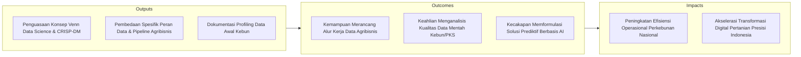
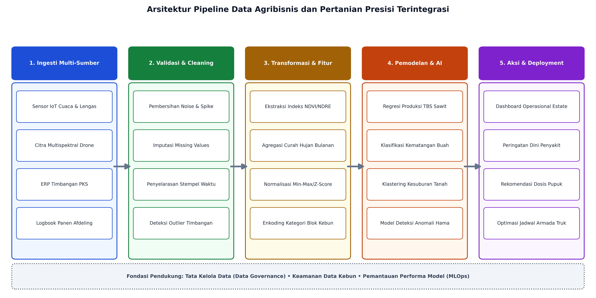

# AI Modul 4.1: Pengantar Data Science

---

## 1. Identitas & Kerangka Capaian Pembelajaran (Sub-CPMK)

* **Kode Modul**        : AI Modul 4.1
* **Mata Kuliah**       : Kecerdasan Buatan dan Sains Data Pertanian Presisi
* **Alokasi Waktu**     : 2 x 50 Menit (Kajian Teori & Diskusi) + 2 x 50 Menit (Eksplorasi Praktikum Mandiri)
* **Beban SKS**         : 3 SKS
* **Prasyarat**         : Part 3 (Pemrograman Python untuk AI)
* **Level Kognitif**    : C2 (Memahami), C3 (Menerapkan), C4 (Menganalisis)



### 1.1 Capaian Pembelajaran Khusus (Sub-CPMK)
Setelah menyelesaikan modul ini, mahasiswa dan pembelajar diharapkan mampu:
1. **Menguraikan (C2)** definisi formal Data Science, interdisipliner diagram Venn Drew Conway, dan metodologi CRISP-DM di sektor perkebunan.
2. **Menganalisis (C4)** tipologi analisis data (Deskriptif, Diagnostik, Prediktif, Preskriptif) pada kasus taksasi panen dan manajemen tanah sawit.
3. **Mengevaluasi (C4)** tantangan Big Data 5V (Volume, Velocity, Variety, Veracity, Value) dalam konteks IoT telemetri kebun dan drone.
4. **Merumuskan (C3)** hipotesis saintifik awal berbasis data sensor tanah untuk investigasi penurunan produktivitas kelapa sawit.

### 1.2 Kerangka Hasil Pembelajaran (Outputs, Outcomes, & Impacts)
* **Outputs (Keluaran Berwujud Langsung)**:
  * Menguraikan secara komprehensif diagram Venn *Data Science* yang mengintegrasikan komputasi, statistika, dan *domain expertise* perkebunan sawit/kehutanan.
  * Memetakan keenam fase siklus hidup data standar industri *Cross-Industry Standard Process for Data Mining* (CRISP-DM) ke dalam skenario agribisnis riil.
  * Mengidentifikasi batasan tugas, tanggung jawab, dan kompetensi teknis dari ekosistem profesi data (*Data Engineer*, *Data Analyst*, *Data Scientist*, dan *Machine Learning Engineer*).
  * Menjelaskan komponen arsitektur pipeline data hulu-ke-hilir (*end-to-end data pipeline*) yang menghubungkan sensor telemetri cuaca, citra drone, sistem timbangan PKS, dan analitik AI.
* **Outcomes (Hasil Capaian & Perubahan Kompetensi)**:
  * Merumuskan masalah agribisnis (*business problem formulation*) ke dalam formulasi sains data yang terukur (*actionable analytical problem*).
  * Mengevaluasi integritas dan kelayakan data operasional kebun (identifikasi *noise*, *missing values*, anomali stempel waktu, dan bias pengukuran lapangan).
  * Merancang cetak biru (*blueprint*) pengumpulan dan pra-pemrosesan data multi-modal yang siap dikonsumsi oleh algoritma pembelajaran mesin tingkat lanjut.
* **Impacts (Dampak Jangka Panjang & Nilai Guna Luas)**:
  * Peningkatan akurasi pengambilan keputusan manajerial perkebunan kelapa sawit dan komoditas tropis berbasis bukti empiris data (*data-driven decision making*).
  * Pengurangan rasio limbah operasional (*losses*) pada rantai pasok Tandan Buah Segar (TBS) menuju PKS melalui analitik prediktif.
  * Penguatan kedaulatan pangan dan biomassa nasional melalui modernisasi pertanian presisi 4.0 yang berwawasan lingkungan dan berkelanjutan.

---

## 2. Fondasi Konseptual Data Science: Irisan Tiga Domain Ilmiah

Sains Data (*Data Science*) didefinisikan sebagai disiplin ilmu interdisipliner yang memanfaatkan metode ilmiah, proses komputasional, algoritma probabilistik, dan arsitektur sistem cerdas untuk mengekstraksi wawasan berharga (*actionable insights*) dan pola tersembunyi dari sekumpulan data terstruktur maupun tidak terstruktur (*unstructured data*).

Secara keilmuan, sains data bertumpu pada diagram Venn klasik yang diadaptasi untuk ranah rekayasa cerdas pertanian:


### 2.1 Ilmu Komputer dan Rekayasa Perangkat Lunak (*Computer Science & Software Engineering*)
Pilar ini menyediakan infrastruktur, efisiensi algoritma, dan mekanika penanganan volume data besar. Topik inti meliputi:
- Struktur data efisien (larik terindeks, matriks sparse, tabel hash, struktur tree/graph).
- Kompleksitas asimptotik waktu $\mathcal{O}(f(n))$ dan ruang $\mathcal{O}(s(n))$ untuk memproses jutaan baris data telemetri perkebunan secara streaming maupun batch.
- Pemrograman terstruktur, manajemen memori CPython, integrasi API, serta prinsip pengujian dan rekayasa perangkat lunak modular (*clean code*).

### 2.2 Matematika Terapan dan Statistika Inferensial (*Applied Mathematics & Statistics*)
Pilar ini bertindak sebagai fondasi pembuktian formal atas kesimpulan yang ditarik dari sampel data kebun. Bidang krusial mencakup:
- **Aljabar Linear dan Kalkulus Matriks:** Transformasi ruang vektor, operasi tensor pada citra kanopi kelapa sawit, dekomposisi nilai singular (*Singular Value Decomposition* - SVD), dan optimasi berbasis gradien (*gradient descent*).
- **Teori Probabilitas dan Statistika Deskriptif:** Ukuran pemusatan data (rerata $\bar{x}$, median $\tilde{x}$, modus) serta ukuran penyebaran:
  $$\text{Varians Sampel } (s^2) = \frac{1}{n-1}\sum_{i=1}^n (x_i - \bar{x})^2$$

  **Keterangan Simbol:**
  - $s^2$: Varians sampel, ukuran kuadrat dispersi data terhadap nilai rata-ratanya (satuan: kuadrat unit data asli).
  - $n$: Jumlah total observasi dalam sampel.
  - $n-1$: Derajat kebebasan (*degrees of freedom*) menurut koreksi Bessel agar penaksir tidak bias.
  - $x_i$: Nilai observasi sampel ke-$i$.
  - $\bar{x}$: Rerata aritmetika (*mean*) sampel.
  - $\sum_{i=1}^n$: Operasi penjumlahan mulai indeks data pertama ($i=1$) hingga data terakhir ($i=n$).

  > **Cara Membaca Rumus:**  
  > *Varians sampel s kuadrat sama dengan satu dibagi n minus satu, dikalikan jumlah dari i sama dengan satu sampai n untuk selisih x sub i dikurangi x bar yang dikuadratkan.*

  $$\text{Deviasi Standar } (s) = \sqrt{s^2} = \sqrt{\frac{1}{n-1}\sum_{i=1}^n (x_i - \bar{x})^2}$$

  **Keterangan Simbol:**
  - $s$: Simpangan baku atau deviasi standar sampel (satuan: identik dengan unit data asli).
  - $\sqrt{\cdot}$: Akar kuadrat utama dari nilai varians sampel.

  > **Cara Membaca Rumus:**  
  > *Deviasi standar s sama dengan akar kuadrat dari varians sampel s kuadrat.*

- **Momen Distribusi Tingkat Lanjut:**
  - *Skewness* (kemencengan): Mengukur asimetri distribusi hasil tonase panen per blok kebun terhadap distribusi normal Gaussian:
    $$\text{Skewness} = \frac{\frac{1}{n}\sum_{i=1}^n (x_i - \bar{x})^3}{\left(\frac{1}{n}\sum_{i=1}^n (x_i - \bar{x})^2\right)^{3/2}}$$

    **Keterangan Simbol:**
    - $\text{Skewness}$: Koefisien kemencengan momen ketiga terstandarisasi untuk mengukur tingkat asimetri distribusi data.
    - $n$: Jumlah total sampel pengamatan.
    - $x_i$: Nilai observasi sampel ke-$i$.
    - $\bar{x}$: Rerata aritmetika sampel.
    - Pembilang: Momen sentral ketiga (mengukur arah dan bobot ekor distribusi).
    - Penyebut: Momen sentral kedua dipangkatkan $3/2$ (deviasi standar dipangkatkan tiga sebagai faktor penormal).

    > **Cara Membaca Rumus:**  
    > *Skewness sama dengan satu per n dikalikan jumlah dari i sama dengan satu sampai n untuk selisih x sub i minus x bar dipangkatkan tiga, dibagi dengan kurung buka satu per n dikalikan jumlah selisih kuadrat x sub i minus x bar kurung tutup dipangkatkan tiga per dua.*

  - *Kurtosis* (keruncingan): Menunjukkan ketebalan ekor distribusi (*heavy tails*) untuk mendeteksi anomali ekstrim iklim mikro.
- **Kovarians dan Koefisien Korelasi Pearson ($r_{xy}$):**
  Mengukur kekuatan linearitas antara dua variabel acak kontinu (misalnya antara curah hujan kumulatif bulanan $X$ dengan bobot janjang TBS $Y$):
  $$r_{xy} = \frac{\sum_{i=1}^n (x_i - \bar{x})(y_i - \bar{y})}{\sqrt{\sum_{i=1}^n (x_i - \bar{x})^2} \sqrt{\sum_{i=1}^n (y_i - \bar{y})^2}}, \quad -1 \le r_{xy} \le 1$$

  **Keterangan Simbol:**
  - $r_{xy}$: Koefisien korelasi Pearson antara variabel acak kontinu $X$ dan $Y$.
  - $n$: Jumlah pasangan data observasi $(x_i, y_i)$.
  - $x_i, y_i$: Nilai observasi ke-$i$ untuk variabel $X$ dan $Y$.
  - $\bar{x}, \bar{y}$: Rerata aritmetika dari variabel $X$ dan variabel $Y$.
  - Pembilang: Kovarians tak terstandarisasi antara variabel $X$ dan $Y$.
  - Penyebut: Perkalian deviasi standar sampel variabel $X$ dan $Y$.

  > **Cara Membaca Rumus:**  
  > *Koefisien korelasi r sub x y sama dengan jumlah dari i sama dengan satu sampai n untuk perkalian selisih x sub i minus x bar dengan selisih y sub i minus y bar, dibagi dengan akar jumlah selisih kuadrat x sub i minus x bar dikalikan akar jumlah selisih kuadrat y sub i minus y bar, di mana nilainya berada pada selang minus satu hingga positif satu.*

### 2.3 Keahlian Domain Substantif (*Domain Expertise - Smart Agriculture*)
Komputasi canggih dan rumus statistika tidak bermakna tanpa pemahaman kontekstual agronomi dan proses agribisnis:
- Karakteristik fisiologi kelapa sawit (*Elaeis guineensis*), siklus pembungaan, diferensiasi janjang jantan/betina, serta kurva defisit air (*water deficit index*).
- Karakteristik kimia tanah (pH, Kapasitas Tukar Kation / KTK, kandungan N-P-K-Mg, ketebalan lapisan gambut).
- Dinamika rantai pasok industri: kapasitas lori rebusan (*sterilizer*), kadar Asam Lemak Bebas (*Free Fatty Acid* - FFA), serta rasio ekstraksi minyak kelapa sawit (*Oil Extraction Rate* - OER) di PKS.

---

## 3. Siklus Hidup Proyek Data Science: Kerangka Kerja CRISP-DM

*Cross-Industry Standard Process for Data Mining* (CRISP-DM) merupakan metodologi standar industri yang memandu eksekusi proyek sains data secara siklis dan iteratif, bukan sekadar alur sekuensial linier satu arah (*waterfall*).

```
+-----------------------------------------------------------------------+
|                       1. Business Understanding                       |
|         (Identifikasi Masalah Produksi Kebun & Metrik Nilai)          |
+-----------------------------------------------------------------------+
                                  |
                                  v
+-----------------------------------------------------------------------+
|                         2. Data Understanding                         |
|        (Audit Sensor, Eksplorasi Distribusi, Audit Kualitas)          |
+-----------------------------------------------------------------------+
                             |          ^
                             v          |  (Iterasi Eksplorasi)
+-----------------------------------------------------------------------+
|                          3. Data Preparation                          |
|         (Cleaning, Imputasi, Rekayasa Fitur, Penggabungan)            |
+-----------------------------------------------------------------------+
                             |          ^
                             v          |  (Penyempurnaan Fitur)
+-----------------------------------------------------------------------+
|                             4. Modeling                               |
|        (Pelatihan Algoritma, Estimasi Parameter, Validasi)            |
+-----------------------------------------------------------------------+
                                  |
                                  v
+-----------------------------------------------------------------------+
|                             5. Evaluation                             |
|          (Validasi Statistik vs Kebutuhan Efisiensi Kebun)            |
+-----------------------------------------------------------------------+
                                  |
                                  v
+-----------------------------------------------------------------------+
|                            6. Deployment                              |
|          (Integrasi Dashboard, API Pelaporan Manajer Estate)          |
+-----------------------------------------------------------------------+
```

### 3.1 Fase 1: Business Understanding (Pemahaman Bisnis)
- **Tujuan:** Menetapkan sasaran strategis institusi/perusahaan dan menerjemahkannya ke dalam formulasi pertanyaan teknis.
- **Contoh Kasus Perkebunan:** Perusahaan ingin menurunkan penumpukan TBS yang menginap di Tempat Pengumpulan Hasil (TPH) lebih dari 24 jam guna menekan lonjakan kadar asam lemak bebas (FFA > 3.5%) yang merusak mutu ekspor *Crude Palm Oil* (CPO).
- **Target Analitik:** Memprediksi tonase panen harian per blok afdeling dengan *Mean Absolute Percentage Error* (MAPE) di bawah 8% agar jadwal penugasan armada truk dapat dioptimalkan 12 jam sebelum pemanenan dimulai.

### 3.2 Fase 2: Data Understanding (Pemahaman Data)
- **Tujuan:** Mengumpulkan data mentah (*raw data*), melakukan inventarisasi atribut, mengaudit kelengkapan data, dan memverifikasi konsistensi awal.
- **Eksekusi Lapangan:**
  - Menarik data curah hujan otomatis (*Automatic Weather Station* - AWS).
  - Mengambil data historis surat jalan penimbangan buah di jembatan timbang PKS.
  - Memeriksa keabsahan stempel waktu (*timestamps*) dan sebaran nilai ekstrim (misal: bobot janjang tercatat 0 kg atau 150 kg yang mustahil secara biologis).

### 3.3 Fase 3: Data Preparation (Persiapan Data)
- Fase ini memakan 70% hingga 80% dari total alokasi waktu proyek.
- **Aktivitas Inti:**
  - Pembersihan (*cleaning*): Mengeliminasi baris duplikat dan koreksi anomali sensor.
  - Imputasi nilai hilang (*missing value imputation*): Menggunakan median bergerak (*rolling median*) atau interpolasi spline untuk data deret waktu cuaca yang terputus akibat gangguan sinyal telemetri seluler di kebun terpencil.
  - Rekayasa Fitur (*Feature Engineering*): Menghitung indeks kumulatif hujan 3 bulan sebelumnya (*lagged rainfall*), indeks defisit air tanah, dan usia tanam efektif tanaman sawit.
  - Standarisasi rentang nilai fitur menggunakan *Z-score* atau *Min-Max scaling*.

### 3.4 Fase 4: Modeling (Pemodelan)
- **Tujuan:** Mengonfigurasi dan melatih serangkaian algoritma matematis (*Linear Regression, Random Forest Regressor, XGBoost, Multilayer Perceptron*) pada data latihan (*training set*).
- Melakukan kalibrasi hiperparameter (*hyperparameter tuning*) menggunakan teknik validasi silang bersarang (*nested cross-validation*) untuk mencegah terjadinya *data leakage*.

### 3.5 Fase 5: Evaluation (Evaluasi Kinerja)
- **Tujuan:** Menilai apakah model yang dilatih memenuhi ambang batas keberhasilan teknis dan relevansi manajerial lapangan.
- Evaluasi teknis: Menghitung metrik $R^2$, *Root Mean Squared Error* (RMSE), dan *Mean Absolute Error* (MAE).
- Evaluasi dampak bisnis: Menghitung proyeksi penghematan biaya bahan bakar solar truk angkut dan penurunan penalti mutu CPO di pelabuhan akibat terkendalinya FFA.

### 3.6 Fase 6: Deployment (Penyebaran dan Penerapan)
- **Tujuan:** Mengintegrasikan model prediktif ke dalam operasional nyata perkebunan.
- Mengemas model ke dalam format biner yang efisien (`ONNX` atau serialized pipeline `joblib`).
- Menyediakan endpoint REST API berbasis FastAPI yang dikonsumsi oleh aplikasi mobile para mandor panen dan dashboard manajer estate.
- Membangun pipa pemantauan pergeseran data (*data drift monitoring*) untuk mendeteksi perubahan anomali iklim ekstrem El Nino / La Nina.

---

## 4. Pemetaan Peran dan Ekosistem Profesi Data Modern

Keberhasilan inisiatif kecerdasan buatan pada industri agribisnis skala enterprise tidak bergantung pada individu tunggal serba bisa, melainkan pada sinergi terstruktur dari empat pilar profesi data:

| Dimensi Evaluasi | *Data Engineer* | *Data Analyst* | *Data Scientist* | *Machine Learning Engineer* |
| :--- | :--- | :--- | :--- | :--- |
| **Fokus Utama** | Infrastruktur, *pipeline ingestion*, *data warehousing*, arsitektur ETL/ELT. | Analitik deskriptif, pelaporan KPI, visualisasi data, *business intelligence*. | Analitik prediktif, pemodelan statistik, pembuktian hipotesis eksperimental. | Rekayasa perangkat lunak produksi, *serving* model real-time, MLOps, skalabilitas sistem. |
| **Peralatan Inti (*Core Tools*)** | SQL, Apache Spark, Kafka, Airflow, Docker, PostgreSQL/ClickHouse. | PowerBI, Tableau, Excel tingkat lanjut, SQL, Python dasar (Pandas/Seaborn). | Python/R, Scikit-Learn, SciPy, Statsmodels, Jupyter Notebook, Git. | PyTorch, TensorFlow, FastAPI, Docker, Kubernetes, Triton Inference Server, MLflow. |
| **Studi Kasus Agribisnis** | Membangun pipeline transmisi data sensor AWS dari 50 afdeling ke *lakehouse* sentral secara real-time. | Menganalisis korelasi antara rotasi potong buah dengan lonjakan *losses* brondolan di tanah per divisi. | Mengembangkan model regresi spasial untuk mengestimasi produksi CPO 6 bulan ke depan berbasis anomali iklim. | Mengemas model klasifikasi fraksi kematangan buah berbasis visi komputer ke perangkat *edge AI* pada gerbang PKS. |
| **Latar Belakang Pengetahuan** | Sistem Terdistribusi, Basis Data, Rekayasa Perangkat Lunak. | Statistik Bisnis, Manajemen Operasional, Desain Komunikasi Visual Data. | Probabilitas, Aljabar Linear Terapan, Algoritma Pemodelan ML. | Arsitektur *Cloud*, DevOps, *High-Performance Computing* (HPC). |

---

## 5. Lanskap Data Pertanian Presisi dan Agribisnis Cerdas (Smart Agriculture)

Pertanian modern telah bertransformasi dari pendekatan konvensional berbasis intuisi (*heuristic calendar-based farming*) menjadi ekosistem berpresisi tinggi berbasis data (*data-driven smart agriculture*).

```
   [ Sumber Multi-Modal Data Perkebunan & Kehutanan ]
   |
   +---> Data Spasial & Penginderaan Jauh (Citra Satelit Sentinel/Planet, LiDAR Drone, NDVI/NDRE)
   |
   +---> Data Telemetri Iklim & Sensor Tanah (AWS Curah Hujan, Lengas Tanah, Suhu Kanopi, pH)
   |
   +---> Data Operasional & Logistik (Timbangan Jembatan PKS, Ritase Truk, Presensi Tenaga Kerja)
   |
   +---> Data Laboratorium Agronomi (Uji Daun LSU, Uji Tanah SSU, Titrasi Asam Lemak Bebas FFA)
```

Tantangan utama sains data dalam ranah ini dikarakterisasi oleh fenomena **5V Big Data**:
1. **Volume:** Data citra drone ortofoto satu konsesi perkebunan (20.000 hektar) menghasilkan berkas berukuran terabita per satu kali pemetaan terbang.
2. **Velocity:** Sensor cuaca IoT memancarkan telemetri kecepatan angin, radiasi matahari, dan curah hujan per interval 10 detik.
3. **Variety:** Kombinasi data tabular angka (bobot panen), data spasial georeferensi *shapefile/GeoJSON* (poligon blok sawit), data citra RGB/Multispektral, dan catatan log teks mandor lapangan.
4. **Veracity (Integritas/Keakuratan):** Gangguan sensor akibat debu pekat jalan kebun, kanopi sawit yang menghalangi sinyal GPS, dan kesalahan input manual surat panen (*human error*).
5. **Value (Nilai Tambah):** Kemampuan mengonversi jutaan titik data menjadi aksi konkret: lokasi penaburan pupuk mikro yang tepat guna menghindari pemborosan jutaan rupiah per hektar.

---

## 6. Arsitektur Pipeline Data Agribisnis End-to-End

Pipeline data merupakan rantai pemrosesan otomatis yang mengalirkan data mentah dari titik akuisisi hingga menjadi model prediktif siap pakai di tangan pengambil keputusan:



### 6.1 Tahapan Eksekusi Pipeline Terpadu
1. **Ingesti Multi-Sumber (*Data Ingestion*):** Mengumpulkan data secara terdistribusi via protokol MQTT (telemetri sensor), HTTP REST (data satelit), dan konektor ODBC/JDBC (ERP perusahaan).
2. **Validasi dan Pembersihan (*Data Validation & Cleaning*):** Memfilter nilai mustahil (misal nilai kelembaban tanah > 100% atau < 0%), menangani anomali *spike* akibat tegangan aki sensor drop, serta penyelarasan zona waktu (UTC vs WIB).
3. **Transformasi dan Rekayasa Fitur (*Feature Transformation*):**
   Mengubah koordinat spasial lintang-bujur ke sistem proyeksi UTM, menghitung nilai *Normalized Difference Vegetation Index* (NDVI) dari saluran inframerah dekat (*Near-Infrared* - NIR) dan saluran merah (*Red*):
   $$\text{NDVI} = \frac{\text{NIR} - \text{Red}}{\text{NIR} + \text{Red}}$$

   **Keterangan Simbol:**
   - $\text{NDVI}$: Indeks vegetasi selisih ternormalisasi (*Normalized Difference Vegetation Index*), parameter biofisik kanopi sawit berskala interval $-1{,}0 \le \text{NDVI} \le 1{,}0$.
   - $\text{NIR}$: Nilai pantulan radiasi spektral inframerah dekat (*Near-Infrared*, panjang gelombang $\sim 700\text{--}1100\text{ nm}$).
   - $\text{Red}$: Nilai pantulan radiasi spektral pita merah tampak (*Red*, panjang gelombang $\sim 600\text{--}700\text{ nm}$).

   > **Cara Membaca Rumus:**  
   > *NDVI sama dengan nilai reflektansi inframerah dekat (NIR) dikurangi reflektansi merah (Red), dibagi dengan hasil penjumlahan nilai NIR ditambah Red.*

4. **Pemodelan Prediktif (*AI Modeling*):** Algoritma dilatih untuk memproyeksikan estimasi produktivitas buah (Ton/Ha) per blok kebun berdasarkan matriks fitur cuaca dan agronomi.
5. **Penyajian dan Aksi Operasional (*Serving & Actionable Deployment*):** Hasil estimasi disalurkan ke sistem perencanaan operasional (*Enterprise Resource Planning* - ERP) untuk penentuan target kebutuhan bahan bakar, rute traktor, dan jadwal rotasi panen.

---

## 7. Rangkuman Komprehensif

1. **Sains Data Bukan Sekadar Pemrograman:** Sains data adalah irisan sinergis antara *Computer Science*, *Mathematics/Statistics*, dan *Domain Expertise*. Kegagalan menguasai aspek domain agribisnis mengakibatkan model AI memprediksi korelasi semu (*spurious correlation*) yang tidak memiliki validitas biologis tanaman.
2. **CRISP-DM sebagai Metodologi Baku:** Alur kerja data bersifat iteratif dengan enam fase utama: *Business Understanding*, *Data Understanding*, *Data Preparation*, *Modeling*, *Evaluation*, dan *Deployment*. Fase persiapan data mengonsumsi mayoritas sumber daya proyek.
3. **Diferensiasi Peran Data:** Keberhasilan analitik cerdas di industri perkebunan menuntut kolaborasi komplementer antara rekayasawan pipa data (*Data Engineer*), penganalisis pola historis (*Data Analyst*), pengembang formulasi prediktif (*Data Scientist*), dan spesialis infrastruktur produksi model (*ML Engineer*).
4. **Karakteristik Data Pertanian Presisi:** Data agribisnis memiliki heterogenitas tinggi (tabular, citra multispektral, runtun waktu cuaca, dan spasial). Analis data pertanian wajib memiliki kepekaan terhadap noise lingkungan, anomali sensor, dan keterlambatan respon biologis (*time-lag effect*).

---

## 8. Latihan Soal dan Tantangan HOTS (Higher-Order Thinking Skills)

### 8.1 Soal Pemahaman Konseptual (Bobot: 30%)
1. Jelaskan mengapa pendekatan *Data Understanding* yang dangkal dapat memicu kesalahan fatal pada fase *Modeling* dalam peramalan produksi panen kelapa sawit! Kaitkan penjelasan Saudara dengan fenomena *data leakage* dan *spurious correlation*.
2. Bedakan tanggung jawab teknis spesifik antara seorang *Data Engineer* dengan *Machine Learning Engineer* saat mengintegrasikan sistem deteksi otomatis hama kumbang tanduk (*Oryctes rhinoceros*) berbasis kamera cerdas di perkebunan sawit!

### 8.2 Studi Kasus Rancang Bangun Arsitektur (Bobot: 40%)
Sebuah konsesi perkebunan sawit seluas 30.000 hektar di Kalimantan Barat mengalami permasalahan lonjakan kadar Asam Lemak Bebas (FFA > 5%) pada minyak sawit mentah yang diproduksi di PKS. Investigasi awal menduga akar masalah berasal dari ketidakpastian volume panen harian di afdeling yang menyebabkan keterlambatan pengangkutan buah TBS ke pabrik (> 36 jam).
- **Instruksi Analitis:** Rancanglah dokumen rencana kerja proyek sains data berdasarkan kerangka **CRISP-DM** untuk menyelesaikan masalah di atas! Uraikan secara rinci:
  a. Formulasi pertanyaan bisnis dan metrik evaluasi teknis pada fase *Business Understanding*.
  b. Identifikasi sekurang-kurangnya 4 sumber data heterogen yang harus diakuisisi pada fase *Data Understanding*.
  c. Dua strategi *feature engineering* penting yang relevan secara agronomis pada fase *Data Preparation*.

### 8.3 Tantangan Komputasi Matematis (Bobot: 30%)
Diberikan cuplikan data pengukuran kelembaban tanah (%) dari 6 sensor telemetri pada sebuah blok pertanaman kelapa sawit muda sebagai berikut:
$$X = \{ 32.5, 34.0, 31.8, 33.2, 58.0, 32.1 \}$$

**Keterangan Simbol:**
- $X$: Himpunan data sampel pengukuran kelembaban tanah (satuan: persen, %).
- $\{x_1, x_2, \dots, x_6\}$: Enam nilai titik observasi sensor telemetri di lapangan.

> **Cara Membaca Notasi:**  
> *Himpunan X beranggotakan tiga puluh dua koma lima, tiga puluh empat koma nol, tiga puluh satu koma delapan, tiga puluh tiga koma dua, lima puluh delapan koma nol, dan tiga puluh dua koma satu.*
1. Hitung nilai rerata aritmatika ($\bar{x}$) dan median ($\tilde{x}$) dari kumpulan data di atas!
2. Jelaskan metrik mana yang paling representatif untuk merefleksikan kondisi kelembaban tanah aktual di lapangan! Jelaskan alasan matematis mengapa nilai 58.0% berpotensi menjadi *outlier* sensorik dan bagaimana seorang *Data Scientist* harus menanganinya pada fase *Data Preparation*.

---

## 9. Daftar Pustaka dan Referensi Akademik

1. Chapman, P., Clinton, J., Kerber, R., Khabaza, T., Reinartz, T., Shearer, C., & Wirth, R. (2000). *CRISP-DM 1.0: Step-by-step data mining guide*. Technical Report, The CRISP-DM Consortium.
2. VanderPlas, J. (2016). *Python Data Science Handbook: Essential Tools for Working with Data*. O'Reilly Media, Inc. Sebastopol, CA.
3. McKinney, W. (2022). *Python for Data Analysis: Data Wrangling with pandas, NumPy, and Jupyter* (3rd ed.). O'Reilly Media, Inc.
4. Wolfert, S., Ge, L., Verdouw, C., & Bogaardt, M. J. (2017). Big Data in Smart Farming – A review. *Agricultural Systems*, 153, 69-80.
5. Corley, R. H. V., & Tinker, P. B. (2015). *The Oil Palm* (5th ed.). Wiley-Blackwell, Oxford, UK.
6. Provost, F., & Fawcett, T. (2013). *Data Science for Business: What You Need to Know about Data Mining and Data-Analytic Thinking*. O'Reilly Media, Inc.
