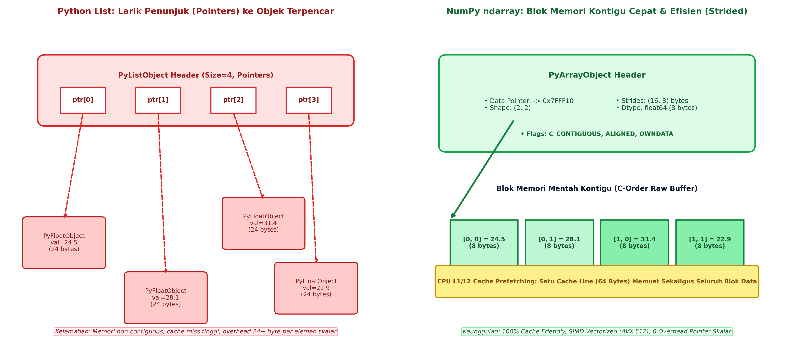
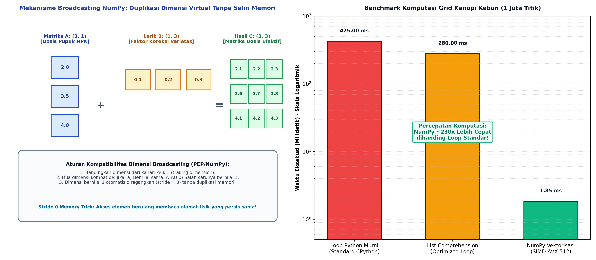

# AI Modul 4.2: NumPy untuk Komputasi Numerik

---

## 1. Identitas & Kerangka Capaian Pembelajaran (Sub-CPMK)

* **Kode Modul**        : AI Modul 4.2
* **Mata Kuliah**       : Kecerdasan Buatan dan Sains Data Pertanian Presisi
* **Alokasi Waktu**     : 2 x 50 Menit (Kajian Teori & Diskusi) + 2 x 50 Menit (Eksplorasi Praktikum Mandiri)
* **Beban SKS**         : 3 SKS
* **Prasyarat**         : AI Modul 4.1 (Pengantar Data Science)
* **Level Kognitif**    : C2 (Memahami), C3 (Menerapkan), C4 (Menganalisis)


### 1.1 Capaian Pembelajaran Khusus (Sub-CPMK)
Setelah menyelesaikan modul ini, mahasiswa dan pembelajar diharapkan mampu:
1. **Menguraikan (C2)** arsitektur internal larik ndarray NumPy: blok memori kontinu C, *strides*, dan penentuan tipe data homogen (*dtypes*).
2. **Menerapkan (C3)** operasi larik tervektorisasi (*vectorization*) dan aturan penyiaran (*broadcasting*) untuk komputasi aljabar linier bebas loop Python.
3. **Menganalisis (C4)** perbandingan efisiensi waktu eksekusi dan konsumsi cache CPU antara list bawaan Python versus NumPy ndarray.
4. **Menghitung (C3)** indeks vegetasi multispektral UAV (seperti NDVI dan SAVI) secara terprogram menggunakan operasi matriks tervektorisasi.

### 1.2 Kerangka Hasil Pembelajaran (Outputs, Outcomes, & Impacts)
* **Outputs (Keluaran Berwujud Langsung)**:
  * Menjelaskan perbedaan arsitektur memori antara Python `list` (larik penunjuk objek heterogen) dan NumPy `ndarray` (blok penyangga kontigu homogen).
  * Menghitung langkah memori (*strides*) dan memproyeksikan alamat fisik elemen matriks berdasarkan tata letak *C-contiguous* dan *Fortran-contiguous*.
  * Menerapkan tiga aturan formal kompatibilitas dimensi *broadcasting* pada operasi aritmatika larik multi-dimensi tanpa menduplikasi alokasi RAM fisik.
  * Melakukan operasi pengirisan tingkat lanjut (*advanced slicing*), penyaringan boolean (*boolean masking*), dan pengindeksan cerdas (*fancy indexing*).
  * Menyelesaikan sistem persamaan linier simultan ($A \mathbf{x} = \mathbf{b}$) untuk formulasi optimasi nutrisi pupuk menggunakan modul `numpy.linalg`.
* **Outcomes (Hasil Capaian & Perubahan Kompetensi)**:
  * Merekayasa ulang (*refactor*) kode komputasi data spasial berbasis loop bersarang (*nested for-loops*) menjadi operasi tervektorisasi SIMD dengan percepatan eksekusi di atas $100\times$.
  * Membedakan secara presisi antara operasi yang menghasilkan *view* (tampilan tanpa salinan memori) dan *copy* (salinan fisik baru) guna mencegah kebocoran memori (*memory bloat*) pada dataset berukuran gigabita.
  * Membangun modul pra-pemrosesan citra kanopi kebun (kalkulasi NDVI dan filter spasial matriks konvolusi sederhana) menggunakan primitif NumPy murni.
* **Impacts (Dampak Jangka Panjang & Nilai Guna Luas)**:
  * Peningkatan efisiensi komputasi sistem monitoring perkebunan terintegrasi di perkebunan kelapa sawit nasional.
  * Pengurangan konsumsi energi komputasi (*green computing*) pada server analitik data pertanian presisi berskala industri.
  * Fondasi fundamental yang kokoh bagi mahasiswa sebelum memasuki ranah pembelajaran mesin mendalam (*Deep Learning*) yang bertumpu pada pustaka tensor tingkat lanjut seperti PyTorch dan TensorFlow.

---

## 2. Arsitektur Internal NumPy: Mengapa NumPy Cepat?

Python standar (CPython) adalah bahasa terinterpretasi murni dengan pengetikan dinamis (*dynamically typed*). Pada saat Python mengeksekusi operasi penjumlahan sederhana di dalam loop:

```python
hasil = []
for x in data:
    hasil.append(x + 2.5)
```

CPython wajib melakukan inspeksi tipe data (*type checking*), pencarian metode pengalihan (*method dispatch*), dan pembungkusan objek baru (*boxing/unboxing*) pada setiap iterasi. Sebaliknya, NumPy mengalihkan seluruh komputasi intensif ke pustaka mesin terkompilasi (C, C++, dan Fortran teroptimasi BLAS/LAPACK).



Kecepatan komputasi NumPy bertumpu pada empat keunggulan arsitektural:
1. **Penyangga Memori Kontigu (*Contiguous Memory Buffer*):** Elemen data bertipe homogen disimpan secara berurutan dalam satu blok memori linier tak terputus.
2. **Lokalitas Spasial CPU Cache (*Cache Locality*):** Saat prosesor memuat satu elemen dari RAM ke L1/L2 Cache, unit pengendali memori (*prefetcher*) secara otomatis memuat seluruh garis cache (biasanya 64 byte) yang mencakup 8 elemen bilangan pecahan ganda berturut-turut (*64-bit float*). Akibatnya, rasio *cache miss* ditekan mendekati nol.
3. **Paralelisasi Vektorisasi SIMD (*Single Instruction, Multiple Data*):** Prosesor modern (Intel/AMD x86-64 dengan instruksi AVX2/AVX-512 atau ARM Neon) mampu mengeksekusi satu instruksi aritmatika secara paralel terhadap 4 hingga 8 angka pecahan 64-bit dalam satu siklus detak jam prosesor (*clock cycle*).
4. **Pustaka Aljabar Linier Teroptimasi:** NumPy terhubung langsung ke pustaka aljabar linier kelas dunia seperti OpenBLAS, Intel MKL (*Math Kernel Library*), atau Apple Accelerate yang dirancang khusus untuk memeras performa maksimal perangkat keras.

---

## 3. Anatomi Objek ndarray: Shape, Strides, Data Types, dan Tata Letak Memori

Jantung dari seluruh ekosistem NumPy adalah objek `numpy.ndarray` (*N-dimensional array*). Objek ini terdiri dari dua komponen inti:
1. **Header Metadata Array (`PyArrayObject`):** Struktur data kecil berbahasa C yang menyimpan informasi bentuk (*shape*), tipe data (*dtype*), bendera memori (*flags*), dan langkah memori (*strides*).
2. **Penyangga Data Mentah (*Raw Data Buffer*):** Alamat memori heap yang menyimpan nilai biner aktual.

### 3.1 Konsep Matematis Strides
Langkah memori (*strides*) adalah sebuah tupel bilangan bulat yang mendefinisikan **jumlah byte yang harus dilompati dalam memori fisik untuk berpindah satu posisi ke dimensi berikutnya**.

Misalkan sebuah matriks data sensor kebun berdimensi $M \times N$ dengan tipe data `float64` (8 byte per elemen):
- **C-Order (Row-Major):** Baris disimpan secara berurutan. Elemen bersebelahan dalam baris yang sama berjarak 8 byte:
  $$\text{Strides}_{\text{C-order}} = (N \times 8, 8)$$

  **Keterangan Simbol:**
  - $\text{Strides}_{\text{C-order}}$: Tupel lompatan memori untuk format baris utama (*row-major*).
  - $N$: Jumlah kolom dalam matriks.
  - $8$: Ukuran setiap elemen bertipe `float64` dalam satuan byte.
  - $N \times 8$: Jarak lompatan memori antar-baris berturutan (stride dimensi ke-0).

  > **Cara Membaca Rumus:**  
  > *Langkah memori urutan C sama dengan tupel beranggotakan N dikalikan delapan, dan delapan.*

  Alamat memori elemen $(i, j)$ dihitung secara deterministik melalui rumus:
  $$\text{Address}(i, j) = \text{Base\_Address} + (i \times \text{stride}_0) + (j \times \text{stride}_1)$$

  **Keterangan Simbol:**
  - $\text{Address}(i, j)$: Alamat memori absolut byte dari elemen pada baris $i$ dan kolom $j$.
  - $\text{Base\_Address}$: Alamat awal memori fisik (*pointer* penunjuk elemen pertama $[0, 0]$).
  - $i, j$: Indeks posisi baris dan kolom yang dituju ($0 \le i < M, 0 \le j < N$).
  - $\text{stride}_0, \text{stride}_1$: Besaran langkah byte untuk dimensi baris dan dimensi kolom.

  > **Cara Membaca Rumus:**  
  > *Alamat memori elemen baris i kolom j sama dengan alamat dasar ditambah hasil kali i dengan langkah dimensi nol, ditambah hasil kali j dengan langkah dimensi satu.*

- **Fortran-Order (Column-Major):** Kolom disimpan secara berurutan. Elemen bersebelahan dalam kolom yang sama berjarak 8 byte:
  $$\text{Strides}_{\text{F-order}} = (8, M \times 8)$$

  **Keterangan Simbol:**
  - $\text{Strides}_{\text{F-order}}$: Tupel lompatan memori untuk format kolom utama (*column-major*).
  - $M$: Jumlah baris dalam matriks.
  - $8$: Ukuran byte per elemen bertipe `float64`.
  - $M \times 8$: Jarak lompatan memori antar-kolom berturutan (stride dimensi ke-1).

  > **Cara Membaca Rumus:**  
  > *Langkah memori urutan Fortran sama dengan tupel beranggotakan delapan, dan M dikalikan delapan.*

```python
import numpy as np

# Membuat matriks sensor kebun 3 baris x 4 kolom (float64 = 8 bytes)
sensor_grid = np.zeros((3, 4), dtype=np.float64)

print("Shape   :", sensor_grid.shape)    # (3, 4)
print("Dtype   :", sensor_grid.dtype)    # float64
print("Itemsize:", sensor_grid.itemsize) # 8 bytes
print("Strides :", sensor_grid.strides)  # (32, 8) -> Lompat 32 byte untuk baris baru, 8 byte untuk kolom baru
```

---

## 4. Operasi Vektorisasi dan Mekanisme Aturan Penyiaran (Broadcasting Rules)

Vektorisasi (*vectorization*) adalah teknik penulisan ekspresi komputasi tingkat tinggi pada keseluruhan larik tanpa menggunakan loop eksplisit dalam kode Python.



### 4.1 Tiga Aturan Formal Kompatibilitas Penyiaran (Broadcasting)
Ketika dua larik dengan dimensi berbeda dioperasikan secara aritmatika (penjumlahan, pengurangan, perkalian elemen), NumPy membandingkan bentuk dimensi (*shape*) kedua larik mulai dari **sumbu paling kanan (*trailing dimension*) ke sumbu paling kiri**:

1. **Aturan 1 (Penyelarasan Dimensi):** Jika jumlah dimensi kedua larik berbeda, larik dengan dimensi lebih sedikit akan ditambahkan dimensi berukuran 1 pada sisi kirinya (*left-padded with ones*).
2. **Aturan 2 (Kompatibilitas Dimensi):** Dua sumbu dikatakan kompatibel jika:
   - Nilai ukuran kedua dimensi tersebut **sama besar**, ATAU
   - Salah satu ukuran dimensinya bernilai **1**.
3. **Aturan 3 (Peregangan Virtual):** Dimensi yang berukuran 1 akan diregangkan secara konseptual agar ukurannya sama dengan dimensi pasangannya. Peregangan ini **sama sekali tidak menyalin data di RAM**, melainkan hanya mengatur nilai *stride* pada sumbu tersebut menjadi **0 byte**.

#### Pembuktian Kompatibilitas Dimensi:
Misalkan matriks konsumsi pupuk blok kebun $A$ berukuran $(4, 1)$ dan vektor faktor koreksi keasaman tanah $B$ berukuran $(3,)$:
```
Langkah 1: Perataan dimensi kiri
A.shape = (4, 1)
B.shape = (1, 3)  <- ditambahkan dimensi 1 di kiri

Langkah 2: Perbandingan trailing dimension (kanan)
Sumbu 1: A memiliki ukuran 1, B memiliki ukuran 3 -> Kompatibel (1 cocok dengan 3)
Sumbu 0: A memiliki ukuran 4, B memiliki ukuran 1 -> Kompatibel (4 cocok dengan 1)

Langkah 3: Dimensi Hasil Akhir
Hasil (A + B).shape = (4, 3)
```

---

## 5. Indeksasi Tingkat Lanjut: Slicing, Boolean Masking, dan Fancy Indexing

Manipulasi subset data merupakan rutinitas utama dalam pra-pemrosesan data kecerdasan buatan. NumPy menyediakan tiga paradigma indeksasi dengan karakteristik alokasi memori yang sangat kontras:

| Metode Indeksasi | Contoh Sintaks | Karakteristik Memori | Kompleksitas Waktu |
| :--- | :--- | :--- | :--- |
| **Basic Slicing** | `data[0:5, 1:4]` | **View** (Berbagi memori yang sama) | $\mathcal{O}(1)$ |
| **Boolean Masking** | `data[data > 35.0]` | **Copy** (Mengalokasikan memori baru) | $\mathcal{O}(N)$ |
| **Fancy Indexing** | `data[[0, 2, 4], :]` | **Copy** (Mengalokasikan memori baru) | $\mathcal{O}(K)$ |

### 5.1 Bahaya Tersembunyi: Mutasi Data pada *View* vs *Copy*
Ketika melakukan pemotongan (*slicing*), array turunan yang dihasilkan tidak memiliki data sendiri (`array.base` menunjuk ke array asal). Jika nilai pada irisan tersebut diubah, maka data pada array asli **ikut termutasi secara permanen**.

```python
import numpy as np

# Matriks temperatur kanopi kebun (Celcius)
suhu_kebun = np.array([[28.5, 29.2, 31.0],
                       [30.1, 32.4, 33.8]])

# Slicing menghasilkan VIEW
sub_blok = suhu_kebun[:, 0:2]
sub_blok[0, 0] = 99.9  # Bahaya: Termutasi pada data induk!

print("Suhu Kebun Asli:\n", suhu_kebun)
# Elemen [0, 0] telah berubah menjadi 99.9!
```

Jika diinginkan independensi data, instruksi wajib menyertakan metode duplikasi eksplisit:
```python
sub_blok_aman = suhu_kebun[:, 0:2].copy()
```

---

## 6. Aljabar Linear dan Operasi Matriks untuk Sains Data Pertanian Presisi

Modul `numpy.linalg` menyediakan implementasi aljabar linier tingkat tinggi untuk menyelesaikan masalah optimasi multi-variabel di lapangan.

### 6.1 Perkalian Matriks: Hadamard Product vs Dot Product
Dalam sains data pertanian, penting membedakan:
1. **Perkalian Elemen (*Hadamard Product* - Operator `*`):** Mengalikan elemen pada indeks yang sama ($C_{ij} = A_{ij} \times B_{ij}$). Syarat: dimensi kedua matriks harus identik atau mematuhi aturan broadcasting.
2. **Perkalian Matriks Aljabar (*Dot Product* - Operator `@` atau `np.dot`):**
   $$C_{ij} = \sum_{k=1}^P A_{ik} B_{kj}$$

   **Keterangan Simbol:**
   - $C_{ij}$: Elemen hasil perkalian matriks pada baris ke-$i$ dan kolom ke-$j$ ($C \in \mathbb{R}^{M \times N}$).
   - $A_{ik}$: Elemen matriks pertama $A$ pada baris ke-$i$ dan kolom ke-$k$ ($A \in \mathbb{R}^{M \times P}$).
   - $B_{kj}$: Elemen matriks kedua $B$ pada baris ke-$k$ dan kolom ke-$j$ ($B \in \mathbb{R}^{P \times N}$).
   - $P$: Dimensi dalam bersama (*shared inner dimension*); jumlah kolom $A$ harus sama persis dengan jumlah baris $B$.
   - $\sum_{k=1}^P$: Penjumlahan perkalian skalar sepanjang dimensi perantara $k=1$ hingga $P$.

   > **Cara Membaca Rumus:**  
   > *Elemen C sub i j sama dengan jumlah dari k sama dengan satu sampai P untuk perkalian elemen A sub i k dengan B sub k j.*

   Syarat: Jumlah kolom matriks pertama harus sama dengan jumlah baris matriks kedua ($M \times P$ dengan $P \times N$).

### 6.2 Studi Kasus: Optimasi Komposisi Pupuk Campuran (Linear System Solver)
Sebuah laboratorium agronomi perkebunan ingin meracik pupuk campuran yang mengandung tepat 180 kg Nitrogen (N), 100 kg Fosfor (P), dan 120 kg Kalium (K). Tersedia tiga jenis pupuk komersial dengan kandungan hara per karung:
- **Pupuk A (Urea):** $46\%$ N, $0\%$ P, $0\%$ K
- **Pupuk B (SP-36):** $0\%$ N, $36\%$ P, $0\%$ K
- **Pupuk C (KCl):** $0\%$ N, $0\%$ P, $60\%$ K

Persamaan matriks $A \mathbf{x} = \mathbf{b}$ diformulasikan sebagai:
$$\begin{bmatrix} 0.46 & 0.00 & 0.00 \\ 0.00 & 0.36 & 0.00 \\ 0.00 & 0.00 & 0.60 \end{bmatrix} \begin{bmatrix} x_A \\ x_B \\ x_C \end{bmatrix} = \begin{bmatrix} 180 \\ 100 \\ 120 \end{bmatrix}$$

**Keterangan Simbol:**
- Matriks koefisien $A \in \mathbb{R}^{3 \times 3}$: Persentase fraksi kandungan hara Nitrogen, Fosfor, dan Kalium pada masing-masing pupuk.
- Vektor variabel $\mathbf{x} = [x_A, x_B, x_C]^T$: Kebutuhan bobot masing-masing pupuk A, B, dan C (satuan: kg).
- Vektor target $\mathbf{b} = [180, 100, 120]^T$: Target kandungan hara murni Nitrogen, Fosfor, dan Kalium (satuan: kg).

> **Cara Membaca Notasi Matriks:**  
> *Matriks koefisien tiga kali tiga dikalikan vektor variabel x sub A, x sub B, x sub C, sama dengan vektor target seratus delapan puluh, seratus, dan seratus dua puluh.*

Solusi eksak dihitung menggunakan dekomposisi LU melalui `np.linalg.solve(A, b)`:
$$\mathbf{x} = A^{-1}\mathbf{b}$$

**Keterangan Simbol:**
- $\mathbf{x}$: Vektor solusi unik yang dicari.
- $A^{-1}$: Matriks invers dari $A$ (dengan syarat determinan $\det(A) \ne 0$).
- $\mathbf{b}$: Vektor konstanta ruas kanan.

> **Cara Membaca Rumus:**  
> *Vektor solusi x sama dengan invers matriks A dikalikan vektor konstanta b.*

---

## 7. Komputasi Kinerja Tinggi: Efisiensi Memori dan Manipulasi Bentuk

Manipulasi bentuk data tanpa pemborosan alokasi memori adalah kunci pemrosesan citra multispektral drone berukuran gigabita:
1. **`reshape()` vs `resize()`:** `reshape()` menghasilkan *view* baru dengan metadata dimensi yang dimodifikasi tanpa mengubah isi penyangga data fisik. Sebaliknya, `resize()` memodifikasi ukuran array asli di tempat (*in-place*).
2. **`ravel()` vs `flatten()`:** `ravel()` mengembalikan larik 1 dimensi sebagai *view* (jika memori kontigu), sedangkan `flatten()` selalu mengalokasikan memori baru (*copy*).
3. **Efisiensi Tipe Data (*Downcasting*):** Data citra satelit sering kali dimuat sebagai `float64` (8 byte per piksel). Jika rentang nilai berada pada integer non-negatif $0 - 255$, konversi ke `uint8` (1 byte per piksel) menghemat $87.5\%$ kapasitas RAM server:
   $$\text{Penghematan Memori} = \left(1 - \frac{1}{8}\right) \times 100\% = 87.5\%$$

   **Keterangan Simbol:**
   - $1$: Representasi kapasitas memori awal ($100\%$, yaitu basis tipe 8-byte `float64`).
   - $\frac{1}{8}$: Rasio ukuran tipe data tujuan (`uint8`, 1 byte) terhadap tipe data asal (`float64`, 8 byte).
   - $87.5\%$: Persentase kapasitas memori kerja yang berhasil dibebaskan melalui teknik downcasting.

   > **Cara Membaca Rumus:**  
   > *Penghematan memori sama dengan kurung buka satu dikurangi satu per delapan kurung tutup dikalikan seratus persen, menghasilkan delapan puluh tujuh koma lima persen.*

---

## 8. Rangkuman Komprehensif

1. **Efisiensi Internal NumPy:** Kecepatan NumPy bersumber dari penyimpanan memori kontigu C-order, minimalisasi penundaan interpreter Python, utilisasi CPU cache L1/L2, serta instruksi vektorisasi prosesor SIMD.
2. **Anatomi Strides:** Strides memetakan alamat 1 dimensi penyangga memori fisik ke dalam koordinat $N$-dimensi logis. Operasi transposisi (`array.T`) atau pemotongan (*slice*) hanya mengubah metadata strides dan shape tanpa menyalin isi array.
3. **Broadcasting Virtual:** Broadcasting memungkinkan operasi aritmatika larik dengan dimensi berbeda selama memenuhi aturan kompatibilitas trailing. Dimensi berukuran 1 diregangkan secara virtual dengan menetapkan langkah memori (*stride*) sama dengan 0 byte.
4. **Disiplin View vs Copy:** Pengirisan (*slicing*) dasar selalu menghasilkan *view*. Modifikasi pada *view* akan mengubah data asli. Sebaliknya, *boolean masking* dan *fancy indexing* selalu menghasilkan objek salinan fisik (*copy*) yang independen.
5. **Aplikasi Pertanian Presisi:** Pustaka `numpy.linalg` memungkinkan penyelesaian aljabar linier, inversi matriks, dan dekomposisi ruang vektor untuk optimasi taksasi hara tanah, interpolasi spasial kebun, dan kalkulasi indeks vegetasi secara masif.

---

## 9. Latihan Soal dan Tantangan HOTS (Higher-Order Thinking Skills)

### 9.1 Analisis Arsitektur Memori dan Strides (Bobot: 30%)
Diberikan sebuah matriks telemetri sensor kelapa sawit $M$ bertipe `float64` berdimensi $(4, 6)$ yang disimpan dalam format standar *C-contiguous*.
1. Hitung nilai tupel langkah memori (*strides*) dari matriks $M$ tersebut dalam satuan byte!
2. Jika dilakukan operasi transposisi $M_T = M.T$, tentukan nilai shape dan strides dari matriks $M_T$! Jelaskan apakah operasi transposisi tersebut mengalokasikan memori baru di RAM atau hanya membuat sebuah *view*!
3. Jika elemen pertama $M[0, 0]$ berada pada alamat memori fisik heksadesimal `0x1000`, hitung alamat memori fisik untuk elemen $M[2, 4]$!

### 9.2 Rancang Bangun Algoritma Vektorisasi Spasial Kebun (Bobot: 40%)
Anda diminta menganalisis data kanopi perkebunan kelapa sawit seluas 1.000 hektar yang direpresentasikan sebagai matriks citra multispektral berdimensi $1000 \times 1000$ piksel. Disediakan dua matriks NumPy bertipe `float32`:
- Matriks `NIR`: Nilai reflektansi inframerah dekat ($0.0 \le \text{NIR} \le 1.0$)
- Matriks `RED`: Nilai reflektansi cahaya merah ($0.0 \le \text{RED} \le 1.0$)

Formula agronomi indeks vegetasi NDVI didefinisikan sebagai:
$$\text{NDVI} = \frac{\text{NIR} - \text{RED}}{\text{NIR} + \text{RED}}$$

**Keterangan Simbol:**
- $\text{NDVI}$: Matriks indeks vegetasi selisih ternormalisasi (*Normalized Difference Vegetation Index*).
- $\text{NIR}$: Matriks reflektansi spektral inframerah dekat (*Near-Infrared*).
- $\text{RED}$: Matriks reflektansi spektral cahaya merah tampak (*Red*).

> **Cara Membaca Rumus:**  
> *Matriks NDVI sama dengan matriks NIR dikurangi matriks RED, dibagi dengan hasil penjumlahan matriks NIR ditambah matriks RED.*

- **Instruksi Analitis:**
  a. Tuliskan kode tervektorisasi satu baris (*single-line vectorized code*) untuk menghitung matriks `NDVI` secara aman (hindari pembagian dengan nol menggunakan `np.where` atau penambahan konstanta $\epsilon = 10^{-7}$).
  b. Tuliskan perintah NumPy berbasis *boolean masking* untuk mengekstrak seluruh nilai NDVI yang mengindikasikan kanopi sawit sehat padat ($\text{NDVI} \ge 0.70$) dan hitung persentase luas area kanopi sehat tersebut terhadap total area kebun!
  c. Bandingkan kompleksitas waktu asimptotik dan efisiensi memori antara pendekatan tervektorisasi di atas dengan pendekatan perulangan bersarang ganda (`for i in range: for j in range:`) dalam Python murni!

### 9.3 Pemecahan Masalah Aljabar Linear Terapan (Bobot: 30%)
Sebuah konsorsium pabrik kelapa sawit mengoperasikan tiga stasiun pembangkit uap turbin biomassa ($T_1, T_2, T_3$) yang memanfaatkan cangkang sawit, serabut (*fiber*), dan tandan kosong. Sistem menghasilkan energi listrik harian yang dirumuskan melalui sistem persamaan linier simultan:
$$\begin{aligned}
2T_1 + 3T_2 + T_3 &= 2800 \text{ kWh} \\
4T_1 + T_2 + 2T_3 &= 3200 \text{ kWh} \\
3T_1 + 2T_2 + 4T_3 &= 4200 \text{ kWh}
\end{aligned}$$

**Keterangan Simbol:**
- $T_1, T_2, T_3$: Variabel output energi listrik dari turbin biomassa ke-1, ke-2, dan ke-3 (satuan: kWh).
- Koefisien $(2, 3, 1; 4, 1, 2; 3, 2, 4)$: Matriks kontribusi operasional turbin antar-shift.
- Ruas kanan ($2800, 3200, 4200$): Target total energi listrik harian pabrik (satuan: kWh).

> **Cara Membaca Sistem Persamaan:**  
> *Dua T satu ditambah tiga T dua ditambah T tiga sama dengan dua ribu delapan ratus; empat T satu ditambah T dua ditambah dua T tiga sama dengan tiga ribu dua ratus; serta tiga T satu ditambah dua T dua ditambah empat T tiga sama dengan empat ribu dua ratus.*
1. Susunlah sistem persamaan di atas ke dalam notasi matriks kanonik $A \mathbf{x} = \mathbf{b}$!
2. Hitung determinan dari matriks koefisien $A$. Berdasarkan nilai determinan tersebut, jelaskan apakah sistem persamaan memiliki solusi unik tunggal!
3. Tuliskan blok kode NumPy untuk mengkalkulasi vektor solusi output daya masing-masing turbin $\mathbf{x} = [T_1, T_2, T_3]^T$!

---

## 10. Daftar Pustaka dan Referensi Akademik

1. Harris, C. R., Millman, K. J., van der Walt, S. J., Gommers, R., Virtanen, P., Cournapeau, D., ... & Oliphant, T. E. (2020). Array programming with NumPy. *Nature*, 585(7825), 357-362.
2. van der Walt, S., Colbert, S. C., & Varoquaux, G. (2011). The NumPy array: a structure for efficient numerical computation. *Computing in Science & Engineering*, 13(2), 22-30.
3. Oliphant, T. E. (2006). *A guide to NumPy*. Trelgol Publishing, USA.
4. McKinney, W. (2022). *Python for Data Analysis: Data Wrangling with pandas, NumPy, and Jupyter* (3rd ed.). O'Reilly Media, Inc.
5. Golub, G. H., & Van Loan, C. F. (2013). *Matrix Computations* (4th ed.). Johns Hopkins University Press, Baltimore.
6. Rouse, J. W., Haas, R. H., Schell, J. A., & Deering, D. W. (1974). Monitoring vegetation systems in the Great Plains with ERTS. *Third ERTS-1 Symposium*, NASA SP-351, 309-317.
