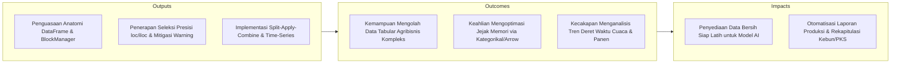
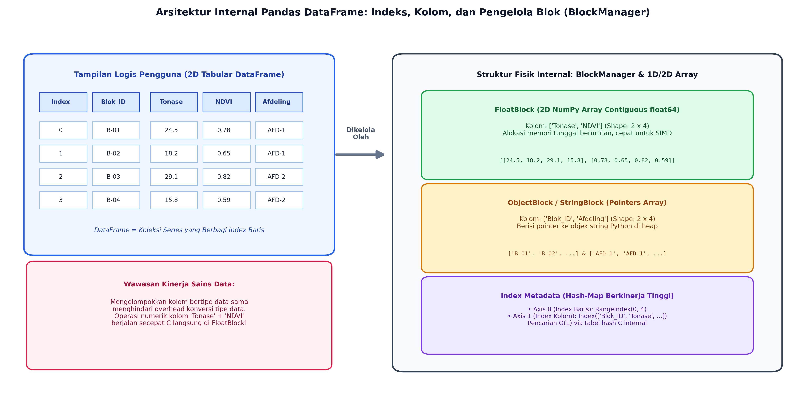
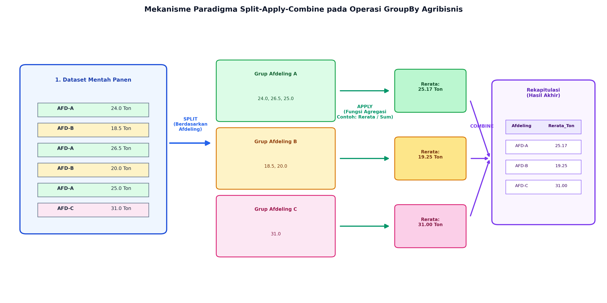

# AI Modul 4.3: Pandas untuk Manipulasi Data

---

## 1. Identitas & Kerangka Capaian Pembelajaran (Sub-CPMK)

* **Kode Modul**        : AI Modul 4.3
* **Mata Kuliah**       : Kecerdasan Buatan dan Sains Data Pertanian Presisi
* **Alokasi Waktu**     : 2 x 50 Menit (Kajian Teori & Diskusi) + 2 x 50 Menit (Eksplorasi Praktikum Mandiri)
* **Beban SKS**         : 3 SKS
* **Prasyarat**         : AI Modul 4.2 (NumPy Komputasi Numerik)
* **Level Kognitif**    : C2 (Memahami), C3 (Menerapkan), C4 (Menganalisis)



### 1.1 Capaian Pembelajaran Khusus (Sub-CPMK)
Setelah menyelesaikan modul ini, mahasiswa dan pembelajar diharapkan mampu:
1. **Mengidentifikasi (C2)** struktur data fundamental Pandas (Series 1D dan DataFrame 2D) serta mekanisme pengindeksan eksplisit (*Index*).
2. **Menerapkan (C3)** teknik pengirisan dan penyaringan data tabular perkebunan menggunakan pengindeks berbasis label (`loc`) dan berbasis posisi (`iloc`).
3. **Menganalisis (C4)** agregasi multi-dimensi menggunakan operasi `groupby()`, `pivot_table()`, dan fungsi penggabungan data (`merge`, `join`, `concat`).
4. **Mengelola (C3)** data deret waktu (*Time-Series*) sensor cuaca perkebunan dengan pengindeksan tanggal (`DatetimeIndex`) dan *resampling* temporal.

### 1.2 Kerangka Hasil Pembelajaran (Outputs, Outcomes, & Impacts)
* **Outputs (Keluaran Berwujud Langsung)**:
  * Menjelaskan struktur internal `DataFrame`, relasi antara `Index`, `Series`, dan pengelola memori tingkat rendah (*BlockManager*).
  * Membedakan secara tegas mekanisme seleksi berbasis label (`.loc`) dan seleksi berbasis posisi integer (`.iloc`), serta mendiagnosis akar penyebab munculnya `SettingWithCopyWarning`.
  * Mengorkestrasi operasi agregasi multi-tingkat menggunakan paradigma *Split-Apply-Combine* via metode `.groupby()` dan `.agg()`.
  * Menggabungkan sekumpulan tabel terdistribusi menggunakan operasi relasional (`merge`, `join`, `concat`) dan restrukturisasi bentuk data (`pivot_table`, `melt`).
  * Memproses data deret waktu telemetri iklim kebun menggunakan *DatetimeIndex*, *resampling*, serta kalkulasi jendela geser (*rolling windows*).
* **Outcomes (Hasil Capaian & Perubahan Kompetensi)**:
  * Membangun skrip transformasi data panen TBS yang efisien, menggabungkan data timbangan PKS, sensus kerapatan buah afdeling, dan stasiun cuaca kebun secara otomatis.
  * Mengurangi konsumsi memori RAM dataset besar hingga di atas $60\%$ melalui teknik *downcasting* tipe numerik dan pemanfaatan tipe data `category` atau backend Apache Arrow.
  * Menghitung indikator tren agronomi (misalnya anomali akumulasi defisit air 30 harian atau rata-rata bergerak tonase panen) tanpa menggunakan perulangan lambat.
* **Impacts (Dampak Jangka Panjang & Nilai Guna Luas)**:
  * Standardisasi alur rekayasa fitur tabular pada ekosistem kecerdasan buatan perkebunan nasional.
  * Kecepatan respon manajerial dalam mengidentifikasi defisit produktivitas blok kebun melalui analitik agregatif yang deterministik.
  * Kesiapan mahasiswa dalam mengarungi arsitektur pemrosesan data skala masif (*Big Data*) seperti PySpark dan Polars yang mengadopsi API serupa Pandas.

---

## 2. Arsitektur Internal Pandas: Seri, DataFrame, dan BlockManager

Pandas menyajikan ilusi tabel dua dimensi yang seragam bagi pengguna, namun di bawah kap mesin (*under the hood*), penyimpanan memori dikelola secara terkotak-kotak oleh komponen internal yang disebut **BlockManager**.



### 2.1 Seri (*Series*) dan Indeks (*Index*)
- **`pd.Series`:** Larik satu dimensi berlabel homogen yang merupakan pembungkus tipis di atas NumPy 1D `ndarray`, dilengkapi objek `Index`.
- **`pd.Index`:** Struktur data khusus nir-mutasi (*immutable*) berbasis tabel hash C internal yang memungkinkan pencarian label baris atau kolom dengan kompleksitas waktu $\mathcal{O}(1)$.

### 2.2 Mekanika BlockManager
Dalam objek `pd.DataFrame`, kolom-kolom tidak disimpan sebagai larik terpisah per kolom. Sebaliknya, Pandas mengelompokkan seluruh kolom yang memiliki **tipe data (*dtype*) identik** ke dalam satu blok memori 2D NumPy yang kontigu:
- **FloatBlock:** Menggabungkan seluruh kolom `float64` (misalnya kolom `Tonase_TBS` dan `Indeks_NDVI`) ke dalam satu matriks NumPy berdimensi $(K_{\text{float}} \times N_{\text{baris}})$.
- **IntBlock:** Menggabungkan kolom-kolom bertipe integer.
- **ObjectBlock:** Mengelola kolom bertipe string atau objek umum Python melalui larik pointer ke memori heap.

> **Wawasan Rekayasa:** Melakukan operasi aritmatika pada dua kolom numerik yang berada di dalam *FloatBlock* yang sama akan berlangsung sangat cepat karena memanfaatkan efisiensi memori kontigu NumPy dan vektorisasi CPU. Sebaliknya, modifikasi kolom yang memaksa konversi tipe data akan memicu konsolidasi blok (*block consolidation*) yang memerlukan alokasi memori ulang yang mahal.

---

## 3. Seleksi dan Pengindeksan Presisi: loc vs iloc dan Bahaya SettingWithCopyWarning

Kesalahan paling umum dalam manipulasi data tabular adalah ambiguitas seleksi data dan penugasan nilai berantai (*chained indexing*).

### 3.1 Pembedaan Fundamental: `.loc` versus `.iloc`
Pandas secara tegas memisahkan dua paradigma pengindeksan:
1. **`.loc` (Label-Based Indexing):** Mengakses data berdasarkan **nama label** indeks baris dan nama kolom.
   - Karakteristik batas pengirisan (*slice*): **Inklusif pada kedua ujungnya** (`[awal:akhir]` menyertakan elemen `akhir`).
2. **`.iloc` (Integer Position-Based Indexing):** Mengakses data murni berdasarkan **posisi indeks integer berbasis nol ($0, 1, \dots, n-1$)**.
   - Karakteristik batas pengirisan: **Eksklusif pada batas akhir** (`[awal:akhir]` tidak menyertakan elemen `akhir`), persis seperti Python list standar.

```python
import pandas as pd

df = pd.DataFrame({
    'Blok_ID': ['B-01', 'B-02', 'B-03'],
    'Tonase': [24.5, 18.2, 29.1]
}, index=['Alpha', 'Beta', 'Gamma'])

# Akses berbasis Label (.loc)
print(df.loc['Alpha':'Beta', 'Tonase'])  # Menyertakan 'Beta'

# Akses berbasis Posisi Integer (.iloc)
print(df.iloc[0:2, 1])                   # Baris 0 dan 1 (tanpa baris 2), kolom 1
```

### 3.2 Dekonstruksi Bahaya SettingWithCopyWarning
Peringatan `SettingWithCopyWarning` muncul ketika pengguna mencoba mengubah nilai menggunakan penugasan berantai (*chained assignment*):

```python
# SANGAT BERBAHAYA (Chained Assignment):
df[df['Tonase'] < 20.0]['Tonase'] = 20.0  # Memicu SettingWithCopyWarning!
```

**Mengapa ini berbahaya?**
Ekspresi `df[df['Tonase'] < 20.0]` mengembalikan objek sementara (*temporary object*). CPython tidak dapat menjamin apakah objek sementara tersebut adalah *view* dari DataFrame asli ataukah sebuah *copy* mandiri di RAM. Jika yang dihasilkan adalah *copy*, maka operasi penugasan `= 20.0` hanya mengubah objek sementara yang langsung dibuang oleh *garbage collector*, sementara DataFrame induk asli **sama sekali tidak mengalami perubahan**.

**Solusi Standar Industri:** Selalu gunakan akses tunggal `.loc`:
```python
# AMAN DAN DETERMINISTIK:
df.loc[df['Tonase'] < 20.0, 'Tonase'] = 20.0
```

---

## 4. Mekanisme Split-Apply-Combine: Paradigma Agregasi GroupBy Tingkat Lanjut

Analitik bisnis perkebunan kelapa sawit hampir selalu melibatkan agregasi hierarkis: dari level blok $\to$ afdeling $\to$ estate $\to$ regional kebun.



Konsep *Split-Apply-Combine* yang dipopulerkan oleh Hadley Wickham (2011) diimplementasikan di Pandas melalui tiga fase:
1. **Split (Pemisahan):** Data dibagi menjadi partisi-partisi grup berdasarkan kunci diskrit (misal: kolom `Afdeling`).
2. **Apply (Penerapan):** Suatu fungsi matematis diterapkan secara independen pada setiap grup data. Terdapat tiga kelas fungsi:
   - **Agregasi (*Aggregation*):** Mereduksi sekumpulan baris menjadi skalar tunggal ($\text{mean}, \text{sum}, \text{std}, \text{min}, \text{max}$).
   - **Transformasi (*Transformation*):** Menghasilkan larik baru dengan ukuran dimensi baris yang sama dengan data asli (misal: standarisasi Z-score per kelompok afdeling: $\frac{x - \mu_{\text{grup}}}{\sigma_{\text{grup}}}$).
   - **Penyaringan (*Filtration*):** Membuang grup yang tidak memenuhi kriteria logis tertentu (misal: membuang afdeling yang memiliki kurang dari 10 blok aktif).
3. **Combine (Penggabungan):** Seluruh hasil kalkulasi lokal digabungkan kembali menjadi struktur data `DataFrame` atau `Series` terpadu.

```python
# Agregasi Multi-Fungsi yang Rapi Menggunakan Kamus Terstruktur
rekap_afdeling = df_sawit.groupby('Afdeling').agg(
    Rerata_Tonase=('Tonase_TBS', 'mean'),
    Total_Produksi=('Tonase_TBS', 'sum'),
    Variansi_Yield=('Tonase_TBS', 'std'),
    Jumlah_Blok=('Blok_ID', 'count')
).reset_index()
```

---

## 5. Operasi Relasional Data Tabular: Merge, Join, Concat, dan Reshaping

Integrasi sistem informasi pertanian cerdas melibatkan penggabungan data heterogen dari berbagai departemen perkebunan.

### 5.1 Aljabar Relasional: `.merge()`
Pandas mengimplementasikan operasi *join* setara SQL melalui fungsi `.merge()`:
- **`inner`:** Mempertahankan hanya baris dengan kunci kecocokan di kedua tabel.
- **`left`:** Mempertahankan seluruh baris tabel kiri; kunci yang tidak ditemukan pada tabel kanan diisi `NaN`.
- **`right`:** Mempertahankan seluruh baris tabel kanan.
- **`outer`:** Menggabungkan seluruh baris dari kedua tabel (*full union*).

### 5.2 Restrukturisasi Bentuk Data: Wide vs Long Format
- **`pd.pivot_table()`:** Mengubah data dari format panjang (*long format*) menjadi format lebar (*wide format*), sangat ideal untuk membuat matriks rekapitulasi produksi bulanan antar-afdeling.
- **`pd.melt()`:** Membalikkan format lebar kembali ke format panjang (*unpivoting*), yang merupakan struktur kanonik standar (*tidy data*) sebelum diumpankan ke pustaka pemodelan Scikit-Learn atau visualisasi Seaborn.

---

## 6. Penanganan Deret Waktu (Time Series) Telemetri Kebun dan Analitik Jendela Geser

Fluktuasi faktor lingkungan perkebunan (curah hujan, suhu kanopi, kelembaban udara) bersifat runtun waktu (*time series*).

```
   Index Waktu (DatetimeIndex)
   2026-01-01 00:00:00  -->  Telemetri Curah Hujan AWS
   2026-01-01 01:00:00  -->  Telemetri Curah Hujan AWS
   ...
```

### 6.1 Resampling Runtun Waktu
- **Downsampling:** Mengurangi frekuensi pencatatan data (misal: dari data per jam ke data harian atau bulanan) menggunakan metode agregasi:
  ```python
  df_harian = df_sensor.resample('D').sum()
  ```
- **Upsampling:** Meningkatkan frekuensi waktu (misal: dari bulanan ke harian) yang menuntut teknik pengisian nilai (*forward-fill* `ffill`, *backward-fill* `bfill`, atau interpolasi polinomial).

### 6.2 Formula Matematis Jendela Geser (*Rolling Windows*)
Dalam agronomi kelapa sawit, produksi buah saat ini dipengaruhi oleh ketersediaan air pada periode historis. 
- **Rata-Rata Bergerak Sederhana (*Simple Moving Average* - SMA):**
  Untuk jendela waktu berukuran $w$ observasi:
  $$\bar{x}_t^{(w)} = \frac{1}{w}\sum_{i=0}^{w-1} x_{t-i}$$

  **Keterangan Simbol:**
  - $\bar{x}_t^{(w)}$: Nilai rata-rata bergerak sederhana (*Simple Moving Average*) pada titik waktu $t$ dengan ukuran jendela $w$.
  - $w$: Ukuran jendela geser (*rolling window size*), yaitu jumlah observasi historis yang diikutsertakan.
  - $x_{t-i}$: Nilai observasi data pada $i$ periode sebelum waktu $t$.
  - $\sum_{i=0}^{w-1}$: Operasi penjumlahan dari data periode sekarang ($i=0$) mundur ke belakang hingga $w-1$ langkah sebelumnya.

  > **Cara Membaca Rumus:**  
  > *Rata-rata bergerak x bar waktu t untuk jendela w sama dengan satu per w dikalikan jumlah dari i sama dengan nol sampai w minus satu untuk nilai x sub t minus i.*

- **Rata-Rata Bergerak Eksponensial (*Exponential Moving Average* - EMA):**
  Memberikan bobot lebih tinggi pada observasi cuaca terkini:
  $$\text{EMA}_t = \alpha x_t + (1 - \alpha) \text{EMA}_{t-1}, \quad \text{di mana } \alpha = \frac{2}{w + 1}$$

  **Keterangan Simbol:**
  - $\text{EMA}_t$: Nilai rata-rata bergerak eksponensial (*Exponential Moving Average*) pada waktu $t$.
  - $\text{EMA}_{t-1}$: Nilai rata-rata bergerak eksponensial pada periode sebelumnya ($t-1$).
  - $x_t$: Nilai observasi aktual pada waktu $t$.
  - $\alpha$: Faktor pemulusan eksponensial (*smoothing factor*), bernilai antara $0 < \alpha \le 1$.
  - $w$: Ukuran jendela periode waktu ekivalen.

  > **Cara Membaca Rumus:**  
  > *EMA waktu t sama dengan alfa dikalikan x waktu t, ditambah kurung buka satu dikurangi alfa kurung tutup dikalikan EMA waktu t minus satu; di mana alfa sama dengan dua dibagi w ditambah satu.*

```python
# Menghitung akumulasi curah hujan 30 hari ke belakang (Rolling Sum)
df_cuaca['Hujan_Kumulatif_30H'] = df_cuaca['Curah_Hujan_mm'].rolling(window=30, min_periods=1).sum()
```

---

## 7. Optimasi Kinerja dan Efisiensi Memori: Tipe Kategorikal dan Arrow Backend

Dataset operasional perkebunan skala enterprise dapat memuat puluhan juta rekaman baris sensor dan log transaksi.

### 7.1 Optimalisasi Kolom Teks dengan Tipe `category`
Kolom bertipe `object` yang memuat nilai string berulang (misalnya nama afdeling: `"AFD-01"`, `"AFD-02"`) menghabiskan memori besar karena setiap sel menyimpan pointer unik ke objek string di heap.
Dengan mengubahnya menjadi `category`, Pandas hanya menyimpan bilangan bulat kecil berukuran 1 byte (`int8` kode kategori) dan satu tabel referensi kamus kecil (*lookup dictionary*):
$$\text{Penghematan Memori Kolom String} \ge 75\%$$

**Keterangan Simbol:**
- $\ge 75\%$: Penurunan konsumsi kapasitas memori kerja (RAM) setelah konversi kolom objek teks berulang menjadi format bilangan bulat kamus terindeks.

> **Cara Membaca Notasi:**  
> *Penghematan memori kolom string lebih besar dari atau sama dengan tujuh puluh lima persen.*

```python
df['Afdeling'] = df['Afdeling'].astype('category')
```

### 7.2 Backend Komputasi Apache Arrow (Pandas 2.0+)
Secara tradisional, nilai hilang (*missing values*) pada kolom integer memaksa Pandas mengonversi tipe data ke `float64` karena format standar NumPy tidak mendukung integer bernilai `NaN`. 
Mulai versi 2.0+, Pandas mendukung backend memori **Apache Arrow** (`dtype_backend='pyarrow'`) yang menyediakan:
1. Representasi *nullable* asli untuk seluruh tipe data skalar tanpa konversi paksa (*lossless nullability*).
2. Format memori berbasis kolom (*columnar memory*) nir-salin (*zero-copy interoperability*) dengan pustaka komputasi modern lainnya.

---

## 8. Rangkuman Komprehensif

1. **Struktur BlockManager:** `DataFrame` adalah kumpulan seri yang berbagi indeks baris. Di balik layar, Pandas mengelompokkan kolom bertipe sejenis ke dalam blok-blok NumPy 2D kontigu (*FloatBlock, IntBlock*) untuk memaksimalkan performa komputasi.
2. **Disiplin `.loc` vs `.iloc`:** Gunakan `.loc` untuk pengindeksan berbasis nama label (inklusif di kedua ujung) dan `.iloc` untuk pengindeksan berbasis posisi ordinal integer (eksklusif di ujung akhir). Hindari penugasan berantai (*chained indexing*) untuk melenyapkan resiko mutasi gagal pada `SettingWithCopyWarning`.
3. **Kekuatan Split-Apply-Combine:** Pola `.groupby()` memungkinkan agregasi, transformasi, dan pemfilteran hierarkis tingkat tinggi dari level petak tanaman hingga konsesi kebun skala korporasi.
4. **Aljabar Deret Waktu:** Pemanfaatan `DatetimeIndex` menyediakan fasilitas `resample()` untuk konversi frekuensi temporal dan `rolling()` untuk menghitung dinamika tren historis cuaca serta fluktuasi produksi.
5. **Manajemen Memori Efisien:** Pengubahan kolom teks berulang ke tipe `category` dan adopsi backend Apache Arrow mampu mereduksi penggunaan RAM hingga di atas $60\%$ pada dataset agribisnis skala besar.

---

## 9. Latihan Soal dan Tantangan HOTS (Higher-Order Thinking Skills)

### 9.1 Analisis Integritas Pengindeksan & Mekanika Memori (Bobot: 30%)
Perhatikan cuplikan kode analitik perkebunan berikut:
```python
sub_data = df[df['Curah_Hujan_mm'] > 200.0]
sub_data['Status_Kekeringan'] = 'Aman'
```
1. Jelaskan secara teknis mengapa CPython/Pandas memunculkan pesan peringatan `SettingWithCopyWarning` pada eksekusi baris kedua! Apakah nilai pada `df` asli pasti termutasi?
2. Tuliskan perbaikan kode di atas menggunakan dua pendekatan yang berbeda:
   - Pendekatan A: Penugasan langsung ke DataFrame induk `df` tanpa menghasilkan peringatan.
   - Pendekatan B: Penugasan ke salinan fisik independen `sub_data` tanpa memicu peringatan.
3. Jika sebuah DataFrame memiliki 1.000.000 baris dengan kolom `Status_Panen` yang hanya memuat dua kategori string: `"SELESAI"` dan `"BELUM"`, hitung perkiraan efisiensi memori (dalam megabita) jika tipe data kolom tersebut dikonversi dari `object` menjadi `category`!

### 9.2 Rancang Bangun Agregasi Runtun Waktu Multi-Sumber (Bobot: 40%)
Anda diberikan dua dataset terpisah dari operasional kebun kelapa sawit:
- **Tabel `df_panen`:** Memuat data transaksi panen harian (`Tanggal`, `Blok_ID`, `Afdeling`, `Tonase_TBS`).
- **Tabel `df_stasiun_cuaca`:** Memuat data telemetri iklim otomatis per 30 menit (`Timestamp`, `Afdeling`, `Curah_Hujan_mm`, `Radiasi_Surya_Wm2`).

- **Instruksi Analitis:**
  a. Tuliskan blok kode Pandas untuk melakukan *downsampling* pada tabel `df_stasiun_cuaca` dari frekuensi 30 menit menjadi agregat harian per afdeling, di mana curah hujan dijumlahkan (*sum*) dan radiasi surya dirata-ratakan (*mean*)!
  b. Gabungkan (*merge*) tabel panen harian dengan tabel agregat cuaca harian tersebut berdasarkan kunci gabungan (`Tanggal` dan `Afdeling`) menggunakan metode *left join*!
  c. Pada tabel hasil penggabungan, hitung akumulasi curah hujan 7 hari terakhir (*7-day rolling sum*) untuk setiap afdeling menggunakan kombinasi `.groupby()` dan `.rolling()`!

### 9.3 Problem Solusi: Restrukturisasi Matriks Rotasi Panen (Bobot: 30%)
Sebuah konsesi perkebunan memerlukan laporan rekapitulasi produktivitas bulanan (Ton/Ha) dalam format matriks di mana sumbu baris adalah `Afdeling`, sumbu kolom adalah nama bulan (`Januari`, `Februari`, ..., `Desember`), dan sel matriks berisi nilai rerata tertimbang produktivitas.
1. Tuliskan sintaks `pd.pivot_table()` yang tepat untuk memproduksi tabel rekapitulasi tersebut dari dataset mentah transaksi panen, lengkap dengan penanganan sel kosong (`fill_value=0.0`) dan total marjinal per baris/kolom (`margins=True`)!
2. Jelaskan fungsi dari operasi `pd.melt()` dan kapan analis data pertanian presisi wajib mengubah matriks laporan di atas kembali menjadi format panjang (*long format*) sebelum pelatihan model Machine Learning!

---

## 10. Daftar Pustaka dan Referensi Akademik

1. McKinney, W. (2010). Data structures for statistical computing in Python. *Proceedings of the 9th Python in Science Conference*, 445, 51-56.
2. McKinney, W. (2022). *Python for Data Analysis: Data Wrangling with pandas, NumPy, and Jupyter* (3rd ed.). O'Reilly Media, Inc. Sebastopol, CA.
3. Wickham, H. (2011). The split-apply-combine strategy for data analysis. *Journal of Statistical Software*, 40(1), 1-29.
4. Wickham, H. (2014). Tidy data. *Journal of Statistical Software*, 59(10), 1-23.
5. The Apache Arrow Project. (2023). *Apache Arrow: A cross-language development platform for in-memory analytics*. Apache Software Foundation. https://arrow.apache.org/
