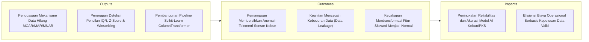
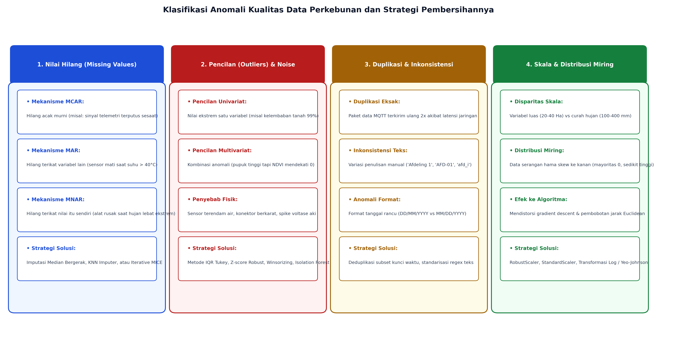
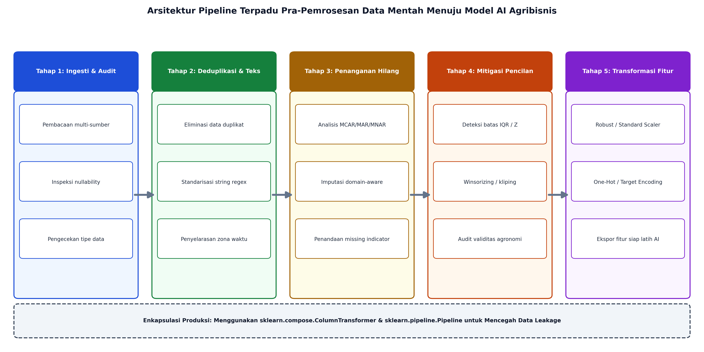

# AI Modul 4.4: Data Cleaning dan Preprocessing

---

## 1. Identitas & Kerangka Capaian Pembelajaran (Sub-CPMK)

* **Kode Modul**        : AI Modul 4.4
* **Mata Kuliah**       : Kecerdasan Buatan dan Sains Data Pertanian Presisi
* **Alokasi Waktu**     : 2 x 50 Menit (Kajian Teori & Diskusi) + 2 x 50 Menit (Eksplorasi Praktikum Mandiri)
* **Beban SKS**         : 3 SKS
* **Prasyarat**         : AI Modul 4.3 (Pandas Manipulasi Data)
* **Level Kognitif**    : C2 (Memahami), C3 (Menerapkan), C4 (Menganalisis)



### 1.1 Capaian Pembelajaran Khusus (Sub-CPMK)
Setelah menyelesaikan modul ini, mahasiswa dan pembelajar diharapkan mampu:
1. **Mendiagnosis (C4)** anomali data mentah: data hilang (*Missing Data* MCAR, MAR, MNAR), data duplikat, dan ketidakkonsistenan tipe data.
2. **Menerapkan (C3)** strategi imputasi nilai hilang (rerata, median, interpolasi temporal, dan imputasi KNN) pada telemetri cuaca kebun.
3. **Menganalisis (C4)** keberadaan nilai pencilan (*Outliers*) menggunakan metode parametrik ($Z$-Score) dan non-parametrik (*Interquartile Range* / IQR).
4. **Merancang (C3)** pipeline prapemrosesan pembersihan data yang terisolasi untuk mencegah kebocoran informasi (*data leakage*) sebelum pelatihan model.

### 1.2 Kerangka Hasil Pembelajaran (Outputs, Outcomes, & Impacts)
* **Outputs (Keluaran Berwujud Langsung)**:
  * Mendiagnosis tiga mekanisme formal data hilang (*Missing Completely at Random* - MCAR, *Missing at Random* - MAR, dan *Missing Not at Random* - MNAR) pada data perkebunan kelapa sawit.
  * Memilih dan mengimplementasikan strategi imputasi yang tepat (median univariat, *K-Nearest Neighbors Imputer*, atau *Multivariate Imputation by Chained Equations* - MICE).
  * Mendeteksi anomali pencilan univariat dan multivariat menggunakan metode parametrik ($Z$-score), non-parametrik (rentang interkuartil Tukey IQR), dan *Modified Z-Score* berbasis *Median Absolute Deviation* (MAD).
  * Melakukan mitigasi pencilan melalui teknik *Winsorizing* (kliping batas kuartil) tanpa membuang baris data penting.
  * Membangun alur pra-pemrosesan data yang modular dan kebal kebocoran data (*leak-free*) menggunakan `sklearn.pipeline.Pipeline` dan `sklearn.compose.ColumnTransformer`.
* **Outcomes (Hasil Capaian & Perubahan Kompetensi)**:
  * Mengembangkan skrip otomatis pembersihan data sensus produksi dan sensor cuaca otomatis (*Automatic Weather Station* - AWS) yang tahan terhadap *spike* voltase dan kegagalan transmisi sinyal IoT.
  * Membedakan secara presisi antara pencilan biologis alami (misalnya lonjakan produksi sawit pada musim puncak / *peak crop*) dan artefak teknis (korsleting probe sensor tanah).
  * Melakukan standarisasi dan penskalaan fitur numerik secara tepat (*RobustScaler* vs *StandardScaler*) guna mengoptimalkan konvergensi algoritma turunan gradien (*gradient descent*).
* **Impacts (Dampak Jangka Panjang & Nilai Guna Luas)**:
  * Eliminasi bias sistemik pada sistem analitika terpadu perkebunan kelapa sawit dan kehutanan industri nasional.
  * Perlindungan investasi teknologi AI melalui penyediaan data bersih berkualitas tinggi yang siap diskalakan ke infrastruktur komputasi awan.
  * Kematangan kompetensi rekayasa data mahasiswa sebagai bekal utama sebelum memasuki fase pemodelan pembelajaran mesin tingkat lanjut.

---

## 2. Integritas Data dan Kualitas Informasi: Prinsip Garbage In, Garbage Out (GIGO)

Dalam sains data perkebunan, data mentah yang dikumpulkan dari lapangan tidak pernah bersih. Fenomena cuaca ekstrem, jalanan berdebu pekat, interferensi sinyal seluler di pelosok afdeling, serta keletihan fisik petugas pencatat panen menimbulkan beragam anomali:



Empat pilar utama integritas data yang wajib dipenuhi sebelum pemodelan AI:
1. **Kelengkapan (*Completeness*):** Tiadanya kekosongan nilai krusial pada variabel prediktor kunci.
2. **Keabsahan (*Validity*):** Data mematuhi batasan fisik riil (misalnya persentase kelembaban tanah berada pada rentang $0\% \le x \le 100\%$, umur sawit produktif $> 3$ tahun).
3. **Keunikan (*Uniqueness*):** Tidak adanya baris duplikasi akibat transmisi ulang paket jaringan MQTT/HTTP secara otomatis.
4. **Konsistensi (*Consistency*):** Keseragaman format penamaan, zona waktu (*timestamps*), dan satuan pengukuran antar-afdeling.

---

## 3. Teori Mekanisme Data Hilang (Missing Data Mechanisms): MCAR, MAR, dan MNAR

Donald Rubin (1976) mengklasifikasikan mekanisme hilangnya data ke dalam tiga kategori probabilistik formal yang menentukan validitas metode pembersihan yang dipilih:

### 3.1 Missing Completely at Random (MCAR)
Probabilitas suatu data hilang tidak berhubungan dengan nilai variabel itu sendiri maupun nilai variabel teramati lainnya:
$$P(M \mid Y_{\text{obs}}, Y_{\text{mis}}) = P(M)$$

**Keterangan Simbol:**
- $M$: Variabel indikator biner status kehilangan data ($M=1$ jika hilang, $M=0$ jika teramati).
- $Y_{\text{obs}}$: Vektor observasi data yang berhasil teramati (*observed data*).
- $Y_{\text{mis}}$: Vektor observasi data yang hilang (*missing data*).
- $P(M \mid \dots)$: Probabilitas bersyarat terjadinya data hilang dengan diketahui data teramati dan data hilang.
- $P(M)$: Probabilitas marjinal terjadinya data hilang secara murni acak tanpa dipengaruhi variabel manapun.

> **Cara Membaca Rumus:**  
> *Peluang bersyarat M dengan syarat Y teramati dan Y hilang sama dengan peluang marjinal M.*

- **Konteks Agribisnis:** Kabel telemetri sensor cuaca terputus sesaat karena tertimpa pelepah sawit kering yang jatuh secara acak.
- **Dampak & Solusi:** Tidak menimbulkan bias sistemik. Imputasi sederhana (rerata/median) atau penghapusan baris aman dilakukan jika proporsi kehilangan kecil ($< 5\%$).

### 3.2 Missing at Random (MAR)
Probabilitas suatu data hilang berkaitan secara sistematis dengan variabel teramati lain, namun tidak bergantung pada nilai yang hilang itu sendiri:
$$P(M \mid Y_{\text{obs}}, Y_{\text{mis}}) = P(M \mid Y_{\text{obs}})$$

**Keterangan Simbol:**
- $P(M \mid Y_{\text{obs}})$: Probabilitas bersyarat hilangnya data yang sepenuhnya dapat diprediksi dari variabel teramati $Y_{\text{obs}}$.

> **Cara Membaca Rumus:**  
> *Peluang bersyarat M dengan syarat Y teramati dan Y hilang sama dengan peluang bersyarat M dengan syarat Y teramati.*

- **Konteks Agribisnis:** Sensor lengas tanah di blok gambut sering mati saat temperatur kanopi terukur sangat tinggi ($> 38^\circ\text{C}$) akibat perlindungan panas perangkat keras (*thermal throttling*). Hilangnya data lengas tanah dapat diprediksi dari data suhu yang tercatat.
- **Dampak & Solusi:** Menghapus baris akan menimbulkan bias parah. Solusi tepat adalah imputasi multivariat berbasis korelasi fitur lain (KNN Imputer atau regresi).

### 3.3 Missing Not at Random (MNAR)
Probabilitas hilangnya data secara langsung bergantung pada nilai yang seharusnya tercatat:
$$P(M \mid Y_{\text{obs}}, Y_{\text{mis}}) \ne P(M \mid Y_{\text{obs}})$$

**Keterangan Simbol:**
- $\ne$: Simbol ketidaksamaan; menunjukkan hilangnya data tidak dapat diprediksi hanya dari variabel teramati karena berkaitan langsung dengan nilai sesungguhnya yang hilang ($Y_{\text{mis}}$).

> **Cara Membaca Rumus:**  
> *Peluang bersyarat M dengan syarat Y teramati dan Y hilang tidak sama dengan peluang bersyarat M dengan syarat Y teramati.*

- **Konteks Agribisnis:** Alat penakar hujan mekanis macet saat curah hujan sangat lebat melebihi $100 \text{ mm/jam}$ karena corong pengukur meluap (*overflow*). Data yang hilang justru merupakan data ekstrem tertinggi.
- **Dampak & Solusi:** Paling berbahaya. Tidak boleh diisi dengan rerata karena akan mengecilkan estimasi risiko banjir kebun secara drastis. Wajib ditambahkan kolom penanda indikator hilang (*missing indicator feature*).

---

## 4. Strategi Imputasi Nilai Hilang: Univariat vs Multivariat

Pemilihan teknik imputasi menentukan apakah variansi dan korelasi alami antar-variabel data kebun tetap terjaga:

| Parameter Evaluasi | Imputasi Rerata (*Mean*) | Imputasi Median | Imputasi KNN (*K-Nearest Neighbors*) | Imputasi MICE / Iterative |
| :--- | :--- | :--- | :--- | :--- |
| **Tipe Algoritma** | Univariat | Univariat | Multivariat | Multivariat |
| **Ketahanan Outlier** | Sangat Rendah | Sangat Tinggi (*Robust*) | Moderat | Tinggi |
| **Preservasi Korelasi** | Rusak (Varian Menyusut) | Rusak (Distribusi Runcing) | Baik (Mempertahankan Pola) | Sangat Baik (Pemodelan Kondisional) |
| **Kompleksitas Komputasi**| $\mathcal{O}(N)$ | $\mathcal{O}(N \log N)$ | $\mathcal{O}(N_{\text{mis}} \cdot N_{\text{obs}} \cdot D)$ | $\mathcal{O}(M \cdot D \cdot N)$ |
| **Penggunaan Ideal** | Data numerik normal murni | Data numerik miring (*skewed*) | Data multi-sensor berkorelasi tinggi | Dataset komprehensif penelitian |

### 4.1 Imputasi Multivariat Berbasis Tetangga Terdekat (KNN Imputer)
Pada algoritma `KNNImputer`, nilai hilang pada baris target diestimasi dari rata-rata berbobot $k$-tetangga terdekat di ruang dimensi fitur menggunakan metrik jarak Euclidean ternormalisasi yang mengabaikan koordinat bernilai hilang (*nan-euclidean distance*):
$$d(x, y) = \sqrt{\frac{D}{D_{\text{valid}}} \sum_{i \in \text{valid}} (x_i - y_i)^2}$$

**Keterangan Simbol:**
- $d(x, y)$: Jarak Euclidean ternormalisasi antara dua baris sampel $x$ dan $y$.
- $D$: Jumlah total seluruh fitur/dimensi dalam dataset.
- $D_{\text{valid}}$: Jumlah fitur di mana kedua sampel $x$ dan $y$ sama-sama memiliki nilai valid (tidak bernilai `NaN`).
- $\frac{D}{D_{\text{valid}}}$: Faktor penskalaan kompensasi untuk mengoreksi dimensi yang hilang.
- $x_i, y_i$: Nilai koordinat fitur ke-$i$ pada sampel $x$ dan sampel $y$.

> **Cara Membaca Rumus:**  
> *Jarak d antara x dan y sama dengan akar kuadrat dari hasil bagi D total dibagi D valid, dikalikan jumlah selisih kuadrat x sub i dikurangi y sub i untuk seluruh indeks i yang valid.*
Hal ini memastikan bahwa blok kelapa sawit yang memiliki karakteristik umur dan dosis pupuk serupa akan menyumbangkan nilai estimasi yang realistis.

---

## 5. Deteksi dan Mitigasi Pencilan (Outliers)

Pencilan adalah titik data yang menyimpang secara radikal dari pola persebaran umum populasi data.

### 5.1 Metode Parametrik: Standar Skor ($Z$-Score)
Mengasumsikan data terdistribusi secara normal Gaussian ($\mathcal{N}(\mu, \sigma^2)$):
$$z_i = \frac{x_i - \bar{x}}{s}$$

**Keterangan Simbol:**
- $z_i$: Nilai skor baku (*standard score*) untuk observasi ke-$i$.
- $x_i$: Nilai observasi data ke-$i$.
- $\bar{x}$: Rerata aritmetika (*mean*) sampel.
- $s$: Simpangan baku (*standard deviation*) sampel.

> **Cara Membaca Rumus:**  
> *Skor z sub i sama dengan x sub i dikurangi x bar, dibagi dengan deviasi standar s.*

- **Ambang Batas Umum:** Titik data dengan $|z_i| > 3.0$ dikategorikan sebagai pencilan ($< 0.27\%$ peluang kemunculan teoritis).
- **Kelemahan Fatal:** Nilai rerata ($\bar{x}$) dan deviasi standar ($s$) itu sendiri sangat rentan terdistorsi oleh pencilan itu sendiri!

### 5.2 Metode Non-Parametrik Robust: Rentang Interkuartil (Tukey IQR)
Metode yang dikembangkan oleh John Tukey (1977) ini tidak mengasumsikan distribusi normal dan kebal terhadap nilai ekstrem:
$$\text{IQR} = Q_3 - Q_1$$

**Keterangan Simbol:**
- $\text{IQR}$: Rentang interkuartil (*Interquartile Range*), ukuran rentang penyebaran $50\%$ data di bagian tengah.
- $Q_3$: Kuartil ketiga (persentil ke-75).
- $Q_1$: Kuartil pertama (persentil ke-25).

> **Cara Membaca Rumus:**  
> *IQR sama dengan Q tiga dikurangi Q satu.*

- **Batas Bawah (*Lower Fence*):** $F_{\text{lower}} = Q_1 - 1.5 \times \text{IQR}$
- **Batas Atas (*Upper Fence*):** $F_{\text{upper}} = Q_3 + 1.5 \times \text{IQR}$
- **Pencilan Ekstrem:** Berjarak $> 3.0 \times \text{IQR}$ dari kuartil terdekat.

### 5.3 Metode Modified Z-Score Berbasis MAD
Untuk sampel data kecil hingga sedang yang memiliki kemencengan (*skewness*), *Median Absolute Deviation* (MAD) memberikan estimasi dispersi yang jauh lebih tangguh:
$$\text{MAD} = \text{median}\Big(|x_i - \tilde{x}|\Big)$$

**Keterangan Simbol:**
- $\text{MAD}$: Deviasi mutlak median (*Median Absolute Deviation*).
- $\tilde{x}$: Nilai median sampel data.
- $|x_i - \tilde{x}|$: Jarak selisih absolut antara nilai data observasi $x_i$ dengan nilai median $\tilde{x}$.
- $\text{median}(\cdot)$: Operasi penentuan nilai tengah dari seluruh nilai absolut selisih.

> **Cara Membaca Rumus:**  
> *MAD sama dengan median dari nilai mutlak selisih x sub i dikurangi x tilde (median).*

$$M_i = \frac{0.6745 \times (x_i - \tilde{x})}{\text{MAD}}$$

**Keterangan Simbol:**
- $M_i$: Skor z termodifikasi Boris Iglewicz & David Hoaglin untuk observasi ke-$i$.
- $0.6745$: Konstanta penormalan teoritis (ekivalen dengan kuartil atas distribusi normal standar).
- $(x_i - \tilde{x})$: Selisih data ke-$i$ terhadap nilai median.
- $\text{MAD}$: Nilai deviasi mutlak median.

> **Cara Membaca Rumus:**  
> *Skor M sub i sama dengan nol koma enam tujuh empat lima dikalikan selisih x sub i minus x tilde, dibagi dengan nilai MAD.*

Ambang batas pencilan ditetapkan jika $|M_i| > 3.5$.

### 5.4 Mitigasi Pencilan: Winsorizing (Kliping)
Alih-alih menghapus baris observasi yang berharga, teknik **Winsorizing** membatasi nilai-nilai ekstrem ke ambang batas persentil tertentu (misalnya persentil ke-5 dan ke-95 atau batas IQR):
$$x_{\text{winsor}} = \begin{cases} 
F_{\text{lower}}, & \text{jika } x < F_{\text{lower}} \\
x, & \text{jika } F_{\text{lower}} \le x \le F_{\text{upper}} \\
F_{\text{upper}}, & \text{jika } x > F_{\text{upper}}
\end{cases}$$

**Keterangan Simbol:**
- $x_{\text{winsor}}$: Nilai fitur hasil transformasi pemangkasan batas (*winsorized value*).
- $x$: Nilai asli titik data observasi.
- $F_{\text{lower}}$: Ambang batas bawah pemotongan (*lower fence*, misal $Q_1 - 1.5 \times \text{IQR}$).
- $F_{\text{upper}}$: Ambang batas atas pemotongan (*upper fence*, misal $Q_3 + 1.5 \times \text{IQR}$).

> **Cara Membaca Rumus:**  
> *Nilai x winsor sama dengan: batas bawah F lower jika x kurang dari batas bawah; bernilai x jika x berada di antara batas bawah dan batas atas; atau bernilai batas atas F upper jika x lebih besar dari batas atas.*

---

## 6. Penanganan Duplikasi, Inkonsistensi Kategori, dan Standardisasi Format

Integrasi logbook manual mandor dan telemetri digital sering memicu anomali format:
1. **Deduplikasi Baris:** Membuang rekaman data ganda berbasis subset kunci unik:
   ```python
   df.drop_duplicates(subset=['Blok_ID', 'Timestamp'], keep='last', inplace=True)
   ```
2. **Penyelarasan Inkonsistensi Kategori Teks:** Menyeragamkan variasi penulisan manual menggunakan transformasi string terstruktur atau pemetaan kamus:
   ```python
   # Menyeragamkan variasi: 'AFD-01', 'afd 1', 'Afdeling I'
   df['Afdeling'] = df['Afdeling'].str.upper().str.replace(r'[^A-Z0-9]', '', regex=True)
   ```
3. **Standardisasi Tanggal (ISO 8601):** Memastikan format tanggal universal `YYYY-MM-DD` guna menghindari kekeliruan antara hari dan bulan (`02/03/2026` = 2 Maret vs 3 Februari).

---

## 7. Rancang Bangun Pipeline Pembersihan Otomatis Menggunakan Scikit-Learn

Dalam sistem kecerdasan buatan produksi, seluruh tahap pra-pemrosesan wajib dikemas ke dalam satu kesatuan pipeline terstandar:



### 7.1 Pencegahan Kebocoran Data (*Data Leakage*)
Kebocoran data terjadi apabila parameter pembersihan (seperti nilai rerata imputasi atau batas penskalaan $\mu$ dan $\sigma$) dihitung dari **keseluruhan dataset (gabungan train dan test)**. Akibatnya, informasi dari data uji bocor ke dalam data latih, menyebabkan skor evaluasi model tampak luar biasa tinggi saat eksperimen namun jeblok saat diimplementasikan di kebun.

**Aturan Emas:** Hitung parameter pembersihan **hanya pada data latih (*training set*)** melalui `.fit()`, lalu terapkan parameter tersebut ke data uji (*test set*) menggunakan `.transform()`.

### 7.2 Implementasi ColumnTransformer
```python
from sklearn.pipeline import Pipeline
from sklearn.compose import ColumnTransformer
from sklearn.impute import SimpleImputer
from sklearn.preprocessing import RobustScaler, OneHotEncoder

# Pipeline untuk Fitur Numerik
num_pipe = Pipeline([
    ('imputer', SimpleImputer(strategy='median')),
    ('scaler', RobustScaler())
])

# Pipeline untuk Fitur Kategorikal
cat_pipe = Pipeline([
    ('imputer', SimpleImputer(strategy='most_frequent')),
    ('encoder', OneHotEncoder(handle_unknown='ignore', sparse_output=False))
])

# Menggabungkan Seluruh Transformasi
preprocessor = ColumnTransformer(transformers=[
    ('num', num_pipe, ['Umur_Tanaman', 'Curah_Hujan', 'Dosis_NPK', 'Kelembaban_Tanah']),
    ('cat', cat_pipe, ['Afdeling', 'Jenis_Tanah'])
])
```

---

## 8. Rangkuman Komprehensif

1. **Prinsip GIGO:** Model AI agribisnis terbaik tidak dapat mengompensasi data mentah yang cacat. Pra-pemrosesan data merupakan tahapan paling determinan dalam menjamin keandalan sistem cerdas.
2. **Diagnosis Mekanisme Data Hilang:** Pahami apakah kehilangan data bersifat acak sempurna (MCAR), bergantung pada fitur lain (MAR), atau melekat pada nilai itu sendiri (MNAR). Jangan menghapus baris secara gegabah jika mekanismenya adalah MAR atau MNAR.
3. **Teknik Imputasi Terarah:** Gunakan imputasi median univariat untuk data yang memiliki pencilan, atau beralih ke `KNNImputer` untuk menjaga korelasi spasial-multivariat antar-sensor perkebunan.
4. **Strategi Mitigasi Pencilan:** Metode rentang interkuartil (Tukey IQR) dan *Modified Z-Score* berbasis MAD jauh lebih unggul dibandingkan $Z$-score standar. Teknik *Winsorizing* mempertahankan ukuran sampel tanpa merusak gradien optimasi.
5. **Standardisasi Pipeline:** Manfaatkan `Pipeline` dan `ColumnTransformer` Scikit-Learn untuk merangkai imputasi, kliping, dan penskalaan secara atomik. Ini menjamin eliminasi 100% risiko *data leakage* antara data latih dan data uji.

---

## 9. Latihan Soal dan Tantangan HOTS (Higher-Order Thinking Skills)

### 9.1 Analisis Mekanisme Kehilangan Data Lapangan (Bobot: 30%)
Sebuah jaringan sensor cuaca telemetri yang terdiri dari 50 stasiun cuaca otomatis di kebun kelapa sawit mengalami kekosongan data curah hujan harian sebesar $18\%$ sepanjang tahun 2025. Dari hasil investigasi tim IT perkebunan, ditemukan dua pola anomali berikut:
- **Pola A:** Pada afdeling di perbukitan terjal, data curah hujan sering kali hilang setiap kali terjadi petir dan angin kencang karena panel surya dan baterai cadangan sensor mengalami *voltage drop*.
- **Pola B:** Pada afdeling dataran rendah, sensor berhenti mencatat hanya pada hari Minggu ketika server pusat kebun melakukan *maintenance* terjadwal selama 2 jam tanpa memandang kondisi cuaca.

- **Instruksi Analitis:**
  1. Klasifikasikan masing-masing pola di atas ke dalam mekanisme data hilang Rubin (MCAR, MAR, atau MNAR) beserta alasan matematis-konseptualnya!
  2. Jelaskan bahaya fatal apa yang akan menimpa model AI peramalan banjir kebun jika analis data memutuskan untuk menghapus seluruh baris yang memuat nilai kosong (*listwise deletion*) pada Pola A!
  3. Rancanglah solusi imputasi yang paling tepat untuk masing-masing pola tersebut!

### 9.2 Perhitungan Komparasi Deteksi Pencilan Parametrik vs Robust (Bobot: 40%)
Berikut adalah data pembacaan sensor kelembaban tanah (%) pada 8 titik sensus di satu blok tanaman sawit muda:
$$X = \{ 28.0, 31.0, 29.5, 30.5, 32.0, 29.0, 92.0, 30.0 \}$$

**Keterangan Simbol:**
- $X$: Himpunan data sampel pembacaan sensor kelembaban tanah (satuan: persen, %) dari 8 titik sensus lapangan.
- $\{x_1, \dots, x_8\}$: Nilai observasi kontinu masing-masing titik pengamatan.

> **Cara Membaca Notasi:**  
> *Himpunan X beranggotakan dua puluh delapan koma nol, tiga puluh satu koma nol, dua puluh sembilan koma lima, tiga puluh koma lima, tiga puluh dua koma nol, dua puluh sembilan koma nol, sembilan puluh dua koma nol, dan tiga puluh koma nol.*

1. Hitung nilai rerata ($\bar{x}$) dan deviasi standar sampel ($s$) dari data di atas!
2. Hitung nilai $Z$-score untuk titik data $92.0\%$. Apakah titik tersebut terdeteksi sebagai pencilan jika menggunakan kriteria $|z| > 3.0$? Jelaskan mengapa fenomena penyembunyian pencilan (*masking effect*) terjadi pada kasus ini!
3. Hitung kuartil $Q_1$, median ($Q_2$), kuartil $Q_3$, dan nilai Rentang Interkuartil ($\text{IQR}$) dari kumpulan data di atas!
4. Tentukan batas atas Tukey ($F_{\text{upper}} = Q_3 + 1.5 \times \text{IQR}$). Apakah nilai $92.0\%$ terdeteksi sebagai pencilan dengan metode IQR ini? Jika dilakukan teknik *Winsorizing*, berapakah nilai pengganti untuk data $92.0\%$ tersebut?

### 9.3 Rekayasa Arsitektur Pipeline Bebas Kebocoran Data (Bobot: 30%)
Perhatikan cuplikan kode Python pra-pemrosesan data berikut:
```python
# Skenario Pipeline Mahasiswa
scaler = RobustScaler()
X_scaled = scaler.fit_transform(X)

X_train, X_test, y_train, y_test = train_test_split(X_scaled, y, test_size=0.2, random_state=42)
model.fit(X_train, y_train)
```
1. Jelaskan kesalahan arsitektur mendasar pada cuplikan kode di atas dan tunjukkan di mana letak terjadinya fenomena kebocoran data (*data leakage*)!
2. Tuliskan kode perbaikan yang benar menggunakan `sklearn.pipeline.Pipeline` sehingga seluruh proses fitting scaler hanya terjadi pada `X_train` dan diterapkan secara konsisten pada `X_test`!

---

## 10. Daftar Pustaka dan Referensi Akademik

1. Rubin, D. B. (1976). Inference and missing data. *Biometrika*, 63(3), 581-590.
2. Little, R. J., & Rubin, D. B. (2019). *Statistical Analysis with Missing Data* (3rd ed.). John Wiley & Sons, Hoboken, NJ.
3. Tukey, J. W. (1977). *Exploratory Data Analysis*. Addison-Wesley Publishing Company, Reading, MA.
4. Rousseeuw, P. J., & Hubert, M. (2011). Robust statistics for outlier detection. *Wiley Interdisciplinary Reviews: Data Mining and Knowledge Discovery*, 1(1), 73-79.
5. Pedregosa, F., Varoquaux, G., Gramfort, A., Michel, V., Thirion, B., Grisel, O., ... & Duchesnay, É. (2011). Scikit-learn: Machine learning in Python. *Journal of Machine Learning Research*, 12, 2825-2830.
6. van Buuren, S., & Groothuis-Oudshoorn, K. (2011). mice: Multivariate imputation by chained equations in R. *Journal of Statistical Software*, 45(3), 1-67.
