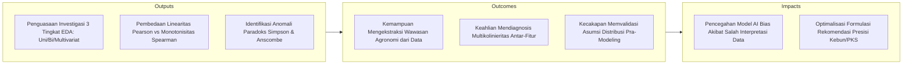
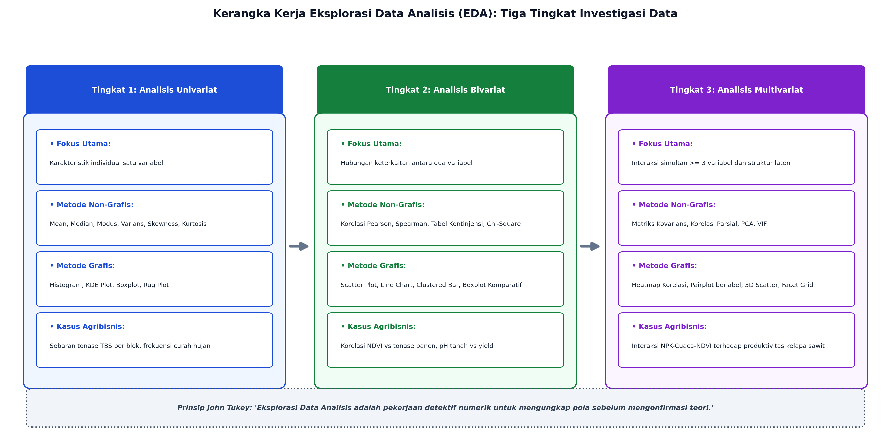
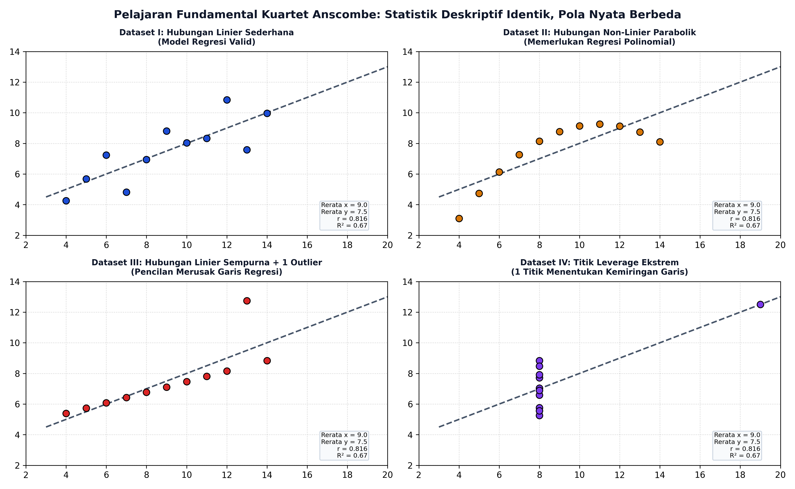

# AI Modul 4.5: Exploratory Data Analysis (EDA)

---

## 1. Identitas & Kerangka Capaian Pembelajaran (Sub-CPMK)

* **Kode Modul**        : AI Modul 4.5
* **Mata Kuliah**       : Kecerdasan Buatan dan Sains Data Pertanian Presisi
* **Alokasi Waktu**     : 2 x 50 Menit (Kajian Teori & Diskusi) + 2 x 50 Menit (Eksplorasi Praktikum Mandiri)
* **Beban SKS**         : 3 SKS
* **Prasyarat**         : AI Modul 4.4 (Data Cleaning dan Preprocessing)
* **Level Kognitif**    : C2 (Memahami), C3 (Menerapkan), C4 (Menganalisis)

### 1.1 Capaian Pembelajaran Khusus (Sub-CPMK)
Setelah menyelesaikan modul ini, mahasiswa dan pembelajar diharapkan mampu:
1. **Menguraikan (C2)** prinsip dasar Analisis Data Eksploratif (EDA) menurut paradigma John Tukey dan kerangka kerja inferensi berbasis bukti.
2. **Menganalisis (C4)** karakteristik statistik univariat (distribusi, skewness, kurtosis) dan multivariat pada variabel agronomi dan iklim perkebunan.
3. **Mengevaluasi (C4)** korelasi Pearson dan Spearman untuk mendeteksi multikolinearitas antar-fitur fisik tanah dan reflektansi spektral daun.
4. **Menyusun (C3)** ringkasan profil data terstruktur (*data profiling report*) yang memandu seleksi fitur untuk pemodelan prediktif machine learning.

### 1.2 Kerangka Hasil Pembelajaran (Outputs, Outcomes, & Impacts)
* **Outputs (Keluaran Berwujud Langsung)**:
  * Menjelaskan filosofi investigasi data John Tukey yang menempatkan eksplorasi grafis sebagai fondasi utama sebelum uji konfirmasi statistik.
  * Menganalisis bentuk sebaran data univariat menggunakan empat momen statistik formal (rerata, varians, kemencengan/*skewness*, dan keruncingan/*kurtosis*).
  * Membedakan secara presisi antara koefisien korelasi linier Pearson ($r$) dan koefisien korelasi peringkat monotonik Spearman ($r_s$) pada data agribisnis non-linier.
  * Membangun visualisasi matriks multivariat (*pairplot*, *heatmap*, dan *facet grids*) untuk mendeteksi interaksi antar-variabel iklim mikro dan kesuburan tanah.
  * Mengidentifikasi dan menjelaskan secara matematis anomali *Kuartet Anscombe* serta pembalikan tren pada *Paradoks Simpson*.
* **Outcomes (Hasil Capaian & Perubahan Kompetensi)**:
  * Mendiagnosis multikolinieritas (*multicollinearity*) antar-faktor lingkungan (misalnya hubungan antara radiasi matahari, suhu kanopi, dan defisit tekanan uap air) sebelum melatih model regresi.
  * Menghasilkan dokumen laporan profil data (*automated EDA report*) yang memuat ringkasan eksekutif, identifikasi anomali biologis, dan rekomendasi rekayasa fitur (*feature engineering*).
  * Mengoreksi interpretasi bisnis yang salah akibat agregasi data global yang mengabaikan variabel pengganggu (*confounding variables*) seperti tipe tanah atau varietas tanaman.
* **Impacts (Dampak Jangka Panjang & Nilai Guna Luas)**:
  * Penurunan risiko kegagalan implementasi model AI di industri perkebunan akibat pemahaman karakteristik data lapangan yang keliru.
  * Peningkatan ketepatan alokasi sumber daya pemupukan dan pengendalian hama berbasis bukti empiris eksploratif yang valid.
  * Pembentukan pola pikir kritis (*critical analytical thinking*) mahasiswa dalam menganalisis data empiris pertanian tropis Indonesia.

---

## 2. Filosofi dan Fondasi Teoretis EDA: Paradigma John Tukey

Secara historis, statistika inferensial klasik didominasi oleh uji hipotesis konfirmatori (*Confirmatory Data Analysis* - CDA), di mana peneliti menetapkan hipotesis nol ($H_0$), mengasumsikan distribusi normal murni, dan menghitung nilai-$p$. Pada tahun 1977, matematikawan **John W. Tukey** memelopori pergeseran paradigma melalui buku monumentalnya *Exploratory Data Analysis*.

Tukey mengibaratkan analis data sebagai **detektif kriminal**:
> *"Exploratory data analysis is detective work—in the purest sense. A detective investigating a crime needs both tools and understanding. If we have no idea of what we are looking for, we will never see what is right before our eyes."* (Tukey, 1977).

Prinsip inti paradigma Tukey:
1. **Visualisasi Mendahului Pemodelan:** Grafik visual mampu memperlihatkan aspek-aspek tak terduga (*the unexpected*) yang tidak tertangkap oleh angka ringkasan statistik.
2. **Kekebalan Statistika Non-Parametrik:** Pemanfaatan median, rentang interkuartil (IQR), dan *boxplot* (yang diciptakan oleh Tukey sendiri) sebagai alat pereduksi dampak distorsi pencilan.
3. **Pemisahan Tiga Tingkat Investigasi:** Menyelidiki data secara bertahap mulai dari tingkat univariat, bivariat, hingga multivariat.

---

## 3. Analisis Univariat: Momen Distribusi Statistik dan Bentuk Sebaran

Analisis univariat membedah karakteristik satu variabel tunggal secara mendalam menggunakan empat momen distribusi probabilitas:

### 3.1 Momen Pertama dan Kedua: Pemusatan dan Penyebaran
- **Momen Pertama (Rerata / $\mu$):** Titik keseimbangan gravitasi distribusi data.
- **Momen Kedua (Varians / $\sigma^2$):** Derajat dispersi atau penyebaran data di sekitar rerata:
  $$\sigma^2 = \frac{1}{n}\sum_{i=1}^n (x_i - \bar{x})^2$$

  **Keterangan Simbol:**
  - $\sigma^2$: Varians data, ukuran kuadrat penyebaran titik-titik data terhadap rata-ratanya.
  - $n$: Jumlah total observasi data.
  - $x_i$: Nilai data observasi ke-$i$.
  - $\bar{x}$: Nilai rerata aritmetika (*mean*).
  - $\sum_{i=1}^n$: Penjumlahan dari indeks $i=1$ sampai $n$.

  > **Cara Membaca Rumus:**  
  > *Sigma kuadrat sama dengan satu per n dikalikan jumlah dari i sama dengan satu sampai n untuk selisih x sub i minus x bar yang dikuadratkan.*

### 3.2 Momen Ketiga: Kemencengan (*Skewness*)
Mengukur asimetri distribusi data terhadap titik reratanya (koefisien momen standar Fisher-Pearson):
$$g_1 = \frac{\frac{1}{n} \sum_{i=1}^n (x_i - \bar{x})^3}{\left[\frac{1}{n} \sum_{i=1}^n (x_i - \bar{x})^2\right]^{3/2}}$$

**Keterangan Simbol:**
- $g_1$: Koefisien kemencengan (*skewness*) Fisher-Pearson.
- $n$: Jumlah total observasi data.
- $x_i$: Nilai data observasi ke-$i$.
- $\bar{x}$: Rerata aritmetika.
- Pembilang: Momen sentral ketiga (menentukan arah kemiringan ekor distribusi).
- Penyebut: Momen sentral kedua berpangkat $3/2$ (deviasi standar berpangkat tiga sebagai faktor penormal).

> **Cara Membaca Rumus:**  
> *g satu sama dengan satu per n dikalikan jumlah dari i sama dengan satu sampai n untuk x sub i minus x bar dipangkatkan tiga, dibagi dengan kurung siku satu per n dikalikan jumlah x sub i minus x bar kuadrat kurung siku dipangkatkan tiga per dua.*

- **Simetris ($g_1 \approx 0$):** Rerata $\approx$ Median $\approx$ Modus (Distribusi Normal Gaussian).
- **Menceng ke Kanan / Positif ($g_1 > 0.5$):** Ekor distribusi memanjang ke arah nilai tinggi. Fenomena umum pada data serangan hama kumbang tanduk atau curah hujan lebat. Rerata $>$ Median.
- **Menceng ke Kiri / Negatif ($g_1 < -0.5$):** Ekor memanjang ke arah nilai rendah. Fenomena pada persentase kelulusan sortasi buah TBS di PKS. Rerata $<$ Median.

### 3.3 Momen Keempat: Keruncingan (*Kurtosis*)
Mengukur ketebalan ekor (*tail heaviness*) dan probabilitas munculnya nilai ekstrem:
$$\text{Excess Kurtosis } (g_2) = \frac{\frac{1}{n} \sum_{i=1}^n (x_i - \bar{x})^4}{\left[\frac{1}{n} \sum_{i=1}^n (x_i - \bar{x})^2\right]^2} - 3$$

**Keterangan Simbol:**
- $g_2$: Koefisien kurtosis ekses (*excess kurtosis*).
- $n$: Jumlah observasi data.
- $x_i$: Nilai data observasi ke-$i$.
- $\bar{x}$: Rerata aritmetika.
- $-3$: Pengurangan konstanta kurtosis distribusi normal murni (mesokurtik bernilai 3) sehingga nilai acuan dasar bernilai nol.

> **Cara Membaca Rumus:**  
> *Excess kurtosis g dua sama dengan satu per n dikalikan jumlah dari i sama dengan satu sampai n untuk x sub i minus x bar dipangkatkan empat, dibagi kurung siku satu per n dikalikan jumlah x sub i minus x bar kuadrat kurung siku dikuadratkan, lalu dikurangi tiga.*
- **Mesokurtik ($g_2 \approx 0$):** Ketebalan ekor identik dengan distribusi normal.
- **Leptokurtik ($g_2 > 0$):** Ekor sangat tebal (*fat tails*); peluang kemunculan anomali cuaca ekstrem jauh lebih tinggi dari ekspektasi Gaussian.
- **Platikurtik ($g_2 < 0$):** Ekor tipis dan puncak mendatar.

---

## 4. Analisis Bivariat: Kovariansi, Korelasi, dan Asosiasi Non-Linier

Analisis bivariat menyelidiki pola hubungan simultan antara dua variabel ($X$ dan $Y$).

### 4.1 Korelasi Linier Pearson vs Korelasi Monotonik Spearman
Pemilihan metrik korelasi yang salah dapat menyebabkan analis menarik kesimpulan bahwa dua variabel tidak berhubungan, padahal hubungannya sangat kuat namun berbentuk kurva non-linier:

1. **Koefisien Korelasi Pearson ($r$):** Mengukur kekuatan dan arah hubungan **linier murni**:
   $$r = \frac{\sum_{i=1}^n (x_i - \bar{x})(y_i - \bar{y})}{\sqrt{\sum_{i=1}^n (x_i - \bar{x})^2} \sqrt{\sum_{i=1}^n (y_i - \bar{y})^2}}, \quad -1 \le r \le 1$$

   **Keterangan Simbol:**
   - $r$: Koefisien korelasi momen hasil-kali Pearson antara dua variabel kontinu $X$ dan $Y$.
   - $n$: Jumlah pasangan titik data $(x_i, y_i)$.
   - $x_i, y_i$: Nilai observasi data ke-$i$ untuk variabel $X$ dan $Y$.
   - $\bar{x}, \bar{y}$: Rerata sampel dari variabel $X$ dan $Y$.

   > **Cara Membaca Rumus:**  
   > *Koefisien korelasi Pearson r sama dengan jumlah dari i sama dengan satu sampai n untuk perkalian x sub i minus x bar dengan y sub i minus y bar, dibagi dengan akar jumlah x sub i minus x bar kuadrat dikalikan akar jumlah y sub i minus y bar kuadrat, dengan nilai berada dalam rentang minus satu sampai positif satu.*

   *Asumsi Kritis:* Kedua variabel kontinu, berdistribusi normal bivariat, dan tidak memuat pencilan ekstrem.

2. **Koefisien Korelasi Peringkat Spearman ($r_s$):** Mengukur hubungan **monotonik** (apakah $Y$ selalu meningkat/menurun saat $X$ meningkat, tanpa mensyaratkan laju perubahan yang konstan):
   $$r_s = 1 - \frac{6 \sum_{i=1}^n d_i^2}{n(n^2 - 1)}, \quad d_i = \text{Rank}(x_i) - \text{Rank}(y_i)$$

   **Keterangan Simbol:**
   - $r_s$: Koefisien korelasi peringkat Spearman (*rho*).
   - $n$: Jumlah pasangan data yang diperingkatkan.
   - $d_i$: Selisih peringkat antara nilai $x_i$ dan $y_i$ pada sampel ke-$i$.
   - $\text{Rank}(x_i), \text{Rank}(y_i)$: Posisi urutan peringkat relatif observasi $x_i$ dan $y_i$.
   - $6$: Konstanta matematis penurunan aljabar permutasi peringkat himpunan diskrit.

   > **Cara Membaca Rumus:**  
   > *Koefisien Spearman r sub s sama dengan satu dikurangi pecahan: enam dikalikan jumlah d sub i kuadrat dari i sama dengan satu sampai n, dibagi n dikalikan n kuadrat minus satu; di mana d sub i adalah peringkat x sub i dikurangi peringkat y sub i.*

   *Keunggulan:* Bersifat non-parametrik, kebal terhadap pencilan, dan mampu menangkap relasi saturasi biologi tanaman (misal respon fotosintesis terhadap radiasi surya yang mengalami titik jenuh).

---

## 5. Analisis Multivariat: Matriks Pasangan, Korelasi Parsial, dan Deteksi Interaksi

Sistem ekologis perkebunan dicirikan oleh interaksi kompleks multi-faktor. Peningkatan pemupukan nitrogen tidak akan meningkatkan tonase panen apabila ketersediaan air tanah berada di bawah titik layu permanen.

### 5.1 Matriks Korelasi dan Heatmap
Visualisasi matriks korelasi seluruh pasangan fitur numerik memungkinkan deteksi dini **multikolinieritas**:
- Jika dua variabel prediktor memiliki korelasi tinggi ($|r| > 0.85$, misalnya antara *Curah Hujan Bulanan* dan *Hari Hujan*), memasukkan keduanya secara bersamaan ke dalam model regresi linier akan mengacaukan estimasi bobot parameter dan meningkatkan standar galat koefisien.

### 5.2 Matriks Pasangan (*Pairplot*) Berlabel Kategori
Mengombinasikan grafik sebaran bivariat (*scatter plot*) untuk seluruh kombinasi fitur numerik di area segitiga bawah, plot densitas distribusi (*KDE*) pada diagonal utama, serta pewarnaan berdasarkan fitur kategori (misal: jenis varietas bibit sawit: *Dami Mas, PPKS 540, Socfindo*).

---

## 6. Bahaya Statistika Buta: Pembelajaran dari Kuartet Anscombe dan Paradoks Simpson

Mengandalkan angka ringkasan statistik semata tanpa inspeksi visual grafis adalah bentuk kelalaian metodologis yang paling berbahaya dalam sains data.

### 6.1 Kuartet Anscombe (Francis Anscombe, 1973)
Anscombe merancang empat kumpulan data buatan yang memiliki **nilai properti statistik identik**:
- Rerata $X = 9.0$
- Rerata $Y = 7.5$
- Varians $X = 11.0$ dan Varians $Y = 4.12$
- Korelasi Pearson $r = 0.816$
- Persamaan Garis Regresi: $y = 3.0 + 0.5x$ ($R^2 = 0.67$)

Namun ketika keempat dataset tersebut diplot ke dalam grafik visual:
1. **Dataset I:** Hubungan linier sejati yang bersih dan memenuhi seluruh asumsi regresi.
2. **Dataset II:** Hubungan kurvilinier kuadratik sempurna; model regresi linier keliru total menangkap pola fisik data!
3. **Dataset III:** Hubungan linier sempurna, namun garis regresi terdistorsi oleh keberadaan **satu titik pencilan ekstrem**.
4. **Dataset IV:** Seluruh titik memiliki nilai $x$ konstan, kecuali **satu titik berdaya ungkit tinggi (*high leverage point*)** yang secara artifisial memaksa kemiringan garis regresi menjadi $0.5$.

### 6.2 Paradoks Simpson (Edward H. Simpson, 1951)
Paradoks Simpson terjadi ketika **tren hubungan antara dua variabel berbalik arah secara dramatis** saat data dipecah ke dalam sub-kelompok berdasarkan variabel pengganggu (*confounding variable*):
$$P(Y \mid X) \text{ memiliki arah gradien yang berlawanan dengan } P(Y \mid X, Z)$$

**Keterangan Simbol:**
- $P(Y \mid X)$: Probabilitas bersyarat variabel target $Y$ hanya dengan mengetahui prediktor $X$ secara agregat.
- $P(Y \mid X, Z)$: Probabilitas bersyarat variabel target $Y$ dengan mempertimbangkan prediktor $X$ dan variabel perancu/pengganggu $Z$.
- Arah gradien: Tanda atau kemiringan relasi korelasi (positif berbalik menjadi negatif, atau sebaliknya).

> **Cara Membaca Notasi:**  
> *Peluang bersyarat Y dengan syarat X memiliki arah gradien yang berlawanan dengan peluang bersyarat Y dengan syarat X dan Z.*

- **Studi Kasus Perkebunan:**
  - Secara agregat global (seluruh kebun), korelasi antara dosis pupuk NPK ($X$) dan tonase panen ($Y$) bernilai **negatif** ($r = -0.42$). Manajemen kebun secara naif menyimpulkan bahwa pemupukan justru merusak produksi!
  - Namun ketika data dieksplorasi per sub-kelompok tipe tanah ($Z$):
    - Pada tanah mineral berpasir: Korelasi dosis vs tonase bernilai **positif kuat** ($r = +0.78$).
    - Pada tanah gambut tebal: Korelasi dosis vs tonase bernilai **positif kuat** ($r = +0.72$).
  - **Akar Masalah:** Manajemen kebun secara historis menaburkan pupuk dalam jumlah paling banyak di blok gambut yang memang memiliki potensi kesuburan biologis lebih rendah. Mengabaikan variabel tanah ($Z$) menciptakan ilusi korelasi palsu.

---

## 7. Protokol Profiling Otomatis dan Dokumentasi Wawasan

Untuk meningkatkan efisiensi kerja tim sains data industri, eksplorasi awal dapat diakselerasi melalui pustaka *automated data profiling* (seperti `ydata-profiling` / `sweetviz`), yang menghasilkan dokumen ringkasan komprehensif memuat:
1. Peringatan dini (*alerts*) untuk kolom dengan kardinalitas tinggi, konstanta, atau rasio nilai hilang $> 20\%$.
2. Perhitungan interaksi multivariat dan uji korelasi matriks *Phik* ($\phi_K$) yang mampu mendeteksi korelasi non-linier antar-kolom kategorikal dan numerik secara simultan.

---

## 8. Rangkuman Komprehensif

1. **Prinsip Detektif John Tukey:** EDA adalah proses investigasi tanpa praduga untuk memahami struktur data aktual. Visualisasi grafik adalah instrumen utama untuk mengidentifikasi anomali yang tidak terlihat pada tabel statistik deskriptif.
2. **Karakterisasi Distribusi 4 Momen:** Pemusatan (mean), penyebaran (varians), kemencengan (skewness), dan keruncingan ekor (kurtosis) memberikan profil geometris lengkap atas variabel agronomi perkebunan.
3. **Pearson vs Spearman:** Gunakan Pearson hanya jika hubungan terbukti linier dan data bersih dari pencilan. Gunakan Spearman untuk relasi biologis monotonik saturasi dan data berskala ordinal.
4. **Pelajaran Kuartet Anscombe:** Dataset dengan nilai mean, varians, korelasi, dan garis regresi yang identik dapat memiliki realitas pola distribusi yang bertolak belakang. Selalu visualisasikan data sebelum menyimpulkan korelasi!
5. **Bahaya Paradoks Simpson:** Selalu curigai keberadaan variabel pengganggu (*confounding factor*) seperti topografi, jenis tanah, atau varietas tanaman saat menganalisis data agregat makro perkebunan.

---

## 9. Latihan Soal dan Tantangan HOTS (Higher-Order Thinking Skills)

### 9.1 Analisis Distribusi dan Momen Statistik Lapangan (Bobot: 30%)
Sebuah blok perkebunan sawit seluas 2.000 hektar mencatat data sensus jumlah janjang panen per pokok kelapa sawit pada 500 titik sampling. Hasil perhitungan komputasi menunjukkan statistik berikut:
- Rerata ($\bar{x}$) = $14.2 \text{ janjang/pokok}$
- Median ($\tilde{x}$) = $11.5 \text{ janjang/pokok}$
- Modus = $9.0 \text{ janjang/pokok}$
- Koefisien Kemencengan (*Skewness*) = $+1.45$
- Nilai Excess Kurtosis = $+2.80$

1. Berdasarkan nilai momen statistik di atas, gambarkan sketsa bentuk sebaran frekuensi data tersebut (apakah simetris, menceng kanan, atau menceng kiri)! Jelaskan hubungan urutan antara rerata, median, dan modus pada distribusi ini!
2. Jelaskan implikasi agronomi dari nilai *skewness* positif tinggi ($+1.45$) dan nilai kurtosis leptokurtik ($+2.80$) terhadap estimasi kapasitas pengangkutan truk di afdeling tersebut!
3. Jika analis data ingin menerapkan algoritma regresi linier standar yang mengasumsikan galat berdistribusi normal, transformasi matematika apa yang Saudara rekomendasikan untuk menormalkan distribusi data tersebut?

### 9.2 Investigasi Bivariat dan Pemilihan Metrik Korelasi (Bobot: 30%)
Diberikan data pengamatan hubungan antara dosis pemupukan Kalium (KCl dalam kg/pokok) dengan kadar minyak kelapa sawit (*Oil Extraction Rate* - OER dalam %) pada 6 blok riset:
$$\text{Dosis } X = \{ 1.0, 2.0, 3.0, 4.0, 5.0, 6.0 \}$$
$$\text{Kadar OER } Y = \{ 18.0, 21.5, 23.8, 24.9, 25.2, 25.3 \}$$

**Keterangan Simbol:**
- $X$: Vektor perlakuan dosis pemupukan Kalium (satuan: kg/pokok).
- $Y$: Vektor respon kadar minyak kelapa sawit (*Oil Extraction Rate* - OER dalam satuan persen, %).

> **Cara Membaca Notasi:**  
> *Dosis X terdiri dari elemen satu koma nol, dua koma nol, tiga koma nol, empat koma nol, lima koma nol, dan enam koma nol; sedangkan kadar OER Y terdiri dari elemen delapan belas koma nol, dua puluh satu koma lima, dua puluh tiga koma delapan, dua puluh empat koma sembilan, dua puluh lima koma dua, dan dua puluh lima koma tiga.*

1. Hitung nilai koefisien korelasi linier Pearson ($r$) dan koefisien korelasi peringkat Spearman ($r_s$) dari dataset di atas!
2. Jelaskan mengapa nilai korelasi Spearman ($r_s$) bernilai lebih tinggi atau mendekati sempurna ($+1.0$) dibandingkan nilai korelasi Pearson ($r$)! Kaitkan penjelasan Saudara dengan fenomena biologis titik jenuh tanaman (*diminishing returns*).

### 9.3 Dekonstruksi Paradoks Simpson Kasus Agribisnis (Bobot: 40%)
Departemen Riset Agronomi sebuah perusahaan kelapa sawit menerbitkan hasil uji lapang efektivitas dua jenis herbisida pembasmi gulma: Herbisida Formula Baru ($H_{\text{Baru}}$) dan Herbisida Standar ($H_{\text{Lama}}$) pada dua divisi kebun: Divisi Rawa Basah dan Divisi Bukit Kering. Data tingkat keberhasilan pembasmian gulma disajikan pada tabel kontinjensi berikut:

| Lokasi Kebun | Herbisida Formula Baru ($H_{\text{Baru}}$) | Herbisida Standar ($H_{\text{Lama}}$) |
| :--- | :--- | :--- |
| **Divisi Rawa Basah** | Berhasil: $180$ dari $300$ petak ($60.0\%$) | Berhasil: $35$ dari $70$ petak ($50.0\%$) |
| **Divisi Bukit Kering** | Berhasil: $95$ dari $100$ petak ($95.0\%$) | Berhasil: $270$ dari $300$ petak ($90.0\%$) |
| **TOTAL KESELURUHAN** | Berhasil: $275$ dari $400$ petak ($68.75\%$) | Berhasil: $305$ dari $370$ petak ($82.43\%$) |

- **Instruksi Analitis:**
  1. Buktikan secara matematis bahwa data di atas mendemonstrasikan fenomena **Paradoks Simpson**! Tunjukkan perbandingan efektivitas pada masing-masing divisi vs total keseluruhan!
  2. Jelaskan faktor pengganggu (*confounding factor*) apa yang menyebabkan pembalikan kesimpulan ini secara drastis!
  3. Sebagai seorang *Data Scientist* perkebunan, herbisida mana yang akan Saudara rekomendasikan kepada Direksi Manajemen: Formula Baru atau Formula Lama? Berikan argumentasi berbasis bukti data yang tidak terbantahkan!

---

## 10. Daftar Pustaka dan Referensi Akademik

1. Tukey, J. W. (1977). *Exploratory Data Analysis*. Addison-Wesley Publishing Company, Reading, MA.
2. Anscombe, F. J. (1973). Graphs in statistical analysis. *The American Statistician*, 27(1), 17-21.
3. Simpson, E. H. (1951). The interpretation of interaction in contingency tables. *Journal of the Royal Statistical Society: Series B (Methodological)*, 13(2), 238-241.
4. Wickham, H., & Grolemund, G. (2017). *R for Data Science: Import, Tidy, Transform, Visualize, and Model Data*. O'Reilly Media, Inc.
5. Pearl, J. (2014). Understanding Simpson's paradox. *The American Statistician*, 68(1), 8-13.
6. McKinney, W. (2022). *Python for Data Analysis: Data Wrangling with pandas, NumPy, and Jupyter* (3rd ed.). O'Reilly Media, Inc.
