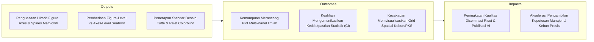
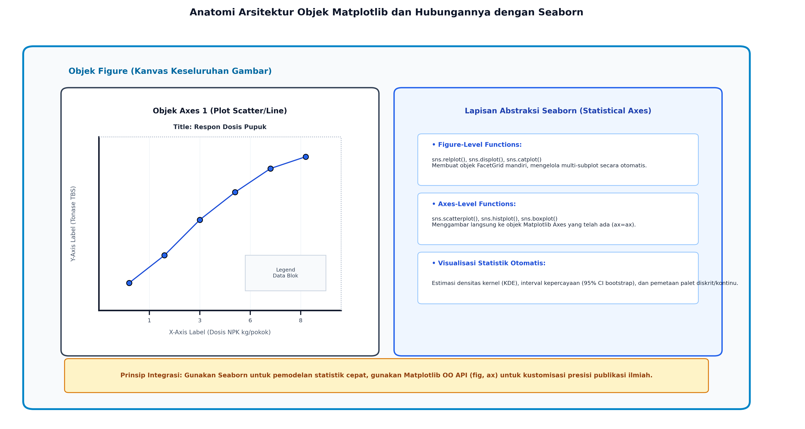
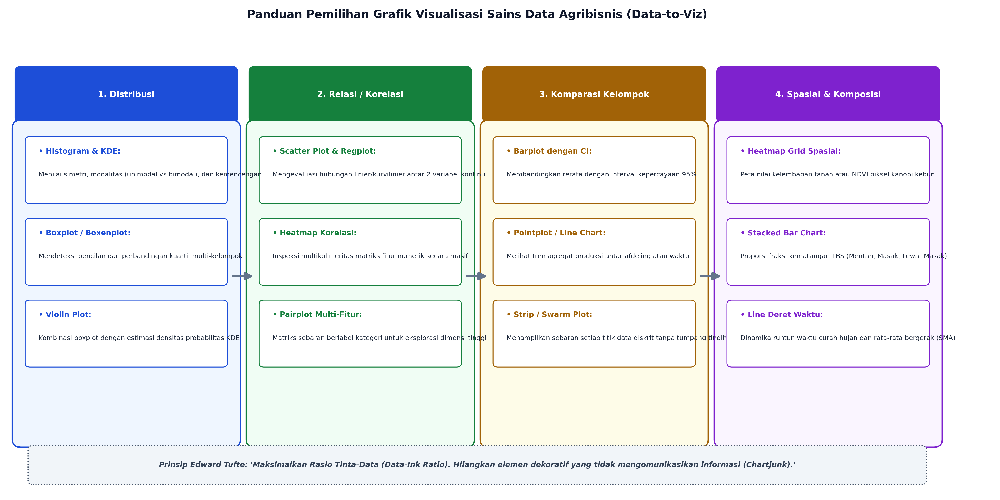

# AI Modul 4.6: Visualisasi Data (Matplotlib & Seaborn)

---

## 1. Identitas & Kerangka Capaian Pembelajaran (Sub-CPMK)

* **Kode Modul**        : AI Modul 4.6
* **Mata Kuliah**       : Kecerdasan Buatan dan Sains Data Pertanian Presisi
* **Alokasi Waktu**     : 2 x 50 Menit (Kajian Teori & Diskusi) + 2 x 50 Menit (Eksplorasi Praktikum Mandiri)
* **Beban SKS**         : 3 SKS
* **Prasyarat**         : AI Modul 4.5 (Exploratory Data Analysis)
* **Level Kognitif**    : C2 (Memahami), C3 (Menerapkan), C4 (Menganalisis)



### 1.1 Capaian Pembelajaran Khusus (Sub-CPMK)
Setelah menyelesaikan modul ini, mahasiswa dan pembelajar diharapkan mampu:
1. **Mengidentifikasi (C2)** hierarki objek grafis Matplotlib (`Figure`, `Axes`, `Axis`) dan arsitektur visualisasi statistika tingkat tinggi Seaborn.
2. **Menerapkan (C3)** pembuatan grafik univariat dan bivariat yang informatif (histogram, boxplot, violin plot, scatter plot, dan heatmap korelasi).
3. **Menganalisis (C4)** pola spasial dan temporal kebun melalui visualisasi multi-panel (*Faceted Grids*) dengan penerapan prinsip *Data-to-Ink Ratio* Edward Tufte.
4. **Menghasilkan (C3)** grafik visual beresolusi publikasi (300 DPI) dengan palet warna aksesibel dan label bersatuan agronomi baku.

### 1.2 Kerangka Hasil Pembelajaran (Outputs, Outcomes, & Impacts)
* **Outputs (Keluaran Berwujud Langsung)**:
  * Menjelaskan hierarki struktural objek Matplotlib (`Figure`, `Axes`, `Axis`, `Spines`, `Ticks`, dan `Artists`) serta membedakan paradigma *Object-Oriented API* dari paradigma *Pyplot State-Machine*.
  * Membedakan fungsi tingkat figur (*Figure-level*) seperti `relplot`, `displot`, `catplot` dengan fungsi tingkat sumbu (*Axes-level*) seperti `scatterplot`, `histplot`, `boxplot` pada pustaka Seaborn.
  * Memilih tipe grafik visualisasi yang tepat berdasarkan karakteristik struktur data (distribusi, komparasi, relasi, komposisi, atau spasial).
  * Menghitung dan menerapkan rasio tinta-data (*Data-Ink Ratio*) Edward Tufte untuk mengeliminasi gangguan visual (*chartjunk*).
  * Menerapkan palet warna perseptual seragam dan ramah buta warna (*viridis*, *cividis*, *colorblind*) pada visualisasi citra multispektral dan matriks korelasi.
* **Outcomes (Hasil Capaian & Perubahan Kompetensi)**:
  * Membangun kanvas visualisasi multi-panel (*composite multi-axes grids*) beresolusi tinggi (300 DPI) yang siap dipublikasikan pada jurnal ilmiah bereputasi internasional atau laporan eksekutif korporasi perkebunan.
  * Mengintegrasikan estimasi ketidakpastian statistik (*95% bootstrap confidence intervals*) pada grafik tren waktu dan kurva respon agronomi.
  * Merancang representasi peta panas (*spatial heatmap*) terindeks koordinat blok kebun untuk mendeteksi anomali defisit air dan serangan hama secara real-time.
* **Impacts (Dampak Jangka Panjang & Nilai Guna Luas)**:
  * Standardisasi tata kelola visualisasi data analitika di industri kelapa sawit dan kehutanan tropis nasional.
  * Pencegahan disinformasi manajerial yang dipicu oleh manipulasi skala grafik (*truncated axes*) atau pemilihan gradien warna yang mendistorsi persepsi data.
  * Kematangan kompetensi komunikasi visual sains mahasiswa dalam mempresentasikan solusi AI terapan kepada pemangku kepentingan (*stakeholders*).

---

## 2. Arsitektur Hirarkis Matplotlib: Paradigma Berorientasi Objek vs Pyplot State-Machine

Matplotlib menyediakan dua antarmuka pemrograman yang berbeda secara filosofis:



### 2.1 Paradigma Pyplot State-Machine (Gaya MATLAB)
Pendekatan implisit di mana perintah seperti `plt.plot()` atau `plt.title()` secara otomatis melacak figur dan sumbu aktif saat ini (*state-based tracking*). 
- **Kelemahan:** Sangat rentan menimbulkan kebingungan dan galat ketika pengguna mengelola banyak subplot secara simultan, karena status grafik aktif dapat bergeser tanpa disadari.

### 2.2 Paradigma Berorientasi Objek (*Object-Oriented API* - Standar Rekayasa)
Pendekatan eksplisit di mana pengguna secara langsung membuat dan mengontrol referensi objek kanvas (`Figure`) dan bidang plot (`Axes`):

```python
import matplotlib.pyplot as plt

# Deklarasi Eksplisit OO API
fig, (ax1, ax2) = plt.subplots(nrows=1, ncols=2, figsize=(12, 5), dpi=300)

# Kustomisasi spesifik pada masing-masing objek Axes
ax1.plot(dosis_pupuk, yield_sawit, color='#1D4ED8', label='Blok Mineral')
ax1.set_title('Respon Pemupukan Tanah Mineral', fontsize=11, fontweight='bold')
ax1.set_xlabel('Dosis NPK (kg/pokok)')
ax1.set_ylabel('Produksi TBS (Ton/Ha)')

ax2.boxplot(distribusi_oer, patch_artist=True)
ax2.set_title('Distribusi Kadar Minyak Sawit (OER)', fontsize=11, fontweight='bold')

plt.tight_layout()
```

---

## 3. Anatomi Gambar Ilmiah: Figure, Axes, Spines, Ticks, dan Manajemen Skala

Setiap elemen visual dalam Matplotlib diturunkan dari kelas dasar `matplotlib.artist.Artist`:
1. **`Figure`:** Objek kanvas induk tingkat teratas yang menampung seluruh elemen grafik, judul utama (*suptitle*), dan legenda global.
2. **`Axes`:** Bidang koordinat matematika 2D atau 3D tempat data digambar. Satu `Figure` dapat memuat banyak `Axes` (subplot).
3. **`Axis`:** Sumbu koordinat ($X$ dan $Y$) yang mengatur batas skala numerik, pembuat tanda skala (*Tick Locators*), dan format penulisan angka skala (*Tick Formatters*).
4. **`Spines`:** Garis tepi pembatas fisik yang mengelilingi bidang data (atas, bawah, kiri, kanan). Dalam visualisasi ilmiah modern, garis tepi atas dan kanan (*top and right spines*) lazimnya dihilangkan untuk meningkatkan kebersihan visual:
   ```python
   ax.spines['top'].set_visible(False)
   ax.spines['right'].set_visible(False)
   ```

---

## 4. Visualisasi Statistik Tingkat Tinggi dengan Seaborn

Pustaka **Seaborn** dibangun langsung di atas arsitektur Matplotlib, menyediakan integrasi erat dengan objek `pandas.DataFrame` serta kapabilitas pemodelan statistik otomatis.

### 4.1 Pembedaan Fundamental: Figure-Level vs Axes-Level Functions
Kesalahan paling umum pengguna pemula Seaborn adalah mencampurkan pemanggilan fungsi tingkat figur dengan tingkat sumbu:

| Parameter | Fungsi Tingkat Sumbu (*Axes-Level*) | Fungsi Tingkat Figur (*Figure-Level*) |
| :--- | :--- | :--- |
| **Contoh Fungsi** | `sns.histplot()`, `sns.scatterplot()`, `sns.boxplot()` | `sns.displot()`, `sns.relplot()`, `sns.catplot()` |
| **Parameter Target** | Menerima argumen `ax=ax` untuk menggambar ke dalam kanvas Matplotlib yang telah ada. | Menolak argumen `ax`; selalu membuat kanvas baru secara mandiri (`FacetGrid`). |
| **Integrasi Multi-Plot**| Sangat fleksibel digabungkan ke dalam tata letak `plt.subplots()`. | Mengelola multi-plot otomatis via argumen `col=` dan `row=`. |
| **Tipe Objek Kembali** | Mengembalikan objek `matplotlib.axes.Axes`. | Mengembalikan objek `seaborn.axisgrid.FacetGrid`. |

### 4.2 Estimasi Ketidakpastian Statistik Otomatis
Secara default, saat menggambar grafik garis (`sns.lineplot`), Seaborn tidak hanya menampilkan nilai rata-rata, melainkan secara otomatis menghitung pita ketidakpastian interval kepercayaan 95% (*95% Confidence Interval*) menggunakan teknik penarikan sampel berulang (*bootstrap resampling* $N = 1000$ iterasi):
$$\text{CI}_{0.95} = [\theta^*_{0.025}, \theta^*_{0.975}]$$

**Keterangan Simbol:**
- $\text{CI}_{0.95}$: Interval kepercayaan $95\%$ (*Confidence Interval*) untuk parameter statistik estimasi.
- $\theta^*$: Vektor estimasi parameter dari sampel replikasi bootstrap.
- $\theta^*_{0.025}$: Persentil ke-$2{,}5$ dari distribusi sampel bootstrap (batas bawah).
- $\theta^*_{0.975}$: Persentil ke-$97{,}5$ dari distribusi sampel bootstrap (batas atas).

> **Cara Membaca Notasi:**  
> *Interval kepercayaan sembilan puluh lima persen sama dengan interval tertutup dari teta bintang persentil dua koma lima persen hingga teta bintang persentil sembilan puluh tujuh koma lima persen.*

Hal ini memberikan wawasan instan kepada manajer agronomi mengenai variasi alami data cuaca atau produksi di lapangan.

---

## 5. Panduan Pemilihan Grafik Berdasarkan Karakteristik Data (Data-to-Viz)

Pemilihan jenis grafik yang keliru dapat mengaburkan wawasan penting yang terkandung di dalam data:



1. **Distribusi Variabel Kontinu Tunggal:**
   - Gunakan **Histogram** dengan kurva estimasi densitas kernel (*Kernel Density Estimation* - KDE) untuk menganalisis bentuk sebaran:
     $$\hat{f}_h(x) = \frac{1}{n h}\sum_{i=1}^n K\left(\frac{x - x_i}{h}\right)$$

     **Keterangan Simbol:**
     - $\hat{f}_h(x)$: Nilai estimasi fungsi kepekatan probabilitas (*probability density function*) pada titik $x$.
     - $n$: Jumlah total titik sampel observasi.
     - $h$: Lebar pita (*bandwidth*), parameter penghalusan kurva ($h > 0$).
     - $K(\cdot)$: Fungsi kernel simetris berbobot integrasi satu (misal kernel Gaussian).
     - $x_i$: Nilai data observasi sampel ke-$i$.

     > **Cara Membaca Rumus:**  
     > *Fungsi densitas f topi berparameter h dari x sama dengan satu per n dikalikan h, dikalikan jumlah dari i sama dengan satu sampai n untuk fungsi kernel K dengan argumen x dikurangi x sub i dibagi h.*

   - Gunakan **Boxplot** atau **Violin Plot** untuk membandingkan sebaran antar-kelompok afdeling secara simultan.
2. **Korelasi dan Hubungan Antar-Variabel Kontinu:**
   - Gunakan **Scatter Plot** yang diperkaya garis tren regresi (`sns.regplot`) dan pemetaan warna kategori (`hue`).
   - Gunakan **Matriks Heatmap** untuk mengaudit multikolinieritas seluruh fitur numerik sekaligus.
3. **Komparasi Nilai Diskrit/Kategori:**
   - Gunakan **Bar Plot** horizontal atau vertikal yang menyertakan garis galat (*error bars*). Hindari diagram lingkaran (*pie chart*) jika kategori $> 3$ karena mata manusia kesulitan membedakan sudut dan proporsi area lengkung secara akurat.
4. **Data Runtun Waktu (*Time-Series*):**
   - Gunakan **Line Chart** berarsir dengan garis rata-rata bergerak (*moving average*) untuk meredam fluktuasi harian yang berisik.

---

## 6. Desain Visual Publikasi dan Aksesibilitas

### 6.1 Teori Desain Edward Tufte: Rasio Tinta-Data (*Data-Ink Ratio*)
Edward Tufte (1983) merumuskan prinsip efisiensi komunikasi visual melalui persamaan:
$$\text{Data-Ink Ratio} = \frac{\text{Tinta yang Merepresentasikan Data}}{\text{Total Tinta yang Digunakan pada Grafik}} = 1.0 - \text{Proporsi Chartjunk}$$

**Keterangan Simbol:**
- $\text{Data-Ink Ratio}$: Rasio kuantitatif efisiensi penyajian informasi Edward Tufte (rentang $0{,}0$ hingga $1{,}0$).
- Pembilang: Proporsi elemen grafis yang tak tergantikan karena merepresentasikan variasi data secara esensial.
- Penyebut: Total seluruh tinta (elemen visual) yang dipakai untuk merender keseluruhan gambar grafik.
- $\text{Proporsi Chartjunk}$: Fraksi ornamen dekoratif yang tidak mengomunikasikan informasi data (garis tebal berlebih, efek 3D palsu, latar gelap).

> **Cara Membaca Rumus:**  
> *Rasio tinta data sama dengan tinta yang merepresentasikan data dibagi total tinta yang digunakan pada grafik, atau sama dengan satu koma nol dikurangi proporsi chartjunk.*

Pedoman penerapan di perkebunan:
1. **Hilangkan *Chartjunk*:** Hapus garis kisi-kisi latar belakang yang terlalu gelap/tebal, efek 3 dimensi semu (*fake 3D bars*), bayangan (*drop shadows*), dan bingkai tebal yang tidak memuat data.
2. **Gunakan Garis Tipis Bernilai:** Ubah grid menjadi garis putus-putus abu-abu lembut (`color='#CBD5E1'`, `ls=':'`, `alpha=0.6`).
3. **Keterangan Langsung (*Direct Labeling*):** Jika memungkinkan, tempatkan label kategori langsung di dekat kurva data daripada memaksa pembaca bolak-balik melihat kotak legenda di sudut.

### 6.2 Aksesibilitas dan Palet Ramah Buta Warna (*Colorblind-Safe Palettes*)
Sekitar $8\%$ populasi pria mengalami defisiensi penglihatan warna (seperti *deuteranopia* dan *protanopia* yang tidak dapat membedakan merah dan hijau). Penggunaan palet "Lampu Lalu Lintas" (Merah-Kuning-Hijau) tanpa anotasi pendukung adalah pelanggaran aksesibilitas ilmiah yang fatal.

**Standar Palet Ilmiah Perseptual Seragam:**
- **`viridis` / `cividis`:** Skala warna sekuensial yang kecerahannya meningkat secara linier di mata manusia, aman untuk seluruh jenis buta warna serta tetap terbaca sempurna saat dicetak monokrom (hitam-putih).
- **`coolwarm` / `icefire`:** Skala divergen ideal untuk matriks korelasi dengan titik tengah netral pada nilai nol ($0$).

---

## 7. Visualisasi Spasial dan Matriks Panas Lanjut untuk Pertanian Presisi

Dalam perkebunan kelapa sawit skala industri, representasi spasial dua dimensi memungkinkan manajer mendeteksi klaster tanah tandus atau infeksi jamur *Ganoderma*:

```python
# Peta Spasial Grid Kebun 20x20 Blok
plt.figure(figsize=(9, 7), dpi=300)
sns.heatmap(grid_ndvi, cmap='YlGn', vmin=0.3, vmax=0.9, 
            cbar_kws={'label': 'Indeks Kanopi NDVI'}, linewidths=0.5, linecolor='#F8FAFC')
plt.title('Peta Spasial Kesehatan Kanopi Sawit Afdeling Sentral', fontsize=12, fontweight='bold', pad=12)
plt.xlabel('Koordinat Kolom Blok (Timur-Barat)')
plt.ylabel('Koordinat Baris Blok (Utara-Selatan)')
```

---

## 8. Rangkuman Komprehensif

1. **Keunggulan OO API Matplotlib:** Deklarasi eksplisit `fig, ax = plt.subplots()` memberikan kendali penuh terhadap setiap elemen kanvas, menjamin reproduksibilitas tinggi dan memfasilitasi pembuatan tata letak multi-panel ilmiah yang terisolasi dari efek samping status global.
2. **Sinergi Matplotlib dan Seaborn:** Seaborn bertindak sebagai akselerator pemodelan statistik tingkat tinggi yang menggambar langsung di atas bidang `Axes` Matplotlib. Pengembang cerdas menggunakan Seaborn untuk kalkulasi statistik otomatis dan menggunakan Matplotlib untuk penyempurnaan tipografi, sumbu, dan anotasi.
3. **Disiplin Fungsi Seaborn:** Bedakan fungsi *Axes-level* (menerima argumen `ax=`) dari fungsi *Figure-level* (mengendalikan kanvas mandiri `FacetGrid`).
4. **Prinsip Rasio Tinta-Data Tufte:** Maksimalkan tinta data dan lenyapkan *chartjunk*. Grafik yang baik adalah grafik yang menyampaikan informasi terbanyak dengan elemen visual tersedikit dalam ruang sekecil mungkin.
5. **Aksesibilitas Visual Mutlak:** Selalu prioritaskan palet warna perseptual seragam (`viridis`, `cividis`, `colorblind`) guna memastikan temuan data dapat diakses oleh seluruh pemangku kepentingan tanpa distorsi persepsi visual.

---

## 9. Latihan Soal dan Tantangan HOTS (Higher-Order Thinking Skills)

### 9.1 Evaluasi Desain Grafik dan Rasio Tinta-Data (Bobot: 30%)
Perhatikan deskripsi grafik laporan manajerial sebuah perkebunan kelapa sawit berikut:
> *"Laporan bulanan menampilkan grafik batang 3D dengan latar belakang dinding kisi-kisi hitam pekat. Batang silinder merepresentasikan volume panen dengan efek kilau cahaya dan bayangan tebal. Warna batang bergantian secara acak antara merah menyala, hijau terang, ungu, dan jingga tanpa ada makna kategorikal. Terdapat kotak legenda besar di sisi kanan yang menamai masing-masing batang dari Bulan 1 hingga Bulan 12."*

1. Identifikasi sekurang-kurangnya 4 elemen *chartjunk* pada deskripsi grafik di atas berdasarkan teori visualisasi Edward Tufte!
2. Jelaskan mengapa grafik batang 3 dimensi semu (*pseudo-3D*) secara optik mendistorsi keakuratan interpretasi angka pembaca!
3. Gambarkan rancangan konsep ulang (*redesign concept*) untuk grafik tersebut yang memaksimalkan *Data-Ink Ratio* dan memenuhi standar publikasi ilmiah modern!

### 9.2 Rancang Bangun Tata Letak Multi-Panel Komposit (Bobot: 40%)
Anda diminta membuat dashboard visualisasi kualitas panen TBS dan mikroklimat perkebunan kelapa sawit yang terdiri dari 3 subplot dalam satu kanvas berukuran $14 \times 6$ inci:
- **Subplot Kiri (Ax 1):** Diagram sebaran (*scatter plot*) antara `Curah_Hujan_mm` ($X$) vs `Tonase_TBS_Ton_Ha` ($Y$) dengan garis tren regresi linier dan interval kepercayaan 95%.
- **Subplot Tengah (Ax 2):** Diagram kotak komparatif (*boxplot*) kadar asam lemak bebas (`Kadar_FFA_pct`) yang dikelompokkan berdasarkan 4 `Afdeling`, diwarnai menggunakan palet ramah buta warna (`palette='colorblind'`).
- **Subplot Kanan (Ax 3):** Diagram matriks korelasi (*heatmap*) antar-seluruh variabel numerik kebun dengan annotasi angka korelasi berformat 2 desimal (`fmt='.2f'`) dan skala warna divergen `coolwarm`.

- **Instruksi Analitis:**
  Tuliskan blok kode Python lengkap menggunakan pendekatan **Matplotlib Object-Oriented API** (`plt.subplots`) yang terintegrasi rapi dengan fungsi-fungsi **Seaborn Axes-Level**, lengkap dengan pembuangan garis batas atas/kanan (*spines removal*) dan penataan tata letak otomatis (`plt.tight_layout()`)!

### 9.3 Analisis Aksesibilitas Skala Warna dan Distorsi Persepsi (Bobot: 30%)
Sebuah peta ortofoto drone yang memetakan nilai indeks vegetasi kanopi kelapa sawit ($0.2 \le \text{NDVI} \le 0.85$) diwarnai menggunakan palet spektrum pelangi standar (*Rainbow / Jet colormap*).
1. Jelaskan secara fisiologis mengapa palet warna *Rainbow/Jet* dinyatakan berbahaya dan dilarang pada publikasi ilmiah bereputasi internasional (seperti jurnal *Nature* dan *Science*)!
2. Jelaskan fenomena batas palsu (*false boundaries*) yang dipicu oleh non-linearitas luminansi pada palet *Rainbow/Jet*!
3. Rekomendasikan palet warna alternatif yang memenuhi kriteria *Perceptually Uniform* dan ramah buta warna untuk visualisasi kanopi sawit tersebut, serta jelaskan keunggulan matematisnya!

---

## 10. Daftar Pustaka dan Referensi Akademik

1. Hunter, J. D. (2007). Matplotlib: A 2D graphics environment. *Computing in Science & Engineering*, 9(3), 90-95.
2. Waskom, M. L. (2021). Seaborn: statistical data visualization. *Journal of Open Source Software*, 6(60), 3021.
3. Tufte, E. R. (2001). *The Visual Display of Quantitative Information* (2nd ed.). Graphics Press, Cheshire, CT.
4. Crameri, F., Shephard, G. E., & Heron, P. J. (2020). The misuse of colour in science communication. *Nature Communications*, 11(1), 5444.
5. Wilke, C. O. (2019). *Fundamentals of Data Visualization: A Primer on Making Informative and Compelling Figures*. O'Reilly Media, Inc.
6. Rougier, N. P., Droettboom, M., & Bourne, P. E. (2014). Ten simple rules for better figures. *PLoS Computational Biology*, 10(9), e1003833.
