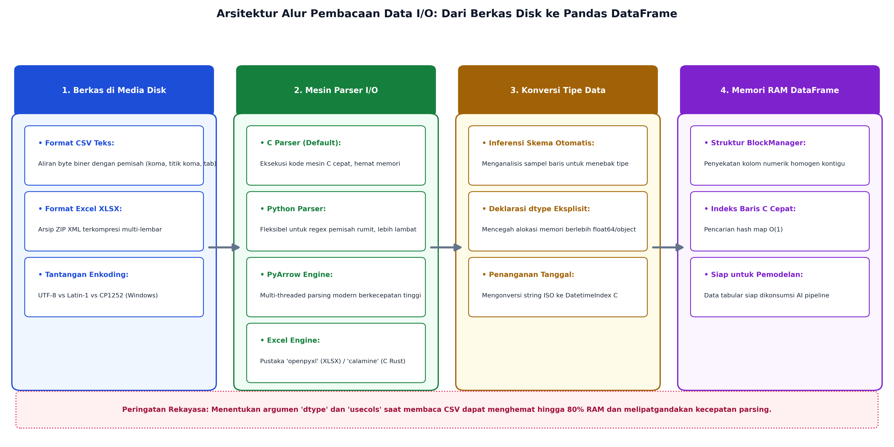
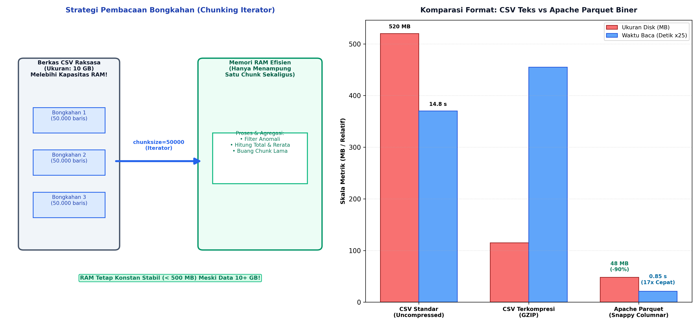

# AI Modul 4.7: Membaca Dataset (CSV/Excel)

---

## 1. Identitas & Kerangka Capaian Pembelajaran (Sub-CPMK)

* **Kode Modul**        : AI Modul 4.7
* **Mata Kuliah**       : Kecerdasan Buatan dan Sains Data Pertanian Presisi
* **Alokasi Waktu**     : 2 x 50 Menit (Kajian Teori & Diskusi) + 2 x 50 Menit (Eksplorasi Praktikum Mandiri)
* **Beban SKS**         : 3 SKS
* **Prasyarat**         : AI Modul 4.6 (Visualisasi Data Matplotlib dan Seaborn)
* **Level Kognitif**    : C2 (Memahami), C3 (Menerapkan), C4 (Menganalisis)


### 1.1 Capaian Pembelajaran Khusus (Sub-CPMK)
Setelah menyelesaikan modul ini, mahasiswa dan pembelajar diharapkan mampu:
1. **Mengidentifikasi (C2)** karakteristik format berkas data tabular terbuka (CSV, TSV) versus format kepemilikan multi-lembar (*Excel Worksheets* / `.xlsx`).
2. **Menerapkan (C3)** pemuatan dataset berukuran besar secara efisien menggunakan parameter parsing Pandas (`chunksize`, `usecols`, penentuan `dtype` spesifik).
3. **Menganalisis (C4)** kesalahan pengkodean karakter (*UnicodeDecodeError*), format pemisah ribuan/desimal lokal, dan header bertingkat (*Multi-Index*).
4. **Mengekspor (C3)** hasil analisis dan ringkasan agregasi data perkebunan ke dalam format CSV bersih dan lembar kerja Excel berformat profesional.

### 1.2 Kerangka Hasil Pembelajaran (Outputs, Outcomes, & Impacts)
* **Outputs (Keluaran Berwujud Langsung)**:
  * Membedakan karakteristik fisik arsitektur berkas teks datar (*plain text CSV*) dengan arsip XML terkompresi berbasis ZIP (*Microsoft Excel OpenXML - XLSX*).
  * Memilih secara tepat antara tiga mesin pengurai (*parser engines*) di Pandas: C Engine (berkecepatan tinggi), Python Engine (fleksibilitas ekspresi reguler), dan PyArrow Engine (multi-threaded berkinerja tinggi).
  * Mengonfigurasi parameter krusial fungsi `pd.read_csv()`: enkoding karakter (`utf-8`, `latin-1`, `cp1252`), deteksi pemisah (*delimiter sniffing*), penanganan *header* bertingkat (*hierarchical multi-index*), serta penguraian format tanggal (*date parsing*).
  * Mengekstrak dan menggabungkan data multi-lembar kerja (*multi-sheets*) dari berkas Excel menggunakan objek `pd.ExcelFile` dan mesin `openpyxl`.
  * Mengimplementasikan pembacaan berulang berbasis bongkahan (*chunking iterator* dengan parameter `chunksize`) pada dataset raksasa guna mencegah galat kehabisan memori (*Out-Of-Memory* / OOM).
* **Outcomes (Hasil Capaian & Perubahan Kompetensi)**:
  * Mendiagnosis dan memperbaiki galat umum pembacaan data perkebunan, seperti `UnicodeDecodeError`, `ParserError: Error tokenizing data`, dan pergeseran kolom akibat pemisah koma di dalam teks alamat afdeling.
  * Mengurangi waktu muat (*loading time*) dataset ratusan megabita hingga di atas $80\%$ melalui proyeksi kolom selektif (`usecols`) dan penetapan skema tipe data eksplisit (`dtype`).
  * Mengonversi data transaksi logistik timbangan PKS berukuran gigabita dari format CSV teks lambat ke format kolumnar biner terkompresi *Apache Parquet*, mempercepat kecepatan baca model AI hingga $> 15\times$.
* **Impacts (Dampak Jangka Panjang & Nilai Guna Luas)**:
  * Kelancaran rantai pasok informasi digital antara ribuan stasiun timbang PKS terpencil dengan pusat analitika korporasi perkebunan nasional.
  * Pencegahan korupsi data (*data corruption*) dan hilangnya presisi angka finansial-operasional akibat salah interpretasi format desimal internasional (titik vs koma).
  * Efisiensi energi komputasi (*green computing*) melalui optimalisasi *disk I/O throughput* pada infrastruktur pemrosesan data cerdas.

---

## 2. Format Penyimpanan Data Tabular Populer: CSV vs Spreadsheet Excel (XLSX)

Pemilihan format penyimpanan data di industri agribisnis melibatkan kompromi antara portabilitas, kecepatan, dan integritas tipe data:

| Dimensi Evaluasi | Comma-Separated Values (CSV) | Microsoft Excel (XLSX / OpenXML) |
| :--- | :--- | :--- |
| **Struktur Internal** | Teks polos linier beralas karakter pemisah (*flat plain text*). | Arsip ZIP terkompresi yang memuat struktur XML hierarkis. |
| **Dukungan Tipe Data** | **Nir-Tipe (*Typeless*):** Semua data tersimpan sebagai karakter ASCII/UTF-8; tipe data harus ditebak oleh parser. | **Kaya Metadata:** Mendukung definisi tipe numerik, rumus (*formulas*), teks, tanggal, dan format sel. |
| **Multi-Lembar Kerja** | Tidak mendukung (satu berkas mewakili satu tabel tunggal). | Mendukung banyak lembar kerja (*multiple sheets*) dalam satu buku kerja (*workbook*). |
| **Batas Ukuran Baris** | Tak terbatas (hanya dibatasi oleh kapasitas penyimpanan disk). | Terbatas maksimal $1.048.576$ baris per lembar kerja. |
| **Kecepatan Baca (I/O)**| **Sangat Cepat** (parsing biner C langsung). | **Lambat** (overhead dekompresi ZIP dan parsing DOM XML). |
| **Kasus Penggunaan Kebun**| Log sensor cuaca otomatis AWS, data timbangan lori PKS real-time. | Laporan rekapitulasi anggaran bulanan manajer estate, sensus tanaman. |

---

## 3. Anatomi Mesin Parser Pandas: C Engine vs Python Engine vs PyArrow

Pandas mengabstraksi pembacaan berkas melalui parameter `engine` pada fungsi `pd.read_csv()`:



### 3.1 C Engine (Default: `engine='c'`)
- Ditulis murni dalam bahasa C terkompilasi untuk kecepatan maksimal.
- Mampu memproses ratusan ribu baris teks per detik dengan pemanfaatan CPU cache L1/L2.
- **Keterbatasan:** Tidak mendukung pemisah (*delimiter*) yang berupa ekspresi reguler kompleks (hanya mendukung karakter tunggal seperti `,`, `;`, `\t`).

### 3.2 Python Engine (`engine='python'`)
- Ditulis dalam bahasa Python murni, memanfaatkan modul standar `csv`.
- Mendukung pemisah ekspresi reguler multi-karakter (misal: `\s+` untuk spasi berulang atau `[,;]` untuk multi-delimeter).
- **Keterbatasan:** Kecepatan parsing $3\times$ hingga $10\times$ lebih lambat dibanding C Engine; boros alokasi memori.

### 3.3 PyArrow Engine (Pandas 2.0+: `engine='pyarrow'`)
- Memanfaatkan mesin parser C++ dari proyek Apache Arrow yang mendukung pemrosesan paralel multi-utas (*multi-threaded execution*).
- Menghasilkan tipe data Arrow asli yang mendukung nilai kosong (*lossless nullability*) tanpa paksaan konversi ke `float64`.
- Pilihan terbaik untuk berkas CSV berukuran gigabita pada mesin multi-core modern.

---

## 4. Parameter Kritis read_csv: Enkoding Karakter, Pemisah, dan Tipe Data

Kegagalan membaca berkas CSV di lapangan hampir selalu berpangkal pada kekeliruan konfigurasi empat parameter berikut:

### 4.1 Enkoding Karakter (`encoding`)
Data yang diekspor dari komputer Windows lama di kantor kebun afdeling sering kali menggunakan enkoding **CP1252 (Windows-1252)** atau **Latin-1 (ISO-8859-1)**, bukan standar modern **UTF-8**.
- Gejala Galat: `UnicodeDecodeError: 'utf-8' codec can't decode byte 0xb0 in position...` (biasanya dipicu simbol derajat suhu `$^\circ\text{C}$` atau huruf bertitik dua).
- Solusi: Deklarasikan enkoding secara eksplisit:
  ```python
  df = pd.read_csv('telemetri_kebun.csv', encoding='cp1252')
  ```

### 4.2 Pemisah dan Penanganan Desimal (`sep` dan `decimal`)
Di Indonesia dan Eropa, aplikasi Excel secara default mengekspor CSV menggunakan pemisah **titik koma (`;`)** dan tanda koma (`,`) sebagai pemisah desimal, karena tanda koma standar digunakan untuk memisahkan ribuan:
```python
# Membaca format regional Indonesia/Eropa secara benar
df = pd.read_csv('produksi_pks.csv', sep=';', decimal=',')
```

### 4.3 Deklarasi Skema Eksplisit (`dtype`) dan Penanganan Tanggal (`parse_dates`)
Secara default, Pandas membaca seluruh kolom ke dalam memori lalu menginferensi tipe data berdasarkan sampel baris awal. Hal ini sangat lambat dan sering memboroskan RAM.
Dengan mendeklarasikan kamus tipe data secara eksplisit:
1. Kolom ID blok kebun dibaca sebagai string (`object` atau `string[pyarrow]`), bukan diubah menjadi integer yang menghilangkan angka nol di depan (misal: `"0012"` menjadi `12`).
2. Kolom stempel waktu langsung dikonversi ke format 64-bit datetime efisien:

```python
skema_tipe = {
    'Blok_ID': 'string',
    'Afdeling': 'category',
    'Luas_Ha': 'float32',
    'Tonase_TBS': 'float32'
}

df = pd.read_csv(
    'panen_sawit.csv',
    dtype=skema_tipe,
    parse_dates=['Tanggal_Panen'],
    usecols=['Blok_ID', 'Afdeling', 'Tanggal_Panen', 'Luas_Ha', 'Tonase_TBS']
)
```

---

## 5. Ingesti Berkas Excel Kompleks: Multi-Sheets dan Header Bertingkat

Berkas lembar sebar Excel dari departemen agronomi kerap kali memuat banyak lembar kerja (*sheets*) yang memisahkan data per afdeling kebun dalam satu tahun anggaran:

```
   Buku_Kerja_Panen_2026.xlsx
   ├── Lembar 'Afdeling_A' (Tabel Sensus Blok AFD-A)
   ├── Lembar 'Afdeling_B' (Tabel Sensus Blok AFD-B)
   └── Lembar 'Rekap_PKS'   (Tabel Rekapitulasi Pabrik)
```

### 5.1 Pemanfaatan Objek `pd.ExcelFile` untuk Efisiensi
Membuka berkas Excel berulang kali dengan `pd.read_excel('file.xlsx', sheet_name='Sheet1')` lalu `pd.read_excel('file.xlsx', sheet_name='Sheet2')` sangat tidak efisien karena Pandas terpaksa mendekompresi arsip ZIP berulang kali.
Gunakan objek pembungkus `pd.ExcelFile` yang mendekompresi berkas hanya satu kali:

```python
with pd.ExcelFile('panen_kebun_2026.xlsx', engine='openpyxl') as xls:
    semua_lembar = []
    for sheet_name in xls.sheet_names:
        if sheet_name.startswith('Afdeling_'):
            df_sheet = pd.read_excel(xls, sheet_name=sheet_name, skiprows=2)
            df_sheet['Nama_Afdeling'] = sheet_name
            semua_lembar.append(df_sheet)

df_konsolidasi = pd.concat(semua_lembar, ignore_index=True)
```

---

## 6. Penanganan Dataset Skala Masif: Strategi Pemotongan Bongkahan (Chunking Iterator)

Ketika ukuran berkas CSV mentah (misalnya log sensor telemetri 5 tahun) mencapai 8 GB sedangkan memori RAM komputer pengembang hanya 8 GB, memanggil `pd.read_csv()` secara langsung akan memicu galat memori fatal (*MemoryError / OS Kill Signal*).



### 6.1 Formula Batas Memori Chunking
Alih-alih memuat seluruh baris sekaligus ($\mathcal{O}(N \times M)$), teknik *chunking* memproses data secara sekuensial dalam jendela geser berukuran $K$ baris:
$$\text{RAM}_{\text{chunk}} = \mathcal{O}(K \times M), \quad \text{di mana } K \ll N$$

**Keterangan Simbol:**
- $\text{RAM}_{\text{chunk}}$: Konsumsi kapasitas memori kerja (RAM) saat memproses data per potongan.
- $\mathcal{O}(\cdot)$: Notasi Big-O untuk batas atas asimptotik kompleksitas ruang memori.
- $K$: Ukuran bongkahan data (*chunksize*), yaitu jumlah baris per iterasi pembacaan aliran data.
- $M$: Jumlah kolom fitur yang dimuat ke dalam memori.
- $N$: Total keseluruhan baris pada berkas CSV di media penyimpanan fisik (SSD/HDD).
- $K \ll N$: Simbol jauh lebih kecil; ukuran bongkahan $K$ (misal $50.000$ baris) jauh lebih kecil daripada ukuran total $N$ (misal $10.000.000$ baris).

> **Cara Membaca Rumus:**  
> *Konsumsi RAM bongkahan berorde K dikalikan M, di mana K jauh lebih kecil daripada N.*

```python
# Memproses berkas raksasa 10 juta baris dengan RAM < 200 MB
ukuran_bongkahan = 50_000
total_tonase = 0.0
total_baris = 0

for chunk in pd.read_csv('sensor_telemetri_10gb.csv', chunksize=ukuran_bongkahan, usecols=['Tonase_TBS']):
    # Eksekusi kalkulasi lokal di RAM
    total_tonase += chunk['Tonase_TBS'].sum()
    total_baris += len(chunk)
    # chunk lama otomatis dimusnahkan oleh garbage collector

rerata_global = total_tonase / total_baris
```

---

## 7. Optimasi Kecepatan dan Efisiensi I/O: Transisi ke Apache Parquet

Format teks CSV diciptakan pada era awal komputasi dan tidak dirancang untuk ekosistem AI modern. Industri sains data enterprise telah bermigrasi ke format **Apache Parquet**:
1. **Penyimpanan Kolumnar Biner (*Binary Columnar Format*):** Data disimpan per kolom, bukan per baris. Jika model AI hanya membutuhkan 3 dari 50 kolom fitur, mesin hanya membaca 3 kolom tersebut dari disk (*projection pushdown*).
2. **Kompresi Efisien (*Snappy / Zstandard*):** Menekan ukuran berkas hingga $\ge 80\%$ tanpa kehilangan presisi data.
3. **Penyimpanan Skema Bawaan (*Embedded Schema*):** Tipe data disimpan di dalam berkas metadata, melenyapkan kebutuhan menebak tipe data saat dibaca.

```python
# Konversi satu kali dari CSV ke Parquet
df.to_parquet('telemetri_kebun.parquet', compression='snappy', engine='pyarrow')

# Pembacaan super cepat (hingga 15x lebih cepat dibanding CSV!)
df_cepat = pd.read_parquet('telemetri_kebun.parquet', columns=['Curah_Hujan', 'Tonase_TBS'])
```

---

## 8. Rangkuman Komprehensif

1. **Kompromi Format Data:** CSV bersifat universal dan ringan namun nir-tipe (*typeless*). Format Excel kaya format visual namun memiliki batas baris fisik ($1.048.576$) dan lambat diurai.
2. **Karakteristik Parser:** C Engine adalah pilihan baku berkecepatan tinggi. PyArrow Engine adalah solusi modern untuk dataset besar berbasis multi-threading.
3. **Disiplin Parameter `read_csv`:** Selalu periksa enkoding karakter (`utf-8` vs `cp1252`), tanda pemisah (`sep=';'`), tanda desimal (`decimal=','`), dan nyatakan kamus `dtype` secara eksplisit guna menghindari pemborosan RAM.
4. **Efisiensi Excel:** Gunakan objek konteks `pd.ExcelFile` untuk mengonsolidasi banyak lembar kerja dalam satu siklus dekompresi file.
5. **Mitigasi OOM via Chunking:** Gunakan `chunksize` untuk mengalirkan data berukuran puluhan gigabita melalui memori RAM terbatas tanpa risiko *MemoryError*.
6. **Migrasi Parquet:** Simpan dataset hasil pra-pemrosesan ke dalam format kolumnar biner *Apache Parquet* untuk mempercepat *throughput* pelatihan model AI hingga $> 10\times$.

---

## 9. Latihan Soal dan Tantangan HOTS (Higher-Order Thinking Skills)

### 9.1 Diagnosa Kerusakan File dan Parsing I/O (Bobot: 30%)
Seorang analis data perkebunan menerima berkas `data_timbangan_pks_2025.csv` berukuran 1.2 GB dari pabrik kelapa sawit di Riau. Saat mencoba membaca berkas menggunakan perintah standar `df = pd.read_csv('data_timbangan_pks_2025.csv')`, eksekusi terhenti dengan dua galat berurutan:
- *Percobaan 1:* `UnicodeDecodeError: 'utf-8' codec can't decode byte 0xe9 in position 1450: invalid continuation byte`
- *Percobaan 2 (setelah menambah encoding='latin-1'):* `ParserError: Error tokenizing data. C error: Expected 6 fields in line 4520, saw 8`

1. Jelaskan secara teknis akar penyebab munculnya `UnicodeDecodeError` pada berkas tersebut dan bagaimana cara mendeteksi enkoding karakter yang benar secara programatis menggunakan pustaka Python `charset-normalizer` atau `chardet`!
2. Jelaskan mengapa baris 4520 menghasilkan 8 field padahal skema awal hanya memiliki 6 field! Berikan contoh skenario lapangan riil perkebunan yang menyebabkan anomali ini!
3. Tuliskan sintaks `pd.read_csv()` yang tangguh untuk mengatasi permasalahan baris korup di atas tanpa menghentikan proses pembacaan data!

### 9.2 Arsitektur Pemrosesan Streaming Data Sensor Masif (Bobot: 40%)
Sebuah konsorsium agribisnis mengumpulkan data telemetri iklim mikro dari 500 unit sensor IoT yang menghasilkan berkas `telemetri_iot_raksasa.csv` berisi $15.000.000$ baris data (ukuran berkas fisik $\approx 6.5 \text{ GB}$). Komputer laboratorium mahasiswa hanya memiliki kapasitas memori RAM sebesar $4 \text{ GB}$.
Kolom yang tersedia dalam berkas meliputi:
`['Sensor_UUID', 'Timestamp', 'Afdeling', 'Suhu_Kanopi', 'Kelembaban_Tanah', 'Curah_Hujan', 'Baterai_Volt']`

- **Tugas Instruksional:**
  Rancanglah skrip Python lengkap berbasis konsep **Chunking Iterator** untuk menghitung rata-rata curah hujan harian dan persentase pembacaan sensor dengan baterai lemah (`Baterai_Volt < 3.2V`) per afdeling, dengan ketentuan:
  a. Konsumsi memori RAM puncak (*Peak RAM Usage*) dibatasi maksimal di bawah $300 \text{ MB}$.
  b. Hanya membaca kolom-kolom yang relevan untuk kalkulasi analitik tersebut (`usecols`).
  c. Mengonversi tipe data numerik ke `float32` menggunakan kamus `dtype`.

### 9.3 Evaluasi Efisiensi Penyimpanan dan Kecepatan Format Data (Bobot: 30%)
Sebuah korporasi perkebunan kelapa sawit menyimpan 10 tahun data historis panen dalam 120 berkas CSV bulanan dengan total ukuran disk mencapai 12 GB. Tim Data Engineering mengusulkan migrasi format data ke *Apache Parquet*.
1. Jelaskan perbedaan mendasar antara model penyimpanan berorientasi baris (*Row-Oriented*) pada CSV dengan model berorientasi kolom (*Column-Oriented*) pada Parquet!
2. Mengapa algoritma *Machine Learning* seperti Random Forest atau XGBoost yang melakukan seleksi subset fitur dapat melakukan *training* jauh lebih cepat saat membaca berkas Parquet dibanding berkas CSV?
3. Hitung estimasi penghematan ruang penyimpanan disk (dalam persen) jika rasio kompresi rata-rata algoritma *Snappy* pada data numerik tabular adalah $1 : 4.5$!

---

## 10. Daftar Pustaka dan Referensi Akademik

1. McKinney, W. (2022). *Python for Data Analysis: Data Wrangling with pandas, NumPy, and Jupyter* (3rd ed.). O'Reilly Media, Inc. Sebastopol, CA.
2. The Apache Arrow Project. (2023). *Apache Parquet format specification*. Apache Software Foundation. https://parquet.apache.org/
3. Gazoni, E., & Clark, C. (2023). *openpyxl: A Python library to read/write Excel 2010 xlsx/xlsm files*. https://openpyxl.readthedocs.io/
4. Unicode Consortium. (2023). *The Unicode Standard, Version 15.0*. Mountain View, CA.
5. Armbrust, M., Xin, R. S., Lian, C., Huai, Y., Liu, D., Bradley, J. K., ... & Zaharia, M. (2015). Spark SQL: Relational data processing in Spark. *Proceedings of the 2015 ACM SIGMOD International Conference on Management of Data*, 1383-1394.
