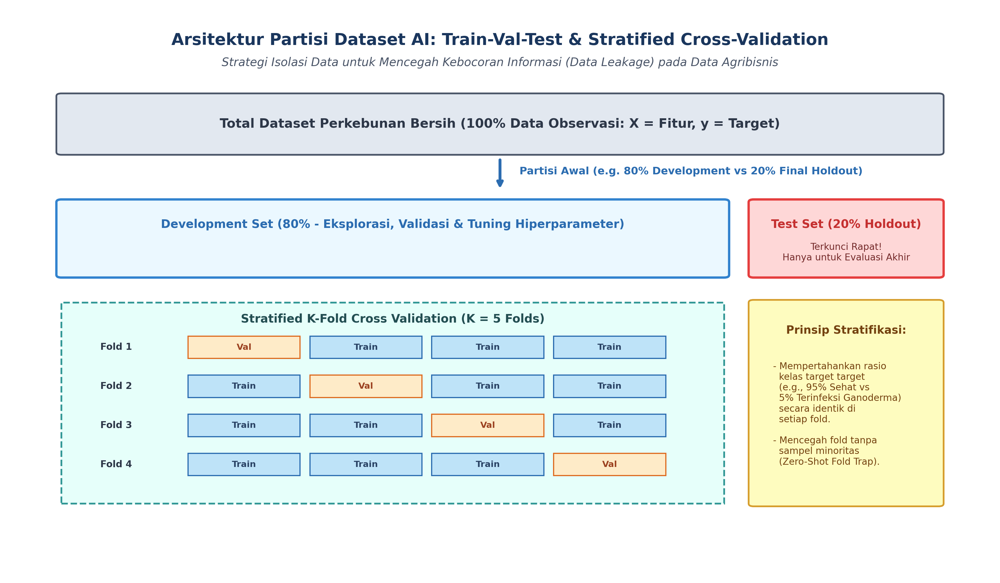
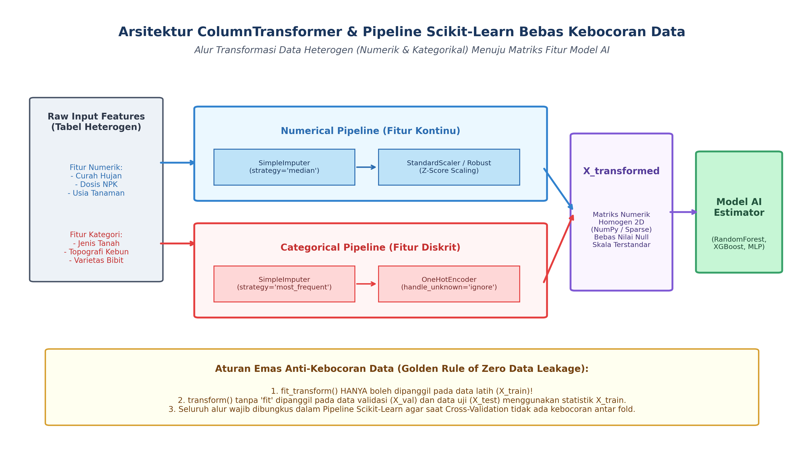

# AI Modul 4.8: Persiapan Dataset untuk AI

---

## 1. Identitas & Kerangka Capaian Pembelajaran (Sub-CPMK)

* **Kode Modul**        : AI Modul 4.8
* **Mata Kuliah**       : Kecerdasan Buatan dan Sains Data Pertanian Presisi
* **Alokasi Waktu**     : 2 x 50 Menit (Kajian Teori & Diskusi) + 2 x 50 Menit (Eksplorasi Praktikum Mandiri)
* **Beban SKS**         : 3 SKS
* **Prasyarat**         : AI Modul 4.7 (Membaca Dataset CSV dan Excel)
* **Level Kognitif**    : C2 (Memahami), C3 (Menerapkan), C4 (Menganalisis)

```mermaid
flowchart LR
    subgraph Outputs
        O1["Pemisahan Matriks X dan Vektor y"]
        O2["Penerapan Partisi Train-Val-Test & Stratifikasi"]
        O3["Rekayasa Fitur & Penskalaan Numerik Terstandar"]
        O4["Enkapsulasi ColumnTransformer & Pipeline"]
    end
    subgraph Outcomes
        OC1["Eliminasi Total Risiko Data Leakage"]
        OC2["Keahlian Menangani Kelas Ekstrem Minoritas"]
        OC3["Standarisasi Pipeline Siap Deploy ke Model AI"]
    end
    subgraph Impacts
        I1["Validitas Ilmiah dan Daya Generalisasi Model AI Kebun"]
        I2["Akurasi Presisi Deteksi Dini Penyakit & Estimasi Panen"]
    end
    Outputs --> Outcomes --> Impacts
```



### 1.1 Capaian Pembelajaran Khusus (Sub-CPMK)
Setelah menyelesaikan modul ini, mahasiswa dan pembelajar diharapkan mampu:
1. **Menguraikan (C2)** konsep penskalaan fitur: standardisasi ($Z$-Score Normalization) versus min-max scaling ($[0, 1]$ Normalization) serta implikasinya pada algoritma berbasis jarak.
2. **Menerapkan (C3)** teknik pengkodean variabel kategorikal (*One-Hot Encoding*, *Ordinal Encoding*, *Target Encoding*) pada data jenis tanah dan varietas bibit.
3. **Menganalisis (C4)** dampak ketidakseimbangan kelas (*Class Imbalance*) dan menerapkan teknik penyeimbangan data (SMOTE, Random Undersampling).
4. **Merancang (C3)** arsitektur partisi dataset terstratifikasi (*Stratified Train-Test Split*) yang sepenuhnya bebas dari kebocoran data (*data leakage*).

### 1.2 Kerangka Hasil Pembelajaran (Outputs, Outcomes, & Impacts)
* **Outputs (Keluaran Berwujud Langsung)**:
  * Memisahkan tabel data relasional menjadi matriks fitur prediktor dua dimensi ($X \in \mathbb{R}^{n \times d}$) dan vektor target satu dimensi ($y \in \mathbb{R}^n$) sesuai formulasi matematika pembelajaran terawasi (*supervised learning*).
  * Menerapkan partisi data ilmiah: *Train-Validation-Test Split* dan *Stratified K-Fold Cross Validation* dengan penguncian benih acak (*reproducible random seed*).
  * Mengidentifikasi dan mengeliminasi dua bentuk utama kebocoran data (*data leakage*): *train-test contamination* dan *target leakage*.
  * Mentransformasikan variabel kategorikal heterogen (nominal dan ordinal) menggunakan *One-Hot Encoding* dan *Ordinal/Target Encoding*.
  * Menstandarisasi fitur numerik kontinu menggunakan *StandardScaler* ($Z$-score) dan *RobustScaler* (berbasis median-IQR) untuk algoritma berbasis jarak dan gradien.
  * Menyeimbangkan distribusi kelas target menggunakan teknik penyesuaian bobot kerugian (*class weight balancing*) dan augmentasi sintetis (*SMOTE*).
  * Membangun objek *Scikit-Learn ColumnTransformer* dan *Pipeline* terpadu yang memadukan seluruh tahap pra-pemrosesan dan estimasi model.
* **Outcomes (Hasil Capaian & Perubahan Kompetensi)**:
  * Mengaudit naskah kode (*codebase*) machine learning yang mengalami fenomena *data snooping*, mengisolasi proses fitting hanya pada data latih, dan menyajikan metrik evaluasi yang jujur secara saintifik.
  * Meningkatkan sensitivitas (*recall*) deteksi pohon kelapa sawit yang terserang penyakit busuk pangkal batang (*Ganoderma boninense*) dengan rasio kelas minoritas $< 3\%$ tanpa memicu *overfitting*.
  * Mengembangkan alur pipa transformasi otomatis (*reusable preprocessing pipeline*) yang mampu menerima data sensor IoT atau catatan panen baru mentah dan langsung memprediksi tonase TBS tanpa intervensi manual.
* **Impacts (Dampak Jangka Panjang & Nilai Guna Luas)**:
  * Peningkatan keandalan sistem kecerdasan buatan perkebunan nasional, mencegah kerugian investasi akibat implementasi model AI yang "terlihat pintar di atas kertas namun rapuh di lapangan".
  * Standarisasi metodologi sains data di lingkungan akademik FTP INSTIPER Yogyakarta yang selaras dengan praktik rekayasa data industri kelas dunia (*production-ready AI engineering*).
  * Akselerasi digitalisasi cerdas pada sektor kelapa sawit dan pertanian presisi Indonesia melalui pemanfaatan data tabular berkualitas tinggi.

---

## 2. Arsitektur Matriks Data untuk Pembelajaran Mesin

Algoritma pembelajaran mesin modern (seperti *Support Vector Machines*, *XGBoost*, *Random Forest*, dan *Jaringan Saraf Tiruan*) secara matematis beroperasi pada objek aljabar linier murni: matriks dan vektor numerik homogen. Data mentah dari basis data kebun atau lembar sebar Excel tidak dapat langsung diproses oleh model.

```
       Dataset Mentah Perkebunan (Pandas DataFrame)
     [ Tanggal | Afdeling | Usia | NPK | CurahHujan | Kategori | Hasil_Ton ]
                           │
                           ▼ Pemisahan Fitur & Target
       ┌───────────────────────────────┬─────────────────┐
       │   Matriks Fitur Input (X)     │ Vektor Target (y)│
       │     (n sampel x d fitur)      │   (n sampel)    │
       │                               │                 │
       │ [ Usia  NPK  CurahHujan ... ] │ [  6.45  ]      │
       │ [ 12    150     240.5   ... ] │ [  5.20  ]      │
       │ [ 8     180     195.0   ... ] │ [  7.10  ]      │
       └───────────────────────────────┴─────────────────┘
```

### 2.1 Formulasi Matematis Fitur ($X$) dan Target ($y$)
Diberikan himpunan data pengamatan $\mathcal{D} = \{(\mathbf{x}_i, y_i)\}_{i=1}^n$, di mana:
- $\mathbf{x}_i = [x_{i1}, x_{i2}, \dots, x_{id}]^T \in \mathcal{X} \subseteq \mathbb{R}^d$ merepresentasikan vektor baris fitur untuk blok kebun ke-$i$.
- $y_i \in \mathcal{Y}$ merepresentasikan label kebenaran dasar (*ground truth*).
  - Pada kasus **Regresi** (misal: estimasi tonase panen), $\mathcal{Y} \subseteq \mathbb{R}$.
  - Pada kasus **Klasifikasi Biner** (misal: deteksi serangan Ganoderma: Sehat vs Terinfeksi), $\mathcal{Y} \in \{0, 1\}$.
  - Pada kasus **Klasifikasi Multikelas** (misal: tingkat kematangan TBS: Mentah, Matang, Lewat Matang), $\mathcal{Y} \in \{0, 1, 2, \dots, C-1\}$.

### 2.2 Atribut yang Wajib Dieliminasi dari Matriks Fitur
Sebelum menyusun matriks $X$, atribut berikut harus dieliminasi:
1. **Kunci Identitas Unik (*Unique Identifiers*):** Kolom seperti `No_KTP_Pemanen`, `ID_Sensor`, `Barcode_Tandan`, atau `Nomor_Tiket_Timbang`. Variabel ini memiliki kardinalitas 100% dan akan dihafalkan oleh model (*extreme overfitting*), padahal tidak memiliki korelasi fisik kausal dengan target.
2. **Atribut Pengotor Informasi Masa Depan (*Post-Event / Leaky Features*):** Variabel yang dicatat *setelah* variabel target terjadi di dunia nyata. Contoh: menyertakan kolom `Waktu_Truk_Keluar_Pabrik` untuk memprediksi `Waktu_Truk_Masuk_Antrean`.

---

## 3. Partisi Data Ilmiah dan Pencegahan Kebocoran Data (*Data Leakage*)

Tujuan hakiki model AI bukanlah menghafal data historis yang sudah ada (*memorization*), melainkan melakukan estimasi yang akurat pada data masa depan yang belum pernah dilihat sebelumnya (*generalization*).



### 3.1 Tiga Komponen Partisi Dataset
1. **Data Latih (*Training Set* $\approx 60\% - 80\%$):** Sampel data yang digunakan langsung oleh algoritma optimasi untuk memperbarui bobot parameter internal model (seperti gradien bobot pada *neural network* atau batas partisi daun pada *decision tree*).
2. **Data Validasi (*Validation Set* $\approx 10\% - 20\%$):** Sampel independen yang digunakan untuk mengevaluasi kinerja model selama proses *tuning* hiperparameter (memilih kedalaman pohon, laju pembelajaran, dsb.) dan memutuskan penghentian awal (*early stopping*).
3. **Data Uji (*Test Set* $\approx 10\% - 20\%$):** Sampel *holdout* yang dikunci rapat dan sama sekali tidak boleh disentuh selama proses pelatihan maupun pemilihan hiperparameter. Data uji hanya dievaluasi satu kali pada akhir siklus penelitian untuk mengukur daya generalisasi obyektif.

### 3.2 Anatomi Kebocoran Data (*Data Leakage*)
Kebocoran data terjadi ketika informasi dari luar himpunan data latih secara tidak sengaja merembes masuk ke dalam proses pembuatan model. Terdapat dua jenis kebocoran data:

#### A. Kebocoran Kontaminasi Uji (*Train-Test Contamination*)
Terjadi ketika statistik dari seluruh populasi (termasuk data uji) digunakan dalam proses pra-pemrosesan.
- **Skenario Fatal:** Melakukan normalisasi skala fitur $Z = \frac{x - \mu}{\sigma}$ di mana nilai mean $\mu$ dan deviasi standar $\sigma$ dihitung dari gabungan data latih dan data uji sebelum dilakukan pemisahan `train_test_split()`.
- **Dampak:** Model mendapatkan informasi implisit mengenai sebaran data uji, menghasilkan estimasi performa yang terlalu optimis secara palsu (*falsely inflated accuracy*).

#### B. Kebocoran Target (*Target Leakage*)
Terjadi ketika fitur input secara langsung merefleksikan atau merupakan proksi eksklusif dari variabel target yang tidak akan tersedia saat model diterapkan di lingkungan produksi.
- **Contoh Kasus Kebun:** Menggunakan fitur `Biaya_Perawatan_Karantina` untuk memprediksi apakah tanaman `Terinfeksi_Penyakit`. Biaya karantina hanya muncul jika tanaman tersebut sudah didiagnosis sakit oleh mandor!

### 3.3 Validasi Silang Bertingkat (*Stratified K-Fold Cross-Validation*)
Pada masalah klasifikasi di mana distribusi target tidak seimbang (misal hanya $4\%$ sampel afkir), pemisahan acak murni (*random splitting*) berisiko menghasilkan lipatan (*fold*) validasi yang sama sekali tidak memuat sampel kelas minoritas (*Zero-Shot Trap*).

Algoritma **Stratifikasi** membagi data menjadi $K$ subset sedemikian rupa sehingga proporsi kelas target pada setiap *fold* identik dengan proporsi populasi awal:
$$\frac{n_{k, c}}{n_k} \approx \frac{N_c}{N} \quad \forall k \in \{1, \dots, K\}, \, c \in \{1, \dots, C\}$$

**Keterangan Simbol:**
- $n_{k, c}$: Jumlah sampel kelas ke-$c$ pada lipatan (*fold*) validasi ke-$k$.
- $n_k$: Jumlah total seluruh sampel pada lipatan validasi ke-$k$.
- $N_c$: Jumlah total sampel kelas ke-$c$ pada populasi dataset lengkap.
- $N$: Jumlah total seluruh sampel pada populasi dataset lengkap.
- $K$: Jumlah total lipatan validasi silang (misal $K=5$ atau $K=10$).
- $C$: Jumlah total kelas target diskrit.
- $\forall$: Kuantor universal matematika yang berarti untuk setiap atau berlaku bagi seluruh (*for all*).

> **Cara Membaca Rumus:**  
> *Rasio n sub k koma c dibagi n sub k mendekati N sub c dibagi N, berlaku untuk setiap lipatan k dari satu sampai K dan setiap kelas c dari satu sampai C.*

---

## 4. Rekayasa Fitur (*Feature Engineering*) untuk Data Tabular

Model pembelajaran mesin hanya dapat mengekstrak pola sebatas representasi data yang diberikan kepadanya. Rekayasa fitur adalah seni dan sains mentransformasikan representasi data mentah ke dalam bentuk yang secara eksplisit memperlihatkan hubungan matematis terhadap target.

### 4.1 Enkoding Variabel Kategorikal
Data non-numerik harus dikonversi menjadi representasi numerik:

| Metode Enkoding | Definisi Matematis | Kasus Penggunaan Tepat | Risiko / Keterbatasan |
| :--- | :--- | :--- | :--- |
| **Ordinal Encoding** | Memetakan kategori ke bilangan bulat berurutan: $\{A, B, C\} \to \{1, 2, 3\}$. | Variabel yang memiliki hierarki logis intrinsik (Tingkat Kematangan: Mentah=1, Matang=2, Lewat Matang=3). | Jangan digunakan pada variabel nominal tanpa hierarki (misal Nama Varietas Bibit), karena model regresi linier akan menganggap Varietas C bernilai $3\times$ lipat Varietas A! |
| **One-Hot Encoding (OHE)** | Membuat $k$ kolom indikator biner $\{0, 1\}$ untuk tiap kategori unik. | Variabel nominal dengan kardinalitas rendah ($k < 15$), misal Jenis Tanah: Alluvial, Gambut, Podsolik. | Memicu ledakan dimensi (*curse of dimensionality*) dan matriks sangat jarang (*sparse matrix*) jika kategori berjumlah ribuan. |
| **Target Encoding** | Mengganti kategori dengan nilai rata-rata target: $\hat{x}_c = \frac{1}{\|S_c\|} \sum_{i \in S_c} y_i$. | Variabel kategorikal ber-kardinalitas tinggi (misal: Kode Blok Kebun yang berjumlah ratusan). | Sangat rentan memicu *target leakage* dan *overfitting*. Wajib diterapkan k-fold out-of-fold smoothing! |

### 4.2 Interaksi Fitur dan Rasio Pertanian
Pada domain agronomi, model kecerdasan buatan kerap gagal menangkap interaksi non-linier jika hanya diberikan fitur dasar. Dua fitur dasar dapat dikombinasikan menjadi fitur turunan berbasis domain ilmu tanah dan agronomi:
- **Rasio Hara N-P-K:** $\text{Rasio\_NP} = \frac{\text{Kandungan\_Nitrogen}}{\text{Kandungan\_Fosfor} + \epsilon}$
- **Indeks Kepadatan Panen:** $\text{Kepadatan\_TBS} = \frac{\text{Tonase\_Panen}}{\text{Luas\_Area\_Ha}}$
- **Kombinasi Cuaca Ekstrem:** $\text{Indeks\_Kekeringan} = \frac{\text{Suhu\_Maksimum\_Kanopi}}{\text{Curah\_Hujan\_Kumulatif} + 1}$

---

## 5. Penskalaan dan Normalisasi Fitur Numerik (*Feature Scaling*)

Banyak algoritma pembelajaran mesin menghitung jarak geometris ruang Euclidean (seperti *k-Nearest Neighbors*, *Support Vector Machines*) atau mengandalkan penurunan gradien (*Gradient Descent* pada *Logistic Regression* dan *Neural Networks*).

Jika Fitur A memiliki rentang $[0, 1]$ (keasaman pH tanah) dan Fitur B memiliki rentang $[1000, 8000]$ (berat TBS dalam kg), gradien pada dimensi Fitur B akan mendominasi pembaruan bobot secara drastis, menyebabkan permukaan fungsi rugi berbentuk elips sangat lonjong dan memperlambat konvergensi model.

### 5.1 Matriks Perbandingan Tiga Penskala Baku

| Metode Penskalaan | Rumus Matematis | Parameter yang Dipelajari | Karakteristik & Sensitivitas Outlier |
| :--- | :--- | :--- | :--- |
| **StandardScaler ($Z$-Score)** | $z = \frac{x - \mu}{\sigma}$ | Rata-rata ($\mu$) dan Deviasi Standar ($\sigma$). | Menghasilkan distribusi dengan $\mu = 0, \sigma = 1$. Sangat sensitif terhadap *outlier* ekstrem karena outlier mendistorsi perhitungan $\mu$ dan $\sigma$. |
| **MinMaxScaler** | $x_{\text{scaled}} = \frac{x - x_{\min}}{x_{\max} - x_{\min}}$ | Nilai Minimum ($x_{\min}$) dan Maksimum ($x_{\max}$). | Mengompresi seluruh rentang data ke dalam interval ketat $[0, 1]$. Keberadaan satu *outlier* raksasa akan memadatkan data normal ke rentang yang sangat sempit. |
| **RobustScaler** | $x_{\text{robust}} = \frac{x - Q_2}{Q_3 - Q_1} = \frac{x - \text{Median}}{\text{IQR}}$ | Median ($Q_2$) dan Interquartile Range ($\text{IQR}$). | **Paling tangguh terhadap pencilan (*robust to outliers*).** Tidak terdistorsi oleh lonjakan data sensor ekstrem yang umum di perkebunan. |

> [!NOTE]
> Algoritma berbasis pohon keputusan (*Decision Trees*, *Random Forest*, *LightGBM*, *XGBoost*) bersifat **invarian terhadap skala monotonik**. Artinya, algoritma pohon membagi partisi simpul hanya berdasarkan urutan peringkat nilai fitur ($x \le \theta$), sehingga penskalaan tidak mengubah struktur pembagian daun pohon. Namun, penskalaan tetap wajib jika model yang digunakan adalah Jaringan Saraf Tiruan (*Deep Learning*), regresi ter-regularisasi (Lasso/Ridge), atau SVM.

---

## 6. Penanganan Ketidakseimbangan Kelas (*Class Imbalance*)

Di perkebunan kelapa sawit, pohon yang terserang penyakit mematikan seperti busuk pangkal batang (*Ganoderma boninense*) atau tanaman afkir pada fase pembibitan biasanya hanya berjumlah $1\% - 5\%$ dari total populasi. Ini adalah kasus ketidakseimbangan kelas ekstrem (*extreme class imbalance*).

Jika sebuah model dilatih dengan data di mana $98\%$ tanaman sehat dan $2\%$ sakit, model yang "malas" dan selalu memprediksi semua tanaman "SEHAT" akan memperoleh akurasi **98%**! Padahal model tersebut **gagal total** mendeteksi seluruh pohon yang terserang penyakit, memicu bencana kerugian perkebunan.

### 6.1 Strategi Penyeimbangan Kelas
1. **Pendekatan Resampling Data:**
   - **Random Under-Sampling:** Membuang secara acak sampel kelas mayoritas hingga seimbang dengan kelas minoritas. *Kelemahan:* Membuang informasi berharga dari populasi mayoritas.
   - **Synthetic Minority Over-sampling Technique (SMOTE):** Membangun sampel sintetis baru di sepanjang garis linier yang menghubungkan titik sampel minoritas dengan $k$-tetangga terdekatnya di ruang fitur:
     $$\mathbf{x}_{\text{sintetis}} = \mathbf{x}_i + \lambda (\mathbf{x}_{zi} - \mathbf{x}_i), \quad \lambda \sim \mathcal{U}(0, 1)$$

     **Keterangan Simbol:**
     - $\mathbf{x}_{\text{sintetis}}$: Vektor fitur sampel sintetis baru hasil interpolasi SMOTE.
     - $\mathbf{x}_i$: Vektor fitur sampel kelas minoritas asal ke-$i$.
     - $\mathbf{x}_{zi}$: Vektor fitur dari salah satu tetangga terdekat ($k$-NN) yang dipilih secara acak dari kelas minoritas yang sama.
     - $(\mathbf{x}_{zi} - \mathbf{x}_i)$: Vektor arah selisih posisi di ruang fitur multidimensi.
     - $\lambda$: Bilangan acak pengali dari distribusi seragam kontinu (*uniform distribution*) pada rentang $[0, 1]$.

     > **Cara Membaca Rumus:**  
     > *Vektor x sintetis sama dengan vektor x sub i ditambah lambda dikalikan selisih vektor x sub zi minus x sub i, di mana lambda berdistribusi seragam dari nol sampai satu.*

2. **Pendekatan Pembobotan Kerugian (*Cost-Sensitive Class Weights*):**
   Alih-alih memanipulasi data fisik, kita mengubah fungsi objektif model agar memberikan penalti kesalahan (*loss penalty*) yang jauh lebih berat jika model salah mengklasifikasikan kelas minoritas:
   $$w_c = \frac{N}{C \times N_c}$$

   **Keterangan Simbol:**
   - $w_c$: Bobot penalti (*class weight*) untuk kelas ke-$c$.
   - $N$: Jumlah total seluruh sampel dalam dataset pelatihan.
   - $C$: Jumlah total kelas unik ($C=2$ untuk kasus klasifikasi biner).
   - $N_c$: Jumlah sampel aktual yang tergolong dalam kelas ke-$c$.

   > **Cara Membaca Rumus:**  
   > *Bobot w sub c sama dengan N total dibagi hasil kali C jumlah kelas dengan N sub c jumlah sampel kelas c.*

---

## 7. Enkapsulasi Pipeline Terpadu Scikit-Learn Bebas Bocor

Untuk menjamin tidak adanya kebocoran data di antara lipatan validasi silang maupun data uji, seluruh rantai pemrosesan fitur harus dienkapsulasi menggunakan `ColumnTransformer` dan `Pipeline`.



### 7.1 Struktur Kode Pipeline Produksi
Alur kerja yang benar secara baku industri agribisnis:

```python
from sklearn.compose import ColumnTransformer
from sklearn.pipeline import Pipeline
from sklearn.impute import SimpleImputer
from sklearn.preprocessing import StandardScaler, OneHotEncoder
from sklearn.ensemble import RandomForestClassifier

# 1. Definisi daftar kolom berdasarkan tipe data
fitur_numerik = ['Suhu_Rata', 'Kelembaban_Tanah', 'Curah_Hujan', 'Dosis_NPK']
fitur_kategori = ['Jenis_Tanah', 'Topografi', 'Varietas_Bibit']

# 2. Sub-pipeline untuk data numerik
pipeline_numerik = Pipeline(steps=[
    ('imputer', SimpleImputer(strategy='median')),
    ('scaler', StandardScaler())
])

# 3. Sub-pipeline untuk data kategorikal
pipeline_kategori = Pipeline(steps=[
    ('imputer', SimpleImputer(strategy='most_frequent')),
    ('encoder', OneHotEncoder(handle_unknown='ignore', sparse_output=False))
])

# 4. Gabungkan kedua sub-pipeline menggunakan ColumnTransformer
preprocessor = ColumnTransformer(transformers=[
    ('num', pipeline_numerik, fitur_numerik),
    ('cat', pipeline_kategori, fitur_kategori)
])

# 5. Pipeline akhir yang mengintegrasikan pra-pemrosesan dengan model AI
pipeline_lengkap = Pipeline(steps=[
    ('preprocessor', preprocessor),
    ('classifier', RandomForestClassifier(class_weight='balanced', random_state=42))
])

# ATURAN EMAS: Panggil fit() HANYA pada X_train!
pipeline_lengkap.fit(X_train, y_train)

# Prediksi pada X_test (transformasi dijalankan otomatis secara bebas bocor)
y_pred = pipeline_lengkap.predict(X_test)
```

---

## 8. Rangkuman Komprehensif

1. **Struktur Input AI:** Algoritma pembelajaran mesin menuntut matriks numerik dua dimensi $X \in \mathbb{R}^{n \times d}$ dan vektor target satu dimensi $y \in \mathbb{R}^n$. Kolom kunci unik dan fitur pasca-kejadian (*post-event*) wajib dieliminasi.
2. **Partisi Disiplin:** Himpunan data wajib dipisahkan menjadi *Train*, *Validation*, dan *Test*. Data uji adalah instrumen penguncian independen yang tidak boleh memengaruhi penskalaan, imputasi, ataupun seleksi fitur.
3. **Pencegahan Kebocoran Data:** Parameter transformasi ($\mu, \sigma, \min, \max$, kamus frekuensi kategori) hanya boleh dipelajari dari $X_{\text{train}}$ melalui pemanggilan `.fit()` atau `.fit_transform()`. Pada $X_{\text{test}}$, hanya diperbolehkan memanggil `.transform()`.
4. **Strategi Enkoding:** Gunakan *Ordinal Encoding* hanya untuk kategori berjenjang alami. Gunakan *One-Hot Encoding* untuk kategori nominal berkardinalitas rendah guna mencegah bias magnitude linier.
5. **Skalasi Fitur:** Gunakan *StandardScaler* untuk data berdistribusi mendekati Gaussian dan *RobustScaler* untuk data riil sensor perkebunan yang rentan terkontaminasi pencilan (*outliers*).
6. **Mitigasi Ketidakseimbangan Kelas:** Evaluasi akurasi murni pada data tidak seimbang adalah perangkap fatal. Gunakan *Stratified K-Fold*, pembobotan penalti fungsi rugi (`class_weight='balanced'`), atau teknik augmentasi *SMOTE*.
7. **Standarisasi Pipeline:** Bungkus seluruh rantai rekayasa data dalam `ColumnTransformer` dan `Pipeline` Scikit-Learn untuk menjamin reproduktifitas dan kepatuhan standar industri.

---

## 9. Latihan Soal dan Tantangan HOTS (Higher-Order Thinking Skills)

### 9.1 Audit dan Pencegahan Kebocoran Data (*Data Leakage*) (Bobot: 30%)
Perhatikan potongan skrip Python berikut yang ditulis oleh seorang asisten riset pemula untuk memprediksi rendemen kelapa sawit:

```python
# SKRIP RISET ASISTEN PEMULA
from sklearn.preprocessing import StandardScaler
from sklearn.model_selection import train_test_split
from sklearn.linear_model import Ridge
import pandas as pd

df = pd.read_csv('dataset_rendemen_sawit.csv')
X = df.drop(columns=['No_Sampel', 'Rendemen_Minyak_Persen'])
y = df['Rendemen_Minyak_Persen']

# Langkah A: Imputasi nilai kosong dengan rata-rata kolom
X = X.fillna(X.mean())

# Langkah B: Normalisasi fitur numerik
scaler = StandardScaler()
X_scaled = scaler.fit_transform(X)

# Langkah C: Pemisahan data latih dan uji
X_train, X_test, y_train, y_test = train_test_split(X_scaled, y, test_size=0.2, random_state=42)

# Langkah D: Pelatihan model
model = Ridge()
model.fit(X_train, y_train)
print(f"R2 Score Latih: {model.score(X_train, y_train):.3f}")
print(f"R2 Score Uji: {model.score(X_test, y_test):.3f}")
```

1. Temukan dan jelaskan secara detail **dua titik kebocoran data (*data leakage*)** yang terjadi pada skrip di atas!
2. Jelaskan dampak matematis kebocoran tersebut terhadap nilai $R^2$ pengujian ketika model ini diterapkan pada data produksi kebun tahun berikutnya!
3. Tuliskan kode perbaikan yang benar dan elegan menggunakan *Pipeline* Scikit-Learn sehingga tidak ada satu bit pun informasi data uji yang bocor ke data latih!

### 9.2 Desain Arsitektur Rekayasa Fitur Heterogen Menggunakan ColumnTransformer (Bobot: 40%)
Sebuah konsorsium perkebunan cerdas mengumpulkan dataset produksi kelapa sawit dengan struktur variabel sebagai berikut:
- **Numerik Kontinu Rentan Outlier:** `['Curah_Hujan_mm', 'Tinggi_Muka_Air_Gambut_cm', 'Suhu_Maksimum_C']`
- **Numerik Normal:** `['Usia_Tanaman_Tahun', 'Dosis_Urea_kg', 'Dosis_MOP_kg']`
- **Kategorikal Nominal Berkardinalitas Rendah:** `['Jenis_Tanah', 'Sistem_Drainase']`
- **Kategorikal Ordinal Bertingkat:** `['Tingkat_Gulma']` (Nilai: `['Bersih', 'Sedang', 'Padat']`)
- **Target Regresi:** `Produksi_TBS_Ton_Ha`

Rancanglah sebuah arsitektur pra-pemrosesan data lengkap menggunakan `ColumnTransformer` Scikit-Learn yang memenuhi spesifikasi teknis berikut:
1. Variabel numerik rentan outlier diimputasi dengan nilai median dan diskalakan menggunakan `RobustScaler`.
2. Variabel numerik normal diimputasi dengan nilai rata-rata dan diskalakan menggunakan `StandardScaler`.
3. Variabel kategorikal nominal diimputasi dengan nilai modus (*most frequent*) dan dikodekan menggunakan `OneHotEncoder(drop='first', sparse_output=False)`.
4. Variabel kategorikal ordinal dikodekan secara eksplisit menggunakan `OrdinalEncoder` dengan urutan hierarki yang benar: `Bersih` (0) < `Sedang` (1) < `Padat` (2).
5. Buat fitur interaksi baru: `Rasio_Pupuk = Dosis_Urea_kg / (Dosis_MOP_kg + 0.1)` menggunakan `FunctionTransformer`.

### 9.3 Penanganan Ketidakseimbangan Ekstrem Penyakit Ganoderma (Bobot: 30%)
Dalam survei sensus kesehatan kelapa sawit pada area seluas 5.000 hektar (memuat $600.000$ pohon), ditemukan bahwa hanya $6.000$ pohon ($1.0\%$) yang terinfeksi jamur patogen *Ganoderma boninense* stadium awal (Kelas Target `1 = Terinfeksi`, `0 = Sehat`).
1. Jika seorang praktisi melatih model klasifikasi pada dataset ini dan memperoleh metrik **Akurasi = 99.0%**, mengapa metrik ini sama sekali tidak berguna dan sangat menyesatkan bagi manajemen perkebunan?
2. Jelaskan perbedaan mendasar antara metrik evaluasi **Precision** dan **Recall** dalam konteks deteksi penyakit Ganoderma ini. Manakah di antara kedua metrik tersebut yang harus diprioritaskan oleh kepala kebun? Jelaskan dasar pertimbangan agronomi dan ekonominya!
3. Tuliskan cuplikan kode Python untuk mengonfigurasi strategi penanganan kelas ini menggunakan `class_weight='balanced'` pada model klasifikasi `RandomForestClassifier` atau `LogisticRegression`, dan tunjukkan rumus perhitungan bobot kelas otomatis yang diterapkan oleh Scikit-Learn!

---

## 10. Daftar Pustaka dan Referensi Akademik

1. Kuhn, M., & Johnson, K. (2019). *Feature Engineering and Selection: A Practical Approach for Predictive Models*. CRC Press. Boca Raton, FL.
2. Pedregosa, F., Varoquaux, G., Gramfort, A., Michel, V., Thirion, B., Grisel, O., ... & Duchesnay, É. (2011). Scikit-learn: Machine learning in Python. *Journal of Machine Learning Research*, 12(Oct), 2825-2830.
3. Chawla, N. V., Bowyer, K. W., Hall, L. O., & Kegelmeyer, W. P. (2002). SMOTE: Synthetic minority over-sampling technique. *Journal of Artificial Intelligence Research*, 16, 321-357.
4. Buitinck, L., Louppe, G., Blondel, M., Pedregosa, F., Mueller, A., Grisel, O., ... & Varoquaux, G. (2013). API design for machine learning software: experiences from the scikit-learn project. *arXiv preprint arXiv:1309.0238*.
5. Hastie, T., Tibshirani, R., & Friedman, J. (2009). *The Elements of Statistical Learning: Data Mining, Inference, and Prediction* (2nd ed.). Springer Science & Business Media. New York, NY.
