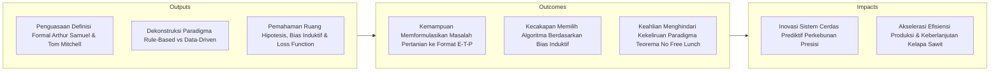
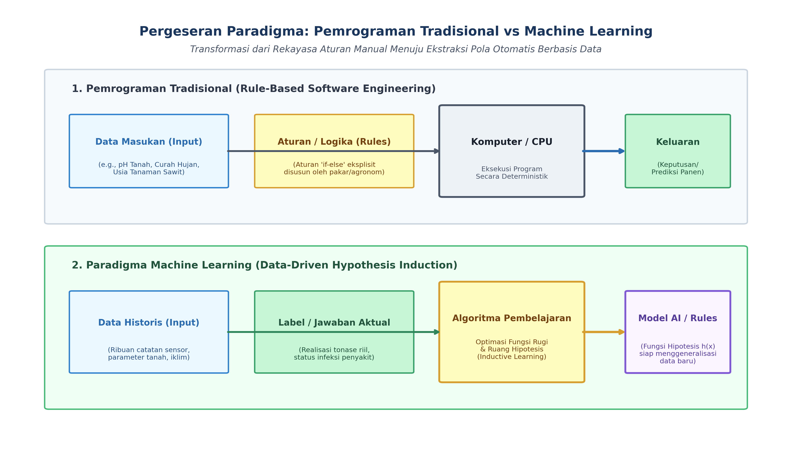
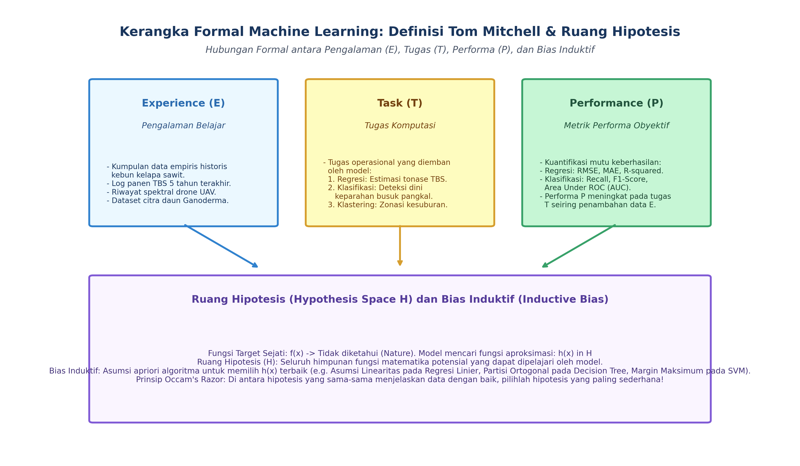

# AI Modul 5.1: Konsep Dasar Machine Learning

---

## 1. Identitas & Kerangka Capaian Pembelajaran (Sub-CPMK)

* **Kode Modul**        : AI Modul 5.1
* **Mata Kuliah**       : Kecerdasan Buatan dan Sains Data Pertanian Presisi
* **Alokasi Waktu**     : 2 x 50 Menit (Kajian Teori & Diskusi) + 2 x 50 Menit (Eksplorasi Praktikum Mandiri)
* **Beban SKS**         : 3 SKS
* **Prasyarat**         : Part 4 (Manipulasi dan Analisis Data)
* **Level Kognitif**    : C2 (Memahami), C3 (Menerapkan), C4 (Menganalisis)



### 1.1 Capaian Pembelajaran Khusus (Sub-CPMK)
Setelah menyelesaikan modul ini, mahasiswa dan pembelajar diharapkan mampu:
1. **Menguraikan (C2)** definisi formal Machine Learning menurut Tom Mitchell (Tugas $T$, Kinerja $P$, Pengalaman $E$) dan pergeseran paradigma dari *Software 1.0* (pemrograman aturan) ke *Software 2.0* (pembelajaran berbasis data).
2. **Menganalisis (C4)** anatomi ruang hipotesis $\mathcal{H}$ dan peranan fungsi kerugian (*Loss Function*) dalam mengarahkan konvergensi model AI.
3. **Mengevaluasi (C4)** batas kelayakan pembelajaran (*Feasibility of Learning*) dan teorema *No Free Lunch* (NFL) pada domain pertanian presisi.
4. **Menerapkan (C3)** kerangka kerja Mitchell untuk merumuskan problem estimasi panen sawit dan klasifikasi penyakit kanopi menjadi formulasi machine learning formal.

### 1.2 Kerangka Hasil Pembelajaran (Outputs, Outcomes, & Impacts)
* **Outputs (Keluaran Berwujud Langsung)**:
  * Menjelaskan perbedaan fundamental antara paradigma pemrograman berbasis aturan (*rule-based programming*) dengan paradigma pembelajaran induktif berbasis data (*machine learning*).
  * Memformulasikan masalah kecerdasan buatan ke dalam kerangka formal Tom Mitchell: Pengalaman (*Experience* - $E$), Tugas (*Task* - $T$), dan Pengukuran Performa (*Performance Measure* - $P$).
  * Menguraikan konsep ruang hipotesis ($\mathcal{H}$), fungsi target sejati ($f(\mathbf{x})$), fungsi aproksimasi ($\hat{h}(\mathbf{x})$), serta peranan fungsi kerugian (*loss function*).
  * Menjelaskan signifikansi bias induktif (*inductive bias*) dalam membatasi ruang pencarian model dan kaitannya dengan prinsip *Occam's Razor*.
  * Menjelaskan implikasi praktis Teorema *No Free Lunch* (NFL) terhadap metodologi rekayasa model kecerdasan buatan.
* **Outcomes (Hasil Capaian & Perubahan Kompetensi)**:
  * Mengubah deskripsi persoalan agronomis lapangan yang ambigu (misal: estimasi panen kebun sawit) menjadi formulasi matematika machine learning terdefinisi ketat ($E, T, P$) yang siap dieksekusi oleh tim rekayasa data.
  * Membedah kelemahan sistem pakar (*expert system*) berbasis aturan manual yang kaku di pabrik kelapa sawit dan menggantikannya dengan arsitektur pembelajaran mesin adaptif.
  * Memilih keluarga algoritma yang relevan berdasarkan kesesuaian bias induktif algoritma dengan karakteristik fisik data tanah, cuaca, atau spektral tanaman.
* **Impacts (Dampak Jangka Panjang & Nilai Guna Luas)**:
  * Modernisasi tata kelola perkebunan kelapa sawit nasional dari sistem operasional reaktif berbasis intuisi menjadi sistem prediktif berbasis data empiris (*data-driven predictive agriculture*).
  * Peningkatan daya saing lulusan Sarjana Sains Data, Kecerdasan Buatan, dan Teknik Pertanian INSTIPER Yogyakarta di kancah industri kecerdasan buatan global.
  * Optimalisasi penggunaan sumber daya input kebun (pupuk, air, energi mesin) demi mewujudkan perkebunan kelapa sawit yang berkelanjutan (*sustainable palm oil*).

---

## 2. Paradigma Komputasi: Rule-Based vs Machine Learning

Sejak awal kelahiran ilmu komputer, pendekatan dominan dalam menyelesaikan masalah adalah **Rekayasa Perangkat Lunak Tradisional (*Traditional Programming*)**. Pada pendekatan ini, manusia bertindak sebagai penerjemah pengetahuan: analis meneliti domain masalah, menyusun aturan logika eksplisit (*if-this-then-that*), lalu menuliskan instruksi kode program tersebut agar dieksekusi secara deterministik oleh komputer.



### 2.1 Perbandingan Mekanistik Komputasi

| Dimensi | Pemrograman Tradisional (Rule-Based) | Pembelajaran Mesin (Machine Learning) |
| :--- | :--- | :--- |
| **Masukan Utama** | Data Masukan (*Input*) + Aturan Program (*Rules/Logic*). | Data Masukan (*Input*) + Label/Jawaban Historis (*Outputs*). |
| **Keluaran Utama** | Keputusan / Hasil Komputasi (*Answers*). | Model Prediktif / Fungsi Representasi Aturan (*Learned Rules*). |
| **Penyusun Aturan** | **Pakar Manusia:** Insinyur perangkat lunak dan pakar agronomi menulis kode secara manual. | **Algoritma Komputasi:** Mesin mengekstrak korelasi matematika secara otomatis dari data pengamatan. |
| **Skalabilitas Masalah** | Efektif untuk masalah deterministik bervariabel sedikit (misal: kalkulasi slip gaji karyawan PKS). | Sangat unggul untuk masalah kompleks multidimensi (misal: deteksi penyakit daun sawit dari citra drone). |
| **Resistensi Perubahan** | Kaku (*brittle*). Jika pola cuaca bergeser, seluruh aturan logika kode harus diubah manual satu per satu. | Adaptif (*self-updating*). Model dapat dilatih ulang (*retrained*) dengan data baru secara otomatis. |

### 2.2 Keterbatasan Pendekatan Berbasis Aturan di Sektor Agribisnis
Bayangkan seorang manajer kebun ingin membuat sistem otomatis untuk menentukan apakah sebuah tandan buah segar (TBS) di stasiun timbang termasuk kategori "Matang Prima" atau "Lewat Matang/Afkir".
- Jika menggunakan pendekatan aturan manual, agronom menulis aturan:
  $$\text{IF Brondolan Lepas} \ge 5 \text{ AND Warna} = \text{'Oranye'} \text{ AND Berat} > 15 \text{ THEN 'Matang'}$$
- **Kelemahan Fatal:** Di lapangan, warna buah dipengaruhi intensitas cahaya matahari saat difoto, varietas bibit yang berbeda (Tenera vs Dura), serta kelembaban permukaan buah. Aturan manual akan membengkak menjadi ribuan baris kode *nested if-else* yang saling bertentangan (*spaghetti logic*), rapuh, dan mustahil dipelihara (*unmaintainable*).

Machine learning mengatasi kebuntuan ini: berikan $100.000$ foto buah sawit beserta label status mutunya dari mandor ahli, biarkan algoritma mempelajari fungsi pemisah matematis di ruang fitur secara otomatis.

---

## 3. Landasan Teoretis dan Definisi Formal Machine Learning

Dua definisi historis menjadi landasan pijak keilmuan machine learning modern:

### 3.1 Definisi Arthur Samuel (1959)
> *"Machine Learning is the field of study that gives computers the ability to learn without being explicitly programmed."*  
> (Pembelajaran mesin adalah bidang studi yang memberikan komputer kemampuan untuk belajar tanpa harus diprogram secara eksplisit.)

Arthur Samuel memelopori konsep ini melalui program permainan dam (*checkers*). Komputer tidak diberi strategi kemenangan buatan manusia, melainkan memainkan ribuan babak simulasi melawan dirinya sendiri dan mempelajari posisi bidak mana yang berkorelasi dengan kemenangan.

### 3.2 Definisi Operasional Tom M. Mitchell (1997)
Profesor Carnegie Mellon University, Tom Mitchell, merumuskan definisi matematika operasional yang menjadi standar evaluasi rekayasa machine learning hingga hari ini:

> *"A computer program is said to **learn** from experience $\mathcal{E}$ with respect to some class of tasks $\mathcal{T}$ and performance measure $\mathcal{P}$, if its performance at tasks in $\mathcal{T}$, as measured by $\mathcal{P}$, improves with experience $\mathcal{E}$."*



### 3.3 Tiga Pilar Formal Mitchell ($\mathcal{E}, \mathcal{T}, \mathcal{P}$) pada Domain Agribisnis
Setiap perancangan sistem machine learning wajib didefinisikan ke dalam tiga elemen berikut:

```
                          ┌───────────────────────────┐
                          │         TASK (T)          │
                          │ Tugas Operasional Model   │
                          └─────────────┬─────────────┘
                                        │
                         Dievaluasi     │     Diperkaya oleh
                         menggunakan    ▼     akumulasi
             ┌────────────────────────┐   ┌────────────────────────┐
             │    PERFORMANCE (P)     │   │     EXPERIENCE (E)     │
             │ Metrik Kuantitatif Mutu│   │ Data Pengamatan Sensor │
             └────────────────────────┘   └────────────────────────┘
```

#### Contoh Kasus 1: Prediksi Rendemen Minyak Kelapa Sawit (CPO) di Pabrik
- **Tugas ($\mathcal{T}$):** Memprediksi persentase rendemen minyak kelapa sawit ($y \in [18.0\%, 26.0\%]$) dari setiap lori rebusan yang masuk ke stasiun *press*.
- **Pengalaman ($\mathcal{E}$):** Dataset historis operasional pabrik selama 3 tahun terakhir, memuat data suhu rebusan (*sterilizer*), tekanan mesin kempa (*screw press*), kadar air buah, dan rendemen aktual hasil laboratorium.
- **Performa ($\mathcal{P}$):** *Root Mean Squared Error* (RMSE) antara rendemen prediksi dan rendemen aktual laboratorium. Pembelajaran terbukti berhasil jika RMSE menurun seiring bertambahnya data historis.

#### Contoh Kasus 2: Deteksi Infeksi Ganoderma pada Bibit Sawit
- **Tugas ($\mathcal{T}$):** Mengklasifikasikan kondisi kesehatan bibit sawit ke dalam dua kelas biner: Sehat ($0$) atau Terinfeksi Patogen ($1$).
- **Pengalaman ($\mathcal{E}$):** Koleksi $50.000$ citra multispektral daun bibit hasil pemindaian kamera UAV di fasilitas pembibitan (*nursery*).
- **Performa ($\mathcal{P}$):** Nilai *Recall* (Sensitivitas) pada kelas terinfeksi dan skor *Area Under ROC Curve* (ROC-AUC).

---

## 4. Ruang Hipotesis, Fungsi Pendekatan, dan Bias Induktif

Bagaimana sebuah algoritma komputer sebenarnya "belajar"? Secara matematis, proses belajar adalah proses **pencarian fungsi (*function approximation*)** di dalam ruang kemungkinan yang sangat luas.

### 4.1 Formulasi Masalah Pendekatan Fungsi
Asumsikan terdapat fungsi target sejati alamiah $f: \mathcal{X} \to \mathcal{Y}$ yang mengatur fenomena kebun secara sempurna (misal: bagaimana kombinasi iklim dan tanah menentukan hasil panen). Fungsi $f$ ini berada di alam dan **tidak diketahui (*unknown*)** oleh manusia maupun komputer.

Tugas algoritma machine learning adalah meneliti himpunan sampel terbatas $\mathcal{D} = \{(\mathbf{x}_i, y_i)\}_{i=1}^n$ untuk menemukan sebuah fungsi hipotesis $\hat{h} \in \mathcal{H}$ sedemikian rupa sehingga:

$$\hat{h}(\mathbf{x}) \approx f(\mathbf{x}) \quad \forall \mathbf{x} \in \mathcal{X}$$

**Keterangan Komponen & Simbol:**
- $\hat{h}$ ($h$-topi / *h-hat*) : Fungsi hipotesis yang dipelajari dan dihasilkan oleh algoritma machine learning.
- $\mathbf{x}$ : Vektor fitur masukan (*input feature vector*) yang memuat variabel prediktor (misal: kelembapan tanah, suhu udara, curah hujan).
- $f$ : Fungsi sejati (*ground-truth function*) alamiah yang mengatur fenomena fisik sebenarnya (bersifat deterministik murni namun tersembunyi).
- $\approx$ : Operator pendekatan (*approximation*), menunjukkan bahwa estimasi model sedekat mungkin dengan fungsi sejati meskipun tidak identik mutlak.
- $\forall$ : Kuantor universal logika, melambangkan "untuk setiap" atau "untuk semua".
- $\mathcal{X}$ : Ruang fitur masukan (*input domain space*), himpunan seluruh kombinasi nilai masukan yang valid.
- $\mathcal{H}$ : **Ruang Hipotesis (*Hypothesis Space*)**, yaitu seluruh himpunan fungsi matematika kandidat yang mampu diekspresikan oleh arsitektur model yang dipilih.

**Cara Membaca Rumus:**
> *"Fungsi hipotesis h-topi dari vektor masukan x mendekati fungsi sejati f dari vektor masukan x, berlaku untuk setiap vektor x yang merupakan anggota dari ruang fitur X."*

### 4.2 Bias Induktif (*Inductive Bias*)
Jika data pengamatan berjumlah $n$ titik diskrit, terdapat tak hingga banyaknya kurva matematika kontinu yang dapat melewati seluruh $n$ titik tersebut dengan sempurna. Tanpa adanya asumsi tambahan, model komputer tidak memiliki dasar logis untuk memilih kurva mana yang paling benar untuk memprediksi titik baru di masa depan.

Kumpulan asumsi apriori yang digunakan algoritma untuk memprioritaskan satu hipotesis di atas hipotesis lainnya disebut **Bias Induktif (*Inductive Bias*)**.
1. **Bias Linearitas (Regresi Linier):** Mengasumsikan hubungan antara fitur prediktor dan target bersifat garis lurus bidang datar:
   $$\hat{h}(\mathbf{x}) = \mathbf{w}^T \mathbf{x} + b$$
   
   **Keterangan Komponen & Simbol:**
   - $\mathbf{w}$ : Vektor bobot koefisien parameter ($w_1, w_2, \dots, w_d$), mengukur besarnya pengaruh tiap fitur.
   - $\mathbf{w}^T$ : Transpos dari vektor bobot $\mathbf{w}$ untuk memungkinkan operasi perkalian titik (*dot product*) dengan vektor kolom $\mathbf{x}$.
   - $b$ : Bias (intersep skalar), pergeseran garis dasar ketika seluruh nilai fitur bernilai nol.
   
   **Cara Membaca Rumus:**
   > *"Estimasi h-topi dari vektor x sama dengan transpos dari vektor bobot w dikalikan vektor x, ditambah skalar bias b."*

2. **Bias Kedekatan Spasial ($k$-Nearest Neighbors):** Mengasumsikan bahwa titik sampel yang lokasinya berdekatan di ruang fitur cenderung memiliki label target yang serupa.
3. **Bias Partisi Sumbu Ortogonal (Decision Trees):** Mengasumsikan ruang fitur dapat dibagi menjadi daerah-daerah hiper-persegi melalui serangkaian pemisahan tegak lurus sumbu ($x_j \le \theta$).
4. **Prinsip Pisau Occam (*Occam's Razor*):** Bias filosofis universal yang menyatakan bahwa di antara hipotesis-hipotesis yang sama-sama mampu menjelaskan data dengan baik, pilihlah hipotesis yang paling sederhana (memiliki derajat kebebasan / kompleksitas parameter terendah).

---

## 5. Anatomi Komponen Sistem Machine Learning

Secara arsitektural, setiap sistem machine learning modern terdiri dari tiga komponen inti yang saling terhubung dalam siklus optimasi:

```
       ┌────────────────────────┐
       │   Representasi Model   │ ──► Mendefinisikan Ruang Hipotesis H
       │ (Linear, Tree, Neural) │     (e.g., f(x; W) = Wx + b)
       └───────────┬────────────┘
                   │
                   ▼ Prediksi y_hat
       ┌────────────────────────┐
       │     Fungsi Kerugian    │ ──► Mengukur Galat terhadap Kebenaran Dasar
       │    (Loss Function)     │     (e.g., L = (y - y_hat)^2)
       └───────────┬────────────┘
                   │
                   ▼ Nilai Gradien / Sinyal Galat
       ┌────────────────────────┐
       │   Algoritma Optimasi   │ ──► Memperbarui Bobot Parameter W
       │  (Gradient Descent)    │     (e.g., W_baru = W_lama - alpha * dL/dW)
       └────────────────────────┘
```

1. **Komponen Representasi (*Representation*):** Struktur matematika yang menentukan bentuk fungsi hipotesis $\hat{h}(\mathbf{x})$. Pilihan representasi menentukan apa yang bisa dan tidak bisa dipelajari oleh model.
2. **Komponen Evaluasi (*Evaluation / Objective Function*):** Fungsi objektif matematis atau fungsi rugi (*loss function*) $\mathcal{L}(y, \hat{h}(\mathbf{x}))$ yang mengukur tingkat kesalahan prediksi model terhadap target aktual.
   - Pada masalah regresi: *Mean Squared Error*:
     $$\text{MSE} = \frac{1}{n} \sum_{i=1}^n (y_i - \hat{y}_i)^2$$
     - *Keterangan Simbol*: $n$ adalah jumlah total sampel observasi, $\sum_{i=1}^n$ adalah jumlahan dari sampel pertama ($i=1$) hingga sampel ke-$n$, $y_i$ adalah target aktual sampel ke-$i$, dan $\hat{y}_i$ adalah prediksi model sampel ke-$i$.
     - *Cara Membaca Rumus*: *"Mean Squared Error sama dengan satu per n dikalikan jumlah selisih kuadrat antara nilai target aktual y-i dan nilai prediksi y-topi-i untuk seluruh i dari satu hingga n."*
   - Pada masalah klasifikasi: *Binary Cross-Entropy* (Log Loss):
     $$\text{BCE} = -\frac{1}{n} \sum_{i=1}^n \left[ y_i \ln(\hat{p}_i) + (1 - y_i) \ln(1 - \hat{p}_i) \right]$$
     - *Keterangan Simbol*: $y_i \in \{0, 1\}$ adalah label biner aktual, $\hat{p}_i \in [0, 1]$ adalah estimasi probabilitas model untuk kelas 1, dan $\ln$ adalah logaritma natural berbasis bilangan Euler $e$.
     - *Cara Membaca Rumus*: *"Binary Cross-Entropy sama dengan minus satu per n dikalikan jumlah dari: y-i dikali logaritma natural p-topi-i, ditambah satu minus y-i dikali logaritma natural dari satu minus p-topi-i."*
3. **Komponen Optimasi (*Optimization*):** Mekanisme algoritma numerik yang bertugas menelusuri ruang hipotesis untuk mencari parameter bobot $\mathbf{w}^*$ yang meminimalkan nilai fungsi rugi:
   $$\mathbf{w}^* = \arg\min_{\mathbf{w}} \frac{1}{n} \sum_{i=1}^n \mathcal{L}(y_i, \hat{h}(\mathbf{x}_i; \mathbf{w}))$$

   **Keterangan Komponen & Simbol:**
   - $\mathbf{w}^*$ ($w$-bintang / *w-star*) : Vektor bobot optimal yang menghasilkan nilai fungsi rugi terkecil.
   - $\arg\min_{\mathbf{w}}$ (*argument of the minimum*) : Operator matematika yang mencari nilai parameter $\mathbf{w}$ yang menyebabkan fungsi di kanannya mencapai nilai minimum terkecil.
   - $\mathcal{L}(\dots)$ : Fungsi kerugian (*loss function*) per sampel individual.

   **Cara Membaca Rumus:**
   > *"Vektor bobot optimal w-bintang adalah argumen w yang meminimalkan rata-rata fungsi kerugian L antara target sejati y-i dan estimasi h-topi dari x-i dengan bobot w, untuk seluruh sampel dari satu sampai n."*

### 5.3 Teorema "No Free Lunch" (Wolpert & Macready, 1997)
Sebuah dalil fundamental dalam teori komputasi machine learning menyatakan:

> **Teorema No Free Lunch (NFL):**
> *"Jika dievaluasi di atas seluruh distribusi masalah yang mungkin ada secara matematis, tidak ada satu pun algoritma pembelajaran mesin yang secara inheren lebih unggul dibanding algoritma lainnya."*

- **Implikasi Bagi Rekayasa AI Pertanian:** Tidak ada algoritma tunggal serbaguna (*no universal model / no silver bullet*). Model canggih seperti *Deep Neural Network* atau *XGBoost* tidak dijamin selalu mengalahkan *Regresi Linier* sederhana atau *Decision Tree* pada setiap masalah kebun. Keberhasilan model AI bergantung sepenuhnya pada **kesesuaian antara bias induktif algoritma dengan karakteristik struktur data riil di lapangan**.

---

## 6. Spektrum Aplikasi Machine Learning di Industri Agribisnis

Penerapan pembelajaran mesin di sektor kelapa sawit dan pertanian tropis terbagi ke dalam empat klaster fungsional utama:

| Klaster Agribisnis | Permasalahan Lapangan | Pendekatan Machine Learning | Dampak Bisnis Terukur |
| :--- | :--- | :--- | :--- |
| **Pertanian Presisi (*Precision Agriculture*)** | Variabilitas hara tanah dan efisiensi pemupukan N-P-K. | Regresi spasial non-linier berbasis data sensor tanah dan riwayat panen. | Penghematan biaya pupuk hingga $15\% - 25\%$ dan pencegahan degradasi tanah. |
| **Proteksi Tanaman (*Crop Protection*)** | Deteksi dini serangan hama ulat api dan jamur *Ganoderma*. | Klasifikasi citra berbasis *Convolutional Neural Networks* dan sensor optik. | Penekanan angka kematian pohon produktif dan mitigasi penularan antar blok kebun. |
| **Manajemen Rantai Pasok (*Supply Chain*)** | Fluktuasi volume panen harian dan antrean lori di pabrik kelapa sawit (PKS). | *Time-Series Forecasting* (pemodelan runtun waktu) dan regresi ter-regularisasi. | Pengurangan waktu tunggu truk timbang (*turnaround time*) dan pencegahan kenaikan asam lemak bebas (FFA). |
| **Kendali Mutu Pabrik (*Quality Assurance*)** | Penilaian fraksi kematangan tandan buah segar (TBS) di stasiun *grading*. | *Computer Vision* deteksi objek dan segmentasi citra termal. | Obyektivitas penilaian kematangan buah, menghilangkan konflik antara kebun dan pabrik. |

---

## 7. Rangkuman Komprehensif

1. **Pergeseran Paradigma:** Pemrograman tradisional mengandalkan perancangan aturan manual oleh manusia, sedangkan machine learning mengotomatisasi ekstraksi aturan dan fungsi aproksimasi langsung dari data empiris historis.
2. **Definisi Formal Mitchell:** Sebuah sistem dikatakan belajar jika performanya ($\mathcal{P}$) dalam menyelesaikan tugas ($\mathcal{T}$) meningkat secara terukur seiring bertambahnya pengalaman berbasis data ($\mathcal{E}$).
3. **Ruang Hipotesis dan Pendekatan Fungsi:** Hakikat machine learning adalah pencarian fungsi hipotesis $\hat{h} \in \mathcal{H}$ yang paling mendekati fungsi sejati alamiah $f(\mathbf{x})$ yang tidak diketahui.
4. **Pentingnya Bias Induktif:** Kumpulan asumsi apriori algoritma mutlak diperlukan agar model mampu melakukan generalisasi terhadap data masa depan yang belum pernah dilihat.
5. **Trinitas Komponen ML:** Setiap model tersusun atas *Representasi* (bentuk matematis fungsi), *Evaluasi* (fungsi rugi/loss function), dan *Optimasi* (pencarian parameter bobot terbaik).
6. **Teorema No Free Lunch:** Tidak ada algoritma tunggal yang terbaik untuk semua masalah; pemilihan algoritma harus disesuaikan dengan distribusi dan karakteristik fisik data.

---

## 8. Latihan Soal dan Tantangan HOTS (Higher-Order Thinking Skills)

### 8.1 Formulasi Formal Tom Mitchell pada Sistem Kebun Cerdas (Bobot: 30%)
Sebuah perusahaan perkebunan kelapa sawit di Kalimantan Barat ingin mengembangkan sistem kecerdasan buatan untuk mengestimasikan kebutuhan volume penyiraman air harian pada bibit kelapa sawit di area *pre-nursery*. Sistem mengumpulkan data dari 120 sensor kelembaban tanah kapasitif, stasiun cuaca mini (suhu udara, radiasi matahari, kecepatan angin), serta pencatatan debit air penyiraman selama 18 bulan.

1. Formulasikan permasalahan rekayasa kecerdasan buatan di atas secara formal ke dalam tiga pilar Tom Mitchell:
   - Definisikan secara spesifik elemen **Tugas ($\mathcal{T}$)**!
   - Definisikan secara detail elemen **Pengalaman ($\mathcal{E}$)**!
   - Tentukan dan rumuskan formula matematis dari **Pengukuran Performa ($\mathcal{P}$)** yang paling tepat!
2. Jika setelah 6 bulan beroperasi nilai metrik performa $\mathcal{P}$ tidak menunjukkan perbaikan sama sekali meskipun volume data $\mathcal{E}$ meningkat dua kali lipat, analisislah tiga kemungkinan penyebab teknis kegagalan pembelajaran tersebut!

### 8.2 Dekonstruksi Bias Induktif dan Teorema No Free Lunch (Bobot: 40%)
Dua orang insinyur data di sebuah holding perkebunan berdebat mengenai algoritma yang harus digunakan untuk memprediksi tonase panen kelapa sawit per blok:
- *Insinyur A:* Bersikeras bahwa tim harus selalu menggunakan algoritma *Deep Neural Network* (Jaringan Saraf Tiruan Dalam) dengan 10 *hidden layers* karena menurutnya arsitektur deep learning memiliki kapasitas ekspresi paling tinggi dan pasti mengalahkan algoritma klasik.
- *Insinyur B:* Mengusulkan penggunaan model *Regresi Linier Berganda* atau *Ridge Regression* dengan alasan jumlah data blok kebun yang tersedia hanya 150 baris observasi per tahun.

1. Berdasarkan prinsip **Bias Induktif** dan **Prinsip Pisau Occam (*Occam's Razor*)**, berikan penilaian kritis terhadap argumen Insinyur A dan Insinyur B! Siapakah yang memiliki penalaran metodologis yang lebih tepat untuk kasus data 150 sampel ini?
2. Jelaskan bagaimana **Teorema No Free Lunch (NFL)** mematahkan klaim Insinyur A bahwa satu algoritma tertentu pasti mengungguli algoritma lainnya di seluruh kondisi!
3. Jika kemudian holding perkebunan berhasil mengintegrasikan sensor telemetri armada traktor dan citra satelit harian sehingga jumlah sampel membengkak menjadi $2.000.000$ baris data dengan pola interaksi cuaca-tanah yang sangat non-linier, bagaimana evaluasi Anda terhadap pilihan algoritma kedua insinyur tersebut?

### 8.3 Transformasi dari Aturan Manual ke Model Pembelajaran Mesin (Bobot: 30%)
Di sebuah pabrik kelapa sawit (PKS), penentuan kualitas minyak kelapa sawit (CPO) mentah di tangki timbun saat ini dilakukan oleh staf laboratorium menggunakan aturan manual berikut:
- *Aturan 1:* Jika Asam Lemak Bebas (ALB) $\le 3.5\%$ dan Kadar Air $\le 0.15\%$ dan Kadar Kotoran $\le 0.02\%$, maka Status = "Super Prime Export".
- *Aturan 2:* Jika ALB antara $3.51\% - 5.00\%$ dan Kadar Air $\le 0.20\%$, maka Status = "Standard Local".
- *Aturan 3:* Jika ALB $> 5.00\%$ atau Kadar Air $> 0.25\%$, maka Status = "Off-Grade / Afkir".

1. Jelaskan tiga kelemahan mendasar dari sistem penentuan mutu berbasis aturan manual (*hard-coded rule-based system*) di atas ketika dihadapkan pada fluktuasi operasional PKS nyata di lapangan!
2. Gambarkan diagram alir pergeseran paradigma dari sistem aturan manual tersebut menuju sistem klasifikasi mutu berbasis Machine Learning!
3. Tuliskan contoh fungsi hipotesis parametrik $\hat{h}(\mathbf{x})$ untuk mengklasifikasikan mutu minyak tersebut secara probabilistik menggunakan pendekatan *Multinomial Logistic Regression* atau *Softmax Function*!

---

## 9. Daftar Pustaka dan Referensi Akademik

1. Mitchell, T. M. (1997). *Machine Learning*. McGraw-Hill Science/Engineering/Math. Boston, MA.
2. Samuel, A. L. (1959). Some studies in machine learning using the game of checkers. *IBM Journal of Research and Development*, 3(3), 210-229.
3. Wolpert, D. H., & Macready, W. G. (1997). No free lunch theorems for optimization. *IEEE Transactions on Evolutionary Computation*, 1(1), 67-82.
4. Russell, S., & Norvig, P. (2020). *Artificial Intelligence: A Modern Approach* (4th ed.). Pearson. Hoboken, NJ.
5. Hastie, T., Tibshirani, R., & Friedman, J. (2009). *The Elements of Statistical Learning: Data Mining, Inference, and Prediction* (2nd ed.). Springer. New York, NY.
