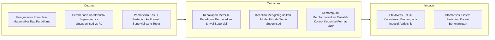
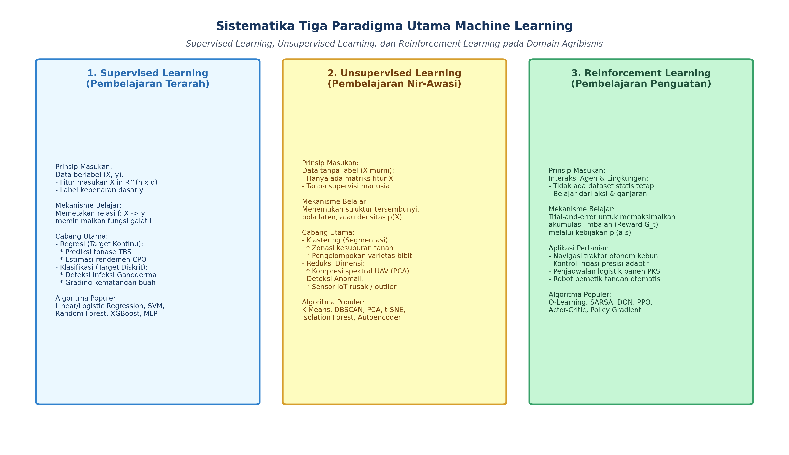
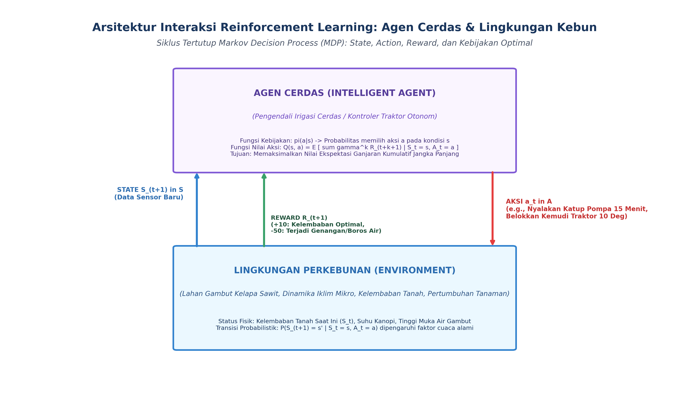

# AI Modul 5.2: Jenis Machine Learning (Supervised, Unsupervised, Reinforcement Learning)

---

## 1. Identitas & Kerangka Capaian Pembelajaran (Sub-CPMK)

* **Kode Modul**        : AI Modul 5.2
* **Mata Kuliah**       : Kecerdasan Buatan dan Sains Data Pertanian Presisi
* **Alokasi Waktu**     : 2 x 50 Menit (Kajian Teori & Diskusi) + 2 x 50 Menit (Eksplorasi Praktikum Mandiri)
* **Beban SKS**         : 3 SKS
* **Prasyarat**         : AI Modul 5.1 (Konsep Dasar Machine Learning)
* **Level Kognitif**    : C2 (Memahami), C3 (Menerapkan), C4 (Menganalisis)



### 1.1 Capaian Pembelajaran Khusus (Sub-CPMK)
Setelah menyelesaikan modul ini, mahasiswa dan pembelajar diharapkan mampu:
1. **Mengklasifikasikan (C2)** tiga paradigma utama machine learning: *Supervised Learning*, *Unsupervised Learning*, dan *Reinforcement Learning* (RL) serta varian semi-supervised.
2. **Menganalisis (C4)** perbedaan karakteristik data masukan (label diskret, target kontinu, ketiadaan label, dan sinyal *reward*) pada rantai agro-industri.
3. **Mengevaluasi (C4)** trade-off antara eksplorasi dan eksploitasi (*Exploration-Exploitation Dilemma*) pada agen RL kendali penyiraman cerdas.
4. **Menentukan (C3)** paradigma machine learning yang paling tepat dan efisien untuk menyelesaikan permasalahan spesifik di pabrik kelapa sawit dan lahan kebun.

### 1.2 Kerangka Hasil Pembelajaran (Outputs, Outcomes, & Impacts)
* **Outputs (Keluaran Berwujud Langsung)**:
  * Membedakan karakteristik matematis, bentuk masukan (*inputs*), bentuk keluaran (*outputs*), dan sinyal umpan balik (*feedback signal*) dari tiga pilar machine learning: *Supervised*, *Unsupervised*, dan *Reinforcement Learning*.
  * Memformulasikan persoalan **Supervised Learning** ke dalam sub-domain Regresi ($y \in \mathbb{R}$) dan Klasifikasi ($y \in \{1, \dots, C\}$) beserta fungsi objektif optimasinya (*Mean Squared Error* dan *Cross-Entropy*).
  * Menguraikan mekanisme **Unsupervised Learning** dalam menemukan struktur intrinsik $p(\mathbf{x})$, meliputi klastering (*clustering*), reduksi dimensi (*dimensionality reduction*), dan deteksi anomali (*anomaly detection*).
  * Menjelaskan komponen formal **Reinforcement Learning** berbasis kerangka *Markov Decision Process* (MDP): himpunan status ($\mathcal{S}$), aksi ($\mathcal{A}$), probabilitas transisi ($\mathcal{P}$), fungsi imbalan ($\mathcal{R}$), faktor diskon ($\gamma$), kebijakan ($\pi$), serta Persamaan Bellman.
  * Membandingkan kelebihan, kekurangan, dan kompromi komputasional (*computational trade-offs*) dari masing-masing paradigma saat diterapkan pada data agribisnis riil.
* **Outcomes (Hasil Capaian & Perubahan Kompetensi)**:
  * Mendiagnosis ketersediaan data di perkebunan kelapa sawit (ketiadaan label, biaya pelabelan mahal, atau kebutuhan interaksi dinamis) dan merekomendasikan paradigma pembelajaran yang paling efisien secara biaya dan waktu.
  * Merancang arsitektur sistem analitik hibrida yang menggabungkan *Unsupervised Learning* (untuk mereduksi dimensi data citra multispektral UAV) dengan *Supervised Learning* (untuk memprediksi defisiensi hara tanaman).
  * Memformulasikan masalah optimasi operasional kebun yang bersifat sekuensial (seperti otomasi buka-tutup katup irigasi lahan gambut atau rute panen armada traktor) ke dalam formulasi MDP yang siap dilatih menggunakan algoritma *Q-Learning* atau *Deep Q-Networks*.
* **Impacts (Dampak Jangka Panjang & Nilai Guna Luas)**:
  * Peningkatan efisiensi rekayasa perangkat lunak cerdas di sektor pertanian tropis, menghindari pemborosan anggaran pelabelan data manual yang tidak perlu.
  * Terwujudnya sistem mekanisasi pertanian otonom (*autonomous smart farming*) yang adaptif terhadap perubahan iklim ekstrem di perkebunan kelapa sawit nasional.
  * Penguatan posisi akademisi dan lulusan FTP INSTIPER Yogyakarta sebagai inovator terdepan dalam hilirisasi teknologi AI terapan di sektor agroindustri nasional.

---

## 2. Pemetaan Tiga Pilar Paradigma Pembelajaran Mesin

Setiap algoritma pembelajaran mesin dibedakan berdasarkan **keberadaan dan sifat sinyal pembimbing (*supervisory signal*)** yang diterima selama proses pelatihan.



```
                            MACHINE LEARNING
                                    │
       ┌────────────────────────────┼────────────────────────────┐
       ▼                            ▼                            ▼
  SUPERVISED                  UNSUPERVISED                 REINFORCEMENT
   LEARNING                     LEARNING                     LEARNING
(Ada Guru/Label)             (Tanpa Label)              (Belajar dari Reward)
  D = {(x_i, y_i)}             D = {x_i}                   Interaksi Agen-Env
       │                            │                            │
 ┌─────┴─────┐                ┌─────┼─────┐                      ▼
 ▼           ▼                ▼     ▼     ▼               Markov Decision
Regresi Klasifikasi       Klaster Reduksi Anomali          Process (MDP)
(Kontinu) (Diskrit)                 Dimensi
```

---

## 3. AI Modul 5.2.1: Supervised Learning (Pembelajaran Terarah / Terawasi)

### 3.1 Landasan Matematis Supervised Learning
Pada paradigma **Supervised Learning**, model bertindak seperti seorang siswa yang belajar di bawah bimbingan guru. Algoritma diberikan dataset pasangan pengamatan berlabel:
$$\mathcal{D}_{\text{train}} = \{(\mathbf{x}_1, y_1), (\mathbf{x}_2, y_2), \dots, (\mathbf{x}_n, y_n)\}$$

Di mana:
- $\mathbf{x}_i \in \mathbb{R}^d$ adalah vektor fitur masukan berdimensi $d$.
- $y_i \in \mathcal{Y}$ adalah label target aktual (*ground truth*) yang disediakan oleh manusia atau instrumen pengukuran terkalibrasi.

Model bertujuan mempelajari fungsi pemetaan parametrik $\hat{y} = \hat{f}(\mathbf{x}; \mathbf{w})$ yang meminimalkan nilai ekspektasi fungsi kerugian empiris (*Empirical Risk Minimization*):
$$\mathbf{w}^* = \arg\min_{\mathbf{w}} \frac{1}{n} \sum_{i=1}^n \mathcal{L}(y_i, \hat{f}(\mathbf{x}_i; \mathbf{w}))$$

- **Keterangan Komponen Simbol:** $\mathbf{w}^*$ adalah parameter optimal, $\arg\min_{\mathbf{w}}$ adalah pencarian parameter $\mathbf{w}$ yang meminimalkan fungsi, $n$ adalah jumlah data sampel, dan $\mathcal{L}$ adalah fungsi kerugian per sampel.
- **Cara Membaca Rumus:** *"Vektor bobot w-bintang adalah argumen w yang meminimalkan rata-rata fungsi kerugian L antara target aktual y-i dan fungsi estimasi f-topi dari x-i dengan parameter w, untuk seluruh sampel dari satu sampai n."*

### 3.2 Dua Cabang Utama Supervised Learning

#### A. Regresi (Nilai Target Kontinu: $\mathcal{Y} \subseteq \mathbb{R}$)
Target yang diprediksi berupa kuantitas numerik kontinu tak hingga.
- **Fungsi Rugi Umum:** *Mean Squared Error* (MSE)
  $$\mathcal{L}_{\text{MSE}} = \frac{1}{n} \sum_{i=1}^n (y_i - \hat{y}_i)^2$$
  - **Keterangan Komponen Simbol:** $n$ adalah jumlah total sampel data, $y_i$ adalah nilai kontinu aktual, dan $\hat{y}_i$ adalah nilai prediksi model.
  - **Cara Membaca Rumus:** *"Loss MSE sama dengan satu per n dikalikan jumlahan kuadrat selisih antara nilai target aktual y-i dan prediksi y-topi-i untuk seluruh i dari satu hingga n."*
- **Studi Kasus Agroindustri:**
  1. *Estimasi Produksi Panen:* Memprediksi tonase TBS (Ton/Ha) berdasarkan riwayat curah hujan, dosis pupuk, dan usia tanaman.
  2. *Prediksi Rendemen Minyak CPO:* Mengestimasikan persentase rendemen minyak ($18.5\% - 25.0\%$) berdasarkan parameter suhu dan tekanan kempa rebusan pabrik.

#### B. Klasifikasi (Nilai Target Diskrit / Kategori: $\mathcal{Y} \in \{1, 2, \dots, C\}$)
Target yang diprediksi berupa label kelas kategori kualitatif.
- **Fungsi Rugi Umum:** *Categorical Cross-Entropy* (Log Loss)
  $$\mathcal{L}_{\text{CE}} = -\sum_{c=1}^C y_{ic} \ln(\hat{p}_{ic})$$
  - **Keterangan Komponen Simbol:** $C$ adalah jumlah total kelas kategori, $y_{ic} \in \{0, 1\}$ adalah indikator biner apakah kelas $c$ adalah kelas sejati sampel ke-$i$, dan $\hat{p}_{ic}$ adalah probabilitas prediksi model untuk kelas $c$.
  - **Cara Membaca Rumus:** *"Loss Cross-Entropy sama dengan minus jumlahan untuk c dari satu hingga C dari: y-i-c dikalikan logaritma natural p-topi-i-c."*
- **Studi Kasus Agroindustri:**
  1. *Deteksi Penyakit Busuk Pangkal Batang (Ganoderma):* Klasifikasi biner: Sehat ($y = 0$) vs Terinfeksi ($y = 1$).
  2. *Fraksi Kematangan Buah Sawit di Sortasi PKS:* Klasifikasi multikelas: Mentah ($1$), Kurang Matang ($2$), Matang Prima ($3$), Lewat Matang ($4$), Tandan Kosong/Afkir ($5$).

---

## 4. AI Modul 5.2.2: Unsupervised Learning (Pembelajaran Tak Terarah / Nir-Awasi)

### 4.1 Landasan Matematis Unsupervised Learning
Pada paradigma **Unsupervised Learning**, algoritma tidak diberikan label target sama sekali ($y$ tidak tersedia). Dataset pelatihan murni hanya memuat sekumpulan vektor fitur masukan:
$$\mathcal{D} = \{\mathbf{x}_1, \mathbf{x}_2, \dots, \mathbf{x}_n\}, \quad \mathbf{x}_i \in \mathbb{R}^d$$

Tujuan utama algoritma adalah memodelkan struktur probabilitas mendasar $p(\mathbf{x})$, menemukan pola tersembunyi (*latent patterns*), mendeteksi kelompok alami (*natural grouping*), atau menyederhanakan representasi ruang data ke dimensi yang lebih ringkas tanpa kehilangan variansi informasi esensial.

### 4.2 Tiga Sub-Domain Fundamental Unsupervised Learning

#### A. Klastering (*Clustering / Segmentasi Data*)
Mengelompokkan $n$ sampel data ke dalam $K$ kelompok (*clusters*) sedemikian rupa sehingga sampel dalam satu kelompok memiliki kemiripan (*similarity*) maksimal, sementara sampel antar kelompok memiliki perbedaan (*dissimilarity*) maksimal.
- **Fungsi Objektif K-Means (Inersia Intra-Klaster):**
  $$J = \sum_{k=1}^K \sum_{\mathbf{x}_i \in \mathcal{C}_k} \|\mathbf{x}_i - \boldsymbol{\mu}_k\|^2$$
  - **Keterangan Komponen Simbol:** $J$ adalah inersia total (jumlah kuadrat jarak internal), $K$ adalah jumlah klaster, $\mathcal{C}_k$ adalah himpunan titik pada klaster ke-$k$, $\mathbf{x}_i$ adalah vektor fitur sampel ke-$i$, $\boldsymbol{\mu}_k$ adalah pusat massa (*centroid*) klaster ke-$k$, dan $\|\cdot\|^2$ adalah kuadrat norma Euclidean.
  - **Cara Membaca Rumus:** *"Fungsi objektif J sama dengan jumlahan untuk k dari satu sampai K dari jumlahan setiap vektor x-i anggota klaster C-k terhadap kuadrat jarak Euclidean antara x-i dan sentroid mu-k."*
- **Aplikasi Perkebunan:** *Zonasi Kesuburan Tanah Mandiri*. Mengelompokkan ratusan hektar blok kebun menjadi 4 zona manajemen spesifik (Sangat Subur, Cukup, Defisiensi Kalium, Kritis) berdasarkan data sensor tanah tanpa perlu menunggu hasil uji laboratorium kimiawi yang mahal.

#### B. Reduksi Dimensi (*Dimensionality Reduction*)
Mentransformasikan matriks fitur berdimensi tinggi $\mathbf{X} \in \mathbb{R}^{n \times d}$ menjadi representasi berdimensi rendah $\mathbf{Z} \in \mathbb{R}^{n \times p}$ (di mana $p \ll d$) untuk menghilangkan multikolinearitas, memampatkan penyimpanan, dan memvisualisasikan data pada bidang 2D/3D.
- **Principal Component Analysis (PCA):** Memproyeksikan data ke arah vektor eigen dengan variansi terbesar.
- **Aplikasi Perkebunan:** *Kompresi Citra Drone Hiperspektral*. Kamera drone perkebunan menangkap 128 pita spektral sempit (*narrow bands*). PCA mereduksi 128 pita tersebut menjadi 3 komponen utama (*Principal Components*) yang mencakup $>95\%$ informasi pantulan klorofil dan air, memotong waktu pemrosesan AI hingga belasan kali lipat.

#### C. Deteksi Anomali (*Anomaly / Novelty Detection*)
Mengidentifikasi observasi langka yang menyimpang secara signifikan dari mayoritas sebaran data normal (*outlier detection*).
- **Algoritma Populer:** *Isolation Forest*, *One-Class SVM*, *Local Outlier Factor (LOF)*.
- **Aplikasi Perkebunan:** Mendeteksi malfungsi sensor telemetri cuaca IoT di tengah perkebunan terpencil secara otomatis saat sensor membeku atau tertutup kotoran burung.

---

## 5. AI Modul 5.2.3: Reinforcement Learning (Pembelajaran Penguatan)

### 5.1 Karakteristik Paradigma Reinforcement Learning
Berbeda dari Supervised Learning yang mengandalkan jawaban statis, **Reinforcement Learning (RL)** terinspirasi oleh teori belajar psikologi perilaku (*behaviorist psychology*): belajar melalui **interaksi aktif coba-ralat (*trial-and-error*)** dengan lingkungan dinamis.

Tidak ada dataset masukan-keluaran yang disiapkan di awal. Agen cerdas (*agent*) mengeksplorasi lingkungan (*environment*), mengambil aksi, dan menerima sinyal evaluatif berupa ganjaran (*reward*) atau hukuman (*penalty*).



### 5.2 Formulasi Formal: Markov Decision Process (MDP)
Masalah RL secara matematis dimodelkan sebagai *Markov Decision Process* yang didefinisikan oleh 5 elemen tupel:
$$\mathcal{M} = \langle \mathcal{S}, \mathcal{A}, \mathcal{P}, \mathcal{R}, \gamma \rangle$$

- **Keterangan Komponen Simbol:** $\mathcal{M}$ melambangkan model proses keputusan Markov, $\mathcal{S}$ adalah ruang status (*states*), $\mathcal{A}$ adalah ruang aksi (*actions*), $\mathcal{P}$ adalah fungsi probabilitas transisi, $\mathcal{R}$ adalah fungsi imbalan (*reward*), dan $\gamma$ adalah faktor diskon.
- **Cara Membaca Rumus:** *"Model M didefinisikan sebagai tupel yang terdiri dari himpunan status S, himpunan aksi A, probabilitas transisi P, fungsi ganjaran R, dan faktor diskon gamma."*

1. $\mathcal{S}$ (**Ruang Status / *State Space***): Himpunan seluruh kondisi lingkungan yang mungkin diamati agen pada langkah waktu $t$ ($S_t \in \mathcal{S}$).
   - *Contoh Kebun:* $S_t = [\text{Kelembaban Tanah: } 22\%, \text{ Suhu Udara: } 34^\circ\text{C}, \text{ Prakiraan Hujan: } 10\%]$.
2. $\mathcal{A}$ (**Ruang Aksi / *Action Space***): Himpunan seluruh tindakan legal yang dapat dieksekusi oleh aktuator agen ($A_t \in \mathcal{A}$).
   - *Contoh Kebun:* $A_t \in \{\text{Matikan Pompa}, \text{Irigasi Rendah (5 L/m}^2), \text{Irigasi Penuh (15 L/m}^2)\}$.
3. $\mathcal{P}$ (**Fungsi Transisi Probabilitas Status**): Model dinamika lingkungan:
   $$\mathcal{P}(s' \mid s, a) = \mathbb{P}(S_{t+1} = s' \mid S_t = s, A_t = a)$$
   - **Keterangan Komponen Simbol:** $s$ adalah status saat ini, $a$ adalah aksi yang diambil, $s'$ adalah status berikutnya di masa depan, dan $\mathbb{P}$ adalah probabilitas bersyarat.
   - **Cara Membaca Rumus:** *"Probabilitas P dari status berikutnya s-aksen diberikan status s dan aksi a sama dengan peluang bahwa status pada waktu t plus satu adalah s-aksen dengan syarat status pada waktu t adalah s dan aksi pada waktu t adalah a."*
4. $\mathcal{R}$ (**Fungsi Ganjaran / *Reward Function***): Sinyal skalar numerik seketika yang dikirimkan lingkungan kepada agen setelah mengambil aksi $a$ pada status $s$:
   $$\mathcal{R}(s, a) = \mathbb{E}[R_{t+1} \mid S_t = s, A_t = a]$$
   - **Keterangan Komponen Simbol:** $\mathcal{R}(s, a)$ adalah ekspektasi ganjaran skalar seketika $R_{t+1}$ setelah mengeksekusi aksi $a$ dari status $s$.
   - **Cara Membaca Rumus:** *"Fungsi imbalan R dari status s dan aksi a sama dengan nilai ekspektasi dari reward pada waktu t plus satu dengan syarat status pada waktu t adalah s dan aksi pada waktu t adalah a."*
   - *Contoh Kebun:* $+10$ jika kelembaban mencapai target ideal tanpa membuang air; $-50$ jika tanaman mengalami stres air atau tangki air habis terkuras.
5. $\gamma \in [0, 1]$ (**Faktor Diskon / *Discount Factor***): Menentukan seberapa besar agen menghargai imbalan jangka panjang masa depan dibanding imbalan instan saat ini.

### 5.3 Kebijakan ($\pi$) dan Persamaan Bellman
- **Kebijakan (*Policy* $\pi$):** Strategi keputusan agen yang memetakan status ke distribusi probabilitas aksi:
  $$\pi(a \mid s) = \mathbb{P}(A_t = a \mid S_t = s)$$
  - **Cara Membaca Rumus:** *"Kebijakan pi untuk aksi a diberikan status s sama dengan peluang agen mengeksekusi aksi a pada waktu t dengan syarat lingkungan berada pada status s pada waktu t."*

- **Fungsi Nilai Aksi Optimal ($Q^*(s, a)$):** Ekspektasi imbalan kumulatif terdiskon jika agen mengambil aksi $a$ pada status $s$ lalu mengikuti kebijakan optimal setelahnya. Hubungan ini diatur oleh **Persamaan Optimalitas Bellman**:
  $$Q^*(s, a) = \mathcal{R}(s, a) + \gamma \sum_{s' \in \mathcal{S}} \mathcal{P}(s' \mid s, a) \max_{a' \in \mathcal{A}} Q^*(s', a')$$

  - **Keterangan Komponen Simbol:** $Q^*(s, a)$ adalah nilai kualitas aksi optimal, $\mathcal{R}(s, a)$ adalah imbalan langsung, $\gamma$ adalah faktor diskon, $\sum_{s' \in \mathcal{S}}$ adalah jumlahan terhadap seluruh kemungkinan status masa depan $s'$, dan $\max_{a' \in \mathcal{A}} Q^*(s', a')$ adalah nilai aksi terbaik yang dapat diambil di status baru $s'$.
  - **Cara Membaca Rumus:** *"Q-bintang dari status s dan aksi a sama dengan fungsi imbalan R dari status s dan aksi a, ditambah gamma dikalikan jumlahan untuk setiap s-aksen anggota himpunan S dari: probabilitas transisi ke s-aksen dikalikan nilai maksimum Q-bintang di status s-aksen untuk seluruh pilihan aksi a-aksen anggota A."*

---

## 6. Matriks Perbandingan Komparatif Tiga Paradigma

| Dimensi Evaluasi | Supervised Learning | Unsupervised Learning | Reinforcement Learning |
| :--- | :--- | :--- | :--- |
| **Bentuk Data Masukan** | Berpasangan: Fitur $\mathbf{x}$ dan Label $y$. | Tunggal: Hanya Fitur $\mathbf{x}$ tanpa label. | Tidak ada dataset statis; interaksi dinamis $(S_t, A_t, R_{t+1}, S_{t+1})$. |
| **Sinyal Bimbingan** | Supervisi Langsung: Koreksi kesalahan prediksi secara instan terhadap target sejati. | **Nir-Supervisi:** Tidak ada sinyal target eksternal; belajar dari kerapatan probabilitas intrinsik. | Supervisi Tertunda (*Delayed Reward*): Evaluasi berupa sinyal skalar baik/buruk setelah tindakan. |
| **Fokus Tujuan Utama** | Memprediksi keluaran $y$ pada data masa depan yang belum pernah dilihat. | Menemukan struktur laten, segmentasi kelompok alami, atau kompresi representasi. | Menemukan kebijakan optimal $\pi^*$ untuk memaksimalkan imbalan kumulatif jangka panjang. |
| **Algoritma Populer** | Linear Regression, SVM, Random Forest, LightGBM, ResNet. | K-Means, DBSCAN, PCA, t-SNE, Isolation Forest. | Q-Learning, SARSA, Deep Q-Networks (DQN), PPO, SAC. |
| **Tantangan Terbesar** | Biaya tinggi pembuatan label manual (*annotation bottleneck*). | Kesulitan mengukur performa obyektif karena ketiadaan label kebenaran dasar. | Masalah kompromi Eksplorasi vs Eksploitasi (*Exploration vs Exploitation*) dan kebutuhan jutaan iterasi simulasi. |

---

## 7. Rangkuman Komprehensif

1. **Trilogi Paradigma:** Pembelajaran mesin diklasifikasikan ke dalam *Supervised Learning* (belajar dari contoh berlabel), *Unsupervised Learning* (belajar menemukan pola mandiri), dan *Reinforcement Learning* (belajar dari konsekuensi aksi).
2. **Supervised Learning:** Terbagi menjadi masalah Regresi (target kontinu numerik) dan Klasifikasi (target diskrit kategori). Mengandalkan fungsi rugi seperti MSE dan Cross-Entropy.
3. **Unsupervised Learning:** Menjawab tantangan mahadata yang tidak memiliki label melalui klastering data lahan, reduksi dimensi citra drone, serta deteksi pencilan sensor perkebunan.
4. **Reinforcement Learning:** Beroperasi dalam kerangka formal *Markov Decision Process* (MDP). Agen cerdas mengoptimasi kebijakan keputusan sekuensial $\pi(a|s)$ untuk memaksimalkan ganjaran kumulatif terdiskon masa depan via Persamaan Bellman.
5. **Konvergensi Praktis:** Di industri modern, ketiga paradigma sering dipadukan (*Hybrid / Semi-Supervised Learning*): reduksi dimensi tanpa label diterapkan terlebih dahulu sebelum melatih model klasifikasi terawasi, atau model supervised digunakan sebagai pemodel lingkungan pada sistem RL.

---

## 8. Latihan Soal dan Tantangan HOTS (Higher-Order Thinking Skills)

### 8.1 Desain Arsitektur Sistem Hibrida Supervised-Unsupervised (Bobot: 35%)
Sebuah konsorsium perkebunan sawit seluas 20.000 hektar menggunakan drone UAV berkamera multispektral untuk memantau kesehatan tajuk pohon kelapa sawit. Drone menghasilkan $500.000$ potongan citra spektral pohon per minggu. Namun, tim analis laboratorium kebun hanya memiliki kapasitas untuk melakukan uji laboratorium daun manual sebanyak $2.500$ sampel per minggu untuk menentukan kadar defisiensi hara Nitrogen dan Magnesium secara pasti.

1. Jelaskan mengapa pendekatan *Supervised Learning* murni akan mengalami kegagalan atau terhambat fatal jika diterapkan secara langsung pada skenario di atas!
2. Rancanglah sebuah alur arsitektur **Pembelajaran Hibrida (*Semi-Supervised Pipeline*)** yang memadukan teknik *Unsupervised Learning* (untuk memanfaatkan $497.500$ data tanpa label) dan *Supervised Learning* (pada $2.500$ sampel berlabel)!
3. Tuliskan algoritma unsupervised yang tepat untuk mereduksi dimensi spektral dan jelaskan bagaimana klastering dapat memandu staf kebun dalam memilih $2.500$ pohon yang paling representatif untuk diuji di laboratorium (*Active Learning sampling strategy*)!

### 8.2 Formulasi Matematika MDP pada Irigasi Lahan Gambut Berbasis RL (Bobot: 35%)
Tinggi muka air (*water table depth*) pada lahan gambut kelapa sawit wajib dijaga secara ketat pada rentang optimal $-40 \text{ cm}$ hingga $-60 \text{ cm}$ dari permukaan tanah. Jika air terlalu surut ($< -70 \text{ cm}$), gambut mengering dan rentan terbakar hebat; jika air terlalu tinggi ($> -30 \text{ cm}$), akar sawit terendam air berlebih dan terjadi penurunan serapan hara. Pintu air dan pompa irigasi dikendalikan oleh unit mikrokontroler cerdas.

Formulasikan permasalahan kontrol sekuensial ini ke dalam kerangka **Markov Decision Process (MDP)**:
1. Definisikan secara matematis vektor **Ruang Status ($\mathcal{S}$)** yang mencakup variabel fisik sensor yang relevan!
2. Definisikan **Ruang Aksi ($\mathcal{A}$)** yang dapat dieksekusi aktuator pintu air/pompa!
3. Rancanglah sebuah **Fungsi Ganjaran / *Reward Function* ($\mathcal{R}(s, a)$)** yang memberikan penalti berat jika terjadi risiko kebakaran atau perendaman, namun memberikan reward positif jika muka air bertahan stabil di zona aman!
4. Jelaskan peran faktor diskon $\gamma = 0.95$ dalam mendorong agen irigasi untuk mengambil tindakan pencegahan beberapa jam *sebelum* bencana kekeringan atau banjir terjadi!

### 8.3 Evaluasi Kritis Paradigma pada Deteksi Kebocoran Pipa CPO (Bobot: 30%)
Di pabrik kelapa sawit (PKS), pipa distribusi minyak CPO panas dari tangki klarifikasi menuju tangki timbun beroperasi 24 jam. Manajemen ingin memasang sistem cerdas deteksi kebocoran pipa menggunakan sensor tekanan dan aliran fluida. Namun, kebocoran pipa adalah kejadian yang sangat langka: selama 5 tahun terakhir, hanya terjadi 2 kali insiden kebocoran kecil dari $10.000.000$ catatan data sensor per detik.

1. Jika seorang pengembang bersikeras menggunakan algoritma *Supervised Learning* (seperti Random Forest Classifier) dengan label `0 = Normal` dan `1 = Bocor`, analisislah mengapa model tersebut akan mengalami kegagalan performa serius!
2. Jelaskan mengapa paradigma **Unsupervised Learning (Deteksi Anomali)** jauh lebih unggul dan tepat secara metodologis untuk permasalahan kebocoran pipa ini!
3. Sebutkan satu algoritma deteksi anomali tanpa label yang sesuai dan jelaskan bagaimana algoritma tersebut menentukan apakah suatu pembacaan tekanan pipa merupakan anomali kebocoran tanpa pernah melihat contoh data bocor sebelumnya!

---

## 9. Daftar Pustaka dan Referensi Akademik

1. Sutton, R. S., & Barto, A. G. (2018). *Reinforcement Learning: An Introduction* (2nd ed.). MIT Press. Cambridge, MA.
2. Bishop, C. M. (2006). *Pattern Recognition and Machine Learning*. Springer. New York, NY.
3. Hastie, T., Tibshirani, R., & Friedman, J. (2009). *The Elements of Statistical Learning: Data Mining, Inference, and Prediction* (2nd ed.). Springer. New York, NY.
4. Russell, S., & Norvig, P. (2020). *Artificial Intelligence: A Modern Approach* (4th ed.). Pearson. Hoboken, NJ.
5. Goodfellow, I., Bengio, Y., & Courville, A. (2016). *Deep Learning*. MIT Press. Cambridge, MA.
