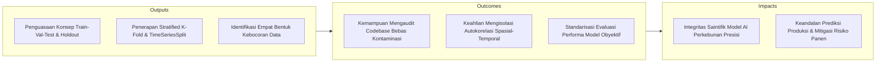
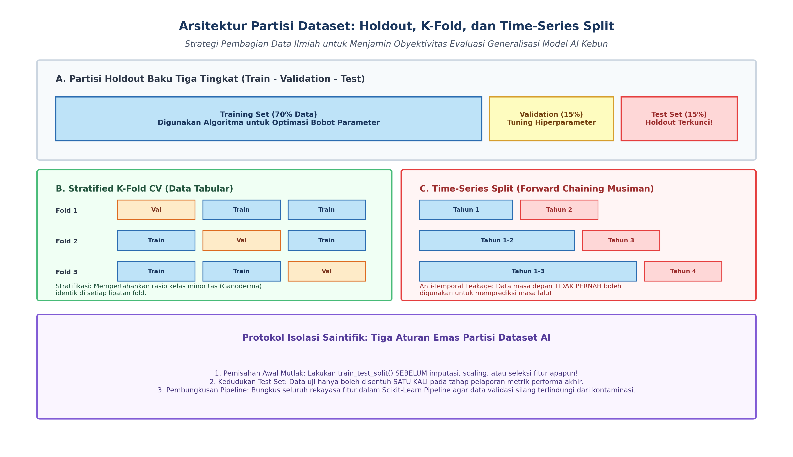
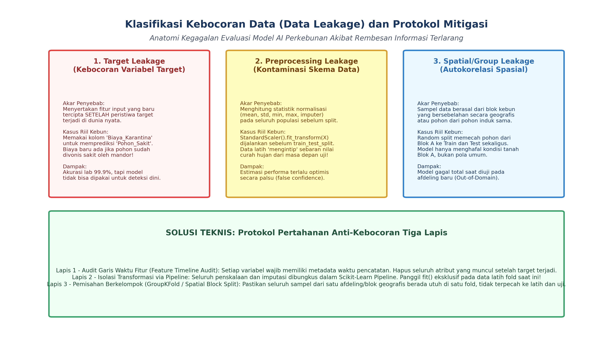

# AI Modul 5.3: Dataset (Training dan Testing)

---

## 1. Identitas & Kerangka Capaian Pembelajaran (Sub-CPMK)

* **Kode Modul**        : AI Modul 5.3
* **Mata Kuliah**       : Kecerdasan Buatan dan Sains Data Pertanian Presisi
* **Alokasi Waktu**     : 2 x 50 Menit (Kajian Teori & Diskusi) + 2 x 50 Menit (Eksplorasi Praktikum Mandiri)
* **Beban SKS**         : 3 SKS
* **Prasyarat**         : AI Modul 5.2 (Jenis Machine Learning)
* **Level Kognitif**    : C2 (Memahami), C3 (Menerapkan), C4 (Menganalisis)



### 1.1 Capaian Pembelajaran Khusus (Sub-CPMK)
Setelah menyelesaikan modul ini, mahasiswa dan pembelajar diharapkan mampu:
1. **Menguraikan (C2)** fondasi statistik partisi dataset: data latih (*training*), data validasi (*validation*), dan data uji (*testing*).
2. **Mendiagnosis (C4)** fenomena kebocoran data (*Data Leakage*) yang bersumber dari prapemrosesan sebelum pemisahan data atau autokorelasi spasial kebun.
3. **Menerapkan (C3)** teknik pemisahan terstratifikasi (*Stratified Split*) dan validasi silang berulang (*Repeated Cross-Validation*) pada data penyakit tanaman langka.
4. **Merancang (C3)** protokol pengujian terisolasi (*Clean Test Set Protocol*) untuk menjamin evaluasi performa model yang jujur dan bebas optimisme semu.

### 1.2 Kerangka Hasil Pembelajaran (Outputs, Outcomes, & Impacts)
* **Outputs (Keluaran Berwujud Langsung)**:
  * Membedakan peranan fungsional dan batasan akses antara Data Latih (*Training Set*), Data Validasi (*Validation Set*), dan Data Uji (*Test Set / Holdout*).
  * Memilih dan mengonfigurasi skema validasi silang yang tepat: *K-Fold Cross-Validation*, *Stratified K-Fold* (untuk kelas tidak seimbang), *TimeSeriesSplit* (untuk deret waktu musiman), dan *GroupKFold* (untuk data berkelompok spasial afdeling).
  * Mendiagnosis empat bentuk utama kebocoran data (*data leakage*): *Target Leakage*, *Preprocessing Leakage*, *Temporal Leakage*, dan *Spatial Autocorrelation Leakage*.
  * Menerapkan aturan emas isolasi data: pemanggilan `.fit()` eksklusif pada data latih dan `.transform()` pada data validasi/uji menggunakan *Scikit-Learn Pipeline*.
  * Menganalisis kurva kompleksitas sampel (*learning curve sample complexity*) untuk menentukan kecukupan volume data latih terhadap konvergensi generalisasi model.
* **Outcomes (Hasil Capaian & Perubahan Kompetensi)**:
  * Melakukan audit forensik terhadap repositori kode machine learning perusahaan perkebunan, mengidentifikasi kontaminasi data uji yang tersembunyi, dan merekonstruksi skema partisi yang terisolasi ketat.
  * Membangun model peramalan panen TBS 5 tahunan menggunakan skema *Forward Chaining* (*TimeSeriesSplit*) yang terbebas dari kesalahan penggunaan informasi masa depan (*lookahead bias*).
  * Mengeliminasi bias autokorelasi spasial antar pohon kelapa sawit yang bersebelahan dengan mempartisi data per blok kebun utuh (*GroupKFold*) sehingga model teruji secara murni pada area geografis baru (*out-of-domain evaluation*).
* **Impacts (Dampak Jangka Panjang & Nilai Guna Luas)**:
  * Pencegahan kerugian finansial masif korporasi perkebunan akibat keputusan alokasi modal dan logistik pabrik yang didasarkan pada model AI yang over-optimistis secara palsu.
  * Standardisasi tata kelola pengujian model sains data di lingkungan perguruan tinggi pertanian dan lembaga riset perkebunan nasional (PPKS, BRIN, INSTIPER).
  * Peningkatan kredibilitas publikasi ilmiah dan adopsi industri terhadap produk-produk kecerdasan buatan karya anak bangsa.

---

## 2. Urgensi Metodologis Partisi Dataset: Generalisasi vs Memorization

Tujuan utama pembelajaran mesin adalah menghasilkan model yang mampu melakukan **generalisasi (*generalization*)**, yaitu kemampuan memprediksi keluaran yang akurat pada data baru yang belum pernah dilihat sebelumnya (*unseen test data*).

```
                  TOTAL DATASET PENGAMATAN KEBUN (D)
   [ n sampel observasi: Fitur X in R^(n x d), Target y in R^n ]
                                 │
                 ┌───────────────┴───────────────┐
                 ▼ (70% - 80%)                   ▼ (20% - 30%)
          DEVELOPMENT SET                       TEST SET (HOLDOUT)
                 │                           (Terkunci Rapat di Brankas!)
        ┌────────┴────────┐                  Hanya disentuh SATU KALI
        ▼                 ▼                  untuk laporan performa akhir
   TRAIN SET       VALIDATION SET
 (Optimasi Bobot) (Tuning Parameter)
```

Jika sebuah model dilatih dan diuji menggunakan dataset yang sama persis, model dapat memperoleh nilai akurasi $100\%$ hanya dengan cara **menghafal (*memorization / rote learning*)** setiap titik data latih beserta noise acaknya. Fenomena ini disebut **Overfitting Ekstrem**. Model seperti ini tidak memiliki kecerdasan prediktif apa pun dan akan gagal total saat diterapkan di lapangan riil perkebunan.

Oleh karena itu, metodologi sains data mewajibkan isolasi ketat dataset menjadi subset-subset independen yang saling lepas (*mutually exclusive*).

---

## 3. Klasifikasi Strategi Partisi Data Tabular Perkebunan

Pemilihan metode partisi data di industri agribisnis sangat bergantung pada sifat sebaran dan struktur dependensi data:



### 3.1 Partisi Holdout Baku Tiga Tingkat (Train - Validation - Test)
Dataset dipecah menjadi tiga porsi statis:
1. **Training Set ($60\% - 70\%$):** Digunakan langsung oleh algoritma untuk mempelajari parameter internal model (vektor bobot $\mathbf{w}$ dan bias $b$).
2. **Validation Set ($15\% - 20\%$):** Digunakan oleh pengembang untuk membandingkan berbagai keluarga algoritma, memilih hiperparameter optimal (seperti kedalaman pohon `max_depth` atau laju pembelajaran `learning_rate`), dan menghentikan iterasi (*early stopping*).
3. **Test Set ($15\% - 20\%$):** Berfungsi sebagai simulasi dunia nyata. Data uji dikunci rapat dan tidak boleh memengaruhi keputusan desain model apa pun.

### 3.2 K-Fold Cross-Validation dan Stratified K-Fold
Jika volume dataset terbatas (misal hanya ratusan sampel), partisi holdout statis memboroskan data berharga. **K-Fold Cross-Validation** membagi data menjadi $K$ lipatan (*folds*) berukuran sama. Model dilatih $K$ kali, di mana setiap kali iterasi, 1 fold bertindak sebagai data validasi dan $K-1$ fold lainnya bertindak sebagai data latih:

$$\text{CV}_{\text{score}} = \frac{1}{K} \sum_{k=1}^K \text{Score}_k$$

- **Keterangan Komponen Simbol:** $\text{CV}_{\text{score}}$ adalah nilai rata-rata skor performa validasi silang, $K$ adalah jumlah total lipatan data (*folds*), dan $\text{Score}_k$ adalah nilai metrik evaluasi (misal akurasi atau RMSE) pada lipatan validasi ke-$k$.
- **Cara Membaca Rumus:** *"Skor Cross-Validation sama dengan satu per K dikalikan jumlahan skor evaluasi ke-k untuk k dari satu hingga K."*

- **Stratified K-Fold:** Wajib digunakan pada kasus **klasifikasi dengan kelas tidak seimbang (*imbalanced classes*)**, misalnya deteksi penyakit busuk pangkal batang *Ganoderma* yang hanya menginfeksi $3\%$ pohon. Stratifikasi menjamin bahwa proporsi kelas minoritas ($3\%$) terjaga persis sama di setiap lipatan fold latih dan validasi, melenyapkan risiko *Zero-Shot Trap*.

### 3.3 Time-Series Split (Forward Chaining untuk Data Musiman)
Pada data fenomena cuaca, curah hujan harian, dan tren fluktuasi produksi panen tahunan kelapa sawit, terdapat ketergantungan urutan waktu (*temporal dependency*). Mengacak data deret waktu menggunakan K-Fold biasa adalah **kesalahan fatal** karena menyebabkan data masa lalu diprediksi menggunakan informasi dari masa depan (*lookahead bias*).

**TimeSeriesSplit (Forward Chaining)** mempertahankan anak panah waktu:
- *Iterasi 1:* Latih pada Data Tahun 1 $\to$ Uji pada Tahun 2.
- *Iterasi 2:* Latih pada Data Tahun 1 s.d. 2 $\to$ Uji pada Tahun 3.
- *Iterasi 3:* Latih pada Data Tahun 1 s.d. 3 $\to$ Uji pada Tahun 4.

### 3.4 GroupKFold untuk Mitigasi Autokorelasi Spasial
Menurut **Hukum Pertama Geografi Tobler** (*Tobler's First Law of Geography*):
> *"Segala sesuatu berhubungan dengan segala sesuatu yang lain, tetapi hal-hal yang berdekatan lebih berhubungan daripada hal-hal yang berjauhan."*

Di perkebunan kelapa sawit, dua pohon yang berada di dalam satu blok afdeling yang sama memiliki kemiripan jenis tanah, topografi, dan iklim mikro yang sangat tinggi. Jika sampel pohon dari Blok A dipecah secara acak ke data latih dan data uji sekaligus, model akan "menyontek" karakteristik Blok A, bukan mempelajari pola penyakit yang dapat digeneralisasi. **GroupKFold** menjamin bahwa seluruh pohon dari satu blok afdeling utuh berada di dalam data latih saja, atau data uji saja.

---

## 4. Klasifikasi Bentuk-Bentuk Kebocoran Data (*Data Leakage*)

Kebocoran data terjadi ketika informasi yang seharusnya tidak tersedia saat waktu prediksi (*prediction time*) merembes masuk ke dalam proses pembuatan model.



### 4.1 Target Leakage (Kebocoran Variabel Target)
Terjadi ketika suatu variabel prediktor masukan secara implisit memuat informasi mengenai label target yang baru tercipta *setelah* peristiwa target terjadi di dunia nyata.
- **Kasus Riil Perkebunan:** Mengembangkan model AI untuk memprediksi apakah pohon sawit `Terserang_Ganoderma` ($0$ atau $1$). Pengembang memasukkan kolom `Volume_Fungisida_Injeksi_Batang` sebagai fitur input. Di kebun, fungisida injeksi batang hanya disuntikkan oleh mandor proteksi tanaman jika pohon tersebut sudah terbukti positif sakit! Model akan memperoleh akurasi $100\%$ di laboratorium, namun model tersebut tidak berguna untuk deteksi dini tanaman bergejala awal.

### 4.2 Preprocessing Leakage (Train-Test Contamination)
Terjadi ketika operasi rekayasa fitur atau pembersihan data menghitung statistik agregat (mean $\mu$, deviasi standar $\sigma$, nilai minimum/maksimum, modus imputasi, kamus kosakata) dari **seluruh dataset** sebelum dilakukan pemisahan train-test:

$$Z_i = \frac{x_i - \mu_{\text{global}}}{\sigma_{\text{global}}} \quad \Longleftarrow \quad \textbf{KONTAMINASI FATAL!}$$

- **Keterangan Komponen Simbol:** $Z_i$ adalah skor terstandarisasi untuk sampel ke-$i$, $x_i$ adalah nilai fitur mentah, $\mu_{\text{global}}$ adalah rata-rata gabungan seluruh data latih dan data uji, dan $\sigma_{\text{global}}$ adalah deviasi standar gabungan.
- **Cara Membaca Rumus:** *"Z-i sama dengan selisih antara nilai fitur x-i dan mu global, dibagi sigma global."*
- **Formula Isolasi Terstandar (Bebas Bocor):**
  $$Z_{i, \text{test}} = \frac{x_{i, \text{test}} - \mu_{\text{train}}}{\sigma_{\text{train}}}$$
  - *Cara Membaca Rumus:* *"Z-i data uji sama dengan nilai x-i data uji dikurangi mu data latih, dibagi dengan sigma data latih."*

- **Konsekuensi Teknis:** Parameter normalisasi memuat jejak sebaran data uji. Model mendapatkan "bocoran" mengenai distribusi populasi masa depan, menghasilkan estimasi performa yang over-optimistis secara palsu (*falsely inflated confidence*).

### 4.3 Temporal Leakage (Kebocoran Garis Waktu)
Terjadi ketika model memanfaatkan data dari masa depan ($t + k$) untuk memprediksi kondisi pada saat ini ($t$). Contoh: menggunakan rata-rata curah hujan bulanan September untuk memprediksi produksi TBS minggu pertama September.

---

## 5. Protokol Isolasi Data Bebas Bocor (*Zero Leakage Protocol*)

Untuk menjamin kepatuhan metodologis kelas dunia, tim rekayasa kecerdasan buatan wajib mematuhi **Protokol Pertahanan Tiga Lapis**:

```
                 DATA MENTAH POPULASI KEBUN
                            │
                            ▼ 
            [ LANGKAH 1: PARTISI AWAL MUTLAK ]
            X_train, X_test, y_train, y_test = train_test_split()
                            │
              ┌─────────────┴─────────────┐
              ▼                           ▼
         DATA LATIH                   DATA UJI
          (X_train)                   (X_test)
              │                           │
              ▼                           │
      fit_transform()                     │
    (Hitung mu, sigma                     │
     HANYA dari X_train)                  │
              │                           ▼
              │                     transform()
              │                  (Gunakan mu, sigma
              │                    dari X_train!)
              ▼                           │
       Latih Model AI                     ▼
      estimator.fit()             Prediksi Objektif
                                 estimator.predict()
```

### 5.1 Aturan Emas: `.fit()` vs `.transform()`
1. **Fungsi `.fit()` atau `.fit_transform()`:** HANYA boleh dipanggil pada himpunan data latih ($X_{\text{train}}$). Pada tahap ini, transformer mempelajari parameter internal (misal: $\mu_{\text{train}}, \sigma_{\text{train}}$, nilai median untuk imputasi, kamus kategori One-Hot).
2. **Fungsi `.transform()` murni:** Dipanggil pada data validasi dan data uji ($X_{\text{val}}$ dan $X_{\text{test}}$) menggunakan parameter statistik yang telah dibekukan dari data latih:
   $$Z_{\text{test}} = \frac{x_{\text{test}} - \mu_{\text{train}}}{\sigma_{\text{train}}}$$
   Tidak ada satu pun parameter baru yang boleh dipelajari dari $X_{\text{test}}$!

### 5.2 Enkapsulasi Pipeline Scikit-Learn
Penerapan validasi silang (K-Fold) rentan mengalami kebocoran jika pemrosesan data dilakukan secara manual sebelum loop validasi. Penggunaan `Pipeline` Scikit-Learn menjamin bahwa pada setiap lipatan fold ke-$k$, proses imputasi dan penskalaan dieksekusi ulang secara otomatis eksklusif pada $K-1$ fold data latih saat itu:

```python
from sklearn.pipeline import Pipeline
from sklearn.preprocessing import StandardScaler
from sklearn.impute import SimpleImputer
from sklearn.ensemble import RandomForestRegressor
from sklearn.model_selection import cross_val_score, KFold

# Pipeline menjamin isolasi mutlak di setiap fold cross-validation!
pipeline_kebun = Pipeline([
    ('imputer', SimpleImputer(strategy='median')),
    ('scaler', StandardScaler()),
    ('model', RandomForestRegressor(random_state=42))
])

# Eksekusi evaluasi bebas kebocoran
kfold = KFold(n_splits=5, shuffle=True, random_state=42)
skor_cv = cross_val_score(pipeline_kebun, X, y, cv=kfold, scoring='r2')
```

---

## 6. Ukuran Sampel Efektif dan Kurva Pembelajaran (*Learning Curve*)

Berapa banyak data latih yang dibutuhkan agar model mencapai akurasi optimal? Pertanyaan ini dijawab secara saintifik melalui analisis **Kurva Pembelajaran (*Learning Curve*)**:

$$\text{Error Generalisasi} = \text{Bias}^2 + \text{Varians} + \sigma_{\text{noise}}^2$$

```
   Galat (Error)
     ▲
     │      Kurva Galat Validasi (Validation Error)
     │     \
     │      \─────────────────────────── (Asimtot Konvergensi)
     │      ────────────────────────────
     │     /
     │    / Kurva Galat Latih (Training Error)
     │   /
     └─────────────────────────────────────────► Ukuran Data Latih (n)
```

1. **Rezim Keterbatasan Data (*Small Data Regime*):** Gap antara error latih dan error validasi sangat lebar (menunjukkan *overfitting* tinggi). Penambahan data latih ($n$) akan memberikan dampak dramatis dalam menurunkan error validasi.
2. **Rezim Saturasi (*Data Saturation Regime*):** Kurva error validasi mendatar (*asymptotic plateau*). Menambah jutaan baris data baru tidak akan lagi menurunkan error, karena batas kapasitas model atau noise intrinsik sensor kebun (*irreducible error* $\sigma_{\text{noise}}$) telah tercapai.

---

## 7. Rangkuman Komprehensif

1. **Prinsip Dasar Partisi:** Membagi dataset menjadi *Train*, *Validation*, dan *Test* adalah prasyarat mutlak untuk membedakan antara kecerdasan generalisasi sejati dengan penghafalan data (*memorization*).
2. **Kesesuaian Skema Partisi:** Gunakan *Holdout* untuk data masif, *Stratified K-Fold* untuk data klasifikasi kelas tidak seimbang, *TimeSeriesSplit* untuk data berurutan waktu musiman, dan *GroupKFold* untuk data dengan autokorelasi spasial geografis.
3. **Anatomi Kebocoran Data:** Waspadai *Target Leakage* (fitur masa depan pasca-kejadian), *Preprocessing Leakage* (menghitung statistik normalisasi sebelum split), dan *Spatial Leakage* (sampel blok bertetangga terpecah).
4. **Disiplin Teknis:** Parameter penskalaan dan imputasi hanya boleh dipelajari dari $X_{\text{train}}$ melalui `.fit()`. Data uji hanya boleh diuji satu kali melalui `.transform()`.
5. **Standarisasi Pipeline:** Bungkus seluruh rangkaian alur pra-pemrosesan dan pemodelan ke dalam `Pipeline` Scikit-Learn untuk mengeliminasi risiko kontaminasi antar lipatan validasi silang secara otomatis.

---

## 8. Latihan Soal dan Tantangan HOTS (Higher-Order Thinking Skills)

### 8.1 Audit Forensik Kebocoran Data pada Model Prediksi Anomali Produksi (Bobot: 35%)
Sebuah konsultan AI mempresentasikan laporan hasil riset prediksi produksi kelapa sawit kepada Direksi Holding Perkebunan. Model mereka dilaporkan mencapai skor determinasi semu yang over-optimistik sebesar $R^2 = 0.994$ pada data uji. Berikut adalah naskah kode yang diaudit oleh tim independen:

```python
# NASKAH KODE AUDIT KONSULTAN
import pandas as pd
from sklearn.preprocessing import StandardScaler
from sklearn.model_selection import KFold, cross_val_score
from sklearn.ensemble import GradientBoostingRegressor

df = pd.read_csv('riwayat_panen_kebun.csv')
# Fitur: ['Luas_Ha', 'Suhu', 'Hujan', 'Tonase_Total_PKS', 'Dosis_NPK']
# Target: 'Produksi_Ton_Ha'
X = df[['Luas_Ha', 'Suhu', 'Hujan', 'Tonase_Total_PKS', 'Dosis_NPK']]
y = df['Produksi_Ton_Ha']

# Langkah 1: Penskalaan fitur secara global
scaler = StandardScaler()
X_scaled = scaler.fit_transform(X)

# Langkah 2: Evaluasi K-Fold Cross Validation
model = GradientBoostingRegressor(random_state=42)
kfold = KFold(n_splits=5, shuffle=True, random_state=42)
scores = cross_val_score(model, X_scaled, y, cv=kfold, scoring='r2')
print(f"Rata-rata R2 Score: {scores.mean():.4f}")
```

1. Temukan dan bedah secara detail **dua kebocoran data fatal (*critical data leakage*)** pada kode di atas (satu terkait fitur, dan satu terkait metodologi pra-pemrosesan)!
2. Jelaskan mengapa fitur `Tonase_Total_PKS` merupakan contoh klasik dari *Target Leakage* pada masalah estimasi produksi per hektar ini!
3. Tuliskan naskah kode perbaikan yang sepenuhnya bebas bocor menggunakan `Pipeline` dan eliminasi fitur pengotor tersebut!

### 8.2 Desain Skema Partisi TimeSeriesSplit vs K-Fold Biasa pada Data Panen 5 Tahun (Bobot: 35%)
Holding perkebunan memiliki dataset runtun waktu operasional panen harian dari tahun 2021 hingga 2025 ($1.825$ baris data). Manajemen ingin menguji model AI untuk memprediksi produksi harian semester kedua tahun 2025.
1. Jika data tersebut diacak secara bebas menggunakan perintah `KFold(n_splits=5, shuffle=True)`, jelaskan fenomena ilmiah mengapa hasil evaluasi tersebut tidak valid dan memberikan estimasi performa yang over-optimistis (*lookahead temporal bias*)!
2. Gambarkan skema partisi **TimeSeriesSplit (Forward Chaining)** 5-lipatan untuk dataset tahun 2021 - 2025 tersebut, dan jelaskan mengapa skema ini merefleksikan kondisi operasional implementasi AI yang sesungguhnya di lapangan!
3. Tuliskan sintaks kode Python untuk mengonfigurasi skema `TimeSeriesSplit` menggunakan pustaka Scikit-Learn!

### 8.3 Mitigasi Kebocoran Spasial (*Spatial Autocorrelation Leakage*) (Bobot: 30%)
Sebuah drone multispektral mengambil foto 10.000 pohon kelapa sawit yang tersebar di 20 blok afdeling (rata-rata 500 pohon per blok). Model AI dilatih untuk memprediksi serangan hama ulat api pada tajuk daun.
1. Jelaskan bagaimana **Hukum Pertama Geografi Tobler** dapat memicu kebocoran data jika pemisahan data latih dan data uji dilakukan secara acak menggunakan `train_test_split(test_size=0.2, shuffle=True)`!
2. Mengapa algoritma `GroupKFold` dengan parameter `groups=df['Kode_Blok']` merupakan solusi metodologis yang wajib diterapkan pada kasus ini?
3. Apa risiko performa yang akan dihadapi model saat diuji menggunakan skema `GroupKFold` dibandingkan dengan *random split* biasa? Jelaskan mengapa penurunan metrik akurasi pada GroupKFold justru merupakan kabar baik bagi integritas saintifik riset!

---

## 9. Daftar Pustaka dan Referensi Akademik

1. Hastie, T., Tibshirani, R., & Friedman, J. (2009). *The Elements of Statistical Learning: Data Mining, Inference, and Prediction* (2nd ed.). Springer. New York, NY.
2. Kohavi, R. (1995). A study of cross-validation and bootstrap for accuracy estimation and model selection. *International Joint Conference on Artificial Intelligence (IJCAI)*, 14(2), 1137-1145.
3. Arlot, S., & Celisse, A. (2010). A survey of cross-validation procedures for model selection. *Statistics Surveys*, 4, 40-79.
4. Kuhn, M., & Johnson, K. (2019). *Feature Engineering and Selection: A Practical Approach for Predictive Models*. CRC Press. Boca Raton, FL.
5. Tobler, W. R. (1970). A computer movie simulating urban growth in the Detroit region. *Economic Geography*, 46(sup1), 234-240.
