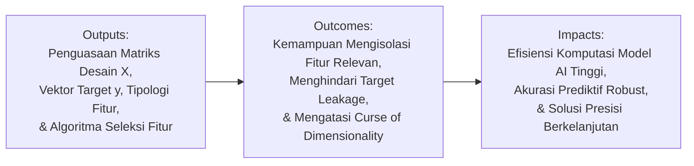
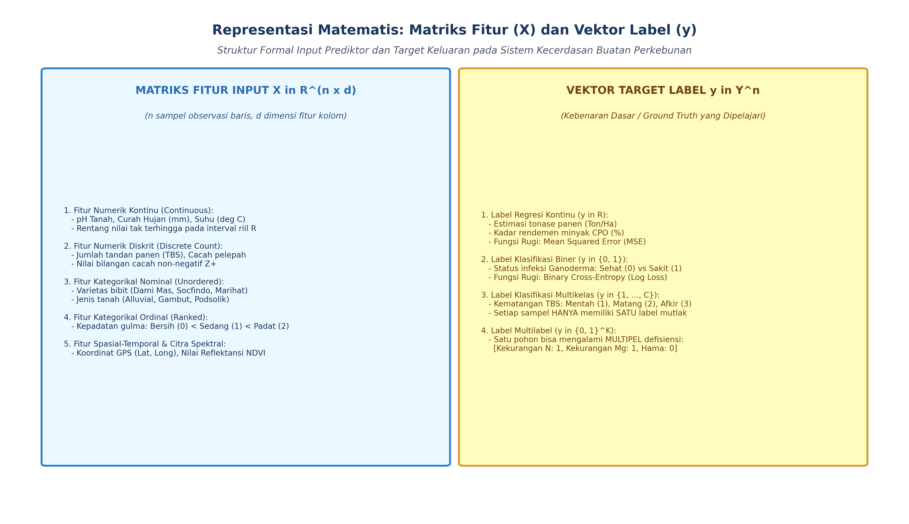
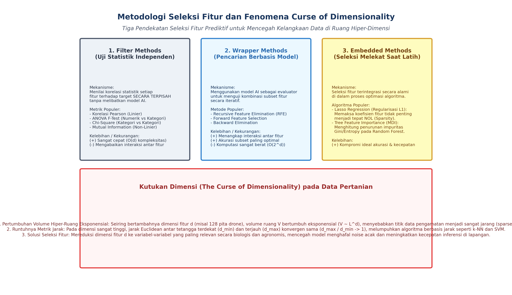

# AI Modul 5.4: Features dan Labels dalam Machine Learning

---

## 1. Identitas & Kerangka Capaian Pembelajaran (Sub-CPMK)

* **Kode Modul**        : AI Modul 5.4
* **Mata Kuliah**       : Kecerdasan Buatan dan Sains Data Pertanian Presisi
* **Alokasi Waktu**     : 2 x 50 Menit (Kajian Teori & Diskusi) + 2 x 50 Menit (Eksplorasi Praktikum Mandiri)
* **Beban SKS**         : 3 SKS
* **Prasyarat**         : AI Modul 5.3 (Dataset Training dan Testing)
* **Level Kognitif**    : C2 (Memahami), C3 (Menerapkan), C4 (Menganalisis)



### 1.1 Capaian Pembelajaran Khusus (Sub-CPMK)
Setelah menyelesaikan modul ini, mahasiswa dan pembelajar diharapkan mampu:
1. **Mengidentifikasi (C2)** anatomi ruang fitur ($\mathcal{X} \subset \mathbb{R}^D$) dan vektor label target ($\mathbf{y}$) pada dataset agro-klimatologi.
2. **Menganalisis (C4)** fenomena kutukan dimensionalitas (*Curse of Dimensionality*) dan dampaknya terhadap kepadatan ruang sampel serta risiko overfitting.
3. **Menerapkan (C3)** teknik rekayasa fitur (*Feature Engineering*) berbasis domain pertanian: indeks spektral kanopi, fitur rasio hara NPK, dan agregasi statistik temporal.
4. **Mengevaluasi (C4)** metode seleksi fitur filter (informasi timbal balik, korelasi) dan wrapper untuk mengeliminasi fitur redundan.

### 1.2 Kerangka Hasil Pembelajaran (Outputs, Outcomes, & Impacts)
* **Outputs (Keluaran Berwujud Langsung)**:
  * Memformulasikan ruang sampel ke dalam bentuk matematis matriks desain fitur $X \in \mathbb{R}^{n \times d}$ dan vektor label target $y \in \mathcal{Y}^n$.
  * Mengidentifikasi dan membedakan tipologi fitur (numerik kontinu, numerik diskrit, kategorikal nominal, kategorikal ordinal) serta tipologi target (biner, multi-kelas, multi-label, regresi kontinu).
  * Menganalisis dampak *curse of dimensionality* terhadap kerapatan spasial data dan metrik jarak Euclidean.
  * Menerapkan tiga paradigma seleksi fitur: *filter methods* (korelasi, ANOVA, mutual information), *wrapper methods* (RFE), dan *embedded methods* (regresi LASSO, *tree importance*).
* **Outcomes (Hasil Capaian & Perubahan Kompetensi)**:
  * Terampil merancang arsitektur data masukan yang bersih tanpa mengalami *target leakage* (*kebocoran target*) dan bebas dari multikolinearitas ekstrem.
  * Mampu memilih dan mengeliminasi variabel prediktor yang tidak informatif atau redundan sehingga meminimalkan variansi estimasi model.
  * Mampu mentransformasikan variabel dunia nyata (seperti data agro-klimat dan biosensor) ke dalam representasi vektor terstandarisasi yang siap diproses oleh algoritma pembelajaran mesin.
* **Impacts (Dampak Jangka Panjang & Nilai Guna Luas)**:

---

## 2. Landasan Teoretis: Representasi Matematis Fitur dan Label

Dalam pembelajaran terawasi (*supervised learning*), himpunan data tersusun atas pasangan terurut observasi:

$$\mathcal{D} = \{(\mathbf{x}_i, y_i)\}_{i=1}^n$$

di mana:
- $\mathbf{x}_i \in \mathcal{X} \subseteq \mathbb{R}^d$ merepresentasikan vektor baris fitur untuk instansi ke-$i$.
- $y_i \in \mathcal{Y}$ merepresentasikan label atau nilai target teramati (*ground truth*) untuk instansi ke-$i$.
- $n$ menyatakan jumlah sampel atau observasi.
- $d$ menyatakan dimensi ruang fitur (banyaknya variabel prediktor).



### 2.1 Matriks Desain Fitur ($X$)
Secara kolektif, seluruh vektor fitur disusun ke dalam sebuah matriks persegi panjang dua dimensi yang disebut **matriks desain** (*design matrix*):

$$X = \begin{bmatrix} x_{11} & x_{12} & \cdots & x_{1d} \\ x_{21} & x_{22} & \cdots & x_{2d} \\ \vdots & \vdots & \ddots & \vdots \\ x_{n1} & x_{n2} & \cdots & x_{nd} \end{bmatrix} \in \mathbb{R}^{n \times d}$$

- **Keterangan Komponen Simbol:** $X$ adalah matriks desain berukuran $n \times d$, $n$ melambangkan jumlah observasi/sampel (baris), $d$ melambangkan dimensi ruang fitur (kolom), dan $x_{ij}$ menyatakan nilai variabel fitur ke-$j$ pada observasi ke-$i$. Simbol $\mathbb{R}^{n \times d}$ menyatakan bahwa matriks tersebut tersusun atas bilangan riil berukuran $n$ kali $d$.
- **Cara Membaca Rumus:** *"Matriks desain X tersusun dari baris satu hingga n dan kolom satu hingga d, merupakan anggota ruang bilangan riil berdimensi n kali d."*

Setiap baris $X_{i,:} = \mathbf{x}_i^T$ melambangkan satu entitas observasi utuh (misalnya satu petak kebun kelapa sawit atau satu pohon), sedangkan setiap kolom $X_{:,j}$ melambangkan distribusi satu variabel prediktor tertentu (misalnya kadar kelembapan tanah, curah hujan harian, atau indeks vegetasi NDVI).

### 2.2 Vektor Label Target ($y$)
Label target menyatakan kuantitas atau kelas yang ingin diestimasi oleh fungsi hipotesis $h_\theta(\mathbf{x}) \approx y$:
- **Regresi Kontinu**: $\mathcal{Y} \subseteq \mathbb{R}$. Vektor target $y \in \mathbb{R}^n$ memuat nilai riil, misalnya estimasi tonase hasil panen Tandan Buah Segar (TBS) per hektar.
- **Klasifikasi Biner**: $\mathcal{Y} \in \{0, 1\}$ atau $\mathcal{Y} \in \{-1, +1\}$. Misalnya status defisiensi hara nitrogen (0: Cukup, 1: Defisit).
- **Klasifikasi Multi-kelas**: $\mathcal{Y} \in \{0, 1, 2, \dots, C-1\}$ dengan syarat satu sampel hanya memiliki tepat satu kelas eksklusif.
- **Klasifikasi Multi-label**: Target berupa matriks biner $Y \in \{0, 1\}^{n \times C}$, di mana satu sampel dapat memiliki lebih dari satu kelas secara simultan (misalnya sehelai daun terinfeksi bercak daun *dan* karat daun sekaligus).

---

## 3. Tipologi dan Karakteristik Fitur

Variabel prediktor di dunia nyata memiliki ragam representasi skala pengukuran yang menuntut penanganan matematis berbeda:

| Jenis Fitur | Skala Pengukuran | Karakteristik Operasional | Contoh Kasus Pertanian | Metode Transformasi |
| :--- | :--- | :--- | :--- | :--- |
| **Numerik Kontinu** | Rasio / Interval | Nilai riil kontinu pada interval $(-\infty, \infty)$ atau rentang tertentu | Kadar air tanah (% vol), Suhu kanopi ($^\circ\text{C}$), Indeks NDVI | *StandardScaler*, *MinMaxScaler*, *RobustScaler* |
| **Numerik Diskrit** | Cacah (Count) | Nilai bilangan bulat non-negatif $\mathbb{N}_0$ | Frekuensi serangan hama per pohon, Jumlah tandan buah | *Log-transform*, *Square-root transform* |
| **Kategorikal Ordinal** | Ordinal | Nilai diskrit dengan urutan hierarki yang tegas | Tingkat kematangan buah (Mentah < Mengkal < Masak < Lewat Masak) | *Ordinal Encoding* terurut secara terstruktur |
| **Kategorikal Nominal** | Nominal | Nilai diskrit tanpa relasi perurutan matematis | Varietas bibit (Dumpy, Yangambi, Avros), Jenis tanah | *One-Hot Encoding*, *Target Encoding* |
| **Struktural / Sekuensial** | Time-Series / Sinyal | Runtun waktu berulang yang terikat urutan kronologis | Fluktuasi kelembapan sensor IoT per 15 menit | Ekstraksi fitur statistik (*mean*, *std*, Fourier *transform*) |

---

## 4. Fenomena Kutukan Dimensi (*Curse of Dimensionality*)

Menambah jumlah fitur $d$ secara terus-menerus tanpa penambahan eksponensial jumlah data $n$ akan memicu fenomena penurunan kinerja yang dikenal sebagai *Curse of Dimensionality* (Bellman, 1961).



### 4.1 Kelangkaan Ruang Spasial (*Sparsity*)
Misalkan setiap dimensi fitur dinormalisasi ke dalam interval satuan $[0, 1]$. Jika kita ingin mengambil fraksi volume $v \in (0, 1)$ dari hiperkubus tersebut menggunakan sub-hiperkubus dengan panjang sisi $s$, maka relasi matematisnya adalah:

$$v = s^d \implies s = v^{1/d}$$

- **Keterangan Komponen Simbol:** $v$ adalah fraksi volume hiperkubus yang ingin diisolasi ($v \in (0, 1)$), $s$ adalah panjang sisi sub-hiperkubus pada tiap dimensi, dan $d$ adalah dimensi ruang fitur.
- **Cara Membaca Rumus:** *"Fraksi volume v sama dengan s pangkat d, yang berimplikasi panjang sisi s sama dengan v pangkat satu per d."*

Apabila kita ingin mengisolasi hanya $10\%$ ($v = 0.1$) dari volume ruang:
- Pada dimensi $d = 1$: $s = 0.10$ ($10\%$ dari rentang sumbu).
- Pada dimensi $d = 10$: $s = (0.1)^{1/10} \approx 0.794$ ($79.4\%$ dari rentang setiap sumbu).
- Pada dimensi $d = 100$: $s = (0.1)^{1/100} \approx 0.977$ ($97.7\%$ dari rentang setiap sumbu).

Artinya, pada dimensi tinggi, untuk menangkap proporsi data yang kecil sekalipun, algoritma terpaksa melintasi hampir seluruh bentang setiap dimensi. Ruang menjadi luar biasa kosong (*sparse*), dan sampel observasi saling terisolasi pada sudut-sudut hiperkubus.

### 4.2 Konsentrasi Metrik Jarak (*Distance Concentration*)
Pada dimensi tinggi ($d \to \infty$), selisih antara jarak Euclidean sampel terdekat ($\min \|\mathbf{x}_i - \mathbf{x}_j\|$) dan sampel terjauh ($\max \|\mathbf{x}_i - \mathbf{x}_j\|$) dari sembarang titik referensi mendekati nol secara relatif:

$$\lim_{d \to \infty} \frac{\max \|\mathbf{x}_i - \mathbf{x}_j\|_2 - \min \|\mathbf{x}_i - \mathbf{x}_j\|_2}{\min \|\mathbf{x}_i - \mathbf{x}_j\|_2} = 0$$

- **Keterangan Komponen Simbol:** $\lim_{d \to \infty}$ melambangkan limit matematika saat dimensi $d$ menuju tak hingga, $\|\mathbf{x}_i - \mathbf{x}_j\|_2$ melambangkan jarak Euclidean norma-$\ell_2$ antara sampel $i$ dan $j$, serta $\max$ dan $\min$ adalah jarak terjauh dan terdekat.
- **Cara Membaca Rumus:** *"Limit ketika d menuju tak hingga dari rasio antara selisih jarak maksimum dan minimum terhadap jarak minimum adalah sama dengan nol."*

Fenomena ini merusak efektivitas algoritma berbasis kedekatan spasial seperti *k-Nearest Neighbors* ($k$-NN), *Support Vector Machines* (SVM) berbasis kernel RBF, dan pengelompokan *K-Means*, karena semua tetangga tampak memiliki jarak yang relatif seragam.

---

## 5. Metodologi Seleksi Fitur (*Feature Selection*)

Seleksi fitur bertujuan mereduksi dimensi $d$ dengan memilih subhimpunan fitur optimal $\mathcal{X}^* \subset \mathcal{X}$ tanpa memodifikasi representasi fisik asli variabel. Tiga metodologi utama meliputi:

### 5.1 Filter Methods
Metode filter mengevaluasi relevansi statistik masing-masing variabel prediktor $X_j$ terhadap target $y$ secara independen dari model pembelajar (*model-agnostic*).

1. **Koefisien Korelasi Pearson ($r$)**: Mengukur keterikatan linier untuk fitur kontinu dan target kontinu:
   $$r_{X_j, y} = \frac{\sum_{i=1}^n (x_{ij} - \bar{x}_j)(y_i - \bar{y})}{\sqrt{\sum_{i=1}^n (x_{ij} - \bar{x}_j)^2} \sqrt{\sum_{i=1}^n (y_i - \bar{y})^2}}$$
   - **Keterangan Simbol:** $x_{ij}$ adalah nilai fitur ke-$j$ observasi ke-$i$, $\bar{x}_j$ adalah rata-rata fitur ke-$j$, $y_i$ adalah target observasi ke-$i$, dan $\bar{y}$ adalah rata-rata target.
   - **Cara Membaca Rumus:** *"Koefisien korelasi r antara fitur X-j dan target y sama dengan kovariansi sampel dibagi akar jumlahan kuadrat deviasi x-j dikalikan akar jumlahan kuadrat deviasi y."*

2. **Uji F ANOVA (*Analysis of Variance*)**: Digunakan ketika variabel prediktor bertipe kontinu dan label target berupa kelas diskrit. Mengukur rasio variansi antar-grup terhadap variansi intra-grup:
   $$F = \frac{\text{MS}_{\text{between}}}{\text{MS}_{\text{within}}}$$
   - **Keterangan Simbol:** $\text{MS}_{\text{between}}$ adalah kuadrat rerata deviasi antar-kelompok kelas (*Mean Square Between*), dan $\text{MS}_{\text{within}}$ adalah kuadrat rerata deviasi di dalam kelompok internal (*Mean Square Within*).
   - **Cara Membaca Rumus:** *"Nilai F sama dengan Mean Square Between dibagi Mean Square Within."*

3. **Informasi Bersama (*Mutual Information* / $I(X; Y)$)**: Mengukur ketergantungan non-linier antara dua variabel acak berdasarkan teori entropi Shannon:
   $$I(X_j; y) = \iint p(x_j, y) \log \left( \frac{p(x_j, y)}{p(x_j)p(y)} \right) dx_j dy$$
   - **Keterangan Simbol:** $p(x_j, y)$ adalah fungsi kerapatan probabilitas bersama (*joint density*), $p(x_j)$ dan $p(y)$ adalah probabilitas marginal, dan $\iint$ adalah integral ganda melintasi seluruh domain.
   - **Cara Membaca Rumus:** *"Informasi bersama I antara X-j dan y sama dengan integral ganda dari p dari x-j dan y, dikalikan logaritma dari p bersama dibagi perkalian p marjinal x-j dan p marjinal y, diintegralkan terhadap d x-j dan d y."*
   Jika $I(X_j; y) = 0$, maka $X_j$ dan $y$ bersifat independen secara statistik murni.

### 5.2 Wrapper Methods
Metode wrapper memperlakukan proses pemilihan fitur sebagai masalah pencarian ruang keadaan (*state-space search*), di mana model machine learning digunakan sebagai fungsi evaluasi skor.

1. **Forward Selection**: Dimulai dari himpunan fitur kosong $\emptyset$, lalu pada setiap iterasi ditambahkan satu fitur yang paling signifikan meningkatkan metrik validasi model hingga tidak tercapai kenaikan performa yang bermakna.
2. **Backward Elimination**: Dimulai dari seluruh himpunan fitur komplit $\mathcal{X}$, kemudian fitur dengan kontribusi terendah dieliminasi satu per satu secara berulang.
3. **Recursive Feature Elimination (RFE)**: Model diestimasi pada seluruh fitur, bobot koefisien $|\theta_j|$ atau *importance score* dihitung, lalu fitur dengan bobot terkecil dipangkas. Prosedur ini diulang secara rekursif hingga jumlah fitur target yang diinginkan tercapai.

### 5.3 Embedded Methods
Metode terbenam menyatukan proses seleksi fitur secara simultan di dalam proses optimasi fungsi objektif model.

1. **Regularisasi L1 (LASSO - Least Absolute Shrinkage and Selection Operator)**: Menambahkan penalti norma-$\ell_1$ pada fungsi *loss*:
   $$\min_{\mathbf{w}} \frac{1}{2n} \sum_{i=1}^n \left( y_i - \mathbf{w}^T \mathbf{x}_i \right)^2 + \alpha \sum_{j=1}^d |w_j|$$
   - **Keterangan Simbol:** $\mathbf{w}$ adalah vektor koefisien bobot, $\alpha \ge 0$ adalah koefisien penalti regularisasi, dan $|w_j|$ adalah nilai absolut bobot ke-$j$ (norma-$\ell_1$).
   - **Cara Membaca Rumus:** *"Minimalkan terhadap w dari: satu per dua n dikalikan jumlah kuadrat residu y-i minus w-transpos x-i, ditambah alfa dikalikan jumlah nilai mutlak w-j untuk j dari satu hingga d."*
   Sifat geometris dari fungsi penalti tajam $\ell_1$ memaksa sebagian koefisien bobot $w_j$ menjadi bernilai nol secara eksak, sehingga secara otomatis mengeliminasi fitur tersebut dari model.
2. **Tree-Based Feature Importance (MDI & Permutation)**: Pohon keputusan (*Decision Trees*, *Random Forest*) menghitung reduksi ketidakmurnian (*Mean Decrease in Impurity* / MDI) yang dihasilkan oleh setiap pemisahan simpul menggunakan fitur terkait.

---

## 6. Bahaya Kebocoran Target (*Target Leakage*)

*Target leakage* terjadi ketika data masukan pada saat pelatihan model menyertakan informasi yang sebenarnya tidak akan tersedia secara realistis pada waktu operasional inferensi (*test-time deployment*).

### 6.1 Mekanisme Kebocoran Target
Contoh dalam operasional perkebunan:
- **Kasus**: Membangun model prediksi kematangan buah kelapa sawit berdasarkan citra drone.
- **Kesalahan Fatal**: Menyertakan variabel *"volume minyak yang diekstrak di pabrik"* sebagai fitur masukan model. Variabel ini memiliki korelasi sempurna dengan kematangan, namun data tersebut baru ada berhari-hari setelah buah dipanen dan diproses di pabrik kelapa sawit. Model yang dilatih akan memiliki akurasi $100\%$ semu pada data uji, namun gagal total saat diterapkan di lapangan.

### 6.2 Protokol Pencegahan
1. **Pemisahan Temporal**: Pastikan semua fitur masukan berasal dari jendela waktu $t < t_0$, sementara target $y$ merepresentasikan kejadian pada jendela waktu $t \ge t_0$.
2. **Pemisahan Pipeline**: Seluruh proses transformasi data (imputasi, standarisasi, seleksi fitur) harus dipelajari murni dari himpunan data latih (*training set*) dan hanya diuji-terapkan pada himpunan data uji (*test set*).

---

## 7. Implementasi Komputasi: Pipeline Seleksi Fitur dan Evaluasi

Berikut adalah script Python modular untuk menguji dampak seleksi fitur terhadap akurasi dan kecepatan komputasi menggunakan data sintetis pertanian presisi.

```python
"""
Script Implementasi Seleksi Fitur dan Pencegahan Kebocoran Data
Menggunakan Scikit-Learn Pipeline
"""
import numpy as np
import pandas as pd
from sklearn.datasets import make_classification
from sklearn.model_selection import train_test_split
from sklearn.feature_selection import SelectKBest, f_classif, RFE
from sklearn.linear_model import LogisticRegression, Lasso
from sklearn.ensemble import RandomForestClassifier
from sklearn.metrics import accuracy_score, classification_report
from sklearn.pipeline import Pipeline
from sklearn.preprocessing import StandardScaler

# 1. Sintesis Data: 1000 Sampel, 40 Fitur (10 Informatif, 10 Redundan, 20 Noise Acak)
X_raw, y_raw = make_classification(
    n_samples=1000,
    n_features=40,
    n_informative=10,
    n_redundant=10,
    n_repeated=0,
    n_classes=2,
    random_state=42
)

# 2. Pemisahan Dataset (Mencegah Data Leakage)
X_train, X_test, y_train, y_test = train_test_split(
    X_raw, y_raw, test_size=0.25, random_state=42, stratify=y_raw
)

# 3. Pipeline A: Model Baseline dengan Seluruh 40 Fitur
pipe_baseline = Pipeline([
    ('scaler', StandardScaler()),
    ('clf', RandomForestClassifier(random_state=42, n_estimators=100))
])
pipe_baseline.fit(X_train, y_train)
y_pred_baseline = pipe_baseline.predict(X_test)
acc_baseline = accuracy_score(y_test, y_pred_baseline)

# 4. Pipeline B: Filter Method (SelectKBest ANOVA F-test, K=10)
pipe_filter = Pipeline([
    ('scaler', StandardScaler()),
    ('selector', SelectKBest(score_func=f_classif, k=10)),
    ('clf', RandomForestClassifier(random_state=42, n_estimators=100))
])
pipe_filter.fit(X_train, y_train)
y_pred_filter = pipe_filter.predict(X_test)
acc_filter = accuracy_score(y_test, y_pred_filter)

# 5. Pipeline C: Embedded Method (L1 Lasso Feature Selection)
# Menentukan fitur aktif melalui koefisien bukan nol pada Lasso
scaler = StandardScaler()
X_train_scaled = scaler.fit_transform(X_train)
X_test_scaled = scaler.transform(X_test)

lasso = Lasso(alpha=0.03, random_state=42)
lasso.fit(X_train_scaled, y_train)
active_features = np.where(np.abs(lasso.coef_) > 1e-4)[0]

clf_lasso_sel = RandomForestClassifier(random_state=42, n_estimators=100)
clf_lasso_sel.fit(X_train_scaled[:, active_features], y_train)
y_pred_lasso = clf_lasso_sel.predict(X_test_scaled[:, active_features])
acc_lasso = accuracy_score(y_test, y_pred_lasso)

print(f"Hasil Evaluasi:")
print(f"Baseline (40 Fitur)   : Akurasi = {acc_baseline:.4f}")
print(f"Filter K=10 (ANOVA)   : Akurasi = {acc_filter:.4f}")
print(f"L1 LASSO ({len(active_features)} Fitur Aktif): Akurasi = {acc_lasso:.4f}")
```

---

## 8. Latihan Soal Evaluasi Tingkat Tinggi (HOTS)

### 8.1 Evaluasi Kritis: Bahaya Target Leakage pada Model Agro-IoT
Sebuah tim riset mengembangkan model machine learning untuk memprediksi risiko penyakit busuk pangkal batang (*Ganoderma boninense*) pada tanaman kelapa sawit. Himpunan data memuat 15 fitur sensor tanah, indeks vegetasi satelit, dan variabel "status penyemprotan fungisida kuratif". Model mencapai metrik *Area Under ROC Curve* (AUC) sebesar 0.99 pada set validasi. 
1. Mengapa keberadaan variabel "status penyemprotan fungisida kuratif" memicu *target leakage* yang fatal?
2. Bagaimana formulasi matematika yang membuktikan bahwa keterikatan kondisional fitur tersebut merusak validitas estimasi probabilitas posterior $P(Y=1 \mid X)$ di lapangan?

### 8.2 Desain Eksperimental: Penanganan Multikolinearitas dan Dimensi Tinggi
Dalam spektrometri reflektansi daun sawit, instrumen sensor menghasilkan 1.200 panjang gelombang spektral sempit (350 nm – 2.500 nm) untuk memprediksi konsentrasi hara nitrogen daun ($n = 150$ sampel pohon). 
1. Jelaskan secara matematis mengapa penggunaan regresi linear metode kuadrat terkecil biasa (*Ordinary Least Squares* / OLS) gagal total secara numerik ($\mathbf{X}^T \mathbf{X}$ bersifat singular atau *ill-conditioned*).
2. Rancanglah arsitektur komparasi antara seleksi fitur berbasis *Regularisasi Elastic Net* dan reduksi dimensi berbasis *Principal Component Regression* (PCR) untuk memitigasi singularitas tersebut!

### 8.3 Komparasi Algoritmik: Filter vs Wrapper vs Embedded
Diberikan himpunan data genomik varietas kelapa sawit dengan $d = 50.000$ penanda SNP (*Single Nucleotide Polymorphism*) dan $n = 500$ pohon uji.
1. Analisis mengapa penerapan *Wrapper Method* berbasis *Recursive Feature Elimination* (RFE) dengan model *Support Vector Machine* berpeluang besar mengalami kegagalan komputasi (*computational intractability*) pada lingkungan kerja standar.
2. Rekomendasikan pipeline seleksi fitur hibrida dua tahap (*two-stage hybrid selection*) yang efisien secara komputasi namun tetap mempertahankan interaksi fitur non-linier!

---

## 9. Daftar Pustaka dan Referensi Akademik

1. Bellman, R. E. (1961). *Adaptive Control Processes: A Guided Tour*. Princeton University Press.
2. Guyon, I., & Elisseeff, A. (2003). An introduction to variable and feature selection. *Journal of Machine Learning Research*, 3(Mar), 1157-1182.
3. Hastie, T., Tibshirani, R., & Friedman, J. (2009). *The Elements of Statistical Learning: Data Mining, Inference, and Prediction* (2nd ed.). Springer New York.
4. Kohavi, R., & John, G. H. (1997). Wrappers for feature subset selection. *Artificial Intelligence*, 97(1-2), 273-324.
5. Tibshirani, R. (1996). Regression shrinkage and selection via the lasso. *Journal of the Royal Statistical Society: Series B (Methodological)*, 58(1), 267-288.
