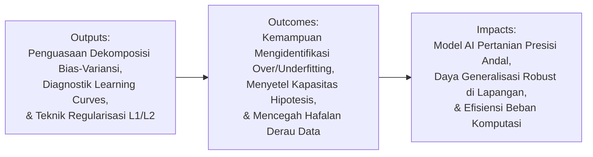
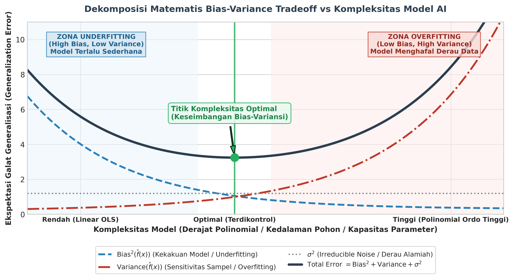
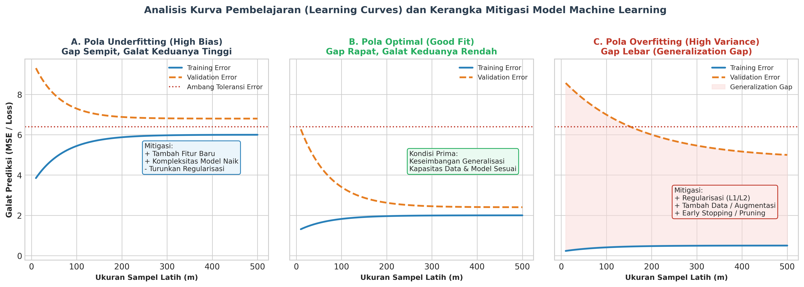

# AI Modul 5.5: Overfitting dan Underfitting dalam Machine Learning

---

## 1. Identitas & Kerangka Capaian Pembelajaran (Sub-CPMK)

* **Kode Modul**        : AI Modul 5.5
* **Mata Kuliah**       : Kecerdasan Buatan dan Sains Data Pertanian Presisi
* **Alokasi Waktu**     : 2 x 50 Menit (Kajian Teori & Diskusi) + 2 x 50 Menit (Eksplorasi Praktikum Mandiri)
* **Beban SKS**         : 3 SKS
* **Prasyarat**         : AI Modul 5.4 (Features dan Labels)
* **Level Kognitif**    : C2 (Memahami), C3 (Menerapkan), C4 (Menganalisis)



### 1.1 Capaian Pembelajaran Khusus (Sub-CPMK)
Setelah menyelesaikan modul ini, mahasiswa dan pembelajar diharapkan mampu:
1. **Mendekonstruksi (C4)** dekomposisi bias-varians (*Bias-Variance Trade-off*) dan membuktikan pengaruh kapasitas model terhadap galat generalisasi.
2. **Mendiagnosis (C4)** gejala *Underfitting* (bias tinggi) dan *Overfitting* (varians tinggi) melalui analisis visual kurva pembelajaran (*Learning Curves*).
3. **Menerapkan (C3)** teknik mitigasi overfitting: penambahan data (*Data Augmentation*), penyederhanaan model, dan metode penghentian dini (*Early Stopping*).
4. **Mengevaluasi (C4)** penerapan teknik regularisasi parameter ($L_1$ Lasso dan $L_2$ Ridge) untuk membatasi kompleksitas bobot model.

### 1.2 Kerangka Hasil Pembelajaran (Outputs, Outcomes, & Impacts)
* **Outputs (Keluaran Berwujud Langsung)**:
  * Menurunkan secara matematis dekomposisi galat generalisasi menjadi komponen bias kuadrat, variansi, dan derau tak tereduksi (*irreducible error*).
  * Mengidentifikasi karakteristik empiris dari kondisi *underfitting* (bias tinggi) dan *overfitting* (variansi tinggi) pada data pelatihan versus data validasi.
  * Mengonstruksi dan menafsirkan grafik kurva pembelajaran (*learning curves*) terhadap variasi ukuran sampel data dan kapasitas model.
  * Menerapkan teknik mitigasi matematis meliputi penalti regularisasi $\ell_1$ (Lasso), $\ell_2$ (Ridge), *Elastic Net*, serta pemangkasan pohon (*cost-complexity pruning*).
* **Outcomes (Hasil Capaian & Perubahan Kompetensi)**:
  * Terampil menyeimbangkan kapasitas ruang hipotesis model machine learning sehingga terhindar dari fenomena penghafalan derau acak (*noise memorization*).
  * Mampu merumuskan keputusan rekayasa yang tepat saat model mengalami performa buruk: apakah menambah data, mereduksi fitur, menambah kompleksitas algoritma, atau memperketat penalti regularisasi.
  * Mampu membangun sistem kecerdasan buatan agro-biosains yang memiliki konsistensi akurasi tinggi antara fase validasi laboratorium dan fase operasional lapangan.
* **Impacts (Dampak Jangka Panjang & Nilai Guna Luas)**:

---

## 2. Landasan Teoretis: Generalisasi dan Dekomposisi Bias-Variansi

Tujuan utama dari pembelajaran mesin bukanlah meminimalkan galat pada data yang telah diobservasi (*training error*), melainkan memaksimalkan daya generalisasi pada data baru yang belum pernah dilihat sebelumnya (*unseen test data*).



### 2.1 Formulasi Matematis Galat Generalisasi
Misalkan hubungan antara variabel prediktor $\mathbf{x} \in \mathbb{R}^d$ dan variabel target riil $y \in \mathbb{R}$ diatur oleh fungsi sejati $f(\mathbf{x})$ yang terkontaminasi oleh derau acak aditif $\epsilon$:

$$y = f(\mathbf{x}) + \epsilon, \quad \mathbb{E}[\epsilon] = 0, \quad \text{Var}(\epsilon) = \sigma^2$$

Diberikan himpunan data latih $\mathcal{D} = \{(\mathbf{x}_i, y_i)\}_{i=1}^n$, algoritma pembelajaran menghasilkan fungsi estimasi $\hat{f}(\mathbf{x}; \mathcal{D})$. Galat kuadrat rerata ekspektasi (*Expected Mean Squared Error*) pada titik uji baru $\mathbf{x}$ terhadap seluruh kemungkinan realisasi himpunan latih $\mathcal{D}$ dapat didekomposisi secara analitis:

$$\mathbb{E}_{\mathcal{D}, \epsilon} \left[ \left( y - \hat{f}(\mathbf{x}) \right)^2 \right] = \text{Bias}^2(\hat{f}(\mathbf{x})) + \text{Var}(\hat{f}(\mathbf{x})) + \sigma^2$$

**Keterangan Komponen Simbol:**
- $\mathbb{E}_{\mathcal{D}, \epsilon}[\dots]$ : Operator nilai ekspektasi (rata-rata statistik teoretis) terhadap variasi himpunan latih $\mathcal{D}$ dan derau acak lingkungan $\epsilon$.
- $y$ : Nilai target observasi sejati yang memuat derau aditif ($y = f(\mathbf{x}) + \epsilon$).
- $\hat{f}(\mathbf{x})$ : Prediksi yang dihasilkan oleh model machine learning untuk input $\mathbf{x}$.
- $\text{Bias}^2(\hat{f}(\mathbf{x}))$ : Komponen bias kuadrat, mengukur kekakuan model atau seberapa jauh rata-rata prediksi model menyimpang dari fungsi sejati alamiah ($f(\mathbf{x})$).
- $\text{Var}(\hat{f}(\mathbf{x}))$ : Komponen variansi, mengukur sensitivitas model atau seberapa besar prediksi berfluktuasi jika dilatih dengan sampel latih yang berbeda-beda.
- $\sigma^2$ : Variansi derau acak tak tereduksi (*irreducible noise*) yang berasal dari ketidakpastian alamiah atau instrumen pengukuran.

**Cara Membaca Rumus:**
> *"Ekspektasi terhadap dataset D dan derau epsilon dari kuadrat selisih antara nilai target y dan estimasi f-topi dari x sama dengan bias kuadrat dari f-topi dari x, ditambah variansi dari f-topi dari x, ditambah variansi derau sigma kuadrat."*

di mana:
1. **Bias Kuadrat ($\text{Bias}^2$)**: Mengukur seberapa jauh ekspektasi prediksi model terhadap fungsi target sejati:
   $$\text{Bias}(\hat{f}(\mathbf{x})) = \mathbb{E}_{\mathcal{D}}[\hat{f}(\mathbf{x})] - f(\mathbf{x})$$
   - *Cara Membaca Rumus:* *"Bias dari f-topi dari x sama dengan ekspektasi terhadap dataset D dari f-topi dari x, dikurangi fungsi sejati f dari x."*
2. **Variansi ($\text{Var}$)**: Mengukur sensitivitas atau fluktuasi prediksi model terhadap variasi himpunan data latih yang digunakan:
   $$\text{Var}(\hat{f}(\mathbf{x})) = \mathbb{E}_{\mathcal{D}} \left[ \left( \hat{f}(\mathbf{x}) - \mathbb{E}_{\mathcal{D}}[\hat{f}(\mathbf{x})] \right)^2 \right]$$
   - *Cara Membaca Rumus:* *"Variansi dari f-topi dari x sama dengan ekspektasi terhadap dataset D dari kuadrat selisih antara f-topi dari x dan rata-rata ekspektasi f-topi dari x."*
3. **Derau Tak Tereduksi ($\sigma^2$)**: Variansi intrinsik dari derau sistemik atau kesalahan instrumen pengukuran fisik yang tidak dapat dieliminasi oleh model apa pun.

---

## 3. Komparasi Karakteristik: Underfitting vs Overfitting

Dekomposisi bias-variansi melahirkan dua kutub permasalahan utama dalam pemodelan prediktif:

| Parameter Pembanding | Underfitting (*Bias Tinggi*) | Model Optimal (*Good Fit*) | Overfitting (*Variansi Tinggi*) |
| :--- | :--- | :--- | :--- |
| **Kapasitas Model** | Terlalu rendah (terlalu kaku / *rigid*) | Seimbang dengan kompleksitas data | Terlalu tinggi (terlalu fleksibel) |
| **Galat Data Latih ($E_{\text{train}}$)** | Sangat tinggi | Rendah dan stabil | Mendekati nol (hampir sempurna) |
| **Galat Data Uji ($E_{\text{val}}$)** | Sangat tinggi (sebanding $E_{\text{train}}$) | Rendah (konvergen dengan $E_{\text{train}}$) | Sangat tinggi ($E_{\text{val}} \gg E_{\text{train}}$) |
| **Selisih Galat (*Generalization Gap*)** | Sangat sempit (namun keduanya buruk) | Sempit (keduanya berkinerja baik) | Sangat lebar (*gap* mencolok) |
| **Perilaku Pembelajaran** | Gagal menangkap pola dasar data | Menangkap pola esensial non-linier | Menghafal *noise* acak data latih |
| **Analogi Kurva Polinomial** | Garis lurus ($M=1$) pada kurva kuadratik | Kurva kuadratik teratur ($M=2$) | Polinomial ordo tinggi ($M=15$) bergelombang liar |

---

## 4. Diagnostik Melalui Kurva Pembelajaran (*Learning Curves*)

Kurva pembelajaran menggambarkan lintasan galat pelatihan (*training loss*) dan galat validasi (*validation loss*) sebagai fungsi dari ukuran sampel pelatihan ($m$).



### 4.1 Pola Underfitting (High Bias)
- **Karakteristik**: Baik kurva pelatihan maupun kurva validasi mengalami konvergensi cepat pada nilai galat yang tinggi dan menetap pada tingkat yang tidak memuaskan (*high plateau*).
- **Indikator**: Menambahkan lebih banyak data pelatihan ($m \to \infty$) **tidak akan membantu**. Penambahan data hanya mempertegas ketidakmampuan model yang terlalu sederhana dalam memetakan data.

### 4.2 Pola Overfitting (High Variance)
- **Karakteristik**: Kurva galat pelatihan bernilai luar biasa rendah, sedangkan kurva galat validasi tetap tinggi, menghasilkan jurang pemisah yang lebar (*generalization gap*).
- **Indikator**: Penambahan volume data pelatihan secara signifikan ($m \gg$) **sangat efektif**, karena data yang melimpah mempersempit ruang osilasi model dan memaksa model mempelajari keteraturan umum.

---

## 5. Strategi Rekayasa Mitigasi Overfitting

Untuk menekan variansi tanpa menaikkan bias secara berlebihan, digunakan sejumlah metodologi rekayasa berikut:

### 5.1 Regularisasi Matematis
Regularisasi membatasi kebebasan parameter model dengan menyematkan suku penalti norma parameter pada fungsi objektif optimasi:

1. **Regularisasi $\ell_2$ (Ridge Regression)**:
   $$J_{\text{Ridge}}(\mathbf{w}) = \frac{1}{2n} \sum_{i=1}^n \left( y_i - \mathbf{w}^T \mathbf{x}_i \right)^2 + \frac{\lambda}{2} \|\mathbf{w}\|_2^2 = \text{MSE} + \frac{\lambda}{2} \sum_{j=1}^d w_j^2$$
   - **Keterangan Simbol:** $\lambda \ge 0$ adalah hiperparameter penalti Ridge, $\|\mathbf{w}\|_2^2 = \sum w_j^2$ adalah kuadrat norma-$\ell_2$ dari vektor bobot, dan $\text{MSE}$ adalah galat kuadrat rata-rata.
   - **Cara Membaca Rumus:** *"Fungsi biaya Ridge dari w sama dengan satu per dua n dikalikan jumlah kuadrat residu antara y-i dan w-transpos x-i, ditambah lambda per dua dikalikan jumlahan kuadrat koefisien w-j untuk j dari satu hingga d."*
   Penalti $\ell_2$ menyusutkan bobot parameter mendekati nol secara proporsional (*weight decay*), mencegah terjadinya bobot ekstrem akibat multikolinearitas.

2. **Regularisasi $\ell_1$ (Lasso Regression)**:
   $$J_{\text{Lasso}}(\mathbf{w}) = \frac{1}{2n} \sum_{i=1}^n \left( y_i - \mathbf{w}^T \mathbf{x}_i \right)^2 + \alpha \|\mathbf{w}\|_1 = \text{MSE} + \alpha \sum_{j=1}^d |w_j|$$
   - **Keterangan Simbol:** $\alpha \ge 0$ adalah intensitas penalti Lasso, dan $\|\mathbf{w}\|_1 = \sum |w_j|$ adalah norma-$\ell_1$ (jumlah nilai mutlak bobot).
   - **Cara Membaca Rumus:** *"Fungsi biaya Lasso dari w sama dengan satu per dua n dikalikan jumlah kuadrat residu, ditambah alfa dikalikan jumlahan nilai mutlak dari w-j."*
   Sifat geometris norma $\ell_1$ menghasilkan solusi sudut (*corner solution*), memaksa koefisien fitur yang tidak informatif menjadi nol secara eksak.

3. **Elastic Net**:
   Kombinasi konveks dari penalti $\ell_1$ dan $\ell_2$:
   $$J_{\text{Elastic}}(\mathbf{w}) = \text{MSE} + r \alpha \|\mathbf{w}\|_1 + \frac{1-r}{2} \alpha \|\mathbf{w}\|_2^2$$
   - **Keterangan Simbol:** $r \in [0, 1]$ adalah rasio pencampuran (*l1_ratio*). Jika $r=1$ menjadi Lasso murni; jika $r=0$ menjadi Ridge murni.
   - **Cara Membaca Rumus:** *"Fungsi biaya Elastic Net sama dengan MSE ditambah r dikali alfa dikali norma l-1 dari w, ditambah satu minus r per dua dikali alfa dikali kuadrat norma l-2 dari w."*

### 5.2 Pemangkasan Pohon Keputusan (*Decision Tree Pruning*)
Pohon keputusan tanpa batasan kedalaman (*unconstrained tree*) akan terus membelah simpul hingga setiap daun hanya memuat satu sampel observasi, menyebabkan *overfitting* ekstrem. Mitigasi dilakukan melalui:
- **Pre-pruning**: Membatasi parameter `max_depth`, `min_samples_split`, dan `min_samples_leaf`.
- **Post-pruning (Cost-Complexity Pruning)**: Meminimalkan fungsi biaya pohon:
  $$R_\alpha(T) = R(T) + \alpha |T|$$
  - **Keterangan Simbol:** $R(T)$ menyatakan total ketidakmurnian (*impurity*) seluruh daun terminal pada pohon $T$, $|T|$ menyatakan jumlah total daun terminal, dan $\alpha \ge 0$ adalah koefisien penalti kompleksitas pohon.
  - **Cara Membaca Rumus:** *"Biaya kompleksitas pohon R-alfa dari T sama dengan total ketidakmurnian R dari T ditambah alfa dikalikan kardinalitas ukuran pohon T."*

### 5.3 Penghentian Dini (*Early Stopping*)
Pada algoritma optimasi berbasis iterasi (seperti *Gradient Descent* atau *Neural Networks*), galat pelatihan menurun secara monotonik. Namun, galat validasi akan mencapai titik minimum lalu berbalik naik (*divergence*). *Early stopping* memutus proses pelatihan secara otomatis pada iterasi ketika galat validasi mencapai titik balik minimum.

---

## 6. Strategi Rekayasa Mitigasi Underfitting

Apabila model mengalami *underfitting* (bias tinggi), langkah mitigasi difokuskan pada peningkatan kapasitas representasi:
1. **Meningkatkan Derajat Hipotesis**: Menggunakan polinomial derajat lebih tinggi atau kernel non-linier (misal: beralih dari Linear SVM ke Kernel RBF).
2. **Rekayasa Fitur (*Feature Engineering*)**: Menambahkan variabel prediktor baru, fitur interaksi ($x_1 \times x_2$), atau transformasi domain (seperti rasio NDVI dan indeks vegetasi spektral).
3. **Mereduksi Penalti Regularisasi**: Menurunkan nilai koefisien hiperparameter penalti $\lambda$ atau $\alpha$ sehingga model memiliki keleluasaan lebih tinggi untuk menyesuaikan diri dengan bentuk sejati data.

---

## 7. Implementasi Komputasi: Deteksi dan Mitigasi Bias-Variansi

Berikut implementasi script Python untuk menguji dinamika polinomial pada estimasi agro-biosains dan menerapkan regularisasi Ridge untuk menanggulangi *overfitting*.

```python
"""
Script Demonstrasi Bias-Variance Tradeoff dan Mitigasi Regularisasi Ridge
Menggunakan Scikit-Learn PolynomialFeatures dan Ridge
"""
import numpy as np
import matplotlib.pyplot as plt
from sklearn.pipeline import Pipeline
from sklearn.preprocessing import PolynomialFeatures, StandardScaler
from sklearn.linear_model import LinearRegression, Ridge
from sklearn.metrics import mean_squared_error

# 1. Bangkitkan Data Sintetis Non-linier (Kurva Respon Dosis Pupuk Nitrogen)
np.random.seed(42)
n_samples = 35

def true_response_curve(x):
    return 15.0 + 2.8 * x - 0.18 * (x ** 2)

X = np.sort(np.random.uniform(1.0, 14.0, n_samples))
y = true_response_curve(X) + np.random.normal(0, 1.8, n_samples)

X_eval = np.linspace(0.5, 14.5, 200)
y_eval_true = true_response_curve(X_eval)

# 2. Definisikan Tiga Derajat Kompleksitas Model
derajat_list = [1, 2, 12] # Ordo 1: Underfit, Ordo 2: Optimal, Ordo 12: Overfit
model_labels = ['Underfitting (Derajat 1)', 'Optimal (Derajat 2)', 'Overfitting (Derajat 12)']

models = {}
predictions = {}

for d in derajat_list:
    pipe = Pipeline([
        ('poly', PolynomialFeatures(degree=d, include_bias=False)),
        ('scaler', StandardScaler()),
        ('reg', LinearRegression())
    ])
    pipe.fit(X[:, np.newaxis], y)
    models[d] = pipe
    predictions[d] = pipe.predict(X_eval[:, np.newaxis])
    
    # Hitung MSE Latih
    y_pred_train = pipe.predict(X[:, np.newaxis])
    mse_train = mean_squared_error(y, y_pred_train)
    print(f"Model Ordo {d:2d} -> MSE Latih: {mse_train:.4f}")

# 3. Mitigasi Overfitting pada Ordo 12 Menggunakan Regularisasi Ridge
pipe_ridge = Pipeline([
    ('poly', PolynomialFeatures(degree=12, include_bias=False)),
    ('scaler', StandardScaler()),
    ('reg', Ridge(alpha=10.0))
])
pipe_ridge.fit(X[:, np.newaxis], y)
pred_ridge = pipe_ridge.predict(X_eval[:, np.newaxis])
mse_train_ridge = mean_squared_error(y, pipe_ridge.predict(X[:, np.newaxis]))
print(f"Model Ordo 12 + Ridge (alpha=10.0) -> MSE Latih: {mse_train_ridge:.4f}")
```

---

## 8. Latihan Soal Evaluasi Tingkat Tinggi (HOTS)

### 8.1 Analisis Dekomposisi Matematis: Bukti Penurunan Bias-Variansi
Tunjukkan penurunan aljabar formal dari ekspektasi galat kuadrat $\mathbb{E}[(y - \hat{f}(x))^2]$ menjadi tiga komponen: $\text{Bias}^2(\hat{f}(x)) + \text{Var}(\hat{f}(x)) + \sigma^2$. Asumsikan bahwa target $y = f(x) + \epsilon$ dengan $\mathbb{E}[\epsilon] = 0$ dan $\text{Var}(\epsilon) = \sigma^2$, serta bahwa $\epsilon$ bersifat independen terhadap estimasi model $\hat{f}(x)$. Di bagian mana asumsi independensi derau diterapkan secara kritis?

### 8.2 Diagnostik Operasional: Interpretasi Kasus Sensor Spektroskopi
Sebuah model *Random Forest* dilatih untuk mendeteksi kadar klorofil daun sawit menggunakan 200 pita spektral. Pada data latih, model menghasilkan nilai metrik $R^2 = 0.995$ dengan RMSE $0.08$. Namun, ketika dievaluasi menggunakan validasi silang 5-lipat (*5-fold cross-validation*), nilai $R^2$ anjlok menjadi $0.540$ dengan RMSE $1.42$.
1. Berdasarkan profil performa tersebut, jelaskan jenis patologi yang dialami oleh model (apakah bias tinggi atau variansi tinggi).
2. Evaluasilah efektivitas dua strategi perbaikan berikut: (a) Menggandakan jumlah data latih dari blok kebun yang sama; (b) Melakukan pembatasan `max_depth` serta meningkatkan `min_samples_leaf` pada *Random Forest*. Strategi manakah yang memberikan dampak generalisasi paling signifikan dan mengapa?

### 8.3 Desain Eksperimental: Penyetelan Regularisasi dan Early Stopping
Dalam memprediksi emisi gas metana ($CH_4$) pada kolam limbah kelapa sawit (*Palm Oil Mill Effluent* / POME), seorang analis mengaplikasikan model jaringan syaraf tiruan (*Multilayer Perceptron*).
1. Rancanglah arsitektur eksperimen yang memadukan regularisasi $\ell_2$ (*weight decay*) dan *early stopping* dengan memanfaatkan pembagian tiga partisi data (*training*, *validation*, dan *test set*).
2. Jelaskan mekanisme kerja kriteria penghentian (*stopping criteria*) berbasis *patience* (toleransi sejumlah *epoch*) agar proses pelatihan tidak terhenti prematur oleh fluktuasi lokal validasi!

---

## 9. Daftar Pustaka dan Referensi Akademik

1. Bishop, C. M. (2006). *Pattern Recognition and Machine Learning*. Springer New York.
2. Breiman, L. (1996). Bagging predictors. *Machine Learning*, 24(2), 123-140.
3. Geman, S., Bienenstock, E., & Doursat, R. (1992). Neural networks and the bias/variance dilemma. *Neural Computation*, 4(1), 1-58.
4. Goodfellow, I., Bengio, Y., & Courville, A. (2016). *Deep Learning*. MIT Press.
5. Hastie, T., Tibshirani, R., & Friedman, J. (2009). *The Elements of Statistical Learning: Data Mining, Inference, and Prediction* (2nd ed.). Springer New York.
