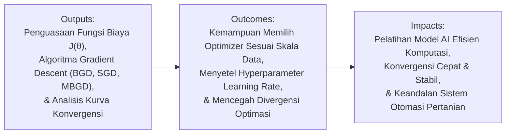
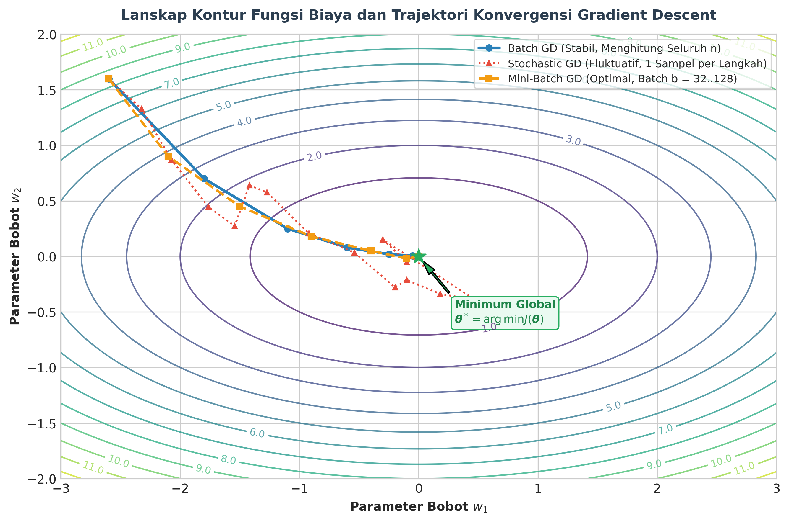

# AI Modul 5.6: Proses Training Model dalam Machine Learning

---

## 1. Identitas & Kerangka Capaian Pembelajaran (Sub-CPMK)

* **Kode Modul**        : AI Modul 5.6
* **Mata Kuliah**       : Kecerdasan Buatan dan Sains Data Pertanian Presisi
* **Alokasi Waktu**     : 2 x 50 Menit (Kajian Teori & Diskusi) + 2 x 50 Menit (Eksplorasi Praktikum Mandiri)
* **Beban SKS**         : 3 SKS
* **Prasyarat**         : AI Modul 5.5 (Overfitting dan Underfitting)
* **Level Kognitif**    : C2 (Memahami), C3 (Menerapkan), C4 (Menganalisis)



### 1.1 Capaian Pembelajaran Khusus (Sub-CPMK)
Setelah menyelesaikan modul ini, mahasiswa dan pembelajar diharapkan mampu:
1. **Menguraikan (C2)** mekanisme optimasi berulang: kalkulasi gradien, arah penurunan tercuram (*Steepest Descent*), dan pembaruan bobot model.
2. **Menganalisis (C4)** perbedaan varian algoritma optimasi: *Batch Gradient Descent*, *Stochastic Gradient Descent* (SGD), dan *Mini-Batch SGD* pada lanskap fungsi kerugian non-konveks.
3. **Menerapkan (C3)** penjadwalan laju pembelajaran (*Learning Rate Scheduling*) dan momentum untuk mempercepat konvergensi menuju minimum global.
4. **Mendiagnosis (C4)** patologi pelatihan: ledakan gradien (*Exploding Gradients*), hilangnya gradien (*Vanishing Gradients*), dan osilasi pada lembah sempit (*Ravines*).

### 1.2 Kerangka Hasil Pembelajaran (Outputs, Outcomes, & Impacts)
* **Outputs (Keluaran Berwujud Langsung)**:
  * Memformulasikan proses pelatihan model secara matematis sebagai masalah optimasi pencarian parameter optimal $\boldsymbol{\theta}^* = \arg\min_{\boldsymbol{\theta}} J(\boldsymbol{\theta})$.
  * Membedakan karakteristik matematis fungsi kerugian regresi (MSE, MAE, Huber Loss) dan fungsi kerugian klasifikasi (*Binary Cross-Entropy*, *Categorical Cross-Entropy*, *Hinge Loss*).
  * Menurunkan aturan pembaruan parameter (*parameter update rule*) berbasis vektor gradien $\nabla_{\boldsymbol{\theta}} J(\boldsymbol{\theta})$.
  * Mengidentifikasi kelebihan, keterbatasan, dan kompromi komputasi antara *Batch Gradient Descent* (BGD), *Stochastic Gradient Descent* (SGD), dan *Mini-Batch Gradient Descent* (MBGD).
* **Outcomes (Hasil Capaian & Perubahan Kompetensi)**:
  * Terampil menyetel tingkat pembelajaran (*learning rate* $\eta$) dan menerapkan strategi penyesuaian laju (*learning rate schedule*) guna menghindari osilasi liar atau terjebak pada dataran landai (*plateau*).
  * Mampu memilih pendekatan komputasi yang tepat: kapan menggunakan solusi analitik persamaan normal (*closed-form*) dan kapan menggunakan algoritma optimasi numerik iteratif.
  * Mampu memantau lintasan kurva *loss* per *epoch* untuk mendeteksi anomali numerik, gradien meledak (*exploding gradients*), atau gradien lenyap (*vanishing gradients*).
* **Impacts (Dampak Jangka Panjang & Nilai Guna Luas)**:

---

## 2. Landasan Teoretis: Formulasi Masalah Optimasi

Pelatihan model (*model training*) pada dasarnya merupakan proses pencarian konfigurasi parameter bobot $\boldsymbol{\theta} \in \mathbb{R}^p$ yang meminimalkan ketidaksesuaian antara estimasi model $f(\mathbf{x}; \boldsymbol{\theta})$ dan target sejati $y$.



### 2.1 Fungsi Kerugian (*Loss Function*) vs Fungsi Biaya (*Cost Function*)
1. **Fungsi Kerugian ($\mathcal{L}(y_i, \hat{y}_i)$)**: Mengukur penalti galat pada **satu sampel observasi individual** ke-$i$.
2. **Fungsi Biaya ($J(\boldsymbol{\theta})$)**: Mengukur rata-rata penalti galat atas **seluruh himpunan data latih** berukuran $n$:

$$J(\boldsymbol{\theta}) = \frac{1}{n} \sum_{i=1}^n \mathcal{L}\left( y_i, f(\mathbf{x}_i; \boldsymbol{\theta}) \right)$$

- **Keterangan Komponen Simbol:** $J(\boldsymbol{\theta})$ adalah nilai fungsi biaya agregat atas seluruh dataset, $\boldsymbol{\theta}$ adalah vektor parameter model, $n$ adalah jumlah total sampel, dan $\mathcal{L}(y_i, f(\mathbf{x}_i; \boldsymbol{\theta}))$ adalah fungsi kerugian per sampel observasi ke-$i$.
- **Cara Membaca Rumus:** *"Fungsi biaya J dari vektor parameter teta sama dengan satu per n dikalikan jumlahan fungsi kerugian L antara nilai target y-i dan keluaran model f dari x-i dengan parameter teta, untuk i dari satu hingga n."*

Tujuan optimasi dinyatakan secara formal:

$$\boldsymbol{\theta}^* = \arg\min_{\boldsymbol{\theta}} J(\boldsymbol{\theta})$$

- **Cara Membaca Rumus:** *"Vektor parameter optimal teta-bintang adalah argumen teta yang meminimalkan nilai fungsi biaya J terhadap teta."*

---

## 3. Tipologi Fungsi Kerugian (*Loss Functions*)

Pemilihan fungsi kerugian mendikte bagaimana model merespons kesalahan prediksi dan keberadaan pencilan (*outliers*).


### 3.1 Fungsi Kerugian Regresi
1. **Mean Squared Error (MSE / Galat $\ell_2$)**:
   $$\mathcal{L}_{\text{MSE}}(y, \hat{y}) = (y - \hat{y})^2 \implies J_{\text{MSE}}(\boldsymbol{\theta}) = \frac{1}{n} \sum_{i=1}^n (y_i - \hat{y}_i)^2$$
   - *Cara Membaca Rumus:* *"Kerugian MSE sama dengan kuadrat selisih y dan y-topi, yang menghasilkan fungsi biaya kuadrat rata-rata atas seluruh n sampel."*
   - *Karakteristik*: Bersifat kuadratik dan memiliki turunan halus di seluruh domain. Sangat sensitif terhadap pencilan karena penalti meningkat secara kuadratik terhadap residu.

2. **Mean Absolute Error (MAE / Galat $\ell_1$)**:
   $$\mathcal{L}_{\text{MAE}}(y, \hat{y}) = |y - \hat{y}| \implies J_{\text{MAE}}(\boldsymbol{\theta}) = \frac{1}{n} \sum_{i=1}^n |y_i - \hat{y}_i|$$
   - *Cara Membaca Rumus:* *"Kerugian MAE sama dengan nilai mutlak selisih y dan y-topi."*
   - *Karakteristik*: Lebih tahan terhadap pencilan (*robust*). Namun, fungsi tidak memiliki turunan (*non-differentiable*) pada titik $y = \hat{y}$, sehingga membutuhkan sub-gradien pada titik nol.

3. **Huber Loss (Fungsi Hibrida)**:
   Menggabungkan kehalusan kurvatur MSE pada kesalahan kecil dengan ketahanan linear MAE pada kesalahan besar dengan ambang batas $\delta$:
   $$\mathcal{L}_{\delta}(y, \hat{y}) = \begin{cases} \frac{1}{2}(y - \hat{y})^2, & \text{untuk } |y - \hat{y}| \le \delta \\ \delta |y - \hat{y}| - \frac{1}{2}\delta^2, & \text{untuk } |y - \hat{y}| > \delta \end{cases}$$
   - **Keterangan Komponen Simbol:** $\delta > 0$ adalah parameter batas ambang transisi antara zona kuadratik dan zona linier.
   - **Cara Membaca Rumus:** *"Kerugian Huber L-delta dari y dan y-topi bernilai: setengah kuadrat selisih y dan y-topi jika nilai mutlak residu kurang dari atau sama dengan delta; dan bernilai delta dikali nilai mutlak residu dikurangi setengah delta kuadrat jika nilai mutlak residu lebih besar dari delta."*

### 3.2 Fungsi Kerugian Klasifikasi
1. **Binary Cross-Entropy (Log Loss)**:
   Digunakan untuk target biner $y \in \{0, 1\}$ dengan estimasi probabilitas $\hat{p} = \sigma(\mathbf{w}^T \mathbf{x})$:
   $$\mathcal{L}_{\text{BCE}}(y, \hat{p}) = -\left[ y \ln(\hat{p}) + (1 - y) \ln(1 - \hat{p}) \right]$$
   - *Cara Membaca Rumus:* *"Kerugian BCE sama dengan minus dari kurung buka: y dikali logaritma natural p-topi, ditambah satu minus y dikali logaritma natural satu minus p-topi."*
   - Berakar dari estimasi kemungkinan maksimum (*Maximum Likelihood Estimation* / MLE). Penalti mendekati tak hingga jika model memprediksi probabilitas tinggi untuk kelas yang salah.

2. **Categorical Cross-Entropy**:
   Digunakan untuk target $C$ kelas mutual eksklusif dengan vektor *one-hot* $\mathbf{y}$:
   $$\mathcal{L}_{\text{CCE}}(\mathbf{y}, \hat{\mathbf{p}}) = -\sum_{c=1}^C y_c \ln(\hat{p}_c)$$
   - *Cara Membaca Rumus:* *"Kerugian CCE sama dengan minus jumlahan untuk c dari satu hingga C dari y-c dikali logaritma natural p-topi-c."*

3. **Hinge Loss**:
   Digunakan pada *Support Vector Machines* (SVM) untuk label $y \in \{-1, +1\}$:
   $$\mathcal{L}_{\text{Hinge}}(y, \hat{y}) = \max(0, 1 - y \cdot \hat{y})$$
   - *Cara Membaca Rumus:* *"Kerugian Hinge sama dengan nilai maksimum antara nol dan selisih satu minus perkalian y dan y-topi."*

---

## 4. Algoritma Optimasi Berbasis Gradien (*Gradient Descent*)

Gradien $\nabla_{\boldsymbol{\theta}} J(\boldsymbol{\theta})$ adalah vektor turunan parsial yang menunjuk ke arah laju peningkatan nilai fungsi biaya paling curam. Untuk meminimalkan fungsi, parameter diperbarui ke arah yang berlawanan (*negative gradient*):

$$\boldsymbol{\theta}^{(t+1)} = \boldsymbol{\theta}^{(t)} - \eta \nabla_{\boldsymbol{\theta}} J(\boldsymbol{\theta}^{(t)})$$

- **Keterangan Komponen Simbol:** $\boldsymbol{\theta}^{(t+1)}$ adalah vektor parameter baru pada iterasi $t+1$, $\boldsymbol{\theta}^{(t)}$ adalah parameter lama pada iterasi $t$, $\eta > 0$ melambangkan **tingkat pembelajaran** (*learning rate*), dan $\nabla_{\boldsymbol{\theta}} J$ adalah vektor gradien turunan parsial pertama.
- **Cara Membaca Rumus:** *"Vektor parameter teta pada iterasi t plus satu sama dengan vektor parameter teta pada iterasi t dikurangi eta dikalikan vektor gradien dari fungsi biaya J terhadap teta pada iterasi t."*

### 4.1 Tiga Varian Utama Gradient Descent
1. **Batch Gradient Descent (BGD)**:
   - Menghitung gradien rata-rata atas seluruh $n$ sampel data dalam satu langkah pembaruan:
     $$\nabla J(\boldsymbol{\theta}) = \frac{1}{n} \sum_{i=1}^n \nabla \mathcal{L}(y_i, f(\mathbf{x}_i; \boldsymbol{\theta}))$$
     - *Cara Membaca Rumus:* *"Gradien J sama dengan satu per n dikalikan jumlah gradien fungsi kerugian individual atas seluruh sampel dari satu sampai n."*
   - *Kelebihan*: Lintasan konvergensi sangat stabil dan terarah mulus menuju minimum.
   - *Kelemahan*: Komputasi sangat lambat dan boros memori jika $n$ berskala jutaan sampel.

2. **Stochastic Gradient Descent (SGD)**:
   - Memperbarui parameter pada setiap satu sampel tunggal yang dipilih secara acak:
     $$\boldsymbol{\theta} \leftarrow \boldsymbol{\theta} - \eta \nabla \mathcal{L}(y_i, f(\mathbf{x}_i; \boldsymbol{\theta}))$$
     - *Cara Membaca Rumus:* *"Parameter teta diperbarui dengan nilai teta saat ini dikurangi eta dikalikan gradien kerugian pada sampel tunggal ke-i."*
   - *Kelebihan*: Sangat cepat per iterasi dan fluktuasi stokastiknya membantu melompati minimum lokal yang buruk.
   - *Kelemahan*: Trajektori berosilasi liar (zigzag) dan tidak pernah benar-benar stabil pada titik minimum tanpa penurunan laju $\eta$.

3. **Mini-Batch Gradient Descent (MBGD)**:
   - Mengambil subhimpunan acak berukuran $b$ (lazimnya $b \in \{32, 64, 128, 256\}$):
     $$\boldsymbol{\theta} \leftarrow \boldsymbol{\theta} - \eta \left( \frac{1}{b} \sum_{i \in \mathcal{B}} \nabla \mathcal{L}(y_i, f(\mathbf{x}_i; \boldsymbol{\theta})) \right)$$
     - *Cara Membaca Rumus:* *"Parameter teta diperbarui dengan nilai teta dikurangi eta dikalikan rata-rata gradien kerugian atas sampel anggota mini-batch B berukuran b."*
   - *Standar Industri*: Menggabungkan efisiensi komputasi vektor GPU/CPU dengan kestabilan estimasi statistik gradien.

---

## 5. Solusi Analitik vs Optimasi Iteratif

Pada regresi linear metode kuadrat terkecil (*Ordinary Least Squares* / OLS), parameter optimal dapat diturunkan secara eksak tanpa iterasi:

$$\nabla_{\boldsymbol{\theta}} J(\boldsymbol{\theta}) = \mathbf{0} \implies \boldsymbol{\theta}^* = (\mathbf{X}^T \mathbf{X})^{-1} \mathbf{X}^T \mathbf{y}$$

- **Keterangan Komponen Simbol:** $\mathbf{X} \in \mathbb{R}^{n \times d}$ adalah matriks desain data masukan, $\mathbf{X}^T$ adalah transpos matriks desain, $(\mathbf{X}^T \mathbf{X})^{-1}$ adalah invers dari matriks bujur sangkar kovariansi $\mathbf{X}^T \mathbf{X}$, dan $\mathbf{y}$ adalah vektor target observasi.
- **Cara Membaca Rumus:** *"Vektor bobot optimal teta-bintang sama dengan invers dari perkalian X-transpos dengan X, dikalikan X-transpos dikalikan vektor y."*

Perbandingan operasional antara solusi analitik dan numerik:

| Parameter | Solusi Tertutup Persamaan Normal | Mini-Batch Gradient Descent |
| :--- | :--- | :--- |
| **Kebutuhan Iterasi** | Sekali hitung (tanpa iterasi) | Membutuhkan banyak siklus (*epochs*) |
| **Penyetelan Learning Rate ($\eta$)** | Tidak memerlukan penyetelan | Wajib disetel dengan cermat |
| **Kompleksitas Komputasi** | $\mathcal{O}(d^3)$ karena operasi invers matriks | $\mathcal{O}(k \cdot b \cdot d)$ per epoch |
| **Kinerja pada Dimensi Besar ($d > 20.000$)** | Sangat lambat / Kehabisan Memori (OOM) | Sangat cepat dan efisien memori |
| **Kesesuaian dengan Model Non-linier** | Terbatas hanya pada model linier | Berlaku universal untuk seluruh model terdiferensialkan |

---

## 6. Protokol Pemantauan Sesi Pelatihan (*Training Monitoring*)

Keberhasilan sesi pelatihan dipantau melalui lintasan fungsi kerugian terhadap waktu (*Loss Curve vs Epochs*):
1. **Konvergensi Sehat**: Kerugian menurun secara eksponensial halus pada awal sesi lalu melandai secara bertahap menuju asimtot stabil.
2. **Divergensi Numerik (Exploding Loss)**: Nilai kerugian melonjak tiba-tiba ke angka tak hingga (`NaN` atau `Inf`). Penyebab utama: *learning rate* $\eta$ terlalu tinggi atau data masukan belum dinormalisasi.
3. **Stagnasi Prematur (Vanishing Gradient / Plateau)**: Kerugian tidak mengalami penurunan sejak awal siklus. Diatasi dengan menggunakan optimizer adaptif (seperti Adam) atau inisialisasi bobot terstandar.

---

## 7. Implementasi Komputasi: Pelatihan Regresi Linear Berbasis Gradien

Berikut implementasi murni algoritma *Mini-Batch Gradient Descent* dari dasar (*from scratch*) dibandingkan dengan solusi analitik persamaan normal.

```python
"""
Implementasi Mini-Batch Gradient Descent from Scratch
untuk Estimasi Dosis Pemupukan Kelapa Sawit
"""
import numpy as np
import matplotlib.pyplot as plt

# 1. Bangkitkan Data Sintetis Agronomi (n=500, d=2)
np.random.seed(42)
n_samples = 500

# Fitur: Kadar Air Tanah (%) dan Suhu Lingkungan (C)
X_raw = np.column_stack([
    np.random.uniform(20.0, 45.0, n_samples),
    np.random.uniform(24.0, 34.0, n_samples)
])

# Standarisasi Fitur (Wajib untuk Kestabilan Gradien)
mean_X = np.mean(X_raw, axis=0)
std_X = np.std(X_raw, axis=0)
X_norm = (X_raw - mean_X) / std_X

# Tambahkan kolom bias (intercept) x0 = 1
X_design = np.hstack([np.ones((n_samples, 1)), X_norm])

# Bobot sejati: theta = [10.0 (bias), 3.5, -2.2]
theta_true = np.array([10.0, 3.5, -2.2])
y = X_design @ theta_true + np.random.normal(0, 0.8, n_samples)

# 2. Solusi Eksak Analitik (Persamaan Normal)
theta_analytical = np.linalg.inv(X_design.T @ X_design) @ X_design.T @ y

# 3. Algoritma Mini-Batch Gradient Descent (MBGD)
def train_mbgd(X, y, batch_size=32, lr=0.05, n_epochs=50):
    n, d = X.shape
    theta = np.zeros(d)
    loss_history = []
    
    for epoch in range(n_epochs):
        indices = np.random.permutation(n)
        X_shuffled = X[indices]
        y_shuffled = y[indices]
        
        for i in range(0, n, batch_size):
            X_batch = X_shuffled[i:i+batch_size]
            y_batch = y_shuffled[i:i+batch_size]
            
            # Hitung prediksi dan residu
            y_pred = X_batch @ theta
            error = y_pred - y_batch
            
            # Hitung gradien MSE: (2/b) * X^T * error
            gradient = (2.0 / len(y_batch)) * (X_batch.T @ error)
            
            # Pembaruan parameter
            theta -= lr * gradient
            
        # Catat total loss di akhir epoch
        total_loss = np.mean((X @ theta - y) ** 2)
        loss_history.append(total_loss)
        
    return theta, loss_history

theta_mbgd, loss_curve = train_mbgd(X_design, y, batch_size=32, lr=0.05, n_epochs=60)

print(f"Hasil Estimasi Parameter:")
print(f"Bobot Sejati (Ground Truth) : {theta_true}")
print(f"Solusi Analitik OLS        : {np.round(theta_analytical, 4)}")
print(f"Solusi Mini-Batch GD        : {np.round(theta_mbgd, 4)}")
print(f"MSE Akhir Pelatihan         : {loss_curve[-1]:.4f}")
```

---

## 8. Latihan Soal Evaluasi Tingkat Tinggi (HOTS)

### 8.1 Analisis Konvergensi Matematis: Kondisi Batas Learning Rate
Misalkan fungsi biaya berbentuk kuadratik murni $J(\theta) = \frac{1}{2} a \theta^2$ dengan konstanta kurvatur $a > 0$.
1. Turunkan relasi matematis rekursif untuk nilai parameter $\theta^{(t)}$ sebagai fungsi dari $\theta^{(0)}$, $a$, dan tingkat pembelajaran $\eta$.
2. Buktikan batas teoritis nilai $\eta$ agar algoritma *Gradient Descent* dijamin konvergen menuju minimum global ($\lim_{t \to \infty} \theta^{(t)} = 0$). Apa yang terjadi secara geometris jika $\eta > \frac{2}{a}$?

### 8.2 Diagnostik Kasus Komputasi: Penanganan Gradient Explosion pada Jaringan Saraf
Sebuah model regresi non-linier dilatih menggunakan data citra multispektral drone kelapa sawit tanpa tahapan normalisasi input ($X \in [0, 4095]$). Pada iterasi ke-12, nilai fungsi kerugian melonjak menjadi `NaN`.
1. Jelaskan secara matematis bagaimana rentang skala input yang tidak terstandarisasi memicu fenomena meledaknya gradien (*gradient explosion*).
2. Rancanglah solusi rekayasa komprehensif yang memadukan standarisasi z-score, *Gradient Clipping*, dan penyesuaian *learning rate* adaptif untuk memulihkan stabilitas numerik!

### 8.3 Desain Eksperimental: Komparasi Optimizer Skenario Streaming IoT
Sebuah perkebunan mengoperasikan 500 node sensor IoT tanah yang memancarkan data pengukuran kelembapan dan konduktivitas elektrik setiap 10 detik secara terus-menerus (*data stream* tanpa akhir). Model prediksi irigasi harus diperbarui secara berkala di *edge server*.
1. Mengapa metode *Batch Gradient Descent* dan Solusi Persamaan Normal sama sekali tidak layak diimplementasikan pada skenario aliran data kontinu ini?
2. Susunlah arsitektur pembaruan model berbasis *Online Stochastic Gradient Descent* dengan optimizer Adam. Rinci mekanisme peluruhan laju belajar (*learning rate decay*) yang menjamin stabilitas model dalam jangka panjang!

---

## 9. Daftar Pustaka dan Referensi Akademik

1. Bottou, L. (2010). Large-scale machine learning with stochastic gradient descent. In *Proceedings of COMPSTAT'2010* (pp. 177-186). Physica-Verlag HD.
2. Kingma, D. P., & Ba, J. (2014). Adam: A method for stochastic optimization. *arXiv preprint arXiv:1412.6980*.
3. Nesterov, Y. (2004). *Introductory Lectures on Convex Optimization: A Basic Course*. Springer Science & Business Media.
4. Polyak, B. T. (1964). Some methods of speeding up the convergence of iteration methods. *USSR Computational Mathematics and Mathematical Physics*, 4(5), 1-17.
5. Ruder, S. (2016). An overview of gradient descent optimization algorithms. *arXiv preprint arXiv:1609.04747*.
