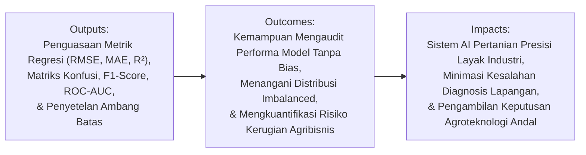
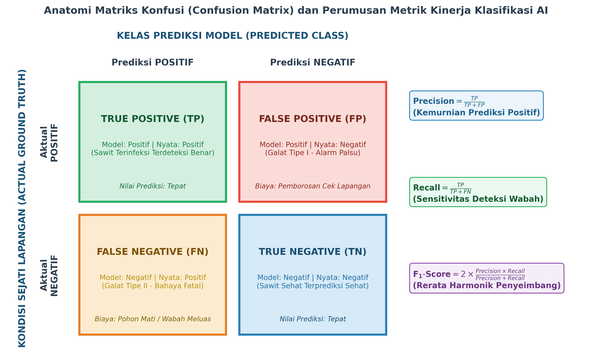
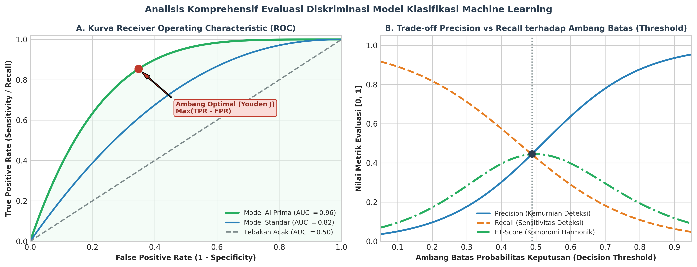

# AI Modul 5.7: Evaluasi Model dalam Machine Learning

---

## 1. Identitas & Kerangka Capaian Pembelajaran (Sub-CPMK)

* **Kode Modul**        : AI Modul 5.7
* **Mata Kuliah**       : Kecerdasan Buatan dan Sains Data Pertanian Presisi
* **Alokasi Waktu**     : 2 x 50 Menit (Kajian Teori & Diskusi) + 2 x 50 Menit (Eksplorasi Praktikum Mandiri)
* **Beban SKS**         : 3 SKS
* **Prasyarat**         : AI Modul 5.6 (Proses Training Model)
* **Level Kognitif**    : C2 (Memahami), C3 (Menerapkan), C4 (Menganalisis)



### 1.1 Capaian Pembelajaran Khusus (Sub-CPMK)
Setelah menyelesaikan modul ini, mahasiswa dan pembelajar diharapkan mampu:
1. **Mengidentifikasi (C2)** klasifikasi metrik evaluasi model prediktif untuk tugas regresi (MSE, RMSE, MAE, MAPE, $R^2$) dan klasifikasi biner/multi-kelas.
2. **Menganalisis (C4)** kelemahan metrik akurasi sederhana (*Accuracy Paradox*) pada dataset penyakit kebun dengan distribusi kelas sangat timpang.
3. **Menerapkan (C3)** kalkulasi metrik Presisi, Sensitivitas (Recall), dan F1-Score untuk mengukur kinerja deteksi dini serangan Ganoderma.
4. **Menyusun (C3)** ringkasan laporan evaluasi menyeluruh (*Classification Report*) yang mengaitkan metrik statistik dengan implikasi biaya operasional di perkebunan.

### 1.2 Kerangka Hasil Pembelajaran (Outputs, Outcomes, & Impacts)
* **Outputs (Keluaran Berwujud Langsung)**:
  * Menghitung dan menginterpretasikan metrik performa regresi: *Mean Absolute Error* (MAE), *Root Mean Squared Error* (RMSE), *Mean Absolute Percentage Error* (MAPE), serta Koefisien Determinasi ($R^2$ dan Adjusted $R^2$).
  * Mengonstruksi matriks konfusi ($2 \times 2$ dan multi-kelas) serta menurunkan formulasi *Accuracy*, *Precision*, *Recall* (Sensitivitas), *Specificity*, dan $F_\beta$-Score.
  * Menjelaskan secara matematis paradoks akurasi (*accuracy paradox*) pada himpunan data dengan distribusi kelas sangat timpang (*highly imbalanced data*).
  * Menganalisis kurva *Receiver Operating Characteristic* (ROC), menghitung nilai *Area Under Curve* (AUC), serta memetakan *trade-off* antara presisi dan sensitivitas.
* **Outcomes (Hasil Capaian & Perubahan Kompetensi)**:
  * Terampil memilih metrik evaluasi yang selaras dengan tujuan operasional: kapan memprioritaskan *Recall* (misalnya deteksi dini patogen karantina tanaman) dan kapan memprioritaskan *Precision* (misalnya automasi penyemprotan herbisida selektif dosis tinggi).
  * Mampu menyetel ambang batas keputusan probabilitas (*decision threshold*) guna meminimalkan kerugian finansial riil menggunakan matriks biaya (*cost matrix*).
  * Mampu melakukan audit performa model pembelajaran tak terawasi (*unsupervised clustering*) menggunakan koefisien siluet (*silhouette score*).
* **Impacts (Dampak Jangka Panjang & Nilai Guna Luas)**:

---

## 2. Landasan Teoretis: Hakikat Evaluasi Model Pembelajaran Mesin

Evaluasi model bertujuan mengukur kapasitas generalisasi hipotesis pembelajar $h(\mathbf{x})$ pada data uji independen $\mathcal{D}_{\text{test}} = \{(\mathbf{x}_i, y_i)\}_{i=1}^{n_{\text{test}}}$ yang belum pernah terlibat dalam proses pencarian parameter:

$$\mathcal{R}_{\text{emp}}(h) = \frac{1}{n_{\text{test}}} \sum_{i=1}^{n_{\text{test}}} \ell(y_i, h(\mathbf{x}_i))$$

- **Keterangan Komponen Simbol:** $\mathcal{R}_{\text{emp}}(h)$ adalah risiko empiris (*empirical risk*) atau rata-rata kerugian pada data uji, $n_{\text{test}}$ adalah jumlah sampel data uji, $\ell(y_i, h(\mathbf{x}_i))$ adalah fungsi kerugian per sampel antara target aktual $y_i$ dan prediksi model $h(\mathbf{x}_i)$.
- **Cara Membaca Rumus:** *"Risiko empiris dari hipotesis h sama dengan satu per n-test dikalikan jumlahan nilai fungsi kerugian L antara target y-i dan prediksi h dari x-i untuk i dari satu hingga n-test."*

di mana $\ell(y, \hat{y})$ melambangkan fungsi kerugian evaluatif. Metrik yang dipilih harus mampu merefleksikan konsekuensi operasional di lapangan secara objektif.

---

## 3. Metrik Kuantitatif Evaluasi Regresi

Untuk variabel target kontinu $y \in \mathbb{R}$, evaluasi didasarkan pada besaran residu kesalahan $e_i = y_i - \hat{y}_i$:

| Metrik Evaluasi | Formulasi Matematis | Karakteristik Operasional | Kesesuaian Kasus Pertanian |
| :--- | :--- | :--- | :--- |
| **Mean Absolute Error (MAE)** | $\text{MAE} = \frac{1}{n} \sum_{i=1}^n \|y_i - \hat{y}_i\|$ | Memiliki satuan fisik yang sama dengan target asli; memberikan bobot linier tanpa memperbesar pencilan | Estimasi tebal daging buah atau diameter batang kelapa sawit |
| **Mean Squared Error (MSE)** | $\text{MSE} = \frac{1}{n} \sum_{i=1}^n (y_i - \hat{y}_i)^2$ | Memiliki sifat diferensiabel mulus; sangat sensitif terhadap kesalahan estimasi besar | Optimasi matematis fungsi objektif model |
| **Root Mean Squared Error (RMSE)** | $\text{RMSE} = \sqrt{\frac{1}{n} \sum_{i=1}^n (y_i - \hat{y}_i)^2}$ | Bersifat satu dimensi dengan target; memberikan penalti berat pada deviasi ekstrem | Prediksi tonase panen Tandan Buah Segar (TBS) per hektar |
| **Mean Absolute Percentage Error (MAPE)** | $\text{MAPE} = \frac{100\%}{n} \sum_{i=1}^n \left\| \frac{y_i - \hat{y}_i}{y_i} \right\|$ | Bebas skala unit (persentase relatif); bias jika nilai riil $y_i$ mendekati angka nol | Peramalan fluktuasi harga komoditas CPO bulanan |
| **Koefisien Determinasi ($R^2$)** | $R^2 = 1 - \frac{\sum (y_i - \hat{y}_i)^2}{\sum (y_i - \bar{y})^2}$ | Mengukur proporsi variansi data target yang sukses dijelaskan oleh model ($R^2 \le 1.0$) | Evaluasi kecocokan kurva respon pemupukan tanaman |

- **Panduan Membaca Rumus Regresi Utama:**
  - **RMSE:** *"Root Mean Squared Error sama dengan akar kuadrat dari satu per n dikalikan jumlah kuadrat residu antara y-i dan y-topi-i."*
  - **Koefisien Determinasi ($R^2$):** *"R-kuadrat sama dengan satu dikurangi rasio antara jumlah kuadrat residu dan jumlah kuadrat total deviasi terhadap rata-rata y."*

### 3.1 Penyesuaian Dimensi: Adjusted $R^2$
Penambahan variabel prediktor baru akan selalu menaikkan nilai $R^2$ secara matematis, sekalipun variabel tersebut hanya berupa derau acak murni. Untuk mengoreksi bias tersebut, digunakan **Adjusted $R^2$**:

$$R^2_{\text{adj}} = 1 - \left[ \frac{(1 - R^2)(n - 1)}{n - d - 1} \right]$$

- **Keterangan Komponen Simbol:** $R^2_{\text{adj}}$ adalah koefisien determinasi yang disesuaikan, $R^2$ adalah koefisien determinasi standar, $n$ adalah ukuran sampel data, dan $d$ adalah banyaknya variabel fitur prediktor dalam model.
- **Cara Membaca Rumus:** *"R-kuadrat adjusted sama dengan satu dikurangi: kurung buka satu minus R-kuadrat dikalikan n minus satu, dibagi n minus d minus satu kurung tutup."*

di mana $n$ menyatakan jumlah sampel dan $d$ melambangkan jumlah fitur prediktor. Jika fitur tambahan tidak memberikan kontribusi informatif yang signifikan, nilai $R^2_{\text{adj}}$ akan mengalami penurunan.

---

## 4. Metrik Kuantitatif Evaluasi Klasifikasi

Dalam tugas klasifikasi biner, hasil inferensi model terhadap label sejati dipetakan ke dalam **Matriks Konfusi** (*Confusion Matrix*):



### 4.1 Komponen Matriks Konfusi
1. **True Positive (TP)**: Sampel positif yang terklasifikasi secara benar sebagai positif (misal: pohon sawit terinfeksi jamur *Ganoderma* terdeteksi sakit).
2. **False Positive (FP - Galat Tipe I)**: Sampel negatif yang salah diklasifikasikan sebagai positif (alarm palsu; pohon sehat didiagnosis sakit).
3. **False Negative (FN - Galat Tipe II)**: Sampel positif yang salah diklasifikasikan sebagai negatif (kegagalan deteksi fatal; pohon sakit didiagnosis sehat sehingga wabah meluas).
4. **True Negative (TN)**: Sampel negatif yang terklasifikasi secara benar sebagai negatif (pohon sehat terdeteksi sehat).

### 4.2 Formulasi Metrik Turunan
- **Akurasi (*Accuracy*)**: Proporsi prediksi yang tepat dari total seluruh observasi:
  $$\text{Accuracy} = \frac{TP + TN}{TP + TN + FP + FN}$$
  - *Cara Membaca:* *"Akurasi sama dengan jumlah TP ditambah TN, dibagi total seluruh TP ditambah TN ditambah FP ditambah FN."*
- **Presisi (*Precision*)**: Proporsi ketepatan di antara seluruh sampel yang diprediksi positif:
  $$\text{Precision} = \frac{TP}{TP + FP}$$
  - *Cara Membaca:* *"Presisi sama dengan TP dibagi jumlah TP ditambah FP."*
- **Sensitivitas / Recall**: Kemampuan model menjaring seluruh kejadian positif sejati di lapangan:
  $$\text{Recall} = \frac{TP}{TP + FN}$$
  - *Cara Membaca:* *"Recall sama dengan TP dibagi jumlah TP ditambah FN."*
- **Kekhususan (*Specificity*)**: Kemampuan model mendeteksi sampel negatif sejati:
  $$\text{Specificity} = \frac{TN}{TN + FP}$$
  - *Cara Membaca:* *"Spesifisitas sama dengan TN dibagi jumlah TN ditambah FP."*
- **$F_1$-Score**: Rerata harmonik antara Presisi dan Recall:
  $$F_1 = 2 \times \frac{\text{Precision} \times \text{Recall}}{\text{Precision} + \text{Recall}} = \frac{2 TP}{2 TP + FP + FN}$$
  - *Cara Membaca:* *"F-satu skor sama dengan dua dikalikan perkalian Presisi dan Recall, dibagi penjumlahan Presisi dan Recall."*

### 4.3 Paradoks Akurasi pada Distribusi Timpang (*Imbalanced Data*)
Misalkan dalam perkebunan kelapa sawit seluas 1.000 hektar terdapat 100.000 pohon, di mana prevalensi penyakit busuk batang hanya menyerang $0.5\%$ populasi (500 pohon sakit, 99.500 pohon sehat).
Jika seorang perancang AI membuat model naif (*dummy classifier*) yang memprediksi seluruh pohon berstatus "SEHAT" tanpa komputasi:
$$\text{Akurasi} = \frac{0 + 99500}{100000} = 99.5\%$$
Secara statistik di atas kertas, akurasi mencapai $99.5\%$. Namun secara operasional agronomis, sistem ini **tidak bernilai sama sekali** karena nilai *Recall* untuk kelas pohon sakit adalah $0\%$ ($0 / 500$). Seluruh 500 pohon yang sakit terlewatkan dan wabah mematikan akan menular tanpa terdeteksi.

---

## 5. Analisis Diskriminasi Probabilistik: ROC-AUC dan Precision-Recall

Sebagian besar algoritma klasifikasi modern menghasilkan estimasi probabilitas kontinu $\hat{p}(\mathbf{x}) = P(y=1 \mid \mathbf{x}) \in [0, 1]$. Keputusan kelas biner diambil dengan membandingkannya terhadap ambang batas (*threshold*) $\tau \in [0, 1]$:

$$\hat{y} = \begin{cases} 1, & \text{jika } \hat{p}(\mathbf{x}) \ge \tau \\ 0, & \text{jika } \hat{p}(\mathbf{x}) < \tau \end{cases}$$



### 5.1 Kurva ROC (*Receiver Operating Characteristic*)
Kurva ROC memetakan lintasan antara laju positif sejati (*True Positive Rate* / TPR = Recall) pada sumbu vertikal terhadap laju positif palsu (*False Positive Rate* / FPR = $1 - \text{Specificity}$) pada sumbu horizontal untuk seluruh kemungkinan nilai ambang batas $\tau \in [0, 1]$:

$$\text{FPR} = \frac{FP}{TN + FP}$$

- **Area Under Curve (AUC-ROC)**: Mengukur probabilitas bahwa model akan memberikan skor probabilitas lebih tinggi pada sampel positif yang ditarik secara acak dibandingkan sampel negatif acak.
  - $\text{AUC} = 1.0$: Diskriminator sempurna tanpa kesalahan.
  - $\text{AUC} = 0.5$: Kinerja setara dengan pelemparan koin acak (*random guessing*).
- **Titik Ambang Optimal Youden ($J$)**:
  $$J = \max_\tau (\text{TPR}(\tau) - \text{FPR}(\tau))$$
  - *Cara Membaca Rumus:* *"Indeks Youden J sama dengan nilai maksimum terhadap ambang tau dari selisih True Positive Rate dan False Positive Rate."*

### 5.2 Kurva Precision-Recall (PR Curve)
Ketika proporsi kelas minoritas sangat langka ($< 5\%$), kurva ROC dapat memberikan optimisme semu karena nilai $TN$ yang sangat masif menjaga nilai FPR tetap kecil. Pada skenario ini, **Kurva Precision-Recall (PR-AUC)** menjadi standar evaluasi wajib, karena metrik ini berfokus secara eksklusif pada kelas positif tanpa dipengaruhi oleh besaran sampel negatif sejati ($TN$).

---

## 6. Penyetelan Ambang Batas Berbasis Matriks Biaya (*Cost-Sensitive Evaluation*)

Dalam dunia agribisnis nyata, kerugian akibat Galat Tipe I (FP) dan Galat Tipe II (FN) memiliki nilai ekonomi yang sangat berbeda:
- **Biaya Galat Tipe I ($C_{\text{FP}}$)**: Biaya mengerahkan mandor kebun untuk memeriksa pohon yang diduga terinfeksi padahal sehat (misal: Rp 50.000,-).
- **Biaya Galat Tipe II ($C_{\text{FN}}$)**: Kerugian fatal membiarkan pohon terinfeksi jamur hingga mati dan menulari 10 pohon di sekitarnya (misal: Rp 5.000.000,-).

Fungsi kerugian ekonomi total yang diminimalkan melalui pemilihan $\tau^*$:

$$\text{Total Cost}(\tau) = C_{\text{FP}} \cdot \text{FP}(\tau) + C_{\text{FN}} \cdot \text{FN}(\tau)$$

- **Keterangan Komponen Simbol:** $\text{Total Cost}(\tau)$ adalah estimasi kerugian finansial total pada ambang batas $\tau$, $C_{\text{FP}}$ adalah unit biaya akibat kesalahan alarm palsu, $C_{\text{FN}}$ adalah unit biaya akibat meloloskan pohon terinfeksi, serta $\text{FP}(\tau)$ dan $\text{FN}(\tau)$ adalah jumlah cacah galat tipe I dan tipe II pada ambang $\tau$.
- **Cara Membaca Rumus:** *"Total biaya operasional pada ambang tau sama dengan perkalian biaya C-FP dengan jumlah False Positive pada ambang tau, ditambah perkalian biaya C-FN dengan jumlah False Negative pada ambang tau."*

Karena $C_{\text{FN}} \gg C_{\text{FP}}$, ambang batas keputusan optimal $\tau^*$ harus digeser ke kiri (diturunkan, misalnya dari 0.50 menjadi 0.15) guna memaksimumkan penangkapan pohon sakit (*high recall*), meskipun harus menerima sedikit kenaikan alarm palsu.

Karena $C_{\text{FN}} \gg C_{\text{FP}}$, ambang batas keputusan optimal $\tau^*$ harus digeser ke kiri (diturunkan, misalnya dari 0.50 menjadi 0.15) guna memaksimumkan penangkapan pohon sakit (*high recall*), meskipun harus menerima sedikit kenaikan alarm palsu.

---

## 7. Implementasi Komputasi: Pipeline Evaluasi Komprehensif

Berikut skrip Python untuk mengevaluasi model klasifikasi penyakit tanaman sawit pada data tidak seimbang, menampilkan matriks konfusi, kurva ROC-AUC, dan optimasi ambang biaya.

```python
"""
Pipeline Evaluasi Model Klasifikasi Terstandar
Menghitung Metrik, Kurva ROC-AUC, dan Cost-Sensitive Threshold
"""
import numpy as np
import matplotlib.pyplot as plt
from sklearn.datasets import make_classification
from sklearn.model_selection import train_test_split
from sklearn.ensemble import RandomForestClassifier
from sklearn.metrics import (
    confusion_matrix, classification_report, roc_curve, auc,
    precision_recall_curve, f1_score, cohen_kappa_score
)

# 1. Bangkitkan Data Tidak Seimbang (Prevalensi Penyakit Sawit 5%)
X, y = make_classification(
    n_samples=2000,
    n_features=15,
    n_informative=8,
    weights=[0.95, 0.05],
    random_state=42
)

X_train, X_test, y_train, y_test = train_test_split(
    X, y, test_size=0.3, random_state=42, stratify=y
)

# 2. Pelatihan Model Random Forest
clf = RandomForestClassifier(n_estimators=100, random_state=42)
clf.fit(X_train, y_train)

# Probabilitas Positif (Kelas 1)
y_probs = clf.predict_proba(X_test)[:, 1]

# Prediksi Default (Threshold = 0.5)
y_pred_default = (y_probs >= 0.5).astype(int)

# 3. Evaluasi Matriks Konfusi Default
cm_default = confusion_matrix(y_test, y_pred_default)
print("=== Matriks Konfusi (Threshold 0.50) ===")
print(cm_default)
print("\n=== Laporan Klasifikasi Standar ===")
print(classification_report(y_test, y_pred_default, target_names=['Sehat', 'Sakit']))

# 4. Analisis ROC-AUC
fpr, tpr, roc_thresholds = roc_curve(y_test, y_probs)
roc_auc = auc(fpr, tpr)
print(f"Area Under ROC Curve (AUC) : {roc_auc:.4f}")

# 5. Optimasi Ambang Batas Berbasis Biaya Riil (Cost Matrix)
# Biaya Alarm Palsu (FP) = Rp 50.000,- | Biaya Wabah Lolos (FN) = Rp 5.000.000,-
c_fp = 50_000
c_fn = 5_000_000

ambang_coba = np.linspace(0.01, 0.99, 100)
total_biaya = []

for th in ambang_coba:
    preds = (y_probs >= th).astype(int)
    tn, fp, fn, tp = confusion_matrix(y_test, preds).ravel()
    biaya = (fp * c_fp) + (fn * c_fn)
    total_biaya.append(biaya)

idx_opt = np.argmin(total_biaya)
th_opt = ambang_coba[idx_opt]
biaya_opt = total_biaya[idx_opt]

print(f"\nAmbang Batas Optimum Berbasis Biaya : {th_opt:.3f}")
print(f"Total Biaya Minimum                  : Rp {biaya_opt:,.0f}")
```

---

## 8. Latihan Soal Evaluasi Tingkat Tinggi (HOTS)

### 8.1 Analisis Kritis: Paradoks Akurasi dan Pemilihan Metrik $F_\beta$
Dalam program perlindungan tanaman kelapa sawit nasional, sebuah model Computer Vision drone mendeteksi serangan ulat api (*Setothosea asigna*) dengan prevalensi $2\%$. 
1. Buktikan secara matematis bahwa metrik Akurasi ($Accuracy$) memberikan ilusi keberhasilan yang menyesatkan pada sistem ini.
2. Jika pihak manajemen perkebunan menetapkan bahwa konsekuensi meloloskan satu sarang ulat api (FN) bernilai $5 \times$ lebih merugikan secara finansial dibandingkan salah memeriksa kanopi pohon sehat (FP), formulasikan nilai parameter $\beta$ pada metrik $F_\beta$-Score yang tepat untuk digunakan sebagai kriteria seleksi model!

### 8.2 Evaluasi Komparatif: Kurva ROC vs Kurva Precision-Recall
Dua model deep learning (Model A dan Model B) dievaluasi untuk mendeteksi kontaminasi aflatoksin pada biji kakao ekspor (prevalensi kontaminasi $0.2\%$). Model A dan Model B sama-sama memiliki nilai metrik AUC-ROC sebesar $0.94$. Namun, pada kurva Precision-Recall, Model A menghasilkan PR-AUC sebesar $0.78$, sedangkan Model B hanya menghasilkan PR-AUC sebesar $0.29$.
1. Mengapa nilai AUC-ROC gagal memperlihatkan perbedaan kualitas diskriminasi yang mencolok antara kedua model tersebut?
2. Model manakah yang wajib dipilih oleh manajer penjaminan mutu (*Quality Assurance*) pelabuhan ekspor? Berikan argumentasi berbasis matriks konfusi!

### 8.3 Desain Evaluasi Sistemik: Validasi Silang Multi-Metrik pada Regresi TBS Sawit
Sebuah konsorsium perkebunan mengembangkan model regresi untuk memprediksi tonase panen Tandan Buah Segar (TBS) di 12 afdeling perkebunan dengan topografi bervariasi.
1. Rancanglah arsitektur protokol validasi silang spasial (*Spatial Block Cross-Validation*) yang mencegah distorsi metrik $R^2$ akibat autokorelasi geografis antar-petak kebun bertetangga.
2. Jelaskan mengapa pelaporan metrik evaluasi pada regresi agroteknologi wajib memuat kombinasi MAE, RMSE, dan $R^2_{\text{adj}}$ secara simultan alih-alih hanya mengandalkan $R^2$ tunggal!

---

## 9. Daftar Pustaka dan Referensi Akademik

1. Fawcett, T. (2006). An introduction to ROC analysis. *Pattern Recognition Letters*, 27(8), 861-874.
2. Hand, D. J. (2009). Measuring classifier performance: a coherent alternative to the area under the ROC curve. *Machine Learning*, 77(1), 103-123.
3. Powers, D. M. (2020). Evaluation: from precision, recall and F-measure to ROC, informedness, markedness and correlation. *arXiv preprint arXiv:2010.16061*.
4. Saito, T., & Rehms, M. (2015). The precision-recall plot is more informative than the ROC plot when evaluating imbalanced datasets. *PloS One*, 10(3), e0118432.
5. Willmott, C. J., & Matsuura, K. (2005). Advantages of the mean absolute error (MAE) over the root mean squared error (RMSE) in assessing average model performance. *Climate Research*, 30(1), 79-82.
