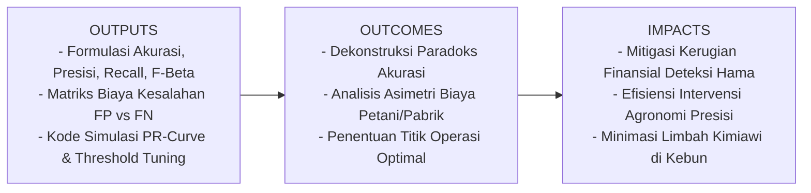
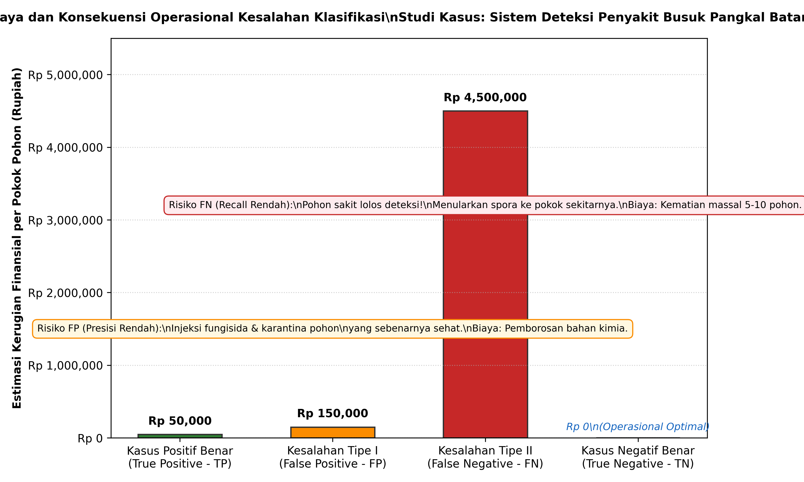
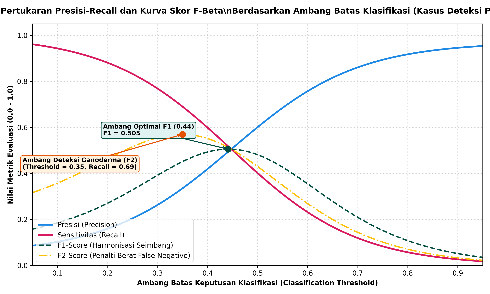

# AI Modul 6.1: Evaluasi Klasifikasi - Akurasi, Presisi, Sensitivitas (Recall), dan F-Beta Score

---

## 1. Identitas & Kerangka Capaian Pembelajaran (Sub-CPMK)

* **Kode Modul**        : AI Modul 6.1
* **Mata Kuliah**       : Kecerdasan Buatan dan Sains Data Pertanian Presisi
* **Alokasi Waktu**     : 2 x 50 Menit (Kajian Teori & Diskusi) + 2 x 50 Menit (Eksplorasi Praktikum Mandiri)
* **Beban SKS**         : 3 SKS
* **Prasyarat**         : AI Modul 5.7 (Evaluasi Model Dasar)
* **Level Kognitif**    : C2 (Memahami), C3 (Menerapkan), C4 (Menganalisis)

### 1.1 Capaian Pembelajaran Khusus (Sub-CPMK)
Setelah menuntaskan modul ini, mahasiswa dan pembelajar diharapkan mampu:
1. **Mendekonstruksi (C4)** paradoks akurasi (*Accuracy Paradox*) secara matematis pada dataset agribisnis dengan ketidakseimbangan kelas (*class imbalance*).
2. **Memformulasikan (C3)** metrik turunan ruang keputusan biner: Presisi (*Precision*), Sensitivitas (*Recall*), Spesifisitas, serta Skor F1 dan F-Beta.
3. **Menganalisis (C4)** asimetri biaya kesalahan (*cost-sensitive evaluation*) antara Kesalahan Tipe I (*False Positive*) dan Kesalahan Tipe II (*False Negative*) pada perkebunan sawit.
4. **Mengoptimasi (C3)** ambang batas klasifikasi (*threshold tuning*) untuk memaksimalkan fungsi utilitas agronomis spesifik menggunakan kurva Presisi-Recall (*PR Curve*).

### 1.2 Kerangka Hasil Pembelajaran (Outputs, Outcomes, & Impacts)
* **Outputs (Keluaran Berwujud Langsung)**:
  * Tabel kalkulasi komparatif metrik Akurasi, Presisi, Recall, dan F-Beta pada kasus deteksi penyakit Ganoderma.
  * Matriks biaya finansial (*financial cost matrix*) yang memetakan kerugian moneter akibat alarm palsu vs keterlambatan deteksi patogen.
  * Berkas skrip Python yang memplot kurva *Precision-Recall* dan grafik kompromi ambang batas probabilitas.
* **Outcomes (Hasil Capaian & Perubahan Kompetensi)**:
  * Mahasiswa terampil memilih metrik evaluasi yang tepat dan tidak terkecoh oleh angka akurasi semu pada kasus tanaman langka sakit.
  * Mahasiswa mampu merancang fungsi penalti biaya riil yang menghubungkan performa algoritma AI dengan nilai rupiah di perkebunan.
  * Mahasiswa mampu melakukan penyesuaian ambang batas model (*probability threshold adjustment*) sesuai profil risiko manajemen.
* **Impacts (Dampak Jangka Panjang & Nilai Guna Luas)**:
  * Tercegahnya ledakan epidemi penyakit tanaman perkebunan melalui deteksi dini yang sensitif (tinggi *Recall*).
  * Terhindarnya pemborosan anggaran operasional akibat penyemprotan pestisida yang tidak perlu pada tanaman sehat (tinggi *Presisi*).

---

## 2. Paradoks Akurasi pada Distribusi Kelas Tidak Seimbang (Accuracy Paradox)

Akurasi adalah rasio antara jumlah prediksi benar terhadap keseluruhan total sampel yang diuji. Secara konseptual, akurasi mengukur probabilitas bahwa suatu observasi acak akan diklasifikasikan dengan benar oleh model.

### 2.1 Formulasi Matematis Akurasi
Untuk ruang klasifikasi biner dengan empat elemen keluaran: Positif Benar (*True Positive* - $TP$), Negatif Benar (*True Negative* - $TN$), Positif Salah (*False Positive* - $FP$), dan Negatif Salah (*False Negative* - $FN$):

$$\text{Accuracy} = \frac{TP + TN}{TP + TN + FP + FN}$$

**Keterangan Simbol:**
- $\text{Accuracy}$: Tingkat ketepatan klasifikasi menyeluruh, bernilai kontinu dalam interval $[0{,}0, 1{,}0]$.
- $TP$ (*True Positive*): Jumlah sampel kelas positif yang berhasil diprediksi dengan benar sebagai kelas positif.
- $TN$ (*True Negative*): Jumlah sampel kelas negatif yang berhasil diprediksi dengan benar sebagai kelas negatif.
- $FP$ (*False Positive*): Kesalahan Tipe I; jumlah sampel kelas negatif yang secara keliru diprediksi sebagai kelas positif.
- $FN$ (*False Negative*): Kesalahan Tipe II; jumlah sampel kelas positif yang secara keliru diprediksi sebagai kelas negatif.
- Penyebut $(TP + TN + FP + FN)$: Total seluruh sampel pengamatan dalam populasi uji ($N$).

> **Cara Membaca Rumus:**  
> *Akurasi sama dengan jumlah TP (Positif Benar) ditambah TN (Negatif Benar), dibagi dengan total penjumlahan TP ditambah TN ditambah FP ditambah FN.*

### 2.2 Kasus Nyata: Mengapa Model dengan Akurasi 98% Bisa Tidak Berguna?
Bayangkan sebuah konsesi perkebunan kelapa sawit seluas $20.000$ hektar yang memuat $2.800.000$ pokok pohon. Berdasarkan survei fitopatologi, terdapat $56.000$ pohon ($2\%$) yang terinfeksi jamur patogen mematikan busuk pangkal batang (*Ganoderma boninense*), sedangkan $2.744.000$ pohon ($98\%$) berstatus sehat.

Seorang pengembang kecerdasan buatan membangun sistem visi komputer berbasis citra multispektral drone dan melaporkan bahwa modelnya mencapai **Akurasi 98%**. Namun, setelah diaudit:

$$\hat{y}_i = \text{"SEHAT"}, \quad \forall i \in \{1, \dots, N\}$$

Model tersebut ternyata merupakan "model malas" (*null classifier*) yang selalu memprediksi setiap pohon sebagai "SEHAT":
- $TP = 0$ (tidak ada pohon sakit yang terdeteksi)
- $TN = 2.744.000$ (seluruh pohon sehat terprediksi sehat)
- $FP = 0$
- $FN = 56.000$ (seluruh $56.000$ pohon sakit luput dari deteksi!)

$$\text{Accuracy} = \frac{0 + 2.744.000}{0 + 2.744.000 + 0 + 56.000} = \frac{2.744.000}{2.800.000} = 98{,}0\%$$

**Konsekuensi Agribisnis:**  
Meskipun model memiliki akurasi di atas kertas sebesar $98\%$, model tersebut memiliki utilitas praktis **nol**. Sebanyak $56.000$ sumber inokulum spora jamur dibiarkan menyebar bebas di bawah tanah melalui kontak akar (*root contact*), menulari barisan pohon sehat lainnya, dan berpotensi memusnahkan produktivitas kebun dalam tempo 3 tahun. Fenomena inilah yang disebut **Paradoks Akurasi (*Accuracy Paradox*)**.

---

## 3. Presisi (Precision / Positive Predictive Value)

Presisi menjawab pertanyaan kritis dari perspektif tim lapangan: *"Dari seluruh pohon yang dinyatakan SAKIT oleh model AI, berapa persentase yang benar-benar sakit di lapangan?"*

### 3.1 Formulasi Matematis Presisi

$$\text{Precision} = \frac{TP}{TP + FP}$$

**Keterangan Simbol:**
- $\text{Precision}$: Nilai prediktif positif (*Positive Predictive Value* - PPV), berskala $[0{,}0, 1{,}0]$.
- $TP$: Jumlah pohon terinfeksi yang teridentifikasi secara tepat oleh model.
- $FP$: Jumlah pohon sehat yang secara keliru divonis sakit oleh model (*False Alarm*).
- $(TP + FP)$: Total seluruh pohon yang diberi label positif oleh model.

> **Cara Membaca Rumus:**  
> *Presisi sama dengan nilai TP dibagi dengan hasil penjumlahan TP ditambah FP.*

### 3.2 Implikasi Lapangan: Beban Biaya False Positive
Jika model AI memiliki nilai **Presisi Rendah**, sistem menghasilkan banyak alarm palsu (*high false alarm rate*). Di perkebunan:
1. **Pemborosan Biaya Input Kimiawi:** Petugas akan menyuntikkan fungisida sistemik mahal (misalnya heksakonazol) ke batang pohon yang sesungguhnya sehat bugar.
2. **Kerusakan Mekanis Tanaman:** Pengeboran batang pada pohon sehat untuk memasukkan obat justru menciptakan luka terbuka yang mengundang infeksi hama sekunder kumbang tanduk (*Oryctes rhinoceros*).
3. **Kelelahan Peringatan (*Alert Fatigue*):** Mandor kebun akan kehilangan kepercayaan pada sistem AI karena sebagian besar rekomendasi pemotongan pohon terbukti keliru saat dicek manual.

---

## 4. Sensitivitas atau Recall (True Positive Rate)

Sensitivitas (atau *Recall* / *Hit Rate*) menjawab pertanyaan kritis dari sudut pandang proteksi tanaman: *"Dari seluruh pohon yang SEBENARNYA SAKIT di seluruh hamparan kebun, berapa persen yang berhasil ditemukan dan ditangkap oleh model AI?"*

### 4.1 Formulasi Matematis Recall

$$\text{Recall} = \frac{TP}{TP + FN}$$

**Keterangan Simbol:**
- $\text{Recall}$: Laju keberhasilan deteksi positif (*True Positive Rate* - TPR), berskala $[0{,}0, 1{,}0]$.
- $TP$: Jumlah pohon sakit yang berhasil terdeteksi.
- $FN$: Jumlah pohon sakit yang lolos dari deteksi (*Missed Detection*).
- $(TP + FN)$: Total populasi aktual tanaman yang menderita penyakit di lapangan.

> **Cara Membaca Rumus:**  
> *Recall sama dengan nilai TP dibagi dengan hasil penjumlahan TP ditambah FN.*

### 4.2 Implikasi Lapangan: Bahaya Bencana False Negative
Jika model AI memiliki nilai **Recall Rendah**, model membiarkan banyak tanaman sakit lolos tanpa penanganan (*False Negative*).

*Gambar 6.1.1: Asimetri Struktur Biaya dan Konsekuensi Operasional Kesalahan Klasifikasi pada Deteksi Penyakit Kebun Kelapa Sawit.*

Sebagaimana diilustrasikan pada Gambar 6.1.1, struktur kerugian finansial akibat kesalahan klasifikasi di perkebunan bersifat **asimetris ekstrem**:
- **Biaya FP ($C_{FP}$):** Kerugian pemborosan fungisida dan waktu kerja mandor ($\approx \text{Rp } 150.000$ per pokok).
- **Biaya FN ($C_{FN}$):** Tanaman sakit yang lolos deteksi menjadi sarang spora, menulari 5 hingga 10 pohon di sekelilingnya, memicu kematian bertahap tanaman bernilai investasi tinggi ($\approx \text{Rp } 4.500.000$ per pokok).

Karena $C_{FN} \gg C_{FP}$, analis data pertanian **wajib memprioritaskan nilai Recall yang tinggi** dalam skenario penegakan biosekuriti dan perlindungan tanaman.

---

## 5. Pertukaran Presisi-Recall (Precision-Recall Trade-Off)

Secara inheren, algoritma klasifikasi menghasilkan keluaran berupa probabilitas kontinu $p(y=1 \mid \mathbf{x}) \in [0, 1]$. Label keputusan akhir ditentukan oleh **Ambang Batas Klasifikasi (*Classification Threshold* - $\tau$ klasik $= 0{,}5$):**

$$\hat{y} = \begin{cases} 1, & \text{jika } p \ge \tau \\ 0, & \text{jika } p < \tau \end{cases}$$

**Keterangan Simbol:**
- $\hat{y}$: Label prediksi biner ($1$ untuk positif/sakit, $0$ untuk negatif/sehat).
- $p$: Probabilitas bersyarat keluaran model regresi logistik atau jaringan saraf.
- $\tau$: Ambang batas keputusan (*classification threshold*), $0 < \tau < 1$.

> **Cara Membaca Rumus:**  
> *Label prediksi y topi bernilai satu jika probabilitas p lebih besar dari atau sama dengan tau, dan bernilai nol jika probabilitas p kurang dari tau.*

### 5.1 Mekanisme Pergeseran Ambang Batas
Terdapat relasi tarik-menarik yang saling bertentangan (*trade-off*) antara Presisi dan Recall:
1. **Menaikkan Ambang Batas ($\tau \to 1{,}0$):** Model menjadi sangat berhati-hati dan konservatif. Model hanya melabeli positif jika sangat yakin. Dampak: **Presisi meningkat drastis, namun Recall anjlok** karena banyak kasus positif yang ragu-ragu dilewatkan menjadi False Negative.
2. **Menurunkan Ambang Batas ($\tau \to 0{,}0$):** Model menjadi sangat agresif dan curiga. Gejala sedikit saja langsung divonis sakit. Dampak: **Recall melonjak mendekati 100%, namun Presisi merosot tajam** karena banyak alarm palsu (*False Positive*).

*Gambar 6.1.2: Perilaku Kurva Presisi, Recall, F1-Score, dan F2-Score Berdasarkan Variasi Ambang Batas Keputusan pada Deteksi Penyakit Kebun.*

---

## 6. Harmonisasi Metrik: F1-Score dan F-Beta Score

Ketika sebuah sistem membutuhkan keseimbangan matematis antara membatasi alarm palsu (*Presisi*) dan meminimalisasi kasus lolos (*Recall*), kita menggunakan **Rerata Harmonik (*Harmonic Mean*)**.

### 6.1 Skor F1 (F1-Score)
Rerata aritmetika biasa $\frac{P + R}{2}$ sangat menyesatkan karena jika Presisi $= 1{,}0$ dan Recall $= 0{,}0$, rerata aritmetikanya adalah $0{,}50$ (terkesan moderat padahal sistem gagal total mendeteksi kasus nyata). Rerata harmonik memberikan penalti berat apabila salah satu metrik bernilai sangat rendah:

$$F_1 = 2 \times \frac{\text{Precision} \times \text{Recall}}{\text{Precision} + \text{Recall}} = \frac{2 \cdot TP}{2 \cdot TP + FP + FN}$$

**Keterangan Simbol:**
- $F_1$: Skor keseimbangan harmonik antara presisi dan sensitivitas, berskala $[0{,}0, 1{,}0]$.
- $\text{Precision}$: Nilai presisi model saat ini.
- $\text{Recall}$: Nilai sensitivitas model saat ini.
- $TP, FP, FN$: Komponen cacah matriks kesalahan.

> **Cara Membaca Rumus:**  
> *Skor F satu sama dengan dua dikalikan hasil kali presisi dengan recall, dibagi dengan hasil penjumlahan presisi ditambah recall; atau setara dengan dua dikalikan TP dibagi dua TP ditambah FP ditambah FN.*

### 6.2 Skor F-Beta (F-Beta Score)
Dalam industri agribisnis, presisi dan recall jarang memiliki urgensi bobot yang sama persis. **Skor F-Beta** memungkinkan insinyur AI memberikan pembobotan fleksibel terhadap salah satu metrik sesuai matriks biaya operasional:

$$F_\beta = (1 + \beta^2) \times \frac{\text{Precision} \times \text{Recall}}{(\beta^2 \times \text{Precision}) + \text{Recall}}$$

**Keterangan Simbol:**
- $F_\beta$: Skor F tergeneralisasi berbobot $\beta$.
- $\beta$ (*Beta*): Parameter pengatur bobot relatif antara Recall terhadap Presisi ($\beta > 0$).
  - **$\beta = 1{,}0$:** Skor $F_1$ standar (Presisi dan Recall berbobot setara).
  - **$\beta = 2{,}0$ ($F_2$-Score):** Menempatkan **Recall dua kali lipat lebih penting** daripada Presisi (sangat ideal untuk deteksi Ganoderma, karantina hama karantina, atau kebocoran gas boiler PKS).
  - **$\beta = 0{,}5$ ($F_{0.5}$-Score):** Menempatkan **Presisi dua kali lipat lebih penting** daripada Recall (ideal untuk rekomendasi otomatis pemupukan dosis tinggi di mana biaya salah pupuk sangat mahal).

> **Cara Membaca Rumus:**  
> *Skor F beta sama dengan kurung buka satu ditambah beta kuadrat kurung tutup dikalikan presisi kali recall, dibagi kurung buka beta kuadrat dikalikan presisi ditambah recall kurung tutup.*

---

## 7. Metrik Spesifisitas (Specificity) dan Nilai Prediktif Negatif (NPV)

Untuk melengkapi profil diagnostik model, terdapat dua metrik komplementer yang beroperasi pada domain kelas negatif:

### 7.1 Spesifisitas (Specificity / True Negative Rate)
Mengukur kemampuan model dalam mengenali dan membiarkan tanaman yang benar-benar sehat:

$$\text{Specificity} = \frac{TN}{TN + FP}$$

**Keterangan Simbol:**
- $\text{Specificity}$: Laju negatif benar (*True Negative Rate* - TNR), berskala $[0{,}0, 1{,}0]$.
- $TN$: Jumlah tanaman sehat yang diidentifikasi dengan benar sebagai tanaman sehat.
- $FP$: Tanaman sehat yang salah divonis sakit.
- $(TN + FP)$: Total seluruh tanaman yang sehat secara faktual di lapangan.

> **Cara Membaca Rumus:**  
> *Spesifisitas sama dengan nilai TN dibagi dengan hasil penjumlahan TN ditambah FP.*

### 7.2 Nilai Prediktif Negatif (Negative Predictive Value - NPV)
Mengukur tingkat keandalan vonis "SEHAT" yang diterbitkan oleh model:

$$\text{NPV} = \frac{TN}{TN + FN}$$

**Keterangan Simbol:**
- $\text{NPV}$: Probabilitas bahwa tanaman yang diprediksi sehat oleh model memang benar-benar sehat di kebun.
- $FN$: Tanaman sakit yang salah lolos dilabeli sehat.

> **Cara Membaca Rumus:**  
> *NPV sama dengan nilai TN dibagi dengan hasil penjumlahan TN ditambah FN.*

---

## 8. Ringkasan Hubungan Antar-Metrik Evaluasi

Tabel sintesis berikut merangkum peta relasi seluruh metrik evaluasi klasifikasi biner untuk memandu pengambilan keputusan rekayasa:

| Metrik Evaluasi | Fokus Pertanyaan Bisnis / Agronomi | Rumus Utama | Kapan Wajib Menjadi Prioritas? |
| :--- | :--- | :---: | :--- |
| **Akurasi (*Accuracy*)** | Berapa persen prediksi model yang tepat secara keseluruhan? | $\frac{TP + TN}{N}$ | Hanya saat distribusi kelas seimbang ($50:50$) dan biaya FP $\approx$ biaya FN. |
| **Presisi (*Precision*)** | Saat model mendeteksi pohon sakit, seberapa yakin kita bahwa pohon itu benar-benar sakit? | $\frac{TP}{TP + FP}$ | Saat biaya intervensi/tindakan korektif sangat mahal ($C_{FP}$ tinggi). |
| **Sensitivitas (*Recall*)** | Berapa persen pohon sakit yang berhasil kita selamatkan dari total seluruh pohon terinfeksi? | $\frac{TP}{TP + FN}$ | Saat konsekuensi kasus lolos memicu kehancuran massal ($C_{FN} \gg C_{FP}$). |
| **Skor F1 ($F_1$)** | Bagaimana keseimbangan harmonik antara ketelitian alarm dan ketuntasan pencarian? | $2 \cdot \frac{P \cdot R}{P + R}$ | Saat memerlukan metrik tunggal objektif pada kelas yang tidak seimbang. |
| **Skor F2 ($F_2$)** | Model mana yang paling tangguh memprioritaskan tangkapan deteksi tanpa mengabaikan presisi? | $5 \cdot \frac{P \cdot R}{4P + R}$ | Sistem pengawasan biosekuriti, penyakit karantina, dan inspeksi keselamatan PKS. |
| **Spesifisitas (*TNR*)** | Seberapa bersih sistem dalam tidak mengganggu tanaman sehat normal? | $\frac{TN}{TN + FP}$ | Kriteria penghentian proses sortir otomatis agar tidak membuang produk layak jual. |

---

## 9. Rangkuman Komprehensif

1. **Akurasi Menipu pada Data Imbalance:** Pada dataset perkebunan dengan persentase anomali rendah (seperti $2\%$ pohon terserang Ganoderma atau $1\%$ buah busuk), akurasi tinggi bukanlah bukti keandalan model melainkan dampak dominasi kelas mayoritas.
2. **Presisi Melindungi Biaya Operasional:** Presisi tinggi meminimalkan alarm palsu (*False Positives*), mencegah pemborosan bahan kimia agronomi dan menjaga efisiensi jam kerja mandor di kebun.
3. **Recall Melindungi Populasi Tanaman:** Recall tinggi meminimalkan kegagalan deteksi (*False Negatives*), memastikan patogen berbahaya tidak lolos menyebar menjadi epidemi luas di blok perkebunan.
4. **F-Beta sebagai Kompas Rekayasa:** Penggunaan parameter $\beta$ memungkinkan analis menyelaraskan tujuan matematis algoritma pembelajaran mesin dengan struktur kerugian ekonomi riil industri agribisnis.

---

## 10. Evaluasi Mandiri: Pertanyaan HOTS & Kasus Lapangan

### 10.1 Pertanyaan HOTS (Higher-Order Thinking Skills)

1. **Analisis Dekonstruksi Paradoks Akurasi:**
   Sebuah model deep learning deteksi ulat api (*Setothosea asigna*) pada daun kelapa sawit diuji pada $10.000$ sampel citra daun. Dari sampel tersebut, terdapat $100$ daun yang terserang ulat api dan $9.900$ daun sehat. Sebuah model naive selalu memprediksi seluruh daun sebagai "SEHAT".
   - Hitung nilai Akurasi, Presisi, Recall, dan F1-Score dari model naive tersebut!
   - Jelaskan mengapa metrik F1-Score mampu memperlihatkan kegagalan model yang ditutup-tutupi oleh nilai akurasi $99\%$!

2. **Dilema Ambang Batas Klasifikasi:**
   Pada sistem pemilah otomatis Tandan Buah Segar (TBS) di loading ramp PKS, buah diklasifikasikan menjadi "MATANG SEMPURNA" (Positif) dan "MENTAH/LEWAT MATANG" (Negatif).
   - Jika ambang batas probabilitas diturunkan dari $\tau = 0{,}50$ menjadi $\tau = 0{,}20$, jelaskan dampak matematisnya terhadap nilai Presisi dan Recall!
   - Dari sudut pandang pabrik minyak kelapa sawit yang mengejar target *Oil Extraction Rate* (OER) maksimal dan penalti Asam Lemak Bebas (ALB) minimal, apakah penurunan ambang batas ini menguntungkan atau merugikan?

---

### 10.2 Tantangan Komputasi dan Optimasi Skor F-Beta

Sebuah konsorsium riset perkebunan menguji model kecerdasan buatan untuk deteksi dini serangan kumbang tanduk (*Oryctes rhinoceros*) pada tanaman belum menghasilkan (TBM). Dari $1.000$ pokok sawit yang diuji di lapangan, matriks evaluasi menghasilkan data sebagai berikut:
- $TP = 70 \text{ pokok}$
- $FP = 30 \text{ pokok}$
- $FN = 10 \text{ pokok}$
- $TN = 890 \text{ pokok}$

Diberikan formula biaya ekonomi kesalahan klasifikasi kebun:
- Biaya penanganan alarm palsu ($FP$): $C_{FP} = \text{Rp } 50.000$ per pokok (biaya inspeksi visual mandor).
- Biaya kerusakan akibat kumbang lolos ($FN$): $C_{FN} = \text{Rp } 400.000$ per pokok (kematian titik tumbuh tanaman muda).

**Tugas Mahasiswa:**
1. Hitung nilai Akurasi, Presisi, Recall, Spesifisitas, dan Skor F1 model tersebut!
2. Hitung nilai Skor $F_2$ ($\beta = 2{,}0$) dan Skor $F_{0.5}$ ($\beta = 0{,}5$)! Jelaskan skor mana yang paling tepat dijadikan acuan utama oleh manajer kebun!
3. Hitung total kerugian finansial akibat kesalahan model ($FP \times C_{FP} + FN \times C_{FN}$)! Bandingkan jika kebun menggunakan model alternatif yang memiliki $TP = 78$, $FP = 80$, $FN = 2$, dan $TN = 840$! Manakah model yang menghasilkan efisiensi biaya paling optimal bagi perusahaan?

---

## 11. Glosarium Istilah Teknis

1. **Accuracy Paradox (Paradoks Akurasi):** Kondisi anomali di mana model klasifikasi dengan tingkat akurasi persentase sangat tinggi justru tidak memiliki kegunaan praktis karena distribusi data yang sangat timpang.
2. **False Alarm Rate:** Rasio kemunculan kesalahan Tipe I (*False Positive*) yang menandakan frekuensi sistem membunyikan peringatan palsu pada objek normal.
3. **F-Beta Score:** Ukuran performa klasifikasi tergeneralisasi yang mengizinkan penyesuaian bobot kepentingan antara presisi dan sensitivitas melalui parameter $\beta$.
4. **Harmonic Mean (Rerata Harmonik):** Jenis nilai rata-rata yang dihitung dari kebalikan rerata aritmetika kebalikan nilai data, sangat sensitif terhadap nilai pencilan rendah.
5. **Precision (Presisi):** Proporsi kasus positif sejati di antara keseluruhan hasil yang diprediksi positif oleh model kecerdasan buatan.
6. **Recall (Sensitivitas):** Proporsi kasus positif sejati yang berhasil ditangkap dan diidentifikasi oleh model dari seluruh populasi positif aktual.
7. **Threshold (Ambang Batas Keputusan):** Titik nilai potong probabilitas numerik kontinu yang memisahkan penetapan kelas positif dan negatif pada model klasifikasi.

---

## 12. Jembatan Konsep (Bridging) ke AI Modul 6.2

Pada modul ini, kita telah membedah anatomi metrik skalar evaluasi: Akurasi, Presisi, Recall, dan Skor F-Beta. Namun, mengevaluasi performa model hanya melalui metrik ringkasan satu dimensi sering kali mengaburkan gambaran utuh tentang di mana letak kelemahan klasifikasi sebenarnya.

Untuk melihat peta persebaran kesalahan secara komprehensif—terutama ketika menangani permasalahan **Multi-Kelas** seperti klasifikasi 5 tingkat fraksi kematangan TBS kelapa sawit (Mentah, Kurang Matang, Matang, Lewat Matang, dan Busuk)—kita memerlukan representasi tabel kontinjensi matriks dua dimensi.

Pada **AI Modul 6.2: Confusion Matrix**, kita akan mendalami:
- Arsitektur formal tabel kontinjensi biner dan multi-kelas.
- Visualisasi matriks konfusi ternormalisasi menggunakan Heatmap.
- Analisis galat diagonal dan identifikasi pola kebingungan model (*Confusion Patterns*).
- Penghitungan metrik multi-kelas: *Macro-Average*, *Micro-Average*, dan *Weighted-Average*.

---

## 13. Daftar Pustaka dan Referensi Akademik

1. Fawcett, T. (2006). An introduction to ROC analysis. *Pattern Recognition Letters*, 27(8), 861-874.
2. Powers, D. M. (2020). Evaluation: from precision, recall and F-measure to ROC, informedness, markedness and correlation. *Journal of Machine Learning Technologies*, 2(1), 37-63.
3. Saito, T., & Rehmsmeier, M. (2015). The precision-recall plot is more informative than the ROC plot when evaluating imbalanced datasets. *PLOS ONE*, 10(3), e0118432.
4. Chawla, N. V., Bowyer, K. W., Hall, L. O., & Kegelmeyer, W. P. (2002). SMOTE: Synthetic minority over-sampling technique. *Journal of Artificial Intelligence Research*, 16, 321-357.
5. INSTIPER Precision Agriculture Research Group. (2025). *Pedoman Standarisasi Evaluasi Algoritma Penglihatan Komputer pada Tanaman Perkebunan*. Penerbit INSTIPER Yogyakarta.
