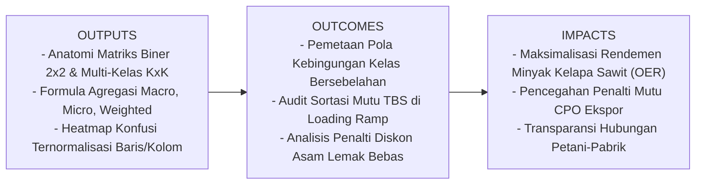
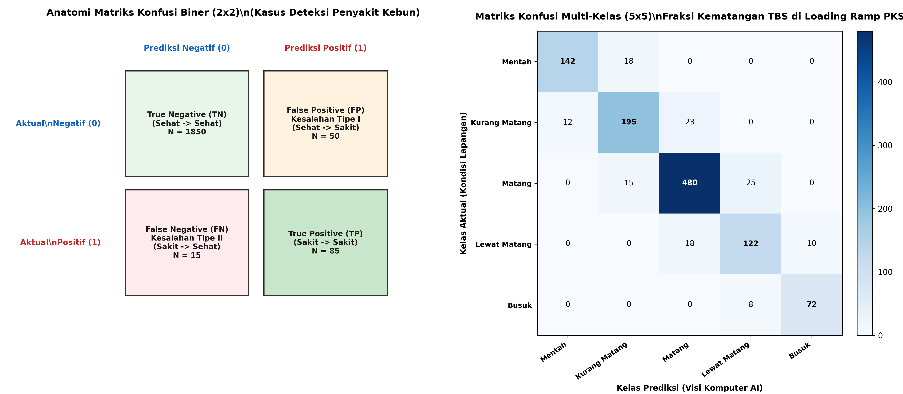
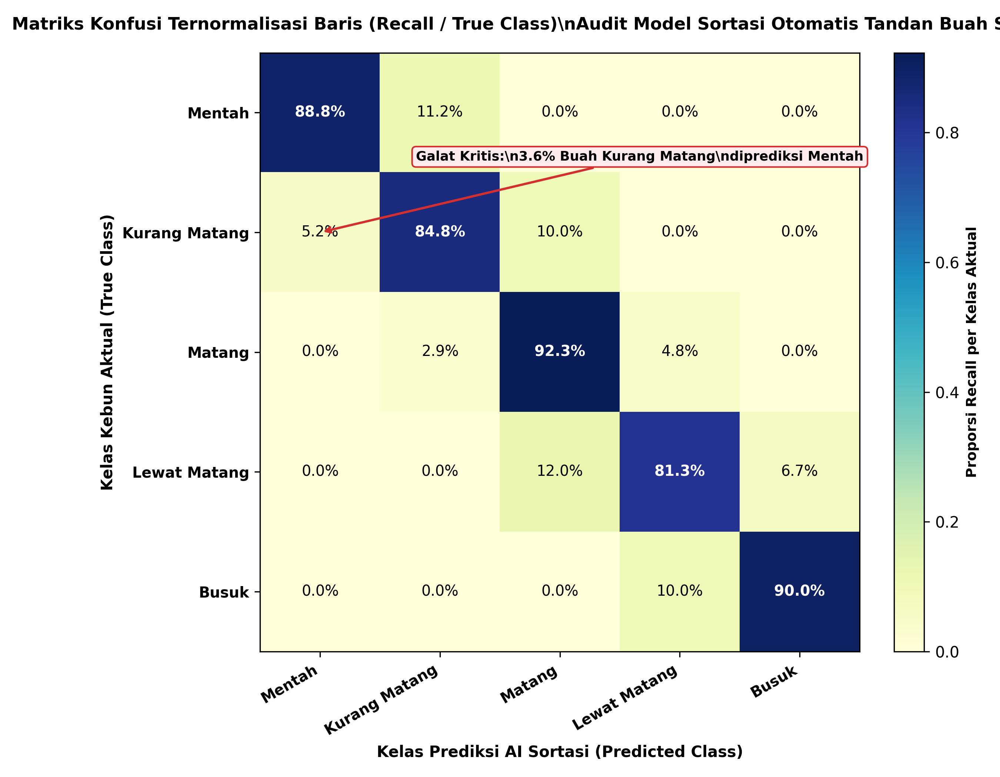

# AI Modul 6.2: Matriks Konfusi (Confusion Matrix) - Anatomi Kesalahan Klasifikasi Biner dan Multi-Kelas

---

## 1. Identitas & Kerangka Capaian Pembelajaran (Sub-CPMK)

* **Kode Modul**        : AI Modul 6.2
* **Mata Kuliah**       : Kecerdasan Buatan dan Sains Data Pertanian Presisi
* **Alokasi Waktu**     : 2 x 50 Menit (Kajian Teori & Diskusi) + 2 x 50 Menit (Eksplorasi Praktikum Mandiri)
* **Beban SKS**         : 3 SKS
* **Prasyarat**         : AI Modul 6.1 (Evaluasi Klasifikasi Dasar)
* **Level Kognitif**    : C2 (Memahami), C3 (Menerapkan), C4 (Menganalisis)

### 1.1 Capaian Pembelajaran Khusus (Sub-CPMK)
Setelah menyelesaikan modul ini, mahasiswa dan pembelajar diharapkan mampu:
1. **Membedah (C2)** anatomi matriks kontinjensi $2 	imes 2$ (Biner) dan $K 	imes K$ (Multi-Kelas) dengan mengidentifikasi posisi diagonal utama dan elemen di luar diagonal (*off-diagonal*).
2. **Mengevaluasi (C4)** klasifikasi multi-kelas dengan menghitung presisi, recall, dan skor F1 per kelas individual pada kasus sortasi fraksi kematangan TBS kelapa sawit.
3. **Menerapkan (C3)** tiga strategi agregasi global (*Macro-Averaging*, *Micro-Averaging*, dan *Weighted-Averaging*) pada data agro-industri dengan distribusi kelas tidak seimbang.
4. **Menginterpretasikan (C4)** matriks konfusi ternormalisasi baris vs kolom untuk mengaudit kinerja operasional sistem sortasi TBS di pabrik kelapa sawit (PKS).

### 1.2 Kerangka Hasil Pembelajaran (Outputs, Outcomes, & Impacts)
* **Outputs (Keluaran Berwujud Langsung)**:
  * Visualisasi *heatmap* matriks konfusi ternormalisasi baris dan kolom hasil prediksi kematangan buah sawit.
  * Tabel perbandingan metrik per kelas beserta kalkulasi agregasi *Macro*, *Micro*, dan *Weighted*.
  * Skrip Python yang menghitung matriks penalti finansial riil berdasarkan perkalian Hadamard antara matriks konfusi dan matriks biaya.
* **Outcomes (Hasil Capaian & Perubahan Kompetensi)**:
  * Mahasiswa terampil mengidentifikasi galat kelas bersebelahan (*adjacent class errors*) yang umum terjadi pada data ordinal pertanian.
  * Mahasiswa mampu membedakan secara kritis kapan harus melaporkan skor *Macro* vs *Weighted* kepada pemangku kepentingan industri.
  * Mahasiswa memiliki kemampuan menerjemahkan visualisasi konfusi menjadi rekomendasi rekayasa sistem visi komputer di pabrik.
* **Impacts (Dampak Jangka Panjang & Nilai Guna Luas)**:
  * Peningkatan rendemen minyak kelapa sawit (*Oil Extraction Rate* / OER) di PKS melalui eliminasi buah mentah yang masuk ke stasiun perebusan.
  * Penurunan kadar asam lemak bebas (*Free Fatty Acid* / FFA) pada minyak sawit mentah (CPO) berkat penanganan presisi buah lewat matang.

---

## 2. Arsitektur Matriks Konfusi Biner (2x2)

Dalam klasifikasi biner—seperti diagnosis kesehatan pohon (Sakit vs Sehat)—matriks konfusi berukuran $2 \times 2$ menyajikan empat kuadran fundamental.

*Gambar 6.2.1: Anatomi Struktur Matriks Konfusi Biner (2x2) pada Deteksi Penyakit Kebun dan Matriks Konfusi Multi-Kelas (5x5) pada Fraksi Kematangan TBS.*

### 2.1 Dekonstruksi Empat Kuadran Biner
Sebagaimana ditunjukkan pada Gambar 6.2.1 (sisi kiri), konvensi standar baku menempatkan **Kelas Aktual pada Sumbu Baris (Vertikal)** dan **Kelas Prediksi pada Sumbu Kolom (Horizontal)**:

1. **Positif Benar (*True Positive* - $TP$):**  
   Pohon sakit yang berhasil diprediksi sakit oleh model. Ini adalah keberhasilan deteksi proteksi tanaman.
2. **Negatif Benar (*True Negative* - $TN$):**  
   Pohon sehat yang diprediksi sehat oleh model. Ini adalah keberhasilan menjaga efisiensi agar pohon sehat tidak diganggu.
3. **Positif Salah (*False Positive* - $FP$ / Kesalahan Tipe I):**  
   Pohon sehat yang keliru divonis sakit oleh model. Dampak: Alarm palsu (*False Alarm*), pemborosan bahan kimia agronomi.
4. **Negatif Salah (*False Negative* - $FN$ / Kesalahan Tipe II):**  
   Pohon sakit yang keliru dilabeli sehat oleh model. Dampak: Kasus lolos (*Missed Case*), risiko penularan spora jamur mematikan ke pokok sekelilingnya.

### 2.2 Jumlah Marjinal Baris dan Kolom
Jumlah marjinal memberikan informasi mengenai distribusi kelas:
- **Total Sampel Positif Aktual ($P$):**
  $$P = TP + FN$$
- **Total Sampel Negatif Aktual ($N_{\text{neg}}$):**
  $$N_{\text{neg}} = TN + FP$$
- **Total Prediksi Positif ($\hat{P}$):**
  $$\hat{P} = TP + FP$$
- **Total Prediksi Negatif ($\hat{N}_{\text{neg}}$):**
  $$\hat{N}_{\text{neg}} = TN + FN$$

---

## 3. Matriks Konfusi Multi-Kelas ($K \times K$)

Pada permasalahan dunia nyata di industri kelapa sawit, target klasifikasi jarang bersifat biner sederhana. Sebagai contoh, di stasiun penerimaan buah (*loading ramp*) Pabrik Kelapa Sawit (PKS), Tandan Buah Segar (TBS) disortasi ke dalam $5$ fraksi kematangan berdasarkan standar agronomi PPKS:
1. **Fraksi 00 & 0 (Mentah / *Unripe*):** Brondolan tidak ada yang lepas ($0\%$). Kandungan minyak sangat rendah, ALB rendah.
2. **Fraksi 1 (Kurang Matang / *Underripe*):** Kurang dari $12{,}5\%$ brondolan lepas dari janjang luar.
3. **Fraksi 2 & 3 (Matang Sempurna / *Ripe*):** $12{,}5\% - 75\%$ brondolan lepas. Rendemen minyak (OER) maksimal, mutu premium.
4. **Fraksi 4 (Lewat Matang / *Overripe*):** Lebih dari $75\%$ brondolan lepas. ALB mulai naik tinggi.
5. **Fraksi 5 (Busuk / *Empty Bunch / Rotten*):** Buah membusuk di piringan atau tergenang air parit kebun, ALB melonjak $> 5\%$.

### 3.1 Notasi Matematika Matriks Multi-Kelas
Untuk $K$ kelas unik ($K = 5$), matriks konfusi $C \in \mathbb{R}^{K \times K}$ didefinisikan sedemikian rupa sehingga elemen $C_{ij}$ menyatakan **jumlah sampel kelas aktual $i$ yang diprediksi oleh model sebagai kelas $j$**:

$$C = \begin{bmatrix}
C_{11} & C_{12} & \cdots & C_{1K} \\
C_{21} & C_{22} & \cdots & C_{2K} \\
\vdots & \vdots & \ddots & \vdots \\
C_{K1} & C_{K2} & \cdots & C_{KK}
\end{bmatrix}$$

**Keterangan Simbol:**
- $C_{ij}$: Cacah observasi di mana kelas aktual adalah $i$ (baris ke-$i$) dan hasil prediksi model adalah $j$ (kolom ke-$j$).
- $C_{ii}$ (*Diagonal Utama*): Jumlah sampel kelas $i$ yang diprediksi dengan benar sebagai kelas $i$.
- $C_{ij}$ dengan $i \ne j$ (*Elemen Luar Diagonal*): Frekuensi terjadinya kesalahan klasifikasi (*misclassifications*).

> **Cara Membaca Notasi Matriks:**  
> *Matriks konfusi C berukuran K kali K memuat elemen C sub i j yang menyatakan banyaknya sampel kelas aktual i yang diprediksi sebagai kelas j.*

### 3.2 Formulasi Metrik Presisi dan Recall per Kelas Individual
Dalam kerangka multi-kelas, setiap kelas $k$ dapat diposisikan sebagai "Kelas Positif", sedangkan seluruh $K-1$ kelas lainnya diperlakukan sebagai "Kelas Negatif" (*One-vs-Rest Approach*):

#### Presisi Kelas $k$ ($\text{Precision}_k$):
Rasio prediksi benar kelas $k$ terhadap seluruh prediksi yang dituduhkan sebagai kelas $k$ (penjumlahan kolom ke-$k$):

$$\text{Precision}_k = \frac{C_{kk}}{\sum_{i=1}^K C_{ik}}$$

**Keterangan Simbol:**
- $\text{Precision}_k$: Tingkat ketepatan prediksi untuk kategori kelas ke-$k$.
- $C_{kk}$: Elemen diagonal utama pada baris $k$ dan kolom $k$ (prediksi benar kelas $k$).
- $\sum_{i=1}^K C_{ik}$: Jumlah seluruh elemen pada kolom ke-$k$ (total seluruh sampel yang diprediksi sebagai kelas $k$).

> **Cara Membaca Rumus:**  
> *Presisi kelas k sama dengan C sub k k dibagi dengan jumlah dari i sama dengan satu sampai K untuk seluruh elemen C sub i k pada kolom k.*

#### Sensitivitas / Recall Kelas $k$ ($\text{Recall}_k$):
Rasio prediksi benar kelas $k$ terhadap seluruh sampel aktual yang memang tergolong kelas $k$ (penjumlahan baris ke-$k$):

$$\text{Recall}_k = \frac{C_{kk}}{\sum_{j=1}^K C_{kj}}$$

**Keterangan Simbol:**
- $\text{Recall}_k$: Laju keberhasilan mendeteksi sampel aktual kelas ke-$k$.
- $C_{kk}$: Elemen diagonal utama pada baris $k$ dan kolom $k$.
- $\sum_{j=1}^K C_{kj}$: Jumlah seluruh elemen pada baris ke-$k$ (total sampel aktual kelas $k$ di lapangan).

> **Cara Membaca Rumus:**  
> *Recall kelas k sama dengan C sub k k dibagi dengan jumlah dari j sama dengan satu sampai K untuk seluruh elemen C sub k j pada baris k.*

---

## 4. Tiga Strategi Agregasi Metrik Multi-Kelas: Macro, Micro, dan Weighted

Ketika mempresentasikan performa sistem sortasi buah kebun kepada manajemen direksi, kita membutuhkan angka ringkasan tunggal. Namun, merata-ratakan metrik antar-kelas menuntut ketelitian metode agregasi:

### 4.1 Rata-Rata Makro (*Macro-Averaging*)
Menghitung nilai metrik (misal Presisi atau Recall) secara independen untuk masing-masing kelas, kemudian menghitung rerata aritmetika sederhananya:

$$\text{Macro-Precision} = \frac{1}{K}\sum_{k=1}^K \text{Precision}_k$$

$$\text{Macro-Recall} = \frac{1}{K}\sum_{k=1}^K \text{Recall}_k$$

**Keterangan Simbol:**
- $\text{Macro-Precision}$: Nilai presisi makro rata-rata dari seluruh kelas.
- $K$: Jumlah total kelas kategori ($K=5$ pada sortasi TBS).
- $\text{Precision}_k$: Presisi individual kelas ke-$k$.

> **Cara Membaca Rumus:**  
> *Presisi makro sama dengan satu per K dikalikan jumlah dari k sama dengan satu sampai K untuk presisi kelas k.*

- **Karakteristik & Penggunaan Tepat:**  
  *Macro-averaging* memberikan **bobot kepentingan yang setara kepada setiap kelas**, tanpa memandang apakah kelas tersebut memiliki $1.000$ sampel atau hanya $10$ sampel. Metode ini sangat ideal apabila kita ingin menguji apakah model AI memiliki performa yang adil pada kelas langka (misalnya kelas "Buah Busuk" yang populasinya sedikit namun berdampak destruktif terhadap asam lemak bebas).

### 4.2 Rata-Rata Mikro (*Micro-Averaging*)
Mengumpulkan (*pooling*) seluruh elemen $TP$, $FP$, dan $FN$ dari seluruh kelas secara global terlebih dahulu, kemudian menghitung metriknya:

$$\text{Micro-Precision} = \frac{\sum_{k=1}^K C_{kk}}{\sum_{k=1}^K \sum_{i=1}^K C_{ik}} = \frac{\text{Total Prediksi Benar}}{\text{Total Seluruh Sampel}} = \text{Overall Accuracy}$$

$$\text{Micro-Recall} = \frac{\sum_{k=1}^K C_{kk}}{\sum_{k=1}^K \sum_{j=1}^K C_{kj}} = \text{Overall Accuracy}$$

**Keterangan Simbol:**
- $\sum_{k=1}^K C_{kk}$: Jumlah total seluruh elemen pada diagonal utama matriks konfusi.
- Pembagi ganda: Total seluruh observasi dalam dataset pengujian ($N$).

> **Cara Membaca Rumus:**  
> *Presisi mikro sama dengan jumlah C sub k k dari k sama dengan satu sampai K, dibagi dengan total keseluruhan elemen matriks konfusi.*

- **Karakteristik & Penggunaan Tepat:**  
  Pada klasifikasi multi-kelas eksklusif tunggal, nilai *Micro-Precision*, *Micro-Recall*, dan *Akurasi Global* bernilai identik persis. Metrik mikro sangat dipengaruhi oleh performa pada **kelas mayoritas**. Jika model sangat mahir menebak buah matang (kelas dominan) namun buta terhadap buah mentah, skor mikro tetap akan tampak sangat tinggi.

### 4.3 Rata-Rata Terbobot (*Weighted-Averaging*)
Menghitung rata-rata metrik di mana kontribusi setiap kelas diboboti secara proporsional berdasarkan jumlah sampel aktualnya (*support* $N_k$):

$$\text{Weighted-Precision} = \sum_{k=1}^K \left(\frac{N_k}{N}\right) \text{Precision}_k$$

$$\text{Weighted-Recall} = \sum_{k=1}^K \left(\frac{N_k}{N}\right) \text{Recall}_k$$

**Keterangan Simbol:**
- $N_k$: Jumlah sampel aktual untuk kelas ke-$k$ ($N_k = \sum_{j=1}^K C_{kj}$).
- $N$: Total seluruh sampel pengujian ($N = \sum_{k=1}^K N_k$).
- $\frac{N_k}{N}$: Bobot fraksi frekuensi relatif kelas ke-$k$ terhadap populasi.

> **Cara Membaca Rumus:**  
> *Presisi terbobot sama dengan jumlah dari k sama dengan satu sampai K untuk hasil kali fraksi N sub k per N dengan presisi kelas k.*

---

## 5. Matriks Konfusi Ternormalisasi (Normalized Confusion Matrix)

Menampilkan angka cacah absolut pada matriks konfusi sering kali mengaburkan wawasan diagnostik jika jumlah sampel antar-kelas timpang (misal kelas Matang berjumlah $520$ tandan sedangkan kelas Busuk hanya $80$ tandan).

*Gambar 6.2.2: Matriks Konfusi Ternormalisasi Baris (Recall) untuk Evaluasi Sistem Penglihatan Komputer Sortasi TBS di Pabrik Kelapa Sawit.*

### 5.1 Normalisasi Baris (*Row Normalization / Recall Matrix*)
Setiap elemen dibagi dengan jumlah total barisnya. Nilai pada baris ke-$i$ merepresentasikan persentase distribusi prediksi untuk kelas aktual $i$:

$$C^{\text{row\_norm}}_{ij} = \frac{C_{ij}}{\sum_{k=1}^K C_{ik}}$$

**Keterangan Simbol:**
- $C^{\text{row\_norm}}_{ij}$: Proporsi probabilitas empiris bahwa sampel dari kelas aktual $i$ akan diprediksi sebagai kelas $j$.
- Elemen diagonal $C^{\text{row\_norm}}_{ii}$: Nilai Sensitivitas / Recall dari kelas ke-$i$.
- Sifat matematis: Penjumlahan nilai sepanjang setiap baris selalu tepat sama dengan $1{,}0$ ($100\%$).

> **Cara Membaca Rumus:**  
> *Elemen ternormalisasi baris C sub i j sama dengan C sub i j dibagi dengan jumlah seluruh elemen C sub i k pada baris ke-i.*

### 5.2 Normalisasi Kolom (*Column Normalization / Precision Matrix*)
Setiap elemen dibagi dengan jumlah total kolomnya:

$$C^{\text{col\_norm}}_{ij} = \frac{C_{ij}}{\sum_{k=1}^K C_{kj}}$$

- Elemen diagonal $C^{\text{col\_norm}}_{jj}$: Nilai Presisi dari kelas ke-$j$.
- Sifat matematis: Penjumlahan nilai sepanjang setiap kolom selalu tepat sama dengan $1{,}0$ ($100\%$).

---

## 6. Analisis Galat Diagonal dan Deteksi Pola Kebingungan (Confusion Patterns)

Dalam konteks kecerdasan buatan perkebunan presisi, tidak semua kesalahan klasifikasi memiliki derajat keparahan yang sama:

### 6.1 Galat Kelas Bersebelahan (*Adjacent Class Errors*)
Perhatikan Gambar 6.2.2:
- Sebanyak $7{,}7\%$ buah *Kurang Matang* diprediksi sebagai *Matang* ($C_{23}$).
- Sebanyak $4{,}8\%$ buah *Matang* diprediksi sebagai *Lewat Matang* ($C_{34}$).

Kekeliruan antar-kelas yang bersebelahan secara ordinal adalah **galat wajar dan dapat ditoleransi secara biologis**. Batas transisi warna antara buah kurang matang (oranye kemerahan) dan matang sempurna (merah jingga tua) memiliki variasi spektral alami akibat sudut pencahayaan matahari dan bayangan pelepah di loading ramp.

### 6.2 Galat Non-Bersebelahan Kritis (*Severe Non-Adjacent Errors*)
Sebaliknya, jika terdapat angka signifikan pada elemen yang jauh dari diagonal utama:
- Misal: Buah *Mentah* (hitam keunguan pekat) diprediksi sebagai *Matang Sempurna* ($C_{13} > 0$).
- Atau: Buah *Busuk* (berjamur putih/kehitaman lembek) diprediksi sebagai *Matang* ($C_{53} > 0$).

Galat non-bersebelahan mengindikasikan **kerusakan fatal pada representasi fitur citra model**—misalnya kamera konveyor mengalami saturasi cahaya (*overexposure*), sensor lensa terkena percikan lumpur parit, atau model mengalami kegagalan ekstraksi tekstur permukaan brondolan.

---

## 7. Rangkuman Komprehensif

1. **Matriks Konfusi adalah Peta Diagnostik:** Matriks konfusi menyediakan visibilitas menyeluruh atas pola persebaran prediksi model, mengungkap kesalahan spesifik yang tidak dapat dideteksi oleh metrik akurasi tunggal.
2. **Diagonal Utama adalah Kebenaran:** Kinerja model yang sempurna dicirikan oleh konsentrasi nilai $100\%$ hanya pada garis diagonal utama ($C_{ii}$), dengan seluruh elemen di luar diagonal bernilai nol.
3. **Macro vs Micro vs Weighted:**
   - Gunakan **Macro** saat mengevaluasi keadilan model terhadap kelas minoritas yang kritis (seperti deteksi penyakit langka atau buah busuk).
   - Gunakan **Weighted** untuk mengestimasi dampak finansial rata-rata pada kondisi operasional kebun sehari-hari.
   - Pahami bahwa **Micro** identik dengan akurasi global dan bias terhadap kelas mayoritas.
4. **Analisis Pola Ordinal TBS:** Pada data agribisnis bertingkat ordinal (kematangan buah atau tingkat serangan hama), fokuskan perbaikan model pada eliminasi galat non-bersebelahan yang berdampak langsung pada penalti diskon harga CPO.

---

## 8. Latihan Soal dan Tantangan HOTS (Higher-Order Thinking Skills)

### 8.1 Evaluasi Kritis Matriks Multi-Kelas Sortasi PKS (Bobot: 40%)
Sebuah sistem kamera kecerdasan buatan dipasang pada konveyor pemilah tandan buah segar di PKS PT Sawit Makmur Sejahtera. Sistem diuji pada $1.000$ tandan buah dengan matriks konfusi hasil evaluasi sebagai berikut:

| Kelas Aktual \ Prediksi | Mentah ($M$) | Kurang Matang ($KM$) | Matang ($MT$) | Lewat Matang ($LM$) |
| :--- | :---: | :---: | :---: | :---: |
| **Mentah ($M$)** | **180** | 15 | 5 | 0 |
| **Kurang Matang ($KM$)** | 20 | **230** | 40 | 10 |
| **Matang ($MT$)** | 0 | 25 | **380** | 15 |
| **Lewat Matang ($LM$)** | 0 | 0 | 15 | **65** |

**Instruksi Analitis:**
1. Hitung nilai Presisi dan Recall untuk masing-masing dari keempat kelas di atas!
2. Hitung nilai **Macro-Precision** dan **Weighted-Precision** dari sistem sortasi tersebut! Jelaskan mengapa kedua nilai tersebut menghasilkan angka yang berbeda!
3. Identifikasi galat klasifikasi yang paling berbahaya bagi efisiensi ekstraksi minyak (OER) di pabrik dan tunjukkan sel matriks mana yang merepresentasikannya!

---

### 8.2 Rancang Bangun Matriks Biaya Finansial Berbobot Multi-Kelas (Bobot: 60%)
Manajemen PKS menetapkan matriks penalti kerugian operasional (dalam Rupiah per tandan) untuk setiap jenis kesalahan klasifikasi buah:

| Kelas Aktual \ Prediksi | Prediksi Mentah | Prediksi Kurang Matang | Prediksi Matang | Prediksi Lewat Matang |
| :--- | :---: | :---: | :---: | :---: |
| **Aktual Mentah** | Rp 0 | Rp 15.000 | **Rp 120.000** | Rp 80.000 |
| **Aktual Kurang Matang** | Rp 10.000 | Rp 0 | Rp 40.000 | Rp 30.000 |
| **Aktual Matang** | Rp 50.000 | Rp 20.000 | Rp 0 | Rp 15.000 |
| **Aktual Lewat Matang** | Rp 10.000 | Rp 15.000 | **Rp 90.000** | Rp 0 |

*Catatan: Kesalahan memprediksi buah Mentah sebagai Matang didenda Rp 120.000 karena brondolan tidak terpipil dan merusak mesin thresher; kesalahan memprediksi buah Lewat Matang sebagai Matang didenda Rp 90.000 karena menaikkan asam lemak bebas (ALB).*

**Tugas Mahasiswa:**
1. Berdasarkan matriks konfusi pada Soal 8.1 dan matriks penalti biaya di atas, hitunglah **Total Kerugian Finansial Harian** yang ditimbulkan oleh kesalahan model AI tersebut pada $1.000$ tandan buah!
2. Sumber kesalahan manakah (pasangan aktual-prediksi apa) yang menyumbangkan porsi kerugian finansial terbesar bagi pabrik?
3. Sebagai konsultan AI perkebunan, berikan 2 rekomendasi teknis intervensi visi komputer untuk menekan kesalahan terbesar tersebut!

---

## 9. Glosarium Istilah Teknis

1. **Confusion Matrix (Matriks Konfusi):** Tabel kontinjensi yang memvisualisasikan perbandingan silang antara label kelas aktual dengan label hasil prediksi algoritma pembelajaran mesin.
2. **Main Diagonal (Diagonal Utama):** Deretan sel matriks dari sudut kiri atas ke sudut kanan bawah ($C_{ii}$) yang memuat jumlah seluruh prediksi yang benar secara faktual.
3. **Off-Diagonal Elements (Elemen Luar Diagonal):** Sel-sel matriks di luar garis diagonal utama yang mencatat seluruh frekuensi terjadinya kesalahan klasifikasi (*misclassifications*).
4. **Macro-Average:** Prosedur agregasi metrik multi-kelas yang menghitung nilai rata-rata tidak berbobot dari metrik individual tiap kelas.
5. **Micro-Average:** Prosedur agregasi multi-kelas yang mengumpulkan seluruh $TP, FP, FN$ global terlebih dahulu sebelum menghitung metrik, merefleksikan akurasi global.
6. **Support:** Jumlah sampel pengamatan aktual yang menjadi anggota dari suatu kelas tertentu di dalam dataset pengujian.
7. **Weighted-Average:** Prosedur agregasi metrik multi-kelas yang memberikan bobot proporsional sesuai rasio populasi sampel (*support*) masing-masing kelas.

---

## 10. Jembatan Konsep (Bridging) ke AI Modul 6.3: Validasi Silang (Cross-Validation)

Melalui modul ini, kita telah menguasai bagaimana mengevaluasi kinerja klasifikasi biner dan multi-kelas secara mendalam menggunakan matriks konfusi dan strategi agregasi makro/mikro. Namun, seluruh matriks konfusi yang kita hitung sejauh ini didasarkan pada **satu kali pemisahan data uji tunggal (*single train-test split*)**.

Bagaimana jika hasil evaluasi yang tampak luar biasa tersebut hanyalah kebetulan statistik karena model kebetulan mendapatkan sampel data uji yang mudah? Bagaimana jika performa model di blok kebun lain yang berbeda topografi justru anjlok drastis?

Pada **AI Modul 6.3: Validasi Silang (Cross-Validation)**, kita akan mempelajari:
- Keterbatasan fatal metode validasi penahanan tunggal (*Hold-Out Validation*).
- Formulasi matematis $K$-Fold Cross Validation dan varians estimasi skor.
- Stratified $K$-Fold untuk menjamin keterwakilan kelas langka pada setiap lipatan.
- *Time-Series Split* dan *Group K-Fold* spasial untuk mencegah kebocoran data runtun waktu sensor cuaca dan blok perkebunan.

---

## 11. Daftar Pustaka dan Referensi Akademik

1. Stehman, S. V. (1997). Selecting and interpreting measures of thematic classification accuracy. *Remote Sensing of Environment*, 62(1), 77-89.
2. Sokolova, M., & Lapalme, G. (2009). A systematic analysis of performance measures for classification tasks. *Information Processing & Management*, 45(4), 427-437.
3. Grandini, M., Bagli, E., & Visani, G. (2020). Metrics for multi-class classification: an overview. *arXiv preprint arXiv:2008.05756*.
4. Pusat Penelitian Kelapa Sawit (PPKS). (2023). *Buku Pintar Mandor Panen dan Standarisasi Fraksi Kematangan Tandan Buah Segar*. Penerbit PPKS Medan.
5. Pedregosa, F., et al. (2011). Scikit-learn: Machine learning in Python. *Journal of Machine Learning Research*, 12, 2825-2830.
