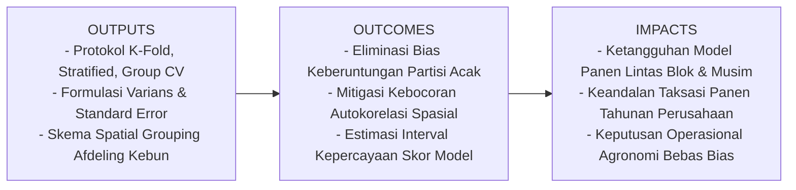
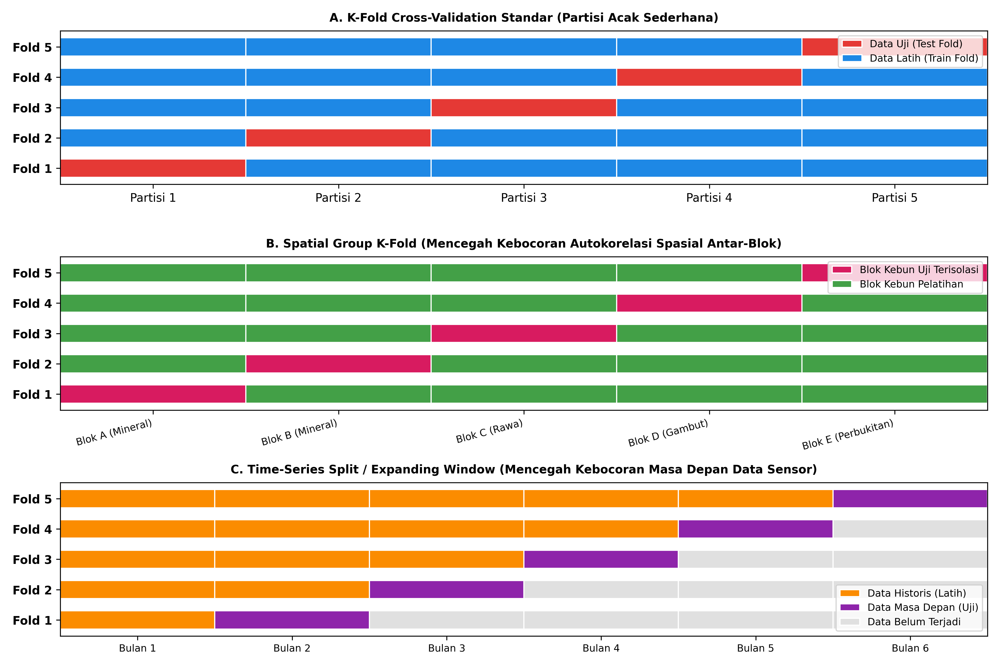
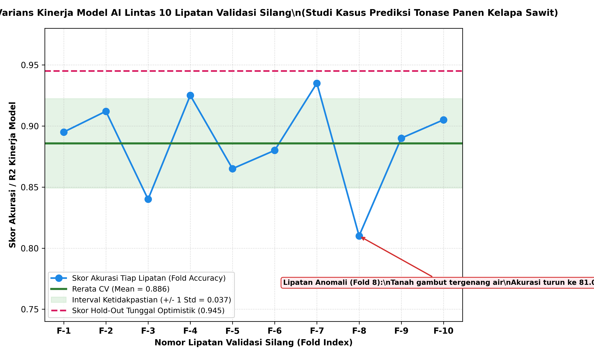

# AI Modul 6.3: Validasi Silang (Cross-Validation) - Protokol Evaluasi Bebas Bias dan Estimasi Varians Kinerja

---

## 1. Identitas & Kerangka Capaian Pembelajaran (Sub-CPMK)

* **Kode Modul**        : AI Modul 6.3
* **Mata Kuliah**       : Kecerdasan Buatan dan Sains Data Pertanian Presisi
* **Alokasi Waktu**     : 2 x 50 Menit (Kajian Teori & Diskusi) + 2 x 50 Menit (Eksplorasi Praktikum Mandiri)
* **Beban SKS**         : 3 SKS
* **Prasyarat**         : AI Modul 6.1 (Evaluasi Model), AI Modul 5.3 (Training & Testing)
* **Level Kognitif**    : C2 (Memahami), C3 (Menerapkan), C4 (Menganalisis)

### 1.1 Capaian Pembelajaran Khusus (Sub-CPMK)
Setelah menuntaskan modul ini secara menyeluruh, mahasiswa dan pembelajar diharapkan mampu:
1. **Mendiagnosis (C4)** keterbatasan skema *Hold-Out* tunggal yang menimbulkan variansi estimasi tinggi dan optimisme semu pada dataset lapangan.
2. **Memformulasikan (C3)** $K$-Fold Cross-Validation dengan menghitung nilai rerata kinerja $\bar{S}$, varians sampel antar-lipatan $s^2_{\text{CV}}$, dan galat baku rata-rata (*Standard Error*).
3. **Menerapkan (C3)** *Stratified K-Fold* pada kasus penyakit tanaman langka untuk mempertahankan proporsi kelas target pada setiap partisi lipatan evaluasi.
4. **Mengisolasi (C4)** kebocoran spasial menggunakan *Spatial Group K-Fold* guna memblokir autokorelasi spasial antar-petak kebun, serta *Time-Series Split* untuk mencegah kebocoran informasi masa depan (*look-ahead bias*).
5. **Membangun (C3)** protokol validasi silang bersarang (*Nested Cross-Validation*) untuk memisahkan optimasi hiperparameter dari pengujian generalisasi model.

### 1.2 Kerangka Hasil Pembelajaran (Outputs, Outcomes, & Impacts)
* **Outputs (Keluaran Berwujud Langsung)**:
  * Diagram arsitektur partisi lipatan *K-Fold*, *Stratified K-Fold*, dan *Spatial Group K-Fold*.
  * Modul skrip Python yang mengeksekusi validasi silang bersarang dan perbandingan varians skor antar-skema partisi.
  * Laporan analisis diagnostik varians skor lintas lipatan beserta estimasi interval kepercayaan $\bar{S} \pm 2 \cdot \text{SE}(\bar{S})$.
* **Outcomes (Hasil Capaian & Perubahan Kompetensi)**:
  * Mahasiswa terampil memilih skema partisi data yang sesuai dengan karakteristik spasial dan temporal perkebunan.
  * Mahasiswa mampu mendeteksi dan mengeliminasi risiko kebocoran data (*data leakage*) akibat keterdekatan geografis sampel kebun.
  * Mahasiswa menguasai perhitungan galat baku untuk menentukan apakah sebuah model layak dioperasikan secara komersial.
* **Impacts (Dampak Jangka Panjang & Nilai Guna Luas)**:
  * Terwujudnya sistem taksasi panen kelapa sawit yang tangguh dan akurat saat dioperasikan di blok-blok baru yang belum pernah disampel.
  * Menghindari kerugian investasi jutaan rupiah akibat kegagalan generalisasi model AI saat menghadapi variasi iklim dan topografi lahan.

---

## 2. Keterbatasan Fatal Validasi Penahanan Tunggal (Hold-Out Validation)

Metode pemisahan data penahanan tunggal (*Single Hold-Out Validation* / pemisahan $70:30$ atau $80:20$) membagi dataset menjadi satu himpunan latih dan satu himpunan uji:

1. **Sensitivitas Ekstrem terhadap Partisi Acak (*High Variance of the Estimate*):**  
   Jika seed acak diubah dari `random_state=42` menjadi `random_state=123`, nilai skor akurasi atau $R^2$ dapat bergeser drastis (misal dari $88\%$ melonjak ke $94\%$ atau anjlok ke $79\%$). Insinyur AI tidak dapat mengetahui apakah modelnya yang superior ataukah partisi data ujinya yang kebetulan memuat sampel-sampel yang sangat mudah ditebak.
2. **Pemborosan Data (*Data Starvation*):**  
   Pada penelitian agronomi presisi di mana sampel pohon sangat terbatas (misal $150$ sampel pohon uji coba pemupukan mikronutrien), menyisihkan $30\%$ data ($45$ pohon) semata-mata untuk pengujian akan mengurangi data pelatihan model secara signifikan, melemahkan kekuatan statistik algoritma.
3. **Optimisme Semu (*Data Leakage Bias*):**  
   Jika proses penyetelan hiperparameter (*hyperparameter tuning*) dilakukan berulang kali pada data uji yang sama, data uji tersebut secara tidak langsung telah "mengontaminasi" keputusan arsitektur model, menghilangkan independensi evaluasi.

---

## 3. Formulasi Matematis K-Fold Cross-Validation Standar

Untuk mengatasi kelemahan metode penahanan tunggal, Seymour Geisser (1975) dan Mervyn Stone (1974) merumuskan protokol **$K$-Fold Cross-Validation**:

*Gambar 6.3.1: Komparasi Tiga Arsitektur Validasi Silang: K-Fold Acak Standar, Spatial Group K-Fold (Isolasi Blok Kebun), dan Time-Series Split (Jendela Berkembang Historis).*

### 3.1 Prosedur Eksekusi
1. Dataset lengkap $\mathcal{D}$ yang berukuran $N$ sampel diacak dan dipartisi menjadi $K$ subset (lipatan / *folds*) berukuran setara dan saling lepas:
   $$\mathcal{D} = \mathcal{D}_1 \cup \mathcal{D}_2 \cup \dots \cup \mathcal{D}_K, \quad \mathcal{D}_i \cap \mathcal{D}_j = \emptyset \quad (\forall i \ne j)$$
2. Proses pelatihan dan pengujian diulang sebanyak $K$ iterasi. Pada iterasi ke-$k$:
   - Lipatan $\mathcal{D}_k$ diisolasi secara ketat sebagai **Himpunan Uji (*Test Fold*)**.
   - Gabungan $K-1$ lipatan lainnya $(\mathcal{D} \setminus \mathcal{D}_k)$ dijadikan **Himpunan Latih (*Train Fold*)**.
   - Model dilatih pada himpunan latih dan dievaluasi pada $\mathcal{D}_k$, menghasilkan metrik kinerja skalar $S_k$ (misal Akurasi, $F_1$, atau $R^2$).

### 3.2 Formulasi Rerata Estimasi Kinerja ($\bar{S}$)
Nilai performa generalisasi akhir dihitung sebagai nilai rata-rata dari seluruh $K$ lipatan pengujian:

$$\bar{S} = \frac{1}{K}\sum_{k=1}^K S_k$$

**Keterangan Simbol:**
- $\bar{S}$: Rerata skor performa validasi silang (*Cross-Validation Mean Score*).
- $K$: Jumlah total lipatan partisi (standar industri: $K=5$ atau $K=10$).
- $S_k$: Skor metrik evaluasi yang diperoleh pada lipatan uji ke-$k$.
- $\sum_{k=1}^K$: Penjumlahan skor dari lipatan pertama ($k=1$) hingga lipatan terakhir ($k=K$).

> **Cara Membaca Rumus:**  
> *Skor rerata S bar sama dengan satu per K dikalikan jumlah dari k sama dengan satu sampai K untuk nilai skor S sub k.*

### 3.3 Formulasi Varians Sampel Lipatan ($s^2_{\text{CV}}$) dan Galat Baku
Kekuatan sejati validasi silang adalah kemampuannya menyediakan estimasi **stabilitas atau varians kinerja model**:

$$s^2_{\text{CV}} = \frac{1}{K-1}\sum_{k=1}^K (S_k - \bar{S})^2$$

$$\text{SE}(\bar{S}) = \frac{s_{\text{CV}}}{\sqrt{K}} = \sqrt{\frac{1}{K(K-1)}\sum_{k=1}^K (S_k - \bar{S})^2}$$

**Keterangan Simbol:**
- $s^2_{\text{CV}}$: Varians sampel dari skor-skor lipatan validasi silang.
- $s_{\text{CV}}$: Deviasi standar (*Standard Deviation*) performa model lintas lipatan.
- $\text{SE}(\bar{S})$: Galat baku rata-rata (*Standard Error of the Mean*).
- $K-1$: Derajat kebebasan koreksi Bessel.

> **Cara Membaca Rumus:**  
> *Varians s kuadrat CV sama dengan satu per K minus satu dikalikan jumlah selisih kuadrat S sub k minus S bar; dan galat baku SE sama dengan s sub CV dibagi akar kuadrat K.*

*Gambar 6.3.2: Fluktuasi Skor Lintas 10 Lipatan Validasi Silang pada Prediksi Produktivitas Kebun, Memperlihatkan Interval Ketidakpastian dan Lipatan Anomali.*

Sebagaimana terlihat pada Gambar 6.3.2, skor hold-out tunggal sering kali memberikan estimasi optimis semu ($94{,}5\%$). Validasi silang mengungkap realitas sejati model dengan performa rata-rata $88{,}9\%$ dan mendeteksi anomali pada Lipatan ke-8 ($81{,}0\%$) di mana tanah gambut tergenang menurunkan performa model.

---

## 4. Stratified K-Fold Cross-Validation

Pada permasalahan klasifikasi dengan ketidakseimbangan kelas ekstrem—seperti deteksi pohon terinfeksi Ganoderma ($4\%$) atau serangan ulat api ($1\%$)—partisi acak murni pada $K$-Fold biasa berisiko menciptakan partisi lipatan yang **sama sekali tidak memuat sampel kelas minoritas (*Zero-Positive Fold Trap*)**.

### 4.1 Formulasi Kondisi Stratifikasi
Algoritma **Stratified $K$-Fold** mempartisi data sedemikian rupa sehingga rasio proporsi setiap kelas target $c$ pada setiap lipatan ke-$k$ dijaga agar identik dengan rasio kelas pada populasi dataset lengkap:

$$\frac{n_{k, c}}{n_k} \approx \frac{N_c}{N} \quad \forall k \in \{1, \dots, K\}, \, \forall c \in \{1, \dots, C\}$$

**Keterangan Simbol:**
- $n_{k, c}$: Jumlah sampel kelas ke-$c$ pada lipatan uji ke-$k$.
- $n_k$: Jumlah total seluruh sampel yang dialokasikan ke dalam lipatan ke-$k$.
- $N_c$: Jumlah total sampel kelas ke-$c$ pada keseluruhan dataset.
- $N$: Jumlah total seluruh sampel pengamatan dalam dataset.
- $C$: Jumlah total kelas unik.

> **Cara Membaca Rumus:**  
> *Proporsi n sub k koma c dibagi n sub k mendekati N sub c dibagi N, berlaku untuk setiap lipatan k dan setiap kelas c.*

---

## 5. Metode Ekstrem: Leave-One-Out (LOOCV) vs Repeated K-Fold

### 5.1 Leave-One-Out Cross-Validation (LOOCV)
LOOCV adalah kasus batas matematis dari $K$-Fold di mana nilai $K$ ditetapkan sama persis dengan jumlah total observasi ($K = N$):
- Pada setiap iterasi, tepat **satu observasi tunggal** dijadikan data uji, dan $N-1$ observasi lainnya dijadikan data latih.
- Model dilatih dan diuji sebanyak $N$ kali berturut-turut:

$$\text{CV}_{(N)} = \frac{1}{N}\sum_{i=1}^N L\Big(y_i, \hat{f}^{(-i)}(\mathbf{x}_i)\Big)$$

**Keterangan Simbol:**
- $\text{CV}_{(N)}$: Estimator galat LOOCV.
- $N$: Total sampel pengamatan.
- $L(y_i, \hat{y}_i)$: Fungsi kerugian (*loss function*, misal selisih kuadrat $(y_i - \hat{y}_i)^2$).
- $\hat{f}^{(-i)}$: Fungsi model yang dilatih pada data lengkap **tanpa menyertakan sampel ke-$i$**.

> **Cara Membaca Rumus:**  
> *Galat CV indeks N sama dengan satu per N dikalikan jumlah dari i sama dengan satu sampai N untuk fungsi loss antara y sub i dengan prediksi model f bertopi minus i terhadap x sub i.*

- **Kelebihan:** Hampir tidak memiliki bias (*nearly unbiased estimator*) karena ukuran himpunan latih pada setiap iterasi ($N-1$) sangat mendekati $N$.
- **Kelemahan Fatal:**
  1. *Kompleksitas Komputasi Raksasa:* Jika kita memiliki $100.000$ baris data sensus satelit kebun, model harus dilatih $100.000$ kali!
  2. *Varians Estimator Tinggi:* Seluruh $N$ model yang dilatih memiliki $N-2$ sampel latih yang saling tumpang-tindih (korelasi antar-model mendekati $1{,}0$).

### 5.2 Repeated K-Fold Cross-Validation
Melakukan prosedur $K$-Fold standar sebanyak $R$ kali replikasi dengan pengacakan *seed* yang berbeda pada setiap replikasi (misal $5\text{-Fold}$ diulang $10$ kali = $50$ kali pelatihan model):
- Menghasilkan estimasi $\bar{S}$ yang jauh lebih stabil dan mempersempit interval kepercayaan galat baku.

---

## 6. Protokol Validasi Khusus Domain Pertanian Presisi

Mengabaikan karakteristik intrinsik data agribisnis saat melakukan validasi silang adalah penyebab nomor satu model AI gagal total saat diterapkan di perkebunan:

### 6.1 Spatial Group K-Fold: Menjinakkan Hukum Tobler
Hukum Pertama Geografi Waldo Tobler (1970) menyatakan: *"Segala sesuatu berhubungan dengan yang lain, namun hal yang berdekatan lebih berhubungan daripada hal yang berjauhan."*

Di perkebunan kelapa sawit:
- Dua pohon sawit yang berjarak $9$ meter pada baris tanam yang sama memiliki kesuburan tanah, kandungan hara fosfor, kedalaman muka air tanah, dan paparan cuaca yang **hampir identik (autokorelasi spasial tinggi)**.
- Jika kita menggunakan $K$-Fold acak biasa, pohon-pohon dari baris yang sama akan tersebar ke himpunan latih dan uji. Akibatnya, model "menyontek" informasi dari tetangga terdekatnya (*Spatial Data Leakage*). Saat model diuji di afdeling baru, akurasinya anjlok drastis!

**Solusi: Spatial Group K-Fold**
Kita mengelompokkan data berdasarkan unit blok fisik perkebunan (misal Afdeling A, Afdeling B, dst.):

$$\mathcal{D}_{\text{test}}^{(k)} = \{\mathbf{x}_i \mid \text{Blok}(\mathbf{x}_i) = k\}, \quad \mathcal{D}_{\text{train}}^{(k)} = \{\mathbf{x}_i \mid \text{Blok}(\mathbf{x}_i) \ne k\}$$

**Keterangan Simbol:**
- $\mathcal{D}_{\text{test}}^{(k)}$: Himpunan data uji pada lipatan ke-$k$ yang berisi seluruh sampel dari satu blok geografis terisolasi.
- $\mathcal{D}_{\text{train}}^{(k)}$: Himpunan data latih yang hanya berisi sampel dari blok-blok geografis lainnya.
- $\text{Blok}(\mathbf{x}_i)$: Fungsi pemetaan spasial yang menetapkan indeks blok kebun untuk observasi ke-$i$.

> **Cara Membaca Rumus:**  
> *Himpunan uji lipatan k adalah himpunan x sub i di mana blok x sub i sama dengan k; dan himpunan latih lipatan k adalah himpunan x sub i di mana blok x sub i tidak sama dengan k.*

### 6.2 Time-Series Split: Menghormati Panah Waktu
Untuk data runtun waktu telemetri sensor cuaca (kelembaban tanah, curah hujan harian, suhu kanopi):
- Membagi data secara acak melanggar kronologi kausalitas alami (model masa lalu dilatih menggunakan data masa depan).
- **Protokol Expanding Window:** Pada lipatan ke-$k$, model hanya dilatih menggunakan rentang waktu $t_1 \le t \le t_k$, dan diuji secara ketat pada horizon masa depan berikutnya $t_{k+1}$.

---

## 7. Validasi Silang Bersarang (Nested Cross-Validation)

Ketika seorang insinyur AI harus memilih model terbaik sekaligus mencari kombinasi hiperparameter optimal (seperti mencari kedalaman maksimum pohon `max_depth` pada *Random Forest*):

Jika penyetelan hiperparameter (*Grid Search*) dan evaluasi performa model dilakukan pada lipatan validasi silang yang sama, skor kinerja akhir akan mengalami **optimisme berlebih (*optimistic selection bias*)**.

### 7.1 Struktur Dual-Loop Nested CV
1. **Loop Luar (*Outer Loop* - $K_{\text{outer}} = 5$):**  
   Bertugas mengevaluasi kemampuan generalisasi model secara objektif. Setiap lipatan luar tidak pernah disentuh selama proses pencarian parameter.
2. **Loop Dalam (*Inner Loop* - $K_{\text{inner}} = 3$):**  
   Dijalankan di dalam himpunan latih dari loop luar untuk mencari kombinasi hiperparameter terbaik melalui grid search.
3. Model dengan parameter terbaik dari loop dalam diuji pada lipatan uji luar yang benar-benar independen.

---

## 8. Rangkuman Komprehensif

1. **Pemisahan Tunggal Mengandung Risiko Tinggi:** *Hold-out validation* satu kali rentan terhadap bias keberuntungan partisi data uji dan pemborosan sampel berharga.
2. **K-Fold Memberikan Kepastian Statistik:** $K$-Fold ($K=5$ atau $K=10$) memanfaatkan seluruh titik data sebagai data latih dan data uji secara bergantian, menghasilkan estimasi kinerja yang stabil dan galat baku yang terukur.
3. **Disiplin Stratifikasi:** Pada permasalahan penyakit tanaman langka, *Stratified K-Fold* wajib digunakan untuk mempertahankan proporsi kelas positif di setiap lipatan uji.
4. **Isolasi Spasial & Temporal di Kebun:** Keberhasilan AI pertanian menuntut penerapan *Spatial Group K-Fold* (mencegah kebocoran jarak tanah) dan *Time-Series Split* (mencegah kebocoran masa depan).

---

## 9. Latihan Soal dan Tantangan HOTS (Higher-Order Thinking Skills)

### 9.1 Analisis Teoretis Kebocoran Spasial Kebun Sawit (Bobot: 40%)
Sebuah konsorsium riset mengumpulkan $5.000$ titik pengukuran kelembaban tanah menggunakan sensor penetrometer genggam pada $5$ afdeling perkebunan kelapa sawit ($1.000$ titik per afdeling). Setiap titik memiliki koordinat GPS $(X, Y)$, jenis tanah, dan nilai kelembaban.

Dua mahasiswa melakukan eksperimen pemodelan:
- **Mahasiswa A:** Menggunakan `train_test_split(test_size=0.2, random_state=42)` standar acak, menghasilkan nilai $R^2 = 0{,}94$.
- **Mahasiswa B:** Menggunakan `GroupKFold(n_splits=5)` berbasis kolom `Afdeling_ID`, menghasilkan nilai $R^2 = 0{,}76$.

**Instruksi Analitis:**
1. Mengapa nilai $R^2$ Mahasiswa A jauh lebih tinggi dibandingkan Mahasiswa B? Fenomena geospasial apa yang mendasari perbedaan performa sebesar $18\%$ tersebut?
2. Jika model Mahasiswa A dipasang pada traktor otonom di afdeling baru (Afdeling 6) yang belum pernah diukur sebelumnya, berapakah perkiraan performa $R^2$ yang akan diperoleh: mendekati $0{,}94$ ataukah $0{,}76$? Berikan argumentasi ilmiahnya!
3. Jelaskan mengapa pendekatan Mahasiswa B merupakan representasi validasi yang benar secara metodologi sains data pertanian presisi!

---

### 9.2 Komputasi Varians dan Galat Baku Lintas Lipatan (Bobot: 60%)
Sebuah model regresi berbasis kecerdasan buatan dilatih untuk memproyeksikan estimasi produktivitas Tandan Buah Segar (Ton/Ha) per blok kebun menggunakan citra kanopi drone. Evaluasi $5\text{-Fold Cross-Validation}$ menghasilkan nilai Root Mean Squared Error ($RMSE$ dalam Ton/Ha) pada masing-masing lipatan sebagai berikut:
- $RMSE_1 = 1{,}85 \text{ Ton/Ha}$
- $RMSE_2 = 1{,}92 \text{ Ton/Ha}$
- $RMSE_3 = 2{,}45 \text{ Ton/Ha}$
- $RMSE_4 = 1{,}78 \text{ Ton/Ha}$
- $RMSE_5 = 1{,}80 \text{ Ton/Ha}$

**Tugas Mahasiswa:**
1. Hitung nilai rerata estimasi galat $\bar{S}$ dari kelima lipatan tersebut!
2. Hitung nilai varians sampel $s^2_{\text{CV}}$, deviasi standar $s_{\text{CV}}$, dan galat baku rata-rata $\text{SE}(\bar{S})$!
3. Lakukan investigasi diagnostik terhadap Lipatan 3 ($RMSE_3 = 2{,}45$). Mengapa galat pada lipatan ini melonjak signifikan dibanding lipatan lainnya? Berikan 2 hipotesis agronomis lapangan yang dapat memicu lonjakan galat prediksi kanopi tersebut!
4. Jika manajemen perkebunan menetapkan batas toleransi deviasi galat maksimal $\bar{S} + 2 \times \text{SE}(\bar{S}) \le 2{,}20 \text{ Ton/Ha}$, apakah model ini layak disetujui untuk operasional taksasi panen tahunan?

---

## 10. Glosarium Istilah Teknis

1. **Cross-Validation (Validasi Silang):** Prosedur resampling statistik yang membagi data menjadi beberapa partisi berulang guna mengevaluasi generalisasi algoritma machine learning.
2. **Expanding Window:** Teknik validasi runtun waktu di mana ukuran himpunan data latih terus bertambah membesar seiring bergeraknya waktu ke masa depan.
3. **Fold (Lipatan):** Satu bagian subset data yang diisolasi dalam prosedur $K$-Fold untuk bertindak sebagai data uji independen.
4. **Group K-Fold:** Varian validasi silang di mana seluruh sampel yang memiliki label grup yang sama dijamin berada pada lipatan yang sama, mencegah kebocoran antar-grup.
5. **Hold-Out Validation:** Metode pembagian data satu kali menjadi subset latih dan uji yang terpisah secara permanen.
6. **Look-Ahead Bias:** Kesalahan metodologis fatal di mana informasi masa depan secara tidak sengaja masuk ke dalam proses pelatihan model masa lalu.
7. **Spatial Autocorrelation:** Derajat kesamaan karakteristik nilai antara lokasi-lokasi geografis yang berdekatan di ruang fisik.

---

## 11. Jembatan Konsep (Bridging) ke AI Modul 6.4: Perbandingan Performa Model

Kita telah menguasai bagaimana mengevaluasi satu model secara objektif bebas bias menggunakan validasi silang, serta menghitung interval galat baku performanya. Namun, dalam proyek sains data agribisnis profesional, seorang praktisi tidak hanya mengembangkan satu algoritma tunggal.

Sering kali kita harus memilih: *Apakah kita akan menggunakan Regresi Linier, Support Vector Machine (SVM), Random Forest, atau XGBoost?*

Bagaimana kita dapat membuktikan secara sah bahwa Model A benar-benar lebih unggul daripada Model B, dan bukan sekadar unggul karena kebetulan statistik?

Pada **AI Modul 6.4: Perbandingan Performa Model**, kita akan mempelajari:
- Uji signifikansi statistik formal: *Paired Student's t-Test* dengan koreksi Nadeau-Bengio.
- Uji non-parametrik: *Wilcoxon Signed-Rank Test* dan *Friedman Test* untuk multi-model.
- Analisis Kurva Karakteristik Operasi Penerima (*Receiver Operating Characteristic* - ROC) dan Luas di Bawah Kurva (*Area Under the Curve* - AUC).
- Kerangka kerja seleksi model berbasis kompromi komputasi: akurasi vs latensi inferensi vs biaya komputasi di lapangan.

---

## 12. Daftar Pustaka dan Referensi Akademik

1. Stone, M. (1974). Cross-validatory choice and assessment of statistical predictions. *Journal of the Royal Statistical Society: Series B (Methodological)*, 36(2), 111-133.
2. Geisser, S. (1975). The predictive sample reuse method with applications. *Journal of the American Statistical Association*, 70(350), 320-328.
3. Roberts, D. R., et al. (2017). Cross-validation strategies for data with temporal, spatial, hierarchical or phylogenetic structure. *Ecography*, 40(8), 913-929.
4. Varma, S., & Simon, R. (2006). Bias in error estimation when using cross-validation for model selection. *BMC Bioinformatics*, 7(1), 1-8.
5. Tobler, W. R. (1970). A computer movie simulating urban growth in the Detroit region. *Economic Geography*, 46(sup1), 234-240.
