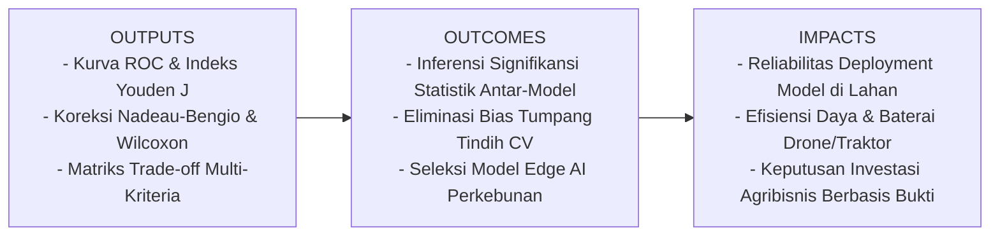
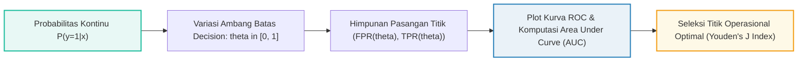

# AI Modul 6.4: Perbandingan Performa Model - Uji Signifikansi Statistik dan Evaluasi Multi-Kriteria

---

## 1. Identitas & Kerangka Capaian Pembelajaran (Sub-CPMK)

* **Kode Modul**        : AI Modul 6.4
* **Mata Kuliah**       : Kecerdasan Buatan dan Sains Data Pertanian Presisi
* **Alokasi Waktu**     : 2 x 50 Menit (Kajian Teori & Diskusi) + 2 x 50 Menit (Eksplorasi Praktikum Mandiri)
* **Beban SKS**         : 3 SKS
* **Prasyarat**         : AI Modul 6.1 (Metrik Evaluasi), AI Modul 6.3 (Validasi Silang)
* **Level Kognitif**    : C2 (Memahami), C3 (Menerapkan), C4 (Menganalisis)



### 1.1 Capaian Pembelajaran Khusus (Sub-CPMK)
Setelah menyelesaikan modul ini, mahasiswa dan pembelajar diharapkan mampu:
1. **Mengidentifikasi (C2)** limitasi evaluasi berbasis selisih skor tunggal dan urgensi pengujian signifikansi statistik formal pada pemodelan AI agribisnis.
2. **Menerapkan (C3)** analisis kurva ROC dan indeks Youden ($J$) untuk memilih titik ambang batas keputusan probabilitas optimal.
3. **Menganalisis (C4)** pelanggaran asumsi independensi pada validasi silang serta menghitung statistik uji *paired t-test* terkoreksi Nadeau-Bengio.
4. **Mengevaluasi (C4)** keunggulan komparatif multi-model menggunakan uji non-parametrik (*Wilcoxon Signed-Rank Test* dan *Uji Friedman*).
5. **Merumuskan (C3)** fungsi utilitas multi-kriteria industri yang menyeimbangkan metrik diskriminasi (ROC-AUC), latensi inferensi hardware, dan konsumsi daya komputasi tepi (*edge AI*).

### 1.2 Kerangka Hasil Pembelajaran (Outputs, Outcomes, & Impacts)
* **Outputs (Keluaran Berwujud Langsung)**:
  * Grafik komparasi kurva ROC multi-model dengan anotasi titik ambang batas optimal Youden ($J$) pada kasus deteksi stres kanopi sawit.
  * Modul skrip Python yang mengimplementasikan uji *paired t-test* terkoreksi Nadeau-Bengio, uji Wilcoxon, dan kalkulasi fungsi utilitas multi-kriteria.
  * Laporan evaluasi komparatif multi-model yang memuat tabel signifikansi statistik dan matriks keputusan kelayakan deployment tepi.
* **Outcomes (Hasil Capaian & Perubahan Kompetensi)**:
  * Mahasiswa mampu mengaudit klaim keunggulan algoritma machine learning secara kritis dan objektif menggunakan pengujian hipotesis statistik baku.
  * Mahasiswa terampil mengatasi perangkap optimisme semu pada validasi silang menggunakan koreksi ketergantungan sampel data latih.
  * Mahasiswa memiliki keahlian dalam merancang sistem AI yang tidak hanya akurat di atas kertas, namun juga fisibel secara teknis dan hemat energi saat dipasang pada drone dan traktor cerdas.
* **Impacts (Dampak Jangka Panjang & Nilai Guna Luas)**:
  * Terbentuknya kultur sains data perkebunan yang mengedepankan integritas metodologis, mencegah pemborosan modal investasi teknologi akibat model yang rapuh (*brittle models*).
  * Terwujudnya ekosistem pertanian presisi yang andal dengan sistem otomasi *edge computing* yang tangguh, hemat baterai, dan responsif terhadap dinamika lapangan.

---

## 2. Pengantar & Urgensi Komparasi Ilmiah Model AI di Sektor Agribisnis

Dalam siklus pengembangan sains data dan kecerdasan buatan (*machine learning*) di lingkungan industri pertanian, praktisi jarang sekali hanya melatih satu algoritma tunggal. Seorang *data scientist* di perkebunan kelapa sawit umumnya bereksperimen dengan beragam arsitektur model secara simultan, mulai dari model parametrik sederhana seperti Regresi Logistik (*Logistic Regression*), model berbasis kernel seperti *Support Vector Machine* (SVM), hingga ansambel pohon keputusan modern seperti *Random Forest*, *XGBoost*, dan *CatBoost*.

Tantangan krusial muncul saat mengambil keputusan akhir:  
*Jika Model A menghasilkan akurasi validasi silang sebesar $92{,}4\%$ dan Model B menghasilkan $90{,}8\%$, apakah kita dapat menyimpulkan secara sah bahwa Model A pasti lebih unggul daripada Model B?*

Secara empiris, perbedaan skor sebesar $1{,}6\%$ tersebut sangat mungkin timbul hanya karena variasi kebetulan partisi data uji (*random noise*), fluktuasi cuaca lokal pada sampel tertentu, atau efek *overfitting* stokastik. Jika perusahaan perkebunan langsung menginvestasikan dana ratusan juta rupiah untuk mendistribusikan Model A ke ratusan unit sensor pemilah buah (*edge computing*) atau traktor otonom tanpa verifikasi statistik formal, perusahaan menghadapi risiko kegagalan operasional yang besar.

Oleh karena itu, modul ini menetapkan disiplin komparasi performa model melalui dua pilar utama:
1. **Verifikasi Inferensi Statistik Formal:** Menguji apakah keunggulan suatu model memiliki signifikansi statistik sejati (*statistically significant difference*) atau sekadar anomali acak melalui *Paired Student's t-Test* dengan koreksi Nadeau-Bengio, *Wilcoxon Signed-Rank Test*, dan *Friedman Test*.
2. **Evaluasi Multi-Kriteria Holistik:** Menimbang tidak hanya akurasi atau ROC-AUC, melainkan juga latensi inferensi (*inference latency* milidetik per sampel), jejak memori (*RAM footprint*), dan kemudahan pemeliharaan (*model explainability*) di lingkungan lapangan agribisnis.

---

## 3. Evaluasi Ambang Batas: Kurva ROC dan Luas di Bawah Kurva (ROC-AUC)

Sebelum melakukan uji signifikansi statistik, kita memerlukan metrik evaluasi yang mampu mengukur ketangguhan model melintasi seluruh spektrum ambang batas keputusan (*decision thresholds*). Pada tugas klasifikasi agribisnis (misalnya deteksi defisiensi boron atau klorosis daun), probabilitas luaran model $P(y=1|\mathbf{x})$ harus dikonversi menjadi keputusan biner menggunakan ambang batas $\theta \in [0, 1]$.

### 3.1 Konsep Kurva Receiver Operating Characteristic (ROC)

Kurva ROC menggambarkan kompromi (*trade-off*) antara laju deteksi positif benar (*True Positive Rate* / Sensitivitas) terhadap laju alarm palsu (*False Positive Rate* / $1 - \text{Spesifisitas}$) saat nilai ambang batas $\theta$ digeser dari $1$ menuju $0$.



Formulasi matematis koordinat kurva ROC didefinisikan sebagai berikut:

$$\text{TPR}(\theta) = \frac{\text{TP}(\theta)}{\text{TP}(\theta) + \text{FN}(\theta)}$$

**Keterangan Komponen Simbol:**
- $\text{TPR}(\theta)$: Laju Positif Benar (*True Positive Rate* / Sensitivitas / Recall) pada ambang batas keputusan $\theta$ (skalar riil tanpa dimensi, rentang $[0, 1]$).
- $\text{TP}(\theta)$: Jumlah sampel positif (tanaman sakit) yang diprediksi benar positif pada ambang batas $\theta$ (bilangan bulat non-negatif).
- $\text{FN}(\theta)$: Jumlah sampel positif (tanaman sakit) yang keliru diprediksi negatif pada ambang batas $\theta$ (bilangan bulat non-negatif).

**Cara Membaca Rumus:**  
"Nilai True Positive Rate pada ambang batas teta, disingkat T P R kurung teta, sama dengan jumlah True Positive pada teta dibagi dengan jumlah True Positive pada teta ditambah False Negative pada teta."

$$\text{FPR}(\theta) = \frac{\text{FP}(\theta)}{\text{FP}(\theta) + \text{TN}(\theta)} = 1 - \text{Spesifisitas}(\theta)$$

**Keterangan Komponen Simbol:**
- $\text{FPR}(\theta)$: Laju Positif Palsu (*False Positive Rate* / probabilitas alarm palsu) pada ambang batas keputusan $\theta$ (skalar riil tanpa dimensi, rentang $[0, 1]$).
- $\text{FP}(\theta)$: Jumlah sampel negatif (tanaman sehat) yang keliru diprediksi positif pada ambang batas $\theta$ (bilangan bulat non-negatif).
- $\text{TN}(\theta)$: Jumlah sampel negatif (tanaman sehat) yang diprediksi benar negatif pada ambang batas $\theta$ (bilangan bulat non-negatif).

**Cara Membaca Rumus:**  
"Nilai False Positive Rate pada ambang batas teta, disingkat F P R kurung teta, sama dengan jumlah False Positive pada teta dibagi dengan jumlah False Positive pada teta ditambah True Negative pada teta, atau setara dengan satu dikurangi Spesifisitas pada teta."

---

### 3.2 Luas di Bawah Kurva (Area Under the Curve - ROC-AUC)

Luas area di bawah kurva ROC dinotasikan sebagai $\text{AUC}$ (*Area Under the Curve*). Nilai $\text{AUC}$ merepresentasikan probabilitas bahwa pengklasifikasi akan memberi peringkat probabilitas lebih tinggi pada sampel positif acak dibandingkan sampel negatif acak:

$$\text{AUC} = \int_{0}^{1} \text{TPR}(\text{FPR}^{-1}(u)) \, du$$

Secara diskret pada data sampel berhingga, $\text{AUC}$ dihitung menggunakan aturan trapesium (*trapezoidal rule*):

$$\text{AUC} = \frac{1}{2} \sum_{i=1}^{M-1} (\text{FPR}_{i+1} - \text{FPR}_i) \cdot (\text{TPR}_{i+1} + \text{TPR}_i)$$

**Keterangan Komponen Simbol:**
- $\text{AUC}$: Luas di bawah kurva karakteristik operasi penerima (skalar riil tanpa dimensi, rentang teoritis $[0{,}5; 1{,}0]$ untuk model yang bermakna).
- $M$: Jumlah titik ambang batas diskret yang dievaluasi sepanjang kurva (bilangan bulat positif).
- $\text{FPR}_i$: Laju positif palsu pada titik evaluasi ke-$i$ yang telah diurutkan membesar.
- $\text{TPR}_i$: Laju positif benar pada titik evaluasi ke-$i$.

**Cara Membaca Rumus:**  
"Luas di bawah kurva A U C dihitung secara numerik dengan setengah kali jumlahan dari i sama dengan satu sampai M minus satu, dari perkalian selisih F P R ke i plus satu dikurangi F P R ke i, dengan jumlahan T P R ke i plus satu ditambah T P R ke i."

**Kriteria Standar Akademik Interpretasi Nilai ROC-AUC:**
- $\text{AUC} = 0{,}50$: Model tidak memiliki daya beda sama sekali (setara tebakan acak pelemparan koin).
- $0{,}70 \le \text{AUC} < 0{,}80$: Daya diskriminasi dapat diterima (*acceptable discrimination*).
- $0{,}80 \le \text{AUC} < 0{,}90$: Daya diskriminasi sangat baik (*excellent discrimination*).
- $\text{AUC} \ge 0{,}90$: Daya diskriminasi luar biasa (*outstanding discrimination*).

```
+-----------------------------------------------------------------------------------+
|               KOMPARASI KURVA ROC LINTAS MODEL PERTANIAN PRESISI                  |
|                                                                                   |
|  TPR (Sensitivity)                                                                |
|  1.0 |                   .------------------ XGBoost (AUC = 0.941)                |
|      |               .-''  . - - - - - - - - Random Forest (AUC = 0.887)          |
|  0.8 |            .-'   .-'                                                       |
|      |          .'   .-'  . - - - - - - - -  SVM RBF (AUC = 0.812)                |
|  0.6 |        .'   .'   .'                                                        |
|      |       /   .'   .'   . - - - - - - - - Regresi Logistik (AUC = 0.745)       |
|  0.4 |      /   /   .'   .'                                                       |
|      |     /   /   /   .'   .- - - - - - - - Tebakan Acak (AUC = 0.500)           |
|  0.2 |    /   /   /   /   .'                                                      |
|      |   /   /   /   /  .'                                                        |
|  0.0 +--+---+---+---+--+--------------------------------                          |
|     0.0 0.2 0.4 0.6 0.8 1.0   FPR (1 - Specificity)                               |
+-----------------------------------------------------------------------------------+
```


---

### 3.3 Penentuan Titik Ambang Batas Optimal: Indeks Youden (Youden's J Statistic)

Model machine learning tidak dapat beroperasi di udara hampa; sistem pada akhirnya harus memutuskan pada probabilitas berapa traktor menyemprotkan fungisida. Pendekatan analitis formal untuk memilih $\theta^*$ yang menyeimbangkan sensitivitas dan spesifisitas adalah indeks Youden ($J$):

$$J(\theta) = \text{TPR}(\theta) - \text{FPR}(\theta) = \text{Sensitivitas}(\theta) + \text{Spesifisitas}(\theta) - 1$$

$$\theta^* = \arg\max_{\theta \in [0, 1]} J(\theta)$$

**Keterangan Komponen Simbol:**
- $J(\theta)$: Nilai statistik indeks Youden pada ambang batas $\theta$ (skalar riil, rentang $[-1, 1]$).
- $\theta^*$: Nilai ambang batas keputusan optimal yang memaksimalkan jarak vertikal kurva ROC terhadap garis tebakan acak diagonal.
- $\text{Sensitivitas}(\theta)$: Kemampuan menangkap tanaman terinfeksi pada ambang batas $\theta$.
- $\text{Spesifisitas}(\theta)$: Kemampuan menghindari penyemprotan tanaman sehat pada ambang batas $\theta$.

**Cara Membaca Rumus:**  
"Statistik indeks Youden J pada ambang batas teta sama dengan True Positive Rate teta dikurangi False Positive Rate teta, atau Sensitivitas ditambah Spesifisitas dikurangi satu. Titik teta bintang optimal adalah argumen teta yang memaksimumkan fungsi J teta."

---

## 4. Uji Signifikansi Statistik Parametrik: Paired Student's t-Test dan Koreksi Nadeau-Bengio

Ketika membandingkan dua model yang dievaluasi pada lipatan validasi silang yang sama (*k-fold cross-validation*), kita memiliki observasi berpasangan (*paired observations*).

### 4.1 Paired Student's t-Test Standar dan Masalah Pelanggaran Asumsi

Misalkan kita menguji Model $A$ dan Model $B$ pada $K$-fold cross-validation. Pada setiap lipatan ke-$k$ ($k=1, 2, \dots, K$), kita mencatat metrik performa masing-masing model ($S_{A,k}$ dan $S_{B,k}$). Selisih performa pada lipatan ke-$k$ didefinisikan sebagai:

$$d_k = S_{A,k} - S_{B,k}$$

Rerata selisih performa ($\bar{d}$) dan varians sampel selisih ($s_d^2$) dihitung sebagai berikut:

$$\bar{d} = \frac{1}{K} \sum_{k=1}^{K} d_k$$

$$s_d^2 = \frac{1}{K - 1} \sum_{k=1}^{K} (d_k - \bar{d})^2$$

**Keterangan Komponen Simbol:**
- $d_k$: Selisih performa antara Model A dan Model B pada lipatan ke-$k$ (skalar riil).
- $\bar{d}$: Rerata empiris selisih performa lintas seluruh $K$ lipatan uji (skalar riil).
- $s_d^2$: Varians sampel dari selisih performa antar-lipatan (skalar riil non-negatif).
- $K$: Jumlah lipatan validasi silang (umumnya $K=5$ atau $K=10$).

**Cara Membaca Rumus:**  
"Rerata selisih bar d sama dengan satu per K dikali jumlah selisih d sub k dari k sama dengan satu sampai K. Varians selisih s kuadrat sub d sama dengan satu per K minus satu dikali jumlahan kuadrat selisih d sub k terhadap bar d."

Pada uji *paired t-test* konvensional, statistik uji $t$ dihitung dengan rumus:

$$t_{\text{standar}} = \frac{\bar{d}}{\sqrt{\frac{s_d^2}{K}}}$$

> [!WARNING] Bahaya Metodologis: Pelanggaran Asumsi Independensi pada Cross-Validation  
> Sebagaimana dibuktikan oleh Dietterich (1998), penerapan *paired t-test* standar pada data validasi silang memiliki kelemahan fatal. Subset data latih pada masing-masing lipatan saling tumpang tindih (*overlapping training sets*). Sebagai contoh pada 10-fold CV, setiap pasangan model dilatih pada $80\%$ data yang identik. Akibatnya, observasi selisih $d_k$ **tidak saling independen** (*violation of independence assumption*).  
> Hal ini menyebabkan penyebut varians $\frac{s_d^2}{K}$ meremehkan (*underestimate*) variabilitas sesungguhnya, memicu laju Galat Tipe I (*False Positive Rate*) yang membengkak hingga $20\%-40\%$ pada tingkat signifikansi nominal $\alpha = 0{,}05$. Praktisi akan dengan keliru menyimpulkan bahwa Model A lebih unggul secara signifikan, padahal keunggulan tersebut hanyalah ilusi statistik!

---

### 4.2 Formulasi Koreksi Nadeau-Bengio (Corrected Resampled t-Test)

Untuk memulihkan validitas inferensi statistik pada validasi silang, Nadeau dan Bengio (2003) merumuskan faktor koreksi analitis terhadap estimasi varians yang memperhitungkan rasio ukuran data uji terhadap data latih:

$$\sigma_{\text{corr}}^2 = s_d^2 \left( \frac{1}{K} + \frac{n_{\text{test}}}{n_{\text{train}}} \right)$$

$$t_{\text{Nadeau-Bengio}} = \frac{\bar{d}}{\sqrt{\sigma_{\text{corr}}^2}} = \frac{\bar{d}}{\sqrt{s_d^2 \left( \frac{1}{K} + \frac{n_{\text{test}}}{n_{\text{train}}} \right)}}$$

**Keterangan Komponen Simbol:**
- $t_{\text{Nadeau-Bengio}}$: Nilai statistik $t$ berpasangan yang telah dikoreksi terhadap ketergantungan sampel validasi silang (skalar riil tanpa dimensi).
- $\bar{d}$: Rerata selisih metrik performa kedua model lintas lipatan.
- $s_d^2$: Varians sampel selisih performa antar-lipatan.
- $K$: Jumlah total lipatan partisi data ($K \ge 2$).
- $n_{\text{test}}$: Jumlah sampel pada subset data uji di setiap lipatan.
- $n_{\text{train}}$: Jumlah sampel pada subset data latih di setiap lipatan.
- Rasio $\frac{n_{\text{test}}}{n_{\text{train}}}$: Pada standard $K$-Fold CV, rasio ini bernilai eksak $\frac{1}{K - 1}$.

**Cara Membaca Rumus:**  
"Statistik uji t Nadeau Bengio sama dengan rerata selisih bar d dibagi dengan akar dari varians sampel s kuadrat sub d dikalikan faktor koreksi satu per K ditambah n test per n train."

Derajat kebebasan (*degrees of freedom*) yang digunakan untuk menentukan nilai kritis $t_{\alpha/2, \nu}$ atau nilai-$p$ (*p-value*) adalah:

$$\nu = K - 1$$

Kriteria penolakan hipotesis nol ($H_0: \mu_d = 0$, tidak ada perbedaan performa sejati antar-model):
- Tolak $H_0$ jika $|t_{\text{Nadeau-Bengio}}| > t_{\alpha/2, K-1}$ atau jika $p\text{-value} < \alpha$ (umumnya $\alpha = 0{,}05$). Jika $H_0$ ditolak dan $\bar{d} > 0$, maka Model A terbukti secara signifikan lebih unggul dibandingkan Model B.

---

## 5. Uji Signifikansi Statistik Non-Parametrik: Wilcoxon Signed-Rank Test & Uji Friedman

Jika jumlah lipatan evaluasi kecil atau sebaran selisih $d_k$ melanggar asumsi normalitas (misalnya terdistribusi miring atau mengandung nilai ekstrem/outlier akibat anomali satu blok kebun), uji parametrik $t$-test tidak lagi valid. Kita beralih ke uji non-parametrik berbasis peringkat (*rank-based tests*).

### 5.1 Wilcoxon Signed-Rank Test (Uji Peringkat Bertanda Wilcoxon)

Uji peringkat bertanda Wilcoxon mengevaluasi apakah median selisih performa berpasangan bernilai nol tanpa mengasumsikan distribusi normal.

**Langkah Prosedural Algoritmik:**
1. Hitung selisih mutlak $|d_k|$ untuk setiap pasangan lipatan, abaikan lipatan yang menghasilkan selisih tepat nol ($d_k = 0$).
2. Urutkan nilai mutlak $|d_k|$ dari yang terkecil hingga terbesar, lalu berikan peringkat $R_k \in \{1, 2, \dots, N_r\}$. Jika terdapat nilai seri (*ties*), berikan peringkat rata-rata.
3. Jumlahkan peringkat yang berasosiasi dengan selisih bertanda positif ($W^+$) dan selisih bertanda negatif ($W^-$):

$$W^+ = \sum_{k: d_k > 0} R_k, \quad W^- = \sum_{k: d_k < 0} R_k$$

$$W = \min(W^+, W^-)$$

**Keterangan Komponen Simbol:**
- $W^+$: Jumlahan nilai peringkat untuk lipatan di mana Model A mengungguli Model B ($d_k > 0$).
- $W^-$: Jumlahan nilai peringkat untuk lipatan di mana Model B mengungguli Model A ($d_k < 0$).
- $W$: Nilai statistik uji Wilcoxon (bilangan bulat positif atau pecahan berakhiran $.5$ jika terdapat nilai seri).
- $R_k$: Nilai peringkat dari magnitudo selisih mutlak $|d_k|$.

**Cara Membaca Rumus:**  
"Statistik uji W plus adalah jumlahan peringkat R sub k untuk kondisi selisih d sub k lebih besar dari nol, dan W minus adalah jumlahan peringkat R sub k untuk kondisi selisih d sub k lebih kecil dari nol. Statistik uji Wilcoxon W adalah nilai minimum antara W plus dan W minus."

Pada ukuran sampel $N_r \ge 10$, distribusi statistik $W$ mendekati distribusi normal baku ($Z$) melalui formulasi aproksimasi:

$$\mu_W = \frac{N_r (N_r + 1)}{4}$$

$$\sigma_W = \sqrt{\frac{N_r (N_r + 1)(2N_r + 1)}{24}}$$

$$Z = \frac{W - \mu_W}{\sigma_W}$$

**Keterangan Komponen Simbol:**
- $\mu_W$: Nilai harapan matematis dari statistik $W$ di bawah hipotesis nol (skalar riil positif).
- $\sigma_W$: Simpangan baku teoretis dari statistik $W$ di bawah hipotesis nol (skalar riil positif).
- $Z$: Skor baku aproksimasi normal standar (skalar riil).
- $N_r$: Jumlah pasangan lipatan uji yang memiliki selisih bukan nol (bilangan bulat positif).

**Cara Membaca Rumus:**  
"Skor Z Wilcoxon sama dengan nilai statistik W dikurangi ekspektasi mu W, dibagi dengan simpangan baku sigma W."

```
+-----------------------------------------------------------------------------------+
|               SKEMA UJI PERINGKAT BERTANDA WILCOXON (NON-PARAMETRIK)              |
|                                                                                   |
|  Fold   Skor A   Skor B   Selisih (d)   |d|    Rank (|d|)  Tanda (+)   Tanda (-)  |
|  -------------------------------------------------------------------------------  |
|   1      0.88     0.85      +0.03       0.03       3          3            -      |
|   2      0.91     0.90      +0.01       0.01       1          1            -      |
|   3      0.84     0.86      -0.02       0.02       2          -            2      |
|   4      0.89     0.84      +0.05       0.05       5          5            -      |
|   5      0.93     0.89      +0.04       0.04       4          4            -      |
|  -------------------------------------------------------------------------------  |
|  Total Peringkat:                              W+ = 1+3+4+5=13       W- = 2       |
|  Statistik Uji: W = min(13, 2) = 2. Bandingkan W terhadap tabel kritis W(alpha, N)|
+-----------------------------------------------------------------------------------+
```


---

### 5.2 Uji Friedman & Prosedur Post-Hoc Nemenyi (Perbandingan Multi-Model)

Jika kita membandingkan $M \ge 3$ model (misal Regresi Logistik, Random Forest, SVM, dan XGBoost) pada $K$ dataset atau $K$ lipatan validasi silang, menjalankan banyak uji $t$ berpasangan secara simultan memicu inflasi galat keluarga (*family-wise error rate inflation*). Standar emas metodologis yang direkomendasikan oleh Demšar (2006) adalah **Uji Friedman** yang dilanjutkan dengan uji *post-hoc* Nemenyi.

Statistik uji Friedman didefinisikan sebagai:

$$\chi_F^2 = \frac{12 K}{M(M + 1)} \left[ \sum_{j=1}^{M} \bar{R}_j^2 - \frac{M(M + 1)^2}{4} \right]$$

**Keterangan Komponen Simbol:**
- $\chi_F^2$: Nilai statistik uji Friedman berdistribusi Chi-Square dengan derajat kebebasan $M - 1$ (skalar riil non-negatif).
- $K$: Jumlah blok pengujian / lipatan validasi silang (bilangan bulat positif).
- $M$: Jumlah model algoritma yang dikomparasi secara bersamaan ($M \ge 3$).
- $\bar{R}_j$: Rerata peringkat model ke-$j$ lintas seluruh $K$ blok pengujian ($\bar{R}_j = \frac{1}{K}\sum_{k=1}^K r_k^j$).

**Cara Membaca Rumus:**  
"Statistik khi kuadrat Friedman sama dengan dua belas kali K dibagi M dikali M plus satu, dikalikan dengan kurung siku jumlahan kuadrat rerata peringkat bar R sub j dari j sama dengan satu sampai M dikurangi M dikali M plus satu kuadrat dibagi empat."

Jika nilai-$p$ uji Friedman signifikan ($p < 0{,}05$), kita menjalankan **Uji Nemenyi** untuk menentukan pasangan model mana yang berbeda secara nyata. Dua model dikatakan berbeda secara signifikan jika selisih rerata peringkatnya melampaui Jarak Kritis (*Critical Difference* / $CD$):

$$CD = q_{\alpha} \sqrt{\frac{M(M + 1)}{6 K}}$$

**Keterangan Komponen Simbol:**
- $CD$: Nilai jarak kritis (*Critical Difference*) uji Nemenyi (skalar riil positif).
- $q_{\alpha}$: Nilai kritis tabel Studentized Range pada tingkat signifikansi $\alpha$.
- $M$: Jumlah model yang dibandingkan.
- $K$: Jumlah blok pengujian / lipatan validasi silang.

**Cara Membaca Rumus:**  
"Jarak kritis C D sama dengan nilai kritis q alfa dikali akar dari M dikalikan M plus satu dibagi enam kali K."

---

## 6. Matriks Kompromi Multi-Kriteria Industri (The Accuracy-Efficiency Trade-off)

Dalam ranah agribisnis 4.0 dan perkebunan presisi, akurasi atau AUC bukanlah satu-satunya parameter keberhasilan. Sebuah model dengan akurasi $96\%$ yang membutuhkan waktu inferensi $1{,}5$ detik per gambar kanopi tidak mungkin dipasang pada kamera drone pemantau gulma yang terbang dengan kecepatan $12 \text{ m/detik}$ (karena traktor/drone telah melintasi jarak $18\text{ meter}$ sebelum komputer sempat mendeteksi gulma!).

Oleh karena itu, evaluasi industri wajib merumuskan fungsi utilitas multi-kriteria (*Multi-Criteria Utility Score*):

$$U(m) = w_1 \cdot \text{AUC}(m) + w_2 \cdot \left(1 - \frac{\text{Latensi}(m)}{\text{Latensi}_{\max}}\right) + w_3 \cdot \left(1 - \frac{\text{Memori}(m)}{\text{Memori}_{\max}}\right)$$

$$\sum_{i=1}^{3} w_i = 1, \quad w_i \ge 0$$

**Keterangan Komponen Simbol:**
- $U(m)$: Skor utilitas komposit terbobot untuk kandidat model $m$ (skalar riil, rentang $[0, 1]$).
- $\text{AUC}(m)$: Nilai metrik performa diskriminasi model $m$.
- $\text{Latensi}(m)$: Waktu eksekusi inferensi per sampel pada perangkat komputasi target (milidetik).
- $\text{Latensi}_{\max}$: Batas toleransi latensi maksimal yang diizinkan oleh sistem kontrol fisik aktuator (milidetik).
- $\text{Memori}(m)$: Kapasitas memori RAM atau penyimpanan disk yang dikonsumsi oleh model (MegaByte).
- $\text{Memori}_{\max}$: Batas kapasitas memori hardware mikrokomputer di lapangan (*Edge AI module*).
- $w_1, w_2, w_3$: Bobot kepentingan relatif untuk masing-masing kriteria agronomi operasional.

**Cara Membaca Rumus:**  
"Skor utilitas U dari model m sama dengan bobot w satu kali A U C model m, ditambah bobot w dua kali kurung satu dikurangi latensi model m per latensi maksimum, ditambah bobot w tiga kali kurung satu dikurangi memori model m per memori maksimum, dengan syarat jumlah seluruh bobot w sub i sama dengan satu."

| Kriteria Komputasi | Regresi Logistik | Random Forest (100 Trees) | XGBoost (Depth=6) | MobileNet-V3 (Deep CNN) |
| :--- | :---: | :---: | :---: | :---: |
| **Akurasi / ROC-AUC** | Cukup ($0{,}74$) | Sangat Baik ($0{,}89$) | Luar Biasa ($0{,}94$) | Luar Biasa ($0{,}96$) |
| **Latensi Inferensi (CPU Edge)** | Super Cepat ($< 0{,}1\text{ ms}$) | Cepat ($3{,}5\text{ ms}$) | Sangat Cepat ($0{,}8\text{ ms}$) | Lambat ($45\text{ ms}$) |
| **Konsumsi Memori (RAM)** | Sangat Rendah ($< 1\text{ MB}$) | Sedang ($45\text{ MB}$) | Rendah ($8\text{ MB}$) | Tinggi ($120\text{ MB}$) |
| **Keterjelasan (*Explainability*)** | Sangat Tinggi (Koefisien) | Cukup (Feature Importance) | Cukup (SHAP Values) | Rendah (*Black-box*) |
| **Kebutuhan Daya Baterai Drone** | Sangat Hemat | Hemat | Efisien | Boros |

---

## 7. Implementasi Komputasi Terprogram (Python Scikit-Learn & SciPy)

Berikut adalah modul kode Python yang mengimplementasikan kurva ROC-AUC, uji signifikansi *paired t-test* terkoreksi Nadeau-Bengio, dan *Wilcoxon Signed-Rank Test* secara terpadu:

```python
import numpy as np
import pandas as pd
from scipy import stats
from sklearn.datasets import make_classification
from sklearn.model_selection import StratifiedKFold
from sklearn.linear_model import LogisticRegression
from sklearn.ensemble import RandomForestClassifier, GradientBoostingClassifier
from sklearn.metrics import roc_auc_score

# 1. Simulasi Dataset Agronomi: Deteksi Defisiensi Hara NPK Tanaman
X, y = make_classification(
    n_samples=1200, n_features=10, n_informative=7,
    n_classes=2, weights=[0.75, 0.25], random_state=42
)

# 2. Inisialisasi Kandidat Model
models = {
    'Logistic_Regression': LogisticRegression(max_iter=500, random_state=42),
    'Random_Forest': RandomForestClassifier(n_estimators=100, random_state=42),
    'Gradient_Boosting': GradientBoostingClassifier(n_estimators=100, random_state=42)
}

# 3. Eksekusi 10-Fold Stratified Cross-Validation
cv = StratifiedKFold(n_splits=10, shuffle=True, random_state=42)
results = {m: [] for m in models}

for train_idx, test_idx in cv.split(X, y):
    X_train, X_test = X[train_idx], X[test_idx]
    y_train, y_test = y[train_idx], y[test_idx]
    
    for name, clf in models.items():
        clf.fit(X_train, y_train)
        probs = clf.predict_proba(X_test)[:, 1]
        score = roc_auc_score(y_test, probs)
        results[name].append(score)

df_scores = pd.DataFrame(results)
print("=== RERATA SKOR ROC-AUC 10-FOLD CV ===")
print(df_scores.mean().round(4))
print("\n=== DEVIASI STANDAR ROC-AUC ===")
print(df_scores.std(ddof=1).round(4))

# 4. Fungsi Paired t-Test Terkoreksi Nadeau-Bengio
def nadeau_bengio_ttest(scores_a, scores_b, n_train, n_test):
    d = np.array(scores_a) - np.array(scores_b)
    K = len(d)
    mean_d = np.mean(d)
    var_d = np.var(d, ddof=1)
    
    # Faktor koreksi dependensi sampel CV
    correction_factor = (1.0 / K) + (float(n_test) / float(n_train))
    se_corrected = np.sqrt(var_d * correction_factor)
    
    t_stat = mean_d / se_corrected
    df = K - 1
    p_val = 2 * (1 - stats.t.cdf(np.abs(t_stat), df=df))
    return t_stat, p_val

# Evaluasi Komparasi: Gradient Boosting vs Random Forest
n_total = len(X)
n_test_fold = n_total // 10
n_train_fold = n_total - n_test_fold

t_nb, p_nb = nadeau_bengio_ttest(
    df_scores['Gradient_Boosting'], df_scores['Random_Forest'],
    n_train_fold, n_test_fold
)
print(f"\n[Nadeau-Bengio] Gradient Boosting vs RF: t = {t_nb:.4f}, p-value = {p_nb:.4f}")

# 5. Wilcoxon Signed-Rank Test
w_stat, p_wilc = stats.wilcoxon(df_scores['Gradient_Boosting'], df_scores['Random_Forest'])
print(f"[Wilcoxon] Gradient Boosting vs RF: W = {w_stat:.4f}, p-value = {p_wilc:.4f}")
```

---

## 8. Rangkuman Komprehensif

1. **Ilusi Selisih Skor:** Perbedaan angka evaluasi lintas lipatan validasi silang tidak serta merta membuktikan keunggulan algoritmik hakiki; pengujian signifikansi statistik mutlak diperlukan untuk menepis faktor kebetulan stokastik.
2. **Koreksi Nadeau-Bengio adalah Keharusan:** Menggunakan uji *paired t-test* standar pada *k-fold cross-validation* melanggar asumsi independensi akibat tumpang tindih data latih, memicu alarm palsu (Galat Tipe I). Koreksi varians Nadeau-Bengio memulihkan integritas penarikan kesimpulan.
3. **Ketangguhan Non-Parametrik:** *Wilcoxon Signed-Rank Test* memberikan alternatif inferensi yang kokoh ketika asumsi normalitas selisih performa dilanggar, sedangkan *Uji Friedman* dan *Nemenyi* mengendalikan inflasi galat pada perbandingan multi-model.
4. **Keseimbangan Agronomi-Komputasi:** Model terbaik di perkebunan modern bukanlah model dengan skor AUC tertinggi semata, melainkan model yang memaksimalkan fungsi utilitas multi-kriteria: akurasi andal, latensi rendah pada komputasi tepi (*edge AI*), dan hemat konsumsi daya di lapangan.

---

## 9. Latihan Soal dan Tantangan HOTS (Higher-Order Thinking Skills)

### 9.1 Komputasi Paired t-Test Terkoreksi Nadeau-Bengio (Bobot: 50%)
Dua model kecerdasan buatan, yaitu **CatBoost** (Model A) dan **Random Forest** (Model B), dievaluasi untuk memprediksi kadar air daun kelapa sawit berdasarkan citra multispektral UAV menggunakan skema $10\text{-Fold Cross-Validation}$ pada dataset $1.000$ sampel kanopi ($n_{\text{test}} = 100$, $n_{\text{train}} = 900$ per lipatan). Nilai metrik $R^2$ yang tercatat pada masing-masing lipatan adalah sebagai berikut:

| Lipatan ($k$) | CatBoost ($S_{A,k}$) | Random Forest ($S_{B,k}$) | Selisih ($d_k = S_{A,k} - S_{B,k}$) |
| :---: | :---: | :---: | :---: |
| 1 | $0{,}88$ | $0{,}85$ | $+0{,}03$ |
| 2 | $0{,}91$ | $0{,}88$ | $+0{,}03$ |
| 3 | $0{,}84$ | $0{,}83$ | $+0{,}01$ |
| 4 | $0{,}89$ | $0{,}86$ | $+0{,}03$ |
| 5 | $0{,}93$ | $0{,}91$ | $+0{,}02$ |
| 6 | $0{,}87$ | $0{,}84$ | $+0{,}03$ |
| 7 | $0{,}86$ | $0{,}85$ | $+0{,}01$ |
| 8 | $0{,}92$ | $0{,}89$ | $+0{,}03$ |
| 9 | $0{,}85$ | $0{,}85$ | $0{,}00$ |
| 10 | $0{,}90$ | $0{,}88$ | $+0{,}02$ |

**Instruksi Pengerjaan Mahasiswa:**
1. Hitung nilai rerata selisih performa $\bar{d}$ dan varians sampel selisih $s_d^2$!
2. Hitung nilai statistik $t_{\text{standar}}$ tanpa koreksi, dan tentukan nilai $p$-value atau signifikansinya pada $\alpha = 0{,}05$ ($\text{derajat kebebasan } \nu = 9, t_{\text{kritis}} = 2{,}262$)!
3. Hitung faktor koreksi varians Nadeau-Bengio $\left(\frac{1}{K} + \frac{n_{\text{test}}}{n_{\text{train}}}\right)$ dan nilai statistik $t_{\text{Nadeau-Bengio}}$ yang telah dikoreksi!
4. Bandingkan kedua nilai statistik $t$ tersebut! Mengapa statistik $t$ terkoreksi bernilai lebih kecil? Simpulkan apakah CatBoost terbukti secara signifikan lebih unggul daripada Random Forest setelah koreksi diterapkan!

---

### 9.2 Analisis Trade-off Komputasi & Ambang Batas Drone Edge AI (Bobot: 50%)
Sebuah konsorsium perkebunan tebu cerdas sedang memilih arsitektur AI untuk dipasang pada unit *NVIDIA Jetson Nano* di atas drone penyemprot herbisida otonom. Drone terbang dengan kecepatan konstan $v = 10 \text{ m/detik}$. Kamera mengambil citra setiap interval jarak tempuh $2\text{ meter}$ ($5 \text{ frame/detik}$). Lebar semprotan nosel aktif memiliki jendela respon fisik katup hidrolik maksimal $100\text{ milidetik}$.

Tersedia tiga kandidat model klasifikasi keberadaan gulma berdaun lebar:

| Parameter Evaluasi | Model X (ResNet-50) | Model Y (MobileNet-V3) | Model Z (SVM Citra Klasik) |
| :--- | :---: | :---: | :---: |
| **Nilai ROC-AUC** | $0{,}96$ | $0{,}91$ | $0{,}82$ |
| **Latensi Inferensi Edge (Jetson Nano)** | $185\text{ ms}$ | $35\text{ ms}$ | $8\text{ ms}$ |
| **Konsumsi Memori RAM** | $380\text{ MB}$ | $45\text{ MB}$ | $12\text{ MB}$ |
| **Konsumsi Daya Listrik (Watt)** | $10\text{ Watt}$ (Baterai drop 40% cepat) | $4\text{ Watt}$ | $2\text{ Watt}$ |

**Pertanyaan Analitis:**
1. Mengapa Model X (ResNet-50), meskipun memiliki nilai ROC-AUC tertinggi ($0{,}96$), secara fisik **mustahil** diimplementasikan pada drone penyemprot herbisida tersebut? Jelaskan dengan menghubungkan latensi inferensi terhadap kecepatan drone dan waktu respon katup hidrolik!
2. Jika manajemen agribisnis menetapkan fungsi utilitas dengan bobot kepentingan:
   - Bobot ROC-AUC ($w_1 = 0{,}50$)
   - Bobot Efisiensi Latensi ($w_2 = 0{,}30$), dengan $\text{Latensi}_{\max} = 100\text{ ms}$
   - Bobot Efisiensi Daya ($w_3 = 0{,}20$), dengan $\text{Daya}_{\max} = 10\text{ Watt}$  
   Hitung skor utilitas $U$ untuk Model Y dan Model Z! Tentukan model manakah yang menjadi pemenang objektif implementasi komersial!

---

## 10. Glosarium Istilah Teknis

1. **Area Under the Curve (AUC):** Ukuran kuantitatif dari keseluruhan kemampuan pemilahan model klasifikasi pada seluruh kemungkinan ambang batas keputusan.
2. **Critical Difference (CD):** Ambang batas matematis dalam uji post-hoc Nemenyi yang menyatakan selisih peringkat minimal agar dua model dinyatakan berbeda secara signifikan.
3. **Family-Wise Error Rate (FWER):** Peluang terjadinya setidaknya satu kesalahan penolakan hipotesis nol (Galat Tipe I) ketika melakukan pengujian hipotesis majemuk secara simultan.
4. **False Positive Rate (FPR):** Proporsi sampel bernilai aktual negatif yang keliru diprediksi sebagai positif oleh model pengklasifikasi.
5. **Nadeau-Bengio Correction:** Prosedur modifikasi varians sampel berpasangan untuk mengatasi bias ketergantungan data latih yang tumpang tindih pada validasi silang.
6. **Receiver Operating Characteristic (ROC):** Kurva grafis dua dimensi yang memetakan laju positif benar terhadap laju positif palsu melintasi beragam ambang batas keputusan.
7. **Youden's J Index:** Metrik pengoptimalan titik ambang batas keputusan yang memaksimalkan penjumlahan sensitivitas dan spesifisitas dikurangi satu.

---

## 11. Jembatan Konsep (Bridging) ke Part 7: Algoritma Machine Learning

Selamat! Anda telah menuntaskan seluruh fondasi metodologi sains data, matematika vektor, kalkulus optimasi, rekayasa fitur, partisi data, validasi silang, hingga uji signifikansi komparatif model pada Part 1 hingga Part 6. Anda kini memiliki pemahaman yang utuh mengenai bagaimana mengevaluasi, memvalidasi, dan menguji kecerdasan buatan secara saintifik.

Mulai dari **Part 7: Algoritma Machine Learning**, kita akan melangkah memasuki jantung algoritma kecerdasan buatan terawasi (*supervised learning*). Kita akan membedah prinsip kerja, perumusan matematis, dan implementasi kode untuk:
- **Regresi Linier & Polinomial:** Estimasi biomassa dan produksi panen berbasis kovariat cuaca.
- **Regresi Logistik:** Klasifikasi kematangan buah dan risiko serangan hama.
- **Decision Trees & Random Forest:** Pemodelan keputusan non-linier dan seleksi fitur agronomi.
- **Support Vector Machine (SVM):** Penentuan bidang pemisah optimal (*maximum margin hyperplane*) untuk klasifikasi spektral citra drone.

---

## 12. Daftar Pustaka dan Referensi Akademik

1. Dietterich, T. G. (1998). Approximate statistical tests for comparing supervised classification learning algorithms. *Neural Computation*, 10(7), 1895-1923.
2. Nadeau, C., & Bengio, Y. (2003). Inference for the generalization error. *Machine Learning*, 52(3), 239-281.
3. Demšar, J. (2006). Statistical comparisons of classifiers over multiple data sets. *Journal of Machine Learning Research*, 7, 1-30.
4. Fawcett, T. (2006). An introduction to ROC analysis. *Pattern Recognition Letters*, 27(8), 861-874.
5. Youden, W. J. (1950). Index for rating diagnostic tests. *Cancer*, 3(1), 32-35.
6. Wilcoxon, F. (1945). Individual comparisons by ranking methods. *Biometrics Bulletin*, 1(6), 80-83.
