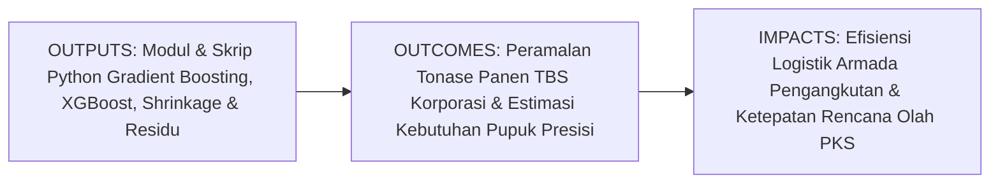
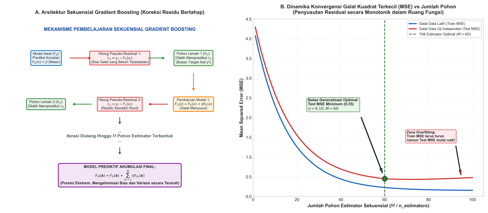
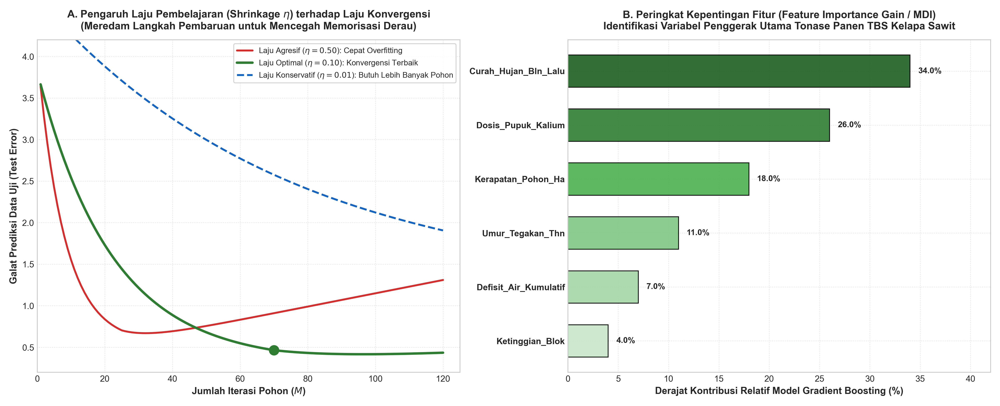

# AI Modul 7.10: Gradient Boosting

---

## 1. Identitas & Kerangka Capaian Pembelajaran (Sub-CPMK)

* **Kode Modul**: AI Modul 7.10
* **Mata Kuliah**: Kecerdasan Buatan dan Sains Data Pertanian Presisi
* **Alokasi Waktu**: 2 x 50 Menit (Kajian Teori & Diskusi) + 2 x 50 Menit (Eksplorasi Praktikum Mandiri)
* **Beban SKS**: 3 SKS
* **Prasyarat**: AI Modul 7.4 (Decision Tree), AI Modul 7.5 (Random Forest), AI Modul 7.1 (Linear Regression), AI Modul 6.4 (Perbandingan Performa Model)
* **Level Kognitif**: Bloom C2 (Memahami), C3 (Menerapkan), C4 (Menganalisis)



### 1.1 Capaian Pembelajaran Khusus (Sub-CPMK)
Setelah menyelesaikan modul pamungkas Part 7 ini secara komprehensif, mahasiswa diharapkan mampu:
1. **Memahami (C2)** prinsip dasar pembelajaran ansambel terarah (*sequential boosting*), konsep penurunan gradien dalam ruang fungsi (*gradient descent in function space*), formulasi matematis *pseudo-residuals*, mekanisme penyusutan (*shrinkage / learning rate*), serta dekomposisi Hessian tingkat dua pada XGBoost.
2. **Menerapkan (C3)** pustaka Scikit-Learn (`GradientBoostingRegressor` dan `GradientBoostingClassifier`) untuk memodelkan peramalan tonase panen Tandan Buah Segar (TBS) bulanan dan mengklasifikasikan risiko anomali rendemen pabrik kelapa sawit.
3. **Menganalisis (C4)** interaksi dinamis antara parameter laju pembelajaran ($\eta$) dan jumlah pohon ($M$), mendiagnosis kurva galat latih vs uji untuk mitigasi *overfitting*, serta membandingkan karakteristik keunggulan arsitektural antara *Bagging* (Random Forest) versus *Boosting* (Gradient Boosting).

### 1.2 Kerangka Hasil Pembelajaran (Outputs, Outcomes, & Impacts)
* **Outputs (Keluaran Langsung)**:
  * Penguasaan analitik fungsi objektif penurunan gradien $\min_F \sum L(y_i, F(\mathbf{x}_i))$, turunan parsial *pseudo-residuals* $r_{im} = -\left[\frac{\partial L}{\partial F}\right]$, formula pembaruan model $F_m(\mathbf{x}) = F_{m-1}(\mathbf{x}) + \eta h_m(\mathbf{x})$, dan penalti kompleksitas daun XGBoost $\Omega(f)$.
  * Skrip Python berstandar PEP 8 untuk pipeline Gradient Boosting teroptimasi, penentuan *early stopping*, serta ekstraksi peringkat *feature importance gain*.
  * Laporan komparasi metrik kinerja (RMSE, MAE, R²) antara Regresi Linier, Random Forest, dan Gradient Boosting pada dataset produksi perkebunan.
* **Outcomes (Kompetensi Aplikatif)**:
  * Keahlian merancang model prediktif kelas dunia dengan akurasi *state-of-the-art* yang mampu menangkap interaksi variabel agronomi dan iklim non-linier yang rumit.
  * Kemampuan mengoptimalkan penjadwalan pemupukan dan logistik armada truk pengangkut TBS berbasis peramalan panen mingguan yang sangat presisi.
* **Impacts (Dampak Strategis Jangka Panjang)**:
  * Eliminasi pemborosan kapasitas bejana sterilizer di Pabrik Kelapa Sawit (PKS) melalui sinkronisasi sempurna antara taksiran buah matang di pohon dan kapasitas olah pabrik harian.
  * Peningkatan pendapatan operasional perkebunan melalui minimalisasi buah sawit restan yang membusuk di tempat pengumpulan hasil (TPH) akibat keterlambatan armada truk.

---

## 2. Profil Fundamental Algoritma: Fungsi, Manfaat, dan Keunggulan-Kelemahan

### 2.1 Fungsi Komputasi & Pemodelan Matematis
Gradient Boosting adalah algoritma pembelajaran mesin ansambel terawasi berbasis pohon keputusan berurutan (*sequential additive modeling*) yang berfungsi untuk:
1. **Penurunan Gradien dalam Ruang Fungsi (*Optimization in Function Space*)**: Meminimalkan fungsi rugi diferensiabel arbitrer ($L(y, F(\mathbf{x}))$) dengan menambahkan model-model lemah baru yang bergerak searah dengan vektor gradien negatif.
2. **Koreksi Kesalahan Residu Bertahap (*Residual Correction*)**: Setiap pohon baru tidak dilatih pada target asli $y$, melainkan dilatih secara spesifik untuk memprediksi sisa kesalahan (*pseudo-residuals*) yang ditinggalkan oleh gabungan seluruh pohon sebelumnya.
3. **Akumulasi Penjumlahan Terbobot (*Shrinkage Regularization*)**: Mengintegrasikan ratusan pohon pembelajar lemah (*weak learners*) berkedalaman dangkal (*shallow trees*) menjadi satu fungsi prediktif super tangguh dengan langkah pembaruan terkontrol $\eta$.

### 2.2 Manfaat Nyata di Industri Perkebunan & Agribisnis
Penerapan Gradient Boosting merevolusi kemampuan perencanaan strategis perkebunan kelapa sawit:
* **Peramalan Tonase Panen TBS Skala Blok & Afdeling**: Memprediksi produksi TBS 1-3 bulan ke depan dengan deviasi galat $< 5\%$ berbasis kovariat curah hujan 24 bulan ke belakang, defisit air kumulatif, dosis pupuk kalium, dan umur tanaman.
* **Optimalisasi Rantai Pasok Truk & Tangki PKS**: Menghindari fenomena *bottleneck* antrean truk di pabrik saat musim panen puncak (*peak crop*) dan menghindari mesin pabrik kekurangan bahan baku (*under-capacity*) saat musim panen rendah (*low crop*).
* **Deteksi Anomali Pemakaian Bahan Bakar & Efisiensi Traktor**: Memprediksi konsumsi bahan bakar solar traktor kebun berbasis jam kerja mesin dan tonase angkut guna mencegah kebocoran logistik di lapangan.

### 2.3 Rationale: Alasan Mengapa Algoritma Ini Digunakan
Mengapa Gradient Boosting (bersama variannya seperti XGBoost dan LightGBM) menjadi algoritma paling dominan dan paling sering menjuarai kompetisi sains data terapan dunia?
1. **Presisi Prediktif Tertinggi (*State-of-the-Art Accuracy*)**: Mampu mereduksi komponen bias dan varians secara simultan melalui arsitektur sekuensial yang terarah, secara konsisten mengungguli Random Forest dan SVM pada data tabel (*tabular data*).
2. **Fleksibilitas Terhadap Berbagai Fungsi Rugi (*Custom Loss Functions*)**: Mampu mengoptimalkan fungsi rugi kuadrat (MSE), nilai mutlak (MAE), deviance logistik, fungsi Poisson (untuk cacah brondolan), hingga fungsi asimetris yang menghukum penaksiran terlalu rendah lebih berat daripada penaksiran terlalu tinggi.
3. **Ketahanan Alami Terhadap Data Hilang (*Inherent Missing Value Handling*)**: Varian modern seperti XGBoost secara otomatis mempelajari arah cabang default untuk data sensor yang hilang tanpa membutuhkan imputasi awal.
4. **Kapasitas Menangkap Interaksi Kompleks**: Pohon-pohon berkedalaman 3-6 tingkat secara alamiah menangkap interaksi multi-variabel (misalnya interaksi non-linier antara suhu tinggi dan defisit air tanah).

### 2.4 Analisis Kelebihan dan Kekurangan

| Dimensi Evaluasi | Kelebihan (*Strengths*) | Kekurangan (*Limitations*) |
|:---|:---|:---|
| **Akurasi Prediktif** | Sangat tinggi (*state-of-the-art*); performa terbaik pada data tabular perkebunan. | Rentan terhadap *overfitting* jika jumlah pohon ($M$) terlalu besar dan laju belajar ($\eta$) tidak disetel dengan benar. |
| **Fleksibilitas Objektif** | Dapat mengoptimalkan fungsi rugi apa pun yang memiliki turunan pertama (dan kedua pada XGBoost). | Proses pelatihan bersifat sekuensial; tidak dapat diparalelkan penuh semudah Random Forest (meskipun pemisahan simpul dapat diparalelkan). |
| **Penanganan Data** | Tahan terhadap skala fitur, nilai pencilan pada fitur, dan nilai data yang hilang. | Waktu inferensi per sampel lebih lambat dibandingkan model linier atau pohon tunggal. |
| **Interpretasi Fitur** | Menyediakan metrik *Gain*, *Cover*, dan *Frequency* untuk audit variabel agronomi kritis. | Dianggap sebagai model semi-kotak hitam (*complex ensemble*); tidak menghasilkan aturan logika tunggal sederhana. |

### 2.5 Contoh Kasus Penggunaan Konkret di Sektor Agro-Industri
1. **Sistem Peramalan Produksi TBS Kelapa Sawit Bulanan**: Mengestimasi tonase panen pada 1.200 blok kebun di Sumatera dan Kalimantan untuk penyusunan Rencana Kerja dan Anggaran Perusahaan (RKAP).
2. **Prediksi Kadar Asam Lemak Bebas (FFA) Tangki Timbun CPO**: Memprediksi laju kenaikan asam lemak bebas selama masa penyimpanan minyak di tangki pelabuhan berbasis suhu pemanas dan waktu simpan.
3. **Model Penilaian Kelayakan Kredit Petani Plasma Sawit**: Mengevaluasi profil risiko gagal bayar petani sawit rakyat berdasarkan catatan produktivitas kebun dan riwayat penyerahan TBS ke pabrik.

### 2.6 Aspek Kritis & Catatan Penting Algoritma (*Key Critical Insights*)
* **Bahaya Mematikan Pohon Terlalu Dalam (*Max Depth Trap*)**: Berbeda dengan Random Forest yang memerlukan pohon sangat dalam (`max_depth=None` atau $> 15$), Gradient Boosting **wajib menggunakan pohon-pohon dangkal (*weak shallow trees*)**, biasanya dengan `max_depth=3` hingga `max_depth=6`. Pohon yang terlalu dalam pada boosting akan menghafal residu derau dan seketika merusak model secara keseluruhan.
* **Peran Kunci Laju Pembelajaran (*Shrinkage $\eta$*)**: Selalu kombinasikan jumlah pohon yang cukup besar dengan laju pembelajaran kecil ($\eta \approx 0.01 - 0.10$). Menurunkan $\eta$ memperlambat proses belajar, namun secara matematis menjamin generalisasi yang jauh lebih stabil dan tahan terhadap data kotor.
* **Wajib Menggunakan Validasi Early Stopping**: Jangan menebak-nebak apakah harus memakai 100 atau 1.000 pohon. Aktifkan mekanisme penghentian dini (*Early Stopping*) berbasis data validasi; hentikan proses pelatihan begitu galat validasi tidak lagi menurun selama 10-15 iterasi berturut-turut.



---

## 3. Teori Matematis Gradient Boosting

Gradient Boosting dirumuskan secara monumental oleh Jerome H. Friedman (1999-2001) sebagai generalisasi dari algoritma AdaBoost Freund & Schapire ke dalam kerangka penurunan gradien numerik pada ruang fungsi.

### 3.1 Formulasi Umum Masalah Boosting & Ruang Fungsi

Diberikan dataset pelatihan perkebunan $N$ sampel:
$$D = \{(\mathbf{x}_1, y_1), (\mathbf{x}_2, y_2), \dots, (\mathbf{x}_N, y_N)\}, \quad \mathbf{x}_i \in \mathbb{R}^p, \quad y_i \in \mathbb{R}$$

Tujuan pembelajaran adalah menemukan fungsi aproksimasi $\hat{F}(\mathbf{x})$ yang meminimalkan nilai ekspektasi dari suatu fungsi rugi diferensiabel $L(y, F(\mathbf{x}))$:

$$F^*(\mathbf{x}) = \arg\min_F \mathbb{E}_{\mathbf{x}, y}[L(y, F(\mathbf{x}))] = \arg\min_F \sum_{i=1}^N L(y_i, F(\mathbf{x}_i))$$

Model dicari dalam bentuk penjumlahan aditif beruntun dari $M$ pohon regresi pembelajar lemah $h_m(\mathbf{x})$:

$$F_M(\mathbf{x}) = F_0(\mathbf{x}) + \sum_{m=1}^M \eta h_m(\mathbf{x})$$

**Panduan Pembacaan Matematis**:
"Fungsi akumulasi F sub M dari x sama dengan model awal F nol dari x ditambah sigma m sama dengan satu sampai M dari eta dikalikan pohon lemah h sub m dari x."

**Definisi Variabel**:
* $F_M(\mathbf{x})$: Model prediksi akhir gabungan setelah $M$ tahapan boosting.
* $F_0(\mathbf{x})$: Model awal konstan.
* $h_m(\mathbf{x})$: Pohon regresi pembelajar lemah pada iterasi ke-$m$.
* $\eta \in (0, 1]$: Laju pembelajaran (*shrinkage factor*).

### 3.2 Langkah 1: Inisialisasi Model Awal Konstan

Algoritma dimulai dengan memprediksi sebuah nilai skalar konstan $\gamma$ yang meminimalkan total kerugian di seluruh dataset:

$$F_0(\mathbf{x}) = \arg\min_\gamma \sum_{i=1}^N L(y_i, \gamma)$$

**Contoh Kasus Spesifik**:
* Untuk **Fungsi Rugi Kuadrat (Mean Squared Error / MSE)**: $L(y_i, \gamma) = \frac{1}{2}(y_i - \gamma)^2$.
  Turunannya terhadap $\gamma$: $-\sum (y_i - \gamma) = 0 \implies \gamma = \frac{1}{N}\sum_{i=1}^N y_i = \bar{y}$.
  Model awal untuk regresi kuadrat adalah **nilai rata-rata data latih**:
  $$F_0(\mathbf{x}) = \bar{y}$$
* Untuk **Fungsi Rugi Mutlak (Mean Absolute Error / MAE)**: Model awal adalah nilai median sampel: $F_0(\mathbf{x}) = \text{median}(y)$.
* Untuk **Fungsi Rugi Log-Loss Klasifikasi Biner**: $F_0(\mathbf{x}) = \ln\left( \frac{p}{1 - p} \right)$ (log-odds dari proporsi kelas positif).

### 3.3 Langkah 2: Komputasi Gradien Negatif (Pseudo-Residuals)

Untuk setiap iterasi boosting $m = 1, 2, \dots, M$:
Kita menghitung gradien negatif dari fungsi rugi terhadap prediksi model saat ini $F_{m-1}(\mathbf{x}_i)$ untuk setiap sampel $i \in \{1, 2, \dots, N\}$:

$$r_{im} = -\left[ \frac{\partial L(y_i, F(\mathbf{x}_i))}{\partial F(\mathbf{x}_i)} \right]_{F(\mathbf{x}) = F_{m-1}(\mathbf{x})}$$

**Panduan Pembacaan Matematis**:
"Residu r sub im sama dengan minus turunan parsial fungsi rugi L terhadap F pada titik F sama dengan F sub m minus satu."

**Interpretasi Residu pada Kasus Regresi MSE**:
Jika $L(y_i, F(\mathbf{x}_i)) = \frac{1}{2}(y_i - F(\mathbf{x}_i))^2$:
$$\frac{\partial L}{\partial F} = -(y_i - F(\mathbf{x}_i)) \implies r_{im} = -(-(y_i - F_{m-1}(\mathbf{x}_i))) = y_i - F_{m-1}(\mathbf{x}_i)$$
Pada kasus MSE, *pseudo-residuals* bertepatan persis dengan **selisih residual biasa (*true residuals*)** antara target aktual dan estimasi model saat ini!

### 3.4 Langkah 3: Pengepasan Pohon Regresi pada Pseudo-Residuals

Sebuah pohon keputusan regresi dangkal $h_m(\mathbf{x})$ dilatih menggunakan pasangan data:
$$\{(\mathbf{x}_1, r_{1m}), (\mathbf{x}_2, r_{2m}), \dots, (\mathbf{x}_N, r_{Nm})\}$$
Pohon ini mempartisi ruang fitur menjadi $J_m$ wilayah simpul daun yang saling lepas: $R_{1m}, R_{2m}, \dots, R_{J_m m}$.

Untuk setiap simpul daun $j \in \{1, 2, \dots, J_m\}$, kita menghitung nilai output optimal $\gamma_{jm}$ yang meminimalkan fungsi rugi pada sampel-sampel yang jatuh di daun tersebut:

$$\gamma_{jm} = \arg\min_\gamma \sum_{\mathbf{x}_i \in R_{jm}} L(y_i, F_{m-1}(\mathbf{x}_i) + \gamma)$$

Untuk fungsi rugi MSE, nilai $\gamma_{jm}$ setara tepat dengan nilai rata-rata dari residu sampel di daun tersebut:
$$\gamma_{jm} = \frac{1}{|R_{jm}|} \sum_{\mathbf{x}_i \in R_{jm}} r_{im}$$

### 3.5 Langkah 4: Pembaruan Model dengan Regulasi Shrinkage

Model diperbarui dengan menambahkan kontribusi terbobot dari pohon baru:

$$F_m(\mathbf{x}) = F_{m-1}(\mathbf{x}) + \eta \sum_{j=1}^{J_m} \gamma_{jm} \mathbb{I}(\mathbf{x} \in R_{jm})$$

Parameter $\eta \in (0, 1]$ (disebut *shrinkage* atau *learning rate*) meredam kontribusi masing-masing pohon. Nilai kecil $\eta = 0.05 - 0.10$ memaksa pohon-pohon bekerja sama dalam langkah-langkah konservatif kecil, meningkatkan kapasitas generalisasi secara drastis.

### 3.6 Evolusi Modern: Friedman GBM vs Chen & Guestrin XGBoost

Pada tahun 2016, Tianqi Chen dan Carlos Guestrin merumuskan **XGBoost (Extreme Gradient Boosting)** yang menyempurnakan algoritma Friedman melalui:
1. **Aproksimasi Deret Taylor Orde Dua**:
   Alih-alih hanya menggunakan gradien orde satu ($g_i = \partial L / \partial F$), XGBoost memasukkan turunan kedua (Hessian $h_i = \partial^2 L / \partial F^2$):
   $$L^{(m)} \approx \sum_{i=1}^N \left[ L(y_i, F_{m-1}(\mathbf{x}_i)) + g_i f_m(\mathbf{x}_i) + \frac{1}{2} h_i f_m^2(\mathbf{x}_i) \right] + \Omega(f_m)$$
2. **Penalti Kompleksitas Struktur Daun ($\Omega(f)$)**:
   XGBoost secara eksplisit membatasi pertumbuhan pohon dengan menambahkan penalti L1 ($\alpha$) dan L2 ($\lambda$) pada bobot daun $w_j$ serta penalti jumlah daun $T$:
   $$\Omega(f) = \gamma T + \frac{1}{2} \lambda \sum_{j=1}^T w_j^2 + \alpha \sum_{j=1}^T |w_j|$$

**Panduan Pembacaan Matematis**:
"Fungsi penalti omega dari f sama dengan gamma dikalikan T ditambah setengah lambda sigma j sama dengan satu sampai T dari w sub j kuadrat ditambah alfa sigma j sama dengan satu sampai T dari nilai mutlak w sub j."

Hal ini menjadikan XGBoost jauh lebih cepat, kebal terhadap overfitting, dan memiliki fungsi pembelahan simpul (*exact greedy split finding*) berbasis skor bobot analitik:

$$\text{Gain} = \frac{1}{2} \left[ \frac{G_L^2}{H_L + \lambda} + \frac{G_R^2}{H_R + \lambda} - \frac{(G_L + G_R)^2}{H_L + H_R + \lambda} \right] - \gamma$$



---

## 4. Implementasi Hands-on Terbimbing: Scikit-Learn Gradient Boosting

Pada bagian praktikum ini, kita akan membangun model peramalan hasil panen Tandan Buah Segar (TBS) bulanan (Ton/Ha) untuk 15 divisi kebun kelapa sawit berdasarkan 6 fitur agronomi dan agroklimat.

Variabel prediktor:
1. `Curah_Hujan_Bln_Lalu`: Curah hujan 1 bulan sebelum panen (mm)
2. `Defisit_Air_Kumulatif`: Akumulasi defisit air tanah 12 bulan terakhir (mm)
3. `Dosis_Pupuk_Kalium`: Realisasi aplikasi pupuk MOP / KCl (kg/pohon/tahun)
4. `Umur_Tegakan_Thn`: Umur tanaman kelapa sawit (tahun)
5. `Kerapatan_Pohon_Ha`: Jumlah tegakan pohon produktif per hektar (SPH)
6. `Ketinggian_Blok`: Elevasi blok kebun dari permukaan laut (mdpl)

Target:
* `Produksi_TBS_Ton_Ha`: Hasil panen riil bulanan per hektar ($1.0 - 3.8\text{ Ton/Ha}$)

### 4.1 Pembangkitan Data Sintetis Produksi Kebun Sawit 15 Divisi

```python
import numpy as np
import pandas as pd
from sklearn.ensemble import GradientBoostingRegressor, RandomForestRegressor
from sklearn.model_selection import train_test_split
from sklearn.metrics import mean_squared_error, mean_absolute_error, r2_score
import matplotlib.pyplot as plt

# 1. Pembangkitan Data Sintetis Riwayat Panen TBS
np.random.seed(42)
n_samples = 1200

hujan = np.random.uniform(80.0, 380.0, n_samples)
defisit_air = np.random.uniform(0.0, 250.0, n_samples)
pupuk_k = np.random.uniform(1.0, 3.5, n_samples)
umur = np.random.uniform(4.0, 24.0, n_samples)
sph = np.random.uniform(120.0, 148.0, n_samples)
elevasi = np.random.uniform(25.0, 320.0, n_samples)

# Pola biologis produksi TBS realistis (puncak pada umur 9-14 tahun)
faktor_umur = np.exp(-0.5 * ((umur - 11.5) / 4.5)**2)
produksi_tbs = (
    0.85 +
    1.45 * faktor_umur +
    0.35 * (pupuk_k / 3.5) +
    0.003 * hujan -
    0.004 * defisit_air +
    0.008 * (sph - 120.0) -
    0.001 * (elevasi - 25.0) +
    np.random.normal(0, 0.12, n_samples)
)
produksi_tbs = np.clip(produksi_tbs, 0.8, 3.8)

fitur_names = ['Curah_Hujan_Bln_Lalu', 'Defisit_Air_Kumulatif', 'Dosis_Pupuk_Kalium', 
               'Umur_Tegakan_Thn', 'Kerapatan_Pohon_Ha', 'Ketinggian_Blok']

df_panen = pd.DataFrame({
    'Curah_Hujan_Bln_Lalu': hujan,
    'Defisit_Air_Kumulatif': defisit_air,
    'Dosis_Pupuk_Kalium': pupuk_k,
    'Umur_Tegakan_Thn': umur,
    'Kerapatan_Pohon_Ha': sph,
    'Ketinggian_Blok': elevasi,
    'Produksi_TBS_Ton_Ha': produksi_tbs
})

print(f"Dimensi Data Panen: {df_panen.shape}")
print("Statistik Deskriptif Target Produksi TBS (Ton/Ha):")
print(df_panen['Produksi_TBS_Ton_Ha'].describe().round(3))
```

### 4.2 Pelatihan Gradient Boosting Regressor dengan Early Stopping

```python
# 2. Pembagian Dataset Latih dan Uji
X = df_panen[fitur_names]
y = df_panen['Produksi_TBS_Ton_Ha']

X_train, X_test, y_train, y_test = train_test_split(
    X, y, test_size=0.25, random_state=42
)

# 3. Inisialisasi Model Gradient Boosting Regressor Teroptimasi
gbr_model = GradientBoostingRegressor(
    n_estimators=200,          # Batas maksimum jumlah pohon
    learning_rate=0.08,        # Shrinkage moderat stabil
    max_depth=4,               # Pohon dangkal untuk mencegah overfitting
    subsample=0.85,            # Stochastic Gradient Boosting
    validation_fraction=0.15,  # Data validasi internal untuk early stopping
    n_iter_no_change=10,       # Hentikan jika 10 iterasi tidak ada perbaikan
    random_state=42
)

# Pelatihan Model
gbr_model.fit(X_train, y_train)

# 4. Evaluasi Kinerja
y_pred_gbr = gbr_model.predict(X_test)
rmse_gbr = np.sqrt(mean_squared_error(y_test, y_pred_gbr))
mae_gbr = mean_absolute_error(y_test, y_pred_gbr)
r2_gbr = r2_score(y_test, y_pred_gbr)

print(f"Jumlah Pohon Optimal Terpilih : {gbr_model.n_estimators_} (dari batas 200)")
print(f"Root Mean Squared Error (RMSE): {rmse_gbr:.4f} Ton/Ha")
print(f"Mean Absolute Error (MAE)     : {mae_gbr:.4f} Ton/Ha")
print(f"Skor R² Data Uji Independen   : {r2_gbr:.4f} ({r2_gbr*100:.2f}% varians terjelaskan)")
```

### 4.3 Analisis Peringkat Kepentingan Fitur (*Feature Importance*)

```python
# 5. Ekstraksi Feature Importance Gain
importances = gbr_model.feature_importances_
indices = np.argsort(importances)[::-1]

print("=== PERINGKAT KONTRIBUSI VARIABEL TERHADAP HASIL PANEN TBS ===")
for rank, idx in enumerate(indices, 1):
    print(f"{rank}. {fitur_names[idx]:<25}: {importances[idx]*100:.2f}%")

# Plot Bar Horizontal
plt.figure(figsize=(9, 4.5), dpi=150)
plt.barh(range(len(fitur_names)), importances[indices[::-1]] * 100, color='#1b5e20', edgecolor='black')
plt.yticks(range(len(fitur_names)), [fitur_names[i] for i in indices[::-1]])
plt.xlabel('Tingkat Kontribusi Kepentingan Fitur (%)', fontweight='bold')
plt.title('Profil Kontribusi Variabel Agronomi Model Gradient Boosting', fontweight='bold')
plt.grid(axis='x', linestyle=':', alpha=0.6)
plt.tight_layout()
plt.show()
```

---

## 5. Eksperimen Komparasi & Visualisasi Analitik

### 5.1 Komparasi Kinerja Head-to-Head: Random Forest vs Gradient Boosting

```python
# Latih Random Forest sebagai Pembanding
rf_comp = RandomForestRegressor(n_estimators=100, max_depth=12, random_state=42, n_jobs=-1)
rf_comp.fit(X_train, y_train)
y_pred_rf = rf_comp.predict(X_test)

rmse_rf = np.sqrt(mean_squared_error(y_test, y_pred_rf))
r2_rf = r2_score(y_test, y_pred_rf)

df_komparasi = pd.DataFrame({
    'Model Ansambel': ['Random Forest (Bagging)', 'Gradient Boosting (Boosting)'],
    'RMSE Data Uji (Ton/Ha)': [rmse_rf, rmse_gbr],
    'Skor R² Data Uji': [r2_rf, r2_gbr],
    'Tingkat Presisi': ['Baseline Kuat', 'State-of-the-Art Pemenang']
})

print("=== KOMPARASI HEAD-TO-HEAD MODEL PREDIKSI PANEN SAWIT ===")
print(df_komparasi.to_string(index=False))
```

---

## 6. Studi Kasus Nyata Industri Perkebunan & PKS

### 6.1 Sistem Peramalan Panen TBS Korporasi Seluas 100.000 Hektar di Kalimantan Tengah

**Konteks Operasional**:
Sebuah emiten perkebunan kelapa sawit nasional mengelola 100.000 hektar kebun produktif yang memasok 5 Pabrik Kelapa Sawit (PKS) berkapasitas total 300 Ton TBS/Jam. Ketidakpastian iklim akibat dinamika fenomena El Nino dan La Nina sering mengakibatkan deviasi estimasi panen mencapai $\pm 25\%$.
Dampaknya:
1. Saat buah meledak (*peak crop*), ratusan ton buah restan terpaksa menginap di TPH selama berhari-hari karena armada truk kurang, menaikkan kadar asam lemak bebas (FFA $> 5\%$) dan menurunkan rendemen CPO.
2. Saat panen anjlok (*low crop*), pabrik beroperasi di bawah kapasitas minimum, membakar solar genset tanpa efisiensi skala ekonomi.

**Arsitektur Solusi Berbasis Gradient Boosting**:
1. **Penggabungan Data Multi-Sektor**:
   Sistem mengintegrasikan data sensor curah hujan otomatis (AWS), data citra satelit evapotranspirasi MODIS, catatan aplikasi pupuk divisi, dan piramida umur tanaman blok.
2. **Implementasi Model Gradient Boosting Terdistribusi**:
   Model memprediksi estimasi tonase panen per blok kebun setiap hari Senin untuk rentang 4 pekan ke depan.
3. **Hasil Terukur Manajemen**:
   * Deviasi taksiran panen mingguan terpangkas drastis dari **$\pm 23.4\%$ menjadi hanya $\pm 4.2\%$**.
   * Manajemen logistik mampu mengontrak armada truk sewa luar secara presisi 2 pekan sebelum puncak panen tiba.
   * Nilai asam lemak bebas (FFA) rata-rata pabrik berhasil dipertahankan stabil di bawah $2.8\%$, menyumbangkan tambahan laba bersih korporasi sebesar Rp 14.8 Miliar per tahun.

---

## 7. Kekeliruan Metodologis, Bias Data, dan Praktik Terbaik di Industri

### 7.1 Kekeliruan Umum Metodologis (*Common Pitfalls*)
1. **Membiarkan Jumlah Pohon Tumbuh Tanpa Batas**: Menyetel `n_estimators=3000` tanpa *early stopping* akan memicu *overfitting* yang parah karena model mulai menghafal anomali pencilan data latih.
2. **Menggunakan Pohon Terlalu Dalam**: Memasang `max_depth > 8` pada Gradient Boosting adalah kesalahan umum pemula. Pohon dalam mengubah boosting menjadi penghafal derau lokal. Jaga kedalaman di rentang 3 hingga 6.
3. **Lupa Menyetel Parameter Subsample**: Menggunakan seluruh data latih di setiap pohon (`subsample=1.0`) membuat pohon mudah berkorelasi. Gunakan *Stochastic Gradient Boosting* (`subsample=0.8 - 0.85`) untuk menyuntikkan keacakan sehat yang meredam varians.

### 7.2 Praktik Terbaik (*Best Practices*)
* **Gunakan XGBoost / LightGBM untuk Dataset Besar**: Jika dataset perkebunan mencapai jutaan baris, beralihlah ke pustaka `xgboost` atau `lightgbm` yang memanfaatkan kuantisasi histogram dan komputasi GPU paralel berkecepatan tinggi.
* **Terapkan Strategi Shrinkage Konservatif**: Lebih baik menggunakan `learning_rate=0.03` dengan 300 pohon daripada `learning_rate=0.3` dengan 30 pohon, karena lintasan penurunan gradien menjadi jauh lebih halus dan stabil.
* **Gunakan Early Stopping Berbasis Metrik Bisnis**: Hentikan proses pelatihan ketika metrik evaluasi pada data validasi independen mulai mengalami degradasi.

---

## 8. Tugas Terbimbing & Soal Uji Kompetensi Berstandar HOTS (Bloom C3 & C4)

1. **Perhitungan Manual Pseudo-Residuals 1 Putaran Boosting untuk Regresi MSE (C3)**:
   Diberikan 3 sampel data hasil panen petak sawit:
   * Sampel 1: $y_1 = 3.0\text{ Ton/Ha}$
   * Sampel 2: $y_2 = 2.0\text{ Ton/Ha}$
   * Sampel 3: $y_3 = 4.0\text{ Ton/Ha}$
   
   Fungsi rugi yang digunakan adalah $L(y_i, F(\mathbf{x}_i)) = \frac{1}{2}(y_i - F(\mathbf{x}_i))^2$.
   * Tentukan nilai model awal konstan $F_0(\mathbf{x})$!
   * Hitung nilai *pseudo-residuals* $r_{i1}$ untuk ketiga sampel pada iterasi pertama ($m=1$)!
   * Sebuah pohon regresi satu cabang membagi data menjadi dua daun: Daun Kiri $R_{11} = \{\text{Sampel 1, Sampel 2}\}$ dan Daun Kanan $R_{21} = \{\text{Sampel 3}\}$. Hitung nilai output daun $\gamma_{11}$ dan $\gamma_{21}$!
   * Dengan laju pembelajaran $\eta = 0.10$, hitung nilai prediksi baru $F_1(\mathbf{x})$ untuk ketiga sampel tersebut dan buktikan bahwa residunya telah menyusut!

2. **Komputasi Pseudo-Residuals Log-Loss untuk Klasifikasi Biner (C3)**:
   Sebuah model klasifikasi memprediksi risiko serangan hama ($y \in \{0, 1\}$).
   Fungsi rugi binary cross-entropy:
   $$L(y_i, F(\mathbf{x}_i)) = -[y_i \ln(p_i) + (1 - y_i) \ln(1 - p_i)], \quad \text{di mana } p_i = \sigma(F(\mathbf{x}_i)) = \frac{1}{1 + e^{-F(\mathbf{x}_i)}}$$
   * Turunkan secara analitik bahwa turunan parsial negatif fungsi rugi tersebut menghasilkan formulasi residu probabilitas:
     $$r_{im} = -\frac{\partial L}{\partial F} = y_i - p_i$$
   * Sebuah pohon kelapa sawit memiliki status aktual terserang hama ($y = 1$). Model saat ini menghasilkan nilai log-odds $F_{m-1}(\mathbf{x}) = 0.0$.
     Hitung nilai probabilitas prediksi $p$ saat ini dan hitung nilai pseudo-residual $r$ yang harus dipelajari oleh pohon berikutnya!

3. **Analisis Matematis Efek Shrinkage $\eta$, Ekspansi Taylor Orde 2 XGBoost, dan Trade-off Varians-Bias (C4)**:
   * Dalam formulasi XGBoost, aproksimasi fungsi rugi memuat suku gradien pertama $g_i$ dan Hessian kedua $h_i$:
     $$g_i = \frac{\partial L}{\partial F(\mathbf{x}_i)}, \quad h_i = \frac{\partial^2 L}{\partial F(\mathbf{x}_i)^2}$$
     Jelaskan mengapa penyertaan nilai kurvatur Hessian $h_i$ memungkinkan XGBoost mengambil langkah optimasi yang jauh lebih tepat dan cepat (metode Newton-Raphson) dibandingkan Gradient Boosting biasa yang hanya mengandalkan gradien orde satu!
   * Jelaskan peran parameter penalti daun $\lambda$ pada formula bobot optimal daun XGBoost $w_j^* = -\frac{\sum g_i}{\sum h_i + \lambda}$. Apa yang terjadi pada nilai bobot daun jika sebuah daun hanya berisi sedikit sampel derau dengan nilai $\sum h_i$ sangat kecil?
   * Buatlah tabel perbandingan komprehensif antara **Random Forest (Bagging)** dan **Gradient Boosting (Boosting)** ditinjau dari: tujuan reduksi galat (bias vs varians), sifat pelatihan (paralel vs sekuensial), kedalaman pohon optimal, dan risiko overfitting!

---

## 9. Jembatan Konsep (Bridging) ke Part 8: Deep Learning & Jaringan Saraf Tiruan

Selamat! Anda telah resmi menuntaskan seluruh 10 modul pembelajaran mesin pada **Part 7: Algoritma Machine Learning**!
Mari kita menengok kembali mahakarya yang telah Anda kuasai:
* **Model Linier & Probabilitas**: Regresi Linier (7.1), Regresi Logistik (7.2), dan Naive Bayes (7.6).
* **Model Berbasis Jarak & Tetangga**: K-Nearest Neighbor (7.3).
* **Model Pohon Keputusan & Ansambel**: Decision Tree CART (7.4), Random Forest (7.5), dan Gradient Boosting (7.10).
* **Model Geometris Margin Maksimal**: Support Vector Machine (7.7).
* **Model Pembelajaran Tanpa Pengawas**: K-Means Clustering (7.8) dan Principal Component Analysis (7.9).

Seluruh algoritma di atas memiliki satu kesamaan karakteristik mendasar: mereka bekerja sangat perkasa pada **Data Terstruktur Berbentuk Tabel (*Structured Tabular Data*)**, di mana fitur-fitur seperti pH tanah, curah hujan, dosis pupuk, dan umur tanaman telah diekstraksi dan dirapikan terlebih dahulu oleh manusia.

Namun, di era kecerdasan buatan modern, **80% data yang diproduksi di perkebunan bukanlah angka tabel rapi**, melainkan **Data Tidak Terstruktur (*Unstructured Data*)**:
1. **Ribuan Jam Rekaman Video CCTV dan Citra Kamera RGB**: Menghitung tandan buah sawit di konveyor pabrik yang bergerak cepat.
2. **Jutaan Piksel Citra Udara Drone Beresolusi Sangat Tinggi**: Mendeteksi satu per satu pohon yang mengalami serangan hama ulat kantung atau busuk pucuk di hamparan ribuan hektar.
3. **Sinyal Suara & Akustik Mikro**: Mendeteksi suara gerekan larva kumbang tanduk (*Oryctes*) di dalam batang kelapa sawit sebelum pohon mati.

Pada data citra dan audio mentah berukuran jutaan piksel, algoritma Machine Learning tradisional mulai mencapai batas kemampuannya. Kita membutuhkan arsitektur komputasi yang mampu melakukan **Ekstraksi Fitur Hierarkis Otomatis Langsung dari Piksel Mentah (*Hierarchical Feature Learning*)**.

Arsitektur revolusioner yang terinspirasi langsung dari jaringan sel saraf otak hayati ini adalah: **Deep Learning & Jaringan Saraf Tiruan (Artificial Neural Networks)**.

Pada **Part 8: Deep Learning & Jaringan Saraf Tiruan**, kita akan melangkah memasuki era baru kecerdasan buatan:
* **Neuron Buatan & Perceptron**: Unit pemrosesan dasar dengan bobot sinaptik dan fungsi aktivasi non-linier (ReLU, Sigmoid, Tanh).
* **Arsitektur Multi-Layer Perceptron (MLP) & Algoritma Backpropagation**: Bagaimana aturan rantai kalkulus (*Chain Rule*) mengalirkan galat mundur untuk memperbarui jutaan parameter bobot secara otomatis.
* **Convolutional Neural Networks (CNN)**: Melatih filter konvolusi spasial untuk penglihatan komputer (*Computer Vision*) guna mendeteksi penyakit daun kelapa sawit dan otomatisasi sortasi buah secara real-time.

---

## 10. Daftar Pustaka dan Referensi Akademik

1. Friedman, J. H. (2001). Greedy function approximation: a gradient boosting machine. *Annals of Statistics*, 29(5), 1189-1232.
2. Friedman, J. H. (2002). Stochastic gradient boosting. *Computational Statistics & Data Analysis*, 38(4), 367-378.
3. Chen, T., & Guestrin, C. (2016). XGBoost: A scalable tree boosting system. *Proceedings of the 22nd ACM SIGKDD International Conference on Knowledge Discovery and Data Mining*, 785-794.
4. Bishop, C. M. (2006). *Pattern Recognition and Machine Learning*. Springer. [Tersedia di koleksi src/]
5. Géron, A. (2022). *Hands-On Machine Learning with Scikit-Learn, Keras, and TensorFlow* (3rd ed.). O'Reilly Media. [Tersedia di koleksi src/]
6. Hastie, T., Tibshirani, R., & Friedman, J. (2009). *The Elements of Statistical Learning: Data Mining, Inference, and Prediction* (2nd ed.). Springer. [Tersedia di koleksi src/]
7. James, G., Witten, D., Hastie, T., & Tibshirani, R. (2021). *An Introduction to Statistical Learning: with Applications in R* (2nd ed.). Springer. [Tersedia di koleksi src/]
8. Ke, G., Meng, Q., Finley, T., Wang, T., Chen, W., Ma, W., Ye, Q., & Liu, T. Y. (2017). LightGBM: A highly efficient gradient boosting decision tree. *Advances in Neural Information Processing Systems*, 30, 3146-3154.
