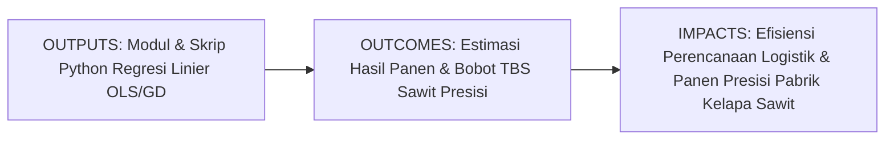
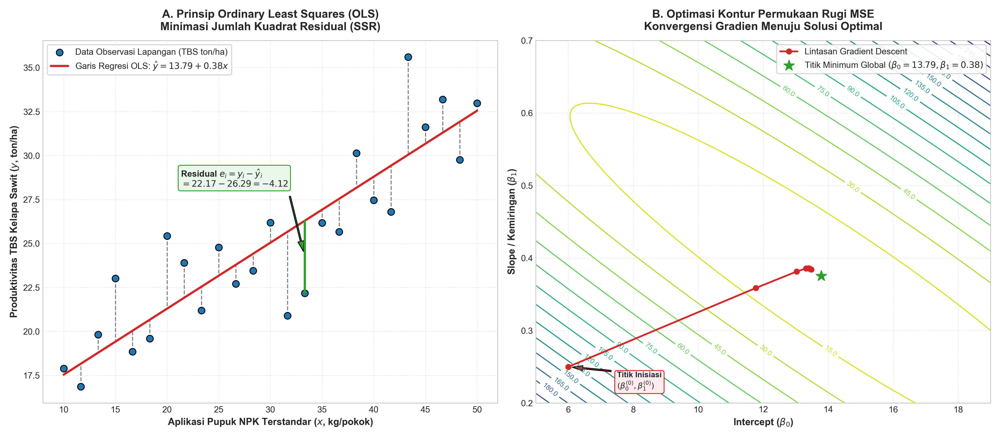
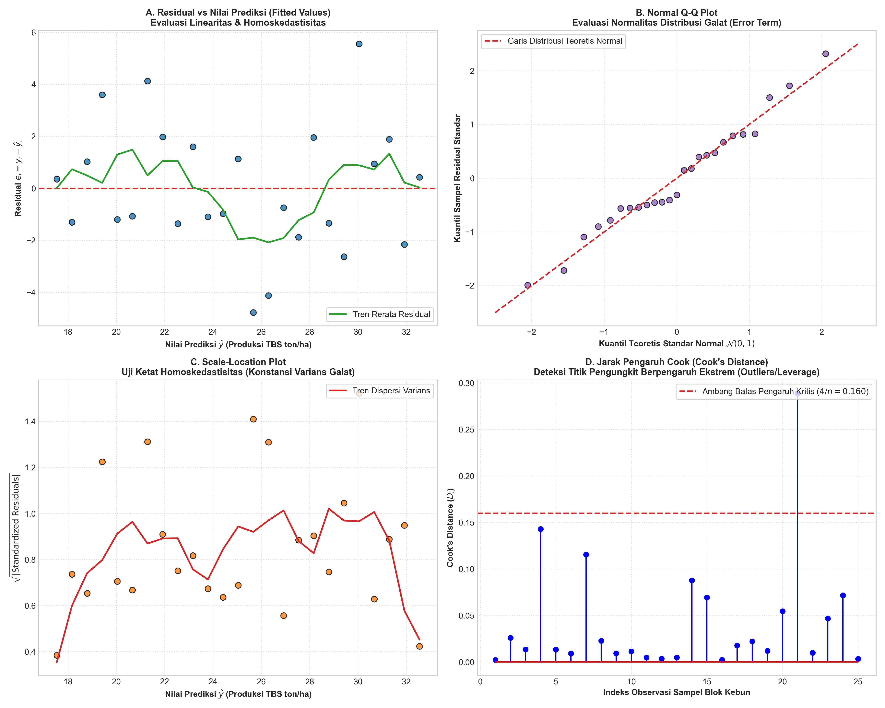

# AI Modul 7.1: Linear Regression

---

## 1. Identitas & Kerangka Capaian Pembelajaran (Sub-CPMK)

* **Kode Modul**: AI Modul 7.1
* **Mata Kuliah**: Kecerdasan Buatan dan Sains Data Pertanian Presisi
* **Alokasi Waktu**: 2 x 50 Menit (Kajian Teori & Diskusi) + 2 x 50 Menit (Eksplorasi Praktikum Mandiri)
* **Beban SKS**: 3 SKS
* **Prasyarat**: AI Modul 4.2 (NumPy Komputasi Numerik), AI Modul 4.3 (Pandas Manipulasi Data), AI Modul 5.6 (Proses Training Model), AI Modul 5.7 (Evaluasi Model)
* **Level Kognitif**: Bloom C2 (Memahami), C3 (Menerapkan), C4 (Menganalisis)



### 1.1 Capaian Pembelajaran Khusus (Sub-CPMK)
Setelah menyelesaikan modul ini secara komprehensif, mahasiswa diharapkan mampu:
1. **Memahami (C2)** prinsip matematis regresi linier sederhana dan berganda melalui metode Ordinary Least Squares (OLS) serta algoritma optimasi Gradient Descent.
2. **Menerapkan (C3)** pemodelan regresi linier menggunakan Scikit-Learn dan formulasi aljabar linier murni (NumPy) pada dataset agronomi perkebunan kelapa sawit (prediksi produksi ton TBS berdasarkan curah hujan, pemupukan, dan radiasi surya).
3. **Menganalisis (C4)** asumsi-asumsi klasik Gauss-Markov (linearitas, homoskedastisitas, no endogeneity, multikolinearitas dengan VIF, dan normalitas residual) serta menginterpretasikan koefisien determinasi ($R^2$, Adjusted $R^2$, MAE, RMSE) guna mencegah estimasi bias.

### 1.2 Kerangka Hasil Pembelajaran (Outputs, Outcomes, & Impacts)
* **Outputs (Keluaran Langsung)**:
  * Penguasaan formulasi analitik OLS ($\hat{\boldsymbol{\beta}} = (\mathbf{X}^T \mathbf{X})^{-1} \mathbf{X}^T \mathbf{y}$) dan turunan gradien fungsi rugi MSE.
  * Skrip Python berstandar PEP 8 untuk fitting model, diagnostik residual, dan visualisasi garis regresi beserta interval kepercayaan.
  * Laporan evaluasi pemenuhan uji asumsi klasik Gauss-Markov dan multikolinearitas (VIF).
* **Outcomes (Kompetensi Aplikatif)**:
  * Kemampuan merancang model regresi linier tepercaya untuk mengestimasi produktivitas tanaman atau parameter mutu CPO berdasarkan variabel agroklimat dan agronomi.
  * Keahlian dalam mendiagnosis anomali data (*outliers*, *leverage points*, heteroskedastisitas) dan melakukan transformasi variabel (logaritma, standardisasi).
* **Impacts (Dampak Strategis Jangka Panjang)**:
  * Peningkatan akurasi peramalan panen dan efisiensi rantai pasok pabrik kelapa sawit melalui integrasi machine learning prediktif.
  * Terbentuknya kultur rekayasa AI berbasis data empiris yang akuntabel, transparan, dan dapat diinterpretasikan secara ilmiah di sektor agribisnis dan perkebunan.

---

## 2. Profil Fundamental Algoritma: Fungsi, Manfaat, dan Keunggulan-Kelemahan

### 2.1 Fungsi Komputasi & Pemodelan Matematis
Regresi Linier (*Linear Regression*) adalah algoritma pembelajaran mesin terawasi (*supervised learning*) parametrik yang berfungsi untuk:
1. **Memodelkan Hubungan Fungsional Kontinu**: Mengestimasi korelasi linier antara satu atau lebih variabel prediktor ($X_1, X_2, \dots, X_p$) dengan variabel target numerik skalar kontinu ($y \in \mathbb{R}$).
2. **Kalkulasi Efek Marjinal Parsial**: Menghitung laju perubahan nilai target untuk setiap peningkatan satu unit pada variabel prediktor tertentu ketika variabel lainnya dijaga konstan (*ceteris paribus*).
3. **Interpolasi Prediktif**: Memproyeksikan estimasi nilai masa depan berdasarkan titik-titik koordinat data historis.

### 2.2 Manfaat Nyata di Industri Perkebunan & Agribisnis
Penerapan regresi linier memberikan manfaat strategis langsung pada operasional agro-industri kelapa sawit:
* **Perencanaan Logistik & Transportasi Panen**: Memberikan estimasi tonase Tandan Buah Segar (TBS) yang akan dipanen di setiap blok kebun 3–6 bulan ke depan, memungkinkan penjadwalan armada truk pengangkut yang efisien.
* **Optimalisasi Kapasitas Olah Pabrik Kelapa Sawit (PKS)**: Menghindari penumpukan buah di *loading ramp* yang memicu kenaikan asam lemak bebas (FFA) atau sebaliknya kekurangan pasokan bahan baku olah.
* **Efisiensi Anggaran Pemupukan Presisi**: Menentukan kurva dosis rekomendasi pupuk NPK/MOP berbasis respon pertumbuhan vegetatif tanaman untuk mencegah pemborosan biaya hara.

### 2.3 Rationale: Alasan Mengapa Algoritma Ini Digunakan
Mengapa praktisi dan ilmuwan data memilih Regresi Linier di tengah maraknya algoritma modern seperti Deep Learning atau XGBoost?
1. **Transparansi Mutlak (*Full Interpretability / White-Box Model*)**: Berbeda dengan arsitektur jaringan saraf tiruan yang sering dianggap "kotak hitam", regresi linier memiliki bobot koefisien $\beta_j$ yang dapat dibaca, divalidasi, dan dipertanggungjawabkan secara saintifik kepada agronom dan auditor perkebunan.
2. **Tolok Ukur Standar (*The Ultimate Baseline Model*)**: Dalam rekayasa machine learning profesional, regresi linier adalah model pertama yang wajib dibangun untuk mengukur rasio sinyal terhadap derau (*signal-to-noise ratio*) sebelum memutuskan apakah kompleksitas model non-linier diperlukan.
3. **Efisiensi Komputasi Ekstrem**: Memiliki solusi analitik bentuk tertutup OLS yang dapat dihitung dalam hitungan milidetik tanpa memerlukan infrastruktur akselerator GPU.
4. **Validitas Inferensi Statistik**: Memungkinkan pengujian hipotesis klasik (uji signifikansi koefisien melalui uji t, uji simultan model via uji F, dan penentuan interval keyakinan 95%).

### 2.4 Analisis Kelebihan dan Kekurangan

| Dimensi Evaluasi | Kelebihan (*Strengths*) | Kekurangan (*Limitations*) |
|:---|:---|:---|
| **Keterpahaman (*Interpretability*)** | Sangat tinggi; setiap bobot $\beta_j$ memiliki makna fisik langsung yang jelas. | Hanya mampu memodelkan relasi linier atau polinomial terdefinisi; gagal menangkap interaksi non-linier kompleks yang tersembunyi. |
| **Kecepatan & Sumber Daya** | Waktu pelatihan dan inferensi sangat cepat; memori RAM sangat hemat. | Rentan terhadap pembengkakan komputasi invers matriks $\mathcal{O}(p^3)$ jika jumlah fitur $p$ melebihi jutaan (diatasi dengan Gradient Descent). |
| **Kebutuhan Data** | Mampu bekerja sangat baik pada sampel data kecil ($n < 100$) tanpa *overfitting* parah. | Sangat sensitif terhadap titik pencilan ekstrem (*outliers*) dan titik pengungkit (*high leverage points*). |
| **Asumsi Model** | Landasan teoritis inferensi statistik sangat matang (Teorema Gauss-Markov). | Membutuhkan kepatuhan ketat terhadap asumsi klasik (linearitas, homoskedastisitas, non-multikolinearitas, no endogeneity). |

### 2.5 Contoh Kasus Penggunaan Konkret di Sektor Agro-Industri
1. **Estimasi Produktivitas Kelapa Sawit (Ton TBS/Ha)** berdasarkan akumulasi curah hujan tahunan (mm), defisit air bulanan, dan jam penyinaran matahari.
2. **Prediksi Rendemen Ekstraksi Minyak (*Oil Extraction Rate* / OER %)** berdasarkan lama waktu tunda angkut buah dari kebun ke pabrik dan rasio fraksi kematangan tandan.
3. **Kalibrasi Sensor Spektroskopi NIR Laboratorium**: Memetakan spektrum serapan panjang gelombang inframerah terhadap kadar asam lemak bebas (FFA) minyak kelapa sawit mentah (CPO).

### 2.6 Aspek Kritis & Catatan Penting Algoritma (*Key Critical Insights*)
* **Multikolinearitas Tersembunyi**: Waspadai korelasi tinggi antar-fitur (misal: dosis pupuk NPK dengan dosis pupuk Urea). Multikolinearitas tidak merusak akurasi prediksi keseluruhan, namun merusak validitas estimasi nilai individual $\beta_j$ dan dapat membalikkan arah tanda koefisien biologis. Selalu evaluasi nilai *Variance Inflation Factor* (VIF).
* **Asumsi Homoskedastisitas**: Jika sebaran residual membentuk corong (*fan-shaped*), standar eror estimator menjadi bias. Lakukan transformasi logaritma ($\ln y$) atau gunakan *Weighted Least Squares* (WLS).
* **Ekstrapolasi Liar**: Jangan pernah menggunakan model regresi linier di luar interval rentang data latih ($x_{\text{baru}} \notin [x_{\min}, x_{\max}]$) karena relasi biologis tanaman akan jenuh atau mengalami keracunan hara (*Law of Diminishing Marginal Returns*).



---

## 3. Teori Matematis Regresi Linier

Secara matematis, regresi linier memodelkan hubungan linier antara ruang input dan ruang target. Pendekatan ini terbagi menjadi dua paradigma utama: Regresi Linier Sederhana (*Simple Linear Regression*) dengan satu variabel penjelas, dan Regresi Linier Berganda (*Multiple Linear Regression*) dengan banyak variabel penjelas.

### 3.1 Regresi Linier Sederhana (Simple Linear Regression)

Model probabilistik regresi linier sederhana dirumuskan sebagai berikut:

$$y_i = \beta_0 + \beta_1 x_i + \epsilon_i, \quad i = 1, 2, \dots, n$$

**Keterangan Simbol**:
* $y_i$: Nilai aktual variabel target pada observasi ke-$i$ (misal: produktivitas TBS dalam ton/ha).
* $x_i$: Nilai variabel penjelas pada observasi ke-$i$ (misal: dosis pupuk NPK dalam kg/pokok).
* $\beta_0$: Intersep (*intercept*), yaitu nilai ekspektasi $y$ ketika $x = 0$.
* $\beta_1$: Kemiringan (*slope*), yaitu laju perubahan nilai ekspektasi $y$ untuk setiap kenaikan satu satuan $x$.
* $\epsilon_i$: Suku galat acak (*random error term*) yang tidak teramati pada observasi ke-$i$, diasumsikan berdistribusi normal identik independen $\epsilon_i \sim \mathcal{N}(0, \sigma^2)$.
* $n$: Jumlah total sampel observasi (blok kebun).

**Panduan Pembacaan Matematis**:
"y sub i sama dengan beta nol ditambah beta satu dikalikan x sub i, ditambah epsilon sub i, untuk indeks i sama dengan satu sampai n."

#### Formulasi Analitik Ordinary Least Squares (OLS)
Tujuan metode kuadrat terkecil (*Ordinary Least Squares* / OLS) adalah meminimalkan Jumlah Kuadrat Residual (*Sum of Squared Residuals* / SSR):

$$\text{SSR}(\beta_0, \beta_1) = \sum_{i=1}^n e_i^2 = \sum_{i=1}^n (y_i - \hat{y}_i)^2 = \sum_{i=1}^n (y_i - (\beta_0 + \beta_1 x_i))^2$$

**Panduan Pembacaan Matematis**:
"SSR fungsi beta nol dan beta satu sama dengan sigma i dari satu sampai n dari e sub i kuadrat, sama dengan sigma i dari satu sampai n dari kuadrat selisih y sub i dikurangi y topi sub i."

Dengan mencari turunan parsial terhadap $\beta_0$ dan $\beta_1$ lalu menyamakannya dengan nol ($\frac{\partial \text{SSR}}{\partial \beta_0} = 0$ dan $\frac{\partial \text{SSR}}{\partial \beta_1} = 0$), diperoleh solusi bentuk tertutup (*closed-form solution*):

$$\hat{\beta}_1 = \frac{\sum_{i=1}^n (x_i - \bar{x})(y_i - \bar{y})}{\sum_{i=1}^n (x_i - \bar{x})^2} = \frac{\text{Cov}(x, y)}{\text{Var}(x)}$$

$$\hat{\beta}_0 = \bar{y} - \hat{\beta}_1 \bar{x}$$

**Keterangan Simbol**:
* $\hat{\beta}_1, \hat{\beta}_0$: Estimator parameter regresi hasil taksiran OLS.
* $\bar{x}, \bar{y}$: Rerata sampel dari variabel penjelas $x$ dan variabel terikat $y$.
* $\text{Cov}(x, y)$: Kovarians sampel antara $x$ dan $y$.
* $\text{Var}(x)$: Varians sampel dari $x$.

**Panduan Pembacaan Matematis**:
"Beta satu topi sama dengan pembagian antara sigma selisih x sub i dikurangi x rata-rata dikali selisih y sub i dikurangi y rata-rata, dengan sigma selisih x sub i dikurangi x rata-rata dikuadratkan, yang setara dengan kovarians x dan y dibagi varians x. Sedangkan beta nol topi sama dengan y rata-rata dikurangi beta satu topi dikalikan x rata-rata."

---

### 3.2 Regresi Linier Berganda (Multiple Linear Regression)

Dalam skenario perkebunan riil, produktivitas tanaman tidak hanya dipengaruhi oleh satu jenis pupuk, melainkan dipengaruhi secara simultan oleh variabel curah hujan, radiasi matahari, umur tegakan pohon, dan ketinggian tempat. Kita memperluas model ke $p$ variabel penjelas:

$$y_i = \beta_0 + \beta_1 x_{i1} + \beta_2 x_{i2} + \dots + \beta_p x_{ip} + \epsilon_i$$

Dalam notasi aljabar linier matriks, sistem persamaan di atas diekspresikan sebagai:

$$\mathbf{y} = \mathbf{X}\boldsymbol{\beta} + \boldsymbol{\epsilon}$$

Di mana:
$$\mathbf{y} = \begin{bmatrix} y_1 \\ y_2 \\ \vdots \\ y_n \end{bmatrix}, \quad \mathbf{X} = \begin{bmatrix} 1 & x_{11} & x_{12} & \dots & x_{1p} \\ 1 & x_{21} & x_{22} & \dots & x_{2p} \\ \vdots & \vdots & \vdots & \ddots & \vdots \\ 1 & x_{n1} & x_{n2} & \dots & x_{np} \end{bmatrix}, \quad \boldsymbol{\beta} = \begin{bmatrix} \beta_0 \\ \beta_1 \\ \vdots \\ \beta_p \end{bmatrix}, \quad \boldsymbol{\epsilon} = \begin{bmatrix} \epsilon_1 \\ \epsilon_2 \\ \vdots \\ \epsilon_n \end{bmatrix}$$

**Keterangan Simbol**:
* $\mathbf{y} \in \mathbb{R}^{n \times 1}$: Vektor kolom variabel target.
* $\mathbf{X} \in \mathbb{R}^{n \times (p+1)}$: Matriks desain fitur (*design matrix*), di mana kolom pertama bernilai 1 sebagai pengali konstanta intersep $\beta_0$.
* $\boldsymbol{\beta} \in \mathbb{R}^{(p+1) \times 1}$: Vektor kolom koefisien parameter regresi.
* $\boldsymbol{\epsilon} \in \mathbb{R}^{n \times 1}$: Vektor kolom galat acak.

**Panduan Pembacaan Matematis**:
"Vektor tebal y sama dengan perkalian matriks tebal X dengan vektor tebal beta, ditambah vektor tebal epsilon."

#### Solusi Analitik Persamaan Normal (Normal Equation)
Fungsi objektif meminimalkan norma kuadrat residual:

$$J(\boldsymbol{\beta}) = \|\mathbf{y} - \mathbf{X}\boldsymbol{\beta}\|_2^2 = (\mathbf{y} - \mathbf{X}\boldsymbol{\beta})^T (\mathbf{y} - \mathbf{X}\boldsymbol{\beta}) = \mathbf{y}^T \mathbf{y} - 2\boldsymbol{\beta}^T \mathbf{X}^T \mathbf{y} + \boldsymbol{\beta}^T \mathbf{X}^T \mathbf{X}\boldsymbol{\beta}$$

Menghitung gradien vektor terhadap $\boldsymbol{\beta}$ dan menyamakannya dengan vektor nol:

$$\nabla_{\boldsymbol{\beta}} J(\boldsymbol{\beta}) = -2\mathbf{X}^T \mathbf{y} + 2\mathbf{X}^T \mathbf{X}\boldsymbol{\beta} = \mathbf{0}$$

$$\mathbf{X}^T \mathbf{X}\boldsymbol{\beta} = \mathbf{X}^T \mathbf{y}$$

Jika matriks Gram $\mathbf{X}^T \mathbf{X}$ memiliki peringkat penuh (*full column rank*) sehingga dapat dibalik (*invertible*), solusi parameter taksiran OLS adalah:

$$\hat{\boldsymbol{\beta}} = (\mathbf{X}^T \mathbf{X})^{-1} \mathbf{X}^T \mathbf{y}$$

**Keterangan Simbol**:
* $(\mathbf{X}^T \mathbf{X})^{-1}$: Invers dari matriks perkalian transpos matriks desain dengan matriks desain itu sendiri berukuran $(p+1) \times (p+1)$.
* $\mathbf{X}^T \mathbf{y}$: Vektor proyeksi dari transpos matriks desain terhadap target berukuran $(p+1) \times 1$.

**Panduan Pembacaan Matematis**:
"Beta topi sama dengan invers dari X transpos dikalikan X, dikalikan X transpos dikalikan y."

---

### 3.3 Optimasi Menggunakan Gradient Descent

Ketika ukuran data sangat besar (jumlah sampel $n > 10^6$ atau jumlah fitur $p > 10^4$), operasi komputasi invers matriks $(\mathbf{X}^T \mathbf{X})^{-1}$ yang memiliki kompleksitas waktu $\mathcal{O}(p^3)$ menjadi sangat lambat dan membebani memori kerja RAM. Sebagai alternatif, kita menggunakan algoritma optimasi iteratif berbasis kalkulus diferensial: **Gradient Descent**.

Fungsi rugi (*Loss Function*) Mean Squared Error (MSE):

$$\mathcal{L}(\boldsymbol{\beta}) = \frac{1}{n} \sum_{i=1}^n (y_i - \hat{y}_i)^2 = \frac{1}{n} \|\mathbf{y} - \mathbf{X}\boldsymbol{\beta}\|_2^2$$

**Panduan Pembacaan Matematis**:
"Loss fungsi beta sama dengan satu per n dikalikan jumlah kuadrat norma selisih y dikurangi X dikali beta."

Gradien fungsi rugi terhadap vektor parameter $\boldsymbol{\beta}$:

$$\nabla_{\boldsymbol{\beta}} \mathcal{L}(\boldsymbol{\beta}) = -\frac{2}{n} \mathbf{X}^T (\mathbf{y} - \mathbf{X}\boldsymbol{\beta}) = \frac{2}{n} \mathbf{X}^T (\mathbf{X}\boldsymbol{\beta} - \mathbf{y})$$

Aturan pembaruan parameter (*Parameter Update Rule*):

$$\boldsymbol{\beta}^{(t+1)} = \boldsymbol{\beta}^{(t)} - \alpha \nabla_{\boldsymbol{\beta}} \mathcal{L}(\boldsymbol{\beta}^{(t)}) = \boldsymbol{\beta}^{(t)} - \frac{2\alpha}{n} \mathbf{X}^T (\mathbf{X}\boldsymbol{\beta}^{(t)} - \mathbf{y})$$

**Keterangan Simbol**:
* $\boldsymbol{\beta}^{(t)}$: Nilai estimasi parameter pada iterasi ke-$t$.
* $\alpha$: Laju pembelajaran (*learning rate*), hiperparameter penentu ukuran langkah pembaruan gradien.
* $\nabla_{\boldsymbol{\beta}} \mathcal{L}$: Vektor turunan parsial berarah tingkat perubahan tercepat.

**Panduan Pembacaan Matematis**:
"Beta pada iterasi t tambah satu sama dengan beta pada iterasi t dikurangi alfa dikalikan gradien loss terhadap beta pada iterasi t."

---

### 3.4 Asumsi-Asumsi Klasik Gauss-Markov

Menurut **Teorema Gauss-Markov**, jika sekumpulan asumsi klasik terpenuhi, maka estimator OLS $\hat{\boldsymbol{\beta}}$ merupakan **BLUE** (*Best Linear Unbiased Estimator*), yang berarti memiliki varians terkecil di antara seluruh estimator linier yang tak bias.

1. **Linearitas Parameter (*Linearity in Parameters*)**:
   Model harus linier terhadap koefisien parameternya $\boldsymbol{\beta}$, bukan terhadap variabel $x$. Model $y = \beta_0 + \beta_1 x^2 + \epsilon$ tetap merupakan regresi linier.
2. **Ekspektasi Galat Bersyarat Bernilai Nol (*Strict Exogeneity*)**:
   $$E[\epsilon_i \mid \mathbf{X}] = 0$$
   Variabel penjelas tidak berkorelasi dengan suku galat (*no endogeneity*). Pelanggaran terjadi bila ada variabel penting yang luput dari model (*omitted variable bias*).
   **Panduan Pembacaan Matematis**: "Nilai ekspektasi dari epsilon sub i dengan syarat matriks X bernilai nol."
3. **Homoskedastisitas (*Constant Variance of Errors*)**:
   $$\text{Var}(\epsilon_i \mid \mathbf{X}) = \sigma^2, \quad \forall i$$
   Varians dari galat konstan di seluruh rentang nilai prediksi. Jika varians galat membesar seiring membesarnya produksi (misalnya fluktuasi panen di blok luas jauh lebih liar), terjadi **heteroskedastisitas**, yang menyebabkan standar eror estimator menjadi bias dan uji signifikansi tidak valid.
   **Panduan Pembacaan Matematis**: "Varians dari epsilon sub i dengan syarat matriks X sama dengan sigma kuadrat untuk setiap indeks i."
4. **Bebas Autokorelasi (*No Serial Correlation*)**:
   $$\text{Cov}(\epsilon_i, \epsilon_j \mid \mathbf{X}) = 0, \quad \forall i \neq j$$
   Galat pada satu observasi tidak berhubungan dengan galat observasi lain. Sering dilanggar pada data deret waktu (*time series*) panen bulanan karena pengaruh musiman.
   **Panduan Pembacaan Matematis**: "Kovarians antara epsilon sub i dan epsilon sub j dengan syarat matriks X bernilai nol untuk setiap i tidak sama dengan j."
5. **Tidak Ada Multikolinearitas Sempurna (*No Perfect Multicollinearity*)**:
   Matriks $\mathbf{X}$ harus memiliki peringkat kolom penuh ($p+1$). Tidak ada variabel bebas yang merupakan kombinasi linier sempurna dari variabel bebas lainnya.
   Tingkat multikolinearitas diuji menggunakan **Variance Inflation Factor (VIF)**:
   $$\text{VIF}_j = \frac{1}{1 - R_j^2}$$
   Di mana $R_j^2$ adalah koefisien determinasi yang diperoleh saat variabel $x_j$ diregresikan terhadap semua variabel penjelas lainnya.
   * Nilai $\text{VIF} < 5$: Tidak ada indikasi multikolinearitas bermasalah.
   * Nilai $\text{VIF} > 10$: Terjadi multikolinearitas parah; standar eror membengkak dan interpretasi signifikansi variabel individual menjadi tidak tepercaya.
   **Panduan Pembacaan Matematis**: "VIF variabel ke-j sama dengan satu dibagi selisih satu dikurangi R sub j kuadrat."
6. **Normalitas Galat (*Normality of Residuals*)**:
   $$\boldsymbol{\epsilon} \mid \mathbf{X} \sim \mathcal{N}(\mathbf{0}, \sigma^2 \mathbf{I})$$
   Diperlukan untuk validitas inferensi sampel kecil (uji t pada koefisien dan uji F untuk signifikansi model simultan).
   **Panduan Pembacaan Matematis**: "Vektor epsilon dengan syarat matriks X berdistribusi normal dengan vektor rata-rata nol dan matriks kovarians sigma kuadrat dikalikan matriks identitas I."



---

### 3.5 Metrik Evaluasi Regresi

Untuk mengukur performa prediksi model regresi linier terhadap target kontinu, digunakan metrik matematis standar:

#### Mean Absolute Error (MAE)
$$\text{MAE} = \frac{1}{n} \sum_{i=1}^n |y_i - \hat{y}_i|$$
Mengukur rerata magnitudo galat tanpa mempertimbangkan arah positif/negatif. Memiliki satuan yang sama persis dengan variabel target (misal: ton TBS/ha).
**Panduan Pembacaan Matematis**: "MAE sama dengan satu per n dikalikan sigma i dari satu sampai n dari nilai mutlak selisih y sub i dikurangi y topi sub i."

#### Root Mean Squared Error (RMSE)
$$\text{RMSE} = \sqrt{\frac{1}{n} \sum_{i=1}^n (y_i - \hat{y}_i)^2}$$
Memberikan penalti kuadratik yang lebih berat terhadap galat berukuran besar (*large errors/outliers*). Sangat diandalkan jika kegagalan prediksi ekstrem menimbulkan biaya operasional yang mahal pada pabrik.
**Panduan Pembacaan Matematis**: "RMSE sama dengan akar kuadrat dari satu per n dikalikan sigma i dari satu sampai n dari kuadrat selisih y sub i dikurangi y topi sub i."

#### Koefisien Determinasi ($R^2$)
$$R^2 = 1 - \frac{\text{SS}_{\text{res}}}{\text{SS}_{\text{tot}}} = 1 - \frac{\sum_{i=1}^n (y_i - \hat{y}_i)^2}{\sum_{i=1}^n (y_i - \bar{y})^2}$$
Merepresentasikan proporsi varians variabel target yang berhasil dijelaskan oleh variabel penjelas dalam model. Bernilai maksimal 1.0 (prediksi sempurna) dan dapat bernilai negatif jika performa model lebih buruk daripada sekadar menebak nilai rerata $\bar{y}$.
**Panduan Pembacaan Matematis**: "R kuadrat sama dengan satu dikurangi pembagian jumlah kuadrat residual SS res dengan jumlah kuadrat total SS tot."

#### Adjusted $R^2$ ($R^2_{\text{adj}}$)
$$R^2_{\text{adj}} = 1 - \left[ \frac{(1 - R^2)(n - 1)}{n - p - 1} \right]$$
Menyesuaikan nilai $R^2$ dengan memberikan penalti terhadap penambahan variabel penjelas yang tidak memberikan kontribusi signifikan terhadap reduksi varians galat.
**Keterangan Simbol**:
* $n$: Jumlah total baris observasi.
* $p$: Jumlah variabel penjelas (fitur).
**Panduan Pembacaan Matematis**: "R kuadrat adjusted sama dengan satu dikurangi hasil kali selisih satu minus R kuadrat dengan n minus satu dibagi n minus p minus satu."

---

## 4. Arsitektur & Pipeline Komputasi Python

Dalam implementasi praktis di lingkungan komputasi ilmiah Python, terdapat dua alur kerja utama:
1. **Pendekatan Aljabar Linier Analitik (NumPy)**: Menggunakan Persamaan Normal untuk memahami mekanika komputasi fundamental.
2. **Pendekatan Produksi (Scikit-Learn & Statsmodels)**: Memanfaatkan API standar industri untuk inferensi statistik, *regularization*, dan integrasi *machine learning pipeline*.

Berikut perbandingan arsitektural implementasi OLS:

```python
import numpy as np

# 1. Pendekatan NumPy Manual (Persamaan Normal)
# X: matriks desain n x p, y: vektor target n x 1
def fit_ols_manual(X: np.ndarray, y: np.ndarray) -> np.ndarray:
    # Tambahkan kolom konstan (bias)
    X_design = np.column_stack([np.ones(X.shape[0]), X])
    # Hitung beta = (X^T X)^-1 X^T y menggunakan solver stabil
    beta = np.linalg.solve(X_design.T @ X_design, X_design.T @ y)
    return beta

# 2. Pendekatan Scikit-Learn (Standar Industri)
from sklearn.linear_model import LinearRegression
model = LinearRegression(fit_intercept=True)
model.fit(X, y)
# model.intercept_ -> beta_0
# model.coef_      -> [beta_1, beta_2, ..., beta_p]
```

---

## 5. Studi Kasus Komprehensif: Prediksi Produksi TBS Sawit

### 5.1 Deskripsi Skenario & Data Agribisnis
Divisi Agronomi Perkebunan Kelapa Sawit INSTIPER mengumpulkan data riwayat 120 blok perkebunan di wilayah Riau. Variabel yang diobservasi meliputi:
* $X_1$: **Curah Hujan Tahunan** (mm/tahun). Rentang optimal tanaman sawit: 2.000 – 2.500 mm.
* $X_2$: **Dosis Pemupukan NPK** (kg/pokok/tahun).
* $X_3$: **Lama Penyinaran Matahari** (jam/hari).
* $X_4$: **Defisit Air / Water Deficit** (mm/tahun). Indikator kekeringan yang menekan pembentukan bunga betina.
* $y$: **Produktivitas Tandan Buah Segar (TBS)** (ton/ha/tahun).

### 5.2 Implementasi Kode Terpadu & Diagnostik Model
Berikut adalah alur lengkap pemodelan, estimasi parameter, evaluasi metrik, dan pengujian diagnostik multikolinearitas (VIF):

```python
import numpy as np
import pandas as pd
from sklearn.model_selection import train_test_split
from sklearn.linear_model import LinearRegression
from sklearn.metrics import mean_absolute_error, mean_squared_error, r2_score
from statsmodels.stats.outliers_influence import variance_inflation_factor

# 1. Pembentukan Dataset Sintetis Realistis Berbasis Agronomi
np.random.seed(42)
n_samples = 120

curah_hujan = np.random.uniform(1600, 2800, n_samples)
pupuk_npk = np.random.uniform(4.0, 9.5, n_samples)
radiasi_surya = np.random.uniform(4.5, 7.5, n_samples)
defisit_air = np.maximum(0, 2400 - curah_hujan) * np.random.uniform(0.15, 0.25, n_samples)

# Relasi riil: y = 8.5 + 0.0035*(Hujan) + 1.25*(NPK) + 0.85*(Radiasi) - 0.015*(Defisit) + galat
noise = np.random.normal(0, 1.2, n_samples)
yield_tbs = 8.5 + 0.0035 * curah_hujan + 1.25 * pupuk_npk + 0.85 * radiasi_surya - 0.015 * defisit_air + noise

df_sawit = pd.DataFrame({
    'Curah_Hujan_mm': curah_hujan,
    'Pupuk_NPK_kg': pupuk_npk,
    'Radiasi_Jam': radiasi_surya,
    'Defisit_Air_mm': defisit_air,
    'Yield_TBS_TonHa': yield_tbs
})

# 2. Pemisahan Fitur dan Partisi Dataset (80% Train, 20% Test)
X = df_sawit[['Curah_Hujan_mm', 'Pupuk_NPK_kg', 'Radiasi_Jam', 'Defisit_Air_mm']]
y = df_sawit['Yield_TBS_TonHa']

X_train, X_test, y_train, y_test = train_test_split(X, y, test_size=0.2, random_state=42)

# 3. Fitting Model Regresi Linier OLS
reg_sawit = LinearRegression()
reg_sawit.fit(X_train, y_train)

# 4. Prediksi dan Evaluasi Metrik
y_pred = reg_sawit.predict(X_test)
mae = mean_absolute_error(y_test, y_pred)
rmse = np.sqrt(mean_squared_error(y_test, y_pred))
r2 = r2_score(y_test, y_pred)
adj_r2 = 1 - (1 - r2) * (len(y_test) - 1) / (len(y_test) - X_test.shape[1] - 1)

print("=== HASIL EVALUASI MODEL REGRESI LINIER PREDIKSI TBS ===")
print(f"Intercept (Beta_0)   : {reg_sawit.intercept_:.4f}")
for col, coef in zip(X.columns, reg_sawit.coef_):
    print(f"Koefisien {col:<15} : {coef:+.4f}")
print("---------------------------------------------------------")
print(f"MAE                  : {mae:.3f} Ton/Ha")
print(f"RMSE                 : {rmse:.3f} Ton/Ha")
print(f"R-Squared (R2)       : {r2:.4f}")
print(f"Adjusted R-Squared   : {adj_r2:.4f}")

# 5. Uji Multikolinearitas (Variance Inflation Factor / VIF)
X_vif = X_train.copy()
X_vif.insert(0, 'Intercept', 1.0)
vif_series = pd.Series(
    [variance_inflation_factor(X_vif.values, i) for i in range(1, X_vif.shape[1])],
    index=X.columns
)
print("\n=== UJI MULTIKOLINEARITAS (VARIANCE INFLATION FACTOR) ===")
print(vif_series.round(3))
```

---

## 6. Kekeliruan Metodologis dan Praktik Terbaik (*Common Pitfalls & Best Practices*)

Dalam menerapkan regresi linier pada proyek kecerdasan buatan terapan di bidang perkebunan, terdapat beberapa kekeliruan metodologis yang wajib dihindari:

1. **Multikolinearitas yang Menyamar**:
   * *Bentuk Kekeliruan*: Memasukkan variabel penjelas yang memiliki korelasi sangat tinggi secara serentak (misalnya memasukkan 'Dosis Urea' dan 'Dosis Total Nitrogen'). Hal ini menyebabkan matriks $\mathbf{X}^T \mathbf{X}$ mendekati singular (*ill-conditioned*), menghasilkan nilai VIF $> 10$, standar eror meledak, dan tanda koefisien menjadi tidak logis (misal: pupuk bertanda negatif padahal secara agronomi menyuburkan).
   * *Solusi*: Lakukan inspeksi matriks korelasi Pearson dan hitung VIF sebelum pelatihan. Gugurkan salah satu variabel redundan atau gunakan teknik regularisasi Ridge/Lasso.
2. **Korelasi Palsu (*Spurious Correlation*) vs Hubungan Kausalitas**:
   * *Bentuk Kekeliruan*: Menemukan nilai $R^2$ tinggi antara dua variabel yang sama sekali tidak memiliki mekanisme kausal biologis (misalnya korelasi antara jumlah penjualan smartphone di kota dengan produksi kelapa sawit di pedalaman karena keduanya sama-sama naik mengikuti waktu).
   * *Solusi*: Selalu validasi pemilihan variabel bersama pakar agronomi (*domain expert*). Regresi hanya memodelkan asosiasi statistis, bukan membuktikan kausalitas sebab-akibat.
3. **Ekstrapolasi Liar di Luar Domain Pelatihan (*Out-of-Domain Extrapolation*)**:
   * *Bentuk Kekeliruan*: Menggunakan model yang dilatih pada rentang pupuk 4–10 kg/pokok untuk memprediksi hasil jika dosis dinaikkan menjadi 30 kg/pokok. Pada dosis ekstrem, tanaman akan mengalami keracunan hara (*nutrient toxicity*), sedangkan model linier akan secara keliru memprediksi panen melesat tanpa batas.
   * *Solusi*: Batasi inferensi operasional model hanya pada interval distribusi data latih ($x_{\min} \le x_{\text{baru}} \le x_{\max}$).
4. **Mengabaikan Titik Pengungkit Berpengaruh (*Influential Points & High Leverage*)**:
   * *Bentuk Kekeliruan*: Sebuah blok kebun yang mengalami anomali pencatatan (misalnya salah ketik 100 kg pupuk) dapat menarik garis regresi secara drastis (*tilt the slope*), merusak prediksi untuk seluruh 119 blok lainnya.
   * *Solusi*: Hitung Jarak Cook (*Cook's Distance*) $D_i$. Observasi dengan $D_i > \frac{4}{n}$ harus diisolasi dan diinvestigasi integritas datanya.
5. **Skala Fitur yang Tidak Sama pada Gradient Descent**:
   * *Bentuk Kekeliruan*: Menjalankan algoritma Gradient Descent langsung pada data mentah di mana satu fitur berskala ribuan ($X_1 \approx 2000$) dan fitur lain bernilai satuan ($X_2 \approx 5$). Kontur fungsi rugi MSE akan berbentuk elips sangat lonjong (*elongated valley*), menyebabkan osilasi gradien liar dan konvergensi sangat lambat.
   * *Solusi*: Terapkan *StandardScaler* ($z = \frac{x - \mu}{\sigma}$) atau *MinMaxScaler* sebelum optimasi numerik.

---

## 7. Rangkuman Modul

1. **Regresi Linier** adalah fondasi supervised learning untuk target kontinu yang memodelkan relasi fungsional parameter $\boldsymbol{\beta}$ secara transparan dan terinterpretasi.
2. Metode **Ordinary Least Squares (OLS)** menghasilkan solusi analitik bentuk tertutup $\hat{\boldsymbol{\beta}} = (\mathbf{X}^T \mathbf{X})^{-1} \mathbf{X}^T \mathbf{y}$ dengan meminimalkan jumlah kuadrat residual (SSR).
3. **Gradient Descent** merupakan teknik optimasi iteratif berbasis kalkulus diferensial yang memperbarui bobot model dengan melangkah melawan arah vektor gradien fungsi rugi MSE, sangat efisien untuk dataset berskala besar.
4. Estimator OLS bersifat **BLUE** (*Best Linear Unbiased Estimator*) jika memenuhi asumsi-asumsi klasik Gauss-Markov: linearitas, eksogenitas murni, homoskedastisitas, non-autokorelasi, dan ketiadaan multikolinearitas sempurna.
5. Evaluasi model dilakukan menggunakan metrik **MAE** (interpretasi selisih riil), **RMSE** (penalti kuadratik atas eror besar), dan **$R^2$ / Adjusted $R^2$** (persentase varians yang dapat diterangkan model dengan penalti jumlah fitur).

---

## 8. Latihan Soal & Tugas Analitis HOTS

Kerjakan soal-soal penalaran tingkat tinggi (*Higher-Order Thinking Skills*) berikut:

1. **Analisis Komputasi OLS Manual (C3)**:
   Diberikan data sampel 5 blok kebun uji mengenai dosis pupuk hayati mikroba ($x$ dalam liter/ha) dan peningkatan produksi TBS ($y$ dalam ton/ha):
   * $(x_1, y_1) = (2, 4)$
   * $(x_2, y_2) = (4, 7)$
   * $(x_3, y_3) = (6, 9)$
   * $(x_4, y_4) = (8, 12)$
   * $(x_5, y_5) = (10, 13)$
   
   Hitunglah secara analitik manual:
   * Nilai rerata $\bar{x}$ dan $\bar{y}$.
   * Nilai kovarians sampel $\text{Cov}(x, y)$ dan varians sampel $\text{Var}(x)$.
   * Estimator parameter OLS $\hat{\beta}_1$ (slope) dan $\hat{\beta}_0$ (intercept).
   * Taksiran prediksi peningkatan panen $\hat{y}$ jika diaplikasikan pupuk sebesar $x = 7$ liter/ha.

2. **Evaluasi Diagnostik Multikolinearitas & VIF (C4)**:
   Dalam pemodelan regresi linier berganda untuk memprediksi kadar Asam Lemak Bebas (*Free Fatty Acids* / FFA) pada minyak CPO, seorang analis data memasukkan variabel penjelas: Suhu Perebusan Sterilizer ($X_1$), Tekanan Uap Uap Basah ($X_2$), dan Suhu Tangki Klarifikasi ($X_3$). Regresi variabel $X_1$ terhadap $X_2$ dan $X_3$ menghasilkan koefisien determinasi $R_1^2 = 0.95$.
   * Hitung nilai $\text{VIF}_1$ untuk variabel suhu perebusan tersebut.
   * Jelaskan konsekuensi matematis terhadap varians dari estimator koefisien $\text{Var}(\hat{\beta}_1)$.
   * Apa langkah perbaikan yang paling rasional untuk mengatasi kondisi tersebut?

3. **Studi Kasus Patologi Heteroskedastisitas (C4)**:
   Sebuah model regresi linier memprediksi total produksi panen TBS sawit di 200 blok perkebunan. Saat dilakukan inspeksi diagram sebar antara nilai prediksi $\hat{y}$ dengan nilai residual $e_i$, ditemukan pola menyerupai kipas (*fan-shaped pattern* / corong terbuka ke kanan), di mana blok-blok dengan prediksi hasil tinggi memiliki dispersi residual yang jauh lebih lebar dibandingkan blok berproduksi rendah.
   * Asumsi Gauss-Markov mana yang dilanggar oleh fenomena tersebut?
   * Apakah estimator OLS $\hat{\boldsymbol{\beta}}$ yang diperoleh tetap tak bias (*unbiased*)? Mengapa estimator tersebut kehilangan predikat "BLUE"?
   * Sebutkan dua strategi transformasi data atau pemodelan yang dapat ditempuh untuk memulihkan asumsi tersebut.

---

## 9. Jembatan Konsep (Bridging) ke AI Modul 7.2: Logistic Regression

Pada modul ini, kita telah mempelajari secara mendalam bagaimana **Regresi Linier** memodelkan variabel target kontinu berhingga dalam $\mathbb{R}$ (seperti estimasi kuantitatif produktivitas panen TBS sawit dalam ton/ha atau estimasi rendemen CPO). Model ini mengandalkan asumsi distribusi galat kontinu Gaussian dan minimasi kuadrat residual (OLS).

Namun, bagaimana jika pertanyaan bisnis dan rekayasa di perkebunan berubah dari kuantitatif kontinu menjadi kategorikal kualitatif? Sebagai contoh:
* *"Apakah blok kebun ini terindikasi terserang penyakit busuk pangkal batang Ganoderma atau sehat?"* (Klasifikasi Biner: 0 atau 1)
* *"Apakah mutu minyak sawit CPO dari tangki ini lolos standar ekspor (Asam Lemak Bebas $< 3\%$) atau ditolak?"* (Klasifikasi Biner: 0 atau 1)

Jika kita memaksakan algoritma Regresi Linier OLS untuk memprediksi probabilitas variabel target diskret biner $\{0, 1\}$, kita akan membentur tiga limitasi matematis yang fatal:
1. **Prediksi Melampaui Batas Probabilitas**: Garis linier membentang dari $-\infty$ hingga $+\infty$. Pada nilai fitur tertentu, model dapat menghasilkan nilai prediksi $\hat{y} < 0$ atau $\hat{y} > 1$, yang secara aksioma peluang Kolmogorov tidak memiliki interpretasi probabilitas yang valid.
2. **Pelanggaran Asumsi Homoskedastisitas**: Pada target biner $y_i \in \{0, 1\}$, varians galat bersyarat bernilai $\text{Var}(\epsilon_i \mid x_i) = p_i(1 - p_i)$. Karena varians galat bergantung langsung pada nilai probabilitas sukses $p_i$, galat secara inheren bersifat heteroskedastis, sehingga menghilangkan sifat BLUE dari estimator OLS.
3. **Sensitivitas Ekstrem terhadap Outlier**: Keberadaan data amatan ekstrem (*extreme points*) akan memutar kemiringan garis linier secara signifikan, sehingga menggeser ambang batas keputusan (*decision boundary*) dan merusak akurasi pemisahan kelas.

Untuk mengatasi limitasi fundamental ini, kita memerlukan fungsi pemetaan non-linier yang memampatkan (*squashing*) seluruh rentang bilangan riil $(-\infty, +\infty)$ ke dalam interval probabilitas tertutup $[0, 1]$. Inilah titik tolak lahirnya **Regresi Logistik (Logistic Regression)**.

Pada **AI Modul 7.2: Logistic Regression**, kita akan mendalami:
* **Fungsi Sigmoid & Logit Transform**: Memetakan kombinasi linier fitur ke dalam ruang rasio probabilitas logaritmik (*log-odds*).
* **Fungsi Rugi Binary Cross-Entropy (Log Loss)**: Mengapa OLS tidak lagi cembung (*non-convex*) pada regresi logistik dan bagaimana optimasi *Maximum Likelihood Estimation* (MLE) mengatasi hal tersebut.
* **Penyetelan Ambang Batas Keputusan (*Threshold Tuning*)**: Mengatur titik batas probabilitas berdasarkan matriks biaya kerugian operasional di pabrik kelapa sawit.
* **Evaluasi Kurva Karakteristik Operasi Penerima (*ROC-AUC*)**: Mengukur kemampuan diskriminasi model klasifikasi dalam memisahkan TBS prima vs TBS afkir.

---

## 10. Daftar Pustaka dan Referensi Akademik

1. Bishop, C. M. (2006). *Pattern Recognition and Machine Learning*. Springer. [Tersedia di koleksi src/]
2. Géron, A. (2022). *Hands-On Machine Learning with Scikit-Learn, Keras, and TensorFlow* (3rd ed.). O'Reilly Media. [Tersedia di koleksi src/]
3. Hastie, T., Tibshirani, R., & Friedman, J. (2009). *The Elements of Statistical Learning: Data Mining, Inference, and Prediction* (2nd ed.). Springer. [Tersedia di koleksi src/]
4. James, G., Witten, D., Hastie, T., & Tibshirani, R. (2021). *An Introduction to Statistical Learning: with Applications in R* (2nd ed.). Springer. [Tersedia di koleksi src/]
5. Montgomery, D. C., Peck, E. A., & Vining, G. G. (2021). *Introduction to Linear Regression Analysis* (6th ed.). John Wiley & Sons.
6. Wooldridge, J. M. (2020). *Introductory Econometrics: A Modern Approach* (7th ed.). Cengage Learning.
