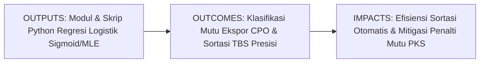
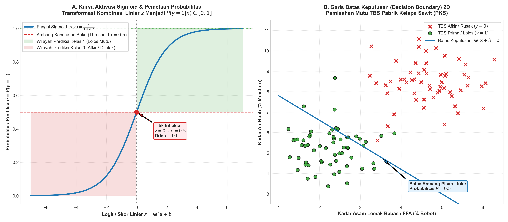
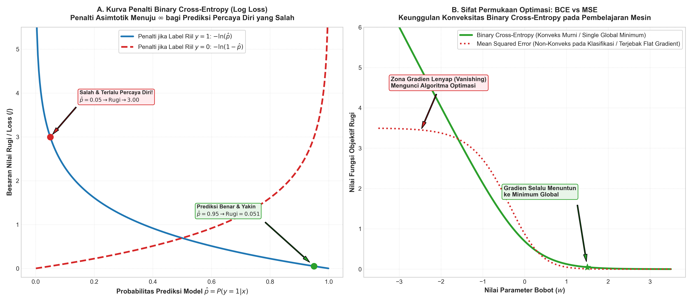

# AI Modul 7.2: Logistic Regression

---

## 1. Identitas & Kerangka Capaian Pembelajaran (Sub-CPMK)

* **Kode Modul**: AI Modul 7.2
* **Mata Kuliah**: Kecerdasan Buatan dan Sains Data Pertanian Presisi
* **Alokasi Waktu**: 2 x 50 Menit (Kajian Teori & Diskusi) + 2 x 50 Menit (Eksplorasi Praktikum Mandiri)
* **Beban SKS**: 3 SKS
* **Prasyarat**: AI Modul 5.2.1 (Supervised Learning), AI Modul 6.1 (Accuracy, Precision, Recall), AI Modul 6.2 (Confusion Matrix), AI Modul 7.1 (Linear Regression)
* **Level Kognitif**: Bloom C2 (Memahami), C3 (Menerapkan), C4 (Menganalisis)



### 1.1 Capaian Pembelajaran Khusus (Sub-CPMK)
Setelah menyelesaikan modul ini secara komprehensif, mahasiswa diharapkan mampu:
1. **Memahami (C2)** prinsip matematis fungsi aktivasi Sigmoid, konsep peluang (*probability*), rasio kemunculan (*odds*), dan transformasi logit dalam memetakan kombinasi linier ke rentang probabilitas tertutup $[0, 1]$.
2. **Menerapkan (C3)** pemodelan regresi logistik biner menggunakan Scikit-Learn dan formulasi matematis murni (NumPy) untuk mengklasifikasikan mutu minyak sawit mentah (*Crude Palm Oil* / CPO) dan sortasi kelayakan Tandan Buah Segar (TBS) di Pabrik Kelapa Sawit (PKS).
3. **Menganalisis (C4)** fungsi rugi *Binary Cross-Entropy* (Log Loss) melalui estimasi *Maximum Likelihood Estimation* (MLE), melakukan penyetelan ambang batas keputusan (*decision threshold tuning*) berbasis matriks biaya kesalahan, serta mengevaluasi daya pemisah model melalui kurva ROC-AUC.

### 1.2 Kerangka Hasil Pembelajaran (Outputs, Outcomes, & Impacts)
* **Outputs (Keluaran Langsung)**:
  * Penguasaan formulasi analitik fungsi Sigmoid $\sigma(z)$, turunan kalkulusnya, dan fungsi rugi Log Loss.
  * Skrip Python berstandar PEP 8 untuk *training* regresi logistik, ekstraksi probabilitas posterior, dan visualisasi garis batas keputusan (*decision boundary*).
  * Laporan optimasi ambang batas (*threshold*) berbasis analisis trade-off presisi-recall dan kurva ROC-AUC.
* **Outcomes (Kompetensi Aplikatif)**:
  * Kemampuan merancang sistem sortasi cerdas berbasis sensor laboratorium (FFA, kadar air, kotoran) untuk mendeteksi mutu CPO secara *real-time*.
  * Keahlian dalam memitigasi patologi data klasifikasi seperti ketidakseimbangan kelas (*class imbalance*) dan pemisahan sempurna (*complete separation*).
* **Impacts (Dampak Strategis Jangka Panjang)**:
  * Reduksi klaim penalti finansial (*claim penalty*) dari *buyer* internasional akibat pengiriman CPO di luar standar mutu ekspor.
  * Modernisasi operasional pabrik kelapa sawit menuju otomatisasi inspeksi mutu berbasis pembelajaran mesin yang objektif dan transparan.

---

## 2. Profil Fundamental Algoritma: Fungsi, Manfaat, dan Keunggulan-Kelemahan

### 2.1 Fungsi Komputasi & Pemodelan Matematis
Regresi Logistik (*Logistic Regression*) adalah algoritma pembelajaran mesin terawasi (*supervised learning*) parametrik yang berfungsi untuk:
1. **Memodelkan Probabilitas Bersyarat Diskrit**: Mengestimasi probabilitas posterior $P(y = 1 \mid \mathbf{x}) \in [0, 1]$ bahwa suatu sampel tergolong ke dalam kelas positif berdasarkan kombinasi linier fitur-fiturnya.
2. **Transformasi Log-Odds Linier**: Memetakan hubungan linier pada ruang logit $z = \mathbf{w}^T \mathbf{x} + b$ ke dalam kurva probabilitas non-linier berbentuk S melalui fungsi Sigmoid.
3. **Pembentukan Garis Batas Keputusan (*Decision Boundary*)**: Membagi ruang fitur menjadi wilayah keputusan diskrit melalui penetapan ambang batas probabilitas (*threshold* $\tau$).

### 2.2 Manfaat Nyata di Industri Perkebunan & Agribisnis
Penerapan regresi logistik memberikan manfaat langsung pada kendali mutu di pabrik kelapa sawit:
* **Mitigasi Penalti Finansial Mutu Ekspor**: Mencegah pengapalan minyak kelapa sawit mentah (CPO) berkualitas rendah ke pasar global dengan menyortir tangki timbun secara presisi berbasis batas toleransi Asam Lemak Bebas (FFA).
* **Automasi Verifikasi Kelayakan Olah TBS**: Menggantikan penilaian visual subyektif oleh petugas sortasi dengan keputusan algoritmik berbasis data analitis laboratorium mini.
* **Manajemen Risiko Terukur**: Karena model menghasilkan nilai peluang kontinu (bukan hanya label kaku 0 atau 1), manajemen pabrik dapat mengukur derajat keyakinan (*confidence level*) dari setiap keputusan sortasi.

### 2.3 Rationale: Alasan Mengapa Algoritma Ini Digunakan
Mengapa regresi logistik menjadi pilihan utama dalam sistem kendali mutu agro-industri?
1. **Solusi Alami Keterbatasan Regresi Linier**: Memecahkan masalah fatal regresi linier pada target biner, menjamin nilai keluaran selalu berada pada interval probabilitas tertutup $[0, 1]$ serta mengakomodasi sifat heteroskedastis alami dari variabel Bernoulli.
2. **Keterpahaman Berbasis Rasio Peluang (*Odds Ratio Interpretability*)**: Eksponensial dari bobot koefisien ($\exp(w_j)$) merepresentasikan perubahan rasio peluang (*odds ratio*) terjadinya kelas positif untuk setiap kenaikan satu satuan fitur $x_j$, memberikan pemahaman kausalitas bisnis yang sangat intuitif bagi manajemen.
3. **Kemudahan Penyetelan Ambang Batas Sensitif Biaya (*Cost-Sensitive Tuning*)**: Keluaran probabilitas yang terkalibrasi memudahkan pergeseran titik potong keputusan ($\tau$) sesuai asimetri kerugian finansial pabrik.
4. **Ringan dan Sangat Cepat**: Tidak memerlukan daya komputasi besar sehingga sangat ideal diimplementasikan pada mikrokontroler atau komputer industri di stasiun penerimaan buah PKS.

### 2.4 Analisis Kelebihan dan Kekurangan

| Dimensi Evaluasi | Kelebihan (*Strengths*) | Kekurangan (*Limitations*) |
|:---|:---|:---|
| **Karakteristik Output** | Menghasilkan probabilitas terkalibrasi $[0, 1]$, bukan sekadar label kelas kaku. | Rentan terhadap *overconfidence* pada data ekstrapolasi jauh dari distribusi pelatihan. |
| **Batas Keputusan** | Sederhana dan efisien; batas keputusan linier mencegah *overfitting* liar. | Tidak mampu memisahkan kelas yang memiliki hubungan non-linier kompleks tanpa rekayasa fitur polinomial/interaksi manual. |
| **Efisiensi Komputasi** | Pelatihan konvergen cepat via algoritma L-BFGS/Newton-Raphson; inferensi instan. | Perhitungan turunan log-loss memerlukan metode numerik iteratif (tidak memiliki solusi bentuk tertutup seperti OLS). |
| **Kestabilan Numerik** | Fungsi rugi Binary Cross-Entropy bersifat cembung murni (*strictly convex*), bebas lokal minimum. | Mengalami kegagalan numerik jika terjadi pemisahan sempurna (*complete separation*), di mana bobot meledak menuju $\pm\infty$ jika tanpa regularisasi. |

### 2.5 Contoh Kasus Penggunaan Konkret di Sektor Agro-Industri
1. **Klasifikasi Kelayakan Ekspor Tangki Timbun CPO**: Menentukan apakah minyak dalam tangki timbun lolos uji pengapalan ekspor ($y=1$) atau ditolak/wajib pemurnian ulang ($y=0$) berdasarkan kadar FFA, kadar air, dan kadar zat pengotor.
2. **Deteksi Dini Serangan Jamur Ganoderma**: Mengklasifikasikan pohon kelapa sawit terindikasi terserang busuk pangkal batang (*Ganoderma boninense*) berdasarkan kandungan klorofil daun dan rasio hara kalium-kalsium.
3. **Prediksi Default Kredit Petani Plasma Sawit**: Lembaga keuangan mikro perkebunan memprediksi probabilitas kelancaran pembayaran cicilan kredit peremajaan sawit (*replanting*) berbasis luas lahan dan produktivitas historis.

### 2.6 Aspek Kritis & Catatan Penting Algoritma (*Key Critical Insights*)
* **Bahaya Ambang Batas Default 0.50**: Jangan pernah mengasumsikan $\tau = 0.50$ sebagai titik keputusan terbaik. Jika biaya kerugian meloloskan CPO rusak (False Positive) jauh lebih mahal daripada biaya memeriksa ulang CPO bagus (False Negative), geser ambang batas ke nilai yang lebih tinggi ($\tau = 0.70 - 0.85$) untuk memperketat presisi.
* **Mitigasi Pemisahan Sempurna (*Complete Separation*)**: Jika terdapat fitur yang membelah kelas secara sempurna tanpa iris, nilai koefisien $\mathbf{w}$ akan meledak menuju tak terhingga. Selalu aktifkan regularisasi $L_2$ (`penalty='l2'` / parameter $C$ di Scikit-Learn) untuk menstabilkan estimasi parameter.
* **Ketidakseimbangan Kelas (*Class Imbalance*)**: Pada kasus tanaman berpenyakit langka ($< 5\%$), fungsi rugi standar akan mengabaikan kelas minoritas. Gunakan pembobotan kelas `class_weight='balanced'` dan evaluasi model menggunakan kurva ROC-AUC serta PR-AUC.



---

## 3. Teori Matematis Regresi Logistik

### 3.1 Peluang, Rasio Kemunculan (Odds), dan Logit

Misalkan $y \in \{0, 1\}$ adalah variabel target biner dan $\mathbf{x} = [x_1, x_2, \dots, x_p]^T$ adalah vektor fitur prediktor. Kita mendefinisikan probabilitas bersyarat keberhasilan (*success probability*):

$$p(\mathbf{x}) = P(y = 1 \mid \mathbf{x})$$

**Keterangan Simbol**:
* $p(\mathbf{x})$: Probabilitas observasi $\mathbf{x}$ masuk ke dalam Kelas 1 (misal: CPO lolos ekspor), bernilai dalam interval tertutup $[0, 1]$.
* $P(y = 0 \mid \mathbf{x}) = 1 - p(\mathbf{x})$: Probabilitas observasi masuk ke dalam Kelas 0 (CPO ditolak).

**Panduan Pembacaan Matematis**:
"p fungsi x sama dengan probabilitas y bernilai satu dengan syarat vektor x."

#### Rasio Kemunculan (Odds Ratio)
Rasio kemunculan (*odds*) didefinisikan sebagai perbandingan antara probabilitas terjadinya peristiwa dengan probabilitas tidak terjadinya peristiwa tersebut:

$$\text{Odds} = \frac{p(\mathbf{x})}{1 - p(\mathbf{x})}$$

**Keterangan Simbol**:
* $\text{Odds}$: Rasio peluang keberhasilan relatif terhadap kegagalan, bernilai dalam rentang $[0, +\infty)$.
  * Jika $p = 0.5$, maka $\text{Odds} = \frac{0.5}{0.5} = 1$ (peluang seimbang 1:1).
  * Jika $p = 0.8$, maka $\text{Odds} = \frac{0.8}{0.2} = 4$ (kejadian 4 kali lebih mungkin terjadi).

**Panduan Pembacaan Matematis**:
"Odds sama dengan pembagian antara p fungsi x dengan selisih satu dikurangi p fungsi x."

#### Transformasi Logit (Log-Odds)
Untuk menghubungkan probabilitas dengan kombinasi linier fitur yang bernilai dalam rentang $(-\infty, +\infty)$, kita menerapkan fungsi logaritma natural pada nilai *odds*, yang dinamakan fungsi **Logit**:

$$\text{logit}(p) = \ln(\text{Odds}) = \ln\left( \frac{p(\mathbf{x})}{1 - p(\mathbf{x})} \right) = z$$

Di mana $z$ adalah kombinasi linier dari parameter bobot $\mathbf{w}$ dan bias $b$:

$$z = \mathbf{w}^T \mathbf{x} + b = w_1 x_1 + w_2 x_2 + \dots + w_p x_p + b$$

**Keterangan Simbol**:
* $\text{logit}(p)$: Logaritma natural dari odds, memiliki rentang nilai $(-\infty, +\infty)$.
* $\mathbf{w} \in \mathbb{R}^p$: Vektor bobot koefisien fitur.
* $b \in \mathbb{R}$: Skalar bias (intersep).
* $z$: Skor linier (*linear predictor / log-odds*).

**Panduan Pembacaan Matematis**:
"Logit p sama dengan logaritma natural dari odds, sama dengan logaritma natural dari p fungsi x dibagi satu minus p fungsi x, sama dengan z, di mana z adalah hasil kali titik w transpos dikali x ditambah bias b."

---

### 3.2 Fungsi Sigmoid / Logistik

Dengan membalikkan persamaan logit ($\text{logit}(p) = z$), kita memperoleh persamaan eksplisit untuk probabilitas $p(\mathbf{x})$. Fungsi pembalik ini disebut **Fungsi Sigmoid** atau **Fungsi Logistik standar** $\sigma(z)$:

$$\ln\left(\frac{p}{1 - p}\right) = z \implies \frac{p}{1 - p} = e^z \implies p = e^z(1 - p) \implies p(1 + e^z) = e^z$$

$$p(\mathbf{x}) = \sigma(z) = \frac{e^z}{1 + e^z} = \frac{1}{1 + e^{-z}}$$

Maka formula prediksi probabilitas regresi logistik adalah:

$$\hat{p}_i = P(y_i = 1 \mid \mathbf{x}_i) = \sigma(\mathbf{w}^T \mathbf{x}_i + b) = \frac{1}{1 + e^{-(\mathbf{w}^T \mathbf{x}_i + b)}}$$

**Sifat-Sifat Matematis Fungsi Sigmoid**:
1. Pemetaan Terbatas: $\lim_{z \to +\infty} \sigma(z) = 1$ dan $\lim_{z \to -\infty} \sigma(z) = 0$.
2. Titik Simetri: $\sigma(0) = \frac{1}{1 + 1} = 0.5$.
3. Komplementer: $1 - \sigma(z) = \sigma(-z)$.
4. Turunan Analitik Elegan:
   $$\frac{d\sigma(z)}{dz} = \sigma(z) \cdot (1 - \sigma(z))$$

**Panduan Pembacaan Matematis**:
"p topi sub i sama dengan probabilitas y sub i bernilai satu dengan syarat x sub i, sama dengan fungsi sigmoid dari perkalian w transpos dikali x sub i ditambah b, sama dengan satu dibagi satu ditambah e pangkat minus z sub i."

---

### 3.3 Estimasi Maximum Likelihood (MLE) & Binary Cross-Entropy Loss

Pada regresi linier, kita menggunakan metode OLS untuk meminimalkan kuadrat eror. Namun, jika kita menggunakan fungsi kuadratik pada regresi logistik ($(y - \sigma(z))^2$), permukaan fungsi rugi yang dihasilkan bersifat **non-cembung (*non-convex*)** dan dipenuhi banyak titik minimum lokal (*local minima*), sehingga algoritma optimasi gradien mudah terjebak.

Sebagai gantinya, parameter regresi logistik diestimasi menggunakan prinsip **Maximum Likelihood Estimation (MLE)**.

#### Fungsi Kemungkinan (Likelihood Function)
Karena setiap observasi $y_i$ mengikuti distribusi Bernoulli mandiri dengan parameter probabilitas $\hat{p}_i$:

$$P(y_i \mid \mathbf{x}_i) = \hat{p}_i^{y_i} (1 - \hat{p}_i)^{1 - y_i}$$

Fungsi kemungkinan gabungan untuk seluruh $n$ sampel data adalah perkalian dari probabilitas individual:

$$L(\mathbf{w}, b) = \prod_{i=1}^n P(y_i \mid \mathbf{x}_i) = \prod_{i=1}^n \hat{p}_i^{y_i} (1 - \hat{p}_i)^{1 - y_i}$$

**Panduan Pembacaan Matematis**:
"Likelihood L dari parameter w dan b sama dengan perkalian pi besar dari i sama dengan satu sampai n dari p topi sub i pangkat y sub i dikalikan satu minus p topi sub i dipangkatkan satu minus y sub i."

#### Fungsi Log-Likelihood & Binary Cross-Entropy Loss
Untuk mempermudah diferensiasi dan mencegah galat *numerical underflow*, kita menerapkan logaritma natural pada fungsi likelihood:

$$\ell(\mathbf{w}, b) = \ln L(\mathbf{w}, b) = \sum_{i=1}^n \left[ y_i \ln(\hat{p}_i) + (1 - y_i) \ln(1 - \hat{p}_i) \right]$$

Tujuan MLE adalah memaksimalkan $\ell(\mathbf{w}, b)$. Dalam kerangka pembelajaran mesin, masalah maksimasi diubah menjadi masalah minimasi fungsi rugi (*Cost Function*) dengan mengambil nilai negatif dan membaginya dengan jumlah sampel $n$. Fungsi ini dikenal sebagai **Binary Cross-Entropy Loss** atau **Log Loss**:

$$J(\mathbf{w}, b) = -\frac{1}{n} \ell(\mathbf{w}, b) = -\frac{1}{n} \sum_{i=1}^n \left[ y_i \ln(\hat{p}_i) + (1 - y_i) \ln(1 - \hat{p}_i) \right]$$

Di mana:
$$\hat{p}_i = \frac{1}{1 + e^{-(\mathbf{w}^T \mathbf{x}_i + b)}}$$

**Karakteristik Penalti Log Loss**:
* Jika label riil $y_i = 1$: Suku $(1 - y_i)$ hilang, menyisakan penalti $-\ln(\hat{p}_i)$. Jika model memprediksi $\hat{p}_i \to 1$, maka $-\ln(1) = 0$ (rugi nol). Jika model salah fatal memprediksi $\hat{p}_i \to 0$, maka $-\ln(0) \to +\infty$ (penalti tak terhingga).
* Jika label riil $y_i = 0$: Suku $y_i$ hilang, menyisakan penalti $-\ln(1 - \hat{p}_i)$. Jika model memprediksi $\hat{p}_i \to 0$, maka penalti bernilai 0. Jika model salah fatal memprediksi $\hat{p}_i \to 1$, penalti melesat ke $+\infty$.

**Panduan Pembacaan Matematis**:
"Fungsi rugi J dari w dan b sama dengan minus satu per n dikalikan sigma i dari satu sampai n dari kurung siku y sub i dikali logaritma natural p topi sub i, ditambah satu minus y sub i dikali logaritma natural satu minus p topi sub i."



---

### 3.4 Gradien Diferensial & Aturan Pembaruan Parameter

Fungsi rugi Binary Cross-Entropy terbukti matematis berkarakteristik cembung murni (*strictly convex*), sehingga hanya memiliki satu titik minimum global tunggal. Kita menghitung turunan parsial fungsi rugi terhadap bobot $w_j$ menggunakan aturan rantai kalkulus (*chain rule*):

$$\frac{\partial J}{\partial w_j} = \frac{\partial J}{\partial \hat{p}_i} \cdot \frac{\partial \hat{p}_i}{\partial z_i} \cdot \frac{\partial z_i}{\partial w_j}$$

Menghitung komponen turunan masing-masing:
1. $\frac{\partial J_i}{\partial \hat{p}_i} = -\left( \frac{y_i}{\hat{p}_i} - \frac{1 - y_i}{1 - \hat{p}_i} \right) = \frac{\hat{p}_i - y_i}{\hat{p}_i (1 - \hat{p}_i)}$
2. $\frac{\partial \hat{p}_i}{\partial z_i} = \hat{p}_i (1 - \hat{p}_i)$
3. $\frac{\partial z_i}{\partial w_j} = x_{ij}$

Mengalikan ketiga suku secara elegan:

$$\frac{\partial J}{\partial w_j} = \frac{1}{n} \sum_{i=1}^n \left[ \frac{\hat{p}_i - y_i}{\hat{p}_i (1 - \hat{p}_i)} \cdot \hat{p}_i (1 - \hat{p}_i) \cdot x_{ij} \right] = \frac{1}{n} \sum_{i=1}^n (\hat{p}_i - y_i) x_{ij}$$

Secara notasi vektor matriks:

$$\nabla_{\mathbf{w}} J(\mathbf{w}, b) = \frac{1}{n} \mathbf{X}^T (\hat{\mathbf{p}} - \mathbf{y})$$

$$\frac{\partial J}{\partial b} = \frac{1}{n} \sum_{i=1}^n (\hat{p}_i - y_i)$$

**Aturan Pembaruan Gradient Descent**:

$$\mathbf{w}^{(t+1)} = \mathbf{w}^{(t)} - \alpha \nabla_{\mathbf{w}} J(\mathbf{w}^{(t)}, b^{(t)}) = \mathbf{w}^{(t)} - \frac{\alpha}{n} \mathbf{X}^T (\hat{\mathbf{p}}^{(t)} - \mathbf{y})$$

$$b^{(t+1)} = b^{(t)} - \frac{\alpha}{n} \sum_{i=1}^n (\hat{p}_i^{(t)} - y_i)$$

**Panduan Pembacaan Matematis**:
"Gradien vektor w dari loss J sama dengan satu per n dikalikan matriks X transpos dikalikan selisih vektor p topi dikurangi vektor y. Aturan pembaruan parameter w pada iterasi t tambah satu sama dengan w pada iterasi t dikurangi alfa per n dikalikan X transpos dikali selisih p topi minus y."

---

### 3.5 Ambang Batas Keputusan & Penyetelan Asimetri Biaya

Setelah model menghitung probabilitas posterior $\hat{p}_i = P(y=1 \mid \mathbf{x}_i)$, aturan klasifikasi biner memerlukan penentuan ambang batas keputusan (*Decision Threshold*) $\tau$:

$$\hat{y}_i = \begin{cases} 1, & \text{jika } \hat{p}_i \ge \tau \\ 0, & \text{jika } \hat{p}_i < \tau \end{cases}$$

Secara baku (*default*), pustaka perangkat lunak menggunakan ambang batas $\tau = 0.5$, yang berkorespondensi dengan garis batas keputusan linier $z = \mathbf{w}^T \mathbf{x} + b = 0$.

Namun, pada industri kelapa sawit nyata, **biaya kesalahan klasifikasi bersifat asimetris**:
* **False Positive (FP)**: Minyak CPO rusak/asam tinggi diprediksi lolos ekspor ($\hat{y}=1$, aktual $y=0$). Akibatnya, tangki ekspor terkontaminasi dan pabrik terkena penalti arbitrase internasional sebesar ratusan juta rupiah. Biaya $C_{\text{FP}}$ sangat mahal.
* **False Negative (FN)**: Minyak CPO berkualitas prima diprediksi ditolak ($\hat{y}=0$, aktual $y=1$). Akibatnya, minyak dimurnikan ulang (*re-refining*), memakan biaya bahan bakar boiler tambahan yang relatif moderat ($C_{\text{FN}}$).

Untuk meminimalkan total ekspektasi kerugian finansial pabrik:

$$\mathbb{E}[\text{Cost}] = C_{\text{FP}} \cdot \text{FP} + C_{\text{FN}} \cdot \text{FN}$$

Pabrik harus menaikkan nilai ambang batas keputusan (misalnya $\tau = 0.70$ atau $\tau = 0.80$). Dengan menaikkan $\tau$, model hanya akan meloloskan CPO jika tingkat keyakinan probabilitasnya benar-benar tinggi, sehingga secara drastis menekan angka False Positive (meningkatkan *Precision*).

---

## 4. Arsitektur & Pipeline Komputasi Python

Berikut adalah komparasi arsitektural implementasi regresi logistik menggunakan pendekatan algoritma murni NumPy dibandingkan pustaka produksi Scikit-Learn:

```python
import numpy as np

# 1. Pendekatan Komputasi Vektor NumPy (Algoritma Murni)
class LogisticRegressionScratch:
    def __init__(self, lr: float = 0.01, epochs: int = 1000):
        self.lr = lr
        self.epochs = epochs
        self.w = None
        self.b = None

    def _sigmoid(self, z: np.ndarray) -> np.ndarray:
        return 1.0 / (1.0 + np.exp(-np.clip(z, -250, 250)))

    def fit(self, X: np.ndarray, y: np.ndarray) -> None:
        n_samples, n_features = X.shape
        self.w = np.zeros(n_features)
        self.b = 0.0

        for _ in range(self.epochs):
            z = X @ self.w + self.b
            p_hat = self._sigmoid(z)
            # Turunan gradien analitik
            dw = (1.0 / n_samples) * (X.T @ (p_hat - y))
            db = (1.0 / n_samples) * np.sum(p_hat - y)
            # Pembaruan bobot
            self.w -= self.lr * dw
            self.b -= self.lr * db

    def predict_proba(self, X: np.ndarray) -> np.ndarray:
        return self._sigmoid(X @ self.w + self.b)

# 2. Pendekatan Standar Industri (Scikit-Learn)
from sklearn.linear_model import LogisticRegression
model = LogisticRegression(penalty='l2', C=1.0, solver='lbfgs')
# model.fit(X, y)
# probas = model.predict_proba(X)[:, 1]
```

---

## 5. Studi Kasus Komprehensif: Sortasi Mutu CPO dan TBS Kelapa Sawit

### 5.1 Deskripsi Skenario Data Laboratorium PKS
Laboratorium Sentral Pabrik Kelapa Sawit INSTIPER menguji 200 batch pengapalan tangki CPO. Tiga variabel uji mutu utama diukur:
* $X_1$: **Kadar Asam Lemak Bebas / FFA** (% berat).
* $X_2$: **Kadar Air / Moisture** (% berat).
* $X_3$: **Kadar Kotoran Padat / Impurities** (% berat).
* $y$: **Status Mutu Ekspor** ($1 = \text{Lolos Standar Mutu Ekspor}, 0 = \text{Afkir / Ditolak}$).

### 5.2 Implementasi Kode Terpadu & Evaluasi Model
Kode berikut memuat sintesis dataset realistis, standardisasi fitur, fitting regresi logistik, kalkulasi kurva ROC-AUC, dan penentuan ambang batas optimal berbasis biaya:

```python
import numpy as np
import pandas as pd
from sklearn.model_selection import train_test_split
from sklearn.preprocessing import StandardScaler
from sklearn.linear_model import LogisticRegression
from sklearn.metrics import (
    classification_report, confusion_matrix,
    roc_curve, roc_auc_score, precision_recall_curve
)

# 1. Pembangkitan Data Sintetis Laboratorium CPO PKS
np.random.seed(42)
n_samples = 200

ffa = np.random.uniform(1.2, 5.5, n_samples)
kadar_air = np.random.uniform(0.05, 0.40, n_samples)
kotoran = np.random.uniform(0.005, 0.060, n_samples)

# Formula laten kelayakan biologis CPO: lolos jika FFA rendah, air rendah, kotoran rendah
z_latent = 5.2 - 1.45 * ffa - 12.0 * kadar_air - 65.0 * kotoran + np.random.normal(0, 0.45, n_samples)
prob_lolos = 1.0 / (1.0 + np.exp(-z_latent))
status_mutu = (prob_lolos >= 0.5).astype(int)

df_cpo = pd.DataFrame({
    'FFA_Persen': ffa,
    'Kadar_Air_Persen': kadar_air,
    'Kotoran_Persen': kotoran,
    'Status_Lolos_Ekspor': status_mutu
})

# 2. Partisi Data & Standardisasi Fitur
X = df_cpo[['FFA_Persen', 'Kadar_Air_Persen', 'Kotoran_Persen']]
y = df_cpo['Status_Lolos_Ekspor']

X_train, X_test, y_train, y_test = train_test_split(X, y, test_size=0.25, random_state=42, stratify=y)

scaler = StandardScaler()
X_train_scaled = scaler.fit_transform(X_train)
X_test_scaled = scaler.transform(X_test)

# 3. Fitting Regresi Logistik Teratur (L2 Regularization)
clf_cpo = LogisticRegression(random_state=42)
clf_cpo.fit(X_train_scaled, y_train)

# 4. Prediksi Probabilitas & Metrik Evaluasi
y_proba_test = clf_cpo.predict_proba(X_test_scaled)[:, 1]
auc_score = roc_auc_score(y_test, y_proba_test)

print("=== HASIL EVALUASI REGRESI LOGISTIK MUTU CPO PKS ===")
print(f"Intersep Model (Bias) : {clf_cpo.intercept_[0]:.4f}")
for col, coef in zip(X.columns, clf_cpo.coef_[0]):
    print(f"Koefisien Terbobot {col:<18} : {coef:+.4f}")
print("---------------------------------------------------------")
print(f"Area Under ROC Curve (ROC-AUC) : {auc_score:.4f}")

# 5. Simulasi Optimasi Ambang Batas Berbasis Matriks Biaya Finansial PKS
# Biaya: FP = Rp 50.000.000 (Klaim buyer kapal), FN = Rp 5.000.000 (Biaya re-refining)
biaya_fp = 50_000_000
biaya_fn = 5_000_000

threshold_candidates = np.linspace(0.1, 0.9, 81)
biaya_total = []

for tau in threshold_candidates:
    y_pred_tau = (y_proba_test >= tau).astype(int)
    cm = confusion_matrix(y_test, y_pred_tau)
    # cm: [[TN, FP], [FN, TP]]
    tn, fp, fn, tp = cm.ravel()
    total_cost = (fp * biaya_fp) + (fn * biaya_fn)
    biaya_total.append(total_cost)

best_idx = np.argmin(biaya_total)
best_threshold = threshold_candidates[best_idx]
print(f"Threshold Default (0.50) Biaya : Rp {biaya_total[36]:,.0f}")
print(f"Optimal Cost Threshold ({best_threshold:.2f})  : Rp {biaya_total[best_idx]:,.0f}")
```

---

## 6. Kekeliruan Metodologis dan Praktik Terbaik (*Common Pitfalls & Best Practices*)

Dalam menerapkan regresi logistik di lini produksi perkebunan, analis data wajib mewaspadai beberapa kekeliruan metodologis kritis:

1. **Kekeliruan Penanganan Ketidakseimbangan Kelas (*Class Imbalance*)**:
   * *Masalah*: Dalam populasi kelapa sawit sehat, pohon terserang penyakit langka (seperti *Ganoderma boninense*) mungkin hanya 2% dari total sampel. Model regresi logistik yang dilatih tanpa pembobotan dapat menebak seluruh pohon berstatus "sehat" ($y=0$) dan tetap meraih akurasi 98%, namun gagal mendeteksi satupun pohon sakit.
   * *Solusi*: Gunakan parameter `class_weight='balanced'` pada Scikit-Learn untuk memberikan penalti lebih besar pada kelas minoritas, dan evaluasi model menggunakan metrik *F1-Score*, *Recall*, atau *PR-AUC*, bukan sekadar akurasi.
2. **Pemisahan Sempurna (*Quasi-Complete / Complete Separation*)**:
   * *Masalah*: Jika ada satu kombinasi fitur yang memisahkan kelas 0 dan 1 secara sempurna tanpa ada tumpang tindih (*overlap*), optimasi MLE akan berusaha mendorong probabilitas menjadi tepat 1.0 dan 0.0. Akibatnya, nilai koefisien bobot $\mathbf{w}$ akan meledak menuju tak terhingga ($\pm \infty$), menghasilkan standar eror yang sangat besar.
   * *Solusi*: Terapkan regularisasi $L_2$ (*Ridge Penalty*, yang merupakan pengaturan default Scikit-Learn dengan parameter $C$) untuk menahan besaran magnitudo bobot agar tidak meledak.
3. **Ketergantungan Buta pada Ambang Batas 0.5**:
   * *Masalah*: Menggunakan $\tau = 0.5$ tanpa mempertimbangkan konsekuensi bisnis. Pada inspeksi hama karantina atau mutu ekspor, meloloskan produk cacat jauh lebih fatal daripada memeriksa ulang produk bagus.
   * *Solusi*: Lakukan analisis kurva *Precision-Recall* dan tentukan ambang batas $\tau$ berdasarkan perhitungan matriks utilitas biaya ekonomi riil pabrik.
4. **Mengabaikan Standardisasi Fitur pada Regresi Berpenalti**:
   * *Masalah*: Regresi logistik dengan regularisasi ($L_1$/$L_2$) mengenakan penalti kuadratik pada bobot. Jika fitur tidak distandardisasi, fitur dengan skala angka besar (misal: curah hujan ribuan mm) akan memiliki bobot sangat kecil dan tidak terkena penalti yang adil dibanding fitur berskala desimal (kadar asam lemak).
   * *Solusi*: Wajib gunakan `StandardScaler` sebelum proses pelatihan.

---

## 7. Rangkuman Modul

1. **Regresi Logistik** adalah algoritma supervised learning untuk klasifikasi diskret yang memodelkan probabilitas bersyarat $P(y=1 \mid \mathbf{x})$ melalui fungsi aktivasi non-linier Sigmoid $\sigma(z) = \frac{1}{1 + e^{-z}}$.
2. Transformasi **Logit** menghubungkan probabilitas sukses $p \in [0, 1]$ dengan kombinasi linier fitur $z \in (-\infty, +\infty)$ melalui logaritma rasio *odds*: $\ln\left(\frac{p}{1-p}\right) = \mathbf{w}^T \mathbf{x} + b$.
3. Optimasi parameter regresi logistik tidak menggunakan OLS melainkan **Maximum Likelihood Estimation (MLE)** dengan meminimalkan fungsi rugi cembung **Binary Cross-Entropy Loss (Log Loss)**.
4. Garis batas keputusan (*decision boundary*) bersifat linier pada ruang fitur asal, memisahkan wilayah keputusan kelas berdasarkan ambang batas probabilitas $\tau$.
5. Penyetelan ambang batas keputusan (*threshold tuning*) memungkinkan adaptasi model terhadap asimetri biaya risiko finansial industri (menyeimbangkan *Trade-off Precision vs Recall*).

---

## 8. Latihan Soal & Tugas Analitis HOTS

Kerjakan soal-soal penalaran tingkat tinggi (*Higher-Order Thinking Skills*) berikut:

1. **Komputasi Matematis Odds dan Sigmoid Manual (C3)**:
   Sebuah model regresi logistik sortasi TBS sawit memiliki persamaan skor laten:
   $$z = -3.20 + 0.85 x_1 + 1.40 x_2$$
   Di mana $x_1$ adalah indeks warna kematangan brondolan ($x_1 = 3.0$) dan $x_2$ adalah diameter tandan ($x_2 = 1.5$ dm).
   * Hitunglah nilai skor laten $z$ untuk tandan tersebut!
   * Hitung nilai probabilitas tandan tersebut tergolong layak olah $\hat{p} = P(y=1 \mid \mathbf{x})$ menggunakan fungsi Sigmoid!
   * Hitung nilai *Odds* dari tandan tersebut dan jelaskan interpretasi fisisnya bagi mandor panen!

2. **Analisis Fungsi Rugi Binary Cross-Entropy pada Kasus Ekstrem (C4)**:
   Dua laboratorium penguji mutu CPO menguji sampel minyak yang sebenarnya berstatus **Afkir / Rusak ($y = 0$)**:
   * Model Laboratorium A memprediksi probabilitas lolos $\hat{p}_A = 0.55$.
   * Model Laboratorium B memprediksi probabilitas lolos $\hat{p}_B = 0.99$ (*overconfident wrong prediction*).
   
   Pertanyaan:
   * Hitung nilai penalti Log Loss masing-masing model untuk sampel tunggal tersebut ($-\ln(1 - \hat{p})$)!
   * Berapa kali lipat penalti yang diterima oleh Laboratorium B dibandingkan Laboratorium A?
   * Jelaskan alasan teoritis mengapa fungsi penalti logaritmik sangat krusial dalam sistem kecerdasan buatan operasional pabrik kelapa sawit!

3. **Penyetelan Ambang Batas Berbasis Biaya Finansial (C4)**:
   Dalam penyortiran fraksi TBS di *loading ramp*, Pabrik Kelapa Sawit INSTIPER menghadapi matriks kerugian ekonomi berikut:
   * Melewatkan tandan busuk ke rebusan (False Positive) mengakibatkan kenaikan asam lemak bebas seluruh minyak tangki, dengan estimasi kerugian $C_{\text{FP}} = \text{Rp } 12.000.000$ per batch.
   * Menolak tandan segar yang sebenarnya bagus (False Negative) hanya menimbulkan biaya sortasi ulang sebesar $C_{\text{FN}} = \text{Rp } 1.500.000$ per batch.
   
   Jika model menghasilkan distribusi probabilitas pada 100 batch uji dan evaluator menguji dua opsi ambang batas:
   * Opsi A ($\tau = 0.50$): $\text{FP} = 8$, $\text{FN} = 2$.
   * Opsi B ($\tau = 0.75$): $\text{FP} = 1$, $\text{FN} = 7$.
   
   Hitunglah total kerugian finansial dari kedua opsi tersebut dan tentukan opsi mana yang wajib dipilih oleh manajer pabrik secara saintifik!

---

## 9. Jembatan Konsep (Bridging) ke AI Modul 7.3: K-Nearest Neighbor (KNN)

Pada modul ini, kita telah menguasai bagaimana **Regresi Logistik** memisahkan kelas data secara parametrik menggunakan garis batas keputusan linier (*linear decision boundary*) pada ruang probabilitas. Algoritma ini bekerja dengan mencari satu vektor bobot optimal $\mathbf{w}$ yang membagi ruang fitur secara planar.

Namun, bagaimana jika sebaran data agronomi di lapangan memiliki pola yang sangat rumit, berkelok-kelok, atau membentuk kantong-kantong spasial terisolasi (*non-linearly separable*)? Sebagai contoh:
* Pola penyebaran serangan hama ulat api di blok perkebunan yang mengelompok di area lembap tertentu di dekat rawa, di mana batas serangannya berbentuk lingkaran atau kurva tak beraturan.
* Klasifikasi jenis kesuburan tanah perkebunan sawit yang ditentukan oleh kombinasi non-linier antara pH tanah, tekstur liat, dan ketinggian mikro-topografi.

Jika kita memaksakan model berbatas linier seperti Regresi Logistik pada data non-linier kompleks, model akan mengalami *underfitting* yang parah. Kita memerlukan algoritma yang tidak mengasumsikan bentuk matematis global tertentu (*non-parametric model*), melainkan menentukan klasifikasi suatu sampel berdasarkan kemiripan lokal terhadap data-data di sekitarnya.

Inilah prinsip dasar dari algoritma **K-Nearest Neighbor (KNN)** yang bersandar pada konsep: *"Jika tetangga-tetangga terdekat Anda berstatus terserang hama, kemungkinan besar Anda juga terserang hama."*

Pada **AI Modul 7.3: K-Nearest Neighbor (KNN)**, kita akan membedah:
* **Metrik Jarak Geometris**: Jarak Euclidean, Manhattan, dan Minkowski pada ruang berdimensi banyak.
* **Strategi Penentuan Hiperparameter $K$**: Dampak $K$ terlalu kecil (*overfitting/sensitif noise*) vs $K$ terlalu besar (*oversmoothing*).
* **Fenomena Kutukan Dimensi (*Curse of Dimensionality*)**: Mengapa jarak antar-titik kehilangan daya diskriminasi saat jumlah fitur agroklimat bertambah banyak.
* **Skema Pembobotan Berbasis Jarak (*Distance-Weighted KNN*)**: Memberikan pengaruh lebih besar pada tetangga yang berada paling dekat dengan lokasi pohon uji.

---

## 10. Daftar Pustaka dan Referensi Akademik

1. Bishop, C. M. (2006). *Pattern Recognition and Machine Learning*. Springer. [Tersedia di koleksi src/]
2. Géron, A. (2022). *Hands-On Machine Learning with Scikit-Learn, Keras, and TensorFlow* (3rd ed.). O'Reilly Media. [Tersedia di koleksi src/]
3. Hastie, T., Tibshirani, R., & Friedman, J. (2009). *The Elements of Statistical Learning: Data Mining, Inference, and Prediction* (2nd ed.). Springer. [Tersedia di koleksi src/]
4. Hosmer, D. W., Lemeshow, S., & Sturdivant, R. X. (2013). *Applied Logistic Regression* (3rd ed.). John Wiley & Sons.
5. James, G., Witten, D., Hastie, T., & Tibshirani, R. (2021). *An Introduction to Statistical Learning: with Applications in R* (2nd ed.). Springer. [Tersedia di koleksi src/]
6. Murphy, K. P. (2022). *Probabilistic Machine Learning: An Introduction*. MIT Press.
