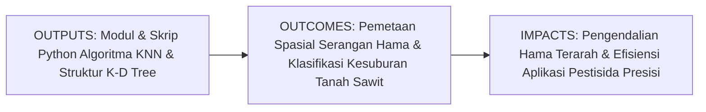
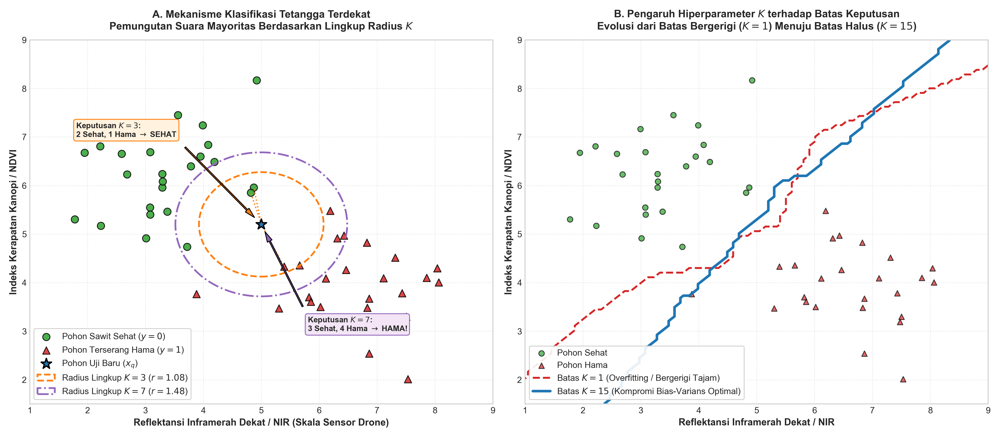
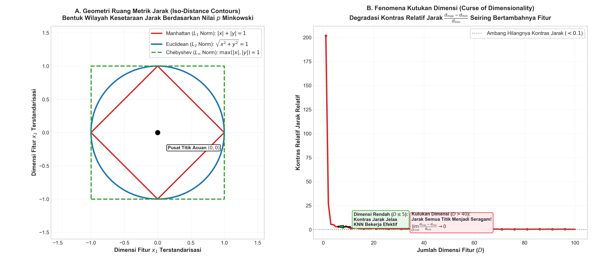

# AI Modul 7.3: K-Nearest Neighbor (KNN)

---

## 1. Identitas & Kerangka Capaian Pembelajaran (Sub-CPMK)

* **Kode Modul**: AI Modul 7.3
* **Mata Kuliah**: Kecerdasan Buatan dan Sains Data Pertanian Presisi
* **Alokasi Waktu**: 2 x 50 Menit (Kajian Teori & Diskusi) + 2 x 50 Menit (Eksplorasi Praktikum Mandiri)
* **Beban SKS**: 3 SKS
* **Prasyarat**: AI Modul 4.2 (NumPy Komputasi Numerik), AI Modul 5.2.1 (Supervised Learning), AI Modul 6.1 (Accuracy, Precision, Recall), AI Modul 7.2 (Logistic Regression)
* **Level Kognitif**: Bloom C2 (Memahami), C3 (Menerapkan), C4 (Menganalisis)



### 1.1 Capaian Pembelajaran Khusus (Sub-CPMK)
Setelah menyelesaikan modul ini secara komprehensif, mahasiswa diharapkan mampu:
1. **Memahami (C2)** prinsip kerja pembelajaran berbasis instansia (*instance-based learning / lazy learning*), metrik jarak geometris ruang vektor (Euclidean, Manhattan, Minkowski), serta mekanisme pemungutan suara terbanyak (*majority voting*).
2. **Menerapkan (C3)** algoritma K-Nearest Neighbor menggunakan pustaka Scikit-Learn dan formulasi aljabar vektor NumPy untuk memetakan sebaran serangan hama ulat api (*Setothosea asigna*) dan mengklasifikasikan kesuburan tanah perkebunan kelapa sawit berdasarkan citra multispektral drone.
3. **Menganalisis (C4)** dampak hiperparameter $K$ terhadap kompromi bias-varians, fenomena degradasi metrik akibat kutukan dimensi (*curse of dimensionality*), efektivitas skema pembobotan jarak (*distance-weighted voting*), serta kompleksitas komputasi struktur data *K-D Tree* dan *Ball Tree*.

### 1.2 Kerangka Hasil Pembelajaran (Outputs, Outcomes, & Impacts)
* **Outputs (Keluaran Langsung)**:
  * Penguasaan formulasi analitik metrik jarak ruang Minkowski, fungsi pembobotan jarak, dan struktur indeks spasial.
  * Skrip Python berstandar PEP 8 untuk *fitting* model KNN, pencarian hiperparameter $K$ optimal via *grid search cross-validation*, dan visualisasi permukaan batas keputusan (*decision boundary surfaces*).
  * Laporan evaluasi diagnostik pengaruh standardisasi fitur dan reduksi dimensionalitas terhadap akurasi model.
* **Outcomes (Kompetensi Aplikatif)**:
  * Kemampuan merancang sistem deteksi dini serangan hama dan penyakit tanaman perkebunan berbasis data telemetri spasial secara non-parametrik.
  * Keahlian dalam memilih metrik jarak yang tepat sesuai topologi data agro-klimat dan menghindari kendala komputasi inferensi lambat pada perangkat cerdas lapangan (*edge devices*).
* **Impacts (Dampak Strategis Jangka Panjang)**:
  * Pengurangan volume semprot pestisida kimia hingga 40% melalui penyemprotan presisi berbasis klaster serangan lokal (*spot spraying*).
  * Perlindungan keanekaragaman hayati dan ekosistem perkebunan kelapa sawit berkelanjutan sesuai prinsip *Good Agricultural Practices* (GAP) dan sertifikasi RSPO/ISPO.

---

## 2. Profil Fundamental Algoritma: Fungsi, Manfaat, dan Keunggulan-Kelemahan

### 2.1 Fungsi Komputasi & Pemodelan Matematis
K-Nearest Neighbor (KNN) adalah algoritma pembelajaran mesin terawasi (*supervised learning*) non-parametrik berbasis instansia (*instance-based learning / lazy learning*) yang berfungsi untuk:
1. **Klasifikasi Berbasis Konsensus Lokal**: Memprediksi label kelas dari suatu titik kueri baru berdasarkan suara terbanyak (*majority vote*) dari $K$ tetangga terdekatnya dalam ruang fitur berdimensi $p$.
2. **Estimasi Densitas Probabilitas Lokal**: Menghitung probabilitas posterior keanggotaan kelas $P(y = c \mid \mathbf{x})$ berdasarkan proporsi atau bobot kedekatan tetangga di sekitarnya.
3. **Regresi Lokal Non-Parametrik**: Menaksir nilai target kontinu dengan merata-ratakan nilai target dari $K$ tetangga terdekat (baik rerata sederhana maupun terbobot jarak).

### 2.2 Manfaat Nyata di Industri Perkebunan & Agribisnis
Penerapan KNN memberikan manfaat strategis nyata pada proteksi tanaman dan manajemen lahan sawit:
* **Pengendalian Hama Terarah (*Spot Spraying*)**: Memetakan klaster serangan ulat api (*Setothosea asigna*) atau ulat kantung secara spasial, sehingga penyemprotan insektisida hayati hanya dilakukan pada zona terinfestasi tanpa memboroskan bahan kimia ke seluruh kebun.
* **Zonasi Kesuburan Tanah Blok Kebun**: Mengelompokkan status kesuburan hara tanah (pH, C-Organik, KTK) berdasarkan kedekatan titik sampel bor tanah laboratorium.
* **Integrasi Data Streaming Tanpa Latih Ulang**: Jika ada data sensor IoT atau drone baru yang masuk, data tersebut dapat langsung ditambahkan ke memori sistem tanpa perlu melatih ulang (*retraining*) model dari awal.

### 2.3 Rationale: Alasan Mengapa Algoritma Ini Digunakan
Mengapa praktisi perkebunan presisi memilih KNN dibanding model parametrik?
1. **Fleksibilitas Batas Keputusan Non-Linier Murni**: Tidak memiliki asumsi apriori mengenai bentuk distribusi data atau linearitas batas pisah. Sangat unggul menangani pola serangan hama yang menyebar secara melingkar, berkelok, atau membentuk kantong-kantong diskrit di lapangan.
2. **Nol Waktu Pelatihan (*Zero Training Time*)**: Fase pelatihan hanyalah proses penyimpanan data ke memori ($\mathcal{O}(1)$), sangat menguntungkan pada skenario data yang diperbarui secara dinamis setiap jam.
3. **Intuisi Alami Berbasis Kedekatan Spasial**: Sangat selaras dengan Hukum Pertama Geografi Tobler (*Tobler's First Law of Geography*): *"Segala sesuatu berhubungan dengan hal lainnya, tetapi hal yang dekat lebih berhubungan daripada hal yang jauh."*

### 2.4 Analisis Kelebihan dan Kekurangan

| Dimensi Evaluasi | Kelebihan (*Strengths*) | Kekurangan (*Limitations*) |
|:---|:---|:---|
| **Asumsi Distribusi** | Non-parametrik murni; tidak menuntut asumsi normalitas, linearitas, atau homoskedastisitas. | Sangat sensitif terhadap keberadaan fitur bising (*noisy/irrelevant features*) yang merusak metrik jarak. |
| **Bentuk Batas Keputusan** | Mampu membentuk batas keputusan yang sangat fleksibel dan kompleks secara alami. | Rentan terhadap *Curse of Dimensionality*; jarak antar-titik menjadi seragam dan tidak bermakna pada dimensi tinggi. |
| **Waktu Pelatihan** | Instan ($\mathcal{O}(1)$); tidak memerlukan optimasi gradien atau pembalikan matriks. | Waktu inferensi (*query time*) sangat lambat ($\mathcal{O}(n \cdot p)$); boros daya komputasi pada perangkat edge drone. |
| **Kebutuhan Memori** | Sederhana secara konseptual. | Wajib menyimpan seluruh dataset latih di RAM; kebutuhan memori membengkak linier seiring bertambahnya data. |

### 2.5 Contoh Kasus Penggunaan Konkret di Sektor Agro-Industri
1. **Pemetaan Zona Infestasi Ulat Api Drone Multispektral**: Mengklasifikasikan pohon kelapa sawit ke dalam kategori Sehat vs Terserang Hama berdasarkan koordinat spasial dan indeks pantulan kanopi NIR-NDVI.
2. **Klasifikasi Kesesuaian Lahan Tanaman Sela**: Menentukan kesesuaian tanaman penutup tanah (*mucuna bracteata*) pada gawangan sawit muda berdasarkan sampel kelembapan dan tekstur tanah.
3. **Identifikasi Varietas Bibit Kelapa Sawit di Pembibitan (Nursery)**: Mengidentifikasi kemurnian varietas bibit (misal: DxP Marihat vs DxP Socfin) berdasarkan pengukuran morfometri pelepah dan anak daun.

### 2.6 Aspek Kritis & Catatan Penting Algoritma (*Key Critical Insights*)
* **Standardisasi Skala Fitur adalah Keharusan Mutlak**: Karena rumus jarak Euclidean $\sqrt{\sum (x_a - x_b)^2}$ menjumlahkan selisih nilai secara langsung, fitur dengan skala ratusan (seperti koordinat UTM atau elevasi) akan menenggelamkan fitur desimal (seperti NDVI). Wajib gunakan `StandardScaler` sebelum kalkulasi jarak.
* **Gunakan Nilai $K$ Ganjil pada Masalah Biner**: Hindari nilai $K$ genap ($K=2, 4, 6$) untuk mencegah kebuntuan suara seri (*tie vote*) yang memicu inkonsistensi keputusan.
* **Mitigasi Beban Inferensi Lambat**: Jika dataset perkebunan mencapai ratusan ribu pohon, jangan gunakan algoritma pencarian brute-force. Gunakan struktur data indeks spasial berhierarki seperti **K-D Tree** atau **Ball Tree** untuk mempercepat kueri menjadi $\mathcal{O}(p \log n)$.



---

## 3. Teori Matematis K-Nearest Neighbor

### 3.1 Metrik Jarak Ruang Vektor

Inti dari algoritma KNN bertumpu pada pengukuran jarak antara titik kueri baru $\mathbf{x} = [x_1, x_2, \dots, x_p]^T$ dengan titik data amatan historis $\mathbf{x}_i = [x_{i1}, x_{i2}, \dots, x_{ip}]^T$ dalam ruang fitur berdimensi $p$ ($\mathbb{R}^p$).

#### 1. Jarak Euclidean ($L_2$ Norm)
Metrik jarak garis lurus terpendek Cartesian, paling banyak digunakan dalam ruang kontinu fisik:

$$d_2(\mathbf{x}, \mathbf{x}_i) = \|\mathbf{x} - \mathbf{x}_i\|_2 = \sqrt{\sum_{j=1}^p (x_j - x_{ij})^2}$$

**Keterangan Simbol**:
* $d_2(\mathbf{x}, \mathbf{x}_i)$: Jarak Euclidean antara titik kueri $\mathbf{x}$ dan titik sampel $\mathbf{x}_i$.
* $p$: Jumlah fitur prediktor (misal: reflektansi NIR, NDVI, kelembapan tanah, elevasi).
* $x_j, x_{ij}$: Nilai fitur ke-$j$ pada titik kueri dan sampel ke-$i$.

**Panduan Pembacaan Matematis**:
"d dua fungsi x dan x sub i sama dengan norma dua dari selisih vektor x dikurangi x sub i, sama dengan akar kuadrat dari sigma j sama dengan satu sampai p dari kuadrat selisih x sub j dikurangi x sub ij."

#### 2. Jarak Manhattan ($L_1$ Norm / Jarak Taxicab)
Mengukur jarak tempuh sepanjang sumbu-sumbu koordinat ortogonal tegak lurus:

$$d_1(\mathbf{x}, \mathbf{x}_i) = \|\mathbf{x} - \mathbf{x}_i\|_1 = \sum_{j=1}^p |x_j - x_{ij}|$$

Jarak Manhattan lebih tangguh (*robust*) terhadap keberadaan titik pencilan ekstrem (*outliers*) dibandingkan Euclidean karena tidak menerapkan operasi kuadratik pada selisih nilai fitur.

**Panduan Pembacaan Matematis**:
"d satu fungsi x dan x sub i sama dengan norma satu dari selisih vektor x dikurangi x sub i, sama dengan sigma j sama dengan satu sampai p dari nilai mutlak selisih x sub j dikurangi x sub ij."

#### 3. Jarak Minkowski ($L_m$ Norm Tergeneralisasi)
Bentuk umum metrik jarak yang mencakup Euclidean dan Manhattan sebagai kasus khusus:

$$d_m(\mathbf{x}, \mathbf{x}_i) = \|\mathbf{x} - \mathbf{x}_i\|_m = \left( \sum_{j=1}^p |x_j - x_{ij}|^m \right)^{\frac{1}{m}}$$

* Jika $m = 1 \implies$ Jarak Manhattan ($L_1$).
* Jika $m = 2 \implies$ Jarak Euclidean ($L_2$).
* Jika $m \to \infty \implies$ Jarak Chebyshev ($L_\infty = \max_j |x_j - x_{ij}|$).

**Panduan Pembacaan Matematis**:
"d m fungsi x dan x sub i sama dengan kurung buka sigma j dari satu sampai p dari nilai mutlak selisih x sub j dikurangi x sub ij dipangkatkan m, kurung tutup dipangkatkan satu per m."

---

### 3.2 Aturan Keputusan Mayoritas (Majority Voting)

Misalkan $\mathcal{N}_K(\mathbf{x})$ adalah himpunan indeks dari $K$ sampel data latih yang memiliki jarak terkecil ke titik kueri $\mathbf{x}$:

$$\mathcal{N}_K(\mathbf{x}) = \left\{ i \in \{1, 2, \dots, n\} \mid d(\mathbf{x}, \mathbf{x}_i) \le d_{(K)} \right\}$$

Di mana $d_{(K)}$ adalah jarak ke tetangga terdekat ke-$K$.

#### Estimasi Probabilitas Posterior
Probabilitas bahwa titik kueri $\mathbf{x}$ tergolong ke dalam kelas target $c \in \{0, 1, \dots, C-1\}$ dihitung dari proporsi tetangga yang menyandang label kelas tersebut:

$$P(y = c \mid \mathbf{x}) = \frac{1}{K} \sum_{i \in \mathcal{N}_K(\mathbf{x})} \mathbb{I}(y_i = c)$$

Di mana $\mathbb{I}(\cdot)$ adalah fungsi indikator bernilai 1 jika kondisi di dalam kurung terpenuhi, dan 0 jika tidak.

#### Aturan Klasifikasi Konsensus
Label prediksi $\hat{y}$ ditentukan oleh kelas yang meraih frekuensi suara terbanyak (*majority vote*):

$$\hat{y} = \arg\max_{c} \sum_{i \in \mathcal{N}_K(\mathbf{x})} \mathbb{I}(y_i = c)$$

**Panduan Pembacaan Matematis**:
"Probabilitas y bernilai c dengan syarat x sama dengan satu per K dikalikan sigma untuk seluruh i anggota lingkungan N sub K dari x dari fungsi indikator y sub i sama dengan c. Label topi y sama dengan argumen pemaksimasi terhadap c dari sigma fungsi indikator tersebut."

---

### 3.3 Skema Pembobotan Berbasis Jarak (Distance-Weighted KNN)

Kelemahan utama dari sistem pemungutan suara mayoritas sederhana (*uniform voting*) adalah menganggap seluruh $K$ tetangga memiliki derajat pengaruh yang setara, padahal tetangga yang berjarak 0.1 meter secara logis membawa informasi yang jauh lebih kuat dibanding tetangga yang berjarak 15 meter.

Untuk mengatasinya, diterapkan **Distance-Weighted KNN**, di mana setiap tetangga $i$ diberi bobot $w_i$ yang berbanding terbalik dengan jaraknya:

$$w_i = \frac{1}{d(\mathbf{x}, \mathbf{x}_i)^q + \epsilon}$$

Di mana $q \ge 1$ (biasanya $q = 1$ atau $q = 2$), dan $\epsilon > 0$ adalah konstanta kecil (misal $10^{-6}$) untuk mencegah pembagian dengan nol ketika titik kueri berimpit persis dengan data latih.

#### Aturan Keputusan Terbobot
$$\hat{y} = \arg\max_{c} \sum_{i \in \mathcal{N}_K(\mathbf{x})} w_i \cdot \mathbb{I}(y_i = c)$$

Probabilitas terbobot ternormalisasi:

$$P(y = c \mid \mathbf{x}) = \frac{\sum_{i \in \mathcal{N}_K(\mathbf{x})} w_i \cdot \mathbb{I}(y_i = c)}{\sum_{i \in \mathcal{N}_K(\mathbf{x})} w_i}$$

**Panduan Pembacaan Matematis**:
"Bobot w sub i sama dengan satu dibagi jarak antara x dan x sub i dipangkatkan q ditambah epsilon. Label prediksi y topi sama dengan argumen pemaksimasi c dari sigma w sub i dikalikan fungsi indikator y sub i sama dengan c."

---

### 3.4 Dilema Pemilihan Nilai K & Trade-off Bias-Varians

Penentuan nilai hiperparameter $K$ merupakan faktor penentu performa generalisasi model:

1. **Nilai $K$ Terlalu Kecil (misal $K = 1$)**:
   * *Karakteristik*: Model sangat fleksibel dengan bias rendah, namun memiliki varians sangat tinggi (*High Variance / Overfitting*).
   * *Dampak Lapangan*: Batas keputusan menjadi sangat bergerigi (*ragged*). Satu titik amatan anomali (misalnya pohon sehat yang daunnya kotor terkena debu jalan sehingga terbaca seperti terserang hama) akan membentuk pulau keputusan palsu (*island of noise*) di sekitarnya.
2. **Nilai $K$ Terlalu Besar (misal $K \to n$)**:
   * *Karakteristik*: Model menjadi sangat kaku dengan varians rendah, namun memiliki bias sangat tinggi (*High Bias / Underfitting*).
   * *Dampak Lapangan*: Batas keputusan menjadi rata dan kabur. Jika $K = n$, model akan selalu memprediksi kelas mayoritas global di perkebunan, sama sekali mengabaikan variasi spasial lokal.
3. **Aturan Praktis Pemilihan $K$**:
   * Pendekatan heuristik awal: $K \approx \sqrt{n}$.
   * Selalu gunakan nilai **$K$ ganjil** pada permasalahan klasifikasi biner untuk mencegah terjadinya kondisi seri (*tie vote*).
   * Penentuan nilai optimal wajib dilakukan melalui validasi silang (*K-Fold Cross-Validation*).

---

### 3.5 Kutukan Dimensi (Curse of Dimensionality)

Dalam aplikasi penginderaan jauh (*remote sensing*) perkebunan sawit modern, sensor hyperspectral drone dapat menghasilkan puluhan hingga ratusan saluran panjang gelombang (*bands*). Namun, algoritma KNN mengalami degradasi performa drastis ketika jumlah fitur $p$ bertambah besar—fenomena yang dirumuskan oleh Richard Bellman sebagai **Kutukan Dimensi (*Curse of Dimensionality*)**.

#### 1. Geometri Ruang Dimensi Tinggi Menjadi Hampa
Volume ruang hiperkubus berdimensi $p$ dengan panjang sisi unit $[0, 1]^p$ bernilai $V_{\text{kubus}} = 1^p = 1$. Namun, volume hipersfer berdimensi $p$ dengan radius $r = 0.5$ yang termuat di dalam kubus tersebut menyusut drastis mendekati nol seiring membesarnya dimensi:

$$V_{\text{sfer}}(p) = \frac{\pi^{p/2}}{\Gamma\left(\frac{p}{2} + 1\right)} r^p \xrightarrow[p \to \infty]{} 0$$

Artinya, pada dimensi tinggi, hampir seluruh volume hiperkubus terkonsentrasi di sudut-sudut (*corners*), dan ruang di dalamnya menjadi sangat hampa (*sparse*). Untuk mempertahankan kerapatan sampel yang sama seperti pada 2 dimensi, jumlah data observasi yang dibutuhkan membengkak secara eksponensial ($\mathcal{O}(n^p)$).

#### 2. Hilangnya Kontras Relatif Jarak
Beyer et al. (1999) membuktikan secara teoretis bahwa pada kondisi distribusi tertentu, ketika dimensi $p$ mendekati tak terhingga, selisih antara jarak ke tetangga terjauh ($d_{\max}$) dengan tetangga terdekat ($d_{\min}$) menyusut hingga tidak lagi bermakna:

$$\lim_{p \to \infty} \frac{d_{\max} - d_{\min}}{d_{\min}} = 0$$

Konsekuensi matematisnya: **seluruh titik data dalam ruang dimensi tinggi tampak memiliki jarak yang hampir sama satu sama lain**. Konsep "tetangga terdekat" kehilangan signifikansi diskriminatifnya.

**Panduan Pembacaan Matematis**:
"Limit p mendekati tak terhingga dari pembagian selisih d maksimum minus d minimum dengan d minimum sama dengan nol."

#### 3. Keharusan Standardisasi Skala Fitur
Karena formula jarak menjumlahkan selisih nilai fitur secara langsung, fitur dengan rentang nilai besar akan mendominasi perhitungan jarak dan menenggelamkan fitur lainnya:
* Contoh: Jika Koordinat UTM bernilai ratusan ribu ($x_1 \approx 450.000$ m) sedangkan Indeks NDVI bernilai desimal ($x_2 \in [0.1, 0.9]$), maka selisih jarak NDVI praktis tidak memiliki pengaruh apapun.
* Solusi Mutlak: Seluruh fitur wajib ditransformasikan menggunakan $Z$-Score Standardization ($z = \frac{x - \mu}{\sigma}$) atau Min-Max Scaling ($x' = \frac{x - x_{\min}}{x_{\max} - x_{\min}}$).



---

## 4. Arsitektur Komputasi & Struktur Data Pencarian Tetangga

Tantangan komputasi utama KNN terletak pada fase inferensi (prediksi). Terdapat tiga arsitektur mesin pencari tetangga di Scikit-Learn:

1. **Brute-Force Search (`algorithm='brute'`)**:
   * Menghitung jarak ke setiap $n$ titik data latih satu per satu.
   * Kompleksitas waktu inferensi: $\mathcal{O}(n \cdot p)$ per kueri.
   * Sangat lambat jika jumlah data amatan $n$ mencapai ratusan ribu, namun sangat efisien memori dan tidak memerlukan konstruksi pohon.
2. **K-D Tree (`algorithm='kd_tree'`)**:
   * Mengorganisasi data ke dalam struktur pohon biner (*binary search tree*) dengan membagi ruang secara bergantian sepanjang sumbu koordinat ortogonal pada nilai median.
   * Kompleksitas waktu inferensi rata-rata: $\mathcal{O}(p \cdot \log n)$.
   * Sangat cepat pada dimensi rendah ($p < 20$), namun mengalami degradasi kinerja kembali ke $\mathcal{O}(n)$ jika dimensi fitur tinggi ($p > 30$) akibat kutukan dimensi.
3. **Ball Tree (`algorithm='ball_tree'`)**:
   * Mempartisi data ke dalam rangkaian bola bersarang (*nested hyperspheres*) alih-alih bidang hiper datar ortogonal.
   * Jauh lebih tangguh daripada K-D Tree pada data dengan dimensi lebih tinggi atau data berstruktur non-isotropik.

---

## 5. Studi Kasus Komprehensif: Pemetaan Zona Serangan Hama Sawit

### 5.1 Deskripsi Skenario & Data Sensor Drone Kebun
Divisi Proteksi Tanaman INSTIPER mengoperasikan drone multispektral di atas Afdeling IV Kebun Kelapa Sawit seluas 50 hektar. Dari 240 pohon sawit yang disurvei, diekstraksi 3 variabel reflektansi kanopi:
* $X_1$: **Reflektansi Inframerah Dekat / NIR** (skala 0 – 100, kanopi terserang hama memiliki nilai NIR rendah akibat kerusakan jaringan spons mesofil daun).
* $X_2$: **Indeks Vegetasi NDVI** (skala 0.0 – 1.0, indikator kehijauan dan biomassa kanopi).
* $X_3$: **Kerapatan Tajuk Kanopi / Canopy Density** (% tutupan tajuk fotosintetik).
* $y$: **Status Serangan Ulat Api** ($1 = \text{Terserang Hama (Perlu Spot Spraying)}, 0 = \text{Sehat}$).

### 5.2 Implementasi Kode Terpadu & Optimasi Hiperparameter
Kode berikut mendemonstrasikan alur lengkap standardisasi, pencarian $K$ terbaik via validasi silang, komparasi pembobotan jarak, dan evaluasi metrik:

```python
import numpy as np
import pandas as pd
import matplotlib.pyplot as plt
from sklearn.model_selection import train_test_split, GridSearchCV, StratifiedKFold
from sklearn.preprocessing import StandardScaler
from sklearn.neighbors import KNeighborsClassifier
from sklearn.metrics import classification_report, confusion_matrix, f1_score

# 1. Pembangkitan Data Sintetis Realistis Berbasis Agronomi
np.random.seed(42)
n_samples = 240

# Pohon Sehat (Kelas 0, 65% populasi)
n0 = int(n_samples * 0.65)
nir_0 = np.random.normal(72.0, 6.5, n0)
ndvi_0 = np.random.normal(0.78, 0.05, n0)
tajuk_0 = np.random.normal(82.0, 5.0, n0)
y0 = np.zeros(n0, dtype=int)

# Pohon Terserang Hama Ulat Api (Kelas 1, 35% populasi - defoliasi daun)
n1 = n_samples - n0
nir_1 = np.random.normal(48.0, 8.0, n1)
ndvi_1 = np.random.normal(0.52, 0.08, n1)
tajuk_1 = np.random.normal(54.0, 9.0, n1)
y1 = np.ones(n1, dtype=int)

df_hama = pd.DataFrame({
    'Reflektansi_NIR': np.concatenate([nir_0, nir_1]),
    'Indeks_NDVI': np.concatenate([ndvi_0, ndvi_1]),
    'Kerapatan_Tajuk': np.concatenate([tajuk_0, tajuk_1]),
    'Status_Serangan': np.concatenate([y0, y1])
})

# 2. Partisi Data & Standardisasi Fitur Mutlak
X = df_hama[['Reflektansi_NIR', 'Indeks_NDVI', 'Kerapatan_Tajuk']]
y = df_hama['Status_Serangan']

X_train, X_test, y_train, y_test = train_test_split(
    X, y, test_size=0.25, random_state=42, stratify=y
)

scaler = StandardScaler()
X_train_scaled = scaler.fit_transform(X_train)
X_test_scaled = scaler.transform(X_test)

# 3. Optimasi Hiperparameter K dan Skema Pembobotan (Grid Search CV)
param_grid = {
    'n_neighbors': [1, 3, 5, 7, 9, 11, 15, 19, 23],
    'weights': ['uniform', 'distance'],
    'metric': ['euclidean', 'manhattan']
}

cv = StratifiedKFold(n_splits=5, shuffle=True, random_state=42)
grid_knn = GridSearchCV(
    KNeighborsClassifier(algorithm='auto'),
    param_grid,
    cv=cv,
    scoring='f1',
    n_jobs=-1
)
grid_knn.fit(X_train_scaled, y_train)

best_knn = grid_knn.best_estimator_
print("=== HASIL OPTIMASI HIPERPARAMETER KNN SERANGAN HAMA ===")
print(f"Konfigurasi Terbaik : {grid_knn.best_params_}")
print(f"Skor F1-Cross-Validation Terbaik : {grid_knn.best_score_:.4f}")

# 4. Evaluasi Kinerja pada Data Pengujian
y_pred = best_knn.predict(X_test_scaled)
print("\n=== LAPORAN EVALUASI MODEL PADA DATA UJI (TEST SET) ===")
print(classification_report(y_test, y_pred, target_names=['Sehat (0)', 'Terserang Hama (1)']))
print("Matriks Konfusi:")
print(confusion_matrix(y_test, y_pred))
```

---

## 6. Kekeliruan Metodologis dan Praktik Terbaik (*Common Pitfalls & Best Practices*)

Dalam menerapkan algoritma KNN pada sistem komputasi cerdas agribisnis, analis data wajib menghindari kekeliruan metodologis berikut:

1. **Kelalaian Melakukan Penskalaan Fitur (*Feature Scaling Neglect*)**:
   * *Masalah*: Menjalankan KNN pada data mentah di mana satu fitur berorde ribuan (misal: elevasi meter dpl) dan fitur lain berorde pecahan (misal: rasio C/N tanah 0.12). Jarak Euclidean akan sepenuhnya dikendalikan oleh elevasi, sedangkan rasio hara tidak dianggap sama sekali oleh model.
   * *Solusi*: Selalu pasang `StandardScaler` atau `MinMaxScaler` di dalam pipeline sebelum estimator KNN.
2. **Latensi Inferensi Tinggi pada Perangkat Tepi (*Edge Drone Bottleneck*)**:
   * *Masalah*: KNN membutuhkan pemindaian ke seluruh $n$ data memori saat memprediksi satu titik baru. Jika drone pemetaan harus memprediksi status 50.000 pohon secara *on-board* dengan prosesor berdaya rendah, sistem akan mengalami *overheating* dan kehabisan baterai.
   * *Solusi*: Gunakan struktur indeks spasial `algorithm='kd_tree'`, kurangi jumlah data referensi melalui *data prototype selection* (seperti algoritma Condensed Nearest Neighbor), atau beralih ke model parametrik (seperti Decision Tree/SVM) untuk inferensi cepat di lapangan.
3. **Pemilihan Nilai $K$ Genap pada Masalah Biner**:
   * *Masalah*: Memilih $K = 4$ atau $K = 6$ pada klasifikasi biner. Saat terjadi kondisi seri (2 tetangga sehat dan 2 tetangga sakit), perangkat lunak akan memilih kelas berdasarkan aturan internal acak atau urutan indeks, yang tidak memiliki dasar saintifik.
   * *Solusi*: Selalu gunakan nilai $K$ bernilai ganjil ($K \in \{3, 5, 7, 9, 11\}$) pada klasifikasi 2 kelas.
4. **Kerentanan terhadap Fitur Bising (*Noisy and Irrelevant Features*)**:
   * *Masalah*: Menambahkan puluhan variabel yang sebenarnya tidak berkorelasi dengan serangan hama (misal: suhu CPU drone, nomor batch baterai, arah mata angin saat terbang). Fitur bising ini memperbesar jarak Euclidean secara acak dan menghancurkan klaster lokal.
   * *Solusi*: Lakukan seleksi fitur (*feature selection*) menggunakan analisis korelasi atau *Mutual Information* sebelum pelatihan.

---

## 7. Rangkuman Modul

1. **K-Nearest Neighbor (KNN)** adalah algoritma terawasi berbasis instansia (*instance-based / lazy learning*) yang tidak membentuk model parametrik eksplisit, melainkan mengklasifikasikan kueri baru berdasarkan konsensus tetangga-tetangga terdekatnya.
2. Pengukuran kedekatan bertumpu pada **Metrik Jarak Geometris** (Euclidean $L_2$, Manhattan $L_1$, dan Minkowski $L_m$). Jarak Manhattan lebih tangguh terhadap outlier, sedangkan Euclidean mengukur jarak lurus fisik.
3. Skema **Distance-Weighted KNN** memberikan bobot invers jarak ($w_i = \frac{1}{d_i + \epsilon}$), memberikan pengaruh yang lebih kuat kepada tetangga yang berada paling dekat dengan lokasi tanaman uji.
4. Nilai $K$ mengendalikan kompromi **Bias-Varians**: $K$ kecil rentan terhadap *overfitting* dan sensitif terhadap derau, sedangkan $K$ besar memicu *underfitting* dan mengaburkan batas lokal.
5. Fenomena **Kutukan Dimensi (*Curse of Dimensionality*)** menyebabkan kontras jarak antar-titik lenyap pada dimensi fitur yang sangat tinggi, sehingga menuntut standardisasi fitur dan seleksi dimensi sebelum penerapan KNN.

---

## 8. Latihan Soal & Tugas Analitis HOTS

Kerjakan soal-soal penalaran tingkat tinggi (*Higher-Order Thinking Skills*) berikut:

1. **Perhitungan Manual Metrik Jarak dan Majority Voting (C3)**:
   Diberikan data historis 5 blok pembibitan sawit dengan 2 fitur terstandarisasi: $x_1$ (Kadar Lengas Tanah) dan $x_2$ (Intensitas Radiasi), serta label $y \in \{\text{Sehat (0)}, \text{Terserang Jamur (1)}\}$:
   * Sampel 1: $(1.0, 2.0)$, Label = 0
   * Sampel 2: $(2.0, 1.0)$, Label = 0
   * Sampel 3: $(4.0, 3.0)$, Label = 1
   * Sampel 4: $(5.0, 4.0)$, Label = 1
   * Sampel 5: $(2.0, 3.0)$, Label = 0
   
   Sebuah bibit baru memiliki koordinat fitur kueri $\mathbf{x}_q = (3.0, 2.0)$.
   * Hitung jarak **Euclidean** dari $\mathbf{x}_q$ ke kelima sampel data tersebut!
   * Hitung jarak **Manhattan** dari $\mathbf{x}_q$ ke kelima sampel data tersebut!
   * Tentukan prediksi kelas bibit baru tersebut menggunakan aturan *Majority Voting* untuk $K = 3$ (berdasarkan jarak Euclidean)!
   * Tentukan prediksi kelas untuk $K = 5$ (berdasarkan jarak Euclidean)!

2. **Analisis Komputasi Distance-Weighted KNN (C4)**:
   Pada kasus data di atas untuk $K = 3$ tetangga terdekat (berdasarkan jarak Euclidean):
   * Hitung bobot invers jarak kuadratik $w_i = \frac{1}{d_i^2}$ untuk masing-masing dari 3 tetangga terdekat tersebut!
   * Hitung total skor bobot terakumulasi untuk Kelas 0 ($\sum_{i \in \text{Kelas 0}} w_i$) dan Kelas 1 ($\sum_{i \in \text{Kelas 1}} w_i$)!
   * Berapakah estimasi probabilitas terbobot ternormalisasi $P(y = 1 \mid \mathbf{x}_q)$? Apakah keputusan akhir berbeda dengan metode *uniform voting*?

3. **Studi Kasus Patologi Kutukan Dimensi pada Data Drone (C4)**:
   Sebuah tim survei perkebunan sawit menggunakan kamera hyperspectral dengan 120 saluran panjang gelombang (*bands*) untuk mendeteksi defisiensi hara Magnesium (Mg). Namun, saat model KNN ($K=5$) dijalankan langsung pada 120 fitur mentah tersebut, akurasi klasifikasi merosot menjadi 52% (hampir setara tebakan acak), padahal pada 3 fitur indeks vegetasi terpilih model meraih akurasi 91%.
   * Jelaskan berdasarkan teori Beyer et al. (1999) mengapa penambahan 117 saluran spektral justru merusak performa klasifikasi KNN!
   * Mengapa algoritma berbasis pohon (*tree-based models*) atau reduksi dimensi (seperti PCA) jauh lebih kebal terhadap fenomena ini dibandingkan KNN?
   * Rumuskan protokol pra-pemrosesan data yang wajib diterapkan oleh tim survei sebelum mengumpankan data ke algoritma KNN!

---

## 9. Jembatan Konsep (Bridging) ke AI Modul 7.4: Decision Tree

Pada modul ini, kita telah melihat keunggulan **K-Nearest Neighbor (KNN)** dalam memodelkan batas keputusan spasial non-linier yang luwes murni berdasarkan kedekatan geometris data historis perkebunan.

Meskipun elegan dan intuitif, KNN menyimpan tiga kelemahan mendasar dalam operasional industri skala besar:
1. **Beban Komputasi Inferensi Lambat (*Computational Bottleneck*)**: KNN tidak membuang data latih. Setiap kali drone menyurvei pohon baru, sistem harus menghitung ribuan operasi akar kuadrat jarak terhadap seluruh memori data latih ($\mathcal{O}(n \cdot p)$). Untuk sistem kendali semprot otomatis berkecepatan tinggi, latensi ini tidak dapat ditoleransi.
2. **Kebutuhan Memori Penyimpanan Masif**: Seluruh dataset latih berukuran gigabita harus selalu menetap di RAM perangkat keras lapangan.
3. **Sifat Kotak Hitam Non-Eksplisit (*Lack of Explainable Rules*)**: KNN tidak menghasilkan aturan logika bisnis formal yang dapat diaudit oleh manajer kebun. Keputusan diambil murni karena "jarak angka ke titik lain lebih kecil", tanpa bisa menjelaskan secara lugas faktor ambang batas agronomi apa yang memicu keputusan tersebut.

Bagaimana jika kita menginginkan model pembelajaran mesin yang:
* Bekerja secara **Eager Learning** (menghasilkan model ringkas sehingga data latih dapat dibuang setelah pelatihan)?
* Memiliki kecepatan inferensi ultra-cepat ($\mathcal{O}(\text{kedalaman pohon})$)?
* Menghasilkan pohon keputusan hierarkis berbentuk aturan logika eksplisit (*If-Then Rules*) yang dapat dibaca dan divalidasi langsung oleh agronom (misalnya: *"JIKA NDVI $< 0.55$ DAN Umur Pohon $> 8$ tahun, MAKA Semprot Ulat Api"* )?

Inilah paradigma yang ditawarkan oleh **Pohon Keputusan (Decision Tree)**.

Pada **AI Modul 7.4: Decision Tree**, kita akan mendalami:
* **Pengukuran Ketidakmurnian Simpul (*Node Impurity*)**: Entropi Informasi Shannon (*Information Entropy*) dan Ketidakmurnian Gini (*Gini Impurity*).
* **Kriteria Pemisahan Fitur Terbaik**: Perolehan Informasi (*Information Gain*) dan Rasio Perolehan (*Gain Ratio*).
* **Algoritma Pembentukan Pohon**: ID3, C4.5, dan CART (*Classification and Regression Trees*).
* **Strategi Pemangkasan Pohon (*Tree Pruning*)**: *Pre-pruning* (pembatasan kedalaman) dan *Cost-Complexity Post-pruning* untuk mencegah *overfitting* ekstrem pada data kebun sawit.

---

## 10. Daftar Pustaka dan Referensi Akademik

1. Beyer, K., Goldstein, J., Ramakrishnan, R., & Shaft, U. (1999). When is "nearest neighbor" meaningful?. *International Conference on Database Theory*, 217-235. Springer.
2. Bishop, C. M. (2006). *Pattern Recognition and Machine Learning*. Springer. [Tersedia di koleksi src/]
3. Cover, T., & Hart, P. (1967). Nearest neighbor pattern classification. *IEEE Transactions on Information Theory*, 13(1), 21-27.
4. Géron, A. (2022). *Hands-On Machine Learning with Scikit-Learn, Keras, and TensorFlow* (3rd ed.). O'Reilly Media. [Tersedia di koleksi src/]
5. Hastie, T., Tibshirani, R., & Friedman, J. (2009). *The Elements of Statistical Learning: Data Mining, Inference, and Prediction* (2nd ed.). Springer. [Tersedia di koleksi src/]
6. James, G., Witten, D., Hastie, T., & Tibshirani, R. (2021). *An Introduction to Statistical Learning: with Applications in R* (2nd ed.). Springer. [Tersedia di koleksi src/]
