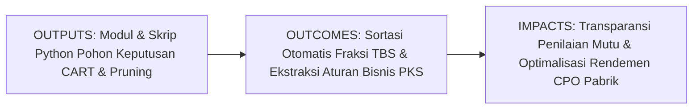
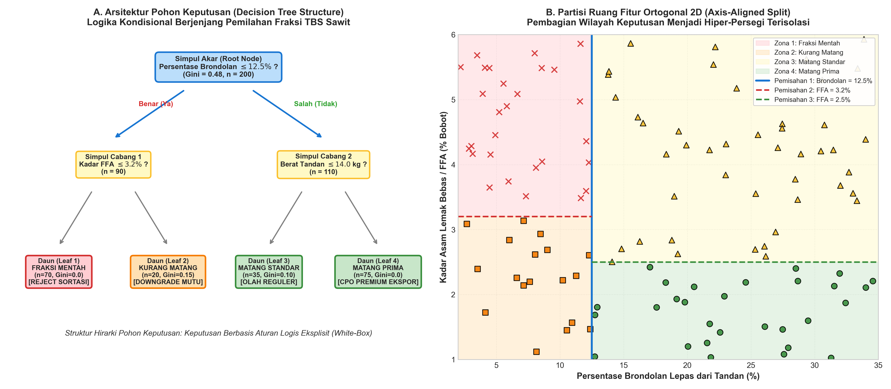
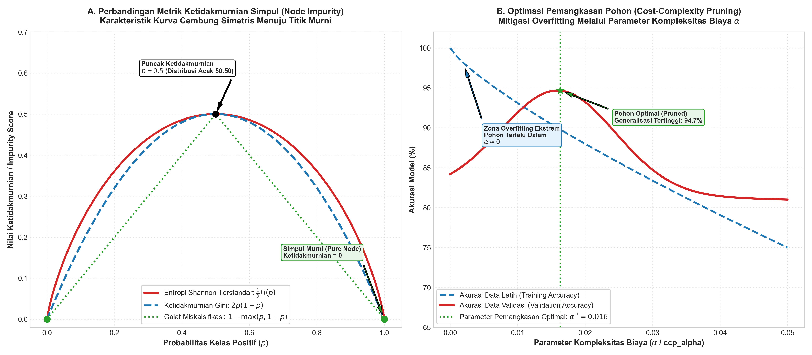

# AI Modul 7.4: Decision Tree

---

## 1. Identitas & Kerangka Capaian Pembelajaran (Sub-CPMK)

* **Kode Modul**: AI Modul 7.4
* **Mata Kuliah**: Kecerdasan Buatan dan Sains Data Pertanian Presisi
* **Alokasi Waktu**: 2 x 50 Menit (Kajian Teori & Diskusi) + 2 x 50 Menit (Eksplorasi Praktikum Mandiri)
* **Beban SKS**: 3 SKS
* **Prasyarat**: AI Modul 2.6 (Percabangan If-Else), AI Modul 5.2.1 (Supervised Learning), AI Modul 6.2 (Confusion Matrix), AI Modul 7.3 (K-Nearest Neighbor)
* **Level Kognitif**: Bloom C2 (Memahami), C3 (Menerapkan), C4 (Menganalisis)



### 1.1 Capaian Pembelajaran Khusus (Sub-CPMK)
Setelah menyelesaikan modul ini secara komprehensif, mahasiswa diharapkan mampu:
1. **Memahami (C2)** prinsip matematis pembentukan pohon keputusan (*decision tree*), konsep ketidakmurnian simpul (*node impurity*) melalui Entropi Informasi Shannon dan Indeks Ketidakmurnian Gini, serta kriteria perolehan informasi (*Information Gain*).
2. **Menerapkan (C3)** algoritma Classification and Regression Trees (CART) menggunakan pustaka Scikit-Learn untuk membangun sistem sortasi fraksi kematangan Tandan Buah Segar (TBS) kelapa sawit dan mengekstrak aturan logika eksplisit (*If-Then Rules*).
3. **Menganalisis (C4)** fenomena *overfitting* pada pohon yang tumbuh tanpa batas, menerapkan teknik pemangkasan (*pre-pruning* dan *cost-complexity post-pruning*), serta mengevaluasi trade-off antara keterpahaman model (*explainability*) dan akurasi prediksi.

### 1.2 Kerangka Hasil Pembelajaran (Outputs, Outcomes, & Impacts)
* **Outputs (Keluaran Langsung)**:
  * Penguasaan formulasi analitik Entropi Shannon, Ketidakmurnian Gini, Information Gain, dan fungsi penalti kompleksitas biaya $R_\alpha(T)$.
  * Skrip Python berstandar PEP 8 untuk konstruksi pohon keputusan, optimasi kedalaman pohon, dan visualisasi grafis diagram alir simpul keputusan.
  * Dokumen daftar aturan logika kondisional (*business rule set*) yang siap diintegrasikan pada sistem timbangan dan sortasi pabrik.
* **Outcomes (Kompetensi Aplikatif)**:
  * Kemampuan merancang model kecerdasan buatan transparan (*White-Box AI*) yang dapat diaudit, diverifikasi, dan diterima langsung oleh mandor panen dan manajemen pabrik kelapa sawit.
  * Keahlian dalam mendiagnosis kedalaman pohon optimal guna mencegah memorisasi derau data lapangan.
* **Impacts (Dampak Strategis Jangka Panjang)**:
  * Eliminasi perselisihan (*dispute*) antara petani plasma/pihak ketiga dengan manajemen PKS mengenai penetapan fraksi mutu tandan sawit.
  * Peningkatan rendemen ekstraksi minyak kelapa sawit (*oil extraction rate* / OER) melalui pencegahan perebusan tandan mentah atau busuk.

---

## 2. Profil Fundamental Algoritma: Fungsi, Manfaat, dan Keunggulan-Kelemahan

### 2.1 Fungsi Komputasi & Pemodelan Matematis
Pohon Keputusan (*Decision Tree*) adalah algoritma pembelajaran mesin terawasi (*supervised learning*) non-parametrik yang berfungsi untuk:
1. **Partisi Rekursif Ruang Fitur**: Membagi ruang fitur berdimensi banyak secara hierarkis menjadi wilayah-wilayah hiper-persegi panjang (*hyper-rectangles*) ortogonal yang saling terpisah.
2. **Pembentukan Aturan Kondisional Eksplisit**: Mengubah kumpulan data latih empiris menjadi graf pohon keputusan terarah yang dapat diekstraksi menjadi serangkaian aturan logika formal (*If-Then-Else Rules*).
3. **Seleksi Fitur Implisit (*Inherent Feature Selection*)**: Mengidentifikasi variabel yang paling relevan secara otomatis melalui penempatan fitur dengan penurunan ketidakmurnian terbesar di dekat simpul akar (*root node*).

### 2.2 Manfaat Nyata di Industri Perkebunan & Agribisnis
Penerapan Decision Tree memberikan dampak positif yang sangat terukur di lantai operasional PKS:
* **Transparansi Sistem Sortasi TBS di *Loading Ramp***: Menghilangkan perselisihan harga dengan petani sawit rakyat karena kriteria penerimaan/penolakan buah dapat dibaca dalam bentuk tabel aturan tegas yang objektif dan transparan.
* **Integrasi Langsung ke Sistem Kontrol Mesin Pabrik**: Aturan keputusan logika biner (*if-then*) dapat langsung ditanamkan (*hardcoded*) ke dalam sistem PLC (*Programmable Logic Controller*) mesin pemilah otomatis tanpa memerlukan pustaka AI yang rumit.
* **Optimalisasi Ekstraksi Minyak (*Oil Extraction Rate* / OER)**: Mengisolasi tandan buah mentah dan busuk asam sebelum masuk ke bejana sterilizer, menjaga kadar asam lemak bebas (FFA) minyak tetap rendah dan menaikkan rendemen pabrik.

### 2.3 Rationale: Alasan Mengapa Algoritma Ini Digunakan
Mengapa pohon keputusan tetap menjadi algoritma yang paling banyak diterapkan di lantai operasional agro-industri?
1. **Model Kotak Putih Sejati (*True White-Box Explainability*)**: Berbeda dengan KNN atau Neural Network, logika keputusan pohon dapat digambarkan dalam diagram alir visual yang mudah dipahami oleh mandor, operator timbangan, hingga manajer pabrik.
2. **Kebal terhadap Skala Fitur (*Invariant to Feature Scaling*)**: Tidak memerlukan normalisasi atau standardisasi fitur (`StandardScaler` atau `MinMaxScaler`). Fitur berat tandan (skala puluhan kg) dan kadar asam (skala desimal) dapat langsung dianalisis bersamaan tanpa distorsi.
3. **Kecepatan Inferensi Sangat Tinggi**: Mengevaluasi sampel baru hanya membutuhkan beberapa perbandingan logika sederhana dengan kompleksitas waktu $\mathcal{O}(\text{kedalaman pohon})$, sangat ideal untuk sistem sortasi konveyor berkecepatan tinggi.
4. **Fleksibilitas Menangani Berbagai Tipe Data**: Mampu memproses kombinasi fitur numerik kontinu dan fitur kategorikal diskret secara simultan.

### 2.4 Analisis Kelebihan dan Kekurangan

| Dimensi Evaluasi | Kelebihan (*Strengths*) | Kekurangan (*Limitations*) |
|:---|:---|:---|
| **Transparansi Logika** | Sangat tinggi (*interpretable*); menghasilkan visualisasi grafis dan aturan *if-then*. | Struktur pohon sangat tidak stabil (*high variance*); sedikit perubahan data dapat merombak pohon secara total. |
| **Persiapan Data** | Sangat minim; tidak terpengaruh oleh skala fitur, nilai *outliers*, atau distribusi data. | Rentan terhadap *overfitting* ekstrem jika kedalaman pohon tidak dibatasi secara ketat. |
| **Kompleksitas Inferensi** | Sangat cepat ($\mathcal{O}(\text{depth})$); hemat memori saat inferensi di perangkat mikro. | Pembelahan berbasis *greedy search* hanya mencari optimum lokal, sering luput dari optimum global terbaik. |
| **Topologi Batas Keputusan** | Mampu memodelkan relasi non-linier diskrit antar-variabel. | Terbatas pada partisi tegak lurus sumbu (*axis-aligned*); sulit memodelkan relasi miring/diagonal secara efisien (*staircase effect*). |

### 2.5 Contoh Kasus Penggunaan Konkret di Sektor Agro-Industri
1. **Penetapan Fraksi Kematangan Tandan Buah Segar (TBS)**: Menentukan klasifikasi fraksi mutu buah (Mentah, Kurang Matang, Matang Standar, Matang Prima) berdasarkan persentase brondolan lepas, kadar FFA, dan berat tandan.
2. **Sistem Kendali Irigasi Cerdas *Greenhouse* Pembibitan**: Mengatur buka-tutup katup fertigasi tetes (*drip irrigation*) berdasarkan kombinasi suhu udara kanopi, radiasi surya, dan kelembapan media tanam tanah gambut.
3. **Diagnostik Kerusakan Mekanis Mesin Pabrik Kelapa Sawit**: Mengklasifikasikan kondisi operasional mesin *Screw Press* dan *Digester* (Normal, Keausan Bantalan, atau Risiko Macet) berbasis data getaran (*vibration sensor*) dan arus listrik motor.

### 2.6 Aspek Kritis & Catatan Penting Algoritma (*Key Critical Insights*)
* **Bahaya Pohon Tanpa Batas (*Unconstrained Overfitting*)**: Pohon yang dibiarkan tumbuh hingga kedalaman maksimal akan menghafal derau data hingga 100% dan gagal di lapangan. Selalu terapkan pembatasan awal (*Pre-Pruning* via `max_depth` dan `min_samples_leaf`) atau pemangkasan akhir (*Cost-Complexity Post-Pruning* via `ccp_alpha`).
* **Instabilitas Varians Tinggi**: Menyadari bahwa pohon keputusan tunggal memiliki varians tinggi, jangan mempercayakan keputusan strategis jutaan dolar pada satu pohon yang rentan goyah. Gunakan ensemble **Random Forest** (AI Modul 7.5) jika tujuan utama adalah akurasi dan stabilitas.
* **Patologi Efek Tangga (*Staircase Effect*)**: Pada fitur-fitur yang memiliki korelasi diagonal kuat (misal rasio panjang dan lebar daun), pohon keputusan akan membelah ruang menjadi ratusan anak tangga kecil. Buatlah fitur turunan (seperti rasio atau selisih) sebelum melatih pohon untuk menyederhanakan arsitektur.



---

## 3. Teori Matematis Pohon Keputusan

Algoritma pohon keputusan modern (khususnya CART – *Classification and Regression Trees*) membangun pohon secara *greedy top-down* dengan mencari fitur dan ambang batas pemisah (*split threshold*) terbaik yang memaksimalkan penurunan ketidakmurnian simpul.

### 3.1 Pengukuran Ketidakmurnian Simpul (Node Impurity)

Misalkan $D$ adalah himpunan sampel pada suatu simpul, dan $p_c$ adalah proporsi sampel yang tergolong ke dalam kelas $c \in \{1, 2, \dots, C\}$:

$$p_c = \frac{1}{|D|} \sum_{i \in D} \mathbb{I}(y_i = c)$$

Simpul dikatakan **murni (*pure node*)** jika seluruh sampel di dalamnya berasal dari satu kelas tunggal ($p_k = 1, p_{j \neq k} = 0$, ketidakmurnian $= 0$). Simpul dikatakan **paling tidak murni** jika proporsi seluruh kelas terbagi rata secara acak ($p_c = 1/C$).

#### 1. Entropi Informasi Shannon (Entropy)
Diadopsi dari teori informasi Claude Shannon, mengukur derajat keacakan atau ketidakpastian informasi dalam suatu distribusi:

$$H(D) = -\sum_{c=1}^C p_c \log_2(p_c)$$

Dengan konvensi bahwa jika $p_c = 0$, maka $0 \log_2(0) \equiv 0$.
* Pada klasifikasi biner, nilai maksimal Entropi adalah $H(D) = 1.0$ bit saat distribusi seimbang ($p_1 = p_2 = 0.5$).
* Nilai minimal Entropi adalah $H(D) = 0.0$ bit saat simpul murni sempurna.

**Panduan Pembacaan Matematis**:
"Entropi H dari himpunan data D sama dengan minus sigma c sama dengan satu sampai C dari p sub c dikalikan logaritma basis dua dari p sub c."

#### 2. Indeks Ketidakmurnian Gini (Gini Impurity)
Metrik standar yang digunakan oleh algoritma CART, mengukur probabilitas bahwa sampel yang dipilih secara acak dari simpul akan salah dilabeli jika diberi label acak sesuai distribusi kelas simpul:

$$I_G(D) = 1 - \sum_{c=1}^C p_c^2 = \sum_{c=1}^C p_c (1 - p_c)$$

* Pada klasifikasi biner, nilai maksimal Gini adalah $I_G(D) = 1 - (0.5^2 + 0.5^2) = 0.50$.
* Nilai minimal Gini adalah $I_G(D) = 0.0$ saat simpul murni sempurna.
* Keunggulan Komputasi: Gini tidak memerlukan kalkulasi fungsi logaritma transendental $\log_2(p)$, sehingga proses komputasi pencarian batas belah menjadi jauh lebih cepat dibandingkan Entropi.

**Panduan Pembacaan Matematis**:
"Indeks Gini I sub G dari himpunan data D sama dengan satu dikurangi sigma c sama dengan satu sampai C dari kuadrat p sub c."

---

### 3.2 Kriteria Pemisahan Fitur (Splitting Criteria)

Ketika suatu simpul induk $D$ dipecah menggunakan fitur kandidat $A$ dengan ambang batas $\theta$ menjadi cabang kiri ($D_L$) dan cabang kanan ($D_R$):

$$D_L = \{(\mathbf{x}, y) \in D \mid x_j \le \theta\}, \quad D_R = \{(\mathbf{x}, y) \in D \mid x_j > \theta\}$$

#### 1. Perolehan Informasi (Information Gain)
Digunakan pada algoritma ID3 dan C4.5 berbasis Entropi Shannon:

$$\text{IG}(D, A) = H(D) - \left( \frac{|D_L|}{|D|} H(D_L) + \frac{|D_R|}{|D|} H(D_R) \right)$$

Di mana $|D_L|/|D|$ dan $|D_R|/|D|$ adalah bobot proporsi sampel yang mengalir ke masing-masing simpul anak.

**Panduan Pembacaan Matematis**:
"Perolehan informasi IG dari data D terhadap fitur A sama dengan Entropi D dikurangi jumlahan terbobot dari perbandingan jumlah data D sub L per D dikali Entropi D sub L, ditambah perbandingan jumlah data D sub R per D dikali Entropi D sub R."

#### 2. Pengurangan Ketidakmurnian Gini (Gini Gain / CART Criteria)
Pada algoritma CART, pemisahan terbaik $(A^*, \theta^*)$ dipilih dengan memaksimalkan penurunan nilai ketidakmurnian Gini:

$$\Delta I_G(D, A, \theta) = I_G(D) - \left[ \frac{|D_L|}{|D|} I_G(D_L) + \frac{|D_R|}{|D|} I_G(D_R) \right]$$

$$(A^*, \theta^*) = \arg\max_{A, \theta} \Delta I_G(D, A, \theta)$$

**Panduan Pembacaan Matematis**:
"Delta indeks Gini fungsi D, A, dan teta sama dengan indeks Gini D dikurangi kurung siku pembagian ukuran D L dengan ukuran D dikali indeks Gini D L, ditambah pembagian ukuran D R dengan ukuran D dikali indeks Gini D R."

---

### 3.3 Penanganan Fitur Kontinu (Continuous Feature Splitting)

Sebagian besar variabel sensor di perkebunan sawit bersifat kontinu numerik (misal: persentase brondolan lepas $x \in [0.0, 65.0]\%$, berat tandan $x \in [5.0, 45.0]$ kg). Algoritma CART menangani fitur kontinu melalui protokol berikut:
1. Urutkan seluruh nilai unik fitur ke-$j$ dari data yang ada di simpul secara monotonik naik: $x_{(1)} \le x_{(2)} \le \dots \le x_{(n)}$.
2. Tentukan $n-1$ calon titik ambang batas pemisah pada titik tengah antar-titik berurutan:
   $$\theta_k = \frac{x_{(k)} + x_{(k+1)}}{2}, \quad k = 1, 2, \dots, n-1$$
3. Evaluasi nilai $\Delta I_G$ untuk setiap calon $\theta_k$.
4. Pilih nilai $\theta^*$ yang menghasilkan penurunan ketidakmurnian terbesar.

---

### 3.4 Pohon Regresi (Regression Trees)

Pohon keputusan juga dapat digunakan untuk memprediksi target numerik kontinu (misal: prediksi angka rendemen CPO dalam persentase atau prediksi berat tandan dalam kg). Pada **Pohon Regresi**:
* Kriteria ketidakmurnian simpul digantikan oleh **Mean Squared Error (MSE)** atau varians lokal:
  $$\text{MSE}(D) = \frac{1}{|D|} \sum_{i \in D} (y_i - \bar{y}_D)^2$$
  Di mana $\bar{y}_D = \frac{1}{|D|} \sum_{i \in D} y_i$ adalah rerata nilai target pada simpul tersebut.
* Nilai prediksi simpul daun adalah nilai rata-rata dari seluruh sampel yang jatuh ke daun tersebut: $\hat{y} = \bar{y}_{\text{daun}}$.
* Pemisahan simpul dipilih untuk meminimalkan Jumlah Kuadrat Residual gabungan (*Total Sum of Squared Errors* / SSE).

**Panduan Pembacaan Matematis**:
"MSE dari himpunan D sama dengan satu per ukuran D dikalikan sigma i anggota D dari kuadrat selisih y sub i dikurangi y rata-rata D."

---

### 3.5 Regularisasi & Pemangkasan Pohon (Tree Pruning)

Jika dibiarkan tumbuh secara alami tanpa kendali, pohon keputusan akan membelah simpul secara terus-menerus hingga setiap daun hanya berisi satu observasi data ($I_G = 0$). Pohon seperti ini mengalami **Overfitting Ekstrem**: menghafal derau data latih hingga 100%, namun performanya hancur saat memprediksi data uji baru.

Terdapat dua strategi utama untuk mengendalikan kompleksitas pohon:

#### 1. Pemangkasan Awal (Pre-Pruning / Early Stopping)
Menghentikan pertumbuhan pohon saat memenuhi kriteria pembatas hiperparameter:
* `max_depth`: Membatasi kedalaman maksimum pohon dari simpul akar.
* `min_samples_split`: Jumlah sampel minimum yang harus dimiliki simpul agar diizinkan membelah lagi (misal: $\ge 10$).
* `min_samples_leaf`: Jumlah sampel minimum yang wajib ada di setiap simpul daun (misal: $\ge 5$).
* `max_leaf_nodes`: Membatasi jumlah total simpul daun di seluruh pohon.

#### 2. Pemangkasan Akhir (Post-Pruning / Cost-Complexity Pruning)
Membiarkan pohon tumbuh penuh hingga kedalaman maksimal ($T_{\max}$), kemudian memangkas cabang-cabang bawah yang memberikan kontribusi marjinal kecil menggunakan metode **Minimal Cost-Complexity Pruning**:

$$R_\alpha(T) = R(T) + \alpha |T|$$

**Keterangan Simbol**:
* $R(T)$: Total galat misklasifikasi pohon $T$ pada data latih.
* $|T|$: Jumlah simpul daun (*terminal nodes*) pada pohon $T$, merepresentasikan ukuran kompleksitas model.
* $\alpha \ge 0$: Parameter penalti kompleksitas (*complexity parameter / ccp_alpha*).
  * Jika $\alpha = 0$: Pohon penuh tanpa pemangkasan ($T = T_{\max}$).
  * Jika $\alpha \to \infty$: Seluruh cabang dipangkas habis, menyisakan simpul akar tunggal.

Nilai $\alpha$ optimal dicari melalui validasi silang (*cross-validation*) untuk menemukan pohon bagian (*subtree*) dengan skor generalisasi tertinggi pada data validasi.

**Panduan Pembacaan Matematis**:
"Fungsi biaya kompleksitas R sub alfa dari pohon T sama dengan total galat R dari T ditambah alfa dikalikan ukuran jumlah daun pohon T."



---

## 4. Arsitektur Komputasi & Ekstraksi Aturan Keputusan

Pustaka Scikit-Learn menyediakan implementasi algoritma CART yang sangat efisien melalui modul `sklearn.tree`. Salah satu kekuatan unik dari Decision Tree adalah kemampuannya untuk diekspor menjadi representasi aturan teks (*If-Then Rules*) yang dapat dimasukkan langsung ke sistem automasi logika industri PKS:

```python
from sklearn.tree import DecisionTreeClassifier, export_text

# Inisialisasi model dengan pre-pruning kedalaman teratur
clf_tree = DecisionTreeClassifier(
    criterion='gini',
    max_depth=3,
    min_samples_leaf=5,
    random_state=42
)
clf_tree.fit(X_train, y_train)

# Ekstraksi aturan logika eksplisit
rules_text = export_text(clf_tree, feature_names=list(X_train.columns))
print(rules_text)
```

Aturan teks yang dihasilkan berstruktur:
```text
|--- Persentase_Brondolan <= 12.50
|   |--- Kadar_FFA <= 3.20
|   |   |--- class: KURANG MATANG
|   |--- Kadar_FFA > 3.20
|   |   |--- class: MENTAH REJECT
|--- Persentase_Brondolan > 12.50
|   |--- Kadar_FFA <= 2.50
|   |   |--- class: MATANG PRIMA
|   |--- Kadar_FFA > 2.50
|   |   |--- class: MATANG STANDAR
```

---

## 5. Studi Kasus Komprehensif: Sortasi Fraksi Kematangan TBS Sawit

### 5.1 Deskripsi Skenario & Data Timbangan PKS
Divisi Sortasi TBS Pabrik Kelapa Sawit INSTIPER mengumpulkan data riwayat 250 truk pengangkut buah sawit. Variabel yang diinspeksi oleh sensor konveyor dan laboratorium mini meliputi:
* $X_1$: **Persentase Brondolan Lepas** (% terhadap total buah tandan).
* $X_2$: **Kadar Asam Lemak Bebas / FFA** (% berat minyak brondolan).
* $X_3$: **Berat Rerata Tandan** (kg/tandan).
* $y$: **Fraksi Kematangan TBS** (0: Mentah/Afkir, 1: Kurang Matang, 2: Matang Standar, 3: Matang Prima).

### 5.2 Implementasi Kode Terpadu & Optimasi Pruning
Kode berikut membangun dataset realistis, melatih pohon penuh, melakukan optimasi pemangkasan `ccp_alpha`, dan mengevaluasi pohon terpotong (*pruned tree*):

```python
import numpy as np
import pandas as pd
import matplotlib.pyplot as plt
from sklearn.model_selection import train_test_split
from sklearn.tree import DecisionTreeClassifier, plot_tree
from sklearn.metrics import classification_report, confusion_matrix, accuracy_score

# 1. Pembangkitan Data Sintetis Sortasi TBS PKS
np.random.seed(42)
n_samples = 250

brondolan = np.random.uniform(1.0, 55.0, n_samples)
ffa = np.random.uniform(1.0, 6.5, n_samples)
berat = np.random.uniform(8.0, 38.0, n_samples)

# Pemetaan logika agronomi riil PKS
labels = []
for b, f in zip(brondolan, ffa):
    if b <= 8.0:
        labels.append(0) # Mentah Afkir
    elif b <= 18.0:
        labels.append(1) if f <= 3.5 else 0 # Kurang Matang atau Mentah Rusak
    elif b <= 42.0:
        labels.append(3) if f <= 2.8 else 2 # Matang Prima atau Matang Standar
    else:
        labels.append(2) if f <= 3.8 else 0 # Lewat Matang / Busuk Asam

df_tbs = pd.DataFrame({
    'Brondolan_Persen': np.round(brondolan, 1),
    'FFA_Persen': np.round(ffa, 2),
    'Berat_Tandan_kg': np.round(berat, 1),
    'Fraksi_Mutu': labels
})

# 2. Partisi Data Latih & Uji
X = df_tbs[['Brondolan_Persen', 'FFA_Persen', 'Berat_Tandan_kg']]
y = df_tbs['Fraksi_Mutu']

X_train, X_test, y_train, y_test = train_test_split(
    X, y, test_size=0.25, random_state=42, stratify=y
)

# 3. Model 1: Pohon Penuh Tanpa Pemangkasan (Overfitting)
tree_full = DecisionTreeClassifier(random_state=42)
tree_full.fit(X_train, y_train)

# 4. Model 2: Optimasi Pemangkasan Cost-Complexity Pruning
path = tree_full.cost_complexity_pruning_path(X_train, y_train)
ccp_alphas = path.ccp_alphas[:-1] # Buang alpha maksimum simpul tunggal

clfs = []
for ccp in ccp_alphas:
    clf = DecisionTreeClassifier(random_state=42, ccp_alpha=ccp)
    clf.fit(X_train, y_train)
    clfs.append(clf)

test_scores = [accuracy_score(y_test, clf.predict(X_test)) for clf in clfs]
best_idx = np.argmax(test_scores)
best_alpha = ccp_alphas[best_idx]

tree_pruned = clfs[best_idx]

print("=== HASIL EVALUASI PEMANGKASAN POHON KEPUTUSAN SORTASI TBS ===")
print(f"Kedalaman Pohon Penuh (Unpruned)  : {tree_full.get_depth()} tingkat")
print(f"Jumlah Daun Pohon Penuh           : {tree_full.get_n_leaves()} simpul daun")
print(f"Akurasi Pohon Penuh pada Data Uji : {accuracy_score(y_test, tree_full.predict(X_test))*100:.2f}%")
print("-----------------------------------------------------------------")
print(f"Parameter Pemangkasan Terbaik     : ccp_alpha = {best_alpha:.5f}")
print(f"Kedalaman Pohon Terpangkas        : {tree_pruned.get_depth()} tingkat")
print(f"Jumlah Daun Pohon Terpangkas      : {tree_pruned.get_n_leaves()} simpul daun")
print(f"Akurasi Pohon Terpangkas Data Uji : {accuracy_score(y_test, tree_pruned.predict(X_test))*100:.2f}%")

# 5. Visualisasi Struktur Pohon Terpangkas
fig, ax = plt.subplots(figsize=(12, 6), dpi=150)
plot_tree(
    tree_pruned,
    feature_names=X.columns,
    class_names=['Mentah', 'Krg Matang', 'Standar', 'Prima'],
    filled=True,
    rounded=True,
    fontsize=8,
    ax=ax
)
ax.set_title("Visualisasi Struktur Pohon Keputusan Terpangkas (Optimal CART)", fontweight='bold')
plt.show()
```

---

## 6. Kekeliruan Metodologis dan Praktik Terbaik (*Common Pitfalls & Best Practices*)

Dalam menerapkan pohon keputusan pada industri perkebunan kelapa sawit, analis data wajib mewaspadai beberapa kekeliruan metodologis kritis:

1. **Kekeliruan Pohon Tanpa Regulasi (*Unconstrained Tree Overfitting*)**:
   * *Masalah*: Membiarkan `max_depth=None` dan `min_samples_split=2`. Pohon akan terus membelah hingga setiap sampel anomali memiliki daun sendiri, menghasilkan model berukuran raksasa yang rapuh (*brittle*) terhadap data baru.
   * *Solusi*: Selalu tetapkan batasan awal (`max_depth` moderat antara 3–5) atau gunakan `ccp_alpha` untuk memangkas simpul yang tidak signifikan secara statistik.
2. **Instabilitas Tinggi terhadap Variasi Data Kecil (*High Variance*)**:
   * *Masalah*: Menghapus atau menambahkan segelintir sampel data panen di simpul atas dapat mengubah fitur pemisah akar secara total, merombak seluruh struktur cabang di bawahnya secara drastis.
   * *Solusi*: Sadari bahwa pohon tunggal memiliki varians tinggi. Untuk sistem produksi yang menuntut kestabilan absolut, beralihlah ke metode ensemble seperti **Random Forest** (AI Modul 7.5).
3. **Keterbatasan Partisi Berorientasi Sumbu (*Axis-Aligned Split Pathology*)**:
   * *Masalah*: Pohon keputusan hanya mampu membagi data menggunakan garis yang sejajar tegak lurus dengan sumbu fitur ($x_1 \le \theta$). Jika relasi biologis antar-fitur bersifat diagonal (misalnya kombinasi $x_1 + x_2 \le \text{konstanta}$), pohon akan dipaksa membentuk tangga patah-patah (*staircase approximation*) yang membutuhkan puluhan simpul belah untuk mengaproksimasi satu garis miring.
   * *Solusi*: Lakukan rekayasa fitur untuk menciptakan variabel kombinasi linier atau rasio sebelum melatih pohon.
4. **Bias Pemisahan terhadap Fitur Berkardinalitas Tinggi**:
   * *Masalah*: Jika ada fitur kategorikal dengan banyak nilai unik (misal: Nomor ID Truk atau Tanggal Pengiriman), kriteria Information Gain murni akan cenderung memilih fitur tersebut sebagai pemisah akar karena secara artifisial mampu memecah data menjadi kelompok-kelompok kecil murni, padahal tidak memiliki daya generalisasi sama sekali.
   * *Solusi*: Jangan pernah memasukkan ID unik sebagai fitur prediktor, atau gunakan kriteria *Gain Ratio*.

---

## 7. Rangkuman Modul

1. **Pohon Keputusan (Decision Tree)** adalah algoritma supervised learning non-parametrik yang mempartisi ruang fitur secara hierarkis menjadi serangkaian aturan biner eksplisit (*If-Then Rules*).
2. Derajat kemurnian simpul diukur menggunakan **Entropi Informasi Shannon** ($H(D) = -\sum p_c \log_2 p_c$) atau **Indeks Ketidakmurnian Gini** ($I_G(D) = 1 - \sum p_c^2$). Algoritma CART menggunakan Gini karena bebas komputasi logaritma transendental.
3. Pemisahan terbaik ditentukan oleh penurunan ketidakmurnian terbesar (**Information Gain / Gini Gain**), mengevaluasi calon titik potong tengah pada fitur kontinu.
4. Pada tugas regresi, **Pohon Regresi** menggunakan reduksi varians (MSE) sebagai fungsi objektif pemisahan simpul, dengan nilai estimasi daun berupa nilai rerata sampel.
5. Pemangkasan pohon melalui **Pre-Pruning** (pembatasan kedalaman dan ukuran simpul) serta **Cost-Complexity Post-Pruning** ($R_\alpha(T) = R(T) + \alpha |T|$) merupakan teknik wajib untuk mencegah *overfitting* dan menjaga generalisasi model.

---

## 8. Latihan Soal & Tugas Analitis HOTS

Kerjakan soal-soal penalaran tingkat tinggi (*Higher-Order Thinking Skills*) berikut:

1. **Komputasi Manual Entropi dan Information Gain (C3)**:
   Sebuah simpul induk sortasi buah sawit ($D$) berisi 40 tandan:
   * 24 tandan **Matang Prima ($y = 1$)**
   * 16 tandan **Afkir Mentah ($y = 0$)**
   
   Dilakukan pengujian pemisahan menggunakan fitur *Kadar Brondolan Lepas* dengan ambang batas $\theta = 15.0\%$:
   * Cabang Kiri ($D_L$, brondolan $\le 15\%$): Berisi 20 tandan, terdiri dari 4 Matang Prima dan 16 Afkir Mentah.
   * Cabang Kanan ($D_R$, brondolan $> 15\%$): Berisi 20 tandan, seluruhnya 20 Matang Prima (simpul murni!).
   
   Pertanyaan:
   * Hitung Entropi Shannon dari simpul induk $H(D)$!
   * Hitung Entropi dari cabang kiri $H(D_L)$ dan cabang kanan $H(D_R)$!
   * Hitung nilai Perolehan Informasi $\text{IG}(D, \text{Brondolan})$ dari pemisahan tersebut!

2. **Perhitungan Manual Indeks Ketidakmurnian Gini (C3)**:
   Menggunakan data simpul induk $D$ dan cabang $D_L, D_R$ yang sama pada Soal 1 di atas:
   * Hitung Indeks Ketidakmurnian Gini simpul induk $I_G(D)$!
   * Hitung Indeks Gini cabang kiri $I_G(D_L)$ dan cabang kanan $I_G(D_R)$!
   * Hitung Pengurangan Ketidakmurnian Gini ($\Delta I_G$) hasil pemisahan tersebut!
   * Jelaskan mengapa nilai $\Delta I_G$ dan $\text{IG}$ bernilai positif dan membuktikan bahwa pemisahan tersebut sangat berkualitas!

3. **Analisis Optimasi Cost-Complexity Pruning (C4)**:
   Sebuah pohon keputusan sortasi mutu CPO memiliki pohon penuh $T_0$ dengan 12 simpul daun ($|T_0| = 12$) dan galat data latih $R(T_0) = 0.04$. Seorang analis memangkas 3 cabang bawah sehingga terbentuk pohon terpangkas $T_1$ yang hanya memiliki 6 simpul daun ($|T_1| = 6$), dengan konsekuensi galat data latih sedikit naik menjadi $R(T_1) = 0.08$.
   * Tentukan nilai ambang penalti kompleksitas batas $\alpha_{\text{kritis}}$ di mana kedua pohon tersebut memiliki nilai fungsi objektif biaya kompleksitas yang setara ($R_\alpha(T_0) = R_\alpha(T_1)$)!
   * Jika tim manajemen pabrik menetapkan parameter regulasi $\alpha = 0.010$, pohon mana yang harus dipilih secara matematis? Berikan alasannya!
   * Mengapa sedikit pengorbanan akurasi data latih pada pohon $T_1$ justru lebih disukai dalam rekayasa kecerdasan buatan perkebunan?

---

## 9. Jembatan Konsep (Bridging) ke AI Modul 7.5: Random Forest

Pada modul ini, kita telah melihat betapa luar biasanya **Pohon Keputusan (Decision Tree)**: mudah diinterpretasikan, menghasilkan aturan *if-then* eksplisit, dan mampu menangani relasi data non-linier tanpa perlu standardisasi fitur.

Namun, di balik keunggulannya, pohon keputusan tunggal menyimpan **satu kelemahan patologis utama: Varians Tinggi dan Instabilitas Struktur (*High Variance and Instability*)**:
1. **Sensitivitas Ekstrem terhadap Perubahan Data**: Perubahan kecil pada beberapa baris data latih (misalnya 5 truk sawit mengalami variasi kadar brondolan akibat hujan lebat) dapat mengubah fitur pemisah di simpul akar, merombak total seluruh struktur percabangan di bawahnya.
2. **Kecenderungan Greedy yang Buta (*Sub-optimal Greedy Splitting*)**: Karena algoritma memilih pemisahan terbaik hanya pada simpul lokal saat ini tanpa melihat masa depan, pohon keputusan mudah terjebak pada solusi lokal yang sub-optimal.
3. **Batas Keputusan Bergerigi (*Axis-Aligned Staircase*)**: Pohon tunggal mempartisi ruang secara kaku menjadi kotak-kotak ortogonal, yang sering kali terlalu kasar untuk memodelkan dinamika biologis tanaman yang kontinu dan halus.

Bagaimana jika kita tidak hanya mengandalkan **satu pohon**, melainkan membangun sebuah **"Hutan Acak" yang berisi ratusan pohon keputusan independen** yang bekerja sama secara demokratis?
* Setiap pohon dilatih menggunakan subset data acak yang berbeda (*Bootstrap Aggregating / Bagging*).
* Setiap kali membelah simpul, pohon hanya boleh memilih dari subset fitur acak yang berbeda (*Random Feature Selection*).
* Keputusan akhir diambil melalui pemungutan suara mayoritas konsensus ratusan pohon tersebut.

Paradigma gabungan cerdas inilah yang mendasari salah satu algoritma paling tangguh dan berdaya generalisasi tinggi (*robust*) dalam machine learning: **Random Forest**.

Pada **AI Modul 7.5: Random Forest**, kita akan membedah:
* **Prinsip Pembelajaran Ansambel (Ensemble Learning)**: Bagaimana menggabungkan banyak model yang lemah (*weak learners*) menghasilkan satu model super tangguh (*strong learner*).
* **Teorema Bootstrap Aggregating (Bagging)**: Mengapa perataan rata-rata ratusan pohon acak mampu mereduksi varians secara eksponensial tanpa menaikkan bias.
* **Evaluasi Out-of-Bag (OOB Error)**: Menghitung validasi internal model tanpa memerlukan data validasi terpisah.
* **Pengukuran Kepentingan Fitur (*Mean Decrease Impurity / Feature Importance*)**: Mengetahui secara presisi variabel agronomi mana yang paling menentukan mutu hasil panen sawit.

---

## 10. Daftar Pustaka dan Referensi Akademik

1. Breiman, L., Friedman, J., Stone, C. J., & Olshen, R. A. (1984). *Classification and Regression Trees*. CRC Press.
2. Bishop, C. M. (2006). *Pattern Recognition and Machine Learning*. Springer. [Tersedia di koleksi src/]
3. Géron, A. (2022). *Hands-On Machine Learning with Scikit-Learn, Keras, and TensorFlow* (3rd ed.). O'Reilly Media. [Tersedia di koleksi src/]
4. Hastie, T., Tibshirani, R., & Friedman, J. (2009). *The Elements of Statistical Learning: Data Mining, Inference, and Prediction* (2nd ed.). Springer. [Tersedia di koleksi src/]
5. James, G., Witten, D., Hastie, T., & Tibshirani, R. (2021). *An Introduction to Statistical Learning: with Applications in R* (2nd ed.). Springer. [Tersedia di koleksi src/]
6. Quinlan, J. R. (1986). Induction of decision trees. *Machine Learning*, 1(1), 81-106.
